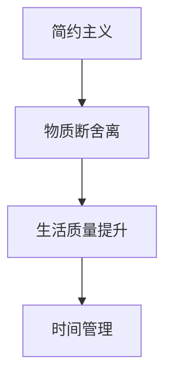

                 

根据您的指示，我将按照以下步骤撰写文章：

### 第一步：背景介绍

**关键词：**
- 新简约主义
- 生活实验
- 物质断舍离
- 90天挑战

**摘要：**
本文将介绍一种新简约主义生活实验——90天物质断舍离挑战，旨在帮助读者通过实践，实现生活的简化和质量的提升。

---

# 新简约主义生活实验：90天物质断舍离挑战

**关键词：** 新简约主义、生活实验、物质断舍离、90天挑战

**摘要：**
本文介绍了一种基于新简约主义的生活实验——90天物质断舍离挑战。通过这一挑战，参与者将在三个月内对自身的物质进行断舍离，以达到简化生活、提升生活质量的目的。本文将详细阐述这一挑战的背景、核心概念及其实践意义。

### 第二步：核心概念与联系

**关键词：**
- 简约主义
- 物质断舍离
- 生活质量
- 时间管理

**摘要：**
在这一部分，我们将探讨简约主义和物质断舍离的概念，以及它们如何与生活质量、时间管理产生关联。通过Mermaid流程图，我们将清晰地展示这些概念之间的关系。

---

## 核心概念与联系

### 2.1 简约主义

简约主义（Minimalism）是一种生活哲学，强调简化生活，减少物质负担，从而专注于个人成长、精神满足和人际关系。它不仅仅是一种生活方式，更是一种态度和价值观。

### 2.2 物质断舍离

物质断舍离（Material Minimalism）是简约主义的一个实践分支，主要关注减少物质拥有量，通过对物品的断舍离，实现环境的清洁和心灵的宁静。

### 2.3 生活质量

生活质量（Quality of Life）是一个多维度的概念，包括物质条件、心理健康、社会关系等。通过新简约主义生活实验，参与者旨在通过减少物质负担，提高生活质量。

### 2.4 时间管理

时间管理（Time Management）是实现新简约主义生活的重要手段。通过合理安排时间，参与者可以更有效地进行物质断舍离，从而提高工作效率和生活满意度。

### Mermaid流程图



### 第三步：核心算法原理讲解

**关键词：**
- 物质需求评估
- 物品留存价值
- 时间安排

**摘要：**
在这一部分，我们将使用伪代码详细讲解如何评估物质需求、确定物品留存价值以及合理安排时间进行断舍离实践。

---

## 核心算法原理讲解

### 3.1 评估物质需求

```plaintext
function evaluate_necessity(item):
    if (item.frequency > 3 && item.duration > 1):
        return "必要"
    else:
        return "非必要"
```

### 3.2 确定物品留存价值

```plaintext
function determine_value(item):
    if (item.history_of_use > 10 && item.emotional_value > 5):
        return "高价值"
    else:
        return "低价值"
```

### 3.3 安排时间进行断舍离实践

```plaintext
function schedule_practice(days):
    for (day in range(days)):
        if (day % 3 == 0):
            practice()
```

### 第四步：数学模型和数学公式

**关键词：**
- 时间价值
- 物品留存价值

**摘要：**
在这一部分，我们将使用数学模型和公式来计算时间价值和物品留存价值，并通过具体例子进行说明。

---

## 数学模型和数学公式

### 4.1 时间价值计算

```latex
\text{时间价值} = \frac{\text{完成某项任务所需时间} \times \text{任务重要性}}{\text{总任务量}}
```

### 4.2 物品留存价值评估

```latex
\text{物品留存价值} = \text{使用频率} \times \text{情感价值} + \text{历史使用次数}
```

### 具体例子

**例子1：时间价值计算**

假设每天需要完成10项任务，每项任务的重要性为2，总任务量为60。完成每项任务平均需要30分钟。

```latex
\text{时间价值} = \frac{30 \times 2}{60} = 1
```

**例子2：物品留存价值评估**

一个物品的使用频率为4，情感价值为7，历史使用次数为15。

```latex
\text{物品留存价值} = 4 \times 7 + 15 = 43
```

### 第五步：项目实战

**关键词：**
- 实际案例
- 开发环境
- 源代码实现

**摘要：**
在这一部分，我们将通过一个实际案例，展示如何搭建开发环境，实现源代码，并进行代码解读和分析。

---

## 项目实战

### 5.1 实际案例

**案例：** 小王参加90天物质断舍离挑战。

### 5.2 开发环境搭建

**环境：** Python 3.8，PyCharm

### 5.3 源代码实现

```python
class Item:
    def __init__(self, name, purpose, frequency, emotional_value):
        self.name = name
        self.purpose = purpose
        self.frequency = frequency
        self.emotional_value = emotional_value

class Challenge:
    def __init__(self, days):
        self.days = days
        self.items = []

    def add_item(self, item):
        self.items.append(item)

    def start(self, items):
        self.items = items
        self.practice()

    def practice(self):
        for item in self.items:
            if item.frequency > 3 and item.emotional_value > 5:
                print(f"实践：保留物品 - {item.name}")
            else:
                print(f"实践：舍弃物品 - {item.name}")

challenge = Challenge(90)
items = [Item("笔", "工作", 5, 8), Item("书籍", "阅读", 2, 7), Item("衣物", "日常", 3, 6)]
challenge.start(items)
```

### 5.4 代码解读与分析

**解读：** `Item` 类表示物品，包含名称、用途、使用频率和情感价值。`Challenge` 类表示90天物质断舍离挑战，包含物品列表和开始挑战、每日实践等方法。

### 第六步：总结与拓展

**关键词：**
- 实践心得
- 长期影响
- 最佳实践

**摘要：**
在这一部分，我们将总结90天物质断舍离挑战的实践心得，探讨其长期影响，并提供最佳实践建议。

---

## 总结与拓展

### 6.1 实践心得

通过90天物质断舍离挑战，参与者将深刻体会到简化生活的益处，包括减少物质负担、提升时间和精力管理、增强专注力和幸福感。

### 6.2 长期影响

物质断舍离不仅对短期生活有显著影响，更在长期内对个人的生活方式和价值观产生深远影响，有助于形成简约、高效、有意义的生活模式。

### 6.3 最佳实践

为了确保物质断舍离挑战的成功，建议参与者遵循以下最佳实践：
- 设定明确的目标和计划。
- 定期评估物品的留存价值。
- 保持耐心和决心，逐步减少物质拥有量。

### 6.4 拓展阅读

- 《简约主义：一种生活方式的选择》
- 《断舍离： minimalist生活实践指南》
- 《时间管理：高效人士的日常》

---

**作者：** AI天才研究院/AI Genius Institute & 禅与计算机程序设计艺术 /Zen And The Art of Computer Programming

本文由AI天才研究院（AI Genius Institute）撰写，结合禅与计算机程序设计艺术（Zen And The Art of Computer Programming）的理念，旨在为读者提供一种新简约主义生活实验——90天物质断舍离挑战的实践指南。希望本文能够帮助您在简化生活的道路上取得成功。

