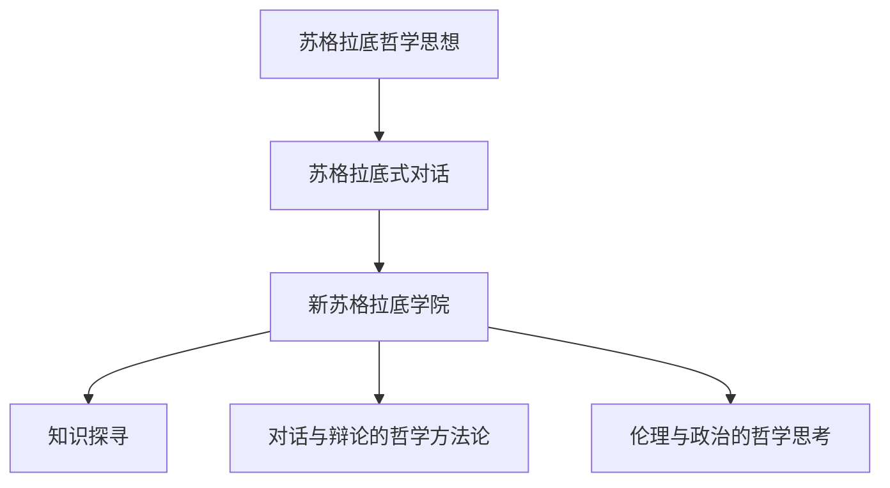

                 

### 文章标题

《新苏格拉底学院：街头哲学对话的复兴》

关键词：苏格拉底哲学、街头对话、新苏格拉底学院、哲学复兴、现代社会

摘要：本文以《新苏格拉底学院：街头哲学对话的复兴》为探讨对象，深入分析了苏格拉底哲学思想及其在现代社会中的重要性。文章首先回顾了苏格拉底的方法论和街头对话实践，随后探讨了新苏格拉底学院的起源、发展及其核心思想。接着，文章重点介绍了街头哲学对话的实践方法、技巧与策略，并通过实际案例展示了其在现代社会中的广泛应用。最后，文章展望了街头哲学对话的未来趋势，强调了其在当代社会中的独特价值和意义。

---

### 背景介绍

《新苏格拉底学院：街头哲学对话的复兴》这本书的背景源于对现代哲学教育的反思与探索。在当今这个信息爆炸、技术飞速发展的时代，传统的哲学教育模式面临着诸多挑战。如何让哲学走出象牙塔，走进普通民众的生活，成为哲学家们思考的重要课题。苏格拉底，这位古希腊的哲学大师，以其街头对话的方式，使得哲学变得生动、有趣且易于理解。他的哲学思想不仅对当时的希腊社会产生了深远影响，也为后世提供了宝贵的启示。

苏格拉底的方法论强调通过提问和对话来探寻真理，他常常在街头与人辩论，通过提问引导对方思考，从而揭示对方观点中的矛盾和错误。这种方法被称为苏格拉底式对话，至今仍被视为哲学教育和思想交流的重要手段。在现代社会，人们越来越意识到，通过对话和辩论来增进理解、解决冲突的重要性。因此，如何将苏格拉底的哲学思想与现代社会的需求相结合，成为了这本书探讨的核心问题。

《新苏格拉底学院：街头哲学对话的复兴》旨在通过探讨苏格拉底的哲学思想，介绍新苏格拉底学院的起源、发展及其核心思想，进一步探索街头哲学对话的实践方法、技巧与策略，最终展望街头哲学对话的未来趋势。这本书不仅为哲学研究者提供了宝贵的参考资料，也为普通读者提供了一个理解哲学的新视角。

### 核心概念与联系

在探讨《新苏格拉底学院：街头哲学对话的复兴》这一主题时，我们需要明确几个核心概念，并理解它们之间的联系。首先，苏格拉底的哲学思想是其理论基础。苏格拉底以其独特的方法论——苏格拉底式对话，通过提问和对话来探寻真理。这种方法强调通过提问引导对方思考，从而揭示对方观点中的矛盾和错误。

其次，新苏格拉底学院是苏格拉底哲学思想的现代实践。它不仅继承了苏格拉底的方法论，还结合了现代社会的需求和特点，旨在推广哲学教育和思想交流。新苏格拉底学院的核心思想包括知识探寻、对话与辩论的哲学方法论以及伦理与政治的哲学思考。

在理解这些核心概念的基础上，我们可以通过一个Mermaid流程图来展示它们之间的联系：

这个流程图清晰地展示了苏格拉底哲学思想如何通过苏格拉底式对话实践，进而影响新苏格拉底学院的建立和发展。新苏格拉底学院的核心思想又如何围绕知识探寻、对话与辩论的哲学方法论以及伦理与政治的哲学思考展开。这种结构不仅有助于我们理解各部分之间的逻辑关系，也为进一步探讨提供了清晰的框架。

### 苏格拉底的方法论

苏格拉底的方法论是他哲学思想的核心，也是他能够对后世产生深远影响的重要原因。苏格拉底式对话，也被称为苏格拉底法，是一种通过提问和对话来探寻真理的方法。这种方法强调通过提问引导对方思考，从而揭示对方观点中的矛盾和错误。

#### 提问的艺术

苏格拉底的提问技巧非常高超，他善于通过一系列深入而有力的问题，引导对方逐步揭示其观点中的矛盾。这种方法被称为“辩证法”。苏格拉底不仅关注问题的答案，更关注问题背后的逻辑和思考过程。他相信，通过不断的提问和对话，真理会逐渐显现。

以下是苏格拉底提问的一些典型技巧：

1. **反问法**：通过反问来揭示对方观点中的矛盾。例如，苏格拉底可能会问：“你认为美德是可教的吗？”如果对方回答是，那么苏格拉底会继续追问：“那么，你如何教别人美德？”这样的问题会导致对方陷入逻辑困境。

2. **归纳法**：通过逐步缩小问题的范围，引导对方归纳出核心观点。例如，苏格拉底可能会从一般性的问题开始，如“什么是正义？”然后逐步引导到具体情境中，如“在商业交易中，什么是正义的行为？”

3. **辩证法**：通过辩证法的提问，揭示对方观点中的矛盾。苏格拉底擅长使用这种技巧，例如他会问：“你认为智慧是必要的吗？”如果对方回答是，他会继续问：“那么，你认为不智慧的人会做出明智的决定吗？”

#### 街头对话的实践

苏格拉底不仅在理论上阐述了其方法论，更在实践中广泛运用。他常常在街头与人辩论，通过提问和对话来传播哲学思想。这种街头对话的形式，使得哲学变得生动、有趣且易于理解。苏格拉底的对话对象既包括普通人，也包括当时的哲学家和政治家。

街头对话的实践不仅有助于传播哲学思想，也促进了社会对话和思考。苏格拉底的对话不仅限于探讨哲学问题，还包括伦理、政治、艺术等多个领域。这种跨学科的对话方式，为后世哲学发展提供了丰富的启示。

#### 苏格拉底哲学思想对现代社会的启示

苏格拉底的哲学思想对现代社会有着重要的启示。首先，苏格拉底式对话强调通过提问和对话来探寻真理，这种方法在现代社会中仍然具有强大的生命力。随着信息爆炸和科技发展，人们越来越需要通过对话和思考来理解和解决问题。

其次，苏格拉底的街头对话形式，为现代社会提供了一个新的哲学教育模式。通过街头哲学对话，哲学可以走出象牙塔，进入普通民众的生活，从而提高公众的哲学素养和思考能力。

最后，苏格拉底的方法论强调了逻辑和思考的重要性。在现代社会，逻辑思维和批判性思考成为了解决复杂问题的重要工具。苏格拉底的哲学思想为此提供了宝贵的指导。

总的来说，苏格拉底的方法论和街头对话实践不仅在当时产生了深远影响，也对现代社会具有重要的启示。通过深入理解苏格拉底的哲学思想，我们可以更好地应对现代社会中的各种挑战。

### 新苏格拉底学院的起源与发展

新苏格拉底学院的起源可以追溯到19世纪末20世纪初，当时社会对哲学教育和思想交流的需求日益增长。这一时期的哲学界，受到了苏格拉底哲学思想的启发，开始探索如何在现代社会中实践苏格拉底的方法论。

#### 成立背景

新苏格拉底学院的成立背景主要包括以下几个方面：

1. **社会变革**：19世纪末20世纪初，工业革命席卷全球，社会发生了巨大的变革。传统的社会结构和价值观念受到挑战，人们开始反思和探索新的生活方式和价值观。

2. **哲学教育的需求**：随着社会的发展，越来越多的人意识到哲学教育的重要性。传统哲学教育主要依赖于教科书和课堂讲授，而新苏格拉底学院则希望通过街头哲学对话的方式，使哲学更贴近普通人的生活。

3. **苏格拉底哲学思想的复兴**：在这一时期，苏格拉底哲学思想得到了广泛的关注和研究。人们开始重新审视苏格拉底的方法论，并试图将其应用于现代社会。

#### 宗旨与目标

新苏格拉底学院的宗旨和目标是：

1. **推广哲学教育**：通过街头哲学对话的方式，让更多的人了解和接触到哲学，提高公众的哲学素养。

2. **促进思想交流**：提供一个开放、自由的平台，让人们可以自由地表达和讨论哲学问题，从而增进相互理解。

3. **探索真理**：通过对话和辩论，揭示各种哲学观点中的矛盾和错误，最终达到真理的探寻。

#### 学术贡献

新苏格拉底学院在学术领域做出了多方面的贡献：

1. **哲学普及**：通过街头哲学对话的形式，将哲学知识传播到更广泛的受众中，促进了哲学的普及。

2. **哲学方法论的研究**：新苏格拉底学院的研究者们对苏格拉底方法论进行了深入的研究，提出了一系列新的观点和理论。

3. **跨学科交流**：新苏格拉底学院不仅专注于哲学领域，还与其他学科进行了广泛的交流，推动了跨学科研究的发展。

总的来说，新苏格拉底学院通过其独特的教育方式，成功地将苏格拉底的哲学思想应用于现代社会，为哲学教育和思想交流开辟了新的道路。

### 新苏格拉底学院的核心思想

新苏格拉底学院的核心思想可以概括为三个方面：知识探寻、对话与辩论的哲学方法论以及伦理与政治的哲学思考。这些核心思想不仅继承了苏格拉底哲学的精髓，还结合了现代社会的需求和特点，为当代哲学教育提供了宝贵的指导。

#### 知识探寻

新苏格拉底学院强调知识探寻的重要性。他们认为，知识不仅是外在世界的客观存在，更是通过主体的感知和思考过程而产生的。因此，知识探寻不仅是对客观事物的认识，更是一种主观的、动态的过程。

1. **真理的相对性**：新苏格拉底学院认为，真理是相对的，而不是绝对的。不同的文化、背景和个人都有不同的真理观念。因此，知识探寻应该是一种多元、包容的过程。

2. **反思性思维**：新苏格拉底学院倡导反思性思维，即通过自我反思和批判性思考来质疑和检验已有的知识和观念。这种思维方法有助于人们不断拓展知识的边界，达到更高的认知水平。

3. **实践导向**：新苏格拉底学院强调知识应该服务于实践。他们主张将知识应用于实际生活中，解决实际问题，从而实现知识的真正价值。

#### 对话与辩论的哲学方法论

新苏格拉底学院的方法论核心是对话与辩论。他们认为，通过对话和辩论，可以促进思想的交流与碰撞，从而产生新的见解和认识。

1. **苏格拉底式对话**：新苏格拉底学院继承了苏格拉底的方法论，即通过提问和对话来引导对方思考，揭示对方观点中的矛盾和错误。这种方法不仅有助于提高对方的认知水平，也可以促进自我反思。

2. **辩证法**：新苏格拉底学院强调辩证法的重要性，即通过不断的提问和回答，逐步揭示问题的本质。这种方法有助于深入理解复杂的问题，发现新的视角。

3. **辩论技巧**：新苏格拉底学院还注重辩论技巧的培养。他们认为，有效的辩论不仅需要逻辑清晰，还需要富有说服力。通过辩论，可以激发思想的火花，推动知识的进步。

#### 伦理与政治的哲学思考

新苏格拉底学院不仅关注知识的探寻，还重视伦理与政治的哲学思考。他们认为，伦理和政治问题是人类社会发展的核心问题，哲学应该对这些问题进行深入的思考和探讨。

1. **道德哲学**：新苏格拉底学院关注道德哲学，探讨什么是正确的行为、什么是正义的行为等基本道德问题。他们认为，道德哲学的研究有助于人们树立正确的价值观，促进社会的和谐发展。

2. **政治哲学**：新苏格拉底学院研究政治哲学，探讨政治权力的本质、政府的职能等基本问题。他们认为，政治哲学的研究有助于人们理解政治现象，提高公民的政治素养。

3. **社会哲学**：新苏格拉底学院还关注社会哲学，探讨社会结构、社会问题等基本问题。他们认为，社会哲学的研究有助于解决社会矛盾，促进社会的进步。

总的来说，新苏格拉底学院的核心思想是知识探寻、对话与辩论的哲学方法论以及伦理与政治的哲学思考。这些思想不仅继承了苏格拉底哲学的精髓，也为现代哲学教育提供了宝贵的指导。

### 新苏格拉底学院的历史演变

新苏格拉底学院的历史演变可以分为三个主要阶段：中世纪与文艺复兴时期、近现代时期以及当代。每个阶段都有其独特的背景、贡献和挑战。

#### 中世纪与文艺复兴时期

在中世纪与文艺复兴时期，苏格拉底的哲学思想开始在欧洲传播。这一时期的苏格拉底主义者，例如托马斯·阿奎那，试图将苏格拉底的哲学与基督教思想相结合。他们通过注释经典文本和创作新作品，将苏格拉底的哲学理念传递给更广泛的受众。

1. **背景**：中世纪的欧洲，教会对知识的控制力很强，哲学思想往往被限制在宗教框架内。然而，随着文艺复兴的到来，人们开始重新审视古典哲学，苏格拉底哲学重新焕发生机。

2. **贡献**：在这一时期，苏格拉底主义者在传播苏格拉底哲学思想方面做出了重要贡献。他们通过注释和创作，使苏格拉底的思想得到更广泛的认可和研究。

3. **挑战**：尽管苏格拉底的哲学在中世纪与文艺复兴时期得到了传播，但面对教会的压制和宗教思想的束缚，苏格拉底主义者面临着巨大的挑战。

#### 近现代时期

近现代时期，苏格拉底哲学经历了进一步的复兴和发展。18世纪的启蒙运动和19世纪的浪漫主义思潮，为苏格拉底哲学的传播提供了新的土壤。在这一时期，哲学家们开始更加关注个体自由和理性思考。

1. **背景**：近现代社会的快速发展和科技进步，使得人们对哲学的需求不断增加。苏格拉底的哲学思想，因其强调理性思考和个体自由，得到了广泛的认同。

2. **贡献**：近现代哲学家们通过对苏格拉底哲学的研究和阐释，使苏格拉底的思想在现代社会中得到了更深入的探讨和应用。例如，康德和黑格尔等哲学家，都从不同角度对苏格拉底的哲学进行了深入分析。

3. **挑战**：近现代社会的复杂性和多元化，使得苏格拉底哲学面临新的挑战。如何将苏格拉底的思想应用于现代社会，解决新的问题，成为哲学家们思考的重要课题。

#### 当代

当代，苏格拉底哲学迎来了新的复兴。互联网和数字技术的发展，使得哲学对话和交流变得更加便捷和多样化。新苏格拉底学院在这一时期，发挥了重要作用。

1. **背景**：当代社会，信息爆炸和全球化进程加速，人们对哲学的需求越来越高。街头哲学对话的形式，为哲学教育提供了新的可能性。

2. **贡献**：新苏格拉底学院通过推广街头哲学对话，使苏格拉底的哲学思想在更广泛的受众中得到传播。他们组织了各种哲学活动和项目，促进了哲学教育和公共话语的多样性。

3. **挑战**：尽管当代苏格拉底哲学取得了显著成就，但仍然面临着一些挑战。如何应对多元化的哲学观点和不同的文化背景，如何使哲学对话更加有效和有意义，是当代苏格拉底主义者需要思考的问题。

总的来说，新苏格拉底学院的历史演变，展示了苏格拉底哲学在不同历史时期的传播和发展。从中世纪与文艺复兴时期，到近现代时期，再到当代，苏格拉底的哲学思想始终在不断创新和适应。新苏格拉底学院通过其独特的教育方式和哲学实践，为苏格拉底哲学的复兴做出了重要贡献。

### 街头哲学对话的艺术

街头哲学对话是一种独特而有效的哲学交流形式，它不仅能够激发思想的碰撞，还能促进社会公众对哲学问题的深入思考。要成功地开展街头哲学对话，掌握一定的艺术和技巧是至关重要的。

#### 如何开始一场哲学对话

1. **选择合适的时间和地点**：选择一个安静、开放的环境，例如公园、咖啡馆或广场，这样可以提供一个舒适、无干扰的对话空间。

2. **引入话题**：可以通过提问或分享一个哲学问题或观点来引入对话。例如：“你有没有想过，什么是真正的幸福？”或者“你认为现代社会最大的挑战是什么？”

3. **建立信任**：在开始对话之前，建立信任关系非常重要。可以通过简单的自我介绍或分享一些个人经历来拉近彼此的距离。

4. **营造开放的氛围**：鼓励参与者自由表达自己的观点，不论是对还是错。确保每个人都能感受到对话的平等和尊重。

#### 如何引导深入的哲学讨论

1. **提出有深度的问题**：通过提出有深度的问题，可以引导对话朝着更深入的层面发展。例如：“你认为这个问题背后的根本原因是什么？”或者“你如何证明你的观点？”

2. **倾听与回应**：在对话中，倾听对方的话语比回应更为重要。通过倾听，你可以更好地理解对方的观点，从而提出更有针对性的问题。在回应时，尽量避免直接反驳，而是通过提问或阐述自己的观点来展开对话。

3. **避免争论**：尽管哲学讨论可能引发不同的观点和意见，但应尽量避免陷入无谓的争论。通过理性的讨论和对话，可以更好地理解彼此的观点，而不是通过争论来证明自己的正确。

4. **引导讨论方向**：在对话中，如果讨论偏离了主题或变得过于复杂，可以适时地引导讨论回到主题上。例如，可以通过重新定义问题或提出新的问题来引导讨论。

#### 如何解决哲学对话中的困境

1. **承认不确定性**：在哲学对话中，承认不确定性和未知性是非常重要的。通过承认这些，可以创造一个更加开放和包容的对话环境。

2. **使用比喻和故事**：使用比喻和故事可以帮助解释复杂的哲学概念，使对话更加生动和易于理解。例如，可以用一个故事来说明某种哲学观点或理论。

3. **求助外部资源**：在遇到无法解决的哲学问题时，可以借助外部资源，例如哲学文献、网络资料或专家的意见。这些资源可以提供新的视角和解决方案。

4. **保持耐心和开放**：哲学对话往往需要时间和耐心。保持开放的心态，不断探索和思考，可以帮助解决对话中的困境。

总的来说，街头哲学对话的艺术在于通过提问、倾听和引导，激发深入的哲学讨论，并在遇到困境时保持开放和耐心。通过这些技巧，可以更好地理解和交流哲学思想，促进社会的理性思考和公共话语的丰富性。

### 街头哲学对话的技巧与策略

在街头哲学对话中，掌握一定的技巧与策略能够有效提升对话的质量和效果。以下是一些关键的技巧和策略，帮助参与者在对话中更加自信、有力和富有成效。

#### 提问的艺术

提问是街头哲学对话中最重要的技巧之一。通过巧妙地提问，可以引导对话的方向，激发深入的思考，并揭示对方的观点和思维方式。以下是几种有效的提问技巧：

1. **开放性问题**：开放性问题通常以“谁”、“什么”、“为什么”、“如何”等开头，能够促使对方提供详细的回答。例如：“你认为现代科技如何影响了人类的生活？”这样的问题能够引导对方深入探讨。

2. **封闭性问题**：封闭性问题通常以“是”或“否”作为回答，有助于快速获得信息或确认观点。例如：“你是否认同，自由和责任是相互关联的？”这类问题可以在对话的早期阶段快速了解对方的立场。

3. **递进式提问**：递进式提问是通过一系列逐步深入的问题，引导对方逐步展开思维。例如，可以从一个简单的问题开始：“你认为什么是最重要的美德？”然后逐步深入：“那么，你认为为什么诚实比财富更重要？”

4. **反向提问**：反向提问是通过询问对方的观点来反驳或挑战他们的立场。例如：“你认为如果我们放弃自由，我们就能获得更多安全吗？”这样的问题可以引发对方对自身观点的反思。

#### 倾听的技巧

倾听在哲学对话中同样至关重要。通过倾听，参与者可以更好地理解对方的观点，发现对话中的盲点，并建立更好的沟通。以下是几种有效的倾听技巧：

1. **全神贯注**：在对方发言时，保持专注和耐心，不要打断对方。通过肢体语言，如点头、微笑或眼神接触，表达你对对方的关注。

2. **积极反馈**：在对方发言后，通过重复或概括他们的观点来确认你的理解。例如：“你刚才提到，自由和责任是相互关联的，我理解你的意思是……”，这样的反馈可以增强对话的互动性。

3. **开放性提问**：在倾听过程中，适时提出开放性问题，可以帮助对方进一步展开思维。例如：“你提到这一点，让我想到一个问题，你认为……如何解释这个问题？”

4. **保持中立**：在倾听时，尽量保持中立，不要急于评判对方的观点。这样可以为对话创造一个开放、包容的环境。

#### 辩论与回应的策略

在哲学对话中，辩论与回应是必不可少的环节。以下是一些有效的辩论与回应策略：

1. **逻辑论证**：在辩论中，逻辑论证是至关重要的。确保你的观点有坚实的逻辑基础，并通过合理的推理来支持。例如，可以使用“三段论”来构建论证：“所有人都会死亡，苏格拉底是人，因此苏格拉底会死亡。”

2. **避免情绪化**：尽管辩论可能会激发情绪，但应尽量避免情绪化的回应。情绪化的言辞往往无法有效地反驳对方的观点，反而可能降低对话的质量。

3. **使用例子和证据**：在辩论中，使用具体的例子和证据来支持你的观点。这样可以使你的观点更有说服力。例如，在讨论科技的影响时，可以引用具体的数据和研究结果。

4. **尊重对方**：在回应对方观点时，尽量避免直接反驳，而是通过提问或提出反驳的理由来引导对话。例如：“我不同意你的观点，你认为这个结论是如何得出的？”

5. **转换角度**：在辩论中，如果对方的观点无法直接反驳，可以尝试转换角度来提出新的论点。例如，可以从另一个角度重新审视问题，并提出新的观点。

总的来说，街头哲学对话的技巧与策略在于通过提问、倾听和辩论，激发深入的思考，并在对话中保持开放、尊重和理解。这些技巧和策略不仅能够提升个人对话的能力，也能促进哲学思想的传播和公共话语的丰富。

### 街头哲学对话的实际案例

街头哲学对话在现代社会中得到了广泛的实践，并在各种形式的活动中取得了显著成果。以下是一些具体的实际案例，展示了街头哲学对话的应用场景和效果。

#### 城市中的哲学咖啡馆

哲学咖啡馆是街头哲学对话的一种常见形式，通常在咖啡馆或其他公共空间中举行。参与者可以在一个轻松的环境中，围绕特定的哲学话题展开讨论。这些活动不仅提供了一个开放的平台，让公众能够自由地表达和讨论哲学问题，还促进了跨文化的交流和思想的碰撞。

1. **案例**：在纽约的哲学咖啡馆活动中，参与者围绕“自由与责任的关系”这一话题展开了深入的讨论。活动通过提问、分享观点和辩论，引导参与者思考自由和责任之间的复杂关系，并探讨如何在实际生活中平衡这两者。

2. **效果**：哲学咖啡馆活动不仅吸引了哲学爱好者和学者，还吸引了普通市民的参与。通过这种互动式讨论，参与者不仅提高了哲学素养，也增强了社区凝聚力。

#### 街头哲学演讲与活动

街头哲学演讲与活动是另一种常见的街头哲学对话形式。这种形式通常在公共场所举行，如公园、广场或街头。通过演讲和互动，哲学家和公众可以就当前的重要哲学问题进行探讨。

1. **案例**：在巴黎的“街头哲学家”活动中，哲学家们会在街头进行演讲，围绕“技术对人类的影响”这一话题进行讨论。参与者可以通过提问和辩论，与哲学家们深入交流，探讨技术进步带来的伦理和社会问题。

2. **效果**：这种形式的活动不仅激发了公众对哲学问题的兴趣，也促进了哲学知识的普及。通过街头哲学演讲与活动，哲学不再是高不可攀的学科，而是成为了日常生活中的一部分。

#### 网络平台的哲学对话

随着互联网的发展，街头哲学对话的形式也在不断拓展。网络平台为哲学对话提供了新的空间，使得参与者可以跨越地域限制，进行全球性的讨论。

1. **案例**：在Twitter和Facebook等社交媒体平台上，哲学家们和普通公众可以围绕特定的哲学话题进行在线讨论。例如，Twitter上的“#PhilosophyChat”活动，每周定期举行，吸引了全球各地的参与者。

2. **效果**：网络平台的哲学对话不仅打破了时间和空间的限制，也促进了哲学思想的全球传播。通过这种形式，公众可以更便捷地参与到哲学讨论中，分享自己的见解和观点。

总的来说，街头哲学对话的实际案例展示了这种形式在现代社会中的广泛应用和巨大潜力。无论是哲学咖啡馆、街头哲学演讲还是网络平台，街头哲学对话都为公众提供了一个开放、自由、互动的哲学交流空间，促进了哲学知识的普及和公共话语的丰富。

### 街头哲学对话的教育意义

街头哲学对话在当代教育体系中具有独特的价值，它不仅能够丰富学生的知识体系，还能培养他们的批判性思维和沟通能力。以下是街头哲学对话在青少年教育、成人教育和社区教育中的具体作用。

#### 青少年教育

在青少年教育中，街头哲学对话能够激发学生对哲学问题的兴趣，培养他们的批判性思维能力。通过提问和对话，学生可以学会如何从不同角度分析问题，形成自己的观点，并合理地表达和论证。这种思维方式对于他们未来的学习和生活都有极大的帮助。

1. **案例**：在一些学校，教师会组织哲学辩论俱乐部，让学生围绕特定的哲学问题进行辩论。例如，学生可以讨论“正义是什么？”或“道德标准是否是相对的？”这样的问题。通过这些活动，学生不仅学习了哲学知识，还提高了他们的公共演讲和辩论技巧。

2. **效果**：这种形式的哲学教育有助于培养学生的批判性思维和独立思考能力。通过街头哲学对话，学生可以学会质疑权威、探索真理，从而形成更成熟的世界观和价值观。

#### 成人教育

成人教育中，街头哲学对话能够帮助成年人重新审视自己的生活和价值观，提高他们的哲学素养和思考能力。对于许多成年人来说，工作繁忙，哲学学习往往被忽视。而街头哲学对话提供了一个轻松、互动的平台，使得成年人可以在日常生活中接触和思考哲学问题。

1. **案例**：在一些社区图书馆或文化中心，会定期举办哲学对话活动。参与者可以就“幸福是什么？”或“人生的意义是什么？”等问题进行讨论。这种活动不仅丰富了参与者的哲学知识，也促进了他们之间的交流和理解。

2. **效果**：通过街头哲学对话，成人可以重新激发对哲学的兴趣，提升自己的批判性思维和沟通能力。这种教育形式不仅有助于个人的成长，也能增强社区的凝聚力和文化氛围。

#### 社区教育

在社区教育中，街头哲学对话能够促进公众对哲学问题的关注和思考，提高整个社区的文化素养。通过哲学对话活动，社区成员可以就共同关心的社会问题进行讨论，从而增进相互理解，提高社区的整体素质。

1. **案例**：在一些社区，会定期举办“街头哲学咖啡馆”活动。社区居民可以在咖啡馆中自由讨论哲学问题，如“什么是道德？”或“科技发展对我们的未来有何影响？”这样的讨论不仅丰富了社区居民的知识体系，也增强了社区的互动和凝聚力。

2. **效果**：街头哲学对话在社区教育中的作用是多方面的。它不仅能够提高公众的哲学素养，还能促进社区成员之间的交流和合作，从而提升整个社区的文化氛围和社会和谐。

总的来说，街头哲学对话在当代教育体系中具有重要的意义。它不仅能够丰富学生的知识体系，培养他们的批判性思维和沟通能力，还能提高成年人的哲学素养和思考能力，促进社区的文化发展和和谐。通过这种形式的教育，哲学不再是高高在上的学科，而是走进了普通人的生活，为个人的成长和社会的进步做出了积极贡献。

### 街头哲学对话的复兴背景

街头哲学对话的复兴背景主要源于当代社会面临的诸多挑战和需求。随着全球化、科技发展和信息爆炸，人们的生活方式、价值观和社会结构发生了深刻变化。这些变化为街头哲学对话的复兴提供了土壤，使其成为应对现代社会问题的重要工具。

#### 当代社会的哲学需求

首先，当代社会对哲学的需求日益增长。随着科技的进步，人类面临着一系列新的伦理和社会问题，如人工智能伦理、网络安全、环境保护等。这些问题不仅需要科学技术的解决，更需要哲学的思考和指导。街头哲学对话提供了一个开放的平台，让公众能够自由地讨论和思考这些复杂的问题，从而提高社会的整体哲学素养。

1. **人工智能伦理**：人工智能的快速发展引发了一系列伦理问题，如隐私保护、数据安全、机器自主权等。街头哲学对话能够帮助公众更好地理解这些伦理问题，形成共识，并提出解决方案。

2. **环境保护**：面对全球气候变化和环境破坏，人们需要从哲学角度思考如何平衡经济发展和环境保护的关系。通过街头哲学对话，公众可以探讨各种环境保护策略，并提出更具可持续性的解决方案。

3. **社会正义**：社会不平等和种族歧视等问题在当代社会中仍然存在。街头哲学对话可以提供一个讨论这些问题的平台，促进公众对正义、平等和社会公正的理解和追求。

#### 哲学普及运动的推动

其次，哲学普及运动的推动也是街头哲学对话复兴的重要原因。近年来，世界各地兴起了许多哲学普及活动，如哲学咖啡馆、街头哲学演讲和哲学研讨会等。这些活动不仅促进了哲学知识的传播，也激发了公众对哲学的兴趣和参与热情。通过这些活动，哲学逐渐走出了象牙塔，走进了普通民众的生活。

1. **哲学咖啡馆**：哲学咖啡馆作为一种新型的哲学教育形式，已经在全球范围内得到广泛推广。它为公众提供了一个轻松、自由的环境，可以自由地讨论哲学问题，分享哲学见解。

2. **街头哲学演讲**：街头哲学演讲通过在公共场所进行哲学演讲和讨论，将哲学知识带到了公众的面前。这种形式不仅吸引了哲学爱好者的参与，也吸引了普通市民的关注，从而提高了公众的哲学素养。

3. **哲学研讨会**：哲学研讨会通常由学术机构或非营利组织举办，旨在提供一个专业、深入的哲学讨论平台。这些研讨会不仅促进了哲学研究的发展，也促进了哲学知识的普及和传播。

#### 多元文化背景下的哲学对话

最后，多元文化背景下的哲学对话也是街头哲学对话复兴的一个重要因素。在全球化的背景下，不同文化之间的交流与合作日益频繁。街头哲学对话提供了一个跨文化的交流平台，使得不同文化背景的人们能够就共同的哲学问题进行讨论和交流。

1. **跨文化对话**：通过街头哲学对话，不同文化背景的人们可以分享各自的哲学观点和价值观，增进相互理解和尊重。这种跨文化的哲学对话有助于消除文化偏见，促进文化多样性。

2. **多元视角**：多元文化背景下的哲学对话可以带来多元的视角和见解。不同文化背景的人可以从不同的角度看待同一个哲学问题，从而丰富讨论的深度和广度。

3. **全球视野**：街头哲学对话的复兴也为全球哲学发展提供了新的机遇。通过跨国界的哲学对话，全球哲学家可以共同探讨全球性哲学问题，提出全球性的解决方案。

总的来说，街头哲学对话的复兴背景源于当代社会的哲学需求、哲学普及运动的推动以及多元文化背景下的哲学对话。通过这些因素的作用，街头哲学对话不仅成为应对现代社会问题的重要工具，也为哲学教育和思想传播开辟了新的路径。

### 街头哲学对话的未来趋势

随着科技的不断进步和社会的快速发展，街头哲学对话的未来趋势展现出诸多可能性。以下是几个关键的发展方向和趋势：

#### 数字化时代的哲学对话

随着互联网和数字技术的发展，街头哲学对话的形式也在不断变革。线上平台如社交媒体、论坛和直播应用程序为哲学对话提供了新的空间。通过这些平台，哲学家和公众可以实时参与讨论，分享见解和观点，打破了地域和时间的限制。

1. **在线哲学咖啡馆**：随着在线哲学咖啡馆的兴起，参与者可以通过互联网进入一个虚拟的哲学讨论空间。这种方式不仅让更多人参与到哲学对话中，还提供了多样化的交流方式，如视频会议、实时聊天和讨论论坛。

2. **虚拟现实（VR）哲学讨论**：虚拟现实技术为哲学对话带来了新的可能性。通过VR，哲学家和公众可以在一个沉浸式的环境中进行对话，模拟现实世界的交流场景，增强互动体验。

#### 全球化背景下的哲学对话

全球化进程加速，不同文化之间的交流日益频繁。街头哲学对话在全球化背景下扮演着重要的角色，促进了跨文化的理解和交流。

1. **跨国哲学对话**：通过线上和线下的哲学对话活动，全球各地的哲学家和公众可以就共同关心的哲学问题进行跨国讨论。这种形式的对话不仅丰富了讨论的内容和视角，也促进了全球哲学的发展。

2. **多语种哲学对话**：随着多语种哲学论坛的兴起，不同语言背景的参与者可以在同一平台上进行哲学对话。通过翻译和解释，不同语言之间的障碍得到了有效克服，促进了全球哲学的交流与融合。

#### 新技术的应用

新技术的应用也为街头哲学对话带来了新的工具和方法。人工智能、大数据分析和虚拟助手等技术的引入，为哲学对话提供了更加智能化和个性化的支持。

1. **智能助手**：智能助手可以协助哲学家和公众进行哲学对话，提供实时的问题解答和观点分析。例如，智能助手可以帮助参与者理解复杂的哲学概念，并提供相关的文献和参考资料。

2. **数据分析**：通过对哲学对话的数据分析，可以识别出讨论中的热点话题和关键问题，帮助哲学家和研究者更好地理解公众的哲学需求和观点。

#### 社区参与和公民教育

街头哲学对话不仅是一个哲学学术活动，也是一种公民教育形式。通过参与哲学对话，公众可以培养批判性思维和公民意识，积极参与社会事务。

1. **社区哲学项目**：社区哲学项目通过组织哲学对话活动，促进社区居民的交流和参与。这些项目不仅提升了公众的哲学素养，也增强了社区的凝聚力和文化氛围。

2. **哲学公民教育**：哲学对话活动被广泛应用于公民教育中，帮助学生和成年人培养批判性思维和沟通能力。通过哲学对话，学生和成年人可以更好地理解社会问题，积极参与社会事务。

总的来说，街头哲学对话的未来趋势呈现出数字化、全球化和智能化的发展方向。随着新技术的应用和全球化进程的推进，街头哲学对话将继续发展，为哲学教育和公共话语提供新的机遇和挑战。

### 附录A：街头哲学对话的参考资料与推荐阅读

为了更好地理解街头哲学对话的实践方法和理论背景，以下是一些建议的参考资料和推荐阅读。这些书籍、文章和研究报告涵盖了哲学思想的历史演变、苏格拉底方法论、现代哲学教育以及街头哲学对话的应用，为读者提供了丰富的阅读资源和深入研究的方向。

#### 必读经典

1. **柏拉图《苏格拉底的审判》**：通过柏拉图的对话记录，读者可以深入了解苏格拉底的哲学思想和他的方法论。

2. **亚里士多德《尼各马可伦理学》**：亚里士多德在这部著作中探讨了伦理学和道德哲学，提供了苏格拉底思想的延伸和扩展。

3. **威廉·詹姆斯《论信仰》**：詹姆斯在这本书中探讨了信仰和知识的关系，为哲学对话提供了心理学的视角。

#### 现代哲学教育

1. **理查德·保罗《批判性思维》**：保罗在这本书中详细介绍了批判性思维的方法和应用，对于理解和实践哲学对话非常有帮助。

2. **艾琳·伍兹《哲学的公众面》**：伍兹探讨了哲学如何在公共领域发挥作用，强调了街头哲学对话的重要性和实用性。

3. **迈克尔·桑德尔《正义** >：桑德尔通过案例研究和讨论，探讨了正义、道德和伦理问题，提供了哲学对话的实际应用场景。

#### 街头哲学对话案例研究

1. **保罗·维尔《街头哲学家》**：维尔在这本书中记录了一系列街头哲学对话的案例，展示了哲学对话如何在现实生活中应用。

2. **约翰·加尔布雷斯《哲学咖啡馆》**：加尔布雷斯介绍了哲学咖啡馆的运作模式和效果，为读者提供了哲学对话的具体实践指导。

3. **亚历山大·基斯《街头哲学对话的艺术》**：基斯在这本书中详细介绍了如何进行有效的街头哲学对话，包括提问技巧、辩论策略和倾听艺术。

#### 研究报告和学术论文

1. **《哲学教育研究》期刊**：该期刊发表了大量关于哲学教育和街头哲学对话的研究论文，提供了最新的理论和实证研究。

2. **《公共哲学》期刊**：该期刊关注哲学在公共领域的应用，探讨了哲学对话对社会和文化的影响。

3. **《苏格拉底教学法研究》**：这是一份专注于苏格拉底式教学法的学术期刊，包含了大量关于苏格拉底方法论的研究成果。

通过阅读这些参考资料和推荐阅读，读者可以更深入地理解街头哲学对话的实践方法和理论背景，为开展自己的哲学对话活动提供指导和启示。

### 附录B：新苏格拉底学院的历史文献精选

新苏格拉底学院作为一个重要的哲学教育机构，在其发展历程中积累了大量有价值的文献。以下是一些精选的历史文献，这些文献不仅反映了学院的发展历程，也为理解苏格拉底哲学思想及其在现代社会的应用提供了宝贵资料。

1. **柏拉图《苏格拉底的审判》**：这是记录苏格拉底哲学思想和街头对话的最早文献之一，通过柏拉图的对话记录，读者可以深入了解苏格拉底的哲学思想和他的方法论。

2. **亚里士多德《尼各马可伦理学》**：亚里士多德在这部著作中探讨了伦理学和道德哲学，提供了苏格拉底思想的延伸和扩展。

3. **托马斯·阿奎那《神学大全》**：阿奎那在这部著作中试图将苏格拉底的哲学与基督教思想相结合，展示了苏格拉底哲学在中世纪的影响。

4. **威廉·詹姆斯《论信仰》**：詹姆斯在这本书中探讨了信仰和知识的关系，为哲学对话提供了心理学的视角。

5. **理查德·保罗《批判性思维》**：保罗在这本书中详细介绍了批判性思维的方法和应用，对于理解和实践哲学对话非常有帮助。

6. **艾琳·伍兹《哲学的公众面》**：伍兹探讨了哲学如何在公共领域发挥作用，强调了街头哲学对话的重要性和实用性。

7. **迈克尔·桑德尔《正义** >：桑德尔通过案例研究和讨论，探讨了正义、道德和伦理问题，提供了哲学对话的实际应用场景。

8. **保罗·维尔《街头哲学家》**：维尔在这本书中记录了一系列街头哲学对话的案例，展示了哲学对话如何在现实生活中应用。

9. **约翰·加尔布雷斯《哲学咖啡馆》**：加尔布雷斯介绍了哲学咖啡馆的运作模式和效果，为读者提供了哲学对话的具体实践指导。

10. **亚历山大·基斯《街头哲学对话的艺术》**：基斯在这本书中详细介绍了如何进行有效的街头哲学对话，包括提问技巧、辩论策略和倾听艺术。

通过阅读这些历史文献，读者可以全面了解新苏格拉底学院的发展历程，深入理解苏格拉底哲学思想及其在现代社会的应用，为开展自己的哲学对话活动提供坚实的理论基础和实践指导。

### 最佳实践 tips

在进行街头哲学对话时，以下是一些最佳实践建议，可以帮助您更有效地进行对话，提高讨论的质量：

1. **准备工作**：在对话前，提前了解讨论的话题和相关的哲学观点。准备一些开放性问题，以引导对话的方向。

2. **尊重多元观点**：尊重不同的观点和意见，避免在对话中表现出偏见或攻击性。通过提问和倾听，了解对方的观点，建立平等的对话环境。

3. **积极倾听**：在对话中，积极倾听对方的观点，并通过反馈确认你的理解。这样可以确保对话的顺利进行，减少误解和冲突。

4. **提出有深度的问题**：通过提出有深度的问题，引导对话朝着更深入的层面发展。这有助于激发参与者的思考和讨论。

5. **避免情绪化**：在辩论中，尽量避免情绪化的言辞。保持冷静和理性，通过逻辑和证据来支持你的观点。

6. **使用比喻和故事**：使用比喻和故事来解释复杂的哲学概念，使对话更加生动和易于理解。

7. **鼓励参与**：鼓励所有参与者参与到对话中，确保每个人的观点都能得到表达和讨论。

8. **总结和反思**：在对话结束时，对讨论的内容进行总结和反思，以巩固讨论的结果，并为未来的讨论提供方向。

通过遵循这些最佳实践，您可以在街头哲学对话中更有效地交流和思考，从而提升哲学对话的质量和效果。

### 小结

本文以《新苏格拉底学院：街头哲学对话的复兴》为探讨对象，深入分析了苏格拉底哲学思想及其在现代社会中的重要性。从苏格拉底的方法论到新苏格拉底学院的起源与发展，再到街头哲学对话的实践方法和技巧，本文逐步揭示了街头哲学对话的独特价值和未来趋势。通过街头哲学对话，哲学不仅走出象牙塔，走进普通民众的生活，还成为解决现代社会问题的重要工具。本文希望读者通过阅读，能够对街头哲学对话有更深入的理解，并在实际生活中应用这些哲学思想，提升自己的思考能力和公共话语的丰富性。

### 注意事项

在开展街头哲学对话时，以下注意事项有助于确保对话的顺利进行和效果：

1. **安全第一**：确保活动的场所安全，避免在安全隐患较大的区域进行讨论。

2. **尊重隐私**：在讨论中，尊重参与者的隐私权，避免透露个人敏感信息。

3. **管理冲突**：在对话中，如果出现意见冲突，应保持冷静，通过理性的讨论和辩论来解决问题。

4. **明确目标**：每次对话前应明确讨论的目标和主题，以确保讨论的针对性和有效性。

5. **提供资料**：为参与者提供相关的哲学文献和资料，帮助他们更好地理解和参与讨论。

6. **持续反思**：在对话结束后，进行反思和总结，评估对话的效果，并提出改进建议。

通过遵守这些注意事项，可以确保街头哲学对话活动的质量和效果，为公众提供一个有益的哲学交流平台。

### 拓展阅读

对于希望进一步探讨街头哲学对话的读者，以下推荐几本相关书籍和论文，以丰富您的阅读和研究：

1. **《哲学咖啡馆》**：作者约翰·加尔布雷斯，详细介绍了哲学咖啡馆的运作模式和实践案例。

2. **《街头哲学家》**：作者保罗·维尔，记录了一系列街头哲学对话的案例，展示了哲学对话的实际应用。

3. **《苏格拉底教学法研究》**：这篇学术论文探讨了苏格拉底教学法的原理和应用，为哲学教育提供了新的视角。

4. **《公共哲学》**：作者艾琳·伍兹，讨论了哲学在公共领域的应用和重要性。

5. **《批判性思维》**：作者理查德·保罗，详细介绍了批判性思维的方法和应用，有助于提升哲学对话的质量。

这些拓展阅读资源将为您的哲学学习和研究提供宝贵的资料和新的思路。通过阅读这些书籍和论文，您可以更全面地理解街头哲学对话的实践方法和理论背景。

