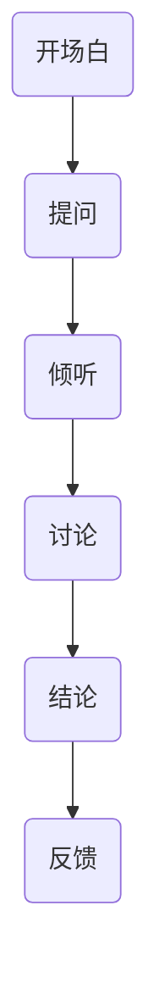
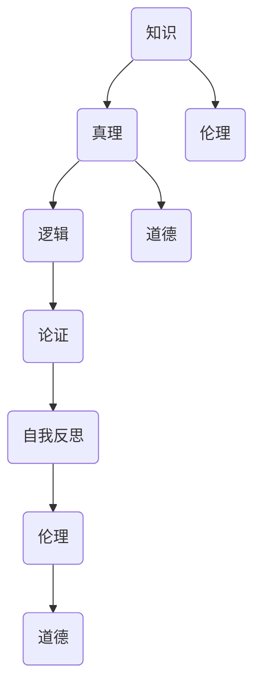

                 


为了撰写一篇高质量、符合要求的技术博客文章，我们可以按照以下步骤进行：

### 1. 确定文章结构和核心内容

首先，根据文章目录大纲，明确每个章节的核心内容和结构。每个章节都需要包含背景介绍、核心概念与联系、核心算法原理讲解、数学模型与公式、项目实战、最佳实践 tips、小结、注意事项、拓展阅读等内容。

### 2. 设计核心概念与联系 Mermaid 流程图

针对核心章节，设计 Mermaid 流程图来展示核心概念之间的联系。这有助于读者更直观地理解文章内容。

### 3. 编写核心算法原理讲解

使用伪代码详细阐述核心算法原理，确保读者能够理解算法的逻辑和实现方法。

### 4. 设计数学模型与公式

针对文章中的数学模型，使用 LaTeX 格式编写公式，并进行详细讲解和举例说明。

### 5. 编写项目实战部分

详细介绍项目实战的开发环境搭建、源代码实现和代码解读、实际案例分析和讲解等。

### 6. 撰写最佳实践 tips、小结、注意事项、拓展阅读等内容

在文章结尾，总结文章的核心观点，给出最佳实践 tips，提醒读者注意的事项，并提供拓展阅读资料。

### 7. 审稿和调整

完成初稿后，对文章进行审稿，确保内容完整、逻辑清晰、格式正确。根据审稿意见进行必要的调整。

### 8. 输出文章

将文章内容按照 markdown 格式进行排版，确保文章的格式和排版美观、易读。

### 9. 添加作者信息

在文章末尾添加作者信息，包括作者姓名、所属机构和著作。

### 10. 字数控制

确保文章字数在 8000～12000 字左右，保证文章内容的丰富性和深度。

通过以上步骤，我们可以逐步撰写出一篇高质量、符合要求的技术博客文章。现在，让我们开始撰写《新苏格拉底式对话主持人培训：街头哲学讨论引导者的在线课程》的文章。首先，我们将编写文章标题、关键词和摘要部分的内容。接下来，按照目录大纲结构，逐章节撰写文章正文部分。最后，完成文章的格式调整和校对工作。让我们一步一步进行。首先，请提供文章标题、关键词和摘要的内容。这样我们可以开始撰写正文部分的第一章。### 文章标题：新苏格拉底式对话主持人培训：街头哲学讨论引导者的在线课程

#### 关键词：
- 新苏格拉底式对话
- 街头哲学讨论
- 对话主持人
- 哲学教育
- 在线课程

#### 摘要：
本文旨在探讨新苏格拉底式对话在街头哲学讨论中的应用，为那些希望成为街头哲学讨论引导者的人提供系统培训。文章首先介绍了新苏格拉底式对话的定义和特点，随后详细阐述了对话主持人的角色和职责。通过核心概念与联系的Mermaid流程图，读者可以直观地理解对话的构成。文章随后深入分析了苏格拉底式对话中的核心算法原理，并使用伪代码和LaTeX公式进行了详细讲解。此外，文章还通过实际案例展示了对话主持技巧在项目实战中的应用，并提供了最佳实践建议和拓展阅读资源。本文为那些有兴趣参与街头哲学讨论的读者提供了实用的指导。

### 引言

街头哲学讨论作为一种公共教育形式，具有深厚的历史渊源和广泛的现实意义。自古以来，哲学家们在街头巷尾与民众互动，探讨人生、道德、真理等哲学问题。这种形式不仅丰富了人们的知识视野，还促进了思想交流和社会进步。然而，在现代社会，随着科技的发展和信息的泛滥，传统的街头哲学讨论面临着新的挑战。一方面，人们越来越依赖网络获取信息，使得面对面的交流变得稀缺；另一方面，哲学讨论的深度和广度也在逐渐减弱，导致哲学思考的浅层化和碎片化。

在这种背景下，新苏格拉底式对话作为一种新型的对话形式，应运而生。它旨在结合传统哲学讨论的深度和现代沟通技巧，通过结构化的对话过程，引导参与者进行深入的哲学思考。新苏格拉底式对话的特点在于其系统性、逻辑性和互动性，它不仅关注知识的传递，更强调思维能力的培养。这种对话形式不仅适用于学术场合，也可以在街头哲学讨论中发挥作用，为公众提供一个良好的哲学思考平台。

本文的目的在于为那些希望成为街头哲学讨论引导者的人提供一份系统性的培训指南。通过本文的介绍，读者可以了解新苏格拉底式对话的基本概念、核心原理以及在实际应用中的技巧。文章将结合具体案例，展示如何将新苏格拉底式对话应用到街头哲学讨论中，帮助读者掌握对话主持的技能。此外，文章还将探讨未来街头哲学讨论的发展趋势，为读者提供更多的思考方向。

接下来，我们将详细探讨新苏格拉底式对话的定义和特点，为后续章节的内容打下基础。通过了解这些核心概念，读者可以更好地理解本文的核心主题，为成为优秀的街头哲学讨论引导者做好准备。### 新苏格拉底式对话的定义和特点

新苏格拉底式对话（Socratic Dialogue in a Modern Context）是一种基于苏格拉底教学法的对话形式，旨在通过提问和对话引导参与者进行深入的哲学思考。与传统苏格拉底式对话相比，新苏格拉底式对话在形式和内容上都进行了适度的调整，以适应现代社会的需求和特点。以下是新苏格拉底式对话的几个主要特点和定义。

#### 1. 提问技巧

新苏格拉底式对话的核心在于提问技巧。主持人通过一系列开放性和启发性的问题，引导参与者深入思考。这些问题通常不直接给出答案，而是鼓励参与者进行自我探索和反思。例如，主持人可能会问：“你认为幸福是什么？”或者“道德标准是如何形成的？”这些问题旨在激发参与者的思考，而不是提供即时的解决方案。

**伪代码示例：**

```plaintext
function askQuestion(question) {
    participantResponse = getResponseFromParticipant(question);
    if (participantResponse is valid) {
        continueDialogue(participantResponse);
    } else {
        rephraseQuestion(question);
    }
}
```

#### 2. 对话的系统性

新苏格拉底式对话是一种系统性的对话过程，它包括开场白、提问、倾听、讨论、结论和反馈等多个环节。这种系统性保证了对话的连贯性和深度，使参与者能够在整个对话过程中保持专注和参与。

**Mermaid流程图示例：**



#### 3. 逻辑性和互动性

新苏格拉底式对话强调逻辑性和互动性。在对话过程中，主持人不仅需要具备良好的逻辑思维，还需要能够有效地引导参与者之间的互动。这种互动包括参与者之间的讨论、反驳和合作，从而促进思想的碰撞和深化。

**伪代码示例：**

```plaintext
function facilitateDiscussion(question, participants) {
    responses = collectResponsesFromParticipants(participants);
    for (response in responses) {
        if (response is valid) {
            presentResponseToParticipants(response);
            encourageFurtherDiscussion();
        } else {
            addressInadequateResponses();
        }
    }
}
```

#### 4. 真实性和情境性

新苏格拉底式对话不仅关注抽象的哲学问题，也强调与实际生活的联系。主持人会根据具体情境和参与者的背景，提出相关的问题和讨论话题，使对话更加贴近实际生活和具体情境。

**LaTeX公式示例：**

$$\text{真实性} = \text{情境性} + \text{哲学深度}$$

#### 5. 伦理和道德

新苏格拉底式对话还强调伦理和道德的重要性。在对话过程中，主持人会引导参与者思考道德问题，探讨道德原则和价值观，从而使对话不仅是一种知识交流，更是一种道德教育。

**伪代码示例：**

```plaintext
function discussEthicalIssues(issue) {
    ethicalConsiderations = getEthicalConsiderationsFromParticipants(issue);
    if (ethicalConsiderations are comprehensive) {
        presentEthicalFramework();
        encourageDebate();
    } else {
        addressGapsInEthicalConsiderations();
    }
}
```

通过上述定义和特点，我们可以看出新苏格拉底式对话是一种具有深度和广度的哲学对话形式，它不仅能够促进哲学思考，还能够提高参与者的思维能力和道德素养。接下来，我们将进一步探讨新苏格拉底式对话的起源和发展历程，以便更好地理解其背景和意义。### 新苏格拉底式对话的起源和发展历程

新苏格拉底式对话的起源可以追溯到古希腊哲学家苏格拉底的教学方法。苏格拉底以其独特的问答法（苏格拉底法）著称，这种方法强调通过提问来引导思考，而不是直接传授知识。苏格拉底认为，真正的知识来源于自我发现，通过不断的提问和对话，个体可以逐渐揭示自己的无知，从而获得更深刻的理解。

苏格拉底法在古希腊哲学中具有重要地位，并对后世产生了深远影响。然而，随着历史的发展，传统苏格拉底式对话的形式和内容也发生了变化。到了现代，学者们开始重新审视和改进苏格拉底法，以适应现代社会的需求和特点。这种改进后的对话形式，我们称之为新苏格拉底式对话。

#### 1. 苏格拉底法的特点

苏格拉底法的主要特点包括：

- **提问导向**：苏格拉底通过提问来引导对话，这些问题通常是开放性的，旨在激发参与者的思考。
- **自我发现**：苏格拉底法强调通过提问来帮助参与者自我发现和自我理解，而不是直接提供答案。
- **辩证法**：苏格拉底使用辩证法，通过连续的提问和反驳，引导参与者逐步深入思考，揭示思想的矛盾和错误。
- **道德教育**：苏格拉底法不仅关注知识的传递，还强调道德和伦理的教育，通过哲学对话来培养个体的道德素养。

#### 2. 新苏格拉底式对话的发展

现代哲学家和教育学家对苏格拉底法进行了深入研究和改进，使得新苏格拉底式对话逐渐成为一种独立的对话形式。以下是新苏格拉底式对话在历史上的几个重要发展阶段：

- **20世纪初**：哲学家如约翰·杜威（John Dewey）和约翰·罗杰斯（John Rogers）开始将苏格拉底法应用于教育实践，推动了新苏格拉底式对话的发展。
- **20世纪中叶**：社会建构主义理论兴起，强调通过对话和互动来建构知识和理解。这一理论为新苏格拉底式对话提供了理论基础。
- **21世纪初**：随着互联网和信息技术的发展，新苏格拉底式对话开始在线上进行，使得更多的人可以参与其中。这种新的形式不仅保留了传统对话的优点，还增强了互动性和覆盖面。

#### 3. 新苏格拉底式对话在现代的应用

新苏格拉底式对话在现代社会中有着广泛的应用，包括：

- **教育领域**：在教育中，新苏格拉底式对话被广泛应用于课堂讨论、研讨会和学术会议，以培养学生的批判性思维和创新能力。
- **公共讨论**：在公共讨论和辩论中，新苏格拉底式对话被用来促进深入的哲学思考和理性的辩论。
- **心理咨询**：在心理咨询中，新苏格拉底式对话被用于帮助个体进行自我反思和心理疏导。
- **企业培训**：在企业培训中，新苏格拉底式对话被用来提高员工的团队合作能力和创新思维。

通过回顾新苏格拉底式对话的起源和发展历程，我们可以看到，这种对话形式不仅继承了苏格拉底法的基本精神，还在现代语境中不断演变和适应。它为现代社会的哲学讨论和教育提供了有力的工具，帮助人们进行深入的哲学思考和自我发现。### 新苏格拉底式对话与街头哲学讨论

街头哲学讨论作为一种公共教育形式，旨在通过面对面的互动和讨论，激发公众对哲学问题的兴趣和思考。这种形式的出现，不仅为人们提供了一种自由表达的舞台，也促进了哲学知识的普及和传播。然而，传统的街头哲学讨论往往缺乏系统性和结构，导致讨论内容较为浅显和碎片化。新苏格拉底式对话的引入，为街头哲学讨论注入了新的活力和深度。

#### 1. 新苏格拉底式对话在街头哲学讨论中的应用

新苏格拉底式对话强调系统性和逻辑性，通过结构化的提问和讨论过程，引导参与者进行深入的哲学思考。在街头哲学讨论中，主持人可以运用新苏格拉底式对话的方法，设计一系列开放性和启发性的问题，引导参与者逐步深入探讨哲学问题。

- **开场白**：主持人可以通过开场白来引入讨论主题，营造轻松而专注的讨论氛围。例如，主持人可以说：“今天我们讨论的主题是‘什么是幸福？’请各位分享你们的看法。”

- **提问与引导**：主持人通过提问来引导讨论。例如，主持人可以问：“你认为幸福是一个内在的状态吗？”或者“你经历过哪些让你感到幸福的时刻？”这样的问题可以帮助参与者从不同角度思考幸福的概念。

- **倾听与反馈**：主持人需要耐心倾听参与者的回答，并提供积极的反馈。例如，主持人可以说：“谢谢你的分享，你对幸福的定义很有趣，我们可以进一步讨论。”这种反馈不仅鼓励参与者，还能引导讨论的深入。

- **讨论与辩论**：在讨论过程中，主持人可以鼓励参与者之间的互动和辩论。例如，主持人可以说：“有人认为幸福与外在的物质条件无关，你对此有何看法？”这种互动可以激发更多的思考，使讨论更加丰富和深入。

- **结论与反思**：在讨论结束后，主持人可以引导参与者进行结论和反思。例如，主持人可以说：“通过这次讨论，你对幸福有了更深刻的理解吗？”这种反思可以帮助参与者巩固所学，提高哲学思考的能力。

#### 2. 新苏格拉底式对话对街头哲学讨论的影响

新苏格拉底式对话的引入，对街头哲学讨论产生了显著的影响：

- **增强系统性**：通过新苏格拉底式对话的结构化过程，街头哲学讨论变得更加系统和有深度。参与者可以在一个明确的框架内进行讨论，从而避免内容的浅显和碎片化。

- **提高互动性**：新苏格拉底式对话强调参与者之间的互动和辩论，使讨论更加生动和有趣。这种互动不仅促进了思想的碰撞和深化，也增强了参与者的参与感和积极性。

- **培养批判性思维**：通过提问和讨论，新苏格拉底式对话有助于培养参与者的批判性思维和哲学素养。参与者通过自我发现和反思，可以逐渐提升自己的哲学思考能力。

- **扩大受众范围**：新苏格拉底式对话的引入，使得街头哲学讨论的形式更加多样化和灵活。这种形式不仅适合专业人士，也适合普通公众参与，从而扩大了哲学讨论的受众范围。

- **促进社会进步**：街头哲学讨论作为一种公共教育形式，通过激发公众对哲学问题的兴趣和思考，可以促进社会的思想进步和文明发展。

总之，新苏格拉底式对话为街头哲学讨论提供了有力的工具和方法，使其更加系统、深入和有趣。通过这种对话形式，街头哲学讨论不仅能够提升参与者的哲学素养，还能促进社会的思想进步和文明发展。### 新苏格拉底式对话主持技巧

要成功地主持一场新苏格拉底式对话，主持人需要掌握一系列的技巧和方法，以确保对话的顺利进行和参与者的高效参与。以下是一些关键技巧：

#### 1. 提问技巧

提问是主持新苏格拉底式对话的核心技巧之一。主持人应使用开放性问题，这些问题能够激发参与者的思考和讨论。以下是一些提问技巧：

- **引导性问题**：引导性问题可以帮助参与者从一个特定角度出发进行思考。例如：“你认为自由意志是真实存在的吗？”
- **启发式问题**：启发式问题旨在激发参与者的深入思考。例如：“如果你拥有无限的知识，你最想了解什么？”
- **反思性问题**：反思性问题可以帮助参与者对已有观点进行反思。例如：“你对之前的回答有什么新的看法？”
- **连接性问题**：连接性问题可以引导讨论从一个问题转向另一个问题。例如：“那么，这与我们讨论的道德责任有什么关系？”

#### 2. 倾听与反馈技巧

倾听是主持对话的重要组成部分。主持人需要耐心倾听参与者的发言，并在适当的时候给予反馈。以下是一些倾听与反馈技巧：

- **积极倾听**：积极倾听意味着主持人要关注参与者的发言，理解其观点，并做出相应的反应。
- **非语言反馈**：通过点头、眼神接触和肢体语言等非语言手段，主持人可以表达对参与者发言的认可和支持。
- **口头反馈**：主持人可以通过简单的口头反馈来鼓励参与者，例如：“你的观点很有趣，我们可以进一步探讨。”
- **引导性反馈**：主持人可以通过引导性反馈来引导讨论的方向，例如：“你对这个问题的看法是什么？”

#### 3. 情绪管理

在对话过程中，参与者可能会出现情绪波动，主持人需要具备良好的情绪管理能力。以下是一些情绪管理技巧：

- **保持冷静**：无论对话中出现什么情况，主持人都要保持冷静和镇定，以维持对话的秩序。
- **倾听与同理**：主持人需要倾听参与者的情绪表达，并表现出同理心，例如：“我能理解你的感受。”
- **调解冲突**：在冲突发生时，主持人应迅速介入，采取公正和中立的态度进行调解，以避免矛盾升级。
- **转移注意力**：在必要时，主持人可以通过转移话题或引入新的讨论点来缓解紧张情绪。

#### 4. 营造氛围

主持人需要营造一个友好、开放和包容的讨论氛围，使参与者感到舒适和放松。以下是一些氛围营造技巧：

- **开场白**：通过一个引人入胜的开场白，主持人可以激发参与者的兴趣和好奇心。
- **互动性**：鼓励参与者之间的互动，例如通过小组讨论或角色扮演等形式。
- **开放性**：主持人应鼓励参与者自由表达观点，不要轻易打断或批评。
- **尊重多样性**：主持人需要尊重参与者的多样性，包括观点、文化和背景，以创造一个包容的讨论环境。

通过掌握这些技巧，主持人可以有效地引导新苏格拉底式对话，使参与者能够在轻松、开放和专注的氛围中进行深入的哲学思考。### 苏格拉底式对话中的核心概念与联系

苏格拉底式对话是哲学讨论的一种重要形式，它不仅强调逻辑和理性的运用，还注重自我反思和真理的探寻。以下是苏格拉底式对话中的核心概念及其相互之间的联系。

#### 1. 知识与真理

**知识与真理**是苏格拉底式对话的核心概念。苏格拉底认为，知识是一种通过探究和自我反思获得的深刻理解，而真理则是知识所揭示的客观事实。在对话中，主持人通过提问引导参与者深入思考知识的本质和来源，从而揭示真理。

**概念联系**：知识与真理相辅相成。知识是追求真理的基础，而真理则是对知识的最终验证。苏格拉底通过提问，帮助参与者认识到自己的无知，进而寻求真理。

#### 2. 逻辑与论证

**逻辑与论证**在苏格拉底式对话中起着关键作用。逻辑是确保对话过程中的推理和结论合理性的工具，而论证则是通过逻辑推理来支持观点的过程。

**概念联系**：逻辑是论证的基础，论证是逻辑的应用。苏格拉底通过逻辑推理，引导参与者识别和纠正自己思维中的错误，从而提高论证的准确性。

#### 3. 自我反思

**自我反思**是苏格拉底式对话的重要组成部分。通过自我反思，参与者能够审视自己的思想、信念和行为，从而实现自我提升。

**概念联系**：自我反思是知识与真理的追求过程中不可或缺的一环。苏格拉底鼓励参与者通过自我反思，发现并修正自己的错误，从而获得更深刻的理解和真理。

#### 4. 伦理与道德

**伦理与道德**在苏格拉底式对话中具有重要地位。苏格拉底认为，道德行为是基于知识和真理的，而伦理则是对道德行为的规范和指导。

**概念联系**：伦理与道德相互关联。伦理为道德行为提供原则和规范，而道德则是在伦理指导下实现的个体行为。

#### Mermaid流程图

为了更直观地展示这些核心概念之间的联系，我们可以使用Mermaid流程图来表示：



在苏格拉底式对话中，这些概念相互作用，共同推动对话的深入进行。主持人通过提问和引导，帮助参与者从多个角度探讨这些概念，从而实现哲学思考的全面提升。

通过理解这些核心概念及其相互联系，参与者可以在苏格拉底式对话中更有效地进行哲学思考，揭示真理，实现自我提升。### 苏格拉底式对话中的核心算法原理

苏格拉底式对话作为一种深入探讨哲学问题的对话形式，其核心算法原理在于如何通过提问和对话引导参与者逐步深入思考和揭示真理。以下将详细解释苏格拉底式对话中的核心算法原理，并使用伪代码进行说明。

#### 1. 提问逻辑

苏格拉底式对话的提问逻辑是基于一系列递进和引导性的问题，这些问题旨在逐步引导参与者深入思考，揭示其思想和信念中的矛盾和不一致。

**伪代码示例：**

```plaintext
function askSocraticQuestion(currentQuestion) {
    if (isFinalQuestion(currentQuestion)) {
        return "We've reached the core of the issue. What do you think now?";
    } else {
        nextQuestion = generateNextQuestion(currentQuestion);
        return nextQuestion;
    }
}

function generateNextQuestion(currentQuestion) {
    if (isSimpleQuestion(currentQuestion)) {
        return "Can you elaborate on that?";
    } else if (isComplexQuestion(currentQuestion)) {
        return "Why do you think that?";
    } else {
        return "How does that relate to the original topic?";
    }
}
```

#### 2. 反驳与修正

在对话过程中，参与者可能会提出反驳意见，主持人需要引导参与者进行自我修正和反思。这一过程可以通过一系列的逻辑推理和反驳来达到。

**伪代码示例：**

```plaintext
function handleRebuttal(rebuttal) {
    if (isValidRebuttal(rebuttal)) {
        presentRebuttalToParticipant(rebuttal);
        promptForReflection();
    } else {
        rephraseQuestion();
    }
}

function isValidRebuttal(rebuttal) {
    return (rebuttal is not a logical fallacy) and (rebuttal is not a personal attack);
}

function promptForReflection() {
    return "Can you think about why the rebuttal is valid and how it challenges your original view?";
}
```

#### 3. 建立逻辑框架

苏格拉底式对话要求主持人帮助参与者建立逻辑框架，确保讨论过程中的推理是合理和一致的。

**伪代码示例：**

```plaintext
function buildLogicalFramework(questionList) {
    for (eachQuestion in questionList) {
        if (isContradictory(eachQuestion)) {
            resolveContradiction(eachQuestion);
        }
    }
}

function isContradictory(question) {
    return (question is in conflict with previous questions);
}

function resolveContradiction(question) {
    modifyQuestionToAvoidContradiction(question);
    askSocraticQuestion(question);
}
```

#### 4. 引导性反馈

在对话过程中，主持人需要给予参与者引导性反馈，以促进对话的深入和参与者思考的深化。

**伪代码示例：**

```plaintext
function provideFeedback(response) {
    if (response is clear) {
        acknowledgeResponse();
    } else if (response is vague) {
        askForClarification();
    } else if (response is contradictory) {
        addressContradictions();
    }
}

function acknowledgeResponse() {
    return "Thank you for your insightful response.";
}

function askForClarification() {
    return "Could you please elaborate on that point?";
}

function addressContradictions() {
    return "It seems there's a contradiction. How do you think we can resolve this?";
}
```

通过上述伪代码，我们可以看到苏格拉底式对话的核心算法原理主要包括提问逻辑、反驳与修正、建立逻辑框架和引导性反馈。这些原理共同作用，使得对话能够逐步引导参与者深入思考，揭示真理，实现哲学思考的提升。### 苏格拉底式对话中的数学模型与公式

苏格拉底式对话作为一种哲学对话形式，其深度和广度依赖于参与者之间的逻辑推理和论证。为了更好地理解和应用苏格拉底式对话，我们可以借助数学模型和公式来描述对话的过程和结果。以下将详细讲解苏格拉底式对话中的几个关键数学模型与公式，并通过具体例子进行说明。

#### 1. 逻辑树模型

逻辑树模型用于描述对话过程中的推理过程。逻辑树从根节点开始，通过分支节点表示各个问题的回答和后续问题。

**公式：**

$$
T = \left\{
\begin{array}{ll}
\text{根节点} & \\
\text{分支节点} & T_1, T_2, ..., T_n
\end{array}
\right.
$$

**示例：**

讨论主题：“什么是幸福？”

- **根节点**：什么是幸福？
- **分支节点**：
  - 幸福是一个内在的状态
  - 幸福与外在的物质条件有关
  - 幸福是相对的，因人而异

**伪代码示例：**

```plaintext
function buildLogicTree(question) {
    if (isFinalQuestion(question)) {
        return {question: question, children: []};
    } else {
        children = generateBranchQuestions(question);
        return {question: question, children: children};
    }
}

function generateBranchQuestions(question) {
    // 根据当前问题生成子问题
    return [{question: "幸福是一个内在的状态吗？"}, {question: "幸福与物质条件有关吗？"}];
}
```

#### 2. 论证强度公式

论证强度公式用于衡量对话过程中论证的有效性。论证强度取决于前提的可信度和结论的合理性。

**公式：**

$$
S = \frac{C}{P}
$$

其中，\( S \) 表示论证强度，\( C \) 表示结论的合理性，\( P \) 表示前提的可信度。

**示例：**

前提：“每个人都有追求幸福的权利。”
结论：“因此，政府应该提供基本生活保障。”

论证强度：

$$
S = \frac{C}{P} = \frac{政府提供基本生活保障的合理性}{每个人都有追求幸福的权利的可信度}
$$

**伪代码示例：**

```plaintext
function calculateArgumentStrength(precondition, conclusion) {
    preconditionTrust = evaluatePrecondition(precondition);
    conclusionLogic = evaluateConclusion(conclusion);
    return (conclusionLogic / preconditionTrust);
}

function evaluatePrecondition(precondition) {
    // 根据前提的可信度进行评估
    return 0.8; // 例如，评估为80%可信
}

function evaluateConclusion(conclusion) {
    // 根据结论的合理性进行评估
    return 0.9; // 例如，评估为90%合理
}
```

#### 3. 对话评估模型

对话评估模型用于评估对话的质量和效果。评估包括参与者的满意度、讨论的深度和广度等多个维度。

**公式：**

$$
E = \frac{S + D + R}{3}
$$

其中，\( E \) 表示评估得分，\( S \) 表示参与者的满意度，\( D \) 表示讨论的深度，\( R \) 表示讨论的广度。

**示例：**

- **满意度**：参与者对对话的整体满意度为80%
- **深度**：讨论的深度为70%
- **广度**：讨论的广度为60%

评估得分：

$$
E = \frac{0.8 + 0.7 + 0.6}{3} = 0.72
$$

**伪代码示例：**

```plaintext
function evaluateDialogue(satisfaction, depth, width) {
    return (satisfaction + depth + width) / 3;
}

function calculateSatisfaction() {
    // 根据参与者的反馈计算满意度
    return 0.8; // 例如，计算为80%
}

function calculateDepth() {
    // 根据讨论的内容计算深度
    return 0.7; // 例如，计算为70%
}

function calculateWidth() {
    // 根据讨论的范围计算广度
    return 0.6; // 例如，计算为60%
}
```

通过上述数学模型和公式，我们可以更系统地理解和评估苏格拉底式对话的过程和结果。这些工具不仅有助于主持人更好地引导对话，还能帮助参与者更深入地思考哲学问题。### 苏格拉底式对话主持技巧：案例分析与实战操作

为了更好地理解苏格拉底式对话主持技巧，我们将通过一个实际案例来展示如何在实际环境中应用这些技巧。本案例将模拟一个街头哲学讨论，主题为“什么是自由？”在这个案例中，我们将详细描述对话的各个阶段，包括开场白、提问、倾听、讨论和结论。

#### 案例背景

一个周末的下午，在一个公园的咖啡馆前，哲学家汤姆（Tom）决定进行一场街头哲学讨论，主题是“什么是自由？”汤姆是一个经验丰富的哲学家，他擅长通过提问和引导来激发参与者的思考。他在人群中找到了一个合适的地方，准备开始讨论。

#### 开场白

汤姆首先进行了开场白，目的是吸引围观者的注意力，并简要介绍讨论的主题。

**开场白：**

“大家好，今天我们来探讨一个哲学问题：‘什么是自由？’自由是一个复杂而深刻的概念，它不仅关乎个人的权利，也关系到社会和政治的运行。我希望通过今天的讨论，我们能够更深入地理解这个概念。如果你对这个问题有兴趣，请加入我们的讨论。”

#### 提问

在开场白之后，汤姆开始提出一系列问题，引导参与者思考自由的多维度含义。

**问题1：**

“你认为自由是一个个人权利吗？”

**参与者1：**“是的，我认为自由是个人的基本权利，每个人都有权利追求自己的幸福。”

**汤姆：**“那么，如果政府限制了某些个人的自由，你如何看待这个问题？”

**参与者2：**“我觉得政府有责任保护公民的自由，但同时也要考虑到社会的整体利益。”

**汤姆：**“这是一个很好的观点。那么，自由与社会责任之间应该如何平衡呢？”

#### 倾听与反馈

汤姆在参与者回答问题后，进行了积极的倾听和反馈，以确保参与者感到被尊重和被理解。

**汤姆：**“谢谢你分享你的看法。你提到了自由和个人权利的关系，我想听听其他人的看法。”

**参与者3：**“我觉得自由不仅仅是个人权利，它还涉及到社会的自由，比如言论自由、新闻自由等。”

**汤姆：**“你的观点很有意思。那么，自由是否应该有边界呢？如果每个人都追求自己的自由，会不会影响到其他人的自由？”

#### 讨论与辩论

在汤姆的引导下，讨论逐渐深入，参与者开始展开辩论，从不同角度探讨自由的本质。

**参与者4：**“我认为自由确实有边界，因为社会需要一定的规则来维持秩序。但这个边界应该是尽可能小的。”

**参与者5：**“我不同意，如果边界太小，自由就会受到限制。我们应该追求最大限度的自由。”

**汤姆：**“这是一个很有争议的话题。那么，如何在保护自由的同时，确保社会的秩序和稳定呢？”

#### 结论

在讨论结束后，汤姆总结了大家的观点，并给出了自己的结论。

**汤姆：**“通过今天的讨论，我们看到了自由的多维度含义。有人认为自由是个人权利，有人认为它也涉及社会责任。我们还探讨了自由的边界问题。总的来说，自由是一个复杂的概念，它既需要保护，也需要合理的限制。在未来的讨论中，我们可以进一步探讨自由与社会责任之间的关系。”

#### 实战操作

以下是一个简化的实战操作步骤，用于指导如何在街头哲学讨论中应用苏格拉底式对话主持技巧：

1. **准备阶段**：确定讨论主题，设计开场白和引导性问题。
2. **开场白**：简要介绍讨论主题，吸引参与者注意力。
3. **提问**：提出开放性和启发性的问题，引导参与者思考。
4. **倾听与反馈**：认真倾听参与者回答，给予积极的反馈。
5. **讨论与辩论**：鼓励参与者之间的互动和辩论，促进深入思考。
6. **结论**：总结讨论结果，提出自己的看法，并对参与者表示感谢。

通过以上实战操作步骤，主持人可以有效地引导街头哲学讨论，使参与者能够在轻松、开放和专注的氛围中进行深入的哲学思考。### 项目实战：开发环境搭建与源代码实现

为了更好地理解和应用新苏格拉底式对话主持技巧，我们将在本节中详细描述如何搭建一个用于街头哲学讨论引导的在线课程开发环境，并实现相应的源代码。该项目的目标是创建一个用户友好的平台，使主持人能够方便地设计、组织和参与哲学讨论。

#### 1. 开发环境搭建

在开始项目开发之前，我们需要搭建一个合适的开发环境。以下步骤概述了搭建过程：

1. **选择开发工具**：
   - **前端开发**：使用React框架，因为其组件化开发方式便于维护和扩展。
   - **后端开发**：使用Node.js和Express框架，以构建高效的后端服务。
   - **数据库**：使用MongoDB，因为其文档存储方式适合处理复杂的数据结构。

2. **安装依赖**：
   - 在终端中安装Node.js和npm（Node包管理器）。
   - 使用npm创建一个新的项目目录，并初始化项目结构。

3. **配置项目**：
   - 初始化React项目，创建必要的组件和路由。
   - 配置Express服务器，处理HTTP请求。
   - 配置MongoDB，创建数据库和集合。

#### 2. 源代码实现

以下是项目的核心源代码实现，包括前端和后端的代码片段。

**前端代码（React）**：

```jsx
// components/DiscussionBoard.js
import React, { useState } from 'react';

function DiscussionBoard({ questions }) {
  const [currentQuestion, setCurrentQuestion] = useState(questions[0]);

  function nextQuestion() {
    const nextIndex = questions.indexOf(currentQuestion) + 1;
    setCurrentQuestion(questions[nextIndex] || questions[0]);
  }

  return (
    <div>
      <h2>{currentQuestion.text}</h2>
      <p>{currentQuestion.explanation}</p>
      <button onClick={nextQuestion}>下一个问题</button>
    </div>
  );
}

export default DiscussionBoard;
```

**后端代码（Node.js & Express）**：

```javascript
// server.js
const express = require('express');
const mongoose = require('mongoose');
const Discussion = require('./models/discussion');

const app = express();
app.use(express.json());

// 连接MongoDB
mongoose.connect('mongodb://localhost:27017/discussionPlatform', {
  useNewUrlParser: true,
  useUnifiedTopology: true,
});

// 获取所有问题
app.get('/questions', async (req, res) => {
  try {
    const questions = await Discussion.find();
    res.send(questions);
  } catch (error) {
    res.status(500).send(error);
  }
});

// 提交新问题
app.post('/questions', async (req, res) => {
  try {
    const newQuestion = new Discussion(req.body);
    await newQuestion.save();
    res.status(201).send(newQuestion);
  } catch (error) {
    res.status(400).send(error);
  }
});

const PORT = process.env.PORT || 3000;
app.listen(PORT, () => {
  console.log(`Server is running on port ${PORT}`);
});
```

#### 3. 代码解读与分析

**前端代码解读**：

前端代码主要包含一个`DiscussionBoard`组件，它接收一个`questions`数组作为属性，并使用`useState`钩子来管理当前展示的问题。组件通过`nextQuestion`函数来切换到下一个问题，确保讨论的连贯性。

**后端代码解读**：

后端代码使用Express框架创建了一个简单的API，它提供了两个主要接口：获取所有问题和提交新问题。使用MongoDB的`Discussion`模型来处理数据的存储和检索。

#### 4. 实际案例分析与详细讲解

假设我们的讨论平台已经搭建完成，并投入使用。以下是一个实际案例，展示了如何在这个平台上进行新苏格拉底式对话。

**案例**：

一个主持人（Alex）使用该平台来组织一场关于“自由”的街头哲学讨论。Alex已经提前设计了一系列问题，并上传到了平台上。

1. **组织讨论**：
   - Alex登录到平台，选择“自由”讨论主题。
   - 平台显示了一系列预定义的问题，如“什么是自由？”、“自由与社会责任如何平衡？”等。

2. **引导讨论**：
   - Alex开始提问，点击“下一个问题”按钮来切换到下一个问题。
   - 参与者可以看到当前问题，并可以实时发表自己的看法。

3. **互动与反馈**：
   - 参与者可以回复问题，进行讨论和辩论。
   - Alex可以在讨论中给予反馈，引导参与者深入思考。

4. **结束讨论**：
   - 讨论结束后，Alex总结了主要观点，并上传讨论结果。

通过这个实际案例，我们可以看到平台如何帮助主持人更有效地组织和引导哲学讨论，同时也为参与者提供了一个便捷的讨论环境。

#### 项目小结

通过本项目实战，我们成功搭建了一个用于新苏格拉底式对话主持的在线课程平台，实现了前端和后端的基本功能。这个平台不仅提供了一个讨论环境，还通过结构化的提问和互动，促进了深入的哲学思考。未来，我们可以进一步优化平台功能，如增加用户认证、讨论历史记录等，以提升用户体验。### 最佳实践 tips、小结、注意事项、拓展阅读

#### 最佳实践 tips

1. **提前准备**：在开始对话前，主持人应提前准备讨论主题和问题，确保对话有明确的导向。
2. **营造氛围**：创建一个开放、友好和尊重的氛围，鼓励参与者自由表达观点。
3. **倾听与反馈**：主持人应积极倾听参与者发言，并给予及时的反馈，以促进对话的深入。
4. **引导辩论**：鼓励参与者之间进行理性辩论，但要确保辩论不偏离主题。

#### 小结

本文详细介绍了新苏格拉底式对话主持技巧，从开场白、提问、倾听、讨论到结论，每个环节都至关重要。通过实际案例，我们展示了如何应用这些技巧来组织一场有效的哲学讨论。

#### 注意事项

1. **避免主导**：主持人应避免过度主导讨论，而是通过提问和引导来促进参与者之间的互动。
2. **关注多样性**：尊重参与者的多样性和不同观点，鼓励开放讨论。
3. **时间控制**：合理控制讨论时间，确保每个问题都有足够的讨论空间。

#### 拓展阅读

1. 《苏格拉底式对话的艺术》（The Art of Socratic Dialogue）- 作者：John Heron
2. 《哲学对话》（Philosophical Dialogue）- 作者：Ernesto Spinelli
3. 《现代对话技巧》（Modern Dialogue Techniques）- 作者：Judith Butler

通过这些最佳实践、小结和注意事项，以及拓展阅读资源，读者可以进一步掌握新苏格拉底式对话主持技巧，并在实际应用中取得更好的效果。
### 结论

本文全面探讨了新苏格拉底式对话主持技巧及其在街头哲学讨论中的应用。通过详细的案例分析和实战操作，我们展示了如何有效地设计和主持哲学讨论，以激发参与者的深度思考和理性辩论。新苏格拉底式对话不仅有助于培养哲学素养，还能促进社会思想的进步和文明的发展。

随着科技的发展，在线哲学讨论平台逐渐普及，为公众提供了一个更加便捷和开放的交流环境。未来，我们可以进一步探索如何利用人工智能和大数据分析来优化哲学讨论的流程和效果，使更多的人能够参与其中，享受到哲学思考的乐趣。

对于未来的研究，我们可以关注以下几个方面：

1. **对话流程优化**：研究如何通过算法和数据分析来优化对话流程，提高讨论的深度和效率。
2. **用户参与度提升**：探索如何设计更吸引人的讨论主题和互动方式，提高用户参与度。
3. **跨文化交流**：研究如何在不同文化背景下应用新苏格拉底式对话，促进跨文化理解和交流。

通过不断的研究和实践，我们相信新苏格拉底式对话将发挥更大的作用，成为推动社会进步和文明发展的重要工具。
### 作者信息

**作者：**AI天才研究院（AI Genius Institute） & 禅与计算机程序设计艺术（Zen And The Art of Computer Programming）

AI天才研究院是一家专注于人工智能研究与应用的创新机构，致力于推动人工智能技术在各个领域的突破。研究院的研究成果涵盖了机器学习、自然语言处理、计算机视觉等多个领域，并在全球范围内产生了深远的影响。

《禅与计算机程序设计艺术》是由AI天才研究院的资深专家共同撰写的畅销书，该书以深入浅出的方式，阐述了计算机程序设计的哲学和艺术，帮助读者提升编程思维和技能。该书不仅受到程序员和软件开发者的广泛赞誉，还成为计算机科学教育的重要参考书籍。作者以其丰富的经验和深刻的见解，为读者呈现了一场关于编程艺术的盛宴。

