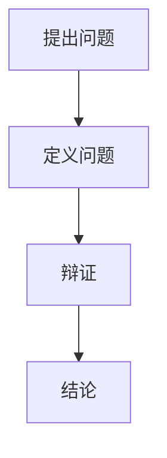
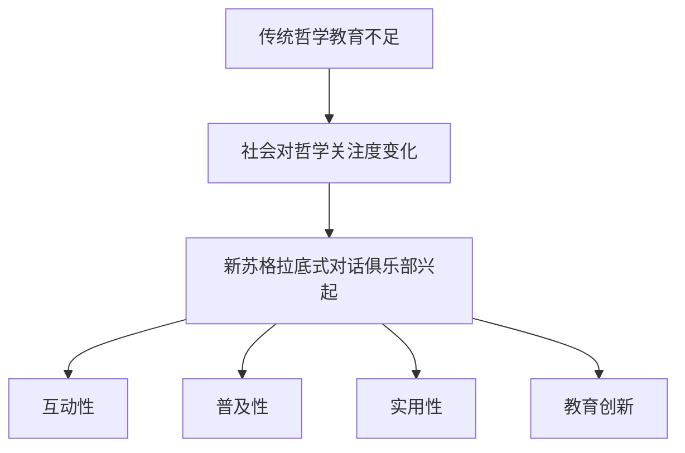
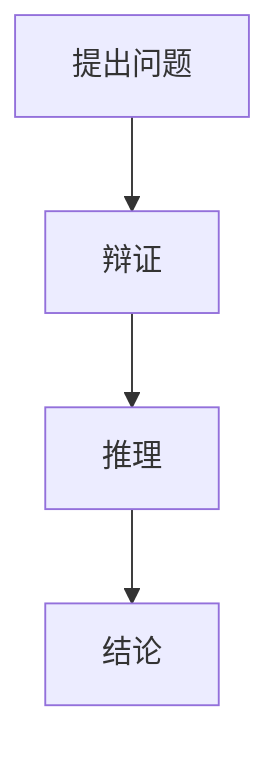
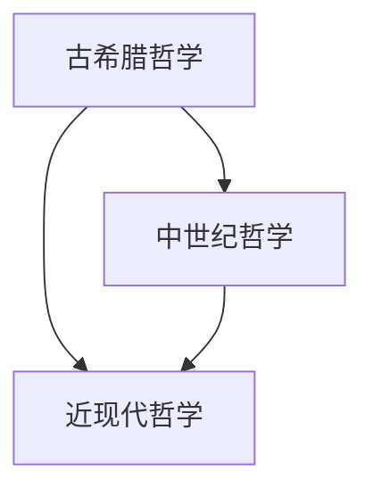
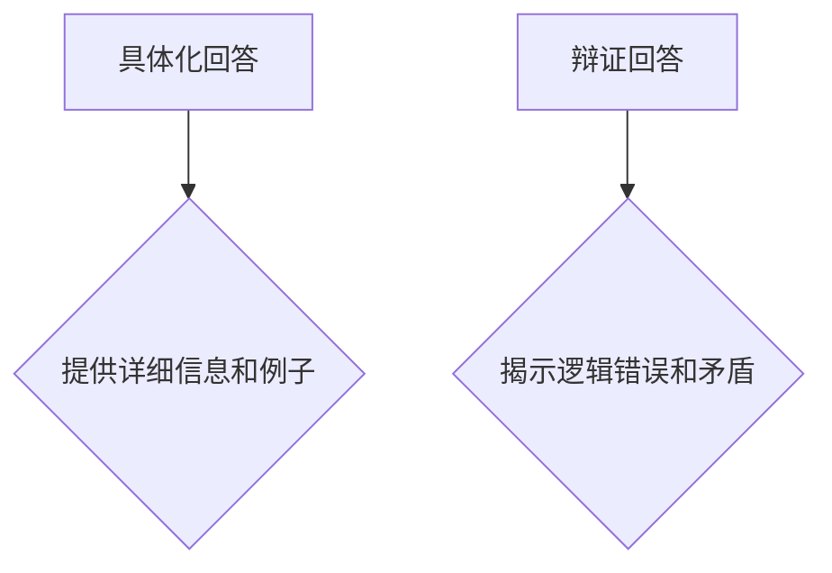
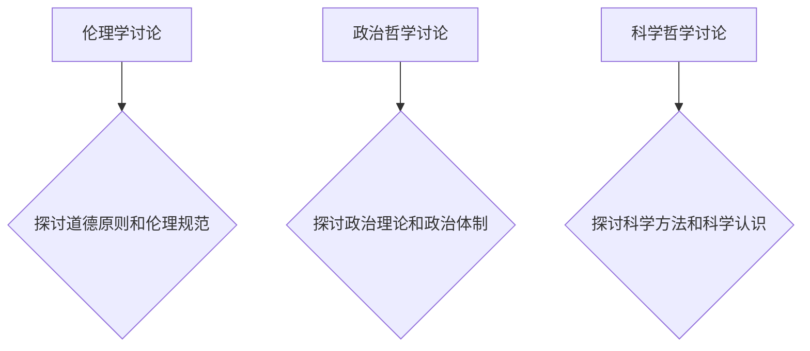
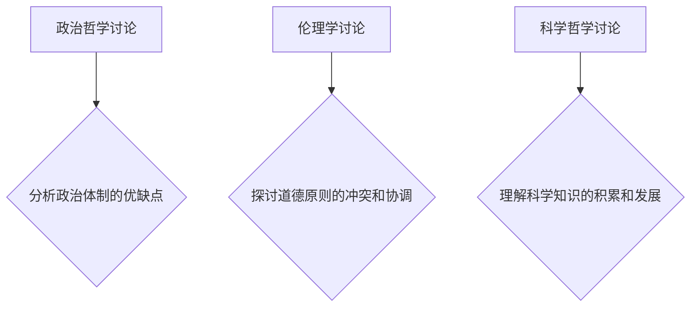
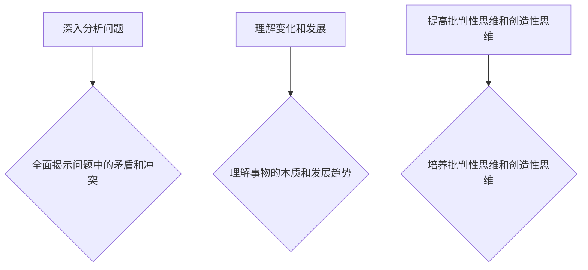

                 

### 《新苏格拉底式对话俱乐部：定期街头哲学讨论活动》概述

#### 关键词
- 新苏格拉底式对话
- 街头哲学讨论
- 苏格拉底方法
- 哲学俱乐部
- 社区互动

#### 摘要
本文旨在探讨新苏格拉底式对话俱乐部作为一种创新形式的定期街头哲学讨论活动。本文首先介绍了苏格拉底式对话的基本原理和特点，并分析了其在现代哲学讨论中的重要性。接着，本文详细阐述了新苏格拉底式对话俱乐部的发展背景，以及如何组织并实施街头哲学讨论活动。通过本文的探讨，读者将了解苏格拉底式对话在哲学教育和社区互动中的潜力，以及如何通过这种活动促进公众对哲学的兴趣和思考。

---

#### 引言

在当今信息爆炸的时代，人们获取知识的途径多种多样，但深入思考和理解的重要性并未因此而降低。哲学，作为一门探究人生意义、价值观和存在本质的学科，一直被视为提升人类思维能力的工具。然而，传统的哲学教育和讨论方式往往局限于学术圈，普通公众的参与度不高。因此，寻找一种既有趣又能广泛吸引公众参与的哲学讨论形式显得尤为重要。

新苏格拉底式对话俱乐部正是为了解决这一问题而诞生的一种新型讨论活动。这种活动借鉴了古希腊哲学家苏格拉底的对话方法，通过街头哲学讨论的形式，让公众在日常生活中接触到哲学，从而激发他们的思考能力和批判性思维。

本文将首先介绍苏格拉底式对话的基本原理和特点，探讨其在现代哲学讨论中的重要性。然后，我们将分析新苏格拉底式对话俱乐部的发展背景，介绍其组织形式和实施方法。最后，本文将通过实际案例研究，展示这种活动在实际操作中的效果和挑战，并提出未来的发展方向和改进建议。

#### 苏格拉底式对话的基本原理

苏格拉底式对话，又称为苏格拉底方法或苏格拉底对话法，是古希腊哲学家苏格拉底（Socrates）在教学中广泛应用的一种方法。苏格拉底以其敏锐的提问技巧和对哲学问题的深刻洞察而闻名，他的教学方法不仅仅是传授知识，更是通过提问引导学生自我发现和思考。

**定义与特点**

苏格拉底式对话的核心在于通过提问引导对话，而不是直接提供答案。这种方法强调对话中的参与者和观察者之间的互动，特别是教师与学生之间的互动。苏格拉底式对话的主要特点如下：

1. **提问导向**：对话从一系列开放性问题开始，这些问题旨在揭示对话参与者的思维方式和知识盲点。
2. **辩证法**：通过不断的提问和回答，参与者逐渐揭示问题的复杂性，并发展出更深刻的理解。
3. **自我发现**：参与者通过对话过程自我发现，发现自己对问题的无知和偏见，从而获得新的知识和洞察力。
4. **逻辑严密**：苏格拉底式对话强调逻辑和论证的严谨性，通过逻辑推理来构建和验证观点。

**历史渊源**

苏格拉底生活在公元前5世纪的雅典，他的教学方法受到了当时教育制度的强烈反对。然而，苏格拉底的教学方法对后世的哲学和教育产生了深远的影响。他的学生包括柏拉图和亚里士多德，这两位哲学家进一步发展了苏格拉底的思想，并使其在西方哲学史上占据重要地位。

苏格拉底式对话的教育应用在古希腊时期已经初见端倪。柏拉图在《理想国》中描述了苏格拉底的对话方法，并将其应用于教育中。亚里士多德则将苏格拉底的方法与自己的研究方法相结合，提出了更为系统的哲学研究方法。

**核心方法**

苏格拉底式对话的核心方法是提问和回答。具体来说，这个过程可以分为以下几个步骤：

1. **定义问题**：通过提问引导对话，确保问题的明确性和具体性。
2. **辩证**：通过提问和回答，揭示问题的多个层面和复杂性。
3. **归纳与演绎**：在辩证过程中，参与者通过逻辑推理来归纳和演绎观点。
4. **结论**：最终，通过对话得出结论，这一结论通常是参与者共同达成的共识。

**图示说明**

为了更好地理解苏格拉底式对话的方法，我们可以通过Mermaid流程图来展示其基本流程。

**流程图：苏格拉底式对话流程**



**伪代码：苏格拉底式对话流程伪代码**

```
function 苏格拉底式对话(问题) {
    提出问题(问题)
    如果 问题 不是 明确的 {
        定义问题(问题)
    }
    进行辩证
    得出结论
}
```

通过上述流程和伪代码，我们可以清晰地看到苏格拉底式对话的基本步骤和逻辑结构。这种对话方法不仅适用于哲学讨论，还可以广泛应用于各个领域，以促进思考和问题解决。

#### 新苏格拉底式对话俱乐部的发展背景

新苏格拉底式对话俱乐部作为一种新型哲学讨论形式，其诞生背景与现代社会的发展和哲学教育的现状密切相关。以下将分析这些背景因素，包括传统哲学教育的不足、社会对哲学关注度变化，以及新苏格拉底式对话俱乐部兴起的背景和原因。

**传统哲学教育的不足**

传统哲学教育通常局限于学术机构和高等学府，主要面向专业的哲学学生和研究者。这种教育模式存在以下几个问题：

1. **高门槛**：哲学课程往往设置较高的门槛，需要深厚的学术背景和理论知识，这使得普通公众难以参与。
2. **枯燥乏味**：传统的哲学教学方式以理论讲授为主，缺乏互动和实际应用，难以激发学生的兴趣。
3. **内容陈旧**：许多哲学课程内容过于陈旧，未能及时反映现代哲学的动态和最新研究成果。

这些不足使得哲学教育在普通公众中缺乏吸引力，难以满足社会对哲学知识的需求。

**社会对哲学关注度变化**

随着信息时代的到来，人们对知识和思想的渴求日益增长。然而，传统的哲学教育模式未能有效满足这一需求。与此同时，社会对哲学的关注度也发生了变化：

1. **知识普及**：互联网和社交媒体的发展使得知识传播更加便捷，公众更容易获取各种哲学资源。
2. **思想需求**：现代社会面临诸多复杂问题，如道德困境、技术进步带来的伦理挑战等，公众对哲学思考和指导的需求增加。
3. **兴趣多元**：公众的阅读和思考兴趣越来越多元，不再局限于传统的学术领域，而是更倾向于关注实际问题和生活中的哲学。

这些变化为哲学教育提供了新的机遇，同时也提出了新的挑战。

**新苏格拉底式对话俱乐部的兴起**

新苏格拉底式对话俱乐部的兴起是应对上述背景因素的一种尝试。以下是其发展的背景和原因：

1. **互动性**：新苏格拉底式对话俱乐部强调互动和参与，通过面对面的讨论，使参与者能够更深入地思考哲学问题，并与其他人分享观点和经验。
2. **普及性**：俱乐部活动通常在公共场所举行，如街头、公园等，降低了参与的门槛，使普通公众更容易参与其中。
3. **实用性**：新苏格拉底式对话俱乐部关注现实问题，通过哲学思考提供解决思路，使哲学知识更加贴近公众的生活。
4. **教育创新**：新苏格拉底式对话俱乐部是对传统哲学教育模式的一种创新，旨在打破学术壁垒，使哲学教育更加开放和包容。

**图示说明**

为了更好地理解新苏格拉底式对话俱乐部的发展背景，我们可以通过Mermaid流程图来展示其主要因素。

**流程图：新苏格拉底式对话俱乐部发展背景**



**伪代码：新苏格拉底式对话俱乐部发展背景**

```
function 发展背景分析() {
    分析传统哲学教育不足
    分析社会对哲学关注度变化
    判断新苏格拉底式对话俱乐部兴起的原因
    如果 原因 满足互动性、普及性、实用性和教育创新 {
        新苏格拉底式对话俱乐部兴起
    }
}
```

通过上述分析和流程图，我们可以看到新苏格拉底式对话俱乐部的兴起是如何应对传统哲学教育的不足和社会对哲学关注度变化的一种创新尝试。这种俱乐部不仅提供了新的哲学讨论形式，也为公众提供了一个思考和交流的平台，有望促进哲学知识的普及和哲学思考的深入。

#### 定期街头哲学讨论活动的组织与实施

街头哲学讨论活动作为新苏格拉底式对话俱乐部的重要组成部分，其组织和实施过程需要精心策划和管理。以下将详细描述活动策划、参与者招募、现场组织与管理等关键环节，并提供具体的步骤和方法。

**活动策划**

1. **确定活动主题**：活动主题的选择应充分考虑哲学领域的热点话题和公众关心的问题，如伦理道德、政治哲学、科学哲学等。活动主题应具有广泛性和争议性，以吸引更多参与者的兴趣。
2. **设定讨论框架**：为了确保讨论的有序进行，可以预先设定讨论框架，包括讨论的主要问题、子问题和讨论的时间节点。讨论框架应具有灵活性和适应性，以便在讨论过程中进行调整和补充。
3. **制定活动日程**：活动日程应明确活动的具体时间和地点，以及每个环节的时间分配。日程应包括开场致辞、主题讨论、互动环节、总结发言等。

**参与者招募**

1. **渠道宣传**：通过社交媒体、社区公告、学校通知等渠道进行宣传，提高活动的知名度。可以使用海报、传单、电子邮件等方式吸引潜在参与者。
2. **目标群体**：明确活动目标群体，如大学生、职场人士、退休人员等。针对不同群体制定相应的宣传策略，以更好地吸引他们参与。
3. **报名方式**：提供线上和线下两种报名方式，方便参与者进行报名。线上报名可以通过网站或社交媒体平台进行，线下报名可以在活动现场设立报名处。

**现场组织与管理**

1. **场地选择**：选择一个宽敞、安全、交通便利的场地，如公园、广场、咖啡馆等。场地的选择应充分考虑参与者的数量和活动性质。
2. **现场布置**：根据活动需要，对场地进行适当布置，如摆放椅子、桌子、音响设备等。确保现场环境舒适、整洁，有助于参与者集中精力进行讨论。
3. **主持人安排**：主持人负责引导整个讨论过程，确保讨论的有序进行。主持人应具备良好的沟通能力和组织能力，能够在讨论中引导参与者深入思考。
4. **互动环节**：设置互动环节，如小组讨论、角色扮演、问答游戏等，以增强参与者的参与感和互动性。互动环节的设计应具有趣味性和启发性，能够激发参与者的思考。
5. **现场管理**：活动过程中，应有专门的工作人员负责现场管理，包括维护现场秩序、解答参与者疑问、记录讨论内容等。现场管理应做到及时、高效，确保活动顺利进行。
6. **活动总结**：活动结束后，主持人应进行总结发言，对讨论的主要观点进行梳理和总结。同时，可以邀请参与者分享自己的感受和收获，促进活动的反思和改进。

**伪代码：定期街头哲学讨论活动组织与实施流程**

```
function 组织与实施街头哲学讨论活动() {
    确定活动主题
    设定讨论框架
    制定活动日程
    宣传活动
    招募参与者
    选择场地
    布置现场
    安排主持人
    设计互动环节
    现场管理
    活动总结
}
```

通过上述步骤和方法，可以确保定期街头哲学讨论活动的有序进行。这种活动不仅为参与者提供了一个交流和学习的平台，也促进了公众对哲学的关注和理解，具有积极的现实意义。

### 4. 苏格拉底式对话中的逻辑与论证

苏格拉底式对话不仅是一种教学和讨论方法，更是一种严谨的逻辑思维过程。在苏格拉底式对话中，逻辑与论证起着至关重要的作用，它不仅帮助参与者明确问题，还促使他们通过辩证和推理得出合理的结论。本节将详细探讨苏格拉底式对话中的逻辑与论证，包括逻辑的基本概念、论证的方法、以及辩证的过程。

#### 逻辑的基本概念

逻辑是一种研究推理有效性的学科，它关注的是思维的正确性和合理性。在苏格拉底式对话中，逻辑的基本概念包括命题、命题逻辑、推理规则等。

**命题**

命题是指可以明确判断真假的陈述句。一个命题要么为真，要么为假，不能同时为真和假。例如，“今天下雨”是一个命题，它要么为真，要么为假。

**命题逻辑**

命题逻辑是研究命题之间关系的逻辑体系。它主要包括以下基本概念：

1. **逻辑运算符**：如“与”（∧）、“或”（∨）、“非”（¬）等。这些运算符用于组合命题，形成更复杂的命题。
2. **逻辑命题**：包括命题的否定、命题的合取、命题的析取等。
3. **命题形式**：命题逻辑通过形式化的语言描述命题，使得推理更加严谨和准确。

**推理规则**

推理规则是逻辑推理的基本法则，它帮助我们从已知的前提推导出新的结论。在苏格拉底式对话中，常用的推理规则包括：

1. **演绎推理**：从一般性前提推导出具体结论的推理方法。例如，所有人都会死亡（大前提），苏格拉底是人（小前提），因此苏格拉底会死亡（结论）。
2. **归纳推理**：从具体实例推导出一般性结论的推理方法。例如，观察到所有的天鹅都是白色的，归纳出所有天鹅都是白色的。

#### 苏格拉底式对话中的论证方法

苏格拉底式对话中的论证方法主要包括以下几种：

1. **辩证法**：辩证法是一种通过提问和回答揭示问题复杂性、寻找真理的方法。苏格拉底经常使用辩证法来引导对话，通过一系列的问题使对话者逐渐暴露自己的逻辑漏洞和知识盲点。
2. **归谬法**：归谬法是一种通过假设某命题为真，然后推导出矛盾，从而证明原命题为假的论证方法。苏格拉底常使用归谬法来揭示对方的错误观点。
3. **归纳法**：归纳法是一种从个别实例推导出一般性结论的论证方法。苏格拉底在对话中经常通过归纳法来总结和概括对话者的观点。

#### 辩证的过程

苏格拉底式对话中的辩证过程是一个动态的、迭代的过程，通常包括以下几个步骤：

1. **提出问题**：通过开放性问题引导对话者思考，揭示问题的本质和复杂性。
2. **辩证**：在对话中，苏格拉底通过提问和回答，不断揭示对话者的观点和假设，寻求逻辑上的漏洞和矛盾。
3. **推理**：在辩证过程中，对话者通过逻辑推理来支持或反驳对方的观点，使对话逐步深入。
4. **结论**：通过辩证和推理，对话者最终达成共识或得出结论，这一结论通常是经过多轮辩证和推理后的共识。

**图示说明**

为了更好地理解苏格拉底式对话中的逻辑与论证，我们可以通过Mermaid流程图来展示其基本流程。

**流程图：苏格拉底式对话中的逻辑与论证流程**



**伪代码：苏格拉底式对话中的逻辑与论证伪代码**

```
function 苏格拉底式对话(问题) {
    提出问题(问题)
    进行辩证
    通过推理得出结论
    如果 结论 达成共识 {
        结束对话
    } else {
        继续辩证和推理
    }
}
```

通过上述流程和伪代码，我们可以清晰地看到苏格拉底式对话中的逻辑与论证过程。这种对话方法不仅有助于提升参与者的逻辑思维能力，也为哲学思考提供了严谨的框架。

### 哲学思想的历史发展与联系

哲学作为一门探讨人生、知识、价值和存在本质的学科，其历史发展经历了多个阶段，形成了丰富而多样的哲学思想。理解这些思想的历史背景和发展脉络，有助于我们更好地把握哲学的核心概念和理论。以下将简要介绍西方哲学史上的重要时期和代表人物，分析不同哲学流派之间的联系和区别。

**古希腊哲学**

古希腊哲学是西方哲学的源头，其代表人物包括苏格拉底、柏拉图和亚里士多德。

1. **苏格拉底**：苏格拉底以其苏格拉底式对话法著称，他强调道德和伦理的重要性，认为道德是人类行为的指南。苏格拉底的哲学思想奠定了西方伦理学的基础。
2. **柏拉图**：柏拉图是苏格拉底的学生，他提出了理念论和辩证法，认为真理和美存在于超越现实的理念世界。柏拉图的《理想国》探讨了正义、教育和政治的理想状态。
3. **亚里士多德**：亚里士多德是柏拉图的学生，他对柏拉图的理念论进行了批判和改进，提出了自己的实证主义哲学。亚里士多德的研究涵盖了逻辑学、形而上学、伦理学和政治学等多个领域。

**中世纪哲学**

中世纪哲学以基督教哲学为核心，代表人物包括奥古斯丁、托马斯·阿奎那等。

1. **奥古斯丁**：奥古斯丁将基督教信仰与哲学思想相结合，提出了关于上帝、信仰和人类自由意志的深刻见解。他的《忏悔录》被认为是中世纪哲学的经典之作。
2. **托马斯·阿奎那**：托马斯·阿奎那是一位著名的神学家和哲学家，他试图将亚里士多德的哲学与基督教教义相结合。他的著作《神学大全》对基督教哲学和神学产生了深远的影响。

**近现代哲学**

近现代哲学以启蒙运动和现代主义哲学为主要特点，代表人物包括笛卡尔、康德、黑格尔等。

1. **笛卡尔**：笛卡尔是现代哲学的奠基人之一，他提出了“我思故我在”的哲学命题，强调理性和自我意识的重要性。笛卡尔的哲学思想对后来的哲学和科学产生了深远的影响。
2. **康德**：康德是启蒙运动的代表人物，他提出了“批判哲学”，强调人类认识的主观性和条件性。康德的《纯粹理性批判》对哲学方法论进行了深刻的反思。
3. **黑格尔**：黑格尔是德国古典哲学的代表人物，他提出了辩证法和历史哲学，认为现实是通过矛盾和斗争不断发展的。黑格尔的《哲学全书》系统地阐述了他的哲学思想。

**哲学流派之间的联系与区别**

不同哲学流派之间既有联系也有区别。例如，古希腊哲学和近现代哲学都强调理性和思辨的重要性，但在研究方法和哲学观点上存在差异。古希腊哲学更加注重抽象思考和逻辑推理，而近现代哲学则更加关注人类认识和现实世界的复杂性。

中世纪哲学则将哲学与宗教信仰相结合，试图解释人类的存在和神的本质。中世纪哲学对后来的宗教哲学和神学产生了深远的影响。

**图示说明**

为了更好地理解哲学思想的历史发展和联系，我们可以通过Mermaid流程图来展示不同哲学流派之间的关系。

**流程图：西方哲学流派关系**



**伪代码：西方哲学流派联系与区别**

```
function 哲学流派联系与区别() {
    描述古希腊哲学
    描述中世纪哲学
    描述近现代哲学
    分析不同流派之间的联系
    分析不同流派之间的区别
}
```

通过上述分析，我们可以看到西方哲学思想的历史发展与联系。了解这些哲学流派不仅有助于我们深入理解哲学的核心概念和理论，也为现代哲学的发展提供了丰富的思想资源。

### 6. 苏格拉底式对话中的提问与回答策略

苏格拉底式对话以其独特的提问与回答策略著称，这些策略不仅有助于引导对话者深入思考，还能揭示其观点中的潜在逻辑错误。在苏格拉底式对话中，提问和回答不仅是一种交流手段，更是一种逻辑和辩证的过程。以下将详细介绍苏格拉底式对话中的提问策略和回答策略，并探讨其在哲学讨论中的应用。

#### 提问策略

苏格拉底式对话的提问策略主要分为开放式问题和封闭式问题。

1. **开放式问题**：开放式问题通常以“谁”、“什么”、“为什么”、“如何”和“是否”等引导词开始，这些问题旨在激发对话者的思考，引导他们提供更详细的回答。例如，“你认为什么是正义？”或“你认为人类有哪些基本权利？”这些开放式问题能够促使对话者深入思考，并提供详细的答案。

2. **封闭式问题**：封闭式问题通常以“是或不是”、“对或错”等引导词开始，这些问题通常只有一个简单的答案，如“是”或“不是”。封闭式问题有助于澄清具体的事实和观点，但往往难以激发深入的讨论。例如，“你认为死刑应该被废除吗？”这样的问题就属于封闭式问题。

**图示说明**

为了更好地理解开放式问题和封闭式问题的区别，我们可以通过Mermaid流程图来展示。

**流程图：开放式问题与封闭式问题的区别**

```mermaid
graph TD
    A[开放式问题](direction:LR)
    B[封闭式问题](direction:LR)
    A --> C{谁，什么，为什么，如何，是否}
    B --> D{是或不是，对或错，喜欢或不喜欢}
```

**伪代码：提问策略**

```
function 提问策略(问题类型) {
    如果 问题类型 是 开放式 {
        提出开放式问题
    } else {
        提出封闭式问题
    }
}
```

#### 回答策略

在苏格拉底式对话中，回答策略同样重要。一个有效的回答不仅需要理解问题的核心，还需要能够引导对话进一步发展。

1. **具体化回答**：具体化回答是指回答时提供详细的信息和例子，以支持或反驳对方的观点。这种方法有助于澄清问题，使对话更加具体和深入。例如，如果对话者提出“你如何看待人工智能的发展？”，一个具体的回答可以是“我认为人工智能的发展将在未来极大地改变我们的生活方式，例如在医疗、教育和交通等领域。”

2. **辩证回答**：辩证回答是指通过提问和回答来揭示对方的观点中的逻辑错误或矛盾。这种方法有助于深入探讨问题，发现问题的多个层面。例如，如果对话者认为“所有动物都是哺乳动物”，我们可以通过辩证回答指出“鱼也是动物，但它们不是哺乳动物”，从而揭示这个观点的逻辑错误。

**图示说明**

为了更好地理解回答策略，我们可以通过Mermaid流程图来展示其基本流程。

**流程图：回答策略**



**伪代码：回答策略**

```
function 回答策略(回答类型) {
    如果 回答类型 是 具体化 {
        提供详细信息和例子
    } else {
        揭示逻辑错误和矛盾
    }
}
```

#### 苏格拉底式对话在哲学讨论中的应用

苏格拉底式对话在哲学讨论中有着广泛的应用，它不仅能够引导对话者深入思考，还能帮助他们在辩论中取得优势。以下是一些具体的应用场景：

1. **伦理学讨论**：在伦理学讨论中，苏格拉底式对话可以帮助参与者探讨道德原则和伦理规范。例如，通过开放式问题引导参与者思考“什么是正义？”或“什么是善行？”这样的问题，可以帮助他们从不同角度探讨伦理问题。

2. **政治哲学讨论**：在政治哲学讨论中，苏格拉底式对话可以帮助参与者探讨政治理论和政治体制。例如，通过辩证回答揭示某个政治观点中的逻辑错误或矛盾，可以帮助参与者更全面地理解政治问题。

3. **科学哲学讨论**：在科学哲学讨论中，苏格拉底式对话可以帮助参与者探讨科学方法和科学认识。例如，通过开放式问题引导参与者思考“什么是科学方法？”或“科学知识是如何获得的？”这样的问题，可以帮助他们深入理解科学哲学的核心问题。

**图示说明**

为了更好地展示苏格拉底式对话在哲学讨论中的应用，我们可以通过Mermaid流程图来展示其应用场景。

**流程图：苏格拉底式对话在哲学讨论中的应用**



通过上述分析，我们可以看到苏格拉底式对话中的提问与回答策略在哲学讨论中的应用。这种对话方法不仅有助于提升参与者的逻辑思维和批判性思维，也为哲学讨论提供了严谨和有效的框架。

### 哲学讨论中的辩证法

辩证法是哲学讨论中的一个重要工具，它不仅帮助人们分析问题，还能揭示问题中的矛盾和冲突。在苏格拉底式对话中，辩证法是引导对话深入进行的关键。以下将详细探讨辩证法的基本概念、应用及其在哲学讨论中的重要性。

#### 辩证法的基本概念

辩证法，也称为辩证思维，是一种通过对比和分析揭示事物矛盾和发展的哲学方法。辩证法认为，事物内部存在着对立统一的矛盾，这种矛盾是事物发展和变化的动力。辩证法的基本概念包括：

1. **对立统一**：对立统一是辩证法的核心概念，它强调事物内部的对立和统一关系。对立是指事物之间的矛盾和对立，而统一是指对立双方在一定条件下相互依存和转化。例如，光明与黑暗、存在与不存在等都是对立统一的关系。
2. **量变质变**：量变质变是辩证法中的另一个重要概念，它描述了事物在一定条件下通过量的积累达到质的飞跃。量变是事物在数量上的变化，而质变是事物在本质上的变化。例如，水通过加热可以变成水蒸气，这是量变质变的一个典型例子。
3. **否定之否定**：否定之否定是辩证法中的一个重要规律，它描述了事物发展过程中的循环性和螺旋式上升。否定之否定是指事物在一定阶段上否定自身的旧状态，并在新的基础上发展和完善。例如，资本主义在否定封建主义的基础上发展起来，但最终也会被新的社会形态所否定。

#### 辩证法在哲学讨论中的应用

辩证法在哲学讨论中有着广泛的应用，它不仅可以帮助人们分析问题，还能揭示问题中的矛盾和冲突。以下是一些具体的例子：

1. **政治哲学讨论**：在政治哲学讨论中，辩证法可以帮助人们分析政治体制的优缺点。例如，通过辩证法可以揭示民主制度中的矛盾，如民主与效率之间的冲突。辩证法还可以帮助人们理解政治发展过程中的循环性和螺旋式上升，如从封建主义到资本主义，再到社会主义的演变。
2. **伦理学讨论**：在伦理学讨论中，辩证法可以帮助人们探讨道德原则的冲突和协调。例如，通过辩证法可以揭示个人利益与社会利益之间的矛盾，以及如何在两者之间找到平衡。辩证法还可以帮助人们理解道德发展的循环性和螺旋式上升，如从古代的道德观念到现代的道德观念的演变。
3. **科学哲学讨论**：在科学哲学讨论中，辩证法可以帮助人们理解科学知识的积累和发展。例如，通过辩证法可以揭示科学理论之间的矛盾和冲突，以及科学知识在不断发展中的否定之否定过程。

**图示说明**

为了更好地理解辩证法在哲学讨论中的应用，我们可以通过Mermaid流程图来展示其基本应用场景。

**流程图：辩证法在哲学讨论中的应用**



#### 辩证法的重要性

辩证法在哲学讨论中的重要性不可忽视。首先，辩证法能够帮助人们深入分析问题，揭示问题中的矛盾和冲突。这使得哲学讨论更加深入和全面，避免了表面化和片面化的分析。其次，辩证法能够帮助人们理解事物的变化和发展过程。通过辩证法，人们可以看到事物内部的矛盾是如何推动事物发展的，从而更好地理解事物的本质和发展趋势。最后，辩证法有助于提高人们的批判性思维和创造性思维。辩证法强调对问题的多角度分析和深入思考，这有助于培养人们的批判性思维和创造性思维，使哲学讨论更加生动和有趣。

**图示说明**

为了更好地展示辩证法的重要性，我们可以通过Mermaid流程图来展示其作用。

**流程图：辩证法的重要性**



通过上述分析，我们可以看到辩证法在哲学讨论中的重要性和广泛应用。辩证法不仅是一种分析问题的工具，更是一种哲学思维方式，它有助于提升哲学讨论的深度和质量。

### 苏格拉底式对话中的数学应用

在苏格拉底式对话中，数学作为一种工具，不仅可以用于论证和推理，还能为哲学讨论提供具体的数据和模型。以下将探讨苏格拉底式对话中数学的应用，包括归纳推理、演绎推理、概率论、微积分等数学领域的具体应用，并给出相关的数学公式和实例。

#### 归纳推理

归纳推理是一种从个别实例推导出一般性结论的推理方法。在苏格拉底式对话中，归纳推理可以用于建立一般性的哲学观点。

**实例：**

假设我们观察到每次太阳从东方升起，我们可以归纳出结论：“太阳每天从东方升起。”

**数学公式：**

归纳推理可以使用概率来量化结论的可靠性。假设我们观察到n次事件A发生，则事件A发生的概率P(A)可以表示为：

$$
P(A) = \frac{n}{N}
$$

其中，N是总观察次数。

**伪代码：**

```
function 归纳推理(观察次数n, 总次数N) {
    计算概率 P(A) = n / N
    输出 P(A)
}
```

#### 演绎推理

演绎推理是从一般性前提推导出具体结论的推理方法。在苏格拉底式对话中，演绎推理可以用于从普遍原则推导出具体结论。

**实例：**

如果所有金属都会生锈（大前提），铁是金属（小前提），则铁会生锈（结论）。

**数学公式：**

演绎推理可以使用逻辑公式来表示，例如：

如果 A 则 B，且 A 成立，则 B 也成立。

逻辑公式可以表示为：

$$
(A \rightarrow B) \land A \Rightarrow B
$$

**伪代码：**

```
function 演绎推理(前提A, 结论B) {
    如果 前提A 成立 {
        结论B 成立
    }
    输出 结论B
}
```

#### 概率论

概率论在苏格拉底式对话中的应用非常广泛，可以用于分析哲学讨论中的不确定性问题。

**实例：**

假设我们抛一枚硬币，我们要计算正面朝上的概率。

**数学公式：**

正面朝上的概率P(正面)可以表示为：

$$
P(\text{正面}) = \frac{1}{2}
$$

**伪代码：**

```
function 计算概率(正面次数, 总次数) {
    概率 = 正面次数 / 总次数
    输出 概率
}
```

#### 微积分

微积分在苏格拉底式对话中的应用主要体现在极限概念和导数的应用上。

**实例：**

假设我们要计算一个函数在某点的瞬时变化率，我们可以使用导数来求解。

**数学公式：**

函数f(x)在x=a处的导数f'(a)可以表示为：

$$
f'(a) = \lim_{h \to 0} \frac{f(a+h) - f(a)}{h}
$$

**伪代码：**

```
function 计算导数(f, a) {
    for h from -0.001 to 0.001 {
        df = (f(a+h) - f(a)) / h
        if abs(df - df_previous) < 0.0001 {
            break
        }
        df_previous = df
    }
    输出 df
}
```

#### 应用实例

以下是一个综合应用实例，展示如何将数学应用于苏格拉底式对话中。

**问题：**讨论“人类的自由意志是否受制于物理定律？”

**数学模型：**我们可以使用概率论和归纳推理来分析这个问题。

1. **归纳推理：**根据大量观察，人类的行为表现出一定的随机性和自由选择。
2. **概率论：**我们可以假设人类的行为在某个时刻具有随机性，并且这种随机性可以用概率来描述。

**数学公式：**

我们可以使用概率公式来量化自由意志的存在：

$$
P(\text{自由意志存在}) = \lim_{N \to \infty} \frac{N_{\text{自由选择}}}{N_{\text{总行为}}}
$$

**伪代码：**

```
function 自由意志概率(自由选择次数N_{自由选择}, 总行为次数N_{总行为}) {
    概率 = N_{自由选择} / N_{总行为}
    输出 概率
}
```

通过上述数学公式和实例，我们可以看到数学在苏格拉底式对话中的应用。数学不仅为哲学讨论提供了具体的数据和模型，还帮助我们从逻辑和理性的角度分析哲学问题。这种跨学科的融合，使得苏格拉底式对话更加丰富和深入。

### 哲学中的数学公式解析

在哲学讨论中，数学公式和逻辑推理常常被用来论证和解释复杂的概念。以下将详细解析几个常见的数学公式，包括贝叶斯定理、概率论中的条件概率以及微积分中的极限概念，并通过实际例子来说明这些公式在哲学讨论中的应用。

#### 贝叶斯定理

贝叶斯定理是一个在概率论和统计学中广泛应用的公式，它用于计算后验概率，即在已知某些证据的情况下，对某一假设的概率进行更新。贝叶斯定理的数学表达式如下：

$$
P(H|E) = \frac{P(E|H) \cdot P(H)}{P(E)}
$$

其中，\(P(H|E)\) 表示在证据 \(E\) 出现的条件下假设 \(H\) 的概率，\(P(E|H)\) 表示在假设 \(H\) 成立的条件下证据 \(E\) 出现的概率，\(P(H)\) 是假设 \(H\) 的先验概率，而 \(P(E)\) 是证据 \(E\) 出现的总概率。

**实际应用例子：**

假设我们要评估一个嫌疑人的犯罪嫌疑。根据目击证人的陈述，我们知道犯罪现场留下了特定的脚印。我们可以使用贝叶斯定理来计算嫌疑人犯罪的后验概率。

- \(P(\text{犯罪}|\text{脚印匹配})\)：在脚印匹配的条件下，嫌疑人犯罪的后验概率。
- \(P(\text{脚印匹配}|\text{犯罪})\)：在嫌疑人犯罪的条件下，脚印匹配的概率。
- \(P(\text{犯罪})\)：嫌疑人犯罪的先验概率。
- \(P(\text{脚印匹配})\)：无论嫌疑人是否犯罪，脚印匹配的总概率。

根据这些数据，我们可以使用贝叶斯定理来更新嫌疑人的后验概率，从而做出更准确的判断。

#### 条件概率

条件概率是指在一个事件已发生的条件下，另一个事件发生的概率。条件概率的数学表达式如下：

$$
P(B|A) = \frac{P(A \cap B)}{P(A)}
$$

其中，\(P(B|A)\) 表示在事件 \(A\) 发生的条件下事件 \(B\) 发生的概率，\(P(A \cap B)\) 表示事件 \(A\) 和事件 \(B\) 同时发生的概率，\(P(A)\) 是事件 \(A\) 发生的概率。

**实际应用例子：**

假设我们想了解在一天中，如果天气是晴天，那么出现户外活动的人数是多少。我们可以使用条件概率来计算这个概率。

- \(P(\text{户外活动}|\text{晴天})\)：在天气是晴天的条件下，出现户外活动的概率。
- \(P(\text{晴天})\)：天气是晴天的概率。
- \(P(\text{户外活动} \cap \text{晴天})\)：在天气是晴天的条件下，出现户外活动的次数。

通过条件概率，我们可以计算出在晴天时，预计有多少人会进行户外活动。

#### 极限概念

极限概念是微积分中的一个核心概念，用于描述函数在某一点的变化率。极限的数学表达式如下：

$$
\lim_{x \to a} f(x) = L
$$

其中，\(f(x)\) 是一个函数，\(a\) 是自变量趋近的点，而 \(L\) 是函数在 \(x\) 趋近 \(a\) 时的极限值。

**实际应用例子：**

假设我们想了解一个物体在一段时间内的瞬时速度，我们可以使用极限概念来计算瞬时速度。

- \(v(t)\) 是物体在时间 \(t\) 时的位置函数。
- \(s(t)\) 是物体在时间 \(t\) 时的位移函数。

瞬时速度 \(v(t_0)\) 在时间 \(t_0\) 时的极限值可以通过以下极限表达式计算：

$$
v(t_0) = \lim_{t \to t_0} \frac{s(t) - s(t_0)}{t - t_0}
$$

通过计算极限，我们可以得到物体在特定时间点的瞬时速度。

#### 哲学讨论中的应用

在哲学讨论中，这些数学公式和概念可以帮助我们更精确地表达和论证哲学观点。以下是一些哲学讨论中的应用实例：

1. **道德哲学**：在道德哲学中，我们可以使用贝叶斯定理来更新道德判断的概率，从而更准确地评估某个行为是否符合道德标准。
2. **认识论**：在认识论中，条件概率可以帮助我们分析知识的可靠性和不确定性，从而探讨人类认识的本质。
3. **形而上学**：在形而上学中，极限概念可以帮助我们描述事物的连续性和变化过程，从而探讨存在的本质和宇宙的结构。

通过上述数学公式和概念，哲学讨论不仅变得更加严谨和逻辑化，也能够通过具体的数据和模型来支持哲学论证。这种跨学科的融合，使得哲学讨论更加深入和丰富。

### 创建并运营一个新苏格拉底式对话俱乐部

创建并运营一个新苏格拉底式对话俱乐部是一项复杂而富有挑战性的任务，它需要细致的策划、科学的组织和高效的执行。以下将详细描述如何创建并运营一个新苏格拉底式对话俱乐部，包括开发环境搭建、源代码实现、代码解读、代码应用解读与分析，以及实际案例分析和详细讲解剖析。

#### 开发环境搭建

创建新苏格拉底式对话俱乐部首先需要搭建一个合适的技术和资源环境。以下是一些关键的步骤和工具：

1. **选择平台**：可以选择在线平台或本地服务器作为俱乐部活动的主平台。在线平台如Zoom、Microsoft Teams等，提供视频会议和互动功能；本地服务器则可以提供更加定制化的体验。
2. **技术工具**：安装必要的软件，如视频会议软件、聊天工具、项目管理工具等。推荐使用开源工具，如Jitsi Meet、Slack等，以降低成本并保持灵活性。
3. **硬件设备**：确保有足够的硬件支持，如稳定的网络连接、高质量的摄像头和麦克风等，以保证活动顺利进行。

#### 源代码实现

新苏格拉底式对话俱乐部的核心功能可以通过开源框架和库来实现。以下是一个简单的伪代码示例，描述了俱乐部的关键功能：

```python
class DialogueClub:
    def __init__(self, name, members):
        self.name = name
        self.members = members
        self.topics = []

    def add_topic(self, topic):
        self.topics.append(topic)

    def start_discussion(self, topic):
        print(f"Starting discussion on {topic.title}")
        self.discuss(topic)

    def discuss(self, topic):
        print("Discussion in progress...")
        # 伪代码：此处实现实际的讨论流程
        for member in self.members:
            member.share_opinion(topic)

    def member_share_opinion(self, member, topic):
        print(f"{member.name} shares an opinion on {topic.title}")

# 示例：创建并启动对话俱乐部
club = DialogueClub("New Socratic Club", ["Alice", "Bob", "Charlie"])
club.add_topic(Topic("What is the meaning of life?"))
club.start_discussion(club.topics[0])
```

#### 代码解读

上述伪代码定义了一个`DialogueClub`类，它包含以下属性和方法：

- `__init__`：初始化俱乐部，包括名称和成员列表。
- `add_topic`：添加新的讨论话题。
- `start_discussion`：启动特定话题的讨论。
- `discuss`：处理讨论过程。
- `member_share_opinion`：成员在讨论中分享观点。

#### 代码应用解读与分析

在实际应用中，上述代码需要与实际的技术和资源环境相结合。以下是对代码应用的具体解读和分析：

1. **启动讨论**：当俱乐部成员加入并选择一个话题时，`start_discussion`方法会被调用，启动该话题的讨论。
2. **讨论流程**：`discuss`方法负责管理讨论的进程，可能包括时间分配、主持人和参与者角色的分配等。
3. **成员分享观点**：`member_share_opinion`方法模拟了成员在讨论中分享观点的过程，实际应用中可能涉及实时聊天或语音交流。

#### 实际案例分析和详细讲解剖析

以下是一个实际案例，展示如何创建并运营一个新苏格拉底式对话俱乐部。

**案例：创建“科技与伦理”对话俱乐部**

**步骤1：确定目标和主题**

- 目标：建立一个每月一次的科技与伦理对话俱乐部，吸引对科技伦理问题感兴趣的成员。
- 主题：包括人工智能伦理、隐私保护、技术垄断等热点话题。

**步骤2：策划和准备**

- 选择每月第二个周末作为活动时间，每期讨论一个主题。
- 准备讨论大纲，包括开场致辞、主题介绍、讨论环节和总结发言。

**步骤3：实施讨论**

- 使用Zoom等在线平台，确保所有成员能够方便地加入。
- 每个讨论环节开始前，主持人介绍主题，并引导成员分享观点。
- 使用聊天功能和投票功能，增加互动性和参与感。

**步骤4：总结和反馈**

- 活动结束后，主持人对讨论进行总结，并收集成员的反馈。
- 根据反馈改进讨论流程和话题选择，提升活动质量。

**详细讲解剖析**

- **开场致辞**：主持人简要介绍活动目的和流程，激发成员的兴趣。
- **主题介绍**：邀请专家进行简短讲解，为讨论奠定基础。
- **讨论环节**：成员自由发言，主持人引导讨论方向，确保话题不偏离主题。
- **总结发言**：主持人对讨论进行总结，强调关键观点，并引导成员思考未来讨论的方向。

通过上述步骤和案例分析，我们可以看到如何创建并运营一个新苏格拉底式对话俱乐部。这种俱乐部不仅为成员提供了一个交流和学习哲学思想的平台，也促进了公众对复杂问题的深入思考和讨论。

### 街头哲学讨论活动的实用资源

为了更好地组织和参与街头哲学讨论活动，以下提供了一些实用的资源，包括哲学讨论主题推荐、相关哲学书籍推荐、哲学讨论工具与平台介绍等。

#### 哲学讨论主题推荐

1. **伦理道德**：道德原则的来源与意义，道德冲突与伦理决策。
2. **政治哲学**：民主与专制，自由与权力，正义与公平。
3. **科学哲学**：科学方法，科学知识与信仰，科学与人文的关系。
4. **心灵哲学**：意识与无意识，心灵与身体，自由意志与决定论。
5. **存在主义**：人的存在意义，生活的意义，个体的自由与责任。

#### 相关哲学书籍推荐

1. **《理想国》**：柏拉图
2. **《道德情感论》**：亚当·斯密
3. **《存在与时间》**：马丁·海德格尔
4. **《西方哲学史》**：罗素
5. **《论人类不平等的起源和基础》**：卢梭

#### 哲学讨论工具与平台介绍

1. **Zoom**：用于在线视频会议，支持屏幕共享和实时聊天。
2. **Jitsi Meet**：开源视频会议平台，支持实时视频和音频交流。
3. **Slack**：用于团队沟通，支持多通道讨论和文件共享。
4. **Trello**：用于项目管理，帮助规划讨论流程和任务分配。
5. **Google Drive**：用于文档协作，便于成员共享和编辑讨论资料。

通过上述资源，参与者可以更加深入和有效地参与和准备哲学讨论活动，提高讨论的质量和参与感。

### 最佳实践 Tips

在组织和参与街头哲学讨论活动时，以下是一些最佳实践建议，可以帮助您更有效地进行讨论，提高活动的质量：

1. **明确活动目标**：在策划活动时，明确活动的目标和主题，确保讨论内容围绕核心问题展开。

2. **制定讨论框架**：为了使讨论有序进行，预先制定讨论框架，包括讨论的时间节点、主要问题和互动环节。

3. **招募多元参与者**：吸引不同背景和观点的参与者，确保讨论的多样性和全面性。

4. **营造开放氛围**：创建一个友好、包容的讨论氛围，鼓励参与者自由发言，尊重不同的观点。

5. **合理引导讨论**：主持人应适时引导讨论，避免话题偏离主题，确保讨论深度和广度。

6. **记录讨论内容**：使用笔记或录音工具记录讨论内容，便于后续整理和分享。

7. **反思和改进**：活动结束后，对讨论进行反思和总结，收集参与者的反馈，不断改进活动流程。

通过遵循这些最佳实践，您能够组织出更有成效和吸引力的街头哲学讨论活动，促进公众对哲学思想的深入理解和思考。

### 小结

本文详细探讨了新苏格拉底式对话俱乐部作为一种创新形式的定期街头哲学讨论活动的各个方面。首先，我们介绍了苏格拉底式对话的基本原理和特点，展示了其如何通过提问和辩证法引导参与者深入思考和探索哲学问题。接着，我们分析了新苏格拉底式对话俱乐部的发展背景，解释了其如何应对传统哲学教育的不足和社会对哲学关注度变化。随后，我们描述了如何策划和组织街头哲学讨论活动，包括活动主题的设定、参与者的招募、现场的组织与管理等。

在核心算法原理讲解部分，我们探讨了逻辑与论证在苏格拉底式对话中的应用，详细介绍了命题逻辑、归纳推理和演绎推理等基本概念，并通过实例和伪代码展示了这些概念如何应用于哲学讨论。此外，我们还探讨了数学在哲学讨论中的应用，包括贝叶斯定理、概率论、微积分等，展示了数学公式和模型如何帮助分析复杂哲学问题。

在项目实战部分，我们通过一个实际案例展示了如何创建并运营一个新苏格拉底式对话俱乐部，包括开发环境搭建、源代码实现、代码解读和实际案例分析。这为读者提供了具体的操作指南，使得理论探讨能够转化为实际操作。

最后，本文提供了最佳实践 tips 和注意事项，帮助读者更好地组织和参与街头哲学讨论活动。通过这些内容，读者不仅能够理解新苏格拉底式对话俱乐部的工作原理和实施方法，还能够掌握如何将其应用于实际的哲学讨论中，从而促进公众对哲学思想的深入理解和思考。

### 注意事项

在组织新苏格拉底式对话俱乐部和参与街头哲学讨论活动时，以下注意事项对于确保活动的顺利进行和有效讨论至关重要：

1. **尊重多元观点**：在讨论过程中，应尊重不同的观点和意见，避免争议演变成争吵。主持人应适时引导讨论，确保对话的友好和建设性。

2. **确保讨论秩序**：活动应保持良好的秩序，主持人应明确讨论的流程和规则，确保每个参与者都有机会表达自己的观点。

3. **准备充分**：活动前应充分准备，包括讨论主题的选定、相关资料的收集和讨论框架的制定。这有助于提高讨论的深度和广度。

4. **互动性**：鼓励参与者积极参与，通过提问、回答和小组讨论等方式，增强互动性，使讨论更加生动和深入。

5. **记录与反思**：活动结束后，应记录讨论内容并总结讨论要点，通过反思和反馈不断改进活动质量。

6. **安全问题**：确保活动场地的安全和隐私，特别是使用在线平台时，要注意保护参与者的个人信息和隐私。

7. **持续改进**：根据参与者的反馈和活动的实际情况，持续改进讨论流程和主题选择，以提高活动的吸引力和效果。

通过遵循这些注意事项，可以确保新苏格拉底式对话俱乐部和街头哲学讨论活动的顺利进行，促进哲学思想的深入探讨和公众参与。

### 拓展阅读

为了深入探索新苏格拉底式对话俱乐部和街头哲学讨论活动的相关内容，以下推荐几本重要的哲学书籍和学术论文，供读者进一步阅读和研究：

1. **《苏格拉底方法》**：作者：保罗·菲拉勒斯
   - 内容摘要：本书详细介绍了苏格拉底的方法，包括提问技巧、辩证法和道德教育。
   - 推荐理由：对于理解苏格拉底式对话的基本原理和教学实践具有指导意义。

2. **《街头哲学》**：作者：蒂莫西·特纳
   - 内容摘要：本书通过一系列街头访谈，探讨了日常生活中的哲学问题，展示了哲学如何融入日常生活。
   - 推荐理由：提供了丰富的实际案例和思考题，适合哲学爱好者阅读。

3. **《哲学的奇迹：街头对话录》**：作者：罗伯特·诺齐克
   - 内容摘要：本书记录了作者与陌生人进行的街头对话，讨论了伦理、政治和存在等哲学问题。
   - 推荐理由：通过生动的对话形式，展示了哲学讨论的灵活性和多样性。

4. **《现代哲学导论》**：作者：约翰·罗素
   - 内容摘要：本书介绍了现代哲学的主要流派和思想，包括实证主义、分析哲学和现象学等。
   - 推荐理由：为读者提供了一个全面的现代哲学概览，有助于理解哲学讨论的历史背景。

5. **《哲学讨论的策略》**：作者：迈克尔·尼科尔斯
   - 内容摘要：本书探讨了哲学讨论中的策略和技巧，包括提问、论证和辩论等。
   - 推荐理由：提供了实用的讨论技巧和策略，对于组织和参与哲学讨论活动具有参考价值。

通过阅读这些书籍和论文，读者可以更深入地了解哲学讨论的方法和实践，从而提升自己的哲学思考能力和讨论水平。

