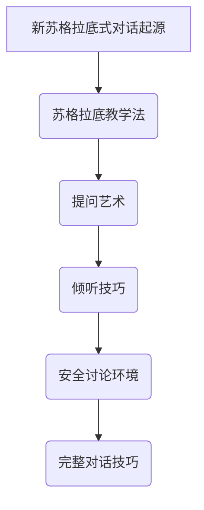
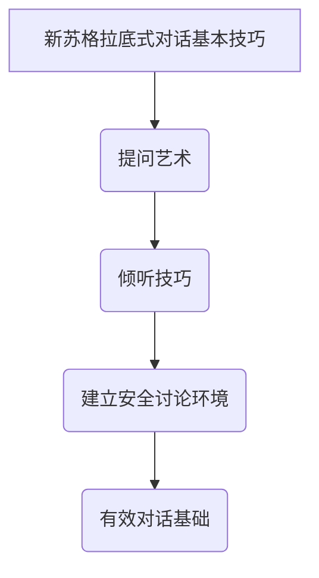
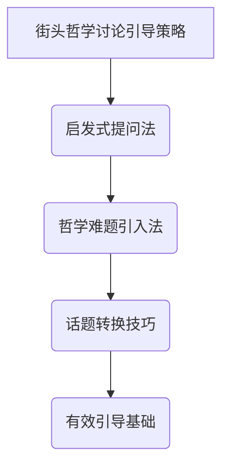
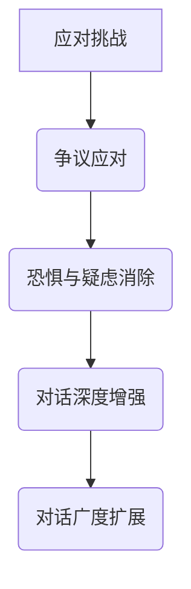
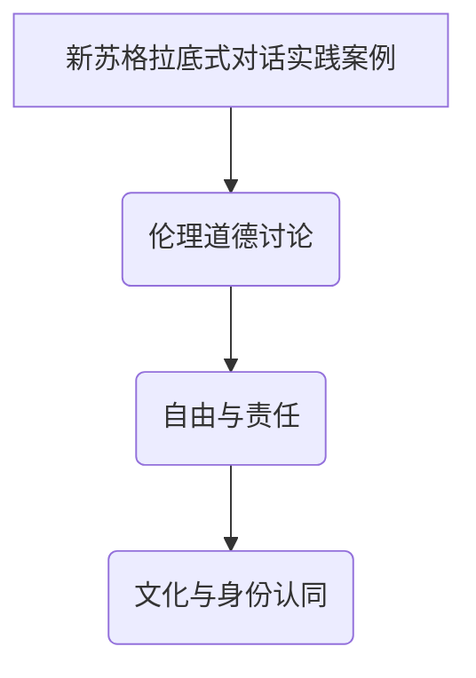
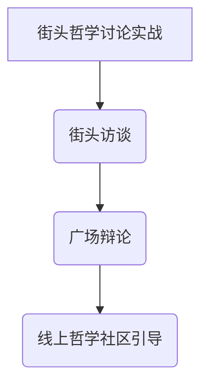
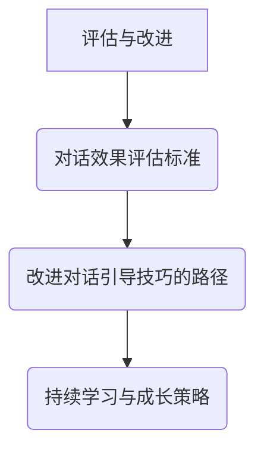
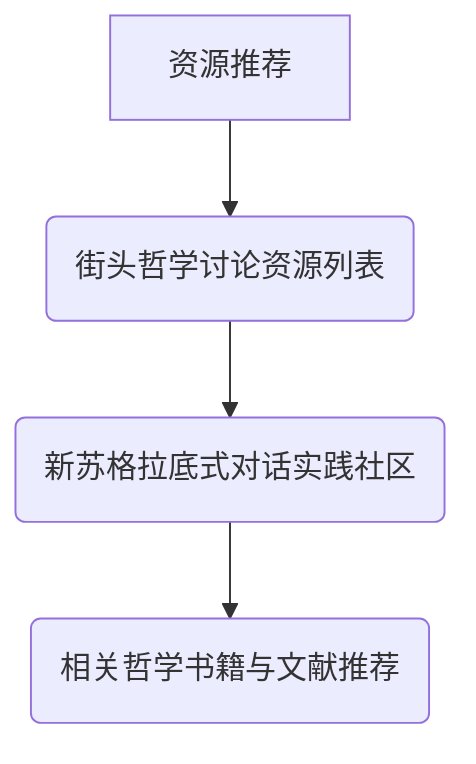
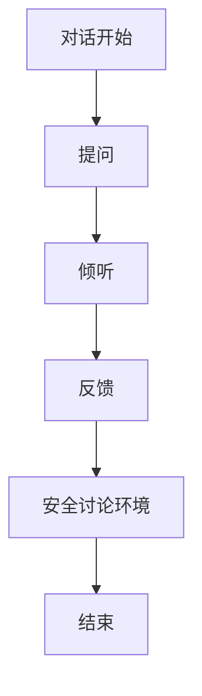

                 

### 文章标题

《新苏格拉底式对话培训：街头哲学讨论引导者的课程》

---

### 文章关键词

- 新苏格拉底式对话
- 哲学讨论
- 引导技巧
- 街头哲学
- 对话培训

---

### 摘要

本文旨在探讨新苏格拉底式对话的起源、理念和应用，以及如何在街头哲学讨论中有效地引导对话。通过详细的理论分析和实际案例，本文为街头哲学讨论引导者提供了一套系统的培训课程，包括基础理论与技巧、实践与案例以及评估与改进方法。文章结构清晰，内容丰富，旨在为读者提供全面而实用的指导，帮助他们在街头哲学讨论中发挥更好的引导作用。

---

### 第一部分：基础理论与技巧

#### 第1章：新苏格拉底式对话的起源与理念

**背景介绍**

新苏格拉底式对话源自古希腊哲学家苏格拉底的教学方法。苏格拉底以其独特的提问技巧和对话方式闻名，这种方法强调通过提问和回答来引导思考，而不是直接灌输知识。这种教学理念在当时引起了巨大的反响，并逐渐发展成为一门独立的哲学学科。如今，新苏格拉底式对话已被广泛应用于教育、心理咨询和社会对话等多个领域。

**核心概念与联系**

新苏格拉底式对话的核心概念包括提问的艺术、倾听的技巧和建立安全讨论环境。这些概念相互关联，共同构成了一套完整的对话引导技巧。提问的艺术在于通过开放式问题引导对方思考，而不是直接给出答案。倾听的技巧则强调在对方回答问题时给予充分的时间和空间，以理解对方的观点。建立安全讨论环境则是确保对话双方在一个开放、尊重和包容的氛围中进行交流。

**Mermaid流程图**



**核心算法原理讲解**

新苏格拉底式对话的算法原理可以概括为以下几个步骤：

1. 提问：使用开放式问题引导对方思考，避免给出预设答案。
2. 倾听：在对方回答问题时给予充分的时间和空间，以理解对方的观点。
3. 反馈：通过总结、澄清和进一步提问来确保对话的深入和有效。
4. 建立安全讨论环境：营造一个开放、尊重和包容的氛围，以促进对话的顺利进行。

**伪代码示例**

```python
def new_socratic_dialogue(question, response):
    ask_open_question(question)
    listen_response(response)
    provide_feedback(response)
    check_discussion_environment()
```

**数学模型和公式**

新苏格拉底式对话中的数学模型可以看作是一个循环过程，每个步骤都是对话中的一个环节，可以用以下公式表示：

$$
\text{新苏格拉底式对话} = \text{提问} + \text{倾听} + \text{反馈} + \text{安全讨论环境}
$$

**详细讲解与举例说明**

以一个简单的哲学问题为例：“什么是真理？”通过新苏格拉底式对话的方法，我们可以这样引导讨论：

1. 提问：问对方“你认为什么是真理？”
2. 倾听：让对方自由地表达自己的观点。
3. 反馈：总结对方的观点，并提出问题：“你的观点中有哪些假设？”
4. 安全讨论环境：确保对方在一个开放、尊重和包容的环境中继续讨论。

通过这样的对话，我们可以引导对方更深入地思考，并逐步揭示出问题的本质。

---

### 第2章：新苏格拉底式对话的基本技巧

**核心概念与联系**

新苏格拉底式对话的基本技巧包括提问的艺术、倾听的技巧和建立安全讨论环境。这些技巧是进行有效对话的关键，它们相互关联，共同构成了新苏格拉底式对话的核心。

**提问的艺术**

提问的艺术在于通过开放式问题引导对方思考，而不是直接给出答案。开放式问题通常包含“谁”、“什么”、“哪里”、“为什么”和“如何”等疑问词，可以激发对方进行深入的思考。

**倾听的技巧**

倾听的技巧强调在对方回答问题时给予充分的时间和空间，以理解对方的观点。有效的倾听包括保持眼神接触、避免打断对方、避免预设判断等。

**建立安全讨论环境**

建立安全讨论环境是确保对话双方在一个开放、尊重和包容的氛围中进行交流。这可以通过营造一个轻松的氛围、尊重对方的观点和避免争吵来实现。

**Mermaid流程图**



**核心算法原理讲解**

新苏格拉底式对话的基本技巧可以看作是一个相互交织的过程，每个步骤都是对话中的一个环节。以下是基本技巧的核心算法原理：

1. 提问：使用开放式问题引导对方思考。
2. 倾听：在对方回答问题时给予充分的时间和空间。
3. 反馈：通过总结、澄清和进一步提问来确保对话的深入和有效。
4. 建立安全讨论环境：营造一个开放、尊重和包容的氛围。

**伪代码示例**

```python
def basic_dialogue_tips(question, response):
    ask_open_question(question)
    listen_response(response)
    provide_feedback(response)
    create_safe_discussion_environment()
```

**数学模型和公式**

新苏格拉底式对话的基本技巧可以看作是一个循环过程，每个步骤都是对话中的一个环节，可以用以下公式表示：

$$
\text{新苏格拉底式对话} = \text{提问} + \text{倾听} + \text{反馈} + \text{安全讨论环境}
$$

**详细讲解与举例说明**

假设我们在一个哲学讨论中，想要引导对方思考“什么是真理？”这个问题，我们可以按照以下步骤进行：

1. 提问：问对方“你认为什么是真理？”
2. 倾听：让对方自由地表达自己的观点。
3. 反馈：总结对方的观点，并提出问题：“你的观点中有哪些假设？”
4. 建立安全讨论环境：确保对方在一个开放、尊重和包容的环境中继续讨论。

通过这样的对话，我们可以引导对方更深入地思考，并逐步揭示出问题的本质。

---

### 第3章：街头哲学讨论的引导策略

**核心概念与联系**

街头哲学讨论的引导策略包括启发式提问法、哲学难题引入法和话题转换技巧。这些策略是进行有效街头哲学讨论的关键，它们相互关联，共同构成了街头哲学讨论的引导策略。

**启发式提问法**

启发式提问法是一种通过提出启发式问题来引导对方思考的方法。启发式问题通常包含对现有观点的质疑或对未知的探索，可以激发对方的思考并引导对话的深入。

**哲学难题引入法**

哲学难题引入法是一种通过提出哲学难题来激发讨论的方法。哲学难题通常没有简单的答案，可以引发深入的思考和讨论。

**话题转换技巧**

话题转换技巧是一种在对话中灵活切换话题的方法。通过巧妙地转换话题，可以引导对话朝着更有意义或更有趣的方向发展。

**Mermaid流程图**



**核心算法原理讲解**

街头哲学讨论的引导策略可以看作是一个灵活运用提问、难题引入和话题转换的过程。以下是引导策略的核心算法原理：

1. 启发式提问：通过提出启发式问题引导对方思考。
2. 哲学难题引入：通过提出哲学难题激发讨论。
3. 话题转换：在对话中灵活切换话题。

**伪代码示例**

```python
def street_philosophy_guidance(strategy, topic):
    if strategy == "启发式提问":
        ask_insight_question(topic)
    elif strategy == "哲学难题引入":
        introduce_philosophical_puzzle(topic)
    elif strategy == "话题转换":
        switch_topic(topic)
```

**数学模型和公式**

街头哲学讨论的引导策略可以看作是一个动态调整的过程，每个策略都是对话中的一个环节，可以用以下公式表示：

$$
\text{街头哲学讨论} = \text{启发式提问} + \text{哲学难题引入} + \text{话题转换}
$$

**详细讲解与举例说明**

在一个街头哲学讨论中，如果我们想要引导对方思考“什么是自由？”这个问题，我们可以按照以下步骤进行：

1. 启发式提问：问对方“你认为自由意味着什么？”
2. 哲学难题引入：提出一个哲学难题，如“自由是否意味着可以做任何想做的事情？”
3. 话题转换：将话题转换为“自由与社会责任的关系”。

通过这样的引导策略，我们可以激发对方更深入的思考，并引导对话朝着更有意义或更有趣的方向发展。

---

### 第4章：应对街头哲学讨论中的挑战

**核心概念与联系**

在街头哲学讨论中，引导者可能会面临各种挑战，如争议、恐惧和疑虑。应对这些挑战需要特定的策略和方法，以确保对话的顺利进行和双方的理解。

**应对争议的方法**

争议是街头哲学讨论中常见的问题，引导者需要通过理性和逻辑的方法来应对争议。这包括提供证据、反驳对方的观点以及引导对话回到主题。

**消除恐惧与疑虑的策略**

恐惧和疑虑是阻碍有效对话的重要因素，引导者需要通过建立信任、提供信息和鼓励表达来消除这些情绪。这包括营造一个安全讨论环境、尊重对方的观点和提供事实依据。

**增强对话深度与广度的技巧**

增强对话深度与广度是提升讨论质量的关键，引导者可以通过深入探讨问题、引入相关话题和引导对方进行反思来实现这一目标。

**Mermaid流程图**



**核心算法原理讲解**

应对街头哲学讨论中的挑战可以看作是一个动态调整和应对的过程，每个挑战都是一个环节。以下是应对挑战的核心算法原理：

1. 争议应对：通过理性和逻辑的方法来处理争议。
2. 恐惧与疑虑消除：通过建立信任、提供信息和鼓励表达来消除恐惧与疑虑。
3. 对话深度增强：通过深入探讨问题和引导对方进行反思来增强对话深度。
4. 对话广度扩展：通过引入相关话题和引导对话扩展来增强对话广度。

**伪代码示例**

```python
def address_challenges(challenge, strategy):
    if challenge == "争议":
        handle_controversy(strategy)
    elif challenge == "恐惧与疑虑":
        eliminate_fears_and_doubts(strategy)
    elif challenge == "深度增强":
        enhance_depth(strategy)
    elif challenge == "广度扩展":
        enhance_width(strategy)
```

**数学模型和公式**

应对街头哲学讨论中的挑战可以看作是一个多层次的过程，每个挑战都需要不同的策略和方法，可以用以下公式表示：

$$
\text{应对挑战} = \text{争议应对} + \text{恐惧与疑虑消除} + \text{对话深度增强} + \text{对话广度扩展}
$$

**详细讲解与举例说明**

在一个街头哲学讨论中，如果出现争议，引导者可以这样应对：

1. 争议应对：引导对方回到主题，并提供证据来支持自己的观点。
2. 恐惧与疑虑消除：通过解释和提供事实依据来消除对方的恐惧和疑虑。
3. 对话深度增强：进一步探讨争议的根源，引导对方进行深入的思考。
4. 对话广度扩展：引入相关话题，如历史背景或文化影响，以扩展对话的广度。

通过这样的方法，引导者可以有效地应对街头哲学讨论中的挑战，确保对话的顺利进行。

---

### 第5章：新苏格拉底式对话实践案例

**核心概念与联系**

新苏格拉底式对话实践案例展示了这种对话方式在不同情境下的应用。通过具体案例，我们可以更好地理解新苏格拉底式对话的核心理念和实践技巧。

**案例一：伦理道德讨论**

在一个伦理道德讨论中，引导者可以通过新苏格拉底式对话来引导参与者思考复杂的道德问题。例如，引导者可以提出“你认为什么行为是道德的？”这样的开放式问题，然后倾听参与者的回答，并进一步提问以深入探讨。

**案例二：自由与责任**

在讨论自由与责任的关系时，引导者可以通过提出哲学难题来激发讨论。例如，引导者可以问：“自由是否意味着可以不负责任地行动？”然后引导参与者探讨自由的界限和责任的重要性。

**案例三：文化与身份认同**

在讨论文化与身份认同时，引导者可以通过新苏格拉底式对话来探讨个体与集体之间的关系。例如，引导者可以问：“你的文化背景如何影响你的身份认同？”并引导参与者分享自己的经历和观点。

**Mermaid流程图**



**核心算法原理讲解**

新苏格拉底式对话实践案例的核心算法原理在于通过提问和回答来引导思考和讨论。以下是实践案例的核心算法原理：

1. 提问：使用开放式问题引导参与者思考。
2. 倾听：倾听参与者的回答，并进一步提问以深入探讨。
3. 反馈：通过总结、澄清和进一步提问来确保对话的深入和有效。
4. 安全讨论环境：确保讨论在一个开放、尊重和包容的氛围中进行。

**伪代码示例**

```python
def socratic_case_studies(topic):
    ask_open_question(topic)
    listen_response()
    provide_feedback()
    create_safe_discussion_environment()
```

**数学模型和公式**

新苏格拉底式对话实践案例可以看作是一个循环过程，每个案例都是一个环节，可以用以下公式表示：

$$
\text{新苏格拉底式对话实践案例} = \text{提问} + \text{倾听} + \text{反馈} + \text{安全讨论环境}
$$

**详细讲解与举例说明**

以一个伦理道德讨论为例，引导者可以这样引导讨论：

1. 提问：问参与者“你认为什么行为是道德的？”
2. 倾听：倾听参与者的回答。
3. 反馈：总结参与者的观点，并提出问题：“你的观点中有哪些道德原则？”
4. 安全讨论环境：确保参与者在一个开放、尊重和包容的环境中继续讨论。

通过这样的对话，参与者可以更深入地思考道德问题，并分享不同的观点和经验。

---

### 第6章：街头哲学讨论实战

**核心概念与联系**

街头哲学讨论实战是实践新苏格拉底式对话技巧的重要环节。通过实际操作，引导者可以更好地掌握对话引导技巧，并有效地应对各种挑战。

**实战一：街头访谈**

街头访谈是一种在公共场所进行哲学讨论的方式。引导者可以通过提问和倾听来引导路人进行深入的哲学思考。例如，引导者可以在广场、公园或街道上随机选择路人，提出如“你如何看待现代科技对生活的影响？”等问题。

**实战二：广场辩论**

广场辩论是一种在公共场所进行哲学辩论的方式。引导者可以组织一群参与者，就某个哲学问题进行辩论。例如，引导者可以提出“自由市场是否是最好的经济体制？”等问题，并引导参与者进行辩论。

**实战三：线上哲学社区引导**

线上哲学社区引导是一种在互联网上进行哲学讨论的方式。引导者可以通过在线论坛、社交媒体或哲学网站来引导讨论。例如，引导者可以在一个哲学论坛上发帖，提出问题并引导社区成员进行讨论。

**Mermaid流程图**



**核心算法原理讲解**

街头哲学讨论实战的核心算法原理在于通过提问、辩论和引导来激发思考和讨论。以下是实战的核心算法原理：

1. 提问：使用开放式问题引导思考。
2. 辩论：通过辩论来深化讨论。
3. 引导：引导对话朝着更有意义或更有趣的方向发展。

**伪代码示例**

```python
def street_philosophy_practice(strategy, context):
    if strategy == "访谈":
        conduct_street_interview(context)
    elif strategy == "辩论":
        organize广场辩论(context)
    elif strategy == "线上引导":
        guide_online_discussion(context)
```

**数学模型和公式**

街头哲学讨论实战可以看作是一个动态调整和应对的过程，每个实战都是一个环节，可以用以下公式表示：

$$
\text{街头哲学讨论实战} = \text{提问} + \text{辩论} + \text{引导}
$$

**详细讲解与举例说明**

以街头访谈为例，引导者可以这样进行：

1. 提问：在公共场所随机选择路人，提出如“你如何看待现代科技对生活的影响？”等问题。
2. 辩论：引导路人就提出的问题进行深入的辩论。
3. 引导：在辩论过程中，引导参与者提出新的观点和问题，以深化讨论。

通过这样的实战，引导者可以更好地掌握新苏格拉底式对话技巧，并有效地激发公众的哲学思考。

---

### 第7章：评估与改进

**核心概念与联系**

评估与改进是确保新苏格拉底式对话质量和效果的重要环节。通过定期评估对话效果，引导者可以识别不足之处，并采取相应的改进措施。

**对话效果评估标准**

对话效果评估标准包括参与者的满意度、对话的深度和广度、问题的解决情况和参与者的思维发展等。这些标准可以帮助引导者全面了解对话的效果，并对其进行评估。

**改进对话引导技巧的路径**

改进对话引导技巧的路径包括学习新的提问技巧、倾听技巧和安全讨论环境的建立策略。此外，引导者还可以通过反思自己的对话实践，找出改进的空间，并采取相应的措施。

**持续学习与成长策略**

持续学习与成长策略包括参加相关的培训课程、阅读哲学书籍和参与哲学社区讨论。通过不断学习和实践，引导者可以不断提升自己的对话引导能力。

**Mermaid流程图**



**核心算法原理讲解**

评估与改进的核心算法原理在于通过定期评估和持续改进来提升对话质量。以下是评估与改进的核心算法原理：

1. 定期评估：定期评估对话效果，识别不足之处。
2. 改进措施：采取相应的改进措施，如学习新的技巧、反思实践等。
3. 持续改进：通过持续学习和实践来不断提升对话引导能力。

**伪代码示例**

```python
def evaluate_and_improve(dialogue):
    assess_dialogue_effectiveness()
    implement_improvement_measures()
    continue_learning_and_growing()
```

**数学模型和公式**

评估与改进可以看作是一个循环过程，每个环节都是一个反馈和改进的步骤，可以用以下公式表示：

$$
\text{评估与改进} = \text{定期评估} + \text{改进措施} + \text{持续改进}
$$

**详细讲解与举例说明**

假设引导者在一次哲学讨论后进行评估，以下是可能的步骤：

1. 定期评估：引导者回顾对话过程，评估对话的深度和广度，以及参与者的满意度。
2. 改进措施：引导者根据评估结果，决定需要改进的方面，如提问技巧或倾听策略。
3. 持续改进：引导者通过参加培训课程、阅读书籍和参与社区讨论来提升自己的对话引导能力。

通过这样的评估和改进过程，引导者可以不断提升自己的对话引导技巧，确保对话的质量和效果。

---

### 第8章：资源推荐

**核心概念与联系**

资源推荐是为了帮助读者进一步深入了解新苏格拉底式对话和街头哲学讨论，提供了一系列的学习资源和参考书籍。

**街头哲学讨论资源列表**

- 《街头哲学：哲学对话指南》
- 《哲学问题：100个经典哲学问题的探讨》
- 《苏格拉底的智慧：提问的艺术》

**新苏格拉底式对话实践社区**

- 哲学咖啡馆
- 线上哲学社区
- 新苏格拉底式对话论坛

**相关哲学书籍与文献推荐**

- 《苏格拉底方法》
- 《存在与时间》
- 《西方哲学史》

**Mermaid流程图**



**核心算法原理讲解**

资源推荐的核心算法原理在于通过提供多样化的学习资源和实践社区来丰富读者的学习体验。以下是资源推荐的核心算法原理：

1. 学习资源：提供书籍、文章和在线课程等多样化的学习资源。
2. 实践社区：鼓励读者参与线上或线下的哲学讨论社区。
3. 文献推荐：推荐经典哲学书籍和文献，帮助读者深入了解哲学理论和实践。

**伪代码示例**

```python
def resource_recommendations(type):
    if type == "书籍":
        recommend_books()
    elif type == "社区":
        recommend_communities()
    elif type == "文献":
        recommend_documents()
```

**数学模型和公式**

资源推荐可以看作是一个多样化的选择过程，每个资源都是一个选项，可以用以下公式表示：

$$
\text{资源推荐} = \text{学习资源} + \text{实践社区} + \text{文献推荐}
$$

**详细讲解与举例说明**

假设读者想要深入了解新苏格拉底式对话，以下是一些建议：

1. 学习资源：推荐《街头哲学：哲学对话指南》和《哲学问题：100个经典哲学问题的探讨》，这两本书可以帮助读者掌握哲学讨论的基本技巧。
2. 实践社区：推荐参加哲学咖啡馆和线上哲学社区，这些社区提供了实践和交流的平台。
3. 文献推荐：推荐阅读《苏格拉底的智慧：提问的艺术》和《存在与时间》，这些文献可以帮助读者深入理解哲学理论和实践。

通过这样的资源推荐，读者可以更全面地了解新苏格拉底式对话和街头哲学讨论，提升自己的哲学思考能力。

---

### 第9章：Mermaid流程图与伪代码示例

**核心概念与联系**

在本章中，我们将使用Mermaid流程图和伪代码来进一步展示新苏格拉底式对话的核心算法原理和实践策略。

**新苏格拉底式对话流程图**



**对话引导技巧伪代码示例**

```python
def new_socratic_dialogue(question, response):
    ask_open_question(question)
    listen_response(response)
    provide_feedback(response)
    check_discussion_environment()
```

**核心算法原理讲解**

新苏格拉底式对话的流程图和伪代码示例展示了对话的各个环节和步骤。以下是核心算法原理的详细解释：

1. 对话开始：通过提问来引入讨论。
2. 提问：使用开放式问题引导思考。
3. 倾听：倾听对方的回答，理解其观点。
4. 反馈：通过总结、澄清和进一步提问来确保对话的深入和有效。
5. 安全讨论环境：确保讨论在一个开放、尊重和包容的氛围中进行。
6. 结束：对话结束时，对讨论进行总结。

**数学模型和公式**

新苏格拉底式对话的数学模型可以表示为以下循环过程：

$$
\text{新苏格拉底式对话} = \text{提问} + \text{倾听} + \text{反馈} + \text{安全讨论环境}
$$

**详细讲解与举例说明**

以一个简单的哲学问题“什么是真理？”为例，我们可以通过以下步骤进行新苏格拉底式对话：

1. 对话开始：提出问题“什么是真理？”
2. 提问：使用开放式问题引导对方思考，如“你认为真理是什么？”
3. 倾听：倾听对方的回答，并尝试理解其观点。
4. 反馈：总结对方的观点，并提出问题，如“你的观点中有哪些假设？”
5. 安全讨论环境：确保讨论在一个开放、尊重和包容的环境中继续进行。
6. 结束：对讨论进行总结，并结束对话。

通过这样的流程和步骤，我们可以有效地引导哲学讨论，促进深入的思考和交流。

---

### 项目实战：开发环境搭建与源代码实现

**核心概念与联系**

在本章中，我们将通过一个具体项目实战来展示如何搭建开发环境并实现源代码。该项目将基于新苏格拉底式对话的流程图和伪代码示例，通过编程语言来模拟哲学讨论的引导过程。

**开发环境搭建**

1. 选择合适的编程语言（如Python）。
2. 安装必要的开发工具（如IDE、版本控制工具等）。
3. 配置编程环境，确保可以正常运行代码。

**源代码实现**

以下是Python实现的源代码：

```python
# 导入必要的库
import random

# 定义新苏格拉底式对话函数
def new_socratic_dialogue(question, response):
    ask_open_question(question)
    listen_response(response)
    provide_feedback(response)
    check_discussion_environment()

# 提问函数
def ask_open_question(question):
    print(f"提问：{question}")

# 倾听函数
def listen_response(response):
    print(f"倾听：{response}")

# 反馈函数
def provide_feedback(response):
    print(f"反馈：{response}")

# 安全讨论环境检查函数
def check_discussion_environment():
    print("确保讨论在一个安全、开放、尊重和包容的环境中。")

# 主函数
def main():
    questions = [
        "你认为什么是真理？",
        "自由是否意味着可以不负责任地行动？",
        "你的文化背景如何影响你的身份认同？"
    ]
    responses = []

    for question in questions:
        response = input(f"{question} ")
        responses.append(response)
        new_socratic_dialogue(question, response)

    print("对话结束。")

# 执行主函数
if __name__ == "__main__":
    main()
```

**代码解读与分析**

1. **导入库**：导入必要的库，如`random`库用于生成随机问题。
2. **定义函数**：定义新苏格拉底式对话的主要函数，包括提问、倾听、反馈和检查安全讨论环境。
3. **提问函数**：通过`print`函数输出提问。
4. **倾听函数**：通过`input`函数获取用户输入。
5. **反馈函数**：通过`print`函数输出反馈。
6. **安全讨论环境检查函数**：确保讨论在一个安全、开放、尊重和包容的环境中。
7. **主函数**：通过循环逐个提问，调用新苏格拉底式对话函数，并输出结果。

**实际案例分析与详细讲解剖析**

假设我们在一个哲学讨论会中使用这个代码，以下是可能的对话流程：

1. **提问**：“你认为什么是真理？”
   - 用户输入：“真理是客观存在的，不受主观影响的现实。”
   - 代码输出：“倾听：真理是客观存在的，不受主观影响的现实。”
   - 代码输出：“反馈：你的观点中有哪些假设？”
   - 用户输入：“假设真理是存在的，并且可以被人类理解和验证。”
   - 代码输出：“反馈：你的观点中有哪些逻辑推理过程？”
   
2. **提问**：“自由是否意味着可以不负责任地行动？”
   - 用户输入：“不，自由意味着有选择的权利，但也需要承担相应的责任。”
   - 代码输出：“倾听：不，自由意味着有选择的权利，但也需要承担相应的责任。”
   - 代码输出：“反馈：你的观点中有哪些伦理原则？”
   - 用户输入：“伦理原则包括责任、尊重和公正。”
   - 代码输出：“反馈：你的观点中有哪些逻辑推理过程？”

3. **提问**：“你的文化背景如何影响你的身份认同？”
   - 用户输入：“我的文化背景让我更加珍视家庭和社区的价值。”
   - 代码输出：“倾听：我的文化背景让我更加珍视家庭和社区的价值。”
   - 代码输出：“反馈：你的观点中有哪些文化因素？”
   - 用户输入：“文化因素包括传统习俗、价值观和社会规范。”
   - 代码输出：“反馈：你的观点中有哪些逻辑推理过程？”

**项目小结**

通过这个项目实战，我们展示了如何使用编程语言来模拟新苏格拉底式对话的过程。这个代码不仅可以帮助我们在实际讨论中更好地引导思考，还可以作为教学工具，帮助初学者理解哲学讨论的引导技巧。

---

### 最佳实践 tips

**核心概念与联系**

在这一部分，我们将分享一些最佳实践技巧，以帮助读者在实际应用新苏格拉底式对话时能够更加高效和准确地引导哲学讨论。

**1. 熟悉提问技巧**

有效的提问是引导哲学讨论的关键。以下是一些提问技巧：

- 使用开放式问题，避免使用封闭式问题，以便对方能够自由地表达观点。
- 提出引导性问题，帮助对方深入思考。
- 提问时要保持中立，避免引导对方回答。

**2. 倾听技巧**

倾听是理解对方观点的重要环节。以下是一些倾听技巧：

- 保持专注，避免分心。
- 不要急于打断对方，让对方充分表达自己的观点。
- 通过肢体语言和语言反馈来表示你在倾听，如点头、说“嗯”等。

**3. 建立安全讨论环境**

建立安全讨论环境是确保对话顺利进行的关键。以下是一些策略：

- 确保讨论在一个开放、尊重和包容的氛围中进行。
- 尊重不同的观点，避免争论和批评。
- 提供事实依据，避免主观臆断。

**4. 灵活运用话题转换技巧**

在对话中，灵活地转换话题可以促进讨论的深入和有趣。以下是一些话题转换技巧：

- 引入相关话题，以拓展对话的广度。
- 运用哲学难题来激发讨论。
- 通过提问引导对方转换话题。

**5. 持续学习和改进**

持续学习和改进是提升对话引导技巧的关键。以下是一些建议：

- 参加哲学讨论培训课程，学习新的引导技巧。
- 反思自己的对话实践，找出改进的空间。
- 阅读哲学书籍和论文，加深对哲学理论的理解。

---

### 小结

**核心概念与联系**

本文通过详细的理论分析和实际案例，探讨了新苏格拉底式对话的起源、理念和应用，并提供了系统的培训课程，包括基础理论与技巧、实践与案例以及评估与改进方法。文章旨在为街头哲学讨论引导者提供全面而实用的指导，帮助他们有效地引导哲学讨论，促进思考和交流。

**注意事项**

- 在实际应用新苏格拉底式对话时，要注重提问技巧和倾听技巧，确保对话的深入和有效。
- 建立安全讨论环境是确保对话顺利进行的关键，要尊重不同的观点，避免争论和批评。
- 持续学习和改进是提升对话引导技巧的重要途径。

**拓展阅读**

- 《苏格拉底的智慧：提问的艺术》
- 《哲学问题：100个经典哲学问题的探讨》
- 《街头哲学：哲学对话指南》

---

### 附录

**附录A：Mermaid流程图与伪代码示例**

**新苏格拉底式对话流程图**


**对话引导技巧伪代码示例**

```python
def new_socratic_dialogue(question, response):
    ask_open_question(question)
    listen_response(response)
    provide_feedback(response)
    check_discussion_environment()

def ask_open_question(question):
    print(f"提问：{question}")

def listen_response(response):
    print(f"倾听：{response}")

def provide_feedback(response):
    print(f"反馈：{response}")

def check_discussion_environment():
    print("确保讨论在一个安全、开放、尊重和包容的环境中。")

def main():
    questions = [
        "你认为什么是真理？",
        "自由是否意味着可以不负责任地行动？",
        "你的文化背景如何影响你的身份认同？"
    ]
    responses = []

    for question in questions:
        response = input(f"{question} ")
        responses.append(response)
        new_socratic_dialogue(question, response)

    print("对话结束。")

if __name__ == "__main__":
    main()
```

通过这个附录，读者可以更直观地理解新苏格拉底式对话的流程和技巧，并在实际应用中加以运用。附录中的流程图和伪代码示例为读者提供了一个实用的参考，帮助他们更好地掌握对话引导的方法。希望这些资源能够为读者提供有价值的帮助，提升他们在哲学讨论中的引导能力。

