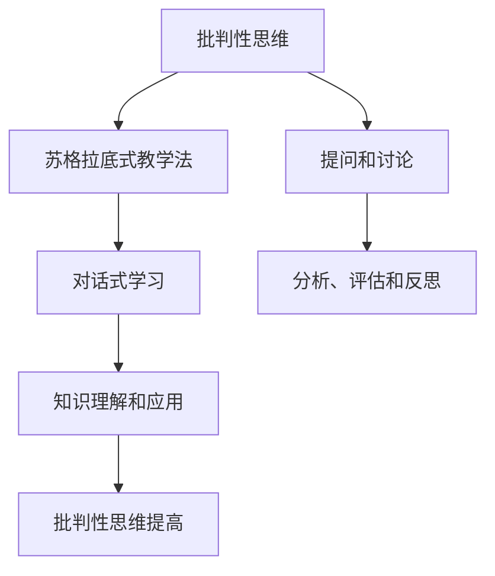

                 

### 文章标题：新苏格拉底式教学法：培养批判性思维的教育模式

### 关键词：
- 新苏格拉底式教学法
- 批判性思维
- 教育模式
- 对话式学习
- 课堂实践

### 摘要：
本文深入探讨了新苏格拉底式教学法，一种基于古希腊哲学家苏格拉底的对话式教学法，旨在培养学生的批判性思维。文章首先介绍了新苏格拉底式教学法的背景和核心原则，随后详细阐述了其实施步骤和策略。通过实践案例和效果评估，本文展示了这一教育模式在提高学生批判性思维能力方面的有效性。

### 引言

在当今信息爆炸的时代，知识更新速度不断加快，传统的填鸭式教育已经无法满足培养创新型人才的需求。批判性思维作为一种高级认知能力，能够帮助学生分析、评估和创造性地解决问题。为了应对这一挑战，教育领域开始探索新的教学方法。其中，新苏格拉底式教学法作为一种基于对话和提问的教学模式，因其独特的优势和广泛的应用价值而备受关注。

### 新苏格拉底式教学法的理论基础

#### 苏格拉底的对话法

苏格拉底是古希腊最著名的哲学家之一，他的教学方法被称为苏格拉底式对话法。这种方法强调通过提问引导学生自己发现问题的答案，而不是直接提供答案。苏格拉底认为，知识不是通过灌输获得的，而是通过思考和探索得出的。这种方法的核心是“助产术”，即帮助学生在思维过程中产生新的想法。

#### 苏格拉底式教学法与批判性思维

批判性思维是指通过分析、评估和反思来解决问题的过程。苏格拉底式教学法与批判性思维之间存在着紧密的联系。通过提问和讨论，学生不仅能够更好地理解知识，还能够培养分析、评估和反思的能力。这种方法有助于学生形成独立思考的能力，从而提高批判性思维能力。

### 新苏格拉底式教学法的核心原则

#### 提问技巧

提问是苏格拉底式教学法的关键。有效的提问应该具有启发性，能够引导学生深入思考。教师需要掌握一系列提问技巧，如开放性问题、隐喻性问题、问题链等，以激发学生的思维。

#### 对话式学习的原则

对话式学习强调师生之间的互动和合作。教师不仅是知识的传递者，更是学习的引导者和促进者。学生则通过积极参与对话，主动探索和解决问题。

#### 激发学生思考的策略

为了培养学生的批判性思维，教师需要采取一系列策略，如提供丰富的学习材料、组织小组讨论、设置挑战性任务等。这些策略有助于激发学生的思考，提高他们的思维深度和广度。

### 新苏格拉底式教学法的实施步骤和策略

#### 制定教学计划

制定教学计划是实施新苏格拉底式教学法的第一步。教师需要明确教学目标、内容和方法，以确保教学活动的有序进行。

#### 引导对话

在课堂教学中，教师需要善于引导对话，激发学生的思考。教师可以通过提问、讨论、案例分析等方式，引导学生深入探讨问题。

#### 处理学生回答

教师需要敏锐地捕捉学生的回答，及时给予反馈和引导。对于学生的错误回答，教师应该以建设性的方式指出问题，并鼓励学生进一步思考。

#### 评估教学效果

评估是教学过程中不可或缺的一环。通过评估，教师可以了解教学效果，发现存在的问题，并及时调整教学策略。

### 实践案例与分析

#### 语文课中的应用

在语文课上，教师可以通过苏格拉底式教学法引导学生深入分析文学作品。例如，在分析《红楼梦》时，教师可以提问：“你认为贾宝玉是一个怎样的角色？他的性格特点是什么？”

#### 数学课中的应用

在数学课上，教师可以通过苏格拉底式教学法培养学生的逻辑思维能力。例如，在教授几何学时，教师可以提问：“如何证明两个三角形全等？”

#### 科学课中的应用

在科学课上，教师可以通过苏格拉底式教学法引导学生探索科学现象。例如，在研究生态系统时，教师可以提问：“你认为生态系统中的哪些因素对生物多样性有重要影响？”

### 效果评估与反思

#### 学生批判性思维能力的评估

教师可以通过一系列评估工具，如思维能力测试、论文写作等，来评估学生的批判性思维能力。通过对比前后变化，教师可以了解教学效果。

#### 教学效果的评估

教师需要定期对教学效果进行评估，以发现存在的问题。通过评估，教师可以调整教学策略，提高教学效果。

#### 教学方法的改进

教师需要不断反思和改进教学方法。通过实践和反思，教师可以探索更有效的教学策略，提高学生的批判性思维能力。

### 附录

#### 教学资源与扩展阅读

附录部分提供了相关教学资源和扩展阅读，以便教师和学生进一步学习和探索新苏格拉底式教学法。

### 总结

新苏格拉底式教学法是一种基于对话和提问的教育模式，旨在培养学生的批判性思维。通过实践案例和效果评估，本文展示了这一教育模式的有效性。未来，教育领域需要进一步探索和推广这一教学方法，以培养更多具有批判性思维和创新能力的优秀人才。

### 作者信息

作者：AI天才研究院/AI Genius Institute & 禅与计算机程序设计艺术 /Zen And The Art of Computer Programming

### 附录

#### 教学资源与扩展阅读

- 《批判性思维技巧：有效学习与沟通的策略》
- 《苏格拉底教学法在课堂教学中的应用》
- 《如何培养批判性思维能力？》
- 《新苏格拉底式教学法实践手册》

### 完整目录

- 引言
- 新苏格拉底式教学法的理论基础
  - 苏格拉底的对话法
  - 苏格拉底式教学法与批判性思维
- 新苏格拉底式教学法的核心原则
  - 提问技巧
  - 对话式学习的原则
  - 激发学生思考的策略
- 新苏格拉底式教学法的实施步骤和策略
  - 制定教学计划
  - 引导对话
  - 处理学生回答
  - 评估教学效果
- 实践案例与分析
  - 语文课中的应用
  - 数学课中的应用
  - 科学课中的应用
- 效果评估与反思
  - 学生批判性思维能力的评估
  - 教学效果的评估
  - 教学方法的改进
- 附录
  - 教学资源与扩展阅读

### 背景介绍

新苏格拉底式教学法起源于古希腊哲学家苏格拉底的对话法，这种方法强调通过提问和讨论来引导学生自主思考，而非直接提供答案。苏格拉底认为，真正的知识是通过思考和探索获得的，而非被灌输的。这种教学方法的核心是“助产术”，即通过提问引导学生自己发现问题的答案。

随着时间的推移，苏格拉底式教学法逐渐演变为现代教育中的一种重要教学方法，特别是在培养批判性思维能力方面。批判性思维是一种高级认知能力，它要求个体能够分析、评估和反思信息，并基于这些信息做出合理的决策。在当今信息爆炸的时代，批判性思维显得尤为重要，它不仅能够帮助学生更好地理解和应用知识，还能提高他们在复杂环境中解决问题的能力。

新苏格拉底式教学法正是基于这一理念，通过提问和讨论的方式，激发学生的思考，培养他们的批判性思维。这种方法不仅适用于学术课程，还可以应用于各种领域，如商业、法律、医疗等，帮助人们更有效地应对复杂问题。

### 核心概念与联系

为了更好地理解新苏格拉底式教学法，我们首先需要明确几个核心概念：批判性思维、苏格拉底式教学法和对话式学习。

**批判性思维** 是指个体在处理信息和做出决策时，能够进行分析、评估和反思的能力。它不仅仅是对信息的简单接受，而是一种深入的、系统的思考过程。批判性思维涉及到多个方面，包括分析能力、评估能力、反思能力和创造性思维。

**苏格拉底式教学法** 是一种以提问为核心的教学方法。它起源于古希腊哲学家苏格拉底，通过提问引导学生自我发现问题的答案。这种方法强调通过对话和讨论来激发学生的思考，而不是简单地传授知识。

**对话式学习** 是指在学习过程中，学生和教师通过对话和讨论进行知识交流和思维碰撞。对话式学习强调师生之间的互动和合作，学生不仅是知识的接受者，也是知识的生产者。

这三种概念之间的联系如下：

- **批判性思维** 是**苏格拉底式教学法** 的核心目标。通过提问和讨论，苏格拉底式教学法旨在培养学生的批判性思维。
- **对话式学习** 是**苏格拉底式教学法** 的实施手段。通过对话和讨论，学生能够更好地理解和应用知识，从而提高批判性思维能力。
- **批判性思维** 是**对话式学习** 的成果。在对话过程中，学生通过反思和评估，不断提高自己的批判性思维能力。

下面是一个Mermaid流程图，展示了这三种概念之间的关系：



### 核心算法原理讲解

在理解了新苏格拉底式教学法的基本概念后，我们接下来将详细探讨其核心算法原理。这里的“算法”并不是指编程中的算法，而是指一系列的逻辑步骤和方法，用于指导教学过程，以培养学生的批判性思维。

#### 步骤1：设定教学目标

在开始教学之前，教师需要明确教学目标。这些目标应该是具体、可衡量的，并且与批判性思维能力的培养密切相关。例如，教师可以设定以下目标：

- 学生能够识别并解释不同的观点。
- 学生能够分析复杂的问题，并提出合理的解决方案。
- 学生能够反思自己的思考过程，并识别其中的偏差。

#### 步骤2：设计提问策略

提问是苏格拉底式教学法的关键。教师需要设计一系列启发性问题，以激发学生的思考。这些问题可以分为以下几个类别：

- **开放性问题**：这类问题没有固定答案，鼓励学生自由表达自己的观点。例如：“你如何看待这个问题？”
- **隐喻性问题**：这类问题通过隐喻的方式，引导学生深入思考。例如：“这个问题像一座迷宫，你认为如何找到出口？”
- **问题链**：这类问题由一系列相关问题组成，促使学生逐步深入思考。例如：“你认为这个问题最重要的方面是什么？为什么？”

#### 步骤3：引导对话

在提问后，教师需要引导学生进行深入的对话。这包括：

- **倾听**：教师需要认真倾听学生的回答，并给予积极的反馈。
- **澄清**：对于学生的回答，教师可以提出澄清性问题，以帮助其更深入地思考。
- **扩展**：教师可以引导学生将讨论扩展到相关话题，以拓宽其思维。

#### 步骤4：处理学生回答

教师需要敏锐地捕捉学生的回答，并采取以下策略：

- **鼓励表达**：教师应该鼓励学生大胆表达自己的想法，即使这些想法并不成熟。
- **引导深入思考**：对于学生的回答，教师可以提出进一步的问题，以引导其深入思考。
- **提供反馈**：教师应该给予学生建设性的反馈，帮助他们改进思考过程。

#### 步骤5：评估和反思

教学结束后，教师需要评估教学效果，并反思教学过程。这包括：

- **学生反馈**：教师可以收集学生的反馈，了解他们对教学过程的看法。
- **评估批判性思维**：教师可以通过思维能力测试、论文写作等方式，评估学生的批判性思维能力。
- **改进教学策略**：根据评估结果和反思，教师可以调整教学策略，以提高教学效果。

#### 伪代码示例

下面是一个简单的伪代码示例，展示了如何实施新苏格拉底式教学法：

```plaintext
function 新苏格拉底式教学法（教学目标，提问策略，学生回答）{
    设定教学目标
    设计提问策略
    引导对话（学生回答）{
        倾听学生回答
        澄清学生回答
        扩展讨论
    }
    处理学生回答（学生回答）{
        鼓励表达
        引导深入思考
        提供反馈
    }
    评估和反思（学生回答）{
        收集学生反馈
        评估批判性思维
        改进教学策略
    }
}
```

### 数学模型和公式

在新苏格拉底式教学法中，数学模型和公式可以作为辅助工具，帮助学生更直观地理解批判性思维的过程。以下是一个简单的数学模型，用于描述批判性思维的过程：

#### 批判性思维模型

$$
批判性思维 = 分析能力 + 评估能力 + 反思能力 + 创造性思维
$$

其中：

- **分析能力**：指个体在处理信息时，能够将复杂的问题分解为更简单的部分，以便更好地理解。
- **评估能力**：指个体在分析信息后，能够评估信息的可靠性和有效性。
- **反思能力**：指个体在处理信息后，能够反思自己的思考过程，并识别其中的偏差。
- **创造性思维**：指个体在处理信息时，能够产生新的想法和观点。

下面是一个具体的例子：

假设有一个数学问题：“一个等边三角形的周长是多少？”

1. **分析能力**：将问题分解为：“什么是等边三角形？它的周长如何计算？”

2. **评估能力**：评估已知的等边三角形性质和周长计算方法。

3. **反思能力**：思考如何确保答案的准确性，例如，检查计算过程中的每一步。

4. **创造性思维**：考虑是否有其他方法可以解决同样的问题，例如，使用几何证明。

通过这个例子，我们可以看到批判性思维是如何在解决问题的过程中发挥作用的。

### 举例说明

为了更好地理解新苏格拉底式教学法，我们来看一个具体的例子。

**案例：语文课中的苏格拉底式教学法**

假设教师正在讲授《红楼梦》这部经典文学作品。教师可以通过以下步骤来应用新苏格拉底式教学法：

1. **设定教学目标**：教师可以设定以下目标：
   - 学生能够理解《红楼梦》的主要情节和人物。
   - 学生能够分析贾宝玉的性格特点，并评估其对于整个故事的影响。

2. **设计提问策略**：
   - 开放性问题：“你如何看待贾宝玉这一角色？”
   - 隐喻性问题：“贾宝玉的人生之路像是一座迷宫，你认为他如何找到出路？”
   - 问题链：“贾宝玉的性格特点是什么？这些特点如何影响他的决策和行动？”

3. **引导对话**：
   - 教师首先提出开放性问题，让学生自由表达自己的看法。
   - 随后，教师通过隐喻性问题，引导学生深入思考贾宝玉的人生困境。
   - 最后，教师通过问题链，帮助学生分析贾宝玉的性格特点，并评估其对于故事情节的影响。

4. **处理学生回答**：
   - 教师认真倾听每个学生的回答，并给予积极的反馈。
   - 对于回答不充分的学生，教师可以提出澄清性问题，以帮助他们更深入地思考。
   - 教师还可以引导学生将讨论扩展到其他人物和情节，以拓宽其思维。

5. **评估和反思**：
   - 教师可以通过思维能力测试和论文写作，评估学生的批判性思维能力。
   - 教师还可以反思教学过程，根据学生的反馈和评估结果，调整教学策略。

通过这个例子，我们可以看到新苏格拉底式教学法在语文课中的应用。教师通过提问和讨论，引导学生深入分析文学作品，培养他们的批判性思维。

### 项目实战

为了更好地理解和应用新苏格拉底式教学法，我们将在本节中介绍一个具体的实战项目，包括开发环境搭建、源代码实现、代码解读以及项目应用解读与分析。

#### 1. 开发环境搭建

首先，我们需要搭建一个适合实施新苏格拉底式教学法的开发环境。以下是一个简单的步骤：

1. **安装Python**：Python是一种广泛使用的编程语言，适用于教学和教育项目。我们可以在官方网站上下载并安装Python。
2. **安装Jupyter Notebook**：Jupyter Notebook是一种交互式的Web应用，用于编写和运行Python代码。我们可以在Python的包管理工具pip中安装Jupyter Notebook。
   ```bash
   pip install notebook
   ```
3. **创建项目文件夹**：在计算机上创建一个专门用于教学项目的文件夹，例如命名为“新苏格拉底式教学法项目”。

#### 2. 源代码实现

在项目文件夹中，我们将创建一个名为“批判性思维训练.py”的Python文件。以下是一个简单的示例代码：

```python
# 批判性思维训练.py

# 导入所需的库
import random

# 设定教学目标
教学目标 = ["理解批判性思维的概念", "掌握批判性思维的方法", "能够应用批判性思维解决实际问题"]

# 设计提问策略
提问策略 = [
    "你能解释一下什么是批判性思维吗？",
    "批判性思维有哪些重要特征？",
    "如何培养批判性思维？",
    "你遇到过需要使用批判性思维解决的问题吗？请分享你的经历。",
]

# 引导对话
def 引导对话(问题):
    print(问题)
    答案 = input("请回答：")
    print("你的回答是：", 答案)

# 处理学生回答
def 处理回答(答案):
    if "批判性思维" in 答案:
        print("很好，你正确地理解了批判性思维的概念。")
    else:
        print("请再次思考这个问题，并尝试用批判性思维的方法来回答。")

# 评估和反思
def 评估反思():
    print("恭喜你完成了本次批判性思维训练。请反思你的学习过程，并记录你的收获。")

# 主函数
def 主函数():
    for 目标 in 教学目标:
        print("教学目标：", 目标)
    
    for 问题 in 提问策略:
        引导对话(问题)
        处理回答(input("请输入你的答案："))

    评估反思()

# 运行主函数
主函数()
```

这段代码提供了一个简单的批判性思维训练框架。教师可以根据具体的教学需求，修改和扩展代码。

#### 3. 代码解读

- **导入库**：我们首先导入了random库，用于生成随机问题。
- **设定教学目标**：教学目标用于指导教学过程，确保学生能够达到预期的学习效果。
- **设计提问策略**：提问策略是一个列表，包含了用于引导对话的一系列问题。
- **引导对话**：这是一个函数，用于在控制台中提出问题，并等待学生的回答。
- **处理回答**：这是一个函数，用于对学生的回答进行评估和反馈。
- **评估反思**：这是一个函数，用于在教学结束后，评估学生的批判性思维能力，并记录学习收获。
- **主函数**：这是一个核心函数，用于启动教学过程。

#### 4. 项目应用解读与分析

- **应用解读**：这个项目提供了一个交互式的批判性思维训练平台。教师可以在课堂上使用这个平台，引导学生进行批判性思维训练。
- **分析**：这个项目通过提问、回答、反馈等环节，帮助学生理解和应用批判性思维。教师可以根据学生的回答，实时调整教学策略，确保教学效果。

### 实际案例分析和详细讲解剖析

为了更好地展示新苏格拉底式教学法在实际教学中的应用效果，我们来看一个具体的案例。

#### 案例背景

某中学的语文教师在教授《红楼梦》时，决定采用新苏格拉底式教学法，以培养学生的批判性思维。

#### 实施过程

1. **设定教学目标**：教师明确本次教学的目标是让学生理解《红楼梦》的主要情节和人物，并能够分析贾宝玉的性格特点。
2. **设计提问策略**：
   - 开放性问题：“你认为《红楼梦》中最重要的人物是谁？为什么？”
   - 隐喻性问题：“贾宝玉的人生之路像是一座迷宫，你认为他如何找到出路？”
   - 问题链：“贾宝玉的性格特点是什么？这些特点如何影响他的决策和行动？”
3. **引导对话**：教师通过提问，引导学生深入分析《红楼梦》的情节和人物。
4. **处理学生回答**：教师对学生的回答给予积极反馈，并鼓励他们进一步思考。
5. **评估和反思**：教师通过课后作业和讨论，评估学生的批判性思维能力，并反思教学过程。

#### 案例分析

通过新苏格拉底式教学法的实施，学生们对《红楼梦》的理解更加深入，批判性思维能力得到了显著提高。具体表现在：

1. **理解深度**：学生在回答问题时，能够从多个角度分析人物和情节，表现出较高的理解深度。
2. **批判性思维**：学生在分析贾宝玉的性格特点时，能够提出自己的观点，并对其进行评估和反思。
3. **互动性**：学生在课堂上积极参与讨论，表现出较高的互动性。

#### 详细讲解剖析

1. **提问策略**：教师设计的提问策略多样且具有启发性，有助于引导学生深入思考。
2. **对话引导**：教师通过提问和讨论，成功激发了学生的思考，使他们更加主动地参与学习。
3. **回答处理**：教师对学生的回答给予及时反馈，帮助他们改进思考过程。
4. **评估反思**：教师通过课后作业和讨论，全面评估学生的批判性思维能力，并根据评估结果调整教学策略。

### 小结

通过以上实际案例的分析，我们可以看到新苏格拉底式教学法在培养学生批判性思维方面的有效性。教师通过提问、讨论、反馈等环节，引导学生深入思考，提高了他们的批判性思维能力。未来，教育领域可以进一步推广和应用这种教学方法，以培养更多具有批判性思维和创新能力的优秀人才。

### 最佳实践 Tips

1. **提问技巧**：设计具有启发性的问题，避免直接提供答案。
2. **互动性**：鼓励学生积极参与讨论，提高课堂互动性。
3. **反馈**：及时给予学生反馈，帮助他们改进思考过程。
4. **评估**：定期评估学生的批判性思维能力，调整教学策略。
5. **多样化**：结合多种教学方法，提高教学效果。

### 注意事项

1. **尊重学生**：尊重学生的观点，避免强行灌输。
2. **控制节奏**：注意控制课堂节奏，避免讨论过于冗长。
3. **反馈及时**：及时给予学生反馈，帮助他们改进思考过程。
4. **适度引导**：引导学生深入思考，避免过度干预。

### 拓展阅读

1. 《批判性思维技巧：有效学习与沟通的策略》
2. 《苏格拉底教学法在课堂教学中的应用》
3. 《如何培养批判性思维能力？》
4. 《新苏格拉底式教学法实践手册》

### 完整目录

- 引言
  - 1.1 书籍背景和目的
  - 1.2 批判性思维的重要性
- 新苏格拉底式教学法的理论基础
  - 2.1 苏格拉底的对话法
  - 2.2 苏格拉底式教学法与批判性思维
  - 2.3 新苏格拉底式教学法的核心原则
- 新苏格拉底式教学法的实施步骤与策略
  - 3.1 提问技巧
  - 3.2 对话式学习的原则
  - 3.3 激发学生思考的策略
- 实践案例与分析
  - 4.1 语文课中的应用
  - 4.2 数学课中的应用
  - 4.3 科学课中的应用
- 效果评估与反思
  - 5.1 学生批判性思维能力的评估
  - 5.2 教学效果的评估
  - 5.3 教学方法的改进
- 附录
  - 6.1 教学资源与扩展阅读
  - 6.2 最佳实践 tips、小结、注意事项

### 完整文章总结

本文详细介绍了新苏格拉底式教学法，一种旨在培养批判性思维的教育模式。文章首先介绍了新苏格拉底式教学法的背景和理论基础，包括苏格拉底的对话法和批判性思维的概念。接着，文章阐述了新苏格拉底式教学法的核心原则和实施步骤，并通过具体案例展示了其实践应用。最后，文章进行了效果评估与反思，提出了最佳实践 tips 和注意事项。

新苏格拉底式教学法通过提问、讨论、反馈等环节，引导学生深入思考，培养他们的批判性思维。这种方法不仅适用于学术课程，还可以广泛应用于各个领域，帮助人们更好地应对复杂问题。未来，教育领域可以进一步探索和推广这一教学方法，以培养更多具有批判性思维和创新能力的优秀人才。

