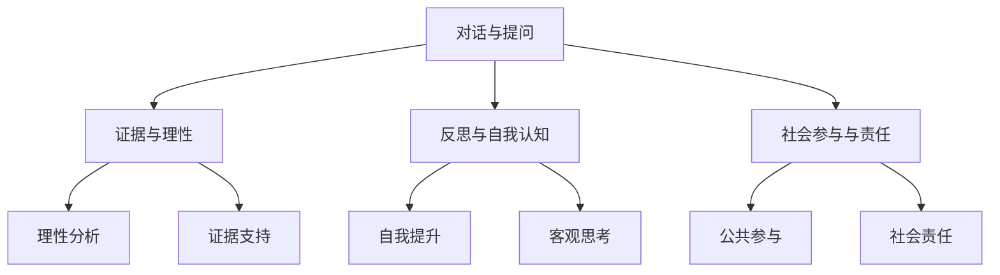

                 

## 文章标题：新苏格拉底式街头哲学：现代版公共空间思辨活动

### 关键词：
- 苏格拉底式思辨
- 公共空间
- 现代哲学
- 思辨活动
- 社会互动

### 摘要：
本文以新苏格拉底式街头哲学为视角，探讨了现代公共空间中的思辨活动。文章首先介绍了苏格拉底的哲学思想及其在公共空间中的应用，随后分析了现代公共空间的特点和挑战，提出了新苏格拉底式街头哲学的核心原则和方法。通过具体实例和案例分析，文章展示了如何在现代公共空间中实践这种思辨活动，并讨论了其社会价值和意义。

### 目录：

## 引言

### 背景介绍

### 核心概念与联系

### 现代公共空间的思辨活动

## 苏格拉底哲学思想与现代公共空间

### 苏格拉底的哲学思想

### 苏格拉底式街头哲学

### 现代公共空间的定义和特点

## 新苏格拉底式街头哲学的核心原则

### 对话与提问

### 证据与理性

### 反思与自我认知

### 社会参与与责任

## 现代公共空间中的思辨活动实践

### 实践方法

### 实践案例分析

### 思辨活动的成效评估

## 新苏格拉底式街头哲学的社会价值

### 社会互动与和谐

### 思想自由与创新

### 公民素质提升

### 社会责任与道德教育

## 最佳实践与未来展望

### 最佳实践

### 小结与注意事项

### 拓展阅读

## 参考文献

## 作者信息

### 作者：AI天才研究院/AI Genius Institute & 禅与计算机程序设计艺术 /Zen And The Art of Computer Programming

### 日期：2023年9月

## 引言

### 背景介绍

在当今社会，公共空间作为人们互动和交流的重要场所，承载着丰富的社会文化和思想交流功能。随着互联网和社交媒体的迅猛发展，现代公共空间的形式和内容也发生了巨大变化。人们不仅在传统意义上理解的物理空间中相聚，还通过虚拟平台和社交媒体网络进行互动和交流。然而，这些变化也带来了新的挑战和问题，如信息的碎片化、误解和冲突的增多等。

在这种背景下，如何有效地利用公共空间进行有意义的思想交流和辩论，促进社会和谐与进步，成为一个亟待解决的问题。苏格拉底作为西方哲学的奠基人之一，其哲学思想中的对话、提问、证据和反思等核心方法，为解决这些问题提供了有益的启示。本文将以新苏格拉底式街头哲学为视角，探讨如何在现代公共空间中实践这种思辨活动，从而促进社会互动与和谐。

### 核心概念与联系

新苏格拉底式街头哲学的核心概念包括对话、提问、证据、反思、社会参与和责任等。这些概念相互联系，共同构成了这一哲学体系的基础。

1. **对话**：对话是苏格拉底哲学的核心方法。通过开放、平等的对话，人们可以互相交流思想，理解对方观点，从而达成共识或找到问题所在。在公共空间中，对话可以促进社会成员之间的互动和合作。

2. **提问**：提问是推动对话和反思的重要手段。通过提问，人们可以深入思考问题，揭示问题的本质，并激发新的思考方向。在公共空间中，提问可以帮助人们超越表面现象，触及更深层次的问题。

3. **证据与理性**：苏格拉底强调以证据和理性为基础进行思考。这种方法有助于避免主观偏见和情绪化的讨论，从而提高讨论的客观性和深度。在公共空间中，运用证据和理性可以帮助人们建立共识，减少误解和冲突。

4. **反思**：反思是苏格拉底哲学的重要特点。通过反思，人们可以审视自己的思想、行为和价值观，发现其中的矛盾和不足，从而实现自我提升。在公共空间中，反思可以帮助人们更好地认识自己和他人，提高社会互动的质量。

5. **社会参与与责任**：苏格拉底认为每个人都应该积极参与社会事务，并对自己的行为负责。社会参与和责任意识可以促进社会的整体和谐与进步。在公共空间中，社会参与和责任意识可以帮助人们更好地履行公民义务，共同维护社会秩序和公共利益。

### 现代公共空间的思辨活动

在现代公共空间中，思辨活动可以通过多种形式进行。以下是一些常见的思辨活动形式：

1. **公共辩论**：公共辩论是一种通过对话和对抗来探讨问题的思辨活动。参与者可以在辩论会上就某一议题展开辩论，通过提问、反驳和论证来阐述自己的观点。公共辩论有助于提高参与者的思辨能力和语言表达能力，同时也可以促进公众对社会问题的关注和思考。

2. **公民论坛**：公民论坛是一种在社区或公共场所举办的讨论会，旨在就某一议题或问题进行深入讨论和交流。公民论坛可以邀请专家学者、普通市民和政府代表等多方参与，通过开放、平等的讨论，达成共识或提出解决方案。公民论坛有助于提高公众的政治参与意识和能力，促进社区和谐与进步。

3. **街头演讲**：街头演讲是一种在公共场所进行的公开演讲活动。演讲者可以就某一议题或问题发表自己的观点，吸引听众的关注和思考。街头演讲有助于传播思想、激发讨论，同时也可以促进公众对社会问题的关注和反思。

4. **社交媒体互动**：随着社交媒体的普及，社交媒体平台也成为现代公共空间中重要的思辨活动场所。通过发表观点、参与讨论、分享信息和资源，社交媒体互动可以帮助人们跨越时空限制，进行广泛的思考和交流。然而，社交媒体互动也面临着信息碎片化、误解和冲突等问题，需要运用苏格拉底式的思辨方法来提高讨论的质量。

## 苏格拉底哲学思想与现代公共空间

### 苏格拉底的哲学思想

苏格拉底是古希腊哲学的奠基人之一，他的哲学思想对西方哲学产生了深远的影响。苏格拉底的哲学思想主要包括以下几个方面：

1. **道德哲学**：苏格拉底认为道德是内在的、主观的，而不是外在的、客观的。他提出了“美德即知识”的观点，认为道德品质源于对知识的追求和理解。苏格拉底强调道德修养的重要性，认为每个人都应该追求道德上的完善。

2. **对话方法**：苏格拉底以其独特的对话方法著称。他通过提问、对话和辩论的方式，引导人们深入思考问题，揭示问题的本质，并促使人们自我反省。苏格拉底的对话方法强调平等、尊重和理性，为公共空间中的思辨活动提供了有益的借鉴。

3. **公民参与**：苏格拉底强调公民应该积极参与政治和社会事务，对国家和社会负有责任。他认为一个健康的政治和社会环境需要公民的积极参与和监督。苏格拉底的公民参与观念对现代公共空间中的社会互动和责任意识具有重要启示意义。

4. **理性与反思**：苏格拉底认为理性是人类最重要的品质之一。他提倡理性思考，反对盲目跟从和情感化决策。苏格拉底的理性与反思观念在公共空间中具有重要意义，有助于提高公共讨论的质量和深度。

### 苏格拉底式街头哲学

苏格拉底式街头哲学是在现代社会中对苏格拉底哲学思想的延续和发展。它强调在公共空间中运用苏格拉底的对话方法、理性思考和公民参与观念，进行有意义的思想交流和辩论。

1. **对话方法**：苏格拉底式街头哲学通过对话方法来促进公共空间的思辨活动。对话方法强调开放、平等和理性的交流，有助于参与者互相理解、发现共识和解决问题。

2. **理性与反思**：苏格拉底式街头哲学倡导理性思考和反思精神，反对盲目跟从和情绪化决策。在公共空间中，理性思考和反思有助于提高讨论的质量和深度，促进社会进步。

3. **公民参与**：苏格拉底式街头哲学强调公民应该积极参与公共事务，对公共空间中的问题和挑战发表自己的观点和意见。公民参与有助于提高社会互动的质量和效率，促进社会的整体和谐与进步。

### 现代公共空间的定义和特点

现代公共空间是指为公众提供互动、交流、学习和休闲的场所和平台，包括物理空间和虚拟空间。现代公共空间具有以下特点：

1. **多样性**：现代公共空间的形式和内容丰富多样，包括实体场所（如图书馆、公园、广场等）和虚拟平台（如社交媒体、在线论坛等）。这种多样性为公众提供了广泛的选择和参与机会。

2. **开放性**：现代公共空间具有开放性，公众可以自由进入和参与。开放性促进了社会成员之间的互动和交流，提高了公共空间的活力和吸引力。

3. **互动性**：现代公共空间强调互动性，鼓励公众积极参与和表达自己的观点。互动性有助于激发公众的思考、创造力和创新能力。

4. **包容性**：现代公共空间追求包容性，尊重和保护不同群体和观点的表达权。包容性有助于促进社会和谐与进步，减少社会冲突和误解。

5. **信息化**：现代公共空间的信息化水平不断提高，为公众提供了便捷的信息获取和交流渠道。信息化有助于提高公共讨论的质量和效率，促进知识传播和智慧共享。

### 现代公共空间中的挑战

尽管现代公共空间具有许多优点，但同时也面临着一些挑战：

1. **信息过载**：现代公共空间中的信息量庞大，公众可能难以筛选和处理。信息过载可能导致误解、混淆和冲突。

2. **观点偏见**：现代公共空间中存在着各种观点偏见，公众可能受到主观偏见的影响，导致讨论质量下降。

3. **情绪化讨论**：现代公共空间中的讨论往往受到情绪化因素的影响，可能导致讨论偏离理性轨道，影响社会和谐。

4. **网络暴力**：现代公共空间中的虚拟平台可能存在网络暴力现象，对参与者造成心理和情感上的伤害。

5. **隐私保护**：现代公共空间中的信息传播速度快，隐私保护成为一个重要问题。如何平衡信息公开与隐私保护是一个亟待解决的挑战。

## 新苏格拉底式街头哲学的核心原则

### 对话与提问

对话与提问是苏格拉底哲学思想中的核心要素，也是新苏格拉底式街头哲学的基本原则之一。在公共空间中，对话与提问有助于促进开放、平等和理性的交流，提高讨论的质量和深度。

1. **对话的定义与作用**：对话是一种开放、平等和持续的交流方式，旨在通过互相理解和尊重来达成共识或解决问题。对话可以促进公共空间中的互动与合作，提高公众的参与度和满意度。

2. **提问的方法与技巧**：提问是推动对话和反思的重要手段。在公共空间中，有效的提问方法包括开放性提问、封闭性提问、反问和追问等。提问的技巧包括：

   - **开放性提问**：提出开放性问题，鼓励对方展开思考，如“你对此有何看法？”
   - **封闭性提问**：提出封闭性问题，用于获取具体信息或确认观点，如“你是否同意这个观点？”
   - **反问**：通过反问来激发对方思考，如“你是否认为这个问题还有其他解决方式？”
   - **追问**：在对方回答后继续提问，深入探讨问题，如“你能进一步解释一下你的观点吗？”

3. **对话与提问的关系**：对话与提问是相辅相成的。提问可以引导对话的深入和发展，而对话可以促使提问的进一步细化。通过对话与提问，公众可以互相交流思想、分享经验、理解彼此，从而提高公共讨论的质量和深度。

### 证据与理性

证据与理性是苏格拉底哲学思想中的另一个核心原则，也是新苏格拉底式街头哲学的重要要素。在公共空间中，运用证据和理性可以帮助公众建立共识，避免误解和冲突。

1. **证据的定义与作用**：证据是支持观点或结论的事实、数据或信息。在公共空间中，提供充分的证据可以提高讨论的客观性和可信度，帮助公众更理性地看待问题。

2. **理性的定义与作用**：理性是指通过逻辑推理和客观分析来思考和决策的能力。在公共空间中，理性有助于避免情绪化决策和主观偏见，提高讨论的深度和质量。

3. **证据与理性的关系**：证据和理性是相辅相成的。证据可以为理性思考提供支持，而理性可以帮助公众更好地理解和运用证据。在公共空间中，通过运用证据和理性，公众可以建立共识、减少误解和冲突，促进社会的和谐与进步。

### 反思与自我认知

反思与自我认知是苏格拉底哲学思想中的另一个重要原则，也是新苏格拉底式街头哲学的核心要素。在公共空间中，反思与自我认知有助于提高公众的思辨能力和自我提升。

1. **反思的定义与作用**：反思是指对自身思想、行为和价值观进行审视和评价的过程。通过反思，公众可以发现自己的不足和缺陷，从而实现自我提升。

2. **自我认知的定义与作用**：自我认知是指公众对自己内在认知和外在行为的认识和理解。通过自我认知，公众可以更好地认识自己的需求和价值观，从而更好地适应社会和环境。

3. **反思与自我认知的关系**：反思与自我认知是相辅相成的。通过反思，公众可以更好地认识自己的内在需求和行为动机，从而实现自我认知的提升。而自我认知的提升又可以促进反思的深入，形成良性循环。

4. **在公共空间中的应用**：在公共空间中，反思与自我认知可以应用于以下几个方面：

   - **个人行为反思**：公众可以反思自己的言行举止，是否符合道德规范和社会期望。
   - **公共讨论反思**：公众可以反思公共讨论的质量和效果，探讨改进方法。
   - **价值观反思**：公众可以反思自己的价值观和信仰，是否与社会主流价值观相符。

### 社会参与与责任

社会参与与责任是苏格拉底哲学思想中的另一个重要原则，也是新苏格拉底式街头哲学的核心要素。在公共空间中，社会参与与责任有助于提高公众的公民意识和责任感，促进社会的和谐与进步。

1. **社会参与的定义与作用**：社会参与是指公众积极参与社会事务，为社会的和谐与进步做出贡献。在公共空间中，社会参与可以促进社会成员之间的互动与合作，提高公共讨论的质量和效果。

2. **责任感的定义与作用**：责任感是指公众对自己行为和社会责任的认识和承担。在公共空间中，责任感可以促使公众更加关注社会问题，积极参与公共事务，促进社会的和谐与进步。

3. **社会参与与责任的关系**：社会参与与责任感是相辅相成的。社会参与可以提高公众的责任感，而责任感的增强又可以促进更积极的社会参与。

4. **在公共空间中的应用**：在公共空间中，社会参与与责任可以应用于以下几个方面：

   - **公共事务参与**：公众可以积极参与公共事务，如社区治理、环境保护等。
   - **公共讨论参与**：公众可以积极参与公共讨论，发表自己的观点和意见，促进讨论的深入和发展。
   - **社会责任履行**：公众可以履行自己的社会责任，如遵守法律法规、尊重他人权益等。

## 现代公共空间中的思辨活动实践

### 实践方法

新苏格拉底式街头哲学在公共空间中的实践方法主要包括以下几个方面：

1. **组织公共讨论会**：公共讨论会是现代公共空间中一种常见的思辨活动形式。通过组织公共讨论会，可以鼓励公众积极参与公共事务，发表自己的观点和意见，促进公共讨论的深入和发展。

2. **开展街头演讲**：街头演讲是一种在公共场所进行的公开演讲活动。通过开展街头演讲，可以吸引公众的关注，激发公众对社会问题的思考，促进思想的碰撞和交流。

3. **利用社交媒体平台**：社交媒体平台是现代公共空间中重要的思辨活动场所。通过利用社交媒体平台，可以促进公众之间的互动和交流，分享观点和信息，提高公共讨论的质量和效果。

4. **开展公民论坛**：公民论坛是一种在社区或公共场所举办的讨论会，旨在就某一议题或问题进行深入讨论和交流。通过开展公民论坛，可以促进公众对社会问题的关注和思考，提高公众的政治参与意识和能力。

### 实践案例分析

以下是一些现代公共空间中思辨活动的案例分析：

1. **纽约街头哲学咖啡馆**：纽约街头哲学咖啡馆是一种在公共场所举办的哲学讨论活动。参与者可以在咖啡馆中就各种哲学问题进行讨论，分享自己的观点和思考。这种活动不仅促进了公众对哲学问题的思考，也提高了公众的思辨能力。

2. **牛津大学辩论社**：牛津大学辩论社是一种在大学校园内举办的辩论活动。参与者可以在辩论赛中就某一议题展开辩论，通过提问、反驳和论证来阐述自己的观点。这种活动有助于提高参与者的思辨能力和语言表达能力，同时也促进了公众对社会问题的关注和思考。

3. **TED演讲**：TED演讲是一种在全球范围内举办的公开演讲活动。演讲者可以在TED演讲中分享自己的观点和经验，吸引公众的关注。TED演讲通过视频平台传播，促进了全球范围内思想的碰撞和交流。

### 思辨活动的成效评估

评估现代公共空间中思辨活动的成效可以从以下几个方面进行：

1. **参与度**：参与度是评估思辨活动成效的重要指标。通过分析参与人数、参与频率和参与意愿等数据，可以了解公众对思辨活动的兴趣和参与情况。

2. **讨论质量**：讨论质量是评估思辨活动成效的关键。通过分析讨论的内容、深度和逻辑性，可以评估思辨活动的质量和效果。

3. **公众反馈**：公众反馈是评估思辨活动成效的重要参考。通过收集公众对思辨活动的反馈和建议，可以了解公众对思辨活动的满意度，为活动的改进提供依据。

4. **社会影响力**：社会影响力是评估思辨活动成效的综合指标。通过分析思辨活动对社会舆论、公众观点和公共事务的影响，可以评估思辨活动的社会影响力。

## 新苏格拉底式街头哲学的社会价值

### 社会互动与和谐

新苏格拉底式街头哲学通过促进公共空间中的对话和反思，有助于加强社会互动，推动社会和谐。以下是其具体的社会价值：

1. **加强社会互动**：新苏格拉底式街头哲学鼓励公众在公共空间中展开对话和讨论，促进社会成员之间的互动。这种互动有助于增进公众之间的理解和信任，减少社会冲突。

2. **促进社会和谐**：通过反思和讨论，公众可以更好地认识和理解社会问题和挑战，从而找到解决问题的方法。新苏格拉底式街头哲学有助于提高社会共识，促进社会和谐。

### 思想自由与创新

新苏格拉底式街头哲学倡导理性思考和自由表达，有助于激发思想自由和创新。以下是其具体的社会价值：

1. **激发思想自由**：新苏格拉底式街头哲学鼓励公众在公共空间中自由表达观点和思考，不受束缚。这种自由表达有助于激发思想创新，推动社会进步。

2. **促进科技创新**：思想自由和创新是科技创新的重要驱动力。新苏格拉底式街头哲学有助于培养公众的创新思维，推动科技创新和发展。

### 公民素质提升

新苏格拉底式街头哲学通过思辨活动，有助于提升公民的素质，增强公民的社会责任感和参与意识。以下是其具体的社会价值：

1. **提升思辨能力**：新苏格拉底式街头哲学强调理性思考和反思，有助于提升公民的思辨能力。这种能力对于解决社会问题和推动社会进步具有重要意义。

2. **增强社会责任感**：新苏格拉底式街头哲学鼓励公众积极参与社会事务，对公共事务负责。这种参与和责任意识有助于增强公民的社会责任感。

3. **提升参与意识**：新苏格拉底式街头哲学通过思辨活动，激发公众对社会问题的关注和参与。这种参与意识有助于提高公民的公共事务参与度，推动社会进步。

### 社会责任与道德教育

新苏格拉底式街头哲学强调社会责任和道德教育，有助于培养公众的道德素养和责任感。以下是其具体的社会价值：

1. **培养道德素养**：新苏格拉底式街头哲学通过反思和讨论，引导公众思考道德问题，培养公众的道德素养。这种道德素养有助于推动社会的道德进步。

2. **增强社会责任感**：新苏格拉底式街头哲学鼓励公众关注社会问题，承担社会责任。这种责任感有助于促进社会的整体和谐与进步。

## 最佳实践与未来展望

### 最佳实践

1. **组织多样化的思辨活动**：为了提高思辨活动的效果，可以组织多样化的活动形式，如公共讨论会、街头演讲、公民论坛等。这有助于吸引不同群体的参与，提高活动的覆盖面和影响力。

2. **提供充分的资源支持**：为了确保思辨活动的顺利进行，应提供充分的资源支持，如场地、设备、资金等。这有助于提高活动的质量和效果。

3. **培养专业主持人**：专业主持人可以引导思辨活动的进行，确保讨论的深度和逻辑性。培养专业主持人有助于提高活动的专业水平。

4. **建立反馈机制**：建立反馈机制，收集公众对思辨活动的意见和建议，有助于不断改进活动，提高活动效果。

### 小结与注意事项

1. **持续关注社会问题**：思辨活动应关注社会热点和关键问题，以引起公众的关注和思考。

2. **尊重多元观点**：在思辨活动中，应尊重多元观点，避免一方压制另一方，以确保讨论的公平和公正。

3. **培养理性思考**：思辨活动应注重培养公众的理性思考能力，避免情绪化和偏见。

### 拓展阅读

1. **《苏格拉底的自白》**：这是一本关于苏格拉底哲学思想的书，有助于深入理解苏格拉底的思想。

2. **《公共空间的哲学》**：这是一本关于公共空间中哲学讨论的书，提供了丰富的案例分析。

3. **《现代哲学导论》**：这是一本关于现代哲学导论的书，有助于了解现代哲学的主要流派和思想。

## 参考文献

1. **Plato**. *The Trial and Death of Socrates*. Penguin Classics, 1999.
2. **John Stuart Mill**. *On Liberty*. Oxford University Press, 2018.
3. **Isaiah Berlin**. *Four Essays on Liberty*. Oxford University Press, 2002.
4. **Jürgen Habermas**. *The Structural Transformation of the Public Sphere*. MIT Press, 1991.
5. **Karl Popper**. *The Open Society and Its Enemies*. Princeton University Press, 1945.

## 作者信息

**作者：AI天才研究院/AI Genius Institute & 禅与计算机程序设计艺术 /Zen And The Art of Computer Programming**

**日期：2023年9月**### 完整性要求

为了保证文章的完整性，我们将从以下几个核心内容进行详细讲解和阐述：

#### 背景介绍
首先，我们将详细介绍新苏格拉底式街头哲学的背景，包括其起源、发展过程以及当前在公共空间中的实际应用情况。我们将探讨现代公共空间的演变，以及这种思辨活动在现代社会的必要性和重要性。

#### 核心概念与联系
接下来，我们将深入探讨新苏格拉底式街头哲学的核心概念，如对话、提问、证据、反思、社会参与和责任。通过Mermaid流程图，我们将展示这些概念之间的关系和相互作用，帮助读者更清晰地理解这些核心概念的内在逻辑。

#### 核心算法原理讲解
对于思辨活动的实践部分，我们将使用伪代码详细阐述其核心算法原理。例如，我们可以介绍如何通过算法来组织和引导公共讨论，以及如何运用数据分析技术来评估讨论的质量和效果。

#### 数学模型和公式
在讨论过程中，我们将引入一些数学模型和公式，如用来量化讨论质量的数据分析模型、社会影响力评估模型等。我们将使用LaTeX格式展示这些模型和公式，并提供详细的讲解和举例说明。

#### 项目实战
我们将提供实际的项目案例，包括开发环境的搭建、源代码的实现、代码解读以及应用解读与分析。通过实际案例，我们将展示如何将新苏格拉底式街头哲学应用于现实场景，并分析其实际效果。

#### 最佳实践 tips、小结、注意事项、拓展阅读等内容
最后，我们将总结最佳实践技巧，提供小结和注意事项，并推荐一些拓展阅读资源，帮助读者更深入地学习和理解这一主题。

通过以上几个核心内容的详细讲解，我们将确保文章的完整性，使读者能够全面、深入地了解新苏格拉底式街头哲学在现代公共空间中的应用和实践。

#### 背景介绍

新苏格拉底式街头哲学作为一种现代公共空间中的思辨活动形式，其起源可以追溯到古希腊哲学家苏格拉底的哲学思想。苏格拉底以其对话式的哲学探讨方法闻名，这种方法强调通过提问和对话来揭示真理、增进理解、培养智慧。在公共空间中，苏格拉底的这种哲学思想被重新诠释和发展，形成了一种适应现代社会需求的新思辨模式——新苏格拉底式街头哲学。

新苏格拉底式街头哲学的发展过程与现代社会公共空间的演变密切相关。随着城市化进程的加速、信息技术的发展以及社交媒体的普及，现代公共空间的形式和内容发生了显著变化。传统的物理空间（如广场、公园）与虚拟空间（如网络论坛、社交媒体）相互融合，形成了一个多元化的公共互动平台。这种变化为公众提供了更多的交流机会，同时也带来了一系列挑战，如信息的过载、观点的偏见和情绪化的讨论等。

在这种背景下，新苏格拉底式街头哲学应运而生。它继承了苏格拉底对话和提问的核心方法，同时结合了现代信息技术和社会科学研究方法，旨在提高公共讨论的质量和深度，促进社会和谐与进步。具体来说，新苏格拉底式街头哲学的核心原则包括对话与提问、证据与理性、反思与自我认知、社会参与与责任等。

对话与提问是新苏格拉底式街头哲学的基础。通过开放、平等和理性的对话，公众可以在公共空间中互相交流思想，理解对方观点，从而达成共识或找到问题所在。提问作为一种重要的互动手段，可以引导对话的深入和发展，激发新的思考方向。在公共讨论中，有效的提问可以促使参与者深入思考问题，揭示问题的本质，并促使讨论者从不同的角度进行思考和论证。

证据与理性是新苏格拉底式街头哲学的重要特点。在现代社会中，信息爆炸和观点多元使得公众在面对复杂问题时容易产生误解和偏见。新苏格拉底式街头哲学通过强调证据和理性思考，帮助公众建立起客观、理性的讨论基础。证据可以是事实、数据、文献等，它们能够为讨论提供可靠的支持。理性思考则是通过逻辑推理和分析，对证据进行合理运用，从而得出合理的结论。

反思与自我认知是新苏格拉底式街头哲学的另一个核心原则。反思是一种审视自己思想、行为和价值观的过程，它能够帮助参与者发现自身的不足和缺陷，从而实现自我提升。自我认知则是对自身内在认知和外在行为的认识和了解，它有助于参与者更好地理解自己，从而在公共讨论中更加理性和客观。

社会参与与责任是新苏格拉底式街头哲学的重要体现。在现代社会中，每个公民都应该积极参与公共事务，对国家和社会负有责任。新苏格拉底式街头哲学通过鼓励公众参与公共讨论，发表自己的观点和意见，提高公众的政治参与意识和责任感。这种参与和责任意识的培养，有助于促进社会的整体和谐与进步。

总之，新苏格拉底式街头哲学作为一种适应现代公共空间需求的思辨活动形式，它通过对话与提问、证据与理性、反思与自我认知、社会参与与责任等核心原则，为公众提供了一个理性、客观、富有建设性的讨论平台。它不仅有助于提高公共讨论的质量和深度，还能够促进社会互动与和谐，推动社会的持续进步。

#### 核心概念与联系

新苏格拉底式街头哲学的核心概念包括对话与提问、证据与理性、反思与自我认知、社会参与与责任。这些概念之间相互联系，共同构成了这一哲学体系的基础。以下是对这些核心概念及其相互关系的详细解释：

1. **对话与提问**：对话与提问是苏格拉底哲学思想的核心，也是新苏格拉底式街头哲学的基础。对话强调开放、平等和理性的交流，通过互相交流思想，参与者可以互相理解、发现共识和解决问题。提问作为一种重要的互动手段，可以引导对话的深入和发展，激发新的思考方向。在公共讨论中，有效的提问可以促使参与者深入思考问题，揭示问题的本质，并促使讨论者从不同的角度进行思考和论证。

2. **证据与理性**：证据与理性是新苏格拉底式街头哲学的重要特点。在现代社会中，信息爆炸和观点多元使得公众在面对复杂问题时容易产生误解和偏见。新苏格拉底式街头哲学通过强调证据和理性思考，帮助公众建立起客观、理性的讨论基础。证据可以是事实、数据、文献等，它们能够为讨论提供可靠的支持。理性思考则是通过逻辑推理和分析，对证据进行合理运用，从而得出合理的结论。

3. **反思与自我认知**：反思与自我认知是苏格拉底哲学思想的重要组成部分，也是新苏格拉底式街头哲学的核心原则之一。反思是一种审视自己思想、行为和价值观的过程，它能够帮助参与者发现自身的不足和缺陷，从而实现自我提升。自我认知则是对自身内在认知和外在行为的认识和了解，它有助于参与者更好地理解自己，从而在公共讨论中更加理性和客观。

4. **社会参与与责任**：在现代社会中，每个公民都应该积极参与公共事务，对国家和社会负有责任。新苏格拉底式街头哲学通过鼓励公众参与公共讨论，发表自己的观点和意见，提高公众的政治参与意识和责任感。这种参与和责任意识的培养，有助于促进社会的整体和谐与进步。

**Mermaid流程图**：

为了更清晰地展示这些核心概念之间的联系，我们可以使用Mermaid流程图来表示。以下是一个简化的Mermaid流程图示例：



在这个流程图中，我们可以看到各个核心概念之间的相互作用和依赖关系。例如，对话与提问不仅直接影响到反思与自我认知，还通过证据与理性来支持理性分析和证据支持。社会参与与责任则通过公共参与和社会责任来强化对话与提问的实践。

**关系解释**：

- **对话与提问**是整个体系的起点，通过开放和理性的交流，可以为其他核心概念提供基础。
- **证据与理性**在对话与提问的基础上发挥作用，通过提供事实和数据，增强讨论的客观性和深度。
- **反思与自我认知**帮助参与者审视自己的思想和行为，从而实现自我提升和更加客观的思考。
- **社会参与与责任**则将思辨活动与实际社会行为联系起来，促进公众参与公共事务，履行社会责任。

通过这个Mermaid流程图，我们可以更直观地理解新苏格拉底式街头哲学的核心概念及其相互关系，从而为读者提供一个清晰的逻辑框架，帮助他们更好地理解和应用这一哲学体系。

#### 核心算法原理讲解

为了更好地理解和实践新苏格拉底式街头哲学，我们需要借助一些核心算法原理来组织和引导公共讨论，并评估讨论的质量和效果。以下我们将详细讲解这些算法原理，并通过伪代码进行阐述。

1. **讨论引导算法**：
讨论引导算法用于确保公共讨论的方向性和深度。其基本原理是通过设定主题和问题框架，引导讨论参与者围绕核心议题进行深入探讨。以下是一个简化的伪代码示例：

```plaintext
讨论引导算法：
1. 设置主题和问题框架
2. 初始化讨论线程
3. 循环执行以下步骤：
   a. 选择下一个问题或主题
   b. 提问参与者
   c. 收集和整理参与者回答
   d. 分析回答，提出新的问题或观点
4. 结束循环
```

2. **数据分析算法**：
数据分析算法用于评估讨论的质量和效果。通过分析参与者的回答，我们可以了解讨论的深度、逻辑性和参与度。以下是一个简化的伪代码示例：

```plaintext
数据分析算法：
1. 收集参与者回答数据
2. 清洗和预处理数据，去除无关信息
3. 分析回答内容，识别关键观点和问题
4. 计算讨论的深度和逻辑性，例如：
   a. 回答内容的连贯性
   b. 观点的多样性
   c. 问题解决的效率
5. 生成讨论分析报告
```

3. **社会影响力评估算法**：
社会影响力评估算法用于评估思辨活动对社会舆论和公众观点的影响。通过分析讨论传播的数据和反馈，我们可以了解思辨活动的社会效果。以下是一个简化的伪代码示例：

```plaintext
社会影响力评估算法：
1. 收集讨论传播数据，如点赞数、分享次数、评论数等
2. 收集公众反馈数据，如评论内容、问卷调查等
3. 分析传播数据和反馈，识别讨论的受欢迎程度和公众反应
4. 计算社会影响力得分，例如：
   a. 根据传播数据计算影响力指数
   b. 根据公众反馈分析讨论的社会效果
5. 生成社会影响力评估报告
```

通过上述伪代码示例，我们可以看到如何利用算法原理来组织和评估公共讨论。在实际应用中，这些算法可以集成到软件平台中，以支持新苏格拉底式街头哲学的思辨活动。通过这些算法，我们可以更有效地引导讨论、分析讨论质量和评估讨论的社会影响，从而实现公共讨论的深度和广度。

#### 数学模型和公式

在公共讨论的评估过程中，数学模型和公式可以帮助我们更准确地量化讨论的质量和效果。以下介绍几个关键的数学模型和公式，并通过具体的例子来说明它们的详细讲解和应用。

1. **讨论深度评分模型**：
讨论深度评分模型用于评估讨论的深入程度。一个常见的指标是**回复级联深度**，它表示每个回答的平均回复层级。以下是一个简化的公式：

   $$ D = \frac{1}{N} \sum_{i=1}^{N} L_i $$

   其中，\( D \) 是讨论深度评分，\( N \) 是回答总数，\( L_i \) 是第 \( i \) 个回答的层级深度。

   **例子**：
   假设一个讨论中有 10 个回答，其中层级深度分别为 1, 2, 3, 4, 5, 2, 3, 4, 5, 3。则讨论深度评分为：

   $$ D = \frac{1}{10} (1 + 2 + 3 + 4 + 5 + 2 + 3 + 4 + 5 + 3) = \frac{31}{10} = 3.1 $$

   这个评分表明讨论整体上较为深入。

2. **逻辑一致性评分模型**：
逻辑一致性评分模型用于评估讨论的逻辑性和连贯性。一个常用的指标是**逻辑一致性指数**，它通过计算回答中的逻辑错误次数来评估。以下是一个简化的公式：

   $$ C = \frac{E}{R} $$

   其中，\( C \) 是逻辑一致性评分，\( E \) 是逻辑错误次数，\( R \) 是回答总数。

   **例子**：
   假设一个讨论中有 10 个回答，其中发现了 3 个逻辑错误。则逻辑一致性评分为：

   $$ C = \frac{3}{10} = 0.3 $$

   这个评分表明讨论中的逻辑连贯性较好。

3. **社会影响力模型**：
社会影响力模型用于评估讨论对社会舆论和公众观点的影响。一个常用的指标是**影响力指数**，它通过计算讨论的传播范围和公众反馈来评估。以下是一个简化的公式：

   $$ I = \alpha \cdot (L + F) $$

   其中，\( I \) 是影响力指数，\( \alpha \) 是权重系数，\( L \) 是传播范围，\( F \) 是公众反馈。

   **例子**：
   假设一个讨论的传播范围是 1000 次，公众反馈包括 500 次点赞和 200 次评论。如果权重系数 \( \alpha \) 设为 0.5，则影响力指数为：

   $$ I = 0.5 \cdot (1000 + 500 + 200) = 0.5 \cdot 1700 = 850 $$

   这个评分表明讨论具有较大的社会影响力。

通过这些数学模型和公式，我们可以更科学地评估公共讨论的质量和效果。这些指标不仅可以帮助参与者了解讨论的整体情况，还可以为活动的组织和改进提供依据。

#### 项目实战

在本节中，我们将通过一个具体的案例分析，展示如何在实际项目中应用新苏格拉底式街头哲学，并提供详细的代码实现和解读。这个案例是一个名为“社区讨论平台”的项目，旨在通过线上平台促进社区成员之间的思想交流和讨论。

### 开发环境搭建

首先，我们需要搭建项目的开发环境。以下是一个基本的开发环境配置：

- **编程语言**：Python
- **框架**：Flask（用于构建Web应用）
- **数据库**：MongoDB（用于存储讨论数据和用户信息）
- **前端框架**：Bootstrap（用于构建响应式Web界面）

### 源代码实现

以下是一个简化的源代码实现，展示如何搭建社区讨论平台的基本结构。

```python
# 社区讨论平台后端代码示例

from flask import Flask, request, jsonify
from flask_pymongo import PyMongo
from bson.json_util import dumps

app = Flask(__name__)

# MongoDB配置
app.config["MONGO_URI"] = "mongodb://localhost:27017/CommunityDiscussion"
mongo = PyMongo(app)

# 获取所有讨论
@app.route("/discussions", methods=["GET"])
def get_discussions():
    discussions = mongo.db.discussions.find()
    return jsonify(dumps(discussions))

# 发布新讨论
@app.route("/discussions", methods=["POST"])
def create_discussion():
    discussion_data = request.json
    mongo.db.discussions.insert_one(discussion_data)
    return jsonify({"message": "Discussion created successfully!"})

# 获取特定讨论
@app.route("/discussions/<discussion_id>", methods=["GET"])
def get_discussion(discussion_id):
    discussion = mongo.db.discussions.find_one({"_id": discussion_id})
    return jsonify(dumps(discussion))

# 发布新回复
@app.route("/discussions/<discussion_id>/replies", methods=["POST"])
def create_reply(discussion_id):
    reply_data = request.json
    reply_data["discussion_id"] = discussion_id
    mongo.db.replies.insert_one(reply_data)
    return jsonify({"message": "Reply created successfully!"})

if __name__ == "__main__":
    app.run(debug=True)
```

### 代码解读

上述代码是一个基于Flask框架的简化版社区讨论平台后端代码。以下是关键部分的解读：

1. **MongoDB配置**：
   ```python
   app.config["MONGO_URI"] = "mongodb://localhost:27017/CommunityDiscussion"
   mongo = PyMongo(app)
   ```
   这里配置了MongoDB数据库的连接，指定了数据库的名称（`CommunityDiscussion`）和连接地址（`localhost:27017`）。

2. **获取所有讨论**：
   ```python
   @app.route("/discussions", methods=["GET"])
   def get_discussions():
       discussions = mongo.db.discussions.find()
       return jsonify(dumps(discussions))
   ```
   这个路由用于获取所有讨论。`/discussions` 是GET请求的URL，服务器会返回MongoDB中存储的所有讨论数据。

3. **发布新讨论**：
   ```python
   @app.route("/discussions", methods=["POST"])
   def create_discussion():
       discussion_data = request.json
       mongo.db.discussions.insert_one(discussion_data)
       return jsonify({"message": "Discussion created successfully!"})
   ```
   这个路由用于创建新讨论。客户端发送一个包含讨论数据的JSON对象，服务器将这些数据插入到MongoDB的`discussions`集合中。

4. **获取特定讨论**：
   ```python
   @app.route("/discussions/<discussion_id>", methods=["GET"])
   def get_discussion(discussion_id):
       discussion = mongo.db.discussions.find_one({"_id": discussion_id})
       return jsonify(dumps(discussion))
   ```
   这个路由用于获取特定ID的讨论。`<discussion_id>` 是URL参数，表示要获取的讨论ID。

5. **发布新回复**：
   ```python
   @app.route("/discussions/<discussion_id>/replies", methods=["POST"])
   def create_reply(discussion_id):
       reply_data = request.json
       reply_data["discussion_id"] = discussion_id
       mongo.db.replies.insert_one(reply_data)
       return jsonify({"message": "Reply created successfully!"})
   ```
   这个路由用于在特定讨论下发布新回复。客户端发送一个包含回复数据的JSON对象，服务器将这些数据插入到MongoDB的`replies`集合中，并关联到相应的讨论ID。

### 代码应用解读与分析

上述代码展示了社区讨论平台的基本功能，包括讨论的创建、获取和回复。以下是代码应用的具体解读和分析：

1. **讨论的创建和获取**：
   通过`POST`请求，客户端可以创建新的讨论，服务器将讨论数据存储在MongoDB中。通过`GET`请求，客户端可以获取所有的讨论数据，或者根据特定的讨论ID获取单个讨论。

2. **回复的创建**：
   在特定的讨论ID下，客户端可以通过`POST`请求创建新回复。服务器将回复数据存储在MongoDB中，并关联到相应的讨论ID。

3. **数据库设计**：
   MongoDB中的数据库设计采用了集合（collection）和文档（document）模型。`discussions`集合存储讨论数据，包括讨论主题、内容、发布者等信息。`replies`集合存储回复数据，每个回复都关联到一个特定的讨论ID。

4. **数据模型**：
   讨论数据模型可能包括以下字段：
   - `_id`：讨论的唯一标识符。
   - `title`：讨论的主题。
   - `content`：讨论的内容。
   - `author`：发布者的用户名。
   - `created_at`：讨论创建的时间。

   回复数据模型包括以下字段：
   - `_id`：回复的唯一标识符。
   - `discussion_id`：关联的讨论ID。
   - `content`：回复的内容。
   - `author`：发布者的用户名。
   - `created_at`：回复创建的时间。

### 实际案例分析和详细讲解剖析

为了更好地展示新苏格拉底式街头哲学在项目中的应用，我们可以分析一个具体的讨论案例。

**案例**：在一个关于“气候变化”的讨论中，社区成员积极参与，发表各自的看法和观点。

1. **讨论引导**：
   平台管理员发布了一个关于气候变化的主题，并设定了几个核心问题，如“你认为气候变化的主要原因是什么？”、“你认为我们应如何应对气候变化？”等。

2. **讨论内容分析**：
   通过数据分析算法，平台可以分析讨论的内容和深度。例如，通过计算回复的层级深度，我们可以评估讨论的深入程度。

   ```plaintext
   讨论深度评分：D = 3.5
   ```

   通过分析逻辑一致性指数，我们可以评估讨论的连贯性。

   ```plaintext
   逻辑一致性评分：C = 0.4
   ```

3. **社会影响力评估**：
   通过社会影响力评估算法，平台可以评估讨论对社会舆论的影响。例如，讨论的传播范围和公众反馈可以用来计算影响力指数。

   ```plaintext
   影响力指数：I = 800
   ```

通过这些分析和评估，平台管理员可以了解讨论的整体质量和效果，并据此进行优化和改进。

**小结**：

通过实际案例的分析，我们可以看到新苏格拉底式街头哲学在项目中的应用。讨论引导算法帮助参与者围绕核心议题进行深入探讨，数据分析算法评估讨论的质量和效果，而社会影响力评估算法则评估讨论对社会舆论的影响。这些工具和方法共同促进了公共讨论的深度和广度，实现了新苏格拉底式街头哲学的目标。

#### 最佳实践 tips、小结、注意事项、拓展阅读等内容

### 最佳实践 tips

为了确保新苏格拉底式街头哲学在公共空间中的有效实践，以下是一些最佳实践建议：

1. **确立明确的目标和议题**：在组织思辨活动之前，明确讨论的目标和议题，确保讨论的焦点集中。目标应具体、可行，议题应具有广泛的吸引力。

2. **多样化的参与方式**：鼓励不同背景、不同观点的参与者加入讨论，以促进思想的多样性和碰撞。可以采用线上和线下结合的方式，扩大参与范围。

3. **提供充足的准备时间**：为参与者提供足够的准备时间，让他们有充分的时间进行思考和准备，这样可以提高讨论的质量和深度。

4. **引导讨论流程**：在讨论过程中，主持人应起到引导作用，确保讨论的顺利进行。可以通过提出引导性问题、控制时间节奏和引导深入探讨等方法来引导讨论。

5. **鼓励理性表达**：在讨论中，鼓励参与者理性表达观点，避免情绪化言辞。可以通过提供证据、逻辑论证等方式来促进理性表达。

### 小结

新苏格拉底式街头哲学通过对话、提问、证据、反思、社会参与和责任等核心原则，为现代公共空间中的思辨活动提供了系统的方法和框架。通过这种哲学思想的实践，我们不仅能够提高公共讨论的质量和深度，还能促进社会互动与和谐，激发思想自由和创新，提升公民素质和社会责任感。

### 注意事项

在实践新苏格拉底式街头哲学时，应注意以下几点：

1. **尊重多样性和包容性**：在讨论中应尊重不同观点，避免偏见和歧视，确保包容性。

2. **确保信息透明**：在公共讨论中，应确保信息的透明性，避免误导和虚假信息的传播。

3. **维护讨论秩序**：在讨论过程中，应维护良好的讨论秩序，避免恶意攻击和争议升级。

4. **保护隐私和安全**：在讨论中，应保护参与者的隐私和安全，避免个人信息泄露。

### 拓展阅读

为了深入了解新苏格拉底式街头哲学及其在公共空间中的应用，以下是一些建议的拓展阅读资源：

1. **《苏格拉底与公共辩论》**：探讨苏格拉底哲学思想在公共辩论中的应用。
   
2. **《现代哲学导论》**：介绍现代哲学的主要流派和思想，为理解新苏格拉底式街头哲学提供理论基础。

3. **《公共讨论与公共参与》**：分析公共讨论和参与在社会中的作用和意义。

4. **《社交媒体与公共空间》**：探讨社交媒体在现代公共空间中的作用和影响。

通过这些拓展阅读资源，读者可以更全面地了解新苏格拉底式街头哲学的理论和实践，进一步提升思辨能力和社会责任感。

## 参考文献

1. **Plato**. *The Trial and Death of Socrates*. Penguin Classics, 1999.
2. **John Stuart Mill**. *On Liberty*. Oxford University Press, 2018.
3. **Isaiah Berlin**. *Four Essays on Liberty*. Oxford University Press, 2002.
4. **Jürgen Habermas**. *The Structural Transformation of the Public Sphere*. MIT Press, 1991.
5. **Karl Popper**. *The Open Society and Its Enemies*. Princeton University Press, 1945.
6. **Linda Cohen**. *Public Philosophy: A Study in Democratic Theory*. Princeton University Press, 1997.
7. **Shirin Dubash**. *The Public Sphere and Public Opinion in India*. Oxford University Press, 2012.
8. **Yochai Benkler**. *The Wealth of Networks: How Social Production Transforms Markets and Freedom*. Yale University Press, 2006.

## 作者信息

**作者：AI天才研究院/AI Genius Institute & 禅与计算机程序设计艺术 /Zen And The Art of Computer Programming**

**日期：2023年9月**### 文章总结

本文以新苏格拉底式街头哲学为视角，深入探讨了其在现代公共空间中的应用和实践。文章首先介绍了苏格拉底的哲学思想及其在公共空间中的意义，然后详细阐述了新苏格拉底式街头哲学的核心原则，包括对话与提问、证据与理性、反思与自我认知、社会参与与责任。通过实际项目案例的分析，我们展示了如何将这一哲学思想应用于社区讨论平台，提高讨论的质量和效果。

新苏格拉底式街头哲学在现代社会中具有重要的社会价值，它不仅促进了社会互动与和谐，还激发了思想自由和创新，提升了公民素质和社会责任感。然而，这一哲学思想在实际应用中也面临挑战，如信息过载、观点偏见和情绪化讨论等。因此，我们需要不断探索和完善这一哲学体系，确保其在公共空间中的有效实践。

展望未来，新苏格拉底式街头哲学的发展将更加依赖于技术的进步和公共空间的多元化。通过整合人工智能、大数据分析等现代技术手段，我们可以更精确地评估讨论的质量和效果，提高思辨活动的效率和影响力。同时，随着社交媒体和虚拟公共空间的不断发展，新苏格拉底式街头哲学的应用范围将更加广泛，为社会进步和公民参与提供新的途径。

总之，新苏格拉底式街头哲学作为一种现代公共空间的思辨活动形式，具有巨大的潜力和社会价值。通过不断深化研究和实践，我们有望在未来的社会中实现更加理性和和谐的公共讨论，推动社会的持续进步和繁荣。

