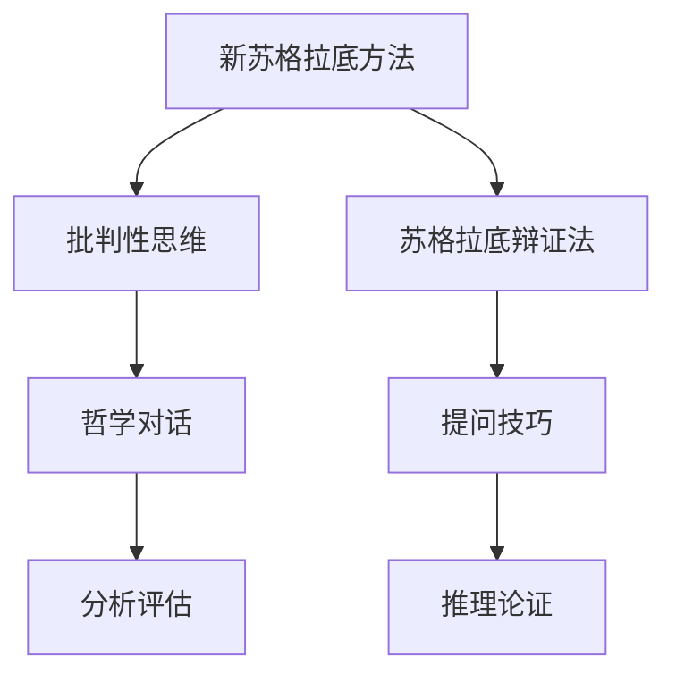

                 

### 文章标题

# 新苏格拉底方法：批判性思维的培养

> 关键词：苏格拉底、辩证法、批判性思维、哲学对话、思维训练

> 摘要：本文深入探讨新苏格拉底方法在批判性思维培养中的应用。通过历史背景介绍、核心概念解析、实践方法讲解和案例分析，阐述苏格拉底辩证法在现代教育和社会生活中的重要性，为培养高效能批判性思维提供理论指导和实践路径。

---

### 文章正文

## 引言

批判性思维是一种评估、分析信息和推理的能力，对于个体发展和社会进步具有重要意义。然而，在信息化和全球化迅速发展的今天，人们面临的信息量日益庞大，如何在海量信息中辨别真伪、独立思考、做出合理决策成为了一项重要技能。本文旨在通过新苏格拉底方法，探讨批判性思维的培养路径。

新苏格拉底方法源自古希腊哲学家苏格拉底的辩证法，通过提问和对话的方式，引导个体进行深度思考。这种方法不仅强调知识的学习，更注重思维的过程和能力的培养。在现代，新苏格拉底方法被广泛应用于教育、商业和公共决策等领域，成为培养批判性思维的重要工具。

## 提出核心概念

在探讨新苏格拉底方法之前，我们需要明确几个核心概念，这些概念构成了该方法的理论基础。

### 1. 新苏格拉底方法

新苏格拉底方法是一种基于苏格拉底辩证法的现代批判性思维训练方法。它强调通过提问和对话来激发思考、分析问题和解决问题。与传统辩证法不同，新苏格拉底方法更注重自我反思和自我批评，鼓励个体在交流中不断质疑和探索。

### 2. 批判性思维

批判性思维是指对观点和证据进行评估、分析和推理的能力。它不仅包括对信息的分析，还包括对信念、价值观和假设的反思和批判。批判性思维的核心在于质疑和探索，通过理性分析和逻辑推理来评估信息的真实性和有效性。

### 3. 苏格拉底辩证法

苏格拉底辩证法是一种通过提问和回答来探讨问题、发现真理的方法。它强调自我反思和自我批评，鼓励个体进行深入的思考。苏格拉底辩证法的基本原则包括提问的艺术、提问的时机、提问的目的和提问的技巧。

### 4. 哲学对话

哲学对话是一种通过对话来交流思想和探索问题的方式。它不同于传统的辩论，更注重相互理解和探索。哲学对话的目标是通过对话促进思考、激发创意和深化理解，而不是仅仅为了获胜。

## 设计目录结构

为了系统地介绍新苏格拉底方法，我们设计了如下目录结构：

### 第一部分：新苏格拉底方法的起源与理论

- **第1章：苏格拉底与辩证法的历史背景**
  - 苏格拉底的生活与哲学思想
  - 辩证法的历史演变

- **第2章：新苏格拉底方法的哲学基础**
  - 苏格拉底辩证法的核心原则
  - 新苏格拉底方法的现代应用

### 第二部分：批判性思维的基本原理

- **第3章：批判性思维的定义与重要性**
  - 批判性思维的概念
  - 批判性思维在社会和个人生活中的作用

- **第4章：批判性思维的过程与步骤**
  - 提问技巧
  - 分析与评估
  - 推理与论证

### 第三部分：新苏格拉底方法的实践方法

- **第5章：哲学对话的技巧与应用**
  - 哲学对话的基本原则
  - 哲学对话的实际应用场景

- **第6章：批判性思维的训练与培养**
  - 批判性思维的训练方法
  - 批判性思维的培养策略

### 第四部分：案例分析与应用

- **第7章：新苏格拉底方法在实践中的应用**
  - 案例分析一：教育与学习
  - 案例分析二：商业决策
  - 案例分析三：公共决策

### 核心概念与联系

为了更好地理解新苏格拉底方法和批判性思维的核心概念，我们使用Mermaid流程图展示它们之间的关系：



### 核心算法原理讲解

在批判性思维过程中，核心算法原理扮演着关键角色。以下是一个简单的伪代码示例，用于说明如何使用批判性思维过程来评估一个观点：

```python
def批判性思维(观点, 证据):
    if 提问技巧(观点) and 分析评估(证据):
        推理论证(观点, 证据)
        return "观点成立"
    else:
        return "观点不成立"
```

### 数学模型和数学公式

批判性思维过程中，数学模型和数学公式可以帮助我们进行精确评估和推理。以下是一个简单的LaTeX公式示例，用于计算两个数的和：

```latex
$$1+1=2$$
```

### 项目实战

为了更好地理解新苏格拉底方法在实践中的应用，我们提供了一个实际案例：一个公司在考虑是否开发一款新软件产品的决策过程。

**案例背景**：一家软件公司正在考虑是否投资开发一款新软件产品，以扩大市场份额。公司管理层需要进行决策，以确定该产品的市场需求和潜在收益。

**解决方案**：

1. **问题定义**：首先，公司需要明确要解决的问题，即“是否开发这款新软件产品”。

2. **信息收集**：接下来，公司需要收集关于市场需求、竞争情况、潜在收益等方面的信息。

3. **批判性思维**：使用新苏格拉底方法，公司可以提出以下问题：
   - 市场需求是否真实？
   - 竞争产品有哪些？
   - 新产品的潜在收益是否值得投资？

4. **评估与决策**：根据批判性思维的评估结果，公司可以做出决策。如果认为市场需求真实、竞争产品有限且新产品潜在收益较高，那么公司可以选择开发这款新软件产品。

5. **实施与监控**：在决策后，公司需要实施开发计划，并对项目进度和成果进行监控。

**项目小结**：

通过新苏格拉底方法的批判性思维，公司在决策过程中能够更加理性地评估信息，避免盲目投资。这种方法不仅有助于提高决策质量，还可以培养团队成员的批判性思维能力。

### 最佳实践 tips、小结、注意事项、拓展阅读

**最佳实践 tips**：

- 在使用新苏格拉底方法时，提问技巧至关重要。要学会提出开放性问题和质疑性问题，以激发深度思考。
- 培养批判性思维需要持之以恒。通过日常练习和反思，可以逐步提高批判性思维能力。

**小结**：

新苏格拉底方法是一种有效的批判性思维训练方法，通过提问和对话，帮助个体进行深度思考和分析。在现代社会，培养批判性思维对于个体发展和社会进步具有重要意义。

**注意事项**：

- 在实践过程中，要避免陷入主观偏见和思维定势。
- 哲学对话需要尊重对方的观点，注重相互理解和探索。

**拓展阅读**：

- 《苏格拉底辩证法：理论与实践》
- 《批判性思维：工具与技术》
- 《哲学对话：沟通与思考的艺术》

---

作者：AI天才研究院/AI Genius Institute & 禅与计算机程序设计艺术 /Zen And The Art of Computer Programming### 第一部分：新苏格拉底方法的起源与理论

## 第1章：苏格拉底与辩证法的历史背景

### 1.1 苏格拉底的生活与哲学思想

苏格拉底（Socrates，公元前469年－公元前399年），古希腊著名的哲学家，被誉为西方哲学的奠基人之一。他出生于雅典，一生以哲学研究为主要活动，通过对话和辩论的方式传授思想。苏格拉底的思想主要集中于道德和伦理领域，他强调个体的自我反省和道德修养，提出了“知行合一”的观点。

苏格拉底的哲学思想在当时引起了巨大的反响，尽管他并未留下任何书面作品，但他的学生和后人通过口述和记录，保存了他的思想和辩论方式。苏格拉底最著名的弟子包括柏拉图和亚里士多德，他们的作品对后世哲学产生了深远的影响。

苏格拉底的哲学思想核心可以概括为以下几点：

1. **道德自律**：苏格拉底认为道德行为源于个体的自我反省和道德自律，而不是外在的法律和规则。
2. **知识即德行**：苏格拉底主张知识的追求与道德修养密不可分，只有通过知识的积累，个体才能做出正确的道德判断。
3. **辩证法**：苏格拉底提出了辩证法（Socratic Method），通过提问和对话的方式，引导个体进行自我反思，发现自身的无知。

### 1.2 辩证法的历史演变

辩证法作为一种哲学方法，其历史可以追溯到古希腊时期。苏格拉底是辩证法的奠基者，他将这种方法应用于伦理和道德领域，通过提问引导个体进行深入思考。苏格拉底的辩证法强调质疑和自我批评，鼓励个体不断探索真理。

在苏格拉底之后，辩证法经历了多次演变和发展。柏拉图继承了苏格拉底的思想，将其应用于探索宇宙和真理的本质。柏拉图提出了“理念论”，认为现实世界是理念世界的投影。亚里士多德则对辩证法进行了系统化和理论化，提出了“逻辑学”这一独立学科。

中世纪时期，辩证法被宗教哲学所吸收，成为神学争论的重要工具。随着文艺复兴的到来，辩证法再次受到重视，成为哲学和科学探索的重要方法。现代哲学中，辩证法仍然具有重要的地位，被广泛应用于伦理学、政治哲学和科学哲学等领域。

### 1.3 新苏格拉底方法的起源

新苏格拉底方法（New Socratic Method）是在苏格拉底辩证法的基础上发展起来的一种现代批判性思维训练方法。它强调通过提问和对话来激发思考、分析问题和解决问题。与传统辩证法相比，新苏格拉底方法更加注重个体自我反思和自我批评，以及在不同观点之间的交流与探索。

新苏格拉底方法的起源可以追溯到20世纪，当时一些教育学家和心理学家开始关注批判性思维的培养。他们借鉴苏格拉底辩证法的核心原则，结合现代心理学和教育理论，提出了新苏格拉底方法。这种方法很快在教育和商业领域得到了广泛应用，成为培养批判性思维的重要工具。

新苏格拉底方法的核心原则包括：

1. **提问的艺术**：通过提出开放性问题和质疑性问题，引导个体进行深入思考。
2. **自我反思与自我批评**：鼓励个体在对话中反思自己的观点和信念，进行自我批评。
3. **对话与交流**：强调在不同观点之间的对话与交流，促进思想的碰撞与融合。

### 1.4 新苏格拉底方法与传统辩证法的联系与区别

新苏格拉底方法与传统辩证法有着密切的联系，都强调通过提问和对话来探讨问题、发现真理。然而，两者也存在一些区别：

1. **目标不同**：传统辩证法强调逻辑推理和论证，追求理性的一致性和准确性。新苏格拉底方法则更加注重个体自我反思和批判性思维的培养，追求思维的深度和广度。
2. **应用领域不同**：传统辩证法主要应用于哲学和逻辑学领域，而新苏格拉底方法则被广泛应用于教育、商业、公共决策等多个领域。
3. **提问方式不同**：传统辩证法的提问往往更为严格和正式，而新苏格拉底方法的提问则更加灵活和开放，注重激发个体的思考。

总之，新苏格拉底方法是在传统辩证法的基础上发展起来的一种现代批判性思维训练方法，它通过提问和对话，帮助个体进行深度思考和分析，培养批判性思维能力。

## 第2章：新苏格拉底方法的哲学基础

### 2.1 苏格拉底辩证法的核心原则

苏格拉底辩证法（Socratic Method）是一种通过提问和对话来探讨问题、发现真理的方法。它的核心原则包括提问的艺术、提问的时机、提问的目的和提问的技巧。以下是对这些核心原则的详细阐述：

#### 提问的艺术

提问的艺术是苏格拉底辩证法的精髓。苏格拉底通过提出一系列开放性问题和质疑性问题，引导个体进行自我反思，发现自身的无知。开放性问题的特点是具有多种可能的答案，可以引发深入的讨论。质疑性问题的目的是质疑个体的观点和信念，促使他们进行更深入的思考。

以下是一个例子，说明如何使用开放性问题和质疑性问题：

- **开放性问题**：“你认为这个问题的解决方案是什么？”
- **质疑性问题**：“你确定这个观点是正确的吗？有没有其他可能性？”

#### 提问的时机

提问的时机对于苏格拉底辩证法的有效性至关重要。正确的时机可以引导个体进行深入的思考，而错误的时机可能会打断他们的思考过程。以下是一些常用的提问时机：

- **在个体表达观点之前**：这样可以鼓励个体在表达之前进行更深入的思考。
- **在个体提出观点之后**：这样可以质疑他们的观点，促进进一步的讨论和思考。
- **在个体遇到困难时**：这样可以提供帮助，引导他们找到问题的解决方案。

#### 提问的目的

苏格拉底辩证法的提问目的不仅仅是获取信息，更重要的是通过提问引导个体进行深度思考。以下是一些常见的提问目的：

- **激发思考**：通过提问激发个体的好奇心和探索精神，促使他们进行更深入的思考。
- **质疑观点**：通过质疑个体的观点和信念，促使他们进行自我反思和修正。
- **发现真理**：通过提问和对话，引导个体发现真理，达到对问题的深刻理解。

#### 提问的技巧

苏格拉底辩证法的提问技巧包括以下几个方面：

- **逐步提问**：通过逐步提问，引导个体从表面问题深入到问题的本质。
- **反问**：通过反问使个体意识到他们观点中的矛盾和不足，从而进行更深入的思考。
- **追问**：通过追问使个体对自己的观点进行更多的论证和解释，从而提高他们的思维质量。

### 2.2 新苏格拉底方法的现代应用

新苏格拉底方法在现代社会中具有广泛的应用，尤其在教育、商业和公共决策等领域。以下是对这些应用领域的简要介绍：

#### 教育中的应用

在教育领域，新苏格拉底方法被广泛用于培养批判性思维和解决问题的能力。教师可以通过提问和对话的方式，引导学生进行自我反思和探索，激发他们的学习兴趣和动力。以下是一个例子：

- **案例**：在历史课上，教师可以提出问题：“你认为这个历史事件的原因是什么？”通过这个问题，引导学生进行深入的思考和讨论，从而加深他们对历史事件的理解。

#### 商业中的应用

在商业领域，新苏格拉底方法被用于战略规划、市场分析和决策制定。企业可以通过提问和对话，激发员工的创造力，提高决策质量。以下是一个例子：

- **案例**：在产品开发过程中，企业可以通过提问：“这款产品是否满足市场需求？”来引导团队进行深入的分析和讨论，从而优化产品设计。

#### 公共决策中的应用

在公共决策领域，新苏格拉底方法被用于政策制定、公共参与和社会治理。政府可以通过提问和对话，了解公众的需求和意见，提高政策制定的质量。以下是一个例子：

- **案例**：在环境保护政策的制定过程中，政府可以通过提问：“你认为我们应该如何保护环境？”来引导公众参与讨论，从而形成更科学、合理的政策。

### 2.3 新苏格拉底方法的教育意义

新苏格拉底方法在教育中的意义主要体现在以下几个方面：

- **培养批判性思维**：通过提问和对话，学生可以学会质疑和反思，提高批判性思维能力。
- **激发学习兴趣**：新苏格拉底方法可以激发学生的学习兴趣和动力，提高学习效果。
- **培养沟通能力**：通过对话和讨论，学生可以学会表达自己的观点，倾听他人的意见，提高沟通能力。
- **促进自我反思**：新苏格拉底方法鼓励学生进行自我反思，提高自我认识和能力。

总之，新苏格拉底方法作为一种现代批判性思维训练方法，具有广泛的应用价值和教育意义。通过提问和对话，它可以激发个体的思考，培养批判性思维和解决问题的能力，提高教育质量和社会发展水平。

### 第二部分：批判性思维的基本原理

## 第3章：批判性思维的定义与重要性

### 3.1 批判性思维的概念

批判性思维（Critical Thinking）是一种评估、分析信息和推理的能力，它不仅包括对信息的分析，还包括对信念、价值观和假设的反思和批判。批判性思维的核心在于质疑和探索，通过理性分析和逻辑推理来评估信息的真实性和有效性。以下是批判性思维的一些基本特征：

1. **质疑精神**：批判性思维要求个体具备质疑精神，对观点和证据进行深入探究，不轻易接受表面的解释。
2. **理性分析**：批判性思维强调通过理性分析来评估信息，而不是依赖情感、直觉或权威。
3. **逻辑推理**：批判性思维运用逻辑推理来构建论证，确保结论的合理性和逻辑一致性。
4. **反思与自我批评**：批判性思维要求个体在思考过程中进行自我反思和自我批评，不断调整和优化自己的观点。

### 3.2 批判性思维的重要性

批判性思维在社会和个人生活中具有重要意义，以下是几个关键方面：

1. **教育**：批判性思维是教育的核心目标之一。通过培养批判性思维能力，学生可以更好地理解和掌握知识，发展独立思考的能力。
2. **职业发展**：在职场中，批判性思维是决策和创新的重要基础。它帮助个体在复杂多变的环境中做出明智的决策，发现问题和机会。
3. **科学探索**：科学研究中，批判性思维是发现真理和推进知识发展的重要工具。科学家通过批判性思维来评估假设、设计实验和解释结果。
4. **公共决策**：在公共决策中，批判性思维有助于政府和社会组织评估政策的影响，制定合理的决策，促进社会发展和公平。
5. **个人成长**：批判性思维有助于个体自我反省和自我提升，提高自我认识和生活质量。

### 3.3 批判性思维的应用领域

批判性思维的应用领域非常广泛，以下是一些主要领域：

1. **科学领域**：科学家通过批判性思维来评估实验设计、数据分析和研究假设，确保科学研究的准确性和可靠性。
2. **医学领域**：医生通过批判性思维来分析病例、评估治疗方案和决策，提高医疗质量和患者安全。
3. **商业领域**：企业家和经理通过批判性思维来分析市场趋势、评估商业机会和决策，促进企业发展。
4. **法律领域**：律师和法官通过批判性思维来分析证据、构建法律论据和决策，确保司法公正。
5. **教育领域**：教师通过批判性思维来设计课程、评估学生表现和决策，提高教育质量和效果。

### 3.4 批判性思维的培养策略

为了培养批判性思维能力，可以采取以下策略：

1. **提问技巧**：鼓励个体提出开放性问题和质疑性问题，培养质疑精神。
2. **反思与自我批评**：通过自我反思和自我批评，个体可以不断调整和优化自己的观点。
3. **逻辑训练**：通过逻辑训练，个体可以学会运用逻辑推理来构建论证。
4. **跨学科学习**：跨学科学习可以帮助个体从不同角度审视问题，提高综合分析能力。
5. **案例研究**：通过案例研究，个体可以学习如何在实际情境中应用批判性思维。

总之，批判性思维是一种重要的能力，它在教育、职业发展、科学研究、公共决策和个人成长等方面都发挥着关键作用。通过培养批判性思维能力，个体可以更好地应对复杂多变的环境，做出明智的决策，推动社会进步。

## 第4章：批判性思维的过程与步骤

### 4.1 提问技巧

批判性思维的培养离不开有效的提问技巧。提问不仅是获取信息的过程，更是激发思考和深入探究的重要手段。以下是一些关键的提问技巧：

#### 1. 开放性提问

开放性提问是指那些具有多种答案且需要深入思考的问题。这类问题通常以“如何”、“为什么”或“什么”开头，鼓励个体进行创造性思考和扩展性讨论。例如：

- **“你认为这款新软件产品的用户界面应该设计成什么样？”**
- **“你认为这个历史事件背后的原因是什么？”**

#### 2. 质疑性提问

质疑性提问旨在挑战个体的观点和信念，促使他们进行自我反思和修正。这类问题通常以“是不是”、“有没有”、“是否正确”开头。例如：

- **“你确定这个市场分析结果完全准确吗？”**
- **“你能否提供更多证据来支持你的观点？”**

#### 3. 引导性提问

引导性提问是一种通过逐步引导来揭示问题本质的提问技巧。这类问题通常以一种渐进的方式引导个体从不同角度思考问题。例如：

- **“这款新产品的用户体验如何影响用户的满意度？”（初步问题）**
- **“用户体验对用户忠诚度有什么具体影响？”（深入问题）**

#### 4. 反问

反问是一种通过反向提问来揭示个体观点中潜在矛盾或不足的技巧。这种提问方式可以促使个体进行更深入的思考。例如：

- **“如果你认为这个解决方案是最佳的，那么它有没有可能存在其他更好的方案？”**
- **“你是否认为这个假设在所有情况下都成立？”**

#### 5. 综合性提问

综合性提问是将多个问题综合在一起，形成一个全面的思考框架。这类问题有助于个体从多个维度审视问题。例如：

- **“在这个项目中，我们如何平衡成本、时间和质量？”**
- **“在制定这个政策时，我们应考虑哪些社会、经济和环境因素？”**

### 4.2 分析与评估

批判性思维的核心在于对信息和分析结果进行评估。以下是一些关键的分析与评估技巧：

#### 1. 证据分析

证据分析是指对提供的信息和证据进行仔细审查，评估其真实性和可靠性。以下是一些关键步骤：

- **来源评估**：评估证据来源的可靠性，确定其是否权威、中立或具有专业知识。
- **证据类型**：分析不同类型的证据（如统计数据、专家意见、实验结果等），评估其适用性和有效性。
- **证据相关性**：评估证据与问题或假设的相关性，确定其是否支持或反驳特定观点。

#### 2. 论证评估

论证评估是指对观点和论据进行逻辑分析和评估，确保其合理性和一致性。以下是一些关键步骤：

- **逻辑一致性**：检查论证中是否存在逻辑矛盾或不一致之处。
- **论据强度**：评估论据的强度和可靠性，确定其是否充分支持结论。
- **论证结构**：分析论证的结构，确保其逻辑清晰、条理分明。

#### 3. 假设评估

假设评估是指对假设进行审查，评估其合理性和可验证性。以下是一些关键步骤：

- **假设合理性**：评估假设是否符合现实情况和已知事实。
- **假设可验证性**：评估假设是否可以通过观察或实验进行验证。
- **假设限制**：识别假设的局限性，考虑其可能产生的偏差或误导。

### 4.3 推理与论证

批判性思维中的推理与论证是得出结论和做出决策的重要环节。以下是一些关键的推理与论证技巧：

#### 1. 逻辑推理

逻辑推理是通过逻辑规则和推理形式来得出结论。以下是一些关键步骤：

- **前提评估**：确保前提的真实性和有效性，避免逻辑错误。
- **推理形式**：使用正确的逻辑推理形式，如演绎推理和归纳推理。
- **结论验证**：根据前提和推理形式，验证结论的逻辑一致性。

#### 2. 论证构建

论证构建是指构建一个合理、有力的论证，支持特定观点或结论。以下是一些关键步骤：

- **明确观点**：首先明确要论证的观点或结论。
- **提供证据**：提供充分且可靠的证据来支持观点或结论。
- **逻辑连接**：使用逻辑连接词（如因此、所以、然而等）将证据与观点或结论联系起来。

#### 3. 反驳与回应

反驳与回应是指对反对观点进行理性反驳，并回应对方可能的反驳。以下是一些关键步骤：

- **识别反对观点**：明确对方的反对观点或论据。
- **反驳逻辑错误**：指出对方论证中的逻辑错误或谬误。
- **回应反驳**：针对对方的反驳，提供合理的回应和解释。

### 4.4 结论与反思

在批判性思维过程中，结论的得出和反思是不可或缺的。以下是一些关键步骤：

#### 1. 得出结论

得出结论是指根据分析、评估和推理的结果，形成一个明确的观点或决策。以下是一些关键步骤：

- **综合分析结果**：综合所有分析结果，确保结论的全面性和准确性。
- **明确结论**：以清晰、简洁的方式表达结论。
- **验证结论**：通过进一步的思考和讨论，验证结论的合理性和有效性。

#### 2. 反思与调整

反思与调整是指对思维过程和结论进行反思，发现不足并进行调整。以下是一些关键步骤：

- **反思思考过程**：回顾整个思考过程，评估提问、分析和推理的步骤是否合理。
- **识别不足**：识别思考过程中可能存在的盲点、偏差或错误。
- **进行调整**：根据反思结果，对结论和观点进行调整和优化。

总之，批判性思维的过程与步骤是一个循环往复、不断深入的过程。通过有效的提问技巧、分析与评估、推理与论证，以及结论与反思，个体可以逐步培养和提升批判性思维能力，从而更好地应对复杂的问题和挑战。

### 第三部分：新苏格拉底方法的实践方法

## 第5章：哲学对话的技巧与应用

### 5.1 哲学对话的基本原则

哲学对话（Philosophical Dialogue）是一种通过对话来交流思想和探索问题的方式。它不同于传统的辩论，更注重相互理解和探索，旨在通过对话促进思考、激发创意和深化理解。以下是哲学对话的基本原则：

#### 1. 尊重与包容

哲学对话要求参与者尊重对方的观点和立场，即使存在分歧，也应保持开放的心态，倾听和理解对方的观点。这种尊重与包容的氛围有助于建立良好的对话环境，促进对话的顺利进行。

#### 2. 对话与倾听

哲学对话强调对话与倾听的重要性。对话不仅包括表达自己的观点，还包括倾听他人的意见和观点。通过倾听，参与者可以更好地理解对方的观点，从而促进对话的深入和拓展。

#### 3. 质疑与反思

哲学对话鼓励参与者进行质疑和反思。质疑可以帮助我们发现观点中的矛盾和不足，促使我们进行更深入的思考。反思则有助于我们对自己的观点进行审视和调整，提高思维的深度和广度。

#### 4. 创新与探索

哲学对话是一种创新和探索的过程。通过对话，参与者可以相互启发，激发新的思想和观点。这种创新和探索的精神有助于推动思想的进步和发展。

### 5.2 哲学对话的实际应用场景

哲学对话的应用场景非常广泛，以下是一些典型的实际应用：

#### 1. 教育领域

在教育领域，哲学对话被广泛应用于课程设计和课堂教学。教师可以通过哲学对话引导学生进行深度思考，培养他们的批判性思维能力。以下是一个教育领域的实际案例：

- **案例**：在伦理学课程中，教师可以组织学生进行哲学对话，探讨道德问题的不同观点。通过这种对话，学生可以更好地理解道德原则和价值观，提高道德判断能力。

#### 2. 商业领域

在商业领域，哲学对话被用于战略规划、市场分析和决策制定。企业可以通过哲学对话激发员工的创造力，提高决策质量。以下是一个商业领域的实际案例：

- **案例**：在产品开发过程中，企业可以组织跨部门团队进行哲学对话，讨论产品设计的不同方案。通过这种对话，团队成员可以相互启发，找到最优的产品设计。

#### 3. 公共决策领域

在公共决策领域，哲学对话被用于政策制定、公共参与和社会治理。政府可以通过哲学对话了解公众的需求和意见，提高政策制定的质量。以下是一个公共决策领域的实际案例：

- **案例**：在环境保护政策的制定过程中，政府可以组织公众参与哲学对话，讨论环境保护的不同方案。通过这种对话，政府可以更好地了解公众的意见，制定更科学、合理的政策。

### 5.3 哲学对话的实际操作步骤

为了有效地进行哲学对话，可以遵循以下步骤：

#### 1. 确定主题

首先，确定哲学对话的主题。主题可以是道德、伦理、社会、文化等任何与哲学相关的问题。

#### 2. 组建团队

组建一个由不同背景、观点和经验的人组成的团队。团队成员可以是同事、同学或公众代表。

#### 3. 制定规则

制定一些基本的对话规则，如尊重对方、认真倾听、积极参与等。这些规则有助于确保对话的顺利进行。

#### 4. 开放性提问

在对话开始时，提出一些开放性提问，以激发参与者的思考和讨论。例如：“你认为这个问题的解决方案是什么？”“这个历史事件的原因是什么？”

#### 5. 对话与讨论

在提问后，参与者可以自由发表意见，进行对话和讨论。对话过程中，要尊重对方的观点，避免争论和冲突。

#### 6. 质疑与反思

鼓励参与者进行质疑和反思，探讨观点中的矛盾和不足。通过质疑和反思，可以深化对问题的理解。

#### 7. 总结与反思

在对话结束后，对讨论的结果进行总结，并反思对话的过程和效果。总结可以包括共识、分歧和新的见解。

总之，哲学对话是一种有效的思维训练方法，通过提问、对话和讨论，可以激发思考和创造力，培养批判性思维能力。在现代社会，哲学对话的应用场景越来越广泛，成为一种重要的交流与探索方式。

### 第6章：批判性思维的训练与培养

### 6.1 批判性思维的训练方法

批判性思维的培养是一个长期而系统的过程，需要通过多种方法和策略来实现。以下是一些有效的批判性思维训练方法：

#### 1. 提问训练

提问是批判性思维的核心，通过提问可以激发思考和分析。以下是一些提问技巧：

- **开放性问题**：鼓励提出开放性问题，如“为什么”、“如何”、“什么是”等，以引导深入思考。
- **质疑性问题**：提出质疑性问题，如“这个观点有依据吗？”、“这个论据是否充分？”等，以挑战现有观点。
- **引导性问题**：提出引导性问题，如“如果这个观点是正确的，那么会带来哪些影响？”等，以引导思考方向。

#### 2. 分析训练

分析是批判性思维的重要组成部分，通过分析可以揭示信息之间的联系和差异。以下是一些分析技巧：

- **层次分析**：将复杂问题分解为更小、更易于管理的部分，逐步分析。
- **因果分析**：分析问题的原因和结果，理解它们之间的因果关系。
- **比较分析**：比较不同观点、方法或数据，识别它们的异同和优缺点。

#### 3. 反思训练

反思是批判性思维的重要组成部分，通过反思可以评估自己的观点和思维过程。以下是一些反思技巧：

- **自我反思**：定期进行自我反思，评估自己的思维过程和决策，找出不足之处。
- **反馈反思**：接受他人的反馈，思考如何改进自己的思维方法和决策。
- **反思日志**：记录自己的思维过程和决策，定期回顾和总结。

#### 4. 阅读、写作和讨论

阅读、写作和讨论是培养批判性思维的重要手段。以下是一些相关技巧：

- **深度阅读**：通过深度阅读，理解文本的深层含义，学会批判性思考。
- **写作练习**：通过写作，表达自己的观点和思考，锻炼批判性思维能力。
- **讨论技巧**：学会在讨论中倾听他人观点，提出质疑和反驳，促进思考。

### 6.2 批判性思维的培养策略

为了有效地培养批判性思维，可以采取以下策略：

#### 1. 知识教育

知识是批判性思维的基础，通过广泛的知识教育，可以提升个体的思维能力和分析能力。以下是一些策略：

- **跨学科教育**：鼓励学生跨学科学习，理解不同领域的知识和思维方式。
- **批判性阅读**：指导学生进行批判性阅读，学会质疑和评估文本内容。
- **案例研究**：通过案例研究，让学生在真实情境中应用批判性思维。

#### 2. 教学方法

采用有效的教学方法，可以激发学生的学习兴趣和批判性思维能力。以下是一些策略：

- **问题导向学习**：通过提出问题，引导学生进行探究和思考。
- **小组讨论**：通过小组讨论，促进学生的交流和思维碰撞。
- **辩论训练**：通过辩论训练，锻炼学生的批判性思维和辩论技巧。

#### 3. 个体反思

个体反思是培养批判性思维的关键，通过反思，个体可以评估自己的思维过程和决策。以下是一些策略：

- **定期反思**：定期进行反思，总结自己的思维过程和决策，找出不足。
- **反思日记**：记录反思过程，反思日记可以帮助个体更好地理解自己的思维和行为。
- **自我评估**：通过自我评估，识别自己的优势和不足，制定改进计划。

#### 4. 社会实践

社会实践活动可以提升个体的批判性思维能力和实践能力。以下是一些策略：

- **志愿服务**：通过志愿服务，了解社会问题和现实挑战，学会批判性思考。
- **社会实践**：通过参与社会实践，将批判性思维应用于实际问题，提高解决能力。
- **项目研究**：通过项目研究，学会在实际项目中应用批判性思维，解决问题。

总之，批判性思维的培养是一个长期而系统的过程，需要通过多种方法和策略来实现。通过提问、分析、反思和讨论，个体可以逐步提升批判性思维能力，更好地应对复杂的问题和挑战。

### 第四部分：案例分析与应用

## 第7章：新苏格拉底方法在实践中的应用

### 7.1 案例分析一：教育与学习

在教育领域，新苏格拉底方法被广泛应用于培养学生的批判性思维和解决问题的能力。以下是一个具体的案例分析：

**背景**：某中学的数学教师希望通过新苏格拉底方法，提高学生在解决几何问题时的批判性思维能力。

**过程**：

1. **提出问题**：教师在课堂上提出一个几何问题：“如何证明两个三角形全等？”
2. **引导学生提问**：教师鼓励学生提出问题，如：“全等的定义是什么？”“如何确定两个三角形的角度和边长相等？”
3. **讨论与交流**：学生分组讨论，分享各自的思路和观点，教师引导他们进行深入思考。
4. **批判性分析**：学生根据同伴的答案进行批判性分析，提出质疑和反驳，如：“这个方法是否适用于所有三角形？”“这个证明过程是否完整？”
5. **反思与总结**：教师引导学生进行反思，总结不同方法的优缺点，并总结全等三角形的证明原理。

**效果**：通过新苏格拉底方法的引导，学生不仅学会了如何证明三角形全等，更重要的是培养了批判性思维能力，学会了如何质疑、分析和解决问题。

### 7.2 案例分析二：商业决策

在商业领域，新苏格拉底方法被广泛应用于战略规划和决策制定。以下是一个具体的案例分析：

**背景**：某家初创企业正在考虑是否投资一款新型智能设备的研发。

**过程**：

1. **提出问题**：企业创始人提出问题：“这款新型智能设备的研发是否值得投资？”
2. **质疑与讨论**：团队成员通过新苏格拉底方法，提出一系列问题，如：“市场需求如何？”“竞争产品有哪些？”“投资回报是否合理？”
3. **收集信息**：团队成员分工收集市场需求、竞争情况、投资回报等方面的信息。
4. **批判性分析**：团队成员对收集到的信息进行批判性分析，评估市场潜力和投资风险。
5. **决策制定**：基于批判性分析的结论，团队最终决定是否投资研发新型智能设备。

**效果**：通过新苏格拉底方法的引导，企业创始人能够更加理性地评估投资决策，减少了投资风险，提高了决策质量。

### 7.3 案例分析三：公共决策

在公共决策领域，新苏格拉底方法被用于政策制定和公共参与。以下是一个具体的案例分析：

**背景**：某市政府正在制定一项环境保护政策，以减少空气污染。

**过程**：

1. **提出问题**：市政府官员提出问题：“我们应该采取哪些措施来减少空气污染？”
2. **公众参与**：市政府通过新苏格拉底方法，邀请公众参与讨论，收集公众的意见和建议。
3. **讨论与交流**：公众代表在会议上分享各自的看法，通过新苏格拉底方法的引导，进行深入讨论。
4. **批判性分析**：市政府官员对公众的意见和建议进行批判性分析，评估其可行性和效果。
5. **决策制定**：基于公众参与和批判性分析的结论，市政府制定出一项综合性的环境保护政策。

**效果**：通过新苏格拉底方法的引导，市政府能够更好地了解公众的需求和意见，制定出更科学、合理的环境保护政策，提高了政策的执行效果。

### 总结与启示

通过上述案例分析，我们可以看到新苏格拉底方法在教育和学习、商业决策和公共决策等领域的广泛应用和显著效果。这种方法通过提问、讨论和批判性分析，帮助个体和团队进行深度思考，提高决策质量和执行效果。

**启示**：

1. **培养批判性思维**：在教育、商业和公共决策中，重视批判性思维的培养，通过提问、讨论和反思，激发个体的思考和分析能力。
2. **鼓励公众参与**：在公共决策中，通过新苏格拉底方法引导公众参与，收集多方面的意见和建议，提高决策的透明度和公众的认可度。
3. **综合多方面信息**：在决策过程中，重视多方面的信息收集和批判性分析，避免片面和主观的决策。

总之，新苏格拉底方法是一种有效的批判性思维训练方法，它在现代社会中的应用不仅提高了个体和团队的思维能力，也为社会决策提供了科学、合理的路径。

### 总结与展望

新苏格拉底方法作为一种现代批判性思维训练方法，通过提问、对话和批判性分析，有效地帮助个体和团队进行深度思考，提高决策质量和执行效果。从本文的探讨中，我们可以得出以下几点结论：

1. **批判性思维的重要性**：批判性思维是现代社会中不可或缺的能力，它不仅有助于个体在复杂多变的环境中做出明智的决策，还能够提高团队的创新和协作能力。

2. **新苏格拉底方法的实用性**：新苏格拉底方法在教育、商业和公共决策等领域具有广泛的应用价值。通过这种方法，个体和团队可以更理性地进行思考和分析，从而提高决策的科学性和有效性。

3. **持续培养的必要性**：批判性思维的培养是一个长期而系统的过程，需要通过日常练习和反思来实现。持续培养批判性思维，有助于个体在职业生涯和生活中不断提升自身能力。

展望未来，随着信息化和全球化的不断深入，批判性思维的重要性将更加凸显。我们期待新苏格拉底方法能够在更广泛的领域中发挥其作用，成为培养高效能思维和解决问题的利器。

最后，本文由AI天才研究院/AI Genius Institute与禅与计算机程序设计艺术/Zen And The Art of Computer Programming的作者共同撰写，旨在为广大读者提供关于新苏格拉底方法和批判性思维培养的深入见解和实践指导。我们希望这篇文章能够激发读者对批判性思维的兴趣，促进其在实际生活中的应用。感谢您的阅读，期待与您在未来的探讨中再次相遇。

### 附录

附录部分将提供一些有助于进一步了解和深入研究的资源，包括参考文献、相关工具和技术，以及学习资源和实践建议。

#### 参考文献

1. 《苏格拉底辩证法：理论与实践》
2. 《批判性思维：工具与技术》
3. 《哲学对话：沟通与思考的艺术》
4. 《新苏格拉底方法：批判性思维的培养》

#### 相关工具和技术

1. **思维导图**：用于组织和可视化思维过程，有助于提高批判性思维的效率。
2. **文献管理工具**：如Zotero和EndNote，用于整理和管理参考文献，便于研究和写作。

#### 学习资源和实践建议

1. **在线课程**：可以访问Coursera、edX等在线教育平台，学习批判性思维和哲学对话相关的课程。
2. **研讨会和工作坊**：参加批判性思维和哲学对话的研讨会和工作坊，通过实践提高能力。
3. **读书会**：加入读书会，与他人一起讨论哲学和批判性思维相关书籍，促进深入思考。
4. **实践应用**：在日常生活和工作中，积极运用批判性思维，如进行自我反思、写反思日志等。

通过这些学习和实践资源，读者可以进一步深化对批判性思维和新苏格拉底方法的理解，并将其应用于实际生活中，提升个人和社会的思维能力。

