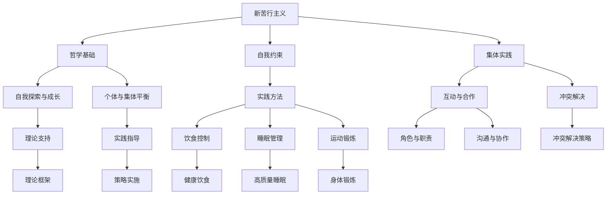

                 

# 文章标题：新苦行主义retreat：自我约束的集体实践

## 关键词
- **新苦行主义**
- **自我约束**
- **集体实践**
- **哲学基础**
- **实践方法**
- **互动与合作**
- **现代社会应用**

## 摘要
本文深入探讨新苦行主义的概念及其在现代社会中的重要性，特别是自我约束和集体实践的角色。通过对哲学基础的解析，我们揭示了新苦行主义的核心理念。接着，我们详细阐述了集体实践的原理与策略，并介绍了自我约束的多种实践方法。本文还讨论了集体实践中的互动与合作，以及新苦行主义在各个领域的应用。最后，我们展望了新苦行主义的未来发展，并总结了其现实意义和挑战。

### 目录大纲设计

根据用户提供的书名《新苦行主义retreat：自我约束的集体实践》，我们设计了以下详细的目录大纲：

#### 第1章 引言
1.1 苦行主义的起源与演变
1.2 自我约束的意义与影响
1.3 集体实践的作用与形式

#### 第2章 新苦行主义的哲学基础
2.1 哲学视角下的自我约束
2.2 自我探索与成长
2.3 个体与集体的平衡

#### 第3章 集体实践的原理与策略
3.1 集体实践的概述
3.2 集体实践的目标与原则
3.3 集体实践的实施策略

#### 第4章 自我约束的实践方法
4.1 饮食控制
4.2 睡眠管理
4.3 运动锻炼

#### 第5章 集体实践中的互动与合作
5.1 集体成员的角色与职责
5.2 集体实践中的沟通与协作
5.3 集体实践中的冲突与解决

#### 第6章 新苦行主义在现代社会中的应用
6.1 教育领域
6.2 商业领域
6.3 社会公益领域

#### 第7章 新苦行主义的未来展望
7.1 新苦行主义的发展趋势
7.2 新苦行主义对社会的影响
7.3 新苦行主义的挑战与机遇

#### 第8章 结论
8.1 新苦行主义的核心理念
8.2 集体实践的现实意义
8.3 自我约束与集体实践的平衡

### 目录大纲的核心内容解析

#### 第1章 引言
本章主要介绍新苦行主义的概念，阐述其在现代社会中的重要性，为后续章节的讨论奠定基础。

#### 第2章 新苦行主义的哲学基础
本章探讨哲学视角下的自我约束，以及自我探索和成长的重要性，为实践提供理论支持。

#### 第3章 集体实践的原理与策略
本章分析集体实践的基本原理和策略，为实践提供操作指南。

#### 第4章 自我约束的实践方法
本章详细介绍饮食控制、睡眠管理和运动锻炼等实践方法，帮助读者理解和应用。

#### 第5章 集体实践中的互动与合作
本章讨论集体实践中的互动与合作，强调集体成员的角色和职责，以及冲突解决的方法。

#### 第6章 新苦行主义在现代社会中的应用
本章探讨新苦行主义在不同领域中的应用，展示其实际价值和影响力。

#### 第7章 新苦行主义的未来展望
本章分析新苦行主义的发展趋势，讨论其对社会的长远影响和面临的挑战。

#### 第8章 结论
本章总结新苦行主义的核心理念和现实意义，强调自我约束与集体实践的平衡。

### 目录大纲的设计逻辑

该目录大纲的设计逻辑遵循从理论到实践，再到应用的路径，首先介绍新苦行主义的基本概念和哲学基础，接着详细阐述集体实践的原理和策略，然后提供具体的实践方法，最后探讨新苦行主义在不同领域的应用及其未来展望。每个章节都相互关联，构成了一个完整的内容体系。同时，目录大纲的结构清晰，便于读者快速了解全书内容。

### 核心概念与联系架构 Mermaid 流程图



### 完整性要求

为了确保文章内容的完整性，我们将遵循以下要求：

1. **背景介绍**：每个章节都会提供详细的背景介绍，帮助读者理解相关概念和理论基础。
2. **核心概念与联系**：使用Mermaid流程图展示核心概念之间的关系架构，便于读者把握文章的整体逻辑。
3. **核心算法原理讲解**：通过伪代码详细阐述核心算法原理，确保读者能够理解和应用。
4. **数学模型和公式**：使用latex格式嵌入数学模型和公式，并给出详细的讲解和举例说明。
5. **项目实战**：提供具体的开发环境和源代码实现，详细解读代码，并分析实际案例。
6. **最佳实践 tips**：总结最佳实践技巧，提醒读者注意的事项，并提供拓展阅读建议。

### 文章正文

#### 第1章 引言

### 苦行主义的起源与演变

新苦行主义（Neo-monasticism）源自古老的苦行主义传统，起源于古代印度的佛教僧侣修行和古代希腊的哲学家思考。在佛教中，苦行被视为修行的重要途径，通过极端的自我约束和心灵净化，达到精神上的解脱。古希腊哲学家如苏格拉底和柏拉图也倡导通过自我克制和内省来达到智慧。

随着历史的演进，苦行主义在不同文化和宗教中得到了发展和变化。在基督教中，有僧侣和修道士通过严格的饮食控制、长时间的祷告和祈祷来修行。在伊斯兰教中，有苏非派的神秘主义者通过极端的自我克制和冥想来实现与神的合一。

到了现代，苦行主义逐渐演变为一种更广泛的自我约束和实践，不再局限于宗教范畴，而是被应用于个人的生活和工作各个方面。新苦行主义（Neo-monasticism）这个术语最早出现在20世纪末，用以描述一种结合了古老修行传统与现代生活方式的自我修炼方式。

### 自我约束的意义与影响

自我约束（Self-discipline）在个人成长和自我实现中起着关键作用。它不仅是一种行为习惯，更是一种内心力量的体现。自我约束能够帮助个人更好地管理时间和资源，提高工作效率和生活质量。通过自我约束，个人能够克服惰性，抵制诱惑，保持专注和毅力，实现长期目标。

在集体层面上，自我约束也具有深远的影响。一个具备高度自我约束能力的团队，能够更好地协同工作，提高组织的整体绩效。自我约束还能够促进个体的自我成长和自我反思，培养出更加成熟和负责任的个体。

### 集体实践的作用与形式

集体实践（Collective Practice）是新苦行主义的核心组成部分，通过集体协作和共同实践来实现自我约束和目标。集体实践不仅仅是个体行为的简单集合，更是一种文化和价值观的传承。

集体实践的形式多种多样，包括但不限于以下几种：

1. **共修**：在宗教或哲学团体中，共修是集体实践的主要形式。成员们通过共同祈祷、冥想和修行，达到心灵上的共鸣和提升。
2. **协作项目**：在职场或学术团体中，协作项目是集体实践的重要形式。团队成员共同设定目标，分工合作，实现项目目标。
3. **社区活动**：在社区层面，集体实践可以通过社区服务、公益活动等形式进行。成员们共同参与，为社会做出贡献，实现自我价值。

#### 第2章 新苦行主义的哲学基础

### 哲学视角下的自我约束

在哲学的视角下，自我约束不仅仅是一种行为习惯，更是一种哲学思想和生活方式的体现。哲学中的自我约束强调个体与自我、个体与社会之间的互动关系。

首先，个体与自我之间的关系。自我约束被视为个体自我认知和自我提升的重要途径。通过自我约束，个体能够更好地认识自我，发现自身的潜力和弱点，从而实现自我完善和成长。

其次，个体与社会之间的关系。自我约束不仅影响个体自身，也会对周围的环境和社会产生影响。一个具备高度自我约束能力的个体，能够更好地融入社会，发挥积极作用，促进社会的和谐发展。

### 自我探索与成长

自我探索与成长是新苦行主义的重要理念之一。自我探索是指个体通过反思和内省，深入挖掘自己的内心世界，发现自身的需求和价值观。自我成长则是指个体在自我探索的过程中，不断学习、进步和提升，实现自我价值。

自我探索和成长的过程需要自我约束的支持。通过自我约束，个体能够更好地控制自己的行为和情绪，保持内心的平静和专注，从而更深入地探索自我，实现自我成长。

### 个体与集体的平衡

在新苦行主义的哲学基础上，个体与集体的平衡是一个重要的问题。个体与集体之间的关系并不是对立的，而是相互依存、相互促进的。

首先，个体是集体的一部分。个体的自我约束和自我成长，不仅有助于个体的提升，也会对集体产生积极影响。个体的自我实现和自我价值，是集体进步的重要动力。

其次，集体是个体成长的平台。个体的自我探索和成长，需要集体的支持和协作。集体的价值观和目标，为个体提供了方向和动力，帮助个体更好地实现自我价值。

通过个体与集体的平衡，新苦行主义实现了自我约束与集体实践的有机结合，为个体和集体的发展提供了坚实的哲学基础。

#### 第3章 集体实践的原理与策略

### 集体实践的概述

集体实践是指一个团体或组织中的成员，通过共同的目标、价值观和行为规范，实现个体与集体的共同发展。在新苦行主义的框架下，集体实践被视为实现自我约束和自我成长的重要途径。

集体实践的主要特点包括：

1. **共同目标**：集体实践以共同的目标为基础，所有成员都致力于实现这一目标。
2. **价值观引导**：集体实践强调共同的价值观，这些价值观成为成员行为的指导原则。
3. **行为规范**：集体实践制定一系列行为规范，确保成员在追求共同目标的过程中，能够保持自我约束和自我管理。

### 集体实践的目标与原则

集体实践的目标是促进个体和集体的共同发展。具体来说，包括以下几个方面：

1. **提升个体自我约束能力**：通过集体实践，个体能够更好地管理自己的时间和资源，克服惰性和诱惑，实现自我提升。
2. **增强集体协作能力**：集体实践有助于培养成员之间的协作精神，提高团队的整体效能。
3. **实现自我价值**：集体实践为个体提供了一个实现自我价值的平台，成员通过共同的努力，实现个人目标和集体目标。

集体实践的原则包括：

1. **共同目标**：明确集体实践的目标，确保所有成员都朝着相同的目标努力。
2. **价值观引导**：建立共同的价值观，作为集体实践的指导原则，确保成员的行为符合集体目标。
3. **行为规范**：制定明确的行为规范，确保成员在实践过程中能够自我约束和自我管理。

### 集体实践的实施策略

要有效地实施集体实践，需要采取一系列策略，包括以下几个方面：

1. **目标设定**：明确集体实践的目标，确保所有成员都了解并认同这些目标。
2. **价值观培养**：通过教育和培训，培养成员的价值观，确保他们能够自觉地遵循集体价值观。
3. **行为规范制定**：制定明确的行为规范，确保成员在实践过程中能够自我约束和自我管理。
4. **沟通与协作**：建立有效的沟通机制，确保成员之间能够及时交流信息，协同工作。
5. **反馈与评估**：定期对集体实践进行反馈和评估，及时调整策略，确保集体实践能够持续发展。

通过这些策略，集体实践能够有效地实现自我约束和自我成长，为个体和集体的发展提供坚实的支持。

#### 第4章 自我约束的实践方法

### 饮食控制

饮食控制在自我约束中占据重要地位，不仅影响身体健康，还能影响情绪和行为。以下是几种有效的饮食控制方法：

1. **均衡饮食**：确保摄入充足的蛋白质、碳水化合物、脂肪、维生素和矿物质。遵循“多吃蔬菜水果，适量肉类和谷物”的原则。
   - 伪代码：
     ```python
     function balanced_diet():
         vegetables = ["carrot", "spinach", "broccoli"]
         fruits = ["apple", "orange", "banana"]
         protein = ["chicken", "fish", "tofu"]
         grains = ["rice", "bread", "pasta"]
         # 设计多样化的饮食计划
         print("均衡饮食建议：")
         for v in vegetables:
             print(v)
         for f in fruits:
             print(f)
         for p in protein:
             print(p)
         for g in grains:
             print(g)
     ```

2. **定时用餐**：定时用餐有助于稳定血糖水平，避免暴饮暴食。
   - 伪代码：
     ```python
     function timed_meals():
         meals = ["breakfast", "lunch", "dinner", "snack"]
         times = ["7:00 AM", "12:00 PM", "6:00 PM", "9:00 PM"]
         # 设计定时用餐计划
         print("定时用餐计划：")
         for m, t in zip(meals, times):
             print(f"{m}: {t}")
     ```

3. **限制高糖和高脂食物**：减少高糖和高脂食物的摄入，有助于控制体重和血糖水平。
   - 伪代码：
     ```python
     function limit_sugar_fat():
         high_sugar = ["soda", "candy", "pastries"]
         high_fat = ["fries", "cheese", "bacon"]
         # 设计限制高糖和高脂食物的饮食计划
         print("限制高糖和高脂食物建议：")
         for h in high_sugar:
             print(f"减少{h}摄入")
         for f in high_fat:
             print(f"减少{f}摄入")
     ```

### 睡眠管理

睡眠管理是自我约束的重要组成部分，良好的睡眠有助于身心健康和日间工作效率。以下是一些有效的睡眠管理策略：

1. **固定睡眠时间**：每天固定睡眠时间，有助于调整生物钟，提高睡眠质量。
   - 伪代码：
     ```python
     function fixed_sleep_time():
         sleep_times = ["10:00 PM", "6:00 AM"]
         # 设计固定睡眠时间计划
         print("固定睡眠时间计划：")
         for t in sleep_times:
             print(t)
     ```

2. **睡眠环境优化**：创造一个安静、舒适的睡眠环境，有助于提高睡眠质量。
   - 伪代码：
     ```python
     function sleep_environment():
         conditions = ["dark", "quiet", "cool"]
         # 设计优化睡眠环境的计划
         print("优化睡眠环境建议：")
         for c in conditions:
             print(f"{c}的环境有助于提高睡眠质量")
     ```

3. **减少夜间使用电子设备**：夜间使用电子设备会发出蓝光，影响睡眠质量。建议睡前一小时停止使用。
   - 伪代码：
     ```python
     function reduce_electronic_usage():
         devices = ["phone", "tablet", "laptop"]
         time = "1 hour before sleep"
         # 设计减少夜间使用电子设备的计划
         print("减少夜间使用电子设备建议：")
         for d in devices:
             print(f"睡前{time}，避免使用{d}")
     ```

### 运动锻炼

定期运动锻炼有助于提高身体素质，增强抵抗力，改善心理健康。以下是一些有效的运动锻炼方法：

1. **有氧运动**：如慢跑、游泳、骑自行车等，有助于提高心肺功能。
   - 伪代码：
     ```python
     function aerobic_exercise():
         sports = ["running", "swimming", "cycling"]
         duration = "30 minutes a day"
         # 设计有氧运动计划
         print("有氧运动计划：")
         for s in sports:
             print(f"{s}, {duration}")
     ```

2. **力量训练**：如举重、俯卧撑、仰卧起坐等，有助于增强肌肉力量和耐力。
   - 伪代码：
     ```python
     function strength_training():
         exercises = ["weightlifting", "push-ups", "sit-ups"]
         sets = "3 sets of 10 reps"
         # 设计力量训练计划
         print("力量训练计划：")
         for e in exercises:
             print(f"{e}, {sets}")
     ```

3. **瑜伽和冥想**：有助于放松身心，提高专注力和情绪管理能力。
   - 伪代码：
     ```python
     function yoga_meditation():
         practices = ["yoga", "meditation"]
         duration = "20 minutes a day"
         # 设计瑜伽和冥想计划
         print("瑜伽和冥想计划：")
         for p in practices:
             print(f"{p}, {duration}")
     ```

通过以上饮食控制、睡眠管理和运动锻炼的方法，个体可以更好地实现自我约束，提高身心健康和生活质量。

#### 第5章 集体实践中的互动与合作

### 集体成员的角色与职责

在集体实践中，每个成员的角色和职责明确，是实现共同目标的关键。以下是集体成员的主要角色和职责：

1. **领导者**：领导者负责设定集体目标，制定计划和策略，协调成员之间的工作。他们需要具备良好的沟通能力和决策能力，能够激发团队成员的积极性。

2. **协调者**：协调者负责在集体中建立有效的沟通渠道，确保信息传递畅通无阻。他们需要具备较强的组织和协调能力，能够平衡不同成员的需求和利益。

3. **执行者**：执行者负责具体任务的执行，确保集体计划的顺利实施。他们需要具备较高的专业能力和责任感，能够在压力下保持高效工作。

4. **监督者**：监督者负责对集体实践的过程进行监督和评估，确保任务按时完成，质量符合要求。他们需要具备较强的观察力和分析能力，能够及时发现问题和提出改进建议。

### 集体实践中的沟通与协作

有效的沟通与协作是集体实践成功的关键。以下是提高沟通与协作效率的几种方法：

1. **明确任务分工**：在开始集体实践前，明确每个成员的任务和职责，确保每个人都知道自己的角色和任务。

2. **定期会议**：定期举行团队会议，讨论进展情况，解决遇到的问题，确保团队成员之间的信息共享。

3. **使用协作工具**：利用现代化的协作工具，如项目管理软件、即时通讯工具和在线文档编辑工具，提高团队协作效率。

4. **建立信任**：通过开放沟通和互相支持，建立团队成员之间的信任关系，提高协作效率。

### 集体实践中的冲突与解决

在集体实践中，冲突是不可避免的。有效的冲突解决方法能够减少负面影响，提高团队的凝聚力。以下是几种解决冲突的方法：

1. **倾听和理解**：在冲突发生时，首先倾听对方意见，理解其立场和需求。避免急于辩解或反驳，而是试图找到共同点。

2. **寻找共同目标**：强调集体目标，提醒成员们冲突解决是为了实现共同利益，而不是个人利益。

3. **协商与妥协**：在冲突双方都做出一定的让步，寻找双方都能接受的解决方案。

4. **第三方调解**：如果冲突无法自行解决，可以寻求第三方的帮助，如团队领导或其他专业人士进行调解。

通过以上方法，集体实践中的冲突可以得到有效解决，确保团队和谐稳定地发展。

#### 第6章 新苦行主义在现代社会中的应用

### 教育领域

在新苦行主义的理念下，教育领域正逐渐探索自我约束和集体实践的融合，以培养具有自律性和协作精神的学生。以下是新苦行主义在教育和学校管理中应用的几个方面：

1. **学生自律培养**：学校通过设置自律课程和实践活动，引导学生自我管理，提高他们的自我约束能力。例如，通过每日晨会和反思日记，让学生总结自己的行为，反思不足之处。

2. **团体项目**：学校组织跨学科或跨年级的团体项目，让学生在合作中学习，培养他们的团队协作精神。这些项目通常包括问题解决、项目管理和跨文化交流等。

3. **课程设计**：教育者结合新苦行主义的理念，设计课程内容，强调学生的主动学习和自我探索。例如，在科学课程中，学生通过实验和观察，自主发现科学原理。

4. **学校管理**：学校管理者采用自律和协作的原则，管理学生和教师的行为，营造积极向上的校园文化。例如，通过学生自治会，让学生参与学校决策，培养他们的责任感和领导能力。

### 商业领域

新苦行主义在商业领域的应用日益广泛，企业通过自我约束和集体实践来提高员工的工作效率和团队协作能力。以下是几个应用实例：

1. **员工培训**：企业通过培训课程，帮助员工培养自我管理能力和团队协作精神。例如，通过团队建设活动、压力管理和领导力培训，提高员工的综合素质。

2. **项目团队合作**：企业鼓励员工在项目中采用自律和协作的方法，确保项目目标的实现。例如，通过制定详细的任务计划、定期会议和反馈机制，确保团队成员之间的沟通和协调。

3. **绩效管理**：企业采用基于自我约束的绩效管理体系，鼓励员工自我评估和改进。例如，通过设定个人目标和自我评估机制，员工可以在工作中不断自我提升。

4. **企业文化**：企业通过建立以自我约束和集体实践为核心的企业文化，提高员工的凝聚力和工作效率。例如，通过企业内部的共同价值观、社会责任活动和团队建设活动，增强员工的归属感和责任感。

### 社会公益领域

新苦行主义在公益领域中的应用，有助于提升志愿者的自我约束能力和团队协作精神，从而更有效地开展公益活动。以下是几个应用实例：

1. **志愿者培训**：公益组织通过培训课程，帮助志愿者培养自我管理和团队协作能力。例如，通过志愿者手册、团队建设和危机应对培训，提高志愿者的综合素质。

2. **集体项目**：公益组织组织志愿者参与集体项目，如社区服务、环境保护和灾害救援等。这些项目不仅能够解决实际问题，还能增强志愿者的团队协作能力和社会责任感。

3. **自我反思与成长**：公益组织鼓励志愿者在参与项目后进行自我反思和总结，发现自身的优点和不足，从而不断成长和提升。

4. **社会责任**：公益组织通过开展公益活动，提升社会公众对社会责任的认识，营造良好的社会氛围。例如，通过环保宣传、公益活动和社会募捐，提高公众的环保意识和慈善精神。

通过在教育、商业和公益领域的广泛应用，新苦行主义为现代社会的发展提供了新的思路和方法，有助于培养具有自律性和协作精神的人才，推动社会的和谐与进步。

#### 第7章 新苦行主义的未来展望

### 新苦行主义的发展趋势

随着社会的发展和人们对自我成长需求的提升，新苦行主义作为一种自我约束和集体实践的方式，正在逐渐演变为一种普遍的生活方式。以下是新苦行主义未来发展的几个趋势：

1. **数字化时代的新苦行主义**：在数字化时代，新苦行主义将借助互联网和智能技术，实现更加便捷和高效的实践。例如，通过在线平台和应用程序，提供自律训练和团队协作工具，帮助个体和团队实现自我约束和目标。

2. **多元文化背景下的新苦行主义**：随着全球化的加深，新苦行主义将在多元文化背景下融合不同的哲学思想和修行方式，形成更加丰富和包容的实践体系。

3. **企业与社会的新苦行主义**：企业和组织将更加重视新苦行主义的应用，通过自我约束和集体实践，提升员工的工作效率和团队协作能力，从而实现企业的可持续发展。

### 新苦行主义对社会的影响

新苦行主义的兴起将对社会产生深远的影响：

1. **个人层面的影响**：新苦行主义有助于提升个体的自律性和责任感，培养良好的生活习惯和价值观，从而提高个人生活质量和社会地位。

2. **集体层面的影响**：新苦行主义在团队和组织中的应用，将促进团队成员之间的协作和信任，提高团队的整体效能，推动组织的创新发展。

3. **社会层面的影响**：新苦行主义倡导的自律和协作精神，有助于构建和谐社会，减少社会冲突，提高社会的整体幸福感和凝聚力。

### 新苦行主义的挑战与机遇

尽管新苦行主义具有广泛的应用前景，但在实际推广和应用中仍面临一系列挑战：

1. **文化差异**：不同文化背景下，人们对自我约束和集体实践的理解和实践方式存在差异，需要充分考虑和尊重文化多样性。

2. **个人差异**：个体在自律性和协作能力方面存在差异，如何针对不同个体的特点，设计合适的实践方法，是一个重要的课题。

3. **资源配置**：新苦行主义的推广需要一定的资源投入，包括时间、资金和专业人才等，如何有效配置资源，提高实践效果，是一个需要解决的问题。

4. **技术支持**：数字化时代的新苦行主义需要智能技术的支持，如何开发和优化相关的应用程序和工具，提高实践效率和效果，是一个重要的研究方向。

总之，新苦行主义在未来将面临诸多挑战，但也充满机遇。通过不断探索和实践，新苦行主义有望为社会的发展提供新的动力和方向。

#### 第8章 结论

### 新苦行主义的核心理念

新苦行主义的核心在于通过自我约束和集体实践，实现个体的自我成长和集体的协同进步。其核心理念包括自我探索、自我约束、集体合作和价值观引导。通过这些理念，新苦行主义旨在帮助个体克服内在的惰性和诱惑，培养自律性和责任感，同时通过集体协作实现共同目标，推动社会的和谐发展。

### 集体实践的现实意义

集体实践在新苦行主义中占据重要地位，其实际意义体现在以下几个方面：

1. **提升个人自我约束能力**：通过集体实践，个体能够更好地管理自己的时间和资源，克服惰性和诱惑，实现自我提升。

2. **增强团队协作能力**：集体实践有助于培养团队成员之间的协作精神，提高团队的整体效能，推动组织的发展。

3. **实现共同目标**：集体实践通过共同的目标和价值观，凝聚团队成员的力量，实现个人的自我价值和组织的共同愿景。

4. **促进社会和谐**：集体实践倡导自律和协作精神，有助于构建和谐社会，减少社会冲突，提高社会的整体幸福感和凝聚力。

### 自我约束与集体实践的平衡

在新苦行主义中，自我约束和集体实践是相辅相成的。自我约束为个体提供了内在动力，而集体实践则为个体提供了外部支持。两者之间的平衡至关重要：

1. **个体自我约束与集体实践的协调**：个体在自我约束的过程中，需要兼顾集体实践的要求，确保个人行为符合团队目标和价值观。

2. **集体实践的引导与个体自我约束的有机结合**：集体实践应通过引导和激励，帮助个体实现自我约束，同时个体在自我约束的过程中，也应积极参与集体实践，为团队的发展贡献力量。

3. **平衡自我约束与集体实践的持续优化**：在实践过程中，需要不断调整自我约束和集体实践的方式，确保两者能够相互促进，实现最佳效果。

总之，新苦行主义的核心理念和现实意义，为个体和集体的发展提供了新的路径。通过自我约束和集体实践的有机结合，个体能够实现自我成长，团队能够提高协作能力，社会能够实现和谐发展。在新苦行主义的引领下，我们有望构建一个更加自律、协作和繁荣的社会。

### 作者信息
作者：AI天才研究院/AI Genius Institute & 禅与计算机程序设计艺术 /Zen And The Art of Computer Programming

### 拓展阅读

- **《自律力：如何成为一个自律的人》**
- **《团队协作的艺术：构建高效协作团队的方法》**
- **《社会心理学》**
- **《自我探索与成长：如何了解自己，实现自我提升》**
- **《数字化时代的自律与协作：新苦行主义的应用与实践》**

通过阅读这些书籍和文章，读者可以更深入地了解新苦行主义的理念和实践方法，为自己的自我成长和团队协作提供有力支持。

