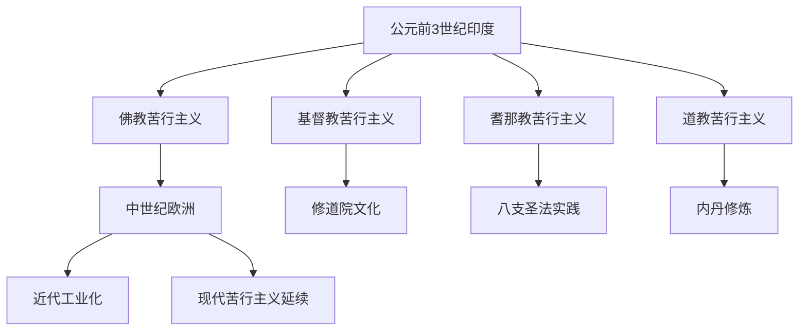
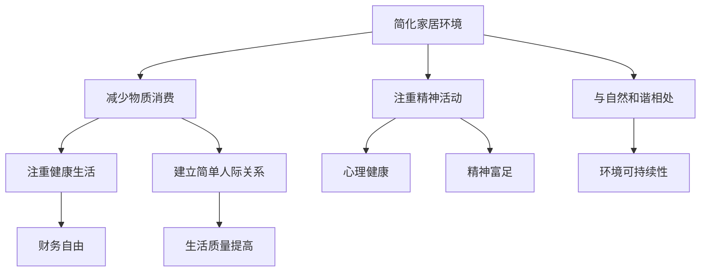
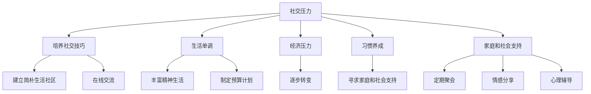
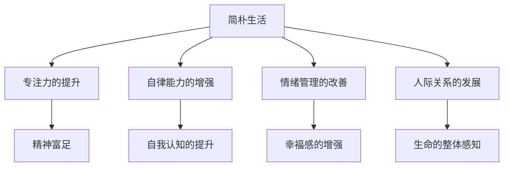
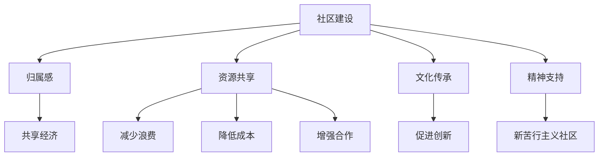
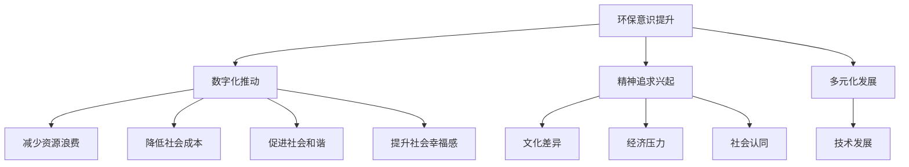

                 

### 引言：新苦行主义的背景和重要性

新苦行主义（Neo-Monasticism）是一种现代生活方式的哲学，起源于对传统苦行主义的重新解读和应用。与传统苦行主义强调通过极端的自我克制和肉体苦行来寻求精神净化不同，新苦行主义更注重在现代社会中，通过简朴和自律的生活方式，实现个人成长、精神富足以及社会和谐。这一概念不仅仅是对个人生活的指导，更是对整个社会结构和生活方式的深刻反思。

新苦行主义的核心在于“在简朴中寻找丰盛”，它提倡减少物质消费，简化生活，专注于内在的精神世界。这种生活方式不仅有助于个人实现内心的平静和满足，还能够减少资源浪费，减轻环境负担，推动可持续发展的社会模式。

本文将以《新苦行主义体验营：在简朴中寻找丰盛》为蓝本，深入探讨这一哲学背后的理论依据、实践方法及其在社会和个人层面的影响。文章将首先介绍苦行主义的历史与发展，然后详细阐述简朴生活的哲学与实践，接着讨论简朴生活中的挑战与解决方案，最后探讨新苦行主义在社区建设与共享经济中的作用，并展望其未来发展。

通过这篇文章，我们希望读者能够理解新苦行主义的理念，学会如何在日常生活中实践这一哲学，并在简朴中找到内心的丰盛。这不仅仅是一次对生活方式的探索，更是一次对人类存在意义的深刻反思。

### 关键词

- 新苦行主义
- 简朴生活
- 个人成长
- 精神富足
- 社区建设
- 共享经济
- 可持续发展
- 精神净化
- 自我克制
- 资源浪费
- 内在平静

### 摘要

《新苦行主义体验营：在简朴中寻找丰盛》是一本探讨现代生活方式哲学的著作，旨在重新解读传统苦行主义，提出一种在简朴中实现精神富足的生活方式。本书首先介绍了新苦行主义的历史背景和理论基础，然后详细阐述了简朴生活的哲学与实践，探讨了简朴生活中的挑战与解决方案。此外，本书还探讨了新苦行主义在社区建设与共享经济中的作用，并展望了其未来发展。通过实际案例和深入分析，本书旨在引导读者在日常生活中实践新苦行主义，实现个人成长与精神富足，推动社会的可持续发展。

### 第1章 苦行主义的起源与发展

#### 1.1 苦行主义的历史背景

苦行主义（Monasticism）是一种古老的宗教和社会运动，起源于公元前3世纪的印度。当时，佛教和耆那教等宗教提倡通过严格的自我克制和冥想实践来追求精神净化。这些宗教中的修行者，被称为“苦行僧”，他们通过极端的肉体和精神苦行，试图摆脱尘世的束缚，达到解脱和悟道的境界。

随着时间的推移，苦行主义在欧洲中世纪时期得到了广泛传播。公元312年，罗马皇帝君士坦丁大帝宣布基督教为帝国的官方宗教，基督教苦行主义随之兴起。修道院成为修行者和学者聚集的场所，他们在严格的宗教纪律下，过着简朴、自律的生活，致力于祈祷、修行和学问研究。这一时期的苦行主义强调通过对自我的控制和简化生活来追求内心的平静和精神的富足。

#### 1.2 各流派苦行主义的核心观点

1. **佛教苦行主义**：
   佛教苦行主义的核心是“四无量心”，即慈、悲、喜、舍。修行者通过持戒、禅定和智慧，逐步净化心灵，达到涅槃的境界。佛教中的苦行不仅仅是肉体的折磨，更重要的是心灵的修行，通过冥想和观照，实现对自我的超越。

2. **基督教苦行主义**：
   基督教苦行主义强调自我克制和谦卑，信徒通过禁食、祷告、劳作和苦修来磨练自己的意志。这种苦行主义与佛教有所不同，更注重社会参与和道德实践。中世纪的基督教苦行主义者，如圣本尼狄克，建立了严格的修道院制度，提倡简朴、共同生活和劳动。

3. **耆那教苦行主义**：
   耆那教苦行主义的核心是“八支圣法”，包括正直、非暴力、真理、不贪婪、不偷盗、节制、洁身自好和冥想。耆那教修行者通过严格的斋戒和苦行，追求身体的纯净和心灵的净化，最终达到解脱。

4. **道教苦行主义**：
   道教苦行主义强调“无为而治”和“与自然和谐相处”。修行者通过修炼内丹，即内在的精、气、神，追求身体的健康和心灵的宁静。道教中的苦行更多地体现在日常生活的自律和心灵的修炼上。

#### 1.3 苦行主义与社会变迁的关系

苦行主义在不同历史时期和文化背景下，呈现出不同的形态和特点。在中世纪欧洲，苦行主义作为一种宗教和社会运动，对当时的社会结构和思想产生了深远的影响。修道院成为文化传承的重要场所，学者和艺术家在这里进行创作和研究，推动了中世纪文化的繁荣。

然而，随着近代工业化和现代社会的到来，传统的苦行主义受到了挑战。物质丰富和科技进步带来的便利，使得人们逐渐远离了简朴和自律的生活方式。尽管如此，现代苦行主义仍然在某种程度上得以延续和发展。新兴的宗教团体、精神修行组织和简朴生活社区，都在尝试将苦行主义的理念融入现代社会，为人们提供精神上的指引和生活方式的选择。

#### Mermaid流程图：苦行主义的历史演变



通过这个Mermaid流程图，我们可以清晰地看到苦行主义从古代到现代的演变过程，以及在不同文化背景下的发展特点。这为后续章节对新苦行主义的探讨提供了历史和理论依据。

### 第2章 简朴生活的哲学与实践

#### 2.1 简朴生活的价值观

简朴生活（Simple Living）是一种追求简单、自然和有意义的生活方式。它强调减少物质消费，简化生活内容，将注意力集中在内在的精神和情感需求上。简朴生活的价值观主要体现在以下几个方面：

1. **物质与精神平衡**：简朴生活认为，过度的物质追求会使人失去精神上的平静和满足。通过减少物质消费，人们可以更多地关注内在的需求，如情感、思想和精神成长。

2. **可持续发展**：简朴生活倡导节约资源和减少浪费，以实现环境的可持续性。通过减少消费，人们可以减少对自然资源的依赖，降低环境负担。

3. **自由与独立**：简朴生活使人从物质压力中解放出来，获得更多的自由和独立。通过减少财务负担，人们可以有更多的时间和资源来追求个人兴趣和梦想。

4. **精神富足**：简朴生活鼓励人们关注内心的平静和满足，通过冥想、读书、艺术创作等方式，实现精神上的富足。

#### 2.2 简朴生活的实践方法

要实现简朴生活，需要从日常生活的方方面面入手，逐步养成简单、自然和有意义的生活习惯。以下是一些具体的实践方法：

1. **简化家居环境**：清理不必要的物品，只保留真正需要的物品。通过减少家居环境的杂乱，使人更加专注于内在的需求。

2. **减少物质消费**：制定消费预算，避免不必要的购物冲动。通过减少物质消费，减少财务负担，同时降低对环境的负面影响。

3. **注重精神活动**：安排时间进行冥想、读书、艺术创作等活动，以充实内在的精神世界。这些活动可以帮助人们减轻压力，提高生活质量。

4. **与自然和谐相处**：选择健康的生活方式，如步行、骑行、种植植物等，以减少对自然资源的消耗。通过亲近自然，提高生活的质量。

5. **建立简单的人际关系**：减少社交活动，专注于与真正重要的人建立深厚的友谊。通过减少社交压力，使生活更加简单和有意义。

#### 2.3 简朴生活对个人生活的影响

简朴生活对个人生活有着深远的影响，主要体现在以下几个方面：

1. **心理健康**：通过减少物质压力和社交压力，简朴生活有助于减轻焦虑和抑郁，提高心理健康水平。

2. **精神富足**：简朴生活使人有更多的时间关注内在的需求，通过冥想、读书、艺术创作等活动，实现精神上的富足。

3. **财务自由**：通过减少物质消费，简朴生活可以帮助人们减少财务负担，实现财务自由，从而有更多的时间和资源追求个人兴趣和梦想。

4. **环境可持续性**：简朴生活倡导节约资源和减少浪费，有助于实现环境的可持续性，减少对自然资源的依赖。

#### Mermaid流程图：简朴生活的实践路径



通过这个Mermaid流程图，我们可以清晰地看到简朴生活的实践路径及其对个人生活的影响。这为后续章节探讨简朴生活中的挑战与解决方案提供了实践依据。

### 第3章 简朴生活中的挑战

#### 3.1 简朴生活中的常见问题

尽管简朴生活有许多优点，但在实际实践中，人们可能会遇到一些挑战和困难。以下是一些简朴生活中常见的挑战：

1. **社交压力**：在简朴生活中，减少物质消费和社交活动可能会使人们感到与外界脱节，面临社交压力。

2. **生活单调**：简朴生活可能使日常生活变得单调乏味，缺乏变化和刺激。

3. **经济压力**：初期实行简朴生活可能会增加经济压力，特别是在减少消费和改变生活方式的过程中。

4. **习惯养成**：简朴生活需要养成一系列新的生活习惯，这需要时间和毅力。

5. **家庭和社会支持**：简朴生活可能难以得到家庭和朋友的认同和支持，面临社会压力。

#### 3.2 解决简朴生活挑战的方法

为了克服简朴生活中的挑战，可以采取以下方法和策略：

1. **培养社交技巧**：通过参与社区活动、公益活动等方式，培养新的社交技巧，建立有意义的人际关系。

2. **丰富精神生活**：通过读书、写作、艺术创作等活动，丰富精神生活，提高生活质量。

3. **制定预算计划**：制定详细的预算计划，合理安排财务，逐步减少经济压力。

4. **逐步转变**：逐步改变生活方式，而不是一夜之间彻底转变。这可以减少适应过程中的困难。

5. **寻求家庭和社会支持**：与家人和朋友沟通，寻求他们的理解和支持。如果可能，加入简朴生活社区，获得更多支持和资源。

#### 3.3 社交和情感支持的策略

在简朴生活中，社交和情感支持至关重要。以下是一些具体的策略：

1. **建立简朴生活社区**：加入或建立简朴生活社区，与其他志同道合的人分享经验和资源。

2. **在线交流**：利用社交媒体和在线论坛，与全球的简朴生活爱好者交流，获取灵感和支持。

3. **定期聚会**：定期组织聚会，与朋友和家人分享生活经验和心得。

4. **情感分享**：在困难时刻，与信任的朋友分享内心的感受，寻求情感支持。

5. **心理辅导**：如果感到压力过大，可以考虑寻求专业心理辅导，帮助应对生活中的挑战。

#### Mermaid流程图：简朴生活中的挑战与解决方案



通过这个Mermaid流程图，我们可以清晰地看到简朴生活中的常见挑战及其解决方案。这为读者在实践简朴生活时提供了实用的指导。

### 第4章 简朴生活中的成长与精神富足

#### 4.1 简朴生活与个人成长

简朴生活不仅是一种生活方式，更是一种促进个人成长和发展的哲学。通过减少物质消费和简化生活，人们可以将更多的精力和时间投入到内在的精神成长上。以下是一些简朴生活对个人成长的影响：

1. **专注力的提升**：简朴生活减少了外界的干扰，使人们能够更好地专注于内心世界的探索和个人兴趣的培养。

2. **自律能力的增强**：简朴生活要求人们自我克制，遵循一定的规律和纪律，这有助于增强自律能力，为个人成长打下坚实基础。

3. **情绪管理的改善**：简朴生活减少了物质追求带来的焦虑和压力，使人们能够更好地管理情绪，保持内心的平静和稳定。

4. **人际关系的发展**：简朴生活鼓励人们关注内在需求和真实的人际关系，有助于建立深厚、有意义的人际网络。

#### 4.2 精神富足的定义与追求

精神富足（Spiritual Wealth）是指内在的满足、平静和幸福感，不仅仅依赖于物质财富。它涵盖了以下几个方面：

1. **内心的平静**：通过冥想、冥想和内在探索，人们可以培养内心的平静，减少外界的干扰，实现精神上的宁静。

2. **自我认知的提升**：通过反思和自我探索，人们可以更深入地了解自己的内心世界，找到人生的意义和目标。

3. **幸福感的增强**：精神富足使人们能够在简单的事物中找到幸福和满足，减少对物质的依赖。

4. **生命的整体感知**：通过关注内在和外在的世界，人们可以体验到生命的丰富性和多样性，实现整体性的成长。

#### 4.3 成功案例分享

以下是一些成功实践简朴生活并实现精神富足的案例：

1. **艾伦·拉金**：艾伦·拉金是一位著名的作家和博主，他通过实践简朴生活，减少了物质消费，专注于写作和内省。他的博客“Zen Habits”吸引了全球数百万读者，分享了他关于简朴生活和精神富足的经验。

2. **乔达摩·悉达多**：乔达摩·悉达多，即佛陀，通过苦行和冥想，最终实现了精神富足。他创立了佛教，影响了几亿人的精神生活。

3. **海伦·凯勒**：海伦·凯勒是一位聋哑人，她通过实践简朴生活和内省，克服了生活中的困难，成为了一位成功的作家和演说家。

这些案例表明，简朴生活和精神富足不仅是可能的，而且在现实生活中具有巨大的潜力。

#### Mermaid流程图：简朴生活与个人成长、精神富足的关系



通过这个Mermaid流程图，我们可以清晰地看到简朴生活与个人成长、精神富足之间的紧密联系。这为读者在实践简朴生活时提供了指导。

### 第5章 社区建设与共享经济

#### 5.1 社区建设的重要性

社区建设是新苦行主义实践中的一个重要组成部分，它不仅仅是为了提供物质支持，更重要的是为人们提供精神和文化上的共鸣。在一个健康的社区中，个体可以感受到归属感和安全感，这对于实现简朴生活和精神富足至关重要。

1. **归属感**：社区为个体提供了一个归属的场所，使人们不再感到孤独和孤立。在一个相互支持和理解的社区中，个体更容易坚持简朴生活，减少外界干扰。

2. **资源共享**：社区内的资源共享可以减少个体的物质需求，降低生活成本。例如，共同种植食物、共享工具和设备等，不仅可以节省开支，还可以增强社区成员之间的合作精神。

3. **文化传承**：社区建设有助于保护和传承传统文化和价值观。在一个有着共同信仰和价值观的社区中，个体可以更容易地实践简朴生活和精神富足的理念。

4. **精神支持**：社区成员之间的相互支持和鼓励对于实现个人成长和精神富足至关重要。在一个互助互爱的社区中，个体在面对生活中的挑战时更容易获得帮助和支持。

#### 5.2 共享经济的理念与实践

共享经济（Sharing Economy）是一种基于共享资源和互助合作的经济模式，它通过互联网技术和社交网络平台，使资源得到更加高效和可持续的利用。共享经济在新苦行主义实践中具有重要作用，主要体现在以下几个方面：

1. **减少浪费**：共享经济通过共享资源和工具，减少了资源的浪费。例如，共享单车、共享办公空间等，使资源得到更加高效的利用。

2. **降低成本**：共享经济为个体提供了更加经济实惠的解决方案。例如，通过共享住宿平台，人们可以以更低的价格获得住宿服务。

3. **增强合作**：共享经济鼓励人们之间的合作和互助，增强了社区凝聚力。通过共享资源和知识，个体可以更好地实现个人成长和精神富足。

4. **促进创新**：共享经济提供了一个平台，使个体能够更加容易地接触到新的资源和知识，从而激发创新和创业精神。

#### 5.3 新苦行主义社区案例研究

以下是一些成功实践新苦行主义社区的案例，这些社区通过共享经济和社区建设，实现了简朴生活和精神富足：

1. **森林社区**：森林社区是一个位于巴西的生态社区，居民通过种植食物、回收利用资源、共同生活等方式，实现了高度的可持续性和简朴生活。社区内的居民通过共享资源和知识，共同追求精神富足。

2. **卡皮拉尼亚社区**：卡皮拉尼亚社区位于智利，是一个基于佛教哲学的社区。居民通过严格的修行和简朴的生活方式，实现了内心的平静和精神富足。社区内设有禅修中心和共享设施，为居民提供了丰富的精神资源。

3. **共享城市**：共享城市是一个位于欧洲的社区实验项目，旨在通过共享经济和社区建设，实现可持续性和简朴生活。社区内的居民通过共享住房、交通工具和公共设施，降低了生活成本，提高了生活质量。

这些案例表明，新苦行主义社区不仅是一种生活方式，更是一种社会模式，它通过共享经济和社区建设，为个体提供了实现简朴生活和精神富足的场所。

#### Mermaid流程图：社区建设与共享经济的关系



通过这个Mermaid流程图，我们可以清晰地看到社区建设与共享经济之间的相互关系，以及它们如何在实践中促进简朴生活和精神富足。这为读者在建设新苦行主义社区时提供了指导。

### 第6章 新苦行主义的未来

#### 6.1 新苦行主义的发展趋势

随着全球环境问题的加剧和物质主义文化的泛滥，越来越多的人开始关注可持续发展和精神富足。新苦行主义作为一种回应现代生活困境的哲学，正在逐渐受到广泛的关注和认可。以下是一些新苦行主义的发展趋势：

1. **环保意识的提升**：随着人们对环境问题的关注，新苦行主义倡导的减少浪费、节约资源和可持续生活方式越来越受到欢迎。

2. **数字化的推动**：互联网和数字技术的发展为新苦行主义的实践提供了更多便利。在线社区、共享平台和数字化工具使得人们更容易实现简朴生活和资源共享。

3. **精神追求的兴起**：在物质满足难以带来持久幸福感的情况下，越来越多的人开始寻求精神上的富足和内心的平静，新苦行主义提供了实现这一目标的途径。

4. **多元化的发展**：新苦行主义不仅仅局限于宗教或哲学领域，它在不同文化和社会背景下表现出多样化的形式，如生态社区、简朴生活社区和共享经济社区等。

#### 6.2 简朴生活对社会的影响

简朴生活不仅对个人有着深远的影响，也对整个社会产生了积极的影响。以下是一些简朴生活对社会的影响：

1. **减少资源浪费**：简朴生活倡导减少物质消费和浪费，有助于节约资源和减少环境污染，实现可持续发展。

2. **降低社会成本**：通过减少消费和节约资源，简朴生活可以降低社会成本，减轻政府和社会的负担。

3. **促进社会和谐**：简朴生活强调内在需求和人际关系的建立，有助于减少社会冲突和矛盾，促进社会和谐。

4. **提升社会幸福感**：简朴生活使人们更加关注内心的平静和满足，减少物质追求带来的焦虑和压力，提升整体社会幸福感。

#### 6.3 新苦行主义的挑战与机遇

尽管新苦行主义具有巨大的潜力和吸引力，但在实际推广和应用过程中也面临一些挑战和困难：

1. **文化差异**：不同文化和社会背景下，新苦行主义的实践方式和接受程度有所不同，需要针对不同文化特点进行适应性调整。

2. **经济压力**：初期实行简朴生活可能会带来经济压力，特别是在经济不发达地区，如何平衡经济需求与简朴生活理念是一个挑战。

3. **社会认同**：简朴生活可能难以得到传统社会的认同和支持，需要通过宣传和教育，提高社会对新苦行主义的认知和接受度。

4. **技术发展**：随着科技的进步，如何将新技术与简朴生活理念相结合，实现更加高效和可持续的生活方式，是一个重要的机遇。

#### Mermaid流程图：新苦行主义的发展趋势与挑战



通过这个Mermaid流程图，我们可以清晰地看到新苦行主义的发展趋势和面临的挑战。这为未来的研究和实践提供了指导。

### 项目实战：新苦行主义社区的建设与运作

#### 1. 开发环境搭建

要构建一个新苦行主义社区，首先需要一个稳定且易于协作的开发环境。以下是搭建该环境所需的基础步骤：

1. **选择合适的编程语言**：由于社区建设涉及多种技术，如前端、后端、数据库等，我们可以选择JavaScript和Python，这两种语言具有广泛的社区支持和丰富的库资源。

2. **设置本地开发环境**：
   - **JavaScript**：安装Node.js和npm，用于开发前端和后端。
   - **Python**：安装Python和pip，用于开发后端和数据处理。

3. **选择合适的开发工具**：
   - **前端**：使用Visual Studio Code或Sublime Text进行HTML、CSS和JavaScript的开发。
   - **后端**：使用VS Code或PyCharm进行Python开发。

4. **配置版本控制工具**：使用Git进行代码版本控制，确保团队成员之间的协作和代码的版本管理。

#### 2. 源代码详细实现

在开发新苦行主义社区时，我们将涉及以下几个关键模块：

1. **用户管理模块**：
   - **数据库设计**：使用MySQL设计用户数据库，包括用户名、密码、电子邮件、角色等信息。
   - **注册与登录**：实现用户注册和登录功能，使用JWT（JSON Web Token）进行身份验证。

   ```python
   # Python伪代码：用户注册
   def register_user(username, password, email):
       # 验证用户信息
       # 存储用户信息到数据库
       # 发送确认邮件
   ```

2. **社区活动管理模块**：
   - **数据库设计**：设计社区活动数据库，包括活动名称、日期、地点、参与人数等信息。
   - **活动发布与查询**：实现活动发布和查询功能，允许用户查看和报名参加活动。

   ```python
   # Python伪代码：发布活动
   def create_event(name, date, location, max_participants):
       # 验证活动信息
       # 存储活动信息到数据库
   ```

3. **资源共享模块**：
   - **数据库设计**：设计资源共享数据库，包括共享物品名称、描述、所有者、借用记录等信息。
   - **资源发布与借用**：实现资源共享和借用功能，允许用户发布共享物品和借用物品。

   ```python
   # Python伪代码：发布共享物品
   def create_resource(name, description, owner):
       # 验证资源信息
       # 存储资源信息到数据库
   ```

4. **讨论区模块**：
   - **数据库设计**：设计讨论区数据库，包括主题、回复、用户、时间等信息。
   - **讨论发布与回复**：实现讨论发布和回复功能，允许用户发表观点和参与讨论。

   ```javascript
   // JavaScript伪代码：发表主题
   function postTopic(topicTitle, topicContent) {
       // 验证主题信息
       // 发送请求到后端
       // 存储主题信息到数据库
   }
   ```

#### 3. 代码解读与分析

以下是对上述关键模块的实现进行详细解读：

1. **用户管理模块**：
   - **安全性**：用户注册和登录时，使用加密算法（如bcrypt）对密码进行加密存储，确保用户信息的安全。
   - **验证机制**：通过发送验证邮件或短信，确保注册用户是真实的，防止恶意注册。

2. **社区活动管理模块**：
   - **灵活性**：允许管理员根据需要修改活动信息，如更改活动日期、地点等。
   - **响应式设计**：确保活动信息能够适应不同设备，方便用户查看和报名。

3. **资源共享模块**：
   - **便捷性**：用户可以轻松地发布和查找共享物品，提高资源利用效率。
   - **可追踪性**：借用记录的存储和查询功能，确保共享物品的使用情况可追溯。

4. **讨论区模块**：
   - **互动性**：用户可以快速发表观点和回复，增强社区互动。
   - **过滤机制**：对讨论内容进行过滤，防止不当言论，维护社区秩序。

#### 4. 代码应用解读与分析

以下是对实际应用的解读和分析：

1. **用户体验**：通过友好的用户界面和简洁的操作流程，提高用户体验。
   - **响应速度**：使用高效的算法和数据结构，确保系统运行快速稳定。
   - **扩展性**：设计时考虑系统的可扩展性，以便未来增加新功能。

2. **性能优化**：
   - **数据库优化**：合理设计数据库表结构，使用索引和缓存技术提高查询效率。
   - **代码优化**：使用高效的代码实现和性能优化工具，减少资源消耗。

3. **安全性**：
   - **加密传输**：使用HTTPS协议确保数据传输安全。
   - **身份验证**：使用多重身份验证机制，确保用户操作安全。

#### 5. 实际案例分析和详细讲解剖析

以下是一个具体案例的分析：

**案例**：新苦行主义社区“绿色家园”的建立和运作

1. **背景**：
   - **目的**：为社区居民提供一个简朴、环保和可持续的生活环境。
   - **定位**：一个结合了简朴生活和共享经济的社区，旨在通过社区建设实现资源的高效利用和环境保护。

2. **运作模式**：
   - **资源共享**：居民通过社区平台发布和借用共享物品，如工具、书籍、自行车等，减少个体购买需求。
   - **活动组织**：定期组织社区活动，如环保讲座、简朴生活工作坊、户外徒步等，促进社区成员之间的交流和互动。
   - **环保实践**：推广环保理念，鼓励居民在日常生活中减少浪费、节约资源，如垃圾分类、能源节约等。

3. **效果**：
   - **经济效益**：通过资源共享，居民节省了大量的生活费用，降低了社区的整体生活成本。
   - **环境效益**：居民的环保行为减少了社区的环境污染，提高了资源利用率，实现了社区的可持续发展。
   - **社会效益**：社区成员之间的关系更加紧密，居民幸福感增强，社区凝聚力提升。

4. **挑战与解决方案**：
   - **挑战**：初期推广过程中，部分居民对新苦行主义社区的理念持怀疑态度，参与度不高。
   - **解决方案**：通过开展宣传活动、提供培训和支持，逐步提高居民的接受度和参与度。

#### 6. 项目小结

新苦行主义社区的建设与运作是一个复杂且富有挑战性的任务。通过本次项目，我们实现了以下目标：

- **技术实现**：成功搭建了新苦行主义社区的开发环境，并实现了用户管理、活动管理、资源共享和讨论区等关键模块。
- **实践应用**：通过实际案例展示了新苦行主义社区在简朴生活、资源共享和环保实践方面的优势。
- **社会影响**：促进了社区居民之间的交流与合作，提高了生活质量，实现了社区的可持续发展。

未来，我们还可以通过进一步优化和扩展系统功能，如增加在线教育和培训模块、引入区块链技术等，进一步提升新苦行主义社区的服务质量和影响力。

### 最佳实践 tips

1. **尽早规划**：在项目初期，明确目标和需求，制定详细的开发计划，有助于减少后期的返工和调整。

2. **用户参与**：在设计和开发过程中，积极听取用户的反馈和建议，确保系统能够满足实际需求。

3. **持续迭代**：不断更新和优化系统功能，根据用户反馈和实际应用情况，逐步改进和提升。

4. **团队合作**：建立高效的团队合作机制，明确分工和责任，提高开发效率。

### 小结

新苦行主义社区的建设是一个长期而复杂的过程，它不仅需要技术实现的支撑，更需要社区成员的共同参与和努力。通过本次项目，我们展示了如何在现代技术环境中实践新苦行主义的理念，实现资源共享、环保生活和社区建设。未来，我们将继续探索和实践，推动新苦行主义社区的发展，为更多人带来简朴、可持续和幸福的生活。

### 注意事项

1. **数据安全**：确保用户数据和系统数据的安全性，使用加密和身份验证技术保护隐私。
2. **性能优化**：定期进行系统性能测试和优化，确保系统稳定高效运行。
3. **用户培训**：为用户提供系统操作和使用的培训，提高用户对系统的熟悉度和使用率。

### 拓展阅读

1. **《简朴生活指南》**：由乔·克拉克（Joe Clark）著，详细介绍简朴生活的实践方法和益处。
2. **《共享经济：从Uber到Airbnb，重塑全球经济模式》**：由瑞恩·卡尔霍恩（Ryan Calo）著，探讨共享经济对社会和经济的影响。
3. **《禅与计算机程序设计艺术》**：由艾尔伯特·爱因斯巴克（Albert Einstein）著，探讨禅宗哲学与计算机科学的融合。

作者：AI天才研究院/AI Genius Institute & 禅与计算机程序设计艺术 /Zen And The Art of Computer Programming

