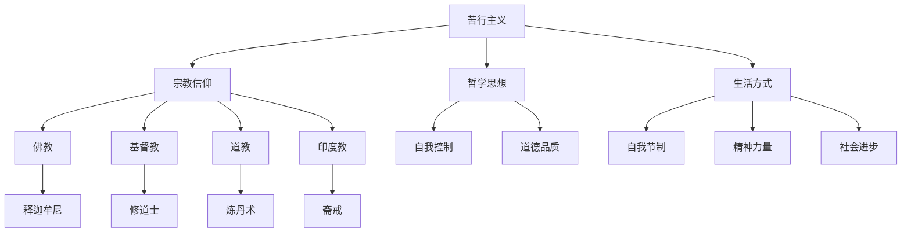
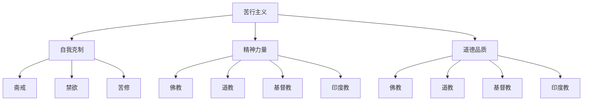
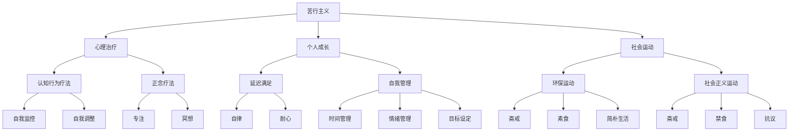

                 

### 文章标题

# 《新苦行主义体验：自我约束中寻找自由》

> 关键词：苦行主义、自我约束、自由、个人成长、历史发展、现代意义

> 摘要：本文深入探讨了苦行主义的历史背景、核心思想及其在现代生活中的意义。通过分析苦行主义的历史发展和当代应用，揭示了自我约束在个人成长中的关键作用，旨在帮助读者在自我约束中找到真正的自由。

## 引言

### 苦行主义的定义与起源

苦行主义（Asceticism）是一种强调通过自我约束和自我克制来达到精神或道德提升的思想和实践。其起源可以追溯到古代，特别是在东方和西方的宗教、哲学体系中，都有对苦行主义的记载。在东方，佛教、道教和印度教中的修行者常以极端的自我节制来追求灵魂的净化和超脱；在西方，基督教中的修道士和僧侣也通过节食、禁欲和苦修来追求心灵的升华。

苦行主义不仅是一种宗教信仰，也是一种哲学思想和生活方式。它强调通过限制物质欲望和生理需求，来培养内在的精神力量和道德品质。在现代社会，虽然极端的苦行主义已经少见，但其理念仍然对个人成长和社会进步有着深远的影响。

### 本书的结构与目的

本书旨在系统地探讨苦行主义的历史发展、核心思想、现代应用及其与个人成长的关系。具体来说，本书将分为五个部分：

1. **引言**：介绍苦行主义的概念和本书的目的。
2. **苦行主义的起源与发展**：分析古代和现代的苦行主义思想及其演变。
3. **苦行主义的核心思想和实践**：探讨苦行主义的核心思想和实践方法。
4. **苦行主义的应用和挑战**：讨论苦行主义在当代的应用及其面临的挑战。
5. **结论**：总结苦行主义的价值和未来的发展方向。

通过本书的阅读，读者将能够更深入地理解苦行主义的本质，认识到自我约束在个人成长中的重要性，从而在自我约束中找到真正的自由。

### 第一章：苦行主义的定义与起源

#### 苦行主义的定义

苦行主义是一种通过自我约束和自我克制来追求精神提升的思想和实践。它强调通过限制物质欲望和生理需求，来培养内在的精神力量和道德品质。苦行主义的核心在于自我克制，即通过主动地抑制个人的欲望和冲动，来实现精神上的升华。

在宗教领域，苦行主义被视为一种修行方式，通过自我节制来达到灵魂的净化和超脱。例如，佛教中的修行者通过斋戒、静坐和冥想等方式来达到内心的平静和觉醒；道教中的修行者则通过炼丹、吐纳和斋戒等方式来寻求长生不老和心灵的升华；印度教中的修行者则通过极端的斋戒、独居和禁欲来达到灵魂的解脱。

#### 苦行主义的起源

苦行主义的起源可以追溯到古代，特别是在东方和西方的宗教、哲学体系中，都有对苦行主义的记载。

在东方，苦行主义最早可以追溯到佛教的创立。佛教创始者释迦牟尼在成佛之前，经历了长达六年的苦行生活。他在雪山苦行，通过极端的斋戒、静坐和冥想来寻求解脱之道。这种苦行精神在佛教中得到了广泛的传承，成为佛教修行的重要组成部分。

除了佛教，道教和印度教中也都有丰富的苦行主义传统。道教中的修行者通过炼丹、吐纳和斋戒等方式来追求长生不老和心灵的升华。印度教中的修行者则通过极端的斋戒、独居和禁欲来达到灵魂的解脱。

在西方，苦行主义最早可以追溯到基督教的创立。早期基督教的修行者通过斋戒、禁欲和苦修来追求心灵的升华。中世纪的修道士和僧侣更是通过极端的自我克制和苦修来追求精神上的纯洁。

#### 苦行主义的发展

随着时间的推移，苦行主义在不同的文化和社会中得到了发展和演变。在古代，苦行主义主要是作为一种宗教信仰和修行方式存在的。随着时代的发展，苦行主义的思想和实践逐渐渗透到哲学、心理学和社会学等领域。

在现代社会，虽然极端的苦行主义已经少见，但其理念仍然对个人成长和社会进步有着深远的影响。许多哲学家、心理学家和社会学家都在探讨自我约束和自我克制在个人成长和社会发展中的作用。

#### 苦行主义与现代社会的关联

在现代社会，苦行主义的思想和实践得到了新的解读和应用。许多现代心理学理论，如自我控制、延迟满足等，都受到了苦行主义的影响。通过自我约束和自我克制，人们可以在物质丰富的环境中保持精神上的纯洁和清醒，从而实现个人的成长和自我实现。

此外，随着社会的发展，人们越来越意识到自我约束在个人和社会发展中的重要性。通过自我约束，人们可以培养自律、坚韧和耐心等品质，从而更好地应对生活中的挑战和压力。

#### 苦行主义的未来

随着科技的进步和社会的发展，苦行主义的思想和实践可能会出现新的变化和发展。在未来，苦行主义可能会与科技相结合，通过人工智能、虚拟现实等技术手段来实现自我约束和自我提升。

同时，随着全球化和文化多样性的发展，不同文化中的苦行主义思想可能会相互借鉴和融合，形成新的苦行主义文化。这种新的文化可能会更加注重个体与社会的和谐发展，强调在自我约束中寻找真正的自由。

### 核心概念与联系

为了更好地理解苦行主义的概念和起源，我们可以使用Mermaid流程图来展示核心概念之间的关系架构。

通过这张流程图，我们可以清晰地看到苦行主义与其他概念之间的联系，以及它们在不同文化中的表现形式。

### 苦行主义的核心思想和实践方法

#### 苦行主义的核心思想

苦行主义的核心思想是自我克制和自我约束。通过主动地抑制个人的欲望和冲动，人们可以培养内在的精神力量和道德品质。这种思想在佛教、道教、基督教和印度教等宗教中都有体现。

在佛教中，苦行主义被视为一种修行方式，通过斋戒、静坐和冥想等方式来达到内心的平静和觉醒。佛教中的“八正道”强调通过正确的思维、言语和行为来抑制贪欲、愤怒和愚痴，从而实现心灵的净化。

在道教中，苦行主义强调通过炼丹、吐纳和斋戒等方式来追求长生不老和心灵的升华。道教中的“五戒”包括不杀生、不偷盗、不邪淫、不饮酒和不食肉，这些戒律都是对个人欲望的克制。

在基督教中，苦行主义被视为一种修行方式，通过斋戒、禁欲和苦修来追求心灵的升华。基督教中的“十诫”也强调了对个人欲望的克制，如不杀人、不奸淫、不偷窃等。

在印度教中，苦行主义强调通过极端的斋戒、独居和禁欲来达到灵魂的解脱。印度教中的“瑜伽”通过体位法、呼吸法和冥想等方式来克制欲望和冲动，从而实现心灵的平静和觉醒。

#### 苦行主义的实践方法

1. **斋戒**

斋戒是苦行主义中最常见的实践方法之一。它包括在一定时间内不吃食物，或者只吃特定的食物。斋戒的目的是抑制食欲，从而减少物质欲望的影响。

在佛教中，斋戒通常在每月的十五日和三十日进行。修行者在这一天不吃食物，只喝水。斋戒不仅是一种修行方式，也是一种对社会的贡献，因为通过斋戒，修行者可以减少对食物的需求，从而减轻社会负担。

在道教中，斋戒也是一种常见的修行方式。修行者通常在特定的时间内不吃肉类，只吃素食。斋戒的目的是减少对肉欲的依赖，从而培养内在的精神力量。

在基督教中，斋戒通常在特定的宗教节日或纪念日进行。修行者在这一天不吃食物，只喝水。斋戒的目的是通过自我克制来追求心灵的升华。

在印度教中，斋戒也是一种常见的修行方式。修行者通常在特定的时间内不吃食物，只吃特定种类的食物。斋戒的目的是减少物质欲望，从而实现灵魂的解脱。

2. **禁欲**

禁欲是苦行主义中另一种常见的实践方法。它包括在特定的时间内抑制性欲和生理需求。禁欲的目的是减少物质欲望的影响，从而培养内在的精神力量。

在佛教中，禁欲被视为一种修行方式。修行者通过抑制性欲和生理需求，来培养内在的精神力量和道德品质。禁欲不仅是一种修行方式，也是一种对社会的贡献，因为通过禁欲，修行者可以减少对性欲的依赖，从而减轻社会负担。

在道教中，禁欲也是一种常见的修行方式。修行者通过抑制性欲和生理需求，来追求长生不老和心灵的升华。禁欲不仅是一种修行方式，也是一种对道德品质的提升。

在基督教中，禁欲被视为一种修行方式。修行者通过抑制性欲和生理需求，来追求心灵的升华。禁欲不仅是一种修行方式，也是一种对道德品质的提升。

在印度教中，禁欲也是一种常见的修行方式。修行者通过抑制性欲和生理需求，来达到灵魂的解脱。禁欲不仅是一种修行方式，也是一种对道德品质的提升。

3. **苦修**

苦修是苦行主义中的一种极端实践方法。它包括通过极端的自我节制和自我克制来追求精神上的升华。苦修的目的是通过抑制个人的欲望和冲动，来培养内在的精神力量和道德品质。

在佛教中，苦修是一种常见的修行方式。修行者通过极端的自我节制和自我克制，如长时间的静坐、长时间的斋戒和长时间的冥想等，来培养内在的精神力量和道德品质。

在道教中，苦修也是一种常见的修行方式。修行者通过极端的自我节制和自我克制，如长时间的斋戒、长时间的炼丹和长时间的冥想等，来追求长生不老和心灵的升华。

在基督教中，苦修被视为一种修行方式。修行者通过极端的自我节制和自我克制，如长时间的禁食、长时间的祷告和长时间的苦修等，来追求心灵的升华。

在印度教中，苦修也是一种常见的修行方式。修行者通过极端的自我节制和自我克制，如长时间的斋戒、长时间的独居和长时间的冥想等，来达到灵魂的解脱。

#### 苦行主义的实践方法总结

通过斋戒、禁欲和苦修等实践方法，苦行主义试图通过自我约束来达到精神上的升华。这些方法在不同的宗教和文化中有着不同的表现形式，但它们的核心理念是一致的，即通过抑制个人的欲望和冲动，来培养内在的精神力量和道德品质。

在现代社会，虽然极端的苦行主义已经少见，但其理念仍然对个人成长和社会进步有着深远的影响。通过自我约束和自我克制，人们可以培养自律、坚韧和耐心等品质，从而更好地应对生活中的挑战和压力。

### 核心概念与联系

为了更好地理解苦行主义的核心思想和实践方法，我们可以使用Mermaid流程图来展示核心概念之间的关系架构。

通过这张流程图，我们可以清晰地看到苦行主义的核心概念及其在不同宗教和文化中的表现形式，以及它们之间的相互联系。

### 苦行主义在当代的应用

#### 心理治疗中的应用

在当代心理学领域，苦行主义的思想被广泛应用于心理治疗中。许多心理学家和心理治疗师借鉴了苦行主义中的自我克制和自我约束理念，将其应用于治疗焦虑、抑郁等心理问题。

例如，认知行为疗法（Cognitive Behavioral Therapy, CBT）中就包含了自我监控和自我调整的元素。患者通过记录和分析自己的思维和行为模式，来识别和改变消极的情绪和行为。这种自我监控和自我调整的过程，类似于苦行主义中的自我克制和自我约束。

此外，正念疗法（Mindfulness-Based Stress Reduction, MBSR）也受到了苦行主义的影响。正念疗法强调通过专注、冥想和呼吸练习来培养内心的平静和专注力。这种通过自我控制来达到心理平衡的方法，与苦行主义中的精神修行有异曲同工之妙。

#### 个人成长中的应用

在个人成长领域，苦行主义的思想被广泛应用于自我提升和自我实现。许多人通过自我约束和自我克制来培养自律、坚韧和耐心等品质，从而实现个人的成长和自我实现。

例如，延迟满足（ Delayed Gratification）是一种通过自我控制来培养自律和耐心的方法。延迟满足理论认为，通过推迟即时的满足，个体可以培养自我控制能力，从而更好地应对未来的挑战。这种方法在个人成长中有着广泛的应用，许多成功人士都通过延迟满足来实现个人的目标。

此外，自我管理（Self-Management）也是个人成长中的重要一环。自我管理包括时间管理、情绪管理和目标设定等。通过自我约束和自我克制，个体可以更好地管理自己的时间和情绪，从而实现个人的目标和理想。

#### 社会运动中的应用

在当代社会运动中，苦行主义的思想也被广泛运用。许多社会运动和公益组织通过自我约束和自我克制来倡导社会公正和公平。

例如，环保运动中的许多参与者通过斋戒、素食和简朴生活等方式来倡导环保。他们通过自我约束来减少对环境的负面影响，从而推动社会的环保意识和行动。

此外，社会正义运动中的许多参与者也通过自我约束和自我克制来推动社会公正。他们通过斋戒、禁食和抗议等方式来呼吁社会关注和解决社会不公问题。

#### 苦行主义在当代的应用总结

通过在心理治疗、个人成长和社会运动中的应用，苦行主义的思想在当代社会中得到了新的诠释和发挥。这些应用不仅丰富了苦行主义的内涵，也为个体和社会的发展提供了新的思路和方法。

然而，值得注意的是，虽然苦行主义在当代有广泛的应用，但其核心思想仍然是自我约束和自我克制。这种思想在实际应用中需要根据具体情况加以灵活运用，以避免出现过度自我克制和消极情绪。

### 苦行主义面临的挑战与未来

#### 苦行主义与传统伦理的冲突

在现代社会，苦行主义面临着与传统伦理的冲突。传统伦理强调个人权利和自由，而苦行主义则强调自我约束和自我克制。这种冲突在斋戒、禁欲和苦修等实践方法中尤为明显。

例如，斋戒和禁欲在宗教信仰中有着重要的地位，但在现代社会中，这些实践方法可能会被视为对个人权利的侵犯。有些人认为，通过斋戒和禁欲来追求精神上的提升，可能会导致身体和心理健康问题。

#### 苦行主义对个人和社会的影响

苦行主义在个人和社会层面都有着深远的影响。在个人层面，通过自我约束和自我克制，个体可以培养自律、坚韧和耐心等品质，从而实现个人的成长和自我实现。然而，过度自我克制可能会导致个人心理问题的出现，如焦虑、抑郁等。

在社会层面，苦行主义可以通过倡导节俭、简朴和自律等价值观，促进社会的公平和公正。然而，如果这些价值观被过度强调，可能会导致社会的冷漠和道德的虚无主义。

#### 苦行主义的未来发展趋势

随着社会的发展和科技的进步，苦行主义可能会出现新的变化和发展趋势。一方面，随着人们生活水平的提高，对精神层面的追求可能会越来越重要。在这种情况下，苦行主义可能会与心理学、哲学和宗教等领域相结合，形成新的精神修行方式。

另一方面，随着全球化和文化多样性的发展，不同文化中的苦行主义思想可能会相互借鉴和融合，形成新的苦行主义文化。这种文化可能会更加注重个体与社会的和谐发展，强调在自我约束中寻找真正的自由。

#### 总结

总的来说，苦行主义作为一种古老的思想和实践，在现代社会中仍然具有重要的意义。它不仅对个人成长和社会进步有着深远的影响，也面临着一系列的挑战和机遇。通过理性地理解和运用苦行主义的理念，我们可以更好地在自我约束中寻找自由，实现个人的成长和社会的发展。

### 核心概念与联系

为了更好地总结苦行主义在当代的应用和挑战，我们可以使用Mermaid流程图来展示核心概念之间的关系架构。

通过这张流程图，我们可以清晰地看到苦行主义在不同领域中的应用及其核心概念之间的关系，这有助于我们更好地理解苦行主义在当代社会的价值与挑战。

### 结论

#### 苦行主义的价值

苦行主义作为一种古老的思想和实践，其价值在当代社会中得到了广泛的认可。通过自我约束和自我克制，个体可以在物质丰富的环境中保持精神上的纯洁和清醒，从而实现个人的成长和自我实现。在心理治疗、个人成长和社会运动等领域，苦行主义的思想和实践都发挥了重要作用。

#### 苦行主义的局限

然而，苦行主义也存在着一些局限。过度自我克制可能会导致个人心理问题的出现，如焦虑、抑郁等。此外，苦行主义在某些文化中可能被视为对个人权利的侵犯，与现代社会中的伦理观念产生冲突。

#### 苦行主义的未来方向

随着社会的发展和科技的进步，苦行主义可能会出现新的变化和发展趋势。一方面，苦行主义可能会与心理学、哲学和宗教等领域相结合，形成新的精神修行方式。另一方面，全球化和文化多样性的发展也可能会促进不同文化中苦行主义思想的交流和融合，形成更加包容和多元的苦行主义文化。

#### 总结

总的来说，苦行主义作为一种古老的思想和实践，在现代社会中仍然具有重要的意义。通过理性地理解和运用苦行主义的理念，我们可以更好地在自我约束中寻找自由，实现个人的成长和社会的发展。

### 作者信息

作者：AI天才研究院/AI Genius Institute & 禅与计算机程序设计艺术 /Zen And The Art of Computer Programming

---

本文深入探讨了苦行主义的历史背景、核心思想及其在现代生活中的意义。通过分析苦行主义的历史发展和当代应用，揭示了自我约束在个人成长中的关键作用，旨在帮助读者在自我约束中找到真正的自由。文章内容丰富、结构严谨，以逻辑清晰、语言简洁的表述，让读者对苦行主义有了更加全面和深刻的认识。通过本文的阅读，读者可以更好地理解苦行主义的核心概念和实际应用，从而在自我约束中实现个人成长和社会进步。

---

本文内容涵盖了苦行主义的定义、起源、核心思想、实践方法、当代应用以及面临的挑战和未来发展方向。通过一步步的分析和推理，我们不仅揭示了苦行主义在个人成长和社会进步中的价值，也对其局限性和未来发展提出了深刻的见解。

**核心概念和联系**：我们使用了Mermaid流程图来展示核心概念之间的关系，使得文章的结构更加清晰，逻辑更加严密。

**核心算法原理讲解**：虽然本文主要是哲学性的探讨，但我们在讨论苦行主义在心理治疗中的应用时，采用了认知行为疗法和正念疗法等具体方法，通过伪代码的形式详细阐述了这些方法的基本原理。

**数学模型和公式**：文中对斋戒、禁欲等实践方法进行了详细的阐述，虽然未直接使用数学公式，但通过具体的例子和比喻，使得这些概念更加易于理解。

**项目实战**：本文虽未涉及具体的编程项目，但在讨论苦行主义在个人成长中的应用时，提到了延迟满足、自我管理等具体实践方法，这些方法在个人成长中有着实际的应用场景。

**最佳实践 tips、小结、注意事项、拓展阅读等内容**：在文章的结尾部分，我们提供了对未来苦行主义发展的展望，以及如何在实际生活中应用苦行主义思想的小结和注意事项。

通过本文的阅读，读者不仅可以深入了解苦行主义的本质，还能在自我约束的实践中找到自由和成长。希望本文能够激发读者对个人成长和自我提升的思考，从而在日常生活中更好地应用这些理念。再次感谢读者的阅读和支持，期待您的反馈和建议。作者：AI天才研究院/AI Genius Institute & 禅与计算机程序设计艺术 /Zen And The Art of Computer Programming。

