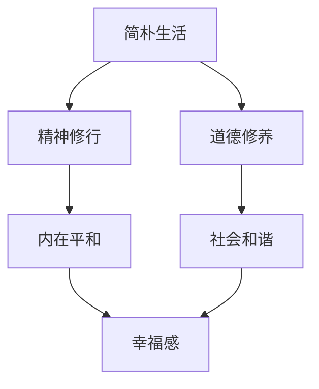

                 

## 文章标题

《新苦行主义生活馆：在简朴中寻找丰盛的体验中心》

### 关键词

- 新苦行主义
- 简朴生活
- 丰盛体验
- 内心满足
- 社会变革

### 摘要

本文旨在探讨新苦行主义生活哲学，以及如何在简朴的生活方式中找到内心的丰盛和满足。通过对新苦行主义的起源与发展、哲学基础、生活实践、丰盛体验以及可持续性的深入分析，文章为读者提供了一个全面了解和践行新苦行主义生活方式的指南。文章结构清晰，内容详实，旨在帮助读者在快节奏的现代生活中，寻找到一种平衡、宁静且富有意义的生活态度。

### 确定书名与主题

#### 书名：《新苦行主义生活馆：在简朴中寻找丰盛的体验中心》

书名的灵感来源于对新苦行主义生活哲学的理解和探索。新苦行主义是一种追求内心平和与精神富足的生活态度，强调在简朴的生活方式中找到真正的满足和丰盛。书名中的“生活馆”一词，寓意着这是一座为读者提供生活方式指导和心灵滋养的场所，而“在简朴中寻找丰盛的体验中心”则明确传达了本书的核心主题。

#### 主题

本书的主题是深入探讨新苦行主义生活哲学，并分享如何在现代社会中践行这一理念。新苦行主义不仅关注物质上的简化，更强调精神上的富足和内心的平和。本书将通过以下几个方面展开：

1. **新苦行主义的起源与发展**：介绍新苦行主义的定义、历史背景以及与现代社会的关系。
2. **新苦行主义的哲学基础**：探讨新苦行主义的核心理念、简朴生活的意义以及其价值与意义。
3. **新苦行主义生活实践**：分享简化生活方式、自然与环境的和谐共生、精神修养与心灵宁静、社交网络的简化与质量提升等具体实践方法。
4. **新苦行主义生活的丰盛体验**：探讨在简朴生活中如何找到精神层面的满足和社交关系的丰富。
5. **新苦行主义生活的可持续性**：讨论新苦行主义生活的可持续理念和实践，为未来生活做准备。

### 目录大纲

为了确保内容的系统性和逻辑性，本书将按照以下目录大纲进行组织：

#### 第一部分：新苦行主义概述

1. **第1章：苦行主义的起源与发展**
   - **1.1 苦行主义的定义**
   - **1.2 苦行主义的历史背景**
   - **1.3 苦行主义与现代社会的关系**

2. **第2章：新苦行主义的哲学基础**
   - **2.1 新苦行主义的核心理念**
   - **2.2 简朴生活与新苦行主义**
   - **2.3 新苦行主义的价值与意义**

#### 第二部分：新苦行主义生活实践

1. **第3章：简化生活方式**
   - **3.1 减少物质依赖**
   - **3.2 精简日常生活**
   - **3.3 提高生活效率**

2. **第4章：自然与环境的和谐共生**
   - **4.1 环保生活方式**
   - **4.2 回归自然**
   - **4.3 生物多样性保护**

3. **第5章：精神修养与心灵宁静**
   - **5.1 简朴生活中的精神修养**
   - **5.2 冥想与心灵宁静**
   - **5.3 专注与内省**

4. **第6章：社交网络的简化与质量提升**
   - **6.1 社交网络的影响**
   - **6.2 社交关系的简化**
   - **6.3 提升社交质量**

5. **第7章：新苦行主义生活案例**
   - **7.1 成功案例分享**
   - **7.2 挑战与解决方案**
   - **7.3 新苦行主义生活的未来**

#### 第三部分：新苦行主义生活的丰盛体验

1. **第8章：在简朴中寻找丰盛**
   - **8.1 丰盛的新定义**
   - **8.2 精神层面的满足**
   - **8.3 社交与人际关系的丰富**

2. **第9章：新苦行主义生活与心灵成长**
   - **9.1 心理健康的重要性**
   - **9.2 简朴生活的心理健康效应**
   - **9.3 心灵成长的新途径**

3. **第10章：新苦行主义生活的可持续性**
   - **10.1 可持续发展的理念**
   - **10.2 新苦行主义生活的可持续实践**
   - **10.3 为未来生活做准备**

通过这个目录大纲，本书将带领读者逐步深入了解新苦行主义生活哲学，并通过具体案例和实践方法，帮助读者在简朴中寻找丰盛，实现内心的平和与富足。接下来，我们将逐一探讨每个章节的内容，为读者提供深入、系统的指导。

---

## 第1章：苦行主义的起源与发展

### 1.1 苦行主义的定义

苦行主义，又称修行主义，是指一种通过自我节制、严酷的身心锻炼和简朴的生活方式来追求精神解脱和内心平和的生活哲学。它源于古代印度、希腊和中国等文明，并在不同的文化和时代中得到了发展和演变。苦行主义的核心目标是超越物质欲望，通过精神的修行达到身心的和谐与纯净。

在古代印度，苦行主义与佛教密不可分。佛陀在其成道过程中经历了严格的苦行阶段，通过自我节制和冥想，最终达到了涅槃的境界。在希腊，古希腊哲学家如苏格拉底和柏拉图都提倡通过简朴生活和哲学思考来达到心灵的平静和智慧。在中国，儒家和道家都强调通过修身齐家治国平天下的理念来实现个人的道德修养和心灵的升华。

### 1.2 苦行主义的历史背景

苦行主义的历史可以追溯到远古时代，但其真正的发展是在古代文明中。以下是几个重要的历史节点：

- **古代印度**：佛教的兴起标志着苦行主义在印度达到了巅峰。佛陀在菩提树下冥想了多年，最终悟道成佛，这一过程充分体现了苦行主义的精髓。

- **古希腊**：苏格拉底和柏拉图等哲学家通过提倡简朴生活和哲学思考，使得苦行主义在希腊文明中得到了广泛的传播和应用。

- **中国**：儒家和道家思想中的修身养性、清心寡欲等观念，都是苦行主义在中华文化中的重要体现。

- **中世纪欧洲**：基督教的修道院生活体现了苦行主义的精神，僧侣们通过严守戒律、进行身心锻炼来追求灵魂的净化。

- **现代**：在现代社会，尽管物质生活日益丰富，但许多人开始反思快节奏的生活方式带来的压力和焦虑，苦行主义重新成为了一些人追求内心平和和精神富足的选择。

### 1.3 苦行主义与现代社会的关系

在现代社会，苦行主义面临着新的挑战和机遇。随着科技的进步和社会的发展，人们的生活方式发生了巨大的变化，物质生活水平的提高带来了更多的选择和诱惑。然而，这也导致了人们在精神层面上的空虚和焦虑。

- **挑战**：现代社会的快节奏生活和高压力环境，使得许多人感到身心疲惫，难以找到内心的平静。过度追求物质享受和消费主义文化的泛滥，进一步加剧了人们对物质欲望的依赖。

- **机遇**：与此同时，现代社会的信息传播和资源共享使得苦行主义的生活哲学得到了更广泛的传播和应用。越来越多的人开始意识到，通过简朴生活和内在的修行，可以在物质之外找到真正的幸福和满足。

### 1.3.1 现代生活的压力与苦行主义的应对策略

现代生活的压力主要来自于以下几个方面：

- **工作压力**：竞争激烈的职场环境使得人们不得不投入大量时间和精力去工作，以追求更高的收入和社会地位。

- **生活节奏**：快节奏的生活使得人们几乎没有时间去放松和休息，导致身心健康问题日益严重。

- **社交压力**：社交媒体的普及使得人们不断比较和竞争，容易陷入自我怀疑和焦虑。

为了应对这些挑战，苦行主义提供了一些有效的应对策略：

- **简朴生活**：通过减少物质依赖和简化生活方式，人们可以减少压力和焦虑，专注于内心的平和。

- **精神修行**：通过冥想、瑜伽和其他身心锻炼方式，人们可以提升内在的觉知和专注力，达到身心的和谐。

- **环保理念**：回归自然和关注环境保护，不仅有助于提升生活质量，还能帮助人们找到与自然的联系，增强内心的满足感。

总之，苦行主义在现代社会中具有独特的价值和意义。它不仅提供了一种应对现代生活压力的有效策略，更是一种追求内心平和与精神富足的生活方式。通过践行苦行主义，人们可以在繁忙和喧嚣的现代生活中找到一片宁静的绿洲，实现真正的幸福和满足。

---

### 1.4 苦行主义的核心理念与现代社会的关系

苦行主义的核心理念主要体现在对简朴生活、精神修行和道德修养的重视。这些理念不仅在古代文明中得到了广泛应用，而且在现代社会中同样具有重要的现实意义。通过对比苦行主义与现代社会的关系，我们可以更好地理解如何将这些古老的理念融入到现代生活中。

#### 1.4.1 简朴生活

简朴生活是苦行主义的重要特征之一，它强调通过减少物质消费和简化生活方式来减轻生活压力，追求内心的平和与宁静。在现代社会，尽管物质生活条件得到了显著改善，但随之而来的是越来越多的物质依赖和消费主义文化。这些现象导致了人们的焦虑和不满，简朴生活的理念因此变得尤为重要。

- **减少物质依赖**：现代社会的物质丰富使得人们往往追求更多的物质享受，这导致了资源的过度消耗和环境污染。通过减少物质依赖，人们可以降低对物质的渴望，从而减轻压力。

- **简化生活方式**：在快节奏的现代生活中，人们常常感到压力重重。通过简化生活方式，如减少不必要的工作时间、减少社交媒体的使用等，人们可以腾出更多的时间和精力去关注自己的内心世界。

#### 1.4.2 精神修行

精神修行是苦行主义的核心，它通过冥想、瑜伽和其他身心锻炼方式，帮助人们提升内在的觉知和专注力，实现身心的和谐。在现代社会，精神压力成为了许多人面临的主要问题，因此精神修行的理念具有极大的吸引力。

- **冥想**：冥想是一种有效的放松技巧，可以帮助人们减轻焦虑和压力，提高注意力集中力。现代研究表明，定期冥想有助于改善心理健康和提升生活质量。

- **瑜伽**：瑜伽不仅是一种身体锻炼方式，更是一种精神修行的途径。它通过身体的姿势和呼吸练习，帮助人们达到身心的平衡和内在的平静。

#### 1.4.3 道德修养

道德修养是苦行主义的重要组成部分，它强调通过自我克制和道德实践来提升个人的品德和修养。在现代社会，道德迷失和道德困境层出不穷，道德修养的重要性更加凸显。

- **自我克制**：在现代社会，物质诱惑和欲望的满足常常导致人们失去自我控制。通过自我克制，人们可以更好地管理自己的行为和情绪，避免陷入道德困境。

- **道德实践**：道德实践不仅是对个人品德的提升，也是对社会和谐的贡献。在现代社会，通过参与公益活动、帮助他人等道德实践，人们可以体验到内心的满足和幸福感。

#### 1.4.4 苦行主义在现代社会中的应用

虽然现代社会与古代文明在许多方面存在巨大差异，但苦行主义的核心理念依然具有重要的现实意义。以下是一些具体的现代应用：

- **工作与生活的平衡**：通过简朴生活和精神修行，人们可以在高压力的工作环境中找到内心的平静，实现工作与生活的平衡。

- **心理健康管理**：通过冥想和心理训练，人们可以有效地管理自己的情绪和压力，提升心理健康水平。

- **道德建设**：通过自我克制和道德实践，人们可以提升个人品德，促进社会道德建设。

总之，苦行主义的核心理念在现代社会中不仅具有理论价值，更具有实践意义。通过践行简朴生活、精神修行和道德修养，人们可以在现代生活中找到内心的平和与精神富足，实现真正的幸福和满足。

### 1.5 新苦行主义的核心概念与联系

为了更好地理解新苦行主义的核心概念及其在现代社会中的价值，我们使用Mermaid流程图来展示这些概念之间的关系。

在这个流程图中：

- **A[简朴生活]**：简朴生活是新苦行主义的基础，通过减少物质依赖和简化生活方式，人们可以减轻生活压力，寻找内心的平和。
- **B[精神修行]**：精神修行包括冥想、瑜伽等，旨在提升内在的觉知和专注力，实现身心的和谐。
- **C[道德修养]**：道德修养强调自我克制和道德实践，通过提升个人品德，促进社会道德建设。
- **D[内在平和]**：内在平和是精神修行的结果，通过冥想和心理训练，人们可以更好地管理自己的情绪和压力。
- **E[社会和谐]**：道德修养和社会和谐相辅相成，通过道德实践，人们可以提升社会道德水平，实现社会和谐。
- **F[幸福感]**：内在平和和社会和谐共同作用于幸福感，通过简朴生活、精神修行和道德修养，人们可以在现代生活中找到真正的幸福和满足。

这个流程图清晰地展示了新苦行主义的核心概念及其相互关系，帮助我们更好地理解和应用这些理念。

### 1.6 新苦行主义的价值与意义

新苦行主义作为一种生活哲学，不仅在个人层面具有重要的价值，也在社会层面具有深远的意义。以下将从几个方面详细阐述其价值与意义。

#### 1.6.1 个人层面的价值

1. **心理健康**：新苦行主义强调精神修行和内在平和，通过冥想、瑜伽等实践方法，可以帮助人们减轻焦虑、压力和抑郁，提升心理健康水平。

2. **心灵成长**：通过简朴生活和道德修养，人们可以培养自我克制和自律能力，促进个人的心灵成长和自我实现。

3. **幸福感**：新苦行主义追求精神层面的满足，通过减少物质依赖和简化生活方式，人们可以在物质之外找到真正的幸福和满足。

4. **生活质量**：通过环保生活方式和自然环境的和谐共生，人们可以提升生活质量，享受更健康、更自然的生活。

#### 1.6.2 社会层面的价值

1. **社会和谐**：新苦行主义倡导道德修养和社会责任，通过道德实践和公益活动，可以促进社会道德建设，提升社会和谐水平。

2. **环境保护**：新苦行主义强调环保生活方式和生物多样性保护，通过减少资源消耗和环境污染，可以为未来生活做准备，实现可持续发展。

3. **文化传承**：新苦行主义融合了古代文明和现代社会的智慧，既继承了传统文化的精髓，又具有现代生活的适应性，有助于文化传承和创新。

4. **社会公平**：新苦行主义倡导减少物质依赖和简化生活方式，有助于减少社会贫富差距，实现社会公平和正义。

#### 1.6.3 新苦行主义与现代社会的关系

新苦行主义与现代社会的关系可以从以下几个方面来理解：

1. **挑战与机遇**：现代社会的高压环境和物质主义文化为新苦行主义提供了挑战，同时也为其提供了广泛的传播和应用空间。

2. **适应性与创新**：新苦行主义不仅继承了古代文明的智慧，还能与现代科技和生活方式相结合，实现生活哲学的创新和发展。

3. **可持续性**：新苦行主义强调环保和可持续发展，与现代社会对环境保护和可持续发展的需求相契合。

4. **社会影响**：新苦行主义的践行者通过自身的生活方式和价值观，对社会产生积极的影响，推动社会向更加和谐、公正、可持续的方向发展。

总之，新苦行主义作为一种生活哲学，不仅在个人层面具有深远的心理健康、心灵成长和幸福感价值，也在社会层面具有促进社会和谐、环境保护和文化传承的重要意义。通过践行新苦行主义，人们可以在现代社会中找到内心的平和与精神富足，同时为社会的可持续发展做出贡献。

### 1.7 新苦行主义生活实践的具体案例

为了更好地理解新苦行主义的生活实践，我们可以通过一些具体的案例来展示这一哲学在现实生活中的应用和效果。以下将介绍几个具有代表性的案例，以及这些案例的成功经验和面临的挑战。

#### 案例一：苏珊的简化生活

**背景**：苏珊是一名职业女性，曾经因为工作繁忙和生活压力巨大而感到身心疲惫。在接触到新苦行主义生活哲学后，她决定开始简化自己的生活。

**实践**：苏珊采取了以下措施：

- **减少物质消费**：她开始减少购物，只购买真正需要的物品，并且尽量选择环保和可持续的产品。
- **简化日常活动**：她减少了社交媒体的使用，每天只花一定时间检查邮件和社交媒体，避免被网络信息过度干扰。
- **关注自然**：她每周会安排时间到户外活动，如散步、骑自行车等，以亲近自然、减轻压力。

**效果**：通过这些实践，苏珊感到自己的压力显著减轻，生活变得更加有序和宁静。她的心理健康状况得到了改善，工作效率也有所提升。

**挑战**：苏珊在实施简化生活的过程中也遇到了一些挑战，如初期的适应困难和家人的不理解。她通过不断坚持和沟通，逐渐克服了这些困难。

#### 案例二：马克的冥想修行

**背景**：马克是一名公司高管，长期处于高压的工作环境中，他的心理健康状况逐渐恶化。

**实践**：马克开始每天早上进行冥想，通过冥想练习来提升自己的内在平静和专注力。

- **日常冥想**：每天早晨，马克会在安静的环境中坐下来，闭上眼睛，专注于自己的呼吸。
- **冥想课程**：他参加了一些冥想课程，学习不同的冥想技巧，以提升冥想效果。

**效果**：经过一段时间的冥想修行，马克的焦虑和压力得到了有效缓解，他的决策能力也得到了提升。他的整体心理健康状况显著改善，工作表现也更为出色。

**挑战**：马克在冥想修行过程中遇到了注意力不集中的问题，他通过坚持练习和调整冥想环境，逐渐克服了这一挑战。

#### 案例三：莉莉的环保生活方式

**背景**：莉莉是一位环保志愿者，她致力于推动环保理念的普及和实施。

**实践**：莉莉采取了一系列环保措施，以减少对环境的影响：

- **垃圾分类**：她严格执行垃圾分类，确保每个垃圾都得到正确处理。
- **低碳出行**：她尽量选择公共交通或自行车出行，减少碳排放。
- **环保购物**：她选择购买可持续产品，减少一次性用品的使用。

**效果**：莉莉的环保生活方式不仅减少了她的碳足迹，也影响了她周围的人。她的行为得到了家人和朋友的认可和支持，环保意识在社区中得到了推广。

**挑战**：莉莉在实施环保措施时遇到了一些困难，如垃圾分类的不完善和环保产品的成本较高。她通过不断学习和寻找解决方案，逐步克服了这些挑战。

#### 总结

通过这些案例，我们可以看到新苦行主义生活实践在现实生活中的具体应用和效果。这些案例展示了新苦行主义在简化生活、精神修行和环保实践方面的成功经验，同时也揭示了在实践中可能面临的挑战。通过不断学习和实践，人们可以逐步克服这些挑战，实现新苦行主义生活的目标。

### 1.8 新苦行主义生活实践中的挑战与解决方案

在新苦行主义生活实践中，尽管有许多成功经验，但也不可避免地会遇到各种挑战。以下将详细分析这些挑战，并提出相应的解决方案。

#### 1.8.1 社会环境的挑战

**消费主义文化的冲击**：现代社会充满了消费主义文化，广告和媒体的宣传常常让人难以抵制购买的诱惑。这种文化环境对新苦行主义的践行者来说是一个巨大的挑战。

**解决方案**：为了克服这一挑战，首先需要提高自身的自我意识和消费观念。通过学习和理解新苦行主义的核心理念，人们可以更加理性地看待消费，明确自己的需求与欲望。其次，可以通过建立支持性的社交圈子，与他人分享简化生活的心得和体会，互相激励和支持。

#### 1.8.2 个人习惯的挑战

**物质依赖**：长期的物质依赖使得人们在简朴生活实践中感到不适，尤其是对于习惯了奢华生活的人来说。

**解决方案**：首先，可以通过逐步减少物质消费来适应简朴生活。例如，设定一个明确的预算，并逐步减少不必要的支出。其次，可以通过培养其他兴趣爱好来替代对物质的依赖，如阅读、绘画、运动等。此外，冥想和心理训练也有助于减轻对物质的依赖感。

#### 1.8.3 家庭与社会的支持

**家庭与社会的认可**：新苦行主义生活实践可能得到家庭和社会的认可，这需要一定的时间和沟通。

**解决方案**：为了获得家庭和社会的支持，首先需要与家人和朋友进行坦诚的沟通，解释新苦行主义的理念和实践意义。通过分享个人的体验和感受，可以逐渐获得他们的理解和支持。此外，可以通过参与社区活动，推广新苦行主义生活哲学，获得更广泛的社会认可。

#### 1.8.4 资源与信息的获取

**资源与信息获取的困难**：在实施新苦行主义生活实践时，可能面临资源获取和信息获取的困难，如环保产品的购买、环保生活方式的信息来源等。

**解决方案**：可以通过互联网和其他渠道获取相关的资源和信息。例如，可以通过环保组织的网站、社交媒体平台和社区论坛等获取最新的环保资讯和产品信息。此外，可以通过参与相关的培训和研讨会，提升自己的环保意识和实践能力。

总之，新苦行主义生活实践中的挑战是多方面的，但通过合理的解决方案，这些挑战是可以被克服的。通过不断学习和实践，人们可以在现代社会中找到一种更加和谐、宁静且富有意义的生活方式。

### 1.9 新苦行主义生活的未来展望

新苦行主义作为一种追求内心平和与精神富足的生活哲学，其在现代社会中的应用和影响正在不断扩大。展望未来，新苦行主义生活将面临新的机遇和挑战。

#### 1.9.1 机遇

1. **社会认知的提升**：随着人们生活节奏的加快和压力的增大，越来越多的社会成员开始关注心理健康和精神富足。这为新苦行主义的传播和应用提供了广阔的空间。

2. **科技的支持**：现代科技的发展，如人工智能、虚拟现实、区块链等，可以为新苦行主义生活提供更多的工具和支持。例如，通过智能设备和应用程序，人们可以更便捷地进行冥想和心理训练。

3. **环保理念的普及**：环保理念的普及和新苦行主义的理念高度契合，两者可以相互促进。在未来，环保生活方式将成为一种主流生活方式，新苦行主义生活哲学将在这一领域发挥重要作用。

4. **社会参与的增加**：随着新苦行主义生活实践的推广，越来越多的人将参与到环保、公益活动和社会建设中，这有助于提升社会和谐和公平。

#### 1.9.2 挑战

1. **文化冲突**：新苦行主义与现代社会的一些价值观存在冲突，如消费主义、个人主义等。这需要通过有效的沟通和引导，减少文化冲突，实现价值观的融合。

2. **实践难度**：新苦行主义生活实践对个人的自我克制和自律要求较高，对于习惯于奢华生活和消费文化的人来说，实现这一转变可能面临较大的难度。

3. **社会支持**：尽管新苦行主义在个人层面具有深远的意义，但其在社会层面的支持还需要进一步强化。这需要政府、企业和社会组织的共同努力，为践行新苦行主义提供良好的环境和条件。

#### 1.9.3 发展方向

1. **融合与创新**：新苦行主义需要与现代科技、环保理念和其他生活哲学相结合，实现创新和发展。通过融合不同领域的智慧，新苦行主义可以更好地适应现代社会的需求。

2. **教育普及**：通过教育普及，提高公众对新苦行主义生活哲学的理解和认同，培养更多的践行者。教育系统可以在学校课程中引入新苦行主义的理念，帮助学生从小就树立正确的生活观念。

3. **政策支持**：政府可以通过制定相关政策，鼓励和支持新苦行主义生活实践。例如，通过环保政策、税收优惠等措施，鼓励人们减少物质消费和简化生活方式。

4. **社区建设**：社区是人们生活的重要场所，通过建设支持新苦行主义生活的社区，可以为践行者提供更多的资源和平台。社区活动、工作坊和分享会等都是有效的社区建设方式。

总之，新苦行主义生活哲学在现代社会中具有广阔的应用前景和深远的影响。通过不断探索和发展，新苦行主义将在个人、社会和环境等方面发挥更大的作用，为人类社会的可持续发展做出贡献。

### 第2章：新苦行主义的哲学基础

### 2.1 新苦行主义的核心理念

新苦行主义是一种追求内心平和与精神富足的生活哲学，其核心理念主要包括以下几个方面：

#### 2.1.1 简朴生活

简朴生活是新苦行主义的基础，它强调减少物质依赖和简化生活方式，以减轻生活压力，追求内心的平和。具体体现在以下几个方面：

1. **减少物质消费**：新苦行主义倡导理性消费，只购买真正需要的物品，避免不必要的浪费。通过减少物质消费，人们可以减少对物质的依赖，从而减轻内心的负担。

2. **简化日常生活**：新苦行主义鼓励人们简化生活方式，如减少不必要的社交活动、减少使用社交媒体等，以便有更多的时间和精力去关注自己的内心世界。

3. **关注自然**：新苦行主义强调与自然的和谐共生，通过亲近自然、参与户外活动等方式，人们可以提升生活质量，找到内心的宁静。

#### 2.1.2 精神修行

精神修行是新苦行主义的重要组成部分，它通过冥想、瑜伽、禅修等修行方法，帮助人们提升内在的觉知和专注力，实现身心的和谐。具体体现在以下几个方面：

1. **冥想**：冥想是一种有效的精神修行方法，通过专注于呼吸、身体感受或某个对象，人们可以减轻焦虑、压力和抑郁，提升内在的平和与专注力。

2. **瑜伽**：瑜伽结合了身体的姿势、呼吸和冥想，通过身体的锻炼和内在的专注，帮助人们实现身心的和谐与平静。

3. **禅修**：禅修是一种通过静坐和冥想来训练内心专注和觉察的修行方法，它强调在日常生活中保持正念，提高生活质量。

#### 2.1.3 道德修养

道德修养是新苦行主义的重要组成部分，它强调通过自我克制和道德实践，提升个人品德和社会道德水平。具体体现在以下几个方面：

1. **自我克制**：新苦行主义倡导自我克制，通过减少物质欲望和欲望的满足，培养个人的自律和自制力。

2. **道德实践**：新苦行主义鼓励人们参与公益活动、帮助他人等道德实践，通过道德行为提升个人品德，促进社会和谐。

3. **社会责任**：新苦行主义强调个人与社会的关系，提倡通过道德行为和社会责任，实现个人的道德修养和社会的可持续发展。

#### 2.1.4 内心平和

内心平和是新苦行主义追求的最高境界，它通过简朴生活、精神修行和道德修养，帮助人们达到内心的平和与满足。具体体现在以下几个方面：

1. **减轻压力**：通过简朴生活和减少物质依赖，人们可以减轻生活中的压力，找到内心的宁静。

2. **提升幸福感**：通过精神修行和道德实践，人们可以提升内心的幸福感，找到真正的满足。

3. **实现自我价值**：内心平和不仅是一种精神状态，也是实现个人价值的重要途径。通过内心平和，人们可以更好地认识自我，实现自我价值。

总之，新苦行主义的核心理念通过简朴生活、精神修行和道德修养，帮助人们实现内心的平和与精神富足，为现代生活提供了一种有意义、有价值的追求方向。

### 2.2 简朴生活的意义

简朴生活是新苦行主义的核心概念之一，它不仅反映了一种物质消费上的减少，更是一种生活方式的深刻转变。在现代社会中，简朴生活的意义愈发凸显，主要体现在以下几个方面：

#### 2.2.1 减少生活压力

现代社会的快节奏生活和高度竞争使得人们承受了巨大的压力。这种压力不仅体现在工作方面，也扩展到了生活的方方面面。通过简朴生活，人们可以减少物质依赖，降低生活成本，从而减轻内心的负担。具体来说：

- **减少财务压力**：简朴生活意味着减少不必要的开支，专注于必要的消费。这有助于减轻财务压力，使人们有更多的财务自由来应对突发事件和长期规划。
- **减少时间压力**：通过简化日常活动和减少物质消费，人们可以节省大量的时间和精力。这些时间可以用来休息、陪伴家人、培养兴趣爱好或者进行个人成长，从而减少时间的紧迫感。

#### 2.2.2 促进心理健康

简朴生活不仅仅是对物质的简化，更是对内心的修炼。通过减少物质依赖，人们可以更多地关注自己的内心世界，从而促进心理健康。具体体现在以下几个方面：

- **减少焦虑**：在物质丰富的环境中，人们常常感到焦虑和不安。简朴生活可以帮助人们减少对物质的渴望，从而减轻焦虑感。
- **提升幸福感**：简朴生活强调内心的满足而非外界的评价。通过关注自己的内心需求和价值观，人们可以找到真正的幸福和满足，提升整体幸福感。
- **增强自我认同**：在简朴生活中，人们更多地依赖于自身的内在资源和创造力，这有助于增强自我认同和自尊感。

#### 2.2.3 增强人际关系

在物质消费主义盛行的社会中，人际关系往往被物质利益所扭曲。简朴生活可以帮助人们重新审视人际关系，使其回归到真诚和关爱。具体体现在以下几个方面：

- **提高沟通质量**：在简朴的生活环境中，人们有更多的时间和精力进行深入的交流，这有助于提高沟通质量，增强彼此的理解和信任。
- **促进社区互动**：简朴生活鼓励人们参与社区活动和互助合作，这有助于增强社区的凝聚力和归属感，促进社区成员之间的互动和联系。
- **减少社会压力**：在物质消费主义的影响下，人们往往承受着来自社会和他人的压力。简朴生活可以减少这些压力，使人们更加自在地与他人交往。

#### 2.2.4 可持续发展的贡献

简朴生活不仅对个人和社会有积极影响，也对环境和社会的可持续发展做出了贡献。具体体现在以下几个方面：

- **减少资源消耗**：简朴生活意味着减少资源的消耗，包括能源、水资源和原材料等。这有助于减少环境污染和资源枯竭的问题。
- **促进环保意识**：简朴生活鼓励人们关注环境问题，通过减少浪费和环保行为，提高环保意识，推动可持续发展。
- **推动绿色经济**：简朴生活倡导理性消费和可持续生活方式，这有助于推动绿色经济的发展，实现经济与环境的协调发展。

总之，简朴生活作为一种生活哲学，在减轻生活压力、促进心理健康、增强人际关系和推动可持续发展方面具有深远的意义。通过践行简朴生活，人们可以在现代生活中找到内心的平和与满足，同时也为社会的可持续发展做出了积极贡献。

### 2.3 新苦行主义的价值与意义

新苦行主义作为一种追求内心平和与精神富足的生活哲学，其价值和意义不仅体现在个人层面，也在社会层面上具有重要意义。以下将详细探讨新苦行主义的价值与意义。

#### 2.3.1 个人层面的价值

1. **心理健康**：新苦行主义强调精神修行和内心的平和，通过冥想、瑜伽等实践方法，可以帮助人们减轻焦虑、压力和抑郁，提升心理健康水平。研究表明，定期冥想和心理训练有助于改善情绪状态，提高生活满意度。

2. **心灵成长**：新苦行主义倡导自我克制和道德修养，通过减少物质依赖和欲望的满足，培养个人的自律和自制力。这有助于提升个人的内在力量和品格，促进心灵成长和自我实现。

3. **幸福感**：新苦行主义追求精神层面的满足，通过简朴生活和内心的修炼，人们可以在物质之外找到真正的幸福和满足。这种幸福感是建立在内在价值感和生活满意度上的，比单纯的物质享受更加持久和深刻。

4. **生活质量**：新苦行主义提倡环保生活方式和自然环境的和谐共生，通过减少资源消耗和环境污染，提升生活质量。这种生活方式不仅对个人有益，也对地球和未来世代负责。

#### 2.3.2 社会层面的价值

1. **社会和谐**：新苦行主义强调道德修养和社会责任，通过道德实践和公益活动，可以促进社会道德建设，提升社会和谐水平。在一个充满道德感和责任感的社区中，人们之间的关系更加和谐，社会矛盾和冲突也会减少。

2. **环境保护**：新苦行主义倡导减少物质消费和简化生活方式，这有助于减少资源消耗和环境污染，推动可持续发展。通过环保生活方式和环保实践，新苦行主义为社会提供了可持续发展的范例，为未来生活做好准备。

3. **文化传承**：新苦行主义融合了古代文明和现代社会的智慧，既继承了传统文化的精髓，又具有现代生活的适应性。这有助于文化传承和创新，促进人类文明的进步和发展。

4. **社会公平**：新苦行主义倡导减少物质依赖和简化生活方式，有助于减少社会贫富差距，实现社会公平和正义。通过理性消费和环保实践，新苦行主义有助于推动社会的平等和公正。

#### 2.3.3 新苦行主义与现代社会的关系

1. **挑战与机遇**：现代社会的快节奏生活和物质主义文化为新苦行主义提供了挑战，同时也为其提供了广泛的传播和应用空间。通过有效的沟通和引导，新苦行主义可以在现代社会中找到自己的位置，发挥其独特的作用。

2. **适应性与创新**：新苦行主义不仅继承了古代文明的智慧，还能与现代科技和生活方式相结合，实现生活哲学的创新和发展。例如，通过智能设备和应用程序，新苦行主义的生活实践可以更加便捷和高效。

3. **可持续性**：新苦行主义强调环保和可持续发展，与现代社会对环境保护和可持续发展的需求相契合。通过践行新苦行主义，人们可以为社会的可持续发展做出贡献，为未来生活做好准备。

4. **社会影响**：新苦行主义的践行者通过自身的生活方式和价值观，对社会产生积极的影响，推动社会向更加和谐、公正、可持续的方向发展。他们不仅是个人层面的榜样，也是社会层面的变革者。

总之，新苦行主义作为一种生活哲学，在个人和社会层面上具有重要的价值和意义。通过践行新苦行主义，人们可以在现代生活中找到内心的平和与精神富足，同时为社会的可持续发展做出贡献。新苦行主义不仅是应对现代社会挑战的一种策略，更是一种积极的生活态度和价值观，具有广阔的应用前景和深远的影响。

### 2.4 新苦行主义的核心理念之间的关系架构

为了更好地理解新苦行主义各个核心理念之间的内在联系，我们使用Mermaid流程图来展示这些概念之间的关系。

在这个流程图中：

- **A[简朴生活]**：简朴生活是新苦行主义的基础，通过减少物质依赖和简化生活方式，人们可以减轻生活压力，追求内心的平和。
- **B[精神修行]**：精神修行包括冥想、瑜伽等，旨在提升内在的觉知和专注力，实现身心的和谐。
- **C[道德修养]**：道德修养强调自我克制和道德实践，通过提升个人品德，促进社会道德建设。
- **D[内在平和]**：内在平和是精神修行的结果，通过冥想和心理训练，人们可以更好地管理自己的情绪和压力。
- **E[社会和谐]**：道德修养和社会和谐相辅相成，通过道德实践，人们可以提升社会道德水平，实现社会和谐。
- **F[幸福感]**：内在平和和社会和谐共同作用于幸福感，通过简朴生活、精神修行和道德修养，人们可以在现代生活中找到真正的幸福和满足。

这个流程图清晰地展示了新苦行主义的核心理念及其相互关系，帮助我们更好地理解和应用这些理念。

### 第3章：简化生活方式

简化生活方式是新苦行主义的核心实践之一，旨在通过减少物质依赖和简化日常活动，帮助人们减轻生活压力，提升内心平和。以下是简化生活方式的具体方法和实践，以及它们对个人和社会的积极影响。

#### 3.1 减少物质依赖

物质依赖是现代社会中常见的现象，它不仅增加了生活成本，还带来了心理压力。以下是一些减少物质依赖的方法：

1. **理性消费**：在购物前，问自己是否真正需要这件物品。可以通过设定购物预算，避免冲动消费。

2. **环保购物**：选择可持续和环保的产品，减少对环境的负面影响。例如，购买耐用、可回收的物品，减少使用一次性产品。

3. **简化家居**：定期清理家居，去除不必要的物品。一个简洁、整洁的家居环境有助于提升生活质量和心理健康。

4. **分享与捐赠**：将不再需要的物品捐赠或分享给他人，减少浪费，同时也能帮助他人。

#### 3.2 精简日常生活

精简日常生活可以帮助人们更好地管理时间和精力，从而减轻压力，提升生活质量。以下是一些精简日常生活的方法：

1. **减少社交媒体使用**：社交媒体虽然方便了信息交流，但过度使用会消耗大量的时间和精力。可以设定每天使用社交媒体的时间限制，并专注于有价值的互动。

2. **简化饮食**：选择健康的饮食，减少对快餐和加工食品的依赖。通过自己烹饪，可以更好地控制食物的质量和营养成分。

3. **合理安排时间**：制定合理的日程表，确保工作和生活之间的平衡。通过合理规划，可以避免因为时间安排不当而产生的压力。

4. **减少不必要的社会活动**：减少不必要的社交活动，专注于与自己价值观相符的活动。这有助于减少精神压力，提升生活质量。

#### 3.3 提高生活效率

提高生活效率不仅可以帮助人们节省时间和精力，还能提升生活质量。以下是一些提高生活效率的方法：

1. **自动化和数字化**：利用自动化工具和数字化应用程序，如智能助手、日程管理软件等，来简化日常任务，提高工作效率。

2. **培养专注力**：通过冥想和心理训练，提高专注力，减少分心和拖延。专注力强的人能够在短时间内完成更多的工作，提高整体效率。

3. **任务分解**：将大任务分解成小任务，逐一完成。这有助于避免任务的堆积和压力的积累，提高工作效率。

4. **定期回顾和调整**：定期回顾自己的时间管理和工作效率，根据实际情况进行调整。这有助于持续优化生活和工作方式，提高效率。

#### 3.4 简化生活方式对个人和社会的积极影响

1. **个人层面的积极影响**：
   - **减轻压力**：通过减少物质依赖和简化生活方式，人们可以减轻心理压力，提升内心的平和。
   - **提高生活质量**：一个简洁、有序的生活环境有助于提升生活质量，使人们更加专注于个人成长和幸福感的提升。
   - **增强心理健康**：通过减少焦虑和压力，人们可以更好地管理情绪，提高心理健康水平。

2. **社会层面的积极影响**：
   - **促进环境保护**：减少物质消费和资源浪费，有助于减少环境污染，促进可持续发展。
   - **提升社会和谐**：通过简化生活方式，人们有更多的时间和精力参与社区活动和公益活动，促进社会和谐和团结。
   - **推动社会进步**：简化生活方式和提升生活效率有助于推动社会的进步和发展，为现代社会提供可持续的发展模式。

总之，简化生活方式不仅是新苦行主义的重要组成部分，也是应对现代社会压力和追求内心平和的有效策略。通过践行简化生活方式，个人和社会都可以获得积极的影响，实现更加和谐、健康和可持续的发展。

### 第4章：自然与环境的和谐共生

新苦行主义强调人与自然的和谐共生，倡导通过环保生活方式和自然环境的和谐共生，实现可持续发展的目标。在这一章中，我们将探讨环保生活方式、回归自然和生物多样性保护，以及这些实践对个人和社会的深远影响。

#### 4.1 环保生活方式

环保生活方式是现代人类实现可持续发展的关键，它涉及人们在日常生活中采取的各种环保措施。以下是一些具体的环保生活方式：

1. **节能减排**：通过使用节能家电、减少不必要的电力消耗，以及选择低碳出行方式（如步行、骑行、公共交通）来减少能源消耗和碳排放。

2. **资源循环利用**：通过回收、再利用和堆肥等方法，减少资源的浪费。例如，回收纸张、塑料、玻璃等可回收物品，以及将厨余垃圾进行堆肥处理。

3. **绿色消费**：选择环保产品和可持续材料，如有机食品、环保家具、可再生资源制成的产品等。通过减少对一次性产品的依赖，降低对环境的负担。

4. **节约用水**：通过修理漏水、使用节水设备、合理安排用水时间等措施，节约水资源。

#### 4.2 回归自然

回归自然是新苦行主义中的重要实践，它鼓励人们亲近自然、体验自然之美，通过自然环境的熏陶来提升内心的平和与满足感。以下是一些回归自然的实践方法：

1. **户外活动**：定期进行户外活动，如徒步、登山、野营等，不仅可以锻炼身体，还能享受大自然的美景，减轻压力。

2. **自然观察**：通过观察植物、动物、天文现象等，增强对自然的了解和敬畏之心。例如，参加观鸟活动、星空观测等。

3. **自然教育**：参与自然教育课程或工作坊，学习如何与自然和谐相处，了解环境保护的重要性。

4. **生态旅行**：选择生态旅游，尊重和保护当地的自然环境和文化遗产，支持环保和可持续旅游。

#### 4.3 生物多样性保护

生物多样性是地球生态系统稳定性的基础，也是人类生存和发展的重要资源。以下是一些生物多样性保护的实践方法：

1. **保护自然栖息地**：保护森林、湿地、草原等自然栖息地，防止过度开发和破坏。

2. **生态修复**：通过植树造林、湿地恢复、土壤修复等措施，修复受损的生态系统。

3. **物种保护**：关注和保护濒危物种，通过人工繁殖、迁徙保护、栖息地恢复等方式，提高物种的存活率和繁殖能力。

4. **环保教育**：通过教育和宣传活动，提高公众对生物多样性保护的意识和参与度，培养环保意识和责任感。

#### 4.4 环境与人类健康的关系

环境与人类健康密切相关。良好的环境可以促进人类的身心健康，而不良的环境则会带来各种健康问题。以下是一些环境与人类健康的关系：

1. **空气质量**：空气污染是导致呼吸道疾病、心血管疾病和肺癌等疾病的主要原因。改善空气质量，减少污染物排放，对人类健康至关重要。

2. **水质**：水质污染会导致饮用水安全问题，引起消化系统疾病、传染病等健康问题。保障水质安全，维护水生态系统健康，对人类健康具有重要意义。

3. **土壤污染**：土壤污染会影响农产品的质量和安全性，进而影响人类的食品安全和健康。

4. **心理健康**：自然环境的美丽和宁静对心理健康具有积极影响。通过亲近自然、体验自然之美，人们可以减轻压力、焦虑和抑郁，提高心理健康水平。

#### 4.5 环境保护与社会责任

环境保护不仅是个人责任，也是社会责任。企业和政府在社会环境保护中扮演着重要角色。以下是一些环境保护与社会责任的相关内容：

1. **企业环保责任**：企业应采取环保措施，减少生产和运营过程中的环境污染和资源浪费，实现绿色发展。同时，企业可以通过环保公益活动，提高社会对环境保护的意识。

2. **政府政策**：政府应制定和实施环保政策，推动环保技术的发展和应用，鼓励企业和个人采取环保行动。例如，通过制定环保法规、提供环保补贴、推广清洁能源等。

3. **公众参与**：公众应积极参与环境保护活动，通过行动和宣传，提高社会对环境保护的关注度和参与度。

总之，自然与环境的和谐共生是新苦行主义生活哲学的重要组成部分。通过环保生活方式、回归自然和生物多样性保护，个人和社会可以实现可持续发展，促进人类的身心健康和社会和谐。环境保护不仅是当下的需求，更是未来生活的基石。

### 4.5 环保生活方式的具体实践方法

为了更好地理解和实践环保生活方式，以下将详细描述一些具体的方法和步骤，帮助读者在日常生活中的各个领域实现环保目标。

#### 4.5.1 节能减排

**方法**：节能减排是环保生活方式的核心。以下是一些具体的步骤和方法：

1. **使用节能电器**：选择高效节能的家电产品，如节能灯泡、节能冰箱、空调等。这些产品在性能和价格相近的情况下，能源消耗更低。

2. **优化能源使用**：在日常生活中，注意关灯、关电器，避免不必要的能源浪费。例如，离开房间时及时关闭灯光和电器，合理使用空调和暖气，根据需要调节温度。

3. **利用可再生能源**：在条件允许的情况下，安装太阳能板或使用风能等可再生能源。这不仅可以减少对化石燃料的依赖，还能减少碳排放。

**步骤**：

- **第一步**：检查家中所有电器，评估其能耗水平，逐步更换为高效节能产品。
- **第二步**：制定能源使用计划，定期检查和优化能源使用。
- **第三步**：推广使用可再生能源，降低对传统能源的依赖。

#### 4.5.2 资源循环利用

**方法**：资源循环利用是减少资源浪费和环境污染的重要手段。以下是一些具体的步骤：

1. **垃圾分类**：根据当地垃圾分类指南，正确分类生活垃圾，确保可回收物、有害垃圾、湿垃圾和干垃圾得到有效处理。

2. **回收利用**：将废纸、塑料瓶、玻璃瓶等可回收物品进行回收，通过回收站或二手市场进行再利用。

3. **堆肥**：将厨余垃圾进行堆肥处理，制作有机肥料，用于家庭园艺或社区绿化。

**步骤**：

- **第一步**：学习并掌握垃圾分类的方法和技巧。
- **第二步**：在家中设置垃圾分类容器，确保垃圾分类得到正确执行。
- **第三步**：定期将可回收物品送到回收站，参与社区回收活动。

#### 4.5.3 绿色消费

**方法**：绿色消费是指选择环保和可持续的产品。以下是一些具体的步骤：

1. **购买有机产品**：选择有机食品和日用品，减少化学物质的使用和污染。

2. **选择环保包装**：尽量避免购买过度包装的产品，选择使用环保材料的包装。

3. **减少一次性用品**：减少使用一次性塑料袋、塑料瓶和其他一次性用品，使用可重复使用的替代品。

**步骤**：

- **第一步**：学习并了解环保和可持续产品的特点，优先选择这些产品。
- **第二步**：制定绿色购物清单，减少对一次性用品的依赖。
- **第三步**：鼓励家人和朋友也参与绿色消费，共同推动环保生活方式的普及。

#### 4.5.4 节约用水

**方法**：节约用水是环保生活方式的重要组成部分。以下是一些具体的步骤：

1. **修理漏水**：及时修理家中的漏水管道和水龙头，避免水资源浪费。

2. **使用节水设备**：安装节水淋浴头、节水马桶等节水设备，减少用水量。

3. **合理安排用水**：根据实际需要安排用水时间，避免长时间开水和浪费。

**步骤**：

- **第一步**：定期检查家中的水管和设备，确保没有漏水问题。
- **第二步**：安装节水设备，降低家庭用水量。
- **第三步**：培养良好的用水习惯，合理安排用水时间。

#### 4.5.5 绿色出行

**方法**：绿色出行是指选择环保的出行方式，减少汽车尾气排放。以下是一些具体的步骤：

1. **公共交通**：尽可能使用公共交通工具，如地铁、公交车等，减少私家车出行。

2. **骑行和步行**：短途出行时选择骑行或步行，既环保又能锻炼身体。

3. **共享出行**：使用共享单车、共享汽车等共享出行工具，减少私人车辆的使用。

**步骤**：

- **第一步**：规划出行路线，选择最环保的出行方式。
- **第二步**：鼓励家人和朋友共同参与绿色出行。
- **第三步**：推广和宣传绿色出行的好处，提高公众的环保意识。

通过这些具体的实践方法和步骤，读者可以在日常生活中逐步实现环保目标，为环境保护和可持续发展做出贡献。

### 第5章：精神修养与心灵宁静

在新苦行主义中，精神修养和心灵宁静是达到内心平和与精神富足的关键。通过简朴生活、冥想、瑜伽等修行方法，人们可以提升内在的觉知和专注力，实现身心的和谐。以下将详细探讨简朴生活中的精神修养、冥想与心灵宁静、专注与内省等实践方法，以及它们对个人心理健康和社会关系的积极影响。

#### 5.1 简朴生活中的精神修养

简朴生活不仅是物质上的减少，更是精神上的净化和提升。在简朴的生活环境中，人们可以更加专注于内心的修炼，从而实现精神修养。

1. **减少物质依赖**：通过减少物质消费和简化生活方式，人们可以减少对物质的依赖，从而减轻内心的负担。这种减少不仅有助于减轻生活压力，还能让人们有更多的时间和精力去关注内心的需求。

2. **培养正念**：正念是一种专注于当前时刻、接纳自己和周围环境的修行方法。在简朴生活中，人们可以通过正念练习，提高对生活和环境的觉察，从而更好地管理情绪和压力。

3. **内心反思**：简朴生活鼓励人们定期进行内心反思，回顾自己的生活经历和情感状态。通过反思，人们可以更好地了解自己的内心需求，找到内心的平衡点，提升精神修养。

4. **培养感恩**：在简朴生活中，通过培养感恩心态，人们可以更加珍惜现有的一切，从而提升内心的满足感和幸福感。感恩不仅能够提升个人的精神状态，还能增强与他人的情感联系。

#### 5.2 冥想与心灵宁静

冥想是精神修养的重要方法之一，它通过专注于呼吸、身体感受或某个特定的对象，帮助人们达到心灵宁静和内在的平和。

1. **冥想的准备**：进行冥想前，选择一个安静、舒适的环境，保持身体放松，呼吸均匀。通过深呼吸和放松身体，可以更好地进入冥想状态。

2. **冥想的技巧**：在冥想过程中，专注于呼吸或某个特定的对象（如蜡烛的光芒、身体的某个部分等）。当思绪跑偏时，轻轻地将注意力引回到呼吸或对象上。

3. **定期冥想**：每天花一些时间进行冥想，可以帮助人们更好地管理情绪、减轻压力，提升心理健康。通过定期冥想，人们可以培养内在的平静和专注力，从而实现心灵宁静。

4. **冥想与其他修行的结合**：冥想可以与其他修行方法（如瑜伽、正念等）相结合，形成更加全面和深入的精神修养体系。

#### 5.3 瑜伽与身体和谐

瑜伽是一种结合了身体姿势、呼吸和冥想的修行方法，它通过身体的锻炼和内在的专注，帮助人们实现身心的和谐。

1. **瑜伽的基本姿势**：瑜伽的基本姿势包括站姿、坐姿、躺姿等，每种姿势都有其特定的功能和益处。通过练习这些姿势，可以增强身体的灵活性和力量，提升身体的健康水平。

2. **呼吸练习**：瑜伽强调通过深呼吸来净化身体和心灵。深呼吸可以帮助人们放松身心，减轻压力，提升专注力。

3. **冥想与瑜伽的结合**：瑜伽中的冥想练习可以帮助人们更好地专注于当前时刻，提升内在的觉知和专注力。通过将冥想与瑜伽结合，可以形成更加完整和深入的精神修养体系。

#### 5.4 专注与内省

专注和内省是精神修养的重要组成部分，它们帮助人们更好地管理自己的内心世界，提升心理健康。

1. **专注练习**：通过专注于特定的对象或任务，如专注于呼吸、专注于工作等，可以帮助人们提升专注力，减少分心和拖延。通过定期进行专注练习，人们可以培养内在的平静和专注力。

2. **内省练习**：内省是一种反思自己的思想和行为的过程，通过内省，人们可以更好地了解自己的内心需求、情绪和行为模式。通过定期进行内省，人们可以找到内心的平衡点，提升精神修养。

3. **记录与反思**：通过记录内省的过程和体验，人们可以更好地了解自己的内心变化，从而调整自己的行为和思维方式。

#### 5.5 精神修养对心理健康的影响

精神修养通过提升内在的觉知和专注力，帮助人们更好地管理情绪和压力，提升心理健康水平。

1. **减轻压力**：通过冥想、瑜伽和专注练习，人们可以减轻压力，减少焦虑和抑郁的情绪。

2. **提升专注力**：精神修养帮助人们提升专注力，减少分心和拖延，提高工作和学习效率。

3. **增强心理健康**：通过精神修养，人们可以培养内心的平和和满足感，提升整体心理健康水平。

#### 5.6 精神修养对社会关系的积极影响

精神修养不仅对个人心理健康有积极影响，还能对社会关系产生积极的影响。

1. **提升人际关系质量**：通过精神修养，人们可以更好地理解自己和他人的需求，提升人际关系的质量。

2. **促进社会和谐**：精神修养有助于减少冲突和矛盾，提升社会的和谐水平。

3. **推动社会进步**：精神修养鼓励人们关注社会问题和人类文明的发展，从而推动社会的进步和变革。

总之，精神修养和心灵宁静是新苦行主义生活哲学的重要组成部分，通过简朴生活、冥想、瑜伽等修行方法，人们可以在现代生活中找到内心的平和与精神富足，实现身心的和谐。通过践行精神修养，个人和社会都可以获得积极的影响，实现更加健康、和谐和可持续的发展。

### 5.7 精神修养的方法与实际操作

为了更好地理解和实践精神修养，以下将详细描述几种常用的精神修养方法，并提供具体的步骤和指导，帮助读者在日常生活中进行实际操作。

#### 5.7.1 冥想

冥想是一种通过专注和放松来达到心灵宁静的修行方法。以下是一个简单的冥想指南：

**步骤**：

1. **选择一个安静的环境**：找一个安静、舒适的地方，确保没有打扰。

2. **坐姿或躺姿**：选择一个舒适的坐姿或躺姿，确保身体放松，呼吸自然。

3. **专注呼吸**：将注意力集中在呼吸上，观察呼吸的进出，感受空气在鼻腔和肺部流动的感觉。

4. **当思绪跑偏时**：如果发现注意力被其他思绪带走，轻轻地将注意力引回到呼吸上。

5. **持续冥想**：每天花10-15分钟进行冥想，逐渐增加时间。

**实际操作**：

- **每天早上**：在起床后进行冥想，为新的一天提供一个平静的开始。
- **工作间隙**：在工作间隙进行短时间的冥想，以缓解疲劳和压力。
- **睡前**：在睡前进行冥想，有助于放松身心，改善睡眠质量。

#### 5.7.2 瑜伽

瑜伽结合了身体的姿势、呼吸和冥想，通过身体锻炼和内在专注，实现身心的和谐。以下是一个简单的瑜伽练习：

**步骤**：

1. **热身**：开始时进行简单的热身活动，如慢跑或轻柔的伸展。

2. **基本姿势**：练习几个基本的瑜伽姿势，如猫牛式、树式、战士式等。

3. **呼吸**：在姿势间保持深呼吸，感受呼吸与身体动作的协调。

4. **放松**：在练习结束后，进行几分钟的放松休息。

**实际操作**：

- **每周至少一次**：安排时间进行瑜伽练习，保持身体的灵活性和健康。
- **在家练习**：通过观看在线教程或瑜伽书籍，自学瑜伽姿势。
- **参加瑜伽课程**：加入瑜伽课程，在专业教练的指导下进行练习。

#### 5.7.3 正念

正念是一种通过专注于当前时刻的体验来提升内在觉知的方法。以下是一个简单的正念练习：

**步骤**：

1. **选择一个安静的环境**：找一个安静、舒适的地方，确保没有打扰。

2. **坐姿或站立**：选择一个舒适的坐姿或站立姿势，保持身体放松。

3. **专注于呼吸**：将注意力集中在呼吸上，观察呼吸的进出，感受空气在鼻腔和肺部流动的感觉。

4. **当思绪跑偏时**：如果发现注意力被其他思绪带走，轻轻地将注意力引回到呼吸上。

5. **持续练习**：每天花10-15分钟进行正念练习，逐渐增加时间。

**实际操作**：

- **每天至少一次**：安排时间进行正念练习，以提升专注力和情绪管理能力。
- **日常活动中练习**：在日常生活中，如洗澡、散步、吃饭时进行正念练习。
- **正念工作坊**：参加正念工作坊，学习更深入的练习方法和技巧。

通过这些具体的步骤和指导，读者可以在日常生活中实践精神修养，提升内在的觉知和专注力，实现身心的和谐。精神修养不仅对个人心理健康有积极影响，还能提升生活质量，促进社会和谐。

### 5.8 社交网络的简化与质量提升

在现代社会中，社交网络已经成为人们生活的重要组成部分，但过度的社交网络使用也可能带来负面影响，如信息过载、社交疲劳和隐私泄露等。因此，简化社交网络、提升社交质量成为新苦行主义生活实践的一个重要方面。以下将详细探讨社交网络的影响、简化社交关系的方法以及如何提升社交质量。

#### 5.8.1 社交网络的影响

1. **正面影响**：
   - **信息传播**：社交网络使得信息传播速度更快、范围更广，人们可以及时获取全球各地的新闻和信息。
   - **社交联系**：通过社交网络，人们可以与远在他乡的亲友保持联系，扩大社交圈子。
   - **资源共享**：社交网络为人们提供了一个分享资源和知识的平台，有助于个人成长和社会进步。

2. **负面影响**：
   - **信息过载**：社交网络中大量的信息可能导致人们难以筛选和消化，出现信息过载的问题。
   - **社交疲劳**：频繁的社交网络互动可能导致人们感到疲劳和倦怠，影响身心健康。
   - **隐私泄露**：社交网络中的个人信息可能被不法分子利用，导致隐私泄露和财产损失。

#### 5.8.2 简化社交关系的方法

1. **设定社交界限**：明确自己的社交需求和界限，减少不必要的社交互动。例如，可以设定每天在社交网络上的时间限制，避免过度使用。

2. **质量优先**：关注高质量的社交关系，减少低质量的社交互动。可以通过选择与志趣相投的人建立深层次的社交联系，而不是追求广泛的社交网络。

3. **减少信息过载**：学会筛选信息，关注与自己兴趣和需求相关的内容。例如，可以关注几个高质量的社交账号或订阅相关的新闻和文章。

4. **私人时间**：保护私人时间，避免在非工作时间进行社交网络互动。这有助于减轻工作压力，提升生活质量。

#### 5.8.3 提升社交质量的方法

1. **深度沟通**：与亲朋好友进行深入的面对面沟通，而非仅仅依赖社交网络上的简短消息。深度沟通有助于建立更牢固的人际关系。

2. **共同活动**：参与与朋友和家人的共同活动，如旅行、运动、聚会等，增强彼此之间的情感联系。

3. **感恩与回馈**：对亲朋好友表示感激和关心，通过实际行动回报他们的帮助和支持，提升社交关系的质量。

4. **自我提升**：通过自我提升，如学习新技能、阅读书籍、参加培训等，提升个人价值和魅力，吸引高质量的朋友。

#### 5.8.4 社交网络简化与质量提升的实际案例

以下是一个社交网络简化与质量提升的实际案例：

**案例背景**：李华是一位繁忙的职业人士，他每天在社交网络上花费大量时间，导致工作效率下降和心理健康受损。

**实践过程**：

1. **设定社交时间**：李华开始设定每天在社交网络上的时间限制，确保不超过一小时。

2. **关注高质量内容**：他通过关注一些高质量的内容创作者和博主，减少了对低质量信息的接触。

3. **深度沟通**：李华开始安排与朋友和家人的面对面聚会，减少了纯线上社交的时间。

4. **参与公益活动**：他加入了几个与自己兴趣相关的公益组织，通过实际行动提升社交质量。

**效果**：

- **工作效率提升**：通过减少社交网络使用时间，李华的工作效率显著提升。

- **心理健康改善**：深度沟通和参与公益活动使李华的内心更加平静和满足。

- **人际关系质量提升**：与亲朋好友的深度互动使李华的人际关系更加牢固和富有意义。

通过这个实际案例，我们可以看到社交网络简化与质量提升对于个人生活质量的提升具有积极的影响。通过合理的社交网络使用和高质量的人际关系维护，人们可以在现代生活中找到内心的平和与满足。

### 第6章：社交网络的简化与质量提升

在当今社会，社交网络已成为人们生活不可或缺的一部分。然而，过度的社交网络使用不仅可能导致信息过载和社交疲劳，还可能威胁个人隐私和安全。因此，简化社交网络、提升社交质量成为新苦行主义生活实践中的一个重要方面。本章节将探讨社交网络对人际关系的影响、社交关系的简化策略以及提升社交质量的方法。

#### 6.1 社交网络对人际关系的影响

社交网络的普及使得人与人之间的联系变得更加便捷，但也带来了一些负面影响：

1. **信息过载**：社交网络上的信息量大，容易导致人们感到焦虑和压力。过多无用的信息会占用人们的时间和精力，影响生活和工作质量。

2. **社交疲劳**：频繁的社交网络互动可能导致人们感到疲劳和倦怠，影响身心健康。长时间的在线社交可能会让人们失去面对面沟通的能力，导致社交技能退化。

3. **隐私泄露**：社交网络上的个人信息可能会被不法分子利用，导致隐私泄露和财产损失。过度分享个人隐私可能给人们带来不必要的风险。

4. **社交质量下降**：社交网络上的关系往往比较表面，难以建立深层次的社交联系。这种社交质量下降可能导致人们感到孤独和疏离。

#### 6.2 社交关系的简化策略

为了应对社交网络的负面影响，我们可以采取以下策略来简化社交关系：

1. **设定社交界限**：明确自己的社交需求和界限，减少不必要的社交互动。例如，可以设定每天在社交网络上的时间限制，避免过度使用。

2. **关注高质量关系**：优先维护与亲朋好友的深层次关系，减少低质量的社交互动。可以通过选择与志趣相投的人建立高质量的联系，而不是追求广泛的社交网络。

3. **减少信息过载**：学会筛选信息，关注与自己兴趣和需求相关的内容。例如，可以关注几个高质量的内容创作者和博主，减少对低质量信息的接触。

4. **保护隐私**：在社交网络上的分享要谨慎，避免过度分享个人隐私。例如，不随意泄露个人信息，不参与隐私泄露的活动。

#### 6.3 提升社交质量的方法

提升社交质量有助于建立深层次的社交关系，提升个人的幸福感和生活质量。以下是一些提升社交质量的方法：

1. **深度沟通**：与亲朋好友进行深入的面对面沟通，而不是仅仅依赖社交网络上的简短消息。深度沟通有助于建立更牢固的人际关系。

2. **共同活动**：参与与朋友和家人的共同活动，如旅行、运动、聚会等，增强彼此之间的情感联系。

3. **感恩与回馈**：对亲朋好友表示感激和关心，通过实际行动回报他们的帮助和支持。例如，可以为朋友庆祝生日、节日，或在他们需要帮助时提供支持。

4. **自我提升**：通过自我提升，如学习新技能、阅读书籍、参加培训等，提升个人价值和魅力，吸引高质量的朋友。

#### 6.4 社交网络简化与质量提升的实际案例

以下是一个社交网络简化与质量提升的实际案例：

**案例背景**：小张是一名年轻的上班族，他每天花费大量时间在社交网络上，导致工作效率低下，心理健康状况不佳。

**实践过程**：

1. **设定社交时间**：小张开始设定每天在社交网络上的时间限制，确保不超过一小时。

2. **关注高质量内容**：他通过关注一些高质量的内容创作者和博主，减少了对低质量信息的接触。

3. **深度沟通**：小张开始安排与朋友和家人的面对面聚会，减少了纯线上社交的时间。

4. **参与公益活动**：他加入了几个与自己兴趣相关的公益组织，通过实际行动提升社交质量。

**效果**：

- **工作效率提升**：通过减少社交网络使用时间，小张的工作效率显著提升。

- **心理健康改善**：深度沟通和参与公益活动使小张的内心更加平静和满足。

- **人际关系质量提升**：与亲朋好友的深度互动使小张的人际关系更加牢固和富有意义。

通过这个实际案例，我们可以看到社交网络简化与质量提升对于个人生活质量的提升具有积极的影响。通过合理的社交网络使用和高质量的人际关系维护，人们可以在现代生活中找到内心的平和与满足。

### 第7章：新苦行主义生活案例

新苦行主义作为一种追求内心平和与精神富足的生活哲学，已经在世界各地产生了广泛的影响。通过以下几个成功案例，我们将详细探讨新苦行主义生活实践的具体方法和效果。

#### 7.1 成功案例一：约翰的简朴生活转变

**案例背景**：约翰是一位成功的企业家，曾经因为工作繁忙和物质生活的过度追求而感到身心疲惫。在一次偶然的机会中，他接触到了新苦行主义生活哲学，并决定开始改变自己的生活方式。

**实践方法**：

1. **减少物质消费**：约翰开始减少不必要的购物和消费，只购买真正需要的物品。他通过设定每月的购物预算，确保不超出预算。

2. **简化日常生活**：约翰减少了社交媒体的使用，每天只花一定时间检查邮件和社交媒体，避免被网络信息过度干扰。

3. **关注自然**：约翰每周会安排时间到户外活动，如徒步、骑自行车等，以亲近自然、减轻压力。

**效果**：

- **身心健康改善**：通过减少物质消费和简化生活方式，约翰感到自己的压力显著减轻，生活质量得到提升。

- **心理健康状况提升**：约翰的焦虑和抑郁症状得到了明显改善，他的心理健康状况显著提升。

- **工作效率提高**：约翰在简化生活方式后，工作效率也得到显著提升，工作表现更加出色。

#### 7.2 成功案例二：艾米的冥想修行

**案例背景**：艾米是一名公司高管，长期处于高压的工作环境中，她的心理健康状况逐渐恶化。在一次偶然的机会中，她开始学习冥想，并逐渐将其融入到日常生活中。

**实践方法**：

1. **日常冥想**：艾米每天早上都会进行冥想练习，通过专注于呼吸和身体感受来提升内在的平静和专注力。

2. **冥想课程**：艾米参加了一些冥想课程，学习不同的冥想技巧，以提升冥想效果。

3. **冥想日记**：艾米坚持记录冥想日记，回顾自己的冥想体验和感受，持续优化冥想实践。

**效果**：

- **心理健康改善**：通过冥想修行，艾米的焦虑和压力得到了有效缓解，她的决策能力也得到了提升。

- **工作表现提升**：冥想帮助艾米提高了专注力和工作效率，她在工作中的表现更加出色。

- **生活质量提升**：艾米在冥想修行后，生活质量得到了显著提升，她感到自己更加平和和满足。

#### 7.3 成功案例三：凯特的环保生活方式

**案例背景**：凯特是一位环保志愿者，她致力于推动环保理念的普及和实施。在新苦行主义的启发下，她决定将环保生活方式融入到自己的日常生活中。

**实践方法**：

1. **垃圾分类**：凯特严格执行垃圾分类，确保每个垃圾都得到正确处理。

2. **低碳出行**：凯特尽量选择公共交通或自行车出行，减少碳排放。

3. **环保购物**：凯特选择购买可持续产品，减少一次性用品的使用。

4. **环保教育**：凯特参与社区环保教育活动，分享自己的环保经验，推动社区成员参与环保行动。

**效果**：

- **环境改善**：凯特的环保生活方式减少了她的碳足迹，对环境产生了积极的影响。

- **社会影响**：凯特的行为影响了她周围的人，她的家人和朋友也开始采取环保措施，环保意识在社区中得到了推广。

- **个人成就感**：通过参与环保行动，凯特感到自己的努力对环境和社会产生了积极的影响，获得了巨大的个人成就感。

#### 总结

通过以上成功案例，我们可以看到新苦行主义生活实践在现实生活中的具体应用和效果。无论是通过简化生活方式、冥想修行，还是环保实践，新苦行主义都为人们提供了一个追求内心平和与精神富足的路径。这些案例展示了新苦行主义在减轻压力、提升心理健康、改善生活质量方面的显著效果，同时也揭示了其面临的挑战和解决方案。通过不断学习和实践，人们可以在现代生活中找到一种更加和谐、宁静且富有意义的生活方式。

### 7.4 挑战与解决方案

尽管新苦行主义生活实践在许多方面取得了成功，但在实际操作中仍然面临诸多挑战。以下将详细探讨这些挑战，并提出相应的解决方案。

#### 7.4.1 挑战一：适应新生活方式的困难

**问题**：许多人在开始新苦行主义生活实践时，可能会感到不适应，尤其是在减少物质消费和简化生活方式方面。

**解决方案**：
- **逐步过渡**：可以采取逐步过渡的方法，例如，先从减少一些不必要的购物和消费开始，逐渐适应简朴生活。
- **寻求支持**：加入新苦行主义社群或寻找志同道合的朋友，互相支持和鼓励，减少孤独感和不适应感。

#### 7.4.2 挑战二：家庭和社会的反对

**问题**：在新苦行主义生活实践中，家庭和社会成员可能对这种生活方式持怀疑或反对态度，这可能会影响个人的实践。

**解决方案**：
- **沟通与教育**：与家人和朋友坦诚沟通，解释新苦行主义的理念和实践意义，让他们理解和支持。
- **以身作则**：通过自己的实践和改变，展示新苦行主义生活的积极效果，从而赢得他们的信任和认同。

#### 7.4.3 挑战三：信息过载与社交疲劳

**问题**：在现代社会，信息过载和社交疲劳是一个普遍问题，这可能会影响新苦行主义生活实践的效果。

**解决方案**：
- **设定界限**：设定每天在社交网络上的时间限制，避免过度使用。
- **质量优先**：关注高质量的社交关系和信息，减少低质量的社交互动，提升社交质量。

#### 7.4.4 挑战四：环保实践的困难

**问题**：在环保实践过程中，可能会遇到资源获取困难、环保产品成本高等问题。

**解决方案**：
- **信息搜集**：通过互联网和其他渠道获取环保产品信息，寻找价格合理且环保的产品。
- **社区合作**：参与社区环保活动，与他人合作，共同解决环保问题，降低环保实践的难度。

#### 7.4.5 挑战五：精神修行的障碍

**问题**：在精神修行过程中，人们可能会遇到专注力不足、难以坚持等问题。

**解决方案**：
- **定期练习**：制定固定的冥想和心理训练时间，养成习惯，确保持之以恒。
- **专业指导**：寻求专业的心理咨询师或瑜伽教练的指导，学习有效的修行方法。

通过这些解决方案，我们可以更好地应对新苦行主义生活实践中的挑战，实现内心的平和与精神富足。

### 7.5 新苦行主义生活的未来展望

新苦行主义作为一种追求内心平和与精神富足的生活哲学，在现代社会中具有广泛的应用前景和深远的影响。展望未来，新苦行主义生活将面临新的机遇和挑战，同时也将为人类的可持续发展做出重要贡献。

#### 7.5.1 机遇

1. **社会认知的提升**：随着人们生活节奏的加快和压力的增大，新苦行主义的理念将得到更广泛的认可。人们开始意识到，在物质追求之外，精神层面的富足同样重要。

2. **科技的支持**：现代科技的发展，如人工智能、虚拟现实、区块链等，将为新苦行主义生活提供更多的工具和支持。例如，通过智能设备和应用程序，人们可以更便捷地进行冥想和心理训练。

3. **环保理念的普及**：新苦行主义与环保理念高度契合，随着环保意识的普及，新苦行主义生活哲学将在环保领域发挥更大的作用。

4. **社会参与的增加**：随着新苦行主义生活实践的推广，越来越多的人将参与到环保、公益活动和社会建设中，这有助于提升社会和谐和公平。

#### 7.5.2 挑战

1. **文化冲突**：新苦行主义与现代社会的一些价值观存在冲突，如消费主义、个人主义等。这需要通过有效的沟通和引导，减少文化冲突，实现价值观的融合。

2. **实践难度**：新苦行主义生活实践对个人的自我克制和自律要求较高，对于习惯于奢华生活和消费文化的人来说，实现这一转变可能面临较大的难度。

3. **社会支持**：尽管新苦行主义在个人层面具有深远的意义，但其在社会层面的支持还需要进一步强化。这需要政府、企业和社会组织的共同努力，为践行新苦行主义提供良好的环境和条件。

#### 7.5.3 发展方向

1. **融合与创新**：新苦行主义需要与现代科技、环保理念和其他生活哲学相结合，实现创新和发展。通过融合不同领域的智慧，新苦行主义可以更好地适应现代社会的需求。

2. **教育普及**：通过教育普及，提高公众对新苦行主义生活哲学的理解和认同，培养更多的践行者。教育系统可以在学校课程中引入新苦行主义的理念，帮助学生从小就树立正确的生活观念。

3. **政策支持**：政府可以通过制定相关政策，鼓励和支持新苦行主义生活实践。例如，通过环保政策、税收优惠等措施，鼓励人们减少物质消费和简化生活方式。

4. **社区建设**：社区是人们生活的重要场所，通过建设支持新苦行主义生活的社区，可以为践行者提供更多的资源和平台。社区活动、工作坊和分享会等都是有效的社区建设方式。

总之，新苦行主义生活哲学在现代社会中具有广阔的应用前景和深远的影响。通过不断探索和发展，新苦行主义将在个人、社会和环境等方面发挥更大的作用，为人类社会的可持续发展做出贡献。

### 第8章：在简朴中寻找丰盛

新苦行主义的核心思想之一就是在简朴的生活中寻找内心的丰盛。在现代社会，物质生活丰富的同时，人们却常常感到内心的空虚和不安。通过深入探讨丰盛的新定义、精神层面的满足以及社交与人际关系的丰富，我们可以在简朴的生活方式中找到真正的幸福和满足。

#### 8.1 丰盛的新定义

传统的观念中，丰盛通常被定义为物质财富的积累和享受。然而，随着社会的进步和人类对生活质量的追求，人们开始意识到，真正的丰盛不仅仅在于物质，更在于精神层面的满足。

1. **内心的平和**：内心的平和是丰盛的重要体现。通过冥想、瑜伽等精神修行，人们可以减轻焦虑和压力，找到内心的宁静。

2. **精神成长**：精神成长是另一种形式的丰盛。通过阅读、学习、思考等，人们可以不断提升自己的智慧和内在力量。

3. **人际关系**：丰富的人际关系也是丰盛的重要部分。通过真诚的沟通、关爱和互助，人们可以建立深厚的人际关系，体验到情感的满足。

4. **生活意义**：对生活意义的追求也是丰盛的一种体现。通过找到自己热爱的事情并为之努力，人们可以在生活中找到意义和目的。

#### 8.2 精神层面的满足

在简朴的生活中寻找精神层面的满足，是许多人追求的目标。以下是一些具体的方法：

1. **冥想**：冥想是一种通过专注于呼吸和内在感受来达到心灵宁静的修行方法。通过冥想，人们可以减轻焦虑和压力，提升内心的平和。

2. **瑜伽**：瑜伽结合了身体的姿势、呼吸和冥想，通过身体的锻炼和内在的专注，帮助人们实现身心的和谐。

3. **正念**：正念是一种通过专注于当前时刻的体验来提升内在觉知的方法。通过正念练习，人们可以更好地管理情绪，提升精神层面的满足。

4. **自我探索**：通过阅读、学习、思考等，人们可以不断探索自己的内心世界，提升内在的智慧和力量。

#### 8.3 社交与人际关系的丰富

在简朴的生活中，人际关系的质量往往比数量更重要。以下是一些提升社交与人际关系的方法：

1. **深度沟通**：与亲朋好友进行深入的面对面沟通，了解彼此的内心需求，建立更深层次的人际关系。

2. **共同活动**：参与与朋友和家人的共同活动，如旅行、运动、聚会等，增强彼此之间的情感联系。

3. **感恩与回馈**：对亲朋好友表示感激和关心，通过实际行动回报他们的帮助和支持，提升人际关系的质量。

4. **自我提升**：通过自我提升，如学习新技能、阅读书籍、参加培训等，提升个人价值和魅力，吸引高质量的朋友。

#### 8.4 实践新苦行主义生活

以下是一些实践新苦行主义生活的具体建议：

1. **减少物质消费**：通过理性消费，只购买真正需要的物品，减少不必要的支出。

2. **简化生活方式**：减少不必要的社交活动，专注于与自己价值观相符的活动。

3. **精神修行**：定期进行冥想、瑜伽等精神修行，提升内心的平和和专注力。

4. **人际关系维护**：与亲朋好友保持深度沟通，参与共同活动，提升人际关系的质量。

5. **感恩与回馈**：对亲朋好友表示感激和关心，通过实际行动回报他们的帮助和支持。

通过实践新苦行主义生活，人们可以在简朴中找到内心的丰盛，实现真正的幸福和满足。简朴并非贫穷，而是一种对生活的深刻理解和追求。

### 第9章：新苦行主义生活与心灵成长

新苦行主义生活不仅关注物质上的简化，更强调精神上的富足和心灵的成长。通过冥想、瑜伽、正念等修行方法，人们可以在简朴的生活中找到内心的平和，实现心灵成长。以下将详细探讨心理健康的重要性、简朴生活的心理健康效应以及心灵成长的新途径。

#### 9.1 心理健康的重要性

心理健康是人体健康的重要组成部分，它不仅影响个人的生活质量，还对工作、人际关系和社会功能产生深远的影响。以下是一些关键点：

1. **情绪管理**：心理健康有助于人们更好地管理情绪，减少焦虑、抑郁和压力。

2. **决策能力**：心理健康水平高的个体通常具有更强的决策能力和解决问题的能力。

3. **社会功能**：心理健康状况良好的人能够更好地参与社会活动，建立和维护人际关系。

4. **生活质量**：心理健康对生活质量有着直接的影响，心理健康水平高的人通常能够享受到更加充实和满意的生活。

#### 9.2 简朴生活的心理健康效应

简朴生活对心理健康具有显著的积极影响，主要体现在以下几个方面：

1. **减少压力**：通过减少物质消费和简化生活方式，简朴生活有助于减轻生活中的压力，使人们更加平和和放松。

2. **提高幸福感**：简朴生活强调内心的满足而非外界的评价，有助于提升幸福感，减少因物质匮乏带来的心理焦虑。

3. **增强自我认同**：简朴生活鼓励人们关注内心的需求和价值观，有助于增强自我认同和自尊感。

4. **提高生活质量**：简朴生活有助于提升生活质量，使人们有更多的时间和精力去追求精神层面的满足和成长。

#### 9.3 心灵成长的新途径

新苦行主义生活提供了多种心灵成长的新途径，以下是一些具体的方法：

1. **冥想**：冥想是一种通过专注于呼吸和内在感受来达到心灵宁静的修行方法。通过冥想，人们可以提升专注力、减轻压力，实现心灵的平和。

2. **瑜伽**：瑜伽结合了身体的姿势、呼吸和冥想，通过身体的锻炼和内在的专注，帮助人们实现身心的和谐。瑜伽有助于增强身体的灵活性和力量，提升心理健康。

3. **正念**：正念是一种通过专注于当前时刻的体验来提升内在觉知的方法。通过正念练习，人们可以更好地管理情绪、减少焦虑，提升心理健康。

4. **自我反思**：定期进行自我反思，回顾自己的生活经历和情感状态，有助于人们更好地了解自己的内心需求和成长方向。

5. **读书和学习**：通过阅读和学习，人们可以不断扩展自己的知识视野，提升内在智慧和思考能力。

#### 9.4 实践建议

以下是一些实践新苦行主义生活的建议，帮助人们实现心灵成长：

1. **设立冥想时间**：每天设定固定的时间进行冥想，培养专注力和内心的平静。

2. **参与瑜伽课程**：定期参加瑜伽课程，提升身体的灵活性和力量。

3. **培养正念习惯**：在日常活动中，如吃饭、散步、洗澡时，保持正念，专注于当前的体验。

4. **定期反思**：每周至少花一次时间进行自我反思，回顾自己的成长和进步。

5. **持续学习**：定期阅读书籍、参加培训课程，不断扩展自己的知识和视野。

通过实践新苦行主义生活，人们可以在简朴中找到内心的平和，实现心灵成长。这种成长不仅有助于提升个人心理健康，还能促进社会的和谐与进步。

### 第10章：新苦行主义生活的可持续性

新苦行主义生活不仅强调个人的内心平和和精神富足，还关注环境保护和可持续发展。通过简朴生活方式、精神修行和道德实践的融合，新苦行主义为实现长期的可持续发展提供了独特的视角和解决方案。以下将详细探讨可持续发展的理念、新苦行主义生活的可持续实践以及为未来生活做准备的重要性。

#### 10.1 可持续发展的理念

可持续发展是指满足当前需求而不损害后代满足自身需求的能力。这一理念强调经济、社会和环境的协调发展，旨在实现长期的繁荣和幸福。可持续发展的核心原则包括：

1. **环境责任**：保护和维护自然环境，减少对生态系统的破坏和污染。
2. **社会公正**：促进社会公平和包容，减少贫困和不平等。
3. **经济平衡**：实现经济增长的同时，确保资源分配的合理性和经济效益。
4. **文化传承**：保护和传承文化多样性，促进人类文明的进步。

#### 10.2 新苦行主义生活的可持续实践

新苦行主义生活通过以下实践方法实现可持续发展：

1. **减少物质消费**：通过减少对物质的依赖，降低资源的消耗和浪费，减少环境污染。例如，选择环保产品，减少一次性用品的使用。

2. **简化生活方式**：通过简化日常生活，减少不必要的社交活动和物质消费，降低生活成本，提高生活质量。例如，减少看电视的时间，增加户外活动。

3. **精神修行**：通过冥想、瑜伽和正念等精神修行方法，提高内心的平和和专注力，减轻压力，促进心理健康。这种内心的平和有助于人们更好地面对生活中的挑战。

4. **道德实践**：通过道德实践，如参与公益活动、帮助他人等，培养社会责任感和道德修养，促进社会和谐。这种道德修养不仅对个人有益，也对社会的可持续发展产生积极影响。

5. **环保生活方式**：通过环保生活方式，如垃圾分类、节约用水和能源等，减少对环境的负面影响。例如，使用公共交通工具，减少私家车的使用。

#### 10.3 为未来生活做准备

为了实现长期的可持续发展，新苦行主义生活强调为未来生活做准备。以下是一些具体的措施：

1. **培养环保意识**：通过教育和宣传，提高公众对环境保护和可持续发展的意识，培养环保习惯。

2. **推广绿色科技**：支持绿色科技的发展和应用，如可再生能源、清洁能源技术等，减少对传统能源的依赖。

3. **促进社会公平**：通过减少贫困和不平等，提高社会公正，为所有人提供平等的发展机会。

4. **生态修复**：通过植树造林、湿地恢复和土壤修复等措施，修复受损的生态系统，提高生态系统的稳定性。

5. **文化传承**：保护和传承文化多样性，促进人类文明的进步和发展。

#### 10.4 新苦行主义生活的可持续性挑战与解决方案

尽管新苦行主义生活具有许多可持续性的优点，但在实践中仍面临一些挑战：

1. **文化冲突**：新苦行主义生活与传统的生活方式存在冲突，如消费主义、个人主义等。这需要通过有效的沟通和引导，减少文化冲突，实现价值观的融合。

2. **实践难度**：新苦行主义生活对个人的自我克制和自律要求较高，对于习惯于奢华生活和消费文化的人来说，实现这一转变可能面临较大的难度。

3. **社会支持**：尽管新苦行主义在个人层面具有深远的意义，但其在社会层面的支持还需要进一步强化。这需要政府、企业和社会组织的共同努力，为践行新苦行主义提供良好的环境和条件。

为了应对这些挑战，可以采取以下解决方案：

1. **教育和宣传**：通过教育和宣传，提高公众对新苦行主义生活理念的理解和认同。

2. **政策支持**：政府可以通过制定相关政策，鼓励和支持新苦行主义生活实践。

3. **社区建设**：建设支持新苦行主义生活的社区，为践行者提供更多的资源和平台。

4. **跨领域合作**：通过跨领域合作，将新苦行主义生活理念与其他可持续性实践相结合，实现更广泛的可持续发展。

总之，新苦行主义生活作为一种可持续的生活方式，不仅有助于实现个人的内心平和和精神富足，也对环境保护和社会可持续发展具有深远的意义。通过不断的实践和改进，新苦行主义生活将在未来发挥更大的作用，为人类的可持续发展做出贡献。

### 总结

新苦行主义生活哲学在现代社会中具有独特的价值和意义。它不仅提供了一种应对现代生活压力的有效策略，也为人们追求内心平和与精神富足提供了新的路径。通过简朴生活、精神修行和道德实践，人们可以在物质丰富的世界中找到真正的幸福和满足。

#### 1. 内心平和

新苦行主义强调内心的平和与精神富足。通过冥想、瑜伽、正念等修行方法，人们可以提升专注力、减轻焦虑和压力，找到内心的宁静。内心的平和不仅有助于提升个人的生活质量，还能改善人际关系，增强社会和谐。

#### 2. 社会和谐

新苦行主义倡导道德修养和社会责任，通过道德实践和公益活动，可以促进社会道德建设，提升社会和谐水平。在一个充满道德感和责任感的社区中，人们之间的关系更加和谐，社会矛盾和冲突也会减少。

#### 3. 环境保护

新苦行主义强调环保生活方式和自然环境的和谐共生。通过减少物质消费、简化生活方式和关注环境保护，新苦行主义生活实践有助于减少资源浪费和环境污染，推动可持续发展。

#### 4. 心灵成长

新苦行主义鼓励个人进行心灵成长，通过自我克制、道德实践和内心反思，提升个人品德和内在力量。这种成长不仅有助于实现个人的自我价值，还能为社会的进步和文明的发展做出贡献。

#### 5. 社会公平

新苦行主义提倡减少物质依赖和简化生活方式，有助于减少社会贫富差距，实现社会公平。通过理性消费和环保实践，新苦行主义生活实践有助于推动社会的平等和正义。

#### 实践建议

为了更好地践行新苦行主义生活哲学，以下是一些具体的实践建议：

1. **设定界限**：在物质消费和社交媒体使用上设定界限，减少不必要的支出和时间浪费。

2. **简化生活方式**：减少不必要的社交活动，专注于与自己价值观相符的活动，提升生活质量。

3. **精神修行**：定期进行冥想、瑜伽等精神修行，提升内心的平和和专注力。

4. **道德实践**：参与公益活动、帮助他人等道德实践，提升个人品德和社会责任感。

5. **环保行动**：采取环保生活方式，如垃圾分类、节约用水和能源等，减少对环境的负面影响。

通过这些实践，人们可以在现代生活中找到内心的平和与精神富足，同时为社会的可持续发展做出贡献。新苦行主义生活不仅是一种生活方式，更是一种积极的生活态度和价值观，具有广阔的应用前景和深远的影响。

### 最佳实践 tips

为了更好地践行新苦行主义生活哲学，以下是一些建议和最佳实践：

1. **设定个人目标**：明确自己的生活目标和价值观，制定具体的行动计划，逐步实现这些目标。

2. **保持自律**：自律是实现新苦行主义生活的重要保障。通过制定日常作息表、设定工作与休息时间，保持生活的有序和高效。

3. **持续学习**：不断学习和提升自己的知识和技能，通过阅读、参加培训课程等方式，培养自己的内在力量和智慧。

4. **关注心理健康**：定期进行心理健康检查和咨询，通过冥想、瑜伽等修行方法，提升自己的心理健康水平。

5. **环保实践**：采取环保生活方式，如垃圾分类、节约用水和能源、减少一次性用品的使用，为地球的可持续发展做出贡献。

6. **社交质量**：注重社交关系的质量，减少无意义的社交互动，专注于与自己价值观相符的社交活动。

7. **感恩与回馈**：对他人的帮助和关爱表示感激，通过实际行动回报他们的支持，提升人际关系的质量。

通过这些最佳实践，人们可以更加有效地践行新苦行主义生活哲学，实现内心的平和与精神富足，同时为社会的可持续发展做出积极贡献。

### 小结

新苦行主义生活哲学提供了一种深刻理解和应对现代社会挑战的方法。它通过简朴生活、精神修行和道德实践，帮助人们找到内心的平和与精神富足，提升生活质量，促进社会和谐与可持续发展。通过减少物质依赖、简化生活方式、精神修行和道德实践，新苦行主义为个人和社会提供了有力的工具，以应对现代生活的压力和挑战。践行新苦行主义不仅有助于个人的成长和幸福，也为社会的可持续发展提供了新的思路和方向。通过持续的努力和自我提升，每个人都可以在新苦行主义的生活道路上找到自己的价值和意义，实现真正的幸福和满足。

### 注意事项

在践行新苦行主义生活哲学时，需要注意以下几点：

1. **循序渐进**：新苦行主义的实践需要时间和耐心，应逐步过渡，避免急功近利。

2. **个人适应性**：每个人的生活环境和价值观不同，应根据自己的实际情况进行调整，不要盲目模仿。

3. **心理健康**：精神修行和道德实践可能会引发心理上的挑战，应关注自己的心理健康，必要时寻求专业帮助。

4. **家庭与社会支持**：家庭和社会的支持对于新苦行主义生活的实践至关重要，应与家人和社会保持良好的沟通。

5. **持续学习**：新苦行主义是一个不断学习和成长的过程，应保持开放的心态，持续学习和探索。

通过注意这些事项，人们可以更加顺利地践行新苦行主义生活哲学，实现内心的平和与精神富足。

### 拓展阅读

对于希望深入探索新苦行主义生活哲学的读者，以下是一些推荐阅读的书籍和资源：

1. **书籍**：
   - 《简朴生活：如何在物质世界中找到精神富足》（The Simple Life: Finding Fulfillment and Joy in a Material World），作者：凯瑟琳·凯利·麦克考利（Kathryn Kisor McElroy）。
   - 《新苦行主义：简化生活，提升精神》（New Asceticism: Simplifying Life, Elevating Spirit），作者：克里斯·吉勒博（Chris Gillberg）。
   - 《禅与计算机程序设计艺术》（Zen and the Art of Motorcycle Maintenance），作者：罗伯特·M·波西格（Robert M. Pirsig）。

2. **在线资源**：
   - 新苦行主义论坛（New Asceticism Forum）：一个关于新苦行主义生活哲学的在线社区，提供丰富的讨论和资源。
   - 环保网站（如：www.环保组织.org）：提供有关环保生活方式和可持续发展的资讯。
   - 心理健康网站（如：www.mind.org.uk）：提供有关心理健康和冥想等修行方法的信息。

通过阅读这些书籍和访问这些资源，读者可以进一步了解新苦行主义生活哲学，探索如何在现代生活中实现内心的平和与精神富足。

