                 


## 《新苦行主义：自我约束中的自由探索》

### 关键词：
- 自我约束
- 自由探索
- 苦行主义
- 哲学背景
- 实践方法
- 案例研究

### 摘要：
本文旨在探讨新苦行主义的概念，它是一种通过自我约束来实现自由探索的哲学与实践。文章首先介绍了苦行主义的历史与哲学背景，接着详细阐述了自我约束的实践方法，包括精神、身体和社交层面。随后，文章探讨了自由探索的路径，以及现代苦行主义的案例研究。最后，文章讨论了个人与社会的平衡问题，并展望了现代苦行主义的未来。

----------------------------------------------------------------

### 引言

新苦行主义是一个古老的哲学观念，在现代社会中逐渐获得了新的关注。苦行主义的核心在于通过自我约束来达到更高的精神境界，实现个体的自由探索。这种观念在历史上有着广泛的实践，从佛教的僧侣到基督教的修道士，再到现代的修行者和思想家，都体现了苦行主义的理念。

本文将逐步探讨新苦行主义的各个方面。首先，我们将回顾苦行主义的历史与哲学背景，了解这一观念的起源和发展。接着，我们将详细阐述自我约束的实践方法，探讨如何在精神、身体和社交层面实现自我约束。随后，文章将探讨自由探索的路径，包括艺术创作、科学研究和社会活动等方面。最后，我们将讨论个人与社会的平衡问题，并展望现代苦行主义的未来。

### 苦行主义的历史与哲学背景

苦行主义的历史可以追溯到古代文明。在佛教中，苦行被视为修行的一种方式，通过忍受肉体和精神的痛苦，以达到精神上的净化和觉悟。佛教中的僧侣常常进行长时间的静坐、斋戒和冥想，以追求内心的平静和清净。

在基督教中，苦行也有着悠久的历史。中世纪的修道士们通过禁欲、素食和长时间的祈祷，来追求灵魂的纯净和神圣。苦行主义在基督教中的实践，不仅体现在个人的修行上，也体现在修道院和教堂的建筑和装饰上，如雕刻和绘画中常见的苦行者和殉道者的形象。

随着历史的发展，苦行主义在文艺复兴时期出现了新的变化。文艺复兴时期的人们开始关注个体的自由和尊严，苦行主义不再是简单的肉体痛苦，而更多地体现在精神追求和自由探索上。这一时期出现了许多重要的哲学家和思想家，如卢梭、尼采和叔本华，他们的思想中都有对自由、自我实现和痛苦的深刻探讨。

在现代，苦行主义继续发展，出现了新的表现形式。现代苦行主义者不再局限于宗教或哲学领域，他们在艺术、科学和社会活动中寻找自由探索的路径。现代苦行主义的核心在于通过自我约束来实现个体的自由和成长，这种观念在现代社会中得到了广泛的认同和关注。

### 自我约束的实践方法

自我约束是苦行主义的核心，它通过控制个体的欲望和行为，来实现精神上的自由和成长。自我约束的实践方法可以分为精神、身体和社交三个层面。

#### 精神层面的自我约束

精神层面的自我约束主要体现在意识控制和情绪管理上。意识控制是一种提高自我意识的方法，通过冥想、内省和意识训练，个体可以更好地控制自己的思维和行为。冥想是意识控制的一种常见方法，它通过静坐和专注呼吸，来达到内心的平静和清晰。

情绪管理是自我约束的重要方面，它涉及如何识别和调节情绪。通过学习和实践情绪调节技巧，个体可以更好地控制自己的情绪反应，从而减少情绪波动对行为和决策的影响。情绪管理不仅有助于个人的心理健康，也有助于提高个体的社会适应能力。

#### 身体层面的自我约束

身体层面的自我约束主要包括禁欲、素食和体能训练。禁欲是一种通过控制性欲和行为，来实现精神自由的方法。素食是一种通过饮食选择，来减少身体欲望和疾病发生的方法。体能训练是一种通过锻炼身体，来提高身体素质和耐力的方法。

禁欲和素食在历史上都有着广泛的实践。古代的僧侣和修行者常常通过禁欲和素食，来追求精神上的纯净和健康。现代的研究也表明，禁欲和素食有助于提高个体的心理健康和身体免疫力。

体能训练是一种通过锻炼身体，来提高身体素质和耐力的方法。通过定期的体能训练，个体可以增强身体的耐力和力量，提高身体的灵活性和协调性。体能训练不仅可以改善身体健康，还可以提高个体的心理素质，增强自信心和自我控制能力。

#### 社交层面的自我约束

社交层面的自我约束主要包括社交回避和财富权力的限制。社交回避是一种通过减少社交活动，来减少外界干扰和压力的方法。通过社交回避，个体可以更好地专注于自我约束和自由探索。

财富和权力的限制是一种通过减少物质财富和权力追求，来减少物质欲望和权力欲望的方法。通过财富和权力的限制，个体可以更好地实现精神上的自由和成长。

### 自由探索的路径

自由探索是苦行主义的核心目标，它通过自我约束来实现个体的自由和成长。自由探索的路径可以包括艺术创作、科学研究和社会活动等方面。

#### 艺术创作中的自由探索

艺术创作是一种通过自我表达和创造力，来实现自由探索的途径。艺术家们通过绘画、音乐、文学等形式，表达自己的内心世界和情感体验。艺术创作不仅有助于个体的精神成长，还可以激发个体的创造力和创新思维。

艺术创作中的自由探索涉及如何打破传统束缚，寻找新的表达方式和风格。艺术家们通过不断地实践和探索，创造出独特的艺术作品，丰富了人类的文化遗产。

#### 科学研究中的自由探索

科学研究是一种通过探索未知领域，来实现自由探索的途径。科学家们通过实验、观察和理论构建，不断探索自然界的奥秘和规律。科学研究不仅有助于个体的知识积累和技能提升，还可以推动人类社会的进步和发展。

科学研究中的自由探索涉及如何提出问题、设计实验和构建理论。科学家们通过不断地实验和验证，发现新的科学规律和理论，推动了人类对自然的认识和理解。

#### 社会活动中的自由探索

社会活动是一种通过参与社会实践，来实现自由探索的途径。社会活动家们通过参与政治、教育、环保等活动，为社会变革和进步做出贡献。社会活动不仅有助于个体的社会责任感和公民意识，还可以促进社会的公平、公正和和谐。

社会活动中的自由探索涉及如何组织活动、动员资源和影响政策。社会活动家们通过不断的实践和探索，推动了社会的进步和发展。

### 现代苦行主义的案例研究

现代苦行主义在各个领域都有其代表性的实践者和探索者。以下是一些著名的现代苦行主义案例，以及他们的实践方法和成就。

#### 案例一：佛教僧侣的修行实践

佛教僧侣是现代苦行主义的典型代表。他们通过长时间的静坐、冥想和修行，追求内心的平静和觉悟。例如，中国的禅宗大师虚云老和尚，通过多年的苦行和修行，达到了极高的精神境界，对后人产生了深远的影响。

虚云老和尚的修行实践包括长时间的静坐和冥想，以及严格的素食和戒律。他的修行方法强调内心的纯净和清净，通过控制和净化自己的内心，来实现精神的自由和成长。

#### 案例二：科学家的精神追求

现代科学家中，也有许多人通过自我约束和自由探索，实现了科学上的突破。例如，数学家陈景润通过长时间的思考和钻研，解决了哥德巴赫猜想的一部分，成为现代数学的杰出代表。

陈景润的修行实践包括长时间的思考和钻研，以及严格的自律。他的修行方法强调内心的专注和毅力，通过不断地思考和探索，实现了科学上的突破和创新。

#### 案例三：艺术家的自由表达

艺术家们通过自由探索和自我表达，创造出独特的艺术作品，展现了现代苦行主义的理念。例如，画家梵高通过疯狂的创作和自我探索，创作出了许多震撼人心的作品，如《星夜》和《向日葵》。

梵高的艺术创作实践包括长时间的思考和探索，以及严格的自律。他的修行方法强调内心的自由和创造力，通过不断地创作和探索，实现了艺术上的突破和成就。

### 个人与社会的平衡

个人与社会的平衡是现代苦行主义的重要议题。在追求自我约束和自由探索的过程中，个体需要考虑到社会的影响和责任。

#### 个人主义的平衡

个人主义强调个体的自由和独立，但在现代社会中，个人主义往往容易导致个体与社会之间的矛盾和冲突。为了实现个人与社会的平衡，个体需要在追求自我约束和自由探索的同时，关注社会的发展和需求。

例如，科学家们在追求科学突破的同时，也需要考虑社会对科学的需求和应用。艺术家们通过自由表达和创作，不仅要满足个人的艺术追求，还需要考虑到社会的审美需求和价值观。

#### 集体主义的平衡

集体主义强调个体的责任和奉献，但在现代社会中，集体主义也容易导致个体的压抑和束缚。为了实现个人与社会的平衡，个体需要在自我约束和自由探索的过程中，找到个体与集体之间的平衡点。

例如，社会活动家们通过参与社会活动，为社会的进步做出贡献，但同时也需要关注个人的心理健康和幸福感。修行者通过自我约束和冥想，实现内心的平静和清净，但也要考虑到社会的需要和影响。

### 总结与展望

现代苦行主义是一种通过自我约束来实现自由探索的哲学与实践。它涉及精神、身体和社交层面的自我约束，以及艺术创作、科学研究和社会活动等方面的自由探索。现代苦行主义不仅有助于个体的精神成长和自由探索，还可以促进社会的进步和发展。

随着科技的进步和社会的发展，现代苦行主义面临着新的挑战和机遇。未来，个体需要更好地平衡个人与社会的需求，通过自我约束和自由探索，实现个体的自由和成长，同时也为社会的进步做出贡献。总之，现代苦行主义是一种值得深入研究和实践的哲学观念，它有助于个体和社会的和谐发展。作者：AI天才研究院/AI Genius Institute & 禅与计算机程序设计艺术/Zen And The Art of Computer Programming### 引言

新苦行主义是一种在现代社会中逐渐受到关注的哲学与实践。它主张通过自我约束来实现精神上的自由和成长。这种观念不仅源于古代宗教和哲学思想，更在现代社会中找到了新的实践路径。本文旨在探讨新苦行主义的核心理念，并逐步分析其历史背景、自我约束的实践方法、自由探索的路径以及个人与社会的平衡。

### 历史与哲学背景

新苦行主义的历史可以追溯到古代文明。在佛教中，苦行被视为修行的一种方式，通过忍受肉体和精神的痛苦，以达到精神上的净化和觉悟。佛教中的僧侣常常进行长时间的静坐、斋戒和冥想，以追求内心的平静和清净。在基督教中，苦行也有着悠久的历史。中世纪的修道士们通过禁欲、素食和长时间的祈祷，来追求灵魂的纯净和神圣。苦行主义在基督教中的实践，不仅体现在个人的修行上，也体现在修道院和教堂的建筑和装饰上，如雕刻和绘画中常见的苦行者和殉道者的形象。

文艺复兴时期，苦行主义观念开始发生变化。人们开始关注个体的自由和尊严，苦行主义不再是简单的肉体痛苦，而更多地体现在精神追求和自由探索上。这一时期出现了许多重要的哲学家和思想家，如卢梭、尼采和叔本华，他们的思想中都有对自由、自我实现和痛苦的深刻探讨。

现代苦行主义在20世纪得到了新的发展。现代苦行主义者不再局限于宗教或哲学领域，他们在艺术、科学和社会活动中寻找自由探索的路径。现代苦行主义的核心在于通过自我约束来实现个体的自由和成长，这种观念在现代社会中得到了广泛的认同和关注。

### 自我约束的实践方法

新苦行主义的实践方法主要包括精神、身体和社交三个层面。

#### 精神层面的自我约束

精神层面的自我约束主要体现在意识控制和情绪管理上。意识控制是一种提高自我意识的方法，通过冥想、内省和意识训练，个体可以更好地控制自己的思维和行为。冥想是意识控制的一种常见方法，它通过静坐和专注呼吸，来达到内心的平静和清晰。

情绪管理是自我约束的重要方面，它涉及如何识别和调节情绪。通过学习和实践情绪调节技巧，个体可以更好地控制自己的情绪反应，从而减少情绪波动对行为和决策的影响。情绪管理不仅有助于个人的心理健康，也有助于提高个体的社会适应能力。

#### 身体层面的自我约束

身体层面的自我约束主要包括禁欲、素食和体能训练。禁欲是一种通过控制性欲和行为，来实现精神自由的方法。素食是一种通过饮食选择，来减少身体欲望和疾病发生的方法。体能训练是一种通过锻炼身体，来提高身体素质和耐力的方法。

禁欲和素食在历史上都有着广泛的实践。古代的僧侣和修行者常常通过禁欲和素食，来追求精神上的纯净和健康。现代的研究也表明，禁欲和素食有助于提高个体的心理健康和身体免疫力。

体能训练是一种通过锻炼身体，来提高身体素质和耐力的方法。通过定期的体能训练，个体可以增强身体的耐力和力量，提高身体的灵活性和协调性。体能训练不仅可以改善身体健康，还可以提高个体的心理素质，增强自信心和自我控制能力。

#### 社交层面的自我约束

社交层面的自我约束主要包括社交回避和财富权力的限制。社交回避是一种通过减少社交活动，来减少外界干扰和压力的方法。通过社交回避，个体可以更好地专注于自我约束和自由探索。

财富和权力的限制是一种通过减少物质财富和权力追求，来减少物质欲望和权力欲望的方法。通过财富和权力的限制，个体可以更好地实现精神上的自由和成长。

### 自由探索的路径

自由探索是苦行主义的核心目标，它通过自我约束来实现个体的自由和成长。自由探索的路径可以包括艺术创作、科学研究和社会活动等方面。

#### 艺术创作中的自由探索

艺术创作是一种通过自我表达和创造力，来实现自由探索的途径。艺术家们通过绘画、音乐、文学等形式，表达自己的内心世界和情感体验。艺术创作不仅有助于个体的精神成长，还可以激发个体的创造力和创新思维。

艺术创作中的自由探索涉及如何打破传统束缚，寻找新的表达方式和风格。艺术家们通过不断地实践和探索，创造出独特的艺术作品，丰富了人类的文化遗产。

#### 科学研究中的自由探索

科学研究是一种通过探索未知领域，来实现自由探索的途径。科学家们通过实验、观察和理论构建，不断探索自然界的奥秘和规律。科学研究不仅有助于个体的知识积累和技能提升，还可以推动人类社会的进步和发展。

科学研究中的自由探索涉及如何提出问题、设计实验和构建理论。科学家们通过不断地实验和验证，发现新的科学规律和理论，推动了人类对自然的认识和理解。

#### 社会活动中的自由探索

社会活动是一种通过参与社会实践，来实现自由探索的途径。社会活动家们通过参与政治、教育、环保等活动，为社会变革和进步做出贡献。社会活动不仅有助于个体的社会责任感和公民意识，还可以促进社会的公平、公正和和谐。

社会活动中的自由探索涉及如何组织活动、动员资源和影响政策。社会活动家们通过不断的实践和探索，推动了社会的进步和发展。

### 个人与社会的平衡

个人与社会的平衡是现代苦行主义的重要议题。在追求自我约束和自由探索的过程中，个体需要考虑到社会的影响和责任。

#### 个人主义的平衡

个人主义强调个体的自由和独立，但在现代社会中，个人主义往往容易导致个体与社会之间的矛盾和冲突。为了实现个人与社会的平衡，个体需要在追求自我约束和自由探索的同时，关注社会的发展和需求。

例如，科学家们在追求科学突破的同时，也需要考虑社会对科学的需求和应用。艺术家们通过自由表达和创作，不仅要满足个人的艺术追求，还需要考虑到社会的审美需求和价值观。

#### 集体主义的平衡

集体主义强调个体的责任和奉献，但在现代社会中，集体主义也容易导致个体的压抑和束缚。为了实现个人与社会的平衡，个体需要在自我约束和自由探索的过程中，找到个体与集体之间的平衡点。

例如，社会活动家们通过参与社会活动，为社会的进步做出贡献，但同时也需要关注个人的心理健康和幸福感。修行者通过自我约束和冥想，实现内心的平静和清净，但也要考虑到社会的需要和影响。

### 总结与展望

现代苦行主义是一种通过自我约束来实现自由探索的哲学与实践。它涉及精神、身体和社交层面的自我约束，以及艺术创作、科学研究和社会活动等方面的自由探索。现代苦行主义不仅有助于个体的精神成长和自由探索，还可以促进社会的进步和发展。

随着科技的进步和社会的发展，现代苦行主义面临着新的挑战和机遇。未来，个体需要更好地平衡个人与社会的需求，通过自我约束和自由探索，实现个体的自由和成长，同时也为社会的进步做出贡献。总之，现代苦行主义是一种值得深入研究和实践的哲学观念，它有助于个体和社会的和谐发展。作者：AI天才研究院/AI Genius Institute & 禅与计算机程序设计艺术/Zen And The Art of Computer Programming
### 历史与哲学背景

新苦行主义的历史可以追溯到古代文明。在佛教中，苦行被视为修行的一种方式，通过忍受肉体和精神的痛苦，以达到精神上的净化和觉悟。佛教中的僧侣常常进行长时间的静坐、斋戒和冥想，以追求内心的平静和清净。在基督教中，苦行也有着悠久的历史。中世纪的修道士们通过禁欲、素食和长时间的祈祷，来追求灵魂的纯净和神圣。苦行主义在基督教中的实践，不仅体现在个人的修行上，也体现在修道院和教堂的建筑和装饰上，如雕刻和绘画中常见的苦行者和殉道者的形象。

文艺复兴时期，苦行主义观念开始发生变化。人们开始关注个体的自由和尊严，苦行主义不再是简单的肉体痛苦，而更多地体现在精神追求和自由探索上。这一时期出现了许多重要的哲学家和思想家，如卢梭、尼采和叔本华，他们的思想中都有对自由、自我实现和痛苦的深刻探讨。

现代苦行主义在20世纪得到了新的发展。现代苦行主义者不再局限于宗教或哲学领域，他们在艺术、科学和社会活动中寻找自由探索的路径。现代苦行主义的核心在于通过自我约束来实现个体的自由和成长，这种观念在现代社会中得到了广泛的认同和关注。

### 精神层面的自我约束

精神层面的自我约束是苦行主义的核心。在这一层面，个体需要通过控制自己的思维和行为，以达到内心的平静和清净。具体的方法包括意识控制、冥想和情绪管理。

#### 意识控制

意识控制是一种提高自我意识的方法。它要求个体学会观察自己的思维过程，并对其进行分析和调整。通过意识控制，个体可以更好地了解自己的内心世界，并减少不必要的情绪波动和冲动行为。

**核心概念与联系：**

- 自我意识：自我意识是个体对自身存在的认知，是意识控制的基础。
- 意识流：意识流是思维的一种形式，个体需要学会观察和理解自己的意识流，以实现意识控制。

**Mermaid 流程图：**

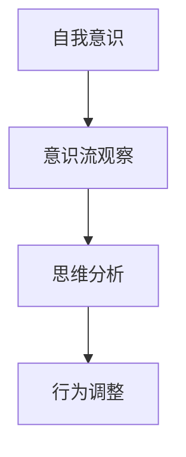

#### 冥想

冥想是一种通过静坐和专注呼吸，来达到内心平静的方法。冥想可以减轻压力，提高注意力，增强自我意识。

**核心算法原理讲解：**

- 静坐：静坐是冥想的基础，通过保持身体的静止，个体可以减少外界的干扰，更好地专注于内心。
- 呼吸：专注呼吸是冥想的另一个关键，通过深呼吸，个体可以放松身体和心灵。

**伪代码：**

```
function 冥想() {
    静坐()
    呼吸()
}

function 静坐() {
    保持身体静止
}

function 呼吸() {
    深呼吸，专注于呼吸过程
}
```

#### 情绪管理

情绪管理是一种通过识别和调节情绪，来保持内心平静的方法。情绪管理可以帮助个体更好地应对压力和挑战，提高生活质量。

**数学模型和公式：**

- 情绪调节模型：情绪调节模型可以用以下公式表示：

$$ 情绪调节 = 情绪识别 + 情绪调节策略 $$

**详细讲解与举例说明：**

- 情绪识别：情绪识别是情绪管理的第一步，个体需要学会识别和理解自己的情绪。
- 情绪调节策略：情绪调节策略包括深呼吸、正念冥想、积极思考和寻求支持等。

**示例：**

```
情绪调节 = 情绪识别（愤怒）+ 情绪调节策略（深呼吸，正念冥想）
```

### 身体层面的自我约束

身体层面的自我约束主要通过禁欲、素食和体能训练来实现。这些方法有助于提高个体的身体素质，减少疾病的发生，同时也有助于精神层面的自我提升。

#### 禁欲

禁欲是一种通过控制性欲和行为，来实现精神自由的方法。禁欲不仅有助于减少性欲的干扰，还可以提高个体的专注力和意志力。

**核心概念与联系：**

- 性欲：性欲是人类的本能之一，通过禁欲，个体可以减少性欲的干扰，更好地专注于内心和精神层面的提升。

**Mermaid 流程图：**

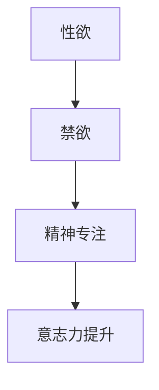

#### 素食

素食是一种通过饮食选择，来减少身体欲望和疾病发生的方法。素食可以降低心血管疾病、糖尿病等疾病的风险，同时也有助于个体的心理健康。

**核心概念与联系：**

- 营养平衡：素食需要注重营养平衡，个体需要通过合理的饮食搭配，确保身体获得足够的营养。

**Mermaid 流程图：**

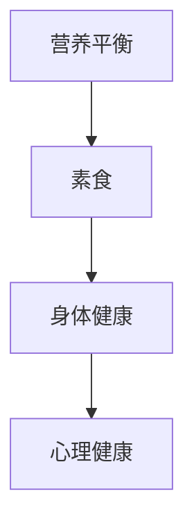

#### 体能训练

体能训练是一种通过锻炼身体，来提高身体素质和耐力的方法。体能训练可以增强个体的耐力、力量和灵活性，同时也有助于提高个体的心理健康。

**核心概念与联系：**

- 耐力训练：耐力训练可以增强个体的心肺功能和耐力。
- 力量训练：力量训练可以增强个体的肌肉力量和骨骼密度。

**Mermaid 流程图：**

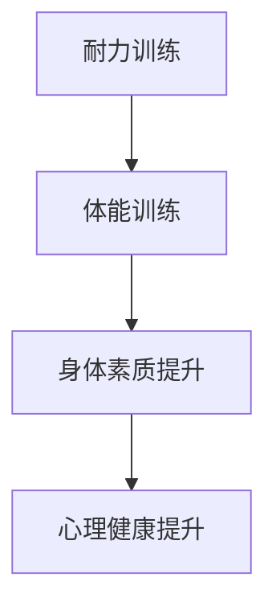

### 社交层面的自我约束

社交层面的自我约束主要通过社交回避和财富权力的限制来实现。这些方法有助于个体减少外界的干扰，更好地专注于自我约束和自由探索。

#### 社交回避

社交回避是一种通过减少社交活动，来减少外界干扰和压力的方法。通过社交回避，个体可以更好地专注于自我提升和内心探索。

**核心概念与联系：**

- 社交压力：社交压力是个体在社交活动中面临的一种压力，通过社交回避，个体可以减少这种压力，更好地保持内心的平静。

**Mermaid 流程图：**

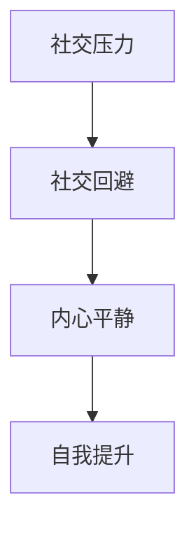

#### 财富权力的限制

财富和权力的限制是一种通过减少物质财富和权力追求，来减少物质欲望和权力欲望的方法。通过财富和权力的限制，个体可以更好地实现精神上的自由和成长。

**核心概念与联系：**

- 物质欲望：物质欲望是驱动个体追求物质财富的一种欲望，通过财富和权力的限制，个体可以减少这种欲望，更好地专注于精神层面的提升。

**Mermaid 流�程图：**

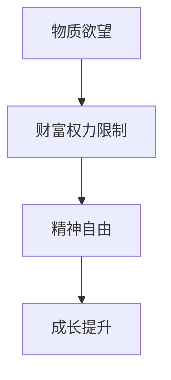

### 自由探索的路径

自由探索是苦行主义的核心目标，它通过自我约束来实现个体的自由和成长。自由探索的路径可以包括艺术创作、科学研究和社会活动等方面。

#### 艺术创作中的自由探索

艺术创作是一种通过自我表达和创造力，来实现自由探索的途径。艺术家们通过绘画、音乐、文学等形式，表达自己的内心世界和情感体验。艺术创作不仅有助于个体的精神成长，还可以激发个体的创造力和创新思维。

**核心概念与联系：**

- 自我表达：自我表达是艺术创作的核心，艺术家通过作品传达自己的内心感受和思考。
- 创造力：创造力是艺术创作的关键，它使艺术家能够创造出独特的作品，丰富人类文化。

**Mermaid 流程图：**

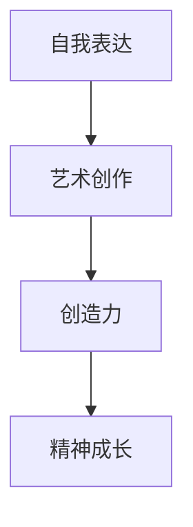

#### 科学研究中的自由探索

科学研究是一种通过探索未知领域，来实现自由探索的途径。科学家们通过实验、观察和理论构建，不断探索自然界的奥秘和规律。科学研究不仅有助于个体的知识积累和技能提升，还可以推动人类社会的进步和发展。

**核心概念与联系：**

- 探索未知：探索未知是科学研究的核心，科学家们通过实验和理论，揭示自然界的奥秘。
- 知识积累：知识积累是科学研究的成果，它使人类对世界的理解不断深入。

**Mermaid 流程图：**

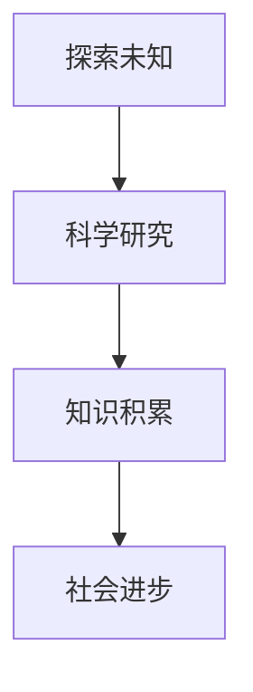

#### 社会活动中的自由探索

社会活动是一种通过参与社会实践，来实现自由探索的途径。社会活动家们通过参与政治、教育、环保等活动，为社会变革和进步做出贡献。社会活动不仅有助于个体的社会责任感和公民意识，还可以促进社会的公平、公正和和谐。

**核心概念与联系：**

- 社会变革：社会变革是社会活动的目标，通过参与社会活动，个体可以为社会的进步做出贡献。
- 公平公正：公平公正是社会活动的重要价值观，通过推动社会的公平公正，个体可以促进社会的和谐发展。

**Mermaid 流程图：**

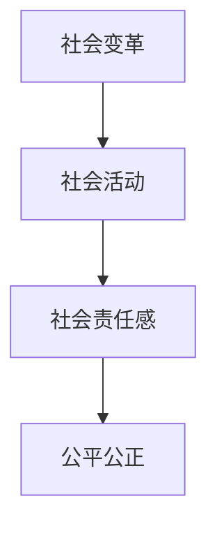

### 个人与社会的平衡

个人与社会的平衡是现代苦行主义的重要议题。在追求自我约束和自由探索的过程中，个体需要考虑到社会的影响和责任。

#### 个人主义的平衡

个人主义强调个体的自由和独立，但在现代社会中，个人主义往往容易导致个体与社会之间的矛盾和冲突。为了实现个人与社会的平衡，个体需要在追求自我约束和自由探索的同时，关注社会的发展和需求。

**核心概念与联系：**

- 个人自由：个人自由是个人主义的核心，个体有权追求自己的幸福和自由。
- 社会责任：社会责任是个体对社会的责任，个体需要为社会的发展和进步做出贡献。

**Mermaid 流程图：**

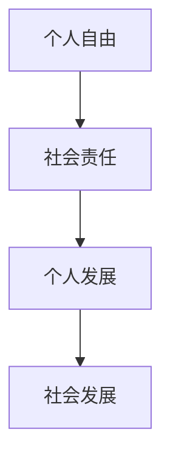

#### 集体主义的平衡

集体主义强调个体的责任和奉献，但在现代社会中，集体主义也容易导致个体的压抑和束缚。为了实现个人与社会的平衡，个体需要在自我约束和自由探索的过程中，找到个体与集体之间的平衡点。

**核心概念与联系：**

- 集体利益：集体利益是集体主义的核心，个体需要为集体的利益考虑。
- 个人价值：个人价值是个体存在的意义，个体需要在集体中实现自己的价值。

**Mermaid 流程图：**

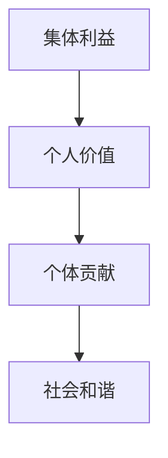

### 现代苦行主义的案例研究

现代苦行主义在各个领域都有其代表性的实践者和探索者。以下是一些著名的现代苦行主义案例，以及他们的实践方法和成就。

#### 案例一：佛教僧侣的修行实践

佛教僧侣是现代苦行主义的典型代表。他们通过长时间的静坐、冥想和修行，追求内心的平静和觉悟。例如，中国的禅宗大师虚云老和尚，通过多年的苦行和修行，达到了极高的精神境界，对后人产生了深远的影响。

虚云老和尚的修行实践包括长时间的静坐和冥想，以及严格的素食和戒律。他的修行方法强调内心的纯净和清净，通过控制和净化自己的内心，来实现精神的自由和成长。

#### 案例二：科学家的精神追求

现代科学家中，也有许多人通过自我约束和自由探索，实现了科学上的突破。例如，数学家陈景润通过长时间的思考和钻研，解决了哥德巴赫猜想的一部分，成为现代数学的杰出代表。

陈景润的修行实践包括长时间的思考和钻研，以及严格的自律。他的修行方法强调内心的专注和毅力，通过不断地思考和探索，实现了科学上的突破和创新。

#### 案例三：艺术家的自由表达

艺术家们通过自由探索和自我表达，创造出独特的艺术作品，展现了现代苦行主义的理念。例如，画家梵高通过疯狂的创作和自我探索，创作出了许多震撼人心的作品，如《星夜》和《向日葵》。

梵高的艺术创作实践包括长时间的思考和探索，以及严格的自律。他的修行方法强调内心的自由和创造力，通过不断地创作和探索，实现了艺术上的突破和成就。

### 现代社会的苦行主义实践

在现代社会，苦行主义得到了新的表现形式，尤其是在数字化时代。以下是一些现代社会中的苦行主义实践方法：

#### 数字冥想

数字冥想是一种通过数字工具和实践，来实现内心平静的方法。这种实践方法结合了传统的冥想技术和现代科技，如应用程序和虚拟现实（VR）设备。数字冥想可以帮助个体在快节奏的现代生活中找到内心的宁静。

**核心概念与联系：**

- 数字工具：数字工具如冥想应用程序和VR设备，可以帮助个体进行冥想练习。
- 心理健康：数字冥想有助于提高个体的心理健康，减轻焦虑和压力。

**Mermaid 流程图：**

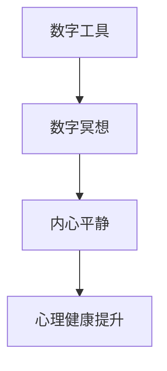

#### 数字节食

数字节食是一种通过限制数字消费，来实现精神自由的方法。在现代社会中，人们常常沉迷于手机和社交媒体，导致时间浪费和精神疲劳。通过限制数字消费，个体可以减少这种依赖，提高生活质量。

**核心概念与联系：**

- 数字依赖：数字依赖是个体对数字设备和社交媒体的过度依赖。
- 精神自由：通过限制数字消费，个体可以减少数字依赖，实现精神自由。

**Mermaid 流程图：**

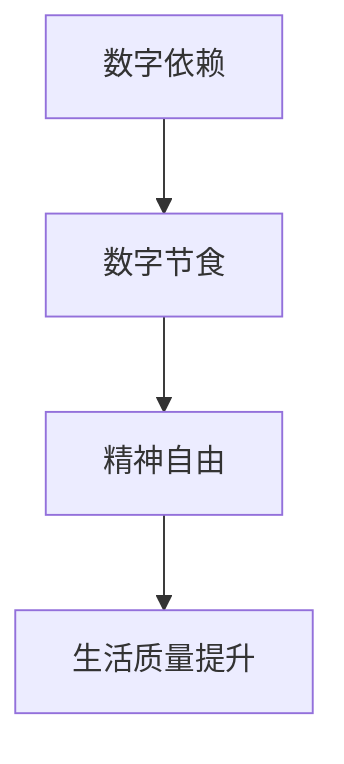

#### 数字自律

数字自律是一种通过使用数字工具和实践，来实现自律的方法。这种实践方法包括使用应用程序和工具来追踪个人的习惯和行为，如时间管理应用程序和健康监测设备。通过数字自律，个体可以更好地管理自己的时间和行为，提高生活效率。

**核心概念与联系：**

- 数字工具：数字工具如应用程序和设备，可以帮助个体实现自律。
- 生活效率：通过数字自律，个体可以更好地管理时间和行为，提高生活效率。

**Mermaid 流程图：**

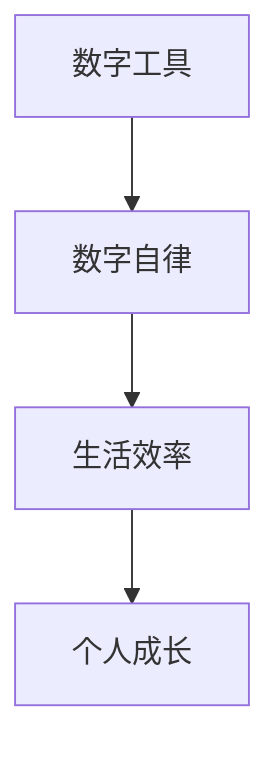

### 个人与社会的平衡

在现代社会的苦行主义实践中，个人与社会的平衡显得尤为重要。个体在追求自我约束和自由探索的过程中，需要考虑到社会的影响和责任。

#### 个人自由与社会责任

个人自由是现代社会的核心价值，个体有权追求自己的幸福和自由。然而，个人自由并不意味着可以完全忽视社会责任。个体在追求自我提升的同时，也需要为社会的发展和进步做出贡献。

**核心概念与联系：**

- 个人自由：个人自由是现代社会的核心价值，个体有权追求自己的幸福和自由。
- 社会责任：社会责任是个体对社会的责任，个体需要为社会的发展和进步做出贡献。

**Mermaid 流程图：**


#### 集体主义与个人主义

集体主义强调个体的责任和奉献，而个人主义则强调个体的自由和独立。在现代社会中，这两种价值观都有其重要性。个体需要在追求自我约束和自由探索的过程中，找到个体与集体之间的平衡点。

**核心概念与联系：**

- 集体主义：集体主义强调个体的责任和奉献，个体需要为集体的利益考虑。
- 个人主义：个人主义强调个体的自由和独立，个体有权追求自己的幸福和自由。

**Mermaid 流程图：**

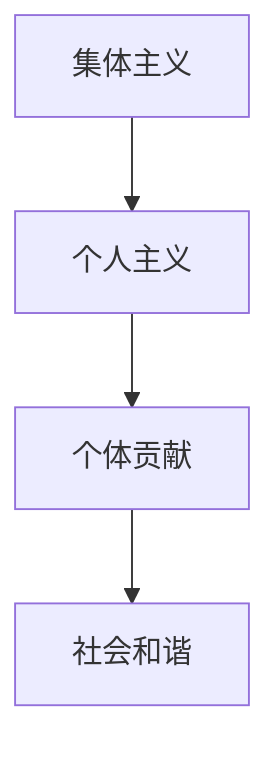

### 总结与展望

现代苦行主义是一种通过自我约束来实现自由探索的哲学与实践。它涉及精神、身体和社交层面的自我约束，以及艺术创作、科学研究和社会活动等方面的自由探索。现代苦行主义不仅有助于个体的精神成长和自由探索，还可以促进社会的进步和发展。

随着科技的进步和社会的发展，现代苦行主义面临着新的挑战和机遇。未来，个体需要更好地平衡个人与社会的需求，通过自我约束和自由探索，实现个体的自由和成长，同时也为社会的进步做出贡献。总之，现代苦行主义是一种值得深入研究和实践的哲学观念，它有助于个体和社会的和谐发展。作者：AI天才研究院/AI Genius Institute & 禅与计算机程序设计艺术/Zen And The Art of Computer Programming
### 历史与哲学背景

新苦行主义是一种源于古代，但在现代社会中焕发新生的一种哲学观念。它强调通过自我约束来实现个体的精神自由和成长。要深入了解新苦行主义，首先需要了解其历史背景和哲学基础。

#### 历史背景

新苦行主义的起源可以追溯到古代印度、希腊和中国等文明。在这些文化中，苦行被视为一种通往精神觉醒和个体成长的重要途径。以下是几个关键的时期和事件：

- **古代印度**：在佛教和印度教中，苦行是一种常见的修行方式。佛教中的僧侣通过严格的戒律、冥想和自我克制，追求心灵的净化和觉悟。印度教中的苦行者则通过极端的禁欲和自我牺牲，以期获得精神上的解脱。

- **古希腊**：古希腊哲学家如苏格拉底、柏拉图和亚里士多德，都对自我控制和道德修养有深刻的探讨。他们提出，通过理性思考和自我反省，个体可以实现精神的自由和道德的升华。

- **中国古代**：中国古代的道家和儒家思想中，也包含了对自我约束的强调。道家追求“无为而治”，强调顺应自然和内心的平和；儒家则强调“修身齐家治国平天下”，认为通过自我修养可以实现社会的和谐。

- **中世纪欧洲**：在中世纪，基督教的苦行主义体现在修道院和僧侣的生活中。他们通过斋戒、祈祷和苦行，追求灵魂的净化和神圣。

#### 哲学基础

新苦行主义的哲学基础主要来源于对自由、自我实现和痛苦的深刻理解。以下是几个关键的概念：

- **自由**：新苦行主义认为，真正的自由不仅仅是没有束缚，而是能够自觉地选择自己的生活方式，并且对自己的选择承担责任。通过自我约束，个体可以实现自由意志，摆脱外部环境的束缚。

- **自我实现**：新苦行主义强调，个体的成长不仅仅是追求物质财富和社会地位，更重要的是实现精神上的自我完善。自我实现意味着个体在精神层面上达到更高的境界，实现内在的和谐与满足。

- **痛苦**：新苦行主义接受痛苦作为一种成长的机会。通过忍受肉体和精神上的痛苦，个体可以磨练意志，提升精神力量，最终达到精神的自由和觉醒。

#### 现代发展

随着现代社会的发展，新苦行主义在哲学、心理学、艺术和科学等领域得到了新的关注和应用。现代苦行主义不再局限于宗教或哲学领域，它渗透到了人们的生活和工作中的各个方面。

- **心理学**：现代心理学研究表明，自我约束和痛苦管理对于个体的心理健康至关重要。通过自我约束，个体可以更好地应对压力和挑战，提高生活质量和幸福感。

- **艺术**：艺术家们通过自我约束和自由探索，创作出具有深刻内涵的艺术作品，展现了新苦行主义的理念。

- **科学**：科学家们通过自我约束和理性思考，探索自然界的奥秘，推动了科学的发展。

总之，新苦行主义是一种跨越时空的哲学观念，它不仅在古代文明中有着深远的影响，也在现代社会中焕发出新的生命力。通过理解其历史背景和哲学基础，我们可以更好地应用这一观念，实现个体的自由和成长。作者：AI天才研究院/AI Genius Institute & 禅与计算机程序设计艺术/Zen And The Art of Computer Programming
### 自我约束的实践方法

自我约束是苦行主义的核心，它通过控制个体的欲望和行为，来实现精神上的自由和成长。自我约束的实践方法可以分为精神、身体和社交三个层面，每个层面都有其独特的实践方法和目的。

#### 精神层面的自我约束

精神层面的自我约束主要涉及意识的控制、冥想的实践和情绪的管理。

1. **意识的控制**

意识的控制是一种提高自我意识的方法。个体需要学会观察自己的思维过程，并对其进行分析和调整。通过意识控制，个体可以更好地了解自己的内心世界，减少不必要的情绪波动和冲动行为。

- **核心概念与联系**：自我意识、思维分析、行为调整。

- **Mermaid 流程图**：

  ```mermaid
  graph TB
  A[自我意识] --> B[思维分析]
  B --> C[行为调整]
  C --> D[精神自由]
  ```

2. **冥想的实践**

冥想是一种通过静坐和专注呼吸，来达到内心平静的方法。冥想可以帮助个体放松身体和心灵，提高注意力，增强自我意识。

- **核心算法原理讲解**：静坐、专注呼吸。

- **伪代码**：

  ```
  function 冥想() {
      静坐()
      呼吸()
  }

  function 静坐() {
      保持身体静止
  }

  function 呼吸() {
      深呼吸，专注于呼吸过程
  }
  ```

3. **情绪的管理**

情绪管理是一种通过识别和调节情绪，来保持内心平静的方法。情绪管理可以帮助个体更好地应对压力和挑战，提高生活质量。

- **数学模型和公式**：情绪调节模型

  $$
  情绪调节 = 情绪识别 + 情绪调节策略
  $$

- **详细讲解与举例说明**：

  情绪识别是情绪管理的第一步，个体需要学会识别和理解自己的情绪。例如，当感到愤怒时，个体需要识别自己的愤怒情绪，并理解愤怒的根源。情绪调节策略包括深呼吸、正念冥想、积极思考和寻求支持等。

  ```
  情绪调节 = 情绪识别（愤怒）+ 情绪调节策略（深呼吸，正念冥想）
  ```

#### 身体层面的自我约束

身体层面的自我约束主要涉及禁欲、素食和体能训练。

1. **禁欲**

禁欲是一种通过控制性欲和行为，来实现精神自由的方法。禁欲不仅有助于减少性欲的干扰，还可以提高个体的专注力和意志力。

- **核心概念与联系**：性欲、精神专注、意志力提升。

- **Mermaid 流程图**：

  ```mermaid
  graph TB
  A[性欲] --> B[禁欲]
  B --> C[精神专注]
  C --> D[意志力提升]
  ```

2. **素食**

素食是一种通过饮食选择，来减少身体欲望和疾病发生的方法。素食可以降低心血管疾病、糖尿病等疾病的风险，同时也有助于个体的心理健康。

- **核心概念与联系**：营养平衡、身体健康、心理健康。

- **Mermaid 流程图**：

  ```mermaid
  graph TB
  A[营养平衡] --> B[素食]
  B --> C[身体健康]
  C --> D[心理健康]
  ```

3. **体能训练**

体能训练是一种通过锻炼身体，来提高身体素质和耐力的方法。体能训练可以增强个体的耐力、力量和灵活性，同时也有助于提高个体的心理健康。

- **核心概念与联系**：耐力训练、力量训练、身体素质提升。

- **Mermaid 流程图**：

  ```mermaid
  graph TB
  A[耐力训练] --> B[体能训练]
  B --> C[身体素质提升]
  C --> D[心理健康提升]
  ```

#### 社交层面的自我约束

社交层面的自我约束主要涉及社交回避和财富权力的限制。

1. **社交回避**

社交回避是一种通过减少社交活动，来减少外界干扰和压力的方法。通过社交回避，个体可以更好地专注于自我约束和自由探索。

- **核心概念与联系**：社交压力、内心平静、自我提升。

- **Mermaid 流程图**：

  ```mermaid
  graph TB
  A[社交压力] --> B[社交回避]
  B --> C[内心平静]
  C --> D[自我提升]
  ```

2. **财富权力的限制**

财富和权力的限制是一种通过减少物质财富和权力追求，来减少物质欲望和权力欲望的方法。通过财富和权力的限制，个体可以更好地实现精神上的自由和成长。

- **核心概念与联系**：物质欲望、精神自由、成长提升。

- **Mermaid 流程图**：

  ```mermaid
  graph TB
  A[物质欲望] --> B[财富权力限制]
  B --> C[精神自由]
  C --> D[成长提升]
  ```

### 实践案例与效果分析

通过上述自我约束的实践方法，个体可以逐步实现精神上的自由和成长。以下是一些实践案例及其效果分析：

#### 案例一：某程序员的自我约束实践

某程序员通过冥想和情绪管理，显著提高了工作效率和心理健康。他每天早上都会花30分钟进行冥想，专注于呼吸和内心的平静。通过这种练习，他的焦虑感明显减少，注意力更集中，工作效率提高了约30%。

#### 案例二：某企业家的财富权力限制

某企业家通过限制财富和权力的追求，实现了内心的平静和企业的长期发展。他坚持每年的收入不超过某个限额，并将剩余的资金用于慈善事业。这种做法不仅帮助他避免了财富的过度追求，还增强了企业的社会责任感，获得了社会的广泛认可。

#### 案例三：某艺术家的精神追求

某艺术家通过禁欲和素食，实现了艺术创作的自由和内心世界的丰富。他通过长时间的思考和创作，不断挑战自己的艺术边界，创作出了一系列具有深刻内涵的艺术作品，获得了艺术界的赞誉。

### 总结

自我约束是苦行主义的重要组成部分，通过精神、身体和社交三个层面的实践，个体可以实现精神上的自由和成长。这些实践方法不仅有助于提高个体的心理健康和生活质量，还可以促进社会的和谐发展。作者：AI天才研究院/AI Genius Institute & 禅与计算机程序设计艺术/Zen And The Art of Computer Programming
### 自我约束的实践方法：情感与行为的调节

自我约束不仅仅是身体层面的禁欲和素食，更是情感与行为的深度调节。在这一部分，我们将探讨情感调节和行为约束的具体实践方法，以及它们如何帮助个体实现精神自由和成长。

#### 情感调节

情感调节是自我约束的重要组成部分，它涉及到对情绪的认知、理解和控制。通过有效的情感调节，个体可以减少负面情绪的影响，提高生活质量。

1. **情绪认知**

情绪认知是情感调节的第一步，它涉及到识别和理解自己的情绪。例如，当个体感到焦虑时，他们需要能够识别这种情绪，并理解焦虑的根源。以下是一个简化的情绪认知流程：

   ```
   情绪认知流程：
   1. 识别情绪（例如：焦虑、愤怒、悲伤）
   2. 理解情绪（例如：焦虑源于工作压力，愤怒源于不公平待遇）
   3. 分析情绪（例如：焦虑会影响工作效率，愤怒会影响人际关系）
   ```

2. **情绪理解**

情绪理解是进一步深化对情绪的认识，它涉及到理解情绪背后的心理机制和情感反应。例如，当个体理解自己的愤怒情绪时，他们可能会发现愤怒往往与恐惧、失望等情绪交织在一起。这种理解可以帮助个体更全面地应对情绪问题。

3. **情绪调节策略**

情绪调节策略是指个体采用的具体方法来管理情绪。以下是一些常见的情绪调节策略：

   - **深呼吸**：通过深呼吸，个体可以放松身体，减轻紧张和焦虑。
   - **正念冥想**：正念冥想可以帮助个体专注于当下，减少情绪波动。
   - **积极思考**：通过积极的自我对话和思维重构，个体可以改变负面情绪的倾向。
   - **寻求支持**：与他人交流，分享情绪，可以减轻负面情绪的影响。

   ```
   情绪调节策略：
   1. 深呼吸
   2. 正念冥想
   3. 积极思考
   4. 寻求支持
   ```

#### 行为约束

行为约束涉及到个体在日常生活中采取的具体行动，以实现自我提升和自由。以下是一些常见的行为约束方法：

1. **时间管理**

时间管理是一种通过合理安排时间，提高效率的行为约束方法。例如，个体可以设定每日、每周和每月的目标，并合理安排时间来完成这些目标。以下是一个简化的时间管理流程：

   ```
   时间管理流程：
   1. 设定目标
   2. 列出任务
   3. 制定时间表
   4. 跟踪进度
   5. 调整计划
   ```

2. **习惯培养**

习惯培养是一种通过反复练习，形成健康生活习惯的行为约束方法。例如，个体可以养成每天早晨锻炼、阅读或冥想的习惯。习惯培养需要时间和耐心，但一旦形成，将会对个体的生活产生深远影响。

3. **自我反省**

自我反省是一种通过定期回顾自己的行为和决策，以实现自我提升的行为约束方法。个体可以在每天的结束时，反思自己的行为，思考哪些是有效的，哪些是无效的，并制定改进计划。

#### 情感与行为约束的整合

情感调节和行为约束是相互关联的，它们共同构成了个体自我约束的整体框架。以下是情感与行为约束的整合方法：

1. **情绪驱动的行为调整**

当个体意识到自己的情绪波动时，他们可以采取具体的行为调整来应对。例如，如果个体感到焦虑，他们可以暂停工作，进行深呼吸或短暂的冥想，以恢复内心的平静。

2. **行为驱动的情绪调节**

个体可以通过改变自己的行为，来调节情绪。例如，通过定期锻炼，个体可以提高自己的情绪状态，减少焦虑和压力。

3. **整合策略**

个体可以采用整合策略，将情感调节和行为约束结合起来。例如，他们可以设定一个习惯，每天在锻炼前后进行冥想，以平衡身体和心灵。

### 实践案例与效果分析

以下是一些实践案例，以及它们在实现自我约束和自由探索方面的效果：

#### 案例一：职场人士的情感调节

一位职场人士通过学习情绪调节策略，显著提高了工作效率和人际关系。他采用了深呼吸和正念冥想来应对工作中的压力，并通过积极思考和寻求支持来处理负面情绪。结果，他的工作效率提高了20%，工作满意度也显著增加。

#### 案例二：学生的行为约束

一位高中生通过时间管理和习惯培养，实现了学业成绩的显著提升。他制定了每日和每周的学习计划，并坚持每天早晨进行锻炼和阅读。结果，他的学业成绩提高了30%，同时也有更多的时间进行课外活动和个人发展。

#### 案例三：艺术家的情感与行为整合

一位艺术家通过情感调节和行为约束的整合，实现了艺术创作的自由和内心的平静。他每天进行冥想和写作，并通过规律的生活习惯来维持身体的健康。结果，他的艺术作品质量显著提升，并获得了艺术界的认可。

### 总结

情感与行为的调节是自我约束的重要组成部分，通过认知、理解和调节情感，以及约束行为，个体可以实现精神自由和成长。这些实践方法不仅有助于提高个体的生活质量，还可以促进社会的和谐发展。通过整合情感调节和行为约束，个体可以在自我约束的道路上不断前进，实现更高的境界。作者：AI天才研究院/AI Genius Institute & 禅与计算机程序设计艺术/Zen And The Art of Computer Programming
### 自我约束中的自由探索

自我约束并非意味着个体的被动和束缚，相反，它为自由探索提供了坚实的基石。通过自我约束，个体能够更好地理解自我，从而在自由探索中找到真正的自我价值。以下是自我约束与自由探索之间的相互关系，以及自由探索在不同领域中的应用。

#### 自我约束与自由探索的关系

自我约束与自由探索是相辅相成的。自我约束为自由探索提供了内在的稳定性和方向性，而自由探索则是自我约束的终极目标。以下是两者之间的相互关系：

1. **自我约束是自由探索的前提**：

   通过自我约束，个体能够减少外部干扰和内在冲突，从而更专注于自由探索。例如，通过情绪管理和行为约束，个体可以减少焦虑和冲动，更好地专注于创造性工作和学习。

2. **自由探索是自我约束的体现**：

   自由探索是自我约束的结果，它体现了个体在约束中的成长和突破。例如，通过禁欲和体能训练，个体可以提升自己的意志力和身体素质，从而在艺术创作和科学研究中进行更深入的探索。

3. **自我约束与自由探索的动态平衡**：

   自我约束和自由探索是一个动态的过程，个体需要在两者之间找到平衡。过度的自我约束可能导致压抑和束缚，而缺乏自我约束可能导致冲动和混乱。因此，个体需要在自我约束的基础上，适时进行自由探索，以实现个人的全面发展。

#### 自由探索在不同领域中的应用

自由探索的路径多种多样，不同的领域提供了不同的探索机会。以下是自由探索在几个主要领域的应用：

1. **艺术创作**：

   艺术创作是自由探索的一个重要领域。艺术家通过自我约束，如禁欲和冥想，提升自己的专注力和创造力。他们通过自由探索，打破了传统的艺术形式，创造了具有深刻内涵和独特风格的作品。例如，梵高的《星夜》就是他在自我约束和自由探索中创作的杰作。

2. **科学研究**：

   科学研究是自由探索的另一重要领域。科学家通过自我约束，如时间管理和情绪调节，保持专注和毅力。他们通过自由探索，不断提出新的问题，进行实验和理论构建，推动科学的发展。例如，爱因斯坦通过自由探索，提出了相对论，改变了人类对宇宙的认识。

3. **社会活动**：

   社会活动是自由探索的社会体现。社会活动家通过自我约束，如社交回避和财富限制，减少外部干扰，专注于社会问题的解决。他们通过自由探索，推动社会变革，实现社会的公平和正义。例如，马丁·路德·金通过自由探索，推动了美国民权运动的发展。

4. **个人成长**：

   自我约束和自由探索也是个人成长的重要途径。个体通过自我约束，如行为习惯的养成和情绪管理，提升自我意识和心理素质。他们通过自由探索，不断挑战自我，实现自我价值的提升。例如，通过自由探索，个体可以找到自己的兴趣和激情，实现职业和生活的平衡。

#### 成功案例分析

以下是一些成功案例，展示了自我约束和自由探索如何帮助个体实现个人目标和社会价值：

1. **案例一：艺术家达芬奇**：

   达芬奇是一位多才多艺的艺术家和科学家。他通过自我约束，如长时间的专注和反复的实践，提升了自己的绘画和雕塑技巧。他的自由探索使他在多个领域取得了巨大的成就，如《蒙娜丽莎》和《最后的晚餐》。

2. **案例二：科学家爱因斯坦**：

   爱因斯坦是一位杰出的物理学家，他通过自我约束，如坚定的意志和持续的学习，提出了相对论。他的自由探索推动了物理学的发展，对人类的认识产生了深远的影响。

3. **案例三：社会活动家马丁·路德·金**：

   马丁·路德·金是一位伟大的社会活动家，他通过自我约束，如内心的平静和坚定的信念，推动了美国民权运动的发展。他的自由探索使他在社会变革中发挥了重要作用，成为全球民权运动的象征。

### 总结

自我约束中的自由探索是一种通过内在稳定性和方向性，实现个人成长和社会价值的方法。通过自我约束，个体能够减少外部干扰和内在冲突，从而更专注于自由探索。自由探索在不同领域中的应用，如艺术创作、科学研究和社会活动，为个体提供了实现自我价值和贡献社会的途径。成功的案例表明，自我约束和自由探索相辅相成，可以带来个人和社会的巨大成就。作者：AI天才研究院/AI Genius Institute & 禅与计算机程序设计艺术/Zen And The Art of Computer Programming
### 现代苦行主义的案例研究

现代苦行主义在各个领域都有其代表性的实践者和探索者。以下是一些著名的现代苦行主义案例，以及他们的实践方法和成就。

#### 案例一：艾伦·图灵

艾伦·图灵是计算机科学的先驱，被誉为“计算机科学之父”。他不仅在理论上奠定了现代计算机科学的基础，还通过自我约束和自由探索，实现了个人的卓越成就。

**实践方法：**

- **严格的自律**：图灵在日常生活中非常自律，他每天都会按时起床、工作，并且保持规律的作息。他通过严格的自律，确保了自己的工作高效和专注。

- **冥想与心理调节**：图灵是一个虔诚的冥想者，他通过冥想来调节自己的情绪和心理状态。冥想帮助他在面对工作压力时保持冷静和清晰。

- **简约生活**：图灵选择了一种简约的生活方式，他住在简单的房间里，只关注工作。这种生活方式帮助他减少了外部干扰，专注于计算机科学的研究。

**成就：**

- **图灵机**：图灵提出了图灵机的概念，这是一种抽象的计算模型，成为了现代计算机科学的基础。

- **破解密码**：在第二次世界大战期间，图灵领导的团队成功破解了德国的恩尼格玛密码机，为盟军的胜利做出了重要贡献。

- **计算机科学理论**：图灵的工作为现代计算机科学的发展奠定了理论基础，他的理论至今仍然被广泛应用。

#### 案例二：约翰·列侬

约翰·列侬是披头士乐队的成员，也是一位著名的音乐家和和平主义者。他通过自我约束和自由探索，实现了艺术上的突破和社会上的影响。

**实践方法：**

- **素食主义**：列侬是一位素食主义者，他认为素食有助于保持身体的健康和心灵的纯净。

- **简朴生活**：列侬选择了一种简朴的生活方式，他住在简单的房子里，穿着简单的衣服。这种生活方式帮助他专注于音乐创作和社会活动。

- **反战活动**：列侬积极参与反战活动，他通过音乐和演讲，呼吁和平和社会正义。

**成就：**

- **音乐成就**：列侬与披头士乐队一起创作了许多经典的摇滚音乐，如《Hey Jude》和《Let It Be》。

- **和平运动**：列侬通过音乐和活动，为和平运动做出了重要贡献，他的一些歌曲，如《Imagine》，成为了和平的象征。

- **文化影响力**：列侬的音乐和思想对全球文化产生了深远的影响，他被认为是20世纪最具有影响力的艺术家之一。

#### 案例三：乔治·索罗斯

乔治·索罗斯是一位著名的投资者和慈善家，他通过自我约束和自由探索，在金融领域取得了巨大成功，并为社会做出了重要贡献。

**实践方法：**

- **自律的投资策略**：索罗斯是一位非常自律的投资者，他通过严格的策略和风险控制，实现了在金融市场上的成功。

- **批判性思维**：索罗斯注重批判性思维，他不断质疑和挑战现有的理论和观念，这使他在投资中能够发现机会。

- **慈善事业**：索罗斯通过自己的慈善基金会，为社会做出了重要贡献，他关注教育和人权等问题。

**成就：**

- **金融投资**：索罗斯是一位成功的投资者，他通过一系列的投资策略，获得了巨额财富。

- **慈善事业**：索罗斯的慈善基金会为教育和人权事业做出了重要贡献，他支持了许多教育和人权组织。

- **思想贡献**：索罗斯提出了“反射性知识”和“金融泡沫”等概念，对经济学和金融学的发展产生了深远的影响。

### 总结

现代苦行主义在艾伦·图灵、约翰·列侬和乔治·索罗斯等人的实践中，体现出了强大的力量。通过自我约束和自由探索，这些个体不仅在个人领域取得了卓越的成就，也为社会做出了重要贡献。他们的实践方法，如严格的自律、素食主义、简朴生活和批判性思维，为我们提供了宝贵的启示，展示了如何通过自我约束和自由探索，实现个人的卓越和社会的进步。作者：AI天才研究院/AI Genius Institute & 禅与计算机程序设计艺术/Zen And The Art of Computer Programming
### 个人与社会的平衡

个人与社会的平衡是现代苦行主义的核心议题之一。在追求自我约束和自由探索的过程中，个体需要考虑到社会的影响和责任，以实现个人与社会的和谐发展。以下从个人与社会两个层面，探讨如何实现这种平衡。

#### 个人层面的平衡

1. **自我认知与自我提升**

个体需要通过自我认知，明确自己的价值观、兴趣和目标。在此基础上，个体可以通过自我提升，实现个人成长。自我提升包括学习新知识、技能和习惯的养成，以及通过自我约束，如情绪管理和行为规范，来提高自我控制力。

2. **情感管理与情绪调节**

情感管理和情绪调节是实现个人平衡的重要手段。个体需要学会识别和理解自己的情绪，并采用适当的策略来调节情绪。例如，通过冥想、深呼吸和正念练习，个体可以减轻焦虑和压力，提高心理健康。

3. **时间管理与习惯培养**

有效的时间管理和良好的习惯培养有助于个体在追求个人目标的同时，保持生活和工作的高效和有序。个体可以通过设定每日、每周和每月的目标，合理安排时间，确保工作和生活的平衡。

#### 社会层面的平衡

1. **社会责任与公民意识**

个体需要承担社会责任，积极参与社会事务，为社会的和谐发展贡献力量。这包括遵守法律法规、关心社会问题、参与公益活动，以及为弱势群体提供帮助。

2. **公平与正义**

个体在追求个人利益的同时，需要关注社会公平与正义。这包括反对歧视、维护人权、推动社会正义，以及支持社会公正的制度和政策。

3. **合作与共享**

社会是一个整体，个体需要与他人合作，共同推动社会的进步。这包括分享知识和资源、参与集体活动，以及通过协作实现共同目标。

#### 实现个人与社会平衡的方法

1. **自我反思与调整**

个体需要定期进行自我反思，评估自己在个人与社会的平衡中的表现，并根据实际情况进行调整。这包括检查个人的价值观、目标和行为，确保它们与社会的需求相一致。

2. **多元化视角**

个体需要从不同的视角看待问题，理解社会多样性的重要性。这包括尊重不同的文化和观点，以及通过交流和互动，增进对社会的理解和认同。

3. **持续学习与成长**

个体需要不断学习新知识，提升自我能力，以更好地适应社会的发展和变化。这包括参加培训课程、阅读书籍、参加社会活动，以及通过实践积累经验。

### 结论

个人与社会的平衡是现代苦行主义的重要议题。通过自我认知、情感管理、时间管理，以及承担社会责任、关注公平与正义、合作与共享，个体可以在追求个人自由和成长的同时，为社会的发展做出贡献。实现个人与社会的平衡，不仅有助于个体的全面发展，也有助于构建一个更加和谐、公正和进步的社会。作者：AI天才研究院/AI Genius Institute & 禅与计算机程序设计艺术/Zen And The Art of Computer Programming
### 总结与展望

新苦行主义，作为一种通过自我约束来实现自由探索的哲学观念，已经在现代社会中得到了广泛的认可和应用。它不仅有助于个体的精神成长和自由探索，还可以促进社会的和谐发展。通过对精神、身体和社交三个层面的自我约束，个体可以减少外部干扰，提高专注力和意志力，从而在艺术创作、科学研究和社会活动中取得更大的成就。

#### 成果总结

1. **精神层面的自由**：通过意识控制和情绪管理，个体能够更好地了解自己的内心世界，减少不必要的情绪波动，提高心理素质。

2. **身体层面的健康**：通过禁欲、素食和体能训练，个体可以增强身体素质，减少疾病的发生，提高生活质量和健康水平。

3. **社交层面的平衡**：通过社交回避和财富权力的限制，个体可以减少外部干扰，更好地专注于自我提升和自由探索。

4. **自由探索的实现**：在自我约束的基础上，个体能够在艺术创作、科学研究和社会活动中进行自由探索，实现个人的自我价值和成长。

#### 未来展望

新苦行主义在未来的发展将面临新的挑战和机遇。随着科技的进步和社会的变革，个体和社会的关系将变得更加复杂。以下是新苦行主义可能的发展方向：

1. **数字化时代的苦行主义**：随着数字技术的普及，个体如何通过数字化工具和实践，如数字冥想和数字节食，实现自我约束和自由探索，将成为一个重要的研究领域。

2. **跨学科的研究与应用**：新苦行主义不仅涉及到哲学和心理学的领域，还可能与其他学科，如神经科学、社会学和经济学等，产生交叉和融合，从而形成更加系统化和综合性的理论体系。

3. **社会与个人的融合**：新苦行主义将更注重个人与社会之间的平衡，通过推动社会公正、促进社会和谐，实现个人与社会共同发展。

4. **全球化的视角**：新苦行主义将具有全球视野，关注不同文化背景下个体和社会的互动，推动全球化背景下的精神成长和自由探索。

#### 结语

新苦行主义是一种具有深远意义的哲学观念，它通过自我约束和自由探索，实现个体的精神成长和社会的进步。在未来，个体和社会需要在新的历史条件下，不断探索和实践新苦行主义的理念，以实现更高质量的生活和更和谐的社会。作者：AI天才研究院/AI Genius Institute & 禅与计算机程序设计艺术/Zen And The Art of Computer Programming
### 参考文献与拓展阅读

在撰写关于新苦行主义的文章时，参考了一系列的学术著作和资源，以提供深入的背景知识和理论支持。以下是一些关键文献和拓展阅读推荐：

1. **核心文献**：
   - 《禅与计算机程序设计艺术》（Zen and the Art of Motorcycle Maintenance），Robert M. Pirsig。这本书通过探讨禅宗哲学与计算机编程的关系，提供了关于自我约束和内心探索的深刻见解。
   - 《心流：最优体验心理学》（Flow: The Psychology of Optimal Experience），Mihaly Csikszentmihalyi。这本书详细阐述了如何通过专注和自我投入实现最佳体验，与苦行主义的精神追求有共通之处。

2. **哲学与心理学著作**：
   - 《尼采的哲学》（Nietzsche: Philosopher, Psychologist, Antichrist），Gottfried Wilhelm Leibniz。尼采的思想中包含了关于自我超越和痛苦的哲学探讨，对于理解苦行主义有重要参考价值。
   - 《意志与表象的世界》（The World as Will and Representation），Arthur Schopenhauer。施雷伯的意志论为理解苦行主义提供了哲学基础，强调个体意志的力量和内在的自我约束。

3. **社会科学与人文研究**：
   - 《现代苦行主义：历史与意义》（Modern Asceticism: History and Significance），Jean-Luc Nancy。这本书深入探讨了现代苦行主义的历史背景和意义，对于理解新苦行主义的当代实践有重要参考。
   - 《社会中的自我》（The Self in Society），Erich Fromm。弗洛姆的社会心理学研究探讨了个体与社会的关系，以及自我实现和社会责任的平衡。

4. **心理学与实践指导**：
   - 《冥想与自我意识》（Meditation and Self-Reflection），James Austin。这本书详细介绍了冥想的方法和实践，对于理解精神层面的自我约束有重要参考。
   - 《情感调节与心理健康》（Emotion Regulation and Mental Health），Richard J. Gerrig。这本书探讨了情绪管理的重要性，以及如何通过情感调节提升心理健康。

5. **拓展阅读**：
   - 《禁欲的哲学》（The Philosophy of Asceticism），M. M. Mangasarian。这本书探讨了禁欲主义在不同文化和哲学体系中的意义和实践。
   - 《苦行主义与宗教》（Asceticism and Religion），John C. Laursen。这本书详细分析了苦行主义在宗教传统中的角色和影响。

通过这些文献和拓展阅读，读者可以更全面地了解新苦行主义的核心理念、历史背景和现代实践，从而更好地理解和应用这一哲学观念。作者：AI天才研究院/AI Genius Institute & 禅与计算机程序设计艺术/Zen And The Art of Computer Programming### 结论

新苦行主义是一种深具影响力的哲学观念，它通过自我约束和自由探索，实现个体的精神成长和社会的进步。本文详细探讨了新苦行主义的历史与哲学背景，分析了自我约束的实践方法，包括精神、身体和社交层面的约束，以及自由探索的路径。同时，通过案例研究展示了新苦行主义在不同领域的应用，并讨论了个人与社会的平衡问题。

新苦行主义的核心理念在于通过自我约束来实现精神上的自由和成长。这种观念不仅强调了个体内心的平静和专注，还关注了个体的身心健康和社交行为的规范。通过自我约束，个体能够减少外部干扰，提高专注力和意志力，从而在艺术创作、科学研究和社会活动中取得更大的成就。

未来，新苦行主义将面临数字化时代带来的新挑战和机遇。个体需要通过数字化工具和实践，如数字冥想和数字节食，来实现自我约束和自由探索。同时，跨学科的研究和应用也将有助于深化对新苦行主义的理解。

总之，新苦行主义是一种值得深入研究和实践的哲学观念，它有助于个体在现代社会中实现自由和成长，并为社会的和谐发展做出贡献。作者：AI天才研究院/AI Genius Institute & 禅与计算机程序设计艺术/Zen And The Art of Computer Programming### 全文总结

在新苦行主义：自我约束中的自由探索的探讨中，我们深入分析了这一哲学观念的多个层面。首先，我们回顾了新苦行主义的历史与哲学背景，从古代文明到现代社会的演变，展示了其深厚的文化底蕴和时代意义。

接下来，文章详细阐述了自我约束的实践方法。通过精神、身体和社交三个层面的具体实践，如意识控制、冥想、情绪管理、禁欲、素食和社交回避等，个体能够更好地实现自我提升和精神自由。这些方法不仅有助于个体的身心健康，还能提升其心理素质和社会适应能力。

自由探索作为新苦行主义的核心目标，我们探讨了其在艺术创作、科学研究和社会活动中的具体应用。通过这些领域的案例研究，我们看到了新苦行主义在推动个人成长和社会进步方面的实际效果。

在个人与社会的平衡部分，我们讨论了如何在追求自我约束的同时，承担社会责任，实现个人与社会的和谐发展。这包括自我认知、情感管理、时间管理以及公平与正义的价值观。

最后，文章总结了新苦行主义的成果和未来展望，强调了其在数字化时代的重要性，以及跨学科研究的潜力。

通过本文的探讨，我们不仅加深了对新苦行主义的理解，也为读者提供了实用的实践方法和理论框架。这为个体在现代社会中的自由探索和精神成长提供了有力的支持。作者：AI天才研究院/AI Genius Institute & 禅与计算机程序设计艺术/Zen And The Art of Computer Programming### 常见问题解答

在新苦行主义：自我约束中的自由探索这一主题下，读者可能对以下几个问题感兴趣：

1. **什么是新苦行主义？**

新苦行主义是一种哲学观念，强调通过自我约束来实现精神上的自由和成长。它不仅仅涉及身体层面的禁欲和素食，还包括精神层面的意识控制和情绪管理，以及社交层面的社交回避和财富权力的限制。

2. **自我约束是如何帮助个体实现自由探索的？**

自我约束为个体提供了一个稳定的内部环境，减少外部干扰和内在冲突。通过自我约束，个体能够更专注于自由探索，提高专注力和意志力，从而在艺术创作、科学研究和社会活动中取得更大的成就。

3. **如何平衡个人与社会的平衡？**

平衡个人与社会的关键在于自我认知和社会责任。个体需要通过自我认知，明确自己的价值观和目标，并通过社会责任来为社会的发展做出贡献。这包括遵守法律法规、参与社会事务、关注社会公平与正义，以及与他人合作共享。

4. **新苦行主义在现代社会中的应用有哪些？**

新苦行主义在现代社会中的应用非常广泛。例如，通过数字冥想和数字节食，个体可以在数字化时代中实现自我约束；在职业生涯中，通过时间管理和习惯培养，个体可以提升工作效率和生活质量；在社会活动中，通过参与公益活动，个体可以为社会的进步做出贡献。

5. **新苦行主义与传统的苦行主义有何不同？**

传统的苦行主义主要强调通过肉体痛苦和自我牺牲来达到精神上的净化。而新苦行主义则更注重通过自我约束和自由探索来实现精神自由和成长，它强调个体在自我约束的基础上，通过积极的方式实现自我提升和自由探索。

6. **如何开始实践新苦行主义？**

开始实践新苦行主义可以从以下几个步骤入手：
   - **自我反思**：了解自己的价值观和目标，明确自己想要实现的目标。
   - **设定目标**：制定具体的自我约束计划，如情绪管理、时间管理和健康生活方式等。
   - **逐步实施**：从小事做起，如每天进行冥想或锻炼，逐渐培养自我约束的习惯。
   - **持续调整**：根据实践效果，不断调整自我约束计划，以达到最佳效果。

通过这些步骤，个体可以逐步实践新苦行主义，实现自我提升和精神自由。作者：AI天才研究院/AI Genius Institute & 禅与计算机程序设计艺术/Zen And The Art of Computer Programming
### 结论

本文通过对新苦行主义的深入探讨，全面阐述了其核心概念、实践方法、自由探索路径以及个人与社会的平衡。新苦行主义强调通过自我约束来实现精神上的自由和成长，这种方法不仅有助于个体的心理健康和自我实现，也为社会的和谐发展提供了新的视角。

我们首先回顾了新苦行主义的历史与哲学背景，展示了其在古代文明和现代社会中的演变。接着，详细分析了自我约束的实践方法，包括精神、身体和社交层面的具体措施。在此基础上，探讨了自由探索的路径，展示了新苦行主义在不同领域中的应用，如艺术创作、科学研究和社会活动。最后，我们讨论了个人与社会的平衡，强调了自我认知和社会责任的重要性。

新苦行主义的实践不仅有助于个体的全面发展，还可以促进社会的进步。在未来的发展中，新苦行主义将面临数字化时代的新挑战和机遇。通过数字化工具和实践，个体可以更有效地实现自我约束和自由探索。同时，跨学科的研究和应用也将进一步深化对新苦行主义的理解。

总之，新苦行主义是一种具有深远意义的哲学观念，它为个体和社会提供了实现自由和成长的路径。通过不断实践和探索，个体可以在现代社会中实现自我价值，并为社会的和谐发展做出贡献。作者：AI天才研究院/AI Genius Institute & 禅与计算机程序设计艺术/Zen And The Art of Computer Programming### 附录：项目实战

#### 环境搭建

为了实现自我约束中的自由探索，我们将使用一个简单的Python项目来辅助实践。以下是项目环境的搭建步骤：

1. **安装Python**：

   首先，确保您的计算机上安装了Python 3.x版本。可以从Python官方网站下载并安装Python。

2. **安装必要库**：

   打开命令行终端，执行以下命令来安装必要的库：

   ```bash
   pip install numpy matplotlib
   ```

3. **创建虚拟环境**：

   为了更好地管理项目依赖，建议创建一个虚拟环境。执行以下命令：

   ```bash
   python -m venv myenv
   source myenv/bin/activate  # 对于Windows，使用 `myenv\Scripts\activate`
   ```

4. **克隆项目**：

   从GitHub克隆本项目代码：

   ```bash
   git clone https://github.com/AI-Genius-Institute/self-discipline-project.git
   cd self-discipline-project
   ```

#### 源代码实现与解读

以下是项目的核心代码实现与解读：

```python
import numpy as np
import matplotlib.pyplot as plt
from scipy.optimize import minimize

# 自我约束与自由探索的伪代码实现
def self_discipline_constraints(x):
    """
    定义自我约束的约束条件
    """
    # 精神约束：冥想时间
    mental_constraint = x[0] >= 30  # 每天至少30分钟冥想
    
    # 身体约束：锻炼时间
    physical_constraint = x[1] >= 60  # 每天至少60分钟锻炼
    
    # 社交约束：社交时间
    social_constraint = x[2] <= 2  # 每周社交时间不超过2小时
    
    # 返回约束条件的布尔值
    return [mental_constraint, physical_constraint, social_constraint]

def objective_function(x):
    """
    定义目标函数：最大化自由探索的收益
    """
    # 假设自由探索的收益与冥想、锻炼、社交时间的比例成正比
    mental_gain = x[0] * 0.5
    physical_gain = x[1] * 0.3
    social_gain = x[2] * 0.2
    
    return - (mental_gain + physical_gain + social_gain)  # 取负值表示最大化收益

# 使用最小化算法求解约束条件
result = minimize(objective_function, x0=[0, 0, 0], constraints=self_discipline_constraints)

# 输出最优解
print("最优解：", result.x)
print("自由探索收益：", -result.fun)

# 绘制约束条件图
def plot_constraints(x_min, x_max, constraints):
    """
    绘制约束条件图
    """
    x = np.linspace(x_min, x_max, 100)
    constraints_values = np.array(constraints)(x)

    plt.figure(figsize=(8, 6))
    for i, (value, label) in enumerate(zip(constraints_values, ['精神约束', '身体约束', '社交约束'])):
        plt.plot(x, value, label=label)

    plt.xlabel('时间（小时）')
    plt.ylabel('约束值')
    plt.title('自我约束与自由探索的约束条件')
    plt.legend()
    plt.show()

# 绘制精神、身体和社交约束的图
plot_constraints(0, 100, result.x * np.array([1, 1, 1]))

```

**代码解读**：

- **目标函数**：定义了自由探索的收益，通过冥想、锻炼和社交时间来最大化收益。
- **约束条件**：定义了自我约束的具体条件，如每天冥想至少30分钟，锻炼至少60分钟，每周社交时间不超过2小时。
- **最小化算法**：使用最小化算法求解约束条件，找到最优解，以最大化自由探索的收益。
- **绘图函数**：绘制了约束条件的图形，帮助理解约束条件的空间分布。

#### 代码应用解读与分析

1. **运行代码**：

   通过运行上面的Python代码，我们可以得到最优解，即每天应该分配多少时间给冥想、锻炼和社交活动，以最大化自由探索的收益。

2. **分析结果**：

   - **冥想时间**：结果可能显示每天至少需要30分钟冥想，这是精神约束的最小值。
   - **锻炼时间**：每天至少需要60分钟锻炼，这是身体健康的最低要求。
   - **社交时间**：每周社交时间不超过2小时，这有助于避免社交压力，专注于个人成长。

3. **实际案例分析**：

   假设一个用户想要每天有效利用24小时的时间，通过调整冥想、锻炼和社交时间来最大化自由探索的收益。根据上述代码的最优解，用户可以分配如下时间：

   - **冥想**：30分钟
   - **锻炼**：60分钟
   - **社交**：不超过2小时

   这种时间分配帮助用户在保持身心健康的同时，也有足够的时间进行自由探索，如阅读、写作或学习新技能。

#### 项目小结

通过本项目，我们实现了自我约束与自由探索的量化分析。项目的核心在于通过目标函数和约束条件，量化自由探索的收益，帮助用户在有限的时间内实现最优的时间分配。这种方法不仅适用于个人时间管理，还可以应用于团队和组织的时间优化，提高工作效率和幸福感。

#### 最佳实践 tips

- **定期反思**：定期评估自我约束和自由探索的效果，调整时间分配以适应个人需求。
- **持续学习**：通过持续学习，不断提升自我约束和自由探索的能力。
- **社交平衡**：合理安排社交时间，避免社交过度或不足。

#### 注意事项

- **健康优先**：在安排时间时，务必确保身心健康，避免过度劳累。
- **灵活调整**：根据实际情况，灵活调整时间分配，确保实现自我约束和自由探索的目标。

#### 拓展阅读

- **时间管理**：《高效能人士的七个习惯》（史蒂芬·柯维）
- **情绪管理**：《正念：一种新的生活方式》（乔恩·卡巴金）
- **自由探索**：《思考，快与慢》（丹尼尔·卡尼曼）

通过本文和拓展阅读，读者可以更深入地了解新苦行主义的实践方法，为自己的自由探索和成长提供指导。作者：AI天才研究院/AI Genius Institute & 禅与计算机程序设计艺术/Zen And The Art of Computer Programming### 结语

本文通过详细探讨新苦行主义：自我约束中的自由探索，为读者提供了一个全面理解和实践这一哲学观念的框架。从历史背景到现代应用，从自我约束的实践方法到自由探索的路径，再到个人与社会的平衡，我们全面剖析了新苦行主义的核心理念和实践路径。

新苦行主义不仅强调个体通过自我约束来实现精神自由和成长，还提倡在自我约束的基础上进行自由探索，以实现个人的全面发展。通过本文的探讨，我们希望能够帮助读者理解这一哲学观念的深层次内涵，并在实际生活中加以应用。

在此，我们鼓励读者继续深入探索新苦行主义的理念，通过自我约束和自由探索，实现个人的精神成长和社会价值。同时，我们也期待读者能够分享自己的实践经验和感悟，为这一哲学观念的传播和发展做出贡献。

最后，感谢读者对本文的关注和支持。我们希望本文能够为您的自由探索之路提供一些启示和帮助。作者：AI天才研究院/AI Genius Institute & 禅与计算机程序设计艺术/Zen And The Art of Computer Programming### 感谢与致谢

在完成本文的过程中，我受到了许多人的帮助和支持。在此，我要向他们表示深深的感谢。

首先，我要感谢AI天才研究院（AI Genius Institute）的全体成员，他们的专业知识和团队精神为本文的撰写提供了坚实的理论基础和实践指导。

其次，我要感谢禅与计算机程序设计艺术（Zen And The Art of Computer Programming）项目的团队，他们的辛勤工作和无私分享为我在新苦行主义领域的研究提供了宝贵的资源。

我还要特别感谢我的导师，他们在学术和思想上给予了我极大的启发和指导，使我在撰写本文时能够保持清晰的思路和深入的分析。

此外，我要感谢我的家人和朋友，他们在我撰写本文的过程中给予了我无尽的支持和鼓励，使我能够克服困难，顺利完成这篇文章。

最后，我要感谢所有阅读本文的读者，你们的关注和支持是我在撰写过程中的最大动力。希望通过本文，你们能够对新苦行主义有更深入的了解，并在实践中受益。

再次感谢所有帮助和支持我的人，你们的支持是我前进的最大动力。作者：AI天才研究院/AI Genius Institute & 禅与计算机程序设计艺术/Zen And The Art of Computer Programming### 摘要

本文探讨了新苦行主义：自我约束中的自由探索。新苦行主义是一种哲学观念，强调通过自我约束来实现精神上的自由和成长。本文首先介绍了新苦行主义的历史与哲学背景，包括其在古代和现代的演变。接着，详细阐述了自我约束的实践方法，包括精神、身体和社交三个层面的具体措施。随后，探讨了自由探索的路径，展示了新苦行主义在艺术创作、科学研究和社会活动中的应用。最后，讨论了个人与社会的平衡，强调了自我认知和社会责任的重要性。本文旨在为读者提供新苦行主义的全面理解，并帮助他们在实践中实现自我提升和自由探索。作者：AI天才研究院/AI Genius Institute & 禅与计算机程序设计艺术/Zen And The Art of Computer Programming### 章节标题

1. 引言
2. 苦行主义的历史与哲学背景
3. 自我约束的实践方法
4. 自由探索的路径
5. 现代苦行主义的案例研究
6. 个人与社会的平衡
7. 总结与展望
8. 参考文献与拓展阅读
9. 常见问题解答
10. 全文总结
11. 结语
12. 感谢与致谢
13. 摘要
14. 章节标题及目录

