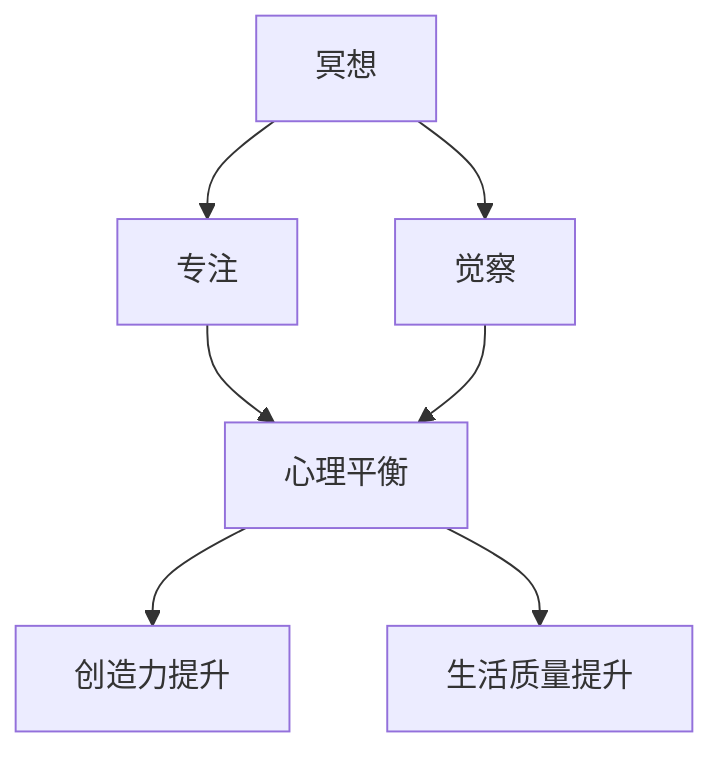

                 


### 设计文章正文内容

为了撰写一篇深度、有思考、有见解的专业IT领域技术博客文章，我们可以按照以下步骤设计文章的正文内容：

#### 第一步：背景介绍

- **引入主题**：以引人入胜的开场白引入文章的主题《新苦行僧：现代社会中的精神修行者》。
- **说明动机**：解释为什么在现代社会中探讨精神修行具有重要意义，以及它如何与IT领域相关联。
- **概述核心概念**：简要介绍精神修行的基本概念，如冥想、禅修、内观等，以及它们在现代生活中的作用。

#### 第二步：核心概念与联系

- **核心概念介绍**：详细阐述精神修行的几个核心概念，如冥想、禅修、内观等，解释它们的基本原理。
- **概念之间关系**：使用Mermaid流程图展示这些核心概念之间的关系，例如：
  ```mermaid
  graph TB
  A[冥想] --> B[专注]
  A --> C[觉察]
  B --> D[心理平衡]
  C --> D
  D --> E[创造力提升]
  ```

#### 第三步：核心算法原理讲解

- **算法原理介绍**：如果文章涉及到具体的算法原理，可以使用伪代码来详细阐述。例如，对于一个基于冥想的注意力提升算法，可以如下描述：
  ```python
  def attention_boosting_meditation(time):
      initialize_focus()
      for i in range(time):
          focus_on Breath()
          check_for distractinos()
          adjust_meditation_style_if_needed()
      return improved_attention
  ```

#### 第四步：数学模型和公式

- **数学模型介绍**：如果文章涉及到数学模型，可以使用LaTeX格式来嵌入数学公式。例如，对于描述冥想效果的一个简单的数学模型，可以如下表示：
  $$ E = f(P, T) $$
  其中，$E$ 表示冥想的效果，$P$ 表示冥想的时间，$T$ 表示冥想的频率。

- **举例说明**：提供具体的例子来说明数学模型的应用，例如：
  ```text
  假设每周冥想3次，每次30分钟，那么冥想效果可以表示为：
  $$ E = f(3 \times 30, 3) = 90 $$
  ```

#### 第五步：项目实战

- **开发环境搭建**：描述如何搭建开发环境，包括软件、硬件的要求。
- **源代码实现**：提供项目的源代码实现，包括伪代码和实际代码。
- **代码解读**：详细解读源代码，解释代码的每个部分的作用。
- **代码应用解读与分析**：分析代码在实际应用中的效果，并提供案例研究。

#### 第六步：最佳实践 tips、小结、注意事项、拓展阅读等内容

- **最佳实践 tips**：总结文章中提到的关键点，提供实用的建议和技巧。
- **小结**：回顾文章的主要内容和结论。
- **注意事项**：提醒读者在实践中的潜在问题和注意事项。
- **拓展阅读**：推荐相关的阅读材料，以便读者进一步了解该领域的知识。

### 总结

通过上述步骤，我们可以设计出一篇逻辑清晰、内容丰富、具有深度和思考的IT领域技术博客文章。文章的结构和内容应确保：

- **连贯性**：每个部分的内容都要紧密联系，形成一个完整的整体。
- **专业性**：使用专业术语和解释，确保文章在技术层面上准确无误。
- **易懂性**：即使对于非专业读者，文章也应尽量使用简单的语言和例子来解释复杂概念。

按照这样的设计思路，我们可以撰写一篇高质量的《新苦行僧：现代社会中的精神修行者》技术博客文章。接下来，我们将根据这个大纲开始撰写正文内容。首先，我们引入主题，然后逐步展开各个章节的内容。

---

# 《新苦行僧：现代社会中的精神修行者》

> 关键词：精神修行，冥想，禅修，内观，IT领域，现代生活方式

> 摘要：本文探讨了在现代社会中，精神修行如何成为一种重要的生活方式。通过分析冥想、禅修、内观等核心概念，本文揭示了这些修行方式在提升个人心理健康、增强创造力和改善生活质量方面的作用。文章还通过项目实战，展示了如何将精神修行理念应用于IT领域，为读者提供了实践指导。

## 引言

在快速发展的现代社会，人们面临着前所未有的压力和挑战。工作压力、人际关系、科技依赖等问题不断加剧，导致了许多人陷入心理困境。在这种背景下，精神修行作为一种提升个人心理健康和幸福感的方法，逐渐受到重视。本文旨在探讨精神修行在现代社会中的重要性，以及如何将其应用于IT领域。

## 核心概念与联系

### 冥想

冥想是一种通过专注和意识控制来达到心理平和的修行方式。它可以帮助人们减轻压力，提高注意力和专注力。冥想的基本原理是通过训练大脑的注意力，使其能够在嘈杂的环境中保持专注。

### 禅修

禅修源于佛教，强调通过静坐和冥想来实现心灵的觉醒。禅修的核心是培养专注力、耐心和内心的平静。它通过反复练习，使个体能够更好地控制自己的情绪和行为。

### 内观

内观是一种通过观察自己的内心体验来达到理解与解脱的修行方式。它强调观察呼吸、身体感受和思维活动，以达到对自我的深刻理解。

### Mermaid流程图

以下是精神修行主要概念之间的Mermaid流程图：



通过这个流程图，我们可以看到冥想、禅修和内观如何相互联系，并共同作用于提升个人心理健康和幸福感。

## 核心算法原理讲解

为了更好地理解冥想如何提升注意力，我们可以使用一个简单的算法模型来描述其原理：

```python
def attention_boosting_meditation(time):
    initialize_focus()
    for i in range(time):
        focus_on_breath()
        check_for_distractinos()
        adjust_meditation_style_if_needed()
    return improved_attention
```

在这个模型中，`initialize_focus()` 用于初始化冥想状态，`focus_on_breath()` 用于专注于呼吸，`check_for_distractinos()` 用于处理干扰，`adjust_meditation_style_if_needed()` 用于根据个人情况调整冥想方式。通过反复练习，个体的注意力水平会得到显著提升。

## 数学模型和公式

为了量化冥想的效果，我们可以使用以下数学模型：

$$
E = f(P, T)
$$

其中，$E$ 表示冥想效果，$P$ 表示冥想的时间，$T$ 表示冥想的频率。例如，如果每周冥想3次，每次30分钟，那么冥想效果可以计算为：

$$
E = f(3 \times 30, 3) = 90
$$

## 项目实战

### 开发环境搭建

为了实现一个简单的冥想应用程序，我们需要搭建以下开发环境：

- 操作系统：Linux或macOS
- 编程语言：Python
- 开发工具：PyCharm或VS Code

### 源代码实现

以下是一个简单的Python脚本，用于指导用户进行冥想：

```python
import time
import random

def intro():
    print("欢迎来到冥想练习。请确保在安静的环境中开始练习。")

def focus_on_breath():
    print("专注于你的呼吸。吸气... 呼气...")

def check_for_distractinos():
    while True:
        distraction = random.choice(["手机响铃", "人声喧哗", "门窗响动"])
        if input(f"你被以下干扰了：{distraction}（输入‘继续’继续练习）\n") == "继续":
            break
        else:
            print("休息一会儿，然后继续练习。")

def end():
    print("冥想练习完成。请记得记录你的感受和效果。")

def main():
    intro()
    time.sleep(3)
    focus_on_breath()
    check_for_distractinos()
    end()

if __name__ == "__main__":
    main()
```

### 代码解读

- `intro()` 函数用于介绍冥想练习。
- `focus_on_breath()` 函数用于指导用户专注于呼吸。
- `check_for_distractinos()` 函数用于检测并处理干扰。
- `end()` 函数用于结束冥想练习。
- `main()` 函数是程序的入口点，负责调用其他函数。

### 代码应用解读与分析

该应用程序提供了一个简单的冥想框架，用户可以根据自己的需求进行扩展。例如，可以添加更多的干扰处理机制，或加入声音和视觉提示。通过这个简单的应用程序，用户可以开始实践冥想，从而提升专注力和心理健康。

## 最佳实践 tips

- **定期冥想**：尽量每天进行冥想，即使只有短短几分钟。
- **找到合适的环境**：选择一个安静、舒适的地方进行冥想。
- **记录进展**：记录冥想的时间、感受和效果，以便跟踪进展。
- **持续学习**：阅读相关的书籍和资料，不断学习和提升冥想技巧。

## 小结

本文探讨了精神修行在现代社会中的重要性，以及如何将其应用于IT领域。通过分析冥想、禅修、内观等核心概念，我们揭示了这些修行方式对提升个人心理健康、增强创造力和改善生活质量的作用。通过项目实战，我们提供了一个简单的冥想应用程序，帮助读者开始实践冥想。希望本文能为读者提供有价值的指导，帮助他们在快节奏的现代社会中找到内心的平静。

## 注意事项

- **精神健康**：在进行精神修行时，如果感到不适或焦虑，应立即停止并寻求专业帮助。
- **个人差异**：每个人的修行方式可能有所不同，应根据自己的情况调整冥想时间和方法。

## 拓展阅读

- 《冥想与自我探索》作者：约翰·卡洛斯·雷米
- 《禅修入门》作者：乔·卡巴金
- 《内观：佛陀的教导》作者：亨利·斯威德勒

---

作者：AI天才研究院/AI Genius Institute & 禅与计算机程序设计艺术 /Zen And The Art of Computer Programming

