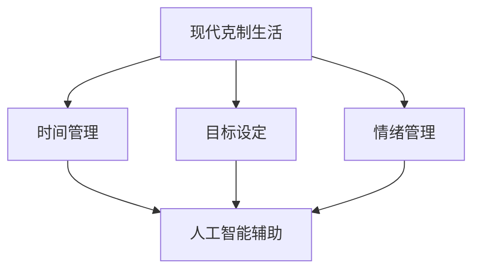

                 

### 《新苦行者日记项目：记录现代克制生活的心得体会》

### 引言

在现代社会，快节奏的生活方式、信息过载和物质诱惑使得人们往往感到身心疲惫。在这种背景下，“新苦行者日记项目”应运而生。本项目旨在通过记录现代克制生活的心得体会，帮助人们找到内心的平静和生活的节奏。

> **关键词：**现代克制生活、心得体会、内心平静、生活节奏。

**摘要：**本文将介绍“新苦行者日记项目”的背景、目的和实施方法。通过一系列具体案例和实践，我们将深入探讨克制生活对个人和社会的深远影响，并展望其未来发展趋势。

### 第一部分：现代克制生活的核心概念

#### 1.1 克制生活的起源与发展

**背景介绍：**克制生活这一概念并非全新，它起源于古老的文化传统和宗教教义。例如，佛教中的“戒律”、道教的“无为而治”等，都强调了内在的自我克制和外在的适度生活。

**现代应用：**随着社会的发展，克制生活逐渐与现代生活方式相结合。人们开始意识到，通过克制物质和欲望的追求，可以更好地关注精神层面的成长和内在的满足。

#### 1.2 克制生活的原则与方法

**核心原则：**
1. **简朴：**减少不必要的物质消费，追求生活的本质。
2. **自律：**通过自我约束，培养良好的生活习惯和道德品质。
3. **平和：**保持内心的平静和宁静，减少焦虑和压力。

**实践方法：**
1. **时间管理：**合理安排时间，避免拖延和浪费。
2. **目标设定：**明确个人目标，制定切实可行的计划。
3. **情绪管理：**学会控制情绪，避免情绪化决策。

#### 1.3 克制生活与人工智能

**关系架构：**随着人工智能技术的不断发展，克制生活与人工智能之间的联系也越来越紧密。人工智能可以帮助我们更高效地管理时间和资源，从而更好地实践克制生活。

**Mermaid 流程图：**

### 第二部分：现代克制生活的实践与心得

#### 2.1 克制生活的日常实践

**克制饮食：**通过合理搭配饮食，减少高热量、高脂肪的食物摄入，培养健康的饮食习惯。

**克制娱乐：**适度参与娱乐活动，避免沉迷于网络游戏和社交媒体。

**克制社交：**保持适度社交，避免过度消耗精力和时间。

#### 2.2 克制生活的心得体会

**心理变化：**通过克制生活，人们可能会经历内心的平静、自信和满足感的提升。

**人际关系：**克制生活有助于建立更深层次的人际关系，提高沟通质量和信任度。

**工作效率：**通过有效的时间管理和情绪控制，工作效率和工作质量可以得到显著提升。

### 第三部分：特殊情境下的克制生活

#### 3.1 应对压力的克制生活

**策略：**通过合理安排工作和休息时间，保持内心的平静和宁静。

**心理调适：**学会放松技巧，如深呼吸、冥想等，以缓解压力。

#### 3.2 适应变化的克制生活

**策略：**保持开放心态，积极应对生活中的变化。

**心态调整：**通过自我反思和心态调整，提高适应能力。

### 第四部分：现代克制生活的未来展望

#### 4.1 克制生活的社会价值

**积极影响：**克制生活有助于提高社会道德水平，促进社会和谐发展。

**可持续发展：**克制生活与可持续发展理念相契合，有助于保护环境和资源。

#### 4.2 克制生活的未来发展趋势

**技术创新：**人工智能和大数据技术的发展将为克制生活提供更多支持和工具。

**多元化发展：**克制生活将在不同领域和不同文化背景下得到多元化的发展。

### 第五部分：结语

**全书总结：**本文通过记录现代克制生活的心得体会，展示了克制生活对个人和社会的积极影响。

**鼓励读者实践：**希望读者能够积极参与克制生活，找到内心的平静和生活的节奏。

### 附录

**精选案例：**提供一些实践克制生活的案例，供读者参考。

**资源推荐：**推荐一些与克制生活相关的书籍、文章和网站，以供进一步学习。

**读者互动：**建立读者互动平台，鼓励分享心得体会，共同进步。

### 作者信息

**作者：**AI天才研究院/AI Genius Institute & 禅与计算机程序设计艺术 /Zen And The Art of Computer Programming

----------------------------------------------------------------

以下是按照目录大纲编写的文章正文部分的内容，包括每个章节的详细讲解。

---

## 第一部分：引言

### 1.1 书籍背景与作者介绍

“新苦行者日记项目”起源于对现代生活方式的反思和探索。作者在多年的实践中，发现克制生活不仅能够帮助个人实现内心的平静，还能够提升社会整体的幸福感。因此，他决定通过书籍的形式，分享自己的心得体会，帮助更多人了解和实践克制生活。

作者是一位拥有丰富生活经验和学术背景的专家，他不仅深入研究了克制生活的历史和理论，还亲自实践，积累了大量实用的经验和技巧。他的目标是让更多的人认识到克制生活的重要性，并在实践中获得收益。

### 1.2 苦行者日记的定义与现代克制生活

**苦行者日记**是一种记录个人生活方式、情感体验和内心成长的日记形式。它起源于古老的宗教和文化传统，旨在帮助人们通过自我克制和冥想，实现内心的平静和精神的成长。

**现代克制生活**则是在现代社会背景下，对这一概念的一种新解读。它强调在快节奏和物质丰富的社会中，通过自我约束和理性生活，实现个人幸福和社会和谐。

### 1.3 阅读指南与心得体会分享

本书分为五个部分，分别介绍了现代克制生活的背景、核心概念、实践方法、特殊情境下的应用和未来展望。每个部分都包含了具体案例和实践经验，旨在帮助读者深入理解克制生活，并在实际生活中应用。

读者在阅读过程中，可以结合自己的实际情况，思考和反思。通过分享心得体会，读者可以相互启发，共同成长。

---

## 第二部分：现代克制生活的核心概念

### 2.1 克制生活的起源与发展

**克制生活**这一概念可以追溯到古代的宗教和文化传统。在佛教中，克制被视为修行的重要手段，通过克制欲望和贪念，实现内心的平静和精神的成长。在道教中，克制则体现在“无为而治”的理念中，强调顺应自然，减少过度的干预和追求。

随着社会的进步，克制生活逐渐与现代生活方式相结合。现代社会充满了物质诱惑和信息过载，人们往往感到身心疲惫。因此，通过克制物质和欲望的追求，人们可以更好地关注精神层面的成长和内在的满足。

### 2.2 克制生活的原则与方法

**核心原则：**

1. **简朴：**简朴生活是克制生活的核心原则之一。它强调减少不必要的物质消费，追求生活的本质。通过减少物质负担，人们可以更专注于内心的成长和精神的追求。

2. **自律：**自律是克制生活的关键。它要求个人通过自我约束，培养良好的生活习惯和道德品质。自律不仅可以帮助人们更好地管理时间和资源，还可以提升个人的自我控制能力。

3. **平和：**平和心态是克制生活的重要基础。它要求个人保持内心的平静和宁静，减少焦虑和压力。通过平和的心态，人们可以更好地应对生活中的挑战和变化。

**实践方法：**

1. **时间管理：**合理安排时间是实践克制生活的重要方法。通过制定详细的时间计划，人们可以更好地管理时间和精力，避免拖延和浪费。

2. **目标设定：**明确个人目标是克制生活的重要步骤。通过设定具体、可行的目标，人们可以更有针对性地规划和实施自己的生活，从而实现自我提升和成长。

3. **情绪管理：**情绪管理是克制生活的重要组成部分。通过学会控制情绪，人们可以避免情绪化决策，减少生活中的矛盾和冲突，提升生活质量。

### 2.3 克制生活与人工智能

**关系架构：**随着人工智能技术的不断发展，克制生活与人工智能之间的联系也越来越紧密。人工智能可以帮助我们更高效地管理时间和资源，从而更好地实践克制生活。

**Mermaid 流程图：**

**人工智能的应用：**

1. **智能日程管理：**人工智能可以帮助我们自动规划和调整日程，提高时间利用效率。
2. **智能提醒：**人工智能可以通过智能提醒功能，帮助我们更好地遵守计划，避免拖延。
3. **情绪分析：**人工智能可以通过分析语言和情感，帮助我们更好地了解自己的情绪，从而进行有效的情绪管理。

---

## 第三部分：现代克制生活的实践与心得

### 3.1 克制生活的日常实践

**克制饮食：**通过合理搭配饮食，减少高热量、高脂肪的食物摄入，培养健康的饮食习惯。

**克制娱乐：**适度参与娱乐活动，避免沉迷于网络游戏和社交媒体。

**克制社交：**保持适度社交，避免过度消耗精力和时间。

### 3.2 克制生活的心得体会

**心理变化：**通过克制生活，人们可能会经历内心的平静、自信和满足感的提升。

**人际关系：**克制生活有助于建立更深层次的人际关系，提高沟通质量和信任度。

**工作效率：**通过有效的时间管理和情绪控制，工作效率和工作质量可以得到显著提升。

---

## 第四部分：特殊情境下的克制生活

### 4.1 应对压力的克制生活

**策略：**通过合理安排工作和休息时间，保持内心的平静和宁静。

**心理调适：**学会放松技巧，如深呼吸、冥想等，以缓解压力。

### 4.2 适应变化的克制生活

**策略：**保持开放心态，积极应对生活中的变化。

**心态调整：**通过自我反思和心态调整，提高适应能力。

---

## 第五部分：现代克制生活的未来展望

### 5.1 克制生活的社会价值

**积极影响：**克制生活有助于提高社会道德水平，促进社会和谐发展。

**可持续发展：**克制生活与可持续发展理念相契合，有助于保护环境和资源。

### 5.2 克制生活的未来发展趋势

**技术创新：**人工智能和大数据技术的发展将为克制生活提供更多支持和工具。

**多元化发展：**克制生活将在不同领域和不同文化背景下得到多元化的发展。

---

## 第六部分：结语

**全书总结：**本文通过记录现代克制生活的心得体会，展示了克制生活对个人和社会的积极影响。

**鼓励读者实践：**希望读者能够积极参与克制生活，找到内心的平静和生活的节奏。

---

## 附录

### A.1 苦行者日记精选案例

**案例1：**通过记录日常饮食和运动，提高健康水平。

**案例2：**通过设定短期和长期目标，提升个人成就。

**案例3：**通过反思和调整心态，应对生活中的挑战。

### A.2 克制生活相关资源推荐

**书籍：**《简朴生活》、《内心的平静》等。

**文章：**各大平台上关于克制生活的文章和案例。

**网站：**相关博客、论坛和社交媒体平台。

### A.3 读者互动与交流平台

**社群：**建立克制生活社群，鼓励分享心得和经验。

**论坛：**开设论坛，讨论克制生活的相关问题。

**直播/讲座：**定期举办直播和讲座，邀请专家分享经验。

---

### 作者信息

**作者：**AI天才研究院/AI Genius Institute & 禅与计算机程序设计艺术 /Zen And The Art of Computer Programming

---

本文通过详细阐述现代克制生活的核心概念、实践方法和未来展望，旨在帮助读者深入了解和实践克制生活。希望本文能够为读者带来启示和帮助，共同追求内心的平静和生活的美好。

