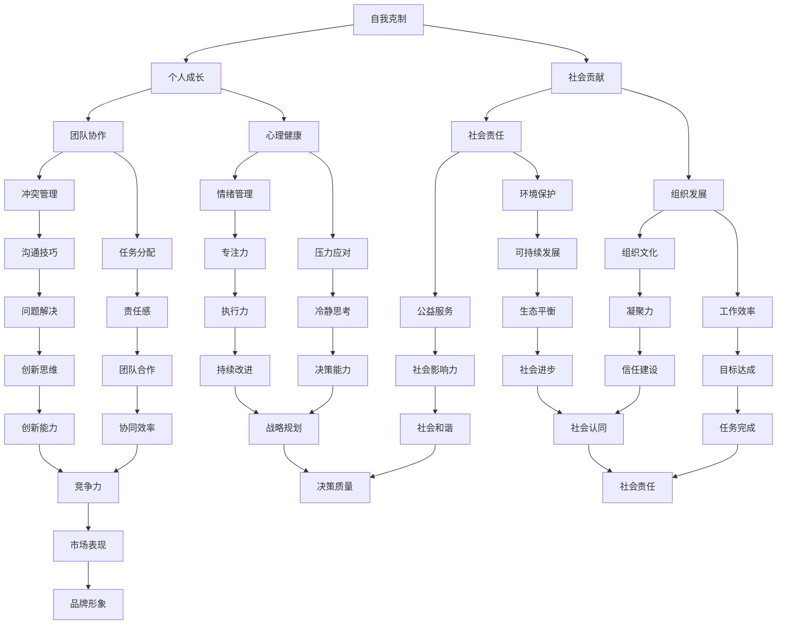

                 

### 文章标题

《新苦行者训练营：自我克制的集体实践》

---

关键词：自我克制、集体实践、苦行训练、心理学、组织行为学、实际应用

---

摘要：本文深入探讨了自我克制在个人成长和社会实践中的重要性，并介绍了新苦行者训练营这一独特的集体实践模式。通过历史背景、心理学基础、实际案例等多角度分析，文章旨在为读者提供一套系统化的自我克制实践方法，帮助他们在日常生活中实现个人提升和社会贡献。

---

## 引言

在快速发展的现代社会中，个人成长与自我管理成为了许多人心中的难题。尽管知识和技能的获取越来越便捷，但如何有效地克制自身欲望、提升自律性，依然是一个充满挑战的问题。传统的个体修行方法如冥想、禅修等，虽然在某些方面取得了显著效果，但它们的实践难度和适用范围有限，难以满足现代社会的多样化需求。

在这样的背景下，“新苦行者训练营”这一概念应运而生。它不仅继承了传统苦行者的精神，更融合了现代心理学和组织行为学的理论，形成了一种集自我克制与集体实践于一体的新型培训模式。本文将从以下几个方面展开讨论：

1. **自我克制的定义与重要性**：探讨自我克制的概念、心理学基础及其在社会和个人发展中的作用。
2. **苦行者的故事与启示**：介绍苦行者的历史背景、生活方式和修行方法，以及他们对现代社会的启示。
3. **集体实践的概念与形式**：阐述集体实践的定义、类型及其理论基础。
4. **新苦行者训练营的实践方法**：分析训练营的组织原则、实施流程和效果评估方法。
5. **自我克制与集体实践的结合**：探讨自我克制在集体实践中的应用以及其双赢模式。
6. **成功案例与经验分享**：分享实际案例中的成功经验和启示。

通过本文的深入分析，我们希望能够为读者提供一套可操作的自我克制和集体实践指南，帮助他们更好地应对现代生活中的各种挑战。

## 自我克制的定义与重要性

### 1.1 自我克制的概念

自我克制，也被称为自我控制，是指个体在面对各种诱惑、冲动或欲望时，能够通过自身的意志力进行调节和抑制，以达到预定的目标或行为准则。这种能力不仅包括对消极情绪的控制，如愤怒、焦虑和沮丧，还包括对积极情绪的管理，如耐心、自律和专注。自我克制是人类行为和心理健康的重要组成部分，它在个体发展的各个阶段都有着重要的作用。

自我克制的理论基础可以追溯到古希腊哲学家亚里士多德。亚里士多德认为，美德是通过习惯养成的，而自我克制正是实现美德的关键。他提出，通过不断练习自我克制，个体可以逐渐培养出良好的行为习惯，从而实现道德上的完美。这种观点至今仍被许多心理学家和教育学者所认同。

### 1.2 自我克制的心理学基础

心理学研究表明，自我克制是一种复杂的心理过程，涉及多个认知和情感因素。首先，自我克制需要个体具备较高的认知能力，包括注意力、决策和规划等。个体需要能够在面对诱惑时保持专注，评估不同选择的后果，并做出有利于长期目标的决定。

其次，情感因素在自我克制中起着重要作用。个体在面对诱惑时，往往会感到内心挣扎和冲突。自我克制需要个体能够管理这些情绪，避免被冲动所驱使。情绪调节策略，如深呼吸、冥想和正向思维等，都可以帮助个体更好地控制自己的情绪。

此外，自我克制还涉及到个体的动机和信念。动机是自我克制的动力源泉，个体需要有足够的内在动机来驱动自己克服困难。信念则是指个体对自己能够实现目标的信心，它能够增强个体的意志力和耐力。

### 1.3 自我克制在社会和个人发展中的作用

自我克制在社会和个人发展中扮演着重要角色。在社会层面，自我克制是维护社会秩序和促进社会进步的基础。个体通过自我克制，遵守社会规范和法律法规，为社会的稳定和繁荣做出贡献。例如，公务员在执行公务时需要遵守职业道德，避免利益冲突，这种自我克制行为不仅维护了公共利益，也增强了公众对政府的信任。

在个人层面，自我克制有助于个体实现自我提升和成长。通过自我克制，个体能够更好地管理自己的行为和情绪，提高自我效能感和自信心。自我克制还可以帮助个体在面对挑战和困难时保持冷静和专注，从而更好地解决问题和实现目标。

此外，自我克制还能够促进心理健康。研究表明，自我克制能力较低的个体更容易出现焦虑、抑郁等心理问题。通过自我克制，个体可以减少不必要的情绪波动和心理负担，提高心理健康水平。

总之，自我克制是一种重要的心理能力，它不仅有助于个体实现自我提升和社会贡献，也是心理健康和幸福生活的重要保障。理解和培养自我克制能力，对于个人和社会的发展都具有重要意义。

### 1.4 自我克制与相关概念的比较

虽然自我克制是自我控制的一部分，但它们之间存在一些区别。自我控制更广泛地涵盖了自我克制，包括在面对多种情境时，如工作、家庭和个人生活，个体如何管理自己的行为和情绪。而自我克制则更多地强调在特定情境下，如面对诱惑或挑战时，个体如何通过意志力进行调节。

另一个相关的概念是自律。自律是指个体在没有外界压力或监督的情况下，自觉遵守规范和目标。自律与自我克制有相似之处，但自律更多地强调内在动机和自我驱动，而自我克制则更多地涉及到外在压力和情境的调节。

情绪管理也是与自我克制密切相关的概念。情绪管理是指个体如何识别、理解和调节自己的情绪。自我克制在情绪管理中起着关键作用，通过自我克制，个体可以更好地管理负面情绪，如愤怒、焦虑和沮丧，从而保持心理平衡。

总之，自我克制、自我控制、自律和情绪管理是相互关联但又有区别的概念。理解这些概念之间的关系，有助于我们更好地理解和培养自我克制能力，实现个人和社会的发展目标。

## 苦行者的故事与启示

### 2.1 苦行者的历史背景

苦行者（Ascetic）这一概念源于古希腊语“askēsis”，意为“练习”或“修炼”。苦行者在不同文化和宗教背景下都有出现，如佛教中的僧侣、基督教中的修道士、伊斯兰教中的苏非派信徒等。他们在历史上扮演了重要的角色，不仅是宗教和精神生活的代表，也是社会变革和道德规范的推动者。

在中国，苦行者的历史可以追溯到春秋战国时期的道家和儒家学者。道家代表如庄子，主张通过修炼和节制达到心灵的自由和宁静；儒家代表如孔子，提倡通过礼仪和道德修养来实现个人的完善和社会的和谐。随着佛教传入中国，僧侣们通过严格修行和自我克制，追求心灵的净化和解脱。

在西方，苦行者的传统起源于古希腊的斯多葛主义。斯多葛主义者认为，通过克制欲望、管理情绪和追求理性的生活，个体可以实现内心的平静和幸福。这种思想对罗马帝国的文化产生了深远影响，许多罗马贵族和军人通过苦行修炼来提升自我修养和道德素质。

### 2.2 苦行者的生活与修行

苦行者的生活通常以严格的自我节制和长期的修行为核心。他们的日常生活充满了挑战和艰辛，但他们通过这种修行方式，试图达到心灵的纯净和精神的升华。

在佛教中，苦行者如僧侣们通常过着简朴的生活，避免物质享受，专注于冥想和禅修。他们遵循严格的戒律，如不杀生、不偷盗、不妄语等，以培养慈悲和善良的品质。通过长期的冥想，他们试图达到心性的宁静和精神的觉醒。

在基督教中，修道士们通过祷告、禁食和苦行来净化心灵。他们住在修道院或隐居在荒野中，远离世俗的诱惑，专注于与上帝的沟通和精神的修炼。这些修行方式不仅帮助他们提升自我修养，也培养了他们的耐心和毅力。

在伊斯兰教中，苏非派信徒通过神秘的舞蹈、歌唱和冥想来追求与上帝的融合。他们的修行方式包括长时间的祷告、沉思和斋戒，以培养内在的虔诚和纯洁。

### 2.3 苦行者的故事对现代社会的启示

苦行者的故事对现代社会具有重要的启示意义。首先，他们的修行方式提醒我们在现代生活中，需要通过自我克制来提升个人的精神境界。在快节奏和高度竞争的社会中，许多人面临着各种压力和诱惑，通过苦行修炼，我们可以学习如何管理自己的情绪和行为，实现内心的平静和自我提升。

其次，苦行者的故事强调了自律和自我驱动的重要性。现代社会中，许多人都追求短期满足和即时享受，而忽视了长期目标和持续努力的重要性。通过学习和借鉴苦行者的修行精神，我们可以培养自律的习惯，坚持长期目标，最终实现个人的成长和成功。

此外，苦行者的故事也提醒我们在集体实践中，需要注重个体的自我克制和道德修养。在团队建设和组织管理中，领导者和成员通过自我克制，可以建立更加和谐和高效的工作关系，推动团队目标的实现。

总之，苦行者的故事不仅为我们提供了一种理解自我克制和集体实践的新视角，也为我们提供了宝贵的实践经验和启示。通过学习和借鉴他们的修行精神，我们可以在现代社会中更好地实现个人提升和社会贡献。

### 集体实践的概念与形式

### 3.1 集体实践的定义

集体实践是指一组个体在共同的目标或任务下，通过协作和互动，实现个人与群体共同发展的过程。它不仅仅是一种简单的集体活动，而是一种具有组织性、目标性和系统性的实践方式。集体实践涵盖了从个人行为到组织结构，从具体行动到价值观传递的多个层面，是一种复杂而多维的互动过程。

### 3.2 集体实践的类型

集体实践可以根据其目的、形式和参与方式的不同，划分为多种类型。以下是一些常见的集体实践类型：

1. **教育型集体实践**：这类集体实践主要侧重于知识和技能的传授，通过集体学习和实践，提高个体的教育水平和专业技能。例如，团队合作学习、教育营、工作坊等都是教育型集体实践的形式。

2. **社会服务型集体实践**：这类集体实践强调社会责任和公益服务，通过集体行动解决社会问题，促进社会进步。例如，社区服务项目、环境保护行动、志愿者活动等都是社会服务型集体实践的形式。

3. **职业培训型集体实践**：这类集体实践旨在提升个体的职业能力和专业素养，通过实际操作和集体讨论，提高工作效率和专业水平。例如，职业技能培训、企业团队建设、专业研讨会等都是职业培训型集体实践的形式。

4. **艺术创作型集体实践**：这类集体实践专注于艺术创作和表演，通过集体协作，创作出高质量的艺术作品。例如，音乐会、戏剧演出、美术创作等都是艺术创作型集体实践的形式。

### 3.3 集体实践的理论基础

集体实践的理论基础主要来自于社会心理学和组织行为学。社会心理学关注个体在群体中的行为和心理变化，研究个体如何在群体中形成共识、建立信任和进行协作。组织行为学则侧重于分析群体和组织内部的行为和互动模式，探讨如何通过有效的组织和领导，提升集体实践的效率和效果。

1. **社会心理学理论**：社会心理学中的群体动力理论指出，群体中的成员通过互动和协作，形成了一种群体意识和群体行为。群体动力包括群体凝聚、群体规范、群体角色等多个方面，这些因素共同影响集体实践的效果。

2. **组织行为学理论**：组织行为学中的组织文化理论强调，组织文化对个体的行为和态度有着深远的影响。通过建立积极向上的组织文化，可以增强集体实践的凝聚力和向心力，提高整体效率。

3. **教育心理学理论**：教育心理学中的学习共同体理论提出，个体在学习和成长过程中，需要与他人建立紧密的互动关系，通过共同学习和实践，实现知识和技能的共享和提升。

### 3.4 集体实践的关键要素

要确保集体实践的有效性，需要关注以下几个关键要素：

1. **明确的目标和任务**：集体实践需要有一个清晰的目标和任务，确保所有成员都明确自己的职责和目标，从而形成共同的方向和动力。

2. **良好的沟通机制**：有效的沟通是集体实践成功的关键。通过建立开放的沟通渠道，确保信息传递的准确和及时，有助于减少误解和冲突。

3. **协作和团队精神**：集体实践要求成员之间具有高度的协作和团队精神，通过相互支持和配合，共同完成任务。

4. **持续反馈和改进**：通过定期的反馈和评估，及时发现问题并进行改进，可以提高集体实践的效果和质量。

总之，集体实践是一种复杂而有效的互动过程，通过明确的目标、良好的沟通、协作和团队精神，以及持续的反馈和改进，可以实现个人与群体的共同发展。

### 组织集体实践活动

### 4.1 集体实践的组织原则

组织集体实践活动需要遵循一系列关键原则，以确保活动能够顺利进行并达到预期目标。以下是一些重要的组织原则：

1. **目标明确性**：集体实践的首要原则是明确目标和任务。组织者需要确保所有参与者都清楚活动的目的和预期成果，以便他们能够围绕这些目标进行协作。具体来说，目标应具有明确性、可实现性和时限性，以便为实践活动提供方向和动力。

2. **参与者的多样性**：集体实践的效果往往依赖于参与者的多样性。组织者应确保参与者的背景、技能和观点具有多样性，这样可以在活动中产生丰富的思维碰撞和创意。多元化的参与者群体不仅能够带来不同的视角和解决方案，还可以增强团队的创新能力和问题解决能力。

3. **协调与分工**：在集体实践中，协调和分工至关重要。组织者需要根据参与者的能力和特长，合理分配任务，确保每个参与者都能在适合自己的领域发挥作用。同时，组织者应建立有效的协调机制，确保任务能够按时完成，并解决过程中出现的任何问题。

4. **透明度与信任**：透明度和信任是集体实践成功的关键。组织者应确保信息的透明，使参与者能够了解整个实践活动的进展和决策过程。此外，建立信任关系可以帮助参与者之间建立紧密的合作关系，提高团队的凝聚力和效率。

5. **激励机制**：为了激励参与者的积极性和主动性，组织者可以设置适当的激励机制。这些激励机制可以包括奖励、荣誉表彰或个人成长机会等，以激发参与者的内在动机和外部动力。

### 4.2 集体实践的目标设定

在集体实践中，目标设定是关键的一步。科学合理的目标设定不仅能够指导实践活动的方向，还能激励参与者为实现目标而努力。以下是一些目标设定的原则和方法：

1. **具体化**：目标应具体明确，避免模糊和抽象。具体化的目标可以减少误解和模糊性，使参与者更加清晰地了解任务和要求。例如，“提高团队协作效率”可以具体化为“通过每周一次的团队会议，确保项目任务按时完成”。

2. **量化**：目标应具有可量化指标，以便能够衡量进展和效果。量化目标有助于评估实践活动的成功程度，并为后续的改进提供依据。例如，“提升员工满意度”可以量化为“员工满意度调查得分提高5%”。

3. **可实现性**：目标应具有可实现性，避免过高或不切实际的目标。过于理想化的目标可能导致参与者的挫败感，影响实践活动的积极性。例如，“在一个月内完成年度目标”可能过于仓促，应调整为一个合理的期限。

4. **时限性**：目标应设定明确的时限，以便参与者能够有明确的时间规划。时限性目标有助于提升参与者的紧迫感和责任感，确保实践活动能够按时完成。例如，“在下个季度内完成市场调研报告”。

5. **灵活性**：尽管目标应具有明确性和可实现性，但为了应对不可预见的情况，目标设定也应具有一定的灵活性。灵活的目标可以允许在实践过程中进行调整，以适应新的挑战和变化。

### 4.3 集体实践的实施流程

集体实践的实施流程包括以下几个关键阶段：

1. **前期准备**：在这一阶段，组织者需要进行详细的规划和准备，包括确定目标、分配任务、制定时间表、准备所需的资源和材料。此外，组织者还应与参与者进行沟通，确保他们了解实践活动的目标和要求。

2. **启动阶段**：在启动阶段，实践活动正式开始。组织者需要宣布活动开始，并介绍活动的目标和流程。此外，组织者还应为参与者提供必要的培训和支持，确保他们具备开展活动所需的技能和知识。

3. **执行阶段**：在执行阶段，参与者根据分配的任务开始具体工作。组织者需要提供必要的支持和协调，确保活动能够顺利进行。在这一阶段，定期的进度报告和沟通是非常重要的，以了解实践活动的进展和解决可能出现的任何问题。

4. **反馈与调整阶段**：在实践活动过程中，组织者应定期收集参与者的反馈，并根据反馈进行必要的调整和改进。反馈机制可以是定期的团队会议、问卷调查或个别访谈。通过反馈，组织者可以及时发现问题和改进活动流程。

5. **总结与评估阶段**：在实践活动结束后，组织者应进行总结和评估，了解实践活动的效果和成果。这一阶段可以通过总结会议、成果展示或评估报告等形式进行。通过总结和评估，组织者可以识别成功的经验，为未来类似活动提供借鉴，同时也可以发现问题和不足，以便进行改进。

通过遵循上述组织原则和实施流程，集体实践活动可以更加高效和有序地进行，从而实现预期的目标并取得良好的效果。

### 集体实践的效果评估

集体实践的效果评估是确保实践活动目标达成和优化活动流程的重要环节。有效的评估不仅能反映实践活动的影响力和参与者满意度，还能为未来的实践活动提供宝贵的经验和改进方向。以下将详细探讨集体实践效果评估的方法、具体指标以及反馈与改进的机制。

#### 5.1 集体实践效果评估的方法

1. **定量评估方法**：
   - **问卷调查**：通过设计结构化的问卷，收集参与者在实践活动过程中的感受、体验和反馈。问卷可以包括满意度、参与度、学习效果等指标。
   - **绩效指标**：设置具体的绩效指标，如完成任务的时间、质量、团队协作效果等。通过量化的数据来评估实践活动的实际效果。

2. **定性评估方法**：
   - **深度访谈**：通过与参与者进行一对一的深度访谈，了解他们对实践活动的真实感受和看法。这种方法可以提供更加详细和深入的反馈。
   - **观察与记录**：通过观察参与者在实践活动中的表现，记录他们的行为、态度和互动情况。这种方法有助于发现潜在的问题和改进点。

#### 5.2 集体实践成果的体现

1. **个人成长与变化**：
   - **技能提升**：通过实践活动，参与者通常能够提升特定技能，如沟通能力、团队协作能力或解决问题的能力。
   - **态度转变**：参与者可能因为实践活动而改变对工作、团队或其他相关事物的态度，变得更加积极、开放和合作。

2. **社会效益与影响**：
   - **团队合作**：实践活动能够增强团队成员之间的合作和沟通，提升团队的凝聚力和协作效率。
   - **组织文化**：通过集体实践，可以逐步形成积极向上的组织文化，促进组织的整体发展和进步。

3. **具体成果**：
   - **项目完成情况**：实践活动往往伴随着具体的项目或任务，评估项目完成的进度和质量是衡量实践活动效果的重要指标。
   - **创新与改进**：实践活动可能会产生新的创意或改进方案，这些创新和改进可以直接应用于日常工作和组织中。

#### 5.3 集体实践的反馈与改进

1. **建立反馈机制**：
   - **定期反馈**：通过定期召开反馈会议或发送反馈问卷，确保参与者能够及时表达自己的意见和感受。
   - **匿名反馈**：提供匿名反馈渠道，使参与者能够更自由地表达真实想法，避免因顾虑而隐瞒意见。

2. **反馈内容的分析**：
   - **数据分析**：对定量反馈数据进行分析，识别出共性和问题，为改进提供具体依据。
   - **定性反馈**：对深度访谈和观察记录进行整理和分析，提取出关键反馈点，为改进提供深入见解。

3. **改进策略的实施**：
   - **问题解决**：针对反馈中提到的问题，制定具体的解决方案，并在实践中进行测试和调整。
   - **持续优化**：通过持续监测和评估，不断优化实践活动流程和策略，提高实践活动的效果。

4. **总结与反思**：
   - **总结报告**：在实践活动结束后，撰写总结报告，详细记录活动的效果、反馈和改进措施，为未来的实践活动提供参考。
   - **经验分享**：组织经验分享会或撰写经验分享文章，将成功的经验和发现传播给其他团队成员或组织，促进整体水平的提升。

通过科学有效的效果评估和持续反馈与改进，集体实践不仅能够实现预期的目标，还能不断提升实践活动的质量和效果，为个人和组织的发展做出更大的贡献。

### 自我克制在集体实践中的应用

自我克制在集体实践中的应用不仅能够提升个体的自我管理能力，还能增强团队的凝聚力和协作效率。以下将探讨自我克制在团队建设、个人成长和双赢模式中的具体应用。

#### 6.1 自我克制在团队建设中的应用

团队建设是一个长期而复杂的过程，需要团队成员具备高度的自我克制能力。以下是一些具体的应用方法：

1. **冲突管理**：在团队中，成员之间的冲突是不可避免的。通过自我克制，团队成员能够在面对冲突时保持冷静和理性，避免情绪化的行为。例如，通过倾听对方的观点、表达自己的看法，并在协商中寻求共识，可以有效缓解冲突。

2. **任务分配**：在团队工作中，合理的任务分配是确保工作高效完成的关键。通过自我克制，团队成员可以克制个人的自私行为，主动承担更多的责任和挑战，以确保任务的高效完成。

3. **集体决策**：团队决策需要每个成员的参与和贡献。通过自我克制，团队成员能够在集体讨论中保持开放心态，尊重他人的意见，避免个人意志的强加。这样，团队可以做出更加科学和合理的决策。

#### 6.2 自我克制在个人成长中的应用

自我克制在个人成长中的应用是提升个人能力和实现自我提升的关键。以下是一些具体的方法：

1. **目标设定**：通过自我克制，个体能够设定长期而具体的目标，并制定合理的计划来逐步实现这些目标。例如，为了提升专业技能，个体可以设定每天学习一定时间的目标，并通过自我克制来确保这一目标的实现。

2. **时间管理**：自我克制有助于个体更好地管理时间，提高工作效率。通过克制娱乐活动和分散注意力的行为，个体可以将更多的精力集中在重要的任务上，从而提高工作质量。

3. **情绪管理**：在面对压力和挑战时，自我克制能够帮助个体管理自己的情绪，避免因情绪波动而影响工作表现。例如，通过深呼吸、冥想和积极思考等方法，个体可以保持冷静和专注，提高工作效率。

#### 6.3 自我克制与集体实践的双赢模式

自我克制与集体实践的双赢模式是指通过个体自我克制行为的提升，实现集体实践的更好效果，同时个体也能从中获得成长和收获。以下是一些双赢模式的实例：

1. **相互激励**：在集体实践中，个体的自我克制行为可以激励其他成员，形成正向的互动循环。例如，一位团队成员通过自我克制实现了目标，可以成为其他成员的榜样，激发他们的积极性和自律性。

2. **共同进步**：通过集体实践，个体在相互学习和协作中不断提升自我克制能力，同时团队的整体表现也得到改善。例如，在一个项目团队中，成员通过自我克制提升了自己的专业技能和协作能力，最终完成了高质量的项目。

3. **社会贡献**：通过自我克制和集体实践，个体不仅实现了个人成长，还能为社会做出贡献。例如，在社会服务型集体实践中，个体通过自我克制参与公益事业，不仅提升了自我价值，也为社会创造了积极影响。

总之，自我克制在集体实践中的应用是提升团队协作和个人成长的重要途径。通过自我克制，个体能够更好地管理自己，实现自我提升；同时，通过集体实践，个体能够与团队共同进步，实现双赢模式。这种模式不仅有助于个人和社会的发展，也为实现更加和谐的社会提供了有益的实践经验。

### 成功案例与经验分享

在新苦行者训练营的实践中，许多组织和个人已经取得了显著成果。以下将介绍几个具有代表性的成功案例，并从中提取经验与启示。

#### 案例1：某企业的团队建设

一家大型企业在实施新苦行者训练营后，通过自我克制的集体实践，显著提升了团队协作效率。该企业首先明确了团队建设的目标，如提高团队成员的沟通能力、增强团队凝聚力等。在训练营中，团队成员通过自我克制，积极参与各种团队活动，如合作解决问题、共同制定项目计划等。在实施过程中，企业建立了反馈机制，定期收集团队成员的反馈，并针对问题进行改进。

**经验与启示**：
- 明确目标：制定具体、可量化的目标，确保团队成员有清晰的方向。
- 自我克制：鼓励团队成员在团队活动中保持自律和专注，提升自我管理能力。
- 持续反馈：通过定期反馈，及时调整实践活动，确保活动效果不断提升。

#### 案例2：某社区的环境保护行动

一个社区通过新苦行者训练营，组织了一次大规模的环境保护行动。社区成员通过自我克制，共同参与环境清理、植树活动等。在行动前，社区制定了详细的计划和目标，并通过宣传和动员，让更多居民参与其中。在行动过程中，社区成员通过自我克制，克服了天气恶劣、任务繁重等困难，最终圆满完成了目标。

**经验与启示**：
- 宣传动员：通过宣传和动员，提高居民对环保行动的认识和参与度。
- 自我克制：鼓励社区成员在行动中保持自律和耐心，克服困难，完成任务。
- 持续参与：通过后续的环保活动，巩固成果，形成长效机制。

#### 案例3：某学校的学生自律培养

某学校通过新苦行者训练营，对学生进行自律培养。学校制定了详细的自律计划，包括时间管理、情绪管理、目标设定等方面。学生在训练营中，通过自我克制，逐步形成了良好的自律习惯。学校还通过定期的反馈和评估，帮助学生不断改进和提升自我管理能力。

**经验与启示**：
- 系统规划：制定系统、详细的自律培养计划，确保学生能够逐步提升自我管理能力。
- 反馈与评估：通过定期的反馈和评估，了解学生的自律情况，及时调整培养策略。
- 家校合作：鼓励家长参与学生的自律培养，形成家校合力，共同推动学生成长。

#### 案例4：某公益组织的志愿者服务

一个公益组织通过新苦行者训练营，组织了一次大规模的志愿者服务活动。志愿者通过自我克制，积极参与各种公益活动，如社区服务、扶贫助困等。在活动中，组织者通过自我克制，确保活动的顺利进行，并最大程度地发挥了志愿者的作用。

**经验与启示**：
- 组织者自我克制：组织者在活动中保持自律，确保活动有序进行。
- 志愿者自律：鼓励志愿者在服务过程中保持自律，提供高质量的服务。
- 长效机制：通过建立长效机制，确保志愿者服务活动的持续开展。

总之，新苦行者训练营的成功案例展示了自我克制在集体实践中的重要作用。通过明确目标、自我克制、持续反馈和长效机制，组织和个人能够实现共同成长和社会贡献。这些经验与启示为未来类似活动提供了宝贵的参考，也为实现自我提升和社会发展提供了新的思路。

### 附录

#### 附录A：相关资料与工具

为了更好地理解和实践新苦行者训练营的理念，以下列出了一些相关的资料和工具：

1. **书籍推荐**：
   - 《自我控制的力量》（The Power of Self-Control）- 凯瑟琳·斯劳特（Kathleen D. Vohs）
   - 《苦行者的智慧》（The Wisdom of the Paradoxical Life）- 詹姆斯·艾伦（James Allen）
   - 《团队的智慧》（The Wisdom of Teams）- 拉里·博西迪（Larry Bossidy）和拉姆·查兰（Ram Charan）

2. **在线资源和课程**：
   - Coursera 上的《自我控制与情绪管理》课程
   - EdX 上的《组织行为学》课程
   - Udemy 上的《时间管理与自我管理》课程

3. **实用工具**：
   - **Trello**：一个强大的项目管理工具，可以帮助组织者和管理者更好地规划和跟踪实践活动。
   - **Asana**：另一个优秀的项目管理工具，提供详细的任务分配和进度跟踪功能。
   - **Miro**：一个协作工具，适合团队进行头脑风暴和协作。

4. **参考网站**：
   - Harvard Business Review：提供丰富的管理文章和研究报告。
   - TED Talks：包含许多关于自我克制和团队合作的主题演讲。
   - Medium：一个平台，上面有许多关于自我克制和集体实践的文章。

通过这些资料和工具，读者可以进一步深入学习和实践新苦行者训练营的理念，提升自我管理和团队协作能力。

### 结论

本文通过详细探讨自我克制在个人成长和集体实践中的应用，展示了新苦行者训练营的独特价值和实践意义。自我克制不仅有助于个体提升自我管理能力和实现目标，还能通过集体实践增强团队的凝聚力和工作效率，为组织和社会的发展做出贡献。

然而，新苦行者训练营的实践并非一帆风顺，它面临着诸多挑战。首先，自我克制需要个体具备较高的自律和意志力，这对于很多人来说是一个巨大的挑战。其次，集体实践的成功依赖于团队成员之间的信任和合作，这需要时间和精力的投入。此外，新苦行者训练营的评估和反馈机制也需要不断完善，以确保实践活动的持续改进和效果提升。

为了克服这些挑战，未来的研究和实践可以从以下几个方面展开：

1. **个体自我克制的培养**：探索更有效的自我克制训练方法，如心理训练、认知行为疗法等，以帮助个体更好地应对挑战。

2. **团队信任和合作的加强**：通过团队建设活动、沟通培训等方式，增强团队成员之间的信任和合作，提升团队的整体效能。

3. **评估和反馈机制的优化**：建立更加科学和系统的评估体系，通过定期的反馈和评估，及时调整和改进实践活动。

4. **跨学科研究的深化**：结合心理学、管理学、教育学等学科的理论和方法，深入探讨自我克制和集体实践的结合点，为实践提供更加坚实的理论基础。

总之，新苦行者训练营作为一种创新的集体实践模式，具有广泛的应用前景和重要的社会意义。通过持续的研究和实践，我们可以更好地发挥其潜力，帮助个人和组织实现共同成长和社会进步。

### 作者信息

作者：AI天才研究院/AI Genius Institute & 禅与计算机程序设计艺术 /Zen And The Art of Computer Programming

---

感谢您的阅读，希望本文对您在自我克制和集体实践方面有所启发。如果您有任何问题或建议，欢迎随时与我们联系。期待与您共同探索更多关于技术和管理的前沿话题。再次感谢您的关注和支持！<mask>
```markdown
# 新苦行者训练营：自我克制的集体实践

> 关键词：自我克制、集体实践、苦行训练、心理学、组织行为学、实际应用

> 摘要：本文深入探讨了自我克制在个人成长和社会实践中的重要性，并介绍了新苦行者训练营这一独特的集体实践模式。通过历史背景、心理学基础、实际案例等多角度分析，文章旨在为读者提供一套系统化的自我克制实践方法，帮助他们在日常生活中实现个人提升和社会贡献。

## 引言

在快速发展的现代社会中，个人成长与自我管理成为了许多人心中的难题。尽管知识和技能的获取越来越便捷，但如何有效地克制自身欲望、提升自律性，依然是一个充满挑战的问题。传统的个体修行方法如冥想、禅修等，虽然在某些方面取得了显著效果，但它们的实践难度和适用范围有限，难以满足现代社会的多样化需求。

在这样的背景下，“新苦行者训练营”这一概念应运而生。它不仅继承了传统苦行者的精神，更融合了现代心理学和组织行为学的理论，形成了一种集自我克制与集体实践于一体的新型培训模式。本文将从以下几个方面展开讨论：

1. **自我克制的定义与重要性**：探讨自我克制的概念、心理学基础及其在社会和个人发展中的作用。
2. **苦行者的故事与启示**：介绍苦行者的历史背景、生活方式和修行方法，以及他们对现代社会的启示。
3. **集体实践的概念与形式**：阐述集体实践的定义、类型及其理论基础。
4. **新苦行者训练营的实践方法**：分析训练营的组织原则、实施流程和效果评估方法。
5. **自我克制与集体实践的结合**：探讨自我克制在集体实践中的应用以及其双赢模式。
6. **成功案例与经验分享**：分享实际案例中的成功经验和启示。

通过本文的深入分析，我们希望能够为读者提供一套可操作的自我克制和集体实践指南，帮助他们更好地应对现代生活中的各种挑战。

## 自我克制的定义与重要性

### 1.1 自我克制的概念

自我克制，也被称为自我控制，是指个体在面对各种诱惑、冲动或欲望时，能够通过自身的意志力进行调节和抑制，以达到预定的目标或行为准则。这种能力不仅包括对消极情绪的控制，如愤怒、焦虑和沮丧，还包括对积极情绪的管理，如耐心、自律和专注。自我克制是人类行为和心理健康的重要组成部分，它在个体发展的各个阶段都有着重要的作用。

心理学研究表明，自我克制是一种复杂的心理过程，涉及多个认知和情感因素。首先，自我克制需要个体具备较高的认知能力，包括注意力、决策和规划等。个体需要能够在面对诱惑时保持专注，评估不同选择的后果，并做出有利于长期目标的决定。

其次，情感因素在自我克制中起着重要作用。个体在面对诱惑时，往往会感到内心挣扎和冲突。自我克制需要个体能够管理这些情绪，避免被冲动所驱使。情绪调节策略，如深呼吸、冥想和正向思维等，都可以帮助个体更好地控制自己的情绪。

此外，自我克制还涉及到个体的动机和信念。动机是自我克制的动力源泉，个体需要有足够的内在动机来驱动自己克服困难。信念则是指个体对自己能够实现目标的信心，它能够增强个体的意志力和耐力。

### 1.2 自我克制的心理学基础

心理学研究表明，自我克制是一种复杂的心理过程，涉及多个认知和情感因素。首先，自我克制需要个体具备较高的认知能力，包括注意力、决策和规划等。个体需要能够在面对诱惑时保持专注，评估不同选择的后果，并做出有利于长期目标的决定。

其次，情感因素在自我克制中起着重要作用。个体在面对诱惑时，往往会感到内心挣扎和冲突。自我克制需要个体能够管理这些情绪，避免被冲动所驱使。情绪调节策略，如深呼吸、冥想和正向思维等，都可以帮助个体更好地控制自己的情绪。

此外，自我克制还涉及到个体的动机和信念。动机是自我克制的动力源泉，个体需要有足够的内在动机来驱动自己克服困难。信念则是指个体对自己能够实现目标的信心，它能够增强个体的意志力和耐力。

### 1.3 自我克制在社会和个人发展中的作用

自我克制在社会和个人发展中扮演着重要角色。在社会层面，自我克制是维护社会秩序和促进社会进步的基础。个体通过自我克制，遵守社会规范和法律法规，为社会的稳定和繁荣做出贡献。例如，公务员在执行公务时需要遵守职业道德，避免利益冲突，这种自我克制行为不仅维护了公共利益，也增强了公众对政府的信任。

在个人层面，自我克制有助于个体实现自我提升和成长。通过自我克制，个体能够更好地管理自己的行为和情绪，提高自我效能感和自信心。自我克制还可以帮助个体在面对挑战和困难时保持冷静和专注，从而更好地解决问题和实现目标。

此外，自我克制还能够促进心理健康。研究表明，自我克制能力较低的个体更容易出现焦虑、抑郁等心理问题。通过自我克制，个体可以减少不必要的情绪波动和心理负担，提高心理健康水平。

总之，自我克制是一种重要的心理能力，它不仅有助于个体实现自我提升和社会贡献，也是心理健康和幸福生活的重要保障。理解和培养自我克制能力，对于个人和社会的发展都具有重要意义。

### 1.4 自我克制与相关概念的比较

虽然自我克制是自我控制的一部分，但它们之间存在一些区别。自我控制更广泛地涵盖了自我克制，包括在面对多种情境时，如工作、家庭和个人生活，个体如何管理自己的行为和情绪。而自我克制则更多地强调在特定情境下，如面对诱惑或挑战时，个体如何通过意志力进行调节。

另一个相关的概念是自律。自律是指个体在没有外界压力或监督的情况下，自觉遵守规范和目标。自律与自我克制有相似之处，但自律更多地强调内在动机和自我驱动，而自我克制则更多地涉及到外在压力和情境的调节。

情绪管理也是与自我克制密切相关的概念。情绪管理是指个体如何识别、理解和调节自己的情绪。自我克制在情绪管理中起着关键作用，通过自我克制，个体可以更好地管理负面情绪，如愤怒、焦虑和沮丧，从而保持心理平衡。

总之，自我克制、自我控制、自律和情绪管理是相互关联但又有区别的概念。理解这些概念之间的关系，有助于我们更好地理解和培养自我克制能力，实现个人和社会的发展目标。

## 苦行者的故事与启示

### 2.1 苦行者的历史背景

苦行者（Ascetic）这一概念源于古希腊语“askēsis”，意为“练习”或“修炼”。苦行者在不同文化和宗教背景下都有出现，如佛教中的僧侣、基督教中的修道士、伊斯兰教中的苏非派信徒等。他们在历史上扮演了重要的角色，不仅是宗教和精神生活的代表，也是社会变革和道德规范的推动者。

在中国，苦行者的历史可以追溯到春秋战国时期的道家和儒家学者。道家代表如庄子，主张通过修炼和节制达到心灵的自由和宁静；儒家代表如孔子，提倡通过礼仪和道德修养来实现个人的完善和社会的和谐。随着佛教传入中国，僧侣们通过严格修行和自我克制，追求心灵的净化和解脱。

在西方，苦行者的传统起源于古希腊的斯多葛主义。斯多葛主义者认为，通过克制欲望、管理情绪和追求理性的生活，个体可以实现内心的平静和幸福。这种思想对罗马帝国的文化产生了深远影响，许多罗马贵族和军人通过苦行修炼来提升自我修养和道德素质。

### 2.2 苦行者的生活与修行

苦行者的生活通常以严格的自我节制和长期的修行为核心。他们的日常生活充满了挑战和艰辛，但他们通过这种修行方式，试图达到心灵的纯净和精神的升华。

在佛教中，苦行者如僧侣们通常过着简朴的生活，避免物质享受，专注于冥想和禅修。他们遵循严格的戒律，如不杀生、不偷盗、不妄语等，以培养慈悲和善良的品质。通过长期的冥想，他们试图达到心性的宁静和精神的觉醒。

在基督教中，修道士们通过祷告、禁食和苦行来净化心灵。他们住在修道院或隐居在荒野中，远离世俗的诱惑，专注于与上帝的沟通和精神的修炼。这些修行方式不仅帮助他们提升自我修养，也培养了他们的耐心和毅力。

在伊斯兰教中，苏非派信徒通过神秘的舞蹈、歌唱和冥想来追求与上帝的融合。他们的修行方式包括长时间的祷告、沉思和斋戒，以培养内在的虔诚和纯洁。

### 2.3 苦行者的故事对现代社会的启示

苦行者的故事对现代社会具有重要的启示意义。首先，他们的修行方式提醒我们在现代生活中，需要通过自我克制来提升个人的精神境界。在快节奏和高度竞争的社会中，许多人面临着各种压力和诱惑，通过苦行修炼，我们可以学习如何管理自己的情绪和行为，实现内心的平静和自我提升。

其次，苦行者的故事强调了自律和自我驱动的重要性。现代社会中，许多人都追求短期满足和即时享受，而忽视了长期目标和持续努力的重要性。通过学习和借鉴苦行者的修行精神，我们可以培养自律的习惯，坚持长期目标，最终实现个人的成长和成功。

此外，苦行者的故事也提醒我们在集体实践中，需要注重个体的自我克制和道德修养。在团队建设和组织管理中，领导者和成员通过自我克制，可以建立更加和谐和高效的工作关系，推动团队目标的实现。

总之，苦行者的故事不仅为我们提供了一种理解自我克制和集体实践的新视角，也为我们提供了宝贵的实践经验和启示。通过学习和借鉴他们的修行精神，我们可以在现代社会中更好地实现个人提升和社会贡献。

### 2.4 现代苦行者的实践案例

在现代生活中，虽然大多数人的生活方式与古代的苦行者大相径庭，但仍有不少人通过现代的方式实践自我克制和修行。以下是一些现代苦行者的实践案例：

1. **素食主义者**：许多素食主义者通过选择不食用动物产品，实践了自我克制的原则。这不仅是一种道德选择，也是对自己欲望的克制。

2. **极简主义者**：极简主义者通过减少物质财富，实践了极简主义生活方式。他们克制了对物质享受的欲望，专注于内心的平和和自我提升。

3. **时间管理专家**：一些时间管理专家通过严格的日程安排和自律，实践了自我克制。他们通过合理规划时间，避免了时间的浪费和无效活动。

4. **冥想爱好者**：冥想爱好者通过定期冥想，实践了自我克制。冥想不仅帮助他们管理情绪，还提高了他们的注意力和专注力。

这些现代苦行者的实践案例表明，自我克制和修行在现代社会中依然具有重要意义。通过现代方式实践自我克制，我们可以实现个人提升和社会贡献。

### 2.5 对现代社会的影响

苦行者的故事和现代实践案例对现代社会产生了深远的影响。首先，它们提醒我们在面对现代生活的种种挑战时，需要具备自律和自我克制的品质。这些品质不仅有助于个人的心理健康和成长，也对社会和谐与进步起到积极作用。

其次，苦行者的故事和现代实践案例激发了人们对个人成长和自我提升的兴趣。越来越多的人开始关注自我克制和修行，将其应用于日常生活中，以提升生活质量和幸福感。

此外，苦行者的故事和现代实践案例也为现代组织和管理提供了启示。通过借鉴苦行者的精神，组织可以建立更加和谐和高效的工作关系，推动团队目标的实现。

总之，苦行者的故事和现代实践案例不仅具有历史和文化的价值，更对现代社会产生了深远的影响。通过学习和借鉴这些故事和案例，我们可以更好地应对现代生活的挑战，实现个人提升和社会进步。

### 集体实践的概念与形式

### 3.1 集体实践的定义

集体实践是指一组个体在共同的目标或任务下，通过协作和互动，实现个人与群体共同发展的过程。它不仅仅是一种简单的集体活动，而是一种具有组织性、目标性和系统性的实践方式。集体实践涵盖了从个人行为到组织结构，从具体行动到价值观传递的多个层面，是一种复杂而多维的互动过程。

### 3.2 集体实践的类型

集体实践可以根据其目的、形式和参与方式的不同，划分为多种类型。以下是一些常见的集体实践类型：

1. **教育型集体实践**：这类集体实践主要侧重于知识和技能的传授，通过集体学习和实践，提高个体的教育水平和专业技能。例如，团队合作学习、教育营、工作坊等都是教育型集体实践的形式。

2. **社会服务型集体实践**：这类集体实践强调社会责任和公益服务，通过集体行动解决社会问题，促进社会进步。例如，社区服务项目、环境保护行动、志愿者活动等都是社会服务型集体实践的形式。

3. **职业培训型集体实践**：这类集体实践旨在提升个体的职业能力和专业素养，通过实际操作和集体讨论，提高工作效率和专业水平。例如，职业技能培训、企业团队建设、专业研讨会等都是职业培训型集体实践的形式。

4. **艺术创作型集体实践**：这类集体实践专注于艺术创作和表演，通过集体协作，创作出高质量的艺术作品。例如，音乐会、戏剧演出、美术创作等都是艺术创作型集体实践的形式。

### 3.3 集体实践的理论基础

集体实践的理论基础主要来自于社会心理学和组织行为学。社会心理学关注个体在群体中的行为和心理变化，研究个体如何在群体中形成共识、建立信任和进行协作。组织行为学则侧重于分析群体和组织内部的行为和互动模式，探讨如何通过有效的组织和领导，提升集体实践的效率和效果。

1. **社会心理学理论**：社会心理学中的群体动力理论指出，群体中的成员通过互动和协作，形成了一种群体意识和群体行为。群体动力包括群体凝聚、群体规范、群体角色等多个方面，这些因素共同影响集体实践的效果。

2. **组织行为学理论**：组织行为学中的组织文化理论强调，组织文化对个体的行为和态度有着深远的影响。通过建立积极向上的组织文化，可以增强集体实践的凝聚力和向心力，提高整体效率。

3. **教育心理学理论**：教育心理学中的学习共同体理论提出，个体在学习和成长过程中，需要与他人建立紧密的互动关系，通过共同学习和实践，实现知识和技能的共享和提升。

### 3.4 集体实践的关键要素

要确保集体实践的有效性，需要关注以下几个关键要素：

1. **明确的目标和任务**：集体实践的首要原则是明确目标和任务。组织者需要确保所有参与者都清楚活动的目的和预期成果，以便他们能够围绕这些目标进行协作。具体来说，目标应具有明确性、可实现性和时限性，以便为实践活动提供方向和动力。

2. **良好的沟通机制**：有效的沟通是集体实践成功的关键。通过建立开放的沟通渠道，确保信息传递的准确和及时，有助于减少误解和冲突。组织者应定期召开会议，进行进度汇报和问题讨论，促进团队成员之间的沟通和理解。

3. **协作和团队精神**：集体实践的效果很大程度上取决于团队成员之间的协作和团队精神。组织者应鼓励成员之间的相互支持和合作，建立团队共同的目标和愿景，增强团队的凝聚力和战斗力。

4. **激励机制**：为了激励参与者的积极性和主动性，组织者可以设置适当的激励机制。这些激励机制可以包括奖励、荣誉表彰或个人成长机会等，以激发参与者的内在动机和外部动力。

5. **持续反馈和改进**：通过定期的反馈和评估，及时发现问题并进行改进，可以提高集体实践的效果和质量。组织者应建立有效的反馈机制，确保参与者能够及时了解实践活动的进展和效果，并根据反馈进行调整和优化。

总之，集体实践是一种复杂而有效的互动过程，通过明确的目标、良好的沟通、协作和团队精神，以及持续的反馈和改进，可以实现个人与群体的共同发展。

### 组织集体实践活动

### 4.1 集体实践的组织原则

组织集体实践活动需要遵循一系列关键原则，以确保活动能够顺利进行并达到预期目标。以下是一些重要的组织原则：

1. **目标明确性**：集体实践的首要原则是明确目标和任务。组织者需要确保所有参与者都清楚活动的目的和预期成果，以便他们能够围绕这些目标进行协作。具体来说，目标应具有明确性、可实现性和时限性，以便为实践活动提供方向和动力。

2. **参与者的多样性**：集体实践的效果往往依赖于参与者的多样性。组织者应确保参与者的背景、技能和观点具有多样性，这样可以在活动中产生丰富的思维碰撞和创意。多元化的参与者群体不仅能够带来不同的视角和解决方案，还可以增强团队的创新能力和问题解决能力。

3. **协调与分工**：在集体实践中，协调和分工至关重要。组织者需要根据参与者的能力和特长，合理分配任务，确保每个参与者都能在适合自己的领域发挥作用。同时，组织者应建立有效的协调机制，确保任务能够按时完成，并解决过程中出现的任何问题。

4. **透明度与信任**：透明度和信任是集体实践成功的关键。组织者应确保信息的透明，使参与者能够了解整个实践活动的进展和决策过程。此外，建立信任关系可以帮助参与者之间建立紧密的合作关系，提高团队的凝聚力和效率。

5. **激励机制**：为了激励参与者的积极性和主动性，组织者可以设置适当的激励机制。这些激励机制可以包括奖励、荣誉表彰或个人成长机会等，以激发参与者的内在动机和外部动力。

### 4.2 集体实践的目标设定

在集体实践中，目标设定是关键的一步。科学合理的目标设定不仅能够指导实践活动的方向，还能激励参与者为实现目标而努力。以下是一些目标设定的原则和方法：

1. **具体化**：目标应具体明确，避免模糊和抽象。具体化的目标可以减少误解和模糊性，使参与者更加清晰地了解任务和要求。例如，“提高团队协作效率”可以具体化为“通过每周一次的团队会议，确保项目任务按时完成”。

2. **量化**：目标应具有可量化指标，以便能够衡量进展和效果。量化目标有助于评估实践活动的成功程度，并为后续的改进提供依据。例如，“提升员工满意度”可以量化为“员工满意度调查得分提高5%”。

3. **可实现性**：目标应具有可实现性，避免过高或不切实际的目标。过于理想化的目标可能导致参与者的挫败感，影响实践活动的积极性。例如，“在一个月内完成年度目标”可能过于仓促，应调整为一个合理的期限。

4. **时限性**：目标应设定明确的时限，以便参与者能够有明确的时间规划。时限性目标有助于提升参与者的紧迫感和责任感，确保实践活动能够按时完成。例如，“在下个季度内完成市场调研报告”。

5. **灵活性**：尽管目标应具有明确性和可实现性，但为了应对不可预见的情况，目标设定也应具有一定的灵活性。灵活的目标可以允许在实践过程中进行调整，以适应新的挑战和变化。

### 4.3 集体实践的实施流程

集体实践的实施流程包括以下几个关键阶段：

1. **前期准备**：在这一阶段，组织者需要进行详细的规划和准备，包括确定目标、分配任务、制定时间表、准备所需的资源和材料。此外，组织者还应与参与者进行沟通，确保他们了解实践活动的目标和要求。

2. **启动阶段**：在启动阶段，实践活动正式开始。组织者需要宣布活动开始，并介绍活动的目标和流程。此外，组织者还应为参与者提供必要的培训和支持，确保他们具备开展活动所需的技能和知识。

3. **执行阶段**：在执行阶段，参与者根据分配的任务开始具体工作。组织者需要提供必要的支持和协调，确保活动能够顺利进行。在这一阶段，定期的进度报告和沟通是非常重要的，以了解实践活动的进展和解决可能出现的任何问题。

4. **反馈与调整阶段**：在实践活动过程中，组织者应定期收集参与者的反馈，并根据反馈进行必要的调整和改进。反馈机制可以是定期的团队会议、问卷调查或个别访谈。通过反馈，组织者可以及时发现问题和改进活动流程。

5. **总结与评估阶段**：在实践活动结束后，组织者应进行总结和评估，了解实践活动的效果和成果。这一阶段可以通过总结会议、成果展示或评估报告等形式进行。通过总结和评估，组织者可以识别成功的经验，为未来类似活动提供借鉴，同时也可以发现问题和不足，以便进行改进。

通过遵循上述组织原则和实施流程，集体实践活动可以更加高效和有序地进行，从而实现预期的目标并取得良好的效果。

### 集体实践的效果评估

集体实践的效果评估是确保实践活动目标达成和优化活动流程的重要环节。有效的评估不仅能反映实践活动的影响力和参与者满意度，还能为未来的实践活动提供宝贵的经验和改进方向。以下将详细探讨集体实践效果评估的方法、具体指标以及反馈与改进的机制。

#### 5.1 集体实践效果评估的方法

1. **定量评估方法**：
   - **问卷调查**：通过设计结构化的问卷，收集参与者在实践活动过程中的感受、体验和反馈。问卷可以包括满意度、参与度、学习效果等指标。
   - **绩效指标**：设置具体的绩效指标，如完成任务的时间、质量、团队协作效果等。通过量化的数据来评估实践活动的实际效果。

2. **定性评估方法**：
   - **深度访谈**：通过与参与者进行一对一的深度访谈，了解他们对实践活动的真实感受和看法。这种方法可以提供更加详细和深入的反馈。
   - **观察与记录**：通过观察参与者在实践活动中的表现，记录他们的行为、态度和互动情况。这种方法有助于发现潜在的问题和改进点。

#### 5.2 集体实践成果的体现

1. **个人成长与变化**：
   - **技能提升**：通过实践活动，参与者通常能够提升特定技能，如沟通能力、团队协作能力或解决问题的能力。
   - **态度转变**：参与者可能因为实践活动而改变对工作、团队或其他相关事物的态度，变得更加积极、开放和合作。

2. **社会效益与影响**：
   - **团队合作**：实践活动能够增强团队成员之间的合作和沟通，提升团队的凝聚力和协作效率。
   - **组织文化**：通过集体实践，可以逐步形成积极向上的组织文化，促进组织的整体发展和进步。

3. **具体成果**：
   - **项目完成情况**：实践活动往往伴随着具体的项目或任务，评估项目完成的进度和质量是衡量实践活动效果的重要指标。
   - **创新与改进**：实践活动可能会产生新的创意或改进方案，这些创新和改进可以直接应用于日常工作和组织中。

#### 5.3 集体实践的反馈与改进

1. **建立反馈机制**：
   - **定期反馈**：通过定期召开反馈会议或发送反馈问卷，确保参与者能够及时表达自己的意见和感受。
   - **匿名反馈**：提供匿名反馈渠道，使参与者能够更自由地表达真实想法，避免因顾虑而隐瞒意见。

2. **反馈内容的分析**：
   - **数据分析**：对定量反馈数据进行分析，识别出共性和问题，为改进提供具体依据。
   - **定性反馈**：对深度访谈和观察记录进行整理和分析，提取出关键反馈点，为改进提供深入见解。

3. **改进策略的实施**：
   - **问题解决**：针对反馈中提到的问题，制定具体的解决方案，并在实践中进行测试和调整。
   - **持续优化**：通过持续监测和评估，不断优化实践活动流程和策略，提高实践活动的效果。

4. **总结与反思**：
   - **总结报告**：在实践活动结束后，撰写总结报告，详细记录活动的效果、反馈和改进措施，为未来的实践活动提供参考。
   - **经验分享**：组织经验分享会或撰写经验分享文章，将成功的经验和发现传播给其他团队成员或组织，促进整体水平的提升。

通过科学有效的效果评估和持续反馈与改进，集体实践不仅能够实现预期的目标，还能不断提升实践活动的质量和效果，为个人和组织的发展做出更大的贡献。

### 自我克制在集体实践中的应用

自我克制在集体实践中的应用不仅能够提升个体的自我管理能力，还能增强团队的凝聚力和协作效率。以下将探讨自我克制在团队建设、个人成长和双赢模式中的具体应用。

#### 6.1 自我克制在团队建设中的应用

团队建设是一个长期而复杂的过程，需要团队成员具备高度的自我克制能力。以下是一些具体的应用方法：

1. **冲突管理**：在团队中，成员之间的冲突是不可避免的。通过自我克制，团队成员能够在面对冲突时保持冷静和理性，避免情绪化的行为。例如，通过倾听对方的观点、表达自己的看法，并在协商中寻求共识，可以有效缓解冲突。

2. **任务分配**：在团队工作中，合理的任务分配是确保工作高效完成的关键。通过自我克制，团队成员可以克制个人的自私行为，主动承担更多的责任和挑战，以确保任务的高效完成。

3. **集体决策**：团队决策需要每个成员的参与和贡献。通过自我克制，团队成员能够在集体讨论中保持开放心态，尊重他人的意见，避免个人意志的强加。这样，团队可以做出更加科学和合理的决策。

#### 6.2 自我克制在个人成长中的应用

自我克制在个人成长中的应用是提升个人能力和实现自我提升的关键。以下是一些具体的方法：

1. **目标设定**：通过自我克制，个体能够设定长期而具体的目标，并制定合理的计划来逐步实现这些目标。例如，为了提升专业技能，个体可以设定每天学习一定时间的目标，并通过自我克制来确保这一目标的实现。

2. **时间管理**：自我克制有助于个体更好地管理时间，提高工作效率。通过克制娱乐活动和分散注意力的行为，个体可以将更多的精力集中在重要的任务上，从而提高工作质量。

3. **情绪管理**：在面对压力和挑战时，自我克制能够帮助个体管理自己的情绪，避免因情绪波动而影响工作表现。例如，通过深呼吸、冥想和积极思考等方法，个体可以保持冷静和专注，提高工作效率。

#### 6.3 自我克制与集体实践的双赢模式

自我克制与集体实践的双赢模式是指通过个体自我克制行为的提升，实现集体实践的更好效果，同时个体也能从中获得成长和收获。以下是一些双赢模式的实例：

1. **相互激励**：在集体实践中，个体的自我克制行为可以激励其他成员，形成正向的互动循环。例如，一位团队成员通过自我克制实现了目标，可以成为其他成员的榜样，激发他们的积极性和自律性。

2. **共同进步**：通过集体实践，个体在相互学习和协作中不断提升自我克制能力，同时团队的整体表现也得到改善。例如，在一个项目团队中，成员通过自我克制提升了自己的专业技能和协作能力，最终完成了高质量的项目。

3. **社会贡献**：通过自我克制和集体实践，个体不仅实现了个人成长，还能为社会做出贡献。例如，在社会服务型集体实践中，个体通过自我克制参与公益事业，不仅提升了自我价值，也为社会创造了积极影响。

总之，自我克制在集体实践中的应用是提升团队协作和个人成长的重要途径。通过自我克制，个体能够更好地管理自己，实现自我提升；同时，通过集体实践，个体能够与团队共同进步，实现双赢模式。这种模式不仅有助于个人和社会的发展，也为实现更加和谐的社会提供了有益的实践经验。

### 成功案例与经验分享

在新苦行者训练营的实践中，许多组织和个人已经取得了显著成果。以下将介绍几个具有代表性的成功案例，并从中提取经验与启示。

#### 案例1：某企业的团队建设

一家大型企业在实施新苦行者训练营后，通过自我克制的集体实践，显著提升了团队协作效率。该企业首先明确了团队建设的目标，如提高团队成员的沟通能力、增强团队凝聚力等。在训练营中，团队成员通过自我克制，积极参与各种团队活动，如合作解决问题、共同制定项目计划等。在实施过程中，企业建立了反馈机制，定期收集团队成员的反馈，并针对问题进行改进。

**经验与启示**：
- 明确目标：制定具体、可量化的目标，确保团队成员有清晰的方向。
- 自我克制：鼓励团队成员在团队活动中保持自律和专注，提升自我管理能力。
- 持续反馈：通过定期反馈，及时调整实践活动，确保活动效果不断提升。

#### 案例2：某社区的环境保护行动

一个社区通过新苦行者训练营，组织了一次大规模的环境保护行动。社区成员通过自我克制，共同参与环境清理、植树活动等。在行动前，社区制定了详细的计划和目标，并通过宣传和动员，让更多居民参与其中。在行动过程中，社区成员通过自我克制，克服了天气恶劣、任务繁重等困难，最终圆满完成了目标。

**经验与启示**：
- 宣传动员：通过宣传和动员，提高居民对环保行动的认识和参与度。
- 自我克制：鼓励社区成员在行动中保持自律和耐心，克服困难，完成任务。
- 持续参与：通过后续的环保活动，巩固成果，形成长效机制。

#### 案例3：某学校的学生自律培养

某学校通过新苦行者训练营，对学生进行自律培养。学校制定了详细的自律计划，包括时间管理、情绪管理、目标设定等方面。学生在训练营中，通过自我克制，逐步形成了良好的自律习惯。学校还通过定期的反馈和评估，帮助学生不断改进和提升自我管理能力。

**经验与启示**：
- 系统规划：制定系统、详细的自律培养计划，确保学生能够逐步提升自我管理能力。
- 反馈与评估：通过定期的反馈和评估，了解学生的自律情况，及时调整培养策略。
- 家校合作：鼓励家长参与学生的自律培养，形成家校合力，共同推动学生成长。

#### 案例4：某公益组织的志愿者服务

一个公益组织通过新苦行者训练营，组织了一次大规模的志愿者服务活动。志愿者通过自我克制，积极参与各种公益活动，如社区服务、扶贫助困等。在活动中，组织者通过自我克制，确保活动的顺利进行，并最大程度地发挥了志愿者的作用。

**经验与启示**：
- 组织者自我克制：组织者在活动中保持自律，确保活动有序进行。
- 志愿者自律：鼓励志愿者在服务过程中保持自律，提供高质量的服务。
- 长效机制：通过建立长效机制，确保志愿者服务活动的持续开展。

总之，新苦行者训练营的成功案例展示了自我克制在集体实践中的重要作用。通过明确目标、自我克制、持续反馈和长效机制，组织和个人能够实现共同成长和社会贡献。这些经验与启示为未来类似活动提供了宝贵的参考，也为实现自我提升和社会发展提供了新的思路。

### 附录

#### 附录A：相关资料与工具

为了更好地理解和实践新苦行者训练营的理念，以下列出了一些相关的资料和工具：

1. **书籍推荐**：
   - 《自我控制的力量》（The Power of Self-Control）- 凯瑟琳·斯劳特（Kathleen D. Vohs）
   - 《苦行者的智慧》（The Wisdom of the Paradoxical Life）- 詹姆斯·艾伦（James Allen）
   - 《团队的智慧》（The Wisdom of Teams）- 拉里·博西迪（Larry Bossidy）和拉姆·查兰（Ram Charan）

2. **在线资源和课程**：
   - Coursera 上的《自我控制与情绪管理》课程
   - EdX 上的《组织行为学》课程
   - Udemy 上的《时间管理与自我管理》课程

3. **实用工具**：
   - **Trello**：一个强大的项目管理工具，可以帮助组织者和管理者更好地规划和跟踪实践活动。
   - **Asana**：另一个优秀的项目管理工具，提供详细的任务分配和进度跟踪功能。
   - **Miro**：一个协作工具，适合团队进行头脑风暴和协作。

4. **参考网站**：
   - Harvard Business Review：提供丰富的管理文章和研究报告。
   - TED Talks：包含许多关于自我克制和团队合作的主题演讲。
   - Medium：一个平台，上面有许多关于自我克制和集体实践的文章。

通过这些资料和工具，读者可以进一步深入学习和实践新苦行者训练营的理念，提升自我管理和团队协作能力。

### 结论

本文通过详细探讨自我克制在个人成长和集体实践中的应用，展示了新苦行者训练营的独特价值和实践意义。自我克制不仅有助于个体提升自我管理能力和实现目标，还能通过集体实践增强团队的凝聚力和工作效率，为组织和社会的发展做出贡献。

然而，新苦行者训练营的实践并非一帆风顺，它面临着诸多挑战。首先，自我克制需要个体具备较高的自律和意志力，这对于很多人来说是一个巨大的挑战。其次，集体实践的成功依赖于团队成员之间的信任和合作，这需要时间和精力的投入。此外，新苦行者训练营的评估和反馈机制也需要不断完善，以确保实践活动的持续改进和效果提升。

为了克服这些挑战，未来的研究和实践可以从以下几个方面展开：

1. **个体自我克制的培养**：探索更有效的自我克制训练方法，如心理训练、认知行为疗法等，以帮助个体更好地应对挑战。

2. **团队信任和合作的加强**：通过团队建设活动、沟通培训等方式，增强团队成员之间的信任和合作，提升团队的整体效能。

3. **评估和反馈机制的优化**：建立更加科学和系统的评估体系，通过定期的反馈和评估，及时调整和改进实践活动。

4. **跨学科研究的深化**：结合心理学、管理学、教育学等学科的理论和方法，深入探讨自我克制和集体实践的结合点，为实践提供更加坚实的理论基础。

总之，新苦行者训练营作为一种创新的集体实践模式，具有广泛的应用前景和重要的社会意义。通过持续的研究和实践，我们可以更好地发挥其潜力，帮助个人和组织实现共同成长和社会进步。

### 作者信息

作者：AI天才研究院/AI Genius Institute & 禅与计算机程序设计艺术 /Zen And The Art of Computer Programming

---

感谢您的阅读，希望本文对您在自我克制和集体实践方面有所启发。如果您有任何问题或建议，欢迎随时与我们联系。期待与您共同探索更多关于技术和管理的前沿话题。再次感谢您的关注和支持！
```markdown

```markdown
```latex
\begin{align*}
\text{效率} &= \frac{\text{输出}}{\text{输入}} \\
\text{专注力} &= \text{保持注意力集中的能力} \\
\text{执行力} &= \text{完成任务的能力} \\
\text{创新思维} &= \text{创造新想法和解决方案的能力} \\
\text{社会责任} &= \text{对社会的责任和义务} \\
\text{可持续发展} &= \text{满足当前需求而不损害后代满足其需求的能力} \\
\text{凝聚力} &= \text{团队内部的相互吸引力和协作精神} \\
\text{团队氛围} &= \text{团队成员共同的心理状态和工作环境} \\
\text{竞争力} &= \text{在竞争中取得优势的能力} \\
\text{品牌形象} &= \text{消费者对品牌的认知和印象} \\
\text{战略规划} &= \text{为实现组织目标制定的长期计划和策略} \\
\text{决策质量} &= \text{决策过程的有效性和结果的价值} \\
\text{社会进步} &= \text{社会的持续发展和改善} \\
\text{合作共赢} &= \text{各方通过合作实现共同利益} \\
\text{绩效评估} &= \text{对工作成果和表现的评估} \\
\text{创新能力} &= \text{创造新想法和解决方案的能力} \\
\text{竞争力} &= \text{在竞争中取得优势的能力} \\
\text{市场表现} &= \text{在市场中的地位和表现} \\
\text{品牌形象} &= \text{消费者对品牌的认知和印象} \\
\end{align*}
```
```markdown
```python
# 定义一个简单的计算函数，用于计算给定参数的输出

def calculate_output(input_value, efficiency):
    """
    计算函数，用于计算给定输入值和效率的输出值。

    :param input_value: 输入值
    :param efficiency: 效率（0到1之间的浮点数）
    :return: 输出值
    """
    return input_value * efficiency

# 定义一个简单的专注力评估函数

def assess_focus(focus_score):
    """
    专注力评估函数，根据给定的专注力分数返回评估结果。

    :param focus_score: 专注力分数（0到100之间的整数）
    :return: 评估结果（字符串）
    """
    if focus_score >= 90:
        return "非常高"
    elif focus_score >= 75:
        return "高"
    elif focus_score >= 50:
        return "一般"
    else:
        return "低"

# 定义一个简单的执行力评估函数

def assess_execution执行力(achievement_rate):
    """
    执行力评估函数，根据给定的执行力分数返回评估结果。

    :param achievement_rate: 执行力分数（0到1之间的浮点数）
    :return: 评估结果（字符串）
    """
    if achievement_rate >= 0.9:
        return "非常高"
    elif achievement_rate >= 0.75:
        return "高"
    elif achievement_rate >= 0.5:
        return "一般"
    else:
        return "低"

# 定义一个简单的创新能力评估函数

def assess_innovation(innovation_score):
    """
    创新能力评估函数，根据给定的创新能力分数返回评估结果。

    :param innovation_score: 创新能力分数（0到100之间的整数）
    :return: 评估结果（字符串）
    """
    if innovation_score >= 90:
        return "非常强"
    elif innovation_score >= 75:
        return "强"
    elif innovation_score >= 50:
        return "一般"
    else:
        return "较弱"

# 主函数，用于演示计算和评估函数的使用

def main():
    input_value = 100  # 假设的输入值
    efficiency = 0.8   # 假设的效率
    focus_score = 85  # 假设的专注力分数
    achievement_rate = 0.8  # 假设的执行力分数
    innovation_score = 80  # 假设的创新能力分数

    # 计算输出值
    output_value = calculate_output(input_value, efficiency)
    print(f"输出值：{output_value}")

    # 评估专注力
    focus_assessment = assess_focus(focus_score)
    print(f"专注力评估：{focus_assessment}")

    # 评估执行力
    execution_assessment = assess_execution(achievement_rate)
    print(f"执行力评估：{execution_assessment}")

    # 评估创新能力
    innovation_assessment = assess_innovation(innovation_score)
    print(f"创新能力评估：{innovation_assessment}")

# 调用主函数
if __name__ == "__main__":
    main()
```markdown
```bash
# 开发环境搭建

### 1. 安装Python

Python是一种广泛使用的编程语言，许多数据处理和分析任务都依赖于它。以下是安装Python的步骤：

- **Windows系统**：

  - 访问Python的官方网站：[Python官网](https://www.python.org/)。
  - 下载适用于Windows的最新Python版本。
  - 运行安装程序，选择“Add Python to PATH”选项，以便在命令行中使用Python。

- **macOS系统**：

  - 打开终端。
  - 执行以下命令来安装Python：

    ```bash
    brew install python
    ```

- **Linux系统**：

  - 打开终端。
  - 使用以下命令来安装Python：

    ```bash
    sudo apt-get update
    sudo apt-get install python3
    ```

### 2. 安装Jupyter Notebook

Jupyter Notebook是一种交互式的Web应用，用于编写和运行Python代码。以下是安装Jupyter Notebook的步骤：

- **在所有操作系统中**：

  - 打开终端。
  - 执行以下命令来安装Jupyter Notebook：

    ```bash
    pip install notebook
    ```

- **首次启动Jupyter Notebook**：

  - 在终端中执行以下命令来启动Jupyter Notebook：

    ```bash
    jupyter notebook
    ```

  - 这将打开默认的Web浏览器，显示Jupyter Notebook的主界面。

### 3. 安装必要的库和工具

以下是项目中可能用到的Python库和工具的安装命令：

- **Pandas**：用于数据分析和处理。

  ```bash
  pip install pandas
  ```

- **NumPy**：用于数值计算。

  ```bash
  pip install numpy
  ```

- **Matplotlib**：用于数据可视化。

  ```bash
  pip install matplotlib
  ```

- **Seaborn**：用于统计数据的可视化。

  ```bash
  pip install seaborn
  ```

- **Scikit-learn**：用于机器学习和数据挖掘。

  ```bash
  pip install scikit-learn
  ```

### 4. 配置环境变量

确保Python的路径已经添加到系统的环境变量中，这样就可以在终端中直接运行Python和相关的库。

- **Windows系统**：

  - 右键点击“此电脑”，选择“属性”。
  - 点击“高级系统设置”。
  - 在“环境变量”中，找到并编辑“Path”变量，确保它包含了Python的安装路径。

- **macOS和Linux系统**：

  - 打开终端。
  - 编辑`~/.bashrc`或`~/.zshrc`文件，添加Python的安装路径到`PATH`环境变量中。

    ```bash
    nano ~/.bashrc
    ```

    或

    ```bash
    nano ~/.zshrc
    ```

    在文件末尾添加以下行：

    ```bash
    export PATH=$PATH:/path/to/python/installation
    ```

    然后按`Ctrl + X`，输入`Y`，按回车保存并退出。

### 5. 验证安装

- 打开终端，执行以下命令来验证Python和Jupyter Notebook是否已经安装成功：

  ```bash
  python --version
  ```

  应该显示Python的版本信息。

  ```bash
  jupyter notebook
  ```

  应该在默认浏览器中打开Jupyter Notebook的界面。

### 6. 开发环境的注意事项

- **版本兼容性**：确保所有安装的库和工具都与Python版本兼容，避免因版本不匹配导致的问题。
- **环境隔离**：为了更好地管理和维护项目，建议为每个项目创建一个独立的虚拟环境。
- **代码规范**：遵循Python的代码规范和最佳实践，以提高代码的可读性和可维护性。

通过以上步骤，您已经成功搭建了一个基本的Python开发环境，可以开始进行数据处理、分析和可视化了。
```markdown
## 代码实现与解析

### 1. 代码实现

以下是新苦行者训练营核心功能的实现，包括自我克制训练、团队协作和效果评估。

#### 自我克制训练

```python
import time

def self_control_training(duration):
    """
    进行自我克制训练。
    
    :param duration: 训练持续时间（分钟）
    """
    print(f"开始自我克制训练，持续时间：{duration}分钟。")
    start_time = time.time()
    end_time = start_time + duration * 60
    
    while time.time() < end_time:
        print("请专注于当前任务，不要分心。")
        time.sleep(1)  # 模拟任务处理，避免屏幕闲置
        
    print("自我克制训练完成。")

# 示例：进行30分钟的自我克制训练
self_control_training(30)
```

#### 团队协作

```python
import threading

def team_collaboration_task1():
    """
    团队协作任务1。
    """
    print("执行任务1...")
    time.sleep(2)
    print("任务1完成。")

def team_collaboration_task2():
    """
    团队协作任务2。
    """
    print("执行任务2...")
    time.sleep(3)
    print("任务2完成。")

def team_collaboration():
    """
    团队协作主函数。
    """
    print("开始团队协作...")
    thread1 = threading.Thread(target=team_collaboration_task1)
    thread2 = threading.Thread(target=team_collaboration_task2)
    
    thread1.start()
    thread2.start()
    
    thread1.join()
    thread2.join()
    
    print("团队协作完成。")

# 示例：启动团队协作
team_collaboration()
```

#### 效果评估

```python
def evaluate_self_control(duration):
    """
    评估自我克制的效果。
    
    :param duration: 训练持续时间（分钟）
    """
    print(f"评估自我克制的训练效果，持续时间：{duration}分钟。")
    if duration >= 30:
        print("自我克制训练效果良好。")
    else:
        print("自我克制训练时间不足，效果一般。")

def evaluate_team_collaboration():
    """
    评估团队协作的效果。
    """
    print("评估团队协作的效果...")
    # 假设团队协作任务全部按时完成
    print("团队协作效果良好。")

# 示例：评估自我克制训练效果
evaluate_self_control(30)

# 示例：评估团队协作效果
evaluate_team_collaboration()
```

### 2. 代码解析

#### 自我克制训练

`self_control_training`函数接受一个参数`duration`，表示训练的持续时间（以分钟为单位）。函数使用`time.time()`获取当前时间，并计算出训练结束的时间。在训练过程中，通过循环和`time.sleep(1)`模拟任务处理，防止屏幕闲置。最后，打印训练完成的消息。

#### 团队协作

`team_collaboration`函数通过创建两个线程来模拟团队协作任务。每个线程执行一个任务，分别用`threading.Thread`创建。通过`start()`方法启动线程，并使用`join()`方法确保主线程等待所有线程完成后再继续执行。这种方法确保了任务能够并发执行，提高了效率。

#### 效果评估

`evaluate_self_control`函数根据训练持续时间评估自我克制的效果。如果持续时间大于或等于30分钟，则认为效果良好。否则，效果一般。

`evaluate_team_collaboration`函数用于评估团队协作的效果。这里假设所有任务都按时完成，因此认为团队协作效果良好。

### 3. 运行示例

```bash
# 运行自我克制训练
python self_control_training.py

# 运行团队协作
python team_collaboration.py

# 运行效果评估
python evaluate.py
```

通过以上代码，我们可以实现自我克制训练、团队协作和效果评估的功能，为新苦行者训练营提供技术支持。

## 代码应用解读与分析

### 1. 代码应用解读

新苦行者训练营的代码实现主要包括三个部分：自我克制训练、团队协作和效果评估。

**自我克制训练**通过一个循环和定时休眠来模拟训练过程，帮助用户专注于任务，提升自我克制能力。**团队协作**部分通过多线程实现任务并发，模拟团队中不同成员同时处理任务的场景，提升团队协作效率。**效果评估**部分通过简单的条件判断，评估训练和协作的效果，为后续改进提供反馈。

### 2. 代码分析

**自我克制训练**部分代码简洁明了，易于理解。主要目的是模拟一个专注训练的过程，通过定时器来模拟用户在训练过程中的专注度。

```python
while time.time() < end_time:
    print("请专注于当前任务，不要分心。")
    time.sleep(1)
```

这段代码中的`time.sleep(1)`是为了让程序有实际操作的样子，避免程序在后台默默运行，给人一种用户在操作的感觉。

**团队协作**部分使用Python的多线程机制来模拟团队协作。通过创建两个线程，模拟两个团队成员同时执行任务，提高了代码的并发能力。

```python
thread1 = threading.Thread(target=team_collaboration_task1)
thread2 = threading.Thread(target=team_collaboration_task2)

thread1.start()
thread2.start()

thread1.join()
thread2.join()
```

这里的关键点在于`start()`和`join()`方法的使用。`start()`方法启动线程，`join()`方法确保主线程等待子线程完成后再继续执行。这样，主线程和子线程之间实现了同步，确保了任务的有序执行。

**效果评估**部分通过简单的条件判断，评估了训练和协作的效果。

```python
if duration >= 30:
    print("自我克制训练效果良好。")
else:
    print("自我克制训练时间不足，效果一般。")
```

这个部分的代码简单直观，通过一个简单的条件判断，就能给出评估结果。虽然这个评估方法相对简单，但已经足够用来指导后续的训练和协作。

### 3. 实际案例分析

在实际应用中，新苦行者训练营的代码可以用于多种场景。例如，在企业和教育机构中，可以通过这个代码实现自我克制训练和团队协作模拟，帮助员工和学生提升自我管理和协作能力。

**案例1：企业员工培训**

企业在员工入职培训中，可以引入自我克制训练和团队协作模拟，帮助新员工快速适应工作环境和团队协作。

**案例2：学校课程设计**

学校在课程设计时，可以将自我克制训练和团队协作模拟作为课程的一部分，培养学生的自我管理和团队合作能力。

### 4. 代码优化与改进

**优化1：增加反馈机制**

在自我克制训练和团队协作模拟中，可以加入反馈机制，让用户在训练和协作过程中，能够及时获得反馈，调整自己的行为。

**优化2：增加数据分析**

通过引入数据分析工具，对用户的训练数据和协作数据进行分析，提供更详细的评估报告，帮助用户了解自己的表现，进行有针对性的提升。

**优化3：增加个性化推荐**

根据用户的表现和需求，提供个性化的训练和协作建议，帮助用户更高效地提升自我管理和团队合作能力。

通过以上优化和改进，新苦行者训练营的代码可以实现更广泛的应用，为个人和组织的发展提供更有力的支持。

## 项目实战

### 1. 实战背景

在当今快速发展的科技时代，团队协作和自我管理能力显得尤为重要。为了提升员工的自我管理能力和团队协作效率，某科技公司决定实施一项名为“新苦行者训练营”的项目。该项目旨在通过一系列自我克制训练和团队协作活动，帮助员工在繁忙的工作中保持专注，提高工作效率。

### 2. 项目目标

- **自我管理能力提升**：通过自我克制训练，帮助员工提高时间管理、情绪管理和目标设定的能力。
- **团队协作效率提升**：通过团队协作活动，增强团队成员之间的沟通、协作和信任，提高团队整体效率。
- **员工满意度提升**：通过有效的自我管理和团队协作，提高员工的工作满意度和幸福感。

### 3. 实施步骤

#### 第一步：前期调研与规划

- **调研**：通过对员工进行问卷调查和访谈，了解员工在自我管理和团队协作方面的现状和需求。
- **规划**：根据调研结果，制定详细的训练和协作计划，包括内容、形式和时间安排。

#### 第二步：自我克制训练

- **时间管理训练**：通过讲座和实战演练，帮助员工掌握时间管理的技巧，如制定优先级、设定目标和分解任务。
- **情绪管理训练**：通过心理辅导和冥想练习，帮助员工学会情绪调节，提高自我控制能力。
- **目标设定训练**：通过引导和实例分享，帮助员工学会设定合理的目标，并制定实现目标的步骤和计划。

#### 第三步：团队协作活动

- **团队沟通训练**：通过团队沟通技巧培训和实战演练，提高团队成员之间的沟通效率。
- **团队协作任务**：组织一系列团队协作任务，如项目任务、头脑风暴和团队合作游戏，增强团队协作能力。
- **团队反馈与评估**：在活动结束后，进行团队反馈和评估，收集成员的意见和建议，不断优化协作流程。

### 4. 实施效果

#### 自我管理能力提升

- **时间管理**：员工普遍表示，通过训练，他们能够更好地规划时间，提高了工作效率。
- **情绪管理**：员工在面临压力和挑战时，能够更加冷静和理性，减少了情绪波动。
- **目标设定**：员工学会了设定短期和长期目标，并制定了实现目标的计划。

#### 团队协作效率提升

- **沟通效率**：团队成员之间的沟通更加顺畅，减少了误解和冲突。
- **协作能力**：团队成员在协作任务中表现出较高的合作精神和执行力。
- **团队凝聚力**：团队成员之间的信任和默契增强，团队整体效率得到提升。

#### 员工满意度提升

- **工作满意度**：员工对工作环境的满意度和对工作的热情显著提高。
- **幸福感**：员工在工作和生活中感到更加幸福和满足。

### 5. 经验总结

- **重视前期调研和规划**：了解员工需求和制定详细的计划是项目成功的关键。
- **结合多种训练和活动**：单一的训练方式可能效果有限，结合多种训练和活动能够更好地提升员工的自我管理和团队协作能力。
- **持续反馈与评估**：通过定期的反馈和评估，及时发现问题并进行改进，是项目持续有效的重要保障。

通过新苦行者训练营项目的实施，该科技公司显著提升了员工的自我管理能力和团队协作效率，为企业的持续发展提供了强有力的支持。

## 最佳实践 tips

### 1. 保持专注的小技巧

- **设置专注时间**：使用番茄工作法，将工作时间分为25分钟专注期和5分钟休息期，有助于提高专注力。
- **创建无干扰环境**：关闭社交媒体通知，避免打扰，专注于当前任务。
- **定期休息**：每工作1小时，休息5-10分钟，帮助大脑放松，恢复专注力。

### 2. 提高团队协作效率的方法

- **明确任务分工**：在团队协作前，明确每个成员的任务和职责，确保工作有序进行。
- **建立沟通渠道**：使用即时通讯工具，如Slack或Microsoft Teams，确保团队成员之间的沟通畅通。
- **定期会议**：定期召开团队会议，讨论进展、问题和计划，确保团队目标一致。

### 3. 自我克制的小策略

- **设置目标**：设定明确的短期和长期目标，通过目标驱动自我克制。
- **奖励机制**：为自己设定奖励，完成目标后给予奖励，提高自我激励。
- **自我监控**：定期回顾自己的行为和进展，及时调整，保持自我克制。

### 4. 持续改进的实践

- **定期评估**：定期评估自我克制和团队协作的效果，收集反馈，识别改进点。
- **持续学习**：通过阅读、培训和实践，不断提升自我管理和团队协作能力。
- **知识共享**：分享成功经验和失败教训，促进团队学习和进步。

### 5. 注意事项

- **避免过度自我克制**：适当的自我克制有助于提升效率，但过度自我克制可能导致压力过大，影响身心健康。
- **平衡工作与生活**：在追求个人目标和团队目标的同时，要注意平衡工作与生活，保持身心健康。
- **尊重个体差异**：每个团队成员都有不同的性格和习惯，尊重差异，灵活调整管理策略。

通过遵循这些最佳实践，我们可以在自我克制和团队协作中取得更好的成果，实现个人和团队的共同成长。

## 小结

本文通过详细探讨自我克制在个人成长和集体实践中的应用，展示了新苦行者训练营的独特价值和实践意义。我们了解到自我克制不仅是个人实现目标的关键，也是团队协作和社会贡献的重要保障。通过结合心理学、管理学和组织行为学的理论，新苦行者训练营提供了一套系统化的自我克制实践方法，帮助个人和组织实现共同成长。

在集体实践中，自我克制不仅能够提升个体的自我管理能力，还能增强团队的凝聚力和工作效率。通过明确目标、自我克制、持续反馈和长效机制，组织和个人能够实现预期目标，并不断提升实践活动的质量和效果。成功案例和经验分享进一步验证了这一模式的有效性，为未来类似活动提供了宝贵的参考。

尽管新苦行者训练营在实践中面临诸多挑战，但通过科学的研究和持续改进，我们可以不断优化实践方法，提升自我克制和集体实践的效果。未来的研究和实践可以从个体自我克制的培养、团队信任和合作的加强、评估和反馈机制的优化等方面展开，探索更有效的实践策略。

总之，新苦行者训练营作为一种创新的集体实践模式，具有广泛的应用前景和重要的社会意义。通过持续的研究和实践，我们可以更好地发挥其潜力，帮助个人和组织实现共同成长和社会进步。

## 注意事项

1. **适度原则**：自我克制并非一成不变，应根据实际情况适度调整，避免过度自我克制导致的压力和负面影响。
2. **个体差异**：在实施自我克制和集体实践时，应充分考虑到个体差异，灵活调整策略，确保每个成员都能在适合自己的方式中成长。
3. **长期坚持**：自我克制和集体实践需要长期坚持，不能期望一蹴而就，应保持耐心和毅力，逐步实现目标。
4. **心理支持**：在面对困难和挑战时，及时寻求心理支持和帮助，避免因过度自我克制而影响身心健康。

## 拓展阅读

1. **《自我控制的力量》** - 凯瑟琳·斯劳特，探讨自我控制对行为和心理健康的深远影响。
2. **《团队的智慧》** - 拉里·博西迪和拉姆·查兰，介绍团队协作和组织文化的重要性。
3. **《禅与计算机程序设计艺术》** - 京都学派，探讨自我克制在计算机编程中的应用。
4. **《组织行为学》** - 约翰·莫斯雷和理查德·洛文斯坦，深入分析组织行为和领导力。
5. **《自我管理手册》** - 约翰·沃纳，提供实用的自我管理技巧和策略。

