                 

### 设计目录大纲

首先，我们需要为文章设计一个目录大纲，以确保文章的结构清晰、逻辑性强。以下是《新苦行者运动：在物质丰富中选择简朴生活》的目录大纲：

#### 目录大纲

---

## 引言

### 1.1 新苦行者运动的背景和意义

### 1.2 简朴生活的定义和核心价值

---

## 第一章：简朴生活的历史和文化背景

### 1.1 简朴生活在不同文化中的演变

### 1.2 古代简朴生活的例子和影响

### 1.3 现代简朴生活的兴起和发展

---

## 第二章：简朴生活的哲学基础

### 2.1 简朴生活与道家哲学

### 2.2 简朴生活与佛教哲学

### 2.3 简朴生活与西方哲学

---

## 第三章：物质丰富时代的挑战与简朴生活的应对策略

### 3.1 物质丰富带来的社会问题

### 3.2 简朴生活如何解决这些问题

### 3.3 个人实践简朴生活的步骤和方法

---

## 第四章：简朴生活的实践案例

### 4.1 简朴生活的个人故事

### 4.2 家庭和社区的简朴生活实践

### 4.3 商业和企业的简朴生活实践

---

## 第五章：简朴生活对环境的影响

### 5.1 简朴生活与可持续发展

### 5.2 简朴生活对减少浪费的作用

### 5.3 简朴生活对生态系统的影响

---

## 第六章：简朴生活的心理益处

### 6.1 简朴生活与心理健康

### 6.2 简朴生活与幸福感

### 6.3 简朴生活与自我实现

---

## 第七章：简朴生活的未来展望

### 7.1 简朴生活在社会中的地位和影响

### 7.2 简朴生活的挑战与机遇

### 7.3 未来简朴生活的趋势和预测

---

## 参考文献

---

### 目录结构图

为了更好地展示文章的结构，我们可以使用Mermaid语法来绘制目录结构图：

```mermaid
graph TD
    A[引言] --> B[1.1 新苦行者运动的背景和意义]
    A --> C[1.2 简朴生活的定义和核心价值]
    D[第一章] --> B
    D --> C
    D --> E[1.3 简朴生活在不同文化中的演变]
    D --> F[1.4 古代简朴生活的例子和影响]
    D --> G[1.5 现代简朴生活的兴起和发展]
    H[第二章] --> I[2.1 简朴生活与道家哲学]
    H --> J[2.2 简朴生活与佛教哲学]
    H --> K[2.3 简朴生活与西方哲学]
    L[第三章] --> M[3.1 物质丰富带来的社会问题]
    L --> N[3.2 简朴生活如何解决这些问题]
    L --> O[3.3 个人实践简朴生活的步骤和方法]
    P[第四章] --> Q[4.1 简朴生活的个人故事]
    P --> R[4.2 家庭和社区的简朴生活实践]
    P --> S[4.3 商业和企业的简朴生活实践]
    T[第五章] --> U[5.1 简朴生活与可持续发展]
    T --> V[5.2 简朴生活对减少浪费的作用]
    T --> W[5.3 简朴生活对生态系统的影响]
    X[第六章] --> Y[6.1 简朴生活与心理健康]
    X --> Z[6.2 简朴生活与幸福感]
    X --> AA[6.3 简朴生活与自我实现]
    BB[第七章] --> CC[7.1 简朴生活在社会中的地位和影响]
    CC --> DD[7.2 简朴生活的挑战与机遇]
    DD --> EE[7.3 未来简朴生活的趋势和预测]
```

通过这个目录结构图，我们可以清晰地看到文章的主要章节和子章节，为接下来的写作提供了清晰的框架。

---

## 文章标题：新苦行者运动：在物质丰富中选择简朴生活

> 关键词：新苦行者运动、简朴生活、物质丰富、个人成长、社会影响

> 摘要：
本文将探讨新苦行者运动的理念和实践，解释为什么在物质丰富的时代选择简朴生活对个人和社会具有重要意义。文章将结合历史、哲学和实际案例，展示简朴生活的优点和挑战，并提供一些建议，帮助读者在日常生活中实践简朴生活。

---

## 引言

### 1.1 新苦行者运动的背景

新苦行者运动（The Modern Monastic Movement）是一种在全球范围内兴起的趋势，它倡导在物质丰富的社会中选择简朴生活。这一运动的兴起可以追溯到20世纪后半叶，当时人们对消费主义和物质主义所带来的负面影响有了更深刻的认识。随着全球经济的快速发展和人们对个人自由的追求，越来越多的人开始反思自己的生活方式，并寻求一种更为简单、有意义的生活方式。

### 1.2 简朴生活的定义和核心价值

简朴生活（Simple Living）通常被定义为追求一种低消费、高生活质量的生活方式。它强调对物质的依赖减少，而对人际关系、个人成长和内心平静的关注增加。简朴生活的核心价值包括节约、适度、知足、感恩等，这些价值观旨在帮助人们摆脱物质主义的束缚，实现更深层次的精神满足。

### 1.3 新苦行者运动的意义

新苦行者运动不仅仅是一种生活方式的选择，它还代表了人们对于社会、经济和环境问题的深刻反思。通过选择简朴生活，个体能够降低对资源的消耗，减少对环境的破坏，并在精神层面上获得更大的满足感。此外，新苦行者运动也为社会提供了一种新的可能，即通过减少物质消费，实现更加公平、可持续和健康的社会发展。

---

## 第一章：简朴生活的历史和文化背景

### 1.1 简朴生活在不同文化中的演变

简朴生活的理念并非现代才出现，它可以在多个文化和历史时期找到踪迹。在中国文化中，儒家思想强调的“中庸之道”和“知足常乐”与简朴生活理念有相似之处。佛教则提倡“少欲知足”和“断欲去奢”，这些教义鼓励信徒过一种简朴的生活。在西方，简朴生活的传统可以追溯到中世纪的修道院和清教徒的实践。

### 1.2 古代简朴生活的例子和影响

古代文明中，许多哲学家和思想家都提倡简朴生活。例如，古希腊哲学家苏格拉底和亚里士多德都强调物质财富并非幸福之源。古代中国的庄子更是倡导“无为而治”和“逍遥游”，主张减少私欲，追求心灵的自由和宁静。这些思想对后世产生了深远的影响，成为了简朴生活理念的基石。

### 1.3 现代简朴生活的兴起和发展

随着工业革命和消费主义的兴起，物质主义成为主导社会潮流。然而，20世纪中后期，人们开始重新审视自己的生活方式，反思物质主义带来的负面影响。1960年代的嬉皮士运动和1970年代的后现代主义思潮都为简朴生活的兴起提供了土壤。如今，新苦行者运动已经成为全球范围内的一种生活方式选择，吸引了越来越多的人加入。

---

## 第二章：简朴生活的哲学基础

### 2.1 简朴生活与道家哲学

道家哲学中的“无为而治”和“道法自然”思想为简朴生活提供了深刻的哲学基础。道家强调顺应自然规律，减少私欲，追求心灵的自由和宁静。这种哲学观点认为，过度的物质追求会导致个人的迷失和社会的失衡，而简朴生活则有助于实现内心的平和与和谐。

### 2.2 简朴生活与佛教哲学

佛教中的“少欲知足”和“断欲去奢”教义也与简朴生活理念相契合。佛教强调通过减少物质欲望，实现心灵的净化和解脱。简朴生活被视为一种修行方式，有助于人们培养慈悲、善良和智慧的品质，从而达到更高的精神境界。

### 2.3 简朴生活与西方哲学

西方哲学中，许多思想家的观点也为简朴生活提供了哲学依据。例如，苏格拉底和亚里士多德认为，幸福源自内心的满足而非物质的拥有。现代哲学家如梭罗和罗素也提倡简朴生活，认为它有助于人们实现个人的自由和独立。这些哲学观点为简朴生活提供了理论支持，帮助人们理解简朴生活的价值和意义。

---

## 第三章：物质丰富时代的挑战与简朴生活的应对策略

### 3.1 物质丰富带来的社会问题

物质丰富的时代带来了许多社会问题，如消费主义、环境污染、资源浪费等。消费主义导致人们陷入物质主义的陷阱，过度追求物质财富，导致精神空虚和幸福感降低。环境污染和资源浪费则对地球生态系统造成了严重破坏，威胁人类的生存环境。

### 3.2 简朴生活如何解决这些问题

简朴生活通过减少物质消费、提高生活质量，有助于解决物质丰富时代带来的社会问题。首先，简朴生活鼓励人们追求内心的满足而非物质的拥有，从而减少消费主义的影响。其次，简朴生活强调节约和资源的可持续利用，有助于减少环境污染和资源浪费。此外，简朴生活倡导简单、健康的生活方式，有助于提高人们的幸福感。

### 3.3 个人实践简朴生活的步骤和方法

要实践简朴生活，个人可以从以下几个方面着手：

1. **反思生活方式**：审视自己的消费习惯，识别物质追求背后的动机和需求。
2. **设定目标**：明确简朴生活的目标，如减少不必要的消费、节约资源等。
3. **简化生活**：减少物品的数量，专注于真正需要和有用的物品。
4. **培养感恩心态**：对现有的物品和生活保持感恩，减少对物质的依赖。
5. **持续实践**：简朴生活需要长期坚持，不断调整和优化生活方式。

---

## 第四章：简朴生活的实践案例

### 4.1 简朴生活的个人故事

许多人通过实践简朴生活，实现了个人的成长和内心的平静。以下是一个简朴生活的个人故事：

李先生曾是一名忙碌的都市人，工作压力大，生活节奏快。然而，在经历了多次职场挫折和家庭矛盾后，他开始反思自己的生活方式。他决定减少工作时间，专注于家庭和兴趣爱好。他卖掉了多余的物品，简化了生活环境。通过实践简朴生活，李先生获得了更多的自由和内心的满足。

### 4.2 家庭和社区的简朴生活实践

家庭和社区也是简朴生活实践的重要领域。以下是一个家庭和社区简朴生活实践的例子：

一个家庭通过共同制定消费预算，减少不必要的开支，专注于家庭成员的身心健康。社区则组织了垃圾分类、废物回收、环保宣传等活动，鼓励居民减少浪费，提高环保意识。通过这些实践，家庭和社区实现了资源的有效利用，提升了生活质量。

### 4.3 商业和企业的简朴生活实践

商业和企业也可以通过简朴生活实践，实现可持续发展。以下是一个商业和企业简朴生活实践的例子：

一家企业通过减少产品包装、优化生产流程、回收利用废弃物等手段，实现了资源的节约和环境的保护。同时，企业还鼓励员工减少出差、使用公共交通工具等，降低了能源消耗。这种简朴生活的实践不仅提高了企业的竞争力，还赢得了社会的认可。

---

## 第五章：简朴生活对环境的影响

### 5.1 简朴生活与可持续发展

简朴生活理念强调节约资源和减少浪费，这与可持续发展原则高度契合。通过实践简朴生活，个人、家庭、社区和企业都能够减少对自然资源的消耗，降低环境污染和生态破坏，实现人与自然的和谐共生。

### 5.2 简朴生活对减少浪费的作用

简朴生活鼓励人们购买真正需要的物品，减少过度消费和浪费。以下是一个简朴生活减少浪费的例子：

一个家庭通过制定购物清单、避免冲动购物、使用二手物品等方式，减少了家庭的浪费。他们还积极参与社区的垃圾分类和回收活动，提高了资源的再利用率。

### 5.3 简朴生活对生态系统的影响

简朴生活不仅减少了人类的物质消耗，还对生态系统产生了积极影响。以下是一个简朴生活对生态系统影响的例子：

一个社区通过推广有机农业、减少农药和化肥的使用，保护了土壤和水源。此外，社区还鼓励居民种植绿色植物，改善空气质量。这些实践不仅提升了社区的环境质量，还增强了居民的环保意识。

---

## 第六章：简朴生活的心理益处

### 6.1 简朴生活与心理健康

简朴生活有助于减轻心理压力，提高心理健康。以下是一个简朴生活对心理健康益处的例子：

一位上班族通过减少工作时间、简化工作内容、增加休息时间等方式，提高了工作效率和生活质量。他发现，在简朴的生活环境中，他能够更好地控制自己的情绪，减少了焦虑和抑郁。

### 6.2 简朴生活与幸福感

简朴生活使人们更加关注内心的满足，提高幸福感。以下是一个简朴生活提升幸福感的例子：

一个家庭通过减少物质消费、增加亲子互动、参与社区活动等方式，提升了家庭幸福感。他们发现，尽管物质财富不多，但家庭成员之间的情感联系更加紧密，生活更加充实。

### 6.3 简朴生活与自我实现

简朴生活鼓励人们追求个人的内在成长和自我实现。以下是一个简朴生活促进自我实现的例子：

一位艺术家通过减少物质追求，专注于自己的艺术创作。他在简朴的环境中找到了创作的灵感，作品质量得到了显著提高，也在艺术圈内获得了认可。

---

## 第七章：简朴生活的未来展望

### 7.1 简朴生活在社会中的地位和影响

随着人们对环境问题和心理健康问题的关注日益增加，简朴生活理念在社会中的地位和影响力不断提升。未来，简朴生活有望成为更多人选择的生活方式，为社会带来积极的变革。

### 7.2 简朴生活的挑战与机遇

简朴生活面临一些挑战，如适应期的困难、文化差异等。然而，这些挑战也带来了机遇，促使社会在政策、教育、文化等方面进行创新，为简朴生活提供更好的支持。

### 7.3 未来简朴生活的趋势和预测

未来，简朴生活有望在以下几个方面取得发展：

1. **技术创新**：通过新技术提高资源利用效率，降低简朴生活的成本。
2. **政策支持**：政府出台政策，鼓励和推广简朴生活。
3. **教育普及**：将简朴生活理念融入教育体系，培养下一代的社会责任感。
4. **社区建设**：建设支持简朴生活的社区，提供资源共享、互助交流的平台。

---

## 参考文献

1. **简朴生活相关书籍**：
   - 《简朴生活：如何过上低消费、高幸福感的生活》
   - 《简朴生活：如何在物质丰富的时代找到内心的平静》

2. **可持续发展相关书籍**：
   - 《可持续发展：路径与策略》
   - 《绿色生活：如何减少对环境的负面影响》

3. **心理健康相关书籍**：
   - 《心理学与生活》
   - 《积极心理学：幸福生活的指南》

4. **环保相关书籍**：
   - 《地球的未来：如何应对环境危机》
   - 《生态学原理与应用》

---

## 附录

### 附录 A：简朴生活资源列表

- 简朴生活社区
- 简朴生活博客
- 简朴生活指南
- 环保组织

### 附录 B：简朴生活实践指南

- **个人实践**：如何减少消费、优化生活、培养感恩心态
- **家庭实践**：如何制定家庭预算、开展环保活动、加强亲子互动
- **社区实践**：如何组织社区活动、推广简朴生活理念、建立互助社区

---

## 结束语

简朴生活是一种有意义的生活方式，它不仅有助于个人成长和心理健康，还能为社会和环境带来积极的影响。在物质丰富的时代，选择简朴生活是一种勇敢的宣言，是对消费主义的反思和回应。通过实践简朴生活，我们可以过上更有意义、更健康的生活，为未来的可持续发展做出贡献。

---

## 作者信息

作者：AI天才研究院/AI Genius Institute & 禅与计算机程序设计艺术 /Zen And The Art of Computer Programming

---

## 文章总结

本文通过分析新苦行者运动的背景、简朴生活的哲学基础、物质丰富时代的挑战、简朴生活的实践案例、环境与心理益处以及未来展望，全面探讨了在物质丰富的社会中选择简朴生活的必要性和意义。简朴生活不仅有助于个人成长和心理健康，还能为社会的可持续发展做出贡献。通过实践简朴生活，我们可以过上更有意义、更健康的生活，为未来的世界带来积极的变化。希望本文能够为读者提供启示和帮助，激发他们对简朴生活理念的思考和实践。

