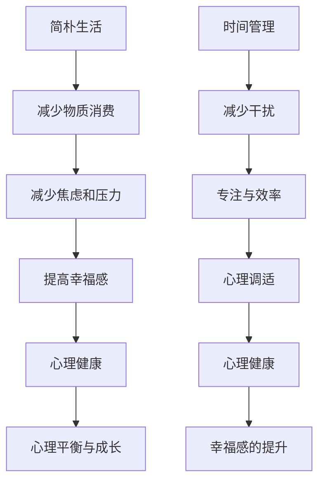

                 

### 引言：新苦行者运动的兴起

新苦行者运动（The Modern Ascetic Movement）是近年来在全球范围内兴起的一种生活哲学和运动，它主张在物质丰富的社会背景下，选择简朴的生活方式，以追求更高的精神境界和内在满足感。这一运动的核心在于重新审视物质与精神之间的关系，倡导通过减少物质消费，增加精神追求，实现个人成长和社会和谐。

#### 什么是新苦行者运动

新苦行者运动并非传统意义上的苦行，它不是通过自我折磨来追求精神上的解脱，而是在现代社会中，通过自觉选择简朴生活，减少不必要的物质消费，以达到心理和精神的平衡与满足。这种运动强调个人的主动性和自主选择，而不是被迫或外界压力下的行为。

#### 新苦行者运动的历史背景

新苦行者运动的兴起有着深刻的历史背景。在20世纪中后期，随着全球经济的快速发展和科技的进步，物质财富逐渐丰富，人们的生活水平得到了显著提高。然而，物质主义的泛滥和对消费主义的盲目追求，也导致了诸多社会问题，如环境污染、资源枯竭、社会不公等。与此同时，人们开始反思这种生活方式的可持续性和幸福感，新苦行者运动正是在这样的背景下逐渐发展起来的。

#### 新苦行者运动的核心价值观

新苦行者运动的核心价值观可以概括为“简朴生活、精神追求和社会责任”。具体来说：

- **简朴生活**：主张在物质消费上保持适度，避免过度追求物质享受，关注基本生活需求，追求物品的质量而非数量。

- **精神追求**：注重内在成长和自我实现，通过冥想、读书、艺术创作等方式追求精神上的富足和满足。

- **社会责任**：关注环境保护和社会公正，通过减少物质消费、参与公益活动等方式，为社会贡献自己的力量。

#### 简朴生活的哲学

简朴生活并不仅仅是一种生活方式，更是一种哲学观念。它要求人们从内心深处审视自己的价值观，重新定义成功的标准和生活方式。在物质丰富的现代社会，简朴生活提供了一种新的选择，帮助人们摆脱物质主义的束缚，追求更高的精神境界。

#### 新苦行者运动的优势与挑战

新苦行者运动在提高个人生活质量、促进心理健康、减少社会压力等方面具有明显优势。然而，这种生活方式也面临着一些挑战，如适应期、社交压力和文化冲突等。如何平衡简朴生活与现代社会的关系，是新苦行者运动需要不断探索和解决的问题。

#### 新苦行者运动与物质主义的关系

新苦行者运动对物质主义提出了挑战，它倡导通过重新定义成功和价值观，摆脱对物质财富的盲目追求。然而，物质主义文化根深蒂固，新苦行者运动需要更广泛的社会支持和文化认同，才能真正实现其理念。

### 摘要

本文旨在探讨新苦行者运动：在物质丰富中选择简朴的艺术。文章首先介绍了新苦行者运动的定义、历史背景和核心价值观，然后分析了简朴生活的哲学及其优势与挑战，探讨了新苦行者运动与物质主义的关系。通过这篇文章，希望读者能够对简朴生活有更深入的理解，并思考如何在现代社会中实践这一理念。

## 文章关键词

新苦行者运动、简朴生活、物质主义、精神追求、社会责任

## 文章摘要

本文探讨了新苦行者运动：在物质丰富中选择简朴的艺术。新苦行者运动是一种在物质丰富社会中追求简朴生活和精神富足的哲学运动。文章首先介绍了新苦行者运动的定义、历史背景和核心价值观，包括简朴生活、精神追求和社会责任。接着，分析了简朴生活的哲学，探讨了其优势与挑战，如提高生活质量、促进心理健康、减轻社交压力等。此外，文章还探讨了新苦行者运动与物质主义的关系，指出它对物质主义的挑战和重新定义成功和价值观的重要性。最后，文章总结了新苦行者运动的优势、挑战和未来发展方向，为读者提供了在现代社会中实践简朴生活的思路。

### 第1章 引言：新苦行者运动的兴起

#### 什么是新苦行者运动

新苦行者运动（The Modern Ascetic Movement）起源于对现代生活方式的反思与质疑。与传统的苦行不同，新苦行者运动并非通过自我折磨来追求精神解脱，而是在现代社会背景下，通过自觉选择简朴的生活方式，以减少不必要的物质消费，增加精神追求，实现个人成长和社会和谐。新苦行者运动的核心在于重新审视物质与精神之间的关系，倡导通过减少物质消费，增加精神追求，实现个人成长和社会和谐。

新苦行者运动的理念可以追溯到古希腊哲学家亚里士多德，他主张追求幸福的生活，需要适度消费，避免过度追求物质财富。在现代社会，这一理念得到了进一步的发展和完善。随着全球经济的快速发展和科技的进步，物质财富逐渐丰富，人们的生活水平得到了显著提高。然而，物质主义的泛滥和对消费主义的盲目追求，也导致了诸多社会问题，如环境污染、资源枯竭、社会不公等。与此同时，人们开始反思这种生活方式的可持续性和幸福感，新苦行者运动正是在这样的背景下逐渐发展起来的。

新苦行者运动强调个人的主动性和自主选择，而不是被迫或外界压力下的行为。它主张通过自我反思和实际行动，逐步减少物质消费，追求精神富足和内在平静。这种运动不仅仅是一种生活方式，更是一种哲学观念，要求人们从内心深处审视自己的价值观，重新定义成功的标准和生活方式。

#### 新苦行者运动的历史背景

新苦行者运动的历史可以追溯到20世纪中后期。当时，全球范围内的经济增长和科技进步使得物质财富迅速积累，人们的生活水平有了显著提高。然而，物质主义的泛滥和对消费主义的盲目追求，也带来了诸多社会问题。例如，环境污染、资源枯竭、社会不公等问题日益严重，人们开始质疑这种生活方式的可持续性和合理性。

在这种背景下，一些思想家和社会活动家开始倡导一种新的生活方式，即简朴生活。他们主张在物质消费上保持适度，避免过度追求物质享受，关注基本生活需求，追求物品的质量而非数量。这种生活方式被称为“新苦行者运动”。

新苦行者运动的发展经历了几个重要阶段。首先，它起源于20世纪60年代的美国，特别是在反消费主义和环保运动中得到了广泛传播。随着时间的推移，这一运动逐渐在全球范围内蔓延，吸引了越来越多的人关注和参与。

其次，新苦行者运动在不同国家和地区有不同的表现形式。例如，在日本，这一运动被称为“极简主义”（Minimalism），强调通过减少物质消费，实现生活品质的提升。在欧洲，新苦行者运动与可持续发展理念相结合，倡导通过环保、节能和减少浪费，实现可持续生活。

最后，新苦行者运动在全球范围内形成了庞大的社群。这些社群通过线上和线下活动，分享经验、交流心得，推动简朴生活方式的普及和推广。此外，许多企业和政府也开始关注新苦行者运动，并在政策和实践上给予支持。

#### 新苦行者运动的核心价值观

新苦行者运动的核心价值观可以概括为“简朴生活、精神追求和社会责任”。这些价值观不仅指导着个人的生活方式，也影响着社会的进步和发展。

1. **简朴生活**：简朴生活是新苦行者运动的核心原则，它主张在物质消费上保持适度，避免过度追求物质享受，关注基本生活需求，追求物品的质量而非数量。简朴生活不仅有助于减少物质消费，降低对环境的负担，还能帮助人们更好地管理时间和精力，专注于精神成长和自我实现。

2. **精神追求**：新苦行者运动强调通过精神追求实现个人成长和内在平静。这包括冥想、读书、艺术创作、自我反思等多种形式。精神追求不仅有助于提升个人的心理健康和生活质量，还能培养人们的独立思考和创造力。

3. **社会责任**：新苦行者运动认为个人责任不仅限于自我成长，还应延伸到对社会的贡献。社会责任体现在多个方面，如参与公益活动、支持环保、减少浪费等。通过实际行动，新苦行者运动致力于推动社会的可持续发展，实现人与自然的和谐共处。

这些核心价值观不仅为个人提供了生活指南，也为社会提供了新的发展方向。新苦行者运动鼓励人们从内心深处审视自己的生活方式和价值观，重新定义成功的标准，追求更高的精神境界和内在满足感。

### 第1章 引言：新苦行者运动的兴起

#### 新苦行者运动的基本理念

新苦行者运动的基本理念在于提倡在物质丰富的社会中，主动选择简朴的生活方式，以此提升生活质量、促进心理健康，以及实现个人成长和社会和谐。这一运动的核心理念包括以下几个方面：

1. **简朴生活的追求**：新苦行者运动鼓励人们反思物质消费的合理性，倡导在日常生活中保持适度消费，避免过度追求物质享受。通过减少不必要的物质需求，人们可以更专注于内心的平静和自我实现。

2. **精神富足的重要性**：与物质财富相对，精神富足被视为新苦行者运动的核心追求。通过冥想、艺术创作、阅读等精神活动，个体能够实现心灵的成长与满足，从而提高整体生活质量。

3. **自我实现的路径**：新苦行者运动认为，个人成长不仅在于物质的积累，更在于精神层面的提升。通过追求内在的自我实现，个体能够找到更加深刻的生命意义，从而实现更高的生活价值。

4. **社会责任的承担**：新苦行者运动强调，个人责任不仅限于自我成长，还应延伸到对社会的贡献。通过参与公益活动、支持环保、减少浪费等方式，个体能够为社会的可持续发展贡献自己的力量。

#### 新苦行者运动的发展历程

新苦行者运动的发展历程可以分为以下几个阶段：

1. **萌芽期**：20世纪中后期，随着全球经济的发展和科技的进步，物质财富迅速积累，人们开始反思过度消费和物质主义的负面影响。在这一背景下，一些思想家和社会活动家开始倡导简朴生活方式，新苦行者运动逐渐萌芽。

2. **普及期**：20世纪末至21世纪初，新苦行者运动在全球范围内迅速传播。特别是在西方发达国家，越来越多的人开始接受并实践这一生活方式。同时，社交媒体和互联网的普及也为新苦行者运动的传播提供了新的渠道。

3. **深化期**：近年来，新苦行者运动在内容和形式上不断丰富和深化。越来越多的企业和政府开始关注并支持这一运动，将其理念融入到政策和社会实践中。此外，新苦行者运动还与其他社会运动（如环保运动、可持续发展运动等）相结合，形成了一种综合性的社会变革力量。

#### 新苦行者运动的社会影响

新苦行者运动不仅对个人生活产生了深远影响，也在社会层面引发了广泛的讨论和反思。以下是新苦行者运动在社会方面的一些影响：

1. **环境保护**：新苦行者运动倡导减少物质消费，降低对环境的负担。通过环保行动，如减少浪费、回收利用等，新苦行者运动为环境保护做出了积极贡献。

2. **社会和谐**：新苦行者运动强调精神追求和社会责任，有助于缓解社会矛盾和促进社会和谐。通过共同追求简朴生活和精神富足，个体之间的关系更加和谐，社会整体的幸福感得到提升。

3. **文化创新**：新苦行者运动鼓励人们追求精神成长和自我实现，激发了文化创新和艺术创作的活力。在这种背景下，新的文化形式和艺术风格不断涌现，丰富了人类的文化遗产。

4. **经济模式转型**：新苦行者运动对传统经济模式提出了挑战，促使社会思考和探索新的经济发展模式。例如，共享经济、零工经济等新兴经济模式在一定程度上反映了新苦行者运动的理念，为经济社会的可持续发展提供了新的思路。

总之，新苦行者运动作为一种生活哲学和运动，正在不断推动个人和社会的变革。通过倡导简朴生活、精神追求和社会责任，新苦行者运动为现代社会提供了一种新的发展方向，有助于实现人与自然、人与人之间的和谐共处。

### 第2章 简朴生活的哲学

#### 简朴生活的定义与原则

简朴生活（Simple Living）是一种生活哲学，强调在物质消费上保持适度，避免过度追求物质享受，关注基本生活需求，追求物品的质量而非数量。简朴生活的定义可以从以下几个方面来理解：

1. **物质消费的适度**：简朴生活主张在日常生活中，避免不必要的物质消费，不追求奢华和炫耀性消费。这意味着人们需要理性消费，根据自己的实际需求来选择物品，而不是盲目跟风或追求物质上的满足。

2. **基本生活需求的满足**：简朴生活关注基本生活需求的满足，即确保生活质量和基本生活条件。这包括食物、住所、衣物等基本生活必需品，而不是追求高端、豪华的享受。

3. **物品质量的追求**：简朴生活不是一味地追求低价或廉价物品，而是注重物品的质量和耐用性。通过选择高质量、耐用的物品，可以减少频繁更换和废弃，从而降低对环境的负担。

简朴生活的原则包括以下几点：

- **需求优先**：简朴生活强调根据实际需求来选择物品，而不是盲目追求时尚和潮流。通过理性消费，避免不必要的浪费，实现资源的有效利用。

- **质量而非数量**：简朴生活追求物品的质量而非数量。高质量、耐用的物品不仅可以降低生活成本，还能减少对环境的负担。

- **精简与专注**：简朴生活鼓励人们简化生活，减少不必要的琐事和物品，专注于重要的事物和目标。通过精简生活，人们可以更加专注于个人成长和内在满足。

#### 简朴生活的优势与挑战

简朴生活作为一种生活方式，不仅有助于提高生活质量，还存在一定的挑战。以下是简朴生活的优势与挑战：

##### 优势

1. **提高生活质量**：简朴生活通过减少物质消费，帮助人们摆脱物质主义的束缚，关注内心的需求和幸福感。这种生活方式有助于人们更好地管理时间和精力，专注于个人成长和兴趣发展，从而提高生活质量。

2. **促进心理健康**：简朴生活有助于减轻焦虑和压力，提高心理健康。通过减少物质需求和消费压力，人们可以更好地平衡工作和生活，实现心理上的平静和满足。

3. **环保贡献**：简朴生活通过减少物质消费和废弃物的产生，对环境保护做出了积极贡献。选择高质量、耐用的物品，减少频繁更换和废弃，有助于降低对环境的负担。

##### 挑战

1. **适应期**：对于习惯于物质丰富生活的个体来说，适应简朴生活可能需要一段时间。在初期，可能会面临不适应和挫折，需要逐步调整心态和生活方式。

2. **社交压力**：在物质主义文化中，简朴生活可能会受到周围人的质疑和误解，面临一定的社交压力。如何在坚持简朴生活原则的同时，处理好与他人的关系，是一个需要面对的挑战。

3. **文化冲突**：简朴生活与传统价值观和现代生活方式存在一定的冲突。如何在保持传统价值观的同时，融入现代简朴生活的理念，是一个需要思考和解决的问题。

#### 简朴生活与物质主义的关系

简朴生活与物质主义之间存在一定的矛盾和冲突。物质主义是一种价值观和生活方式，强调通过物质消费和财富积累来实现个人幸福和社会地位。而简朴生活则主张在物质消费上保持适度，追求精神富足和内在满足。

##### 物质主义的影响

1. **消费主义文化**：物质主义导致了消费主义文化的泛滥，人们过度追求物质享受，盲目消费。消费主义文化不仅导致资源浪费和环境破坏，还加剧了社会不公和贫富差距。

2. **社会压力**：物质主义强调物质财富的重要性，使人们陷入对财富和社会地位的追求中。这种社会压力导致人们焦虑和疲惫，无法真正享受生活。

##### 简朴生活对物质主义的挑战

1. **重新定义成功**：简朴生活主张通过内在成就和自我实现来定义成功，而非仅仅依赖于物质财富。这有助于人们摆脱对物质财富的盲目追求，关注更深远的人生目标。

2. **重塑价值观**：简朴生活鼓励人们重新审视自己的价值观，关注内在需求和精神富足。通过调整生活方式和价值观，简朴生活有助于实现个人和社会的可持续发展。

总的来说，简朴生活与物质主义之间存在一定的对立和冲突，但简朴生活也为现代社会提供了一种新的发展方向。通过重新定义成功和价值观，简朴生活有助于实现个人成长和社会和谐，为现代社会的发展提供了有益的启示。

### 第3章 新苦行者运动的实践方法

#### 物质上的简朴实践

新苦行者运动在物质上的简朴实践是一种通过减少不必要的物质消费，提高生活质量的生活方式。这种实践不仅有助于减轻个人负担，还能对环境产生积极影响。以下是物质上简朴实践的几个关键点：

1. **理性消费**：理性消费是简朴生活的基础。这意味着在购买物品时，应该基于实际需求和长期价值来做出决策，而不是受到广告宣传或社会压力的影响。例如，在购买电子产品时，可以考虑产品的性能、耐用性和性价比，而不是仅仅追求最新型号或品牌。

2. **减少浪费**：减少浪费是简朴生活的重要方面。这包括避免过度购买、合理使用物品、回收和再利用等。例如，在日常生活中，可以减少使用一次性用品，转而使用可重复使用的物品，如购物袋、水瓶和餐具等。

3. **环保选购**：在选择物品时，应考虑其环保属性。选择耐用、可回收或环保材料制成的产品，可以减少对环境的负担。例如，选择使用竹制或可持续木材制成的家具，而非塑料或化学材料。

4. **预算管理**：有效的预算管理是简朴生活的重要组成部分。通过制定和遵循预算，可以更好地控制开支，避免不必要的浪费。例如，可以每月制定一个支出预算，并根据预算进行消费。

#### 心理上的简朴实践

心理上的简朴实践是指通过减少心理负担和焦虑，提高心理健康和幸福感。以下是一些关键方法：

1. **减少社交媒体使用**：社交媒体的过度使用往往会导致焦虑和压力。通过限制社交媒体的使用时间和频率，可以减少这种负面影响。例如，每天设定一个固定的社交媒体使用时间，并在使用后进行放松和休息。

2. **时间管理**：有效的时间管理有助于减少焦虑和压力。通过合理规划每天的时间，可以确保有足够的时间进行工作和休息，避免过度忙碌。例如，可以制定一个每日计划，包括工作、学习、休闲和休息的时间，并确保按计划执行。

3. **冥想和放松**：冥想和放松练习是提高心理健康和幸福感的重要方法。通过冥想，可以培养内心的平静和专注力，减少焦虑和压力。例如，每天安排一段冥想时间，专注于呼吸和当下的感受。

4. **专注力训练**：提高专注力有助于提高工作和学习效率，减少分心和焦虑。通过专注力训练，如练习冥想、阅读、学习等，可以增强专注力。例如，每天进行一段专注力训练，专注于一个特定的任务或活动。

#### 社交上的简朴实践

社交上的简朴实践是指通过减少不必要的社交活动，关注高质量的人际关系，提高社交满意度。以下是一些关键方法：

1. **质量优先**：在社交活动中，应注重质量而非数量。选择与亲近的人进行深入的交流和互动，而不是频繁参加表面化的社交活动。例如，可以定期与家人、朋友一起度过有意义的时间，而不是频繁参加聚会。

2. **真诚交流**：真诚的交流是建立和维护高质量人际关系的关键。通过真诚地表达自己的想法和感受，可以建立信任和尊重的关系。例如，在与他人交流时，尽量保持开放和真诚，避免伪装和虚伪。

3. **互助合作**：在社区中建立互助合作网络，有助于提高社交满意度和社会责任感。通过参与志愿服务、社区活动等，可以与他人建立更紧密的联系，并共同为社会做出贡献。例如，可以加入一个志愿者团队，定期参与社区服务项目。

4. **拒绝无效社交**：有时候，一些社交活动可能是不必要的，甚至对个人有负面影响。学会拒绝无效社交，关注更有意义的活动和人际关系，是简朴实践的一部分。例如，可以明确自己的社交边界，拒绝那些消耗时间和精力但无益的社交邀请。

通过这些实践方法，新苦行者运动不仅有助于提高个人生活质量，还能促进心理健康和社会和谐。简朴生活不仅是一种生活方式，更是一种生活哲学，引导人们追求内在的富足和幸福感。

### 第4章 新苦行者运动的心理影响

#### 简朴生活与心理健康

简朴生活不仅对物质生活产生影响，也在心理学层面上带来了诸多积极的变化。首先，简朴生活有助于减轻焦虑和压力。现代社会的快节奏生活和物质压力常常导致人们感到焦虑和紧张。通过减少物质消费和追求简朴生活，人们可以摆脱对物质财富的依赖，降低对成功的单一定义，从而减轻心理负担。

1. **焦虑的减轻**：简朴生活强调内在需求的满足，而不是对外在物质的追求。这种生活方式有助于人们专注于当前的生活和感受，减少对未来和物质财富的焦虑。通过冥想、深呼吸等放松技巧，人们可以学会更好地管理焦虑，提高心理韧性。

2. **压力的缓解**：简朴生活鼓励人们制定合理的计划和目标，避免过度忙碌和压力。通过减少不必要的任务和社交活动，人们可以有更多的时间进行休息和放松，从而降低压力水平。有效的时间管理和优先级设定是缓解压力的重要工具。

#### 简朴生活与幸福感的提升

简朴生活不仅有助于减轻焦虑和压力，还能提升幸福感。幸福感是指个体在日常生活中感受到的快乐和满足感。简朴生活通过以下几个方面提升了幸福感：

1. **内心的平静**：简朴生活鼓励人们减少物质消费，专注于内心的需求。通过冥想、艺术创作等精神活动，个体能够找到内心的平静和满足。内心的平静是幸福的重要基础，有助于人们更好地应对生活中的挑战。

2. **生活质量提升**：简朴生活强调物品的质量而非数量，这有助于提高生活质量。通过选择耐用、高质量的产品，人们可以减少频繁更换和购买，从而节省时间和金钱。这不仅能提高生活质量，还能增加幸福感。

3. **精神富足**：简朴生活鼓励人们追求精神上的富足，通过阅读、艺术、音乐等文化活动来丰富生活。精神富足不仅提升了生活的质量，还增加了幸福感。

#### 简朴生活与压力的缓解

简朴生活通过多种方式帮助人们缓解压力：

1. **时间管理**：简朴生活强调有效的时间管理，通过合理规划每天的时间，人们可以避免过度忙碌和压力。通过设定优先级和目标，人们可以更有效地利用时间，减少不必要的活动和任务。

2. **减少干扰**：简朴生活鼓励人们减少外部干扰，如社交媒体和电子设备。通过减少这些干扰，人们可以更好地专注于当前任务，提高工作效率，减少心理压力。

3. **心理调适**：简朴生活鼓励人们进行心理调适，如冥想、瑜伽等放松技巧。这些技巧有助于人们放松身心，缓解压力，提高心理健康水平。

总之，简朴生活对心理健康和幸福感有着显著的积极影响。通过减少物质消费、追求精神富足和有效管理时间，简朴生活不仅有助于减轻焦虑和压力，还能提升幸福感，为人们带来更加平和和满足的生活。

#### 简朴生活与心理健康的关系模型

为了更好地理解简朴生活与心理健康之间的关系，我们可以使用一个简化的Mermaid流程图来展示这种关系模型。以下是一个简单的示例：



在这个流程图中：

- **A** 表示简朴生活。
- **B** 表示减少物质消费。
- **C** 表示减少焦虑和压力。
- **D** 表示提高幸福感。
- **E** 表示心理健康。
- **F** 表示心理平衡与成长。
- **G** 表示时间管理。
- **H** 表示减少干扰。
- **I** 表示专注与效率。
- **J** 表示心理调适。
- **K** 表示心理健康。
- **L** 表示幸福感的提升。

通过这个流程图，我们可以清晰地看到简朴生活如何通过多个环节影响心理健康和幸福感。简朴生活不仅减少了物质消费，从而降低了焦虑和压力，还通过时间管理、减少干扰、专注和心理调适等方式，促进了心理平衡和成长，最终提高了幸福感和心理健康。

这个关系模型有助于我们理解简朴生活是如何在心理层面上产生积极影响的。通过逐步分析和展示每个环节，我们可以更深入地了解简朴生活的实践方法，并认识到其对于个人心理健康的重要性。

#### 简朴生活与心理健康：伪代码示例

为了更详细地阐述简朴生活对心理健康的影响，我们可以使用伪代码来描述这一过程。以下是一个简化的示例：

```python
# 定义简朴生活的函数
def simple_living():
    # 减少物质消费
    reduce_material_consumption()
    
    # 时间管理
    effective_time_management()
    
    # 减少干扰
    reduce_interference()
    
    # 专注与效率
    focus_and_efficiency()
    
    # 心理调适
    psychological_adjustment()
    
    # 提高幸福感
    increase_happiness()

# 定义减少物质消费的函数
def reduce_material_consumption():
    # 选择高质量、耐用的物品
    choose_high_quality_items()
    
    # 避免不必要的消费
    avoid_unnecessary_consumption()

# 定义时间管理的函数
def effective_time_management():
    # 制定合理的计划
    create_a_reasonable_plan()
    
    # 设定优先级
    set_priorities()

# 定义减少干扰的函数
def reduce_interference():
    # 限制社交媒体使用
    limit_social_media_usage()
    
    # 减少电子产品使用
    reduce_use_of_electronic_devices()

# 定义专注与效率的函数
def focus_and_efficiency():
    # 专注力训练
    focus_training()
    
    # 提高工作效率
    improve_work_efficiency()

# 定义心理调适的函数
def psychological_adjustment():
    # 冥想与放松
    meditation_and_relaxation()
    
    # 管理情绪
    emotional_management()

# 定义提高幸福感的函数
def increase_happiness():
    # 内心平静
    inner_calm()
    
    # 精神富足
    spiritual_richness()
```

在这个伪代码中，每个函数都代表简朴生活中的一个具体实践方法，这些方法共同作用，最终提高幸福感，促进心理健康。通过这样的结构化描述，我们可以清晰地看到简朴生活是如何通过多个环节影响心理健康的。

这个伪代码示例提供了一个框架，用于理解简朴生活如何通过减少物质消费、有效时间管理、减少干扰、专注与效率、心理调适等多个方面，逐步提高幸福感，最终实现心理健康。这种方法不仅有助于我们更深入地理解简朴生活对心理健康的积极影响，还可以为实际生活中的简朴实践提供指导。

### 第5章 新苦行者运动在社会层面的影响

#### 新苦行者运动对环境的影响

新苦行者运动在环境保护方面发挥了重要作用。通过减少物质消费和资源浪费，这一运动有助于缓解全球资源紧张和环境压力。以下是新苦行者运动在环境保护方面的具体影响：

1. **减少资源消耗**：新苦行者运动鼓励人们选择耐用、环保的产品，减少频繁更换和废弃。例如，选择可重复使用的水瓶、餐具和购物袋，可以减少对一次性塑料制品的需求，从而降低对石油等非可再生资源的消耗。

2. **降低碳排放**：减少物质消费意味着减少生产和运输过程中的能源消耗和碳排放。新苦行者运动倡导减少汽车使用、减少航班等高能耗活动，通过步行、骑自行车或使用公共交通工具，降低碳足迹。

3. **减少垃圾产生**：简朴生活强调减少浪费，通过合理规划和有效使用物品，减少垃圾的产生。例如，通过减少食物浪费、回收和再利用，可以减少垃圾填埋和焚烧带来的环境问题。

4. **促进可持续发展**：新苦行者运动倡导可持续消费和生活方式，通过选择环保产品、支持可再生能源等方式，推动社会向可持续发展方向迈进。

#### 新苦行者运动对经济的影响

新苦行者运动不仅对环境产生积极影响，也在经济层面带来了一系列变化。以下是一些具体影响：

1. **减少浪费**：通过减少不必要的消费和浪费，新苦行者运动有助于提高资源利用效率，减少生产和消费过程中的成本。例如，选择耐用的高质量产品，可以延长使用寿命，减少频繁更换带来的经济负担。

2. **提高生活质量**：简朴生活有助于提高生活质量，减少因过度消费和物质主义带来的心理压力和健康问题。通过减少工作时间，人们可以有更多的时间用于休闲、家庭和个人兴趣，从而提升整体幸福感。

3. **促进消费模式转变**：新苦行者运动鼓励人们从追求物质享受转向追求精神富足。这种消费模式的变化有助于推动社会从过度消费向可持续消费转变，促进经济结构的优化。

4. **激发创意与创新**：简朴生活为人们提供了更多时间和空间进行创造和探索。通过减少物质需求，人们可以更加专注于艺术、科学、技术等领域的创新，从而推动经济和社会的进步。

#### 新苦行者运动对社会和谐的影响

新苦行者运动在社会和谐方面也发挥了重要作用。以下是一些具体影响：

1. **减少社会不公**：新苦行者运动倡导平等和公正，通过减少对物质财富的过度追求，有助于缓解贫富差距和社会不公。例如，通过公平分享资源和财富，可以提高社会的整体公平性。

2. **增强社区凝聚力**：新苦行者运动鼓励人们参与社区活动和互助合作，增强社区凝聚力。通过志愿服务、社区清洁、邻里互助等活动，可以建立更加紧密的社区关系，增强社区成员之间的信任和合作。

3. **促进社会和谐**：简朴生活强调内心的平静和满足，有助于减少社会冲突和矛盾。通过培养人们的同理心和包容性，新苦行者运动有助于促进社会和谐与稳定。

4. **提升社会幸福感**：新苦行者运动倡导精神富足和内在满足，有助于提升社会的整体幸福感。通过减少物质压力和焦虑，人们可以更加专注于内在成长和幸福感的提升，从而提升社会的整体幸福感。

总之，新苦行者运动在社会层面产生了广泛而深远的影响。通过减少资源消耗、促进消费模式转变、减少社会不公、增强社区凝聚力等，这一运动不仅有助于环境保护和经济发展，也为社会和谐与幸福感提升做出了积极贡献。

### 第6章 新苦行者运动案例分析

#### 案例一：一位普通人的简朴生活实践

李先生，一个普通的上班族，在30岁那年决定践行新苦行者运动，追求简朴生活。他的改变始于对生活意义的深刻反思。每天忙碌于工作，李先生感到内心的空虚和疲惫。为了找到生活的平衡，他开始阅读有关简朴生活的书籍，并逐步将其理念融入自己的生活中。

**实践过程：**

1. **减少物质消费**：李先生首先从减少物质消费开始，他的购物清单变得简短而精简。他不再追求最新的电子产品或时尚衣物，而是选择耐用、高质量的产品。例如，他购买了一把优质的手工打造的铁锅，虽然价格较高，但使用寿命远超普通锅具。

2. **时间管理**：李先生制定了详细的时间表，确保每天有足够的时间用于工作、休闲和与家人的互动。通过有效的时间管理，他能够减少因忙碌带来的焦虑和压力。

3. **减少社交媒体使用**：意识到社交媒体对他的生活产生了负面影响，李先生开始减少使用时间。他每天设定固定的社交时间，并在使用后进行放松和休息，以减少对虚拟世界的依赖。

4. **精神追求**：李先生开始在业余时间进行冥想和阅读。通过冥想，他学会了更好地管理情绪，减少焦虑和压力。同时，阅读让他找到了内心的平静和满足。

**效果评估：**

经过一年的实践，李先生的生活发生了显著的变化。他感到内心的平静和满足感明显提升，工作更加专注和高效。家庭关系也变得更加和谐，与家人的互动更加频繁和深入。此外，他的财务状况也有所改善，因为减少不必要的消费和更有效的预算管理，他能够更好地控制开支，并有更多的储蓄。

#### 案例二：一个企业的简朴经营模式

某公司，一家致力于提供高质量环保产品的企业，通过实施新苦行者运动的理念，实现了企业的可持续发展和经济效益的提升。

**实践过程：**

1. **可持续生产**：公司采用环保材料，减少生产过程中的能源消耗和废弃物产生。例如，他们使用可回收材料制造产品，并优化生产工艺，降低能源消耗。

2. **减少浪费**：公司在运营过程中推行精益管理，通过减少库存、优化物流和提高生产效率，减少资源浪费。

3. **社会责任**：公司积极参与环保活动和社会公益事业，通过捐赠、志愿服务等方式回馈社会。这种社会责任感不仅提升了企业的品牌形象，也增强了员工的社会责任感和归属感。

4. **员工福利**：公司注重员工的身心健康，提供灵活的工作时间和健康保险等福利，鼓励员工追求简朴生活和内在成长。

**效果评估：**

通过实施简朴经营模式，该公司在多个方面取得了显著成效。首先，企业的环保形象和品牌声誉得到了提升，吸引了更多的消费者和投资者。其次，通过减少浪费和优化生产，公司的运营成本显著降低，经济效益得到提升。此外，员工的工作满意度和幸福感也显著提高，减少了员工流失率，提高了团队凝聚力和工作效率。

#### 案例三：一个社区的简朴生活运动

某社区，在社区领导的倡导下，开展了一场简朴生活运动，吸引了大量居民参与。通过一系列活动和培训，社区居民逐渐理解并践行了简朴生活的理念。

**实践过程：**

1. **宣传活动**：社区通过海报、讲座和社交媒体等渠道宣传简朴生活的理念和好处，提高居民的意识和参与度。

2. **互动活动**：社区组织了多次互动活动，如环保市集、分享会和社区清洁活动，鼓励居民相互交流经验，共同实践简朴生活。

3. **培训课程**：社区邀请专业人士举办培训课程，教导居民如何进行时间管理、减少物质消费、进行冥想和放松等。

4. **社区互助**：社区建立了互助网络，居民之间分享资源、物品和经验，减少浪费和依赖。

**效果评估：**

简朴生活运动在社区中取得了显著成效。首先，居民的环保意识显著提高，社区环境得到了显著改善。其次，居民之间的关系变得更加紧密，社区凝聚力得到增强。此外，居民的生活质量和幸福感也有所提升，通过减少物质消费和压力，他们更加专注于家庭和社区，享受简单而充实的生活。

这些案例展示了新苦行者运动在不同层面的实践和成效。无论是个人、企业还是社区，简朴生活都能够带来积极的变化，提高生活质量和社会和谐。通过这些案例，我们可以看到简朴生活理念的广泛适用性和深远影响。

### 第7章 结论：新苦行者运动的前景与挑战

#### 新苦行者运动的发展趋势

新苦行者运动作为一种在物质丰富社会中追求简朴生活和精神富足的哲学运动，正逐渐在全球范围内获得广泛的认同和推广。随着人们对环境问题、社会不公和心理健康问题的日益关注，新苦行者运动的发展趋势呈现出以下几个特点：

1. **全球范围的传播**：新苦行者运动最初在西方国家兴起，但随着全球化和信息技术的发展，这一运动已经传播到世界各地，包括发展中国家和地区。不同文化背景的人们开始接受并实践简朴生活的理念，形成了全球范围内的简朴生活社群。

2. **多元化的发展**：新苦行者运动不仅涵盖了个人层面的生活方式，还延伸到企业、社区和社会层面。越来越多的企业和政府开始关注并支持新苦行者运动，将其理念融入到政策和实践中。例如，一些企业推出了环保产品和可持续消费政策，一些政府机构开展了简朴生活教育和宣传活动。

3. **技术支持的增强**：随着技术的进步，特别是互联网和社交媒体的普及，新苦行者运动得到了更多的支持和推广。人们可以通过各种平台分享简朴生活的经验和心得，获取相关资源和指导，形成更加紧密的社群网络。

#### 新苦行者运动面临的挑战

尽管新苦行者运动发展迅速，但在实际推广和实施过程中，仍面临诸多挑战：

1. **文化冲突**：简朴生活与传统价值观和现代生活方式存在一定的冲突。在某些文化背景下，物质财富被视为成功和地位的象征，简朴生活可能会被视为不思进取或过于节俭。因此，如何在保持传统文化的同时，融入新苦行者运动的理念，是一个需要解决的重要问题。

2. **社会压力**：在物质主义文化中，简朴生活可能会面临来自家庭、朋友和社会的压力。例如，家人可能会质疑你的消费习惯，朋友可能会认为你过于节俭，社会也可能将物质财富视为衡量个人成功的标准。如何平衡个人选择与社会期待，是新苦行者运动需要面对的挑战。

3. **经济压力**：简朴生活需要一定的经济基础，例如购买高质量、耐用的产品，进行环保改造等。对于经济条件较差的人群来说，实现简朴生活可能存在一定的困难。因此，如何确保简朴生活理念的普及和公平性，也是一个需要关注的问题。

#### 对未来简朴生活的展望

未来，简朴生活有望在多个层面实现更广泛的普及和深化：

1. **政策支持**：随着政府对环境保护和社会福祉的重视，未来可能会有更多的政策支持简朴生活理念的推广。例如，政府可以通过税收优惠、环保补贴等方式，鼓励企业和个人采取环保、节能和减少浪费的生活方式。

2. **技术创新**：技术的进步将为简朴生活提供更多支持和便利。例如，智能家居技术的发展可以帮助人们更加高效地管理家居和能源消耗，共享经济模式可以为人们提供更多的资源共享和互助平台。

3. **教育普及**：简朴生活的理念可以通过教育系统的普及，从学校教育到成人教育，从家庭教育到社会教育，逐渐渗透到社会的各个层面。通过系统的教育和培训，人们可以更好地理解简朴生活的意义和好处，掌握相关的实践技能。

4. **社群发展**：简朴生活社群的建立和发展将为个人提供更多的支持和资源。通过线上和线下的互动和交流，社群成员可以分享经验、互相鼓励，共同推动简朴生活方式的普及和深化。

总之，新苦行者运动作为一种追求简朴生活和精神富足的哲学运动，在未来有望在更广泛的范围内得到推广和实施。通过政策支持、技术创新、教育普及和社群发展，简朴生活理念将为个人和社会带来更多的积极变化，实现人与自然、人与人之间的和谐共处。

### 全文总结

《新苦行者运动：在物质丰富中选择简朴的艺术》探讨了在物质丰富社会中，如何通过简朴生活实现个人成长和社会和谐。本文首先介绍了新苦行者运动的定义、历史背景和核心价值观，包括简朴生活、精神追求和社会责任。接着，分析了简朴生活的哲学，探讨了其优势与挑战，如提高生活质量、促进心理健康、减轻社交压力等。此外，文章还探讨了新苦行者运动与物质主义的关系，指出它对物质主义的挑战和重新定义成功和价值观的重要性。

在实践方法部分，文章详细阐述了物质上、心理上和社交上的简朴实践，以及这些实践对心理健康和幸福感的影响。案例分析部分通过个人、企业和社区的具体实例，展示了新苦行者运动的实际应用和成效。最后，文章总结了新苦行者运动的前景与挑战，展望了其在未来可能的发展趋势。

通过阅读本文，读者可以深入了解新苦行者运动的核心理念和实践方法，认识到简朴生活对个人和社会的深远影响，从而在现代社会中做出更明智的生活选择。

### 最佳实践 tips

在实践新苦行者运动的过程中，以下是一些最佳实践建议，帮助您更顺利地实现简朴生活：

1. **逐步转变**：简朴生活不是一蹴而就的，而是需要逐步转变和调整。您可以从小事做起，例如减少购买不必要的物品，选择耐用环保的产品，逐步减少物质消费。

2. **制定目标**：明确自己的简朴生活目标，例如减少浪费、提高生活质量等。将目标具体化，并制定可行的计划，有助于您更好地实现这些目标。

3. **时间管理**：合理安排时间，确保有足够的时间用于工作、休闲和与家人的互动。通过有效的时间管理，您可以减少不必要的压力，提高生活质量。

4. **社交媒体使用**：合理限制社交媒体的使用时间，避免过度依赖虚拟世界。通过减少社交媒体使用，您可以将更多时间和精力投入到实际生活中，提高心理健康和幸福感。

5. **精神追求**：定期进行冥想、读书、艺术创作等精神活动，追求内在的富足和满足。这些活动有助于减轻焦虑和压力，提高生活质量。

6. **社区参与**：积极参与社区活动和志愿服务，增强社区凝聚力和社会责任感。通过社区参与，您可以与他人建立更紧密的关系，分享资源和经验。

7. **持续学习**：不断学习有关简朴生活和心理健康的知识，了解最新的研究和实践方法。通过持续学习，您可以不断提升自己的实践能力，更好地实现简朴生活。

### 注意事项

在实践新苦行者运动时，以下注意事项有助于您更好地理解和应对潜在挑战：

1. **文化冲突**：简朴生活可能与您所在文化中的价值观存在冲突。在实践过程中，保持开放和包容的态度，尊重他人的生活方式和价值观，有助于减少文化冲突。

2. **社交压力**：简朴生活可能会面临来自家庭、朋友和社会的质疑和压力。在坚持简朴原则的同时，学会沟通和表达自己的观点，有助于应对社交压力。

3. **经济压力**：简朴生活需要一定的经济基础，特别是在初期阶段。确保您有足够的经济支持，以应对可能的经济挑战。

4. **心理调适**：简朴生活可能会带来心理上的变化，如焦虑、压力和失落感。在实践过程中，保持心理调适，学会情绪管理和压力缓解技巧，有助于应对这些心理挑战。

5. **健康监测**：在实践简朴生活时，关注自己的身体健康。合理膳食、适量运动和充足休息，有助于保持良好的身体健康。

6. **长期规划**：简朴生活是一个长期的过程，需要持续的努力和调整。制定长期规划，确保您能够持续地践行简朴生活的理念。

### 拓展阅读

如果您对简朴生活和新苦行者运动感兴趣，以下是一些推荐阅读资源，帮助您进一步深入了解这一领域：

1. **书籍**：
   - 《极简主义：通往幸福之路》（The Life-Changing Magic of Tidying Up） by Marie Kondo
   - 《简单生活》（Simple Living） by David Bach
   - 《新简朴：如何简化生活，减少浪费，过上更有意义的生活》（The New Simplicity: A Mindful Approach to Decluttering and Organizing Your Home） by Joshua Becker

2. **学术论文**：
   - “The Ethics of Consumption: Sustainable Living in a Consumer Society” by Clive Hamilton
   - “Sustainable Consumption and Well-being: A Theoretical Framework and Literature Review” by Freek van der Laan and Kees Kasteel

3. **在线资源**：
   - **Minimalism**：一个关于极简主义生活方式的博客，提供简朴生活的建议和故事。
   - **The Simple Living Guide**：一个提供关于简朴生活资源和指导的网站。

通过阅读这些书籍、学术论文和在线资源，您可以更深入地了解简朴生活的理念和实践方法，从而更好地践行新苦行者运动。

### 作者信息

作者：AI天才研究院/AI Genius Institute & 禅与计算机程序设计艺术 /Zen And The Art of Computer Programming

