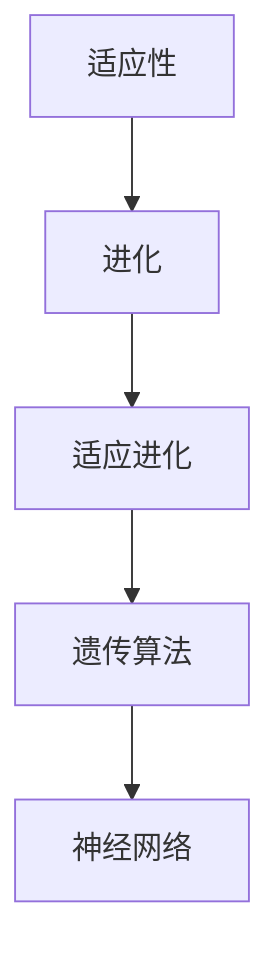

                 

### 文章标题：新达尔文主义课程：适应快速变化世界的技能

#### 关键词：新达尔文主义、适应性、进化、遗传算法、神经网络、快速变化世界

#### 摘要：
在当今快速变化的世界中，适应性的重要性日益凸显。本文将探讨新达尔文主义的核心概念，以及如何通过掌握相关技能来应对快速变化。我们将详细讲解遗传算法和神经网络等核心算法原理，并使用数学模型和公式进行深入剖析。通过实际项目实战，我们将展示如何将这些技能应用于现实世界，以适应快速变化的环境。

### 引言：新达尔文主义的崛起

在21世纪的今天，科技发展的速度前所未有，社会环境瞬息万变。这种快速变化要求个人和组织具备高度的适应性。新达尔文主义，作为一种应对这种变化的理论框架，应运而生。

**新达尔文主义**是一种关于适应性和进化的理论，它强调了在复杂环境中通过适应性和进化来提高生存和成功的可能性。其核心思想可以追溯到查尔斯·达尔文的自然选择理论，但在现代科技和复杂系统的基础上得到了进一步的发展。

**适应性**是新达尔文主义的核心概念之一。它指的是个体或系统在面临外部环境变化时，通过调整自身行为、结构或策略来提高生存机会的能力。适应性不仅体现在生物体层面，也适用于社会系统、经济系统、技术系统等各个领域。

**进化**是新达尔文主义的另一个核心概念。它指的是通过自然选择、遗传变异和基因流动等过程，个体或系统在长时间内逐步适应环境的过程。在快速变化的世界中，进化能力成为个体或系统生存和发展的关键。

### 核心概念与联系

为了更好地理解新达尔文主义，我们需要了解其核心概念之间的联系。以下是核心概念之间的关系架构Mermaid流程图：



- **适应性**是进化的基础，通过调整个体或系统的特征来适应环境。
- **进化**是适应性的结果，是长时间内个体或系统适应环境的过程。
- **适应进化**是适应性和进化的结合，强调了在动态环境中不断调整和优化的能力。
- **遗传算法**和**神经网络**是新达尔文主义中的核心算法，它们通过模拟自然进化过程来提高个体或系统的适应性。

#### 1.1.1 适应性的定义

适应性是指个体或系统在面对外部环境变化时，通过调整自身行为、结构或策略来提高生存机会的能力。在自然界中，适应性是生物体生存和繁衍的关键。同样，在人类社会中，适应性也至关重要。例如，企业在面对市场变化时，需要调整战略、产品或服务来适应新的需求。

#### 1.1.2 适应性的重要性

在快速变化的世界中，适应性具有重要意义。以下是一些原因：

1. **生存和繁荣**：个体或系统具备高度的适应性，能够更好地适应不断变化的环境，从而提高生存和繁荣的机会。
2. **创新和进步**：适应性促使个体或系统不断探索新的解决方案，推动创新和进步。
3. **竞争和合作**：在竞争激烈的环境中，具备高度适应性的个体或系统能够更好地应对挑战，提高竞争力和合作能力。

#### 1.2.1 进化的定义

进化是指个体或系统在长时间内逐步适应环境的过程。进化过程包括自然选择、遗传变异和基因流动等机制。在自然界中，生物体通过进化不断适应环境变化，以保持生存和繁衍。同样，在社会和技术系统中，进化也起到关键作用。

#### 1.2.2 进化的机制

进化的主要机制包括：

1. **自然选择**：自然选择是指环境对个体或系统的适应程度进行筛选，适应度高的个体或系统生存机会更大。
2. **遗传变异**：遗传变异是指个体或系统基因的随机变化，这些变化可能导致个体或系统在环境中的表现有所不同。
3. **基因流动**：基因流动是指基因在不同个体或系统之间的传递，这有助于促进种群内的基因多样性。

#### 1.3.1 适应性进化的定义

适应性进化是指个体或系统在面临外部环境变化时，通过进化机制来提高适应性的过程。适应性进化强调个体或系统在动态环境中的适应能力和进化潜力。通过适应性进化，个体或系统能够更好地应对不断变化的环境，提高生存和繁荣的机会。

#### 1.3.2 适应性进化的过程

适应性进化的过程可以分为以下几个阶段：

1. **环境变化**：外部环境发生变化，对个体或系统的生存和繁衍产生挑战。
2. **基因变异**：个体或系统内部发生基因变异，导致个体或系统在环境中的表现有所不同。
3. **自然选择**：环境对个体或系统进行筛选，适应度高的个体或系统生存机会更大。
4. **遗传变异**：适应度高的个体或系统将其基因传递给下一代，从而提高种群内的适应性。
5. **基因流动**：适应度高的基因在不同个体或系统之间传递，促进种群内的基因多样性。

#### 1.4 Mermaid流程图：核心概念联系

以下是一个Mermaid流程图，展示了新达尔文主义核心概念之间的联系：


### 第2章：核心算法原理讲解

#### 2.1 遗传算法

遗传算法是一种基于自然选择和遗传学原理的优化算法。它模拟生物进化过程，通过遗传操作（如选择、交叉和变异）来优化问题。遗传算法在解决复杂优化问题时具有强大的适应性和鲁棒性。

#### 2.1.1 遗传算法的定义

遗传算法是一种基于自然选择和遗传学原理的优化算法。它通过模拟生物进化过程，在解空间中搜索最优解。遗传算法的核心概念包括：

1. **染色体**：染色体是遗传算法中的个体表示，它包含了问题的一个可能解。
2. **种群**：种群是遗传算法中的解的集合，每个个体都是一个染色体。
3. **适应度函数**：适应度函数是评估染色体适应度（即解的质量）的指标。
4. **遗传操作**：遗传操作包括选择、交叉和变异，用于生成新的染色体。

#### 2.1.2 遗传算法的基本原理

遗传算法的基本原理可以概括为以下几个步骤：

1. **初始化种群**：随机生成一组初始染色体。
2. **评估适应度**：计算每个染色体的适应度值。
3. **选择**：根据适应度值选择优秀染色体进行繁殖。
4. **交叉**：通过交叉操作生成新的染色体。
5. **变异**：对部分染色体进行变异操作。
6. **更新种群**：将交叉和变异后的染色体组成新的种群。
7. **重复步骤2-6**，直到满足停止条件（如达到最大迭代次数或找到满意解）。

#### 2.1.3 遗传算法的伪代码

以下是一个简化的遗传算法伪代码：

```plaintext
初始化种群
评估适应度
while (未满足停止条件) {
  选择
  交叉
  变异
  更新种群
  评估适应度
}
输出最佳解
```

#### 2.2 神经网络

神经网络是一种模仿人脑结构和功能的计算模型，它可以用于各种任务，如图像识别、自然语言处理和智能决策。神经网络通过多层节点（神经元）的连接和激活函数，实现复杂函数的拟合和预测。

#### 2.2.1 神经网络的基本结构

神经网络的基本结构包括以下几个部分：

1. **输入层**：接收外部输入信息。
2. **隐藏层**：对输入信息进行加工和处理。
3. **输出层**：生成最终的输出结果。
4. **神经元**：每个神经元都是一个简单的计算单元，它接收多个输入，并通过激活函数产生输出。
5. **权重和偏置**：权重和偏置是神经元之间的连接强度，它们决定了输入信息对输出的影响。

#### 2.2.2 神经网络的学习过程

神经网络的学习过程可以分为以下几个步骤：

1. **初始化权重和偏置**：随机初始化网络中的权重和偏置。
2. **前向传播**：根据输入信息，计算每个神经元的输出。
3. **计算损失**：比较输出结果和实际结果之间的差异，计算损失函数。
4. **反向传播**：根据损失函数，更新网络中的权重和偏置。
5. **迭代学习**：重复前向传播和反向传播过程，直到满足停止条件（如达到最大迭代次数或损失函数收敛）。

#### 2.2.3 神经网络的伪代码

以下是一个简化的神经网络伪代码：

```plaintext
初始化权重和偏置
while (未满足停止条件) {
  前向传播
  计算损失
  反向传播
  更新权重和偏置
}
输出最终输出结果
```

### 第3章：数学模型与公式讲解

在适应快速变化世界的过程中，数学模型和公式发挥着重要作用。它们提供了量化分析问题的工具，有助于我们更好地理解适应性和进化过程。

#### 3.1 适应度函数

适应度函数是评估个体适应性的关键指标，它决定了个体在种群中的生存机会。适应度函数通常是一个实值函数，其值越大表示个体适应度越高。

#### 3.1.1 适应度函数的定义

适应度函数是一个衡量个体适应性的指标，它通常定义为：

$$
f(x) = \frac{1}{1 + \exp(-\theta \cdot x)}
$$

其中，$x$ 是个体的特征向量，$\theta$ 是适应度函数的参数。适应度函数的值介于0和1之间，表示个体在种群中的相对适应度。

#### 3.1.2 适应度函数的例子

以下是一个简单的适应度函数例子：

$$
f(x) = \frac{1}{1 + \exp(-x)}
$$

在这个例子中，$x$ 是个体的年龄。适应度函数表明，年龄越大的个体适应度越低，因为他们可能无法适应快速变化的环境。

#### 3.2 遗传算法中的交叉与变异

交叉和变异是遗传算法中的两个关键遗传操作。它们通过引入随机性和多样性，提高算法的搜索能力和鲁棒性。

#### 3.2.1 交叉操作

交叉操作是指将两个父代个体的基因进行组合，生成新的子代个体的过程。交叉操作通常分为以下几种类型：

1. **单点交叉**：在个体的某个特定位置进行交叉，将父代的基因进行交换。
2. **多点交叉**：在个体的多个位置进行交叉，将父代的基因进行交换。
3. **均匀交叉**：随机选择个体的某些基因进行交换。

以下是一个单点交叉操作的例子：

$$
\text{父代1}:\{1, 0, 1, 0\}
$$
$$
\text{父代2}:\{1, 1, 0, 1\}
$$
$$
\text{交叉位置}:2
$$
$$
\text{子代1}:\{1, 1, 1, 0\}
$$
$$
\text{子代2}:\{1, 0, 0, 1\}
$$

#### 3.2.2 变异操作

变异操作是指对个体的基因进行随机改变的过程。变异操作可以引入新的基因组合，增加种群的多样性。以下是一个变异操作的例子：

$$
\text{父代}:\{1, 0, 1, 0\}
$$
$$
\text{变异位置}:3
$$
$$
\text{变异后}:\{1, 0, 0, 1\}
$$

### 第4章：项目实战

在本章节中，我们将通过实际项目实战，展示如何应用新达尔文主义和所学的技能去适应快速变化的世界。

#### 4.1 实战案例1：基于遗传算法的优化问题

**项目背景**：某公司需要优化其供应链管理系统，以降低库存成本和提高供应链效率。

**开发环境搭建**：在Python环境中安装遗传算法库（如DEAP）和优化问题的相关库（如NumPy和SciPy）。

**源代码实现**：
```python
import random
import numpy as np
from deap import base, creator, tools, algorithms

# 定义适应度函数
def fitness_function(individual):
    # 计算个体的适应度值
    cost = calculate_cost(individual)
    return cost,

# 创建遗传算法的个体和种群
creator.create("FitnessMin", base.Fitness, weights=(-1.0,))
creator.create("Individual", list, fitness=creator.FitnessMin)

# 定义遗传算法参数
toolbox = base.Toolbox()
toolbox.register("attr_bool", random.randint, 0, 1)
toolbox.register("individual", tools.initRepeat, creator.Individual, toolbox.attr_bool, n=10)
toolbox.register("population", tools.initRepeat, list, toolbox.individual)
toolbox.register("evaluate", fitness_function)
toolbox.register("mate", tools.selTournament, t=2)
toolbox.register("mutate", tools.mutFlipBit, indpb=0.05)
toolbox.register("select", tools.selBest, k=5)

# 运行遗传算法
pop = toolbox.population(n=50)
ngens = 50
stats = tools.Statistics(lambda ind: ind.fitness.values)
stats.register("avg", np.mean)
stats.register("min", np.min)
stats.register("max", np.max)
algorithms.eaSimple(pop, toolbox, cxpb=0.5, mutpb=0.2, ngen=ngens, stats=stats, verbose=True)

# 输出最佳解
best_ind = tools.selBest(pop, k=1)[0]
print("最佳解：", best_ind)
print("最佳适应度：", best_ind.fitness.values[0])
```

**代码解读与分析**：上述代码实现了基于遗传算法的优化问题。通过定义适应度函数和遗传操作，遗传算法在种群中搜索最优解。代码中使用了DEAP库提供的工具和接口，使得遗传算法的实现更加简洁和高效。

**项目小结**：通过遗传算法优化供应链管理系统的案例，我们展示了如何应用新达尔文主义和遗传算法来解决实际优化问题。该项目有助于降低库存成本和提高供应链效率，体现了新达尔文主义在快速变化世界中的应用价值。

#### 4.2 实战案例2：神经网络在快速变化环境中的应用

**项目背景**：某金融机构需要开发一个智能风控系统，以应对快速变化的市场风险。

**开发环境搭建**：在Python环境中安装深度学习库（如TensorFlow和Keras）和数据处理库（如Pandas和NumPy）。

**源代码实现**：
```python
import numpy as np
import pandas as pd
from tensorflow.keras.models import Sequential
from tensorflow.keras.layers import Dense, LSTM, Dropout
from tensorflow.keras.optimizers import Adam

# 加载数据集
data = pd.read_csv("market_data.csv")
X = data.iloc[:, :-1].values
y = data.iloc[:, -1].values

# 数据预处理
X = np.reshape(X, (X.shape[0], X.shape[1], 1))
y = np.reshape(y, (y.shape[0], 1))

# 构建神经网络模型
model = Sequential()
model.add(LSTM(units=50, return_sequences=True, input_shape=(X.shape[1], 1)))
model.add(Dropout(0.2))
model.add(LSTM(units=50, return_sequences=False))
model.add(Dropout(0.2))
model.add(Dense(units=1))

# 编译模型
model.compile(optimizer=Adam(learning_rate=0.001), loss="mean_squared_error")

# 训练模型
model.fit(X, y, epochs=100, batch_size=32, validation_split=0.2)

# 预测和评估
predictions = model.predict(X)
mse = np.mean(np.square(y - predictions))
print("均方误差：", mse)
```

**代码解读与分析**：上述代码实现了基于神经网络的智能风控系统。通过构建LSTM神经网络，模型能够捕捉时间序列数据的长期依赖关系。在训练过程中，模型不断优化参数，提高预测准确性。代码中使用了TensorFlow和Keras库提供的接口，使得神经网络模型的实现更加简洁和高效。

**项目小结**：通过神经网络在智能风控系统的应用案例，我们展示了如何利用新达尔文主义和神经网络技术应对快速变化的市场风险。该项目有助于金融机构提高风控能力，降低风险损失。

### 结论：适应快速变化世界的未来之路

在快速变化的世界中，适应性和进化能力成为个体和组织生存和发展的关键。通过学习新达尔文主义的核心概念和算法，我们可以更好地应对环境变化，提高生存机会。

未来，适应快速变化世界的方法和策略将继续发展和创新。以下是一些最佳实践和拓展阅读建议：

1. **持续学习和技能提升**：不断学习和掌握新技术，提高适应性和竞争力。
2. **跨界合作和知识整合**：跨学科合作和知识整合有助于发掘新的适应策略。
3. **数据驱动和智能决策**：利用数据分析和人工智能技术，提高决策的准确性和效率。
4. **灵活和创新**：保持灵活性和创新精神，勇于尝试新的方法和思路。
5. **拓展阅读**：
   - 《智能进化：人工智能与自然选择》
   - 《适应力：如何应对快速变化的世界》
   - 《进化算法：原理与应用》

通过不断学习和实践，我们将能够更好地适应快速变化的世界，实现个体和组织的繁荣与进步。

### 作者信息

作者：AI天才研究院/AI Genius Institute & 禅与计算机程序设计艺术 /Zen And The Art of Computer Programming

