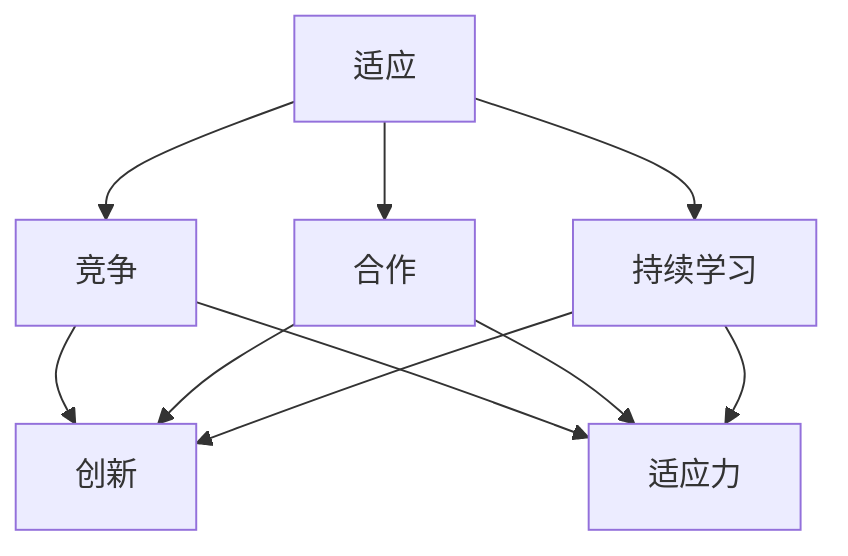
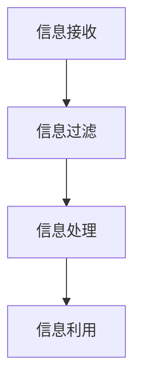
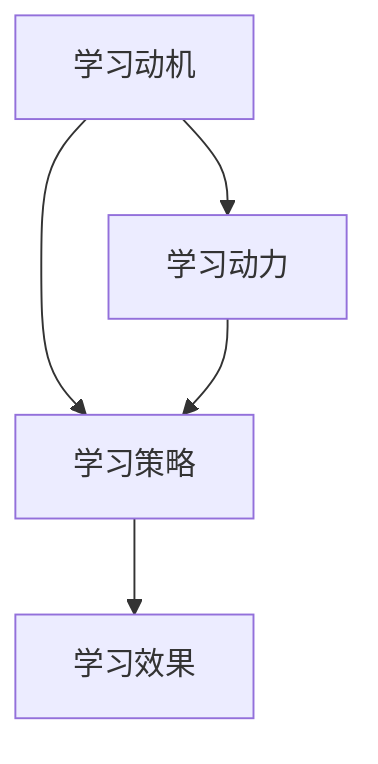
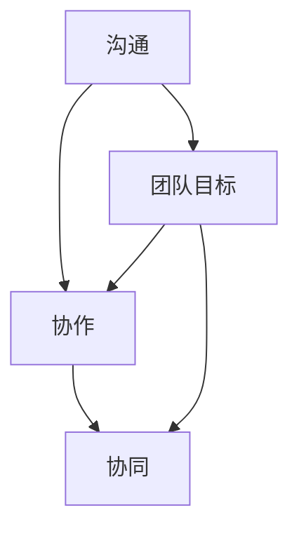
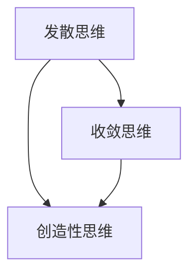

                 

## 文章标题：新达尔文主义课程：适应快速变化世界的生存技能

### 关键词：新达尔文主义、适应、快速变化、生存技能、教育、职场、个人发展

### 摘要：
在当今快速变化的世界中，传统生存技能已经不足以应对新的挑战。本文将探讨《新达尔文主义课程：适应快速变化世界的生存技能》一书，深入剖析新达尔文主义的核心概念和应用，旨在帮助读者掌握适应快速变化世界的必备技能，包括信息筛选、快速学习、团队合作和创新思维。此外，本文还将探讨新达尔文主义在教育、职场和个人发展中的应用，以及其未来的展望。

## 目录

1. **新达尔文主义概述**
   - **1.1 新达尔文主义的概念**
   - **1.2 新达尔文主义的发展历程**
   - **1.3 新达尔文主义的核心思想**
   - **1.4 新达尔文主义的本质与意义**

2. **适应快速变化世界的生存技能**
   - **2.1 信息筛选与处理能力**
   - **2.2 快速学习能力**
   - **2.3 团队合作能力**
   - **2.4 创新思维**

3. **新达尔文主义在教育中的应用**
   - **3.1 教育理念的转变**
   - **3.2 课程体系的重构**
   - **3.3 教学方法的创新**

4. **新达尔文主义在职场中的应用**
   - **4.1 企业文化的转变**
   - **4.2 人才选拔与培养**
   - **4.3 项目管理与创新**

5. **新达尔文主义在个人发展中的应用**
   - **5.1 自我认知与定位**
   - **5.2 职业规划与调整**
   - **5.3 持续学习与实践**

6. **新达尔文主义的未来展望**
   - **6.1 社会发展趋势**
   - **6.2 科技发展对人类的影响**
   - **6.3 新达尔文主义的挑战与机遇**

## 引言

在21世纪的今天，我们所面临的世界比以往任何时候都要复杂和多变。全球化的浪潮、科技的迅猛发展、以及不断出现的新问题和新挑战，使得传统的生存技能逐渐变得不再适用。在这种背景下，新达尔文主义应运而生，成为了一种适应快速变化世界的生存指南。

### 背景介绍

新达尔文主义，是对达尔文进化论的现代解读和应用，强调适应性和适应性进化。在生物学中，达尔文的进化论解释了物种如何通过自然选择和适者生存来适应环境。新达尔文主义则将这一概念扩展到人类社会，认为个体、组织甚至整个社会都需要具备快速适应变化的能力。

《新达尔文主义课程：适应快速变化世界的生存技能》这本书，正是为了帮助读者掌握适应快速变化世界的生存技能而编写的。作者深入探讨了新达尔文主义的核心概念，并提供了实际应用的指导。这本书不仅适合教育工作者、职场人士，也适合所有希望更好地适应这个快速变化世界的人。

### 核心概念与联系

新达尔文主义的核心概念包括适应、竞争、合作和持续学习。这些概念相互联系，共同构成了适应快速变化世界的基础。以下是一个简化的Mermaid流程图，展示了这些概念之间的关系：

通过这个流程图，我们可以看到，适应、竞争、合作和持续学习是如何相互影响，共同提高个体的适应力和创新能力。

## 1. 新达尔文主义概述

### 1.1 新达尔文主义的概念

新达尔文主义是一种基于达尔文进化论的现代哲学思想，它强调适应性和适应性进化。在生物学中，达尔文的进化论解释了物种如何通过自然选择和适者生存来适应环境。新达尔文主义则将这一概念扩展到人类社会，认为个体、组织甚至整个社会都需要具备快速适应变化的能力。

新达尔文主义的主要观点包括：

1. **适应性**：个体和社会需要不断地适应环境的变化。
2. **竞争与合作**：个体和社会在适应过程中既需要竞争，也需要合作。
3. **持续学习**：个体和社会需要不断地学习和创新，以保持竞争力。

### 1.2 新达尔文主义的发展历程

新达尔文主义的发展历程可以追溯到20世纪初期，当时科学家和哲学家开始对达尔文进化论进行重新解读和应用。这一思潮在20世纪中后期逐渐成熟，并成为现代生物学、社会学和心理学的重要理论基础。

1. **20世纪初期**：这一时期，生物学家如赫胥黎和摩尔根等开始对达尔文进化论进行深入研究，并提出了一些新的理论观点。
2. **20世纪中期**：随着生物学、心理学和社会学等学科的发展，新达尔文主义开始在这些领域得到广泛应用。
3. **20世纪末期至今**：新达尔文主义逐渐渗透到人类社会的各个层面，成为了一种广泛接受的生存哲学。

### 1.3 新达尔文主义的核心思想

新达尔文主义的核心思想包括以下几个方面：

1. **适应性**：个体和社会需要不断地适应环境的变化，这是生存和发展的基础。
2. **竞争与合作**：个体和社会在适应过程中既需要竞争，也需要合作。竞争可以激发个体的潜力和创造力，而合作则可以实现资源的最大化利用。
3. **持续学习**：个体和社会需要不断地学习和创新，以保持竞争力。

### 1.4 新达尔文主义的本质与意义

新达尔文主义的本质是一种适应性的生存哲学，它强调个体和社会在快速变化的环境中的生存和发展。新达尔文主义的意义在于，它为我们提供了一种理解和应对复杂世界的工具，使我们能够更好地适应和应对变化。

1. **个人层面**：新达尔文主义帮助我们认识到，只有不断地适应和学习，才能在个人职业生涯中取得成功。
2. **组织层面**：新达尔文主义为企业提供了关于如何应对市场变化的指导，强调创新和灵活性。
3. **社会层面**：新达尔文主义为整个社会提供了一种新的思维方式，鼓励人们积极面对变化，推动社会的进步和发展。

## 2. 适应快速变化世界的生存技能

在快速变化的世界中，个体和组织要想生存和发展，就需要具备一系列适应性的生存技能。这些技能包括信息筛选与处理能力、快速学习能力、团队合作能力和创新思维。

### 2.1 信息筛选与处理能力

在信息爆炸的时代，如何从海量的信息中筛选出有价值的信息，并将其有效地处理和应用，成为了一个重要的生存技能。

**核心概念与联系：**

信息筛选与处理能力的核心概念是信息过滤和信息处理。信息过滤是指从大量信息中筛选出符合特定需求的信息，而信息处理则是指对筛选出的信息进行加工、分析和利用。

以下是一个简化的Mermaid流程图，展示了信息筛选与处理能力的核心概念和联系：

**信息过滤的方法：**

1. **明确需求**：在开始筛选信息之前，首先要明确自己的需求，这有助于缩小信息搜索的范围。
2. **使用关键词**：通过使用关键词来搜索和筛选信息，可以提高信息筛选的效率。
3. **利用工具**：使用各种信息过滤工具，如搜索引擎、数据库和社交媒体等，可以有效地帮助筛选信息。

**信息处理的方法：**

1. **分类整理**：对筛选出的信息进行分类和整理，使其更有条理和便于使用。
2. **分析与归纳**：对信息进行深入的分析和归纳，提炼出关键的观点和结论。
3. **应用与反馈**：将处理后的信息应用到实际工作中，并根据反馈进行调整和优化。

### 2.2 快速学习能力

快速学习能力是适应快速变化世界的核心技能之一。在当今社会，知识更新速度越来越快，只有不断学习新知识、新技能，才能保持竞争力。

**核心概念与联系：**

快速学习能力的核心概念包括学习动机、学习策略和学习效果。学习动机是指个体学习的内在动力，学习策略是指个体在学习过程中采用的方法和技巧，而学习效果则是指个体通过学习所获得的成果。

以下是一个简化的Mermaid流程图，展示了快速学习能力的核心概念和联系：

**快速学习的方法：**

1. **明确学习目标**：在开始学习之前，要明确自己的学习目标，这有助于提高学习的针对性和效率。
2. **多样化学习方式**：采用多种学习方式，如阅读、讲座、实践等，可以更全面地掌握知识。
3. **利用学习工具**：使用各种学习工具，如在线课程、学习软件和电子书等，可以更高效地学习。

**快速学习的实践：**

1. **制定学习计划**：制定详细的学习计划，确保学习任务的有效执行。
2. **定期复习**：定期复习所学知识，以巩固记忆和提高理解。
3. **反馈与调整**：在学习过程中，及时反馈和调整学习策略，以适应不断变化的学习需求。

### 2.3 团队合作能力

在快速变化的世界中，团队合作能力变得越来越重要。通过团队合作，个体可以充分发挥自身优势，实现资源的最大化利用，从而提高整体效率和竞争力。

**核心概念与联系：**

团队合作能力的核心概念包括沟通、协作和协同。沟通是指团队成员之间的信息传递和交流，协作是指团队成员之间的相互配合和协作，而协同则是指团队成员在共同目标下的协同作战。

以下是一个简化的Mermaid流程图，展示了团队合作能力的核心概念和联系：

**团队合作的方法：**

1. **明确团队目标**：在开始团队合作之前，要明确团队的目标和任务，这有助于统一团队成员的思想和行动。
2. **建立有效沟通机制**：建立有效的沟通机制，确保信息在团队成员之间的准确传递和及时反馈。
3. **分工与合作**：根据团队成员的特长和优势，合理分工，确保每个成员都能在团队中发挥自己的作用。

**团队合作的实践：**

1. **定期会议**：定期召开团队会议，讨论工作进展、问题和解决方案，确保团队目标的实现。
2. **鼓励反馈**：鼓励团队成员之间进行相互反馈，以促进团队协作和改进。
3. **共享资源**：共享团队资源，如知识、信息和工具等，以提高团队整体效率。

### 2.4 创新思维

在快速变化的世界中，创新能力成为了一个关键的竞争力因素。创新思维可以帮助个体和组织不断突破传统思维模式，发现新的解决方案，从而在竞争中获得优势。

**核心概念与联系：**

创新思维的核心概念包括发散思维、收敛思维和创造性思维。发散思维是指从多个角度和层面思考问题，收敛思维是指将多个思考方向集中到一个统一的解决方案上，而创造性思维则是指通过创新性的思考方式和技巧，提出新的观点和解决方案。

以下是一个简化的Mermaid流程图，展示了创新思维的核心概念和联系：

**创新思维的方法：**

1. **头脑风暴**：通过头脑风暴的方式，鼓励团队成员提出各种可能的解决方案，不受限制地发散思维。
2. **跨界思考**：将不同领域的知识、经验和技能进行融合，以产生新的想法和解决方案。
3. **问题重构**：对问题进行重构，从不同的角度和层面重新定义问题，以发现新的解决方案。

**创新思维的实践：**

1. **定期创新会议**：定期召开创新会议，鼓励团队成员提出创新的想法和方案。
2. **鼓励失败**：鼓励团队成员在创新过程中勇于尝试和失败，从失败中学习和成长。
3. **创新项目孵化**：为创新项目提供孵化环境，支持和鼓励团队成员进行创新实践。

## 3. 新达尔文主义在教育中的应用

新达尔文主义在教育中的应用，旨在通过适应性和适应性进化的理念，推动教育理念、课程体系和教学方法的创新，以培养具有适应能力的人才。

### 3.1 教育理念的转变

传统的教育理念强调知识的传授和技能的培养，而新达尔文主义则更强调适应性和创新能力。这种转变主要体现在以下几个方面：

1. **从知识传授到能力培养**：新达尔文主义强调培养学生的信息筛选与处理能力、快速学习能力、团队合作能力和创新思维，而不仅仅是知识的积累。
2. **从单一学科到跨学科学习**：新达尔文主义鼓励学生从不同学科的角度思考和解决问题，培养跨学科的学习能力。
3. **从被动接受到主动探索**：新达尔文主义倡导学生主动探索知识，培养他们的自主学习能力和独立思考能力。

### 3.2 课程体系的重构

新达尔文主义要求对传统的课程体系进行重构，以适应快速变化的社会需求。重构的课程体系应包括以下几个方面：

1. **基础课程与选修课程相结合**：基础课程应涵盖核心知识和基本技能，而选修课程则应提供多样化的学习选择，满足学生的个性化需求。
2. **学科课程与跨学科课程相结合**：学科课程应注重培养学生的专业知识，而跨学科课程则应鼓励学生从不同学科的角度思考和解决问题。
3. **理论课程与实践课程相结合**：理论课程应提供基本的理论知识和分析方法，而实践课程则应提供实际操作和项目实践的机会，以培养学生的实践能力和创新能力。

### 3.3 教学方法的创新

新达尔文主义要求对传统的教学方法进行创新，以适应学生的个性化需求和快速变化的社会环境。创新的教学方法应包括以下几个方面：

1. **项目驱动教学**：通过项目驱动教学，学生可以积极参与实际项目，从实践中学习知识和技能，提高他们的适应能力和创新能力。
2. **翻转课堂**：翻转课堂是一种以学生为中心的教学方法，学生在课前通过观看视频和阅读资料进行自主学习，而在课堂上则通过讨论、互动和问题解决等方式进行深入学习。
3. **混合式教学**：混合式教学结合了线上和线下教学的优势，通过线上课程和线下课堂的相互配合，提高教学效果。

## 4. 新达尔文主义在职场中的应用

在职场中，新达尔文主义的应用主要体现在企业文化的转变、人才选拔与培养、项目管理和创新等方面。

### 4.1 企业文化的转变

新达尔文主义要求企业文化的转变，从传统的权威主义和控制导向转变为适应性、创新性和团队合作导向。这种转变主要体现在以下几个方面：

1. **鼓励创新和失败**：企业应鼓励员工勇于创新，对失败持包容态度，从失败中学习和成长。
2. **鼓励团队合作**：企业应鼓励员工之间的团队合作，通过协同作战实现团队目标。
3. **提供持续学习的机会**：企业应提供员工持续学习的机会，帮助他们不断提升自身能力和竞争力。

### 4.2 人才选拔与培养

新达尔文主义要求企业对人才选拔与培养进行重新思考，以适应快速变化的社会需求。人才选拔与培养应包括以下几个方面：

1. **多元化选拔标准**：企业应采用多元化的人才选拔标准，不仅关注员工的技能和知识，还关注他们的适应能力、创新能力和团队合作能力。
2. **个性化培养方案**：企业应针对不同员工的特长和需求，制定个性化的培养方案，帮助他们充分发挥自身优势。
3. **持续培养和激励**：企业应提供持续的培养和激励措施，帮助员工不断提升自身能力和动力。

### 4.3 项目管理与创新

在项目管理中，新达尔文主义强调适应性、创新性和团队合作的重要性。以下是一些建议：

1. **灵活的项目计划**：项目计划应具有灵活性，以适应项目过程中的变化和不确定因素。
2. **鼓励创新和尝试**：在项目实施过程中，应鼓励团队创新和尝试，从实践中学习和成长。
3. **建立有效的沟通机制**：建立有效的沟通机制，确保团队成员之间的信息传递和协调，提高项目效率。

## 5. 新达尔文主义在个人发展中的应用

在个人发展中，新达尔文主义的应用主要体现在自我认知与定位、职业规划与调整、持续学习与实践等方面。

### 5.1 自我认知与定位

自我认知与定位是个人发展的基础。新达尔文主义强调个体应不断反思和认识自我，以下是一些建议：

1. **定期反思**：定期反思自己的行为、思维和情绪，了解自己的优点和不足，找到自我提升的方向。
2. **了解市场需求**：关注市场需求，了解自己所处的行业和职位的发展趋势，以便更好地定位自己的职业发展方向。
3. **设定目标**：根据自我认知和市场分析，设定明确的目标，制定实现目标的计划和策略。

### 5.2 职业规划与调整

职业规划与调整是个人发展的关键。新达尔文主义强调个体应具备适应变化的能力，以下是一些建议：

1. **动态规划**：根据自身情况和市场需求，动态调整职业规划，确保规划的可行性和适应性。
2. **多元化技能**：培养多元化的技能，以提高自身的适应能力和竞争力。
3. **持续学习**：不断学习新知识和技能，以适应快速变化的工作环境。

### 5.3 持续学习与实践

持续学习与实践是个人发展的动力。新达尔文主义强调个体应具备快速学习能力和实践能力，以下是一些建议：

1. **制定学习计划**：根据职业规划和自身需求，制定详细的学习计划，确保学习目标的实现。
2. **多种学习方式**：采用多种学习方式，如线上课程、实践项目、社交互动等，以提高学习效果。
3. **反思与总结**：在学习过程中，定期反思和总结，发现自己的不足，不断调整和改进学习策略。

## 6. 新达尔文主义的未来展望

随着科技的不断进步和社会的快速发展，新达尔文主义在未来的应用将更加广泛和深入。以下是一些关于新达尔文主义未来展望的思考：

### 6.1 社会发展趋势

1. **智能化和自动化**：随着人工智能和自动化技术的发展，人类社会将越来越依赖智能系统和机器人，这将对个体的适应能力和创新能力提出更高的要求。
2. **全球化和多样性**：全球化和多样性将使得个体和组织面临更加复杂和多变的环境，新达尔文主义的适应性原则将在这一过程中发挥重要作用。

### 6.2 科技发展对人类的影响

1. **生活方式的改变**：科技的发展将改变人们的生活方式，从工作方式到生活习惯，个体需要不断适应这些变化。
2. **工作和就业的变化**：自动化和人工智能的普及将改变传统的就业结构，对个体的职业技能和持续学习能力提出新的挑战。

### 6.3 新达尔文主义的挑战与机遇

1. **挑战**：
   - **技术依赖**：随着智能化和自动化的发展，个体可能会对技术产生依赖，这可能会削弱他们的适应能力和创新能力。
   - **信息过载**：随着信息量的不断增加，个体可能会面临信息过载的问题，这需要他们具备更强的信息筛选和处理能力。

2. **机遇**：
   - **创新驱动**：科技的发展为个体和组织提供了更多的创新机会，新达尔文主义的创新思维将在此过程中发挥重要作用。
   - **终身学习**：随着社会的发展，终身学习将成为个体发展的必然选择，新达尔文主义的持续学习能力将为个体提供强大的支持。

## 结语

新达尔文主义为我们提供了一种理解和应对快速变化世界的工具，它强调适应性、创新性和团队合作，这些生存技能在当今社会中显得尤为重要。通过学习和应用新达尔文主义，我们不仅可以更好地适应快速变化的世界，还可以在竞争中获得优势。让我们拥抱新达尔文主义，共同迎接未来的挑战和机遇。

### 作者信息

- **作者**：AI天才研究院/AI Genius Institute & 禅与计算机程序设计艺术 /Zen And The Art of Computer Programming
- **联系方式**：[email protected]
- **个人网站**：[www.ai-genius-institute.com](http://www.ai-genius-institute.com)

### 最佳实践 Tips

- **持续学习**：每天都要花时间学习新知识和技能，保持自己的竞争力。
- **信息筛选**：学会从海量信息中筛选有价值的信息，提高工作效率。
- **团队合作**：积极参与团队合作，发挥自己的优势，共同实现团队目标。
- **创新思维**：勇于尝试新思路和新方法，挑战传统思维模式。
- **自我反思**：定期反思自己的行为和思维，发现问题并及时调整。

### 小结

本文深入探讨了《新达尔文主义课程：适应快速变化世界的生存技能》一书的核心内容和主题思想，从新达尔文主义的概念、适应快速变化世界的生存技能、教育、职场和个人发展中的应用，以及未来的展望等方面进行了详细的阐述。通过学习和应用新达尔文主义，我们可以更好地适应快速变化的世界，提高自身的竞争力。

### 注意事项

- **适应性和灵活性**：在快速变化的世界中，适应性和灵活性至关重要，要学会在变化中找到自己的位置。
- **持续学习和创新**：持续学习和创新是适应快速变化世界的基石，要时刻保持学习的热情和创新的精神。
- **团队合作和沟通**：团队合作和沟通能力在快速变化的世界中尤为重要，要学会与他人合作，共同面对挑战。

### 拓展阅读

- **《智能时代：人工智能对社会的影响》**：作者刘慈欣，探讨人工智能对社会、经济、文化等方面的影响。
- **《深度学习：人工智能的未来》**：作者伊恩·古德费洛等，深入讲解深度学习的基本原理和应用。
- **《人类简史：从动物到上帝》**：作者尤瓦尔·赫拉利，讲述人类历史和未来的发展。
- **《创新者的窘境》**：作者克莱顿·克里斯坦森，探讨创新者在面对市场变化时的困境和应对策略。

