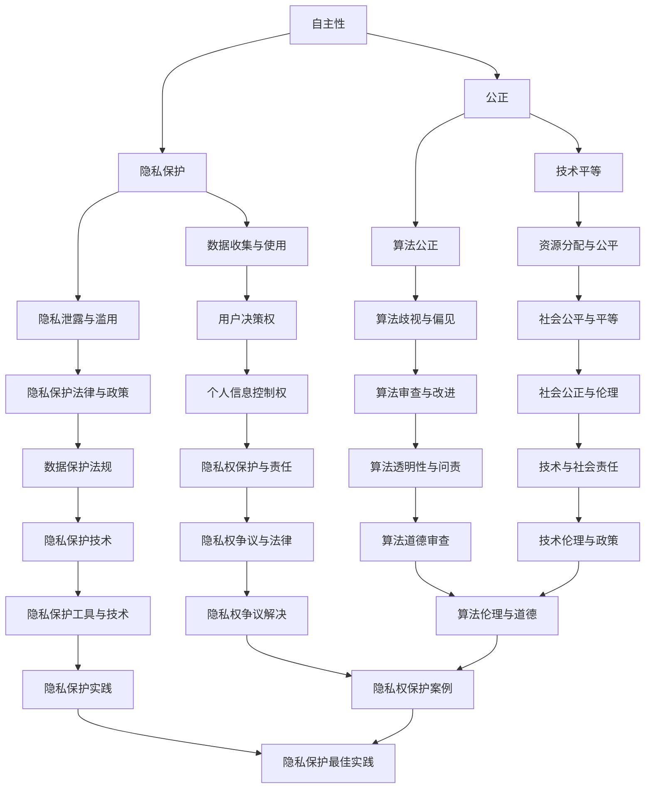
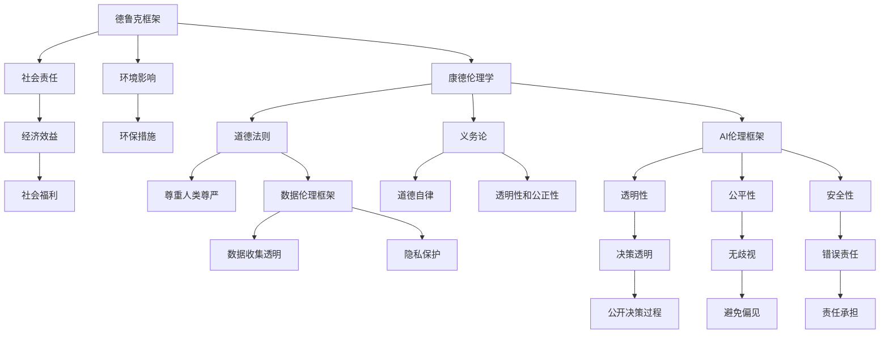

                 

### 文章标题

# 新道德主义思想库：科技发展中的伦理重建

### 关键词

- 新道德主义
- 科技发展
- 伦理重建
- 道德概念
- 技术伦理框架
- 政策与监管
- 案例研究

### 摘要

本文旨在探讨新道德主义在科技发展中的重要性，以及如何通过伦理重建来解决当前技术领域面临的道德挑战。文章首先回顾了技术伦理的历史背景，然后定义了关键道德概念，并通过具体案例展示了技术伦理的应用。随后，文章讨论了现有技术伦理框架的适用性，并提出了新的伦理框架建议。接着，文章分析了政策与监管在促进技术伦理发展中的作用，并提供了一些实际应用案例。最后，文章探讨了未来技术趋势的伦理影响，并提出了伦理重建的方向。通过这一系列的分析和讨论，本文旨在为科技发展中的伦理问题提供深入的见解和实用的建议。

## 引言

在人类历史上，科技的飞速发展一直是一个不变的主题。从农业革命到工业革命，再到信息革命，技术进步极大地改变了我们的生活方式和社会结构。然而，随着技术的不断演进，新的伦理问题也应运而生。这些问题不仅挑战了传统的道德观念，也要求我们重新审视科技发展的伦理维度。

新道德主义（New Moralism）作为一种哲学思想，强调在现代社会中，道德和伦理问题的重要性不容忽视。它主张，在科技发展的过程中，必须充分考虑道德和伦理因素，以确保技术进步不会对社会造成负面影响。本文旨在探讨新道德主义在科技发展中的重要性，以及如何通过伦理重建来解决当前技术领域面临的道德挑战。

本文的结构如下：首先，我们将回顾技术伦理的历史背景，探讨其发展脉络和演变过程。接着，我们将定义一些关键道德概念，包括自主性、隐私和公正等，并解释这些概念在技术伦理中的意义。随后，通过具体案例研究，我们将展示技术伦理在现实中的应用和挑战。然后，我们将分析现有技术伦理框架的适用性，并提出新的伦理框架建议。接下来，我们将探讨政策与监管在促进技术伦理发展中的作用，并提供一些实际应用案例。最后，我们将探讨未来技术趋势的伦理影响，并总结本文的主要观点，提出伦理重建的方向和建议。

### 技术伦理的历史背景

技术伦理的兴起可以追溯到20世纪中叶，当时随着计算机科学和信息技术的快速发展，人们开始意识到技术不仅是一种工具，还可能对人类社会产生深远的影响。这一认识促使学者们开始研究技术对伦理和道德的潜在影响，从而形成了技术伦理学（Technology Ethics）这一新兴领域。

早期技术伦理的研究主要集中在计算机科学和信息技术领域。1950年代，计算机科学家约翰·普雷斯珀·埃克斯利（John Presper Eckert）和约翰·威廉·马奇（John William Mauchly）在设计ENIAC（Electronic Numerical Integrator and Computer）时，首次提出了技术伦理问题。他们意识到，计算机不仅用于计算，还可以用于控制复杂的系统，这引发了关于计算机应用道德问题的讨论。

随着计算机技术的发展，1960年代和1970年代出现了“计算机伦理学”（Computer Ethics）这一术语。这个时期，学者们开始系统地探讨计算机技术带来的伦理挑战，包括隐私侵犯、计算机犯罪、数据安全和人工智能的道德应用等。其中，1972年保罗·拉法格（Paul R. Lawrence）和雷蒙德·高斯内尔（Raymond Goethals）发表的《计算机伦理：专业的责任》被认为是计算机伦理学的奠基之作。这篇文章强调了计算机专业人员在设计、开发和维护系统时需要承担的伦理责任。

进入1980年代和1990年代，互联网的兴起和普及使得技术伦理的研究领域进一步扩展。随着网络技术的快速发展，新的伦理问题如隐私、网络安全、网络犯罪和数字版权等逐渐成为关注的焦点。这个时期，学者们开始探讨技术对个人隐私的影响，以及如何在技术设计和政策制定中保护隐私。

进入21世纪，技术的快速发展带来了更多的伦理挑战。人工智能、大数据、生物技术和机器人技术的发展，使得技术伦理问题变得更加复杂和多样化。人工智能带来的自动化和机器学习技术，引发了关于就业、歧视和透明度等伦理问题的讨论。生物技术的发展，如基因编辑和克隆技术，引发了关于人类身份、人类尊严和生物多样性的伦理争论。机器人技术的兴起，则引发了关于机器人权利和责任、人机关系的伦理问题。

在技术伦理的历史发展中，不同时期面临的主要伦理问题有所不同，但核心议题始终围绕着如何平衡技术的进步与社会的利益。早期的计算机伦理主要关注隐私和信息安全，而随着互联网和移动技术的发展，隐私和网络安全问题变得更加复杂。21世纪的技术伦理则更加关注人工智能、大数据和生物技术等前沿领域，探讨这些技术在提升生活质量和促进社会进步的同时，如何避免对人类和社会产生负面影响。

总的来说，技术伦理的历史背景反映了人类对技术影响的不断认识和反思。随着技术的不断进步，技术伦理学将继续面临新的挑战和机遇，要求我们不断更新和深化对技术伦理的理解，以应对快速变化的技术环境。

### 关键道德概念

在探讨新道德主义在科技发展中的重要性时，我们首先需要明确几个核心道德概念，这些概念在技术伦理中具有基础性作用。这些概念包括自主性、隐私和公正，它们不仅构成了道德判断的基础，还在科技领域的应用中具有重要的指导意义。

#### 自主性

自主性（Autonomy）是指个体能够自主作出决策和选择的能力。在道德哲学中，自主性被视为尊重人类尊严和自由的重要表现。在科技领域，自主性的重要性体现在以下几个方面：

1. **人工智能与自主性**：
   - 随着人工智能（AI）技术的快速发展，机器开始具备一定的自主决策能力。然而，如何确保这些决策符合人类的道德价值观，是一个重要的伦理问题。
   - 例如，自动驾驶汽车需要在紧急情况下做出决策，这些决策需要遵循道德原则，如最小伤害原则（Principle of Least Harm）。

2. **用户隐私与自主性**：
   - 在互联网时代，用户的数据隐私权受到威胁，保护用户自主权成为技术伦理的重要议题。例如，用户有权选择是否分享其个人数据，以及如何使用这些数据。

3. **伦理审查与自主性**：
   - 在科研和开发过程中，伦理审查委员会需要确保项目符合道德规范，这不仅是对科研人员的自主性的一种保障，也是对公众利益的一种保护。

#### 隐私

隐私（Privacy）是指个体对自己信息的控制权和保护权。隐私权是现代社会中的一项基本人权，它关系到个体的自由和尊严。在科技领域，隐私的重要性体现在以下几个方面：

1. **数据收集与隐私**：
   - 在大数据时代，企业和服务提供商收集和分析大量用户数据，这引发了关于隐私泄露和数据滥用的担忧。
   - 例如，社交媒体平台如何处理用户数据，以及如何保护用户隐私，是技术伦理的重要议题。

2. **技术手段与隐私**：
   - 随着物联网（IoT）和智能设备的发展，个人隐私的保护变得更加复杂。例如，智能家居设备可能会收集用户的日常生活数据，这些数据如何被使用和存储，需要受到严格的隐私保护。

3. **隐私权与公共利益**：
   - 在某些情况下，为了公共利益，隐私权可能需要做出一定的让步。例如，在公共卫生危机中，收集和分析个人健康数据可能有助于控制疫情的传播，但这种数据的使用需要遵守明确的道德规范。

#### 公正

公正（Justice）是指社会资源和机会的公平分配，以及对个体权利的平等保护。在科技领域，公正的重要性体现在以下几个方面：

1. **技术平等与公正**：
   - 技术的发展应该服务于所有人，而不应加剧社会不平等。例如，互联网普及和教育资源的不均衡，可能导致技术发展带来的利益分配不均。

2. **算法公正与歧视**：
   - 人工智能算法在决策时可能存在偏见，这种偏见可能导致不公平的结果。例如，招聘系统中的算法可能无意中歧视某些群体，这需要对算法进行公正性审查和改进。

3. **责任与公正**：
   - 在技术事故和伦理争议中，责任的归属和承担是公正问题的重要方面。例如，当自动驾驶汽车发生事故时，如何确定责任方，需要基于公正的原则来处理。

#### 关系架构 Mermaid 流程图

为了更好地理解这些核心道德概念之间的关系，我们可以使用Mermaid流程图来展示它们之间的相互作用：



通过这个流程图，我们可以清晰地看到自主性、隐私和公正在技术伦理中的相互作用和依赖关系。它们共同构成了技术伦理分析的基础，为我们理解和解决技术领域的伦理挑战提供了有力的框架。

### 案例研究：技术伦理的现实挑战

为了更好地理解技术伦理在现实中的应用和挑战，我们可以通过几个具体的案例研究来探讨不同领域中的伦理困境。这些案例涵盖了人工智能、生物技术和互联网等多个前沿科技领域，展示了技术进步带来的道德问题和解决策略。

#### 人工智能：算法歧视与隐私侵犯

案例1：招聘系统中的算法歧视
- **背景**：一家大型公司使用了一种基于人工智能的招聘系统，旨在通过分析简历和面试数据来选择最合适的候选人。
- **问题**：研究发现，该系统存在对某些种族和性别的不公平偏好，导致这些群体被歧视。
- **伦理挑战**：算法歧视违反了公平和公正的原则，对受歧视群体的尊严和就业机会造成负面影响。
- **解决方案**：为了解决这一问题，公司需要对算法进行详细的审查和改进，确保算法在决策过程中不会产生歧视。此外，公司可以引入多层次的伦理审查机制，确保招聘过程的透明和公正。

案例2：个人隐私侵犯
- **背景**：某些社交平台利用人工智能技术分析用户的行为和偏好，以推送个性化广告。
- **问题**：这种数据收集和分析方式可能导致用户的个人隐私被侵犯，用户的敏感信息可能被泄露或滥用。
- **伦理挑战**：个人隐私权受到威胁，用户的数据安全和隐私权受到侵害。
- **解决方案**：平台需要制定严格的隐私保护政策，明确告知用户数据收集和使用的目的，并给予用户选择是否同意其数据被收集的权利。此外，平台应采用加密技术和匿名化处理，确保用户数据的隐私和安全。

#### 生物技术：基因编辑与伦理争议

案例1：基因编辑婴儿事件
- **背景**：2018年，中国科学家贺建奎宣布利用CRISPR-Cas9基因编辑技术成功诞生了一对基因编辑婴儿。
- **问题**：这一事件引发了全球伦理争议，争议的焦点在于基因编辑技术的道德边界和潜在风险。
- **伦理挑战**：基因编辑技术可能导致基因突变，影响后代的健康和多样性。此外，这一事件可能引发关于人类尊严和生物伦理的深刻思考。
- **解决方案**：为了解决这一伦理挑战，需要建立严格的国际基因编辑伦理规范，明确基因编辑技术的适用范围和限制。科研机构和科学家应遵守这些规范，确保在开展基因编辑研究时，充分评估潜在的风险和道德责任。

案例2：基因测序与隐私问题
- **背景**：随着基因测序技术的普及，越来越多的人选择进行基因测序以了解自身的健康风险。
- **问题**：基因测序数据可能包含敏感的健康信息，这些信息如何被保护和管理，是一个重要的伦理问题。
- **伦理挑战**：基因测序数据的隐私泄露可能导致用户遭受歧视，影响其就业和保险权益。
- **解决方案**：基因测序公司需要制定严格的隐私保护政策，确保用户数据的安全和隐私。同时，需要建立透明的数据管理和共享机制，确保用户对自身数据的控制权和知情权。

#### 互联网：网络安全与数据滥用

案例1：网络隐私侵犯
- **背景**：某些互联网公司通过分析用户行为数据，进行精准广告投放，但未充分保护用户的隐私。
- **问题**：用户隐私受到侵犯，个人信息被滥用，可能导致隐私泄露和身份盗窃。
- **伦理挑战**：用户隐私权受到侵害，可能引发社会信任危机。
- **解决方案**：互联网公司需要严格遵守隐私保护法规，明确告知用户数据收集和使用的目的，并提供用户选择退出数据收集的途径。此外，公司应采用先进的数据加密技术，确保用户数据的隐私和安全。

案例2：网络安全攻击
- **背景**：网络攻击越来越频繁，黑客通过入侵系统获取用户数据，导致大规模数据泄露。
- **问题**：网络安全威胁对用户的隐私和财产安全构成严重威胁。
- **伦理挑战**：网络安全威胁不仅侵害个人利益，还可能影响整个社会的稳定和安全。
- **解决方案**：需要加强网络安全防护，提高系统安全性，定期进行安全审计和漏洞修复。同时，政府和企业应加强合作，制定和完善网络安全法规，共同应对网络安全威胁。

通过这些案例研究，我们可以看到技术伦理在现实中的应用和挑战。这些案例不仅展示了技术进步带来的道德问题，也提供了应对这些挑战的解决方案。在技术快速发展的时代，我们需要不断反思和改进技术伦理，确保技术进步能够造福人类，而不是造成新的道德困境。

### 技术伦理框架

在探讨技术伦理的框架时，我们需要理解现有的主要伦理框架，以及它们在应对科技发展中的伦理挑战时的适用性和局限性。以下是一些重要的技术伦理框架，包括德鲁克框架、功利主义和康德伦理学等。

#### 德鲁克框架

德鲁克框架（Drucker’s Framework）是由管理大师彼得·德鲁克（Peter Drucker）提出的，主要关注企业和社会的责任。德鲁克框架强调企业不仅要追求经济效益，还要考虑社会责任和环境影响。

1. **社会责任**：企业需要承担社会责任，确保其活动不会对社会造成负面影响。例如，在技术开发过程中，企业应考虑到技术可能带来的就业影响和社会公平问题。
2. **环境影响**：企业应采取环保措施，减少技术活动对环境的负面影响。例如，在开发可持续能源技术时，企业应确保其生产过程不会产生过多的污染物。

#### 功利主义

功利主义（Utilitarianism）是一种以最大幸福为目标的伦理学理论，主张行为的好坏取决于其产生的后果。在技术伦理中，功利主义关注技术的应用是否能够最大化社会的整体福利。

1. **幸福最大化**：技术的应用应能够提升人类的生活质量和社会福祉。例如，医疗技术的进步应旨在提高患者的生命质量和健康水平。
2. **效益与成本的平衡**：在决策过程中，应权衡技术的效益和成本，确保技术发展能够带来最大的社会利益。例如，在开发新型药物时，企业需要考虑治疗成本与疗效之间的平衡。

#### 康德伦理学

康德伦理学（Kantian Ethics）基于道德法则和义务论，主张行为的好坏取决于其是否符合道德原则。康德伦理学强调个体自主性和道德自律。

1. **道德法则**：技术行为应符合普遍的道德法则，如尊重人类尊严和自主性。例如，在处理用户数据时，企业应尊重用户的隐私权，遵守数据保护法规。
2. **义务论**：技术行为应基于道德义务，而不是仅仅出于功利目的。例如，在人工智能应用中，开发者应确保算法的决策符合道德原则，而不是仅仅追求经济效益。

#### 新技术伦理框架

随着科技的发展，现有伦理框架的适用性受到挑战，需要提出新的伦理框架以应对新的伦理挑战。

1. **数据伦理框架**：随着大数据和人工智能技术的发展，数据伦理框架显得尤为重要。这个框架强调数据收集、使用和共享的透明性和公正性。例如，应确保用户在数据收集过程中明确了解其数据将被如何使用，以及如何保护其数据隐私。
2. **AI伦理框架**：针对人工智能的快速发展，AI伦理框架旨在确保人工智能系统的透明性、公平性和安全性。例如，AI系统应公开其决策过程，确保不产生偏见和歧视，并在出现错误时能够承担责任。
3. **生物伦理框架**：在生物技术领域，生物伦理框架关注基因编辑、克隆技术等前沿领域的伦理问题。这个框架强调对人类尊严和生物多样性的尊重，确保生物技术的应用不会对人类和社会造成不可逆转的损害。

#### 关系架构 Mermaid 流程图

为了更好地理解这些技术伦理框架之间的关系，我们可以使用Mermaid流程图来展示它们之间的相互作用：



通过这个流程图，我们可以清晰地看到不同技术伦理框架之间的相互关系和作用。这些框架共同构成了技术伦理分析的基础，为我们理解和解决技术领域的伦理挑战提供了有力的工具。

### 政策与监管的角色

在科技发展的过程中，政策与监管扮演着至关重要的角色。它们不仅为技术创新提供了法律框架，还旨在确保技术的发展不会对社会和个人造成负面影响。以下将从政策制定、法律法规和监管机构三个方面探讨政策与监管在促进技术伦理发展中的关键作用。

#### 政策制定

政策制定是促进技术伦理发展的第一步，它为技术创新提供了明确的方向和指导原则。良好的政策制定能够平衡技术创新和社会利益，确保技术的发展符合道德和伦理标准。

1. **促进创新与伦理审查**：政策制定者需要在鼓励技术创新的同时，确保技术发展的道德合法性。例如，在人工智能和基因编辑等前沿领域，政策可以要求在技术开发和应用前进行全面的伦理审查，以评估技术可能带来的风险和道德问题。
2. **鼓励伦理研究**：政府可以通过资金支持、科研基金等方式，鼓励学者和研究人员开展技术伦理研究，从而为政策制定提供科学依据。这不仅有助于提高公众对技术伦理问题的认识，还能推动技术伦理理论的发展。
3. **国际协调**：在全球化背景下，政策制定需要考虑国际间的协调与合作。国际组织可以制定统一的伦理标准和规范，以减少跨国技术转移和应用中的伦理风险。

#### 法律法规

法律法规是政策与监管的核心，它们为技术伦理提供了法律依据和执行手段。通过制定和实施相关法律法规，政府可以确保技术的发展遵循道德和伦理原则。

1. **隐私保护法律**：随着大数据和人工智能技术的发展，个人隐私保护成为重要议题。政府应制定和完善隐私保护法律，明确数据收集、使用和共享的合法边界，保障用户的隐私权。
2. **数据安全法规**：数据安全是科技发展的基础，政府应制定数据安全法规，确保企业和机构在数据处理过程中采取必要的安全措施，防止数据泄露和滥用。
3. **科技伦理法**：在人工智能、生物技术等前沿领域，政府应制定专门的科技伦理法，明确技术的道德边界和应用规范。例如，针对基因编辑技术，应制定明确的伦理标准和审批程序，防止技术滥用和伦理争议。

#### 监管机构

监管机构在技术伦理发展中发挥着监督和执行的作用，确保法律法规得到有效实施。有效的监管体系能够及时发现和纠正技术发展中的伦理问题，保护公众利益。

1. **设立专门的监管机构**：政府可以设立专门的科技伦理监管机构，负责审查和监督技术开发和应用过程中的伦理问题。例如，可以在政府部门内设立数据伦理委员会，负责评估大数据和人工智能项目的伦理影响。
2. **跨部门合作**：技术伦理问题往往涉及多个部门和领域，需要跨部门合作进行监管。政府应建立跨部门的合作机制，确保不同部门在技术伦理监管中协同工作，形成合力。
3. **公众参与**：监管机构在制定和执行政策时应充分考虑公众意见，确保技术发展符合社会利益和道德标准。可以通过公众咨询、听证会和公开征求意见等方式，增强政策的透明度和公众参与度。

#### 挑战与未来方向

尽管政策与监管在促进技术伦理发展方面发挥了重要作用，但在实际操作中仍面临诸多挑战。

1. **法律滞后性**：科技发展迅速，法律法规的制定往往滞后于技术进步，导致法律对新兴技术伦理问题的覆盖不足。
2. **执行力度不足**：法律法规的执行力度直接影响其有效性。一些国家和地区的法律法规虽然较为完善，但执行不力，导致监管效果不佳。
3. **跨国协调**：跨国技术转移和应用中的伦理监管需要国际协调。不同国家和地区的法律和文化差异，增加了跨国技术伦理监管的复杂性。

面对这些挑战，未来政策与监管的发展方向包括：

1. **加强法律和制度创新**：随着科技的发展，政府应不断更新和完善法律法规，以应对新兴技术伦理问题。
2. **提升监管效能**：通过提高监管机构的执行能力和技术支持，确保法律法规得到有效执行。
3. **加强国际合作**：在国际层面，推动建立统一的技术伦理标准和监管框架，促进跨国技术伦理监管的协调与合作。

总之，政策与监管在促进技术伦理发展中的关键作用不可忽视。通过有效的政策制定、完善的法律法规和强有力的监管机构，我们可以确保科技发展符合道德和伦理原则，为社会的可持续发展提供坚实保障。

### 实际应用案例：伦理重建的成功实践

在探讨新道德主义思想库如何在科技发展中推动伦理重建时，我们可以通过一些实际应用案例来展示成功实践和效果。以下案例涵盖了人工智能、大数据和生物技术等前沿领域，展示了如何通过伦理重建实现技术进步与社会价值的和谐统一。

#### 案例一：人工智能伦理框架的应用

- **背景**：随着人工智能技术的广泛应用，算法歧视和隐私侵犯等问题日益突出。为了解决这些问题，谷歌公司制定了一套详细的人工智能伦理框架。
- **具体措施**：
  - **透明性**：谷歌要求所有人工智能项目必须公开其算法决策过程，确保用户了解算法如何工作。
  - **公平性**：谷歌在招聘和培训过程中，强调消除性别和种族偏见，确保人工智能系统在决策时不会产生歧视。
  - **隐私保护**：谷歌通过加密技术和隐私保护机制，确保用户数据在收集、存储和使用过程中的安全。
- **效果**：通过这些措施，谷歌在多个领域取得了显著成果，如自动驾驶汽车项目的公平性和透明度得到了广泛认可，用户对谷歌人工智能产品的信任度显著提高。
- **启示**：这一案例表明，通过建立明确的人工智能伦理框架，可以有效解决技术带来的伦理问题，推动人工智能技术的健康、可持续发展。

#### 案例二：大数据伦理框架的应用

- **背景**：大数据技术的快速发展带来了数据隐私和滥用的风险。为了应对这一问题，欧盟推出了《通用数据保护条例》（GDPR）。
- **具体措施**：
  - **用户知情权**：GDPR要求企业必须在收集和使用用户数据前，获得用户的明确同意。
  - **数据透明性**：企业需要详细记录数据的收集、处理和共享过程，确保用户了解其数据的使用情况。
  - **数据保护**：GDPR规定了严格的数据保护措施，如数据匿名化和加密技术，确保用户数据的安全。
- **效果**：自GDPR实施以来，欧洲的数据隐私保护水平显著提高，用户对数据安全的信心增强，企业的数据管理也变得更加规范。
- **启示**：这一案例说明，通过制定和实施严格的法律法规，可以有效保护用户隐私，促进大数据技术的健康、可持续发展。

#### 案例三：生物技术伦理框架的应用

- **背景**：基因编辑等生物技术具有巨大的潜力，但也引发了伦理争议。为了规范这些技术的发展，科学家们制定了《人类基因编辑国际委员会》的伦理准则。
- **具体措施**：
  - **人类尊严**：准则强调基因编辑技术必须尊重人类尊严，避免对人类基因库的不可逆转的改变。
  - **风险控制**：在基因编辑项目中，必须进行详细的风险评估，确保技术风险在可接受范围内。
  - **透明沟通**：科学家和决策者应与公众进行透明沟通，确保社会对基因编辑技术的了解和接受。
- **效果**：通过这些措施，国际社会对基因编辑技术的伦理争议有所缓解，部分国家的基因编辑研究项目也得到了公众的认可和支持。
- **启示**：这一案例表明，通过建立全球性的伦理准则，可以有效规范生物技术的发展，确保技术进步与社会价值的和谐统一。

#### 案例四：智能城市伦理框架的应用

- **背景**：智能城市建设涉及大量的数据收集和应用，引发了隐私和公共安全的伦理问题。为了解决这些问题，一些城市出台了智能城市伦理框架。
- **具体措施**：
  - **数据最小化**：智能城市建设应遵循数据最小化原则，只收集必要的数据，并确保数据的合理使用。
  - **公众参与**：在智能城市项目的设计和实施过程中，应广泛征求公众意见，确保项目符合社会利益和道德标准。
  - **透明监督**：建立独立的监督机构，对智能城市的运行进行定期审查，确保项目符合伦理要求。
- **效果**：通过这些措施，一些智能城市在隐私保护和公共安全方面取得了显著成效，公众对智能城市的信任度提高。
- **启示**：这一案例说明，通过建立智能城市伦理框架，可以有效平衡技术进步与社会利益，推动智能城市的可持续发展。

通过这些实际应用案例，我们可以看到新道德主义思想库在科技发展中的重要作用。通过建立明确的伦理框架，实施严格的法律法规和有效的监管措施，我们可以确保技术在推动社会进步的同时，符合道德和伦理原则，实现科技与社会的和谐发展。

### 未来趋势：科技发展中的伦理挑战

在探讨未来科技发展中的伦理挑战时，我们需要关注几个关键领域，包括人工智能、生物技术和网络空间。这些领域的发展不仅带来了前所未有的机遇，也引发了深刻的伦理困境和道德争议。

#### 人工智能（AI）

人工智能（AI）作为当前科技发展的热点，其快速进步在各个领域都产生了深远影响。然而，随着AI技术的普及，一系列伦理挑战也应运而生。

1. **算法歧视**：AI算法在决策过程中可能基于历史数据中的偏见，导致对某些群体的不公平对待。例如，招聘系统中的AI算法可能无意中歧视女性或少数群体。
   - **解决方案**：为了解决这一问题，需要开发公平性算法，并确保AI系统的设计、训练和部署过程透明，接受外部审计和监督。
   - **数学模型**：
     ```latex
    公平性度量：\\
     Fairness Metric = \\frac{Accuracy_{group}}{Accuracy_{all}} \\
     其中，Accuracy_{group} 表示特定群体的准确率，Accuracy_{all} 表示整体准确率。
     ```

2. **自动化决策**：随着AI技术的自动化程度提高，一些关键决策（如医疗诊断和司法判决）可能完全由机器完成，这引发了关于责任归属的伦理争议。
   - **解决方案**：需要明确AI系统的责任归属，制定相关法律法规，确保在AI系统出现错误时，能够追究到具体的责任人。
   - **算法原理**：
     ```python
     # 自动化决策算法的伪代码
     def automated_decision(data):
         # 输入：data - 决策所需的数据
         # 输出：decision - 自动化决策结果
         prediction = AI_model.predict(data)
         decision = interpret_prediction(prediction)
         return decision
     ```

3. **隐私侵犯**：AI技术通常需要大量用户数据，这可能导致个人隐私的泄露和滥用。
   - **解决方案**：需要加强数据隐私保护措施，如数据匿名化和加密技术，确保用户数据在收集、存储和使用过程中的安全性。

#### 生物技术

生物技术的快速发展，特别是基因编辑和克隆技术，引发了关于人类尊严、生物多样性和生态平衡的伦理争议。

1. **基因编辑**：基因编辑技术如CRISPR-Cas9为治疗遗传病提供了新的可能性，但同时也引发了关于基因编辑伦理的广泛讨论。
   - **解决方案**：需要建立国际性的伦理准则，确保基因编辑技术的应用符合道德和伦理标准。例如，限制人类胚胎基因编辑，确保不损害人类基因库的多样性和平衡。
   - **数学模型**：
     ```latex
     基因编辑安全评估模型：\\
     Safety Score = \\frac{Potential_Benefits}{Potential_Risks} \\
     其中，Potential_Benefits 表示潜在好处，Potential_Risks 表示潜在风险。
     ```

2. **克隆技术**：克隆技术可能用于医学治疗，但也引发了关于人类身份和尊严的伦理问题。
   - **解决方案**：需要制定严格的法律和道德规范，明确克隆技术的适用范围和限制。例如，禁止非医学目的的克隆人类。

#### 网络空间

随着网络技术的普及，网络空间成为新的伦理战场。网络安全、数据隐私和网络犯罪成为重要的伦理挑战。

1. **网络安全**：网络攻击和数据泄露事件频繁发生，严重威胁个人和社会的安全。
   - **解决方案**：需要加强网络安全防护措施，如加密技术、网络安全审计和漏洞修复。此外，需要制定国际性的网络安全法规，确保跨国网络空间的安全。
   - **算法原理**：
     ```python
     # 网络安全防护算法的伪代码
     def secure_network(data, encryption_key):
         # 输入：data - 待传输的数据，encryption_key - 加密密钥
         # 输出：encrypted_data - 加密后的数据
         encrypted_data = encrypt(data, encryption_key)
         return encrypted_data
     ```

2. **数据隐私**：大数据技术的广泛应用带来了隐私泄露的风险，特别是个人敏感信息的滥用。
   - **解决方案**：需要加强数据隐私保护，如数据匿名化、数据最小化和隐私保护协议。此外，需要制定严格的隐私保护法律法规，确保个人数据的安全。

#### 案例分析

为了更好地理解这些未来趋势中的伦理挑战，我们可以通过一些具体的案例分析来探讨。

**案例一：自动化交通系统**
- **背景**：自动驾驶汽车被认为是未来交通系统的重要发展方向，但其在安全性、责任归属和隐私保护方面引发了伦理争议。
- **伦理挑战**：在自动驾驶汽车发生事故时，如何确定责任归属？自动驾驶系统如何保护用户隐私？
- **解决方案**：需要制定明确的法律法规，明确自动驾驶汽车的事故责任归属。同时，需要开发隐私保护技术，如车辆间通信的加密和匿名化。

**案例二：基因编辑医疗**
- **背景**：基因编辑技术在医疗领域的应用为治疗遗传病提供了新的希望，但也引发了关于基因编辑伦理的讨论。
- **伦理挑战**：基因编辑技术的应用是否符合人类尊严和伦理原则？如何确保技术的安全性？
- **解决方案**：需要建立国际性的伦理准则，确保基因编辑技术的应用符合道德和伦理标准。同时，需要加强监管，确保技术的安全性。

**案例三：网络隐私保护**
- **背景**：随着大数据和人工智能技术的发展，个人隐私保护成为重要的伦理议题。
- **伦理挑战**：如何在确保数据利用的同时，保护个人隐私？如何防范数据泄露和滥用？
- **解决方案**：需要制定严格的隐私保护法律法规，确保个人数据的合法收集、存储和使用。同时，需要加强技术防护，如数据匿名化和加密技术。

通过这些未来趋势和案例分析，我们可以看到科技发展中的伦理挑战是多方面且复杂的。为了应对这些挑战，需要跨学科合作，制定全面的伦理框架和法律法规，确保技术在推动社会进步的同时，符合道德和伦理原则。

### 结论与展望

本文通过系统地探讨新道德主义在科技发展中的重要性，分析了关键道德概念、具体案例研究和现有技术伦理框架，并探讨了政策与监管在促进技术伦理发展中的关键作用。我们提出，新道德主义思想库为科技发展中的伦理重建提供了有力支持，通过明确伦理框架和实施有效监管，可以确保技术在推动社会进步的同时，不偏离道德和伦理原则。

未来的技术伦理建设需要关注以下几个方向：

1. **强化跨学科合作**：技术伦理问题涉及多个学科领域，需要跨学科合作，共同探索解决技术伦理问题的方法和策略。
2. **完善法律法规**：随着科技的发展，需要不断更新和完善相关法律法规，确保其能够应对新兴技术伦理挑战。
3. **加强公众参与**：公众参与是确保技术伦理框架合理性和有效性的重要环节，需要建立透明、开放的公众参与机制。
4. **建立全球伦理准则**：在全球化的背景下，需要建立统一的全球技术伦理准则，促进各国在技术伦理领域的协调与合作。

### 最佳实践 tips

1. **早期伦理审查**：在技术开发和应用初期，进行全面的伦理审查，确保项目符合道德和伦理标准。
2. **持续监控与评估**：在技术开发和应用过程中，持续监控和评估其伦理影响，及时调整和改进。
3. **公开透明**：确保技术行为公开透明，接受社会和公众的监督，增强信任和责任感。

### 小结

通过本文的讨论，我们强调了新道德主义在科技发展中的重要性，提出了一系列具体建议和最佳实践，以推动技术伦理重建。我们希望本文能够为技术领域从业者、政策制定者和学者提供有价值的参考，共同推动技术进步与社会价值的和谐统一。

### 注意事项

1. **隐私保护**：在数据处理和共享过程中，确保严格遵守隐私保护法律法规，尊重用户的隐私权。
2. **公平公正**：在技术设计和应用中，避免算法歧视和偏见，确保公平公正的原则得到贯彻。
3. **社会责任**：企业和技术开发者应承担社会责任，确保技术进步能够造福社会，而不是造成新的不平等和道德困境。

### 拓展阅读

1. **《人工智能伦理学：技术与人类价值观的交汇》** - 作者：贾斯汀·拉姆齐（Justin Ramzy），详细探讨人工智能在伦理问题中的挑战。
2. **《科技伦理：原则与实践》** - 作者：大卫·德沃金（David DeCenzo），提供全面的技术伦理理论和实践指南。
3. **《基因编辑的伦理困境》** - 作者：朱迪思·汤姆森（Judith Thomson），深入分析基因编辑技术的伦理争议。
4. **《网络伦理学：网络空间中的道德问题》** - 作者：史蒂文·康纳利（Steven Connor），探讨网络空间中的隐私、安全和道德问题。

### 作者信息

作者：AI天才研究院/AI Genius Institute & 禅与计算机程序设计艺术 /Zen And The Art of Computer Programming

