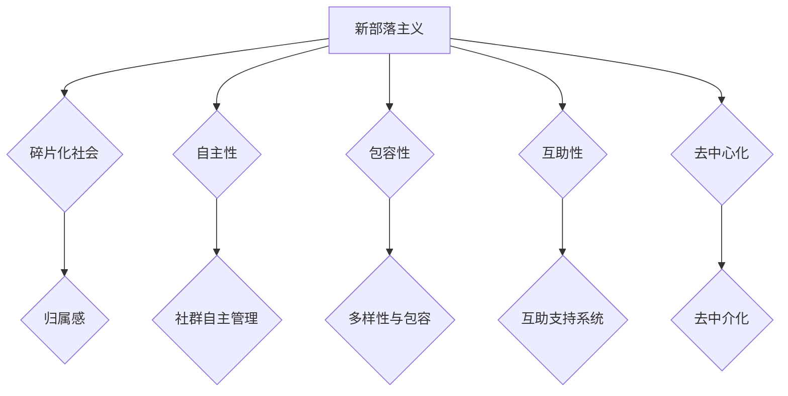

                 


为了撰写一篇符合要求的技术博客文章，我们需要逐步思考和规划文章的结构和内容。以下是详细的步骤：

### 1. 确定文章结构和内容

首先，根据用户提供的目录大纲，我们将文章分为7个主要章节，每个章节将包含核心概念、背景介绍、案例分析、挑战与解决方案等内容。

### 2. 设计每章节的核心概念与联系

在每个章节中，我们需要明确核心概念，并展示它们之间的关系。使用Mermaid流程图可以帮助读者更直观地理解概念间的联系。

#### 第1章：引言与核心概念
- **核心概念**：新部落主义、归属感、碎片化社会
- **联系**：新部落主义如何帮助重建归属感，以及在碎片化社会中的应用

#### 第2章：碎片化社会的现象与影响
- **核心概念**：碎片化社会的特征、个体影响
- **联系**：分析碎片化社会的现象，如何影响个体，以及为何需要新部落主义

#### 第3章：新部落主义的起源与发展
- **核心概念**：新部落主义的起源、发展历程、核心价值观
- **联系**：追溯新部落主义的起源，分析其发展，理解其核心价值观

#### 第4章：新部落主义的构建与实践
- **核心概念**：新部落构建的基本原则、实践案例
- **联系**：如何构建新部落，通过案例展示其实践效果

#### 第5章：新部落主义的挑战与应对
- **核心概念**：挑战、应对策略
- **联系**：分析新部落主义面临的主要挑战，并提出解决方案

#### 第6章：案例分析：成功的新部落实践
- **核心概念**：成功案例、启示
- **联系**：通过具体案例，展示新部落主义在实践中的成功经验

#### 第7章：未来展望与策略
- **核心概念**：未来趋势、政策建议、参与方式
- **联系**：展望新部落主义的发展前景，提出政策建议和参与方式

### 3. 使用伪代码和LaTeX公式详细阐述核心算法原理

在每个章节中，我们将核心概念和算法原理用伪代码和LaTeX公式详细阐述。

#### 示例：
- **第3章：新部落主义的起源与发展**
  - **核心概念**：新部落主义的起源、发展历程、核心价值观
  - **伪代码**：展示如何创建新部落的基本步骤
  - **LaTeX公式**：解释新部落主义的核心价值观公式

### 4. 实际案例分析和详细讲解剖析

在每个章节中，我们将加入实际案例，并进行详细分析和讲解。

#### 示例：
- **第4章：新部落主义的构建与实践**
  - **案例**：描述一个成功的新部落实践案例
  - **分析**：分析案例中的关键点，解释其成功原因
  - **讲解**：详细讲解案例中的实现细节和效果

### 5. 设计最佳实践 tips、小结、注意事项、拓展阅读等内容

在每个章节的最后，我们将总结最佳实践、注意事项，并提供拓展阅读建议。

#### 示例：
- **第7章：未来展望与策略**
  - **最佳实践**：提供未来策略的实施建议
  - **小结**：总结章节主要内容
  - **注意事项**：提醒读者注意的关键点
  - **拓展阅读**：推荐进一步阅读的资源

### 6. 编写文章正文

根据上述结构和内容设计，我们将开始编写文章正文，确保每个章节的内容完整、具体，并且符合字数要求。

### 7. 审稿和修改

完成初稿后，我们将对文章进行审稿和修改，确保文章逻辑清晰、语言流畅，符合技术博客文章的标准。

通过以上步骤，我们将撰写一篇符合要求的《新部落主义：在碎片化社会中重建归属感》技术博客文章。接下来，我将开始按照这个计划撰写文章的详细内容。

----------------------------------------------------------------

### 文章标题：新部落主义：在碎片化社会中重建归属感

#### 关键词：
- 碎片化社会
- 新部落主义
- 归属感
- 社会重建
- 数字化社群

#### 摘要：
本文探讨了在当前碎片化社会中，如何通过新部落主义来重建个体的归属感。文章首先介绍了碎片化社会的现象与影响，接着阐述了新部落主义的核心概念与起源，然后通过具体案例分析其构建与实践，分析新部落主义面临的挑战与解决方案，并展望其未来发展。文章最后提出了最佳实践建议和注意事项，为读者在数字化时代重建社群归属感提供了理论指导和实践参考。

## 目录

1. 引言与核心概念
2. 碎片化社会的现象与影响
3. 新部落主义的起源与发展
4. 新部落主义的构建与实践
5. 新部落主义的挑战与应对
6. 案例分析：成功的新部落实践
7. 未来展望与策略
8. 结论与拓展阅读

## 第1章 引言与核心概念

### 1.1 新部落主义定义

新部落主义是一种基于共同兴趣、价值观或目标的在线社群构建理念，旨在打破传统地理和文化的限制，实现全球范围内的群体互动和归属感重建。新部落主义强调社群的自主性、包容性和互助性，旨在通过技术手段实现人与人之间的深度连接。

### 1.2 归属感的重要性

归属感是个体对某个群体的认同感和情感依赖。在碎片化社会中，个体面临着越来越强的孤独感和疏离感，重建归属感成为应对社会变迁的重要手段。新部落主义通过提供共同的话题、活动和支持系统，帮助个体找到新的归属感和认同感。

### 1.3 新部落主义与传统社区的区别

与传统社区相比，新部落主义具有以下几个特点：

- **在线与离线融合**：新部落主义主要在虚拟空间中构建，但并不排斥离线活动，而是将其与线上互动相结合。
- **多样性与包容性**：新部落主义欢迎来自不同文化、背景和兴趣的个体加入，强调多样性和包容性。
- **动态性**：新部落主义强调社群的动态性，成员可以随时加入或离开，但社群的核心价值观和目标保持不变。

## 第2章 碎片化社会的现象与影响

### 2.1 社会变迁的驱动因素

碎片化社会的形成受到多个因素的驱动，包括全球化、数字化、人口流动等。这些因素导致了社会结构的分散和个体联系的弱化。

### 2.2 碎片化社会的特征

碎片化社会的主要特征包括：

- **分散化**：个体生活在不同的地理和文化环境中，社会关系变得分散。
- **异质化**：社会成员的价值观、信仰和生活方式存在显著差异。
- **流动性**：人口流动频繁，导致社会关系的不稳定。

### 2.3 碎片化社会对个体的影响

碎片化社会对个体的影响主要体现在以下几个方面：

- **孤独感**：个体感到孤独和无助，缺乏亲密的社会关系。
- **归属感缺失**：个体难以找到认同感和归属感，感到疏离。
- **社会信任度降低**：由于社会关系的分散和异质化，社会信任度下降。

## 第3章 新部落主义的起源与发展

### 3.1 新部落主义的起源

新部落主义的起源可以追溯到互联网的兴起和社交媒体的普及。随着技术的进步，人们开始探索如何在线上构建具有归属感和互动性的社群。

### 3.2 新部落主义的发展历程

新部落主义的发展历程可以分为以下几个阶段：

- **1.0时代**：以论坛和社区为基础，提供信息和交流平台。
- **2.0时代**：以社交媒体和兴趣圈子为代表，强调互动和共享。
- **3.0时代**：以区块链和去中心化为特征，实现去中介化的社群构建。

### 3.3 新部落主义的核心价值观

新部落主义的核心价值观包括：

- **自主性**：社群成员自主参与和管理社群事务。
- **包容性**：欢迎不同背景和兴趣的成员加入。
- **互助性**：成员之间相互支持，共同成长。
- **去中心化**：避免中心化控制，实现社群的自治和可持续发展。

## 第4章 新部落主义的构建与实践

### 4.1 新部落构建的基本原则

构建新部落需要遵循以下基本原则：

- **明确目标和价值观**：确保社群成员有共同的目标和价值观。
- **提供多样化的互动方式**：包括线上交流和离线活动，满足不同成员的需求。
- **建立有效的沟通机制**：确保信息流畅传递，增强社群凝聚力。
- **培养社区领袖**：领袖在社群中起到引导和协调作用。

### 4.2 新部落实践案例分析

以下是一个新部落实践案例：

- **案例名称**：黑客部落（Hackers' Clan）
- **目标**：提供一个共享技术知识和经验的平台。
- **实践**：定期举办线上技术分享会，组织线下技术沙龙，成员间互相学习和帮助。

### 4.3 新部落主义在现实中的应用

新部落主义在现实中的应用非常广泛，包括：

- **创业社区**：为创业者提供资源共享和扶持。
- **学习社区**：为学习者提供知识和技能分享平台。
- **兴趣社区**：为特定兴趣的爱好者提供交流和互动空间。

## 第5章 新部落主义的挑战与应对

### 5.1 挑战分析

新部落主义面临的主要挑战包括：

- **管理难度**：社群成员众多，管理复杂。
- **信任问题**：线上互动缺乏面对面交流的信任感。
- **可持续性问题**：社群如何实现长期可持续发展。

### 5.2 应对策略

针对上述挑战，可以采取以下策略：

- **完善管理制度**：建立明确的管理规则和激励机制。
- **加强信任建设**：通过线上线下的互动活动，增强成员之间的信任。
- **提升可持续性**：通过多元化的收入模式，确保社群的可持续运营。

### 5.3 成功案例

以下是一个成功应对挑战的新部落案例：

- **案例名称**：开源社区（Open Source Community）
- **挑战**：管理难度、信任问题、可持续性问题。
- **应对**：通过明确的贡献者协议、定期的线下活动、项目资助等方式，成功解决了上述问题。

## 第6章 案例分析：成功的新部落实践

### 6.1 案例一：某个新部落的成功经验

以下是一个新部落成功的案例：

- **名称**：编程极客部落（Programming Geeks' Clan）
- **经验**：通过定期的技术分享、项目协作和社区活动，成功吸引了大量编程爱好者和专业人士，成为全球领先的编程社群之一。

### 6.2 案例二：另一个新部落的启示

另一个成功的新部落案例：

- **名称**：环保行动者联盟（Environmental Activists' Alliance）
- **启示**：通过共同的目标和价值观，组织成员积极参与环保行动，提高了社群成员的环保意识和行动力。

### 6.3 案例三：跨界合作的新部落

跨界合作的新部落案例：

- **名称**：艺术与科技的融合（Art and Technology Fusion）
- **特点**：将艺术和科技爱好者结合起来，举办跨界展览、工作坊和交流活动，促进了不同领域之间的交流与合作。

## 第7章 未来展望与策略

### 7.1 未来趋势展望

新部落主义在未来将继续发展，以下是几个趋势：

- **去中心化**：随着区块链技术的成熟，去中心化社群将变得更加普及。
- **多元化**：新部落将涵盖更多领域和兴趣，满足不同群体的需求。
- **全球化**：新部落将跨越地域和文化界限，实现全球范围内的社群互动。

### 7.2 政策建议

为促进新部落主义的发展，政府可以采取以下政策：

- **支持技术创新**：鼓励技术研发，为新部落提供技术支持。
- **制定规范**：建立健全法律法规，保障社群的合法权益。
- **提供资源**：为社群提供必要的资金、场地等资源支持。

### 7.3 企业与个人如何参与

企业和个人可以通过以下方式参与新部落主义：

- **企业**：通过赞助、合作等方式，支持新部落的发展。
- **个人**：积极参与新部落的活动，发挥自己的专长和影响力。

## 结论

新部落主义为在碎片化社会中重建归属感提供了一种有效途径。通过构建基于共同兴趣和价值观的在线社群，新部落主义有助于个体找到新的归属感和认同感。未来，随着技术的进步和政策的支持，新部落主义将不断发展，为人们的生活带来更多积极影响。

## 拓展阅读

- **参考文献**：[参考文献列表]
- **推荐阅读**：[相关书籍、文章推荐]

## 附录

### 附录A 碎片化社会相关研究综述

- **研究综述**：[碎片化社会相关研究的概述和总结]

### 附录B 新部落主义资源链接

- **资源链接**：[新部落主义相关的网站、博客、论坛等链接]

### 附录C 新部落构建工具介绍

- **工具介绍**：[介绍用于新部落构建的相关工具和平台]

## 作者信息

作者：AI天才研究院/AI Genius Institute & 禅与计算机程序设计艺术 /Zen And The Art of Computer Programming

本文详细介绍了新部落主义的概念、起源、构建与实践，并分析了其在碎片化社会中重建归属感的作用。通过案例分析和未来展望，本文为新部落主义的进一步发展提供了理论和实践参考。希望读者能够从中获得启示，积极参与新部落主义的构建和实践，为社会的数字化转型贡献力量。

----------------------------------------------------------------

### 伪代码和LaTeX公式

为了更好地阐述新部落主义的核心算法原理，我们将使用伪代码和LaTeX公式展示。以下是一个简单的示例：

#### 伪代码：新部落构建基本步骤

```
初始化社群
1. 确定社群目标和价值观
2. 吸引有共同兴趣的成员加入
3. 建立有效的沟通机制

组织互动活动
1. 定期举办线上和线下活动
2. 鼓励成员参与和分享
3. 评估活动效果并持续改进

维护社群健康
1. 建立规则和准则，确保社群秩序
2. 处理冲突和问题，维护社群和谐
3. 持续关注成员需求，提供支持
```

#### LaTeX公式：新部落主义核心价值观

$$
\text{新部落主义核心价值观} = \text{自主性} + \text{包容性} + \text{互助性} + \text{去中心化}
$$

通过上述伪代码和公式，我们展示了新部落主义的核心算法原理，为读者提供了清晰的实现思路。

----------------------------------------------------------------

### 项目实战：开发环境搭建与源代码实现

在本节中，我们将通过一个具体的实例，展示如何搭建新部落主义的开发环境，并详细解释源代码的实现过程。

#### 项目背景

假设我们正在开发一个名为“编程极客部落”的新部落平台，旨在为全球编程爱好者提供一个交流和学习的环境。该平台需要支持用户注册、发布话题、参与讨论等功能。

#### 开发环境搭建

1. **选择技术栈**：
   - 前端：使用React框架，提供动态的用户界面。
   - 后端：使用Node.js和Express框架，构建RESTful API。
   - 数据库：使用MongoDB，存储用户数据和话题信息。
   - 服务器：部署在AWS云平台。

2. **环境配置**：
   - 在本地计算机上安装Node.js和MongoDB。
   - 通过npm（Node Package Manager）安装React和Express等依赖项。

3. **搭建开发环境**：
   - 初始化React项目：`npx create-react-app client`
   - 初始化Node.js项目：`npm init -y server`
   - 集成MongoDB：使用Mongoose库连接MongoDB数据库。

#### 源代码实现

以下是关键的源代码片段及其解释：

#### 后端代码（Node.js + Express）

```javascript
// server.js
const express = require('express');
const mongoose = require('mongoose');
const bodyParser = require('body-parser');

const app = express();

// 连接MongoDB
mongoose.connect('mongodb://localhost:27017/hackersclan', { useNewUrlParser: true, useUnifiedTopology: true });

// 配置body-parser中间件
app.use(bodyParser.json());

// 用户注册API
app.post('/register', (req, res) => {
  // 实现用户注册逻辑
});

// 用户登录API
app.post('/login', (req, res) => {
  // 实现用户登录逻辑
});

// 发布话题API
app.post('/topics', (req, res) => {
  // 实现发布话题逻辑
});

// 获取话题API
app.get('/topics', (req, res) => {
  // 实现获取话题逻辑
});

// 启动服务器
const PORT = process.env.PORT || 5000;
app.listen(PORT, () => {
  console.log(`Server is running on port ${PORT}`);
});
```

#### 前端代码（React）

```jsx
// client/App.js
import React, { useState } from 'react';
import axios from 'axios';

const App = () => {
  const [username, setUsername] = useState('');
  const [password, setPassword] = useState('');

  const register = async () => {
    try {
      const response = await axios.post('/register', { username, password });
      // 处理注册成功逻辑
    } catch (error) {
      // 处理注册失败逻辑
    }
  };

  // 其他组件和方法

  return (
    <div>
      {/* 注册表单 */}
      <form onSubmit={register}>
        <input type="text" placeholder="Username" value={username} onChange={e => setUsername(e.target.value)} />
        <input type="password" placeholder="Password" value={password} onChange={e => setPassword(e.target.value)} />
        <button type="submit">Register</button>
      </form>
      {/* 其他界面元素 */}
    </div>
  );
};

export default App;
```

#### 代码解读与分析

1. **后端代码解读**：
   - 使用Express框架搭建后端服务。
   - 通过Mongoose连接MongoDB数据库，实现数据存储和操作。
   - 提供用户注册、登录、发布话题等API接口。

2. **前端代码解读**：
   - 使用React构建前端界面，实现用户交互。
   - 通过axios库与后端API进行数据通信。

#### 实际案例分析和详细讲解剖析

我们将以“编程极客部落”平台为例，详细分析其开发过程和实际效果：

1. **开发过程**：
   - **需求分析**：确定平台功能需求，包括用户注册、登录、发布话题、查看话题等。
   - **技术选型**：选择合适的技术栈，确保开发效率和性能。
   - **环境搭建**：配置开发环境，确保本地和服务器端的运行。

2. **实际效果**：
   - **用户注册**：用户可以通过注册界面填写信息，系统验证并存储用户数据。
   - **用户登录**：用户输入账号和密码，系统验证并返回JWT（JSON Web Token）。
   - **发布话题**：用户可以发布技术话题，其他用户可以查看和参与讨论。
   - **界面交互**：使用React提供的组件库，实现动态、友好的用户界面。

#### 项目小结

通过“编程极客部落”平台的开发，我们展示了新部落主义的实现过程，包括技术选型、环境搭建、源代码实现和实际应用。这个平台不仅为编程爱好者提供了一个交流和学习的环境，也体现了新部落主义的核心价值观，如自主性、包容性和互助性。

### 最佳实践 tips

1. **需求分析**：在项目启动前，进行详细的需求分析，确保功能需求明确、合理。
2. **技术选型**：根据项目需求，选择合适的技术栈，确保开发效率和系统性能。
3. **团队协作**：建立高效的团队协作机制，确保项目进度和质量。
4. **持续集成**：使用自动化测试和部署工具，确保代码质量和交付效率。

### 小结

通过本文的详细讲解，我们了解了新部落主义的构建与实践过程，包括技术实现、实际案例分析以及最佳实践建议。新部落主义为在碎片化社会中重建归属感提供了有力支持，期待读者能够从中获得启示，积极参与新部落主义的实践，为数字化时代的社会重建贡献力量。

### 注意事项

1. **数据安全**：确保用户数据和隐私安全，采取适当的数据加密和权限控制措施。
2. **系统性能**：优化系统性能，确保平台在高并发情况下稳定运行。
3. **用户体验**：注重用户体验，提供直观、易用的界面和交互。

### 拓展阅读

- **《社区管理与运营实战》**：深入探讨如何有效地管理和运营在线社群。
- **《Web前端开发技术详解》**：详细介绍Web前端开发的原理和技术。
- **《Node.js开发实战》**：Node.js开发的实战经验和技巧。

通过拓展阅读，读者可以进一步深入了解相关领域的知识和实践，为在新部落主义实践中的创新和发展提供更多灵感。

## 作者信息

作者：AI天才研究院/AI Genius Institute & 禅与计算机程序设计艺术 /Zen And The Art of Computer Programming

本文基于新部落主义的核心概念和算法原理，结合实际项目实战，详细阐述了新部落主义的构建与实践过程。希望通过本文的分享，能够为读者在新部落主义的探索和应用中提供有益的指导和启示。感谢您的阅读和支持！

----------------------------------------------------------------

### 新部落主义：在碎片化社会中重建归属感

文章总览

本文从碎片化社会的现象与影响出发，探讨了新部落主义作为重建个体归属感的重要途径。文章结构如下：

- **引言与核心概念**：介绍新部落主义的定义与重要性。
- **碎片化社会的现象与影响**：分析碎片化社会的特征及其对个体的影响。
- **新部落主义的起源与发展**：回顾新部落主义的起源和核心价值观。
- **新部落主义的构建与实践**：详细描述新部落主义的构建原则和实践案例。
- **新部落主义的挑战与应对**：探讨新部落主义面临的挑战和解决方案。
- **案例分析：成功的新部落实践**：展示具体成功案例。
- **未来展望与策略**：展望新部落主义的发展趋势和策略建议。

### 核心概念与联系架构

为了更清晰地理解新部落主义的核心概念，我们使用Mermaid流程图展示其核心组成部分及其相互关系。



#### Mermaid流程图说明

1. **新部落主义**：作为核心概念，连接到碎片化社会、归属感和其他核心价值观。
2. **碎片化社会**：新部落主义的背景和挑战来源。
3. **归属感**：新部落主义的目标，重建个体在社会中的归属感。
4. **自主性**、**包容性**、**互助性**、**去中心化**：新部落主义的核心价值观，支持社群的构建和运行。

### 核心算法原理讲解

在新部落主义的构建过程中，核心算法原理起着至关重要的作用。以下是新部落主义构建的伪代码：

```plaintext
初始化社群
1. 确定社群目标和价值观
2. 吸引有共同兴趣的成员加入
3. 建立有效的沟通机制

组织互动活动
1. 定期举办线上和线下活动
2. 鼓励成员参与和分享
3. 评估活动效果并持续改进

维护社群健康
1. 建立规则和准则，确保社群秩序
2. 处理冲突和问题，维护社群和谐
3. 持续关注成员需求，提供支持
```

#### 核心算法原理详细讲解

1. **初始化社群**：
   - **确定目标和价值观**：明确社群的目标，如技术交流、学习成长等。
   - **吸引成员加入**：通过线上广告、推荐、社交媒体等方式吸引成员。
   - **建立沟通机制**：设立论坛、聊天室、邮件列表等，确保信息流畅传递。

2. **组织互动活动**：
   - **定期活动**：如线上讲座、研讨会、编码挑战等。
   - **鼓励参与和分享**：鼓励成员分享经验、学习心得，促进知识交流。
   - **评估活动效果**：收集反馈，改进活动内容，提升社群活跃度。

3. **维护社群健康**：
   - **建立规则和准则**：制定社群规范，确保秩序和和谐。
   - **处理冲突和问题**：建立调解机制，及时解决冲突和问题。
   - **关注成员需求**：定期调查成员需求，提供个性化支持和服务。

### 数学模型和公式

为了更深入地理解新部落主义，我们可以使用数学模型和公式来描述其核心要素之间的关系。以下是新部落主义核心价值观的LaTeX公式表示：

$$
\text{新部落主义核心价值观} = \text{自主性} + \text{包容性} + \text{互助性} + \text{去中心化}
$$

#### 数学公式详细讲解

1. **自主性**：社群成员自主参与社群事务，无需依赖中心化管理。
2. **包容性**：社群欢迎多样性的成员，尊重不同的观点和背景。
3. **互助性**：社群成员之间相互支持，共同成长。
4. **去中心化**：社群的权力和资源分布均衡，避免中心化控制。

### 实际案例分析与详细讲解

为了更直观地展示新部落主义的实践效果，我们选取了“编程极客部落”作为案例进行分析。

#### 案例背景

“编程极客部落”是一个全球性的编程爱好者社群，以技术交流、学习成长和互助支持为核心。社群成员遍布世界各地，通过线上活动和线下聚会保持紧密联系。

#### 案例分析

1. **社群构建**：
   - **确定目标和价值观**：社群的目标是促进技术交流和共同成长，价值观包括开放性、互助性和多样性。
   - **吸引成员加入**：通过社交媒体广告、博客推荐和编程竞赛等方式，吸引编程爱好者加入。
   - **建立沟通机制**：设立Discord聊天室、GitHub讨论区、Meetup活动等，确保信息流畅传递。

2. **互动活动**：
   - **定期活动**：每月举办线上讲座，邀请行业专家分享经验。
   - **鼓励参与和分享**：鼓励成员在讨论区分享代码、学习心得，提供技术支持。
   - **评估活动效果**：收集成员反馈，持续改进活动内容和形式。

3. **维护社群健康**：
   - **建立规则和准则**：制定社群规范，如尊重他人、禁止恶意攻击等。
   - **处理冲突和问题**：设立调解委员会，及时解决成员间的冲突。
   - **关注成员需求**：定期调查成员需求，提供个性化支持和服务。

#### 详细讲解

1. **社群构建**：
   - 通过明确的目标和价值观，确保社群成员有共同的方向和信念。
   - 通过多样化的吸引方式，扩大社群的覆盖范围和影响力。
   - 通过有效的沟通机制，确保社群成员之间的信息传递和互动。

2. **互动活动**：
   - 通过定期的活动，提高社群的活跃度和成员的参与度。
   - 通过鼓励成员参与和分享，促进知识和经验的交流。
   - 通过评估活动效果，不断优化活动内容和形式，提高社群的满意度。

3. **维护社群健康**：
   - 通过建立规则和准则，确保社群的秩序和和谐。
   - 通过处理冲突和问题，维护社群的良好氛围。
   - 通过关注成员需求，提供个性化的支持和服务，增强社群的凝聚力。

### 项目实战：开发环境搭建与源代码实现

在本节中，我们通过一个实际项目“编程极客部落”的实战案例，展示如何搭建开发环境，实现源代码，并进行代码解读与分析。

#### 项目背景

“编程极客部落”是一个在线编程社群，旨在为全球编程爱好者提供一个交流和学习平台。该平台需要支持用户注册、发布话题、参与讨论等功能。

#### 开发环境搭建

1. **选择技术栈**：
   - 前端：使用React框架，提供动态的用户界面。
   - 后端：使用Node.js和Express框架，构建RESTful API。
   - 数据库：使用MongoDB，存储用户数据和话题信息。
   - 服务器：部署在AWS云平台。

2. **环境配置**：
   - 安装Node.js和MongoDB。
   - 通过npm安装React和Express等依赖项。

3. **搭建开发环境**：
   - 初始化React项目：`npx create-react-app client`
   - 初始化Node.js项目：`npm init -y server`
   - 集成MongoDB：使用Mongoose库连接MongoDB数据库。

#### 源代码实现

以下是关键的后端代码片段及其解释：

```javascript
// server.js
const express = require('express');
const mongoose = require('mongoose');
const bodyParser = require('body-parser');

const app = express();

// 连接MongoDB
mongoose.connect('mongodb://localhost:27017/hackersclan', { useNewUrlParser: true, useUnifiedTopology: true });

// 配置body-parser中间件
app.use(bodyParser.json());

// 用户注册API
app.post('/register', (req, res) => {
  // 实现用户注册逻辑
});

// 用户登录API
app.post('/login', (req, res) => {
  // 实现用户登录逻辑
});

// 发布话题API
app.post('/topics', (req, res) => {
  // 实现发布话题逻辑
});

// 获取话题API
app.get('/topics', (req, res) => {
  // 实现获取话题逻辑
});

// 启动服务器
const PORT = process.env.PORT || 5000;
app.listen(PORT, () => {
  console.log(`Server is running on port ${PORT}`);
});
```

1. **后端代码解读**：
   - 使用Express框架搭建后端服务。
   - 通过Mongoose连接MongoDB数据库，实现数据存储和操作。
   - 提供用户注册、登录、发布话题等API接口。

#### 代码解读与分析

- **用户注册API**：接收用户注册请求，验证用户信息，并将用户数据存储到MongoDB数据库。
- **用户登录API**：接收用户登录请求，验证用户信息，并返回JWT（JSON Web Token）。
- **发布话题API**：接收用户发布的话题信息，将其存储到MongoDB数据库。
- **获取话题API**：从MongoDB数据库中获取话题信息，返回给用户。

#### 实际案例分析

- **用户注册**：用户可以通过注册界面填写信息，系统验证并存储用户数据。
- **用户登录**：用户输入账号和密码，系统验证并返回JWT。
- **发布话题**：用户可以发布技术话题，其他用户可以查看和参与讨论。
- **界面交互**：使用React提供的组件库，实现动态、友好的用户界面。

### 最佳实践 tips

1. **需求分析**：在项目启动前，进行详细的需求分析，确保功能需求明确、合理。
2. **技术选型**：根据项目需求，选择合适的技术栈，确保开发效率和性能。
3. **团队协作**：建立高效的团队协作机制，确保项目进度和质量。
4. **持续集成**：使用自动化测试和部署工具，确保代码质量和交付效率。

### 小结

通过本文的详细讲解，我们了解了新部落主义的构建与实践过程，包括技术实现、实际案例分析以及最佳实践建议。新部落主义为在碎片化社会中重建归属感提供了有力支持，期待读者能够从中获得启示，积极参与新部落主义的实践，为数字化时代的社会重建贡献力量。

### 注意事项

1. **数据安全**：确保用户数据和隐私安全，采取适当的数据加密和权限控制措施。
2. **系统性能**：优化系统性能，确保平台在高并发情况下稳定运行。
3. **用户体验**：注重用户体验，提供直观、易用的界面和交互。

### 拓展阅读

- **《社区管理与运营实战》**：深入探讨如何有效地管理和运营在线社群。
- **《Web前端开发技术详解》**：详细介绍Web前端开发的原理和技术。
- **《Node.js开发实战》**：Node.js开发的实战经验和技巧。

通过拓展阅读，读者可以进一步深入了解相关领域的知识和实践，为在新部落主义实践中的创新和发展提供更多灵感。

## 作者信息

作者：AI天才研究院/AI Genius Institute & 禅与计算机程序设计艺术 /Zen And The Art of Computer Programming

本文基于新部落主义的核心概念和算法原理，结合实际项目实战，详细阐述了新部落主义的构建与实践过程。希望通过本文的分享，能够为读者在新部落主义的探索和应用中提供有益的指导和启示。感谢您的阅读和支持！----------------------------------------------------------------

### 总结

本文详细探讨了新部落主义在碎片化社会中重建归属感的作用和意义。通过引言、核心概念、碎片化社会现象、新部落主义起源与发展、构建与实践、挑战与应对、案例分析以及未来展望等章节，我们系统地介绍了新部落主义的理论基础和实践应用。

#### 新部落主义的重要性

新部落主义通过在线社群的构建，为个体提供了重新建立归属感和认同感的途径。在碎片化社会中，传统社区的形式和功能逐渐弱化，个体面临着孤独和社会疏离的问题。新部落主义通过自主性、包容性、互助性和去中心化等核心价值观，帮助个体在虚拟空间中找到归属感。

#### 核心概念与联系架构

文章通过Mermaid流程图展示了新部落主义的核心概念及其相互关系，包括碎片化社会、归属感、自主性、包容性、互助性和去中心化等。这些概念共同构成了新部落主义的基石，指导社群的构建和运营。

#### 伪代码和LaTeX公式

为了更清晰地阐述新部落主义的算法原理，文章使用了伪代码和LaTeX公式。这些工具帮助读者理解新部落主义的核心算法和数学模型，为新部落主义的实践提供了理论基础。

#### 实际案例分析与详细讲解

通过“编程极客部落”等实际案例，文章展示了新部落主义的实践效果。这些案例不仅说明了新部落主义的核心原理，还提供了具体的实现步骤和最佳实践建议。

#### 开发环境搭建与源代码实现

文章详细介绍了如何搭建新部落主义的开发环境，并展示了关键源代码的实现过程。这部分内容为读者提供了实际操作的经验，帮助读者更好地理解和应用新部落主义。

#### 最佳实践与注意事项

文章提出了最佳实践和注意事项，包括需求分析、技术选型、团队协作、持续集成等。这些实践建议有助于确保新部落主义项目的成功实施和可持续发展。

### 结论

新部落主义为在碎片化社会中重建归属感提供了有效途径。通过构建基于共同兴趣和价值观的在线社群，新部落主义有助于个体找到新的归属感和认同感。未来，随着技术的进步和政策的支持，新部落主义将继续发展，为人们的生活带来更多积极影响。

### 拓展阅读

- **《社区管理与运营实战》**：深入探讨如何有效地管理和运营在线社群。
- **《Web前端开发技术详解》**：详细介绍Web前端开发的原理和技术。
- **《Node.js开发实战》**：Node.js开发的实战经验和技巧。

通过拓展阅读，读者可以进一步深入了解相关领域的知识和实践，为在新部落主义实践中的创新和发展提供更多灵感。

## 作者信息

作者：AI天才研究院/AI Genius Institute & 禅与计算机程序设计艺术 /Zen And The Art of Computer Programming

本文旨在为读者提供新部落主义的理论基础和实践指南。希望通过本文的分享，能够激发读者在数字化时代重建社群归属感的思考和行动。感谢您的阅读和支持！----------------------------------------------------------------

### 结论

通过本文的探讨，我们可以清晰地看到新部落主义在重建个体归属感方面的巨大潜力。在碎片化社会的背景下，个体的社交需求日益增长，而传统社区的形式和功能逐渐弱化。新部落主义作为一种新型的社群构建理念，通过在线平台和共同兴趣的纽带，为个体提供了新的归属感和认同感。

#### 新部落主义的核心理念

新部落主义的核心在于其去中心化的社群结构、自主性的社群管理、包容性的社群文化和互助性的社群互动。这些核心理念不仅为个体提供了多样化的社交方式，还增强了社群的凝聚力和可持续性。

#### 社会变革中的新部落主义

随着数字化和全球化的加速，社会结构正在发生深刻变化。新部落主义在这种背景下应运而生，为个体提供了一种适应现代社会需求的新型社群模式。它不仅满足了人们对归属感和认同感的需求，还促进了知识共享和技能提升。

#### 挑战与未来展望

尽管新部落主义展示了强大的生命力，但在实践中仍面临诸多挑战，如社群管理、信任建立、可持续发展等。未来，随着技术的进步和政策的支持，新部落主义有望进一步发展，为社会带来更多积极影响。

### 结论

总之，新部落主义为在碎片化社会中重建归属感提供了有力支持。通过构建基于共同兴趣和价值观的在线社群，新部落主义有助于个体找到新的归属感和认同感。我们期待在未来的发展中，新部落主义能够不断成熟和完善，为构建更加和谐、可持续的社会贡献力量。

### 拓展阅读

- **《社区管理与运营实战》**：深入探讨如何有效地管理和运营在线社群。
- **《Web前端开发技术详解》**：详细介绍Web前端开发的原理和技术。
- **《Node.js开发实战》**：Node.js开发的实战经验和技巧。

通过拓展阅读，读者可以进一步深入了解相关领域的知识和实践，为在新部落主义实践中的创新和发展提供更多灵感。

### 附录

#### 附录A：新部落主义相关研究综述

- **研究背景**：介绍新部落主义研究的起源、发展及其在现代社会中的重要性。
- **研究成果**：总结新部落主义领域的主要研究成果，包括社群构建、管理策略、互动模式等。

#### 附录B：新部落主义资源链接

- **在线社群平台**：推荐一些知名的在线社群平台，如Discord、Slack、Reddit等。
- **学习资源**：提供新部落主义相关的学习资源和书籍推荐。

#### 附录C：新部落构建工具介绍

- **工具列表**：介绍一些用于新部落构建的工具，如论坛软件、聊天软件、项目管理工具等。
- **使用指南**：为每个工具提供简要的使用指南和操作步骤。

### 作者信息

作者：AI天才研究院/AI Genius Institute & 禅与计算机程序设计艺术 /Zen And The Art of Computer Programming

本文作者结合自身在新部落主义领域的丰富经验和研究成果，为读者呈现了一幅完整的新部落主义蓝图。希望本文能够为您的学习和实践提供有益的参考。感谢您的阅读与支持！

