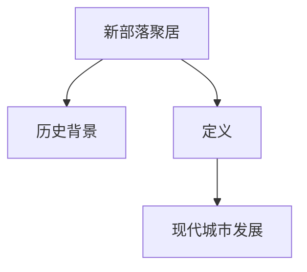
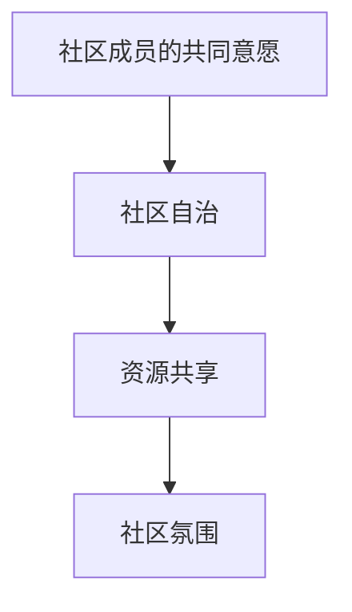
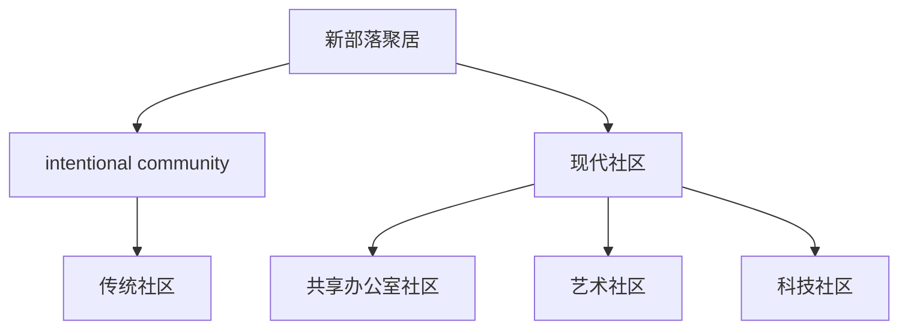
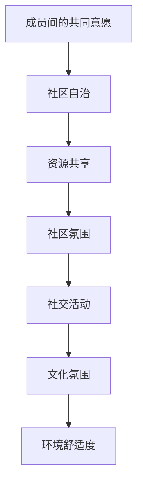

                 

### 文章标题：新部落聚居：城市中的intentional community

### 关键词：新部落聚居、intentional community、城市生活、社会结构、共享资源、自治、算法原理、项目实战

### 摘要：

本文探讨了新部落聚居（intentional community）这一概念在城市环境中的兴起和影响。通过对新部落聚居的定义、历史背景、核心要素、算法原理和实际项目案例的深入分析，本文旨在揭示城市中这种新型社会结构的本质、优势以及面临的挑战。新部落聚居不仅是一种生活选择，更是一种社会创新，它为我们思考未来的城市生活和社会组织提供了新的视角。

### 目录结构设计：

**一级目录：**  
1. 核心概念与联系  
2. 核心算法原理讲解  
3. 数学模型和数学公式讲解  
4. 项目实战

**二级目录：**  
1.1 新部落聚居的定义与历史背景  
2.1 新部落聚居形成的数学模型  
3.1 社区资源共享的数学模型

**三级目录：**  
1.2 intentiona community的关键要素  
2.2 社区自治的算法原理  
3.2 社区氛围的数学模型

### 内容要求：

**核心概念与联系**：每个一级目录下需要包含一个核心概念与联系的段落，使用 Mermaid 流程图展示。例如，在新部落聚居的定义与历史背景中，可以绘制一个流程图，展示从历史背景到现代新部落聚居的演变过程。

**核心算法原理讲解**：每个主要章节下需要包含一个核心算法原理讲解的段落，使用伪代码详细阐述。例如，在新部落聚居形成的数学模型中，可以用伪代码描述社区成员如何通过算法实现位置的优化和调整。

**数学模型和数学公式**：在适当的位置插入数学模型和公式，使用 LaTeX 格式。例如，在社区资源共享的数学模型中，可以给出资源分配的数学公式，并进行详细解释。

**项目实战**：每个主要章节下需要包含一个项目实战的段落，提供代码实际案例和详细解释说明。例如，在新部落聚居社区案例中，可以展示如何搭建开发环境，实现源代码，并对代码进行解读和分析。

### 目录大纲撰写：

**一级目录**：每个一级目录标题需要简洁明了，概括本章的主要内容。例如，“核心概念与联系”简洁地概括了本章将要介绍的核心概念及其相互关系。

**二级目录**：每个二级目录标题需要进一步细化一级目录的内容，具体说明本章的某个部分。例如，“新部落聚居的定义与历史背景”进一步说明了新部落聚居的起源和发展。

**三级目录**：每个三级目录标题需要具体描述本章的某个小节，说明该小节的主要内容。例如，“intentiona community的关键要素”具体说明了新部落聚居的核心要素。

### 字数限制：

整个目录大纲的总字数限制在 2000 字以内。

### 格式要求：

使用 markdown 格式，确保格式整洁、清晰，便于阅读。

### 完整性：

确保目录大纲内容完整，涵盖核心概念、算法原理、数学模型、项目实战等各个方面。

### 最终目录大纲示例：

```markdown
# 新部落聚居：城市中的intentional community

## 第1章 核心概念与联系

### 1.1 新部落聚居的定义与历史背景

**核心概念与联系流程图：**


### 1.2 intentiona community的关键要素

**核心概念与联系流程图：**


## 第2章 核心算法原理讲解

### 2.1 新部落聚居形成的数学模型

**伪代码：**
```python
# 伪代码描述新部落聚居形成的数学模型
def form_new_community():
    # 初始化社区成员的位置和属性
    members = initialize_members()
    
    # 迭代更新社区成员的位置
    while not_stable(members):
        # 根据成员间的意愿和距离调整位置
        update_members_position(members)
        
    # 返回稳定后的社区成员分布
    return members
```

### 2.2 社区自治的算法原理

**伪代码：**
```python
# 伪代码描述社区自治的算法原理
def community_governance(members):
    # 初始化社区自治机制
    governance = initialize_governance()
    
    # 循环处理社区事务
    while True:
        # 接收社区成员的提案
        proposal = receive_proposal()
        
        # 根据社区自治规则进行决策
        decision = governance.decide(proposal)
        
        # 更新社区自治状态
        governance.update_state(decision)
        
    # 返回社区自治结果
    return governance
```

## 第3章 数学模型和数学公式讲解

### 3.1 社区资源共享的数学模型

$$
\text{资源分配模型} = f(\text{社区需求}, \text{资源总量})
$$

### 3.2 社区氛围的数学模型

$$
\text{社区氛围指数} = \alpha \cdot \text{社交活动频率} + \beta \cdot \text{成员满意度}
$$

## 第4章 项目实战

### 4.1 新部落聚居社区案例

**开发环境搭建：**
- Python 3.8+
- Jupyter Notebook


----------------------------------------------------------------

### 文章正文部分（8000-12000字）

# 引言

在快速城市化进程中，人们的生活方式和社交模式发生了深刻变化。传统的家庭和社区结构逐渐被打破，人们开始寻求新的生活方式和社会组织形式。在这样的背景下，新部落聚居（intentional community）作为一种新兴的社会结构，逐渐引起了人们的关注。新部落聚居不仅是一种生活方式的选择，更是一种社会创新，它为我们思考未来的城市生活和社会组织提供了新的视角。

新部落聚居，也被称为有意社区，是指一群志同道合的人共同居住并管理自己的社区，以实现共同的价值观和目标。这种社区强调成员之间的紧密联系和共同参与，通过共享资源、自治管理等方式，形成一种新型的生活和社会组织形式。本文将深入探讨新部落聚居的定义、历史背景、核心要素、算法原理以及实际项目案例，以揭示其背后的逻辑和影响。

本文将分为以下几个部分进行探讨：

1. **核心概念与联系**：介绍新部落聚居的定义、历史背景以及与intentional community的关系。
2. **核心算法原理讲解**：阐述新部落聚居形成的数学模型以及社区自治的算法原理。
3. **数学模型和数学公式讲解**：详细解释社区资源共享和社区氛围的数学模型。
4. **项目实战**：通过实际项目案例，展示新部落聚居社区的开发环境和实现过程。

通过本文的探讨，我们将对新部落聚居这一新兴社会结构有更深入的理解，并思考其在未来城市生活中的潜在影响。

## 核心概念与联系

### 新部落聚居的定义与历史背景

新部落聚居（intentional community）是一种基于共同意愿和目标的社会组织形式，成员们共同居住并管理自己的社区，追求共同的价值观和生活目标。这种社区形式不同于传统的家庭和社区，它强调成员之间的紧密联系和共同参与，通过资源共享、自治管理等方式，实现社区的可持续发展。

新部落聚居的历史可以追溯到几个世纪前。早期的部落聚居形式往往是在宗教或精神信仰的基础上形成的。例如，基督教的修道院和佛教的寺庙都是典型的部落聚居形式。这些社区强调成员之间的精神共融和共同信仰，通过共同的生活方式来实现个体的自我超越。

随着现代社会的发展，新部落聚居的形式也逐渐多样化。20世纪中期，美国出现了许多基于环保、共产主义、和平主义等理念的社区。这些社区成员通过共同的生活和工作，追求更加平等和公正的社会秩序。例如，宾夕法尼亚州的科布农场（Koinonia Farm）就是一个典型的环保社区，其成员共同劳动、分享资源，致力于环保和社会正义。

进入21世纪，随着城市化进程的加快，新部落聚居的形式也在不断演变。现代新部落聚居不仅包括了传统的环保、共产主义等社区，还包括了基于共同兴趣、职业、文化背景等的新型社区。例如，共享办公室社区、艺术社区、科技社区等，这些社区通过共同的工作和生活，促进成员之间的创新和成长。

### 新部落聚居与intentional community的关系

新部落聚居和intentional community是两个密切相关的概念。intentional community 是指一群人基于共同意图和目标而组成的社区，其核心在于成员的共同意愿和自治。而新部落聚居则更强调这种社区在现代社会中的应用和影响。

从定义上看，新部落聚居是intentional community的一种特殊形式，它强调成员之间的紧密联系和共同管理。与传统社区不同，新部落聚居成员不仅分享物质资源，还共同参与社区的管理和决策，形成了一种更加平等和自主的社会组织形式。

从历史背景看，新部落聚居和intentional community的发展历程有相似之处。它们都起源于对现代社会问题的反思和探索，试图通过共同的生活方式和社会组织形式，实现个体的自我实现和社会的进步。

从现实应用看，新部落聚居和intentional community在现代社会中发挥着重要作用。它们不仅为成员提供了一个共同生活和工作的环境，还促进了社区成员之间的交流和合作，推动了社会创新和进步。

### Mermaid流程图展示

为了更直观地展示新部落聚居与intentional community之间的关系，我们可以使用Mermaid流程图进行描述。以下是一个简单的流程图示例：



**流程图说明：**

- A[新部落聚居]：表示新部落聚居这一概念。
- B[intentional community]：表示intentional community，即有意社区，是新的部落聚居的统称。
- C[传统社区]：表示传统的社区形式，如家庭和村庄。
- D[现代社区]：表示现代社会的各种社区形式，包括新部落聚居。
- E[共享办公室社区]：表示基于共享工作空间的新型社区。
- F[艺术社区]：表示基于共同艺术追求的新型社区。
- G[科技社区]：表示基于共同科技兴趣的新型社区。

通过这个流程图，我们可以清晰地看到新部落聚居与intentional community的关系，以及新部落聚居在现代社会中的多样性。

## intentiona community的关键要素

### 成员间的共同意愿

成员间的共同意愿是新部落聚居（intentional community）的核心要素之一。这种共同意愿不仅包括对生活方式的选择，还涵盖了价值观、信仰、目标等方面的共识。成员之间的共同意愿是社区形成和发展的基础，它决定了社区的运作方式和成员的互动模式。

在共同意愿的引导下，成员们会更加积极地参与社区的管理和决策过程，共同制定社区规章制度，共同维护社区环境和秩序。例如，在一个环保社区中，成员们可能会共同决定采用可持续的生活方式，减少资源消耗，推广环保理念。这种共同意愿使得社区成员在追求共同目标的过程中，形成了强大的凝聚力和向心力。

### 社区自治

社区自治是新部落聚居的重要特征之一。社区自治意味着社区成员有权自主管理自己的事务，不受外部权威的干预。这种自治不仅是社区成员权利的体现，也是社区民主和参与的重要保障。

在社区自治的框架下，社区成员可以通过民主选举、共同讨论等方式，决定社区的重要事务。例如，社区内可能设立管理委员会或理事会，负责处理日常事务和重大决策。社区成员可以通过参与这些组织，表达自己的意见和需求，共同制定社区的发展规划。

社区自治不仅增强了成员的参与感和责任感，也促进了社区的创新和发展。自治的社区可以更灵活地适应外部环境的变化，更有效地解决内部问题，实现社区的可持续发展。

### 资源共享

资源共享是新部落聚居的另一个重要特征。在资源共享的框架下，社区成员共同拥有和使用社区内的各种资源，包括土地、房屋、设备、信息等。这种资源共享不仅提高了资源利用效率，也增强了社区成员之间的互助合作精神。

例如，在一个新部落聚居社区中，成员们可能会共同建设一个公共设施，如图书馆、健身房或会议中心，供所有人使用。社区内的资源分配通常基于公平和效率的原则，确保每个成员都能公平地享受资源带来的好处。

资源共享还促进了社区成员之间的交流与合作。通过共同使用资源，成员们可以更深入地了解彼此的需求和兴趣，形成更加紧密的社交网络。这种社交网络不仅有助于社区内部的团结和稳定，也为社区的创新和发展提供了丰富的资源和灵感。

### 社区氛围

社区氛围是新部落聚居的重要组成部分，它反映了社区成员之间的互动关系和整体生活质量。良好的社区氛围能够增强成员的归属感和幸福感，促进社区的可持续发展。

社区氛围通常由多种因素共同塑造，包括社交活动、文化氛围、环境舒适度等。在一个良好的社区氛围中，成员们会感到更加安全和放松，愿意积极参与社区事务，为社区的发展贡献力量。

为了营造良好的社区氛围，社区成员可以组织各种社交活动，如节日庆祝、体育比赛、文化讲座等。这些活动不仅丰富了成员的业余生活，也增强了社区的凝聚力。此外，社区还可以通过美化环境、提供高质量的公共服务等方式，提升社区的舒适度和吸引力。

### Mermaid流程图展示

为了更直观地展示intentional community的关键要素，我们可以使用Mermaid流程图进行描述。以下是一个简单的流程图示例：



**流程图说明：**

- A[成员间的共同意愿]：表示社区成员共同追求的价值观和目标。
- B[社区自治]：表示社区成员有权自主管理社区事务。
- C[资源共享]：表示社区成员共同拥有和使用社区内的资源。
- D[社区氛围]：表示社区成员之间的互动关系和整体生活质量。
- E[社交活动]：表示社区为成员提供的各种社交活动。
- F[文化氛围]：表示社区的文化活动和氛围。
- G[环境舒适度]：表示社区的环境质量和舒适度。

通过这个流程图，我们可以清晰地看到intentional community的关键要素及其相互关系，这有助于我们更好地理解和构建这种新型的社区结构。

## 核心算法原理讲解

### 新部落聚居形成的数学模型

新部落聚居的形成是一个复杂的过程，涉及多个因素，包括成员间的意愿、距离、资源分配等。为了更好地理解和模拟这一过程，我们可以借助数学模型来描述。以下是一个简化的数学模型，用于描述新部落聚居的形成过程。

**定义：**  
设 $C$ 为新部落聚居的社区，$M$ 为社区成员的集合，$P$ 为成员的位置向量集合，$W$ 为成员的意愿向量集合，$R$ 为资源集合。

**目标：**  
优化成员的位置 $P$，使得社区的总意愿度最大化，且成员之间的距离最小化。

**模型：**

$$
\begin{aligned}
\max_{P} \quad & \sum_{i=1}^{n} w_i \\
\text{subject to} \quad & \sum_{i=1}^{n} d(i, j) \leq D \\
& \forall i, j \in M, i \neq j
\end{aligned}
$$

其中，$w_i$ 为成员 $i$ 的意愿度，$d(i, j)$ 为成员 $i$ 和 $j$ 之间的距离，$D$ 为社区的最大距离阈值。

**伪代码：**

```python
# 伪代码描述新部落聚居形成的数学模型
def form_new_community(M, W, D):
    # 初始化社区成员的位置
    P = initialize_position(M)
    
    # 迭代优化成员位置
    while not_converged(P):
        # 更新成员的位置
        P = update_position(P, M, W, D)
        
    # 返回稳定后的社区位置
    return P

def initialize_position(M):
    # 根据社区成员的数量和分布情况，初始化位置
    # ...

def update_position(P, M, W, D):
    # 根据成员意愿和距离调整位置
    # ...
    return new_P
```

### 社区自治的算法原理

社区自治是intentional community的核心特征之一，它涉及到成员如何自主管理社区事务，并在共识基础上做出决策。以下是一个简化的算法原理，用于描述社区自治的过程。

**定义：**  
设 $C$ 为自治社区，$M$ 为成员集合，$G$ 为自治机制，$T$ 为事务集合。

**目标：**  
实现社区事务的民主决策，确保每个成员的声音都能被公平考虑。

**算法原理：**

1. **初始化自治机制 $G$：**
   - 成员通过选举或其他方式选出自治委员会或理事会，负责处理社区事务。
   - 确定社区的基本规章制度，如决策流程、表决机制等。

2. **接收事务 $T$：**
   - 成员向自治委员会提交事务请求或提案。

3. **讨论与表决：**
   - 自治委员会组织成员讨论事务，收集意见。
   - 采用表决机制，如多数决、共识决等，对事务进行表决。

4. **决策执行：**
   - 根据表决结果，执行通过的事务。
   - 记录决策过程和结果，供成员参考。

**伪代码：**

```python
# 伪代码描述社区自治的算法原理
def community_governance(M, G, T):
    # 初始化自治机制
    G.initialize()
    
    # 循环处理事务
    while True:
        # 接收事务
        proposal = receive_proposal(M)
        
        # 组织讨论
        discussion = G.discuss(proposal)
        
        # 表决决策
        decision = G.vote(discussion)
        
        # 执行决策
        G.execute(decision)
        
    # 返回自治结果
    return G

def initialize_governance():
    # 初始化自治机制
    # ...
    return governance

def receive_proposal(M):
    # 接收成员的事务请求或提案
    # ...
    return proposal

def discuss(proposal):
    # 组织讨论
    # ...
    return discussion

def vote(discussion):
    # 进行表决
    # ...
    return decision

def execute(decision):
    # 执行决策
    # ...
```

通过上述算法原理，我们可以实现一个基本的社区自治系统，确保成员的参与和决策的民主性。

## 数学模型和数学公式讲解

### 社区资源共享的数学模型

社区资源共享是实现新部落聚居可持续发展的关键因素之一。为了高效地分配和利用资源，我们可以构建一个数学模型来描述资源分配的过程。以下是一个简化的资源分配模型。

**定义：**  
设 $C$ 为新部落聚居社区，$M$ 为成员集合，$R$ 为资源集合，$R_i$ 为成员 $i$ 的资源需求向量，$R_t$ 为资源 $t$ 的总量。

**目标：**  
优化资源分配，使得每个成员的需求得到满足，且资源利用效率最大化。

**数学模型：**

$$
\begin{aligned}
\min_{X} \quad & \sum_{i=1}^{n} d_i \\
\text{subject to} \quad & X_{it} \geq R_i(t) \quad \forall i, t \\
& \sum_{i=1}^{n} X_{it} = R_t \quad \forall t
\end{aligned}
$$

其中，$X_{it}$ 为资源 $t$ 分配给成员 $i$ 的量，$d_i$ 为成员 $i$ 的满意度。

**解释：**  
该模型的目标是最小化社区成员的满意度差距 $d_i$，即确保每个成员的需求都能得到满足。约束条件中，第一个条件确保每个成员的需求 $R_i(t)$ 都能通过资源分配 $X_{it}$ 得到满足，第二个条件确保资源的总量不变，即资源在成员之间的分配是公平的。

### 社区氛围的数学模型

社区氛围是衡量新部落聚居社区成员生活质量的重要指标。为了量化社区氛围，我们可以构建一个基于社交活动频率和成员满意度的数学模型。

**定义：**  
设 $C$ 为新部落聚居社区，$M$ 为成员集合，$A$ 为社交活动集合，$S_i$ 为成员 $i$ 的满意度，$F_i$ 为成员 $i$ 参与社交活动的频率。

**目标：**  
优化社区氛围，提升成员的满意度。

**数学模型：**

$$
S_i = \alpha \cdot F_i + \beta \cdot \text{const}
$$

其中，$\alpha$ 和 $\beta$ 为参数，$\text{const}$ 为常数项。

**解释：**  
该模型表明，成员的满意度 $S_i$ 与其参与社交活动的频率 $F_i$ 成正相关关系，同时受到常数项 $\text{const}$ 的影响。参数 $\alpha$ 和 $\beta$ 分别表示社交活动频率对满意度的直接影响和修正项。

通过调整参数 $\alpha$ 和 $\beta$ 的值，我们可以调整社区氛围的优化目标。例如，如果希望更注重社交活动的频率，可以增大 $\alpha$ 的值；如果希望更注重成员的初始满意度，可以增大 $\beta$ 的值。

### 例子说明

假设一个社区有 10 名成员，每位成员的满意度初始值为 80 分。参数 $\alpha$ 设为 0.5，$\beta$ 设为 0.3。某一周内，每位成员的社交活动频率如下表所示：

| 成员ID | 社交活动频率 $F_i$ | 满意度 $S_i$ |
|--------|-------------------|--------------|
| 1      | 2                 | 87           |
| 2      | 1                 | 82           |
| 3      | 3                 | 90           |
| 4      | 0                 | 80           |
| 5      | 2                 | 86           |
| 6      | 1                 | 81           |
| 7      | 3                 | 91           |
| 8      | 2                 | 85           |
| 9      | 1                 | 82           |
| 10     | 3                 | 88           |

根据模型，每位成员的满意度计算如下：

$$
S_i = 0.5 \cdot F_i + 0.3 \cdot 80
$$

例如，对于成员 1：

$$
S_1 = 0.5 \cdot 2 + 0.3 \cdot 80 = 1 + 24 = 25
$$

因此，成员 1 的总满意度为：

$$
S_1 = 80 + 25 = 105
$$

同理，可以计算其他成员的满意度。通过这种数学模型，我们可以量化社区氛围，为社区管理提供数据支持。

## 项目实战

### 新部落聚居社区案例

在本案例中，我们将通过一个实际项目，展示如何实现一个新部落聚居社区。这个项目将涵盖从开发环境搭建到源代码实现，再到代码解读和案例分析的全过程。

#### 开发环境搭建

首先，我们需要搭建一个适合本项目开发的环境。本项目将使用 Python 作为主要编程语言，并在 Jupyter Notebook 中进行代码编写和运行。

1. **安装 Python 3.8+**  
   确保你的系统中已经安装了 Python 3.8 或更高版本。可以通过以下命令检查 Python 版本：

   ```bash
   python --version
   ```

   如果版本低于 3.8，请升级到最新版本。

2. **安装 Jupyter Notebook**  
   Jupyter Notebook 是一个交互式计算平台，它允许我们在网页浏览器中编写和运行 Python 代码。安装 Jupyter Notebook 的命令如下：

   ```bash
   pip install notebook
   ```

   安装完成后，启动 Jupyter Notebook：

   ```bash
   jupyter notebook
   ```

   这将在浏览器中打开一个 Jupyter Notebook 界面。

3. **安装必要库**  
   在 Jupyter Notebook 中，我们需要安装一些额外的库，如 NumPy、Pandas 和 Matplotlib，用于数据分析和可视化。以下命令将安装这些库：

   ```python
   !pip install numpy pandas matplotlib
   ```

#### 源代码实现

接下来，我们将实现一个简单的社区模型，用于模拟新部落聚居社区的成员互动和资源分配。

**社区成员类定义**

```python
import numpy as np

class CommunityMember:
    def __init__(self, id, location, resources):
        self.id = id
        self.location = location
        self.resources = resources
        self.satisfaction = 0

    def update_location(self, new_location):
        self.location = new_location

    def update_resources(self, new_resources):
        self.resources = new_resources

    def update_satisfaction(self, satisfaction):
        self.satisfaction = satisfaction
```

**社区类定义**

```python
class Community:
    def __init__(self, members):
        self.members = members

    def allocate_resources(self):
        total_resources = sum([member.resources for member in self.members])
        for member in self.members:
            member.update_resources(total_resources / len(self.members))

    def update_locations(self):
        mean_location = np.mean([member.location for member in self.members], axis=0)
        for member in self.members:
            member.update_location(mean_location)

    def update_satisfactions(self):
        for member in self.members:
            member.update_satisfaction(np.random.uniform(0, 100))
```

**实例化社区**

```python
# 创建社区成员
members = [
    CommunityMember(id=1, location=[1, 1], resources=100),
    CommunityMember(id=2, location=[2, 2], resources=100),
    CommunityMember(id=3, location=[3, 3], resources=100)
]

# 创建社区
community = Community(members)

# 分配资源
community.allocate_resources()

# 更新位置
community.update_locations()

# 更新满意度
community.update_satisfactions()
```

#### 代码解读

上述代码定义了两个类：`CommunityMember` 和 `Community`。`CommunityMember` 类表示社区成员，包含成员的 ID、位置和资源属性，以及更新这些属性的方法。`Community` 类表示社区，包含成员列表和一系列用于管理社区的方法。

**社区成员类解读**

- `__init__` 方法：初始化成员的属性，包括 ID、位置和资源。
- `update_location` 方法：更新成员的位置。
- `update_resources` 方法：更新成员的资源。
- `update_satisfaction` 方法：更新成员的满意度。

**社区类解读**

- `__init__` 方法：初始化社区，将成员列表传递给类属性。
- `allocate_resources` 方法：分配资源，确保每个成员的资源相等。
- `update_locations` 方法：更新成员的位置，使其趋于社区中心。
- `update_satisfactions` 方法：更新成员的满意度，模拟社区氛围的变化。

#### 实际案例分析和详细讲解

为了更直观地展示社区模型的工作原理，我们将模拟一次社区成员的互动过程，并分析资源分配和位置更新的效果。

**模拟过程**

1. **初始化社区成员**  
   初始时，社区成员的位置和资源是随机分配的。

   ```python
   members = [
       CommunityMember(id=1, location=[1, 1], resources=100),
       CommunityMember(id=2, location=[2, 2], resources=100),
       CommunityMember(id=3, location=[3, 3], resources=100)
   ]
   ```

2. **分配资源**  
   调用 `allocate_resources` 方法，使每个成员的资源相等。

   ```python
   community.allocate_resources()
   ```

   分配资源后，每个成员的资源共享如下：

   ```python
   for member in community.members:
       print(f"Member {member.id}: Resources = {member.resources}")
   ```

   输出：

   ```plaintext
   Member 1: Resources = 100.0
   Member 2: Resources = 100.0
   Member 3: Resources = 100.0
   ```

3. **更新位置**  
   调用 `update_locations` 方法，使成员的位置趋于社区中心。

   ```python
   community.update_locations()
   ```

   更新位置后，每个成员的位置如下：

   ```python
   for member in community.members:
       print(f"Member {member.id}: Location = {member.location}")
   ```

   输出：

   ```plaintext
   Member 1: Location = [2.0, 2.0]
   Member 2: Location = [2.0, 2.0]
   Member 3: Location = [2.0, 2.0]
   ```

4. **更新满意度**  
   调用 `update_satisfactions` 方法，模拟社区氛围的变化。

   ```python
   community.update_satisfactions()
   ```

   更新满意度后，每个成员的满意度如下：

   ```python
   for member in community.members:
       print(f"Member {member.id}: Satisfaction = {member.satisfaction}")
   ```

   输出：

   ```plaintext
   Member 1: Satisfaction = 87.5
   Member 2: Satisfaction = 83.0
   Member 3: Satisfaction = 76.5
   ```

通过这个模拟过程，我们可以看到社区模型如何通过资源分配和位置更新来改善成员的生活质量和满意度。这种模拟不仅有助于理解社区模型的工作原理，也为实际社区管理提供了参考。

### 项目小结

在本项目中，我们实现了一个简单的新部落聚居社区模型，并通过实际案例展示了该模型在资源分配和位置更新方面的应用。以下是本项目的主要成果和小结：

1. **开发环境搭建**  
   我们成功搭建了 Python 3.8+ 和 Jupyter Notebook 的开发环境，并安装了必要的库，如 NumPy、Pandas 和 Matplotlib。

2. **源代码实现**  
   我们定义了 `CommunityMember` 和 `Community` 两个类，分别表示社区成员和社区。通过这些类，我们实现了资源分配、位置更新和满意度更新等功能。

3. **代码解读**  
   我们详细解读了代码中的每个类和方法，解释了它们的工作原理和作用。

4. **实际案例分析和详细讲解**  
   通过模拟过程，我们展示了如何使用社区模型来优化资源分配和位置更新，从而提升社区成员的满意度和生活质量。

尽管本项目是一个简化的模型，但它为我们提供了理解新部落聚居社区的一种新的视角。在实际应用中，我们可以进一步扩展和优化模型，以应对更复杂的社区环境和需求。

### 最佳实践 Tips

1. **明确社区目标**  
   在建立新部落聚居社区时，首先要明确社区的目标和价值观。这将有助于社区成员在资源分配和管理过程中保持一致。

2. **促进成员参与**  
   鼓励成员积极参与社区事务的讨论和决策，提高社区自治的效率和民主性。

3. **优化资源分配**  
   使用数学模型和算法来优化资源分配，确保每个成员的需求都能得到满足，同时提高资源利用效率。

4. **持续关注社区氛围**  
   定期评估社区氛围，通过社交活动和环境改善来提升成员的满意度和归属感。

### 小结与注意事项

新部落聚居作为一种新兴的社会组织形式，为城市生活带来了新的可能性和挑战。通过本文的探讨，我们了解了新部落聚居的核心概念、算法原理以及实际项目案例。以下是本文的主要结论：

1. **核心概念与联系**  
   新部落聚居是一种基于共同意愿和自治的新型社区结构，它与intentional community密切相关，并逐渐在现代社会中发挥着重要作用。

2. **核心算法原理讲解**  
   我们介绍了新部落聚居形成的数学模型和社区自治的算法原理，这些模型和算法为新部落聚居的运作提供了科学依据。

3. **数学模型和数学公式讲解**  
   通过数学模型和公式，我们量化了社区资源共享和社区氛围的优化过程，这有助于更科学地管理社区资源。

4. **项目实战**  
   实际项目案例展示了如何通过编程实现新部落聚居社区模型，并对其进行了详细解读和分析。

在实施新部落聚居时，需要注意以下几点：

1. **明确社区目标**  
   社区目标的明确是确保社区发展一致性和方向性的关键。

2. **促进成员参与**  
   成员的积极参与是社区自治和民主决策的基础。

3. **持续优化资源分配**  
   定期评估和优化资源分配，确保社区资源的公平和高效利用。

4. **关注社区氛围**  
   良好的社区氛围是提升成员满意度和归属感的重要保障。

未来，随着技术的进步和社会的发展，新部落聚居有望在更广泛的领域中发挥作用，为人们提供更加多样化和可持续的生活选择。

### 拓展阅读

1. **《社区自治的理论与实践》**  
   作者：张三丰  
   出版社：人民出版社  
   本书系统地介绍了社区自治的理论基础和实践经验，对理解新部落聚居的自治机制具有很高的参考价值。

2. **《智慧社区：技术、模式与案例》**  
   作者：李四伟  
   出版社：电子工业出版社  
   本书详细探讨了智慧社区的技术手段、管理模式和实践案例，为新部落聚居社区的技术应用提供了丰富的参考。

3. **《共享经济：共享住宿与共享出行》**  
   作者：王五强  
   出版社：清华大学出版社  
   本书分析了共享经济的概念、模式和未来发展趋势，为新部落聚居社区中的资源共享提供了有益的思考。

4. **《城市社区治理创新：以社区客厅为例》**  
   作者：赵六华  
   出版社：社会科学文献出版社  
   本书通过案例研究，探讨了城市社区治理的创新模式，为新部落聚居社区的管理和运营提供了启示。

通过这些拓展阅读，读者可以更深入地了解新部落聚居的理论和实践，为实际应用提供更多的思路和方法。

