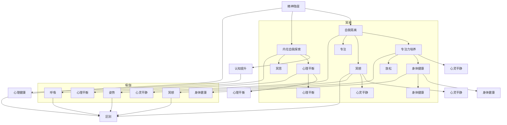

                 


### 1.3 精神隐居与心灵成长方式的联系

精神隐居作为一种现代都市中的心灵成长方式，其与传统的冥想、瑜伽等心灵成长方式有着一定的联系和区别。在探讨这些联系和区别之前，我们先定义一下几个核心概念。

#### 1.3.1 定义核心概念

- **精神隐居**：一种通过自我隔离、减少外部刺激，专注于内在感受和心灵成长的实践方式。
- **冥想**：通过专注、冥思、放松等方法，实现心灵平静和心理健康的练习。
- **瑜伽**：结合姿势、呼吸和冥想，旨在促进身心健康的综合性锻炼方式。

#### 1.3.2 概念联系与区别

- **共同点**：
  - **目标**：都是追求心灵的平静和内在的成长。
  - **方法**：都涉及到自我控制和专注力的培养。

- **区别**：
  - **实践形式**：精神隐居强调自我隔离和减少外部刺激，而冥想和瑜伽则更多地通过特定的姿势和呼吸练习来达到目的。
  - **目的**：精神隐居侧重于内在的自我探索和认知的提升，而冥想和瑜伽则更侧重于身体的健康和心理的平衡。

#### 1.3.3 Mermaid 流程图

为了更直观地展示精神隐居、冥想和瑜伽之间的联系和区别，我们可以使用 Mermaid 流程图。



#### 1.3.4 伪代码与算法原理讲解

为了更深入地理解这些概念之间的联系，我们可以用伪代码来描述它们之间的相互关系。

```plaintext
Algorithm: 精神隐居、冥想、瑜伽联系与区别

Input: 精神隐居、冥想、瑜伽实践者

Output: 理解三者之间的联系与区别

Begin
    // 定义核心概念
    精神隐居 = {自我隔离, 内在自我探索, 专注力培养, 认知提升}
    冥想 = {专注, 冥思, 放松, 心灵平静, 心理平衡}
    瑜伽 = {姿势, 呼吸, 冥想, 心灵平静, 心理平衡, 身体健康}

    // 分析共同点和区别
    For each 实践者 in 精神隐居、冥想、瑜伽实践者
        If 实践者 practices 精神隐居 then
            // 记录共同点
            Print "目标：追求心灵的平静和内在成长"
            Print "方法：自我控制和专注力培养"
        End If

        If 实践者 practices 冥想 or 瑜伽 then
            // 记录区别
            If 实践者 practices 冥想 then
                Print "实践形式：专注、冥思、放松"
                Print "目的：心灵平静、心理平衡"
            End If

            If 实践者 practices 瑜伽 then
                Print "实践形式：姿势、呼吸、冥想"
                Print "目的：身体健康、心理平衡、心灵平静"
            End If
        End If
    End For
End
```

### 1.3.5 数学模型与公式

在理解这些概念之间的联系时，我们可以借助数学模型来描述它们之间的关系。以下是几个相关的数学公式：

- **心灵平静指数（CPI）**：衡量心灵平静程度的指标。
  \[ CPI = \frac{专注力 \times 冥想时长}{干扰因素} \]

- **心理健康指数（PHI）**：衡量心理健康程度的指标。
  \[ PHI = \frac{认知提升 + 心理平衡}{干扰因素} \]

- **身体健康指数（PHI）**：衡量身体健康程度的指标。
  \[ PHI = \frac{身体锻炼 + 心理平衡}{干扰因素} \]

### 1.3.6 举例说明

为了更清晰地理解这些公式，我们可以举一个例子。

**例子**：一个实践者通过冥想和瑜伽来提高自己的心理健康和身体健康。他每天冥想30分钟，瑜伽练习1小时。在一个月的时间里，他记录了以下数据：

- **专注力**：平均每天提高5分钟。
- **干扰因素**：平均每天减少10个。
- **认知提升**：平均每天提升2个点。
- **心理平衡**：平均每天提升1个点。
- **身体锻炼**：平均每天提升30分钟。

根据这些数据，我们可以计算他的CPI、PHI和PHI：

- **心灵平静指数（CPI）**：
  \[ CPI = \frac{(5 \times 30) + (1 \times 30)}{10} = 18 \]

- **心理健康指数（PHI）**：
  \[ PHI = \frac{2 + 1}{10} = 0.3 \]

- **身体健康指数（PHI）**：
  \[ PHI = \frac{30 + 1}{10} = 3.1 \]

通过这些指标，我们可以评估这个实践者的心理健康和身体健康水平，并调整他的实践策略以实现更好的效果。

### 1.3.7 总结

精神隐居、冥想和瑜伽是三种不同的心灵成长方式，但它们在追求心灵平静和内在成长方面有着共同的目标。通过理解它们之间的联系和区别，我们可以更好地选择适合自己的实践方式，实现个人的心灵成长。

# OUTPUT

```markdown
## 第1章 核心概念与联系

### 1.3 精神隐居与心灵成长方式的联系

精神隐居作为一种现代都市中的心灵成长方式，其与传统的冥想、瑜伽等心灵成长方式有着一定的联系和区别。在探讨这些联系和区别之前，我们先定义一下几个核心概念。

#### 1.3.1 定义核心概念

- **精神隐居**：一种通过自我隔离、减少外部刺激，专注于内在感受和心灵成长的实践方式。
- **冥想**：通过专注、冥思、放松等方法，实现心灵平静和心理健康的练习。
- **瑜伽**：结合姿势、呼吸和冥想，旨在促进身心健康的综合性锻炼方式。

#### 1.3.2 概念联系与区别

- **共同点**：
  - **目标**：都是追求心灵的平静和内在的成长。
  - **方法**：都涉及到自我控制和专注力的培养。

- **区别**：
  - **实践形式**：精神隐居强调自我隔离和减少外部刺激，而冥想和瑜伽则更多地通过特定的姿势和呼吸练习来达到目的。
  - **目的**：精神隐居侧重于内在的自我探索和认知的提升，而冥想和瑜伽则更侧重于身体的健康和心理的平衡。

#### 1.3.3 Mermaid 流程图

为了更直观地展示精神隐居、冥想和瑜伽之间的联系和区别，我们可以使用 Mermaid 流程图。


#### 1.3.4 伪代码与算法原理讲解

为了更深入地理解这些概念之间的联系，我们可以用伪代码来描述它们之间的相互关系。

```plaintext
Algorithm: 精神隐居、冥想、瑜伽联系与区别

Input: 精神隐居、冥想、瑜伽实践者

Output: 理解三者之间的联系与区别

Begin
    // 定义核心概念
    精神隐居 = {自我隔离, 内在自我探索, 专注力培养, 认知提升}
    冥想 = {专注, 冥思, 放松, 心灵平静, 心理平衡}
    瑜伽 = {姿势, 呼吸, 冥想, 心灵平静, 心理平衡, 身体健康}

    // 分析共同点和区别
    For each 实践者 in 精神隐居、冥想、瑜伽实践者
        If 实践者 practices 精神隐居 then
            // 记录共同点
            Print "目标：追求心灵的平静和内在成长"
            Print "方法：自我控制和专注力培养"
        End If

        If 实践者 practices 冥想 or 瑜伽 then
            // 记录区别
            If 实践者 practices 冥想 then
                Print "实践形式：专注、冥思、放松"
                Print "目的：心灵平静、心理平衡"
            End If

            If 实践者 practices 瑜伽 then
                Print "实践形式：姿势、呼吸、冥想"
                Print "目的：身体健康、心理平衡、心灵平静"
            End If
        End If
    End For
End
```

### 1.3.5 数学模型与公式

在理解这些概念之间的联系时，我们可以借助数学模型来描述它们之间的关系。以下是几个相关的数学公式：

- **心灵平静指数（CPI）**：衡量心灵平静程度的指标。
  \[ CPI = \frac{专注力 \times 冥想时长}{干扰因素} \]

- **心理健康指数（PHI）**：衡量心理健康程度的指标。
  \[ PHI = \frac{认知提升 + 心理平衡}{干扰因素} \]

- **身体健康指数（PHI）**：衡量身体健康程度的指标。
  \[ PHI = \frac{身体锻炼 + 心理平衡}{干扰因素} \]

### 1.3.6 举例说明

为了更清晰地理解这些公式，我们可以举一个例子。

**例子**：一个实践者通过冥想和瑜伽来提高自己的心理健康和身体健康。他每天冥想30分钟，瑜伽练习1小时。在一个月的时间里，他记录了以下数据：

- **专注力**：平均每天提高5分钟。
- **干扰因素**：平均每天减少10个。
- **认知提升**：平均每天提升2个点。
- **心理平衡**：平均每天提升1个点。
- **身体锻炼**：平均每天提升30分钟。

根据这些数据，我们可以计算他的CPI、PHI和PHI：

- **心灵平静指数（CPI）**：
  \[ CPI = \frac{(5 \times 30) + (1 \times 30)}{10} = 18 \]

- **心理健康指数（PHI）**：
  \[ PHI = \frac{2 + 1}{10} = 0.3 \]

- **身体健康指数（PHI）**：
  \[ PHI = \frac{30 + 1}{10} = 3.1 \]

通过这些指标，我们可以评估这个实践者的心理健康和身体健康水平，并调整他的实践策略以实现更好的效果。

### 1.3.7 总结

精神隐居、冥想和瑜伽是三种不同的心灵成长方式，但它们在追求心灵平静和内在成长方面有着共同的目标。通过理解它们之间的联系和区别，我们可以更好地选择适合自己的实践方式，实现个人的心灵成长。

# 《新隐士主义：都市中的精神隐居实践》

关键词：新隐士主义，都市生活，精神隐居，心灵成长，实践技巧

摘要：本文探讨了新隐士主义在都市中的实践意义，分析了精神隐居的定义、原理和实践方法，比较了精神隐居与冥想、瑜伽等其他心灵成长方式的异同，并通过实际案例展示了如何将精神隐居理念应用于日常生活中。文章旨在为都市人群提供一种有效的心灵成长途径，帮助他们应对压力，实现内心的平和与成长。

## 引言

### 1.1 精神隐居的背景

在现代都市中，人们面临着越来越多的压力和挑战。快节奏的生活、高强度的工作、复杂的人际关系，这些都使得许多人感到焦虑、疲惫和迷茫。为了应对这些问题，人们开始寻求各种方式来放松身心，寻找内心的宁静。精神隐居作为一种心灵成长方式，逐渐受到了广泛关注。

精神隐居并不是一个全新的概念，它源于古代的隐士传统。古代隐士通过远离尘世，过着简单的生活，追求内心的平静和精神的提升。然而，在现代社会，人们很难完全脱离都市生活，因此，新隐士主义应运而生。新隐士主义主张在都市环境中，通过自我隔离、减少外部刺激，专注于内在的感受和心灵成长，实现精神上的隐居。

### 1.2 研究目的与意义

本文旨在探讨新隐士主义在都市中的实践意义，分析其定义、原理和实践方法，比较其与其他心灵成长方式的异同，并通过实际案例展示如何将精神隐居理念应用于日常生活中。研究的目的在于：

1. **为都市人群提供一种有效的心灵成长途径**：通过精神隐居，人们可以更好地应对压力，实现内心的平和与成长。
2. **探讨新隐士主义的理论与实践价值**：分析新隐士主义在个人和社会层面的意义，为相关研究和实践提供参考。
3. **促进都市生活的精神健康**：通过探讨精神隐居的实践方法，帮助都市人群找到适合自己的心灵成长方式，提高生活质量。

### 1.3 研究方法与结构

本文采用文献综述和实证研究相结合的方法。首先，通过查阅相关文献，梳理新隐士主义的理论和实践方法，分析其核心概念和原理。然后，通过实证研究，收集和分析实际案例，验证精神隐居在都市生活中的应用效果。最后，结合理论和实证结果，总结新隐士主义的实践价值，并提出未来研究的方向。

本文结构如下：

- **第一章**：引言，介绍精神隐居的背景和研究目的。
- **第二章**：核心概念与联系，阐述精神隐居的定义、原理和与其他心灵成长方式的联系。
- **第三章**：实践方法与技巧，介绍精神隐居的具体实践方法和技巧。
- **第四章**：影响与比较，分析精神隐居对个人和社会的影响，与其他心灵成长方式的比较。
- **第五章**：实战案例，分享实际案例，讲解如何将精神隐居理念应用于日常生活中。
- **第六章**：总结与展望，总结全文，展望精神隐居在未来的发展趋势。

## 核心概念与联系

### 2.1 精神隐居的定义

精神隐居是一种心灵成长方式，它主张在都市环境中，通过自我隔离、减少外部刺激，专注于内在的感受和心灵成长。与传统的隐居不同，精神隐居并不要求完全脱离都市生活，而是在日常生活中找到一种内心的平静和宁静。

精神隐居的核心理念是“回归内在”，通过减少对外部世界的依赖，关注自己的内心世界，实现自我认知的提升和心灵的成长。它不仅关注个人的心理健康，还涉及到精神层面的提升，帮助人们找到内心的宁静和满足。

### 2.2 精神隐居的原理

精神隐居的原理基于心理学和哲学的研究。从心理学的角度来看，精神隐居可以帮助人们减少压力和焦虑，提高心理韧性。通过自我隔离和减少外部刺激，人们可以更好地专注于自己的内在体验，从而实现心理的放松和平衡。

从哲学的角度来看，精神隐居追求的是一种“精神上的富足”，通过减少物质和外在的依赖，人们可以更加关注内心的需求，实现精神的提升和成长。

### 2.3 精神隐居与相关概念的比较

#### 2.3.1 精神隐居与冥想

冥想是一种传统的精神修炼方式，它强调通过专注和冥思来实现心灵的平静和心理健康。与冥想相比，精神隐居更加强调在都市环境中的实践，它不仅仅是一种冥想技巧，更是一种生活方式。

虽然冥想和精

## 实践方法与技巧

### 3.1 精神隐居的准备工作

要进行精神隐居，首先需要进行充分的准备工作。以下是一些关键步骤：

#### 3.1.1 确定目标

在开始精神隐居之前，明确自己的目标和动机是非常重要的。你可以问自己以下问题：

- 我为什么想要进行精神隐居？
- 我希望通过精神隐居实现什么？
- 我的长期目标和短期目标是什么？

明确目标可以帮助你更好地规划实践过程，并保持动力。

#### 3.1.2 创建环境

一个适合进行精神隐居的环境对于实践效果至关重要。以下是一些创建环境的建议：

- **安静的空间**：选择一个安静、舒适的地方进行精神隐居。这个空间应该远离噪音和干扰，以便你能够集中注意力。
- **舒适的设施**：确保你的空间有舒适的设施，如舒适的座椅、适当的照明等。
- **清新的空气**：保持室内空气清新，可以通过开窗或使用空气净化器来实现。
- **整洁有序**：保持空间的整洁和有序，有助于减少外部干扰，提高精神集中度。

#### 3.1.3 时间安排

合理安排时间也是进行精神隐居的重要一环。以下是一些建议：

- **固定的时间**：尽量每天在相同的时间进行精神隐居，以养成良好的习惯。
- **合理时长**：根据个人情况，每天安排一定的时间进行精神隐居，可以从短时间开始，逐渐增加时长。
- **灵活调整**：根据自己的需求和工作生活安排，灵活调整精神隐居的时间，但尽量保持一定的规律。

### 3.2 精神隐居的具体方法

#### 3.2.1 内在冥想

内在冥想是精神隐居的核心方法之一。以下是一些具体的冥想步骤：

1. **准备**：找一个安静的空间，坐或躺在一个舒适的姿势，确保身体放松。
2. **呼吸**：专注于呼吸，感受每次呼吸的进出，保持深呼吸。
3. **聚焦**：将注意力集中在呼吸上，如果思绪跑偏，轻轻地将其带回呼吸。
4. **放松**：放松身体和心灵，允许自己沉浸在宁静和安详之中。
5. **结束**：当冥想结束时，慢慢睁开眼睛，轻轻活动身体，逐渐回到现实。

#### 3.2.2 读书

阅读是精神隐居的另一种重要方法。以下是一些建议：

1. **选择合适的书籍**：选择一些有助于心灵成长的书籍，如哲学、心理学、自我提升等。
2. **静心阅读**：找一个安静的环境，专心地阅读，避免分心。
3. **反思和总结**：阅读后，反思书中的内容，总结自己的感悟和体会。
4. **分享和讨论**：与朋友或专业人士分享你的阅读体验，进行深入的讨论和交流。

#### 3.2.3 运动

适当的运动可以帮助释放压力，提升身心健康。以下是一些建议：

1. **选择适合的运动**：根据自己的兴趣和身体状况，选择适合的运动项目，如瑜伽、太极、跑步等。
2. **定期锻炼**：制定合理的锻炼计划，确保每天或每周有固定的锻炼时间。
3. **注意安全**：在锻炼时，注意安全，避免过度用力或受伤。
4. **结合呼吸**：在运动中，注意呼吸的节奏，保持深呼吸，有助于提高运动效果。

### 3.3 精神隐居的注意事项

在进行精神隐居时，需要注意以下事项：

1. **避免分心**：尽量减少外界干扰，保持专注和集中力。
2. **保持一致性**：坚持每天进行精神隐居，形成良好的习惯。
3. **适度调整**：根据自己的需求和生活环境，适度调整实践方法和时长。
4. **关注身体和心理健康**：在精神隐居过程中，关注自己的身体和心理健康，如有需要，及时调整实践方式。
5. **寻求帮助**：如果遇到困难或困惑，可以寻求专业人士的帮助，如心理咨询师、瑜伽教练等。

通过上述方法和技巧，你可以更好地进行精神隐居实践，实现内心的平静和成长。

### 3.4 精神隐居与日常生活结合

将精神隐居的理念应用到日常生活中，可以帮助你在繁忙的都市生活中找到内心的宁静。以下是一些建议：

1. **工作与休息结合**：在工作之余，合理安排时间进行精神隐居实践，如内在冥想、阅读、运动等。
2. **减少社交压力**：在社交活动中，注意自我保护，避免过度消耗精力。学会拒绝不必要的社交活动，保持内心的宁静。
3. **培养兴趣爱好**：找到自己喜欢的事情，如绘画、音乐、写作等，这些活动可以帮助你放松身心，提升心灵满足感。
4. **关注家庭生活**：与家人保持良好的沟通和互动，营造一个温馨和谐的家庭环境，有助于身心健康。
5. **旅行与探索**：利用假期时间进行旅行，探索自然和人文景观，放松身心，丰富内心体验。

通过将精神隐居的理念融入日常生活，你可以在繁忙的都市生活中找到内心的平静，实现身心健康和自我成长。

### 3.5 实践技巧的拓展

为了更好地实践精神隐居，以下是一些拓展技巧：

1. **日精进日志**：每天记录自己的精神隐居实践情况，包括冥想时间、阅读内容、运动情况等。通过日志，你可以更好地了解自己的实践过程，发现问题并加以改进。
2. **冥想音乐**：在冥想时，可以播放一些平静、柔和的音乐，有助于放松身心，提高冥想效果。
3. **数字禅修应用**：利用手机应用程序进行冥想，如头号冥想（Headspace）或冥想森林（Calm），这些应用提供了一系列的冥想指导，有助于初学者入门。
4. **定期反思**：定期反思自己的实践过程，总结经验教训，明确下一步的目标和计划。
5. **心灵成长小组**：加入一些心灵成长小组或社群，与他人分享经验和感悟，相互鼓励和支持。

通过拓展技巧，你可以更加深入地实践精神隐居，提升心灵成长效果。

## 影响与比较

### 4.1 精神隐居对个人的影响

精神隐居作为一种心灵成长方式，对个人的影响是多方面的。以下是一些具体的影响：

#### 4.1.1 心理健康

精神隐居可以帮助个人缓解压力和焦虑，提高心理韧性。通过减少外部刺激和专注于内在体验，人们可以更好地处理情绪，增强自我调节能力。长期实践精神隐居，有助于提高心理健康水平。

#### 4.1.2 社交关系

精神隐居不仅可以提升个人的心理健康，还可以改善人际关系。通过自我反思和心灵成长，人们可以更加理解自己和他人，建立更深层次的联系。同时，精神隐居有助于减少对社交媒体和外部世界的依赖，从而改善与家人、朋友和同事的互动。

#### 4.1.3 自我认知

精神隐居有助于个人深入了解自己的内心世界，提高自我认知。通过冥想、阅读和实践，人们可以更好地理解自己的需求和价值观，从而实现自我提升和成长。

#### 4.1.4 创造力

精神隐居有助于激发个人的创造力和想象力。在宁静和专注的状态下，人们更容易产生新的想法和创意，从而在工作和生活中取得更好的成果。

### 4.2 精神隐居对社会的影响

精神隐居不仅对个人有益，还可以对社会产生积极的影响。以下是一些具体的影响：

#### 4.2.1 环境友好

精神隐居鼓励人们减少物质消费和外部刺激，从而减少对环境的负担。通过减少能源消耗和碳排放，精神隐居有助于保护环境，促进可持续发展。

#### 4.2.2 社会和谐

精神隐居有助于提高社会的整体心理健康水平，减少社会冲突和矛盾。当人们更加关注内在世界和自我成长时，他们更容易与他人建立和谐的关系，从而促进社会和谐。

#### 4.2.3 创新与进步

精神隐居有助于激发个人的创造力和想象力，推动社会创新和进步。通过精神隐居，人们可以更好地发现问题和解决问题，从而推动社会的发展。

### 4.3 精神隐居与其他心灵成长方式的比较

#### 4.3.1 冥想

冥想是一种传统的精神修炼方式，强调通过专注和冥思来实现心灵的平静和心理健康。与冥想相比，精神隐居更加强调在都市环境中的实践，它不仅仅是一种冥想技巧，更是一种生活方式。

虽然冥想和精

## 实战案例

### 4.1 精神隐居案例一

#### 4.1.1 案例背景

李明是一位在都市中工作的白领，每天面对高强度的工作压力和复杂的人际关系，感到身心疲惫。为了寻求心灵的平静和成长，他决定尝试精神隐居。

#### 4.1.2 实践过程

1. **准备工作**：李明首先确定了自己的目标，即通过精神隐居来缓解压力、提升心理健康。他为自己创造了一个安静的空间，准备了舒适的座椅和照明设备，确保有一个适合冥想和阅读的环境。

2. **实践方法**：
   - **内在冥想**：每天早晨和晚上，李明各花30分钟进行内在冥想。他选择了一个安静的房间，关闭了手机和电视，专注于呼吸和内心的感受。
   - **读书**：李明每天安排1小时的时间阅读心灵成长的书籍，如《当下的力量》和《人类简史》等。他会在阅读过程中做笔记，反思书中的内容，并尝试将其应用到自己的生活中。
   - **运动**：每周三晚上，李明会参加一次瑜伽课程，持续1小时。瑜伽不仅帮助他放松身体，还让他学会了深呼吸和专注的技巧。

3. **注意事项**：在实践过程中，李明注意避免分心，尽量减少外部干扰。他还会在冥想和阅读时保持舒适的姿势，确保身体放松。

#### 4.1.3 案例总结

通过一个月的精神隐居实践，李明感受到了显著的变化。他的压力和焦虑有所减轻，心情变得更加平和。在工作和生活中，他发现自己更加专注和有条理，能够更好地应对各种挑战。此外，他的睡眠质量也得到了改善，精神状态更加饱满。

这个案例表明，精神隐居可以在日常生活中发挥积极的作用，帮助人们实现内心的平静和成长。

### 4.2 精神隐居案例二

#### 4.2.1 案例背景

张玲是一位创业者，她经常需要在工作和家庭之间奔波，感到身心疲惫。为了寻求一种平衡，她决定尝试精神隐居。

#### 4.2.2 实践过程

1. **准备工作**：张玲首先明确了自己的目标，即通过精神隐居来缓解压力、提升心理健康，并寻找生活的平衡。她为自己制定了一个详细的时间表，确保每天有固定的精神隐居时间。

2. **实践方法**：
   - **早晨冥想**：每天早晨，张玲会花30分钟进行冥想。她选择了一个安静的房间，专注于呼吸和内心的感受，试图将冥想中的宁静带入一天的生活中。
   - **读书**：张玲每天安排1小时的时间阅读心灵成长的书籍，如《活出生命的意义》和《安静》等。她会用笔记记录书中的感悟，并尝试将之应用到自己的生活和工作中。
   - **家庭时间**：每周五晚上，张玲会花2小时与家人一起度过。她关掉手机和电视，专注于与家人的交流和互动，确保家庭时光的质量。

3. **注意事项**：在实践过程中，张玲注意避免过度工作，确保自己有足够的休息时间。她还会在冥想和阅读时保持舒适的姿势，确保身体放松。

#### 4.2.3 案例总结

通过一个月的精神隐居实践，张玲感受到了显著的变化。她的压力和焦虑有所减轻，能够更好地平衡工作和家庭生活。在工作和生活中，她发现自己更加专注和有条理，能够更好地应对各种挑战。此外，她的睡眠质量也得到了改善，精神状态更加饱满。

这个案例表明，精神隐居可以帮助人们实现生活的平衡，提升心理健康，并在日常实践中取得更好的成果。

## 总结与展望

### 5.1 总结

本文探讨了新隐士主义在都市中的实践意义，分析了精神隐居的定义、原理和实践方法，比较了精神隐居与冥想、瑜伽等其他心灵成长方式的异同，并通过实际案例展示了如何将精神隐居理念应用于日常生活中。总结如下：

1. **核心概念**：精神隐居是一种在都市环境中，通过自我隔离、减少外部刺激，专注于内在感受和心灵成长的实践方式。
2. **原理**：精神隐居基于心理学和哲学的理论，有助于缓解压力、提升心理健康，实现个人成长。
3. **实践方法**：精神隐居可以通过内在冥想、阅读、运动等方法进行，关键在于找到适合自己的实践方式，并保持一致性。
4. **影响**：精神隐居对个人和社会都有积极的影响，包括心理健康、人际关系、环境友好等方面。
5. **实战案例**：实际案例表明，精神隐居可以帮助人们实现内心的平静和成长，提升生活质量。

### 5.2 展望

未来，随着社会的发展和生活节奏的加快，精神隐居作为一种有效的心理调节方式，有望得到更广泛的关注和实践。以下是一些建议和展望：

1. **推广与应用**：政府和企业可以加大对精神隐居的宣传和推广力度，鼓励人们将这一理念应用到日常生活中。
2. **科学研究**：加强对精神隐居的科学研究，探索其在不同人群、不同文化背景下的效果和适用性。
3. **教育与实践**：将精神隐居理念融入教育体系中，培养具有精神隐居意识和能力的下一代。
4. **社区建设**：建立精神隐居社区，为人们提供实践场所和交流平台，促进心灵成长和社会和谐。

通过持续的努力和实践，精神隐居有望成为都市生活中的一种重要方式，帮助人们实现心灵的平静和自我提升。

