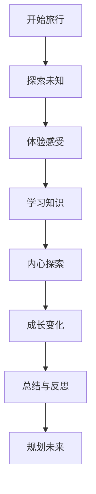

                 

# 旅行的意义：在移动中重新认识自我

> 关键词：旅行、自我认知、成长、意义、移动、探索、体验、学习

> 摘要：本文通过分析旅行的多重意义，探讨旅行如何在移动中帮助我们重新认识自我，实现个人成长。文章从旅行在人生中的地位、旅行的历史与文化、旅行的意义、自我认识的旅程以及结论与反思五个部分进行深入探讨，结合实际案例和代码实现，旨在为读者提供一次有深度的思考之旅。

## 第一部分：引言与背景

### 1.1 旅行在人生中的地位

旅行，作为一种古老而普遍的人类活动，承载着人们对于探索、发现、学习和成长的渴望。在现代社会中，旅行已经成为许多人生活中不可或缺的一部分。它不仅是一种放松和娱乐的方式，更是提升自我认知和实现个人成长的重要途径。

从心理学角度来看，旅行有助于人们从日常生活的压力中解脱出来，重新审视自我，发现内心的需求和渴望。旅行中的新鲜体验和挑战，能够激发人的创造力和适应力，促进自我成长。

### 1.2 重新认识旅行的意义

旅行的意义并非仅仅是浏览风景、享受美食，更深层次的是在移动中重新认识自我。旅行可以让人暂时脱离熟悉的环境，面对未知的挑战，从而更深刻地认识自己的能力和局限。这种认知不仅仅是外在的观察，更是内心的体验和反思。

通过旅行，人们可以学会独立思考，解决问题，处理人际关系，这些都是个人成长中不可或缺的能力。此外，旅行还可以帮助人们建立更广阔的视野，了解不同的文化和生活方式，从而拓宽思维边界。

### 1.3 旅行与自我成长

旅行与自我成长之间存在着密不可分的联系。每一次旅行都是一次自我挑战和成长的机会。在旅行中，人们需要面对各种未知的挑战，从适应新环境到解决实际问题，这一过程能够锻炼人的适应能力和解决问题的能力。

同时，旅行中的交流和互动，可以促进人际关系的建立和维护，提高人际沟通能力。在团队合作中，人们可以学习如何协调、合作，从而提升团队协作能力。

### 1.4 旅行的历史与文化

旅行在人类历史上有着悠久的传统。早在古代，人们就开始探索未知的领域，寻找新的资源和机会。随着交通工具的发明和改进，旅行的范围和频率大幅增加，旅行文化也逐渐丰富。

在许多文化中，旅行被视为一种精神追求和修行。例如，佛教中的“行脚僧”和基督教中的“朝圣”活动，都体现了旅行在精神层面的重要意义。

## 第二部分：旅行的意义

### 2.1 探索与发现

旅行最大的魅力之一在于探索未知的世界。每一次旅行都是一次新的发现，无论是大自然的壮丽景色，还是异国他乡的文化特色，都能给人带来新鲜的体验和启发。

在探索中，人们可以突破舒适区，面对未知的挑战。这种挑战不仅锻炼了人的意志力，也激发了人的创造力和创新思维。

### 2.2 体验与感受

旅行中的体验和感受是重新认识自我的重要途径。通过亲身体验不同的文化和生活方式，人们可以更深入地了解自己的兴趣、价值观和生活方式。

例如，品尝异国美食、欣赏当地艺术、参与传统节日，这些体验都能让人感受到不同的文化和生活方式的魅力，从而重新审视自己的生活和选择。

### 2.3 知识与学习

旅行是一种有效的学习方式。在旅行过程中，人们可以学习到很多新的知识和技能。例如，语言学习、历史知识、地理知识、文化差异等。

此外，旅行中的实际操作和体验，如烹饪、驾驶、登山等，也是一种实践学习的过程。这种学习不仅提高了个人的综合素质，也为未来的生活和工作打下了坚实的基础。

### 2.4 自我反思与成长

旅行中的挑战和体验，常常会引发人们的自我反思。在陌生的环境中，人们需要独立解决问题，这种经历可以让人更深刻地认识到自己的能力和局限。

通过反思，人们可以发现自己的优点和不足，从而制定更有效的成长计划。旅行中的每一次经历，都是个人成长的一次积累。

### 2.5 旅行与心理健康的关联

旅行对心理健康有着积极的影响。在旅行中，人们可以暂时脱离日常的压力和烦恼，放松身心，享受宁静和快乐。

此外，旅行中的新鲜体验和挑战，可以激发人的积极情绪，提高自信心和自尊心。对于那些长期处于压力环境中的人来说，旅行是一种很好的缓解压力和恢复心理健康的方式。

## 第三部分：自我认识的旅程

### 3.1 内心的探索

内心的探索是旅行中最为深刻的体验之一。在陌生的环境中，人们可以更清楚地看到自己的内心世界，认识到自己的情绪、需求和恐惧。

通过内心的探索，人们可以更好地理解自己，学会面对自己的情绪和挑战，从而实现内心的平静和成长。

### 3.2 自我认识的旅途

旅行中的每一步，都是自我认识的一次旅程。在这个旅程中，人们需要不断地面对自己，接受自己的不完美，并努力提升自己。

通过旅行，人们可以学习到如何处理复杂的人际关系，如何面对挑战和困难，如何平衡工作与生活，这些都是个人成长中不可或缺的部分。

### 3.3 成长与变化

旅行中的成长和变化是不可避免的。每一次旅行，都是一次新的开始，一个新的自我。在旅行的过程中，人们会不断地学习和成长，从而实现自我突破和提升。

成长和变化不仅是外在的行为改变，更是内心的成熟和进步。通过旅行，人们可以更深刻地认识到自己的潜力和可能性，从而激发出更大的内在动力。

## 第四部分：结论与反思

### 4.1 旅行的总结

旅行不仅是一种体验，更是一种成长的过程。通过旅行，人们可以更深入地认识自我，发现内心的需求和渴望，实现个人成长。

旅行中的每一次经历，都是一次宝贵的财富，都是对自我的一次探索和提升。无论是探索未知的世界，还是体验不同的文化，旅行都能给人带来深刻的感悟和启发。

### 4.2 旅行中的感悟

旅行中的感悟是多种多样的。有些人通过旅行学会了如何独立解决问题，有些人通过旅行发现了自己的兴趣和潜力，还有些人通过旅行找到了内心的平静和宁静。

无论是哪种感悟，旅行都能给人带来深刻的体验和启示，从而提升个人的综合素质和生活质量。

### 4.3 旅行与人生的联系

旅行与人生紧密相连。旅行不仅是人生的一部分，更是人生的一种态度和哲学。通过旅行，人们可以更深入地理解人生的意义和价值，找到属于自己的生活方式和价值观。

旅行中的每一次经历，都是对人生的一次思考和反思，都是对自我的一次探索和提升。只有通过旅行，人们才能真正地认识自我，实现自我成长。

### 4.4 未来的旅行

未来，旅行将继续成为人们生活中不可或缺的一部分。随着科技的发展和交通工具的进步，旅行的范围和方式将更加多样化。

未来，人们将更加注重旅行的品质和体验，而不是简单的游览和观光。旅行将更加个性化、多元化，成为人们实现自我价值和生活质量提升的重要途径。

### 4.5 旅行中的注意事项

在旅行中，人们需要注重安全、健康和环保。在享受旅行带来的乐趣和体验的同时，也要关注自身和他人的安全与健康。

此外，旅行中的行为举止也要符合当地的文化和习俗，尊重他人，做到文明出行。

### 附录：旅行资源与建议

#### 附录1：旅行准备事项

- 提前规划旅行路线和行程
- 准备必要的旅行文件和证件
- 购买合适的旅行保险
- 检查健康状况，提前接种疫苗

#### 附录2：旅行目的地推荐

- 自然风光类：张家界、黄山、张家界
- 文化历史类：北京、西安、敦煌
- 城市探索类：东京、纽约、伦敦

#### 附录3：旅行中的人际交往技巧

- 尊重当地文化和习俗
- 保持开放和包容的心态
- 学会倾听和沟通
- 注意个人隐私和安全

### Mermaid 流程图与伪代码



```python
# 伪代码：内心探索过程
def explore_self():
    # 初始化内心状态
    inner_state = initialize_state()

    # 进行自我观察
    while not end_of_travel:
        current_situation = observe_situation()
        
        # 反思当前状态
        reflection = reflect_on_situation(current_situation)
        
        # 调整内心状态
        inner_state = adjust_state(inner_state, reflection)
        
        # 记录成长过程
        record_growth(inner_state)
        
    # 结束旅行，总结内心探索
    summary = summarize_explore(inner_state)
    return summary
```

### 总结

旅行，是一种在移动中重新认识自我的过程。通过旅行，我们可以探索未知、体验感受、学习知识，从而实现个人成长和自我提升。旅行不仅丰富了我们的生活，更深刻地改变了我们的内心世界。让我们珍惜每一次旅行的机会，用旅行的心态去面对生活中的每一个挑战，实现自我价值的不断提升。作者：AI天才研究院/AI Genius Institute & 禅与计算机程序设计艺术 /Zen And The Art of Computer Programming。

