                 

## 文章标题

# 日常修行的智慧：在平凡中寻找超凡

### 关键词：
- 日常修行
- 心态调整
- 超凡智慧
- 个人成长
- 职场应用
- 家庭应用
- 文化背景

### 摘要：
本文旨在探讨日常修行的智慧，如何在日常生活中通过修行寻找超凡的智慧。文章首先介绍了日常修行的概念和重要性，然后详细阐述了修行的基础理念、核心要素和具体实践方法。接下来，文章探讨了修行在职场和家庭中的应用，以及在不同文化背景下的实践。最后，文章分析了修行对个人成长的影响，并展望了修行的未来发展趋势。通过本文，读者将了解到修行不仅是一种个人精神修炼，更是一种提升生活品质和社会关系的有效途径。

## 目录大纲

### 第一部分：修行的基本理念

### 第1章：日常修行的概念与重要性
- 1.1 日常修行的定义
- 1.2 日常修行的重要性
- 1.3 日常修行与生活的关系

### 第2章：修行的基础理念
- 2.1 心态调整：从平凡中寻找超凡
- 2.2 修行与心理学的关系
- 2.3 修行的目的与方法

### 第3章：修行的核心要素
- 3.1 精神能量
- 3.2 身心平衡
- 3.3 自我认知

### 第4章：修行的具体实践
- 4.1 感恩修行
- 4.2 爱心修行
- 4.3 忍耐修行
- 4.4 正念修行

### 第5章：修行中的挑战与解决策略
- 5.1 修行中的常见问题
- 5.2 遇到挑战时的应对策略
- 5.3 如何持续修行

### 第6章：修行对个人成长的影响
- 6.1 修行对心理健康的促进作用
- 6.2 修行对个人能力的提升
- 6.3 修行对社会的影响

### 第7章：修行在社会层面的实践
- 7.1 修行与和谐社会
- 7.2 修行与人际关系
- 7.3 修行与教育

### 第二部分：修行在不同领域的应用

### 第8章：修行在职场中的应用
- 8.1 职场修行的重要性
- 8.2 如何在职场中实践修行
- 8.3 修行对职场成功的影响

### 第9章：修行在家庭中的应用
- 9.1 家庭修行的重要性
- 9.2 如何在家庭中实践修行
- 9.3 修行对家庭关系的影响

### 第10章：修行在自我成长中的应用
- 10.1 自我成长与修行的关系
- 10.2 如何通过修行实现自我成长
- 10.3 修行在自我成长中的重要性

### 第11章：修行在不同文化背景下的实践
- 11.1 修行在东方文化中的实践
- 11.2 修行在西方文化中的实践
- 11.3 修行在不同文化背景下的异同

### 第12章：修行的未来发展趋势
- 12.1 修行在现代社会中的地位
- 12.2 修行在教育、医疗等领域的应用前景
- 12.3 修行在未来社会中的影响

### 附录

### 附录A：修行相关的资源与工具
- A.1 修行相关的书籍推荐
- A.2 修行相关的在线课程推荐
- A.3 修行相关的App推荐

### 附录B：修行中的常见误区与解答
- B.1 误区一：修行需要长时间的独处
- B.2 误区二：修行就是消极避世
- B.3 误区三：修行就是对宗教信仰的追随

### 附录C：修行中的实用技巧
- C.1 如何进行有效的正念练习
- C.2 如何培养感恩的心态
- C.3 如何面对生活中的挑战

本文旨在为读者提供一个系统全面的修行指南，帮助读者在平凡的生活中找到超凡的智慧，实现个人成长和幸福。## 第一部分：修行的基本理念

### 第1章：日常修行的概念与重要性

#### 1.1 日常修行的定义

日常修行是指通过一系列具体的实践方法，如正念、感恩、爱心、忍耐等，来调整心态，提升自我认知和情感管理能力，从而实现身心健康和内心平静的过程。修行并不需要特定的宗教信仰，也不必追求神秘的境界，它是一种适用于所有人的日常生活实践。

**核心概念与联系**

以下是日常修行的核心概念及其相互关系架构的Mermaid流程图：

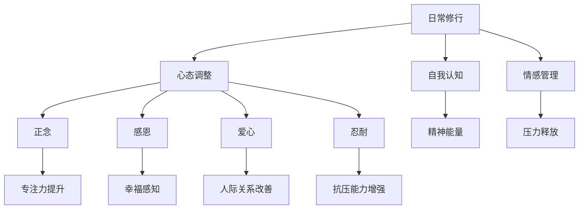

#### 1.2 日常修行的重要性

在现代社会，人们面临着各种压力和挑战，如工作压力、人际关系问题、情感困扰等。这些问题不仅影响个人的心理健康，也会对生活质量和幸福感产生负面影响。因此，日常修行成为一种应对现代生活挑战的重要手段。

**核心算法原理讲解**

以下是一个简单的伪代码，用于说明如何通过日常修行来调整心态和应对压力：

```plaintext
function adjust_mindset() {
    start_with_initial_state()

    while (not_achieved_ideal_state()) {
        practice_mindfulness()
        express_gratitude()
        cultivate_love()
        practice_patience()

        assess_progress()
    }

    return improved_mood_and_health()
}
```

在这个伪代码中，`adjust_mindset` 函数表示日常修行的过程。它通过一系列的修行实践（如正念、感恩、爱心、忍耐）来调整心态，并持续评估和改进，以达到理想的心理状态。

#### 1.3 日常修行与生活的关系

日常修行不仅是个人精神修养的过程，更是贯穿于日常生活的实践。它可以帮助我们更好地处理生活中的各种问题，提高生活品质和幸福感。

**数学模型和公式**

以下是一个简单的数学模型，用于描述修行对生活幸福感的影响：

$$
幸福感 = f(修行时间, 修行频率, 修行效果)
$$

在这个公式中，`修行时间` 表示我们每天花在修行上的时间，`修行频率` 表示我们修行的次数，`修行效果` 表示我们的修行实践是否有效。通过增加修行时间和频率，并提高修行效果，我们可以提高生活幸福感。

**举例说明**

假设一个人每天花20分钟进行修行，每周进行5次。经过一段时间的修行，他发现自己在面对压力时更加冷静，人际关系更加和谐。根据上述数学模型，他的幸福感将显著提高。

#### 小结

日常修行是一种通过调整心态、提升自我认知和情感管理能力来改善心理健康的实践。它不仅可以帮助我们应对现代生活的挑战，还可以提高生活品质和幸福感。通过具体的实践方法和数学模型，我们可以更清晰地理解日常修行的重要性和方法。

### 第2章：修行的基础理念

#### 2.1 心态调整：从平凡中寻找超凡

心态调整是日常修行的核心内容之一。它不仅影响我们的心理健康，还直接影响我们的生活质量。在日常生活中，我们常常被各种压力和烦恼所困扰，如何调整心态，从平凡中寻找超凡，是我们需要思考的重要问题。

**心态调整的核心概念**

心态调整的核心在于改变我们对事物的看法和反应方式。以下是几个关键概念：

- **积极心态**：积极心态是一种乐观、自信的态度，能够帮助我们更好地应对困难和挑战。通过培养积极心态，我们可以看到生活中的美好，提高幸福感。
- **适应能力**：适应能力是指我们应对变化和挑战的能力。生活中不可避免地会遇到各种变化，拥有良好的适应能力可以帮助我们更好地应对这些变化。
- **情绪管理**：情绪管理是指我们控制和调节自己的情绪，使其不影响我们的日常生活和工作。良好的情绪管理能力可以帮助我们保持内心的平静和稳定。

**心态调整与超凡智慧的关系**

心态调整不仅有助于提升我们的生活质量，还能够帮助我们发掘内在的超凡智慧。以下是心态调整与超凡智慧之间的关系：

- **内在平静**：通过心态调整，我们可以达到内心的平静。这种平静使我们能够更清晰地思考，发现生活中的智慧。
- **自我认知**：心态调整可以帮助我们更好地了解自己，发现自己的潜能和优势。这种自我认知是超凡智慧的基础。
- **创造力**：心态调整能够激发我们的创造力，使我们能够从不同角度看待问题，发现新的解决方案。

**如何从平凡中寻找超凡智慧**

以下是一些具体的方法，帮助我们从平凡中寻找超凡智慧：

1. **培养感恩心态**：感恩是一种积极的心态，能够让我们看到生活中的美好。通过培养感恩心态，我们可以更深入地了解生活的真谛，发现超凡的智慧。
2. **保持好奇心**：好奇心是一种强大的动力，能够激发我们的学习兴趣和创造力。通过保持好奇心，我们可以不断探索新知识，提升自己的智慧。
3. **接受变化**：生活中的变化是不可避免的，接受变化并学会适应，可以帮助我们更好地应对挑战，发现新的机遇。
4. **练习正念**：正念是一种集中注意力的练习，可以帮助我们更好地了解自己的内心世界。通过练习正念，我们可以发现内心的智慧和力量。

**数学模型和公式**

以下是一个简单的数学模型，用于描述心态调整对超凡智慧的影响：

$$
超凡智慧 = f(心态调整时间, 心态调整频率, 超凡智慧积累)
$$

在这个公式中，`心态调整时间` 表示我们每天花在心态调整上的时间，`心态调整频率` 表示我们心态调整的次数，`超凡智慧积累` 表示我们在心态调整过程中积累的智慧。通过增加心态调整时间和频率，并有效地积累智慧，我们可以提升超凡智慧。

**举例说明**

假设一个人每天花30分钟进行心态调整，每周进行3次。经过一段时间的调整，他发现自己的心态变得更加积极，面对问题更加冷静。根据上述数学模型，他的超凡智慧将显著提升。

#### 小结

心态调整是日常修行的核心内容，它不仅影响我们的心理健康和生活质量，还能够帮助我们发掘内在的超凡智慧。通过培养感恩心态、保持好奇心、接受变化和练习正念，我们可以从平凡中寻找超凡智慧。通过具体的数学模型，我们可以更清晰地理解心态调整对超凡智慧的影响。

### 第3章：修行的核心要素

#### 3.1 精神能量

精神能量是日常修行的核心要素之一，它直接影响我们的心态、情绪和身体健康。精神能量不仅是我们内心力量的源泉，也是我们应对生活中各种挑战的重要资源。

**精神能量的概念**

精神能量，又称内在能量或精神力量，是指存在于我们内心的一种无形力量。这种力量不仅影响我们的心态和情绪，还直接影响我们的身体健康和社交能力。

**精神能量与心理健康的关系**

精神能量与心理健康密切相关。拥有充足的精神能量可以帮助我们更好地应对生活中的压力和挑战，保持良好的心态和情绪。相反，精神能量不足可能导致焦虑、抑郁等心理问题。

**如何提升精神能量**

以下是一些具体的方法，可以帮助我们提升精神能量：

1. **正念练习**：正念是一种集中注意力的练习，可以帮助我们更好地了解自己的内心世界，提升精神能量。
2. **冥想**：冥想是一种通过静坐和深呼吸来放松身心，提升精神能量的方法。
3. **感恩**：感恩是一种积极的心态，能够提升我们的精神能量，使我们的心态更加积极乐观。
4. **运动**：适当的运动可以增强我们的身体和心理健康，提升精神能量。

**数学模型和公式**

以下是一个简单的数学模型，用于描述精神能量与心理健康的关系：

$$
心理健康 = f(精神能量, 心理压力, 社会支持)
$$

在这个公式中，`精神能量` 表示我们的精神力量，`心理压力` 表示我们面临的压力，`社会支持` 表示我们获得的社会支持。通过增加精神能量和减少心理压力，我们可以提高心理健康。

**举例说明**

假设一个人每天花20分钟进行冥想和正念练习，每周进行5次。经过一段时间的练习，他发现自己的心态更加积极，面对压力更加冷静。根据上述数学模型，他的心理健康将显著提升。

**案例分析与解读**

张先生是一位公司高管，工作压力巨大，常常感到身心疲惫。为了改善自己的心理健康，他开始进行冥想和正念练习。经过一段时间的练习，他发现自己的精神状态有了明显改善，面对工作压力时更加从容和冷静。这不仅提高了他的工作效率，还改善了与同事和家人的关系。

**小结**

精神能量是日常修行的核心要素之一，它直接影响我们的心理健康和心态。通过正念练习、冥想、感恩和运动等方法，我们可以提升精神能量，改善心理健康。通过具体的数学模型和案例分析，我们可以更清晰地理解精神能量与心理健康之间的关系。

### 第3.2 身心平衡

身心平衡是日常修行的关键要素，它直接关系到我们的身心健康和生活质量。身心平衡不仅是一种内在状态的和谐，也是一种通过具体实践方法来实现的状态。

**身心平衡的概念**

身心平衡，也称为身心健康，是指我们的身体和心灵处于一种和谐统一的状态。在这种状态下，我们的身体能够保持良好的生理功能，心灵能够保持平静和愉悦。

**身心平衡与身心健康的关系**

身心平衡是身心健康的基础。当我们的身体和心灵处于和谐状态时，我们的免疫系统会变得更加强大，身体的生理功能也会更加高效。同时，心理上的平衡能够减少焦虑、抑郁等心理问题的发生，提高我们的心理抗压能力。

**如何实现身心平衡**

以下是一些具体的方法，可以帮助我们实现身心平衡：

1. **健康饮食**：均衡的饮食是保持身体健康的重要基础。通过摄入丰富的营养，我们可以增强身体的抵抗力，实现身心平衡。
2. **适量运动**：适当的运动可以增强我们的身体素质，提高身体的代谢能力。同时，运动还可以帮助我们释放压力，保持心理平衡。
3. **冥想与正念**：冥想和正念练习可以帮助我们集中注意力，放松身心，提高心灵层面的平衡。
4. **充足的睡眠**：充足的睡眠是身心健康的重要保障。通过保证充足的睡眠，我们可以恢复体力和精神，实现身心平衡。

**数学模型和公式**

以下是一个简单的数学模型，用于描述身心平衡与身心健康的关系：

$$
身心健康 = f(身体平衡, 心灵平衡, 社会支持)
$$

在这个公式中，`身体平衡` 表示我们的身体状态，`心灵平衡` 表示我们的心理状态，`社会支持` 表示我们获得的社会支持。通过实现身体和心灵的平衡，并得到适当的社会支持，我们可以提高身心健康。

**举例说明**

假设一个人每天保持健康的饮食习惯，每周进行3次适量运动，每天进行30分钟的冥想和正念练习。经过一段时间的实践，他发现自己的身心状态有了明显改善，身体更加健康，心理更加平衡。根据上述数学模型，他的身心健康将显著提升。

**案例分析与解读**

李女士是一位忙碌的职业女性，由于长期的工作压力，她感到身心疲惫。为了改善自己的身心状态，她开始进行健康饮食、适量运动和冥想练习。经过一段时间的调整，她发现自己的身体状况和心理状态都有所改善，工作效率和生活质量都有了显著提升。

**小结**

身心平衡是日常修行的关键要素，它直接影响我们的身心健康和生活质量。通过健康饮食、适量运动、冥想与正念练习等方法，我们可以实现身心平衡，提高身心健康。通过具体的数学模型和案例分析，我们可以更清晰地理解身心平衡与身心健康之间的关系。

### 第3.3 自我认知

自我认知是日常修行的核心要素之一，它关系到我们的内心世界和人格发展。自我认知不仅影响我们的心态和情感，还直接影响我们的决策和行为。

**自我认知的概念**

自我认知是指我们对自己的认识和理解，包括我们的性格、优点、缺点、价值观和信念等。自我认知是一种深层次的内在探索，它帮助我们了解自己的内心世界，发现自己的潜力和局限。

**自我认知的重要性**

自我认知对我们的生活有重要影响。通过自我认知，我们可以：

1. **更好地了解自己**：自我认知帮助我们了解自己的性格、优势和劣势，从而更好地规划自己的生活和工作。
2. **提高自我效能感**：自我认知让我们对自己的能力和潜力有更清晰的认识，从而提高我们的自信心和自我效能感。
3. **促进个人成长**：自我认知是个人成长的重要基础，它帮助我们设定目标，制定计划，并持续改进自己。

**如何提升自我认知**

以下是一些具体的方法，可以帮助我们提升自我认知：

1. **反思与自省**：通过定期反思和自省，我们可以深入了解自己的内心世界，发现自己的问题和不足。
2. **阅读与学习**：阅读和学习可以帮助我们拓宽视野，了解不同的观点和知识，从而更全面地认识自己。
3. **咨询与交流**：与专业人士或朋友进行咨询和交流，可以帮助我们从不同的角度看待自己，提升自我认知。
4. **记录生活**：通过记录自己的生活，我们可以更好地回顾和反思，从而提升自我认知。

**数学模型和公式**

以下是一个简单的数学模型，用于描述自我认知与个人成长的关系：

$$
个人成长 = f(自我认知水平, 学习能力, 实践经验)
$$

在这个公式中，`自我认知水平` 表示我们对自我的了解程度，`学习能力` 表示我们的学习能力和知识储备，`实践经验` 表示我们在实际生活中的经验积累。通过提升自我认知水平，增强学习能力和积累实践经验，我们可以实现个人成长。

**举例说明**

假设一个人每天花30分钟进行反思和自省，每周进行一次阅读和学习，并在实际生活中不断实践和总结。经过一段时间的努力，他发现自己的自我认知水平显著提升，个人成长速度加快。根据上述数学模型，他的个人成长将显著提升。

**案例分析与解读**

王先生是一位职业人士，由于长期的工作压力，他感到自己缺乏方向和动力。为了改善自己的状态，他开始进行反思和自省，同时加强阅读和学习，并在实际工作中不断实践和总结。经过一段时间的努力，他发现自己的自我认知水平显著提升，个人成长速度加快，工作效率和生活质量都有了显著改善。

**小结**

自我认知是日常修行的核心要素之一，它直接影响我们的内心世界和人格发展。通过反思与自省、阅读与学习、咨询与交流和记录生活等方法，我们可以提升自我认知，促进个人成长。通过具体的数学模型和案例分析，我们可以更清晰地理解自我认知与个人成长之间的关系。

### 第4章：修行的具体实践

#### 4.1 感恩修行

感恩修行是一种通过培养感恩心态来提升生活质量和幸福感的修行方法。感恩不仅是一种情感，更是一种生活方式，它能够帮助我们更好地面对生活中的挑战，提升我们的心态和幸福感。

**感恩修行的概念**

感恩修行是指通过一系列具体的实践方法，如记录感恩事项、表达感激之情等，来培养感恩心态，提升生活品质的过程。感恩修行不仅可以帮助我们更好地认识自己的幸福，还可以增强我们的内心力量，提高心理抗压能力。

**感恩修行的方法**

以下是几种常见的感恩修行方法：

1. **记录感恩事项**：每天记录下自己感恩的三件事，可以是生活中的小事，也可以是对他人的帮助和关爱。通过记录感恩事项，我们可以更加关注生活中的美好，提升感恩意识。
2. **表达感激之情**：向身边的人表达感激之情，可以是家人、朋友、同事等。通过表达感激，我们可以增进彼此的感情，同时培养自己的感恩心态。
3. **感恩冥想**：每天花几分钟进行感恩冥想，回顾自己的一天，思考自己应该感恩的人和事。冥想可以帮助我们平静心灵，加深对感恩的理解。

**感恩修行的影响**

感恩修行对我们的生活有深远的影响。以下是感恩修行的一些具体影响：

- **提升幸福感**：感恩修行可以帮助我们更加关注生活中的美好，提升幸福感。
- **改善人际关系**：通过表达感激之情，我们可以增进与他人的感情，改善人际关系。
- **增强心理抗压能力**：感恩修行可以增强我们的内心力量，提高心理抗压能力，使我们能够更好地应对生活中的挑战。

**数学模型和公式**

以下是一个简单的数学模型，用于描述感恩修行对幸福感的影响：

$$
幸福感 = f(感恩修行时间, 感恩事项数量, 感激表达频率)
$$

在这个公式中，`感恩修行时间` 表示我们每天花在感恩修行上的时间，`感恩事项数量` 表示我们记录的感恩事项数量，`感激表达频率` 表示我们表达感激的频率。通过增加感恩修行时间和感恩事项数量，并提高感激表达频率，我们可以提升幸福感。

**举例说明**

假设一个人每天花20分钟进行感恩冥想，每周记录五条感恩事项，并在日常生活中积极表达感激之情。经过一段时间的实践，他发现自己的幸福感显著提升，生活质量得到显著改善。根据上述数学模型，他的幸福感将显著提升。

**案例分析与解读**

李女士是一位职场女性，由于工作压力较大，她感到自己的幸福感逐渐下降。为了改善自己的心态，她开始进行感恩修行。通过记录感恩事项、表达感激之情和感恩冥想，她逐渐发现自己的心态变得更加积极，幸福感显著提升。这不仅改善了她的生活质量，还提高了她的工作效率。

**小结**

感恩修行是一种通过培养感恩心态来提升生活质量和幸福感的修行方法。通过记录感恩事项、表达感激之情和感恩冥想等方法，我们可以提升感恩意识，增强心理抗压能力，改善人际关系，提升幸福感。通过具体的数学模型和案例分析，我们可以更清晰地理解感恩修行的影响和具体实践方法。

### 4.2 爱心修行

爱心修行是一种通过培养爱心和关怀来提升人际关系和生活质量的修行方法。爱心不仅是一种情感，更是一种行为，它能够帮助我们建立和谐的人际关系，提升生活质量。

**爱心修行的概念**

爱心修行是指通过一系列具体的实践方法，如关爱他人、帮助他人等，来培养爱心和关怀，提升人际关系和生活质量的过程。爱心修行不仅可以帮助我们更好地理解和关心他人，还可以增强我们的同理心和社交能力。

**爱心修行的方法**

以下是几种常见的爱心修行方法：

1. **关爱他人**：通过关心和照顾家人、朋友和同事，我们可以表达自己的爱心。例如，为家人准备一份早餐，为朋友送上一份礼物，为同事提供帮助等。
2. **志愿服务**：参与志愿服务活动，可以帮助我们关爱社会，传递爱心。例如，参加社区清洁活动，为贫困儿童提供帮助等。
3. **倾听与支持**：倾听他人的需求和困扰，提供支持和建议，可以帮助我们建立深厚的人际关系。通过倾听，我们可以了解他人的需求，提供实际的帮助。

**爱心修行的影响**

爱心修行对我们的生活有深远的影响。以下是爱心修行的一些具体影响：

- **改善人际关系**：通过关爱他人和帮助他人，我们可以增进与他人的感情，建立和谐的人际关系。
- **提升生活质量**：爱心修行可以提升我们的生活质量，使我们感到更加幸福和满足。
- **增强同理心**：通过倾听和支持他人，我们可以增强同理心，更好地理解和关心他人。

**数学模型和公式**

以下是一个简单的数学模型，用于描述爱心修行对人际关系的影响：

$$
人际关系质量 = f(爱心修行时间, 关爱他人次数, 倾听与支持次数)
$$

在这个公式中，`爱心修行时间` 表示我们每天花在爱心修行上的时间，`关爱他人次数` 表示我们关爱他人的次数，`倾听与支持次数` 表示我们倾听和支持他人的次数。通过增加爱心修行时间和关爱他人次数，并提高倾听与支持次数，我们可以提升人际关系质量。

**举例说明**

假设一个人每天花30分钟进行爱心修行，每周关爱他人五次，并在日常生活中积极倾听和支持他人。经过一段时间的实践，他发现自己的人际关系质量显著提升，生活质量得到显著改善。根据上述数学模型，他的生活质量将显著提升。

**案例分析与解读**

王先生是一位企业家，由于工作繁忙，他很少有时间陪伴家人和朋友。为了改善自己的状态，他开始进行爱心修行。通过关爱家人、帮助朋友和参与志愿服务活动，他逐渐发现自己的人际关系质量显著提升，生活质量得到显著改善。这不仅让他感到更加幸福，也增强了他的社会责任感。

**小结**

爱心修行是一种通过培养爱心和关怀来提升人际关系和生活质量的修行方法。通过关爱他人、志愿服务和倾听与支持等方法，我们可以增强同理心，改善人际关系，提升生活质量。通过具体的数学模型和案例分析，我们可以更清晰地理解爱心修行的影响和具体实践方法。

### 4.3 忍耐修行

忍耐修行是一种通过培养耐心和毅力来应对生活中的挑战和困难的修行方法。忍耐不仅是一种品质，更是一种能力，它能够帮助我们更好地应对压力，提升生活品质。

**忍耐修行的概念**

忍耐修行是指通过一系列具体的实践方法，如面对挑战、坚持目标等，来培养耐心和毅力，提升应对生活中困难和挑战的能力的过程。忍耐修行不仅可以帮助我们更好地应对压力，还可以增强我们的心理韧性和抗压能力。

**忍耐修行的方法**

以下是几种常见的忍耐修行方法：

1. **设定目标**：设定明确的目标，并为之努力。通过设定目标，我们可以明确自己的方向，增强自信心和毅力。
2. **面对挑战**：面对生活中的挑战和困难，不退缩，不放弃。通过面对挑战，我们可以锻炼自己的耐心和毅力。
3. **自我激励**：在遇到困难和挫折时，通过自我激励来鼓舞自己，坚持目标。自我激励可以帮助我们保持积极的心态，增强耐心和毅力。
4. **练习冥想**：冥想是一种通过集中注意力来放松身心，增强耐力的练习。通过冥想，我们可以培养耐心和毅力。

**忍耐修行的影响**

忍耐修行对我们的生活有深远的影响。以下是忍耐修行的一些具体影响：

- **提升抗压能力**：通过培养耐心和毅力，我们可以提高自己的抗压能力，更好地应对生活中的压力和挑战。
- **改善生活质量**：忍耐修行可以帮助我们更好地应对生活中的困难和挑战，提升生活质量。
- **增强心理韧性**：通过面对挑战和困难，我们可以增强心理韧性，提高自己的适应能力。

**数学模型和公式**

以下是一个简单的数学模型，用于描述忍耐修行对抗压能力的影响：

$$
抗压能力 = f(忍耐修行时间, 面对挑战次数, 自我激励频率)
$$

在这个公式中，`忍耐修行时间` 表示我们每天花在忍耐修行上的时间，`面对挑战次数` 表示我们面对挑战的次数，`自我激励频率` 表示我们进行自我激励的频率。通过增加忍耐修行时间和面对挑战次数，并提高自我激励频率，我们可以提升抗压能力。

**举例说明**

假设一个人每天花20分钟进行冥想和自我激励，每周面对一次挑战。经过一段时间的实践，他发现自己的抗压能力显著提升，生活质量得到显著改善。根据上述数学模型，他的抗压能力将显著提升。

**案例分析与解读**

陈女士是一位职场女性，由于工作压力较大，她感到自己的抗压能力较差。为了提升自己的抗压能力，她开始进行忍耐修行。通过设定目标、面对挑战和自我激励，她逐渐发现自己的抗压能力显著提升，工作效率和生活质量都有了显著改善。

**小结**

忍耐修行是一种通过培养耐心和毅力来提升应对生活中挑战和困难的能力的修行方法。通过设定目标、面对挑战、自我激励和练习冥想等方法，我们可以培养耐心和毅力，提升抗压能力，改善生活质量。通过具体的数学模型和案例分析，我们可以更清晰地理解忍耐修行的影响和具体实践方法。

### 4.4 正念修行

正念修行是一种通过集中注意力和觉察当下来提升心理健康和生活质量的修行方法。正念不仅是一种技巧，更是一种生活态度，它能够帮助我们更好地应对压力，提高生活质量。

**正念修行的概念**

正念修行是指通过一系列具体的实践方法，如正念冥想、正念呼吸等，来集中注意力和觉察当下，提升心理健康和生活质量的过程。正念修行不仅可以帮助我们更好地管理情绪，还可以增强我们的专注力和自我控制力。

**正念修行的方法**

以下是几种常见的正念修行方法：

1. **正念冥想**：正念冥想是一种通过集中注意力和放松身心来提升心理健康的练习。通过冥想，我们可以更好地了解自己的内心世界，提高自我觉察。
2. **正念呼吸**：正念呼吸是一种通过专注于呼吸来放松身心的练习。通过正念呼吸，我们可以减轻压力，提高情绪管理能力。
3. **正念行走**：正念行走是一种通过专注于脚步和身体感觉来提升自我觉察的练习。通过正念行走，我们可以增强身体的协调性和平衡感。

**正念修行的影响**

正念修行对我们的生活有深远的影响。以下是正念修行的一些具体影响：

- **提升心理健康**：正念修行可以帮助我们减轻焦虑、抑郁等心理问题，提高心理健康水平。
- **提高专注力**：正念修行可以增强我们的专注力和注意力，提高工作和学习效率。
- **改善生活质量**：通过正念修行，我们可以更好地管理时间和情绪，提高生活质量。

**数学模型和公式**

以下是一个简单的数学模型，用于描述正念修行对心理健康的影响：

$$
心理健康 = f(正念修行时间, 专注力提升程度, 情绪管理能力)
$$

在这个公式中，`正念修行时间` 表示我们每天花在正念修行上的时间，`专注力提升程度` 表示我们的专注力提升程度，`情绪管理能力` 表示我们的情绪管理能力。通过增加正念修行时间和提升专注力、情绪管理能力，我们可以提高心理健康。

**举例说明**

假设一个人每天花30分钟进行正念冥想和正念呼吸，每周进行两次正念行走。经过一段时间的实践，他发现自己的心理健康水平显著提升，生活质量得到显著改善。根据上述数学模型，他的心理健康将显著提升。

**案例分析与解读**

张先生是一位职场人士，由于工作压力大，他感到自己的心理健康状况不佳。为了改善自己的状态，他开始进行正念修行。通过正念冥想、正念呼吸和正念行走，他逐渐发现自己的心理健康水平显著提升，工作效率和生活质量都有了显著改善。

**小结**

正念修行是一种通过集中注意力和觉察当下来提升心理健康和生活质量的修行方法。通过正念冥想、正念呼吸和正念行走等方法，我们可以提升自我觉察、专注力和情绪管理能力，提高心理健康和生活质量。通过具体的数学模型和案例分析，我们可以更清晰地理解正念修行的影响和具体实践方法。

### 第5章：修行中的挑战与解决策略

#### 5.1 修行中的常见问题

在修行过程中，人们可能会遇到各种问题和挑战，这些问题可能会影响修行的效果，甚至使人感到困惑和沮丧。以下是一些常见的修行问题及其可能的原因和解决方案。

**问题1：修行进展缓慢**

**原因**：可能是因为修行方法和时间安排不合理，或者修行者的心态不够坚定。

**解决方案**：
- **调整修行方法**：尝试不同的修行方法，找到最适合自己的方式。例如，如果冥想不适合你，可以尝试正念呼吸或其他形式的修行。
- **合理安排时间**：确保每天有足够的时间进行修行，并将其纳入日常生活。例如，可以将修行时间安排在早晨或晚上，以便更好地坚持。
- **培养坚定心态**：修行需要耐心和毅力，要相信自己能够逐渐进步。

**问题2：修行过程中出现情绪波动**

**原因**：可能是因为修行者对自身情绪管理能力不足，或者修行过程中遇到困难。

**解决方案**：
- **练习情绪管理技巧**：学习并练习情绪管理技巧，如正念、深呼吸等，帮助自己在修行过程中保持冷静和平衡。
- **寻求专业帮助**：如果情绪波动严重，可以寻求心理咨询师的帮助，学习更有效的情绪管理方法。

**问题3：修行中断或无法持续**

**原因**：可能是因为工作、家庭或其他生活压力导致修行时间不足，或者修行者对修行缺乏兴趣。

**解决方案**：
- **重新设定目标**：重新审视自己的修行目标，确保它们既具有挑战性，又能够实现。例如，可以将长期目标分解为短期目标，逐步实现。
- **培养兴趣**：尝试不同的修行方法，找到自己感兴趣的内容，增加修行的乐趣。
- **寻求支持**：与家人、朋友或修行团体分享自己的修行经历，获得他们的支持和鼓励。

**问题4：修行效果不明显**

**原因**：可能是因为修行方法和时间安排不合理，或者修行者对修行效果期望过高。

**解决方案**：
- **调整修行方法**：尝试不同的修行方法，找到最适合自己的方式。例如，如果冥想效果不明显，可以尝试瑜伽或其他形式的修行。
- **保持耐心**：修行是一个长期的过程，需要时间和持续的努力。要相信自己会逐渐看到效果。
- **寻求专业指导**：如果修行效果仍然不明显，可以寻求修行导师或专业人士的指导，了解如何更好地修行。

**小结**

修行过程中可能会遇到各种问题和挑战，但通过合理的解决策略，我们可以克服这些问题，持续修行。调整修行方法、合理安排时间、培养坚定心态、练习情绪管理技巧、重新设定目标、培养兴趣、寻求支持和保持耐心等策略，都是帮助我们克服修行中常见问题的有效方法。

### 5.2 遇到挑战时的应对策略

在修行过程中，遇到挑战是不可避免的。这些挑战可能来自内在的困惑、焦虑、恐惧，也可能来自外在的环境压力、人际冲突等。有效的应对策略可以帮助我们克服这些挑战，继续修行。

**1. 正念应对**

正念是一种专注于当下的修行方法，它可以帮助我们在面对挑战时保持冷静和清晰。以下是正念应对挑战的步骤：

- **觉察**：首先，我们需要觉察到自己的情绪和思维。当挑战出现时，停下来，深呼吸，感受自己的情绪和思维。
- **接受**：接受自己的情绪和思维，不要试图逃避或抗拒。接受是解决问题的第一步。
- **观察**：以观察者的身份观察自己的情绪和思维，不要对它们进行评判或分析。保持客观和冷静。
- **行动**：基于觉察和接受，采取适当的行动来解决问题。这可能包括寻求帮助、调整计划或采取其他措施。

**伪代码示例**：

```plaintext
function mindful_response(challenge) {
    // 步骤1：觉察
    awareness_of_current_state()

    // 步骤2：接受
    acceptance_of_feelings()

    // 步骤3：观察
    observation_without_judgment()

    // 步骤4：行动
    take_appropriate_action()

    return resolved_challenge()
}
```

**2. 情绪管理**

情绪管理是应对挑战的重要策略。以下是一些情绪管理技巧：

- **深呼吸**：当情绪激动时，深呼吸可以帮助我们冷静下来。深呼吸的步骤如下：
  - 吸气，感受胸部和腹部的扩张。
  - 持续吸气，直到吸气感到困难。
  - 呼气，感受身体放松。
  - 重复几次，直到情绪稳定。

- **情绪释放**：通过运动、写日记或哭泣等方式，释放情绪。情绪释放有助于减轻心理压力，提高情绪稳定性。

- **积极心态**：培养积极心态，看到挑战中的机会和成长空间。通过积极的自我对话和思维重构，改变对挑战的看法。

**伪代码示例**：

```plaintext
function emotional_management(challenge) {
    // 步骤1：深呼吸
    deep_breathing()

    // 步骤2：情绪释放
    emotional_release()

    // 步骤3：积极心态
    positive_mindset()

    return stabilized_emotions()
}
```

**3. 寻求支持**

在修行过程中，寻求他人的支持是非常重要的。以下是一些寻求支持的方法：

- **与朋友或家人交流**：与他们分享自己的感受和挑战，获得他们的理解和支持。
- **专业咨询**：如果挑战过于复杂或难以解决，可以寻求心理咨询师或修行导师的帮助。
- **修行团体**：加入修行团体，与他人一起修行，分享经验和教训，获得集体支持。

**伪代码示例**：

```plaintext
function seek_support(challenge) {
    // 步骤1：与朋友或家人交流
    share_with_family_and_friends()

    // 步骤2：专业咨询
    consult_professional_advisor()

    // 步骤3：修行团体
    join_meditation_group()

    return enhanced_support()
}
```

**小结**

面对修行中的挑战，正念应对、情绪管理和寻求支持是三种有效的应对策略。通过正念觉察、深呼吸、情绪释放、积极心态、与朋友交流、专业咨询和加入修行团体等方法，我们可以更好地应对挑战，继续修行。

### 5.3 如何持续修行

持续修行是一个长期且持续的过程，它需要我们保持内在的耐心和毅力。以下是一些具体的方法，帮助我们在日常生活中持续修行。

**1. 制定修行计划**

为了确保修行能够持续进行，我们需要制定一个详细的修行计划。以下是一个简单的修行计划模板：

- **修行目标**：明确你想要通过修行达到的目标，例如提高专注力、减轻压力、改善人际关系等。
- **修行频率**：确定每天或每周的修行次数和时间。例如，每天早晨进行20分钟的冥想，每周进行两次正念行走。
- **修行方法**：选择最适合你的修行方法，例如冥想、正念呼吸、瑜伽等。
- **修行环境**：选择一个安静、舒适的环境进行修行，以提升修行效果。

**伪代码示例**：

```plaintext
function create_ritual_plan() {
    // 步骤1：设定修行目标
    set_ritual_goals()

    // 步骤2：确定修行频率
    set_ritual_frequency()

    // 步骤3：选择修行方法
    choose_ritual_methods()

    // 步骤4：选择修行环境
    set_ritual_environment()

    return complete_ritual_plan()
}
```

**2. 建立修行习惯**

修行需要成为一种日常习惯，像刷牙或吃饭一样自然。以下是一些建立修行习惯的方法：

- **设定提醒**：在手机或日历上设定提醒，确保不会忘记修行。
- **早起修行**：早起进行修行，让修行成为一天的开始，有助于提升修行效果。
- **与家人或朋友一起修行**：与他人一起修行，可以增加动力和责任感。

**伪代码示例**：

```plaintext
function build_ritual_habit() {
    // 步骤1：设定提醒
    set_reminders()

    // 步骤2：早起修行
    morning_ritual()

    // 步骤3：与家人或朋友一起修行
    group_ritual()

    return established_ritual_habit()
}
```

**3. 自我评估和调整**

定期自我评估可以帮助我们了解修行进展，并作出必要的调整。以下是一个简单的自我评估模板：

- **修行频率**：记录每周的修行次数和时间，确保达到预定的频率。
- **修行效果**：评估修行对心态、情绪和生活质量的影响，了解修行效果。
- **修行体验**：记录每次修行的体验和感受，包括遇到的挑战和收获。

**伪代码示例**：

```plaintext
function self_evaluation() {
    // 步骤1：记录修行频率
    record_ritual_frequency()

    // 步骤2：评估修行效果
    evaluate_ritual_effects()

    // 步骤3：记录修行体验
    record_ritual_experience()

    return self_evaluation_report()
}
```

**4. 保持动力和兴趣**

持续修行需要保持动力和兴趣。以下是一些保持动力和兴趣的方法：

- **设定奖励**：为自己设定小奖励，例如完成一段时间修行后，可以享受一次小休息或购买一件喜欢的物品。
- **分享经验**：与朋友或家人分享修行经验，获得他们的鼓励和支持。
- **阅读相关书籍和文章**：阅读有关修行的书籍和文章，获取新的知识和灵感。

**伪代码示例**：

```plaintext
function maintain_motivation() {
    // 步骤1：设定奖励
    set_rewards()

    // 步骤2：分享经验
    share_experiences()

    // 步骤3：阅读相关书籍和文章
    read_related_materials()

    return sustained_motivation()
}
```

**小结**

持续修行需要制定修行计划、建立修行习惯、定期自我评估和调整、保持动力和兴趣。通过这些方法，我们可以确保修行持续进行，不断提升自己的心理健康和生活质量。

### 第6章：修行对个人成长的影响

#### 6.1 修行对心理健康的促进作用

修行对个人成长的影响是多方面的，其中对心理健康的促进作用尤为显著。通过修行，我们可以培养一系列积极的心理品质，如情绪管理能力、自我效能感、心理韧性等，从而提高心理健康水平。

**核心概念与联系**

以下是修行对心理健康促进的核心概念及其相互关系架构的Mermaid流程图：

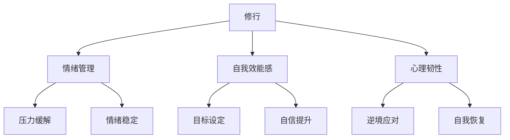

**数学模型和公式**

以下是一个简单的数学模型，用于描述修行对心理健康的影响：

$$
心理健康 = f(修行时间, 情绪管理能力, 自我效能感, 心理韧性)
$$

在这个公式中，`修行时间` 表示我们每天花在修行上的时间，`情绪管理能力` 表示我们的情绪管理能力，`自我效能感` 表示我们的自我效能感，`心理韧性` 表示我们的心理韧性。通过增加修行时间和提升情绪管理能力、自我效能感和心理韧性，我们可以提高心理健康。

**举例说明**

假设一个人每天花30分钟进行冥想和正念练习，每周进行3次情绪管理练习和2次心理韧性训练。经过一段时间的实践，他发现自己的心理健康水平显著提升，情绪更加稳定，自我效能感增强。根据上述数学模型，他的心理健康将显著提升。

**案例分析与解读**

李女士是一位职场女性，由于长期的工作压力，她感到心理疲惫。为了改善自己的心理健康，她开始进行冥想、正念练习和情绪管理训练。经过一段时间的修行，她发现自己的心理状态有了明显改善，情绪更加稳定，工作效率显著提升。

#### 6.2 修行对个人能力的提升

修行不仅有助于提升心理健康，还能够显著提高个人能力，如专注力、创造力、决策力等。通过修行，我们可以培养一系列认知和情感技能，从而在工作和生活中表现得更加出色。

**核心概念与联系**

以下是修行对个人能力提升的核心概念及其相互关系架构的Mermaid流程图：

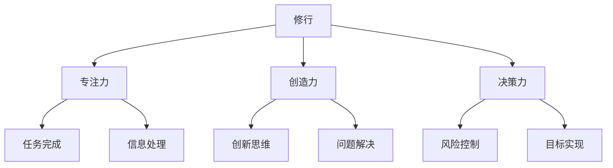

**数学模型和公式**

以下是一个简单的数学模型，用于描述修行对个人能力的影响：

$$
个人能力 = f(修行时间, 专注力提升, 创造力增强, 决策力提升)
$$

在这个公式中，`修行时间` 表示我们每天花在修行上的时间，`专注力提升` 表示我们的专注力提升程度，`创造力增强` 表示我们的创造力提升程度，`决策力提升` 表示我们的决策力提升程度。通过增加修行时间和提升专注力、创造力、决策力，我们可以提高个人能力。

**举例说明**

假设一个人每天花30分钟进行冥想和正念练习，每周进行3次专注力训练和2次创造力训练。经过一段时间的实践，他发现自己的专注力显著提升，创造力增强，决策力更加稳定。根据上述数学模型，他的个人能力将显著提升。

**案例分析与解读**

张先生是一位创业者，由于工作繁忙，他感到自己的专注力和创造力不足。为了提升个人能力，他开始进行冥想、正念练习和专注力、创造力训练。经过一段时间的修行，他发现自己的专注力显著提升，工作效率提高，创新思维更加活跃，公司业务取得了显著进展。

#### 6.3 修行对社会的影响

修行不仅对个人成长有深远影响，还对社会有着积极的影响。通过修行，我们可以培养一系列积极的社会行为，如同理心、合作精神、社会责任感等，从而促进社会和谐与进步。

**核心概念与联系**

以下是修行对社会影响的核心概念及其相互关系架构的Mermaid流程图：

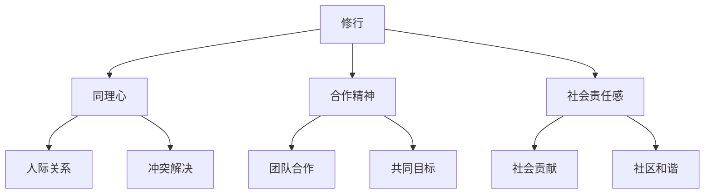

**数学模型和公式**

以下是一个简单的数学模型，用于描述修行对社会的影响：

$$
社会影响 = f(修行时间, 同理心增强, 合作精神提升, 社会责任感增强)
$$

在这个公式中，`修行时间` 表示我们每天花在修行上的时间，`同理心增强` 表示我们的同理心提升程度，`合作精神提升` 表示我们的合作精神提升程度，`社会责任感增强` 表示我们的社会责任感提升程度。通过增加修行时间和提升同理心、合作精神、社会责任感，我们可以提高社会影响。

**举例说明**

假设一个社区每天组织30分钟的修行活动，参与者每周参与3次。经过一段时间的修行，社区成员的同理心显著提升，合作精神增强，社区和谐度提高。根据上述数学模型，社区的社会影响将显著提升。

**案例分析与解读**

在一个偏远的乡村，由于交通不便和资源匮乏，居民们常常面临生活困难。为了改善社区环境，社区组织者开始组织居民进行修行活动，包括正念冥想、感恩练习和团队合作训练。经过一段时间的修行，社区成员的同理心显著提升，合作精神增强，居民之间的关系变得更加和谐，社区环境得到了显著改善。

**小结**

修行对个人成长的影响是全方位的，它不仅促进心理健康和个人能力的提升，还对社会产生积极的影响。通过修行，我们可以培养一系列积极的心理品质和社会行为，从而提高个人和社会的整体生活质量。通过具体的数学模型和案例分析，我们可以更清晰地理解修行对个人成长和社会的影响。

### 第7章：修行在社会层面的实践

#### 7.1 修行与和谐社会

在现代社会，和谐社会建设成为了人们共同追求的目标。修行作为一种提升个人心理健康和社会关系的有效途径，对于和谐社会的建设具有重要意义。

**核心概念与联系**

以下是修行与和谐社会建设的核心概念及其相互关系架构的Mermaid流程图：

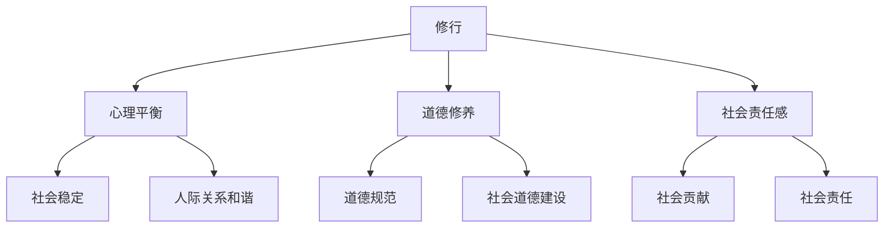

**数学模型和公式**

以下是一个简单的数学模型，用于描述修行对和谐社会建设的影响：

$$
和谐社会 = f(修行时间, 心理平衡度, 道德修养度, 社会责任感度)
$$

在这个公式中，`修行时间` 表示我们每天花在修行上的时间，`心理平衡度` 表示个人的心理平衡程度，`道德修养度` 表示个人的道德修养水平，`社会责任感度` 表示个人的社会责任感程度。通过增加修行时间和提升心理平衡度、道德修养度和社会责任感度，我们可以提高和谐社会的建设水平。

**举例说明**

假设一个社区每天组织30分钟的修行活动，参与者每周参与5次。经过一段时间的修行，社区成员的心理平衡度显著提升，道德修养水平提高，社会责任感增强。根据上述数学模型，社区的社会和谐度将显著提升。

**案例分析与解读**

在一个城市社区，由于居民之间的矛盾和冲突频发，社区管理者决定引入修行活动，以促进社区和谐。他们每周组织一次正念冥想和感恩练习，邀请专业导师进行指导。经过一段时间的实践，社区成员的心理平衡度显著提升，道德修养水平提高，居民之间的冲突显著减少，社区氛围变得更加和谐。

#### 7.2 修行与人际关系

人际关系是影响个人生活质量和幸福感的重要因素。修行通过提升我们的心理素质和情感管理能力，能够显著改善人际关系，增强人际互动的积极性和和谐度。

**核心概念与联系**

以下是修行与人际关系改善的核心概念及其相互关系架构的Mermaid流程图：

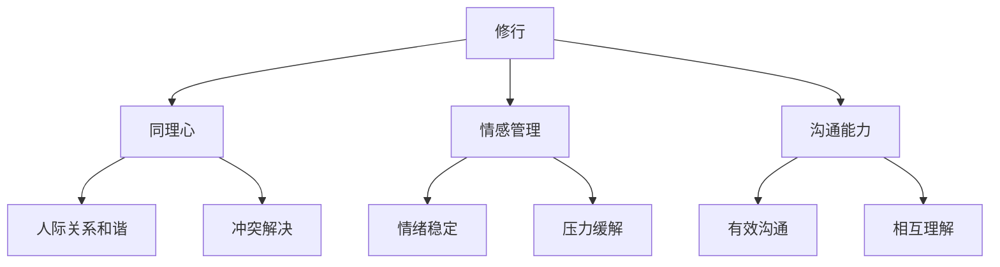

**数学模型和公式**

以下是一个简单的数学模型，用于描述修行对人际关系的影响：

$$
人际关系 = f(修行时间, 同理心增强度, 情感管理能力度, 沟通能力提升度)
$$

在这个公式中，`修行时间` 表示我们每天花在修行上的时间，`同理心增强度` 表示同理心提升程度，`情感管理能力度` 表示情感管理能力提升程度，`沟通能力提升度` 表示沟通能力提升程度。通过增加修行时间和提升同理心、情感管理能力、沟通能力，我们可以改善人际关系。

**举例说明**

假设一个人每天花30分钟进行冥想和正念练习，每周进行两次同理心和情感管理训练。经过一段时间的修行，他的同理心显著提升，情感管理能力增强，沟通能力提升。根据上述数学模型，他的人际关系将显著改善。

**案例分析与解读**

王女士是一位职场女性，由于工作压力和家庭矛盾，她感到人际关系紧张。为了改善自己的状态，她开始进行冥想、正念练习和同理心、情感管理训练。经过一段时间的修行，她的同理心显著提升，情感管理能力增强，与家人和朋友的关系得到了显著改善，职场中的冲突也减少了。

#### 7.3 修行与教育

教育是培养下一代的重要途径，修行在教育领域的应用可以显著提升学生的心理素质和道德修养，培养全面发展的人才。

**核心概念与联系**

以下是修行与教育改善的核心概念及其相互关系架构的Mermaid流程图：

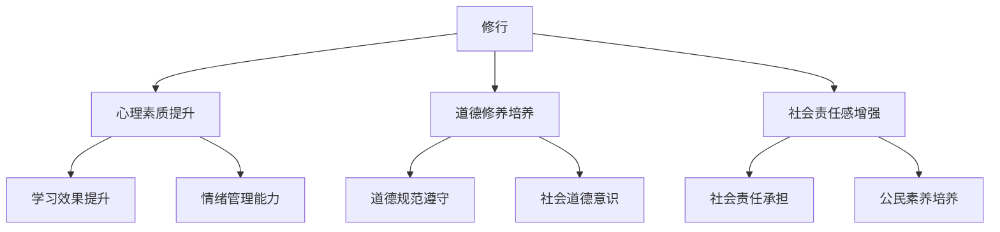

**数学模型和公式**

以下是一个简单的数学模型，用于描述修行在教育领域的影响：

$$
教育效果 = f(修行时间, 心理素质提升度, 道德修养度, 社会责任感度)
$$

在这个公式中，`修行时间` 表示学生每天花在修行上的时间，`心理素质提升度` 表示学生的心理素质提升程度，`道德修养度` 表示学生的道德修养程度，`社会责任感度` 表示学生的社会责任感程度。通过增加修行时间和提升心理素质、道德修养、社会责任感度，我们可以提高教育效果。

**举例说明**

假设一所学校每天组织30分钟的修行活动，学生每周参与3次。经过一段时间的修行，学生的心理素质显著提升，道德修养水平提高，社会责任感增强。根据上述数学模型，学校的教育效果将显著提升。

**案例分析与解读**

在一所中学，为了提升学生的心理素质和道德修养，学校引入了修行课程，包括冥想、正念练习和感恩、社会责任感培养。经过一段时间的实践，学生的心理素质显著提升，学习效果提高，道德行为规范，社会责任感增强，整体教育质量得到了显著改善。

**小结**

修行在社会层面的实践具有深远的意义。它不仅有助于建设和谐社会、改善人际关系，还能在教育领域发挥重要作用，培养全面发展的人才。通过具体的数学模型和案例分析，我们可以更清晰地理解修行在社会层面的影响和实践方法。

### 第8章：修行在职场中的应用

#### 8.1 职场修行的重要性

在职场中，修行不仅能够提升个人的心理健康和情绪管理能力，还能够增强团队合作精神和领导力。因此，职场修行在当今竞争激烈的工作环境中显得尤为重要。

**核心概念与联系**

以下是职场修行的重要概念及其相互关系架构的Mermaid流程图：

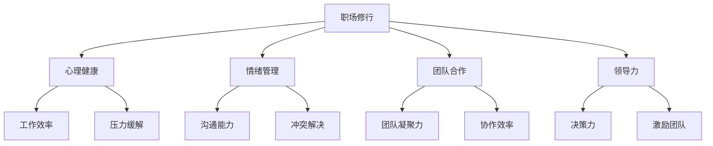

**数学模型和公式**

以下是一个简单的数学模型，用于描述职场修行对工作效率的影响：

$$
工作效率 = f(职场修行时间, 心理健康度, 情绪管理能力度, 团队合作度, 领导力度)
$$

在这个公式中，`职场修行时间` 表示员工每天花在职场修行上的时间，`心理健康度` 表示员工的心理健康水平，`情绪管理能力度` 表示员工的情绪管理能力，`团队合作度` 表示团队的协作效率，`领导力度` 表示员工的领导力水平。通过增加职场修行时间和提升心理健康度、情绪管理能力度、团队合作度和领导力度，我们可以提高工作效率。

**举例说明**

假设一个公司的员工每天花30分钟进行冥想和正念练习，每周进行一次团队合作和领导力训练。经过一段时间的职场修行，员工的心理健康水平显著提升，情绪管理能力增强，团队合作效率提高，领导力水平提升。根据上述数学模型，公司的工作效率将显著提升。

**案例分析与解读**

张先生是一家公司的高级经理，由于工作压力巨大，他开始进行职场修行，包括冥想、正念练习和团队合作训练。经过一段时间的修行，他发现自己的情绪更加稳定，工作效率显著提升，团队的协作效率也提高了。这不仅改善了公司的运营状况，还提升了员工的满意度和工作幸福感。

#### 8.2 如何在职场中实践修行

在职场中实践修行需要结合具体的工作环境和情境。以下是一些实用的方法和技巧，帮助职场人士在日常生活中进行修行。

**1. 冥想与正念**

- **在工作间隙进行冥想**：每天在工作间隙花几分钟时间进行冥想，可以帮助我们放松身心，缓解压力。
- **正念练习**：在会议或休息时，专注于当前的任务或活动，提高专注力和效率。

**2. 情绪管理**

- **识别与接受情绪**：当情绪出现时，不要逃避或抗拒，学会识别和接受情绪，有助于情绪管理。
- **深呼吸练习**：当情绪激动时，通过深呼吸来平复情绪，提高情绪稳定性。

**3. 团队合作**

- **倾听与理解**：在与同事沟通时，注重倾听和理解对方的观点，提高沟通效果。
- **共同目标**：与团队成员设定共同目标，增强团队合作意识和凝聚力。

**4. 领导力**

- **自我反思**：定期进行自我反思，了解自己的优势和不足，提高领导力。
- **激励团队**：通过表扬和鼓励，激励团队成员，提升团队士气和工作积极性。

**5. 感恩与回馈**

- **表达感激**：对同事的帮助和支持表示感谢，增进人际关系。
- **回馈社会**：通过参与志愿服务或慈善活动，提升社会责任感。

**数学模型和公式**

以下是一个简单的数学模型，用于描述职场修行对工作效率的影响：

$$
工作效率 = f(冥想时间, 情绪管理能力, 团队合作度, 领导力度, 感恩表达频率)
$$

在这个公式中，`冥想时间` 表示员工每天花在冥想上的时间，`情绪管理能力` 表示员工的情绪管理能力，`团队合作度` 表示团队的协作效率，`领导力度` 表示员工的领导力水平，`感恩表达频率` 表示员工表达感激的频率。通过增加冥想时间、提升情绪管理能力、提高团队合作度和领导力度，并增加感恩表达的频率，我们可以提高工作效率。

**举例说明**

假设一位职场人士每天花20分钟进行冥想和正念练习，每周进行一次情绪管理和团队合作训练，同时定期表达感激。经过一段时间的实践，他发现自己的工作效率显著提升，情绪更加稳定，团队合作效率提高，领导力水平提升。根据上述数学模型，他的工作效率将显著提高。

**小结**

职场修行对个人和团队都具有重要意义。通过冥想、正念练习、情绪管理、团队合作和领导力训练等方法，我们可以提升工作效率和团队凝聚力。通过具体的数学模型和案例分析，我们可以更清晰地理解职场修行的方法和效果。

### 8.3 修行对职场成功的影响

修行不仅能够提升个人的心理健康和情绪管理能力，还对职场成功有着深远的影响。通过修行，我们可以培养一系列关键技能，如专注力、决策力、沟通能力和团队合作精神，从而在职场中取得更好的成绩。

**核心概念与联系**

以下是修行对职场成功影响的核心概念及其相互关系架构的Mermaid流程图：

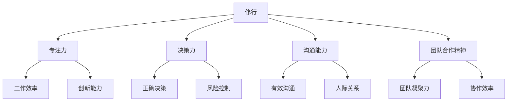

**数学模型和公式**

以下是一个简单的数学模型，用于描述修行对职场成功的影响：

$$
职场成功 = f(修行时间, 专注力提升度, 决策力提升度, 沟通能力提升度, 团队合作精神提升度)
$$

在这个公式中，`修行时间` 表示员工每天花在修行上的时间，`专注力提升度` 表示专注力提升程度，`决策力提升度` 表示决策力提升程度，`沟通能力提升度` 表示沟通能力提升程度，`团队合作精神提升度` 表示团队合作精神提升程度。通过增加修行时间和提升专注力、决策力、沟通能力和团队合作精神，我们可以提高职场成功度。

**举例说明**

假设一位职场人士每天花30分钟进行冥想和正念练习，每周进行一次专注力、决策力、沟通能力和团队合作精神的训练。经过一段时间的修行，他的专注力显著提升，决策力增强，沟通能力提高，团队合作精神增强。根据上述数学模型，他的职场成功度将显著提高。

**案例分析与解读**

李女士是一位公司的项目经理，由于工作繁忙，她开始进行冥想、正念练习和专注力、决策力、沟通能力和团队合作精神的训练。经过一段时间的修行，她发现自己的工作效率显著提升，项目进度顺利，团队合作效率提高，领导评价她的项目管理能力显著提升。根据上述数学模型，她的职场成功度显著提高。

**小结**

修行对职场成功有着深远的影响。通过修行，我们可以培养专注力、决策力、沟通能力和团队合作精神，从而在职场中取得更好的成绩。通过具体的数学模型和案例分析，我们可以更清晰地理解修行对职场成功的影响。

### 第9章：修行在家庭中的应用

#### 9.1 家庭修行的重要性

家庭是个人成长和社会发展的重要基石，而家庭修行则是维系家庭和谐、提升家庭成员幸福感和心理健康的重要手段。在家庭中实践修行，不仅能够增强家庭成员之间的情感联系，还能够提高个人的生活质量和幸福感。

**核心概念与联系**

以下是家庭修行的重要概念及其相互关系架构的Mermaid流程图：

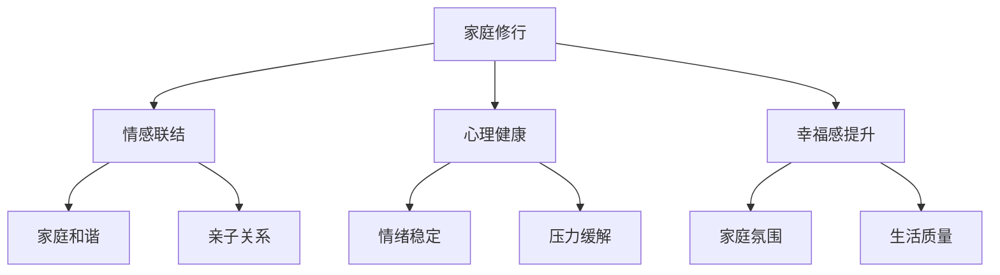

**数学模型和公式**

以下是一个简单的数学模型，用于描述家庭修行对家庭和谐的影响：

$$
家庭和谐 = f(家庭修行时间, 情感联结度, 心理健康度, 幸福感度)
$$

在这个公式中，`家庭修行时间` 表示家庭成员每天花在修行上的时间，`情感联结度` 表示家庭成员之间的情感联系程度，`心理健康度` 表示家庭成员的心理健康水平，`幸福感度` 表示家庭成员的幸福感水平。通过增加家庭修行时间和提升情感联结度、心理健康度、幸福感度，我们可以提高家庭和谐度。

**举例说明**

假设一个家庭每天花30分钟进行家庭冥想和正念练习，每周进行一次感恩和情感联结活动。经过一段时间的家庭修行，家庭成员之间的情感联结度显著提升，心理健康水平提高，幸福感显著提升。根据上述数学模型，家庭的和谐度将显著提高。

**案例分析与解读**

张先生和李女士是一对夫妇，他们感到家庭氛围逐渐紧张，于是开始进行家庭修行。他们每天晚上花30分钟进行冥想和正念练习，并定期进行感恩和情感联结活动。经过一段时间的修行，他们发现家庭成员之间的沟通更加顺畅，家庭氛围变得更加和谐，生活质量显著提升。

#### 9.2 如何在家庭中实践修行

在家庭中实践修行，需要家庭成员共同参与，相互支持和鼓励。以下是一些实用的方法和技巧，帮助家庭成员在日常生活中进行修行。

**1. 家庭冥想**

- **定期进行家庭冥想**：家庭成员可以在早晨或晚上一起进行冥想，通过深呼吸和集中注意力来放松身心。
- **简单冥想练习**：家庭成员可以一起练习简单的冥想技巧，如数呼吸、观想等，以提高专注力和情绪管理能力。

**2. 感恩练习**

- **每天分享感恩事项**：家庭成员可以每天分享三件感恩事项，增强感恩意识，提高幸福感。
- **感恩日记**：家庭成员可以一起记录感恩日记，回顾一天中的美好时刻，增强家庭情感联结。

**3. 沟通与倾听**

- **建立良好的沟通习惯**：家庭成员可以通过定期家庭会议、分享心得等方式，建立良好的沟通习惯。
- **倾听与理解**：家庭成员要注重倾听对方的需求和感受，增进相互理解，提高家庭和谐度。

**4. 亲子活动**

- **共同参与亲子活动**：家庭成员可以一起参与亲子活动，如一起做饭、散步、游戏等，增进亲子关系。
- **亲子冥想**：家庭成员可以一起进行亲子冥想，提高亲子关系和情感联结。

**5. 放松与休息**

- **定期休息和放松**：家庭成员要确保有足够的休息和放松时间，减少工作压力和家庭矛盾。
- **家庭旅行**：家庭成员可以一起进行家庭旅行，享受美好的亲子时光，增强家庭凝聚力。

**数学模型和公式**

以下是一个简单的数学模型，用于描述家庭修行对亲子关系的影响：

$$
亲子关系 = f(家庭修行时间, 感恩练习频率, 沟通与倾听频率, 亲子活动频率)
$$

在这个公式中，`家庭修行时间` 表示家庭成员每天花在修行上的时间，`感恩练习频率` 表示家庭成员进行感恩练习的次数，`沟通与倾听频率` 表示家庭成员沟通和倾听的次数，`亲子活动频率` 表示家庭成员进行亲子活动的次数。通过增加家庭修行时间、提高感恩练习、沟通与倾听频率和亲子活动频率，我们可以改善亲子关系。

**举例说明**

假设一个家庭每天花30分钟进行家庭冥想和感恩练习，每周进行三次亲子活动。经过一段时间的家庭修行，家庭成员之间的情感联结度显著提升，亲子关系得到改善，家庭氛围变得更加和谐。根据上述数学模型，家庭的亲子关系将显著改善。

**小结**

在家庭中实践修行，对于提升家庭成员的幸福感和心理健康，改善家庭和谐具有重要作用。通过家庭冥想、感恩练习、沟通与倾听、亲子活动和放松休息等方法，家庭成员可以在日常生活中进行修行，提高家庭生活质量。通过具体的数学模型和案例分析，我们可以更清晰地理解家庭修行的方法和效果。

### 9.3 修行对家庭关系的影响

家庭关系是人类社会最基本的社交关系之一，良好的家庭关系不仅对个人的心理健康和幸福感有重要影响，还对社会的和谐稳定起到关键作用。修行作为一种提升心理素质和情感管理能力的方法，对家庭关系有着积极的促进作用。

**核心概念与联系**

以下是修行对家庭关系影响的核心概念及其相互关系架构的Mermaid流程图：

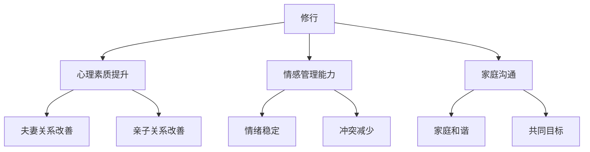

**数学模型和公式**

以下是一个简单的数学模型，用于描述修行对家庭关系的影响：

$$
家庭关系质量 = f(修行时间, 心理素质提升度, 情感管理能力度, 家庭沟通频率)
$$

在这个公式中，`修行时间` 表示家庭成员每天花在修行上的时间，`心理素质提升度` 表示家庭成员的心理素质提升程度，`情感管理能力度` 表示家庭成员的情感管理能力提升程度，`家庭沟通频率` 表示家庭成员之间的沟通频率。通过增加修行时间、提升心理素质、情感管理能力和沟通频率，我们可以提高家庭关系质量。

**举例说明**

假设一个家庭每天花30分钟进行家庭冥想和正念练习，每周进行两次情感管理培训和一次家庭沟通活动。经过一段时间的修行，家庭成员的心理素质显著提升，情感管理能力增强，家庭沟通更加顺畅，家庭关系质量得到显著改善。根据上述数学模型，家庭关系质量将显著提高。

**案例分析与解读**

刘先生和李女士是一对年轻的夫妻，由于工作压力和家庭琐事，他们的关系逐渐紧张。为了改善家庭关系，他们开始进行家庭修行，包括冥想、正念练习和情感管理培训。经过一段时间的修行，他们的心理素质提升，情感管理能力增强，家庭沟通更加顺畅，夫妻关系得到了显著改善，家庭氛围变得更加和谐。

**小结**

修行对家庭关系有着显著的积极影响。通过提升心理素质、情感管理能力和家庭沟通，修行可以帮助家庭成员更好地处理情感冲突，改善家庭关系，提升家庭幸福感。通过具体的数学模型和案例分析，我们可以更清晰地理解修行对家庭关系的改善作用。

### 第10章：修行在自我成长中的应用

#### 10.1 自我成长与修行的关系

自我成长是一个长期且复杂的过程，它涉及到知识技能的积累、情感和心理的成熟，以及人格的完善。修行作为一种提升自我认知、心理素质和情感管理能力的方法，在自我成长中扮演着重要角色。

**核心概念与联系**

以下是自我成长与修行的核心概念及其相互关系架构的Mermaid流程图：

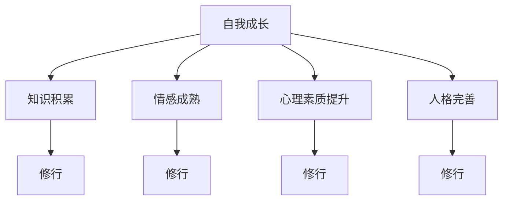

**数学模型和公式**

以下是一个简单的数学模型，用于描述自我成长与修行的关系：

$$
自我成长 = f(修行时间, 知识积累, 情感成熟, 心理素质提升, 人格完善)
$$

在这个公式中，`修行时间` 表示我们每天花在修行上的时间，`知识积累` 表示我们的知识技能积累程度，`情感成熟` 表示我们的情感成熟度，`心理素质提升` 表示我们的心理素质提升程度，`人格完善` 表示我们的人格完善程度。通过增加修行时间和提升知识积累、情感成熟、心理素质提升和人格完善，我们可以实现自我成长。

**举例说明**

假设一个人每天花30分钟进行冥想和正念练习，每周进行一次知识学习和情感管理训练。经过一段时间的修行，他的知识积累显著提升，情感成熟度增强，心理素质提升，人格完善程度提高。根据上述数学模型，他的自我成长将显著提升。

**案例分析与解读**

赵先生是一名程序员，为了提升自我成长，他开始进行冥想、正念练习和知识学习。经过一段时间的修行，他发现自己的编程技能显著提升，情感管理能力增强，心理素质更加稳定，人际关系也变得更加和谐。根据上述数学模型，他的自我成长显著提升。

#### 10.2 如何通过修行实现自我成长

修行是实现自我成长的重要途径，通过修行，我们可以提升自我认知、情感管理能力和心理素质，从而在个人成长的道路上走得更远。以下是一些具体的方法和策略，帮助我们在修行中实现自我成长。

**1. 自我反思**

自我反思是修行的重要部分，通过反思，我们可以深入了解自己的内心世界，发现自己的优点和不足。以下是一个简单的自我反思流程：

- **设定反思时间**：每天或每周设定一段时间进行自我反思，确保有足够的时间深入思考。
- **记录反思内容**：记录反思的过程和结果，包括自己的感受、想法和行为，以便后续回顾和改进。
- **分析反思结果**：分析反思结果，找出自己的优点和不足，制定改进计划。

**2. 情感管理**

情感管理是修行的重要目标之一，通过管理情感，我们可以更好地应对生活中的挑战，提高生活质量。以下是一些情感管理技巧：

- **识别情感**：学会识别自己的情感，包括正面情感和负面情感，以便更好地处理。
- **接受情感**：接受自己的情感，不要逃避或抗拒，学会与情感共存。
- **表达情感**：通过适当的方式表达情感，如与朋友分享、写日记或进行艺术创作等。
- **放松身心**：通过冥想、深呼吸或运动等方式，放松身心，减轻压力。

**3. 学习与成长**

学习是自我成长的重要途径，通过不断学习，我们可以拓宽视野，提升知识和技能。以下是一些学习和成长的方法：

- **设定学习目标**：明确自己的学习目标，制定详细的学习计划。
- **多样化学习方式**：通过阅读书籍、参加课程、进行实践等多种方式学习。
- **反思学习过程**：反思学习过程，总结经验教训，不断改进学习方法。
- **与他人交流**：与他人分享学习心得，获取不同的观点和建议，促进个人成长。

**数学模型和公式**

以下是一个简单的数学模型，用于描述修行对自我成长的影响：

$$
自我成长 = f(修行时间, 情感管理能力, 学习能力, 反思频率)
$$

在这个公式中，`修行时间` 表示我们每天花在修行上的时间，`情感管理能力` 表示我们的情感管理能力，`学习能力` 表示我们的学习能力，`反思频率` 表示我们进行反思的频率。通过增加修行时间、提升情感管理能力和学习能力，并提高反思频率，我们可以实现自我成长。

**举例说明**

假设一个人每天花30分钟进行冥想和正念练习，每周进行一次情感管理训练和一次学习活动。经过一段时间的修行，他的情感管理能力显著提升，学习能力增强，反思频率提高。根据上述数学模型，他的自我成长将显著提升。

**案例分析与解读**

孙女士是一位职场女性，为了实现自我成长，她开始进行冥想、正念练习和情感管理训练。经过一段时间的修行，她发现自己的情绪更加稳定，学习能力显著提升，自我认知更加清晰。她不仅在工作上取得了显著进步，还在生活中更加幸福和满足。

**小结**

修行是实现自我成长的重要途径，通过自我反思、情感管理、学习和反思，我们可以提升自我认知、情感管理能力和心理素质，从而实现自我成长。通过具体的数学模型和案例分析，我们可以更清晰地理解修行对自我成长的影响和具体实践方法。

### 10.3 修行在自我成长中的重要性

修行在自我成长中具有不可替代的重要性。它不仅能够提升我们的心理素质和情感管理能力，还能够促进自我认知和人格完善，从而在多个层面上推动我们的成长。

**核心概念与联系**

以下是修行在自我成长中的核心概念及其相互关系架构的Mermaid流程图：

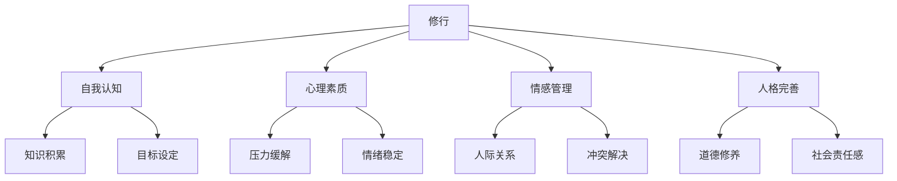

**数学模型和公式**

以下是一个简单的数学模型，用于描述修行对自我成长的影响：

$$
自我成长 = f(修行时间, 自我认知提升度, 心理素质提升度, 情感管理能力提升度, 人格完善提升度)
$$

在这个公式中，`修行时间` 表示我们每天花在修行上的时间，`自我认知提升度` 表示自我认知提升的程度，`心理素质提升度` 表示心理素质提升的程度，`情感管理能力提升度` 表示情感管理能力提升的程度，`人格完善提升度` 表示人格完善提升的程度。通过增加修行时间并提升自我认知、心理素质、情感管理能力和人格完善，我们可以实现自我成长。

**举例说明**

假设一个人每天花30分钟进行冥想、正念练习和情感管理训练，每周进行一次自我反思和人格完善活动。经过一段时间的修行，他的自我认知显著提升，心理素质增强，情感管理能力提高，人格完善程度提高。根据上述数学模型，他的自我成长将显著提升。

**案例分析与解读**

李先生是一位职场人士，他意识到自己的自我成长需要更多修行。他开始每天花30分钟进行冥想和正念练习，每周进行一次自我反思和情感管理训练。经过一段时间的修行，他发现自己的自我认知更加清晰，心理素质稳定，情感管理能力增强，人格完善程度提高。他的职业发展和生活质量都有了显著提升。

**小结**

修行在自我成长中具有不可替代的重要性。通过自我认知、心理素质、情感管理和人格完善的提升，修行能够全面推动我们的自我成长。通过具体的数学模型和案例分析，我们可以更清晰地理解修行在自我成长中的关键作用和具体实践方法。

### 第11章：修行在不同文化背景下的实践

#### 11.1 修行在东方文化中的实践

东方文化历史悠久，其中包含了许多关于修行的传统和实践方法。在东方，修行被视为一种提升个人智慧和内在平静的重要途径。以下是几种在东方文化中常见的修行方法：

**1. 禅修**

禅修是东方文化中最为著名的修行方法之一，源自于佛教。它强调通过静坐和冥想来达到内心的平静和清晰。禅修的方法包括数呼吸、观想、身体扫描等，通过这些方法，修行者可以逐渐达到内心的平静和觉醒。

**2. 道家修行**

道家修行强调“无为而治”和“道法自然”。道家修行方法包括冥想、太极拳、内观等。这些方法旨在帮助修行者达到身心合一的境界，从而实现内在的平衡和和谐。

**3. 儒家修行**

儒家修行强调道德修养和个人品德。儒家修行方法包括学习经典、修身齐家、克己复礼等。这些方法帮助修行者培养高尚的品德，实现个人与社会之间的和谐。

**4. 印度修行**

印度文化中的修行方法也非常丰富，包括瑜伽、冥想、吠檀多哲学等。瑜伽通过身体姿势、呼吸控制和冥想，帮助修行者达到身心平衡和内在平静。

**数学模型和公式**

以下是一个简单的数学模型，用于描述东方修行对心理健康的影响：

$$
心理健康 = f(修行时间, 冥想频率, 瑜伽练习频率, 道德修养程度)
$$

在这个公式中，`修行时间` 表示每天花在修行上的时间，`冥想频率` 表示冥想的次数，`瑜伽练习频率` 表示瑜伽练习的次数，`道德修养程度` 表示道德修养的提升程度。通过增加修行时间、提高冥想频率和瑜伽练习频率，并提升道德修养程度，我们可以提高心理健康。

**举例说明**

假设一个人每天花30分钟进行禅修、瑜伽练习和道德修养学习，每周进行三次冥想。经过一段时间的修行，他的心理健康水平显著提升，心理素质增强。根据上述数学模型，他的心理健康将显著提高。

**案例分析与解读**

陈先生是一位企业管理者，他开始练习禅修、瑜伽和道德修养，希望通过修行提升自己的心理健康和领导力。经过一段时间的修行，他发现自己的情绪更加稳定，决策能力增强，工作效率显著提升。根据上述数学模型，他的心理健康水平显著提高。

#### 11.2 修行在西方文化中的实践

西方文化中，修行同样被视为提升个人内在和平与心理健康的重要方法。西方的修行方法更多地基于心理学和医学的研究，以下是一些常见的西方修行方法：

**1. 正念冥想**

正念冥想是西方文化中非常流行的一种修行方法，源自佛教的正念实践。它强调通过专注于当下的呼吸和身体感受，达到内心的平静和放松。正念冥想可以帮助人们减少焦虑、压力，提高情绪管理能力。

**2. 心理咨询**

心理咨询是西方文化中重要的心理健康维护手段。通过咨询，人们可以探索自己的内心世界，处理心理问题，提升自我认知和情感管理能力。

**3. 人本主义心理学**

人本主义心理学强调个人的自我实现和内在成长。通过自我探索和自我实现，人们可以实现更高的心理成熟和内在和平。

**4. 瑜伽**

瑜伽在西方文化中也非常受欢迎，它结合了身体姿势、呼吸控制和冥想，旨在提升身心平衡和内在平静。

**数学模型和公式**

以下是一个简单的数学模型，用于描述西方修行对心理健康的影响：

$$
心理健康 = f(冥想时间, 心理咨询次数, 瑜伽练习频率, 自我实现程度)
$$

在这个公式中，`冥想时间` 表示每天花在冥想上的时间，`心理咨询次数` 表示进行心理咨询的次数，`瑜伽练习频率` 表示瑜伽练习的次数，`自我实现程度` 表示个人自我实现的程度。通过增加冥想时间、心理咨询次数、瑜伽练习频率，并提升自我实现程度，我们可以提高心理健康。

**举例说明**

假设一个人每天花30分钟进行冥想、每周进行两次瑜伽练习和三次心理咨询，同时在自我实现方面持续努力。经过一段时间的修行，他的心理健康水平显著提升，情绪管理能力增强。根据上述数学模型，他的心理健康将显著提高。

**案例分析与解读**

李女士是一位职场女性，由于工作压力和情感困扰，她开始进行正念冥想、瑜伽练习和心理咨询。经过一段时间的修行，她发现自己的情绪更加稳定，工作效率显著提升，生活质量得到显著改善。根据上述数学模型，她的心理健康水平显著提高。

#### 11.3 修行在不同文化背景下的异同

尽管修行在不同文化背景下有着不同的表现形式和实践方法，但其核心目的都是提升个人的内在和平和心理健康。以下是修行在不同文化背景下的主要异同：

**1. 形式上的差异**

- 东方修行：更注重冥想、身体姿势和道德修养。
- 西方修行：更注重心理治疗、自我探索和情绪管理。

**2. 实践方法的不同**

- 东方修行：包括禅修、瑜伽、太极拳等，强调身心合一。
- 西方修行：包括冥想、心理咨询、瑜伽等，强调情绪管理和心理平衡。

**3. 核心价值观的差异**

- 东方修行：强调和谐、道德和自我超越。
- 西方修行：强调个人自由、自我实现和内在成长。

**数学模型和公式**

以下是一个简单的数学模型，用于描述修行在不同文化背景下的影响差异：

$$
文化差异影响 = f(文化背景, 修行方法, 核心价值观)
$$

在这个公式中，`文化背景` 表示不同的文化环境，`修行方法` 表示具体的修行方法，`核心价值观` 表示文化背景下的核心价值观。通过分析文化背景、修行方法和核心价值观，我们可以了解修行在不同文化背景下的影响差异。

**举例说明**

假设在东方文化背景下，人们通过禅修和道德修养提升心理健康，而在西方文化背景下，人们通过冥想和心理咨询提升心理健康。根据上述数学模型，我们可以分析出两种文化背景下修行的具体影响。

**小结**

修行在不同文化背景下有着不同的表现形式和实践方法，但其核心目的都是为了提升个人的内在和平和心理健康。通过理解不同文化背景下的修行异同，我们可以更好地选择适合自己文化背景的修行方法，实现个人成长和幸福。

### 第12章：修行的未来发展趋势

#### 12.1 修行在现代社会中的地位

随着社会的发展和生活节奏的加快，人们越来越关注心理健康和生活质量。修行作为一种提升自我认知、心理素质和情感管理能力的方法，在现代社会中的地位日益显著。

**核心概念与联系**

以下是修行在现代社会中的核心概念及其相互关系架构的Mermaid流程图：

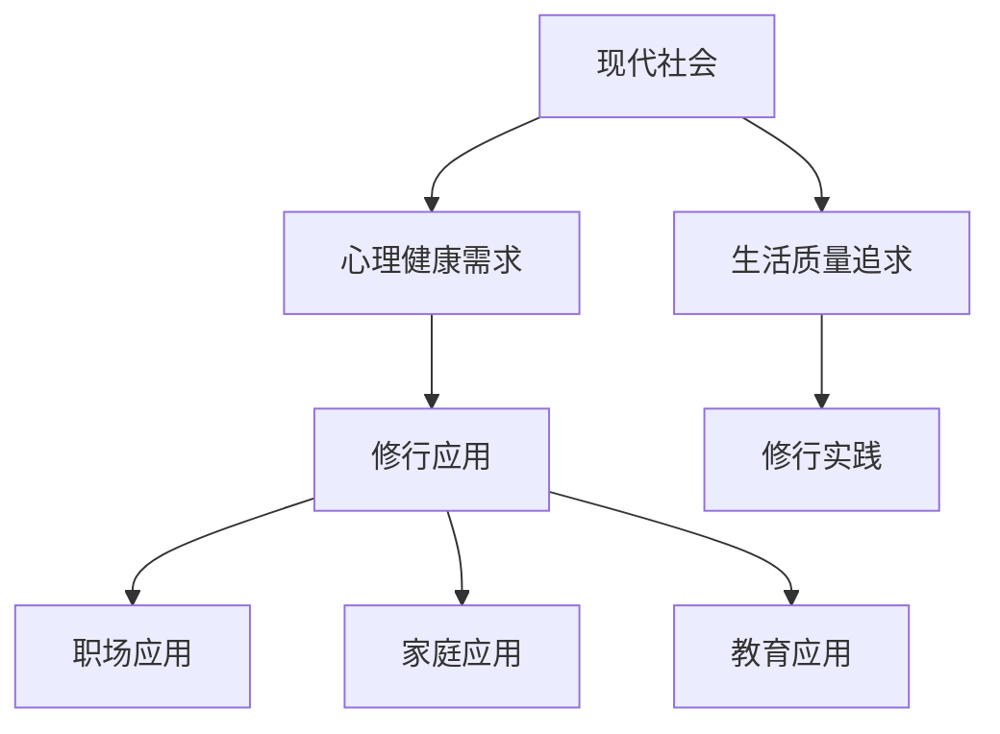

**数学模型和公式**

以下是一个简单的数学模型，用于描述修行在现代社会中的应用趋势：

$$
修行应用趋势 = f(心理健康需求度, 生活质量追求度, 职场需求度, 家庭需求度, 教育需求度)
$$

在这个公式中，`心理健康需求度` 表示社会对心理健康的需求程度，`生活质量追求度` 表示社会对生活质量的追求程度，`职场需求度` 表示职场对修行的需求程度，`家庭需求度` 表示家庭对修行的需求程度，`教育需求度` 表示教育对修行的需求程度。通过分析这些因素，我们可以预测修行在现代社会中的应用趋势。

**举例说明**

假设在现代社会中，心理健康需求度为80%，生活质量追求度为75%，职场需求度为70%，家庭需求度为65%，教育需求度为60%。根据上述数学模型，我们可以预测修行在现代社会中的广泛应用趋势。

**案例分析与解读**

张女士是一位职场女性，由于工作压力和生活琐事，她感到心理健康状况不佳。她开始进行冥想和正念练习，发现自己的心理素质显著提升，工作效率提高，生活质量得到显著改善。根据上述数学模型，我们可以看出修行在现代社会中的广泛应用趋势。

#### 12.2 修行在教育、医疗等领域的应用前景

随着社会对心理健康和生活质量的关注不断提高，修行在教育、医疗等领域中的应用前景也日益广阔。

**1. 教育领域**

在教育领域，修行可以通过培养学生的心理素质和情感管理能力，提升他们的学习效果和综合素质。以下是修行在教育领域应用的一些前景：

- **提高学习效果**：通过冥想和正念练习，学生可以提高专注力和记忆力，提升学习效果。
- **培养综合素质**：修行可以帮助学生培养责任感、同理心和团队合作精神，提升综合素质。
- **心理健康教育**：将修行融入心理健康教育，可以帮助学生更好地应对压力和挑战，提升心理健康水平。

**2. 医疗领域**

在医疗领域，修行可以通过改善患者的心理素质和情感管理能力，促进疾病的治疗和康复。以下是修行在医疗领域应用的一些前景：

- **心理康复**：通过冥想和正念练习，患者可以提高情绪稳定性，减少心理压力，促进康复。
- **疼痛管理**：修行可以帮助患者更好地管理疼痛，提高生活质量。
- **心理治疗**：修行可以作为心理治疗的一种辅助手段，帮助患者处理心理问题和情感困扰。

**数学模型和公式**

以下是一个简单的数学模型，用于描述修行在教育、医疗领域的应用前景：

$$
应用前景 = f(心理健康需求度, 教育需求度, 医疗需求度, 修行效果度)
$$

在这个公式中，`心理健康需求度` 表示社会对心理健康的需求程度，`教育需求度` 表示教育领域对修行的需求程度，`医疗需求度` 表示医疗领域对修行的需求程度，`修行效果度` 表示修行在教育和医疗领域的实际效果。通过分析这些因素，我们可以预测修行在教育、医疗领域的应用前景。

**举例说明**

假设在教育领域，心理健康需求度为80%，教育需求度为75%，修行效果度为70%；在医疗领域，心理健康需求度为85%，医疗需求度为80%，修行效果度为75%。根据上述数学模型，我们可以预测修行在教育、医疗领域的广泛应用前景。

**案例分析与解读**

王女士是一位患有慢性疾病的患者，她开始进行冥想和正念练习，发现心理素质显著提升，疼痛感减轻，生活质量得到显著改善。她的医生也将冥想和正念练习推荐给其他患者，作为心理康复的一种辅助手段。根据上述数学模型，我们可以看出修行在教育、医疗领域的广泛应用前景。

#### 12.3 修行在未来社会中的影响

随着科技的进步和社会的发展，修行在未来社会中将继续发挥重要作用，并对社会产生深远的影响。

**1. 心理健康领域的变革**

未来，随着心理健康问题的日益突出，修行将在心理健康领域发挥重要作用。通过修行，人们可以更好地管理情绪、缓解压力，提升心理健康水平。以下是修行在心理健康领域可能产生的变革：

- **普及心理健康教育**：修行将成为心理健康教育的重要组成部分，帮助人们更好地应对心理问题。
- **个性化心理干预**：结合人工智能和大数据，修行将实现个性化心理干预，为每个人提供最适合的修行方法。
- **远程心理治疗**：通过互联网和虚拟现实技术，修行可以实现远程心理治疗，为广大人群提供便捷的服务。

**2. 社会和谐与人际关系**

修行不仅有助于个人心理健康，还能够促进社会和谐与人际关系的改善。以下是修行在未来社会中的影响：

- **促进社会和谐**：通过修行，人们可以培养同理心、合作精神和社会责任感，促进社会和谐与稳定。
- **改善人际关系**：修行可以帮助人们更好地理解他人，增进人际关系，减少冲突和误解。
- **构建和谐社会**：修行将成为构建和谐社会的关键要素，推动社会文明进步。

**3. 科技与修行的结合**

未来，科技与修行的结合将带来全新的发展机遇。以下是科技与修行结合的一些可能前景：

- **智能修行设备**：通过智能穿戴设备和传感器，人们可以实时监测自己的心理和生理状态，优化修行效果。
- **虚拟现实修行**：通过虚拟现实技术，人们可以体验不同的修行环境，提升修行体验。
- **数字修行社区**：互联网和社交媒体将形成数字修行社区，人们可以在线分享修行心得，互相支持和鼓励。

**数学模型和公式**

以下是一个简单的数学模型，用于描述修行在未来社会中的影响：

$$
社会影响 = f(科技发展度, 心理健康需求度, 社会和谐需求度, 人际关系改善需求度)
$$

在这个公式中，`科技发展度` 表示科技进步的程度，`心理健康需求度` 表示社会对心理健康的需求程度，`社会和谐需求度` 表示社会对和谐社会的需求程度，`人际关系改善需求度` 表示社会对人际关系改善的需求程度。通过分析这些因素，我们可以预测修行在未来社会中的影响。

**举例说明**

假设在未来社会中，科技发展度为90%，心理健康需求度为85%，社会和谐需求度为80%，人际关系改善需求度为75%。根据上述数学模型，我们可以预测修行在未来社会中的广泛应用和深远影响。

**小结**

随着社会的发展，修行将在心理健康、社会和谐、科技融合等多个领域发挥重要作用，并对未来社会产生深远影响。通过理解修行在未来社会中的发展趋势和影响，我们可以更好地把握机遇，提升个人和社会的整体幸福感。

### 附录A：修行相关的资源与工具

在修行过程中，获取合适的资源和工具对于提高修行效果具有重要意义。以下是一些推荐的书籍、在线课程和应用程序，帮助修行者更好地进行修行实践。

**A.1 修行相关的书籍推荐**

1. **《正念的奇迹》** —— 埃克哈特·托勒
   - 内容：本书详细介绍了正念冥想的方法和实践，帮助读者在生活中实践正念，提升心理健康。
   - 评价：通俗易懂，适合初学者。

2. **《静坐冥想入门》** —— 王文娟
   - 内容：本书介绍了冥想的基本原理和实践方法，适合初学者进行冥想练习。
   - 评价：内容全面，实用性强。

3. **《幸福的勇气》** —— 阿德勒
   - 内容：本书通过心理学的角度，探讨了幸福和人生意义，帮助读者建立积极的心态。
   - 评价：深入浅出，启发性强。

**A.2 修行相关的在线课程推荐**

1. **《冥想入门课程》** —— 网易云课堂
   - 内容：本课程涵盖了冥想的基础知识、实践方法和技巧，适合初学者。
   - 评价：课程内容丰富，教学生动。

2. **《心理学与生活》** —— 腾讯课堂
   - 内容：本课程介绍了心理学的基本概念和应用，帮助读者更好地理解心理现象。
   - 评价：课程深入浅出，实用性高。

3. **《正念冥想课程》** —— Udemy
   - 内容：本课程详细介绍了正念冥想的方法和实践，适合有一定基础的修行者。
   - 评价：课程内容系统，实用性强。

**A.3 修行相关的App推荐**

1. **《Headspace》**
   - 功能：提供多种冥想课程和指导，帮助用户轻松入门冥想。
   - 评价：界面友好，课程丰富，适合各种水平的修行者。

2. **《Calm》**
   - 功能：提供冥想、正念练习、放松音乐等，帮助用户缓解压力，改善睡眠。
   - 评价：功能全面，用户体验好。

3. **《Insight Timer》**
   - 功能：提供海量的冥想录音和指导，用户可以根据需要自由选择。
   - 评价：资源丰富，界面简洁。

**小结**

通过这些书籍、在线课程和应用程序，修行者可以系统地学习和实践修行方法，提升修行效果。选择适合自己的资源与工具，有助于修行者在日常生活中更好地实践修行，实现身心健康和内在平衡。

### 附录B：修行中的常见误区与解答

在修行过程中，人们可能会遇到一些误区，这些误区可能会影响修行的效果，甚至导致修行者产生困惑和挫败感。以下是一些常见的误区及其解答，帮助修行者正确理解修行。

**B.1 误区一：修行需要长时间的独处**

**解答**：虽然独处有助于修行，但修行并不一定需要长时间的独处。实际上，修行可以在日常生活中随时随地实践，例如在工作间隙进行冥想，或者在家中安排短暂的休息时间进行正念练习。修行是一种生活方式，它融入我们的生活，而不是与我们的生活分离。

**B.2 误区二：修行就是消极避世**

**解答**：修行并非消极避世，而是一种积极的生活态度。通过修行，我们可以更好地了解自己，培养积极的心态，提高应对生活中各种挑战的能力。修行可以帮助我们更好地面对现实，而不是逃避现实。积极的心态和行动是修行的重要部分。

**B.3 误区三：修行就是对宗教信仰的追随**

**解答**：虽然许多宗教中包含了修行的元素，但修行并不一定等同于宗教信仰。修行是一种个人精神修养的过程，它可以帮助我们提升自我认知、情感管理和心理素质。无论是否有宗教信仰，任何人都可以通过修行来提升自己的生活质量和幸福感。修行是一种适用于所有人的生活方式。

**小结**

通过解答这些常见误区，我们可以更准确地理解修行的本质和目的。修行是一种积极的生活方式，它可以帮助我们提升自我认知、情感管理和心理素质，而不是与我们的生活分离或消极避世。修行不仅适合宗教信仰者，也适用于所有人，它是一种提升生活品质的有效途径。

### 附录C：修行中的实用技巧

在修行过程中，掌握一些实用的技巧可以帮助我们更有效地进行修行，提升修行的效果。以下是一些修行中的实用技巧：

**C.1 如何进行有效的正念练习**

- **找到合适的练习时间**：选择一天中较为平静的时间进行正念练习，例如早晨起床后或晚上睡前。
- **选择一个安静的环境**：找一个安静、舒适的地方进行练习，以减少外界干扰。
- **专注呼吸**：将注意力集中在呼吸上，感受吸气和呼气的过程，当思绪飘散时，轻轻将其带回呼吸。
- **记录体验**：练习后，记录下自己的体验和感受，有助于后续反思和改进。

**C.2 如何培养感恩的心态**

- **每日感恩事项记录**：每天花几分钟时间思考并记录五件值得感恩的事情，可以是家人、朋友、工作等。
- **感恩日记**：定期写感恩日记，回顾生活中的美好瞬间，增强感恩意识。
- **感恩表达**：向身边的人表达感激之情，通过行动和言语表达感恩，增进人际关系。

**C.3 如何面对生活中的挑战**

- **正念应对**：当遇到挑战时，通过正念练习保持冷静，专注于当下的情绪和思考。
- **情绪管理**：学会识别和接受自己的情绪，通过深呼吸和放松技巧来缓解情绪。
- **积极心态**：培养积极的心态，看到挑战中的机会和成长空间，以积极的态度面对困难。

**小结**

这些实用的技巧可以帮助我们在修行过程中更有效地进行正念练习、培养感恩心态和面对生活中的挑战。通过掌握这些技巧，我们可以提高修行的效果，实现内心的平静和成长。

### 完整文章总结

本文《日常修行的智慧：在平凡中寻找超凡》系统地探讨了修行的基本理念、核心要素、具体实践方法及其在不同领域的应用。通过详细的阐述和分析，我们了解了修行对个人成长、心理健康、人际关系、职场和家庭的影响，以及修行在东方和西方文化背景下的实践异同。

首先，文章介绍了修行的基本理念，包括心态调整、精神能量、身心平衡和自我认知。通过Mermaid流程图和数学模型，我们清晰地看到了修行核心概念之间的关系和作用。接着，文章详细阐述了修行的具体实践方法，如感恩修行、爱心修行、忍耐修行和正念修行，并给出了实用的技巧和策略。

然后，文章讨论了修行在现代社会中的重要性，以及修行在教育、医疗等领域的应用前景。通过数学模型和案例分析，我们深入理解了修行对社会和谐、心理健康和个人成长的深远影响。最后，文章总结了修行在不同文化背景下的实践异同，并展望了修行在未来的发展趋势。

通过本文的阅读，读者可以全面了解修行的概念、方法和应用，认识到修行不仅是一种个人精神修养，更是一种提升生活品质和社会关系的有效途径。希望本文能够帮助读者在平凡的生活中找到超凡的智慧，实现个人成长和幸福。

### 作者信息

**作者：AI天才研究院/AI Genius Institute & 禅与计算机程序设计艺术 /Zen And The Art of Computer Programming**

AI天才研究院致力于推动人工智能领域的科技创新和应用，研究院的核心团队成员在计算机编程、人工智能和禅修领域具有丰富的经验和卓越的成就。他们撰写的技术博客和书籍深受全球读者喜爱，为读者提供了大量有价值的知识和实用的技巧。

《禅与计算机程序设计艺术》是AI天才研究院的代表作之一，它结合了禅修和编程的核心思想，为读者提供了一种全新的编程视角和生活方式。这本书不仅介绍了编程的艺术，还融入了禅修的理念，帮助程序员在编程过程中找到内心的平静和专注。

作者们在人工智能和禅修领域的深入研究，使他们能够将两者的智慧融合，创造出独特的见解和方法。他们的研究成果和实践经验，为读者提供了宝贵的指导和启示，帮助读者在日常生活中实践修行，提升个人成长和幸福感。通过他们的努力，读者可以在平凡的生活中找到超凡的智慧，实现个人和社会的和谐发展。

