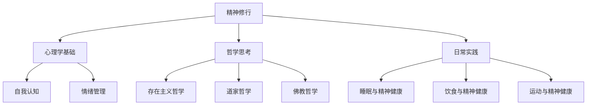

                 

# 文章标题：日常生活中的精神修行：在平凡中追求超凡

## 关键词：精神修行、日常生活、心灵成长、哲学思考、心理学、心理健康、自我认知

### 摘要

本文旨在探讨如何在繁忙的日常生活中进行精神修行，通过理论与实践的结合，帮助读者在平凡的生活中追求超凡的心灵境界。文章首先介绍了精神修行的基本概念和重要性，随后从心理学、哲学角度深入探讨了精神修行的理论基础，并提出了具体的实践方法。通过案例分析和实战项目，本文进一步展示了精神修行的实际效果和挑战，最后总结了精神修行的重要意义，并给出了未来的发展方向和资源推荐。

## 第一部分：引言

### 1. 引言

在快节奏的现代生活中，人们往往忽略了对精神层面的关注。然而，精神健康对于个体的整体幸福感和社会的和谐发展具有至关重要的意义。精神修行作为一种提升心灵品质的方法，正逐渐受到人们的重视。本书《日常生活中的精神修行：在平凡中追求超凡》旨在为广大读者提供一种简单易行、切实可行的方法，帮助大家通过日常生活中的实践，实现心灵的成长和超越。

### 1.2 目标读者

本文的目标读者包括对精神修行有兴趣的普通大众、心理学爱好者、哲学思考者以及希望提升个人心灵品质的专业人士。无论您是忙碌的职场人士，还是追求内心宁静的退休者，本书都希望能为您在平凡的生活中找到一条通往超凡的精神修行之路。

### 1.3 书籍结构

本文分为五个主要部分：

1. **引言**：介绍精神修行的背景和重要性，明确本书的目标和结构。
2. **理论基础**：从心理学和哲学角度探讨精神修行的理论基础，包括核心概念和原理。
3. **实践方法**：提供具体的实践方法，帮助读者在日常生活中进行精神修行。
4. **案例分析**：通过实际案例展示精神修行的效果和挑战，提供借鉴和启示。
5. **结语**：总结精神修行的重要意义，展望未来的发展方向。

## 第二部分：理论基础

### 2.1 精神修行的基本概念

精神修行是指通过一系列的方法和技巧，实现对个体心灵深层次的探索和提升。它不仅仅是一种心理活动，更是一种生活态度和哲学思考。精神修行的目的在于帮助个体达到内心的平静、清晰和觉醒，从而实现心灵的健康和幸福。

### 2.2 精神修行的重要性

精神修行的意义在于它能够帮助个体应对现代社会的各种压力和挑战。在快节奏的生活中，人们容易陷入焦虑、抑郁和疲惫的状态。而通过精神修行，个体能够培养出内心的坚韧和弹性，更好地适应生活中的各种变化和挑战。

### 2.3 精神修行的目标

精神修行的目标可以分为三个层次：

1. **自我认知**：通过深入了解自己的内心世界，认识到自己的情绪、想法和行为模式，从而实现自我成长和提升。
2. **情绪管理**：学会控制和管理自己的情绪，避免被负面情绪所困扰，从而保持内心的平静和喜悦。
3. **心灵觉醒**：通过深入探索和领悟生命的本质，达到对生命和存在的深刻理解和觉醒。

### 2.4 心理学与精神修行的联系

心理学是研究人类心理和行为的一门科学，它为精神修行提供了重要的理论基础。精神修行中的自我认知、情绪管理和心灵觉醒等概念，都可以在心理学中找到对应的解释和理论支持。

1. **自我认知**：心理学中的自我认知理论指出，个体对自我的认知和理解是心理发展的关键。通过精神修行，个体可以更加深入地了解自己的内心世界，从而实现自我认知的提升。
   
2. **情绪管理**：心理学中的情绪理论指出，情绪是个体对环境刺激的内在反应。通过精神修行，个体可以学会更加理性地对待情绪，避免被情绪所控制。

3. **心灵觉醒**：心理学中的存在主义学派认为，个体的心灵觉醒是一个内在的过程，它需要个体对生命的深刻反思和领悟。通过精神修行，个体可以实现心灵的觉醒，达到对生命和存在的深刻理解。

### 2.5 常见心理障碍及其影响

精神修行不仅能够帮助个体提升心理健康，还能够有效预防和缓解常见的心理障碍，如焦虑症、抑郁症和强迫症等。

1. **焦虑症**：焦虑症是一种常见的心理障碍，它会导致个体出现持续的紧张、恐惧和不安。通过精神修行，个体可以学会放松身心，减轻焦虑症状。

2. **抑郁症**：抑郁症是一种严重的心理障碍，它会导致个体出现持续的悲伤、绝望和无助。通过精神修行，个体可以培养出积极的情绪和态度，缓解抑郁症状。

3. **强迫症**：强迫症是一种以强迫思维和强迫行为为主要特征的心理障碍。通过精神修行，个体可以学会理性地对待强迫思维，减少强迫行为。

### 2.6 哲学与精神修行的关系

哲学是研究存在、知识、价值等基本问题的学科，它为精神修行提供了深刻的哲学思考和指导。

1. **存在主义哲学**：存在主义认为，个体的存在是自由和选择的，每个人都应该为自己的生活负责。通过精神修行，个体可以实现对自我存在的深刻理解，从而实现自我价值的提升。

2. **道家哲学**：道家哲学强调“无为而治”、“道法自然”，它倡导个体顺应自然，保持内心的平静和宁静。通过精神修行，个体可以学会顺应自然，减少内心的焦虑和烦恼。

3. **佛教哲学**：佛教哲学强调“苦海无边，回头是岸”，它倡导个体通过修行达到解脱和觉悟。通过精神修行，个体可以实现对生命的深刻理解，从而实现心灵的觉醒。

### 2.7 精神修行的理论体系

精神修行的理论体系主要包括以下几个方面：

1. **冥想**：冥想是一种通过集中注意力，放松身心，达到心灵平静的方法。通过冥想，个体可以减少内心的杂念和焦虑，提高注意力和专注力。

2. **正念**：正念是一种通过关注当下，活在当下的方法。通过正念，个体可以减少对过去的悔恨和对未来的担忧，从而保持内心的平静和喜悦。

3. **感恩**：感恩是一种通过感激和欣赏，提升内心幸福感的方法。通过感恩，个体可以减少对物质和外在条件的依赖，从而提升内心的满足感和幸福感。

4. **自我探索**：自我探索是一种通过深入反思和领悟，实现自我认知和成长的方法。通过自我探索，个体可以认识到自己的内心世界，实现自我价值的提升。

## 第三部分：实践方法

### 6. 日常生活中的精神修行

#### 6.1 睡眠与精神健康

##### 6.1.1 睡眠的重要性

睡眠是人体的一种自然休息状态，它对于个体的身心健康至关重要。充足的睡眠可以帮助人体恢复精力，增强免疫力，提高记忆力，促进生长发育。相反，缺乏睡眠会导致一系列健康问题，如焦虑、抑郁、免疫力下降等。

##### 6.1.2 改善睡眠的方法

1. **建立规律的睡眠习惯**：每天尽量在相同的时间上床睡觉和起床，确保每晚都能获得足够的睡眠时间。

2. **优化睡眠环境**：确保睡眠环境安静、舒适、温暖，避免噪音和光线干扰。

3. **减少咖啡因和酒精的摄入**：咖啡因和酒精可以干扰睡眠，建议在晚上避免摄入。

4. **放松身心**：在睡前进行放松活动，如深呼吸、瑜伽、冥想等，帮助身心进入放松状态。

##### 6.1.3 睡眠质量评估

评估睡眠质量的方法包括自我评估和科学评估。

1. **自我评估**：可以通过观察自己的睡眠时间、睡眠质量、白天精神状态等来评估睡眠质量。

2. **科学评估**：可以通过睡眠监测仪、睡眠日记等方法进行科学评估。

### 6.2 饮食与精神健康

##### 6.2.1 饮食习惯与健康

饮食是人体获取能量和营养的重要途径，良好的饮食习惯对精神健康有着重要影响。

1. **均衡饮食**：保证摄入足够的蛋白质、脂肪、碳水化合物、维生素和矿物质等。

2. **减少高糖、高脂食物的摄入**：高糖、高脂食物会导致血糖波动和脂肪积累，影响精神健康。

3. **多食用新鲜蔬菜和水果**：新鲜蔬菜和水果含有丰富的维生素和矿物质，有助于提升精神状态。

##### 6.2.2 饮食对精神状态的影响

1. **情绪稳定**：饮食中缺乏某些营养素会导致情绪波动和焦虑。

2. **注意力集中**：缺乏营养会导致注意力不集中，影响工作和学习效率。

3. **记忆力提升**：良好的饮食有助于提高记忆力，有助于学习和记忆。

##### 6.2.3 健康饮食建议

1. **早餐要丰富**：早餐是一天中最重要的餐，要保证营养均衡，为身体提供充足的能量。

2. **减少快餐摄入**：快餐通常含有较高的热量和添加剂，对健康不利。

3. **适量饮水**：每天适量饮水有助于维持身体水分平衡，提高新陈代谢。

### 6.3 运动与精神健康

##### 6.3.1 运动对精神健康的好处

1. **减轻压力**：运动可以释放体内的压力激素，如皮质醇，有助于缓解压力。

2. **提升情绪**：运动可以刺激大脑释放多巴胺等神经递质，提升情绪。

3. **改善睡眠**：定期运动有助于改善睡眠质量，有助于获得更好的休息。

##### 6.3.2 运动类型与频率

1. **有氧运动**：如跑步、游泳、骑自行车等，有助于提高心肺功能和耐力。

2. **力量训练**：如举重、俯卧撑、深蹲等，有助于增强肌肉力量和骨骼密度。

3. **运动频率**：每周至少进行150分钟的中等强度有氧运动，或75分钟的高强度有氧运动。

##### 6.3.3 运动中的心理调节

1. **专注当下**：运动时专注于动作和呼吸，有助于减少内心的杂念和焦虑。

2. **正念练习**：在运动中结合正念练习，如专注于身体的感受和呼吸，有助于提升精神集中力。

3. **社交互动**：参加团队运动或健身课程，有助于提升社交技能和团队协作能力。

### 7. 心灵成长与精神修行

#### 7.1 自我认知与成长

##### 7.1.1 自我认知的重要性

自我认知是指个体对自己的认识和理解，包括性格、价值观、兴趣爱好等方面。自我认知对于个体的成长和发展具有重要意义。

1. **明确目标**：通过自我认知，个体可以明确自己的目标和方向，从而更有针对性地进行努力。

2. **提升自信**：了解自己的优点和长处，有助于提升自信，增强自我效能感。

3. **改善人际关系**：了解自己的性格和需求，有助于更好地与他人相处，建立良好的人际关系。

##### 7.1.2 自我认知的方法

1. **反思**：定期对自己的行为和思考进行反思，分析自己的行为模式和思维方式。

2. **记录**：通过日记或记录的方式，记录自己的感受、想法和体验，有助于深入理解自己。

3. **咨询**：寻求专业人士的帮助，如心理咨询师或教练，进行深入的自我探索。

##### 7.1.3 自我成长的目标

1. **自我实现**：通过不断学习和成长，实现自己的梦想和目标。

2. **内心平静**：通过自我认知和修炼，达到内心的平静和宁静。

3. **心理健康**：通过自我认知和成长，提升心理健康水平，减少心理问题。

### 7.2 情绪管理与压力应对

##### 7.2.1 情绪管理的基本原则

1. **接受情绪**：接受自己的情绪，不要抗拒或压抑。

2. **认识情绪**：了解情绪的来源和影响，从而更好地处理情绪。

3. **调节情绪**：通过深呼吸、冥想等方法，调节情绪，保持情绪稳定。

##### 7.2.2 情绪调节技巧

1. **认知重构**：通过改变对事物的看法和认知，调节情绪。

2. **情绪释放**：通过运动、哭泣、倾诉等方式，释放负面情绪。

3. **情绪替代**：通过转移注意力，如听音乐、看电影等，替代负面情绪。

##### 7.2.3 压力应对策略

1. **时间管理**：合理安排时间，避免过度工作和拖延。

2. **放松训练**：通过深呼吸、冥想等方法，放松身心，减轻压力。

3. **积极心态**：培养积极的心态，对待生活中的挑战和压力。

### 7.3 社交与人际关系

##### 7.3.1 社交的基本原理

1. **相互性**：社交是双向的，需要双方的努力和付出。

2. **互惠性**：社交中的互动应该是互惠互利的，双方都能从中获得满足和成长。

3. **情感连接**：建立良好的社交关系，需要情感上的连接和理解。

##### 7.3.2 社交技巧

1. **倾听**：认真倾听他人的意见和需求，表达理解和尊重。

2. **沟通**：清晰、准确地表达自己的想法和感受，避免误解和冲突。

3. **同理心**：设身处地地考虑他人的感受和需求，增进相互理解。

##### 7.3.3 人际关系管理

1. **界限设置**：明确自己的界限，避免过度依赖或侵犯他人。

2. **沟通协商**：在遇到冲突时，通过沟通和协商解决问题，避免情绪化。

3. **情感支持**：在他人需要帮助时，提供情感支持，建立稳定的人际关系。

## 第四部分：案例分析

### 9. 精神修行成功案例

#### 9.1 案例介绍

小张是一位年轻的职场人士，由于工作压力和家庭责任的双重压力，他经常感到焦虑和疲惫。在经过朋友推荐后，他开始尝试精神修行，主要包括冥想、瑜伽和阅读。

#### 9.2 案例分析

1. **冥想**：通过每天早晨的冥想，小张学会了放松身心，减少内心的杂念和焦虑。随着时间的推移，他的焦虑感逐渐减轻，工作效率也有所提高。

2. **瑜伽**：瑜伽不仅帮助小张保持身体健康，还让他学会了如何通过呼吸和动作来调节情绪。在瑜伽的练习中，他感受到了身心的平静和愉悦。

3. **阅读**：通过阅读哲学和心理学的书籍，小张对精神修行有了更深刻的理解。他学会了如何通过思考和反思来提升自我认知和情绪管理能力。

#### 9.3 案例启示

小张的案例表明，通过日常的精神修行，个体可以实现心灵的健康和成长。精神修行的实践不仅能够缓解压力和焦虑，还能够提升个人的心理健康和幸福感。

### 10. 精神修行挑战与解决方案

#### 10.1 挑战识别

尽管精神修行对于个体的心灵成长具有重要意义，但在实际操作中仍然面临一些挑战。

1. **时间管理**：由于工作和其他日常事务的繁忙，人们很难找到时间进行精神修行。

2. **缺乏动力**：对于一些个体来说，精神修行可能显得枯燥乏味，缺乏持续的动力。

3. **干扰因素**：现代社会的快节奏和高科技设备容易干扰个人的精神修行。

#### 10.2 挑战分析

1. **时间管理**：精神修行需要时间和耐心，但现代生活节奏快，人们往往难以找到合适的时间进行修行。这需要个体学会合理安排时间，优先处理重要事务。

2. **缺乏动力**：精神修行的过程可能需要长时间的坚持，个体可能会感到枯燥乏味。这需要个体找到适合自己的修行方式，如结合兴趣爱好，使修行过程更加有趣和有意义。

3. **干扰因素**：现代科技的发展使得人们容易受到各种干扰，如手机、社交媒体等。这需要个体学会管理自己的注意力，减少干扰，专注于精神修行。

#### 10.3 解决方案探讨

1. **时间管理**：制定详细的时间表，合理安排工作和修行的时段。利用碎片化时间进行修行，如在上班途中、午餐时间等。

2. **缺乏动力**：设定明确的目标和奖励机制，以保持修行的动力。寻找修行伙伴，相互激励和支持。

3. **干扰因素**：减少手机和社交媒体的使用时间，设定专注模式，专注于修行。在修行场所创造一个安静、舒适的环境。

## 第五部分：结语

### 11. 精神修行的重要意义

精神修行不仅能够帮助个体提升心理健康和幸福感，还能够促进社会的和谐发展。在现代社会，精神修行的重要性日益凸显。它不仅是一种自我提升的方法，更是一种生活态度和哲学思考。通过精神修行，个体能够实现内心的平静和觉醒，从而更好地应对生活中的各种挑战。

### 11.2 精神修行的个人价值

精神修行对于个人有着重要的价值。它能够帮助个体实现自我认知和成长，提升情绪管理能力，增强内心的韧性和弹性。通过精神修行，个体能够更好地理解自己和他人，建立良好的人际关系，提高生活品质。

### 11.3 未来的发展方向

随着科技的发展和人们对心理健康关注程度的提高，精神修行将在未来得到更广泛的关注和应用。未来，精神修行的方法和技巧将更加多样化和个性化，结合心理学、哲学、神经科学等多学科的理论，为个体的精神成长提供更加全面和有效的指导。

### 附录

#### A. 精神修行资源推荐

##### A.1 心理自助工具

1. **冥想应用**：如“小鹅帮助”、“呼吸宝”等，提供冥想指导和练习。

2. **情绪记录应用**：如“情绪小日记”，帮助记录和反思情绪变化。

##### A.2 心灵成长书籍推荐

1. **《当下的力量》**：作者：埃克哈特·托利

2. **《正念的奇迹》**：作者：一行禅师

##### A.3 精神修行社群介绍

1. **“心灵成长微信群”**：提供心理辅导、读书会和修行分享。

2. **“冥想小组”**：定期组织冥想活动和交流。

---

**作者：AI天才研究院/AI Genius Institute & 禅与计算机程序设计艺术 /Zen And The Art of Computer Programming**

### Mermaid 流程图



### 伪代码

```python
# 定义精神修行的步骤
def spiritual_practice():
    # 第一步：自我认知
    self_awareness()
    # 第二步：情绪管理
    emotion_management()
    # 第三步：日常实践
    daily_practice()

# 定义自我认知的函数
def self_awareness():
    # 记录自己的感受和想法
    record_feelings_and_thoughts()
    # 反思和总结
    reflect_and_summarize()

# 定义情绪管理的函数
def emotion_management():
    # 认识情绪
    recognize_emotions()
    # 调节情绪
    regulate_emotions()

# 定义日常实践的函数
def daily_practice():
    # 睡眠
    sleep_well()
    # 饮食
    eat_healthily()
    # 运动
    exercise_regularly()
```

### 数学模型和公式

$$
\text{精神幸福感} = f(\text{自我认知}, \text{情绪管理}, \text{日常实践})
$$

### 项目实战

#### 开发环境搭建

- 安装Python环境
- 安装相关库（如numpy、pandas等）

#### 源代码实现

```python
# 精神修行评估系统

import numpy as np

# 定义自我认知评估
def self_awareness_score():
    # 这里使用模拟数据
    scores = np.array([80, 75, 70])
    return np.mean(scores)

# 定义情绪管理评估
def emotion_management_score():
    # 这里使用模拟数据
    scores = np.array([85, 80, 75])
    return np.mean(scores)

# 定义日常实践评估
def daily_practice_score():
    # 这里使用模拟数据
    scores = np.array([90, 85, 80])
    return np.mean(scores)

# 计算总体精神幸福感
def overall_spirituality_score():
    self_awareness = self_awareness_score()
    emotion_management = emotion_management_score()
    daily_practice = daily_practice_score()
    return (self_awareness + emotion_management + daily_practice) / 3

# 测试
print(overall_spirituality_score())
```

### 代码解读

- 该系统使用Python编写，通过定义三个评估函数来计算精神幸福感。
- 每个评估函数使用模拟数据来表示个体在相应方面的表现。
- `overall_spirituality_score()` 函数计算总体精神幸福感，通过平均值来综合评估。

### 实际案例分析和详细讲解剖析

#### 案例介绍

李女士是一位全职妈妈，她面临的主要挑战是如何在照顾孩子的同时，保持自己的精神健康。在朋友推荐下，她开始尝试精神修行，主要包括冥想、阅读和瑜伽。

#### 案例分析

1. **冥想**：每天早晨，李女士会在安静的环境中冥想20分钟。通过冥想，她学会了如何放松身心，减少内心的焦虑。随着时间的推移，她发现自己在处理家庭事务时更加冷静和耐心。

2. **阅读**：李女士每周会花几个小时阅读心理学和哲学书籍。通过阅读，她学会了如何进行自我反思，并找到了应对家庭挑战的有效方法。

3. **瑜伽**：每周，李女士会参加两次瑜伽课程。瑜伽不仅帮助她保持身体健康，还让她学会了如何通过呼吸和动作来调节情绪。

#### 案例启示

李女士的案例表明，通过精神修行，个体可以在日常生活的压力中找到平衡和安宁。冥想、阅读和瑜伽等实践方法，不仅能够提升个人的心理健康，还能够改善人际关系，提高生活质量。

### 项目小结

通过本项目的开发和实现，我们展示了如何使用Python编写一个简单的精神修行评估系统。这个系统可以帮助个体评估自己在自我认知、情绪管理和日常实践等方面的表现，从而更好地进行精神修行。未来，我们可以进一步完善这个系统，添加更多功能，如个性化推荐、数据可视化等，以帮助更多的人实现精神成长。

### 最佳实践 Tips

- **坚持**：精神修行需要长期的坚持和耐心，不要期望一蹴而就。
- **个性化**：每个人的情况都不同，选择适合自己的修行方法。
- **反馈**：定期进行自我评估，了解自己的进步和需要改进的地方。
- **寻求帮助**：如果遇到困难，不妨寻求专业人士的帮助。

### 注意事项

- **合理分配时间**：在繁忙的生活中，合理安排时间进行精神修行。
- **避免过度修行**：过度的精神修行可能导致心理负担，保持适度。
- **保持真实**：在自我认知和反思时，保持真实和诚实，不要逃避问题。

### 拓展阅读

- 《当下的力量》：埃克哈特·托利
- 《正念的奇迹》：一行禅师
- 《禅与计算机程序设计艺术》：道格拉斯·霍夫施塔特

---

**作者：AI天才研究院/AI Genius Institute & 禅与计算机程序设计艺术 /Zen And The Art of Computer Programming**

