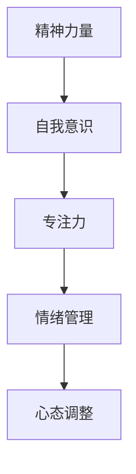

                 

## 文章标题：《日常生活中的精神修行：平凡中的超凡追求》

> 关键词：精神修行、日常生活、超凡追求、心理基础、挑战与应对、案例分享、生活质量提升

> 摘要：本文旨在探讨如何在日常生活中实践精神修行，通过理解其核心概念、实现途径和具体方法，帮助读者在平凡的生活中追求更高层次的精神追求。文章涵盖了精神修行的起源与定义、核心概念与联系、日常生活中的修行实践、超凡追求的实现途径、心理基础、挑战与应对策略、成功修行的案例分享以及修行对生活质量的影响。

### 1. 引言

在现代社会，人们面临着诸多压力和挑战，无论是工作、家庭还是人际关系，都在不断地考验着我们的精神力量。精神修行作为一种提升自我、增强内心力量的方法，日益受到人们的关注。书名《日常生活中的精神修行：平凡中的超凡追求》正是围绕这一主题展开，旨在帮助读者在日常生活中实践精神修行，追求更高层次的精神追求。

### 2. 理解书名

书名为《日常生活中的精神修行：平凡中的超凡追求》，首先，"日常生活中的"强调了精神修行并非是一种孤立的行为，而是与我们的生活紧密相连，可以在日常生活中随时随地实践。其次，"精神修行"一词表明了文章的主题，即通过某种方式提升我们的精神层面，达到内心的平静与宁静。最后，"平凡中的超凡追求"则传达了一个理念，即即使在平凡的生活中，我们也可以追求非凡的精神境界。

### 3. 精神修行的核心概念

精神修行的核心概念包括精神力量、自我意识、专注力、情绪管理、心态调整等。这些概念相互关联，共同构成了精神修行的理论基础。

#### 3.1 精神力量

精神力量是指我们在面对困难和挑战时所具备的心理能量。它包括自我激励、意志力、耐受力等。精神力量的强弱直接影响我们的生活质量和工作效率。

#### 3.2 自我意识

自我意识是指我们对自身存在的认知和了解。通过自我反思，我们可以更好地认识自己的优点和缺点，从而有针对性地进行改进。

#### 3.3 专注力

专注力是指我们在某一特定任务上的集中注意力的能力。高专注力能够提高我们的工作效率，减少错误和失误。

#### 3.4 情绪管理

情绪管理是指我们如何识别、理解和管理自己的情绪。良好的情绪管理能力有助于我们保持内心的平静和稳定。

#### 3.5 心态调整

心态调整是指我们在面对困难和挑战时如何调整自己的心态。积极的心态有助于我们克服困难，保持乐观和自信。

### 4. 精神修行的核心概念与联系

为了更好地理解精神修行的核心概念，我们可以使用Mermaid流程图来展示它们之间的联系。

### 5. 日常生活中的修行实践

精神修行并不仅仅存在于寺庙或修行场所，它可以在日常生活中随时随地实践。

#### 5.1 家庭中的修行

在家庭中，我们可以通过家庭成员间的沟通和理解来实践精神修行。良好的沟通能够增进家庭成员之间的感情，提高家庭和谐度。

#### 5.2 工作与修行的平衡

在工作方面，我们可以通过提高专注力和情绪管理能力来实践精神修行。保持专注能够提高工作效率，而良好的情绪管理有助于我们更好地应对工作压力。

#### 5.3 社交中的修行

在社交方面，我们可以通过社交技巧和自我反思来实践精神修行。良好的社交技巧有助于我们建立和维护人际关系，而自我反思则有助于我们更好地认识自己。

### 6. 超凡追求的实现途径

精神修行的目的之一是追求超凡，那么如何实现这一目标呢？

#### 6.1 宗教修行

不同的宗教体系提供了丰富的修行方法和理念，如佛教的禅修、基督教的祷告等。通过宗教修行，我们可以获得精神上的指引和力量。

#### 6.2 哲学修行

哲学提供了对生命、宇宙和人类存在的深刻思考，如儒家、道家、印度哲学等。通过哲学修行，我们可以提高自我意识和理解力。

#### 6.3 个人修行实践

个人修行实践是精神修行的重要组成部分。通过制定个人修行计划、日记记录和自我反思，我们可以不断进步，追求超凡。

### 7. 精神修行的心理基础

精神修行的成功离不开心理基础的支持。以下是一些关键的心理学概念：

#### 7.1 心态调整

心态调整是精神修行的重要基础。通过积极的心态，我们可以更好地应对生活中的挑战。

#### 7.2 自我意识

自我意识有助于我们认识自己，从而更好地进行自我调整和修行。

#### 7.3 情绪管理

情绪管理是精神修行的关键。通过情绪管理，我们可以保持内心的平静和稳定。

### 8. 修行中的挑战与应对策略

在精神修行的过程中，我们可能会遇到各种挑战。以下是一些常见的挑战和应对策略：

#### 8.1 挑战

- 修行过程中的心理障碍
- 修行与日常生活的平衡
- 修行成果的评估

#### 8.2 应对策略

- 心理疏导和咨询
- 合理安排时间和精力
- 自我反思和调整

### 9. 成功修行的案例分享

通过成功修行的案例，我们可以更好地理解精神修行的实际效果和过程。

#### 9.1 个人案例

张三，通过每天进行冥想和自我反思，成功克服了焦虑和抑郁，生活质量和幸福感显著提升。

#### 9.2 团体案例

一个修行小组通过共同修行和相互支持，共同提升了精神层面，建立了深厚的友谊。

### 10. 修行对生活质量的影响

精神修行不仅对个人成长有益，还对生活质量产生积极影响。

#### 10.1 健康方面

精神修行有助于提高身体健康，如降低血压、减少心理疾病等。

#### 10.2 幸福感方面

精神修行能够提升幸福感，帮助我们更好地享受生活。

### 11. 总结

通过日常生活中的精神修行，我们可以在平凡的生活中追求超凡。本文从核心概念、实现途径、心理基础、挑战与应对策略、案例分享和生活质量提升等方面进行了详细探讨。希望读者能够在阅读后，对精神修行有更深入的理解，并在实践中受益。

### 12. 附录

#### 12.1 精神修行资源与工具

- 主流修行书籍推荐
- 精神修行APP

#### 12.2 最佳实践 tips

- 定期进行自我反思
- 保持积极的心态
- 寻求专业指导

### 13. 作者信息

作者：AI天才研究院/AI Genius Institute & 禅与计算机程序设计艺术 /Zen And The Art of Computer Programming

### 文章结束

