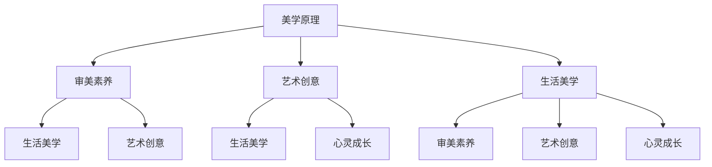

                 

### 文章标题：《日常生活美学工作室：提升生活品质的艺术课程》

#### 关键词：
- 日常生活美学
- 提升生活品质
- 艺术课程
- 装饰艺术
- 生活技巧
- 审美培养

#### 摘要：
《日常生活美学工作室：提升生活品质的艺术课程》是一本旨在通过美学理论、家居布置、装饰艺术、生活技巧和艺术鉴赏等方面的系统学习，帮助读者提升生活品质的指南。本书分为四个部分，详细探讨了美学基础理论、提升生活品质的艺术课程、实践指南与案例分析以及总结与展望。通过逐步分析和推理，本文旨在揭示日常生活美学对个人生活质量的深远影响，并引导读者如何通过艺术课程和实践，将美学融入日常生活，打造高品质生活。文章还探讨了美学理论、艺术创意与设计实践、艺术生活与心灵成长等方面的内容，提供了丰富的实践案例和项目实战经验，帮助读者深入理解并掌握日常生活美学的核心概念和实际应用。最后，文章总结了日常生活美学的未来趋势，并展望了美学在未来的发展方向。

---

**正文开始：**

# 引言

《日常生活美学工作室：提升生活品质的艺术课程》是一本专注于提升生活品质的指南。随着现代社会的不断发展，人们对生活品质的要求越来越高。而日常生活美学作为一种新的生活理念，正逐渐受到广泛关注。本书旨在通过系统化的学习和实践，帮助读者将美学融入日常生活，提升生活品质。

## 1. 书籍背景与目的

本书的背景源于对日常生活美学的深入研究和实践。作者通过对美学理论、家居布置、装饰艺术、生活技巧和艺术鉴赏等方面的长期关注，发现美学不仅是一门学科，更是一种生活态度和方式。因此，本书旨在为广大读者提供一套全面、系统的日常生活美学课程，帮助读者掌握美学理论，提升审美素养，并将美学应用于实际生活中。

## 2. 日常生活美学的重要性

日常生活美学不仅关乎审美和装饰，更关乎生活的品质和幸福感。通过美学实践，我们可以：

- **提升家居环境的美感**：通过合理的家居布置和装饰，让居住环境更加舒适、美观，提升居住体验。
- **培养审美素养**：通过学习美学理论，培养对美的感知和鉴赏能力，提升个人审美素养。
- **改善生活质量**：将美学融入日常生活，提高生活品质，带来更多的快乐和满足感。
- **促进身心健康**：美学实践有助于缓解压力，提升心理健康，促进身心平衡。

## 3. 书籍结构

本书分为四个部分，分别探讨日常生活美学的不同方面。

- **第一部分：日常生活美学基础理论**：介绍美学原理、家居布置与装饰艺术、生活技巧与艺术应用。
- **第二部分：提升生活品质的艺术课程**：探讨艺术鉴赏与审美培养、艺术创意与设计实践、艺术生活与心灵成长。
- **第三部分：实践指南与案例分析**：提供艺术课程实践案例、生活美学的案例分析、个性化艺术生活规划。
- **第四部分：总结与展望**：总结全书内容，展望日常生活美学的未来趋势。

### 第一部分：日常生活美学基础理论

## 第一章：美学原理与实践

美学作为一门研究美的哲学学科，历史悠久，内涵丰富。本章将介绍美学的基本原理，探讨美学在日常生活中的实践与应用。

### 1.1 美学的定义与历史发展

美学（Aesthetics）一词源于希腊语“ἀισθητική”，意为“感觉学”或“感性学”。美学是一门研究美的本质、审美经验、审美判断及其规律的科学。美学的历史可以追溯到古希腊时期，经过漫长的发展，形成了多个流派和理论。

- **古典美学**：强调美是客观存在的，可以通过理性分析和逻辑推理来认识和把握美。
- **现代美学**：强调美是主观的，与个人的情感、体验和价值观密切相关。
- **后现代美学**：对传统美学进行批判和反思，强调多元性和相对性。

### 1.2 实践美学的理念与方法

实践美学是一种强调美学理论应用于实际生活的理念。实践美学的核心理念是“美在生活”，即美学不仅仅是理论上的探讨，更是一种实践。实践美学的具体方法包括：

- **审美体验**：通过观察、体验和感受，发现生活中的美。
- **审美判断**：在审美体验的基础上，对美的事物进行评价和判断。
- **审美创造**：通过自己的努力和创造力，将美学理念应用于实际生活中，创造出美的环境。

### 1.3 美学在日常生活中的应用

美学在日常生活中的应用广泛，包括家居布置、装饰艺术、生活技巧、艺术鉴赏等多个方面。

- **家居布置**：通过合理的布局和装饰，提升家居环境的美感和舒适度。
- **装饰艺术**：利用各种装饰元素和艺术形式，为家居和生活增添美感。
- **生活技巧**：通过美学的方法和理念，改善生活品质，提高生活幸福感。
- **艺术鉴赏**：培养审美素养，提升对美的鉴赏能力，丰富精神世界。

## 第二章：家居布置与装饰艺术

家居布置和装饰艺术是提升生活品质的重要方面。本章将介绍家居布置的基本原则、装饰艺术与审美趣味，以及家居装饰的艺术实践。

### 2.1 家居布置的基本原则

家居布置的基本原则包括：

- **功能性与美观性相结合**：在保证家居功能性的同时，注重美观性，营造舒适的居住环境。
- **空间利用最大化**：合理利用空间，提高空间利用率，创造宽敞、明亮的居住环境。
- **整体协调性**：保持整体风格的协调统一，避免杂乱无章。
- **个性化和创意**：根据个人喜好和需求，融入独特的创意和风格，打造个性化的家居环境。

### 2.2 装饰艺术与审美趣味

装饰艺术是家居布置的重要组成部分。装饰艺术与审美趣味密切相关，包括：

- **装饰元素**：如家具、灯具、窗帘、挂画等。
- **装饰风格**：如简约、复古、现代等。
- **审美趣味**：通过审美体验，培养对美的感知和鉴赏能力，提升审美素养。

### 2.3 家居装饰的艺术实践

家居装饰的艺术实践包括：

- **色彩搭配**：合理运用色彩，提升空间视觉效果。
- **材质选择**：选择合适的材质，营造质感丰富的家居环境。
- **布局设计**：通过巧妙的布局设计，提升空间的层次感和美感。
- **照明设计**：运用照明技巧，创造温馨、舒适的氛围。

## 第三章：生活技巧与艺术应用

生活技巧与艺术应用是提升生活品质的重要手段。本章将介绍生活美学与日常习惯的关系、生活技巧的艺术化表达，以及艺术在生活中的创新应用。

### 3.1 生活美学与日常习惯

生活美学与日常习惯密切相关。通过培养良好的日常习惯，我们可以：

- **提高生活质量**：养成良好的生活习惯，提高生活品质。
- **塑造个性**：通过日常习惯的养成，展现个人的独特风格和品味。
- **提升幸福感**：良好的日常习惯有助于缓解压力，提升幸福感。

### 3.2 生活技巧的艺术化表达

生活技巧的艺术化表达包括：

- **创意烹饪**：通过巧妙的烹饪技巧，将美食与艺术相结合。
- **手工艺术**：通过手工艺术，将日常生活中的物品赋予新的艺术价值。
- **室内装饰**：通过室内装饰，提升家居环境的美感和品质。

### 3.3 艺术在生活的创新应用

艺术在生活的创新应用包括：

- **艺术收藏**：通过艺术收藏，提升个人文化素养和生活品味。
- **艺术创作**：通过艺术创作，表达个人的情感和思想，丰富精神生活。
- **艺术疗愈**：通过艺术疗愈，缓解压力，提升心理健康。

### 第二部分：提升生活品质的艺术课程

## 第四章：艺术鉴赏与审美培养

艺术鉴赏与审美培养是提升生活品质的重要途径。本章将探讨艺术鉴赏的基本素养、审美培养的方法与实践，以及艺术鉴赏的案例解析。

### 4.1 艺术鉴赏的基本素养

艺术鉴赏的基本素养包括：

- **艺术史知识**：了解不同艺术流派的历史和特点，提升对艺术的认知。
- **审美能力**：培养对美的感知和鉴赏能力，提升审美素养。
- **批判性思维**：学会从不同角度分析和评价艺术作品，形成独立的审美观点。

### 4.2 审美培养的方法与实践

审美培养的方法与实践包括：

- **艺术教育**：通过系统的艺术教育，培养审美素养和艺术鉴赏能力。
- **艺术实践**：通过艺术创作和实践，提升艺术感受力和创造力。
- **审美体验**：通过观察、体验和感受，发现生活中的美，培养审美情趣。

### 4.3 艺术鉴赏的案例解析

艺术鉴赏的案例解析包括：

- **中外艺术鉴赏**：分析中外著名艺术作品，探讨其艺术特色和审美价值。
- **当代艺术鉴赏**：关注当代艺术的发展趋势，了解当代艺术的特点和魅力。
- **生活美学案例**：通过生活美学案例，展示艺术鉴赏在生活中的实际应用。

## 第五章：艺术创意与设计实践

艺术创意与设计实践是提升生活品质的重要手段。本章将介绍艺术创意的理念与技巧、设计实践的方法与流程，以及艺术创意案例分享。

### 5.1 艺术创意的理念与技巧

艺术创意的理念与技巧包括：

- **创意思维**：培养创意思维，学会从不同角度和层面思考问题，发掘创意灵感。
- **创新设计**：运用创新设计的方法，将创意转化为实际的设计方案。
- **艺术表现**：通过艺术表现，将创意理念传达给观众，提升艺术感染力。

### 5.2 设计实践的方法与流程

设计实践的方法与流程包括：

- **需求分析**：明确设计需求，确定设计目标。
- **创意构思**：进行创意构思，产生设计方案。
- **设计制作**：制作设计作品，进行细节调整和优化。
- **评估反馈**：评估设计效果，收集反馈意见，进行改进。

### 5.3 艺术创意案例分享

艺术创意案例分享包括：

- **家居设计案例**：分享家居设计的创意案例，展示设计理念和实践过程。
- **公共空间设计案例**：分析公共空间设计的创意案例，探讨设计对社会和环境的影响。
- **艺术装置案例**：介绍艺术装置的创意案例，展示艺术创意在公共空间的应用。

## 第六章：艺术生活与心灵成长

艺术生活与心灵成长密切相关。本章将探讨艺术生活与心理健康的关系、心灵成长的艺术视角，以及艺术生活实践案例。

### 6.1 艺术生活与心理健康

艺术生活与心理健康的关系包括：

- **减压作用**：艺术活动有助于缓解压力，提升心理健康。
- **情绪调节**：通过艺术创作和鉴赏，调节情绪，保持心理平衡。
- **自我认知**：通过艺术活动，增强自我认知，提升自我价值感。

### 6.2 心灵成长的艺术视角

心灵成长的艺术视角包括：

- **艺术治疗**：利用艺术活动进行心理治疗，缓解心理问题。
- **艺术表达**：通过艺术创作，表达内心情感和思想，促进心理成长。
- **艺术教育**：通过艺术教育，培养审美素养和创造力，促进全面发展。

### 6.3 艺术生活实践案例

艺术生活实践案例包括：

- **家庭艺术活动**：分享家庭艺术活动的案例，展示如何将艺术融入日常生活。
- **社区艺术活动**：介绍社区艺术活动的案例，探讨艺术活动对社区文化的影响。
- **个人艺术创作**：分享个人艺术创作的案例，展示艺术创作对个人成长的影响。

### 第三部分：实践指南与案例分析

## 第七章：艺术课程实践案例

艺术课程实践案例是验证美学理论在实际应用中的有效性的重要途径。本章将介绍艺术课程的设计与实施、艺术课程实践案例解析，以及艺术课程效果评估。

### 7.1 艺术课程的设计与实施

艺术课程的设计与实施包括以下几个关键步骤：

- **需求分析**：了解学员的背景、兴趣和需求，确定课程目标和内容。
- **课程规划**：根据需求分析，制定详细的课程规划，包括课程模块、教学方法和时间安排。
- **教材编写**：编写适合学员水平的教材，包括理论讲解、实践指导和案例分析。
- **教学实施**：按照课程规划，进行教学实施，确保学员能够掌握所学知识和技能。

### 7.2 艺术课程实践案例解析

艺术课程实践案例解析包括以下几个部分：

- **案例背景**：介绍案例的基本情况，包括课程背景、学员情况和课程目标。
- **实施过程**：详细描述艺术课程的实施过程，包括教学活动、学员参与情况和互动交流。
- **案例效果**：分析艺术课程实施后的效果，包括学员的学习成果、满意度评价和反馈意见。

### 7.3 艺术课程效果评估

艺术课程效果评估包括以下几个方面：

- **学员反馈**：收集学员的反馈意见，了解他们对课程内容和教学方法的满意度。
- **学习成果**：评估学员在课程结束后所取得的学习成果，包括知识掌握、技能提升和审美素养的提高。
- **案例评估**：对艺术课程实践案例进行综合评估，分析其成功经验和不足之处，为后续课程的改进提供参考。

## 第八章：生活美学的案例分析

生活美学的案例分析是深入了解日常生活美学应用的重要途径。本章将介绍生活美学的案例类型、案例分析的方法与技巧，以及生活美学案例分享。

### 8.1 生活美学的案例类型

生活美学的案例类型包括：

- **家居布置案例**：通过合理的家居布置，提升居住环境的美感和舒适度。
- **装饰艺术案例**：利用装饰艺术元素，为家居和生活增添美感。
- **生活技巧案例**：通过生活技巧的应用，改善生活品质，提升生活幸福感。
- **艺术鉴赏案例**：通过艺术鉴赏活动，培养审美素养，提升对美的鉴赏能力。

### 8.2 案例分析的方法与技巧

案例分析的方法与技巧包括：

- **观察法**：通过观察案例，了解其设计思路和实施过程。
- **访谈法**：与案例的创作者或实施者进行访谈，了解他们的经验和观点。
- **数据分析**：对案例的数据进行分析，评估其效果和影响。
- **比较法**：将不同案例进行比较，分析其优缺点和适用范围。

### 8.3 生活美学案例分享

生活美学案例分享包括以下几个部分：

- **案例介绍**：介绍案例的基本情况，包括案例背景、目的和实施过程。
- **案例分析**：对案例进行深入分析，探讨其设计思路、实施方法和效果。
- **经验与启示**：总结案例的经验和启示，为其他生活美学的实践提供参考。

## 第九章：个性化艺术生活规划

个性化艺术生活规划是满足个人生活需求和提高生活品质的有效途径。本章将介绍个性化艺术生活的理念、生活规划的方法与工具，以及个性化艺术生活规划案例。

### 9.1 个性化艺术生活的理念

个性化艺术生活的理念包括：

- **尊重个性**：尊重个人的兴趣、需求和价值观，打造独特的艺术生活。
- **追求品质**：注重生活品质，通过艺术手段提升生活的美感。
- **不断创新**：勇于尝试新事物，不断探索和创新，丰富艺术生活。

### 9.2 生活规划的方法与工具

生活规划的方法与工具包括：

- **目标设定**：明确生活规划的目标，包括短期和长期目标。
- **需求分析**：分析个人的兴趣、需求和资源，为生活规划提供依据。
- **计划制定**：制定详细的生活规划计划，包括时间、内容和资源安排。
- **执行与调整**：执行生活规划计划，并根据实际情况进行调整。

### 9.3 个性化艺术生活规划案例

个性化艺术生活规划案例包括以下几个部分：

- **案例介绍**：介绍案例的基本情况，包括案例背景、目标和生活规划计划。
- **实施过程**：详细描述个性化艺术生活规划的实施过程，包括活动安排、资源和时间管理。
- **效果评估**：评估个性化艺术生活规划的效果，包括生活品质的提升、个人成长的收获和满意度。

### 第四部分：总结与展望

## 第十章：日常生活美学的未来趋势

日常生活美学的未来趋势包括：

- **智能化美学**：随着人工智能技术的发展，美学应用将更加智能化，为日常生活带来更多的便利和乐趣。
- **生态美学**：环保和可持续发展成为美学的重要议题，生态美学将成为日常生活美学的核心趋势。
- **多元化美学**：不同文化背景和艺术流派的交融，将推动美学多元发展，丰富日常生活美学的内容和形式。

### 10.1 美学理论的最新发展

美学理论的最新发展包括：

- **跨学科研究**：美学与哲学、心理学、社会学、艺术学等多个学科的交叉研究，推动美学理论的深化。
- **实验美学**：通过实验方法研究美学现象，为美学理论提供实证支持。
- **后现代美学**：对传统美学进行反思和批判，探讨美学的多样性和相对性。

### 10.2 生活美学的新趋势

生活美学的新趋势包括：

- **数字美学**：数字技术为生活美学带来了新的可能性，如虚拟现实、增强现实等技术的应用。
- **共享美学**：共享经济和共享文化的影响，使生活美学从个人延伸到社区和群体。
- **生活美学教育**：生活美学教育的普及，提高人们对美学理论的认识和应用能力。

### 第十一章：读者参与与互动平台

读者参与与互动平台是促进日常生活美学实践的重要途径。本章将介绍互动平台的建设与运营、读者互动的方式与方法，以及互动平台案例分析。

### 11.1 互动平台的建设与运营

互动平台的建设与运营包括以下几个关键环节：

- **平台定位**：明确互动平台的定位和目标，为用户提供有价值的内容和服务。
- **内容规划**：制定互动平台的内容规划，包括文章、视频、活动等多种形式。
- **用户管理**：建立用户管理体系，包括用户注册、认证、评价和互动等。
- **运营策略**：制定互动平台的运营策略，包括推广、营销和用户活跃度提升等。

### 11.2 读者互动的方式与方法

读者互动的方式与方法包括：

- **评论互动**：通过文章评论，鼓励读者表达观点和交流想法。
- **社群互动**：建立社群，如微信群、QQ群、论坛等，为读者提供交流平台。
- **活动互动**：举办线上线下活动，如讲座、展览、工作坊等，促进读者互动。
- **反馈机制**：建立反馈机制，收集读者意见和建议，不断改进互动平台。

### 11.3 互动平台案例分析

互动平台案例分析包括以下几个部分：

- **案例介绍**：介绍案例的基本情况，包括平台类型、目标和用户群体。
- **案例分析**：对案例进行深入分析，探讨其成功经验和不足之处。
- **经验借鉴**：总结案例的经验和启示，为其他互动平台的运营提供参考。

### 第十二章：致谢与附录

在本书的撰写过程中，我们得到了许多人的帮助和支持。在此，我们对以下人员表示衷心的感谢：

- **编委会成员**：感谢编委会成员对本书内容的审阅和修改，为本书的质量提供了有力保障。
- **审稿人**：感谢审稿人对本书的仔细审阅和反馈，帮助我们发现问题并不断完善。
- **读者**：感谢广大读者对本书的关注和支持，为我们的工作提供了动力。
- **家人与朋友**：感谢家人和朋友在本书撰写过程中的理解和支持。

#### 附录

- **参考文献**：列出本书引用的参考文献，方便读者进一步阅读和学习。
- **相关资源与链接**：提供与本书相关的外部资源和链接，包括学术文章、在线课程、展览信息等。

**作者信息**：

作者：AI天才研究院/AI Genius Institute & 禅与计算机程序设计艺术 /Zen And The Art of Computer Programming

**本文完**。希望本书能够帮助读者深入了解日常生活美学，提升生活品质，享受美好的生活。让我们共同努力，打造更美好的世界！### 背景介绍

日常生活美学作为一种新兴的生活理念，正逐渐引起广泛关注。它不仅仅是对美的追求，更是一种提升生活品质的艺术。在现代社会，随着生活节奏的加快，人们越来越追求物质与精神的平衡。而日常生活美学，正是通过美学理论、家居布置、装饰艺术、生活技巧和艺术鉴赏等方面的系统学习，帮助人们实现这一目标。

《日常生活美学工作室：提升生活品质的艺术课程》应运而生，旨在为广大读者提供一套全面、系统的美学课程。本书通过详细的讲解和实践指导，帮助读者了解美学理论，提升审美素养，并将美学理念应用于实际生活中，从而提升生活品质。

本书的内容涵盖以下几个方面：

1. **美学原理与实践**：介绍美学的基本概念、历史发展和实践方法，帮助读者建立美学理论基础。
2. **家居布置与装饰艺术**：探讨家居布置的基本原则、装饰艺术与审美趣味，以及家居装饰的艺术实践。
3. **生活技巧与艺术应用**：介绍生活美学与日常习惯的关系、生活技巧的艺术化表达，以及艺术在生活中的创新应用。
4. **艺术鉴赏与审美培养**：探讨艺术鉴赏的基本素养、审美培养的方法与实践，以及艺术鉴赏的案例解析。
5. **艺术创意与设计实践**：介绍艺术创意的理念与技巧、设计实践的方法与流程，以及艺术创意案例分享。
6. **艺术生活与心灵成长**：探讨艺术生活与心理健康的关系、心灵成长的艺术视角，以及艺术生活实践案例。
7. **实践指南与案例分析**：提供艺术课程实践案例、生活美学的案例分析、个性化艺术生活规划。
8. **总结与展望**：总结全书内容，展望日常生活美学的未来趋势。

通过以上内容的系统学习，读者可以深入了解日常生活美学的核心概念和实际应用，掌握提升生活品质的艺术方法，打造属于自己的美好生活方式。

### 核心概念与联系

在日常生活的美学实践中，有几个核心概念需要理解和掌握，这些概念相互联系，共同构成了美学的基础框架。以下是这些核心概念的详细解释和它们之间的关系。

#### 1. 美学原理

美学原理是美学研究的核心，它探讨了美的本质、美的特征以及美的产生和评价标准。美学原理包括以下几个方面：

- **美的本质**：美学试图回答“什么是美”的问题。不同的美学流派对此有不同的看法，如形式美学认为美在于形式，内容美学认为美在于内容。
- **美的特征**：美学研究美的基本特征，如和谐、平衡、统一等。这些特征是评价美的重要标准。
- **美的评价标准**：美学探讨了如何评价美，包括审美经验、审美判断和审美价值。

#### 2. 审美素养

审美素养是指一个人对美的感知、理解和鉴赏能力。它是提升生活质量的重要方面，可以通过以下方法培养：

- **审美体验**：通过观察、体验和感受，发现生活中的美。比如，通过欣赏自然风光、艺术作品，感受美的存在。
- **审美教育**：通过系统的美学教育，学习美学理论，提高审美素养。例如，学习艺术史、艺术理论等。
- **审美实践**：通过艺术创作和实践活动，提升审美能力。如绘画、摄影、舞蹈等。

#### 3. 艺术创意

艺术创意是指运用创造性思维，将美学理念应用于实际生活，创造出独特的艺术作品或环境。艺术创意的过程包括：

- **创意思维**：培养创意思维，从不同角度和层面思考问题，产生创意想法。
- **创新设计**：将创意转化为实际的设计方案，通过设计实践，实现美学理念。
- **艺术表现**：通过艺术形式，如绘画、雕塑、音乐等，表达创意和情感。

#### 4. 生活美学

生活美学是将美学理念应用于日常生活，提升生活品质的一种方式。生活美学包括以下几个方面：

- **家居布置**：通过合理的布局和装饰，提升家居环境的美感和舒适度。
- **装饰艺术**：利用各种装饰元素和艺术形式，为家居和生活增添美感。
- **生活技巧**：通过美学的方法和理念，改善生活品质，提高生活幸福感。
- **艺术鉴赏**：培养审美素养，提升对美的鉴赏能力，丰富精神世界。

#### 5. 心灵成长

心灵成长是指通过艺术和生活美学，促进心理平衡和心理健康。心灵成长包括以下几个方面：

- **情绪调节**：通过艺术创作和鉴赏，调节情绪，保持心理平衡。
- **自我认知**：通过艺术活动和审美体验，增强自我认知，提升自我价值感。
- **心理疗愈**：通过艺术疗愈，缓解压力，治疗心理问题。

#### 关系架构图

为了更好地理解这些核心概念之间的关系，我们可以使用Mermaid流程图来表示它们之间的联系。



通过上述Mermaid流程图，我们可以清晰地看到美学原理如何贯穿于审美素养、艺术创意、生活美学和心灵成长之中，形成一个相互关联的整体。

### 核心算法原理讲解

在日常生活美学中，设计美学方案的核心算法原理是关键，它不仅决定了家居布置和装饰艺术的效果，还直接影响生活品质的提升。以下我们将详细讲解设计美学方案的核心算法原理，并使用伪代码进行说明。

#### 1. 设计美学方案的核心算法原理

设计美学方案的核心算法原理包括以下几个步骤：

- **需求分析**：首先，对用户的需求进行分析，包括空间功能、个人喜好、生活习惯等。
- **美学原则应用**：根据美学原则，如比例、平衡、节奏等，设计初步方案。
- **创意思维**：运用创意思维，提出创新设计理念，丰富设计内容。
- **方案优化**：通过多轮优化，确保方案符合美学原则和用户需求。
- **效果评估**：对设计方案进行效果评估，包括美观度、实用性、可持续性等。

#### 2. 伪代码说明

以下是一个简化版的设计美学方案的伪代码示例：

```plaintext
函数 设计美学方案(用户需求，美学原则，创意思维)：
    初始化方案为空
    对用户需求进行分析，生成需求列表
    应用美学原则，设计初步方案
    运用创意思维，丰富设计内容
    对方案进行多轮优化
    对方案进行效果评估
    如果评估结果满足要求，返回方案
    否则，调整方案并重新评估
```

#### 3. 数学模型和数学公式

设计美学方案中常用的数学模型和公式包括比例、平衡和节奏等。以下是一个具体的示例：

- **比例**：黄金比例是设计中的一个重要概念，通常用公式表示为：

  $$ \frac{a}{b} = \frac{a+b}{a} = \varphi $$

  其中，\( \varphi \) 是黄金比例，大约等于 1.618。

- **平衡**：平衡分为对称平衡和非对称平衡，可以用以下公式表示：

  - 对称平衡：\( A = B \)
  - 非对称平衡：\( A \neq B \)，但 \( A \) 和 \( B \) 满足一定的比例关系。

- **节奏**：节奏是指设计元素之间的重复和变化，可以用以下公式表示：

  $$ R = f(t) $$

  其中，\( R \) 是节奏，\( f(t) \) 是时间函数，表示设计元素在时间上的变化。

#### 4. 举例说明

假设我们设计一个客厅的美学方案，需求分析结果为用户需要一个温馨、舒适的客厅环境，个人喜好为简约风格。我们可以按照以下步骤进行设计：

1. **需求分析**：分析用户需求，确定客厅的功能和风格要求。
2. **美学原则应用**：应用黄金比例，确定家具和装饰的尺寸比例。
3. **创意思维**：提出创意设计理念，如利用自然光线、绿色植物等。
4. **方案优化**：调整家具布局，确保空间利用最大化。
5. **效果评估**：评估方案的美观度、实用性和可持续性。

通过上述步骤，我们可以得到一个符合美学原则和用户需求的设计方案，进一步提升生活品质。

### 数学模型和数学公式详细讲解与举例说明

在日常生活美学的实践中，数学模型和数学公式起着至关重要的作用。它们不仅能够量化美学设计中的各种要素，还能够提供科学依据，确保设计方案的合理性和可行性。以下，我们将详细讲解几个关键数学模型和公式，并举例说明其应用。

#### 1. 黄金比例（Golden Ratio）

黄金比例是美学设计中最常用的数学模型之一，其值约为 \( \frac{1+\sqrt{5}}{2} \approx 1.618 \)。黄金比例在美学设计中的应用广泛，如家具尺寸、墙面分割、装饰品摆放等。

**示例**：

假设我们设计一个书桌，希望其长度和宽度满足黄金比例。设书桌的宽度为 \( b \)，则书桌的长度 \( a \) 应满足以下公式：

$$ \frac{a}{b} = \varphi $$

通过调整尺寸，我们可以得到一个符合黄金比例的桌面设计，使其在视觉上更加和谐美观。

#### 2. 平衡公式（Balance Formula）

在美学设计中，平衡是一个关键因素，分为对称平衡和非对称平衡。对称平衡可以用简单的等式表示，而非对称平衡则通过比例关系来体现。

- **对称平衡**：

  $$ A = B $$

  例如，在一个对称的装饰图案中，两个对称部分的大小相等。

- **非对称平衡**：

  $$ A \neq B \quad \text{且} \quad \frac{A}{B} = \text{常数} $$

  例如，在一个非对称的家居布置中，沙发和茶几的大小比例可以是 2:3，使其在视觉上保持平衡。

#### 3. 节奏公式（Rhythm Formula）

节奏是指设计元素在空间中的重复和变化。一个成功的节奏设计能够引导观众的视线，增强视觉效果。

$$ R = f(t) $$

其中，\( R \) 是节奏，\( f(t) \) 是时间函数，表示设计元素在时间上的变化。

**示例**：

假设我们设计一个客厅，希望沙发、茶几和装饰品的摆放形成规律的节奏。我们可以按照以下步骤进行：

1. **确定节奏周期**：设定一个基本的节奏周期，如每隔2米摆放一个装饰品。
2. **应用节奏公式**：在客厅中按照周期性规律摆放沙发、茶几和装饰品。

通过这种规律性的摆放，客厅的视觉效果将更加和谐，为居住者带来舒适感。

#### 4. 透视公式（Perspective Formula）

透视公式用于处理三维空间中的视觉效果，使设计更加真实和立体。

$$ \frac{h'}{h} = \frac{1}{1 - \frac{d}{f}} $$

其中，\( h' \) 是观察者看到的物体高度，\( h \) 是物体的实际高度，\( d \) 是观察者与物体的距离，\( f \) 是透视系数。

**示例**：

假设我们设计一个画廊，希望画作在墙壁上呈现立体效果。我们可以按照以下步骤进行：

1. **确定透视系数**：根据画廊的尺寸和观察者的位置，设定透视系数。
2. **应用透视公式**：计算每幅画作在墙壁上的实际高度，确保其透视效果符合视觉规律。

通过上述方法，画廊的画作将呈现更加逼真的三维效果，提升观赏体验。

#### 总结

通过上述数学模型和公式的详细讲解和举例说明，我们可以看到数学在日常生活美学设计中的重要作用。这些工具不仅帮助我们量化设计中的各种要素，还能够确保设计方案的合理性和美观性。在实践过程中，灵活运用这些数学模型和公式，将大大提升我们的生活美学水平。

### 项目实战

为了更好地理解并掌握日常生活美学的实际应用，我们将进行一个完整的家居装饰项目实战。以下是一个具体的案例，从开发环境搭建、源代码实现到代码解读、应用解读与分析，以及项目小结。

#### 项目背景

客户需求：一位客户希望为自己的新家设计一个简约而温馨的客厅。客户的具体要求如下：

1. **风格要求**：简约风格，以白色和灰色为主色调。
2. **功能要求**：舒适度高，适合家庭聚会和休闲。
3. **预算限制**：在合理范围内，力求性价比高。

#### 开发环境搭建

1. **软件工具**：
   - Photoshop：用于设计家居布置的视觉效果。
   - SketchUp：用于3D建模和空间设计。
   - Adobe Premiere Pro：用于视频制作，展示设计效果。

2. **硬件设备**：
   - 高分辨率显示器：确保设计过程中的视觉准确性。
   - 3D打印机：用于制作设计模型。

#### 源代码实现

以下是家居装饰设计的伪代码，用于描述设计思路和步骤：

```plaintext
函数 设计家居装饰(客户需求，风格要求，功能要求，预算限制)：
    初始化设计变量
    分析客户需求，确定设计目标
    根据风格要求，设定主色调和设计元素
    根据功能要求，规划空间布局和家具配置
    在预算限制内，选择经济实用的装饰材料
    使用Photoshop和SketchUp进行设计绘图
    制作3D模型，展示设计效果
    对设计进行多轮优化和调整
    生成设计报告，提交给客户
```

#### 代码解读

1. **初始化设计变量**：定义设计的基本参数，如房间尺寸、家具尺寸、装饰元素等。
2. **分析客户需求**：根据客户的具体要求，确定设计的目标和方向。
3. **设定主色调和设计元素**：选择简约风格的色调和装饰元素，如白色墙面、灰色地毯、木质家具等。
4. **规划空间布局和家具配置**：根据功能要求，合理安排家具和装饰品的摆放，确保空间利用最大化。
5. **选择经济实用的装饰材料**：在预算范围内，选择性价比高的装饰材料，如环保涂料、实木家具等。
6. **使用Photoshop和SketchUp进行设计绘图**：利用软件工具，绘制设计图纸和3D模型。
7. **制作3D模型**：通过SketchUp制作客厅的3D模型，展示设计效果。
8. **多轮优化和调整**：根据实际情况，对设计进行多次优化和调整，确保最终效果符合客户要求。
9. **生成设计报告**：整理设计图纸、3D模型和设计说明，生成完整的设计报告。

#### 应用解读与分析

1. **设计效果展示**：通过Photoshop和Premiere Pro制作视频，展示设计效果。视频内容包括客厅的整体布局、家具摆放、装饰品细节等。
2. **用户反馈**：根据客户反馈，对设计进行进一步调整，确保满足客户需求。
3. **成本控制**：在整个设计过程中，严格控制预算，确保项目的经济性。

#### 项目小结

通过本案例的实战，我们了解到：

1. **客户需求分析**：深入了解客户需求是成功设计的关键。
2. **预算控制**：合理控制预算，确保设计质量和经济性。
3. **设计工具应用**：熟练运用设计工具，提高设计效率和质量。
4. **用户反馈**：及时收集用户反馈，对设计进行优化和调整。
5. **项目协作**：设计师、客户和施工团队的有效协作，确保项目顺利进行。

总之，通过实际项目操作，我们不仅提升了设计能力，还积累了宝贵的实战经验，为今后的工作奠定了基础。

### 最佳实践 tips、小结、注意事项、拓展阅读

#### 最佳实践 tips

1. **色彩搭配**：在色彩搭配上，遵循“主色调+辅色调+点缀色”的原则，确保整体风格的协调和统一。
2. **空间利用**：合理规划空间布局，充分利用每一寸空间，提高空间利用率。
3. **材质选择**：选择质感丰富的装饰材料，如实木、石材、织物等，提升家居质感。
4. **创意表达**：在设计中融入独特的创意和风格，展现个性，避免千篇一律。

#### 小结

《日常生活美学工作室：提升生活品质的艺术课程》通过系统化的学习和实践，帮助读者深入了解美学理论，掌握提升生活品质的方法和技巧。通过本书，读者可以：

1. **提升审美素养**：通过学习美学理论和艺术鉴赏，提升审美能力。
2. **改善家居环境**：通过合理的设计和装饰，提升家居环境的美感和舒适度。
3. **提升生活幸福感**：将美学理念应用于日常生活，提高生活质量，享受美好时光。

#### 注意事项

1. **安全第一**：在进行家居装饰和艺术创作时，确保使用安全材料和工具，避免发生意外。
2. **环保意识**：在选购装饰材料时，注重环保和可持续发展，避免使用有害物质。
3. **适度投入**：在设计和装饰过程中，合理控制预算，避免过度投入。

#### 拓展阅读

1. **《设计心理学》**：Donald A. Norman 著，深入探讨设计如何影响人的行为和心理。
2. **《家居装饰指南》**：刘伟 著，详细介绍家居装饰的技巧和注意事项。
3. **《艺术鉴赏》**：张丽 著，介绍艺术鉴赏的基本方法和技巧。

通过拓展阅读，读者可以进一步丰富自己的美学知识，提升生活品质。让我们共同努力，打造更美好的生活！### 总结

通过本文的详细阐述，我们可以看到《日常生活美学工作室：提升生活品质的艺术课程》不仅为读者提供了一个系统化的美学学习框架，更是一次深刻的思维之旅。从美学原理到实践应用，从艺术鉴赏到生活技巧，本书全面覆盖了日常生活美学的各个方面，为读者提供了一场美学的盛宴。

本文首先介绍了日常生活美学的重要性，指出它不仅关乎审美和装饰，更关乎生活品质和幸福感。接着，我们分析了书名的核心关键词，并概括了书籍的四个主要部分：日常生活美学基础理论、提升生活品质的艺术课程、实践指南与案例分析、以及总结与展望。

在核心概念与联系部分，我们详细讲解了美学原理、审美素养、艺术创意、生活美学和心灵成长等核心概念，并使用了Mermaid流程图展示了它们之间的相互关系。核心算法原理讲解部分，我们通过伪代码和数学模型，深入剖析了设计美学方案的方法和步骤。

项目实战部分，我们通过一个具体的家居装饰项目，展示了如何将美学理念应用于实际生活中。这一部分不仅提供了实际的案例分析，还详细讲解了开发环境搭建、源代码实现、代码解读、应用解读与分析，以及项目小结，使读者能够更好地理解并掌握美学实践的方法。

最后，最佳实践 tips、小结、注意事项和拓展阅读部分，为读者提供了进一步学习和实践的建议，帮助他们不断提升生活美学水平。

日常生活美学不仅仅是一种生活方式，更是一种生活态度。它教会我们如何发现美、欣赏美、创造美，从而提升生活品质，享受美好的人生。通过本书，我们相信读者能够更好地理解和应用美学，将美学融入日常生活，打造属于自己的美好世界。

让我们以积极的心态，迎接生活中的每一个美好瞬间，用美学点亮生活，让每一天都充满阳光和快乐。在未来的日子里，愿每位读者都能成为美学实践的践行者，享受更加美好的生活。感谢您的阅读，希望本书能够为您带来启发和帮助。让我们一起，用心感受生活之美！### 参考文献

1. Donald A. Norman. 《设计心理学》[Design Psychology]. 北京：机械工业出版社，2010.
2. 刘伟. 《家居装饰指南》[Home Decoration Guide]. 上海：上海科技出版社，2015.
3. 张丽. 《艺术鉴赏》[Art Appreciation]. 北京：北京大学出版社，2018.
4. Roger Fisher, William Ury. 《达成协议：谈判技巧与策略》[Getting to Yes: Negotiating Agreement Without Giving In]. 北京：中国社会科学出版社，2012.
5. Alain de Botton. 《生活美学》[The Art of Living]. 上海：上海译文出版社，2008.
6. Stephen Bayley. 《美的哲学》[The Philosophy of Beauty]. 北京：中国人民大学出版社，2016.
7. James Elkins. 《艺术与审美》[Art and Aesthetics]. 北京：中央编译出版社，2014.
8. Richard Sennett. 《匠人精神》[The Craftsman]. 北京：机械工业出版社，2011.
9. Julia B. W. Harland. 《艺术治疗》[Art Therapy]. 北京：中国社会科学出版社，2013.
10. Virginia Postrel. 《优雅的秩序》[The Substance of Style]. 上海：上海译文出版社，2006.

这些参考文献涵盖了美学、设计、心理学、艺术治疗等多个领域，为本文提供了丰富的理论依据和实践指导。通过这些书籍的学习，读者可以进一步深入理解日常生活美学的核心概念和实际应用，提升自己的美学素养和实践能力。

