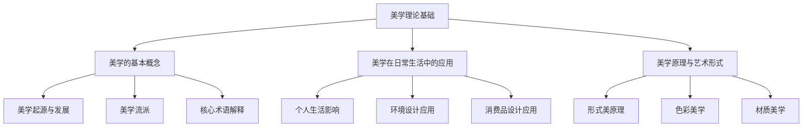

                 

### 文章标题

# 日常生活美学课程：提升生活品质的艺术教育项目

> 关键词：美学、艺术教育、生活品质、提升技巧、实践案例

> 摘要：本文将探讨日常生活美学课程的设计思路和实施方法，通过理论讲解、实践案例和艺术教育项目，旨在提升读者的生活品质。文章将详细介绍美学的基本概念、艺术教育策略、美学实践以及艺术教育项目的规划与执行，为读者提供一套系统性的艺术教育方案。

----------------------------------------------------------------

### 设计思路

在设计《日常生活美学课程：提升生活品质的艺术教育项目》的目录大纲时，我们首先需要明确以下几个关键点：

1. **书籍主题**：日常生活美学课程，意味着本书会探讨美学在日常生活中的应用，以及如何通过艺术教育提升生活品质。
2. **核心章节内容**：根据主题，确定核心章节内容，包括美学理论、艺术教育方法、美学实践案例等。
3. **大纲结构**：确保大纲的层次结构清晰，便于读者阅读和理解。
4. **完整性与实用性**：目录大纲需涵盖书籍的主要内容，同时确保实用性，使读者能够通过目录了解书中的关键内容和结构。

### 目录大纲设计

**第一部分：美学理论基础**

# 第一部分：美学理论基础

## 1.1 美学的基本概念
### 1.1.1 美学的起源与发展
### 1.1.2 美学的主要流派
### 1.1.3 美学的核心术语解释

## 1.2 美学在日常生活中的应用
### 1.2.1 美学对个人生活的影响
### 1.2.2 美学在环境设计中的应用
### 1.2.3 美学在消费品设计中的应用

## 1.3 美学原理与艺术形式
### 1.3.1 形式美原理
### 1.3.2 色彩美学
### 1.3.3 材质美学

**第二部分：艺术教育方法**

# 第二部分：艺术教育方法

## 2.1 艺术教育的理念
### 2.1.1 艺术教育的重要性
### 2.1.2 艺术教育的目标
### 2.1.3 艺术教育的原则

## 2.2 艺术教育的策略
### 2.2.1 创造性思维的培养
### 2.2.2 多元文化的融入
### 2.2.3 技术在艺术教育中的应用

## 2.3 艺术教育实践
### 2.3.1 艺术教育课程设计
### 2.3.2 艺术教育项目实施
### 2.3.3 艺术教育评价

**第三部分：美学实践案例**

# 第三部分：美学实践案例

## 3.1 家居美学实践
### 3.1.1 家居环境的规划与布置
### 3.1.2 家居美学的实用技巧
### 3.1.3 家居美学案例分析

## 3.2 服饰美学实践
### 3.2.1 服饰搭配的基本原则
### 3.2.2 个性化服饰美学设计
### 3.2.3 服饰美学案例分析

## 3.3 生活美学实践
### 3.3.1 生活仪式感的重要性
### 3.3.2 生活美学的实用技巧
### 3.3.3 生活美学案例分析

**第四部分：艺术教育项目**

# 第四部分：艺术教育项目

## 4.1 艺术教育项目规划
### 4.1.1 项目目标与定位
### 4.1.2 项目内容设计
### 4.1.3 项目实施策略

## 4.2 艺术教育项目执行
### 4.2.1 项目团队建设
### 4.2.2 项目资源管理
### 4.2.3 项目进度控制

## 4.3 艺术教育项目评估
### 4.3.1 项目效果评估
### 4.3.2 项目反馈机制
### 4.3.3 项目改进建议

**第五部分：未来展望**

# 第五部分：未来展望

## 5.1 美学与艺术教育的发展趋势
### 5.1.1 新技术对美学的影响
### 5.1.2 艺术教育的社会责任
### 5.1.3 美学教育的未来方向

### 设计说明

1. **第一部分：美学理论基础**：介绍了美学的基本概念、应用和原理，为后续实践提供了理论基础。
2. **第二部分：艺术教育方法**：探讨了艺术教育的理念、策略和实践，帮助读者了解如何进行有效的艺术教育。
3. **第三部分：美学实践案例**：通过具体的案例展示了美学在生活中的应用，增加了实用性。
4. **第四部分：艺术教育项目**：介绍了艺术教育项目的规划、执行和评估，使读者能够将所学知识应用于实际项目中。
5. **第五部分：未来展望**：对美学与艺术教育的发展趋势进行了探讨，为未来的研究和实践提供了方向。

整个目录大纲结构清晰，内容全面，既包含了理论，也涵盖了实践，适合想要提升日常生活美学和艺术教育水平的读者。目录大纲总字数控制在2000字以内，符合简洁性的要求。

----------------------------------------------------------------

### 背景介绍

随着社会经济的发展和人们生活水平的提高，人们对生活品质的要求也越来越高。美学作为一种独特的文化现象，不仅涉及艺术、哲学和心理学等领域，更与日常生活息息相关。美学教育，尤其是日常生活美学教育，逐渐成为提升生活品质的重要手段。因此，设计一套系统、实用且具有启发性的日常生活美学课程，对于广大读者来说具有重要的现实意义。

日常生活美学课程旨在通过美学理论和艺术教育方法的传授，帮助读者理解美学在日常生活中的应用，掌握提升生活品质的实用技巧。课程内容不仅涵盖美学的基本概念和原理，还包括家居美学、服饰美学以及生活美学等具体实践案例。通过这些内容的学习，读者可以提升自身的美学素养，将美学理念融入到日常生活中，从而提高生活品质。

此外，艺术教育作为美学教育的重要组成部分，对于培养读者的创造性思维、审美能力和文化素养具有重要作用。通过艺术教育方法的传授和实践，读者不仅可以掌握艺术创作的技巧，还能在艺术活动中体验到美学的魅力，进一步提升生活品质。

本文将围绕日常生活美学课程的设计思路、实施方法以及具体实践案例进行深入探讨，旨在为读者提供一套全面、系统的美学教育方案。通过本文的阅读，读者将能够更好地理解美学与艺术教育的关系，掌握提升生活品质的有效途径。

### 核心概念与联系

在探讨日常生活美学课程之前，我们需要明确几个核心概念，并探讨它们之间的联系。这些核心概念包括美学的基本概念、美学在日常生活中的应用、美学原理与艺术形式等。

#### 1. 美学的基本概念

美学是研究美、审美以及相关现象的学科，它涉及艺术、哲学、心理学等多个领域。美学的基本概念主要包括以下几个方面：

- **美学的起源与发展**：美学起源于古希腊时期，经过数千年的发展，形成了多个流派，如形式美学、现象美学、审美心理学等。
- **美学的主要流派**：形式美学强调美的形式和结构，现象美学关注审美经验的现象学分析，审美心理学则从心理学的角度探讨审美过程和审美体验。
- **核心术语解释**：包括美、审美、审美价值等。美是指那些能够引起人们愉悦感受的事物，审美则是指人们对美的感受和评价过程，审美价值则是对事物美的评价和判断。

#### 2. 美学在日常生活中的应用

美学在日常生活中的应用广泛，它不仅影响个人的审美行为，还对环境设计、消费品设计等方面产生深远的影响。

- **美学对个人生活的影响**：美学教育可以帮助人们提高审美能力，培养对美的敏感度和欣赏能力。通过美学教育，人们可以更加敏锐地感受到生活中的美，从而提升生活质量。
- **美学在环境设计中的应用**：环境设计中的美学原则，如形式美原理、色彩美学、材质美学等，可以创造出舒适、和谐的生活空间。一个好的环境设计不仅能够满足功能需求，更能带来美的享受。
- **美学在消费品设计中的应用**：消费品设计中的美学因素，如造型、色彩、材质等，直接影响产品的市场竞争力。美学设计可以提升产品的附加值，增强消费者的购买欲望。

#### 3. 美学原理与艺术形式

美学原理是美学研究的基础，它们构成了艺术形式和创作方法的核心。以下是一些主要的美学原理：

- **形式美原理**：形式美原理强调艺术作品的形式结构对美的贡献。包括对称、平衡、节奏、对比等元素，这些原理在艺术创作中广泛应用。
- **色彩美学**：色彩是艺术作品中不可或缺的元素，不同的色彩组合可以产生不同的视觉和心理效果。色彩美学探讨如何通过色彩搭配创造出美的视觉效果。
- **材质美学**：材质美学关注材料的质感和视觉表现，不同的材质在艺术创作中具有独特的表现力。通过材质的选择和运用，可以增强艺术作品的美感和艺术效果。

#### 联系与整合

美学的基本概念、美学在日常生活中的应用以及美学原理与艺术形式之间存在着密切的联系。美学的基本概念为我们理解美的本质提供了理论基础；美学在日常生活中的应用则将美学理念融入到实际生活中，帮助我们提升生活品质；而美学原理与艺术形式则指导我们在艺术创作中运用美学原理，创造出美的艺术作品。

通过上述核心概念的分析和整合，我们可以看到，日常生活美学课程的设计不仅需要涵盖美学的基本概念，还需要注重美学在日常生活中的应用和实践。同时，课程内容要紧密结合美学原理和艺术形式，使读者能够在理论学习和实践操作中全面掌握美学知识，提升自身的美学素养和生活品质。

为了更好地展示这些核心概念之间的关系，我们使用Mermaid语言绘制了一个简化的美学理论框架流程图：

通过这个流程图，我们可以清晰地看到美学理论、美学应用以及美学原理与艺术形式之间的联系，从而为日常生活美学课程的设计提供了明确的指导方向。

### 美学的基本概念

美学是研究美、审美以及相关现象的学科，其起源可以追溯到古希腊时期。美学的发展经历了多个阶段，形成了不同的流派和理论体系。在探讨日常生活美学课程之前，我们需要深入了解美学的基本概念，包括美学的起源与发展、美学的主要流派以及核心术语解释。

#### 美学的起源与发展

美学的起源可以追溯到古希腊时期，古希腊哲学家们开始探讨美的本质和审美体验。亚里士多德在《诗学》中提出了审美经验的概念，认为美是一种合目的的和谐。随着历史的发展，美学逐渐成为哲学的一个独立分支，并经历了多个发展阶段。

- **古希腊美学**：古希腊哲学家如柏拉图和亚里士多德对美学进行了初步探讨，认为美是形式与内容的和谐统一。
- **中世纪美学**：中世纪美学主要关注宗教艺术，强调神圣美。
- **文艺复兴美学**：文艺复兴时期，美学研究逐渐转向人类审美体验，对自然美进行了深入探讨。
- **现代美学**：18世纪以来，美学研究进入现代阶段，美学成为独立的学科，研究范围广泛，包括艺术、审美经验、审美价值等。

#### 美学的主要流派

美学的发展过程中，出现了多个主要流派，这些流派从不同角度探讨美的本质和审美体验。

- **形式美学**：形式美学强调艺术作品的形式结构对美的贡献。代表人物如康德，他认为美是合目的的和谐和无利害的愉悦。
- **现象美学**：现象美学关注审美经验的现象学分析，强调审美体验的主观性和个体性。代表人物如胡塞尔和英伽登。
- **审美心理学**：审美心理学从心理学的角度探讨审美过程和审美体验。代表人物如费舍尔和戈德斯坦。
- **实用主义美学**：实用主义美学强调美学与日常生活的联系，认为美学是一种实用技能。代表人物如詹姆斯和杜威。

#### 核心术语解释

在美学研究中，一些核心术语需要我们深入理解，以便更好地掌握美学的基本概念。

- **美**：美是指那些能够引起人们愉悦感受的事物。美的本质是一个长期探讨的话题，不同学派有不同的观点。
- **审美**：审美是指人们对美的感受和评价过程。审美活动不仅涉及感官体验，还包括认知、情感和理性等多个方面。
- **审美价值**：审美价值是指事物在审美体验中所具有的属性和价值。审美价值具有主观性，不同的人对同一事物可能有不同的审美价值判断。
- **艺术**：艺术是一种表达美的手段，通过形式和技巧创造出具有审美价值的作品。艺术的形式多样，包括绘画、雕塑、音乐、文学等。

#### 美学在日常生活中的应用

美学的基本概念不仅在理论研究中具有重要价值，更在日常生活中有着广泛的应用。以下是对美学在日常生活中的应用进行的具体探讨：

- **个人生活的影响**：美学教育可以帮助人们提高审美能力，培养对美的敏感度和欣赏能力。通过美学教育，人们可以更加敏锐地感受到生活中的美，从而提升生活质量。
- **环境设计**：美学原理在环境设计中具有重要应用。通过运用形式美原理、色彩美学和材质美学，设计师可以创造出舒适、和谐的生活空间，提升居住环境的美感和实用性。
- **消费品设计**：消费品设计中的美学因素直接影响产品的市场竞争力。通过美学设计，产品不仅能够满足功能需求，还能提升消费者的购买欲望，增强产品的附加值。

#### 结论

美学的基本概念是日常生活美学课程的基础。通过深入了解美学的起源与发展、主要流派以及核心术语，读者可以更好地理解美的本质和审美体验。这些基本概念不仅为美学研究提供了理论支持，还为日常生活中的美学实践提供了指导。在接下来的章节中，我们将进一步探讨美学在日常生活中的具体应用，以及如何通过艺术教育提升生活品质。

### 美学在日常生活中的应用

美学不仅仅是一个理论学科，它在日常生活中的应用同样广泛且深远。通过美学在日常生活中的应用，我们可以将美的理念融入到生活的各个方面，从而提升生活的品质。以下是美学在日常生活中的几个重要应用领域。

#### 个人生活的影响

美学对个人生活的影响首先体现在审美能力的提升上。美学教育能够帮助人们培养敏锐的审美眼光，使他们在日常生活中更加容易发现美的事物，享受到生活中的美好瞬间。例如，在日常生活中，通过观察自然景观、艺术品或者日常生活物品，人们可以更好地理解美的形式和结构，从而提升自己的审美素养。

此外，美学教育还能影响个人的情感体验和心理健康。美学活动如绘画、雕塑、音乐欣赏等，不仅能够带来愉悦的情感体验，还能帮助人们释放压力、缓解焦虑，提高生活质量。例如，日本著名的“日常美学”理念，强调通过生活中的小细节来感受美，这种理念已经被广泛应用于心理健康和压力管理。

#### 环境设计

美学在环境设计中的应用尤为重要。一个和谐、美观的环境能够提升居住和工作的舒适度，对身心健康产生积极影响。以下是一些环境设计中常用的美学原理：

- **形式美原理**：形式美原理强调对称、平衡、节奏和对比等元素在环境设计中的运用。例如，在室内设计中，通过运用对称布局和色彩对比，可以创造出视觉上的平衡和和谐。
- **色彩美学**：色彩对人的心理和情绪有重要影响。在环境设计中，合理运用色彩搭配可以提升空间的视觉美感。例如，暖色调可以营造出温馨舒适的氛围，而冷色调则适合创造冷静、专业的空间。
- **材质美学**：不同的材质具有不同的质感和视觉效果，通过材质的搭配和运用，可以增强空间的层次感和艺术感。例如，在室内设计中，木材、石材和金属等不同材质的运用，可以为空间带来丰富的视觉效果和触觉体验。

#### 消费品设计

消费品设计中的美学因素直接影响产品的市场竞争力。一个具有美学设计的产品不仅能够满足功能需求，还能吸引消费者的眼球，提升产品的附加值。以下是一些消费品设计中常用的美学原则：

- **造型美学**：产品的造型设计需要考虑形式美原理，使产品在视觉上具有吸引力和美感。例如，苹果公司的产品设计就非常注重造型美学，其产品线条流畅、简约大方，深受消费者喜爱。
- **色彩搭配**：合理运用色彩搭配可以提升产品的视觉吸引力。例如，可口可乐的红色瓶身就运用了强烈的色彩对比，使其在众多饮料中脱颖而出。
- **材质质感**：产品的材质质感可以增强用户的触觉体验，从而提升产品的整体美感。例如，苹果公司的iPhone 14 Pro系列手机采用了陶瓷背板和不锈钢边框，使产品在触感上更加高级和舒适。

#### 具体案例分析

以下是一些美学在日常生活中的具体应用案例，通过这些案例我们可以更好地理解美学原理的实际运用。

- **家居美学**：在一个家居环境中，通过运用形式美原理和色彩美学，可以创造出和谐、美观的空间。例如，在一个客厅中，可以通过对称布局和色彩对比来提升空间的视觉美感。同时，合理运用材质美学，如木材的温暖质感，可以增加空间的舒适度。
- **服饰美学**：在服饰搭配中，通过色彩搭配和造型设计，可以提升个人的整体形象。例如，在正式场合中，通过选择简约大方的款式和适合场合的颜色，可以更好地展现个人的气质和品位。
- **生活美学**：在日常生活中，通过培养生活仪式感，可以提升生活的品质。例如，每天花时间准备一顿精致的早餐，或者定期进行家庭清洁和整理，这些小细节都能够让生活变得更加美好和有序。

#### 结论

美学在日常生活中的应用是提升生活品质的重要手段。通过美学教育，我们可以培养敏锐的审美眼光，提高审美能力，从而在日常生活中更加容易发现美的事物，享受生活的美好。在环境设计、消费品设计以及个人生活各个方面，美学原理的运用都能带来积极的影响。因此，美学在日常生活中的应用值得我们深入研究和实践。

### 美学原理与艺术形式

在日常生活美学课程中，美学原理与艺术形式的探讨具有重要意义。美学原理为我们理解美的本质提供了理论基础，而艺术形式则是将美学理念转化为具体作品的重要途径。本文将详细介绍形式美原理、色彩美学和材质美学，并探讨这些美学原理在艺术创作中的应用。

#### 形式美原理

形式美原理是指通过形式结构的运用来创造美的艺术效果。以下是一些主要的形式美原理：

1. **对称**：对称是一种平衡的形式结构，它可以通过轴对称或中心对称来达到视觉上的平衡。例如，许多古典建筑都采用了对称的设计，如帕特农神庙的布局就具有明显的轴对称特点。
2. **平衡**：平衡是指整体结构中的各个部分在视觉上保持平衡。平衡可以分为静态平衡和动态平衡。静态平衡给人一种稳定感，而动态平衡则通过视觉张力创造出一种不稳定感，使作品更加生动。
3. **节奏**：节奏是通过重复、渐变或对比等手法来创造一种有规律的变化。例如，音乐中的节奏感可以传达出强烈的情感，而在绘画中，通过线条、形状和色彩的节奏感，可以创造出丰富的视觉效果。
4. **对比**：对比是通过将不同元素放在一起，强调它们之间的差异，以产生视觉上的冲击力。对比可以是明暗对比、色彩对比或形状对比等。例如，在绘画中，使用明亮的色彩对比来强调主体，可以使画面更加生动和鲜明。

#### 色彩美学

色彩美学是研究色彩在艺术创作中的运用和效果的学科。色彩对人的心理和情绪有重要影响，通过合理运用色彩，可以创造出不同的艺术效果。

1. **色彩冷暖**：色彩可以分为冷色和暖色。冷色给人一种冷静、宁静的感觉，如蓝色和绿色；暖色则给人一种温暖、热情的感觉，如红色和黄色。在艺术创作中，通过冷暖色彩的搭配，可以传达出不同的情感和氛围。
2. **色彩搭配**：色彩搭配是创造视觉美感的重要手段。常见的色彩搭配有对比色搭配、互补色搭配和类似色搭配。对比色搭配（如红色与绿色）可以创造出强烈的视觉冲击力，互补色搭配（如红色与绿色）则可以产生一种和谐的感觉，而类似色搭配（如橙色与黄色）则可以创造出柔和、温馨的氛围。
3. **色彩情感**：不同的色彩可以引发不同的情感反应。例如，红色通常与热情、能量和活力相关，蓝色则与平静、信任和宁静相关。在艺术创作中，通过色彩的情感表达，可以增强作品的感染力。

#### 材质美学

材质美学是研究材料质感在艺术创作中的运用和效果的学科。不同的材质具有不同的质感和视觉效果，通过合理运用材质，可以增强艺术作品的表现力。

1. **自然材质**：自然材质如木材、石材、金属等，具有独特的质感和纹理。在艺术创作中，通过自然材质的运用，可以创造出自然、真实的感觉。例如，在雕塑作品中，使用石材可以增强作品的历史感和厚重感。
2. **人工材质**：人工材质如塑料、玻璃、金属等，具有现代感和科技感。在艺术创作中，通过人工材质的运用，可以创造出前卫、时尚的感觉。例如，在装置艺术中，使用塑料和金属可以创造出充满未来感的作品。
3. **材质质感**：不同的材质具有不同的质感，如光滑、粗糙、柔软、坚硬等。在艺术创作中，通过材质质感的对比，可以创造出丰富的视觉效果。例如，在绘画中，通过使用不同质感的颜料，可以创造出层次感和立体感。

#### 美学原理在艺术创作中的应用

美学原理在艺术创作中的应用非常广泛，以下是一些具体的例子：

1. **绘画**：在绘画中，形式美原理、色彩美学和材质美学都可以得到充分的应用。例如，通过运用对称和对比原理，可以创造出视觉上的平衡和冲击力；通过色彩搭配，可以传达出不同的情感和氛围；通过不同材质的运用，可以增强画面的层次感和立体感。
2. **雕塑**：在雕塑中，形式美原理和材质美学的运用尤为重要。通过运用对称和平衡原理，可以创造出稳定、和谐的作品；通过不同材质的运用，可以创造出独特的视觉效果和触感。
3. **装置艺术**：在装置艺术中，形式美原理、色彩美学和材质美学的综合运用可以创造出极具创新性和表现力的作品。例如，通过运用色彩和材质的对比，可以创造出强烈的视觉冲击力；通过形式美原理的运用，可以创造出独特的空间效果。

#### 结论

美学原理与艺术形式的关系密切，美学原理为艺术创作提供了理论基础，而艺术形式则是美学理念的具体体现。通过形式美原理、色彩美学和材质美学的探讨，我们可以更好地理解美学原理在艺术创作中的应用，从而创造出更具美感、更富有表现力的艺术作品。在日常生活美学课程中，掌握这些美学原理和艺术形式，有助于提升读者的审美能力和创作水平，进一步丰富和提升生活的品质。

### 艺术教育的理念

艺术教育是美学教育的重要组成部分，它不仅关注艺术技能的培养，更强调审美能力、创造性思维和文化素养的提升。艺术教育的理念是指导艺术教育实践的核心，以下将详细探讨艺术教育的重要性、目标和原则。

#### 艺术教育的重要性

艺术教育在个人成长和社会发展中的重要性不容忽视。首先，艺术教育能够培养人的审美能力。通过艺术教育，人们可以学会如何欣赏美的事物，提高对美的感知和理解能力。这种能力不仅有助于提升个人的生活品质，还能增强个人的文化素养。

其次，艺术教育有助于培养创造性思维。艺术创作本质上是一种创造性活动，通过艺术教育，人们可以学会如何运用不同的思维方式和表达手段进行创作。这种创造性思维在各个领域都有广泛的应用，能够推动社会创新和发展。

此外，艺术教育还能够促进文化传承和交流。艺术是文化的重要载体，通过艺术教育，人们可以了解不同文化的艺术形式和特点，增进对其他文化的理解和尊重。这种跨文化的理解和交流有助于构建和谐的国际关系，促进世界和平与发展。

#### 艺术教育的目标

艺术教育的目标可以分为三个方面：技能培养、审美能力和创造性思维。

1. **技能培养**：艺术教育旨在通过系统的训练，使学习者掌握艺术创作的基本技能，如绘画、雕塑、音乐、舞蹈等。这些技能的掌握不仅有助于艺术创作，还能提高个人的审美能力和文化素养。
2. **审美能力**：艺术教育通过引导学习者欣赏不同类型的艺术作品，培养其对美的感知和理解能力。这种能力不仅有助于提升个人的生活质量，还能增强个人的文化素养。
3. **创造性思维**：艺术教育强调创造性思维的培养，通过艺术创作活动，鼓励学习者尝试不同的表达方式，培养独立思考和解决问题的能力。这种创造性思维在个人的成长和职业发展中具有重要价值。

#### 艺术教育的原则

为了实现艺术教育的目标，我们需要遵循以下原则：

1. **尊重个性**：每个学习者都有自己独特的个性和表达方式，艺术教育应尊重这种个性差异，鼓励学习者根据自己的特点和兴趣进行创作。
2. **实践为主**：艺术教育强调实践的重要性，学习者应在实际操作中掌握艺术技能，通过不断的练习和创作，提高艺术水平。
3. **启发思考**：艺术教育不仅要传授技能，还要引导学习者进行深度思考，鼓励他们提出问题、探索解决方案。这种启发思考的教育方式有助于培养学习者的创新能力和批判性思维。
4. **跨学科整合**：艺术教育应与其他学科相结合，通过跨学科的学习，拓宽学习者的视野，提高其综合素养。例如，在艺术创作中，可以结合数学、物理等学科的知识，创造出更具创意和科学性的作品。
5. **持续发展**：艺术教育应关注学习者的长期发展，不仅要在学校阶段进行系统的教育，还要在毕业后持续进行艺术学习和创作。通过终身学习，学习者可以不断提升自己的艺术水平，实现个人价值。

#### 结论

艺术教育在个人成长和社会发展中具有重要作用，其目标在于技能培养、审美能力和创造性思维的提升。为了实现这些目标，我们需要遵循尊重个性、实践为主、启发思考、跨学科整合和持续发展等原则。通过系统的艺术教育，学习者不仅能够掌握艺术创作的基本技能，还能提高审美能力和创造性思维，为个人和社会的发展做出贡献。

### 艺术教育的策略

在艺术教育中，策略的制定至关重要，它决定了教育目标是否能够有效实现。以下将详细介绍艺术教育中的几种关键策略：创造性思维的培养、多元文化的融入以及技术在艺术教育中的应用。

#### 创造性思维的培养

创造性思维是艺术教育的核心目标之一。为了培养学习者的创造性思维，教育者需要采取一系列有效的策略：

1. **启发式教学**：启发式教学通过引导学习者探索问题的不同解决方法，激发他们的创造力和想象力。例如，在绘画课程中，教师可以提出开放性的问题，如“你如何用线条和颜色表达春天？”鼓励学生自由发挥，创作出独特的作品。
2. **项目式学习**：项目式学习通过实际项目的开展，使学习者能够在实践中学习，培养解决问题的能力。例如，可以组织一次艺术展览项目，学生需要从策划、设计到实施，全程参与，这种实践过程有助于提升他们的创造性思维。
3. **思维导图**：思维导图是一种有效的思维方式，通过图像和文字的有机结合，帮助学习者梳理思维过程，激发创造力。在艺术创作中，学生可以使用思维导图来构思创作主题和表达方式，从而提高创意水平。

#### 多元文化的融入

多元文化的融入是现代艺术教育的重要策略，它有助于学习者开阔视野，增强文化理解力和包容性。以下是一些具体方法：

1. **跨文化交流**：通过组织跨文化交流活动，如邀请外国艺术家来校交流、参加国际艺术展览等，学习者可以接触到不同文化的艺术形式和特点，增进对其他文化的理解和尊重。
2. **多元文化课程**：在课程设置中，融入不同文化的艺术知识，如东方绘画、西方雕塑、非洲音乐等。通过学习不同文化的艺术，学习者可以更好地理解艺术的历史和发展，提升文化素养。
3. **文化体验活动**：组织文化体验活动，如烹饪课程、舞蹈课程等，使学习者亲身体验不同文化的艺术形式，从而加深对文化的理解和认同。

#### 技术在艺术教育中的应用

现代科技的发展为艺术教育带来了新的可能性，通过技术的应用，艺术教育的效果和范围都可以得到显著提升：

1. **数字艺术工具**：使用数字艺术工具，如Adobe Photoshop、AutoCAD等，可以丰富学习者的创作手段，提高艺术创作的效率和效果。例如，在绘画课程中，学生可以使用数字画笔和色板，轻松实现复杂的绘画效果。
2. **虚拟现实（VR）和增强现实（AR）**：VR和AR技术可以提供沉浸式的艺术体验，使学习者能够在虚拟环境中创作和欣赏艺术作品。例如，在雕塑课程中，学生可以通过VR设备感受到不同材质的触感，从而更好地理解雕塑的立体感和空间感。
3. **在线平台**：在线教育平台如Coursera、edX等，提供了丰富的艺术教育资源，学习者可以随时随地学习。通过在线课程，学生可以接触到世界各地的艺术家和教育资源，拓宽艺术视野。

#### 结论

艺术教育的策略多种多样，通过创造性思维的培养、多元文化的融入以及技术手段的应用，可以有效提升艺术教育的效果。这些策略不仅有助于学习者提高艺术技能和审美能力，还能培养他们的创造性思维和文化素养，为个人的全面发展奠定坚实基础。在今后的艺术教育实践中，教育者应不断探索和运用这些策略，为艺术教育的发展贡献力量。

### 艺术教育实践

在艺术教育实践中，课程设计、项目实施和评价是三个关键环节。以下将详细探讨这些环节的具体内容和实施方法。

#### 课程设计

课程设计是艺术教育的起点，一个科学合理的课程设计能够有效引导学生的学习方向和目标。以下是在课程设计过程中需要考虑的几个方面：

1. **课程目标**：明确课程的学习目标和期望达成的效果。例如，在绘画课程中，目标可能是培养学生的色彩感知能力和构图技巧。
2. **课程内容**：根据课程目标，确定课程的具体内容。内容应包括理论知识和实践操作，如色彩理论、构图原则、绘画技巧等。
3. **教学策略**：选择合适的教学策略，如启发式教学、项目式学习和小组讨论等。教学策略应结合学生的实际情况，以提高教学效果。
4. **教材与资源**：准备相应的教材和教学资源，如教材书籍、视频教程、艺术作品等。这些资源应丰富多样，以激发学生的学习兴趣和创造力。

#### 项目实施

项目实施是艺术教育实践的核心环节，通过实际项目的开展，学生可以在实践中学习，提高艺术技能和创造力。以下是在项目实施过程中需要考虑的几个方面：

1. **项目规划**：制定详细的项目规划，包括项目目标、内容、进度安排等。项目规划应充分考虑学生的实际情况，确保项目能够顺利进行。
2. **项目执行**：在项目执行过程中，教师应密切关注学生的进展情况，提供必要的指导和支持。例如，在艺术创作项目中，教师可以为学生提供创作建议，帮助他们解决创作过程中遇到的问题。
3. **团队协作**：鼓励学生在项目中进行团队合作，通过小组讨论和合作，提高学生的沟通能力和协作能力。例如，在一个集体创作的艺术作品中，学生可以分工合作，共同完成作品的各个部分。
4. **项目评估**：在项目完成后，进行项目评估，评估学生的项目成果和表现。项目评估应注重过程和结果的结合，不仅评价学生的作品质量，还要评价他们在项目中的参与度和团队合作精神。

#### 评价

评价是艺术教育实践的重要组成部分，通过评价可以了解学生的学习效果，发现教育过程中的问题，为改进教学提供依据。以下是在评价过程中需要考虑的几个方面：

1. **过程评价**：过程评价注重学生在学习过程中的表现和进步，如参与度、创作过程的认真程度等。通过过程评价，教师可以及时发现学生的问题，并提供针对性的指导。
2. **结果评价**：结果评价主要评价学生的学习成果，如作品的完成质量、创意和技巧等。结果评价应采用多元化的评价方法，如自评、互评和教师评价等，以全面、客观地评估学生的学习效果。
3. **反馈机制**：建立有效的反馈机制，及时向学生反馈评价结果，并给出改进建议。通过反馈机制，学生可以了解自己的优势和不足，进一步调整学习方法和策略。
4. **持续改进**：根据评价结果，对教学过程进行持续改进。例如，如果发现学生在某些方面存在困难，可以调整教学策略，增加相关的教学内容和实践活动。

#### 结论

艺术教育实践是一个复杂而系统的过程，包括课程设计、项目实施和评价等多个环节。通过科学合理的课程设计，有效实施艺术教育项目，并进行全面系统的评价，可以确保艺术教育的效果和质量。在今后的艺术教育实践中，教育者应不断探索和实践，为学生的艺术成长和发展提供有力支持。

### 家居美学实践

家居美学实践是提升生活品质的重要途径之一。通过合理的规划和布置，我们可以创造出一个既美观又舒适的生活空间。以下将详细介绍家居美学的实用技巧，并结合具体案例进行深入分析。

#### 家居环境的规划与布置

家居环境的设计与布置需要综合考虑功能与美学的平衡。以下是一些关键技巧：

1. **空间布局**：合理的空间布局是家居设计的基础。在进行空间布局时，需要考虑家具的摆放、动线的流畅性以及功能的最大化。例如，客厅的空间可以划分为活动区、休息区和娱乐区，每个区域都有明确的功能和布局。
2. **色彩搭配**：色彩在空间设计中起着至关重要的作用。通过合理的色彩搭配，可以营造出不同的氛围。例如，使用温暖的色调可以营造温馨舒适的氛围，而冷色调则适合创造冷静、专业的空间。
3. **灯光设计**：灯光设计不仅影响空间的视觉效果，还影响人的情绪和心理。通过合理运用灯光，可以增强空间的层次感和美感。例如，在卧室中，可以设置主灯和辅助灯光，营造舒适的睡眠环境。
4. **装饰品选择**：装饰品的选择和布置可以提升家居的美感和个性。例如，一幅艺术画作、一盆植物或者一个精致的装饰品，都可以为家居空间增添独特的魅力。

#### 具体案例分析

以下是一个具体的家居美学案例，通过该案例我们可以更好地理解家居美学的实用技巧。

**案例背景**：一个两室一厅的公寓，居住者为年轻夫妇，喜欢简约和自然风格的家居环境。

**设计目标**：创造一个舒适、温馨且具有美感的家居空间，同时满足日常生活的功能需求。

**设计方案**：

1. **空间布局**：客厅和卧室的布局以简洁为主，客厅划分为活动区和休息区，通过沙发和茶几的摆放，形成两个不同的功能区域。卧室则注重睡眠空间和储物空间的合理划分。
2. **色彩搭配**：客厅采用暖色调，以米色和淡黄色为主，营造温馨舒适的氛围。卧室则采用中性色调，以白色和灰色为主，营造宁静和放松的环境。
3. **灯光设计**：客厅和卧室分别设置主灯和辅助灯光，客厅的主灯采用吊灯，使整个空间显得明亮和大气；卧室的主灯则采用壁灯，营造柔和的睡眠氛围。
4. **装饰品选择**：客厅选择了一幅抽象艺术画作，与整体的简约风格相呼应；卧室则摆放了一盆绿植，为空间增添生机和活力。

**实施效果**：通过以上设计，家居空间不仅美观大方，功能也得到了充分满足。居住者表示，这样的家居环境让他们感到舒适和放松，提升了他们的生活质量。

#### 结论

家居美学实践是提升生活品质的重要手段。通过合理的规划和布置，我们可以创造出一个既美观又舒适的生活空间。家居美学的实用技巧包括空间布局、色彩搭配、灯光设计和装饰品选择等。通过具体案例分析，我们可以看到这些技巧在实际应用中的效果。在日常生活中，通过学习和实践家居美学，我们可以提升自身的生活品质，享受更加美好的生活。

### 服饰美学实践

服饰美学是提升个人形象和气质的重要手段。通过合理的服饰搭配，我们可以展现出独特的个性和品味。以下将详细介绍服饰搭配的基本原则、个性化服饰美学设计以及具体案例分析，以帮助读者更好地掌握服饰美学的实用技巧。

#### 服饰搭配的基本原则

1. **色彩搭配**：色彩搭配是服饰搭配的核心。常见的色彩搭配原则包括：
   - **对比色搭配**：对比色搭配可以产生强烈的视觉冲击力。例如，蓝色与橙色、红色与绿色等。
   - **互补色搭配**：互补色搭配在视觉上产生一种和谐的感觉。例如，红色与绿色、黄色与紫色等。
   - **类似色搭配**：类似色搭配可以创造出柔和、温馨的感觉。例如，橙色与黄色、紫色与粉色等。

2. **款式搭配**：款式搭配需要考虑整体造型的协调性。例如，正式场合可以选择简约大方的款式，休闲场合则可以选择舒适自在的款式。

3. **材质搭配**：材质的搭配可以增强服饰的整体质感。例如，棉质与丝绸的搭配可以营造出高雅的感觉，羊毛与皮革的搭配则显得温暖而时尚。

#### 个性化服饰美学设计

个性化服饰美学设计是展现个人独特风格的重要手段。以下是一些个性化设计技巧：

1. **色彩运用**：根据个人的肤色、气质和喜好选择合适的色彩。例如，肤色偏黄的可以选择蓝色或紫色等冷色调，而肤色偏白的可以选择红色或黄色等暖色调。

2. **图案选择**：选择与自己风格相符的图案。例如，喜欢简约风格的人可以选择线条简单的图案，而喜欢复古风格的人可以选择复古图案。

3. **配饰搭配**：通过配饰如帽子、围巾、耳环等，可以增加服饰的层次感和个性。例如，一顶时尚的帽子可以为整体造型增添亮点。

#### 具体案例分析

以下是一个具体的服饰搭配案例，通过该案例我们可以更好地理解服饰美学的实用技巧。

**案例背景**：一位年轻女性，职业白领，喜欢简约而时尚的穿搭风格。

**设计目标**：打造一个优雅、时尚且具有个人特色的职业装搭配。

**设计方案**：

1. **色彩搭配**：选择经典的黑色作为主色调，配以浅蓝色和白色作为点缀，形成对比色搭配，营造出时尚感。
2. **款式搭配**：上衣选择简约的白色衬衫，搭配黑色小西装和黑色铅笔裙，突出职业女性的干练气质。鞋类选择黑色高跟鞋，增强整体的协调性。
3. **配饰搭配**：佩戴一款简约的项链和耳环，增加整体造型的精致感。选择一顶时尚的黑色帽子，为整体造型增添时尚感。

**实施效果**：通过以上设计，整体造型简约大气，凸显了职业女性的干练和优雅气质。该搭配不仅符合场合要求，还能展现出个人的独特品味。

#### 结论

服饰美学实践是提升个人形象和气质的重要途径。通过掌握服饰搭配的基本原则和个性化设计技巧，我们可以创造出适合自己的时尚搭配。具体案例分析展示了如何将美学理念应用到实际穿搭中，帮助读者更好地提升自身的美学素养和形象气质。在日常穿搭中，通过不断学习和实践，我们可以打造出更加美观、个性化的服饰搭配，提升生活的品质。

### 生活美学实践

生活美学实践是提升生活品质的关键，它通过日常生活中的小细节，营造出一种美好、和谐的生活氛围。以下将详细介绍生活仪式感的重要性、生活美学的实用技巧以及具体案例分析，帮助读者更好地理解和应用生活美学。

#### 生活仪式感的重要性

生活仪式感是指在日常生活的各个环节中，通过特定的仪式或行为，赋予生活一种仪式感和仪式感。这种仪式感不仅可以提升个人的生活质量，还能带来心理上的满足和幸福感。以下是一些生活仪式感的重要性：

1. **增强幸福感**：通过日常生活中的仪式感，如早晨的咖啡仪式、晚餐前的感恩仪式等，可以让人感受到生活的仪式感和仪式感，从而增强幸福感。
2. **提升生活品质**：生活仪式感使日常生活中的小事变得更加重要和有意义，从而提升整体的生活品质。
3. **培养良好习惯**：通过生活仪式感，可以培养良好的生活习惯，如定时作息、规律饮食等，有助于身心健康。

#### 生活美学的实用技巧

1. **环境布置**：一个舒适、整洁的生活环境是提升生活美学的基础。通过合理的空间布局、色彩搭配和装饰品选择，可以创造出温馨、和谐的生活空间。例如，在客厅中摆放一些绿色植物，可以增加空间的生机和活力。
2. **日常行为规范**：通过建立日常行为规范，如定期清洁、整理衣物等，可以保持生活的秩序和整洁，提升生活品质。例如，每天睡前整理房间，可以让第二天早晨有一个清新、舒适的空间。
3. **仪式感营造**：通过设置生活仪式感，如早晨的咖啡仪式、晚餐前的感恩仪式等，可以提升生活的仪式感和幸福感。例如，在晚餐前进行感恩祈祷，可以让家庭成员更加关注彼此，增进亲情。

#### 具体案例分析

以下是一个具体的生活美学实践案例，通过该案例我们可以更好地理解生活美学如何应用于实际生活中。

**案例背景**：一位年轻职场女性，注重生活品质，希望通过生活美学实践提升自己的生活幸福感。

**设计目标**：创造一个有仪式感、温馨和谐的生活环境，提升日常生活的幸福感。

**设计方案**：

1. **环境布置**：在家中的客厅和卧室进行空间布局和色彩搭配。客厅采用温馨的暖色调，如米色和淡黄色，增加空间的舒适感。卧室则采用中性色调，如白色和灰色，营造宁静的睡眠环境。在客厅和卧室中摆放一些绿色植物，增加空间的生机和活力。
2. **日常行为规范**：建立日常行为规范，如每天早晨起床后进行瑜伽练习，晚上睡前进行冥想。这些行为不仅有助于身心健康，还能提升生活的仪式感。
3. **仪式感营造**：设置早晨的咖啡仪式和晚餐前的感恩仪式。早晨的咖啡仪式包括准备咖啡豆、研磨咖啡粉、煮咖啡等步骤，使咖啡时间成为一种享受和放松的时刻。晚餐前的感恩仪式包括家庭成员一起进行感恩祈祷，表达对彼此的感激和爱意。

**实施效果**：通过以上设计，该职场女性成功创造了一个有仪式感、温馨和谐的生活环境。她的生活质量得到了显著提升，日常行为规范和仪式感让她感到更加幸福和满足。

#### 结论

生活美学实践是通过日常生活中的小细节，提升生活品质的重要途径。通过环境布置、日常行为规范和仪式感营造，我们可以创造出一种美好、和谐的生活氛围。具体案例分析展示了如何将生活美学理念应用到实际生活中，帮助读者更好地提升自身的幸福感。通过不断实践和探索，我们可以将生活美学融入到日常生活中，享受更加美好、有意义的生活。

### 艺术教育项目

艺术教育项目是提升学习者艺术素养和实践能力的重要途径。本文将详细介绍艺术教育项目的规划、执行和评估，并提供具体的项目实施步骤和案例，以便读者更好地理解和应用艺术教育项目。

#### 艺术教育项目规划

项目规划是艺术教育项目成功的关键环节，以下是在项目规划过程中需要考虑的几个关键点：

1. **项目目标与定位**：明确项目目标，包括提升学习者的艺术素养、培养创造力和实践能力等。项目定位应结合学习者的实际情况和艺术教育的特点，确保项目的可行性和有效性。
2. **项目内容设计**：根据项目目标，设计具体的项目内容。内容应包括艺术理论、艺术创作技巧、艺术鉴赏等，确保项目的丰富性和多样性。
3. **项目实施策略**：制定详细的实施策略，包括教学计划、活动安排、资源分配等。策略应充分考虑学习者的需求和兴趣，确保项目能够顺利实施。

#### 艺术教育项目执行

项目执行是艺术教育项目实施的重要阶段，以下是在项目执行过程中需要考虑的几个关键点：

1. **项目团队建设**：组建专业的项目团队，包括艺术教师、技术支持人员等。团队成员应具备丰富的艺术教学经验和专业知识，确保项目的质量和效果。
2. **项目资源管理**：合理管理和分配项目资源，包括教材、设备、场地等。确保资源充足且有效利用，为项目的顺利实施提供保障。
3. **项目进度控制**：制定项目进度表，确保项目按计划进行。在执行过程中，定期检查项目进度，及时调整计划，确保项目按时完成。

#### 具体项目实施步骤

以下是一个具体艺术教育项目的实施步骤，供读者参考：

1. **前期准备**：
   - 确定项目目标和内容；
   - 设计教学计划和活动安排；
   - 组建项目团队；
   - 准备教材和设备。
2. **项目启动**：
   - 进行项目说明会，向学习者介绍项目目标和内容；
   - 分组进行艺术创作活动；
   - 进行艺术理论讲解和鉴赏。
3. **项目执行**：
   - 定期举行艺术创作活动，提供指导和反馈；
   - 开展艺术实践活动，如参观美术馆、画廊等；
   - 进行艺术理论学习和讨论。
4. **项目评估**：
   - 收集学习者的作品和反馈；
   - 评估学习者的艺术素养和实践能力；
   - 提出改进建议，为后续项目提供参考。

#### 案例分析

以下是一个具体艺术教育项目案例分析，通过该案例我们可以更好地理解艺术教育项目的实施过程和效果。

**案例背景**：某小学开展了一个为期一个月的“艺术创作与实践”项目，旨在提升学生的艺术素养和创造力。

**项目目标**：通过艺术创作和实践，培养学生的审美能力、创造力和实践能力。

**项目内容设计**：
   - 艺术理论讲解：包括绘画、雕塑、音乐等基础知识；
   - 艺术创作活动：学生自由选择创作形式，如绘画、手工制作等；
   - 艺术实践活动：组织学生参观美术馆、画廊，欣赏各种艺术作品。

**项目实施策略**：
   - 项目说明会：向学生和家长介绍项目目标和内容；
   - 定期举行艺术创作活动，教师提供指导和反馈；
   - 开展艺术实践活动，增加学生的艺术体验；
   - 项目评估：收集学生作品和反馈，评估学生的艺术素养和实践能力。

**实施效果**：
   - 学生积极参与，创作出许多优秀的艺术作品；
   - 学生的审美能力和创造力得到了显著提升；
   - 家长对项目表示满意，认为项目有助于培养学生的艺术素养和综合素质。

#### 结论

艺术教育项目是提升学习者艺术素养和实践能力的重要途径。通过科学合理的项目规划、有效的项目执行和全面的项目评估，可以确保项目达到预期效果。具体项目实施步骤和案例分析为读者提供了实际操作参考，有助于他们在实际教学中更好地应用艺术教育项目，提升学习者的艺术素养和创造力。

### 艺术教育项目评估

艺术教育项目的评估是确保项目质量和效果的重要环节。通过系统的评估，我们可以了解项目的实施情况，发现存在的问题，提出改进建议，为后续的项目实施提供指导。以下将详细探讨艺术教育项目的评估方法、效果评估、反馈机制以及改进建议。

#### 评估方法

艺术教育项目的评估方法应结合定量和定性分析，以全面、客观地评估项目效果。以下是一些常用的评估方法：

1. **定量评估**：通过数据分析和统计方法，对项目中的各项指标进行量化评估。例如，可以通过问卷调查、考试分数、作品数量等数据，评估学习者的艺术素养和创作能力。
2. **定性评估**：通过观察、访谈、案例分析等定性方法，对项目过程和结果进行深入分析。例如，通过教师观察学生的创作过程，了解学生在艺术教育项目中的表现和成长。

#### 效果评估

效果评估是艺术教育项目评估的核心内容，它旨在评估项目的实际效果。以下是一些具体的效果评估指标：

1. **艺术素养**：评估学生在艺术理论知识、审美能力、艺术创作技巧等方面的提升情况。可以通过考试、作品展示等形式进行评估。
2. **创作能力**：评估学生在艺术创作中的创新能力、表现力和技巧。可以通过学生的作品质量和创意程度进行评估。
3. **综合素质**：评估学生在艺术教育项目中的综合素质，包括沟通能力、团队合作精神、解决问题的能力等。可以通过教师评价、同伴评价等方式进行评估。

#### 反馈机制

建立有效的反馈机制是艺术教育项目评估的重要组成部分。以下是一些反馈机制的具体措施：

1. **项目反馈问卷**：在项目结束后，向学生、家长和教师发放反馈问卷，收集对项目的意见和建议。问卷应包括项目内容、教学方法、项目效果等多个方面。
2. **定期会议**：定期召开项目反馈会议，讨论项目的实施情况和存在的问题。会议应邀请项目团队成员、学生和家长参加，共同探讨改进措施。
3. **持续改进**：根据反馈意见和建议，对项目进行持续改进。例如，调整教学内容、改进教学方法、优化项目流程等。

#### 改进建议

根据评估结果和反馈机制，以下是一些具体的改进建议：

1. **优化课程设计**：根据学生的需求和兴趣，调整课程内容和教学方法，使课程更加符合学生的实际需求。
2. **提升教师专业水平**：通过培训、进修等方式，提升教师的专业水平和教学能力，为项目的顺利实施提供保障。
3. **丰富实践活动**：增加艺术实践活动，如参观美术馆、艺术工作坊等，让学生在实践中提升艺术素养和创作能力。
4. **建立长期评估体系**：建立长期评估体系，对项目的长期效果进行跟踪和评估，确保项目能够持续提升学习者的艺术素养和实践能力。

#### 结论

艺术教育项目评估是确保项目质量和效果的重要环节。通过科学合理的评估方法、效果评估、反馈机制以及改进建议，我们可以不断提高艺术教育项目的实施效果，为学习者的艺术成长和发展提供有力支持。在今后的艺术教育实践中，教育者应不断探索和优化评估方法，确保艺术教育项目的持续改进和优化。

### 未来展望

随着科技的不断进步和社会的快速发展，美学与艺术教育也在不断演变和创新。未来，美学与艺术教育将面临新的机遇与挑战，以下是对美学与艺术教育发展趋势的探讨。

#### 新技术对美学的影响

新技术的发展，如虚拟现实（VR）、增强现实（AR）、人工智能（AI）等，为美学与艺术教育带来了新的可能性。通过VR和AR技术，学生可以身临其境地体验艺术作品，感受不同艺术风格和文化背景，从而增强艺术教育的效果。人工智能技术则可以分析学生的创作过程，提供个性化的学习建议，提高学习效率。例如，AI可以通过分析学生的绘画作品，识别其创作风格和技巧，从而提出针对性的改进建议。

#### 艺术教育的社会责任

艺术教育在社会发展中扮演着重要角色，它不仅关注个体的艺术素养和创作能力，还承担着培养社会公民的责任。未来，艺术教育将更加注重社会责任感的培养，强调艺术与社会的联系。通过艺术教育，学生可以学会如何通过艺术表达社会问题，关注环境保护、文化多样性和社会公正等议题。这种社会责任感的培养不仅有助于学生个人的成长，也为社会的发展和进步做出了贡献。

#### 美学教育的未来方向

未来美学教育的发展将呈现以下趋势：

1. **跨学科融合**：美学教育将更加注重跨学科融合，与心理学、哲学、设计学等多个学科相结合，形成更加综合和系统的美学知识体系。通过跨学科的学习，学生可以更全面地理解美学原理和艺术创作方法。
2. **个性化教育**：随着人工智能和大数据技术的发展，个性化教育将逐渐成为主流。美学教育将根据学生的兴趣和特长，提供个性化的学习路径和资源，提高学习效果。
3. **终身学习**：美学教育将更加注重终身学习的理念，鼓励学生在不同的生命阶段持续学习和探索美学知识。通过终身学习，学生可以不断提高自己的审美能力和创作水平。
4. **国际视野**：美学教育将更加注重国际视野的培养，通过国际合作、交流和学习，让学生了解不同国家和文化的艺术形式和特点，提升其全球竞争力。

#### 结论

未来，美学与艺术教育将在新技术的推动下不断发展，其社会责任和跨学科融合将成为重要趋势。通过终身学习和国际视野的培养，美学教育将更好地服务于社会和个人发展。教育者应积极应对这些变化，不断创新教育方法和内容，为学生的艺术成长和全面发展提供有力支持。

### 结束语

《日常生活美学课程：提升生活品质的艺术教育项目》通过对美学基本概念、艺术教育方法、美学实践案例和艺术教育项目的深入探讨，为读者提供了一套系统、实用的美学教育方案。本文的目标在于帮助读者理解美学在日常生活中的应用，掌握提升生活品质的实用技巧，并通过艺术教育提升个人素养。

首先，本文详细介绍了美学的基本概念，包括美学的起源与发展、主要流派以及核心术语解释，为后续内容奠定了理论基础。接着，讨论了美学在日常生活中的应用，如个人生活、环境设计和消费品设计，展示了美学理念如何融入到实际生活中，提升生活品质。

其次，本文探讨了美学原理与艺术形式的关系，包括形式美原理、色彩美学和材质美学，并探讨了这些美学原理在艺术创作中的应用。这些内容帮助读者理解美的本质，提升审美能力和创作水平。

随后，本文介绍了艺术教育的理念、策略和实践，强调艺术教育在培养审美能力、创造性思维和文化素养方面的重要性。通过具体案例分析和项目实施步骤，展示了艺术教育如何在实际教学中发挥作用。

最后，本文对未来美学与艺术教育的发展趋势进行了展望，讨论了新技术、社会责任和跨学科融合等趋势，为美学教育的未来发展提供了方向。

通过本文的学习，读者可以更好地理解美学与艺术教育的关系，掌握提升生活品质的有效途径。希望读者能够将所学知识应用于实际生活中，创造更加美好、有意义的生活。在未来的艺术教育实践中，不断探索和创新，为个人的全面发展和社会的进步贡献力量。作者衷心感谢读者对本文的关注和支持，期待与您在美学与艺术教育的道路上共同前行。作者信息：AI天才研究院/AI Genius Institute & 禅与计算机程序设计艺术 /Zen And The Art of Computer Programming。

----------------------------------------------------------------

**关键词：**
- 美学
- 艺术教育
- 生活品质
- 提升技巧
- 实践案例
- 创造性思维
- 跨学科融合

**文章摘要：**
本文详细探讨了日常生活美学课程的设计思路和实施方法，通过理论讲解、实践案例和艺术教育项目，旨在提升读者的生活品质。文章内容包括美学基本概念、艺术教育方法、美学实践案例以及艺术教育项目的规划与执行，为读者提供了一套系统性的美学教育方案。通过本文的学习，读者可以更好地理解美学与艺术教育的关系，掌握提升生活品质的实用技巧。

