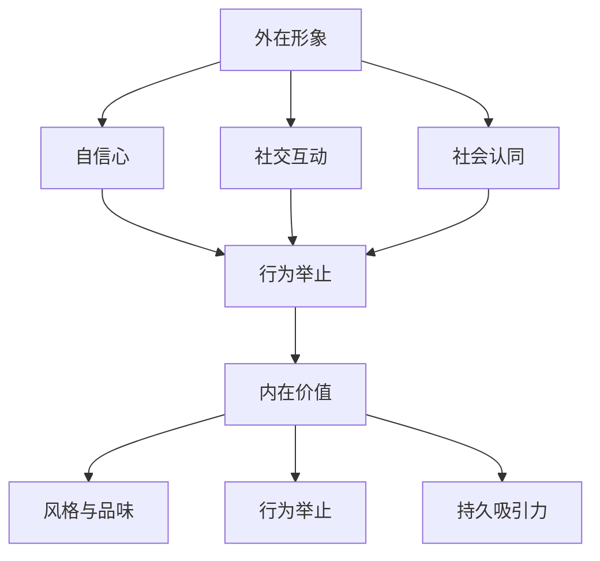

                 

### 第1章 引言

#### 1.1 书籍目的与意义

**时尚与自我表达：外在形象与内在价值的统一** 这本书旨在探讨时尚领域如何与个人自我表达相结合，并强调外在形象与内在价值的统一。随着社会的发展和人们对个人形象的重视，时尚已经成为人们表达自我、展示个性的一种方式。然而，时尚并不仅仅是关于潮流和流行，更是一种文化、一种态度，甚至是一种生活方式。因此，如何通过外在形象来体现个人的内在价值，成为了一个值得深入研究的话题。

本书的目的在于帮助读者理解时尚与自我表达之间的关系，并提供实用的指导和建议，帮助读者通过外在形象更好地表达自己的内在价值。具体来说，本书将涵盖以下几个方面：

1. **时尚概述**：介绍时尚的定义、发展历史、分类以及时尚与社会文化的关系。
2. **外在形象设计**：讨论如何通过服饰、妆容、发型等外在元素来表达自我，包括搭配技巧、设计原则等。
3. **内在价值培养**：探讨如何通过提升个人素质、心理健康等内在因素来实现自我表达，如社交能力、专业知识等。
4. **形象与价值统一**：分析外在形象与内在价值的相互关系，并提出统一的方法和实践策略。
5. **案例研究**：通过具体案例展示如何将时尚与自我表达相结合。
6. **实践指导**：提供实用的建议和方法，帮助读者将所学应用到实际生活中。

#### 1.1.1 时尚的定义与历史

时尚（Fashion）通常指的是在一定社会文化背景下，人们对于服饰、饰品、妆容、发型等的审美观念和潮流趋势。时尚不仅是物质层面的装饰，更是一种精神文化现象，它反映了社会的审美趋势、价值观念以及生活方式。

**历史发展**：

- **中世纪**：时尚开始萌芽，人们开始注重个人形象和装饰。
- **文艺复兴**：时尚进入快速发展阶段，服饰和配饰成为表达个人身份和地位的重要手段。
- **18世纪**：时尚成为一种文化现象，社会阶层和地位的差异开始通过服饰得到明显体现。
- **19世纪**：随着工业革命的推进，时尚产业逐渐形成，时尚开始成为一种大众消费文化。
- **20世纪**：时尚变得多样化，不同国家和地区的文化特色对时尚产生了深远影响。
- **21世纪**：时尚成为全球化现象，网络和社交媒体为时尚传播提供了新的平台。

#### 1.1.2 时尚与社会文化的关系

时尚与社会文化密切相关，它不仅反映了社会的审美观念和价值取向，还受到文化背景的影响。不同文化背景下，人们对时尚的理解和追求可能存在差异。

- **西方文化**：西方文化强调个人主义，时尚更多地体现个人风格和自我表达。
- **东方文化**：东方文化强调集体主义，时尚更多地体现社会规范和文化传统。
- **多元文化**：全球化使得多元文化相互交融，时尚成为一种融合多种文化元素的独特现象。

#### 1.1.3 时尚与个人形象的塑造

个人形象是个人在社会中的外在表现，包括仪表、言行举止等。时尚在个人形象塑造中发挥着重要作用。

- **仪表**：通过服饰、饰品、妆容等外在元素来展现个人的风格和品味。
- **言行举止**：时尚不仅体现在外表，还体现在日常生活中的言行举止，如礼仪、社交技巧等。

#### 1.2 目标读者与预期收益

**目标读者**：

本书的目标读者主要是对时尚与自我表达感兴趣的年轻人，包括学生、职场新人、时尚爱好者等。此外，对于希望提升个人形象和内在价值的读者，本书也具有很高的参考价值。

**预期收益**：

1. **理解时尚与自我表达的关系**：通过阅读本书，读者可以深入理解时尚不仅仅是关于潮流，更是一种表达自我的方式。
2. **提升外在形象设计能力**：学习如何通过服饰、妆容、发型等外在元素来展现个人风格和品味。
3. **培养内在价值**：通过提升个人素质、心理健康等内在因素，实现外在形象与内在价值的统一。
4. **实践应用**：本书提供的案例研究和实践指导可以帮助读者将所学知识应用到实际生活中。

#### 1.3 书籍结构概述

本书共分为七个章节，每个章节的主要内容如下：

- **第1章 引言**：介绍书籍的目的、意义和结构。
- **第2章 时尚概述**：探讨时尚的定义、历史和发展。
- **第3章 外在形象设计**：讨论如何通过服饰、妆容、发型等外在元素来表达自我。
- **第4章 内在价值培养**：探讨如何通过提升个人素质、心理健康等内在因素来实现自我表达。
- **第5章 形象与价值统一**：分析外在形象与内在价值的相互关系，并提出统一的方法。
- **第6章 案例研究**：通过具体案例展示如何将时尚与自我表达相结合。
- **第7章 实践指导**：提供实用的建议和方法，帮助读者将所学应用到实际生活中。

本书的结构紧凑，内容丰富，通过逐步分析和讲解，帮助读者全面理解时尚与自我表达的关系，并学会如何将外在形象与内在价值统一起来。

### 第2章 时尚概述

#### 2.1 时尚的定义与历史

**时尚**，作为一个广泛且复杂的概念，涵盖了从服饰到配饰，再到行为举止的方方面面。其定义不仅仅局限于视觉上的美感，更是社会文化、经济活动以及个体表达的综合体现。

**时尚的定义**：

时尚可以理解为一种社会现象，它是特定时期内大众共同追求的审美趋势和风格。这种趋势通常由时尚设计师、媒体、明星以及其他文化影响力人物推动，并迅速传播至大众群体。时尚不仅仅是关于美的追求，更是文化、身份、地位和社会认同的象征。

**时尚的历史**：

- **中世纪**：在中世纪时期，时尚主要集中在贵族阶层。服饰的设计和材质反映了社会的等级制度和身份地位。装饰性的服饰和繁琐的礼仪是这一时期的典型特征。
- **文艺复兴**：文艺复兴时期，人们开始重视个人价值和个性表达。服饰风格更加多样化，装饰性逐渐减弱，实用性增强。这一时期，时尚开始逐步脱离宗教束缚，呈现出人文主义特征。
- **18世纪**：18世纪的时尚深受启蒙思想的影响，人们追求简洁、自然和功能性的风格。女装开始采用宽松的裙摆，男士服饰则趋向简洁。
- **19世纪**：工业革命的推进使得时尚产业开始兴起。这一时期，时尚成为大众消费品，不再局限于贵族阶层。工业化生产使得时尚变得更加普及和多样化。
- **20世纪**：20世纪的时尚经历了巨大的变革。两次世界大战、经济繁荣和文化多元等因素共同推动了时尚的迅速发展。时尚产业成为全球经济的重要组成部分，时尚成为全球性的文化现象。
- **21世纪**：21世纪的时尚更加多元化和个性化。互联网和社交媒体的兴起使得时尚信息传播速度加快，时尚界与科技、艺术等领域的跨界合作日益增多。

**时尚的发展历史**：

- **起源**：时尚的起源可以追溯到古代，当时人们通过服饰和装饰来展示自己的社会地位和身份。
- **演变**：随着社会的发展，时尚不断演变，从早期的装饰性需求逐渐转变为表达个性和社会认同的象征。
- **成熟**：在19世纪，时尚产业开始成熟，工业化生产使得时尚变得更加普及和多样化。
- **多元化**：在20世纪和21世纪，时尚变得更加多元化和个性化，人们开始通过时尚来表达自己的独特个性和价值观。

#### 2.2 时尚的分类与趋势

时尚的分类和趋势是不断变化的，它们受到多种因素的影响，包括文化、经济、科技和社会趋势。

**时尚的分类标准**：

- **按风格分类**：时尚可以按风格分为古典、现代、复古、时尚前卫等。
  - **古典**：古典风格追求优雅、精致和经典，强调传统的服饰和配饰。
  - **现代**：现代风格强调简约、实用和创新，追求时尚和个性化的表达。
  - **复古**：复古风格追求过去的时尚元素，通过复刻或重新设计来重现历史时尚。
  - **时尚前卫**：时尚前卫风格追求创新和突破，常常挑战传统审美，强调个性和独特性。

- **按场合分类**：时尚可以按场合分为日常、正式、休闲、运动等。
  - **日常**：日常时尚注重舒适、实用和多功能，适合日常穿着。
  - **正式**：正式时尚强调庄重、优雅和得体，适合正式场合。
  - **休闲**：休闲时尚追求轻松、舒适和自然，适合休闲活动。
  - **运动**：运动时尚注重功能性和舒适度，适合运动和户外活动。

**当前时尚趋势分析**：

- **可持续时尚**：随着环保意识的增强，可持续时尚成为重要的趋势。可持续时尚强调环保、社会责任和可持续发展，使用可再生材料和环保工艺。
- **个性化时尚**：个性化时尚强调每个人的独特个性和风格，不再追求统一的流行趋势，而是通过个性化的设计和搭配来展示自我。
- **数字时尚**：数字时尚结合了科技元素，如虚拟试衣、个性化定制等，通过数字技术提升用户体验。
- **多元文化融合**：全球化使得不同文化之间的交流更加频繁，多元文化融合成为时尚的重要趋势。设计师们从各种文化中汲取灵感，创造出独特的时尚作品。

**时尚预测与未来趋势**：

- **虚拟时尚**：虚拟时尚通过虚拟现实（VR）和增强现实（AR）技术，为用户提供全新的时尚体验。未来的时尚可能会更加依赖于虚拟世界。
- **人工智能时尚**：人工智能（AI）在时尚产业的应用越来越广泛，从设计到生产，再到销售，AI都发挥着重要作用。未来，AI可能会成为时尚设计的重要工具。
- **生物科技时尚**：生物科技时尚利用生物材料和生物工程技术，创造出更加环保和创新的时尚产品。未来，生物科技可能会彻底改变时尚产业。

#### 2.3 时尚与社会文化的关系

时尚不仅是一个审美和文化现象，也是社会文化的重要组成部分。它反映了社会的价值观、生活方式和文化认同。

**时尚与社会文化的关系**：

- **文化表达**：时尚是一种重要的文化表达方式，通过服饰、配饰和发型等，人们可以传达自己的文化认同和价值观。
- **社会认同**：时尚作为一种社会规范，可以帮助个体获得社会认同。特定的时尚元素和风格往往与特定的社会群体相关联，成为社会认同的标志。
- **文化多样性**：全球化使得不同文化之间的交流更加频繁，时尚成为文化多样性的一种体现。设计师们从各种文化中汲取灵感，创造出独特的时尚作品。

**时尚与社会文化的影响**：

- **文化影响**：时尚可以影响社会的审美观念和价值取向，推动文化的变革和创新。
- **社会影响**：时尚可以影响个体的生活方式和社会行为，如社交、工作等。时尚不仅影响个人的形象和气质，还影响社会风气和价值观。
- **经济影响**：时尚产业是一个庞大的经济体系，它对经济发展和社会就业产生重要影响。时尚不仅创造了大量的就业机会，还推动了相关产业的发展。

通过以上内容，我们可以看到，时尚是一个复杂而丰富的概念，它不仅与社会文化密切相关，也在个人生活中扮演着重要的角色。时尚不仅仅是关于美的追求，更是文化、身份和社会认同的象征。在接下来的章节中，我们将进一步探讨如何通过外在形象来设计个人形象，以及如何培养内在价值，实现外在形象与内在价值的统一。

### 第3章 外在形象设计

#### 3.1 服饰搭配技巧

服饰搭配是外在形象设计的关键组成部分，通过合理的搭配，可以展现个人的风格和品味，同时提升整体形象。以下是一些基本的服饰搭配技巧：

##### 3.1.1 风格识别与个人喜好

在开始搭配服饰之前，了解自己的风格是非常重要的。每个人的风格都是独一无二的，可能是简约、复古、时尚前卫或者休闲。以下是一些常见风格的特点：

- **简约风格**：强调简洁和实用，通常选择基础色调和简洁的款式。
- **复古风格**：借鉴过去某个时期的时尚元素，如50年代的复古连衣裙、70年代的牛仔风格等。
- **时尚前卫**：追求创新和独特，敢于尝试各种新潮的设计和颜色。
- **休闲风格**：以舒适和轻松为主，适合日常穿着，如运动服、T恤和牛仔裤。

了解自己的风格后，可以根据个人喜好和场合来选择服饰。例如，如果喜欢简约风格，可以选择基础色调的服饰，如白色衬衫、灰色西装等。如果喜欢复古风格，可以选择具有复古元素的服饰，如复古连衣裙、牛仔外套等。

##### 3.1.2 色彩搭配原则

色彩搭配是服饰搭配中非常重要的一个方面。正确的色彩搭配可以增强服饰的整体效果，提升个人形象。以下是一些常见的色彩搭配原则：

- **单色搭配**：选择同一色系的不同色调，如深蓝、浅蓝、天蓝等。这种搭配方式简洁大方，适合正式场合。
- **对比搭配**：选择对比鲜明的颜色搭配，如黑色与白色、蓝色与橙色等。这种搭配方式可以产生强烈的视觉冲击，适合个性鲜明的场合。
- **相似搭配**：选择相似的颜色进行搭配，如浅灰、深灰、米色等。这种搭配方式温和协调，适合日常穿着。
- **多色搭配**：选择多种颜色进行搭配，但要注意颜色的协调和层次感。这种搭配方式可以展现个性，但需要较高的搭配技巧。

##### 3.1.3 款式选择与搭配

在款式选择方面，应根据个人体型、场合和季节来选择合适的服饰。以下是一些常见的款式选择和搭配建议：

- **上衣**：选择适合自己体型和风格的T恤、衬衫、毛衣等。注意颜色和款式的搭配，如宽松T恤搭配紧身裤、衬衫搭配牛仔裤等。
- **下装**：选择适合自己体型的裤子、裙子等。根据季节选择合适的材质，如夏季选择棉质短裤、冬季选择牛仔裤和保暖裤等。
- **外套**：选择适合自己风格和场合的外套，如西装外套、风衣、羽绒服等。注意与内搭服饰的搭配，如西装外套搭配衬衫和裤子、风衣搭配连衣裙等。

##### 3.1.4 服饰搭配案例分析

为了更好地理解服饰搭配技巧，以下是一些服饰搭配的案例分析：

- **案例1：简约风格**：选择白色T恤、灰色牛仔裤和黑色皮鞋。这种搭配方式简洁大方，适合日常穿着。
- **案例2：复古风格**：选择复古连衣裙、牛仔外套和复古款式的平底鞋。这种搭配方式充满了复古情怀，适合参加复古主题的聚会。
- **案例3：时尚前卫**：选择黑色T恤、蓝色牛仔短裙和红色高跟鞋。这种搭配方式充满了时尚感，适合参加时尚派对。
- **案例4：休闲风格**：选择白色T恤、休闲裤和运动鞋。这种搭配方式舒适自然，适合日常休闲活动。

通过以上的服饰搭配技巧和案例分析，我们可以更好地理解如何通过服饰来展现个人风格和提升形象。在接下来的章节中，我们将探讨如何通过妆容和发型设计来进一步塑造个人形象。

### 3.2 妆容与发型设计

妆容和发型是外在形象设计中的重要组成部分，它们不仅能够修饰面部特征，还能展现个人的风格和气质。正确的妆容和发型设计能够显著提升整体形象，使个人在视觉上更加吸引人和自信。

##### 3.2.1 妆容的基础知识与技巧

妆容设计首先需要了解基础的化妆技巧，包括底妆、眼妆、唇妆和腮红的步骤和方法。

- **底妆**：底妆是整个妆容的基础，主要目的是遮盖瑕疵、均匀肤色并提升肌肤质感。选择适合自己肤色的粉底液或气垫粉底，使用化妆刷或指腹轻轻涂抹，确保均匀覆盖。
- **眼妆**：眼妆是妆容的灵魂，可以通过眼影、眼线、睫毛等手段来塑造不同的视觉效果。选择适合自己的眼影颜色，用刷子均匀涂抹在眼皮上，然后用眼线笔或眼线液描绘眼线，最后刷上睫毛膏。
- **唇妆**：唇妆可以提升面部气质，选择适合自己肤色和场合的唇色。使用唇线笔勾勒唇形，然后涂抹口红或唇釉，确保唇色均匀。
- **腮红**：腮红可以增加面部的立体感和活力。选择适合自己肤色的腮红颜色，用刷子轻轻扫在颧骨上，打造自然透亮的妆感。

##### 3.2.2 发型设计与脸型匹配

发型设计不仅关乎时尚潮流，还与个人的脸型、发质和气质密切相关。选择合适的发型，可以显著提升整体形象，使面部特征更加和谐美观。

- **圆脸**：圆脸适合选择能够拉长脸部线条的发型，如长发披肩或侧分长发。避免选择过于蓬松或短发，以免加重圆脸的视觉效果。
- **方形脸**：方形脸适合选择柔和线条的发型，如波浪卷发或长发披肩。这样可以削弱方脸的棱角感，增加面部的柔和感。
- **长脸**：长脸适合选择可以缩短脸部视觉效果的发型，如短发或齐刘海。避免选择过长的发型，以免使脸部长度显得更长。
- **菱形脸**：菱形脸适合各种发型，可以根据个人喜好选择。卷发或短发都能够很好地修饰脸型。

##### 3.2.3 妆容与发型的协调搭配

妆容与发型的协调搭配能够显著提升整体形象，使个人在视觉上更加和谐统一。以下是一些妆容与发型的协调搭配建议：

- **简约妆容搭配简约发型**：简约妆容适合搭配简约发型，如裸妆搭配简单短发，能够展现自然清新的气质。
- **浓妆搭配夸张发型**：浓妆适合搭配夸张发型，如浓艳的唇妆搭配波浪卷发，能够营造出时尚前卫的感觉。
- **淡妆搭配柔顺发型**：淡妆适合搭配柔顺发型，如淡雅的裸妆搭配柔顺长发，能够展现优雅端庄的气质。
- **个性妆容搭配时尚发型**：个性妆容适合搭配时尚发型，如大胆的眼妆搭配独特的短发，能够展现个性与时尚的结合。

##### 3.2.4 妆容与发型的设计案例分析

为了更好地理解妆容与发型设计的技巧，以下是一些妆容与发型设计案例：

- **案例1：自然日常妆搭配简约发型**：选择淡妆，用自然的颜色和简单的线条勾勒眼部和唇部，搭配一款简约的披肩长发，适合日常工作和休闲场合。
- **案例2：浓艳晚宴妆搭配华丽发型**：选择浓艳的口红和眼妆，搭配一款华丽的发型，如波浪卷发配以珠宝发饰，适合参加晚宴或重要活动。
- **案例3：清新裸妆搭配飘逸长发**：选择裸妆，用自然的色调和透明的唇彩，搭配一款飘逸的长发，适合户外活动或轻松聚会。
- **案例4：个性烟熏妆搭配短发**：选择大胆的烟熏妆，搭配一款短发或个性的短发造型，适合时尚派对或个性展示场合。

通过以上的妆容与发型设计技巧和案例分析，我们可以更好地理解如何通过合理的妆容和发型设计来提升个人形象。在接下来的章节中，我们将探讨如何通过内在价值培养来实现自我表达，使外在形象与内在价值达到统一。

### 3.3 外在形象设计原则

外在形象设计不仅仅是关于服饰和妆容的搭配，更是一种表达自我、传递信息的方式。通过合理的形象设计，可以显著提升个人的自信心和社会认同感。以下是一些外在形象设计的基本原则，这些原则将帮助我们在实际操作中更加自如地表达自我。

#### 3.3.1 形象定位与目标

形象定位是外在形象设计的基础。它决定了你的形象风格和目标受众。在进行形象设计之前，首先要明确自己的形象定位：

- **目标受众**：思考你的形象设计是为哪一类人群设计的？是职场人士、学生、艺术家还是时尚达人？
- **个人风格**：根据你的兴趣爱好、职业特点和日常活动，确定自己的风格。例如，如果你是一位职场人士，可能需要选择职业装；如果你是一位艺术家，则可能偏好个性化的街头风格。

明确形象定位后，我们可以有针对性地进行服饰、妆容和发型的选择，以达到最佳的效果。

#### 3.3.2 着装礼仪与场合适应

着装礼仪是外在形象设计中不可忽视的一部分。不同场合有不同的着装要求，了解并遵守这些礼仪能够提升你的专业形象和社会认同。

- **正式场合**：如商务会议、晚宴等，应选择正式的着装，如西装、礼服等。注意色彩搭配、整洁度和适当的饰品使用。
- **休闲场合**：如朋友聚会、户外活动等，可以选择更加休闲的服装，如T恤、牛仔裤等。但要注意整洁和舒适度，避免过于随意。
- **特殊场合**：如婚礼、派对等，应选择适合场合的着装，如婚礼服装、派对服装等。了解场合的主题和风格，选择与之相符的服饰。

#### 3.3.3 自我表达与个性化设计

外在形象设计不仅仅是为了好看，更是为了表达自我。通过个性化的设计，你可以展示自己的个性和价值观。

- **个人特色**：通过服饰、妆容和发型等元素，展示自己的个性和特点。例如，你可以在配饰上选择独特的项链、手链，或者在妆容上尝试大胆的眼影颜色。
- **时尚创新**：不拘泥于传统的着装规则，敢于尝试新的风格和搭配。时尚是一个不断创新和发展的领域，通过个性化的设计，你可以引领潮流。
- **文化元素**：将文化元素融入你的形象设计中，如传统服饰、民族饰品等。这不仅能够展示你的文化背景，还能够增加形象的独特性和深度。

#### 3.3.4 保持一致性

外在形象设计需要保持一致性，这包括服饰风格、妆容风格和发型风格的一致性。一致性能够使你的形象更加整体和协调，给人留下深刻的印象。

- **整体协调**：确保你的服饰、妆容和发型在整体上能够协调一致，避免出现风格上的冲突。例如，如果你选择了一个简约的妆容，那么在发型和服饰上也应保持简约风格。
- **定期更新**：随着时尚潮流和个人风格的变化，定期更新你的形象设计。这不仅能够使你保持时尚感，还能够展现你的活力和适应性。

通过以上的原则，我们可以更加系统地设计外在形象，使外在形象不仅美观，更能充分表达自我。在接下来的章节中，我们将进一步探讨如何通过内在价值的培养来实现自我表达，使外在形象与内在价值达到真正的统一。

### 第4章 内在价值培养

#### 4.1 个人素质提升

个人素质的提升是实现自我表达的重要基础，它不仅影响外在形象的展现，更关系到个人的整体发展。以下是一些关键的个人素质提升策略，包括社交能力、沟通技巧和专业知识。

##### 4.1.1 社交能力与沟通技巧

社交能力是个人在社交场合中与他人建立联系和互动的能力。它对于个人的形象塑造和社会认同至关重要。

- **倾听技巧**：良好的倾听技巧是建立有效沟通的关键。在交流中，不仅要听对方说什么，更要理解对方的情感和需求。倾听可以通过耐心、目光接触和适当的肢体语言来实现。
- **表达清晰**：清晰的表达能力有助于传递自己的观点和情感。练习口语表达，通过读书、演讲和写作来提升自己的语言组织和表达能力。
- **非语言沟通**：非语言沟通包括面部表情、肢体语言和姿态等。这些元素在沟通过程中起着至关重要的作用。了解并运用适当的非语言沟通技巧，可以增强交流效果，提升个人形象。
- **情商管理**：情商是指识别和管理自己及他人情感的能力。提升情商可以帮助我们更好地应对社交场合中的挑战，建立积极的人际关系。

##### 4.1.2 专业知识与技能培养

专业知识与技能是个人在职业和社交场合中展示实力和竞争力的关键。以下是一些培养专业技能的策略：

- **持续学习**：在知识经济时代，持续学习是提升个人素质的重要途径。通过参加培训课程、阅读专业书籍和关注行业动态，不断更新自己的知识库。
- **实践应用**：理论知识只有在实践中得到应用，才能真正转化为个人技能。通过实习、项目实践和实际工作，将所学知识应用于实际情境中，提升解决问题的能力。
- **专业技能培训**：针对个人职业发展的需求，参加专业培训课程，获取相关证书。这不仅可以提升个人技能，还能增强职业竞争力。
- **跨学科学习**：跨学科学习可以拓展视野，增强综合素质。通过学习不同领域的知识，可以培养创新思维和综合解决问题的能力。

##### 4.1.3 综合素质提升策略

综合素质的提升不仅仅是专业技能和社交技巧的积累，还包括心理健康、情感管理等多个方面。

- **心理健康**：心理健康是个人综合素质的重要组成部分。通过心理咨询、运动、冥想等方式，保持良好的心理健康状态，提高生活质量和工作效率。
- **情感管理**：情感管理能力有助于我们更好地处理生活中的挑战和压力。通过情感管理课程、自我反思和实践，学会合理表达和管理自己的情绪。
- **时间管理**：有效的时间管理可以提高工作效率和生活质量。通过制定合理的时间计划、优先级排序和避免拖延，更好地平衡工作与生活。
- **人际网络**：建立和维护良好的人际网络对于个人的职业发展和生活支持都非常重要。通过积极参与社交活动、加入专业组织等，扩展人际网络，提升社会影响力。

通过以上策略，我们可以全面提升个人素质，为外在形象的塑造和内在价值的表达打下坚实的基础。在接下来的章节中，我们将进一步探讨如何通过心理健康和内在价值的培养来实现自我表达。

### 4.2 心理健康与自我表达

心理健康是个人整体素质和自我表达的关键因素。一个健康的心理状态能够帮助我们更好地理解和表达自我，从而在日常生活中表现出积极的态度和健康的形象。以下将从心理健康的重要性、自我意识与自我认同以及心理健康与自我表达的关系三个方面进行探讨。

#### 4.2.1 心理健康的重要性

心理健康是指个体在情感、行为和认知上保持平衡和健康的状态。良好的心理健康对于个人的生活质量和幸福感具有深远的影响。

- **情感平衡**：心理健康有助于我们更好地处理情感波动，如焦虑、抑郁和愤怒。通过情绪管理技巧，如冥想、正念和情绪释放，我们可以更好地平衡情绪，减少负面情绪的影响。
- **认知健康**：心理健康与认知功能密切相关，包括注意力、记忆和决策能力。保持心理健康可以提升认知功能，提高工作和学习的效率。
- **社会功能**：心理健康有助于我们在社交和职业环境中发挥最佳水平。通过建立积极的人际关系和提高社交技能，我们可以更好地适应社会环境，增强社会功能。
- **生活质量**：心理健康对我们的生活质量和幸福感有直接的影响。一个健康的心理状态能够提升我们的生活质量，增加生活的乐趣和满足感。

#### 4.2.2 自我意识与自我认同

自我意识是指个体对自己存在和身份的认识。自我认同则是个体对自身价值和身份的认可。自我意识与自我认同对于我们的心理健康和自我表达至关重要。

- **自我意识**：自我意识帮助我们认识自己的优点和缺点，理解自己的需求和动机。通过自我反思和自我观察，我们可以更好地了解自己的内心世界，从而做出更符合自己价值观和需求的决策。
- **自我认同**：自我认同是个体对自己身份的认可和接受。一个健康的自我认同能够帮助我们建立积极的自我形象，增强自信心和自尊心。自我认同有助于我们更好地表达自我，与他人建立真诚的关系。

#### 4.2.3 心理健康与自我表达的关系

心理健康与自我表达密切相关。一个健康的心理状态能够促进我们更好地表达自我，同时，积极的自我表达也有助于维护心理健康。

- **促进自我表达**：心理健康有助于我们自由地表达情感和思想，减少表达障碍。通过心理健康支持和自我表达练习，我们可以更自如地表达自我，增强人际沟通能力。
- **维护心理健康**：积极的自我表达有助于释放压力和负面情绪，提升心理健康。通过表达自己的感受和想法，我们可以减轻内心的负担，增强心理韧性。
- **心理建设**：心理健康与自我表达相互促进，通过积极的自我表达，我们可以更好地理解和接纳自我，建立健康的心理状态。自我表达不仅是一种沟通方式，也是一种心理建设过程。

#### 4.2.4 培养心理健康与自我表达的策略

为了培养心理健康与自我表达，以下是一些建议和策略：

- **自我反思**：定期进行自我反思，了解自己的情绪、想法和行为模式。通过记录日记或进行冥想，深入探索自己的内心世界。
- **情绪管理**：学习情绪管理技巧，如情绪释放、冥想和正念练习，帮助自己更好地处理负面情绪，维持情绪平衡。
- **积极沟通**：提高沟通能力，学会倾听和表达，与他人建立真诚的关系。通过积极的沟通，可以增强自我表达的能力，同时促进心理健康。
- **寻求支持**：在遇到心理困扰时，寻求专业的心理支持。心理咨询和心理治疗可以帮助我们解决心理问题，提升心理健康水平。
- **兴趣爱好**：培养兴趣爱好，参与有意义的活动，增加生活的乐趣和满足感。通过兴趣爱好，可以提升自我认同，增强自我表达的动力。

通过以上策略，我们可以更好地培养心理健康与自我表达，实现外在形象与内在价值的统一。在接下来的章节中，我们将进一步探讨如何通过形象与价值统一的原则和实践，将外在形象与内在价值完美结合。

### 第5章 形象与价值统一

#### 5.1 外在形象与内在价值的联系

外在形象与内在价值之间存在着深刻的联系，两者相互影响、相互促进。理解这种联系，有助于我们更全面地认识自我，从而在日常生活中实现外在形象与内在价值的统一。

**外在形象对内在价值的影响**：

1. **自信心**：良好的外在形象可以提升个人的自信心。当一个人穿着得体、妆容得当时，往往会感到更加自信和积极。这种自信可以影响个人的行为和态度，从而提高内在价值的表达。
2. **社交互动**：外在形象对于社交互动有着重要的影响。一个得体的形象可以增加个人在社会场合中的吸引力，有助于建立良好的人际关系，从而为个人的职业发展和个人成长提供支持。
3. **社会认同**：外在形象可以作为一种社会标识，影响他人对个人的评价和认同。一个符合社会规范的得体形象，可以增加个人在社会中的认同感，从而为内在价值的实现提供社会基础。

**内在价值对外在形象的影响**：

1. **风格与品味**：一个人的内在价值，如知识、智慧和情感，会通过外在形象表现出来。一个内在价值丰富的人，往往能够在服饰、妆容和发型等方面展现出独特的风格和品味。
2. **行为举止**：内在价值不仅影响个人的思考方式和价值观，还会影响个人的行为举止。一个内在价值高的人，往往能够展现出优雅、自信和得体的行为举止，从而提升外在形象。
3. **持久吸引力**：内在价值赋予外在形象持久吸引力。外在形象可能会因为潮流的变化而变得过时，但内在价值是个人长期积累的，可以随着时间的推移而变得更加珍贵和吸引人。

**外在形象与内在价值的相互关系架构**

为了更清晰地展示外在形象与内在价值之间的联系，我们可以使用Mermaid流程图来描述这种关系。以下是一个简化的Mermaid流程图，用于描述这种关系：

在这个流程图中，我们可以看到外在形象通过自信心、社交互动和社会认同影响行为举止，而行为举止又与内在价值密切相关，内在价值通过风格与品味、行为举止和持久吸引力反作用于外在形象。这种相互关系形成一个动态的循环，外在形象和内在价值相互影响、相互促进，共同塑造了一个全面的个人形象。

#### 5.2 统一形象与价值的原则

为了实现外在形象与内在价值的统一，我们需要遵循一些基本原则。这些原则不仅有助于我们在日常生活中做出更明智的选择，还能够帮助我们更好地表达自我。

**1. 真诚原则**：真诚是外在形象与内在价值统一的核心。外在形象不应只是表面的装饰，而是内在价值的自然体现。在设计和维护形象时，应确保外表和内在一致，避免虚假和做作。

**2. 个性化原则**：每个人的内在价值都是独特的，因此外在形象也应体现个性。在服饰、妆容和发型等选择上，应根据自己的特点和偏好进行个性化设计，避免盲目跟风，从而真正表达自我。

**3. 健康原则**：健康的外在形象不仅包括外表的美观，还包括身体健康和心理平衡。在维护形象时，应注重健康饮食、适量运动和良好的生活习惯，从而确保外在形象与内在价值的健康统一。

**4. 发展原则**：外在形象和内在价值都是不断发展的。随着个人成长和环境变化，我们的形象和价值也应不断调整和提升。通过持续学习和自我反思，我们可以不断优化外在形象，实现与内在价值的更好统一。

#### 5.3 统一形象与价值的实践

为了更好地将外在形象与内在价值统一起来，以下是一些建议和实践方法：

**1. 自我认知**：通过自我反思和自我探索，深入了解自己的内在价值和特点。这有助于我们在形象设计时更明确地表达自我。

**2. 持续学习**：内在价值的提升是一个持续的过程。通过学习新知识、培养新技能和扩展视野，我们可以不断提升自己的内在价值，从而更好地支持外在形象。

**3. 健康生活**：保持健康的生活习惯，包括合理饮食、适量运动和充足睡眠。一个健康的外在形象需要健康的身体和心理作为基础。

**4. 情绪管理**：学会情绪管理技巧，如冥想、放松练习和积极思考。一个健康的心理状态有助于我们更好地表达内在价值。

**5. 社交互动**：积极参与社交活动，与他人建立真诚的关系。通过社交互动，我们可以更好地展现内在价值，并从他人那里获得反馈和支持。

**6. 实践应用**：将所学的形象设计原则和内在价值提升策略应用到实际生活中。通过实践，我们可以不断调整和优化外在形象，实现与内在价值的统一。

通过以上原则和实践，我们可以逐步实现外在形象与内在价值的统一。这不仅有助于提升个人的整体形象，还能够增强自我认同感和自信心，实现更加充实和幸福的人生。

### 第6章 案例研究

在时尚与自我表达结合的过程中，有许多成功的案例可以为我们提供启示。以下我们将通过三个具体案例，展示如何通过时尚与自我表达相结合，实现外在形象与内在价值的统一。

#### 6.1 案例一：外在形象与内在价值的平衡

**案例背景**：

张女士是一名职场女性，拥有丰富的职业经验和专业知识。她希望通过外在形象来展现自己的专业素养和内在价值，但同时也希望保持时尚感和个性化。

**解决方案**：

1. **职业装搭配**：张女士选择经典的职业装，如深色西装、白衬衫和简约的饰品，确保在正式场合保持专业形象。
2. **个性化元素**：为了展现个性化，张女士在职业装中添加了一些时尚元素，如搭配亮色的围巾或手提包，使整体造型更加独特。
3. **妆容与发型**：张女士选择自然简约的妆容和直发，以展现自信和专业感。

**案例效果**：

张女士通过合理的职业装搭配和个性化元素，成功地将外在形象与内在价值相结合。她的形象既专业又时尚，得到了同事和客户的认可，同时也提升了她的自信心和职业满意度。

#### 6.2 案例二：通过时尚表达内在价值

**案例背景**：

李先生是一位独立音乐制作人，对时尚有着浓厚的兴趣。他希望通过外在形象来展示自己的艺术感和独特的个人风格。

**解决方案**：

1. **音乐风格**：李先生的音乐风格独特，他选择了一些具有艺术感和个性化的时尚元素，如独特的服装设计、鲜艳的色彩和个性化的配饰。
2. **妆容与发型**：李先生选择夸张的妆容和独特的发型，如朋克风格的红发和浓妆，以展现他的个性和音乐风格。
3. **社交媒体宣传**：李先生通过社交媒体平台展示自己的时尚形象和音乐作品，吸引了大量的粉丝和关注。

**案例效果**：

李先生通过独特的时尚形象，成功地将自己的内在价值，即音乐才华和个性风格，表达出来。他的音乐和形象得到了广泛的认可，不仅在音乐界获得了成功，还在时尚界获得了一定的声誉。

#### 6.3 案例三：时尚与个人成长的结合

**案例背景**：

王女士是一名年轻的职场新人，她希望通过外在形象来表达自己的个人成长和内在价值。

**解决方案**：

1. **风格演变**：王女士根据个人成长和职业发展的不同阶段，逐步调整外在形象。初期，她选择简约的服饰和自然妆容，以展现职业素养；随着职业发展，她逐渐加入个性化的时尚元素，展现自己的风格。
2. **学习和实践**：王女士积极参加各种时尚课程和实践活动，不断提升自己的时尚素养和搭配技巧。
3. **内心成长**：王女士通过自我反思和不断学习，不断提升自己的内在价值，包括专业知识、沟通技巧和情绪管理等。

**案例效果**：

王女士通过逐步调整外在形象，并在职业发展中不断提升内在价值，实现了外在形象与内在价值的统一。她的形象不仅展现了她的专业素养和时尚品味，还展现了她不断成长和进步的内在价值。这种统一使她在职场中得到了更多的认可和机会。

通过以上案例，我们可以看到，时尚与自我表达的结合不仅有助于提升个人的外在形象，还能有效地表达个人的内在价值。这种统一不仅有助于个人的职业发展和个人成长，还能增强自信心和幸福感。在接下来的章节中，我们将进一步探讨如何将这些原则和方法应用到实际生活中。

### 第7章 实践指导

#### 7.1 实践指导原则

在将时尚与自我表达相结合的过程中，以下是一些实践指导原则，可以帮助我们更好地实现外在形象与内在价值的统一：

**1. 真实性原则**：外在形象应真实反映内在价值，避免虚假和做作。在设计和维护形象时，应确保外表和内在一致，避免为了追求外在的完美而忽视内在的真实性。

**2. 个性化原则**：每个人的内在价值都是独特的，因此外在形象也应体现个性。在服饰、妆容和发型等选择上，应根据自己的特点和偏好进行个性化设计，避免盲目跟风，从而真正表达自我。

**3. 健康原则**：健康的外在形象不仅包括外表的美观，还包括身体健康和心理平衡。在维护形象时，应注重健康饮食、适量运动和良好的生活习惯，从而确保外在形象与内在价值的健康统一。

**4. 发展原则**：外在形象和内在价值都是不断发展的。随着个人成长和环境变化，我们的形象和价值也应不断调整和提升。通过持续学习和自我反思，我们可以不断优化外在形象，实现与内在价值的更好统一。

**5. 社会适应性原则**：外在形象不仅要符合个人的内在价值，还应适应社会环境和文化背景。在不同的社交场合，选择适当的服饰、妆容和发型，以展现自己的专业素养和社交能力。

#### 7.2 实用建议与方法

**1. 确定个人风格**：

- **自我分析**：通过自我反思，了解自己的兴趣、爱好和职业特点，确定自己的风格。例如，如果喜欢简约风格，可以选择基础色调和简洁款式的服饰。
- **他人反馈**：向家人、朋友或同事询问他们对个人风格的看法，获取外部反馈，帮助自己更全面地认识自我。

**2. 管理时尚信息**：

- **关注流行趋势**：通过时尚杂志、社交媒体和时尚博主等渠道，了解当前的流行趋势。但要注意，时尚是动态变化的，不必过分追求潮流，应结合个人风格和需求。
- **合理消费**：在购买时尚单品时，应考虑其与现有服饰的搭配可能性，避免盲目跟风，造成资源浪费。

**3. 培养时尚素养**：

- **学习时尚知识**：通过参加时尚课程、阅读时尚书籍和观看时尚节目，提升自己的时尚素养。了解服饰、妆容、发型等基本知识，能够更好地进行形象设计。
- **实践与反思**：通过实际操作和不断的实践，积累经验和技巧。在每次形象设计后，进行反思和总结，发现优点和不足，不断优化自己的风格。

**4. 保持心理健康**：

- **情绪管理**：学会情绪管理技巧，如冥想、放松练习和正念练习，保持情绪平衡。
- **心理健康支持**：在遇到心理困扰时，寻求专业的心理支持和帮助，如心理咨询和心理治疗，维护心理健康。

**5. 融入社会文化**：

- **了解文化背景**：了解不同的社会文化背景，尊重和理解不同文化的审美观念和价值观，避免文化冲突。
- **积极参与社交活动**：通过参与各种社交活动，与他人建立真诚的关系，提高社会认同感和自信心。

#### 7.3 最佳实践 tips

**1. ** **选择合适场合**：根据不同的社交场合选择适当的服饰和妆容。例如，正式场合应选择职业装和简约妆容，休闲场合则可以选择轻松舒适的服饰和自然妆容。

**2. ** **注重细节**：细节决定形象的整体效果。在形象设计中，注重细节处理，如饰品的选择、鞋袜的搭配等，能够提升整体形象。

**3. ** **季节变化**：根据季节变化调整服饰和妆容。例如，夏季可以选择轻薄透气的材质和淡妆，冬季则可以选择保暖厚实的材质和浓妆。

**4. ** **环境适应**：根据不同的环境和气候条件调整形象设计。例如，在潮湿的气候中，可以选择防水透气的鞋子和防水的妆容，以保持形象整洁。

**5. ** **定期更新**：定期更新服饰和妆容，保持时尚感和个性化。通过尝试新的风格和搭配，不断丰富自己的形象库。

#### 7.4 小结与注意事项

通过以上的实践指导，我们可以更好地将时尚与自我表达相结合，实现外在形象与内在价值的统一。以下是一些注意事项：

- **持续学习与反思**：时尚与自我表达是一个不断学习和优化的过程。通过持续学习和自我反思，不断提升个人形象和内在价值。
- **平衡个性与社会**：在表达自我的同时，要考虑社会环境和文化背景，确保形象设计既符合个人风格，又能得到社会的认可。
- **健康与美观并重**：外在形象设计不仅要美观，还要注重健康。选择适合自己肤质和发质的化妆品和护肤品，避免过度劳累和伤害身体。

通过以上的最佳实践 tips 和注意事项，我们可以更加有效地将时尚与自我表达相结合，实现外在形象与内在价值的统一。

#### 7.5 拓展阅读

为了更好地理解时尚与自我表达，以下是一些拓展阅读资源，供您参考：

- **《时尚文化学》**：作者：（英）尼古拉斯·罗奇。本书深入探讨了时尚文化的定义、历史和影响，对时尚与文化的关系进行了详细分析。
- **《化妆艺术》**：作者：李静。本书系统地介绍了化妆的基本技巧、妆容设计和妆容搭配，适合化妆初学者阅读。
- **《时尚搭配技巧》**：作者：安娜·瓦伦蒂诺。本书提供了丰富的时尚搭配案例，帮助读者了解如何根据不同场合和个人风格进行服饰搭配。
- **《自我认同与心理健康》**：作者：（美）戴维·布斯奇。本书探讨了自我认同的重要性，以及如何通过心理健康维护和自我表达提升自我认同。
- **《时尚与心理学》**：作者：（美）理查德·拉尔森。本书从心理学的角度分析了时尚对个体心理的影响，以及如何通过时尚提升心理健康。

通过以上拓展阅读，您可以更全面地了解时尚与自我表达的关系，进一步提升个人形象和内在价值。作者：AI天才研究院/AI Genius Institute & 禅与计算机程序设计艺术 /Zen And The Art of Computer Programming。

