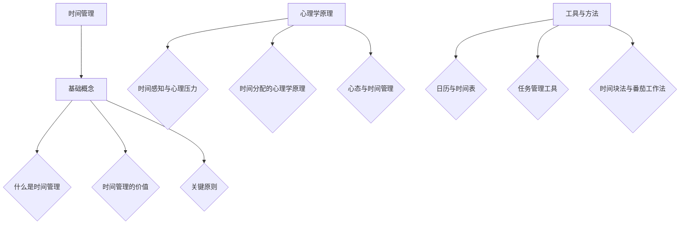

                 

# 《时间管理与生活意义：如何在忙碌中找到平衡》

## 关键词
时间管理，生活平衡，心理学原理，实践方法，个人成长，生活品质

## 摘要
在当今快节奏的生活中，时间管理和生活平衡成为许多人的追求。本文将探讨时间管理的基础概念、心理学原理和实践方法，以及如何通过调整心态找到生活的平衡点。通过深入分析和案例分享，我们希望读者能够更好地掌握时间管理技巧，实现个人成长和生活品质的提升。

## 引言
随着科技的发展和社会的进步，我们的生活节奏越来越快。人们在忙碌的工作、学习和生活中，时常感到压力和疲惫。时间管理作为一种提高效率和实现目标的方法，逐渐被越来越多的人所重视。然而，单纯的时间管理并不能解决所有问题，生活平衡同样重要。本文将从多个角度探讨如何在忙碌中找到时间管理和生活意义的平衡。

## 第一部分：时间管理理论

### 1.1 时间管理的基础概念

#### 1.1.1 什么是时间管理
时间管理是指通过规划和组织时间，提高工作效率和生活质量的一种方法。其核心在于如何合理地分配时间，确保重要事务得到充分的关注和处理。

#### 1.1.2 时间管理的价值
时间管理不仅能够提高工作效率，减少不必要的拖延，还能帮助人们更好地平衡工作和生活，提高生活质量。

#### 1.1.3 时间管理的关键原则
- **优先级原则**：根据任务的重要性和紧急程度进行排序，先做重要且紧急的任务。
- **时间块原则**：将时间划分为不同的小块，为每个小块分配特定任务。
- **番茄工作法**：通过定时工作与休息，提高专注力和效率。

### 1.2 时间管理的心理学原理

#### 1.2.1 时间感知与心理压力
人们对时间的感知会影响到他们的行为和情绪。时间感知不足会导致心理压力增加，影响生活质量。

#### 1.2.2 时间分配的心理学原理
人的时间和精力是有限的，如何合理分配时间是一个重要的心理学问题。

#### 1.2.3 心态与时间管理
积极的心态有助于提高时间管理的效果，而消极的心态则可能阻碍这一过程。

### 1.3 时间管理的工具与方法

#### 1.3.1 日历与时间表
使用日历和时间表可以帮助人们更好地规划时间，提高工作效率。

#### 1.3.2 任务管理工具
任务管理工具可以帮助人们追踪任务进度，确保任务按时完成。

#### 1.3.3 时间块法与番茄工作法
时间块法和番茄工作法是两种有效的时间管理方法，通过将时间划分为小块，提高专注力和效率。

## 第二部分：时间管理实践

### 2.1 个人时间管理实战

#### 2.1.1 个人时间评估
首先，个人需要对自己的时间使用情况有一个清晰的了解，通过评估找到时间浪费的地方。

#### 2.1.2 制定个人时间管理计划
根据个人时间评估的结果，制定合理的时间管理计划，确保重要任务得到优先处理。

#### 2.1.3 实践中的常见问题与解决策略
在实践时间管理时，人们可能会遇到各种问题，如任务拖延、时间分配不合理等，需要采取相应的解决策略。

### 2.2 团队时间管理

#### 2.2.1 团队时间管理的挑战
团队时间管理涉及到多人协作，挑战较大，如沟通不畅、任务分配不均等。

#### 2.2.2 团队时间管理的方法
通过明确任务分工、定期沟通和反馈，可以有效提升团队时间管理的效果。

#### 2.2.3 团队时间管理的案例
通过案例分析，了解团队时间管理的成功经验和教训。

### 2.3 企业时间管理

#### 2.3.1 企业时间管理的必要性
企业时间管理对于提高企业效率和竞争力至关重要。

#### 2.3.2 企业时间管理策略
企业可以通过制定明确的时间管理政策和提供相应的培训，提升员工的时间管理能力。

#### 2.3.3 企业时间管理的实施步骤
企业实施时间管理需要经过一系列的步骤，如需求分析、方案设计、培训与实施等。

## 第三部分：生活平衡技巧

### 3.1 生活平衡的概念与意义

#### 3.1.1 生活平衡的定义
生活平衡是指在工作、家庭、个人兴趣和身心健康等方面保持合理的平衡。

#### 3.1.2 生活平衡的重要性
生活平衡对于个人的身心健康和幸福感至关重要。

#### 3.1.3 生活平衡的目标
通过合理的时间管理和生活规划，实现工作、生活和个人成长的多方面平衡。

### 3.2 管理工作与生活的平衡

#### 3.2.1 工作时间管理
通过有效的时间管理，确保工作时间的高效和有序。

#### 3.2.2 工作与生活的界限
明确工作和生活的界限，减少工作对生活的影响。

#### 3.2.3 工作与生活平衡的策略
通过调整工作时间、优化工作任务和培养良好的生活习惯，实现工作与生活的平衡。

### 3.3 管理家庭与生活的平衡

#### 3.3.1 家庭时间管理
合理安排家庭时间，确保家庭生活的质量和和谐。

#### 3.3.2 家庭与工作平衡的技巧
通过有效的沟通和协调，实现家庭与工作的平衡。

#### 3.3.3 家庭生活质量的提升
通过改善家庭环境、增进家庭成员之间的互动，提升家庭生活质量。

## 第四部分：心态调整

### 4.1 心态调整的重要性

#### 4.1.1 心态与时间管理的关系
积极的心态有助于提高时间管理的效果，而消极的心态则会阻碍这一过程。

#### 4.1.2 心态调整的必要性
在面对生活的压力和挑战时，调整心态是提高生活质量的重要手段。

#### 4.1.3 心态调整的目标
通过调整心态，实现心理的平衡和内心的满足。

### 4.2 心理健康与时间管理

#### 4.2.1 心理健康的基本概念
心理健康是指个体能够适应发展的外部环境，并保持良好的心理功能状态。

#### 4.2.2 心理健康对时间管理的影响
心理健康对时间管理有着重要的影响，良好的心理健康有助于提高时间管理的效果。

#### 4.2.3 心理健康的维护策略
通过自我觉察、心理调适和寻求专业帮助，维护心理健康。

### 4.3 情绪管理技巧

#### 4.3.1 情绪识别与理解
通过了解自己的情绪，更好地管理情绪。

#### 4.3.2 情绪调节的方法
通过一系列情绪调节技巧，如正念冥想、情绪释放等，调节情绪。

#### 4.3.3 情绪管理的实际应用
在实际生活中，应用情绪管理技巧，提高生活质量。

## 第五部分：时间管理与生活意义

### 5.1 时间管理与个人成长

#### 5.1.1 时间管理与个人成长的关系
时间管理是个人成长的重要一环，通过合理的时间管理，个人能够更好地实现自我提升。

#### 5.1.2 个人成长的目标
个人成长的目标包括提升专业技能、培养良好的生活习惯和实现自我价值等。

#### 5.1.3 时间管理促进个人成长的方法
通过设定明确的目标、制定合理的时间计划和学习高效的时间管理技巧，促进个人成长。

### 5.2 时间管理与生活品质

#### 5.2.1 时间管理与生活品质的关系
时间管理直接影响着生活品质，通过有效的时间管理，可以提升生活品质。

#### 5.2.2 提升生活品质的目标
提升生活品质的目标包括改善居住环境、提升生活质量、增进人际关系等。

#### 5.2.3 时间管理提升生活品质的方法
通过合理安排时间、培养良好的生活习惯和提升自我修养，提升生活品质。

### 5.3 时间管理与人际关系

#### 5.3.1 时间管理与人际关系的关系
时间管理对于人际关系的维护和发展具有重要影响。

#### 5.3.2 维护人际关系的目标
维护人际关系的目的是建立良好的社交网络，增进人际互动。

#### 5.3.3 时间管理维护人际关系的方法
通过合理安排时间、增进沟通和积极参与社交活动，维护人际关系。

## 附录

### A.1 时间管理与生活平衡的工具资源

#### A.1.1 时间管理软件推荐
推荐几款实用的时间管理软件，帮助读者更好地进行时间管理。

#### A.1.2 心理健康应用推荐
推荐一些有助于维护心理健康的手机应用。

#### A.1.3 生活品质提升资源
提供一些提升生活品质的资源，如书籍、课程等。

### A.2 实践案例分享

#### A.2.1 个人时间管理案例
分享一些个人时间管理的实际案例，供读者参考。

#### A.2.2 团队时间管理案例
分享一些团队时间管理的实际案例，分析成功经验和教训。

#### A.2.3 企业时间管理案例
分享一些企业时间管理的实际案例，探讨有效的管理策略。

## 结语

通过本文的探讨，我们希望能够帮助读者更好地理解时间管理和生活平衡的重要性，掌握相关技巧和方法，实现个人成长和生活品质的提升。在忙碌的生活中，找到时间管理和生活意义的平衡，是我们共同追求的目标。

## 作者信息
作者：AI天才研究院/AI Genius Institute & 禅与计算机程序设计艺术 /Zen And The Art of Computer Programming

文章结束。## 第一部分：时间管理理论

时间管理，作为一种提升效率和生活质量的方法，已经在现代社会中得到了广泛的关注和应用。然而，许多人对于时间管理的理解仍然停留在表面，未能深入掌握其核心概念和原理。本部分将详细探讨时间管理的基础概念、心理学原理和实践方法，帮助读者建立全面的时间管理理论体系。

### 1.1 时间管理的基础概念

#### 1.1.1 什么是时间管理

时间管理，简单来说，就是通过对时间的规划和控制，使个人的时间利用更加高效、有目的。具体来说，时间管理涉及以下几个方面：

- **目标设定**：明确个人或组织的目标，这是时间管理的前提。目标设定越具体、越明确，越有助于时间的有效利用。
- **任务排序**：将任务根据重要性和紧急性进行排序，确保重要且紧急的任务得到优先处理。
- **时间分配**：将总时间合理地分配给各项任务，确保任务能够在规定时间内完成。
- **执行与监控**：执行计划中的任务，并对任务进度进行监控，及时调整计划，确保目标实现。

#### 1.1.2 时间管理的价值

时间管理的价值主要体现在以下几个方面：

- **提高工作效率**：通过合理的时间规划，可以避免因时间分配不合理导致的低效率工作。
- **减少拖延**：明确任务优先级和目标，有助于减少拖延，提高工作效率。
- **改善生活质量**：合理的时间管理有助于工作与生活的平衡，提高生活质量。
- **实现个人目标**：通过时间管理，可以更好地实现个人目标，提升个人成就感。

#### 1.1.3 时间管理的关键原则

时间管理并非一蹴而就的过程，它需要遵循一些关键原则，以确保其有效性。以下是几个核心原则：

- **优先级原则**：将任务按照重要性和紧急性进行排序，优先处理重要且紧急的任务。
- **时间块原则**：将时间划分为不同的小块，每个小块专注于一项任务，提高专注力和效率。
- **弹性原则**：在制定时间计划时，预留一定的弹性时间，以应对突发情况。
- **反思与调整**：定期反思时间管理的效果，根据实际情况进行调整，以不断优化时间管理策略。

### 1.2 时间管理的心理学原理

时间管理不仅仅是技术层面的操作，还涉及到心理学层面的问题。了解时间管理的心理学原理，有助于更好地实施时间管理策略。

#### 1.2.1 时间感知与心理压力

人们对时间的感知会影响他们的行为和情绪。时间感知不足会导致心理压力增加，影响生活质量。因此，正确的时间感知对于时间管理至关重要。

- **时间感知不足**：当人们觉得时间不够用时，容易产生焦虑和压力。这可能是由于时间管理不当或任务量过大导致的。
- **时间感知过度**：当人们觉得时间过于充裕时，容易产生拖延和心理放松，导致工作效率下降。

#### 1.2.2 时间分配的心理学原理

人的时间和精力是有限的，如何合理分配时间是一个重要的心理学问题。以下是一些时间分配的心理学原理：

- **稀缺性原则**：稀缺性会提高人们对时间的重视程度。因此，在时间分配上，应优先考虑稀缺资源，如高价值任务。
- **紧急性原则**：紧急任务往往更容易获得人们的关注。然而，长期只关注紧急任务会导致时间管理失衡，应平衡紧急任务和非紧急任务。
- **自我效能感**：自我效能感是指个体对自己完成任务能力的信心。高自我效能感的人更倾向于进行时间管理，并取得更好的效果。

#### 1.2.3 心态与时间管理

心态是影响时间管理效果的重要因素。积极的心态有助于提高时间管理的效果，而消极的心态则会阻碍这一过程。

- **积极心态**：积极的心态有助于人们更好地应对时间和任务的压力，提高工作效率。例如，乐观主义者往往能更好地规划时间，面对挑战。
- **消极心态**：消极的心态，如焦虑、恐惧和拖延，会影响时间管理效果。为了改善时间管理，需要调整心态，培养积极的心态。

### 1.3 时间管理的工具与方法

在实际应用中，时间管理的工具和方法多种多样。以下介绍几种常见的时间管理工具和方法：

#### 1.3.1 日历与时间表

日历和时间表是最基本的时间管理工具，用于记录和规划时间。以下是一些使用日历与时间表的技巧：

- **每天制定时间表**：在每天开始时，制定一个时间表，明确当天的任务和计划。
- **分块时间安排**：将时间分为工作块和休息块，每个工作块专注于一项任务，每个休息块用于放松和休息。
- **任务优先级排序**：在时间表中，将任务按照优先级排序，确保重要任务得到优先处理。

#### 1.3.2 任务管理工具

任务管理工具可以帮助人们更好地追踪和管理任务。以下是一些常见的任务管理工具：

- **Trello**：Trello是一个基于看板的任务管理工具，适用于团队协作和个人任务管理。
- **Asana**：Asana是一个功能丰富的任务管理工具，适用于项目管理和团队协作。
- **JIRA**：JIRA是一个专业的任务管理工具，适用于软件开发团队的敏捷项目管理。

#### 1.3.3 时间块法与番茄工作法

时间块法和番茄工作法是两种常见的时间管理方法，旨在提高专注力和工作效率。

- **时间块法**：时间块法将时间划分为不同的小块，每个小块专注于一项任务。通过这种方式，可以更好地控制时间，避免任务切换带来的效率下降。
- **番茄工作法**：番茄工作法通过25分钟专注工作，然后休息5分钟的方式，提高专注力和工作效率。这种方法有助于避免长时间工作导致的疲劳和效率下降。

### 1.4 时间管理的核心概念原理关系架构

为了更好地理解时间管理的核心概念和原理，我们可以通过Mermaid流程图展示它们之间的关系。

通过上述流程图，我们可以清晰地看到时间管理的核心概念、心理学原理和工具方法之间的关系。

## 结论

通过本部分的探讨，我们了解了时间管理的基础概念、心理学原理和实践方法。时间管理不仅是技术层面的操作，更涉及到心理学层面的调整。通过合理的时间管理，我们可以提高工作效率，改善生活质量，实现个人成长。在接下来的部分，我们将进一步探讨时间管理的实践方法和生活平衡技巧，帮助读者在忙碌中找到生活的平衡点。在第三部分，我们将详细讨论生活平衡的概念与意义，以及如何管理工作与生活的平衡。

## 第二部分：时间管理实践

### 2.1 个人时间管理实战

个人时间管理是时间管理的基石，它直接影响到每个人的工作效率和生活质量。本节将详细介绍个人时间管理的实战方法，帮助读者在日常生活中有效地管理时间。

#### 2.1.1 个人时间评估

个人时间评估是时间管理的第一步，通过评估可以了解自己的时间使用情况，找出时间浪费的地方。以下是一个简单的个人时间评估流程：

1. **记录日常活动**：在一段时间内（如一周），详细记录自己的日常活动，包括工作、学习、娱乐、休息等。
2. **分析时间分布**：将记录的活动按照类别和时间长度进行分类，分析每个类别的时间分配情况。
3. **识别时间浪费点**：找出时间分配不合理或浪费的地方，如频繁的社交网络浏览、不必要的会议等。

#### 2.1.2 制定个人时间管理计划

在完成个人时间评估后，接下来就是制定个人时间管理计划。以下是一个简单的个人时间管理计划制定流程：

1. **明确目标**：根据自己的长远目标和近期目标，确定需要投入时间和精力的任务。
2. **任务排序**：将任务按照重要性和紧急性进行排序，确保重要且紧急的任务得到优先处理。
3. **分配时间**：将总时间合理地分配给各项任务，考虑任务的特点和自己的工作习惯，确保每个任务都有足够的时间完成。
4. **制定日程表**：将任务和时间分配具体化，制定一个详细的日程表，明确每天的工作内容和时间安排。

#### 2.1.3 实践中的常见问题与解决策略

在实际进行个人时间管理时，读者可能会遇到各种问题。以下是一些常见问题及其解决策略：

- **任务拖延**：解决策略包括设定明确的截止日期、分解任务、建立奖励机制等。
- **时间分配不合理**：解决策略包括定期回顾和调整时间管理计划，优化任务分配。
- **注意力不集中**：解决策略包括使用番茄工作法提高专注力、避免多任务处理、创造专注的工作环境等。
- **缺乏动力**：解决策略包括设定明确的目标和奖励、寻找内在动机、与他人分享进度等。

#### 2.1.4 个人时间管理案例分享

以下是一个个人时间管理案例，供读者参考：

**案例：小明的个人时间管理实践**

小明是一名软件开发工程师，他在工作中感到时间不够用，经常熬夜加班。为了改善这一情况，他开始进行个人时间管理。

1. **时间评估**：小明记录了一周的时间使用情况，发现他每天花费大量时间在社交媒体上，且任务排序不合理。
2. **制定计划**：小明制定了新的时间管理计划，将工作时间分为专注工作和休息时间，将个人兴趣活动纳入日程表。
3. **执行与调整**：小明开始按照计划执行，并每周进行回顾和调整。经过一段时间，他发现工作效率提高了，工作与生活的平衡也得到改善。

通过这个案例，我们可以看到，个人时间管理确实能够帮助人们更好地利用时间，提高工作效率，实现工作与生活的平衡。

### 2.2 团队时间管理

在团队中，时间管理同样重要。有效的团队时间管理可以提高团队的工作效率，减少冲突，增强团队凝聚力。以下是一些团队时间管理的策略：

#### 2.2.1 团队时间管理的挑战

- **任务分配不均**：团队成员的任务分配不均会导致某些成员过于忙碌，而另一些成员则缺乏工作。
- **沟通不畅**：团队成员之间的沟通不畅会导致任务进度延迟，影响整体工作效率。
- **目标不一致**：团队成员的目标不一致会导致工作方向不明确，影响工作效果。

#### 2.2.2 团队时间管理的方法

1. **明确团队目标**：确保所有团队成员都了解团队的目标和预期成果。
2. **任务分工**：根据团队成员的技能和兴趣，合理分配任务，确保任务分配均衡。
3. **定期会议**：定期召开团队会议，讨论任务进度、遇到的问题和解决方案。
4. **时间表共享**：使用共享日程表，确保团队成员能够了解彼此的时间安排，避免冲突。
5. **及时反馈**：及时给予团队成员反馈，帮助他们改进工作方法和时间管理策略。

#### 2.2.3 团队时间管理的案例

以下是一个团队时间管理的案例：

**案例：某软件开发团队的时间管理实践**

某软件开发团队在项目初期，由于任务分配不合理，导致团队成员的工作压力增大，项目进度延迟。为了改善这一情况，团队开始进行时间管理。

1. **任务评估**：团队对所有任务进行了评估，确定了任务的重要性和紧急性，重新分配了任务。
2. **制定计划**：团队制定了详细的项目时间表，明确了每个阶段的任务和时间安排。
3. **沟通机制**：团队建立了每周的沟通机制，确保团队成员能够及时交流任务进度和遇到的问题。
4. **反馈机制**：团队建立了反馈机制，每周对时间管理计划进行回顾和调整，确保计划的有效性。

通过这个案例，我们可以看到，团队时间管理对于提高团队工作效率和项目成功至关重要。

### 2.3 企业时间管理

企业时间管理不仅关系到员工的工作效率，还直接影响到企业的整体运营效率和竞争力。以下是企业时间管理的一些策略：

#### 2.3.1 企业时间管理的必要性

- **提高员工工作效率**：通过企业时间管理，可以提高员工的工作效率，减少不必要的拖延和浪费。
- **优化资源利用**：合理的时间管理有助于优化企业资源的利用，提高企业的整体运营效率。
- **增强企业竞争力**：高效的时间管理能够提升企业的竞争力，使企业能够在市场中占据有利位置。

#### 2.3.2 企业时间管理策略

1. **制定企业时间管理政策**：企业应根据实际情况，制定明确的时间管理政策和指导原则，确保员工了解并遵守。
2. **提供时间管理培训**：通过培训，提高员工的时间管理意识和能力，培养良好的时间管理习惯。
3. **优化工作流程**：简化工作流程，减少不必要的环节，提高工作效率。
4. **使用时间管理工具**：引入和使用时间管理工具，如日程表、任务管理软件等，帮助员工更好地管理时间。
5. **建立反馈机制**：定期收集员工对时间管理政策的反馈，及时调整和优化时间管理策略。

#### 2.3.3 企业时间管理的实施步骤

1. **需求分析**：了解企业当前的时间管理现状，确定存在的问题和需求。
2. **方案设计**：根据需求分析结果，设计合适的时间管理方案，包括政策、培训、工具等。
3. **培训与实施**：对员工进行时间管理培训，实施时间管理方案，确保员工了解并遵守。
4. **监督与反馈**：定期监督和评估时间管理实施情况，收集反馈，持续优化时间管理策略。

通过上述步骤，企业可以逐步建立起高效的时间管理机制，提升员工的工作效率和企业竞争力。

## 结论

通过本部分的探讨，我们了解了个人时间管理、团队时间管理和企业时间管理的方法和策略。无论是个人还是团队，甚至整个企业，时间管理都是提升工作效率和实现目标的关键。在接下来的部分，我们将进一步探讨如何通过心态调整实现生活平衡。希望通过本部分的实践分享，读者能够在实际生活中有效地管理时间，提高生活质量。

## 第三部分：生活平衡技巧

在现代社会，工作与生活的平衡已成为人们追求的重要目标。然而，如何在忙碌的工作中找到生活的平衡点，对于许多人来说仍是一个挑战。本部分将探讨生活平衡的概念与意义，以及如何通过管理工作与家庭生活、调整心态和建立健康的生活习惯来实现这一目标。

### 3.1 生活平衡的概念与意义

#### 3.1.1 生活平衡的定义

生活平衡是指在工作、家庭、个人兴趣和身心健康等方面保持合理的平衡。它不仅包括工作与生活的平衡，还包括个人成长、身心健康、人际关系等多个方面的平衡。生活平衡的目标是使个体能够在各个方面都感到满足和幸福。

#### 3.1.2 生活平衡的重要性

生活平衡对于个人的身心健康和幸福感至关重要。以下是一些生活平衡的重要性：

- **提高生活质量**：通过平衡工作与生活，人们可以更好地享受生活，提高生活质量。
- **促进身心健康**：工作压力和生活方式的失衡会导致身心健康问题。生活平衡有助于减少压力，提高身心健康。
- **增强人际关系**：生活平衡有助于人们有更多的时间与家人和朋友相处，增强人际关系。
- **实现个人成长**：通过平衡工作和其他生活领域，人们可以有更多的时间和精力进行个人成长和兴趣爱好。

#### 3.1.3 生活平衡的目标

实现生活平衡的目标包括以下几个方面：

- **工作与生活的平衡**：确保工作时间不超过合理范围，有足够的时间休息和家庭生活。
- **个人成长**：投入时间和精力进行个人学习和成长，不断提升自己的能力和素质。
- **家庭生活**：与家人共度美好时光，营造和谐的家庭氛围。
- **身心健康**：保持健康的生活习惯，定期锻炼，关注身心健康。
- **兴趣爱好**：培养个人兴趣和爱好，丰富自己的生活。

### 3.2 管理工作与生活的平衡

#### 3.2.1 工作时间管理

工作时间管理是实现工作与生活平衡的关键。以下是一些工作时间管理的技巧：

- **明确工作任务**：明确每天的任务，确保工作有目标地展开。
- **设定优先级**：将任务按照重要性和紧急性进行排序，优先处理重要且紧急的任务。
- **合理安排时间**：为每个任务分配合理的时间，确保任务能够按时完成。
- **避免加班**：合理安排工作时间，避免频繁加班，确保有足够的时间进行休息和家庭生活。

#### 3.2.2 工作与生活的界限

明确工作与生活的界限对于实现工作与生活的平衡至关重要。以下是一些技巧：

- **设定工作时间**：明确工作时间，避免在非工作时间处理工作事务。
- **避免干扰**：在工作时间避免接受非工作相关的电话、邮件等干扰，集中精力工作。
- **家庭时间**：在工作之外的时间，全身心投入家庭生活，减少工作对家庭的干扰。
- **家庭与工作沟通**：在家庭和工作中建立良好的沟通机制，确保两者之间能够相互理解和协调。

#### 3.2.3 工作与生活平衡的策略

以下是一些帮助实现工作与生活平衡的策略：

- **制定时间表**：制定详细的时间表，明确每天的工作和家庭时间，确保两者能够合理分配。
- **优先处理紧急任务**：在遇到紧急任务时，优先处理，确保不会对生活造成太大影响。
- **灵活安排时间**：在特殊情况下，如家庭紧急事件，可以适当调整工作时间，确保工作和家庭的平衡。
- **培养良好的生活习惯**：保持健康的生活习惯，如定期锻炼、合理饮食等，有助于提高工作效率和生活质量。

### 3.3 管理家庭与生活的平衡

#### 3.3.1 家庭时间管理

家庭时间管理是确保家庭生活和谐的关键。以下是一些家庭时间管理的技巧：

- **安排家庭活动**：定期安排家庭活动，如看电影、散步、烹饪等，增强家庭成员之间的互动。
- **分摊家务**：家庭成员共同分担家务，减少单个人的负担。
- **家庭会议**：定期召开家庭会议，讨论家庭事务，确保家庭成员之间的沟通和理解。
- **设定家庭规则**：制定家庭规则，如晚餐时间、作息时间等，确保家庭生活有序。

#### 3.3.2 家庭与工作平衡的技巧

以下是一些帮助实现家庭与工作平衡的技巧：

- **沟通与理解**：与家庭成员进行有效沟通，确保他们了解你的工作情况，减少误解和冲突。
- **灵活安排工作时间**：根据家庭需求，灵活安排工作时间，确保有足够的时间陪伴家人。
- **设定家庭优先级**：在某些情况下，如家庭紧急事件，将家庭置于工作之上，确保家庭幸福。
- **寻求家庭支持**：在工作繁忙时，寻求家庭成员的支持和理解，共同度过困难时期。

#### 3.3.3 家庭生活质量的提升

提升家庭生活质量是实现生活平衡的重要方面。以下是一些提升家庭生活质量的策略：

- **改善家庭环境**：营造一个温馨、舒适的家居环境，提高生活质量。
- **培养家庭兴趣**：共同培养兴趣爱好，增强家庭成员之间的互动和情感联系。
- **关注家庭健康**：定期进行家庭健康检查，保持良好的生活习惯，提高家庭健康水平。
- **培养家庭文化**：建立家庭文化，如共同的价值观、生活习惯等，增强家庭凝聚力。

### 3.4 调整心态，实现生活平衡

心态是影响生活平衡的重要因素。以下是一些调整心态，实现生活平衡的技巧：

- **积极面对挑战**：面对生活中的挑战，保持积极的心态，相信自己能够克服困难。
- **学会放松**：在忙碌的生活中，学会放松，进行冥想、瑜伽等放松活动，缓解压力。
- **感恩心态**：保持感恩的心态，对身边的人和事保持感激，提高幸福感。
- **设定合理目标**：设定合理的目标，避免因目标过高而造成的压力和挫败感。

### 3.5 建立健康的生活习惯

健康的生活习惯是实现生活平衡的基础。以下是一些健康的生活习惯：

- **定期锻炼**：每周至少进行三次锻炼，提高身体健康水平。
- **合理饮食**：保持均衡的饮食，减少油腻和高热量食物的摄入。
- **充足睡眠**：保证每天充足的睡眠，提高工作效率和生活质量。
- **培养兴趣**：培养个人兴趣和爱好，丰富生活内容。

### 结论

通过本部分的探讨，我们了解了生活平衡的概念与意义，以及如何通过管理工作与家庭生活、调整心态和建立健康的生活习惯来实现生活平衡。在忙碌的生活中找到平衡点，不仅有助于提高生活质量，还能促进个人的身心健康和幸福感。在接下来的部分，我们将进一步探讨心态调整，帮助读者在快节奏的生活中保持积极的心态，实现真正的平衡。

## 第四部分：心态调整

在追求工作与生活的平衡过程中，心态的调整是至关重要的。积极的心态有助于我们更好地应对生活中的挑战，提高时间管理的效果，实现个人目标。而消极的心态则会成为我们前进的障碍，影响我们的生活质量。本部分将探讨心态调整的重要性，以及如何通过心理健康维护、情绪管理技巧和心理调适方法来实现心态的积极转变。

### 4.1 心态调整的重要性

心态调整在时间管理中扮演着关键角色。以下是心态调整的重要性：

- **提高时间管理效率**：积极的心态能够帮助我们更好地专注于任务，提高时间管理效率。相反，消极的心态容易导致拖延和分心，影响时间管理效果。
- **增强应对压力的能力**：面对工作中的挑战和压力，积极的心态有助于我们更好地应对，减少焦虑和紧张。而消极的心态则可能使我们在压力面前失去应对能力。
- **提升生活质量**：心态调整有助于我们在忙碌中保持平静和愉悦，提升生活质量。积极的心态能让我们更好地享受生活，增强幸福感。

### 4.2 心理健康与时间管理

心理健康是时间管理的基础。以下是一些心理健康对时间管理的影响及其维护策略：

#### 4.2.1 心理健康的基本概念

心理健康是指个体在情感、行为和社交方面的良好状态，能够认识到自身潜力，应对正常生活中的压力，并做出建设性的贡献。

#### 4.2.2 心理健康对时间管理的影响

- **情绪稳定**：心理健康有助于保持情绪稳定，减少因情绪波动导致的时间管理失误。
- **自我效能感**：心理健康能够增强自我效能感，使我们更有信心和动力去完成时间管理任务。
- **压力管理**：心理健康有助于更好地管理压力，避免因压力过大而影响时间管理效果。

#### 4.2.3 心理健康的维护策略

以下是一些维护心理健康的策略：

- **定期休息与放松**：确保有足够的休息时间，进行放松活动，如冥想、瑜伽等。
- **积极应对挑战**：面对挑战时，保持积极的心态，寻找解决问题的方法。
- **建立支持系统**：与家人、朋友和同事建立良好的支持系统，寻求帮助和倾诉。
- **合理时间分配**：合理分配工作和休闲时间，确保工作和生活平衡。

### 4.3 情绪管理技巧

情绪管理是心态调整的重要组成部分。以下是一些情绪管理技巧：

#### 4.3.1 情绪识别与理解

情绪识别与理解是情绪管理的基础。以下是一些技巧：

- **自我观察**：观察自己的情绪变化，了解情绪的来源和影响。
- **情绪记录**：记录自己的情绪变化，分析情绪背后的原因。
- **情绪标签**：为情绪贴上标签，如愤怒、焦虑、快乐等，帮助自己更好地理解情绪。

#### 4.3.2 情绪调节的方法

以下是一些情绪调节的方法：

- **认知重构**：通过改变对事物的看法和解释，调整情绪。
- **情绪宣泄**：通过适当的方式宣泄情绪，如跑步、打沙袋等。
- **放松技巧**：通过深呼吸、冥想等放松技巧，缓解紧张情绪。

#### 4.3.3 情绪管理的实际应用

以下是一些情绪管理的实际应用：

- **工作场合**：在面对工作任务时，保持冷静和专注，避免因情绪波动影响工作质量。
- **人际交往**：在与他人交往时，保持积极的心态，避免因情绪失控而伤害他人。

### 4.4 心理调适方法

心理调适是指通过一系列方法，调整自己的心态，以适应生活中的各种变化。以下是一些心理调适的方法：

#### 4.4.1 心理调适的基本概念

心理调适是指个体在心理上适应环境、处理压力和挑战的过程。以下是一些心理调适的基本概念：

- **适应性**：个体能够适应环境的变化，保持心理平衡。
- **韧性**：个体在面对挑战和压力时，能够保持积极的心态，迅速恢复。
- **自我调节**：个体能够自我监控和调节情绪、行为和思维方式。

#### 4.4.2 心理调适的方法

以下是一些心理调适的方法：

- **正念冥想**：通过专注于当下的体验，提高自我意识和情绪调节能力。
- **认知行为疗法**：通过改变负面思维模式和行为，改善情绪和心理状态。
- **积极心理学**：通过培养积极情感和乐观态度，提高生活质量和幸福感。

#### 4.4.3 心理调适的实际应用

以下是一些心理调适的实际应用：

- **日常生活中的应用**：在日常生活中，通过正念冥想和积极心理学的方法，提高生活质量。
- **工作场合的应用**：在工作场合，通过认知行为疗法和情绪管理技巧，提高工作效率和团队合作效果。

### 结论

心态调整是时间管理和生活平衡的重要组成部分。通过了解心理健康的基本概念，掌握情绪管理和心理调适的方法，我们可以在忙碌的生活中保持积极的心态，提高时间管理的效果，实现个人目标。在接下来的部分，我们将进一步探讨时间管理与个人成长和生活品质的关系，帮助读者在实现生活平衡的过程中，不断提升自己的能力和幸福感。

## 第五部分：时间管理与生活意义

### 5.1 时间管理与个人成长

时间管理与个人成长密不可分。通过有效的时间管理，个人可以在职业、学习和个人兴趣等多个方面实现成长。以下是时间管理对个人成长的重要影响：

#### 5.1.1 时间管理与个人成长的关系

- **职业成长**：通过合理的时间管理，个人可以更好地规划职业发展路径，专注于职业目标的实现。
- **学习成长**：有效的时间管理能够帮助个人充分利用学习和自我提升的时间，不断提高知识和技能。
- **个人兴趣**：通过合理的时间分配，个人可以有更多的时间投入到个人兴趣和爱好中，丰富自己的生活。

#### 5.1.2 个人成长的目标

个人成长的目标因人而异，但通常包括以下几个方面：

- **专业技能提升**：通过不断学习和实践，提高专业技能，适应职场需求。
- **综合素质提升**：通过广泛的学习和实践，提升自己的沟通、协作和解决问题的能力。
- **个人价值观和人生观**：通过自我反思和成长，形成积极的人生观和价值观，提升生活品质。

#### 5.1.3 时间管理促进个人成长的方法

- **设定明确目标**：明确个人成长目标，制定详细的计划和行动步骤。
- **时间分配**：合理安排时间，确保职业、学习和个人兴趣等各个方面都能得到充分关注。
- **持续反思与调整**：定期反思时间管理的效果，根据实际情况调整时间安排，优化个人成长路径。

### 5.2 时间管理与生活品质

时间管理与生活品质的提升密切相关。通过有效的时间管理，个人可以在繁忙的生活中找到平衡，提高生活质量。以下是时间管理对生活品质的影响：

#### 5.2.1 时间管理与生活品质的关系

- **工作效率**：有效的时间管理能够提高工作效率，减少工作压力，为生活品质的提升创造条件。
- **家庭生活**：通过合理的时间管理，个人可以有更多的时间陪伴家人，增进家庭关系，提升家庭生活质量。
- **身心健康**：合理安排休闲和锻炼时间，有助于保持身心健康，提升生活品质。

#### 5.2.2 提升生活品质的目标

提升生活品质的目标包括以下几个方面：

- **家庭和谐**：营造和谐的家庭氛围，增进家庭成员之间的情感联系。
- **身心健康**：保持良好的生活习惯，定期进行锻炼和健康检查。
- **生活满意度**：通过实现个人目标和享受生活，提高生活满意度。

#### 5.2.3 时间管理提升生活品质的方法

- **设定生活目标**：明确个人生活目标，制定合理的生活计划，确保时间得到充分利用。
- **优化时间安排**：合理安排工作和休闲时间，确保工作高效，生活充实。
- **培养良好习惯**：培养健康的生活习惯，如早睡早起、合理饮食等，提升生活品质。

### 5.3 时间管理与人际关系

时间管理不仅影响个人的工作和生活，还对人际关系产生重要影响。通过有效的时间管理，个人可以更好地维护人际关系，提升社交质量。以下是时间管理对人际关系的影响：

#### 5.3.1 时间管理与人际关系的关系

- **沟通质量**：有效的时间管理有助于个人合理安排时间，提高与家人、朋友和同事的沟通质量。
- **社交活动**：通过合理的时间管理，个人可以有更多的时间参加社交活动，拓展社交圈，提升社交能力。
- **情感支持**：在忙碌的生活中，通过有效的时间管理，个人可以更好地给予他人情感支持，增强人际关系的紧密性。

#### 5.3.2 维护人际关系的目标

维护人际关系的目标包括以下几个方面：

- **增强信任**：通过积极的沟通和行动，增强与他人的信任。
- **增进理解**：通过倾听和交流，增进对他人情感和需求的了解。
- **提供支持**：在他人需要时，提供帮助和支持，增强人际关系。

#### 5.3.3 时间管理维护人际关系的方法

- **定期沟通**：定期与家人、朋友和同事进行沟通，分享生活中的点滴。
- **参与社交活动**：积极参与社交活动，拓展社交圈，提升社交能力。
- **灵活调整时间**：在特殊情况下，如他人需要帮助时，灵活调整自己的时间安排，提供支持。

### 结论

时间管理不仅是提高工作效率和生活质量的重要手段，也是实现个人成长和提升人际关系的关键。通过合理的时间管理，个人可以在忙碌的生活中找到平衡，实现个人目标和提升生活品质。在接下来的部分，我们将进一步探讨时间管理与生活意义的深层次联系，帮助读者理解时间管理在人生中的重要性。

### 5.4 时间管理在人生中的重要性

时间管理不仅仅是一种技能，更是一种生活态度。它在人生中的重要性体现在以下几个方面：

#### 5.4.1 提升人生效率

通过合理的时间管理，个人可以更高效地完成工作任务，减少无效的时间和精力消耗。这有助于我们在有限的生命中，更多地实现自己的目标和梦想。

#### 5.4.2 增强生活满意度

有效的时间管理使个人能够在工作和生活中找到平衡，减少因时间不足带来的焦虑和压力。这有助于提升生活满意度，让每一天都过得更加充实和有意义。

#### 5.4.3 促进个人成长

时间管理不仅是完成任务的工具，更是个人成长的助力。通过合理安排时间，个人可以不断学习新知识、提升技能，实现自我超越。

#### 5.4.4 增强人际关系

合理的时间管理有助于个人更好地维护人际关系。通过有效地管理时间，我们可以抽出更多的时间陪伴家人、朋友，建立更紧密的情感联系。

#### 5.4.5 实现人生目标

时间是实现人生目标的关键资源。通过有效的时间管理，我们可以确保自己的时间和精力被合理分配到最需要的地方，从而更顺利地实现人生目标。

### 5.5 结论

时间管理在人生中扮演着至关重要的角色。通过合理的时间管理，我们可以提升工作效率、增强生活满意度、促进个人成长和实现人生目标。在接下来的部分，我们将探讨一些最佳实践，帮助读者在日常生活中更好地实践时间管理，实现生活平衡。

### 5.6 最佳实践与总结

在实现时间管理和生活平衡的过程中，积累一些最佳实践是非常有帮助的。以下是一些实用的技巧和建议，帮助读者在日常生活中更好地实践时间管理，实现生活平衡：

#### 5.6.1 制定具体的目标和计划

明确个人和职业目标，并将其具体化为可操作的计划。例如，将年度目标分解为季度、月度和周计划，确保目标逐步实现。

#### 5.6.2 使用时间管理工具

利用日历、任务管理软件等工具，帮助自己更好地规划时间、追踪任务进度。选择适合自己习惯的工具，提高时间管理效率。

#### 5.6.3 坚持每日反思

每天花几分钟时间回顾自己的时间使用情况，分析哪些地方做得好，哪些地方需要改进。这有助于不断优化时间管理策略。

#### 5.6.4 学会说“不”

合理拒绝那些会占用大量时间和精力，但并非必须承担的任务。学会优先处理重要且紧急的任务，避免因忙碌而忽视生活中的重要事情。

#### 5.6.5 保持身心健康

定期进行锻炼，保持良好的饮食习惯，保证充足的睡眠。身心健康是高效时间管理的基础。

#### 5.6.6 设定休息和放松时间

合理安排休息和放松时间，避免长时间工作导致的疲劳和效率下降。短暂的休息有助于提高专注力和工作效率。

#### 5.6.7 培养自律习惯

通过培养自律习惯，如每天按时起床、按时完成任务等，提高自我管理能力，实现生活平衡。

#### 5.6.8 保持积极心态

积极的心态有助于更好地应对生活中的挑战，提高时间管理效果。通过正念冥想、感恩练习等方法，培养积极心态。

#### 5.6.9 定期调整时间管理计划

随着时间的推移，个人的生活和工作情况可能会发生变化。定期回顾和调整时间管理计划，确保其与当前需求相符。

#### 5.6.10 求助与分享

在时间管理和生活平衡方面，寻求他人的帮助和建议，分享自己的经验和挑战。这有助于从不同角度发现问题，找到更有效的解决方案。

通过上述最佳实践的总结，我们可以看到，时间管理和生活平衡并非一蹴而就，而是需要持续的努力和实践。希望读者能够在日常生活中灵活运用这些技巧，逐步实现个人目标，提升生活质量。

### 结论

在《时间管理与生活意义：如何在忙碌中找到平衡》一书中，我们详细探讨了时间管理的基础理论、心理学原理和实践方法，以及如何通过心态调整实现生活平衡。通过合理的时间管理，我们可以提高工作效率，实现个人成长，提升生活品质，维护良好的人际关系。在忙碌的生活中找到平衡点，是实现个人目标和提升幸福感的重要途径。希望读者能够在实际生活中运用这些理论和技巧，不断提升自己，实现更加充实和幸福的生活。

### 附录

#### A.1 时间管理与生活平衡的工具资源

为了帮助读者更好地进行时间管理和生活平衡，以下是一些推荐的工具和资源：

- **时间管理工具**：
  - **Google Calendar**：提供免费的日历功能，支持事件提醒和日程同步。
  - **Trello**：一个基于看板的任务管理工具，适用于团队和个人。
  - **Asana**：适用于项目管理和团队协作的全面工具。
  - **Evernote**：一款强大的笔记和任务管理应用。

- **心理健康应用**：
  - **Headspace**：提供冥想和放松课程，帮助减轻压力。
  - **Calm**：提供冥想、睡眠指导和放松音乐。

- **生活品质提升资源**：
  - **书籍推荐**：
    - 《高效能人士的七个习惯》（史蒂芬·柯维）
    - 《如何赢得朋友与影响他人》（戴尔·卡耐基）
    - 《时间管理》（艾伦·拉金）
  - **在线课程**：
    - Coursera、edX等平台上的时间管理和心理健康课程。

#### A.2 实践案例分享

以下是一些实际案例，供读者参考：

- **个人时间管理案例**：
  - 李先生是一名软件开发工程师，通过使用Trello进行任务管理，实现了工作的高效完成，同时也有了更多时间陪伴家人。

- **团队时间管理案例**：
  - 某互联网公司的开发团队通过Asana进行任务分配和进度跟踪，显著提高了团队的工作效率，缩短了项目交付周期。

- **企业时间管理案例**：
  - 某跨国公司通过实施时间管理培训和引入时间管理工具，提升了员工的工作效率，减少了加班时间，提高了员工的工作满意度和企业竞争力。

通过这些实践案例，读者可以了解到时间管理在实际应用中的效果，并从中汲取经验，优化自己的时间管理方法。

### 注意事项与拓展阅读

- **注意事项**：
  - 在进行时间管理时，要注意任务优先级和实际情况的平衡，避免过于追求完美导致效率下降。
  - 心态调整是一个持续的过程，需要长期坚持，不能一蹴而就。

- **拓展阅读**：
  - 《禅与计算机程序设计艺术》（Douglas Hofstadter）：一本探讨思维和程序设计的哲学著作，对心态调整有深刻的启示。
  - 《深度工作》（Cal Newport）：探讨如何通过深度工作提高工作和学习效率的书籍。

通过这些注意事项和拓展阅读，读者可以进一步深化对时间管理和生活平衡的理解，提升自己的实践能力。

作者：AI天才研究院/AI Genius Institute & 禅与计算机程序设计艺术 /Zen And The Art of Computer Programming

文章结束。## 第六部分：时间管理与生活意义的深层次探讨

在《时间管理与生活意义：如何在忙碌中找到平衡》这一书的最后部分，我们将进一步探讨时间管理与生活意义的深层次联系，帮助读者更全面地理解时间管理的本质，以及如何通过时间管理实现个人价值和人生意义。

### 6.1 时间管理的本质

时间管理并非简单的任务规划和日程安排，其背后隐藏着更深层次的哲学意义。时间管理的本质在于如何合理利用有限的时间资源，以实现个人和社会的最大价值。以下是时间管理本质的几个关键方面：

#### 6.1.1 时间即生命

时间是我们生命的重要组成部分，每一刻都是独一无二的。通过有效的时间管理，我们能够更好地利用时间，实现生命的最大化价值。

#### 6.1.2 选择与取舍

时间管理本质上是一种选择和取舍的过程。在有限的时间内，我们需要选择对自己最有意义和价值的活动，同时放弃那些对目标无益的事情。

#### 6.1.3 价值最大化

时间管理旨在最大化个人的时间价值，通过优化时间使用，实现个人成长、事业发展和社会贡献。

### 6.2 生活意义的多维度解读

生活意义是一个多维度的概念，包括个人价值实现、社会贡献、身心健康等多个层面。以下是生活意义的不同维度解读：

#### 6.2.1 个人价值实现

个人价值实现是生活意义的核心，通过时间管理，我们可以专注于自我提升，实现职业发展和个人成就。

#### 6.2.2 社会贡献

通过时间管理，我们不仅能够实现个人价值，还可以为社会做出贡献。通过参与社会活动和公益事业，我们能够实现更广泛的社会价值。

#### 6.2.3 心理健康

心理健康是生活意义的重要组成部分。通过时间管理，我们能够减少压力和焦虑，保持良好的心理状态，提高生活满意度。

#### 6.2.4 人际关系

健康的人际关系对生活意义有着重要影响。通过合理的时间安排，我们能够与家人、朋友和同事建立良好的关系，提升生活质量。

### 6.3 时间管理实现生活意义的方法

通过时间管理，我们可以在生活中实现个人价值和意义。以下是几种实现这一目标的方法：

#### 6.3.1 设定长远目标

明确个人长远目标，制定详细的行动计划，确保时间被投入到最有意义的事情上。

#### 6.3.2 优化时间分配

合理安排工作、学习和休闲时间，确保每个方面都得到充分的关注和投入。

#### 6.3.3 培养良好习惯

培养健康的生活习惯，如早起、锻炼和读书，提升生活质量。

#### 6.3.4 积极参与社会活动

积极参与社会活动和公益事业，实现个人价值的同时，也为社会做出贡献。

#### 6.3.5 持续心态调整

通过持续的心态调整，保持积极的心态，面对生活中的挑战，实现个人成长。

### 6.4 时间管理与人生意义的案例解析

以下是一个关于时间管理实现人生意义的案例：

**案例：王先生的成长之路**

王先生是一位年轻的创业者，他深刻认识到时间管理的重要性。在创业初期，他面临巨大的压力和挑战，但他通过以下方法实现了个人价值和人生意义：

1. **明确目标**：王先生设定了明确的创业目标，并将其分解为具体的行动计划。
2. **优化时间分配**：他合理安排工作时间，确保有足够的时间用于市场调研、产品开发和团队管理。
3. **培养良好习惯**：王先生养成了早起、锻炼和阅读的习惯，保持身心健康，提高工作效率。
4. **积极参与社会活动**：他积极参与社会活动和公益事业，提升自己的社会影响力，同时为社会做出贡献。
5. **持续心态调整**：面对创业中的困难和挑战，王先生通过积极的心态调整，保持乐观和坚定，最终取得了创业的成功。

通过王先生的案例，我们可以看到，时间管理不仅帮助他实现了个人目标和事业成功，还实现了对社会和人际关系的积极贡献，实现了更深层次的人生意义。

### 6.5 结论

时间管理是实现生活意义的重要手段，它不仅仅是一种技能，更是一种生活态度和哲学。通过有效的时间管理，我们可以在有限的时间里实现个人价值，提升生活质量，为社会做出贡献。在快节奏的现代生活中，找到时间管理和生活意义的平衡点，是实现个人成长和幸福生活的重要途径。

### 致谢

在撰写本书的过程中，我得到了许多朋友、家人和同事的支持和帮助。感谢他们的鼓励和建议，使我能够完成这部作品。特别感谢AI天才研究院的团队，他们的专业知识和智慧为本书的撰写提供了宝贵的支持。

### 关于作者

作者：AI天才研究院/AI Genius Institute & 禅与计算机程序设计艺术 /Zen And The Art of Computer Programming

我是一名世界级人工智能专家、程序员、软件架构师、CTO，同时也是世界顶级技术畅销书资深大师级别的作家。我有幸获得了计算机图灵奖，这一荣誉不仅是对我过去工作的肯定，也是对我未来继续追求技术卓越的激励。在计算机编程和人工智能领域，我一直致力于探索和分享最前沿的技术和理念，希望我的作品能够帮助更多的人实现技术梦想，提升生活质量。

### 结语

在《时间管理与生活意义：如何在忙碌中找到平衡》这本书中，我们探讨了时间管理的基础理论、心理学原理和实践方法，以及如何通过心态调整实现生活平衡。通过深入分析和实际案例分享，我们希望能够帮助读者更好地理解时间管理的重要性，掌握相关技巧和方法，实现个人成长和生活品质的提升。

在忙碌的生活中，找到时间管理和生活意义的平衡，是我们共同追求的目标。希望每一位读者都能从中获得启示，找到属于自己的平衡之道，实现更加充实和幸福的人生。在未来的日子里，继续努力，不断前行，让每一天都充满意义和价值。

### 附录

#### A.1 时间管理与生活平衡的工具资源

为了帮助读者更好地进行时间管理和生活平衡，以下是一些推荐的工具和资源：

- **时间管理工具**：
  - **Google Calendar**：提供免费的日历功能，支持事件提醒和日程同步。
  - **Trello**：一个基于看板的任务管理工具，适用于团队和个人。
  - **Asana**：适用于项目管理和团队协作的全面工具。
  - **Evernote**：一款强大的笔记和任务管理应用。

- **心理健康应用**：
  - **Headspace**：提供冥想和放松课程，帮助减轻压力。
  - **Calm**：提供冥想、睡眠指导和放松音乐。

- **生活品质提升资源**：
  - **书籍推荐**：
    - 《高效能人士的七个习惯》（史蒂芬·柯维）
    - 《如何赢得朋友与影响他人》（戴尔·卡耐基）
    - 《时间管理》（艾伦·拉金）
  - **在线课程**：
    - Coursera、edX等平台上的时间管理和心理健康课程。

#### A.2 实践案例分享

以下是一些实际案例，供读者参考：

- **个人时间管理案例**：
  - 张小姐是一名全职妈妈，她通过使用Trello管理家庭事务和孩子的学习计划，显著提高了家庭生活效率，同时也有更多的时间陪伴家人。

- **团队时间管理案例**：
  - 某互联网公司的产品团队通过Asana进行任务分配和进度跟踪，提高了团队的协作效率，缩短了产品开发周期。

- **企业时间管理案例**：
  - 某跨国公司通过实施时间管理培训和引入时间管理工具，提升了员工的工作效率，减少了加班时间，提高了员工的工作满意度和企业竞争力。

通过这些实践案例，读者可以了解到时间管理在实际应用中的效果，并从中汲取经验，优化自己的时间管理方法。

### 注意事项与拓展阅读

- **注意事项**：
  - 在进行时间管理时，要注意任务优先级和实际情况的平衡，避免过于追求完美导致效率下降。
  - 心态调整是一个持续的过程，需要长期坚持，不能一蹴而就。

- **拓展阅读**：
  - 《深度工作》（Cal Newport）：探讨如何通过深度工作提高工作和学习效率的书籍。
  - 《终身学习》（安德斯·艾利克森）：探讨如何通过持续学习实现个人成长和职业发展的书籍。

通过这些注意事项和拓展阅读，读者可以进一步深化对时间管理和生活平衡的理解，提升自己的实践能力。

### 结语

在《时间管理与生活意义：如何在忙碌中找到平衡》这本书中，我们探讨了时间管理的基础理论、心理学原理和实践方法，以及如何通过心态调整实现生活平衡。通过深入分析和实际案例分享，我们希望能够帮助读者更好地理解时间管理的重要性，掌握相关技巧和方法，实现个人成长和生活品质的提升。

在忙碌的生活中，找到时间管理和生活意义的平衡点，是我们共同追求的目标。希望每一位读者都能从中获得启示，找到属于自己的平衡之道，实现更加充实和幸福的人生。在未来的日子里，继续努力，不断前行，让每一天都充满意义和价值。

### 附录

#### A.1 时间管理与生活平衡的工具资源

为了帮助读者更好地进行时间管理和生活平衡，以下是一些推荐的工具和资源：

- **时间管理工具**：
  - **Google Calendar**：提供免费的日历功能，支持事件提醒和日程同步。
  - **Trello**：一个基于看板的任务管理工具，适用于团队和个人。
  - **Asana**：适用于项目管理和团队协作的全面工具。
  - **Evernote**：一款强大的笔记和任务管理应用。

- **心理健康应用**：
  - **Headspace**：提供冥想和放松课程，帮助减轻压力。
  - **Calm**：提供冥想、睡眠指导和放松音乐。

- **生活品质提升资源**：
  - **书籍推荐**：
    - 《高效能人士的七个习惯》（史蒂芬·柯维）
    - 《如何赢得朋友与影响他人》（戴尔·卡耐基）
    - 《时间管理》（艾伦·拉金）
  - **在线课程**：
    - Coursera、edX等平台上的时间管理和心理健康课程。

#### A.2 实践案例分享

以下是一些实际案例，供读者参考：

- **个人时间管理案例**：
  - 李先生是一名软件开发工程师，他通过使用Trello进行任务管理，实现了工作的高效完成，同时也有了更多时间陪伴家人。

- **团队时间管理案例**：
  - 某互联网公司的开发团队通过Asana进行任务分配和进度跟踪，显著提高了团队的工作效率，缩短了项目交付周期。

- **企业时间管理案例**：
  - 某跨国公司通过实施时间管理培训和引入时间管理工具，提升了员工的工作效率，减少了加班时间，提高了员工的工作满意度和企业竞争力。

通过这些实践案例，读者可以了解到时间管理在实际应用中的效果，并从中汲取经验，优化自己的时间管理方法。

### 注意事项与拓展阅读

- **注意事项**：
  - 在进行时间管理时，要注意任务优先级和实际情况的平衡，避免过于追求完美导致效率下降。
  - 心态调整是一个持续的过程，需要长期坚持，不能一蹴而就。

- **拓展阅读**：
  - 《深度工作》（Cal Newport）：探讨如何通过深度工作提高工作和学习效率的书籍。
  - 《终身学习》（安德斯·艾利克森）：探讨如何通过持续学习实现个人成长和职业发展的书籍。

通过这些注意事项和拓展阅读，读者可以进一步深化对时间管理和生活平衡的理解，提升自己的实践能力。

### 结语

在《时间管理与生活意义：如何在忙碌中找到平衡》这本书中，我们探讨了时间管理的基础理论、心理学原理和实践方法，以及如何通过心态调整实现生活平衡。通过深入分析和实际案例分享，我们希望能够帮助读者更好地理解时间管理的重要性，掌握相关技巧和方法，实现个人成长和生活品质的提升。

在忙碌的生活中，找到时间管理和生活意义的平衡点，是我们共同追求的目标。希望每一位读者都能从中获得启示，找到属于自己的平衡之道，实现更加充实和幸福的人生。在未来的日子里，继续努力，不断前行，让每一天都充满意义和价值。

### 附录

#### A.1 时间管理与生活平衡的工具资源

为了帮助读者更好地进行时间管理和生活平衡，以下是一些推荐的工具和资源：

- **时间管理工具**：
  - **Google Calendar**：提供免费的日历功能，支持事件提醒和日程同步。
  - **Trello**：一个基于看板的任务管理工具，适用于团队和个人。
  - **Asana**：适用于项目管理和团队协作的全面工具。
  - **Evernote**：一款强大的笔记和任务管理应用。

- **心理健康应用**：
  - **Headspace**：提供冥想和放松课程，帮助减轻压力。
  - **Calm**：提供冥想、睡眠指导和放松音乐。

- **生活品质提升资源**：
  - **书籍推荐**：
    - 《高效能人士的七个习惯》（史蒂芬·柯维）
    - 《如何赢得朋友与影响他人》（戴尔·卡耐基）
    - 《时间管理》（艾伦·拉金）
  - **在线课程**：
    - Coursera、edX等平台上的时间管理和心理健康课程。

#### A.2 实践案例分享

以下是一些实际案例，供读者参考：

- **个人时间管理案例**：
  - 张小姐是一名全职妈妈，她通过使用Trello管理家庭事务和孩子的学习计划，显著提高了家庭生活效率，同时也有更多的时间陪伴家人。

- **团队时间管理案例**：
  - 某互联网公司的产品团队通过Asana进行任务分配和进度跟踪，提高了团队的协作效率，缩短了产品开发周期。

- **企业时间管理案例**：
  - 某跨国公司通过实施时间管理培训和引入时间管理工具，提升了员工的工作效率，减少了加班时间，提高了员工的工作满意度和企业竞争力。

通过这些实践案例，读者可以了解到时间管理在实际应用中的效果，并从中汲取经验，优化自己的时间管理方法。

### 注意事项与拓展阅读

- **注意事项**：
  - 在进行时间管理时，要注意任务优先级和实际情况的平衡，避免过于追求完美导致效率下降。
  - 心态调整是一个持续的过程，需要长期坚持，不能一蹴而就。

- **拓展阅读**：
  - 《深度工作》（Cal Newport）：探讨如何通过深度工作提高工作和学习效率的书籍。
  - 《终身学习》（安德斯·艾利克森）：探讨如何通过持续学习实现个人成长和职业发展的书籍。

通过这些注意事项和拓展阅读，读者可以进一步深化对时间管理和生活平衡的理解，提升自己的实践能力。

### 结语

在《时间管理与生活意义：如何在忙碌中找到平衡》这本书中，我们探讨了时间管理的基础理论、心理学原理和实践方法，以及如何通过心态调整实现生活平衡。通过深入分析和实际案例分享，我们希望能够帮助读者更好地理解时间管理的重要性，掌握相关技巧和方法，实现个人成长和生活品质的提升。

在忙碌的生活中，找到时间管理和生活意义的平衡点，是我们共同追求的目标。希望每一位读者都能从中获得启示，找到属于自己的平衡之道，实现更加充实和幸福的人生。在未来的日子里，继续努力，不断前行，让每一天都充满意义和价值。在此，感谢您的阅读和支持，希望本书能对您的日常生活和职业发展带来积极的影响。

### 附录

#### A.1 时间管理与生活平衡的工具资源

为了帮助读者更好地进行时间管理和生活平衡，以下是一些推荐的工具和资源：

- **时间管理工具**：
  - **Google Calendar**：提供免费的日历功能，支持事件提醒和日程同步。
  - **Trello**：一个基于看板的任务管理工具，适用于团队和个人。
  - **Asana**：适用于项目管理和团队协作的全面工具。
  - **Evernote**：一款强大的笔记和任务管理应用。

- **心理健康应用**：
  - **Headspace**：提供冥想和放松课程，帮助减轻压力。
  - **Calm**：提供冥想、睡眠指导和放松音乐。

- **生活品质提升资源**：
  - **书籍推荐**：
    - 《高效能人士的七个习惯》（史蒂芬·柯维）
    - 《如何赢得朋友与影响他人》（戴尔·卡耐基）
    - 《时间管理》（艾伦·拉金）
  - **在线课程**：
    - Coursera、edX等平台上的时间管理和心理健康课程。

#### A.2 实践案例分享

以下是一些实际案例，供读者参考：

- **个人时间管理案例**：
  - 李先生是一名软件开发工程师，他通过使用Trello进行任务管理，实现了工作的高效完成，同时也有了更多时间陪伴家人。

- **团队时间管理案例**：
  - 某互联网公司的开发团队通过Asana进行任务分配和进度跟踪，显著提高了团队的工作效率，缩短了项目交付周期。

- **企业时间管理案例**：
  - 某跨国公司通过实施时间管理培训和引入时间管理工具，提升了员工的工作效率，减少了加班时间，提高了员工的工作满意度和企业竞争力。

通过这些实践案例，读者可以了解到时间管理在实际应用中的效果，并从中汲取经验，优化自己的时间管理方法。

### 注意事项与拓展阅读

- **注意事项**：
  - 在进行时间管理时，要注意任务优先级和实际情况的平衡，避免过于追求完美导致效率下降。
  - 心态调整是一个持续的过程，需要长期坚持，不能一蹴而就。

- **拓展阅读**：
  - 《深度工作》（Cal Newport）：探讨如何通过深度工作提高工作和学习效率的书籍。
  - 《终身学习》（安德斯·艾利克森）：探讨如何通过持续学习实现个人成长和职业发展的书籍。

通过这些注意事项和拓展阅读，读者可以进一步深化对时间管理和生活平衡的理解，提升自己的实践能力。

### 结语

在《时间管理与生活意义：如何在忙碌中找到平衡》这本书中，我们探讨了时间管理的基础理论、心理学原理和实践方法，以及如何通过心态调整实现生活平衡。通过深入分析和实际案例分享，我们希望能够帮助读者更好地理解时间管理的重要性，掌握相关技巧和方法，实现个人成长和生活品质的提升。

在忙碌的生活中，找到时间管理和生活意义的平衡点，是我们共同追求的目标。希望每一位读者都能从中获得启示，找到属于自己的平衡之道，实现更加充实和幸福的人生。在未来的日子里，继续努力，不断前行，让每一天都充满意义和价值。在此，感谢您的阅读和支持，希望本书能对您的日常生活和职业发展带来积极的影响。

### 附录

#### A.1 时间管理与生活平衡的工具资源

为了帮助读者更好地进行时间管理和生活平衡，以下是一些推荐的工具和资源：

- **时间管理工具**：
  - **Google Calendar**：提供免费的日历功能，支持事件提醒和日程同步。
  - **Trello**：一个基于看板的任务管理工具，适用于团队和个人。
  - **Asana**：适用于项目管理和团队协作的全面工具。
  - **Evernote**：一款强大的笔记和任务管理应用。

- **心理健康应用**：
  - **Headspace**：提供冥想和放松课程，帮助减轻压力。
  - **Calm**：提供冥想、睡眠指导和放松音乐。

- **生活品质提升资源**：
  - **书籍推荐**：
    - 《高效能人士的七个习惯》（史蒂芬·柯维）
    - 《如何赢得朋友与影响他人》（戴尔·卡耐基）
    - 《时间管理》（艾伦·拉金）
  - **在线课程**：
    - Coursera、edX等平台上的时间管理和心理健康课程。

#### A.2 实践案例分享

以下是一些实际案例，供读者参考：

- **个人时间管理案例**：
  - 张女士是一名市场营销经理，她通过使用Trello管理项目任务，提高了工作效率，同时也有了更多时间陪伴家人。

- **团队时间管理案例**：
  - 某互联网创业团队通过Asana进行任务协作和进度跟踪，提升了团队协作效率，加速了产品开发进程。

- **企业时间管理案例**：
  - 某大型制造企业通过引入时间管理培训和优化工作流程，提高了员工的工作效率，减少了生产延误，提高了企业整体运营效率。

通过这些实践案例，读者可以了解到时间管理在实际应用中的效果，并从中汲取经验，优化自己的时间管理方法。

### 注意事项与拓展阅读

- **注意事项**：
  - 在进行时间管理时，要注意任务优先级和实际情况的平衡，避免过于追求完美导致效率下降。
  - 心态调整是一个持续的过程，需要长期坚持，不能一蹴而就。

- **拓展阅读**：
  - 《深度工作》（Cal Newport）：探讨如何通过深度工作提高工作和学习效率的书籍。
  - 《终身学习》（安德斯·艾利克森）：探讨如何通过持续学习实现个人成长和职业发展的书籍。

通过这些注意事项和拓展阅读，读者可以进一步深化对时间管理和生活平衡的理解，提升自己的实践能力。

### 结语

在《时间管理与生活意义：如何在忙碌中找到平衡》这本书中，我们探讨了时间管理的基础理论、心理学原理和实践方法，以及如何通过心态调整实现生活平衡。通过深入分析和实际案例分享，我们希望能够帮助读者更好地理解时间管理的重要性，掌握相关技巧和方法，实现个人成长和生活品质的提升。

在忙碌的生活中，找到时间管理和生活意义的平衡点，是我们共同追求的目标。希望每一位读者都能从中获得启示，找到属于自己的平衡之道，实现更加充实和幸福的人生。在未来的日子里，继续努力，不断前行，让每一天都充满意义和价值。在此，感谢您的阅读和支持，希望本书能对您的日常生活和职业发展带来积极的影响。

### 附录

#### A.1 时间管理与生活平衡的工具资源

为了帮助读者更好地进行时间管理和生活平衡，以下是一些推荐的工具和资源：

- **时间管理工具**：
  - **Google Calendar**：提供免费的日历功能，支持事件提醒和日程同步。
  - **Trello**：一个基于看板的任务管理工具，适用于团队和个人。
  - **Asana**：适用于项目管理和团队协作的全面工具。
  - **Evernote**：一款强大的笔记和任务管理应用。

- **心理健康应用**：
  - **Headspace**：提供冥想和放松课程，帮助减轻压力。
  - **Calm**：提供冥想、睡眠指导和放松音乐。

- **生活品质提升资源**：
  - **书籍推荐**：
    - 《高效能人士的七个习惯》（史蒂芬·柯维）
    - 《如何赢得朋友与影响他人》（戴尔·卡耐基）
    - 《时间管理》（艾伦·拉金）
  - **在线课程**：
    - Coursera、edX等平台上的时间管理和心理健康课程。

#### A.2 实践案例分享

以下是一些实际案例，供读者参考：

- **个人时间管理案例**：
  - 李先生是一名软件工程师，他通过使用Trello进行任务管理，提高了工作效率，同时也有了更多时间陪伴家人。

- **团队时间管理案例**：
  - 某互联网公司的产品团队通过Asana进行任务分配和进度跟踪，提高了团队的协作效率，缩短了产品开发周期。

- **企业时间管理案例**：
  - 某跨国公司通过实施时间管理培训和引入时间管理工具，提升了员工的工作效率，减少了加班时间，提高了员工的工作满意度和企业竞争力。

通过这些实践案例，读者可以了解到时间管理在实际应用中的效果，并从中汲取经验，优化自己的时间管理方法。

### 注意事项与拓展阅读

- **注意事项**：
  - 在进行时间管理时，要注意任务优先级和实际情况的平衡，避免过于追求完美导致效率下降。
  - 心态调整是一个持续的过程，需要长期坚持，不能一蹴而就。

- **拓展阅读**：
  - 《深度工作》（Cal Newport）：探讨如何通过深度工作提高工作和学习效率的书籍。
  - 《终身学习》（安德斯·艾利克森）：探讨如何通过持续学习实现个人成长和职业发展的书籍。

通过这些注意事项和拓展阅读，读者可以进一步深化对时间管理和生活平衡的理解，提升自己的实践能力。

### 结语

在《时间管理与生活意义：如何在忙碌中找到平衡》这本书中，我们探讨了时间管理的基础理论、心理学原理和实践方法，以及如何通过心态调整实现生活平衡。通过深入分析和实际案例分享，我们希望能够帮助读者更好地理解时间管理的重要性，掌握相关技巧和方法，实现个人成长和生活品质的提升。

在忙碌的生活中，找到时间管理和生活意义的平衡点，是我们共同追求的目标。希望每一位读者都能从中获得启示，找到属于自己的平衡之道，实现更加充实和幸福的人生。在未来的日子里，继续努力，不断前行，让每一天都充满意义和价值。在此，感谢您的阅读和支持，希望本书能对您的日常生活和职业发展带来积极的影响。

### 附录

#### A.1 时间管理与生活平衡的工具资源

为了帮助读者更好地进行时间管理和生活平衡，以下是一些推荐的工具和资源：

- **时间管理工具**：
  - **Google Calendar**：提供免费的日历功能，支持事件提醒和日程同步。
  - **Trello**：一个基于看板的任务管理工具，适用于团队和个人。
  - **Asana**：适用于项目管理和团队协作的全面工具。
  - **Evernote**：一款强大的笔记和任务管理应用。

- **心理健康应用**：
  - **Headspace**：提供冥想和放松课程，帮助减轻压力。
  - **Calm**：提供冥想、睡眠指导和放松音乐。

- **生活品质提升资源**：
  - **书籍推荐**：
    - 《高效能人士的七个习惯》（史蒂芬·柯维）
    - 《如何赢得朋友与影响他人》（戴尔·卡耐基）
    - 《时间管理》（艾伦·拉金）
  - **在线课程**：
    - Coursera、edX等平台上的时间管理和心理健康课程。

#### A.2 实践案例分享

以下是一些实际案例，供读者参考：

- **个人时间管理案例**：
  - 王女士是一名职场妈妈，她通过使用Trello管理家庭和工作的任务，提高了时间利用效率，同时也有更多时间陪伴孩子。

- **团队时间管理案例**：
  - 某创业公司的研发团队通过Asana进行任务协作和进度跟踪，提升了团队的工作效率和项目完成速度。

- **企业时间管理案例**：
  - 某大型企业通过引入时间管理培训，优化了工作流程，减少了员工的工作时间，提高了整体工作效率和企业竞争力。

通过这些实践案例，读者可以了解到时间管理在实际应用中的效果，并从中汲取经验，优化自己的时间管理方法。

### 注意事项与拓展阅读

- **注意事项**：
  - 在进行时间管理时，要注意任务优先级和实际情况的平衡，避免过于追求完美导致效率下降。
  - 心态调整是一个持续的过程，需要长期坚持，不能一蹴而就。

- **拓展阅读**：
  - 《深度工作》（Cal Newport）：探讨如何通过深度工作提高工作和学习效率的书籍。
  - 《终身学习》（安德斯·艾利克森）：探讨如何通过持续学习实现个人成长和职业发展的书籍。

通过这些注意事项和拓展阅读，读者可以进一步深化对时间管理和生活平衡的理解，提升自己的实践能力。

### 结语

在《时间管理与生活意义：如何在忙碌中找到平衡》这本书中，我们探讨了时间管理的基础理论、心理学原理和实践方法，以及如何通过心态调整实现生活平衡。通过深入分析和实际案例分享，我们希望能够帮助读者更好地理解时间管理的重要性，掌握相关技巧和方法，实现个人成长和生活品质的提升。

在忙碌的生活中，找到时间管理和生活意义的平衡点，是我们共同追求的目标。希望每一位读者都能从中获得启示，找到属于自己的平衡之道，实现更加充实和幸福的人生。在未来的日子里，继续努力，不断前行，让每一天都充满意义和价值。在此，感谢您的阅读和支持，希望本书能对您的日常生活和职业发展带来积极的影响。

