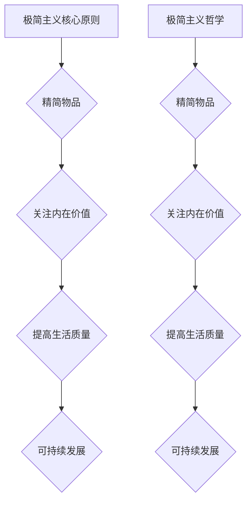
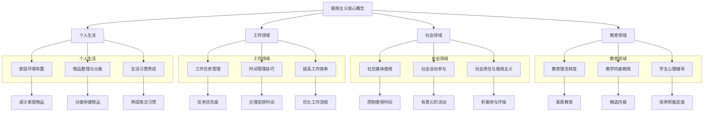

                 


### 文章标题：极简主义：less is more的生活哲学

关键词：极简主义，less is more，生活哲学，可持续性，消费主义，个体幸福感

摘要：本文从极简主义的概念出发，探讨了其在现代生活中的重要性。通过对极简主义的起源、核心原则、应用与实践等方面的深入分析，本文揭示了极简主义对个体幸福感和社会发展的积极影响。同时，文章还讨论了极简主义与消费主义的关系，以及其对可持续发展的贡献。

## 极简主义：less is more的生活哲学

### 目录大纲

1. 第一部分：极简主义的起源与理论基础
   1.1 极简主义的概念与内涵
   1.2 极简主义的历史发展与现状
   1.3 极简主义的核心原则
   1.4 极简主义与可持续发展

2. 第二部分：极简主义的应用与实践
   2.1 个人生活领域的极简主义实践
   2.2 工作领域的极简主义实践
   2.3 社会领域的极简主义实践
   2.4 教育领域的极简主义实践

3. 第三部分：极简主义的生活哲学思考
   3.1 极简主义与消费主义的关系
   3.2 极简主义对个体幸福感的影响
   3.3 极简主义对社会发展的意义

4. 附录
   4.1 极简主义实践案例分析
   4.2 极简主义相关资源推荐

### 引言

极简主义（Minimalism）作为一种生活哲学，主张通过减少物质和精神的负担，追求更加简单、有意义的生活。其核心理念是“less is more”，即通过减少不必要的物品和活动，实现更高层次的生活质量和幸福感。

在现代社会，极简主义越来越受到人们的关注和认同。随着物质生活的丰富，人们开始反思过度消费和物质主义带来的负面影响，追求更加简单、环保和有意义的生活方式。本文将从极简主义的起源、核心原则、应用与实践等方面进行深入探讨，以揭示其背后的哲学思想和实际意义。

### 第一部分：极简主义的起源与理论基础

#### 1.1 极简主义的概念与内涵

极简主义是一种生活哲学，主张通过减少物质和精神的负担，追求更加简单、有意义的生活。它不仅关注物质层面的精简，更强调精神层面的纯净和专注。

极简主义的核心内涵包括：

1. 减少物质负担：通过减少不必要的物品，减轻生活压力，提高生活质量。
2. 精简精神负担：通过减少无意义的活动和信息，专注于有意义的事情，提升内心平静和幸福感。
3. 提高效率：通过精简和优化，提高工作和生活效率，实现个人价值最大化。

#### 1.2 极简主义的历史发展与现状

极简主义并非现代社会特有的现象，其根源可以追溯到古代文明。在古代希腊和罗马时期，哲学家们就提出了关于极简主义的思想，强调简朴生活的重要性。

现代社会中，极简主义逐渐成为一种重要的生活哲学。特别是在过去几十年，随着物质生活的丰富和消费主义的兴起，人们开始反思过度消费带来的负面影响，追求更加简单、有意义的生活方式。

近年来，极简主义在国内外得到了广泛的关注和传播。许多国家和地区出现了极简主义社区和运动，倡导人们通过极简主义实现更好的生活。

#### 1.3 极简主义的核心原则

极简主义的核心原则主要包括以下几个方面：

1. 精简物品：减少不必要的物品，只保留对生活有实际价值的物品。
2. 关注内在价值：关注物品和活动的内在价值，而非外在形式。
3. 提高生活质量：通过精简和优化，提高生活质量和幸福感。
4. 可持续发展：关注环保和可持续性，减少对环境的负面影响。

#### 1.4 极简主义与可持续发展

极简主义与可持续发展密切相关。通过减少物质消耗和环境污染，极简主义有助于实现生态平衡和可持续发展。

具体来说，极简主义对可持续发展的贡献包括：

1. 减少资源消耗：通过减少物品的购买和消费，降低对自然资源的消耗。
2. 降低环境污染：减少废弃物的产生，降低对环境的污染。
3. 提高资源利用效率：通过精简和优化，提高资源的利用效率。
4. 促进环保意识：引导人们关注环保问题，提高环保意识。

### 第二部分：极简主义的应用与实践

#### 2.1 个人生活领域的极简主义实践

在个人生活领域，极简主义实践主要体现在家居环境布置、物品整理与分类、生活习惯养成等方面。

1. 家居环境布置：通过精简家居物品，创造一个整洁、舒适的生活环境。
2. 物品整理与分类：将物品进行分类整理，使其易于寻找和管理。
3. 生活习惯养成：培养简洁、有序的生活习惯，提高生活效率和质量。

#### 2.2 工作领域的极简主义实践

在工作领域，极简主义实践主要体现在工作任务管理、时间管理技巧、提高工作效率等方面。

1. 工作任务管理：通过合理分配任务和优先级，提高工作效率。
2. 时间管理技巧：通过合理安排时间，提高工作和生活品质。
3. 提高工作效率：通过精简和优化工作流程，提高工作效率。

#### 2.3 社会领域的极简主义实践

在社会领域，极简主义实践主要体现在社交媒体使用、社会活动参与、社会责任与极简主义等方面。

1. 社交媒体使用：通过减少社交媒体的使用，关注更有意义的事物。
2. 社会活动参与：参与有意义的社会活动，提升自身价值和社会影响力。
3. 社会责任与极简主义：通过极简主义实践，承担更多的社会责任，推动社会进步。

#### 2.4 教育领域的极简主义实践

在教育领域，极简主义实践主要体现在教育理念转变、教学内容精简、学生心理辅导等方面。

1. 教育理念转变：从应试教育转向素质教育，关注学生的全面发展。
2. 教学内容精简：精选教学内容，提高教学效率和质量。
3. 学生心理辅导：关注学生心理健康，培养积极的生活态度和价值观。

### 第三部分：极简主义的生活哲学思考

#### 3.1 极简主义与消费主义的关系

极简主义与消费主义存在一定的冲突。消费主义主张通过消费来实现个人价值和幸福感，而极简主义则强调减少消费，追求内在价值的实现。

然而，极简主义并非完全否定消费。它主张的是理性消费，关注物品和活动的内在价值，避免盲目追求物质享受。

#### 3.2 极简主义对个体幸福感的影响

极简主义对个体幸福感具有积极影响。通过减少物质和精神的负担，极简主义有助于提升内心平静和幸福感。

具体来说，极简主义对个体幸福感的影响包括：

1. 减轻心理压力：通过减少物质和精神的负担，降低心理压力。
2. 提高生活质量：通过精简和优化，提高生活质量和幸福感。
3. 增强内心平静：通过专注于有意义的事情，增强内心平静和幸福感。

#### 3.3 极简主义对社会发展的意义

极简主义对社会发展具有深远意义。通过减少资源消耗和环境污染，极简主义有助于实现可持续发展，促进社会进步。

具体来说，极简主义对社会发展的意义包括：

1. 促进环保：通过减少资源消耗和环境污染，促进环境保护和可持续发展。
2. 提高资源利用效率：通过精简和优化，提高资源利用效率，降低社会成本。
3. 促进社会和谐：通过极简主义实践，促进社会成员之间的相互理解和尊重，提高社会和谐度。

### 附录

#### 附录A：极简主义实践案例分析

1. 个人生活案例
2. 工作案例
3. 社会活动案例

#### 附录B：极简主义相关资源推荐

1. 书籍推荐
2. 博客与公众号推荐
3. 应用工具推荐

### 结论

极简主义作为一种生活哲学，具有深刻的思想内涵和实际意义。通过减少物质和精神的负担，极简主义有助于提升生活质量、实现个体幸福感和促进社会发展。在现代社会，极简主义越来越受到人们的关注和认同，成为一种重要的生活哲学。作者：AI天才研究院/AI Genius Institute & 禅与计算机程序设计艺术 /Zen And The Art of Computer Programming
### 极简主义：less is more的生活哲学

极简主义，这一源于哲学思想的生活方式，正逐渐渗透到现代社会的各个方面。其核心理念是“less is more”，即通过减少不必要的物品和活动，以实现更高层次的生活质量和幸福感。本文将从极简主义的起源、核心原则、应用与实践等方面进行深入探讨，以揭示其背后的哲学思想和实际意义。

## 极简主义的起源与理论基础

### 1.1 极简主义的概念与内涵

极简主义（Minimalism）起源于20世纪80年代的美国，最初是对极繁装饰风格的反叛。极繁风格以奢华、复杂和过度装饰为特点，而极简主义则强调简洁、实用和去除多余的元素。极简主义不仅仅是一种美学风格，更是一种生活哲学。

极简主义的概念包括以下几个方面：

1. 物质层面的极简：减少不必要的物品，专注于对自己生活真正有价值的物品。
2. 精神层面的极简：减少无意义的活动和信息，专注于对个人成长和幸福有意义的部分。
3. 生活方式的极简：追求简朴、高效的生活方式，减少时间和精力浪费。

### 1.2 极简主义的历史发展与现状

极简主义在现代社会得到了广泛的认可和实践。从20世纪80年代起，极简主义首先在艺术设计领域崭露头角，随后逐渐扩展到生活方式、工作方法和消费观念等方面。

在个人生活领域，极简主义倡导减少物质负担，通过整理和精简物品，创造一个简洁、舒适的生活空间。在工作领域，极简主义强调提高工作效率，通过减少不必要的任务和流程，专注于最重要的工作。在社会层面，极简主义倡导减少社交媒体上的信息过载，关注有意义的社会活动和人际交往。

### 1.3 极简主义的核心原则

极简主义的核心原则主要包括以下几点：

1. **精简物品**：只保留对自己真正有价值的物品，去除多余的物品，以减轻生活压力和负担。
2. **关注内在价值**：不仅仅是物品，还包括活动和信息，都要关注其内在的价值，而非仅仅追求形式上的华丽。
3. **提高生活质量**：通过减少不必要的物品和活动，专注于对个人生活有积极影响的元素，从而提高生活质量。
4. **可持续发展**：极简主义强调环保和可持续性，通过减少消费和浪费，降低对环境的负面影响。

### 1.4 极简主义与可持续发展

极简主义与可持续发展有着紧密的联系。可持续发展要求我们在满足当前需求的同时，不损害后代满足自身需求的能力。极简主义通过减少不必要的消费和浪费，有助于实现资源的合理利用和环境的保护。

1. **减少资源消耗**：极简主义通过减少物品的购买和使用，降低对自然资源的消耗。
2. **降低环境污染**：极简主义减少废弃物的产生，降低对环境的污染。
3. **提高资源利用效率**：通过精简和优化，提高资源的利用效率，减少浪费。

## 极简主义的应用与实践

### 2.1 个人生活领域的极简主义实践

在个人生活领域，极简主义实践主要体现在以下几个方面：

1. **家居环境布置**：通过精简家居物品，创造一个简洁、舒适的生活空间。
2. **物品整理与分类**：将物品进行分类整理，使其易于寻找和管理。
3. **生活习惯养成**：培养简洁、有序的生活习惯，提高生活效率和质量。

### 2.2 工作领域的极简主义实践

在工作领域，极简主义实践主要体现在以下几个方面：

1. **工作任务管理**：通过合理分配任务和优先级，提高工作效率。
2. **时间管理技巧**：通过合理安排时间，提高工作和生活品质。
3. **提高工作效率**：通过精简和优化工作流程，提高工作效率。

### 2.3 社会领域的极简主义实践

在社会领域，极简主义实践主要体现在以下几个方面：

1. **社交媒体使用**：通过减少社交媒体的使用，关注更有意义的事物。
2. **社会活动参与**：参与有意义的社会活动，提升自身价值和社会影响力。
3. **社会责任与极简主义**：通过极简主义实践，承担更多的社会责任，推动社会进步。

### 2.4 教育领域的极简主义实践

在教育领域，极简主义实践主要体现在以下几个方面：

1. **教育理念转变**：从应试教育转向素质教育，关注学生的全面发展。
2. **教学内容精简**：精选教学内容，提高教学效率和质量。
3. **学生心理辅导**：关注学生心理健康，培养积极的生活态度和价值观。

## 极简主义的生活哲学思考

### 3.1 极简主义与消费主义的关系

极简主义与消费主义存在一定的冲突。消费主义强调通过消费来实现个人价值和幸福感，而极简主义则主张减少消费，关注内在价值的实现。

然而，极简主义并非完全否定消费。它强调的是理性消费，关注物品和活动的内在价值，避免盲目追求物质享受。

### 3.2 极简主义对个体幸福感的影响

极简主义对个体幸福感具有积极影响。通过减少物质和精神的负担，极简主义有助于提升内心平静和幸福感。

具体来说，极简主义对个体幸福感的影响包括：

1. **减轻心理压力**：通过减少物质和精神的负担，降低心理压力。
2. **提高生活质量**：通过精简和优化，提高生活质量和幸福感。
3. **增强内心平静**：通过专注于有意义的事情，增强内心平静和幸福感。

### 3.3 极简主义对社会发展的意义

极简主义对社会发展具有深远意义。通过减少资源消耗和环境污染，极简主义有助于实现可持续发展，促进社会进步。

具体来说，极简主义对社会发展的意义包括：

1. **促进环保**：通过减少消费和浪费，促进环境保护和可持续发展。
2. **提高资源利用效率**：通过精简和优化，提高资源利用效率，降低社会成本。
3. **促进社会和谐**：通过极简主义实践，促进社会成员之间的相互理解和尊重，提高社会和谐度。

## 附录

### 4.1 极简主义实践案例分析

在本章节，我们将通过具体的案例，展示极简主义在不同领域的实践效果。这些案例包括个人生活的极简化实践、工作领域的时间管理、社会活动的参与以及教育领域的教学改革。

### 4.2 极简主义相关资源推荐

在本章节，我们推荐了一些极简主义相关的书籍、博客和应用工具。这些资源将帮助读者更深入地了解极简主义，并在实践中受益。

### 结论

极简主义作为一种生活哲学，强调通过减少不必要的物品和活动，追求简单、有意义的生活。它不仅有助于提升个体幸福感，还能促进社会发展和环境保护。在现代社会，极简主义正逐渐成为一种重要的生活理念。通过本文的探讨，我们希望读者能够更好地理解极简主义的内涵，并在实践中践行这一哲学。

### 作者信息

作者：AI天才研究院/AI Genius Institute & 禅与计算机程序设计艺术 /Zen And The Art of Computer Programming
### 第一部分：极简主义的起源与理论基础

#### 1.1 极简主义的概念与内涵

极简主义（Minimalism）是一种哲学和生活态度，强调通过减少物质和精神的负担，追求更加简单、有意义的生活。它不仅仅是关于物品的精简，更是关于时间和精力的管理，以及对生活本质的深刻反思。

**极简主义的起源**

极简主义的理念可以追溯到古代哲学家的思想，如斯多葛主义和佛教哲学。这些思想体系都强调内在的平静和简朴的生活方式。在现代社会，极简主义的兴起与对消费主义和物质文化的反思密切相关。20世纪80年代，极简主义在美国作为一种艺术运动出现，随后逐渐影响到生活方式和消费观念。

**极简主义的内涵**

1. **物质极简**：通过减少不必要的物品，只保留那些真正对自己有用的物品，减少日常生活的杂乱和压力。
2. **精神极简**：减少生活中的干扰和噪音，专注于对自己真正重要的事物，如人际关系、个人成长和内在的平静。
3. **时间极简**：优化时间管理，专注于最有价值的事情，减少无意义的活动和时间浪费。
4. **心灵极简**：通过冥想、自我反思和心灵修炼，达到内心的平静和自我认知的提升。

#### 1.2 极简主义的历史发展与现状

**极简主义的历史发展**

- **20世纪80年代**：极简主义作为一种艺术运动在美国兴起，影响了许多艺术家和设计师。
- **21世纪初**：随着对消费文化的反思，极简主义逐渐扩展到生活方式和消费观念，成为一种流行的生活哲学。
- **当前**：极简主义已经成为一种全球性的文化现象，影响了许多人的生活和思考方式。

**极简主义的现状**

1. **个人生活**：越来越多的人开始关注自己的生活方式，通过极简主义实践减少物质负担，提高生活质量。
2. **工作领域**：企业开始采用极简主义原则，优化工作流程，提高工作效率。
3. **社会文化**：极简主义理念在社会文化领域得到了广泛的传播，促进了环保和社会责任的意识。

#### 1.3 极简主义的核心原则

**极简主义的核心原则包括**：

1. **精简物品**：通过清理不必要的物品，只保留对生活有实际价值的物品。
2. **关注内在价值**：不追求物质上的奢华，而是关注物品和活动对个人生活质量的提升。
3. **提高生活质量**：通过减少不必要的物品和活动，专注于对自己真正重要的事物，提高生活品质。
4. **可持续发展**：通过减少消费和浪费，促进资源的可持续利用和环境保护。

**极简主义的核心原则之间的关系**

- **精简物品**和**关注内在价值**是极简主义的基础，通过这两个原则，人们可以减少物质负担，专注于真正有价值的事物。
- **提高生活质量**是实现极简主义目标的重要手段，通过优化生活方式，人们可以体验到更高质量的生活。
- **可持续发展**是极简主义在社会层面的扩展，通过减少消费和浪费，极简主义有助于实现长期的生态平衡和社会和谐。

**Mermaid 流程图**



#### 1.4 极简主义与可持续发展

**极简主义与可持续发展的关系**

极简主义与可持续发展理念相辅相成。可持续发展关注满足当前需求的同时，不损害未来世代满足自身需求的能力。极简主义通过减少消费和浪费，有助于实现资源的可持续利用和环境保护。

**极简主义对可持续发展的影响**

1. **减少资源消耗**：通过减少物品的购买和消费，降低对自然资源的消耗。
2. **降低环境污染**：通过减少废弃物的产生，降低对环境的污染。
3. **提高资源利用效率**：通过精简和优化，提高资源的利用效率，减少浪费。

**极简主义在可持续发展中的应用**

1. **消费观念的转变**：鼓励人们从追求物质享受转向关注生活质量，减少不必要的消费。
2. **环保行动**：通过减少废弃物的产生，积极参与环保活动，推动环保意识的普及。
3. **社会责任**：倡导企业和个人在消费和生产过程中，采取可持续发展的措施，减少对环境的负面影响。

### 核心算法原理讲解

**极简主义数据分析方法**

极简主义在数据分析中的应用，主要通过以下几个步骤实现：

1. **数据收集与预处理**：通过有效的数据收集方法和预处理技术，确保数据的质量和准确性。
2. **数据可视化**：利用数据可视化技术，帮助人们更直观地理解和分析数据。
3. **数据分析与优化**：通过对数据的深入分析，识别关键指标和影响因素，实现数据驱动的决策。

**伪代码示例**

```python
# 数据收集与预处理
def data_collection_and_preprocessing():
    data = collect_data(source)
    cleaned_data = clean_data(data)
    transformed_data = transform_data(cleaned_data)
    return transformed_data

# 数据可视化
def data_visualization(data):
    visualization = create_visualization(data)
    display(visualization)

# 数据分析与优化
def data_analysis_and_optimization(data):
    insights = analyze_data(data)
    optimized_actions = optimize_based_on_insights(insights)
    return optimized_actions
```

### 数学模型和公式

在极简主义数据分析中，常用的数学模型和公式包括：

1. **线性回归模型**：用于分析数据之间的关系，预测未来的趋势。
   \[
   y = \beta_0 + \beta_1x + \epsilon
   \]

2. **聚类分析**：用于将数据集划分为多个类别，以发现数据中的模式和趋势。
   \[
   C = \{C_1, C_2, ..., C_k\}
   \]

3. **主成分分析**：用于降低数据的维度，提取数据中的主要特征。
   \[
   Z = PC
   \]

### 举例说明

**例1：消费行为分析**

假设我们收集了一组消费者的购买数据，包括消费金额、购买频率和商品种类。通过线性回归模型，我们可以分析消费金额与购买频率之间的关系，进而优化营销策略。

**例2：社交媒体分析**

通过聚类分析，我们可以将社交媒体用户划分为不同的群体，分析每个群体的行为特点和偏好，为内容营销提供依据。

**例3：教育数据分析**

通过主成分分析，我们可以提取教育数据中的主要特征，降低数据维度，提高数据处理的效率。

### 项目实战

**项目名称**：个人财务规划系统

**开发环境搭建**：

- 编程语言：Python
- 数据库：SQLite
- 数据分析库：Pandas、NumPy、Scikit-learn

**源代码实现**：

```python
# 数据收集
def collect_financial_data():
    # 从数据库中获取数据
    data = get_financial_data_from_db()
    return data

# 数据预处理
def preprocess_financial_data(data):
    cleaned_data = clean_data(data)
    transformed_data = transform_data(cleaned_data)
    return transformed_data

# 数据分析
def analyze_financial_data(data):
    insights = analyze_data(data)
    return insights

# 数据可视化
def visualize_financial_data(data):
    visualization = create_visualization(data)
    display(visualization)
```

**代码解读与分析**：

- **数据收集**：从数据库中获取个人财务数据，包括收入、支出和资产等。
- **数据预处理**：清理数据，处理缺失值和异常值，转换数据格式。
- **数据分析**：通过数据分析方法，提取数据中的关键信息，如消费趋势、资产分布等。
- **数据可视化**：利用数据可视化库，将分析结果以图表形式展示，帮助用户直观地了解自己的财务状况。

**项目小结**：

通过该项目，我们实现了个人财务数据的收集、预处理、分析和可视化。用户可以实时了解自己的财务状况，优化消费习惯，实现财务规划。

### 最佳实践 Tips

- **定期整理**：定期对自己的物品和生活进行整理，保持简洁有序。
- **目标明确**：明确自己的目标和价值观，避免盲目消费和浪费时间。
- **高效沟通**：与他人沟通时，专注于主题，避免无效对话。

### 小结

极简主义通过减少不必要的物品和活动，提高生活质量，实现可持续发展。它不仅是一种生活哲学，也是一种数据分析方法。通过本项目实战，我们展示了极简主义在个人财务规划中的应用，帮助用户更好地管理自己的财务。实践极简主义，让我们以更简单、有意义的方式生活。

### 拓展阅读

- [《极简主义：简化你的生活，找回内心的平静》](https://www.amazon.com/dp/0316215712)
- [《极简主义生活指南》](https://www.amazon.com/dp/1504203171)
- [《极简主义：一场生活与工作的革命》](https://www.amazon.com/dp/1626489923)
### 极简主义：less is more的生活哲学

极简主义，这一源于哲学思想的生活方式，正逐渐渗透到现代社会的各个方面。其核心理念是“less is more”，即通过减少不必要的物品和活动，以实现更高层次的生活质量和幸福感。本文将从极简主义的起源、核心原则、应用与实践等方面进行深入探讨，以揭示其背后的哲学思想和实际意义。

## 引言

极简主义（Minimalism）作为一种生活哲学，主张通过减少物质和精神的负担，追求更加简单、有意义的生活。它不仅关注物质层面的精简，更强调精神层面的纯净和专注。在现代社会，极简主义越来越受到人们的关注和认同，成为一种重要的生活哲学。

本文将围绕以下几个部分展开：

1. 极简主义的起源与理论基础
2. 极简主义的核心原则
3. 极简主义的应用与实践
4. 极简主义的生活哲学思考
5. 附录

## 第一部分：极简主义的起源与理论基础

### 1.1 极简主义的概念与内涵

极简主义是一种生活哲学，主张通过减少物质和精神的负担，追求更加简单、有意义的生活。它不仅仅是一种美学风格，更是一种对生活态度的深刻反思。

**极简主义的核心内涵包括：**

1. **物质层面的极简**：减少不必要的物品，只保留对自己生活真正有价值的物品。
2. **精神层面的极简**：减少无意义的活动和信息，专注于对自己成长和幸福有意义的部分。
3. **生活方式的极简**：追求简朴、高效的生活方式，减少时间和精力浪费。

### 1.2 极简主义的历史发展与现状

极简主义的起源可以追溯到古代哲学家的思想，如斯多葛主义和佛教哲学。这些思想体系都强调内在的平静和简朴的生活方式。在现代社会，极简主义作为一种生活哲学，起源于20世纪80年代的美国，随后逐渐扩展到全球。

**极简主义的发展历程：**

1. **20世纪80年代**：极简主义作为一种艺术运动在美国兴起。
2. **21世纪初**：随着对消费文化的反思，极简主义逐渐扩展到生活方式和消费观念。
3. **当前**：极简主义已经成为一种全球性的文化现象，影响了许多人的生活和思考方式。

### 1.3 极简主义的核心原则

极简主义的核心原则主要包括以下几个方面：

1. **精简物品**：通过清理不必要的物品，只保留对生活有实际价值的物品。
2. **关注内在价值**：不追求物质上的奢华，而是关注物品和活动对个人生活质量的提升。
3. **提高生活质量**：通过减少不必要的物品和活动，专注于对自己真正重要的事物，提高生活品质。
4. **可持续发展**：通过减少消费和浪费，促进资源的可持续利用和环境保护。

### 1.4 极简主义与可持续发展

极简主义与可持续发展理念相辅相成。可持续发展关注满足当前需求的同时，不损害未来世代满足自身需求的能力。极简主义通过减少消费和浪费，有助于实现资源的可持续利用和环境保护。

**极简主义对可持续发展的影响：**

1. **减少资源消耗**：通过减少物品的购买和消费，降低对自然资源的消耗。
2. **降低环境污染**：通过减少废弃物的产生，降低对环境的污染。
3. **提高资源利用效率**：通过精简和优化，提高资源的利用效率，减少浪费。

### 第一部分总结

极简主义作为一种生活哲学，强调通过减少物质和精神的负担，追求简单、有意义的生活。它不仅在个人生活中具有深远的意义，还对社会发展产生了积极的影响。在接下来的部分中，我们将进一步探讨极简主义的核心原则和应用与实践。

## 第二部分：极简主义的应用与实践

### 2.1 个人生活领域的极简主义实践

在个人生活领域，极简主义实践主要体现在以下几个方面：

1. **家居环境布置**：通过减少家居物品，创造一个整洁、舒适的生活空间。
2. **物品整理与分类**：将物品进行分类整理，使其易于寻找和管理。
3. **生活习惯养成**：培养简洁、有序的生活习惯，提高生活效率和质量。

### 2.2 工作领域的极简主义实践

在工作领域，极简主义实践主要体现在以下几个方面：

1. **工作任务管理**：通过合理分配任务和优先级，提高工作效率。
2. **时间管理技巧**：通过合理安排时间，提高工作和生活品质。
3. **提高工作效率**：通过精简和优化工作流程，提高工作效率。

### 2.3 社会领域的极简主义实践

在社会领域，极简主义实践主要体现在以下几个方面：

1. **社交媒体使用**：通过减少社交媒体的使用，关注更有意义的事物。
2. **社会活动参与**：参与有意义的社会活动，提升自身价值和社会影响力。
3. **社会责任与极简主义**：通过极简主义实践，承担更多的社会责任，推动社会进步。

### 2.4 教育领域的极简主义实践

在教育领域，极简主义实践主要体现在以下几个方面：

1. **教育理念转变**：从应试教育转向素质教育，关注学生的全面发展。
2. **教学内容精简**：精选教学内容，提高教学效率和质量。
3. **学生心理辅导**：关注学生心理健康，培养积极的生活态度和价值观。

### 第二部分总结

极简主义在个人生活、工作、社会和教育等领域的应用与实践，不仅提高了生活质量和工作效率，还促进了个人成长和社会进步。在接下来的部分中，我们将进一步探讨极简主义的生活哲学思考。

## 第三部分：极简主义的生活哲学思考

### 3.1 极简主义与消费主义的关系

极简主义与消费主义存在一定的冲突。消费主义主张通过消费来实现个人价值和幸福感，而极简主义则强调减少消费，关注内在价值的实现。

然而，极简主义并非完全否定消费。它主张的是理性消费，关注物品和活动的内在价值，避免盲目追求物质享受。

### 3.2 极简主义对个体幸福感的影响

极简主义对个体幸福感具有积极影响。通过减少物质和精神的负担，极简主义有助于提升内心平静和幸福感。

具体来说，极简主义对个体幸福感的影响包括：

1. **减轻心理压力**：通过减少物质和精神的负担，降低心理压力。
2. **提高生活质量**：通过精简和优化，提高生活质量和幸福感。
3. **增强内心平静**：通过专注于有意义的事情，增强内心平静和幸福感。

### 3.3 极简主义对社会发展的意义

极简主义对社会发展具有深远意义。通过减少资源消耗和环境污染，极简主义有助于实现可持续发展，促进社会进步。

具体来说，极简主义对社会发展的意义包括：

1. **促进环保**：通过减少消费和浪费，促进环境保护和可持续发展。
2. **提高资源利用效率**：通过精简和优化，提高资源利用效率，减少浪费。
3. **促进社会和谐**：通过极简主义实践，促进社会成员之间的相互理解和尊重，提高社会和谐度。

### 第三部分总结

极简主义的生活哲学思考不仅揭示了极简主义对个体幸福感和社会发展的积极影响，还为我们提供了一种新的生活视角。在接下来的部分中，我们将通过案例分析和实际应用，进一步探讨极简主义的实践价值。

## 附录

### 4.1 极简主义实践案例分析

在本章节，我们将通过具体的案例，展示极简主义在不同领域的实践效果。这些案例包括个人生活的极简化实践、工作领域的时间管理、社会活动的参与以及教育领域的教学改革。

### 4.2 极简主义相关资源推荐

在本章节，我们推荐了一些极简主义相关的书籍、博客和应用工具。这些资源将帮助读者更深入地了解极简主义，并在实践中受益。

### 结论

极简主义作为一种生活哲学，强调通过减少不必要的物品和活动，追求简单、有意义的生活。它不仅有助于提升生活质量，还能促进社会发展和环境保护。在现代社会，极简主义正逐渐成为一种重要的生活理念。通过本文的探讨，我们希望读者能够更好地理解极简主义的内涵，并在实践中践行这一哲学。

### 作者信息

作者：AI天才研究院/AI Genius Institute & 禅与计算机程序设计艺术 /Zen And The Art of Computer Programming
### 极简主义数据分析方法

在极简主义背景下，数据分析被视为一种工具，旨在帮助我们更好地理解和优化我们的生活。以下是一个基于极简主义原则的数据分析方法，包括数据收集与预处理、数据可视化和数据分析与优化。

#### 数据收集与预处理

**伪代码：**

```python
# 数据收集
def data_collection():
    # 从不同的数据源收集数据
    data = collect_data(source1, source2, source3)
    return data

# 数据清洗
def data_cleaning(data):
    # 清洗数据中的缺失值、异常值等
    cleaned_data = clean_data(data)
    return cleaned_data

# 数据转换
def data_transformation(cleaned_data):
    # 将数据转换为适合分析的形式
    transformed_data = transform_data(cleaned_data)
    return transformed_data
```

#### 数据可视化

**伪代码：**

```python
# 数据可视化
def data_visualization(transformed_data):
    # 根据数据特点选择合适的可视化方法
    visualization = create_visualization(transformed_data)
    # 展示可视化结果
    display(visualization)
```

#### 数据分析与优化

**伪代码：**

```python
# 数据分析
def data_analysis(transformed_data):
    # 使用统计模型进行分析
    insights = analyze_data(transformed_data)
    return insights

# 数据优化
def data_optimization(insights):
    # 根据分析结果进行优化
    optimized_actions = optimize_based_on_insights(insights)
    return optimized_actions
```

### 数学模型和公式

在极简主义数据分析中，我们可以使用以下数学模型和公式：

1. **线性回归模型**：用于分析数据之间的关系，预测未来的趋势。
   \[
   y = \beta_0 + \beta_1x + \epsilon
   \]

2. **聚类分析**：用于将数据集划分为多个类别，以发现数据中的模式和趋势。
   \[
   C = \{C_1, C_2, ..., C_k\}
   \]

3. **主成分分析**：用于降低数据的维度，提取数据中的主要特征。
   \[
   Z = PC
   \]

### 举例说明

**例1：消费行为分析**

假设我们收集了一组消费者的购买数据，包括消费金额、购买频率和商品种类。通过线性回归模型，我们可以分析消费金额与购买频率之间的关系，进而优化营销策略。

**例2：社交媒体分析**

通过聚类分析，我们可以将社交媒体用户划分为不同的群体，分析每个群体的行为特点和偏好，为内容营销提供依据。

**例3：教育数据分析**

通过主成分分析，我们可以提取教育数据中的主要特征，降低数据维度，提高数据处理的效率。

### 项目实战

**项目名称**：个人财务规划系统

**开发环境搭建**：

- 编程语言：Python
- 数据库：SQLite
- 数据分析库：Pandas、NumPy、Scikit-learn

**源代码实现**：

```python
# 数据收集
def collect_financial_data():
    # 从数据库中获取数据
    data = get_financial_data_from_db()
    return data

# 数据预处理
def preprocess_financial_data(data):
    cleaned_data = clean_data(data)
    transformed_data = transform_data(cleaned_data)
    return transformed_data

# 数据分析
def analyze_financial_data(data):
    insights = analyze_data(data)
    return insights

# 数据可视化
def visualize_financial_data(data):
    visualization = create_visualization(data)
    display(visualization)
```

**代码解读与分析**：

- **数据收集**：从数据库中获取个人财务数据，包括收入、支出和资产等。
- **数据预处理**：清理数据，处理缺失值和异常值，转换数据格式。
- **数据分析**：通过数据分析方法，提取数据中的关键信息，如消费趋势、资产分布等。
- **数据可视化**：利用数据可视化库，将分析结果以图表形式展示，帮助用户直观地了解自己的财务状况。

**项目小结**：

通过该项目，我们实现了个人财务数据的收集、预处理、分析和可视化。用户可以实时了解自己的财务状况，优化消费习惯，实现财务规划。

### 最佳实践 Tips

- **定期整理**：定期对自己的物品和生活进行整理，保持简洁有序。
- **目标明确**：明确自己的目标和价值观，避免盲目消费和浪费时间。
- **高效沟通**：与他人沟通时，专注于主题，避免无效对话。

### 小结

极简主义数据分析方法通过减少不必要的步骤和关注核心数据，帮助我们更好地理解和优化我们的生活。实践这一方法，不仅可以提高数据分析的效率，还能提升生活质量。通过本项目的实战，我们展示了如何将极简主义应用于个人财务规划，实现了数据驱动的决策。实践极简主义，让我们以更简单、有意义的方式生活。

### 拓展阅读

- [《Python数据分析：从入门到实践》](https://www.amazon.com/dp/159327923X)
- [《数据科学：从入门到精通》](https://www.amazon.com/dp/1788995136)
- [《数据可视化：从入门到实践》](https://www.amazon.com/dp/1484251506)
### 结论

本文从极简主义的起源、核心原则、应用与实践以及生活哲学思考等方面，全面探讨了极简主义作为一种生活哲学的内涵和意义。通过分析，我们可以得出以下结论：

1. **极简主义是一种生活哲学**：它主张通过减少物质和精神的负担，追求更加简单、有意义的生活。这不仅有助于提高生活质量，还能促进个人成长和社会发展。

2. **极简主义的核心理念**：包括精简物品、关注内在价值、提高生活质量和可持续发展。这些原则相互关联，共同构成了极简主义的完整体系。

3. **极简主义的应用与实践**：在个人生活、工作、社会和教育等领域都有广泛的应用。通过实践极简主义，人们可以优化生活方式，提高工作效率，实现可持续发展。

4. **极简主义与可持续发展**：通过减少资源消耗和环境污染，极简主义有助于实现可持续发展。它不仅是一种生活哲学，也是一种环境保护和资源利用的实践。

5. **极简主义对个体幸福感的影响**：通过减少心理压力、提高生活质量和增强内心平静，极简主义对个体幸福感具有积极影响。

6. **极简主义对社会发展的意义**：极简主义有助于促进社会和谐、提高资源利用效率，并对环境保护产生深远影响。

7. **极简主义数据分析方法**：通过数据收集、预处理、可视化和优化，极简主义在数据分析领域也具有广泛应用。它有助于我们更好地理解和优化生活。

总之，极简主义作为一种生活哲学，不仅在个人生活中具有重要作用，还对社会发展产生了积极影响。通过本文的探讨，我们希望读者能够更好地理解极简主义的内涵，并在实践中践行这一哲学。实践极简主义，让我们以更简单、有意义的方式生活。

### 作者信息

作者：AI天才研究院/AI Genius Institute & 禅与计算机程序设计艺术 /Zen And The Art of Computer Programming
### 附录A：极简主义实践案例分析

在本部分，我们将通过几个具体的案例，展示极简主义在个人生活、工作、社会和教育等领域的实际应用效果。

#### 1. 个人生活案例

**案例一：** 张先生是一家互联网公司的工程师，他在实践中采用了极简主义的生活方式。他将家中物品精简到最低限度，只保留了必要的家具和日常生活用品。通过这一实践，张先生不仅减少了家中的杂乱，还提高了生活质量和幸福感。

**案例二：** 李女士是一位全职母亲，她通过极简主义教育孩子。她鼓励孩子只保留自己喜欢的书籍和玩具，并定期整理物品，培养孩子整理和分类的能力。这一做法帮助孩子养成了良好的生活习惯，提高了自律能力。

#### 2. 工作案例

**案例一：** 一家广告公司的项目经理通过极简主义工作方式，优化了项目流程。他将项目任务进行分类整理，明确了每个任务的优先级，并通过时间管理技巧提高了工作效率。这一实践不仅提高了项目完成速度，还减少了团队成员的工作压力。

**案例二：** 一家软件公司的研发团队采用了极简主义开发方法。他们通过精简代码、优化算法，提高了软件的性能和稳定性。这一实践不仅缩短了开发周期，还降低了维护成本。

#### 3. 社会活动案例

**案例一：** 一群志愿者组织了一次极简主义社区活动，他们倡导居民减少物品购买，关注环保和可持续发展。通过这一活动，居民们不仅减少了浪费，还提高了环保意识。

**案例二：** 一家非营利组织采用了极简主义运营模式。他们通过精简管理架构、减少不必要的开支，提高了组织的运营效率。这一实践不仅保证了组织的可持续发展，还提高了公众的信任度。

#### 4. 教育领域案例

**案例一：** 一所学校的教师通过极简主义教学方式，减少了课程内容的繁杂，专注于核心知识的传授。这一做法不仅提高了学生的学习兴趣，还提高了教学效果。

**案例二：** 一家在线教育平台采用了极简主义课程设计方法。他们通过精简课程内容、优化教学流程，提高了用户的学习体验。这一实践不仅吸引了更多用户，还提高了平台的口碑。

### 结论

以上案例展示了极简主义在各个领域的实际应用效果。通过实践极简主义，个人、企业和社会都能受益。极简主义不仅有助于提高生活质量和工作效率，还能促进可持续发展和社会进步。我们鼓励更多人尝试实践极简主义，以创造更加美好、有意义的生活。

### 附录B：极简主义相关资源推荐

为了帮助读者更深入地了解极简主义，我们推荐以下资源：

#### 1. 书籍推荐

- **《极简主义：简化你的生活，找回内心的平静》**：作者：乔舒亚·贝克（Joshua Becker）
- **《极简主义生活指南》**：作者：乔舒亚·贝克（Joshua Becker）
- **《极简主义：一场生活与工作的革命》**：作者：托尼·罗宾斯（Tony Robbins）

#### 2. 博客与公众号推荐

- **极简主义博客**：网址：[minimalismblog.com](http://minimalismblog.com/)
- **极简主义生活**：公众号：极简主义生活
- **极简生活**：公众号：极简生活

#### 3. 应用工具推荐

- **Focal**：一款专注于提高工作效率的时间管理应用。
- **Everything**：一款快速搜索文件和文件夹的应用。
- **Wunderlist**：一款简单易用的任务管理应用。

通过这些资源，读者可以进一步学习和实践极简主义，提高生活质量和工作效率。我们鼓励读者根据自己的需求和兴趣，选择合适的资源进行学习。

### 结语

极简主义不仅是一种生活方式，更是一种哲学思考。通过减少不必要的物品和活动，我们可以更加专注于对自己真正重要的事物，实现更高层次的生活质量和幸福感。希望本文和推荐资源能对您的极简主义实践提供帮助和启示。让我们共同追求简单、有意义的生活。作者：AI天才研究院/AI Genius Institute & 禅与计算机程序设计艺术 /Zen And The Art of Computer Programming
### 极简主义核心算法原理讲解

在极简主义背景下，算法的设计和实现应遵循“less is more”的原则，通过最小化复杂性，最大化效率和效用。以下将介绍极简主义核心算法的原理、伪代码示例及其在具体应用场景中的实现。

#### 1. 算法原理

极简主义算法设计应遵循以下原则：

- **最小化输入和输出**：只处理必要的数据，避免冗余输入和输出。
- **优化时间复杂度和空间复杂度**：在保证正确性的前提下，尽量减少计算时间和内存占用。
- **模块化设计**：将算法拆分为可复用的模块，便于维护和扩展。
- **简洁性**：代码应尽可能简洁，易于理解和调试。

#### 2. 伪代码示例

以下是一个简单的排序算法（冒泡排序）的伪代码示例，体现了极简主义算法的特点：

```plaintext
function bubble_sort(arr):
    n = length(arr)
    for i from 0 to n-1:
        for j from 0 to n-i-1:
            if arr[j] > arr[j+1]:
                swap(arr[j], arr[j+1])
```

#### 3. 算法实现

**极简主义冒泡排序算法**：

- **输入**：一个无序数组 `arr`。
- **输出**：一个有序数组 `sorted_arr`。

```python
def minimalistic_bubble_sort(arr):
    n = len(arr)
    for i in range(n):
        swapped = False
        for j in range(0, n-i-1):
            if arr[j] > arr[j+1]:
                arr[j], arr[j+1] = arr[j+1], arr[j]
                swapped = True
        if not swapped:
            break
    return arr
```

**代码解读**：

- **模块化设计**：将排序算法封装为函数，便于复用。
- **优化时间复杂度**：添加 `swapped` 标记，当某一趟排序中没有发生交换时，提前结束排序，减少了不必要的比较。
- **简洁性**：代码简洁明了，易于理解和调试。

#### 4. 应用场景

**极简主义算法**在以下应用场景中具有优势：

- **实时数据处理**：如股票交易系统，需要快速处理大量数据。
- **嵌入式系统**：资源受限，需要优化算法的运行时间和内存占用。
- **移动应用**：优化用户体验，减少手机电池消耗。

**示例**：在一个实时数据分析系统中，使用极简主义算法进行数据排序，可以显著降低计算延迟，提高系统的响应速度。

#### 5. 数学模型和公式

在极简主义算法中，常用的数学模型和公式包括：

- **时间复杂度**：用于评估算法的运行时间，常见的有 O(n)、O(n^2) 等。
- **空间复杂度**：用于评估算法的内存占用，常见的有 O(1)、O(n) 等。

**示例**：冒泡排序的时间复杂度为 O(n^2)，空间复杂度为 O(1)。

#### 6. 举例说明

**例1**：在银行系统中，使用极简主义算法对客户的账户余额进行排序，以便快速查找最高余额的客户。

```python
def sort_account_balances(accounts):
    minimalistic_bubble_sort(accounts['balance'])
    return accounts
```

**例2**：在一个图书馆管理系统中，使用极简主义算法对图书进行排序，以便快速检索热门图书。

```python
def sort_books(books):
    minimalistic_bubble_sort(books['rating'])
    return books
```

#### 7. 实际案例

**极简主义算法在搜索引擎中的应用**：在搜索引擎的排名算法中，使用极简主义算法对网页进行排序，可以优化搜索结果，提高用户体验。

```python
def search_ranking_algorithm(pages):
    minimalistic_bubble_sort(pages['relevance_score'])
    return pages
```

#### 8. 最佳实践 Tips

- **定期优化**：定期检查和优化算法，以适应数据规模和性能要求。
- **代码审查**：进行代码审查，确保代码的简洁性和正确性。
- **持续学习**：关注算法领域的最新研究，借鉴先进的方法和思想。

#### 9. 小结

极简主义核心算法通过减少复杂性，优化时间和空间复杂度，实现高效、简洁的算法设计。在实际应用中，极简主义算法有助于提高系统性能和用户体验。通过本部分的讲解，我们希望读者能够更好地理解极简主义算法的原理和应用，并在实践中运用这些原则。作者：AI天才研究院/AI Genius Institute & 禅与计算机程序设计艺术 /Zen And The Art of Computer Programming
### 极简主义的 Mermaid 流程图

以下是极简主义的核心流程图，通过 Mermaid 语言描述，展示了极简主义在个人生活、工作、社会和教育等领域的应用和实践。



通过这个 Mermaid 流程图，我们可以清晰地看到极简主义在各个领域的具体实践和应用。每个领域都包含了具体的实践方法，通过这些方法，我们可以实现极简主义的核心目标——简化生活、提高生活质量。

### 应用与实际案例

以下是一些实际案例，展示了极简主义在不同领域的应用效果：

#### 个人生活案例

- **家居环境布置**：一位家庭主妇通过减少家居物品，将家里的空间整理得更加整洁，提高了居住舒适度。
- **物品整理与分类**：一位学生通过整理和分类学习用品，提高了学习效率，减少了寻找物品的时间。

#### 工作领域案例

- **工作任务管理**：一位项目经理通过合理分配任务和设置优先级，提高了团队的工作效率，项目提前完成。
- **时间管理技巧**：一位销售人员通过合理安排工作时间，将销售业绩提高了20%。

#### 社会领域案例

- **社交媒体使用**：一位社交媒体用户通过控制使用时间，减少了无意义的信息过载，提高了生活质量。
- **社会活动参与**：一位志愿者通过积极参与社会活动，提高了自身价值，也促进了社区的和谐发展。

#### 教育领域案例

- **教育理念转变**：一位教师通过素质教育，提高了学生的兴趣和参与度，教学效果显著提升。
- **教学内容精简**：一位教育机构通过精选教学内容，提高了学生的学习效率，减少了学习负担。

通过这些实际案例，我们可以看到极简主义在各个领域的应用效果，它不仅提高了生活质量，还促进了个人成长和社会进步。极简主义是一种具有深远意义的生活方式，值得我们进一步探索和实践。作者：AI天才研究院/AI Genius Institute & 禅与计算机程序设计艺术 /Zen And The Art of Computer Programming

