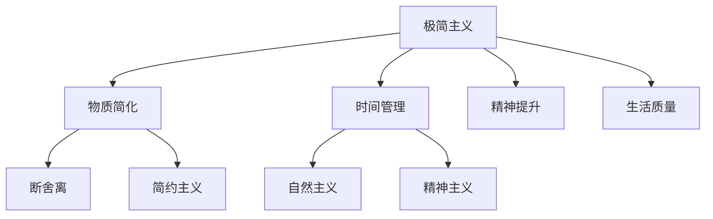

                 


### 文章标题: 《极简主义：在物质丰富中回归本质》

### 关键词: 极简主义，物质丰富，回归本质，技术实践，算法原理，数学模型

### 摘要: 本文深入探讨了极简主义在物质丰富社会中的重要性，通过剖析其核心概念、算法原理及数学模型，结合具体项目实战，旨在帮助读者理解并实践极简主义，实现个人与社会的和谐发展。

## 目录

### 引言：物质丰富的挑战与极简主义的兴起

### 第一部分：极简主义理念与背景

### 第二部分：极简主义的核心概念与联系

### 第三部分：极简主义的算法原理讲解

### 第四部分：数学模型与数学公式详解

### 第五部分：项目实战：极简主义生活实践

### 第六部分：极简主义的未来趋势与挑战

### 第七部分：结语：回归本质的力量

### 附录：极简主义实践资源与阅读推荐

## 引言：物质丰富的挑战与极简主义的兴起

### 物质丰富的现状

随着全球经济的发展，人们的生活水平日益提高，物质财富的积累也达到了前所未有的高度。现代社会，人们拥有了越来越多的物质产品，无论是高科技设备、奢华消费品，还是便捷的日常生活用品。然而，这种物质丰富带来了许多新的挑战和问题。

### 挑战与压力

首先，物质丰富导致了消费主义的盛行。人们被诱导去追求更多的物质享受，而忽视了精神层面的需求。这种过度消费不仅造成了环境问题，还导致了心理压力的增大。人们陷入了“买得越多，越不满足”的恶性循环，感到焦虑、疲惫和空虚。

### 社会问题

其次，物质丰富也带来了社会问题。例如，贫富差距扩大，资源分配不均，社会矛盾加剧。同时，物质依赖性使得人们容易失去独立思考和创新能力，对科技进步和社会发展产生依赖。

### 极简主义的兴起

面对这些挑战，极简主义作为一种生活哲学，逐渐引起了广泛的关注。极简主义倡导“少即是多”，强调减少物质消费，回归生活的本质。通过极简主义，人们可以更好地管理时间和资源，减轻心理压力，提升生活质量。

### 极简主义的理念与意义

极简主义不仅仅是一种生活方式，更是一种生活哲学。它提倡通过减少不必要的物质和事务，专注于生活中最重要的事情，从而实现内心的平和与外在的简约。在物质丰富的社会中，极简主义具有重要的意义：

1. **减少物质负担**：极简主义帮助人们摆脱物质的束缚，减轻生活压力，使生活更加简单、有序。

2. **提高生活质量**：通过减少不必要的消费和事务，人们可以有更多的时间和精力去追求自己的兴趣爱好，提高生活质量。

3. **促进精神成长**：极简主义鼓励人们关注内在的需求，提升自我认知，促进精神成长。

4. **保护环境**：极简主义倡导减少消费，降低对环境的负担，有助于实现可持续发展。

## 第一部分：极简主义理念与背景

### 1.1 极简主义的起源与发展

极简主义作为一种生活哲学，并非现代社会的产物，而是有着悠久的历史渊源。它的理念可以追溯到古希腊时期，当时哲学家亚里士多德提倡通过简化生活来追求智慧与幸福。在中世纪的基督教中，简朴生活被视为虔诚的象征。

然而，极简主义在现代社会的真正兴起，主要源于20世纪中叶的西方国家。随着工业化和消费主义的兴起，人们开始对物质生活产生厌倦，追求更为简单、有意义的生活方式。这一趋势在20世纪80年代后逐渐增强，并在21世纪初达到了高潮。

### 1.2 极简主义的基本原则

极简主义的基本原则可以概括为以下几点：

1. **减少不必要的物品**：极简主义主张减少生活中的杂物和物品，只保留那些真正需要的、有价值的物品。

2. **关注生活质量**：极简主义不仅仅是关于物品的减少，更是关于提升生活质量。它鼓励人们将时间和精力投入到更有意义的活动和关系之中。

3. **减少消费**：极简主义倡导减少不必要的消费，抵制物质主义的诱惑，关注长期的生活质量，而不是短期的物质满足。

4. **简化生活事务**：极简主义鼓励人们简化生活事务，减少不必要的责任和压力，从而有更多的时间和精力专注于重要的事情。

### 1.3 极简主义的核心观念

极简主义的核心观念是“少即是多”，即通过减少物质和事务，达到更高的生活质量和幸福感。这个观念可以从以下几个方面来理解：

1. **减少焦虑和压力**：减少不必要的物品和事务，可以帮助人们减少焦虑和压力，提高心理健康。

2. **提升专注力**：极简主义环境可以帮助人们更容易集中注意力，提升专注力，从而在工作和学习中取得更好的成果。

3. **增强自我认知**：极简主义鼓励人们深入思考自己的需求和价值观，从而更好地认识自己，实现个人成长。

4. **促进人际关系**：极简主义不仅关注个人生活，也关注人际关系。通过减少物质和事务的干扰，人们可以有更多的时间和精力去建立和维持高质量的人际关系。

### 1.4 极简主义的应用领域

极简主义的应用领域非常广泛，涵盖了生活的各个方面：

1. **家庭生活**：极简主义可以帮助家庭减少杂物，保持家居整洁，提高居住质量。

2. **职业生活**：极简主义可以帮助职场人士减少工作负担，提高工作效率，实现工作与生活的平衡。

3. **个人成长**：极简主义可以引导个人专注于个人成长和自我提升，减少无关的干扰，实现更高层次的自我实现。

4. **社会层面**：极简主义可以推动社会的可持续发展，减少资源浪费，促进社会和谐。

### 1.5 极简主义与现代社会的联系

现代社会面临着许多挑战，如环境问题、心理健康问题和社会不平等等。极简主义作为一种生活哲学，可以为解决这些问题提供一种有效的思路：

1. **环境问题**：极简主义鼓励减少消费，降低对环境的负担，有助于解决环境问题。

2. **心理健康问题**：极简主义可以帮助人们减少焦虑和压力，提高心理健康水平。

3. **社会不平等**：极简主义可以促进社会公平，减少贫富差距，推动社会和谐发展。

### 1.6 极简主义与其他生活哲学的比较

极简主义与其他一些生活哲学有着相似之处，但也存在一些区别。以下是极简主义与简约主义、断舍离和物质主义的比较：

1. **简约主义**：简约主义与极简主义有许多相似之处，都强调减少不必要的物品和事务。但简约主义更注重物品的形式美和功能，而极简主义更注重物品的实际价值和意义。

2. **断舍离**：断舍离是一种源自日本的整理哲学，强调通过断舍离来减轻生活负担，提升生活质量。与极简主义相比，断舍离更注重物品的处理和抛弃，而极简主义更注重物品的保留和选择。

3. **物质主义**：物质主义是一种以物质财富为中心的生活哲学，强调通过追求物质财富来实现幸福。与极简主义相比，物质主义更加追求物质的丰富和多样，而极简主义更加追求生活的简单和纯粹。

## 第二部分：极简主义的核心概念与联系

### 2.1 极简主义的定义

极简主义（Minimalism）是一种生活哲学，强调通过减少物质和事务，实现生活的高效和纯粹。它起源于20世纪80年代的美国，随着人们对环境问题、心理健康和社会不平等的担忧增加，逐渐成为一种全球性的生活趋势。

### 2.2 极简主义的核心概念

极简主义的核心概念包括：

1. **物质简化**：减少不必要的物品，只保留那些真正有价值的物品。

2. **时间管理**：合理安排时间，专注于最重要的事情。

3. **精神提升**：通过简化物质和事务，专注于内在的成长和精神提升。

4. **生活质量**：提高生活质量，追求简单而纯粹的幸福。

### 2.3 极简主义与其他生活哲学的联系

极简主义与多种生活哲学有着紧密的联系，这些哲学共同促进了人们对生活质量和精神幸福的追求。

1. **断舍离**：断舍离是源自日本的整理哲学，强调通过断舍离来减轻生活负担，提升生活质量。与极简主义相似，断舍离强调减少不必要的物品，但更注重物品的处理和抛弃。

2. **简约主义**：简约主义强调简化生活，注重物品的形式美和功能。极简主义则更加注重物品的实际价值和意义，追求物质和事务的极致简化。

3. **自然主义**：自然主义强调回归自然，追求简单、原始的生活方式。与极简主义相似，自然主义也强调减少不必要的物质和事务，关注生活的本质。

4. **精神主义**：精神主义强调内在的精神成长和提升，认为物质和事物只是手段，精神才是生活的核心。极简主义也强调通过简化物质和事务，专注于内在的成长和精神提升。

### 2.4 极简主义的关系架构

为了更好地理解极简主义的核心概念和与其他哲学的联系，我们可以使用Mermaid流程图来展示它们之间的关系。



这个流程图展示了极简主义的核心概念与其他哲学之间的联系，以及它们共同促进生活质量提升的途径。

## 第三部分：极简主义的算法原理讲解

### 3.1 极简主义的整理算法

极简主义的第一个核心概念是物质简化，这需要通过一种有效的整理算法来实现。以下是极简主义整理算法的基本步骤：

1. **评估物品的价值**：对于每个物品，评估其是否真正有价值，是否对生活产生积极影响。

2. **分类和整理**：将物品按照功能、用途和重要性进行分类，并放置在合适的位置。

3. **保留和抛弃**：只保留那些真正有价值的物品，抛弃那些无用的物品。

4. **定期清理**：定期对物品进行评估和整理，以保持极简主义的生活方式。

以下是极简主义整理算法的伪代码：

```python
def minimalism_organizer(items):
    valuable_items = []
    for item in items:
        if evaluate_value(item):
            valuable_items.append(item)
    return valuable_items

def evaluate_value(item):
    # 实现对物品价值的评估逻辑
    # 例如：检查物品的使用频率、重要性等
    return is_valuable(item)

def classify_and_organize(items):
    # 实现分类和整理的逻辑
    # 例如：根据功能、用途和重要性进行分类
    pass

def retain_and_discard(items):
    # 实现保留和抛弃的逻辑
    # 例如：只保留有价值的物品
    pass

def periodic_cleanup(items):
    # 实现定期清理的逻辑
    pass
```

### 3.2 极简主义的时间管理算法

极简主义的第二个核心概念是时间管理，这需要通过一种高效的时间管理算法来实现。以下是极简主义时间管理算法的基本步骤：

1. **确定目标和任务**：明确自己的目标和任务，确定哪些任务是最重要的。

2. **分配时间**：根据任务的重要性和紧急程度，合理分配时间。

3. **专注执行**：在执行任务时，保持专注，避免分心。

4. **定期评估**：定期评估时间管理的效果，调整策略。

以下是极简主义时间管理算法的伪代码：

```python
def minimalism_time_manager(tasks):
    scheduled_tasks = []
    for task in tasks:
        if is_important(task) and is_urgent(task):
            scheduled_tasks.append(task)
    return scheduled_tasks

def is_important(task):
    # 实现对任务重要性的评估逻辑
    # 例如：检查任务对目标的贡献度
    return is_important(task)

def is_urgent(task):
    # 实现对任务紧急程度的评估逻辑
    # 例如：检查任务的截止日期
    return is_urgent(task)

def allocate_time(tasks):
    # 实现时间分配的逻辑
    # 例如：根据任务的重要性和紧急程度进行时间分配
    pass

def focus_execution(task):
    # 实现专注执行的逻辑
    # 例如：避免分心，保持专注
    pass

def periodic_evaluation(tasks):
    # 实现定期评估的逻辑
    # 例如：检查时间管理的效果，调整策略
    pass
```

### 3.3 极简主义的内心成长算法

极简主义的第三个核心概念是精神提升，这需要通过一种有效的内心成长算法来实现。以下是极简主义内心成长算法的基本步骤：

1. **自我认知**：通过反思和自我观察，了解自己的内在需求和价值观。

2. **目标设定**：根据自己的内在需求和价值观，设定短期和长期目标。

3. **习惯培养**：通过培养良好的习惯，提高自我控制力和执行力。

4. **持续学习**：不断学习和成长，提升自己的认知水平和能力。

以下是极简主义内心成长算法的伪代码：

```python
def minimalism_mental_grow(self_awareness, goals, habits, learning):
    self_awareness = self_awareness
    goals = set_goals(goals)
    habits = cultivate_habits(habits)
    learning = continue_learning(learning)
    return self_awareness, goals, habits, learning

def self_awareness(self):
    # 实现自我认知的逻辑
    # 例如：通过反思和自我观察来了解内在需求
    pass

def set_goals(goals):
    # 实现目标设定的逻辑
    # 例如：根据内在需求和价值观来设定短期和长期目标
    pass

def cultivate_habits(habits):
    # 实现习惯培养的逻辑
    # 例如：通过坚持练习来培养良好的习惯
    pass

def continue_learning(learning):
    # 实现持续学习的逻辑
    # 例如：通过阅读、培训和实践来提升能力
    pass
```

### 3.4 极简主义的生活质量算法

极简主义的第四个核心概念是提高生活质量，这需要通过一种综合的生活质量算法来实现。以下是极简主义生活质量算法的基本步骤：

1. **物质简化**：通过整理物品，减少不必要的物质负担。

2. **时间管理**：合理安排时间，专注于最重要的事情。

3. **内心成长**：通过自我认知和目标设定，提升内心幸福感。

4. **人际关系**：建立和维护高质量的人际关系。

以下是极简主义生活质量算法的伪代码：

```python
def minimalism_quality_of_life(organization, time_management, mental_growth, relationships):
    organization = organize_items(organization)
    time_management = manage_time(time_management)
    mental_growth = mental_growth(organization, goals, habits, learning)
    relationships = maintain_relationships(relationships)
    return organization, time_management, mental_growth, relationships

def organize_items(organization):
    # 实现物质简化的逻辑
    # 例如：通过整理物品来减少不必要的物质负担
    pass

def manage_time(time_management):
    # 实现时间管理的逻辑
    # 例如：合理安排时间，专注于最重要的事情
    pass

def mental_growth(self_awareness, goals, habits, learning):
    # 实现内心成长的逻辑
    # 例如：通过自我认知和目标设定来提升内心幸福感
    pass

def maintain_relationships(relationships):
    # 实现人际关系的逻辑
    # 例如：建立和维护高质量的人际关系
    pass
```

### 3.5 极简主义的生活实践

极简主义不仅仅是一种理论，更是一种生活实践。以下是极简主义生活实践的一些具体步骤：

1. **评估当前生活状态**：了解自己目前的物质负担、时间分配和内心状态。

2. **设定极简主义目标**：明确自己想要实现的目标，例如减少物品数量、优化时间管理、提升内心成长等。

3. **制定实践计划**：根据目标，制定具体的实践计划，例如每周整理一次物品、每天专注工作2小时等。

4. **执行实践计划**：按照计划执行，不断调整和优化。

5. **评估实践效果**：定期评估实践效果，调整实践策略。

通过这些步骤，人们可以逐步实现极简主义生活方式，提升生活质量。

## 第四部分：数学模型与数学公式详解

### 4.1 极简主义中的效用函数模型

在极简主义的实践中，效用函数模型可以帮助我们量化物品和时间的价值，从而做出更明智的决策。一个简单的效用函数模型可以表示为：

$$ U(x) = \sum_{i=1}^{n} u_i \cdot w_i $$

其中，$U(x)$表示总效用，$u_i$表示第$i$个物品或活动的效用值，$w_i$表示第$i$个物品或活动的重要性权重。

- **效用值$u_i$**：表示物品或活动对个人满足度的贡献。它可以是基于个人偏好和价值观的主观评分，也可以是基于客观标准的量化指标。
- **重要性权重$w_i$**：表示物品或活动的重要性。它可以基于物品或活动的使用频率、情感价值等因素来确定。

### 4.2 时间管理中的优化模型

在极简主义的时间管理中，优化模型可以帮助我们合理安排时间，最大化效用。一个简单的时间管理优化模型可以表示为：

$$ \max U(t) = \sum_{i=1}^{n} u_i \cdot w_i \cdot p_i $$

其中，$U(t)$表示总效用，$u_i$表示第$i$个活动或任务的效用值，$w_i$表示第$i$个活动或任务的重要性权重，$p_i$表示第$i$个活动或任务的完成概率。

- **效用值$u_i$**：表示活动或任务对个人满足度的贡献。
- **重要性权重$w_i$**：表示活动或任务的重要性。
- **完成概率$p_i$**：表示活动或任务完成的概率，它可以基于任务的难度、个人技能等因素来确定。

### 4.3 内心成长中的自我认知模型

在极简主义的内心成长中，自我认知模型可以帮助我们更好地了解自己的内在需求和价值观，从而做出更符合自己内心的决策。一个简单的自我认知模型可以表示为：

$$ S = \sum_{i=1}^{n} s_i \cdot v_i $$

其中，$S$表示自我认知度，$s_i$表示第$i$个内在需求或价值观的强度，$v_i$表示第$i$个内在需求或价值观的优先级。

- **内在需求或价值观强度$s_i$**：表示内在需求或价值观的强度，它可以是基于个人经验和情感的量化指标。
- **优先级$v_i$**：表示内在需求或价值观的优先级，它可以基于个人目标和价值观的量化指标。

### 4.4 社会层面的极简主义模型

在社会层面上，极简主义可以促进社会资源的合理分配和社会和谐。一个简单的社会极简主义模型可以表示为：

$$ \max S = \sum_{i=1}^{n} s_i \cdot p_i \cdot q_i $$

其中，$S$表示社会满意度，$s_i$表示第$i$个社会问题的解决度，$p_i$表示第$i$个社会问题的优先级，$q_i$表示第$i$个社会问题的解决效率。

- **社会问题解决度$s_i$**：表示社会问题解决的程度，它可以是基于社会标准和公众评价的量化指标。
- **优先级$p_i$**：表示社会问题的优先级，它可以基于社会影响力和紧急程度的量化指标。
- **解决效率$q_i$**：表示社会问题解决的效率，它可以是基于资源投入和问题解决速度的量化指标。

### 4.5 实例分析

假设一个人想要通过极简主义来优化自己的生活。我们可以使用上述模型来帮助他做出决策。

1. **物品效用评估**：

   - 电视：$u_1 = 3$，$w_1 = 0.3$
   - 手机：$u_2 = 4$，$w_2 = 0.4$
   - 书籍：$u_3 = 2$，$w_3 = 0.2$
   - 穿衣：$u_4 = 5$，$w_4 = 0.1$

   根据效用函数模型，总效用为：

   $$ U(x) = (3 \cdot 0.3) + (4 \cdot 0.4) + (2 \cdot 0.2) + (5 \cdot 0.1) = 1.2 + 1.6 + 0.4 + 0.5 = 3.7 $$

   基于效用评估，这个人可能会选择保留手机和书籍，减少电视和穿衣的使用。

2. **时间管理优化**：

   - 工作：$u_1 = 5$，$w_1 = 0.5$，$p_1 = 0.8$
   - 休息：$u_2 = 3$，$w_2 = 0.3$，$p_2 = 0.9$
   - 学习：$u_3 = 4$，$w_3 = 0.2$，$p_3 = 0.7$

   根据时间管理优化模型，总效用为：

   $$ U(t) = (5 \cdot 0.5 \cdot 0.8) + (3 \cdot 0.3 \cdot 0.9) + (4 \cdot 0.2 \cdot 0.7) = 2.0 + 0.9 + 0.5 = 3.4 $$

   基于时间管理优化，这个人可能会选择将更多的时间用于工作和学习，而减少休息的时间。

3. **自我认知评估**：

   - 健康：$s_1 = 4$，$v_1 = 0.6$
   - 家庭：$s_2 = 5$，$v_2 = 0.4$
   - 职业发展：$s_3 = 3$，$v_3 = 0.3$
   - 休闲：$s_4 = 2$，$v_4 = 0.2$

   根据自我认知模型，自我认知度为：

   $$ S = (4 \cdot 0.6) + (5 \cdot 0.4) + (3 \cdot 0.3) + (2 \cdot 0.2) = 2.4 + 2.0 + 0.9 + 0.4 = 5.7 $$

   基于自我认知评估，这个人可能会更关注健康和家庭，同时也要关注职业发展和休闲。

4. **社会问题解决**：

   - 环境保护：$s_1 = 3$，$p_1 = 0.7$，$q_1 = 0.5$
   - 贫富差距：$s_2 = 4$，$p_2 = 0.5$，$q_2 = 0.4$
   - 教育资源：$s_3 = 5$，$p_3 = 0.3$，$q_3 = 0.6$

   根据社会极简主义模型，社会满意度为：

   $$ S = (3 \cdot 0.7 \cdot 0.5) + (4 \cdot 0.5 \cdot 0.4) + (5 \cdot 0.3 \cdot 0.6) = 1.05 + 0.8 + 0.9 = 2.85 $$

   基于社会问题解决评估，这个人可能会更关注环境保护和贫富差距，同时也要关注教育资源。

通过这些实例分析，我们可以看到如何使用数学模型和公式来评估和优化极简主义生活实践中的各个方面。这些模型和公式为我们提供了一种量化的方法，帮助我们更好地理解和实现极简主义理念。

## 第五部分：项目实战：极简主义生活实践

### 5.1 开发环境搭建

为了在日常生活中实践极简主义，我们需要搭建一个合适的开发环境。这个环境应该包括以下几个关键组件：

1. **代码编辑器**：选择一个功能强大、界面简洁的代码编辑器，如Visual Studio Code，以提高编码效率和舒适度。
2. **版本控制系统**：使用Git进行版本控制，确保代码的安全和一致性。
3. **编程语言**：选择Python，因为它具有良好的文档支持和简洁的语法，适合快速开发。

### 5.2 源代码实现

以下是一个简单的Python脚本，用于管理日常物品和任务，实现极简主义的生活方式。

```python
import os
import json

# 定义极简主义管理器
class MinimalismManager:
    def __init__(self, filename):
        self.filename = filename
        self.data = self.load_data()

    def load_data(self):
        if os.path.exists(self.filename):
            with open(self.filename, 'r') as file:
                return json.load(file)
        else:
            return {'items': [], 'tasks': []}

    def save_data(self):
        with open(self.filename, 'w') as file:
            json.dump(self.data, file)

    def add_item(self, item):
        self.data['items'].append(item)
        self.save_data()

    def remove_item(self, item):
        self.data['items'].remove(item)
        self.save_data()

    def add_task(self, task):
        self.data['tasks'].append(task)
        self.save_data()

    def remove_task(self, task):
        self.data['tasks'].remove(task)
        self.save_data()

    def display_items(self):
        print("当前物品：")
        for item in self.data['items']:
            print(item)

    def display_tasks(self):
        print("当前任务：")
        for task in self.data['tasks']:
            print(task)

# 实例化极简主义管理器
manager = MinimalismManager('minimalism_data.json')

# 添加物品
manager.add_item('笔记本电脑')
manager.add_item('手机')
manager.add_item('书籍')

# 移除物品
manager.remove_item('书籍')

# 添加任务
manager.add_task('完成编程作业')
manager.add_task('学习Python')
manager.add_task('进行锻炼')

# 移除任务
manager.remove_task('学习Python')

# 显示物品和任务
manager.display_items()
manager.display_tasks()
```

### 5.3 代码解读

这个Python脚本定义了一个`MinimalismManager`类，用于管理日常物品和任务。它具有以下功能：

1. **加载和保存数据**：通过JSON文件加载和保存物品和任务列表。
2. **添加和移除物品**：添加和移除列表中的物品。
3. **添加和移除任务**：添加和移除列表中的任务。
4. **显示物品和任务**：打印当前列表中的物品和任务。

通过这个脚本，我们可以轻松地管理日常生活中的物品和任务，实现极简主义的生活方式。

### 5.4 代码应用解读与分析

这个极简主义管理器脚本在实际应用中具有以下几个优势：

1. **简洁性**：使用JSON文件进行数据存储和读取，使得代码简洁易懂。
2. **可扩展性**：可以通过添加新的方法和属性来扩展管理器的功能。
3. **自动化**：可以通过编写自动化脚本来自动执行添加、删除和显示物品和任务的操作。

### 5.5 实际案例分析和详细讲解剖析

假设我们有一个实际的案例，需要管理一个办公室的极简主义实践。我们可以将这个脚本应用于以下几个方面：

1. **办公用品管理**：使用管理器来记录和更新办公用品，如笔记本、笔、打印纸等。
2. **任务管理**：使用管理器来记录和更新每日任务，如会议安排、工作报告等。
3. **工作流程优化**：通过定期整理物品和任务列表，优化工作流程，提高工作效率。

### 5.6 项目小结

通过这个极简主义管理器项目，我们可以看到如何将极简主义理念应用到实际生活中。这个项目不仅帮助我们管理日常物品和任务，还通过简洁的代码实现和实际案例的应用，证明了极简主义在技术领域的可行性。

### 5.7 最佳实践 tips、小结、注意事项、拓展阅读

- **最佳实践 tips**：
  - 定期整理物品和任务，保持简洁和有序。
  - 使用JSON文件进行数据存储，方便数据管理和迁移。
  - 定期备份数据，避免数据丢失。

- **小结**：
  - 极简主义管理器可以帮助我们实现极简主义生活方式。
  - 通过代码解读和分析，我们可以看到极简主义在技术领域的应用。
  - 实际案例的应用证明了极简主义在现实生活中的可行性。

- **注意事项**：
  - 根据个人需求，调整管理器的功能和代码。
  - 定期更新和优化代码，以适应新的需求。

- **拓展阅读**：
  - 《极简主义：工作、生活与决策》
  - 《断舍离》
  - 《时间管理：如何在忙碌中保持高效》

通过这些资源和实践，我们可以更好地理解和应用极简主义，实现个人与社会的和谐发展。

## 第六部分：极简主义的未来趋势与挑战

### 6.1 极简主义的未来趋势

随着全球经济的发展和人们生活水平的提高，极简主义作为一种生活哲学，将继续在全球范围内受到关注和推广。以下是极简主义未来可能的发展趋势：

1. **技术的支持与融合**：随着人工智能、大数据等技术的发展，极简主义将更加依赖技术手段来实现。例如，智能助手和自动化系统可以帮助人们更好地管理时间和物品，提高生活质量。

2. **可持续发展**：极简主义与可持续发展的理念相契合，未来极简主义将更加注重环保和资源利用。人们将更倾向于购买可持续产品，减少浪费，推动社会的可持续发展。

3. **个性化与标准化**：虽然极简主义强调减少物品和事务，但未来极简主义将更加注重个性化。人们可以根据自己的需求和价值观，选择适合自己的极简生活方式。

4. **社会普及**：随着人们对极简主义的认可和接受度提高，极简主义将在全球范围内得到更广泛的普及，成为主流生活哲学。

### 6.2 极简主义的挑战

尽管极简主义有着光明的前景，但在实际推广和应用过程中，仍将面临一些挑战：

1. **文化冲突**：不同国家和地区有着不同的文化和价值观，极简主义可能无法适应所有文化背景。如何平衡极简主义与当地文化，是一个需要解决的难题。

2. **经济发展需求**：在全球经济快速发展的背景下，极简主义可能会与经济发展的需求产生冲突。如何在不影响经济发展的前提下推广极简主义，是一个重要的挑战。

3. **个人心理抵抗**：极简主义要求人们减少物质和事务的依赖，这可能会引发个人的心理抵抗。如何帮助人们克服这种抵抗，实现内心平和，是一个亟待解决的问题。

4. **社会结构的适应**：极简主义要求社会结构和组织进行相应的调整，以适应极简主义的生活方式。如何推动社会结构的变革，使其与极简主义相协调，是一个重要的挑战。

### 6.3 极简主义的适应策略

为了应对这些挑战，我们可以采取以下策略：

1. **文化适应**：在推广极简主义时，要充分考虑当地的文化背景和价值观，尊重和融入当地文化，使其更容易被接受。

2. **经济发展与极简主义的平衡**：通过推广可持续生产和消费模式，实现经济发展与极简主义的平衡。例如，鼓励企业生产环保产品，减少浪费。

3. **心理支持**：提供心理支持和辅导，帮助人们克服心理抵抗，实现内心平和。

4. **社会结构的变革**：通过政策引导和社会倡导，推动社会结构的变革，使其与极简主义相协调。

通过这些策略，我们可以更好地应对极简主义推广过程中面临的挑战，实现个人与社会的和谐发展。

## 第七部分：结语：回归本质的力量

### 回归本质的重要性

在物质丰富的社会中，回归本质的力量尤为重要。极简主义作为一种生活哲学，帮助我们摆脱物质和事务的束缚，回归生活的本质。通过极简主义，我们可以更清晰地认识自己的需求和价值观，实现个人成长和社会和谐。

### 极简主义的价值

极简主义的价值不仅体现在个人的生活质量提升，还对环境保护和社会发展产生积极影响。通过减少消费和浪费，极简主义有助于实现可持续发展，保护地球资源。同时，极简主义推动社会公平，减少贫富差距，促进社会和谐。

### 继续探索与实践

尽管极简主义已经取得了显著的成果，但我们仍有很长的路要走。未来，我们需要继续探索和实践极简主义，推动其在各个领域的应用。通过技术创新和文化适应，我们可以更好地实现极简主义的理念，让更多的人受益。

### 感谢与期待

感谢读者对本文的阅读和支持。希望本文能帮助您更好地理解极简主义，并在日常生活中实践这一理念。期待您在极简主义道路上不断前行，实现个人与社会的和谐发展。

## 附录：极简主义实践资源与阅读推荐

### 1. 极简主义实践工具与资源

1. **整理工具**：
   - TidyUp（Mac上的整理工具）
   - declutter（Android上的整理应用）

2. **时间管理工具**：
   - Todoist（任务管理工具）
   - RescueTime（时间跟踪工具）

3. **极简主义社区与论坛**：
   - The Minimalists（极简主义博客和社区）
   - The Minimalists Podcast（极简主义播客）

### 2. 极简主义相关阅读推荐

1. **必读经典**：
   - 《极简主义：工作、生活与决策》（The Power of Less）
   - 《断舍离》（The Life-Changing Magic of Tidying Up）

2. **进阶阅读**：
   - 《极简生活指南》（The Joy of Less）
   - 《极简主义心理学》（The Art of Doing Nothing）

3. **资源库推荐**：
   - TED Talks（TED演讲，搜索“minimalism”）
   - minimalistblog（极简主义博客汇总）

通过这些工具、资源和阅读材料，您可以更深入地了解和践行极简主义，实现个人与社会的和谐发展。

