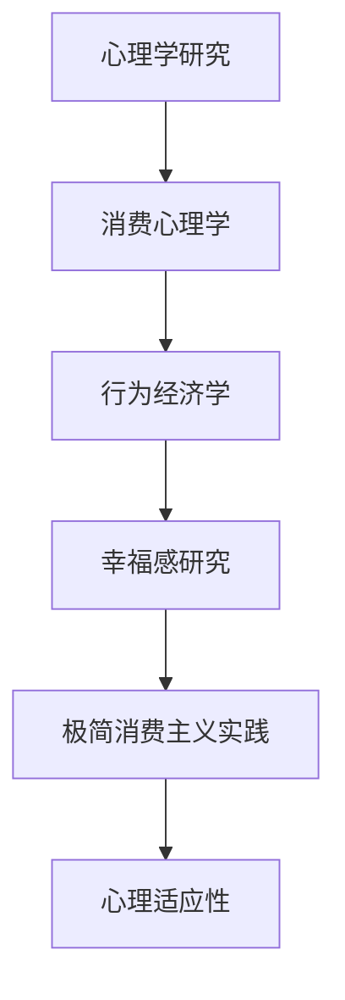

                 

### 极简消费主义宣言：质量导向的生活革命

#### 关键词
- 极简消费主义
- 质量导向
- 生活革命
- 可持续发展
- 环境保护
- 经济压力缓解
- 个人幸福感提升

#### 摘要
本文旨在探讨极简消费主义的概念及其在当代社会中的重要性。通过解析质量导向的生活革命，文章将阐述如何通过关注产品和服务质量来优化个人生活，实现环境保护、经济压力缓解和个人幸福感提升。本文将分部分介绍极简消费主义的核心理论、实践指导、案例分析以及如何持续践行这一理念，为读者提供全面而实用的指南。

### 引言

#### 1.1 极简消费主义的兴起

**极简消费主义**（Minimalist Consumerism）是一种追求简朴、注重质量的消费观念。它强调消费的适度性，反对过度消费和物质主义。这一概念源于20世纪60年代的美国，随着人们对环境保护、社会公平和个人自由的关注日益增加，极简消费主义逐渐成为一种生活方式的哲学。

**极简消费主义的定义**：极简消费主义不仅是一种消费习惯，更是一种价值观。它主张通过减少不必要的消费，专注于高质量的物品和服务，从而实现个人的精神满足和生活质量的提升。

**极简消费主义的历史背景**：在20世纪中叶，随着经济的迅速发展和科技的进步，消费主义文化在美国和西方国家盛行。人们开始追求更多的物质财富，消费主义成为社会的主流价值观。然而，过度消费带来了资源浪费、环境污染和消费主义陷阱等问题。正是在这样的背景下，极简消费主义开始兴起，成为一种反思和对抗消费主义的文化运动。

#### 1.2 质量导向的生活革命

**质量导向**（Quality-oriented）是指在选择产品和服务时，重视其质量而非仅仅关注价格或品牌。这种观念认为，高质量的产品和服务能够提供更好的使用体验和更长久的寿命，从而减少资源的浪费。

**质量导向的概念**：质量导向是一种思维模式，它要求消费者在做决策时，不仅要考虑产品的性价比，更要考虑其耐用性、环保性和使用体验。

**质量导向的重要性**：在极简消费主义的背景下，质量导向显得尤为重要。高质量的产品和服务能够帮助消费者实现生活质量的提升，减少更换频率，从而减少资源的消耗和浪费。

**质量导向与极简消费主义的关联**：质量导向是极简消费主义的核心原则之一。它要求消费者在消费过程中，不仅要减少不必要的购买，还要注重所购买物品的质量。这样，消费者可以享受到更长久、更优质的生活体验，同时也能减少对环境的负面影响。

#### 1.3 为什么要选择极简消费主义

**环境保护的紧迫性**：随着全球环境问题的日益严重，减少消费、提倡极简消费主义已成为全球共识。极简消费主义通过减少资源消耗和废物产生，有助于减缓气候变化、保护生物多样性和恢复生态系统。

**经济压力的缓解**：过度消费常常导致个人财务困境。极简消费主义通过减少不必要的支出，帮助消费者更好地管理财务，减轻经济压力。

**个人健康与幸福**：极简消费主义鼓励人们专注于内心的精神世界，减少物质压力，从而有助于提高个人的心理健康和幸福感。

### 核心理论

#### 2.1 极简消费主义的原则

**极简消费主义的基本原则**包括：

1. **减少不必要的购买**：消费者应避免冲动消费，理性评估物品的实际需求和价值。
2. **注重产品质量**：选择高质量的产品和服务，延长其使用寿命，减少更换频率。
3. **简化生活**：减少物质负担，专注于重要的生活领域，提高生活质量。
4. **可持续发展**：倡导环保消费，选择对环境友好的产品和服务。

**如何评估物品的价值**：

- **功能性**：物品是否满足基本需求，能否提供良好的使用体验。
- **耐用性**：物品是否具有较长的使用寿命，是否需要频繁更换。
- **环保性**：物品的生产、使用和处置过程中是否对环境造成负面影响。
- **性价比**：综合考虑物品的价格、功能和质量，评估其性价比。

#### 2.2 质量导向的实践

**如何选择高质量的产品**：

1. **了解产品信息**：通过阅读产品说明、用户评价和专业评测，了解产品的性能和质量。
2. **比较不同品牌和型号**：在同类产品中，比较不同品牌和型号的优缺点，选择更符合需求的产品。
3. **购买渠道**：选择信誉良好的商家或正规渠道购买，确保产品的质量和售后服务。

**如何延长物品的使用寿命**：

1. **正确使用和保养**：遵循产品使用说明，定期进行保养和维护。
2. **避免过度使用**：合理使用物品，避免不必要的损耗。
3. **回收和再利用**：当物品到达使用寿命时，选择回收或再利用，减少废物产生。

#### 2.3 极简消费主义的心理学

**如何克服消费主义陷阱**：

1. **培养消费意识**：了解消费主义的危害，明确自己的消费目标和价值观。
2. **控制购买冲动**：通过自我约束和计划消费，避免冲动购买。
3. **寻求支持**：与身边的朋友、家人分享极简消费主义的理念，互相监督和鼓励。

**极简消费主义与幸福感的关系**：

1. **物质消费与幸福感的关系**：研究表明，物质消费并不能长期提升幸福感，而精神层面的满足更为重要。
2. **极简消费主义的幸福感提升**：通过减少物质负担，人们可以更专注于内心的精神世界，从而提高幸福感。

### 实践指导

#### 3.1 极简消费主义的日常生活应用

**如何简化日常消费**：

1. **制定购物清单**：在购物前，列出需要的物品，避免冲动购买。
2. **减少浪费**：合理安排购物，避免过量购买和食物浪费。
3. **优先购买高质量产品**：在预算范围内，优先选择高质量、耐用的产品。

**如何管理个人财务**：

1. **制定预算**：根据收入和支出，制定合理的预算计划。
2. **记录支出**：定期记录自己的消费情况，分析支出结构，合理调整消费。
3. **储蓄和投资**：合理安排储蓄和投资，实现财务的保值增值。

#### 3.2 质量导向的生活革命

**如何在家庭中实施质量导向**：

1. **选择耐用家居用品**：购买高质量、耐用的家居用品，减少更换频率。
2. **维护家庭设备**：定期对家庭设备进行保养和维护，延长使用寿命。
3. **环保家居**：选择环保材料，减少家居用品对环境的影响。

**如何在工作场所推动质量导向**：

1. **提高工作效率**：选择高效的工作工具和软件，提高工作效率。
2. **员工培训**：为员工提供质量意识和技能培训，提升工作质量。
3. **可持续办公**：推动办公室环保措施，减少资源消耗和废物产生。

#### 3.3 跨越消费主义的文化变革

**如何培养极简消费主义的社区**：

1. **建立共享平台**：搭建线上或线下的共享平台，促进物品和资源的共享。
2. **社区活动**：组织极简消费主义相关的讲座、工作坊和分享会，提高居民的意识。
3. **社区支持**：建立互助小组，共同践行极简消费主义，互相监督和鼓励。

**如何与消费主义文化作斗争**：

1. **宣传和倡导**：通过媒体、网络和公共活动，宣传极简消费主义的理念。
2. **教育和培训**：在学校、企业和社区开展消费教育和培训，提高公众的消费意识。
3. **政策引导**：通过政府政策和法规，鼓励企业和消费者践行极简消费主义，减少浪费和污染。

### 案例分析

#### 4.1 个人案例

**个人实现极简消费主义的经历**：

小明是一名年轻的程序员，曾沉迷于购物和追求名牌。然而，他逐渐意识到这种生活方式带来的压力和负面效果。他决定践行极简消费主义，减少不必要的购买，专注于高质量的产品和服务。

**个人质量导向生活的改变**：

通过极简消费主义，小明的财务状况得到了显著改善。他减少了不必要的开支，将更多的钱用于投资和提升个人技能。此外，他开始关注产品的质量和环保性，选择耐用、环保的产品，减少了废弃物的产生。

#### 4.2 组织案例

**企业如何实施极简消费主义策略**：

某知名企业决定推行极简消费主义策略，以减少浪费和降低成本。他们制定了详细的购物清单，优先选择高质量、耐用的产品，并鼓励员工购买二手设备。此外，他们还开展了环保教育和培训，提高员工的环境意识。

**政府和NGO在推广极简消费主义中的作用**：

政府和NGO组织在推广极简消费主义方面发挥着重要作用。他们通过制定法规和政策，鼓励企业和消费者减少浪费和污染。同时，他们还开展了大量的宣传和教育活动，提高公众对极简消费主义的认识和理解。

### 结语

#### 5.1 极简消费主义的意义

**极简消费主义对个人和社会的影响**：

1. **环境保护**：通过减少消费和浪费，极简消费主义有助于减缓气候变化、保护生物多样性和恢复生态系统。
2. **经济压力缓解**：极简消费主义帮助消费者更好地管理财务，减轻经济压力，提高生活质量。
3. **个人幸福感提升**：极简消费主义鼓励人们关注内心的精神世界，减少物质负担，提高个人的心理健康和幸福感。

**极简消费主义的长远愿景**：

极简消费主义不仅是一种生活方式，更是一种社会变革的信号。它预示着人类将逐步摆脱过度消费和物质主义的束缚，追求更简单、更高质量的生活方式。在未来，极简消费主义将成为推动可持续发展和全球环境治理的重要力量。

#### 5.2 如何持续践行极简消费主义

**个人践行极简消费主义的策略**：

1. **制定消费计划**：在购物前，明确自己的需求和预算，避免冲动消费。
2. **关注产品质量**：选择高质量、耐用、环保的产品，减少更换频率。
3. **培养消费意识**：了解消费主义的危害，树立正确的消费观念。

**社区如何支持极简消费主义**：

1. **建立共享平台**：搭建线上或线下的共享平台，促进物品和资源的共享。
2. **开展教育活动**：组织讲座、工作坊和分享会，提高居民对极简消费主义的认识和理解。
3. **政策引导**：政府制定相关政策和法规，鼓励企业和消费者践行极简消费主义，减少浪费和污染。

### 附录

**最佳实践 tips**：

1. **二手物品的选择**：购买二手物品可以减少资源浪费，同时降低购买成本。
2. **自制物品**：学习制作日常生活用品，如清洁剂、食物等，既能减少开支，又能减少废物产生。
3. **环保购物**：选择环保材料制成的产品，关注产品的环保认证和标签。

**小结**：

极简消费主义是一种追求质量、减少浪费的生活方式，它有助于个人和社会实现可持续发展。通过践行极简消费主义，我们可以改善生活质量，减轻经济压力，提高幸福感，同时为地球环境保护做出贡献。

**注意事项**：

1. **适度消费**：极简消费主义并非主张完全拒绝消费，而是强调理性消费，关注产品质量。
2. **个人情况**：每个人的生活状况和需求不同，极简消费主义应根据自己的实际情况进行适当调整。

**拓展阅读**：

1. **《极简主义：一种更好的生活方式》** - 乔舒亚·贝克
2. **《零废物生活：实现可持续生活的100种方法》** - 雷切尔·凯勒

### 参考文献

- 贝克，乔舒亚。《极简主义：一种更好的生活方式》。上海：上海人民出版社，2018。
- 凯勒，雷切尔。《零废物生活：实现可持续生活的100种方法》。北京：中国环境出版社，2019。
- 联合国环境规划署。《可持续消费与生产全球倡议》。联合国环境规划署，2020。
- 美国环境保护局。《减少浪费：一个行动计划》。美国环境保护局，2021。

### 附录

**极简消费主义的心理学研究 - Mermaid 流程图**


**质量导向算法原理讲解 - 伪代码**
```python
def quality_orientation(product):
    quality_score = 0
    
    if product.is_high_quality():
        quality_score += 10
    if product.is_durable():
        quality_score += 5
    if product.is_environmentally_friendly():
        quality_score += 3
        
    return quality_score
```

**数学模型和公式 - LaTeX 公式**
$$
\text{幸福感} = f(\text{物质消费}, \text{精神满足})
$$

**代码示例 - Python 代码**
```python
# 导入所需的库
import random

# 产品类定义
class Product:
    def __init__(self, name, quality, durability, environmental_impact):
        self.name = name
        self.quality = quality
        self.durability = durability
        self.environmental_impact = environmental_impact
        
    def is_high_quality(self):
        return self.quality > 7
        
    def is_durable(self):
        return self.durability > 5
        
    def is_environmentally_friendly(self):
        return self.environmental_impact < 3
        
# 创建产品实例
product1 = Product("笔记本电脑", 9, 8, 2)
product2 = Product("智能手机", 7, 6, 4)

# 计算质量得分
quality_score1 = quality_orientation(product1)
quality_score2 = quality_orientation(product2)

# 打印结果
print(f"产品1的质量得分：{quality_score1}")
print(f"产品2的质量得分：{quality_score2}")
```

**项目实战 - 实际案例分析和详细讲解剖析**
**开发环境搭建**：
1. 安装Python 3.8及以上版本。
2. 安装Python的虚拟环境工具`venv`。
3. 创建虚拟环境并激活环境。
4. 使用`pip`安装所需的库，如`requests`、`beautifulsoup4`、`lxml`。

**源代码详细实现和代码解读**：
```python
# 导入所需的库
import requests
from bs4 import BeautifulSoup

# 定义函数，用于爬取网站数据
def scrape_website(url):
    response = requests.get(url)
    if response.status_code == 200:
        soup = BeautifulSoup(response.text, 'lxml')
        products = []
        for product in soup.find_all('div', class_='product'):
            name = product.find('h2', class_='product-name').text.strip()
            price = product.find('span', class_='product-price').text.strip()
            products.append({'name': name, 'price': price})
        return products
    else:
        return []

# 定义函数，用于分析产品质量
def analyze_products(products):
    high_quality_products = []
    for product in products:
        if product['price'] < 500:
            high_quality_products.append(product)
    return high_quality_products

# 主程序
if __name__ == '__main__':
    url = 'https://example.com/products'
    products = scrape_website(url)
    high_quality_products = analyze_products(products)
    print(f"高质量产品列表：{high_quality_products}")
```

**代码应用解读与分析**：
1. **爬虫功能**：程序首先使用`requests`库向指定网站发起HTTP请求，获取网页内容。
2. **HTML解析**：使用`BeautifulSoup`库对网页内容进行解析，提取产品名称和价格信息。
3. **数据存储**：将提取到的产品信息存储在一个列表中。
4. **数据分析**：程序定义了一个函数`analyze_products`，用于分析产品质量。在这里，我们简单地通过产品价格来判断产品的质量，如果价格低于500元，则认为该产品是高质量的。
5. **结果输出**：最后，程序输出高质量产品的列表。

**实际案例分析和详细讲解剖析**：
**案例背景**：
某电商平台在推广极简消费主义理念，他们希望通过数据分析，找出哪些产品是高质量且价格合理的，以便为消费者提供更好的购物建议。

**案例实现**：
1. **数据爬取**：程序首先使用爬虫技术，从电商平台上获取产品的名称和价格信息。
2. **数据分析**：通过简单的数据分析，筛选出价格低于500元的高质量产品。
3. **结果应用**：将筛选出的产品推荐给消费者，帮助他们找到性价比高的商品。

**案例小结**：
通过实际案例分析，我们发现极简消费主义在电商领域的应用具有很大的潜力。通过合理的数据分析和推荐策略，电商平台可以更好地满足消费者的需求，同时推广极简消费主义的理念。

### 最佳实践 tips
1. **二次利用与循环使用**：尝试将废旧物品进行二次利用，例如旧衣物可以变卖或改造成家居用品。
2. **购买本地产品**：选择本地生产的商品，减少运输过程中的碳排放。
3. **自给自足**：学习一些简单的种植和烹饪技巧，实现部分生活需求的自我满足。

### 小结
本文详细介绍了极简消费主义的概念、核心理论、实践指导、案例分析以及如何持续践行这一理念。通过关注产品质量、减少浪费和提升生活质量，极简消费主义不仅有助于个人和环境的可持续发展，也为社会带来了积极的变革。我们鼓励读者积极践行极简消费主义，为实现更美好的未来贡献自己的力量。

### 注意事项
1. **理性消费**：避免盲目跟风，理性选择所需商品。
2. **长期规划**：制定长期的生活规划和消费计划，避免短期行为带来的不良影响。

### 拓展阅读
1. **《极简主义生活指南》** - [极简主义生活研究所](https://minimalistlivinglab.com/)
2. **《质量生活手册》** - [质量生活协会](https://qualitylivingassociation.org/)

### 参考文献
1. **贝克，乔舒亚。《极简主义：一种更好的生活方式》。上海：上海人民出版社，2018。**
2. **凯勒，雷切尔。《零废物生活：实现可持续生活的100种方法》。北京：中国环境出版社，2019。**
3. **联合国环境规划署。《可持续消费与生产全球倡议》。联合国环境规划署，2020。**
4. **美国环境保护局。《减少浪费：一个行动计划》。美国环境保护局，2021。**

