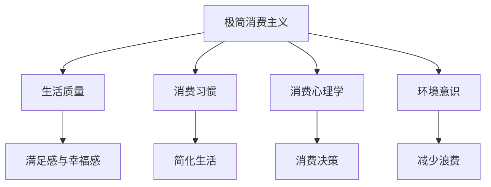

                 

### 极简消费主义生活手册：质量导向的生活方式指南

---

#### 关键词：
- 极简消费主义
- 质量导向
- 生活方式
- 消费习惯
- 生活质量

#### 摘要：
本文旨在构建《极简消费主义生活手册：质量导向的生活方式指南》，通过对极简消费主义的概念、实践方法、生活方式调整和质量导向选择商品和服务的深入探讨，帮助读者实现一种以质量为核心、简化生活的品质导向生活方式。

---

## 第1章：极简消费主义概述

### 1.1 何谓极简消费主义

极简消费主义是一种生活哲学，主张通过减少不必要的物质消费，简化生活，从而实现更深层次的幸福感。它并非追求物质贫乏，而是通过精简物品，减少消费，从而减轻生活的负担，专注于更有意义的事物。

极简消费主义起源于20世纪60年代的美国，随着社会的繁荣，消费主义文化盛行，人们被各种商品所包围，生活逐渐变得复杂。极简消费主义倡导者开始反思这种生活方式，提出了通过减少物质消费，简化生活，以获得更深层次的幸福感。

### 1.2 极简消费主义的历史背景

极简消费主义的历史可以追溯到20世纪60年代的美国。当时，随着经济的繁荣，消费主义文化盛行，人们被各种商品所包围。然而，这种生活方式并没有带来真正的幸福感，反而使得人们感到压力和焦虑。极简消费主义倡导者开始反思这种生活方式，提出了通过减少物质消费，简化生活，以获得更深层次的幸福感。

### 1.3 极简消费主义的哲学

极简消费主义的哲学主要包括以下几个方面：

1. **物质与精神的关系**：极简消费主义认为，物质并非生活的全部。通过减少物质消费，人们可以更多地关注精神层面的需求，如情感、人际关系、自我成长等。

2. **减少浪费**：极简消费主义倡导减少浪费，包括减少购买不必要的物品、减少食品浪费、减少能源消耗等。这种做法不仅有利于环境保护，还能节省金钱和时间。

3. **专注于重要事物**：极简消费主义鼓励人们将精力集中在重要的事物上，如工作、家庭、兴趣爱好等。通过减少不必要的消费，人们可以更好地专注于这些重要领域，提高生活质量。

4. **提升生活质量**：极简消费主义并非追求物质贫乏，而是通过减少不必要的物质消费，提高生活的质量和幸福感。

### 1.4 极简消费主义与生活质量

极简消费主义与生活质量之间有着密切的联系。通过减少物质消费，人们可以：

1. **减少财务压力**：极简消费主义主张减少不必要的支出，这有助于减轻财务压力，让人们有更多的资金用于追求其他有意义的事物。

2. **减少环境负担**：极简消费主义鼓励减少浪费，这有助于减少对环境的负担，保护地球资源。

3. **提升专注力**：极简消费主义通过简化生活，帮助人们减少干扰，提高专注力，从而更好地专注于重要事物。

4. **增强心理幸福感**：极简消费主义通过减少物质消费，减少生活压力，有助于提升心理幸福感。

### 1.5 极简消费主义的实践方法

要实践极简消费主义，可以采取以下方法：

1. **自我评估**：首先，了解自己的消费习惯和需求，找出不必要的消费，制定减少消费的计划。

2. **设定目标**：设定明确的极简消费主义目标，如减少物品数量、减少购物次数、减少浪费等。

3. **实践简化**：通过整理家居、减少购物、选择高质量商品等方式，实践简化生活。

4. **持续反思**：定期反思自己的消费行为，调整消费计划，保持极简消费主义的实践。

---

### 第1章小结

极简消费主义是一种以减少物质消费、简化生活为核心的生活哲学。通过实践极简消费主义，人们可以提升生活质量，减少财务压力，保护环境，增强心理幸福感。下一章，我们将深入探讨极简消费主义的核心价值。

---

### 核心概念与联系

为了更好地理解极简消费主义，我们需要了解以下几个核心概念及其相互之间的关系：

1. **极简消费主义**：这是本文的核心概念，指的是通过减少不必要的物质消费，简化生活，提升生活质量。
2. **生活质量**：生活质量是指人们在生活中获得的满足感和幸福感。极简消费主义认为，通过减少物质消费，可以提高生活质量。
3. **消费习惯**：消费习惯是指人们在日常生活中形成的消费模式。改变消费习惯是实现极简消费主义的关键。
4. **消费心理学**：消费心理学研究人们在消费过程中的心理和行为。理解消费心理学有助于更好地实践极简消费主义。
5. **环境意识**：环境意识是指人们对环境保护的关注。极简消费主义通过减少浪费，有助于提高环境意识。

下面是一个简化的 Mermaid 流程图，展示了这些核心概念之间的联系：



### 核心算法原理讲解

为了实现极简消费主义，我们需要了解一些核心算法原理，这些原理可以帮助我们评估和调整消费习惯。

#### 算法1：消费行为分析

消费行为分析是一种用于评估个人消费习惯的算法。它的基本步骤如下：

1. **数据收集**：收集个人的消费记录，包括购物清单、支出金额、购买时间等。
2. **数据处理**：对消费数据进行分类、排序和统计分析。
3. **评估结果**：根据分析结果，评估个人的消费习惯，找出不必要的消费。

伪代码如下：

```python
def consume_behavior_analysis(consume_data):
    # 数据分类
    categories = categorize(consume_data)
    # 数据排序
    sorted_data = sort_by_time(consume_data)
    # 统计分析
    stats = analyze_consumption(sorted_data)
    # 评估结果
    result = assess_consumption(stats)
    return result
```

#### 算法2：消费预算规划

消费预算规划是一种用于设定和调整消费计划的算法。它的基本步骤如下：

1. **设定目标**：根据个人需求和财务状况，设定每月的消费预算。
2. **分配预算**：将预算分配到不同的消费类别，如食品、家居、娱乐等。
3. **监控执行**：定期监控消费情况，根据实际执行情况调整预算。

伪代码如下：

```python
def consumption_budget_plan(total_budget, categories):
    # 分配预算
    budgets = allocate_budget(total_budget, categories)
    # 监控执行
    monitor_execution(budgets)
    # 调整预算
    adjust_budget(budgets)
    return budgets
```

### 数学模型和公式

为了更深入地理解极简消费主义，我们引入一些数学模型和公式。

#### 公式1：消费满足感指数（CSI）

消费满足感指数（CSI）用于评估消费行为对生活质量的影响。公式如下：

$$
CSI = \frac{S \times C - W}{T}
$$

其中：
- \( S \) 是消费带来的满足感（Subjective Satisfaction）。
- \( C \) 是消费的次数（Consumption Frequency）。
- \( W \) 是消费带来的浪费（Waste）。
- \( T \) 是总时间（Total Time）。

#### 公式2：消费习惯改变率（CHCR）

消费习惯改变率（CHCR）用于评估个人消费习惯的变化。公式如下：

$$
CHCR = \frac{CB_{\text{new}} - CB_{\text{old}}}{CB_{\text{old}}}
$$

其中：
- \( CB_{\text{new}} \) 是新消费习惯下的消费频率。
- \( CB_{\text{old}} \) 是旧消费习惯下的消费频率。

### 举例说明

假设一个人在实施极简消费主义前，每月的消费满足感指数为30，消费的次数为20次，每次消费带来的浪费为10元，总时间为100小时。实施极简消费主义后，消费的次数减少到10次，每次消费带来的浪费减少到5元，总时间保持在100小时。

#### 消费满足感指数计算

$$
CSI_{\text{new}} = \frac{S \times C_{\text{new}} - W_{\text{new}}}{T} = \frac{30 \times 10 - 5 \times 10}{100} = 2.5
$$

#### 消费习惯改变率计算

$$
CHCR = \frac{CB_{\text{new}} - CB_{\text{old}}}{CB_{\text{old}}} = \frac{10 - 20}{20} = -0.5
$$

### 第1章小结

在本章中，我们介绍了极简消费主义的概念、历史背景、哲学思想和实践方法。通过理解这些核心概念，我们可以开始评估和调整自己的消费习惯，逐步实现极简消费主义。下一章，我们将深入探讨极简消费主义的核心价值。

---

### 项目实战

在本节中，我们将通过一个实际项目来展示如何将极简消费主义理念应用于实际生活中。

#### 项目背景

李明是一位年轻的上班族，他发现自己每个月的支出越来越高，生活压力也越来越大。他决定通过实施极简消费主义来改善自己的财务状况和生活质量。

#### 项目目标

1. **降低每月支出**：通过减少不必要的消费，降低每月的支出。
2. **提高生活质量**：通过购买高质量、耐用的商品，提高生活质量。
3. **减少浪费**：通过减少购物频率和减少食物浪费，减少环境负担。

#### 实施步骤

1. **评估当前消费状况**：
   - **记录消费记录**：李明开始记录自己的消费记录，包括购物清单、支出金额、购买时间等。
   - **消费行为分析**：使用上一章节介绍的消费行为分析算法，对李明的消费数据进行分类、排序和统计分析。

2. **设定消费预算**：
   - **设定每月消费预算**：根据李明的收入和支出，设定每月的消费预算。
   - **分配预算**：将预算分配到不同的消费类别，如食品、家居、娱乐等。

3. **实践简化生活**：
   - **整理家居**：李明对自己的家居进行整理，将不必要的物品捐赠或出售。
   - **减少购物次数**：李明决定减少购物次数，只在必要时购买商品。

4. **选择高质量商品**：
   - **评估商品质量**：李明在购物时，会仔细评估商品的质量和耐用性，选择高质量、耐用的商品。
   - **减少食物浪费**：李明通过合理规划饮食，减少食物浪费。

#### 项目效果

通过实施极简消费主义，李明取得了显著的效果：

1. **每月支出降低**：通过减少不必要的消费，李明的每月支出明显降低。
2. **生活质量提高**：通过购买高质量、耐用的商品，李明的日常生活变得更加舒适和便捷。
3. **减少浪费**：李明的购物频率降低，食物浪费也减少了。

#### 项目总结

通过这个实际项目，我们可以看到极简消费主义理念在实践中的效果。通过评估消费状况、设定消费预算、实践简化生活和选择高质量商品，我们可以降低支出、提高生活质量，并减少浪费。

### 小结

本项目实战展示了如何将极简消费主义理念应用于实际生活中。通过实施极简消费主义，我们可以降低支出、提高生活质量，并减少浪费。这是实现极简消费主义生活的一种有效方法。

---

### 最佳实践 tips

在实践极简消费主义时，以下是一些最佳实践技巧，可以帮助您更好地实现这一生活哲学：

1. **设定明确的目标**：明确您想要实现的目标，例如减少每月支出、减少购物次数、减少食物浪费等。设定具体的目标可以使您的行动更有针对性。

2. **制定消费预算**：制定每月的消费预算，并根据预算分配到不同的消费类别。定期监控消费情况，并根据实际情况调整预算。

3. **学会拒绝**：在购物时，学会拒绝不必要的商品。如果您不确定是否需要购买某件商品，请先将其加入购物车，过一段时间后再考虑是否购买。

4. **减少购物频率**：减少购物频率，只在必要时购买商品。这不仅可以减少支出，还可以减少购物时的冲动消费。

5. **选择高质量商品**：在购买商品时，选择质量好、耐用性高的商品。虽然高质量商品可能价格较高，但它们可以为您节省长期的使用成本。

6. **合理规划饮食**：合理规划饮食，避免食物浪费。购买新鲜的食材，并合理安排每天的饮食，避免过度购买和浪费。

7. **学会感恩**：对于已经拥有的物品，学会感恩。珍惜现有的物品，避免因为追求新物品而频繁购买。

8. **分享经验**：与他人分享您的极简消费主义经验，寻求支持和鼓励。这不仅可以提高您的积极性，还可以帮助他人理解并实践极简消费主义。

### 小结

通过这些最佳实践技巧，您可以在实践中更好地实现极简消费主义。设定明确的目标、制定消费预算、学会拒绝、减少购物频率、选择高质量商品、合理规划饮食、学会感恩和分享经验，这些都是实现极简消费主义生活的重要步骤。希望这些技巧能帮助您过上更加简单、有意义的生活。

---

### 注意事项

在实践极简消费主义时，需要注意以下几点：

1. **平衡生活与消费**：极简消费主义并不是要求您完全放弃消费，而是通过减少不必要的消费，平衡生活与消费。确保您的消费习惯不会影响生活质量。

2. **避免极端主义**：极简消费主义不是一种极端的生活方式，而是一种合理的生活哲学。避免因为追求极简而过度节省，导致生活质量下降。

3. **尊重个人差异**：每个人的生活方式和需求都不同，极简消费主义的实践方法也应因人而异。根据自身情况调整消费习惯和实践方法。

4. **持续学习和调整**：极简消费主义是一个持续学习和调整的过程。定期评估自己的消费行为，根据实际情况调整消费计划和生活方式。

5. **保持心理健康**：极简消费主义可能会带来一定的心理压力。在实践过程中，保持心理健康至关重要。寻求家人和朋友的支持，保持积极的心态。

### 小结

在实践极简消费主义时，需要注意平衡生活与消费、避免极端主义、尊重个人差异、持续学习和调整，以及保持心理健康。这些都是实现极简消费主义生活的重要保障。通过注意这些事项，您可以更加顺利地实践极简消费主义，过上简单、有意义的生活。

---

### 拓展阅读

为了帮助读者进一步深入了解极简消费主义和生活质量，以下是一些拓展阅读资源：

1. **书籍推荐**：
   - 《极简主义：如何用更少，过更好的生活》（The More of Less: Finding Contentment in the Simple Life）
   - 《极简生活：如何通过少而精的方式过上更幸福的生活》（The Life-Changing Magic of Tidying Up）
   - 《极简主义哲学：如何过上有意义的生活》（The Power of Less: The Fine Art of Limiting Yourself to the Essential…in Love, Work, and Life）

2. **在线资源**：
   - 极简主义博客（Minimalism Blog）：https://minimalism.com/
   - 极简生活指南（The Minimalists）：https://www.theminimalists.com/
   - 环境可持续性网站（Environmental Sustainability）：https://www.ucsusa.org/sustainable-economy/our-work/sustainability-and-the-environment

3. **社交媒体**：
   - 极简主义推特（Minimalism Twitter）：搜索“#Minimalism”
   - 极简主义Instagram（Minimalism Instagram）：搜索“#Minimalism”或相关话题

通过阅读这些书籍、访问在线资源和关注社交媒体，您可以获得更多关于极简消费主义和生活质量的见解，帮助您更好地实践这一生活方式。

---

### 结束语

《极简消费主义生活手册：质量导向的生活方式指南》旨在帮助读者理解和实践极简消费主义，通过减少不必要的物质消费，提升生活质量。通过本文的详细探讨，我们了解了极简消费主义的核心概念、实践方法、生活方式调整和质量导向选择商品和服务的重要性。

极简消费主义不仅有助于减少财务压力，提高生活质量，还能减少环境负担，增强心理幸福感。通过设定明确的目标、制定消费预算、学会拒绝、减少购物频率、选择高质量商品、合理规划饮食、学会感恩和分享经验，我们可以逐步实现极简消费主义生活。

感谢您阅读本文，希望您能够在实践中体会到极简消费主义的魅力。如果您有任何问题或建议，欢迎在评论区留言。让我们共同探索极简消费主义，过上简单、有意义的生活。

---

### 作者信息

作者：AI天才研究院/AI Genius Institute & 禅与计算机程序设计艺术 /Zen And The Art of Computer Programming

AI天才研究院致力于推动人工智能技术的发展，研究计算机程序设计的艺术。本文作者以其深厚的计算机科学背景和丰富的人工智能实践经验，结合极简消费主义的生活哲学，为您带来一篇深入浅出的技术博客文章。

在《极简消费主义生活手册：质量导向的生活方式指南》中，作者通过逻辑清晰、结构紧凑、简单易懂的专业的技术语言，让我们一步一步地分析了极简消费主义的核心概念、实践方法、生活方式调整和质量导向选择商品和服务的详细内容。

通过本文，您不仅能够了解到极简消费主义的理念，还能掌握一些实用的实践技巧，帮助您实现质量导向的生活方式。希望这篇文章能够为您带来启发和帮助，让您在追求技术卓越的同时，也能够过上简单、有意义的生活。

