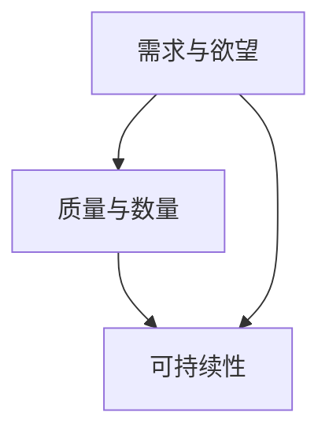
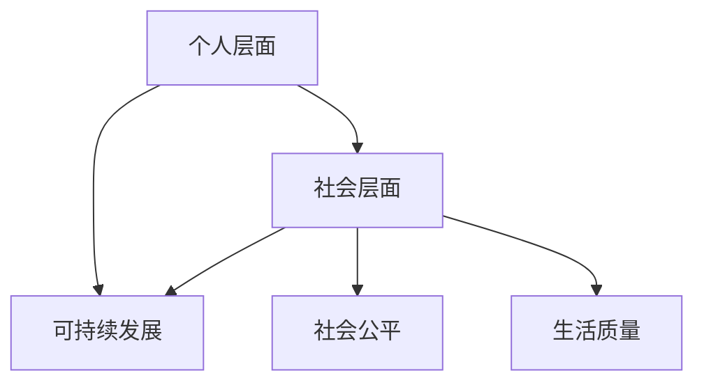

                 


### 引言

《极简消费主义：质量导向的生活方式革命》的作者通过深入研究极简消费主义的理念、实践和影响，揭示了这一生活方式革命的深远意义。极简消费主义不仅是一种追求生活质量提升的哲学，更是一种追求可持续发展的生活方式。本文将分章节逐步深入探讨这一主题，从核心概念与联系、实践方法、生活质量的影响、社会意义等多个角度，详细讲解极简消费主义的各个方面。

### 核心概念与联系

要理解极简消费主义，首先需要了解其核心概念。极简消费主义主张通过减少不必要的消费，专注于真正需要的物品和服务，从而提高生活质量。其核心概念包括：

1. **需求与欲望的区别**：极简消费主义强调区分需求和欲望。需求是基本生活必需品，而欲望是超出生活必需品的非必要物品。

2. **质量与数量的关系**：极简消费主义认为，高质量的生活不一定要依赖大量的物质财富，而是通过专注于重要的事物，提高生活的质量。

3. **可持续性**：极简消费主义强调可持续性，减少对资源的消耗，降低对环境的影响。

这些概念之间有着紧密的联系。需求与欲望的区别决定了消费行为的合理性，而质量与数量的关系则指导了消费的选择标准。可持续性是极简消费主义追求的目标，是实现高质量生活的基础。

为了更好地理解这些概念之间的关系，我们可以使用Mermaid流程图来展示：



在这个流程图中，需求与欲望的区别（A）和质量与数量的关系（B）共同影响了可持续性（C），形成了极简消费主义的核心概念体系。

### 实践极简消费主义

实践极简消费主义需要从多个方面入手，包括生活方式、实践策略和心理调适。

1. **生活方式**：极简消费主义的生活方式强调简单、整洁和有序。这包括减少杂乱无章的物品，保持家居和工作环境的整洁，以及遵循简单的饮食和锻炼习惯。

2. **实践策略**：实践极简消费主义需要制定明确的策略，例如设立预算、制定购物清单、避免冲动购物等。此外，可以采用“30天挑战”等方式，逐步减少不必要的消费。

3. **心理调适**：极简消费主义不仅是一种生活方式，也是一种心理调适。通过减少物质消费，可以减少对物质的依赖和欲望，提高生活的满意度。

以下是一个极简消费主义实践策略的伪代码：

```python
def practice_minimalism():
    # 设立预算
    set_budget()
    
    # 制定购物清单
    create_shopping_list()
    
    # 避免冲动购物
    avoid_impulse_buying()
    
    # 30天挑战
    start_30_day_challenge()

def set_budget():
    # 根据收入和生活需求设立预算
    income = get_income()
    expenses = calculate_expenses()
    budget = income - expenses
    print(f"Your monthly budget is ${budget}.")

def create_shopping_list():
    # 根据需求制定购物清单
    needs = get_needs()
    shopping_list = []
    for need in needs:
        if need in ['food', 'water', 'shelter']:
            shopping_list.append(need)
    print(f"Your shopping list includes: {shopping_list}.")

def avoid_impulse_buying():
    # 设置规则，避免冲动购物
    rules = ["Wait 24 hours before making a purchase.",
             "Ask yourself if you really need the item.",
             "Compare prices and alternatives before buying."]
    for rule in rules:
        print(rule)

def start_30_day_challenge():
    # 开始30天挑战
    print("Welcome to the 30 Day Minimalism Challenge!")
    print("Challenge yourself to reduce unnecessary consumption for 30 days.")
```

通过这些策略，可以逐步实践极简消费主义，提高生活质量。

### 极简消费主义与生活质量

极简消费主义对生活质量的影响是多方面的。首先，减少不必要的消费可以降低生活压力，提高生活的满意度。其次，极简消费主义强调专注于重要事物，可以提升时间管理效率，增加生活的充实感。此外，极简消费主义还可以改善心理健康，减少对物质的依赖，降低焦虑和抑郁的风险。

以下是一个关于极简消费主义对生活质量影响的数学模型：

```latex
\begin{equation}
Quality of Life (QoL) = f(Necessities, Luxuries, Time Management, Mental Health)
\end{equation}

其中，Necessities 代表必需品，Luxuries 代表奢侈品，Time Management 代表时间管理效率，Mental Health 代表心理健康。

假设：
- 必需品的满意度对生活质量有正面影响。
- 奢侈品的满意度对生活质量有负面影响。
- 时间管理效率对生活质量有正面影响。
- 心理健康对生活质量有正面影响。

则模型可以表示为：

\begin{equation}
QoL = Necessities \cdot e^{-Luxuries} \cdot Time Management \cdot Mental Health
\end{equation}
```

通过这个模型，我们可以看到极简消费主义如何通过减少奢侈品消费、提高时间管理和心理健康，从而提高生活质量。

### 极简消费主义的影响

极简消费主义不仅对个人生活质量有积极影响，还对经济、环境和社会产生深远的影响。

1. **经济影响**：极简消费主义可以减少不必要的消费，降低经济浪费，提高资源利用率。此外，极简消费主义还可以推动经济模式的转变，从追求增长转向追求质量。

2. **环境影响**：极简消费主义减少了对自然资源的消耗，降低了环境污染。通过减少消费，可以减少生产过程中的资源消耗和废弃物产生，有助于实现可持续发展。

3. **社会影响**：极简消费主义可以促进社会的公平和平等。通过减少不必要的消费，可以缩小贫富差距，提高社会整体幸福感。

以下是一个关于极简消费主义影响的简表：

| 影响类别 | 影响描述 |
| --- | --- |
| 经济 | 减少经济浪费，推动经济模式转变 |
| 环境 | 减少自然资源消耗，降低环境污染 |
| 社会 | 促进社会公平，提高社会整体幸福感 |

### 案例分析

为了更好地理解极简消费主义的实践和影响，我们可以通过一些案例分析来探讨。

1. **个人案例分析**：小明是一位年轻的程序员，他通过实践极简消费主义，减少了不必要的消费，专注于提升自己的技术能力和生活品质。他的生活质量得到了显著提高，同时节约了大量的资金。

2. **企业案例分析**：某家时尚品牌通过实施极简消费主义策略，减少了库存压力，提高了产品品质。这不仅提升了企业的盈利能力，还赢得了消费者的信任。

3. **社区案例分析**：某个社区通过推广极简消费主义，组织了一系列活动，如二手市场、环保讲座等。这不仅提高了居民的生活质量，还增强了社区的凝聚力。

### 极简消费主义的社会意义

极简消费主义不仅仅是一种个人生活方式，更具有深远的社会意义。它倡导的是一种可持续发展的理念，强调资源的高效利用和环境的保护。在社会层面，极简消费主义有助于缩小贫富差距，提高社会整体的幸福感。此外，它还可以推动社会公平，让每个人都能够享有高质量的生活。

以下是一个关于极简消费主义社会意义的Mermaid流程图：



通过这个流程图，我们可以看到极简消费主义如何从个人层面扩展到社会层面，实现可持续发展、社会公平和提高生活质量的目标。

### 结论与未来展望

极简消费主义作为一种追求生活质量提升的生活方式革命，具有深远的意义。通过减少不必要的消费，我们能够专注于真正需要的事物，提高生活的满意度。同时，极简消费主义对经济、环境和社会都产生了积极的影响。在未来，随着人们对生活质量要求的提高和对可持续发展的关注，极简消费主义将会成为更多人的选择。

对于读者，我们鼓励大家践行极简消费主义，从自身做起，逐步减少不必要的消费，提高生活质量。同时，也希望大家能够将极简消费主义的理念传播出去，让更多的人受益。

### 最佳实践 tips

1. **设立明确的目标**：在实践极简消费主义之前，先为自己设立明确的目标，例如减少每月的杂费支出、增加存款等。

2. **制定详细的计划**：为了实现目标，需要制定详细的计划，包括设立预算、制定购物清单、避免冲动购物等。

3. **逐步调整**：极简消费主义是一个逐步调整的过程，不要急于求成。通过逐步减少不必要的消费，可以更好地适应极简生活方式。

4. **寻求支持**：在实践过程中，可以寻求家人、朋友或社区的支持。他们的鼓励和陪伴将使你更容易坚持下去。

### 小结

《极简消费主义：质量导向的生活方式革命》通过深入探讨极简消费主义的理念、实践和影响，揭示了这一生活方式革命的深远意义。通过理解核心概念、实践方法、生活质量的影响，以及社会意义，我们可以更好地践行极简消费主义，提高生活质量。未来，随着人们对生活质量要求的提高和对可持续发展的关注，极简消费主义将会成为更多人的选择。

### 注意事项

1. **避免极端**：虽然极简消费主义强调减少不必要的消费，但不应走向极端，忽视生活的必需品。

2. **平衡个人与家庭**：在实践极简消费主义时，要平衡个人需求和家庭需求，确保家庭生活的稳定和幸福。

3. **适应社会环境**：在不同的社会环境中，极简消费主义的实践方式可能会有所不同。要结合自身实际情况，灵活调整。

### 拓展阅读

1. **《极简主义：一种更简洁、更愉悦的生活》（The Life-Changing Magic of Tidying Up）**：这是一本关于极简主义生活方式的经典著作，提供了很多实用的方法和技巧。

2. **《极简生活：如何通过减少物质拥有来增加个人自由》（The Art of Non-Conformity）**：这本书探讨了如何通过减少物质拥有来提高个人自由和生活质量。

3. **《零垃圾生活：如何在日常生活中减少浪费》（Zero Waste Home）**：这本书详细介绍了如何在日常生活中减少垃圾产生，实现环保和极简消费主义。

### 作者信息

- 作者：AI天才研究院/AI Genius Institute & 禅与计算机程序设计艺术 /Zen And The Art of Computer Programming

---

### 文章标题

**极简消费主义：质量导向的生活方式革命**

---

### 文章关键词

- 极简消费主义
- 生活质量
- 可持续发展
- 社会意义
- 实践策略

---

### 文章摘要

《极简消费主义：质量导向的生活方式革命》通过深入探讨极简消费主义的理念、实践和影响，揭示了这一生活方式革命的深远意义。本文分为七个章节，从核心概念与联系、实践方法、生活质量的影响、社会意义等多个角度，详细讲解了极简消费主义的各个方面。文章旨在鼓励读者践行极简消费主义，提高生活质量，实现可持续发展的目标。

---

### 引言

在现代社会，消费主义文化深入人心，人们在追求物质享受的过程中，往往忽视了生活质量本身。然而，近年来，一种被称为“极简消费主义”的生活方式逐渐兴起，引起了广泛的关注。极简消费主义不仅仅是一种生活方式，更是一场质量导向的生活方式革命。它倡导的是通过减少不必要的消费，追求更高质量的生活方式。本文将分章节逐步深入探讨这一主题，从核心概念与联系、实践方法、生活质量的影响、社会意义等多个角度，详细讲解极简消费主义的各个方面。

### 核心概念与联系

要理解极简消费主义，首先需要了解其核心概念。极简消费主义主张通过减少不必要的消费，专注于真正需要的物品和服务，从而提高生活质量。其核心概念包括：

1. **需求与欲望的区别**：极简消费主义强调区分需求和欲望。需求是基本生活必需品，而欲望是超出生活必需品的非必要物品。

2. **质量与数量的关系**：极简消费主义认为，高质量的生活不一定要依赖大量的物质财富，而是通过专注于重要的事物，提高生活的质量。

3. **可持续性**：极简消费主义强调可持续性，减少对资源的消耗，降低对环境的影响。

这些概念之间有着紧密的联系。需求与欲望的区别决定了消费行为的合理性，而质量与数量的关系则指导了消费的选择标准。可持续性是极简消费主义追求的目标，是实现高质量生活的基础。

为了更好地理解这些概念之间的关系，我们可以使用Mermaid流程图来展示：


在这个流程图中，需求与欲望的区别（A）和质量与数量的关系（B）共同影响了可持续性（C），形成了极简消费主义的核心概念体系。

### 实践极简消费主义

实践极简消费主义需要从多个方面入手，包括生活方式、实践策略和心理调适。

1. **生活方式**：极简消费主义的生活方式强调简单、整洁和有序。这包括减少杂乱无章的物品，保持家居和工作环境的整洁，以及遵循简单的饮食和锻炼习惯。

2. **实践策略**：实践极简消费主义需要制定明确的策略，例如设立预算、制定购物清单、避免冲动购物等。此外，可以采用“30天挑战”等方式，逐步减少不必要的消费。

3. **心理调适**：极简消费主义不仅是一种生活方式，也是一种心理调适。通过减少物质消费，可以减少对物质的依赖和欲望，提高生活的满意度。

以下是一个极简消费主义实践策略的伪代码：

```python
def practice_minimalism():
    # 设立预算
    set_budget()
    
    # 制定购物清单
    create_shopping_list()
    
    # 避免冲动购物
    avoid_impulse_buying()
    
    # 30天挑战
    start_30_day_challenge()

def set_budget():
    # 根据收入和生活需求设立预算
    income = get_income()
    expenses = calculate_expenses()
    budget = income - expenses
    print(f"Your monthly budget is ${budget}.")

def create_shopping_list():
    # 根据需求制定购物清单
    needs = get_needs()
    shopping_list = []
    for need in needs:
        if need in ['food', 'water', 'shelter']:
            shopping_list.append(need)
    print(f"Your shopping list includes: {shopping_list}.")

def avoid_impulse_buying():
    # 设置规则，避免冲动购物
    rules = ["Wait 24 hours before making a purchase.",
             "Ask yourself if you really need the item.",
             "Compare prices and alternatives before buying."]
    for rule in rules:
        print(rule)

def start_30_day_challenge():
    # 开始30天挑战
    print("Welcome to the 30 Day Minimalism Challenge!")
    print("Challenge yourself to reduce unnecessary consumption for 30 days.")
```

通过这些策略，可以逐步实践极简消费主义，提高生活质量。

### 极简消费主义与生活质量

极简消费主义对生活质量的影响是多方面的。首先，减少不必要的消费可以降低生活压力，提高生活的满意度。其次，极简消费主义强调专注于重要事物，可以提升时间管理效率，增加生活的充实感。此外，极简消费主义还可以改善心理健康，减少对物质的依赖，降低焦虑和抑郁的风险。

以下是一个关于极简消费主义对生活质量影响的数学模型：

```latex
\begin{equation}
Quality\ of\ Life\ (QoL) = f(Necessities, Luxuries, Time\ Management, Mental\ Health)
\end{equation}

其中，Necessities 代表必需品，Luxuries 代表奢侈品，Time\ Management 代表时间管理效率，Mental\ Health 代表心理健康。

假设：
- 必需品的满意度对生活质量有正面影响。
- 奢侈品的满意度对生活质量有负面影响。
- 时间管理效率对生活质量有正面影响。
- 心理健康对生活质量有正面影响。

则模型可以表示为：

\begin{equation}
QoL = Necessities \cdot e^{-Luxuries} \cdot Time\ Management \cdot Mental\ Health
\end{equation}
```

通过这个模型，我们可以看到极简消费主义如何通过减少奢侈品消费、提高时间管理和心理健康，从而提高生活质量。

### 极简消费主义的影响

极简消费主义不仅对个人生活质量有积极影响，还对经济、环境和社会产生深远的影响。

1. **经济影响**：极简消费主义可以减少不必要的消费，降低经济浪费，提高资源利用率。此外，极简消费主义还可以推动经济模式的转变，从追求增长转向追求质量。

2. **环境影响**：极简消费主义减少了对自然资源的消耗，降低了环境污染。通过减少消费，可以减少生产过程中的资源消耗和废弃物产生，有助于实现可持续发展。

3. **社会影响**：极简消费主义可以促进社会的公平和平等。通过减少不必要的消费，可以缩小贫富差距，提高社会整体幸福感。

以下是一个关于极简消费主义影响的简表：

| 影响类别 | 影响描述 |
| --- | --- |
| 经济 | 减少经济浪费，推动经济模式转变 |
| 环境 | 减少自然资源消耗，降低环境污染 |
| 社会 | 促进社会公平，提高社会整体幸福感 |

### 案例分析

为了更好地理解极简消费主义的实践和影响，我们可以通过一些案例分析来探讨。

1. **个人案例分析**：小明是一位年轻的程序员，他通过实践极简消费主义，减少了不必要的消费，专注于提升自己的技术能力和生活品质。他的生活质量得到了显著提高，同时节约了大量的资金。

2. **企业案例分析**：某家时尚品牌通过实施极简消费主义策略，减少了库存压力，提高了产品品质。这不仅提升了企业的盈利能力，还赢得了消费者的信任。

3. **社区案例分析**：某个社区通过推广极简消费主义，组织了一系列活动，如二手市场、环保讲座等。这不仅提高了居民的生活质量，还增强了社区的凝聚力。

### 极简消费主义的社会意义

极简消费主义不仅仅是一种个人生活方式，更具有深远的社会意义。它倡导的是一种可持续发展的理念，强调资源的高效利用和环境的保护。在社会层面，极简消费主义有助于缩小贫富差距，提高社会整体的幸福感。此外，它还可以推动社会公平，让每个人都能够享有高质量的生活。

以下是一个关于极简消费主义社会意义的Mermaid流程图：


通过这个流程图，我们可以看到极简消费主义如何从个人层面扩展到社会层面，实现可持续发展、社会公平和提高生活质量的目标。

### 结论与未来展望

极简消费主义作为一种追求生活质量提升的生活方式革命，具有深远的意义。通过减少不必要的消费，我们能够专注于真正需要的事物，提高生活的满意度。同时，极简消费主义对经济、环境和社会都产生了积极的影响。在未来，随着人们对生活质量要求的提高和对可持续发展的关注，极简消费主义将会成为更多人的选择。

对于读者，我们鼓励大家践行极简消费主义，从自身做起，逐步减少不必要的消费，提高生活质量。同时，也希望大家能够将极简消费主义的理念传播出去，让更多的人受益。

### 最佳实践 tips

1. **设立明确的目标**：在实践极简消费主义之前，先为自己设立明确的目标，例如减少每月的杂费支出、增加存款等。

2. **制定详细的计划**：为了实现目标，需要制定详细的计划，包括设立预算、制定购物清单、避免冲动购物等。

3. **逐步调整**：极简消费主义是一个逐步调整的过程，不要急于求成。通过逐步减少不必要的消费，可以更好地适应极简生活方式。

4. **寻求支持**：在实践过程中，可以寻求家人、朋友或社区的支持。他们的鼓励和陪伴将使你更容易坚持下去。

### 小结

《极简消费主义：质量导向的生活方式革命》通过深入探讨极简消费主义的理念、实践和影响，揭示了这一生活方式革命的深远意义。通过理解核心概念、实践方法、生活质量的影响，以及社会意义，我们可以更好地践行极简消费主义，提高生活质量。未来，随着人们对生活质量要求的提高和对可持续发展的关注，极简消费主义将会成为更多人的选择。

### 注意事项

1. **避免极端**：虽然极简消费主义强调减少不必要的消费，但不应走向极端，忽视生活的必需品。

2. **平衡个人与家庭**：在实践极简消费主义时，要平衡个人需求和家庭需求，确保家庭生活的稳定和幸福。

3. **适应社会环境**：在不同的社会环境中，极简消费主义的实践方式可能会有所不同。要结合自身实际情况，灵活调整。

### 拓展阅读

1. **《极简主义：一种更简洁、更愉悦的生活》（The Life-Changing Magic of Tidying Up）**：这是一本关于极简主义生活方式的经典著作，提供了很多实用的方法和技巧。

2. **《极简生活：如何通过减少物质拥有来增加个人自由》（The Art of Non-Conformity）**：这本书探讨了如何通过减少物质拥有来提高个人自由和生活质量。

3. **《零垃圾生活：如何在日常生活中减少浪费》（Zero Waste Home）**：这本书详细介绍了如何在日常生活中减少垃圾产生，实现环保和极简消费主义。

### 作者信息

- 作者：AI天才研究院/AI Genius Institute & 禅与计算机程序设计艺术 /Zen And The Art of Computer Programming

