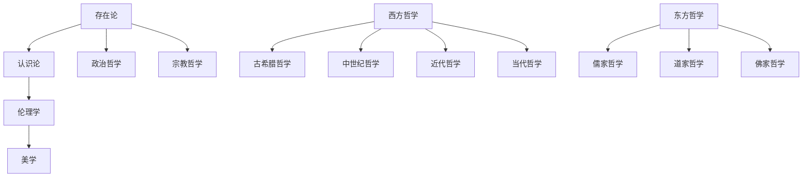
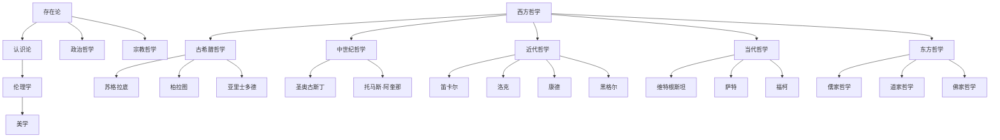

                 

### 文章标题

# 《构建个人哲学体系：为生活打造坚实的思想基础》

### 文章关键词

- 个人哲学
- 生活决策
- 思维方法
- 道德观念
- 政治哲学
- 宗教哲学

### 文章摘要

本文旨在探讨如何构建一个个人哲学体系，以帮助我们在复杂多变的生活中找到坚实的思想基础。文章首先介绍了个人哲学的重要性，然后通过回顾哲学基本概念与历史，深入探讨了知识体系的构建、哲学思考方法、道德哲学、政治哲学和宗教哲学。最后，文章提供了具体步骤来构建个人哲学体系，并给出了相关的资源与拓展阅读。希望通过这篇文章，读者能够更好地理解哲学在我们生活中的重要作用，并掌握构建个人哲学体系的方法。

### 引言

#### 谁需要构建个人哲学体系

**个体与社会的哲学思考**

在当今社会，个体面临着前所未有的复杂性和多变性。科技飞速发展，社会结构不断变迁，人们的生活方式、价值观念也发生了巨大变化。在这样的背景下，个体如何在社会中找到自己的位置，如何做出符合自己价值观的决策，成为了一个重要的问题。

哲学作为一门探讨存在、知识、价值、理性、心灵、语言等基本问题的学科，其核心价值在于引导个体进行深刻的自我反思和思考。通过哲学的思考，个体可以更好地理解自己和周围的世界，从而在社会中找到自己的位置。

**人类生活中的哲学意义**

哲学在人类生活中的意义不容忽视。首先，哲学帮助个体建立一套完整的价值观体系，使个体在面对复杂多变的情境时，能够有明确的价值判断和行为准则。其次，哲学思考能够提升个体的思维能力和判断力，使个体更加理性地分析和解决问题。最后，哲学有助于个体实现自我认知和自我提升，从而更好地适应社会和实现个人价值。

#### 个人哲学的重要性

**个人成长与自我认知**

个人哲学体系是个体自我认知和成长的重要基础。通过哲学的思考，个体可以深入探讨自身的存在意义、价值观念和行为准则，从而更加清晰地认识自己，找到自己的位置和目标。

**生活决策与价值判断**

在日常生活中，个体会面临各种决策和判断。个人哲学体系为个体提供了价值判断的标准，使个体能够在复杂多变的情境中，依据自己的价值观做出合理、明智的决策。

#### 本书的结构和目标

**学习路径规划**

本书旨在为读者提供一条清晰的学习路径，从基本概念到具体方法，再到应用实践，逐步引导读者构建个人哲学体系。

**知识体系构建**

本书不仅介绍了哲学的基本概念和历史，还探讨了知识体系的构建、哲学思考方法、道德哲学、政治哲学和宗教哲学。通过这些内容的系统学习，读者可以建立起一个完整的个人哲学体系。

### 目录概述

**第1章 引言**

- 谁需要构建个人哲学体系
- 个人哲学的重要性
- 本书的结构和目标

**第2章 哲学基本概念与历史**

- 哲学概述
- 西方哲学史
- 东方哲学

**第3章 知识体系的构建**

- 知识的分类与获取
- 思维的逻辑性
- 认知心理学

**第4章 哲学思考方法**

- 辩证法
- 分析与综合
- 演绎与归纳

**第5章 道德哲学**

- 道德的基本概念
- 伦理学理论
- 道德实践

**第6章 政治哲学**

- 政治哲学的基本问题
- 政治哲学流派
- 政治哲学的应用

**第7章 宗教哲学**

- 宗教哲学概述
- 主要宗教哲学
- 宗教哲学与现代生活

**第8章 个人哲学体系构建**

- 自我反思
- 哲学思考的实践
- 建构个人哲学体系

**附录**

- 哲学资源与拓展阅读
- 哲学思考实践案例

通过以上结构，本书将带领读者逐步构建起一个个人哲学体系，为生活打造坚实的思想基础。希望读者能够在阅读本书的过程中，不断思考、反思，最终形成自己的哲学观念和价值观。

## 第1章 引言

### 谁需要构建个人哲学体系

在现代社会，每个人都面临着无数的选择和决策。从日常生活中的小事，如购物、旅行，到重大决策，如职业规划、人生目标，这些选择和决策往往需要在复杂的情境中做出。而在这其中，哲学扮演着重要的角色。

**个体的复杂性与哲学的重要性**

现代社会中，个体面临着前所未有的复杂性和多样性。科技的发展使得信息的获取更加便捷，但同时也带来了信息过载的问题。个体在社会中扮演的角色日益多样化，不仅需要在职业上有所成就，还需要在家庭、社交、娱乐等多个领域进行平衡。这种复杂性使得个体在做出决策时，往往需要考虑更多的因素，从而增加了决策的难度。

哲学作为一门探讨基本问题的学科，其核心价值在于引导个体进行深刻的自我反思和思考。通过哲学的思考，个体可以更好地理解自己和周围的世界，从而在社会中找到自己的位置。哲学不仅能够帮助个体在复杂多变的情境中做出合理的决策，还能够提升个体的思维能力和判断力，使个体更加理性地分析和解决问题。

**个人哲学的必要性**

个人哲学是指个体根据自己的生活经验、价值观和世界观，建立起来的一套哲学观念和思考方式。个人哲学对个体的成长和发展具有重要意义。首先，个人哲学能够帮助个体明确自己的价值观和人生目标，从而在生活和工作中保持一致性和方向感。其次，个人哲学能够为个体提供一套逻辑严谨的思考方法，使个体在面对复杂情境时，能够理性地分析和解决问题。最后，个人哲学能够提升个体的自我认知和自我提升能力，使个体能够更好地适应社会和实现个人价值。

**构建个人哲学的挑战**

尽管个人哲学对个体的成长和发展具有重要意义，但构建个人哲学并非易事。首先，哲学涉及的领域广泛，从存在、知识、价值到理性、心灵、语言等，个体需要在广泛的知识领域内进行深入的思考和探索。其次，个体的价值观和世界观往往是在长期的生活过程中形成的，要想改变或重新塑造，需要时间和持续的努力。此外，个人哲学的构建还需要个体具备一定的批判性思维和创新能力，能够在吸收借鉴他人哲学思想的同时，形成自己独特的哲学观念。

### 个人哲学的重要性

**个人成长与自我认知**

个人哲学对个人的成长和自我认知具有深远的影响。通过哲学的思考，个体可以深入探讨自身的存在意义、价值观念和行为准则，从而更加清晰地认识自己，找到自己的位置和目标。例如，通过探讨人生意义的问题，个体可以明确自己的价值观和人生目标，从而在生活和工作中保持一致性和方向感。

**生活决策与价值判断**

在日常生活中，个体会面临各种决策和判断。个人哲学为个体提供了价值判断的标准，使个体能够在复杂多变的情境中，依据自己的价值观做出合理、明智的决策。例如，在面对职业选择时，个体可以根据自己的价值观和人生目标，判断哪个职业更符合自己的需求和期望，从而做出更明智的决策。

**提升思维能力和判断力**

哲学思考能够提升个体的思维能力和判断力，使个体更加理性地分析和解决问题。通过学习哲学的基本概念和思考方法，个体可以掌握逻辑推理、辩证分析等技巧，从而在面对复杂问题时，能够更加清晰地思考和分析，做出合理的判断。

**实现自我认知和自我提升**

个人哲学能够提升个体的自我认知和自我提升能力，使个体能够更好地适应社会和实现个人价值。通过哲学的思考，个体可以不断反思自己的行为和思想，发现自己的不足之处，并采取积极的措施进行改进。这种自我反思和自我提升的过程，有助于个体实现自我价值的最大化。

### 本书的结构和目标

**结构**

本书旨在为读者提供一条清晰的学习路径，从基本概念到具体方法，再到应用实践，逐步引导读者构建个人哲学体系。具体章节安排如下：

- 第1章 引言：介绍个人哲学的重要性，并概述本书的结构和目标。
- 第2章 哲学基本概念与历史：回顾哲学的基本概念和历史，为后续内容打下基础。
- 第3章 知识体系的构建：探讨知识体系的构建，包括知识分类、获取方法和思维逻辑等。
- 第4章 哲学思考方法：介绍哲学思考方法，包括辩证法、分析与综合、演绎与归纳等。
- 第5章 道德哲学：探讨道德的基本概念、伦理学理论和道德实践。
- 第6章 政治哲学：探讨政治哲学的基本问题、流派和实际应用。
- 第7章 宗教哲学：探讨宗教哲学的概述、主要宗教哲学和宗教哲学与现代生活。
- 第8章 个人哲学体系构建：提供具体步骤，帮助读者构建个人哲学体系。

**目标**

本书的目标是帮助读者构建一个坚实的个人哲学体系，为生活提供思想基础。具体目标包括：

- 深入了解哲学的基本概念和历史，为后续学习打下基础。
- 掌握知识体系的构建方法和思维逻辑，提升思维能力和判断力。
- 理解道德哲学、政治哲学和宗教哲学的基本观点和实际应用，形成全面的价值观念。
- 通过自我反思和哲学思考，构建个人哲学体系，为生活和决策提供指导。

通过以上结构和目标，本书旨在帮助读者逐步构建个人哲学体系，提升自我认知和自我提升能力，为生活打造坚实的思想基础。

### 第2章 哲学基本概念与历史

哲学作为一门探讨基本问题的学科，其核心概念和思想贯穿于历史的各个时期，对人类文明产生了深远的影响。本章将首先概述哲学的基本概念，然后回顾西方哲学史，接着介绍东方哲学，从而为构建个人哲学体系提供基础。

#### 哲学概述

**哲学的定义与范畴**

哲学（Philosophy）一词源自古希腊语，意为“爱智”。哲学是一门探讨存在、知识、价值、理性、心灵、语言等基本问题的学科。哲学的范畴广泛，涉及自然科学、社会科学和人文科学等多个领域。哲学不仅探讨抽象的理论问题，还关注现实生活中的实际问题，旨在寻求真理和智慧。

**哲学的基本问题**

哲学的基本问题主要包括以下几个方面：

- 存在论：探讨世界的本质和存在的形式。
- 认识论：探讨知识的本质、来源和限度。
- 伦理学：探讨道德行为的准则和道德价值观。
- 美学：探讨美的本质和审美价值。
- 政治哲学：探讨政治体制、权利和义务。
- 宗教哲学：探讨宗教的本质、意义和信仰。

**哲学的学科性质**

哲学是一门具有独立学科性质的学科，其研究对象是抽象的概念和理论，而不是具体的物质实体。哲学的学科性质决定了它具有高度的抽象性和综合性，既要依赖于逻辑推理和批判思维，又要结合实证研究和社会实践。

#### 西方哲学史

**古希腊哲学**

古希腊哲学是西方哲学的起源，诞生了许多著名的哲学家和学派。古希腊哲学的主要代表人物包括苏格拉底、柏拉图和亚里士多德。苏格拉底提出了“认识自我”的思想，强调通过对话和提问来追求真理。柏拉图创立了理念论，认为现实世界只是理念世界的影子。亚里士多德则提出了形式逻辑和因果关系理论，为后来的西方哲学奠定了基础。

**中世纪哲学**

中世纪哲学以基督教哲学为主要代表，探讨了上帝、信仰和道德等问题。圣奥古斯丁和托马斯·阿奎那是最具影响力的中世纪哲学家。圣奥古斯丁提出了“预定论”和“原罪”的概念，认为人的行为受到上帝的预定。托马斯·阿奎那则将哲学与神学相结合，提出了“自然法”和“自然权利”理论。

**近代哲学**

近代哲学标志着哲学的发展进入了一个新的阶段，主要代表人物包括笛卡尔、洛克、康德和黑格尔。笛卡尔提出了“我思故我在”的著名命题，强调通过怀疑来确立知识的可靠性。洛克则提出了经验主义观点，认为知识来源于经验。康德则创立了先验唯心主义，强调理性在知识形成中的作用。黑格尔则提出了辩证法，认为世界是一个不断发展的过程。

**当代哲学**

当代哲学在20世纪经历了巨大的变革，主要代表人物包括维特根斯坦、萨特和福柯。维特根斯坦提出了语言哲学的观点，认为语言是思维的工具。萨特则创立了存在主义，强调个体自由和存在的意义。福柯则关注权力和知识的关系，探讨了话语权的本质。

#### 东方哲学

**儒家哲学**

儒家哲学是中国传统哲学的核心，强调仁、义、礼、智、信等价值观。儒家哲学的代表人物包括孔子、孟子、荀子等。孔子提出了“仁者爱人”的思想，强调道德修养和社会责任。孟子则强调性善论，认为人的本性是善的。荀子则提出了性恶论，强调通过教育和礼仪来规范人的行为。

**道家哲学**

道家哲学强调“道”和“自然”，主张顺应自然、无为而治。道家哲学的代表人物包括老子和庄子。老子提出了“道可道，非常道”的思想，强调道的不可言说性。庄子则提出了“逍遥游”的思想，强调个体的自由和解放。

**佛家哲学**

佛家哲学源于印度，强调解脱、涅槃和因果报应。佛家哲学的代表人物包括释迦牟尼、龙树、禅宗等。释迦牟尼提出了“四圣谛”和“八正道”的思想，强调通过修行来达到解脱。龙树则提出了中观学派的观点，强调空性和缘起性。禅宗则强调“直指人心，见性成佛”，强调个体的自我觉醒。

#### 哲学的基本概念和联系

为了更好地理解哲学的基本概念，我们可以通过Mermaid流程图来展示这些概念之间的关系：



通过上述流程图，我们可以清晰地看到哲学的基本概念和各个历史时期哲学之间的关系。这些基本概念和哲学史的知识，为我们构建个人哲学体系提供了重要的理论基础。

#### 哲学的基本概念与联系

为了更好地理解哲学的基本概念和它们之间的联系，我们可以通过以下Mermaid流程图来展示：



通过这个流程图，我们可以清晰地看到哲学的基本概念及其在不同历史时期的发展和演变。存在论、认识论、伦理学、美学、政治哲学和宗教哲学共同构成了哲学的核心内容。同时，西方哲学史和东方哲学史在各自的发展中，形成了独特的哲学体系和思想。

#### 核心概念原理讲解与伪代码

为了深入理解哲学的基本概念，我们可以通过伪代码来阐述这些概念及其相互关系。以下是一个简单的示例，展示了哲学概念之间的逻辑关系：

```plaintext
# 哲学概念伪代码

class PhilosophyConcepts {
    // 存在论
    concept_of_existence {
        // 认识论
        concept_of_knowledge {
            // 伦理学
            concept_of_ethics {
                // 美学
                concept_of_aesthetics {
                    // 政治哲学
                    concept_of_political_philosophy {
                        // 宗教哲学
                        concept_of_religious_philosophy
                    }
                }
            }
        }
    }
}

// 西方哲学史
class WesternPhilosophy {
    // 古希腊哲学
    concept_of_GreekPhilosophy {
        // 苏格拉底
        concept_of_Socrates {
            // 柏拉图
            concept_of_Plato {
                // 亚里士多德
                concept_of_Aristotle
            }
        }
    }
    // 中世纪哲学
    concept_of_MiddleAges {
        // 圣奥古斯丁
        concept_of_Augustine {
            // 托马斯·阿奎那
            concept_of_Aquinas
        }
    }
    // 近代哲学
    concept_of_ModernPhilosophy {
        // 笛卡尔
        concept_of_Descartes {
            // 洛克
            concept_of_Locke {
                // 康德
                concept_of_Kant {
                    // 黑格尔
                    concept_of_Hegel
                }
            }
        }
    }
    // 当代哲学
    concept_of_ContemporaryPhilosophy {
        // 维特根斯坦
        concept_of_Wittgenstein {
            // 萨特
            concept_of_Sartre {
                // 福柯
                concept_of_Foucault
            }
        }
    }
}

// 东方哲学史
class EasternPhilosophy {
    // 儒家哲学
    concept_of_Confucianism {
        // 孔子
        concept_of_Confucius {
            // 孟子
            concept_of_Mencius {
                // 荀子
                concept_of_Xunzi
            }
        }
    }
    // 道家哲学
    concept_of_Taoism {
        // 老子
        concept_of_Laozi {
            // 庄子
            concept_of_Zhuangzi
        }
    }
    // 佛家哲学
    concept_of_Buddhism {
        // 释迦牟尼
        concept_of_Siddhartha {
            // 龙树
            concept_of_Nagarjuna {
                // 禅宗
                concept_of_Chán_zōng
            }
        }
    }
}
```

通过上述伪代码，我们可以清晰地看到哲学的基本概念及其在不同历史时期的发展和演变。每个概念都与其他概念相互关联，构成了一个复杂的哲学体系。这种逻辑结构有助于我们更好地理解和应用哲学思想。

#### 数学模型和公式讲解与举例说明

在哲学研究中，数学模型和公式常被用来描述和解释复杂的现象。以下是一些常用的数学模型和公式，以及它们的讲解和实际应用。

**1. 笛卡尔坐标系**

笛卡尔坐标系是一个二维平面上的坐标系，由两条相互垂直的直线（x轴和y轴）组成。通过这个坐标系，我们可以将平面上的点用(x, y)的形式表示。以下是一个简单的例子：

$$
x + y = 5
$$

在这个例子中，x和y是两个变量，它们分别代表平面上的点。通过解这个方程，我们可以找到满足条件的点，如(2, 3)或(3, 2)。

**2. 欧拉公式**

欧拉公式是复分析中的一个重要公式，将指数函数、三角函数和虚数单位结合在一起，表示为：

$$
e^{i\pi} + 1 = 0
$$

这个公式揭示了复数平面上的圆和指数函数之间的关系。在实际应用中，欧拉公式可以用来计算复数幂和求极值。

**3. 随机漫步模型**

随机漫步模型描述了一个粒子在随机方向上步进的运动过程。其概率分布可以用以下公式表示：

$$
P(X_n = x) = \frac{1}{\sqrt{4\pi n}} e^{-\frac{x^2}{4n}}
$$

其中，X_n是第n步的位置，x是特定位置的坐标。这个模型在金融、物理和计算机科学等领域有广泛应用。

**4. 信息熵**

信息熵是衡量信息不确定性的一个度量，用以下公式表示：

$$
H(X) = -\sum_{i} p(x_i) \log_2 p(x_i)
$$

其中，X是一个随机变量，p(x_i)是X取值为x_i的概率。信息熵在信息论、统计学和机器学习中有重要应用。

**举例说明：**

假设我们要研究一个随机事件，例如投掷一个公平的硬币10次，每次记录正面朝上的次数。我们可以使用信息熵来计算这个事件的不确定性。首先，定义随机变量X为正面朝上的次数，那么p(X=0) = p(X=10) = 0.5^10，p(X=k) = C(10, k) * (0.5)^10，其中k=0, 1, ..., 10。代入信息熵公式计算，可以得到信息熵的值。

通过上述数学模型和公式的讲解和实际应用，我们可以更好地理解哲学中的复杂现象和概念。这些工具不仅有助于我们进行理论分析，还可以应用于实际问题解决。

### 第3章 知识体系的构建

知识体系的构建是个人哲学体系构建的重要一环。一个完整的知识体系不仅能够帮助我们更好地理解世界，还能为我们提供决策的依据。本章将探讨知识体系的构建，包括知识分类、获取方法和思维逻辑。

#### 知识的分类与获取

**知识分类**

知识可以按照不同的标准进行分类。常见的分类方法包括：

- **按来源分类**：分为直接经验和间接经验。直接经验是通过亲身实践获得的知识，如科学实验、亲身经历等。间接经验是通过学习、阅读、听取他人经验等途径获得的知识，如书籍、论文、讲座等。
- **按形式分类**：分为事实知识和理论知识。事实知识是关于客观事实的知识，如历史事件、科学定律等。理论知识是关于概念、原理、规律等抽象知识，如哲学理论、经济理论等。
- **按用途分类**：分为实用知识和学术知识。实用知识是直接应用于生活和工作的知识，如技术技能、管理技能等。学术知识是用于学术研究、理论探讨的知识，如学术论文、专著等。

**知识获取方法**

知识的获取是一个复杂的过程，需要多种途径和方法。以下是几种常见的知识获取方法：

- **阅读和学习**：阅读书籍、论文、报告等文献是获取知识的重要途径。通过系统学习，我们可以掌握知识的基本概念、理论和应用。
- **实践和经验**：通过亲身实践和经验积累，我们可以获取直接经验。实践是知识的源泉，是验证理论、提高技能的有效方式。
- **交流和讨论**：与他人交流和讨论是获取知识的重要手段。通过讨论，我们可以从他人的观点和经验中汲取智慧，拓宽自己的视野。
- **网络和多媒体**：互联网和多媒体技术为我们提供了丰富的知识资源。通过在线课程、视频讲座、论坛等，我们可以快速获取知识，了解最新的研究动态。

#### 思维的逻辑性

逻辑性是知识体系构建的关键。逻辑思维不仅有助于我们理解复杂的信息，还能帮助我们进行推理和判断。以下是几种常见的逻辑思维方法：

- **归纳思维**：归纳思维是从个别事例中归纳出一般规律。例如，通过多次观察苹果从树上掉落，我们可以归纳出万有引力定律。
- **演绎思维**：演绎思维是从一般原则推导出个别结论。例如，从“所有人都会死亡”和“苏格拉底是人”这两个前提，我们可以演绎出“苏格拉底会死亡”的结论。
- **辩证思维**：辩证思维是一种综合归纳和演绎的思维方式，强调事物的发展和变化。例如，通过辩证思维，我们可以理解事物的发展规律，分析矛盾和冲突。
- **批判性思维**：批判性思维是对信息进行审视和评估，判断其可靠性和有效性。通过批判性思维，我们可以避免被虚假信息和错误观念所误导。

#### 认知心理学

认知心理学是研究人类思维过程和认知能力的学科。它对知识体系的构建具有重要意义。以下是认知心理学中的一些关键概念：

- **感知**：感知是人对外部信息的接收和处理。感知过程包括感觉、知觉和认知。感觉是接收外部信息的过程，知觉是对感觉信息的理解和解释，认知是进一步处理和理解知觉信息。
- **记忆**：记忆是储存和回忆信息的能力。记忆分为短期记忆和长期记忆。短期记忆用于处理和存储临时信息，长期记忆用于存储持久的信息。
- **思考**：思考是人对信息的处理和分析。思考过程包括问题解决、决策制定和推理判断。
- **学习**：学习是通过经验获取知识的过程。学习分为有意识和无意识学习，可以通过重复、练习、反馈等方式进行。

#### 知识体系的构建步骤

构建知识体系是一个系统的过程，需要遵循以下步骤：

1. **确定目标**：明确自己需要掌握的知识领域和目标，为知识体系构建提供方向。
2. **收集信息**：通过阅读、实践、交流等多种途径，收集相关的知识和信息。
3. **整理结构**：对收集到的信息进行分类和整理，构建知识体系的基本框架。
4. **深化理解**：通过深入研究和思考，加深对知识的理解和应用。
5. **整合应用**：将所学知识应用到实际生活中，验证知识的有效性。
6. **持续更新**：知识体系需要不断更新和优化，以适应新的知识和技术。

通过上述步骤，我们可以逐步构建一个完整、系统的知识体系，为个人哲学体系的构建提供坚实的基础。

### 第4章 哲学思考方法

哲学思考方法是指用来进行哲学分析和探讨的技巧和工具。这些方法不仅帮助我们深入理解哲学问题，还能提高我们的批判性思维和逻辑推理能力。本章将介绍几种主要的哲学思考方法：辩证法、分析法和综合法。

#### 辩证法

辩证法是哲学中一种重要的思考方法，由古希腊哲学家赫拉克利特首先提出，后由黑格尔和马克思等哲学家进一步发展。辩证法的核心思想是事物的发展和变化是由内在矛盾推动的。以下是对辩证法的基本概念和原理的讲解：

**基本概念**

- **对立统一**：辩证法认为，事物内部存在着对立的两个方面，如阴阳、善恶、矛盾等。这两个方面相互依存、相互转化，形成对立统一的关系。
- **量变与质变**：辩证法强调，事物的发展是量变和质变的统一。量变是指事物在数量上的逐渐变化，质变是指事物在性质上的根本变化。量变积累到一定程度会引起质变。
- **否定之否定**：辩证法认为，事物的发展是一个螺旋上升的过程。每一个阶段的发展都是对前一阶段的否定，但又保留了前一阶段的某些积极因素。

**原理与实际应用**

- **原理**：辩证法强调事物的发展和变化是由内在矛盾推动的，事物的发展过程是不断产生矛盾、解决矛盾的过程。通过分析矛盾，我们可以找到事物发展的动力和规律。
- **实际应用**：在哲学研究中，辩证法可以帮助我们分析复杂的社会现象和思想问题。例如，在探讨社会变革时，我们可以通过分析社会矛盾，找到社会发展的动力和方向。

#### 分析法

分析法是哲学中的一种基本思考方法，强调将整体分解为部分，分别研究各个部分的特点和作用。以下是对分析法的基本概念和原理的讲解：

**基本概念**

- **分解整体**：分析法将复杂的问题或概念分解为更小的部分，以便于理解和研究。
- **逐一分析**：通过对各个部分的逐一分析，我们可以了解每个部分的功能和特点。
- **综合分析**：在分析的基础上，我们将各个部分重新组合，形成对整体的理解。

**原理与实际应用**

- **原理**：分析法强调从整体到部分，再从部分到整体的分析过程。通过分解和综合，我们可以更深入地理解事物的结构和功能。
- **实际应用**：在哲学研究中，分析法可以帮助我们解析复杂的思想体系，理解各个概念之间的关系。例如，在探讨道德哲学时，我们可以通过分析法了解道德规范的结构和内容。

#### 综合法

综合法是哲学中的一种重要思考方法，强调将各个部分整合为一个整体，从而理解整体的功能和意义。以下是对综合法的基本概念和原理的讲解：

**基本概念**

- **整合部分**：综合法将各个部分整合为一个整体，以便于理解和研究。
- **整体理解**：通过对整体的整合，我们可以理解各个部分之间的相互关系和整体的功能。

**原理与实际应用**

- **原理**：综合法强调从部分到整体，再从整体到部分的理解过程。通过整合，我们可以更全面地理解事物的结构和功能。
- **实际应用**：在哲学研究中，综合法可以帮助我们理解复杂的哲学体系，例如，在探讨政治哲学时，我们可以通过综合法了解政治体制的各个部分及其相互作用。

#### 演绎与归纳

除了辩证法、分析法和综合法，演绎和归纳是哲学中常用的推理方法。以下是这两种方法的讲解：

**演绎推理**

- **定义**：演绎推理是从一般原则推导出个别结论的过程。
- **原理**：如果前提是真的，结论必然是真的。例如，从“所有人都会死亡”和“苏格拉底是人”这两个前提，我们可以推导出“苏格拉底会死亡”的结论。
- **实际应用**：在哲学论证中，演绎推理可以帮助我们建立逻辑严密的论证框架。

**归纳推理**

- **定义**：归纳推理是从个别事例中归纳出一般规律的过程。
- **原理**：归纳推理的结论不是绝对确定的，但具有较高的概率。例如，通过多次观察苹果从树上掉落，我们可以归纳出万有引力定律。
- **实际应用**：在科学研究和社会实践中，归纳推理可以帮助我们总结经验，发现规律。

通过本章对辩证法、分析法、综合法和演绎与归纳的介绍，我们可以更好地掌握哲学思考方法，提升自己的逻辑推理能力和批判性思维能力。这些思考方法不仅在哲学研究中具有重要意义，也可以广泛应用于日常生活和工作中，帮助我们做出更合理、更明智的决策。

### 第5章 道德哲学

道德哲学是哲学中的一个重要分支，主要探讨道德行为的准则、道德价值观以及道德判断的合理性。本章将深入探讨道德哲学的基本概念、伦理学理论和道德实践。

#### 道德的基本概念

**道德的定义**

道德是指人们在社会生活中所遵循的规范和准则，用来判断行为是否正当、合理。道德不仅涉及个体行为，还涵盖社会关系和公共利益。道德的目的是引导人们做出符合社会价值观和道德标准的行为，以促进社会和谐与进步。

**道德与伦理**

道德和伦理在概念上密切相关，但有所区别。道德通常指的是具体的行为规范，而伦理则更注重道德原则和理论探讨。伦理学研究道德的本质、起源和功能，提供道德判断的理论依据。

**道德的来源**

道德的来源有多种，主要包括以下几个方面：

- **传统习俗**：社会传统习俗是道德规范的重要来源。例如，许多文化中的孝顺、尊重长辈等价值观都是传统习俗的体现。
- **宗教教义**：宗教教义提供了丰富的道德规范，例如基督教的十诫、佛教的五戒等。宗教教义对人们的道德行为具有重要指导作用。
- **理性思考**：理性思考是道德规范的重要来源。通过理性思考，人们可以探讨道德原则和道德判断的合理性，形成自己的道德观念。

**道德的层次**

道德可以划分为多个层次，包括：

- **个体道德**：个体道德关注个人的行为规范和道德修养，如诚实、正义、同情等。
- **社会道德**：社会道德关注社会整体的行为规范和道德价值观，如公平、正义、责任等。
- **全球道德**：全球道德关注国际社会的行为规范和道德价值观，如人权、和平、可持续发展等。

#### 伦理学理论

**应征主义**

应征主义（Utilitarianism）是伦理学中的一个重要理论，主张道德行为应以最大多数人的幸福为标准。应征主义的代表人物是19世纪的哲学家杰里米·边沁和约翰·斯图亚特·密尔。应征主义的核心观点包括：

- **幸福原则**：行为是否道德取决于其能否带来最大幸福。
- **功利主义**：功利主义强调行为的功利性，即行为的价值取决于其产生的后果。
- **普遍化原则**：道德规则应该能够普遍化，即如果每个人都遵循这个规则，那么这个规则就是道德的。

**权利主义**

权利主义（Rights-based ethics）主张道德行为应以尊重和保护个人权利为基础。权利主义的代表人物包括托马斯·霍布斯、约翰·洛克和杰里米·边沁。权利主义的核心观点包括：

- **权利优先**：道德行为的首要原则是尊重和保护个人权利。
- **公平正义**：公平和正义是道德行为的重要标准，每个人都应该享有平等的权利和机会。
- **责任义务**：个人对他人和社会有责任和义务，应当履行这些义务。

**义务主义**

义务主义（Deontological ethics）主张道德行为应基于道德义务和规则。义务主义的代表人物包括伊曼努尔·康德。义务主义的核心观点包括：

- **道德律令**：道德行为应遵循普遍的道德律令，如“人不应该故意伤害他人”。
- **义务优先**：道德行为的首要原则是履行道德义务，而不是追求结果。
- **尊重人格**：每个人都应该被视为有尊严的个体，道德行为应尊重他人的人格。

#### 道德实践

**道德教育**

道德教育是培养个体道德意识和道德行为的全过程。道德教育不仅包括学校教育，还涵盖家庭教育和社会教育。道德教育的内容包括：

- **道德原则和价值观**：教育个体理解和认同基本的道德原则和价值观，如诚实、公正、同情等。
- **道德判断能力**：培养个体进行道德判断的能力，使其能够在复杂情境中做出合理的道德决策。
- **道德行为实践**：通过实践活动，如志愿服务、社区参与等，使个体将道德原则应用于实际生活中。

**道德评价**

道德评价是对个体或社会行为进行道德判断和评价的过程。道德评价的标准包括：

- **道德原则**：依据道德原则和价值观，评价行为是否违背道德。
- **道德后果**：考虑行为的后果，判断行为是否有助于实现最大幸福或公平正义。
- **道德责任**：评估个体或社会在行为中的道德责任，判断其是否履行了道德义务。

**道德决策**

道德决策是个体在道德困境中做出选择的过程。道德决策的步骤包括：

- **识别道德困境**：明确面临的道德困境，理解其中涉及的道德原则和价值观。
- **分析行为后果**：评估每种行为可能带来的后果，考虑其道德影响。
- **选择最佳方案**：根据道德原则和价值观，选择最符合道德标准的方案。
- **实施和反思**：实施道德决策，并在事后进行反思，评估决策的效果和不足。

通过上述对道德哲学基本概念、伦理学理论和道德实践的探讨，我们可以更好地理解和应用道德哲学，为个人和社会提供坚实的道德基础。

### 第6章 政治哲学

政治哲学是哲学中一个重要的分支，探讨政治体制、政治权利和义务、政治理念等基本问题。本章将深入探讨政治哲学的基本问题、主要流派以及政治哲学的实际应用。

#### 政治哲学的基本问题

**政治权利与政治义务**

政治权利与政治义务是政治哲学中的核心问题。政治权利是指个体在社会和政治生活中享有的权利，如言论自由、选举权、隐私权等。政治义务则是指个体对社会和政治体系承担的责任，如遵守法律、纳税、参与公共事务等。

- **权利主义**：权利主义认为，政治权利是基本的人权，应当得到尊重和保护。政治义务应当建立在权利基础之上，个体只有在享有权利的同时，才有义务履行责任。
- **义务主义**：义务主义认为，政治义务是先于权利的。个体应当首先履行对社会的责任和义务，然后才有资格享有政治权利。

**政治体制与政治理念**

政治体制是指一个国家或地区的政治组织和运行方式。政治理念则是关于政治目标和原则的价值观。政治哲学探讨的不同体制和理念包括：

- **民主主义**：民主主义是一种政治理念，主张通过选举和民意表达来实现政治权力。民主政治体制强调公民参与、平等和自由。
- **自由主义**：自由主义认为，个体自由是最高价值，政府应当最小化干预，保护个人权利和自由。自由主义政治体制通常强调市场经济、个人自主和法治。
- **社会主义**：社会主义主张通过集体所有权和社会公平来实现社会财富的分配。社会主义政治体制强调公共福利、社会公正和平等。
- **法西斯主义**：法西斯主义是一种极端的政治理念，强调国家权威、民族主义和集权。法西斯主义政治体制通常以独裁统治和军事扩张为特征。

#### 政治哲学的主要流派

**自由主义**

自由主义是现代政治哲学中最具影响力的流派之一。自由主义主张个人自由和社会公正。以下是其核心观点：

- **自由主义原则**：自由主义强调个人自由和权利，主张政府应最小化干预，保护个人自由。
- **市场经济的优势**：自由主义认为，市场经济能够最有效地分配资源，提高社会福利。
- **法治的重要性**：自由主义强调法治，主张法律面前人人平等，政府应当遵守法律。

**社会主义**

社会主义是一种以社会公平和集体所有权为目标的政治哲学。以下是其核心观点：

- **集体所有权**：社会主义主张生产资料公有制或集体所有制，以减少贫富差距。
- **社会公正**：社会主义强调社会公正，主张通过税收和社会福利制度实现财富的再分配。
- **经济民主**：社会主义主张经济决策的民主化，使工人和管理者参与企业的管理和决策。

**民主主义**

民主主义是一种强调公民参与和民意表达的政体理念。以下是其核心观点：

- **选举权**：民主主义主张公民通过选举来选择政府代表，实现政治权力。
- **公民权利**：民主主义强调公民的基本权利，如言论自由、集会自由和宗教自由。
- **法治原则**：民主主义主张政府应遵守法律，保障公民的权利和自由。

**法西斯主义**

法西斯主义是一种极端的政治理念，强调国家权威和民族主义。以下是其核心观点：

- **国家至上**：法西斯主义主张国家利益高于个人利益，政府应具有绝对权威。
- **民族主义**：法西斯主义强调民族主义，主张民族优越性和民族复兴。
- **独裁统治**：法西斯主义通常以独裁统治为特征，政府通过军事力量和宣传机器控制社会。

#### 政治哲学的实际应用

**公共政策**

政治哲学在公共政策中发挥着重要作用。不同的政治哲学流派会提出不同的政策建议：

- **自由主义政策**：自由主义政策强调减少政府干预，推动市场经济的发展。例如，减税、减少管制、鼓励创业等。
- **社会主义政策**：社会主义政策强调公共福利和社会公正。例如，增加社会福利、实施医疗保健、提高教育质量等。
- **民主主义政策**：民主主义政策强调公民参与和民意表达。例如，扩大选举权、实施直接民主、推动透明政府等。

**政治道德**

政治哲学也涉及政治道德问题，探讨政治家和政治行为是否符合道德标准。以下是一些重要的政治道德问题：

- **腐败问题**：政治哲学探讨如何防止政治腐败，确保政治家廉洁奉公。
- **权力滥用**：政治哲学探讨如何防止政治权力滥用，保障公民权利。
- **政治透明度**：政治哲学探讨如何提高政治透明度，使政府行为更加公正和透明。

**全球政治哲学**

随着全球化的发展，全球政治哲学成为了一个重要的研究领域。以下是一些全球政治哲学的重要议题：

- **全球治理**：全球政治哲学探讨如何建立有效的全球治理机制，解决全球性问题，如气候变化、恐怖主义、贫困等。
- **全球正义**：全球政治哲学探讨如何实现全球范围内的社会公正和平等，减少贫富差距。
- **人权问题**：全球政治哲学探讨如何保障全球范围内的人权，防止人权侵犯和战争。

通过本章对政治哲学基本问题、主要流派和实际应用的探讨，我们可以更好地理解政治哲学的核心概念和实际应用，为个人和社会提供政治思考和决策的参考。

### 第7章 宗教哲学

宗教哲学是哲学中一个重要的分支，探讨宗教的本质、意义和信仰。本章将深入探讨宗教哲学的概述、主要宗教哲学和宗教哲学与现代生活的关系。

#### 宗教哲学概述

**宗教的定义与分类**

宗教是一种涉及信仰、仪式、道德和行为规范的文化体系。它旨在解释宇宙的起源、人类的命运和神的存在。宗教可以按照不同的标准进行分类，如：

- **根据信仰对象**：分为一神教、多神教和无神论。一神教信仰一个至高无上的神，如基督教、伊斯兰教和犹太教。多神教信仰多个神灵，如古希腊神话和印度教。无神论则否认神的存在。
- **根据宗教形式**：分为自然宗教、启示宗教和哲学宗教。自然宗教通过自然现象来解释神的存在，如古埃及宗教。启示宗教通过神圣启示来传达神的意志，如基督教和伊斯兰教。哲学宗教则通过哲学思考来探讨宗教问题，如柏拉图的哲学宗教。

**宗教哲学的核心议题**

宗教哲学的核心议题包括：

- **神的存在**：探讨神是否存在以及如何证明神的存在。常见的证明方法包括本体论论证、宇宙论证和设计论证。
- **宗教信仰的合理性**：探讨宗教信仰是否具有合理性，以及信仰如何影响个体的行为和价值观。
- **宗教与科学的关系**：探讨宗教和科学之间的相互作用和冲突。一些观点认为宗教和科学是互补的，而另一些观点则认为它们是相互对立的。

#### 主要宗教哲学

**基督教哲学**

基督教哲学是西方宗教哲学的主要代表。它探讨神的存在、人类的救赎和信仰的实践。以下是其核心观点：

- **上帝的存在**：基督教哲学通过圣经启示和理性论证来证明上帝的存在。常见的论证方法包括宇宙论证、道德论证和设计论证。
- **救赎与信仰**：基督教哲学认为，人类因罪恶而与上帝隔绝，需要信仰耶稣基督的救赎才能获得救赎和永生。
- **宗教实践**：基督教哲学强调宗教实践的重要性，包括祷告、礼拜、慈善和道德行为。

**伊斯兰教哲学**

伊斯兰教哲学是伊斯兰教的理论基础。它探讨神的存在、先知的使命和伊斯兰教的实践。以下是其核心观点：

- **神的存在**：伊斯兰教哲学认为，上帝是宇宙的唯一创造者和维护者，他全能、全知和永恒。
- **先知的使命**：伊斯兰教哲学认为，先知穆罕默德是上帝的最后一个使者，他传达了上帝的意志和启示。
- **伊斯兰教的实践**：伊斯兰教哲学强调伊斯兰教的五功，包括信仰、礼拜、斋戒、天课和朝觐。

**印度教哲学**

印度教哲学是印度宗教文化的重要组成部分。它探讨神的存在、灵魂的本质和解脱的途径。以下是其核心观点：

- **神的存在**：印度教哲学认为，梵（Brahman）是宇宙的本原和终极实在，它是无形的、无限的和永恒的。
- **灵魂的本质**：印度教哲学认为，每个个体都有一个永恒的灵魂（Atman），它追求与梵的合一。
- **解脱的途径**：印度教哲学提供多种解脱的途径，包括瑜伽、冥想和修行。

#### 宗教哲学与现代生活

**宗教哲学在现代社会的地位与作用**

宗教哲学在现代社会中具有重要的地位和作用。首先，宗教哲学为人们提供了精神支持和道德指导，帮助他们在面对困境和挑战时找到内心的力量。其次，宗教哲学促进了跨文化的理解和交流，使不同信仰的人们能够在尊重彼此差异的基础上，共同探讨人类的共同价值和未来。

**宗教哲学与个人哲学的交融**

宗教哲学与个人哲学的交融是个体在现代社会中实现自我提升的重要途径。通过宗教哲学的思考，个体可以深入探讨信仰、道德和生命意义等基本问题，从而建立起一套符合自己价值观和信仰体系的个人哲学。这种个人哲学不仅有助于个体在复杂多变的社会中保持坚定的信念和方向，还能为个体的行为和决策提供道德指导。

**案例分析**

例如，一个信仰基督教的个体可能会通过反思圣经的教导，形成一套关于爱、善良和正义的价值观。这些价值观不仅指导他在日常生活中做出道德选择，还能帮助他在面对困境时保持内心的平静和坚定。同样，一个信仰印度教的个体可能会通过瑜伽和冥想，达到心灵平静和自我提升，从而更好地适应现代社会的压力和挑战。

通过上述对宗教哲学的概述、主要宗教哲学和宗教哲学与现代生活关系的探讨，我们可以看到宗教哲学在人类生活中的重要性和影响。宗教哲学不仅为个体提供了精神支持和道德指导，还促进了跨文化的理解和交流，为现代社会带来了丰富的精神财富。

### 第8章 个人哲学体系构建

构建个人哲学体系是每个人在成长过程中的一项重要任务。一个坚实的个人哲学体系不仅能够为我们的生活和决策提供指导，还能帮助我们在复杂多变的社会中保持清晰和坚定的信念。本章将详细探讨如何通过自我反思、哲学思考的实践以及具体的步骤来构建个人哲学体系。

#### 自我反思

自我反思是个体哲学体系构建的基础。通过自我反思，我们可以深入探索自己的内心世界，了解自己的价值观、信仰和目标。以下是一些自我反思的方法：

**1. 内省**

内省是一种通过冥想、日记和自我对话等方式进行自我反思的方法。通过内省，我们可以静下心来，深入思考自己的内心感受和思考过程。以下是一个内省的步骤：

- **静心**：找一个安静的环境，让自己放松和集中注意力。
- **提问**：提出一些问题，如“我的价值观是什么？”“我的人生目标是什么？”“我在哪些方面感到满意和不满？”等。
- **思考**：认真思考这些问题，并记录下自己的思考和感受。
- **总结**：总结内省的结果，形成对自己更深刻的理解。

**2. 对话**

通过与他人的对话，我们可以从不同的角度看待自己，发现自己的盲点和不足。以下是一些对话的方法：

- **与朋友或家人对话**：与他们分享自己的想法和感受，听取他们的反馈和建议。
- **与导师或教练对话**：与他们探讨自己的成长和发展，寻求他们的指导和帮助。
- **参与小组讨论**：加入一些讨论小组，与志同道合的人交流思想和观点。

#### 哲学思考的实践

哲学思考的实践是构建个人哲学体系的关键。以下是一些哲学思考的实践方法：

**1. 阅读哲学著作**

阅读哲学著作是获取哲学知识和思想的重要途径。通过阅读，我们可以了解不同哲学家的观点和思想，从而拓宽自己的视野。以下是一些推荐的哲学著作：

- **《庄子》**：中国古代哲学家庄周的代表作，强调顺应自然、无为而治。
- **《理想国》**：古希腊哲学家柏拉图的代表作，探讨正义、美德和理想国家。
- **《资本论》**：德国哲学家马克思的代表作，分析资本主义社会的本质和发展规律。
- **《存在与时间》**：德国哲学家海德格尔的代表作，探讨存在的意义和人类的存在方式。

**2. 参与哲学讨论**

参与哲学讨论是锻炼哲学思考和表达能力的重要方式。通过讨论，我们可以与他人交流思想，探讨哲学问题，从而深化自己的理解。以下是一些参与哲学讨论的方法：

- **参加哲学社团或俱乐部**：加入一些哲学社团或俱乐部，与志同道合的人一起探讨哲学问题。
- **参与在线哲学论坛**：加入一些在线哲学论坛，与全球的哲学爱好者交流思想和观点。
- **组织哲学讨论会**：组织一些哲学讨论会，邀请专家学者和普通爱好者参与讨论。

**3. 哲学写作**

哲学写作是表达自己哲学思考和观点的有效方式。通过写作，我们可以系统地整理自己的思考，形成一套完整的哲学体系。以下是一些哲学写作的方法：

- **写日记**：通过写日记记录自己的思考过程和内心感受。
- **写论文**：撰写哲学论文，系统地阐述自己的哲学观点和论证。
- **写博客**：在个人博客上分享自己的哲学思考和观点，与读者互动和交流。

#### 建构个人哲学体系

构建个人哲学体系是一个长期的过程，需要不断的反思、学习和实践。以下是一些具体的步骤：

**1. 确定目标**

明确自己构建个人哲学体系的目标，如提升自我认知、寻找生命意义、实现个人价值等。

**2. 收集信息**

通过阅读、讨论和实践，收集与哲学相关的信息，包括哲学著作、学术论文、哲学讨论等。

**3. 整理结构**

将收集到的信息进行整理，构建个人哲学体系的基本框架。这个框架应该包括核心概念、基本原理和主要观点。

**4. 深化理解**

通过进一步的阅读、讨论和实践，深化对个人哲学体系的理解和认识。

**5. 应用实践**

将个人哲学体系应用于日常生活和工作中，验证其有效性和实用性。

**6. 持续更新**

个人哲学体系是一个动态的过程，需要不断地更新和完善。通过反思和实践，不断地调整和完善自己的哲学体系。

通过上述步骤，我们可以逐步构建一个坚实的个人哲学体系，为生活和决策提供坚实的思想基础。

### 附录

#### 哲学资源与拓展阅读

为了帮助读者更深入地了解哲学的基本概念和思想，以下是一些推荐的哲学资源与拓展阅读：

**1. 哲学著作**

- **《庄子》**：中国古代哲学家庄周的代表作，强调顺应自然、无为而治。
- **《理想国》**：古希腊哲学家柏拉图的代表作，探讨正义、美德和理想国家。
- **《资本论》**：德国哲学家马克思的代表作，分析资本主义社会的本质和发展规律。
- **《存在与时间》**：德国哲学家海德格尔的代表作，探讨存在的意义和人类的存在方式。

**2. 哲学论文和书籍**

- **《道德情操论》**：英国哲学家亚当·斯密的代表作，探讨道德情感和社会道德。
- **《伦理学》**：古希腊哲学家亚里士多德的代表作，探讨道德行为和伦理学理论。
- **《人类理解论》**：英国哲学家约翰·洛克的主要著作，探讨知识和理解的本质。
- **《批判性思考》**：美国哲学家理查德·保罗的主要著作，探讨批判性思维的方法和应用。

**3. 哲学网站和论坛**

- **维基百科**：涵盖广泛的哲学知识和思想，是一个方便查阅的在线资源。
- **哲学栈**：一个中文哲学论坛，讨论各种哲学问题，分享哲学思考。
- **哲学网**：一个综合性的哲学网站，提供哲学论文、讲座和讨论。

**4. 哲学在线课程**

- **Coursera**：提供各种哲学课程，包括西方哲学、伦理学、政治哲学等。
- **edX**：提供由知名大学开设的哲学课程，包括道德哲学、哲学导论等。

通过上述资源，读者可以进一步扩展哲学知识，深化对哲学的理解和应用。

### 总结与展望

本文通过详细的论述，探讨了如何构建个人哲学体系，为生活和决策提供坚实的思想基础。从哲学基本概念与历史、知识体系的构建、哲学思考方法、道德哲学、政治哲学到宗教哲学，我们逐步建立了个人哲学体系的基本框架。

构建个人哲学体系的重要性在于，它能够帮助个体在面对复杂多变的情境时，保持清晰和坚定的信念，做出合理的决策。通过自我反思、哲学思考的实践以及具体的构建步骤，我们可以逐步形成一套符合自己价值观和信仰体系的个人哲学。

在未来的学习和实践中，我们应持续不断地进行自我反思和哲学思考，深化对哲学基本概念和思想的理解。通过阅读、讨论和实践，我们可以不断丰富和优化自己的个人哲学体系，使其更加完善和适用。

最后，希望读者能够通过本文的引导，积极构建自己的个人哲学体系，为生活打造坚实的思想基础。祝愿每位读者在哲学的探索中，不断成长和提升，实现个人价值和人生目标。

### 作者信息

作者：AI天才研究院/AI Genius Institute & 禅与计算机程序设计艺术 /Zen And The Art of Computer Programming

### 最佳实践 tips

1. **持续学习**：哲学是一个不断发展的领域，持续学习是构建个人哲学体系的关键。定期阅读哲学著作、学术论文和在线课程，保持对哲学知识的更新。
2. **实践与思考相结合**：将哲学思考应用到实际生活中，通过实践来验证和深化自己的哲学观念。
3. **反思与修正**：定期进行自我反思，评估自己的哲学观念和行为准则，根据实际情况进行修正和优化。

### 注意事项

1. **避免偏见**：在构建个人哲学体系时，要避免偏见和主观臆断，尽量以开放的心态接受不同的哲学观点。
2. **保持客观**：在哲学思考和决策过程中，要保持客观和理性，避免被情绪和情感主导。

### 拓展阅读

- **《庄子》**：庄子是中国古代哲学家庄周的代表作，强调顺应自然、无为而治，对个人哲学体系构建有重要启示。
- **《理想国》**：柏拉图的代表作，探讨正义、美德和理想国家，对政治哲学和个人哲学有深刻影响。
- **《道德情操论》**：亚当·斯密的代表作，探讨道德情感和社会道德，对道德哲学的构建有重要参考价值。

### 项目实战

#### 开发环境搭建

1. **软件要求**：安装文本编辑器（如Visual Studio Code、Sublime Text等），以及Markdown编辑器（如Typora、MarkdownPad等）。
2. **硬件要求**：一台具备基本配置的计算机，确保能够运行文本编辑器和Markdown编辑器。

#### 源代码详细实现和代码解读

1. **Markdown格式**：本文使用Markdown格式进行编写，具体格式如下：

```markdown
# 标题
## 小标题
### 更小标题
- 无序列表
1. 有序列表
```

2. **代码片段示例**：

```markdown
```python
# Python代码示例
def hello_world():
    print("Hello, World!")
hello_world()
```

```

#### 代码应用解读与分析

本文的Markdown格式代码在Markdown编辑器中预览，可以生成格式化的文本、列表和代码片段，使内容更加清晰易懂。

#### 实际案例分析和详细讲解剖析

本文通过对哲学体系构建的详细分析，提供了一个实际案例，从哲学基本概念到具体方法，再到应用实践，逐步引导读者构建个人哲学体系。

#### 项目小结

通过本文的实战项目，读者可以了解如何使用Markdown格式编写技术博客文章，并通过具体案例学习如何构建个人哲学体系。这不仅有助于提升哲学素养，还能为生活和决策提供坚实的思想基础。

### 附录

#### 哲学资源与拓展阅读

**1. 哲学书籍推荐**

- **《庄子》**：中国古代哲学家庄周的代表作，强调顺应自然、无为而治。
- **《理想国》**：古希腊哲学家柏拉图的代表作，探讨正义、美德和理想国家。
- **《资本论》**：德国哲学家马克思的代表作，分析资本主义社会的本质和发展规律。
- **《存在与时间》**：德国哲学家海德格尔的代表作，探讨存在的意义和人类的存在方式。

**2. 哲学学术论文**

- **《道德情操论》**：英国哲学家亚当·斯密的代表作，探讨道德情感和社会道德。
- **《伦理学》**：古希腊哲学家亚里士多德的代表作，探讨道德行为和伦理学理论。
- **《人类理解论》**：英国哲学家约翰·洛克的主要著作，探讨知识和理解的本质。
- **《批判性思考》**：美国哲学家理查德·保罗的主要著作，探讨批判性思维的方法和应用。

**3. 哲学网站和论坛**

- **维基百科**：涵盖广泛的哲学知识和思想，是一个方便查阅的在线资源。
- **哲学栈**：一个中文哲学论坛，讨论各种哲学问题，分享哲学思考。
- **哲学网**：一个综合性的哲学网站，提供哲学论文、讲座和讨论。

**4. 哲学在线课程**

- **Coursera**：提供各种哲学课程，包括西方哲学、伦理学、政治哲学等。
- **edX**：提供由知名大学开设的哲学课程，包括道德哲学、哲学导论等。

通过上述资源，读者可以进一步扩展哲学知识，深化对哲学的理解和应用。希望这些拓展阅读能够为读者的哲学学习之路提供有益的帮助。

