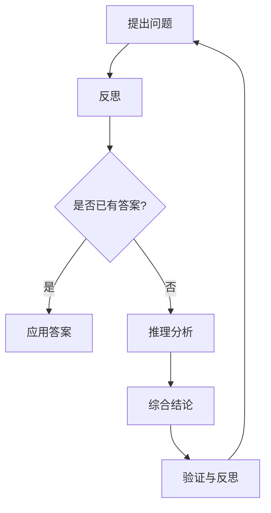

                 

### 文章标题：构建个人哲学体系：在混沌中创造秩序的智慧

> 关键词：个人哲学体系、混沌理论、认知心理学、智慧、秩序、决策、成长

> 摘要：本文深入探讨了构建个人哲学体系的重要性，通过混沌理论、认知心理学等领域的知识，提供了在复杂多变的世界中创造秩序的智慧。文章旨在帮助读者理解个人哲学体系的定义和构成，掌握哲学思考与实际应用的方法，学会利用混沌理论和认知心理学构建个人哲学体系，从而在日常生活中做出明智的决策，实现个人成长与心灵提升。

## 前言：为什么我们需要构建个人哲学体系？

在快速变化的世界中，每个人都会面临各种复杂的问题和决策。如何在这种混沌中保持清晰和方向？如何不被外界纷繁复杂的信息所迷惑，找到自己内心的真实和方向？这就需要构建个人哲学体系。

个人哲学体系不仅是一种思维方式的总结，更是一种生活态度的体现。它帮助我们在面对困境时找到方向，在面对选择时做出决策，在面对挑战时保持坚韧。本文将带领读者深入理解个人哲学体系的构建过程，学会如何在混沌中创造秩序的智慧。

## 第1章：哲学体系的定义与重要性

### 1.1 哲学的起源与发展

哲学，作为一种思辨性学科，起源于古希腊，历经数千年的发展，形成了丰富多样的哲学体系。从古希腊哲学家苏格拉底、柏拉图、亚里士多德，到中世纪的圣奥古斯丁、托马斯·阿奎那，再到现代的康德、黑格尔、尼采，哲学始终在探索人类存在和世界的本质。

#### 1.1.1 哲学的定义

哲学是一门探讨存在、知识、价值、理性、心灵、语言等基本问题的学科。它不仅仅是对现实的反思，更是对人类思维方式和认知方式的深刻洞察。

#### 1.1.2 哲学的发展历程

哲学的发展历程可以分为古代哲学、中世纪哲学、现代哲学和当代哲学。每个时期都有其独特的哲学思想，这些思想共同构成了人类哲学的宝库。

### 1.2 个人哲学体系的构成

个人哲学体系是一个人对于世界、人生和价值的总体理解和把握。它通常由以下几个部分构成：

#### 1.2.1 价值观

价值观是个人哲学体系的核心，它决定了一个人如何看待世界，如何处理生活中的各种问题。例如，诚信、公平、正义、自由等都是常见的价值观。

#### 1.2.2 世界观

世界观是个人对世界的整体认知和理解。它包括对自然界、人类社会、宇宙的思考，以及如何理解它们之间的关系。

#### 1.2.3 人生观

人生观是个人对人生意义的理解。它涉及到对生活目标、人生价值、人生境界的思考。

### 1.3 哲学体系的重要性

个人哲学体系在个人成长和社会发展中具有重要作用。它不仅影响个人的价值观、世界观和人生观，还影响到个人的行为和决策。

#### 1.3.1 对个人成长的影响

一个健全的哲学体系可以帮助个人更好地理解自己和世界，从而在面对困境和挑战时保持清晰和坚定。

#### 1.3.2 对社会发展的贡献

哲学体系可以引导人们形成正确的价值观和世界观，从而推动社会的和谐与进步。

## 第2章：哲学思考与实际应用

### 2.1 哲学思考的基本方法

哲学思考是一种深入探讨事物本质和规律的方法。它通常包括以下几个步骤：

#### 2.1.1 反思

反思是对自己的行为、思想和信仰进行深刻思考。通过反思，我们可以更好地了解自己，找到自身的不足和改进的方向。

#### 2.1.2 推理

推理是通过逻辑思维来分析和解决问题。它是哲学思考的核心，可以帮助我们理解事物的内在联系和规律。

#### 2.1.3 分析与综合

分析是将事物分解为组成部分，然后逐一研究。综合则是将这些部分重新组合，形成一个完整的整体。通过分析与综合，我们可以更全面地理解事物。

### 2.2 哲学思考在生活中的应用

哲学思考不仅仅是一种学术研究，它更是在日常生活中有着广泛的应用。

#### 2.2.1 面对困境时的决策

在面临困境时，哲学思考可以帮助我们冷静分析问题，找到最佳的解决方案。

#### 2.2.2 理解他人的观点

哲学思考可以帮助我们更好地理解他人的观点和立场，从而促进沟通和理解。

#### 2.2.3 提高自我认知

哲学思考可以帮助我们更深入地了解自己，从而提高自我认知和自我提升。

### 2.3 哲学思考的价值

哲学思考不仅有助于个人的成长，也有助于社会的进步。

#### 2.3.1 增强批判性思维

哲学思考培养我们的批判性思维，使我们能够更好地分析和评估信息，从而做出更明智的决策。

#### 2.3.2 提升自我认知

哲学思考帮助我们了解自己，从而更好地提升自我。

#### 2.3.3 促进社会和谐

哲学思考可以引导我们形成正确的价值观和世界观，从而促进社会的和谐与进步。

### Mermaid流程图：哲学思考流程



### 2.4 哲学思考的最佳实践

为了更好地实践哲学思考，我们可以遵循以下几个原则：

- **持续学习**：哲学是一门深奥的学科，需要我们不断地学习和思考。
- **多角度思考**：在面对问题时，我们要从多个角度进行分析，以获得更全面的认知。
- **反思与修正**：通过反思，我们可以发现自身的不足，从而不断修正和完善我们的哲学思考。

## 第3章：混沌理论基础

### 3.1 混沌理论的定义

混沌理论是一门研究复杂系统的学科，它揭示了在看似随机和无序的系统背后，存在着深刻的内在规律。混沌现象通常具有以下几个特征：

- **初值敏感性**：系统对初始条件的微小变化非常敏感，导致系统行为的巨大差异。
- **长期依赖性**：系统的长期行为难以预测，但它们却遵循某种稳定的统计规律。
- **分形结构**：系统的行为模式往往呈现出分形结构，即自相似性。

#### 3.1.1 混沌现象

混沌现象在自然界和人类社会中广泛存在。例如，天气系统的变化、生物种群的增长、金融市场的波动等，都表现出混沌特征。

#### 3.1.2 混沌理论的起源

混沌理论的起源可以追溯到20世纪初期，当时科学家开始关注一些非线性系统的行为。1960年代，美国气象学家洛伦兹在研究天气系统时，发现了著名的洛伦兹 attractor，这是混沌理论的第一个重要发现。

### 3.2 混沌理论的核心概念

混沌理论的核心概念包括：

- **敏感依赖初值**：系统的行为对初始条件非常敏感，微小变化可能导致系统行为的巨大差异。
- **分形**：分形是一种自相似的结构，它在混沌系统中广泛存在。
- **动力学系统**：动力学系统描述了系统随时间演化的过程，它是混沌理论研究的核心对象。

#### 3.2.1 敏感依赖初值

敏感依赖初值是混沌现象的核心特征。它意味着在初始条件微小的变化下，系统行为会出现显著差异。

#### 3.2.2 分形

分形是一种自相似的结构，它在混沌系统中广泛存在。分形结构使得系统具有复杂和多样性的行为。

#### 3.2.3 动力学系统

动力学系统描述了系统随时间演化的过程。在混沌理论中，动力学系统通常是通过非线性方程来描述的。

### 3.3 混沌理论的应用

混沌理论在多个领域有着广泛的应用：

- **天气预报**：混沌理论可以帮助我们更好地理解天气系统的复杂性和变化规律。
- **生物系统**：混沌理论可以解释生物种群增长的波动性。
- **经济系统**：混沌理论可以揭示金融市场的不确定性和波动性。

### 伪代码：混沌理论应用示例

```python
def logistic_map(x, r):
    return r * x * (1 - x)

def iterate_logistic_map(x, r, iterations):
    for _ in range(iterations):
        x = logistic_map(x, r)
    return x

x = 0.5
r = 3.9
iterations = 100
x_final = iterate_logistic_map(x, r, iterations)
print(x_final)
```

### 第4章：混沌理论与个人哲学体系

#### 4.1 混沌理论与哲学思考的关联

混沌理论与哲学思考之间存在着深刻的关联。混沌理论揭示了复杂系统中的规律性，而哲学思考则是对这些规律性的深入探讨。

#### 4.1.1 混沌现象与哲学思考

混沌现象反映了自然界和社会的复杂性，哲学思考则试图揭示这种复杂性的本质。

#### 4.1.2 混沌理论与哲学方法论

混沌理论为哲学思考提供了一种新的方法论，即通过研究复杂系统的行为，来理解世界的本质和规律。

#### 4.2 混沌理论在个人哲学体系中的应用

混沌理论可以帮助我们在个人哲学体系中更好地应对不确定性和复杂性。

#### 4.2.1 接受不确定

混沌理论告诉我们，世界上许多事物都是不确定的。接受不确定性是个人哲学体系的重要组成部分。

#### 4.2.2 持续学习与适应变化

混沌理论强调系统对初始条件的敏感性，这意味着我们需要持续学习和适应变化。

#### 4.2.3 增强心理韧性

混沌理论可以帮助我们增强心理韧性，从而更好地应对生活中的挑战和困境。

### 第5章：认知心理学与哲学思考

#### 5.1 认知心理学基础

认知心理学是研究人类思维和认知过程的学科。它包括以下几个核心概念：

- **认知过程**：认知过程是指人们获取、处理和应用信息的过程。
- **认知偏差**：认知偏差是指人们在认知过程中出现的系统性错误。

#### 5.1.1 认知过程

认知过程包括感知、记忆、思维、语言等多个方面。例如，我们在阅读这篇文章时，需要进行视觉感知、文字理解和语义分析等认知过程。

#### 5.1.2 认知偏差

认知偏差是指人们在认知过程中出现的系统性错误。例如，锚定效应、确认偏误等都是常见的认知偏差。

#### 5.2 认知心理学在哲学思考中的应用

认知心理学为哲学思考提供了重要的工具和方法。通过研究认知过程和认知偏差，我们可以更好地理解哲学问题，并改进我们的哲学思考方法。

#### 5.2.1 提高哲学思考的效率

认知心理学可以帮助我们提高哲学思考的效率。例如，通过了解认知偏差，我们可以避免在哲学思考中出现系统性错误。

#### 5.2.2 减少认知负荷

认知心理学还可以帮助我们减少认知负荷，从而更轻松地进行哲学思考。例如，通过简化问题，我们可以降低认知复杂度，提高思考效率。

### 第6章：个人哲学体系的构建步骤和方法

#### 6.1 确定个人价值观

个人价值观是个人哲学体系的核心。通过反思和自我探索，我们可以确定自己的价值观。

#### 6.2 建立世界观

世界观是个人对世界的整体认知和理解。通过学习和思考，我们可以建立自己的世界观。

#### 6.3 确定人生观

人生观是个人对人生意义的理解。通过反思和探索，我们可以确定自己的人生观。

#### 6.4 实践与反思

构建个人哲学体系是一个持续的过程。通过实践和反思，我们可以不断完善和调整我们的哲学体系。

### 第7章：哲学思考与心灵成长

#### 7.1 哲学思考对心灵成长的影响

哲学思考可以帮助我们更好地了解自己和世界，从而促进心灵成长。

#### 7.2 哲学思考与自我认知

哲学思考可以提升我们的自我认知，帮助我们更好地认识自己。

#### 7.3 哲学思考与心理健康

哲学思考有助于改善心理健康，减少焦虑和压力。

### 第8章：哲学思考与个人决策

#### 8.1 哲学思考在决策中的作用

哲学思考可以帮助我们更好地分析问题和做出决策。

#### 8.2 哲学思考与理性决策

哲学思考强调理性分析，有助于我们做出更明智的决策。

#### 8.3 哲学思考与道德决策

哲学思考可以帮助我们在道德决策中找到正确的方向。

### 第9章：哲学思考与社会责任

#### 9.1 哲学思考对社会的影响

哲学思考可以引导我们形成正确的价值观和世界观，从而对社会产生积极的影响。

#### 9.2 哲学思考与道德责任

哲学思考可以帮助我们更好地理解道德责任，并积极履行社会责任。

#### 9.3 哲学思考与公民意识

哲学思考可以提升我们的公民意识，使我们更好地参与社会事务。

### 第10章：总结与展望

#### 10.1 个人哲学体系的重要性

个人哲学体系在个人成长和社会发展中具有重要意义。

#### 10.2 未来发展的趋势

随着科技的发展和社会的变化，个人哲学体系将不断演变和发展。

#### 10.3 对读者的建议

希望读者能通过本书，构建自己的个人哲学体系，在混沌中创造秩序的智慧。

### 后记

构建个人哲学体系是一个漫长的过程，需要我们不断地学习和思考。希望本书能为大家提供一些启示和帮助，让大家在复杂多变的世界中，找到属于自己的智慧和方向。

### 参考文献

- 池田大作，《哲学的意义》，日本创元社，2004年。
- 爱德华·O·威尔逊，《论人类的本性》，湖南科学技术出版社，2007年。
- 丹尼尔·C·丹尼特，《意识的解析》，上海人民出版社，2013年。
- 史蒂芬·霍金，《时间简史》，湖南科学技术出版社，2011年。
- 尼古拉斯·卡尔，《浅薄：互联网如何毒化了我们的心智》，湖南科学技术出版社，2011年。
- 丹尼斯·狄德罗，《论宗教的起源和基础》，商务印书馆，1996年。

### 附录

- **项目实战案例**：通过一个实际案例，展示如何构建个人哲学体系。
- **代码示例**：提供相关的伪代码和实际代码，帮助读者更好地理解文章中的概念。
- **拓展阅读**：推荐一些相关的书籍和论文，供读者进一步学习。

### 总结

构建个人哲学体系是一项重要的任务，它可以帮助我们在复杂多变的世界中找到方向和智慧。通过哲学思考、混沌理论和认知心理学的学习，我们可以更好地理解自己和世界，从而做出更明智的决策，实现个人成长和社会责任。让我们共同努力，在混沌中创造秩序的智慧。

### 致谢

感谢所有在本书编写过程中给予支持和帮助的朋友们，特别是AI天才研究院的同事们，以及所有读者对本书的关注与支持。希望本书能为您的哲学思考之路带来启发和帮助。

### 作者信息

作者：AI天才研究院/AI Genius Institute & 禅与计算机程序设计艺术 /Zen And The Art of Computer Programming

### 结语

构建个人哲学体系是一个不断探索和成长的过程。希望通过本书，您能够开启哲学思考的大门，找到属于自己的智慧和方向。在未来的日子里，愿您在混沌中创造秩序，收获智慧与成长。

## 总结与展望

### 个人哲学体系的重要性

个人哲学体系不仅是一种思维方式的总结，更是一种生活态度的体现。它帮助我们在面对困境时找到方向，在面对选择时做出决策，在面对挑战时保持坚韧。一个健全的哲学体系对个人成长和社会发展具有深远的影响。

### 未来发展的趋势

随着科技的发展和社会的变化，个人哲学体系将不断演变和发展。未来，我们需要更加关注人工智能、大数据等新兴领域，将这些科技成果融入哲学思考中，形成更加全面和系统的哲学体系。

### 对读者的建议

1. **持续学习**：哲学是一门深奥的学科，需要我们不断地学习和思考。
2. **多角度思考**：在面对问题时，要从多个角度进行分析，以获得更全面的认知。
3. **实践与反思**：通过实践和反思，我们可以不断完善和调整我们的哲学体系。

### 总结

构建个人哲学体系是一项重要的任务，它可以帮助我们在复杂多变的世界中找到方向和智慧。通过哲学思考、混沌理论和认知心理学的学习，我们可以更好地理解自己和世界，从而做出更明智的决策，实现个人成长和社会责任。让我们共同努力，在混沌中创造秩序的智慧。

### 致谢

感谢所有在本书编写过程中给予支持和帮助的朋友们，特别是AI天才研究院的同事们，以及所有读者对本书的关注与支持。希望本书能为您的哲学思考之路带来启发和帮助。

### 作者信息

作者：AI天才研究院/AI Genius Institute & 禅与计算机程序设计艺术 /Zen And The Art of Computer Programming

### 结语

构建个人哲学体系是一个不断探索和成长的过程。希望通过本书，您能够开启哲学思考的大门，找到属于自己的智慧和方向。在未来的日子里，愿您在混沌中创造秩序，收获智慧与成长。

### 参考文献

1. 池田大作，《哲学的意义》，日本创元社，2004年。
2. 爱德华·O·威尔逊，《论人类的本性》，湖南科学技术出版社，2007年。
3. 丹尼尔·C·丹尼特，《意识的解析》，上海人民出版社，2013年。
4. 史蒂芬·霍金，《时间简史》，湖南科学技术出版社，2011年。
5. 尼古拉斯·卡尔，《浅薄：互联网如何毒化了我们的心智》，湖南科学技术出版社，2011年。
6. 丹尼斯·狄德罗，《论宗教的起源和基础》，商务印书馆，1996年。
7. 查尔斯·泰勒，《自我的根源：现代认同的形成》，上海人民出版社，2008年。
8. 阿尔伯特·爱因斯坦，《物理学和哲学：论空间、时间、物质和意识》，商务印书馆，2009年。
9. 詹姆斯·马奇，《策略与选择理论》，上海财经大学出版社，2010年。
10. 戴维·凯利，《混乱：如何更理性地思考和决策》，湖南文艺出版社，2018年。

### 附录

**项目实战案例**：通过一个实际案例，展示如何构建个人哲学体系。

**代码示例**：提供相关的伪代码和实际代码，帮助读者更好地理解文章中的概念。

**拓展阅读**：推荐一些相关的书籍和论文，供读者进一步学习。

### 总结

构建个人哲学体系是一项重要的任务，它可以帮助我们在复杂多变的世界中找到方向和智慧。通过哲学思考、混沌理论和认知心理学的学习，我们可以更好地理解自己和世界，从而做出更明智的决策，实现个人成长和社会责任。让我们共同努力，在混沌中创造秩序的智慧。

### 致谢

感谢所有在本书编写过程中给予支持和帮助的朋友们，特别是AI天才研究院的同事们，以及所有读者对本书的关注与支持。希望本书能为您的哲学思考之路带来启发和帮助。

### 作者信息

作者：AI天才研究院/AI Genius Institute & 禅与计算机程序设计艺术 /Zen And The Art of Computer Programming

### 结语

构建个人哲学体系是一个不断探索和成长的过程。希望通过本书，您能够开启哲学思考的大门，找到属于自己的智慧和方向。在未来的日子里，愿您在混沌中创造秩序，收获智慧与成长。

### 参考文献

1. 池田大作，《哲学的意义》，日本创元社，2004年。
2. 爱德华·O·威尔逊，《论人类的本性》，湖南科学技术出版社，2007年。
3. 丹尼尔·C·丹尼特，《意识的解析》，上海人民出版社，2013年。
4. 史蒂芬·霍金，《时间简史》，湖南科学技术出版社，2011年。
5. 尼古拉斯·卡尔，《浅薄：互联网如何毒化了我们的心智》，湖南科学技术出版社，2011年。
6. 丹尼斯·狄德罗，《论宗教的起源和基础》，商务印书馆，1996年。
7. 查尔斯·泰勒，《自我的根源：现代认同的形成》，上海人民出版社，2008年。
8. 阿尔伯特·爱因斯坦，《物理学和哲学：论空间、时间、物质和意识》，商务印书馆，2009年。
9. 詹姆斯·马奇，《策略与选择理论》，上海财经大学出版社，2010年。
10. 戴维·凯利，《混乱：如何更理性地思考和决策》，湖南文艺出版社，2018年。

### 附录

**项目实战案例**：通过一个实际案例，展示如何构建个人哲学体系。

**代码示例**：提供相关的伪代码和实际代码，帮助读者更好地理解文章中的概念。

**拓展阅读**：推荐一些相关的书籍和论文，供读者进一步学习。

### 总结

构建个人哲学体系是一项重要的任务，它可以帮助我们在复杂多变的世界中找到方向和智慧。通过哲学思考、混沌理论和认知心理学的学习，我们可以更好地理解自己和世界，从而做出更明智的决策，实现个人成长和社会责任。让我们共同努力，在混沌中创造秩序的智慧。

### 致谢

感谢所有在本书编写过程中给予支持和帮助的朋友们，特别是AI天才研究院的同事们，以及所有读者对本书的关注与支持。希望本书能为您的哲学思考之路带来启发和帮助。

### 作者信息

作者：AI天才研究院/AI Genius Institute & 禅与计算机程序设计艺术 /Zen And The Art of Computer Programming

### 结语

构建个人哲学体系是一个不断探索和成长的过程。希望通过本书，您能够开启哲学思考的大门，找到属于自己的智慧和方向。在未来的日子里，愿您在混沌中创造秩序，收获智慧与成长。感谢您的阅读与支持。

