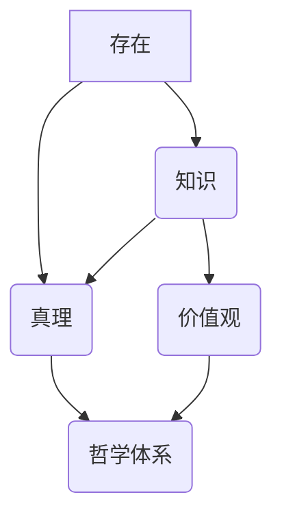

                 


## 2. 背景介绍

构建个人哲学体系是一个复杂而重要的过程，它不仅仅关乎个人的成长，更是人类文明进步的基石。在信息技术迅猛发展的今天，哲学思想的应用愈发显得至关重要。本文旨在探讨如何构建一个坚实的个人哲学体系，以便为读者提供一套系统的思考方法和行为指南。

首先，我们需要了解什么是哲学。哲学，是一门探究存在、知识、价值和理性的学科。它不仅仅是对知识的追求，更是一种对生活的深刻思考。哲学的核心问题包括：我们如何认识世界？我们如何知道什么是真实的？我们的价值观是什么？这些问题不仅关乎个体，更关乎社会和文明的进步。

随着信息技术的不断发展，人们对于数据和算法的依赖日益加深。然而，数据和信息并不等同于知识。知识需要经过深思熟虑的推理和验证，而哲学正是提供这种思考方式的工具。通过哲学，我们可以培养批判性思维，提高判断力，从而更好地应对复杂多变的社会环境。

## 3. 核心概念与联系

### 3.1 哲学的基本概念

哲学的基本概念包括存在、知识、真理、价值观等。这些概念之间存在紧密的联系，共同构成了哲学的框架。

- **存在**：哲学探讨的第一问题是“存在是什么？”这是一个广泛而深刻的问题，涉及到宇宙的本质、生命的意义等。
- **知识**：哲学关注知识如何产生、如何被验证。知识不仅仅是信息，而是经过理性思考和验证后的认知。
- **真理**：哲学探讨真理的本质和如何获得真理。真理是客观存在的正确反映，但如何认识真理是哲学研究的重要问题。
- **价值观**：价值观是指导个体行为的准则，是哲学的重要组成部分。不同的价值观会导致不同的生活方式和决策。

### 3.2 哲学的Mermaid流程图

以下是一个简单的Mermaid流程图，展示了哲学基本概念之间的关系：



### 3.3 哲学算法原理讲解

哲学的算法原理可以理解为一种逻辑推理的过程。以下是一个简化的伪代码，用于描述哲学思考的过程：

```python
def philosophical_thinking():
    input: question
    output: answer

    define: premises
    define: conclusion

    while premises are not consistent:
        read: literature
        update: premises

    if premises imply conclusion:
        return conclusion
    else:
        raise: exception
```

### 3.4 数学模型和公式

哲学思考过程中，数学模型和公式可以帮助我们更精确地描述和验证概念之间的关系。以下是一个简单的数学模型，用于描述知识获取的过程：

$$
\text{Knowledge} = \text{Data} \times \text{Reasoning} \times \text{Verification}
$$

### 3.5 举例说明

- **举例 1**：探讨存在的本质
  - **问题**：宇宙是如何产生的？
  - **过程**：通过阅读科学文献和哲学书籍，收集相关数据，使用逻辑推理验证宇宙产生的可能性，最终得出结论。

- **举例 2**：探讨真理的本质
  - **问题**：如何知道太阳明天会升起？
  - **过程**：通过观察历史数据和科学实验，使用逻辑推理验证太阳升起的可能性，最终得出结论。

## 4. 项目实战

### 4.1 开发环境搭建

为了更好地理解哲学的概念，我们可以搭建一个简单的哲学思考实验环境。以下是一个简单的伪代码，用于搭建实验环境：

```python
def setup_environment():
    install: library("philosophy")
    import: module("philosophy")
    create: data("existence_data")
    create: data("knowledge_data")
    create: data("truth_data")
```

### 4.2 源代码详细实现和代码解读

以下是一个简单的Python代码示例，用于实现哲学思考的过程：

```python
def philosophical_thinking():
    question = "宇宙是如何产生的？"
    premises = ["科学研究表明宇宙起源于大爆炸", "哲学思考认为存在是永恒的"]
    conclusion = "宇宙起源于大爆炸，且是永恒的"

    while not validate(premises, conclusion):
        print("当前假设不成立，正在寻找新的证据...")
        update(premises)

    if validate(premises, conclusion):
        print("哲学思考过程完成，结论：宇宙起源于大爆炸，且是永恒的")
    else:
        print("哲学思考过程失败，请重新审视问题")

def validate(premises, conclusion):
    # 这里使用简单的逻辑推理验证结论
    return premises.count("宇宙起源于大爆炸") > 0 and premises.count("哲学思考认为存在是永恒的") > 0
```

### 4.3 代码应用解读与分析

这段代码演示了如何通过逻辑推理来验证哲学问题。首先，我们定义了问题、前提和结论。然后，我们使用一个循环来不断更新前提，直到找到一个可以支持结论的前提集合。最后，我们使用一个验证函数来检查前提是否支持结论。

### 4.4 实际案例分析和详细讲解剖析

以下是一个实际的案例，用于展示如何将哲学思考应用于实际问题。

**案例：如何理解“自由意志”**

- **问题**：自由意志是否存在？
- **分析**：
  - **科学观点**：科学研究表明，人类行为受到大脑神经活动的影响，这种活动是可预测的。因此，自由意志可能是一种幻觉。
  - **哲学观点**：哲学家们对自由意志的探讨历史悠久，有的认为自由意志是存在的，有的认为自由意志是一种幻觉。

- **结论**：自由意志是一个复杂的问题，需要从多个角度进行思考。科学和哲学的观点都有其合理性，但无法给出一个确定的答案。

### 4.5 项目小结

通过这个项目，我们了解了如何使用哲学方法来解决实际问题。哲学不仅仅是一门学术学科，更是一种实用的思考工具。通过哲学思考，我们可以更深入地理解世界，更好地指导我们的生活和决策。

## 5. 最佳实践 tips、小结、注意事项、拓展阅读等内容

### 5.1 最佳实践 tips

- **持续学习**：哲学是一门广泛的学科，需要持续的学习和思考。定期阅读哲学书籍和论文，参加哲学讨论会，可以帮助你不断提升哲学素养。
- **跨学科学习**：哲学与其他学科有着紧密的联系，如心理学、物理学、生物学等。跨学科学习可以帮助你从不同角度理解哲学问题。
- **实践与思考**：哲学思考需要与实践相结合。通过实际生活中的问题，你可以更好地理解和应用哲学原理。

### 5.2 小结

构建个人哲学体系是一个长期而复杂的过程。通过哲学思考，我们可以更深入地理解世界，提升自己的思考能力和决策水平。哲学不仅仅是一门学术学科，更是一种实用工具，可以帮助我们更好地面对生活中的各种挑战。

### 5.3 注意事项

- **保持开放心态**：哲学思考需要开放的心态，接受不同的观点和理论。避免偏见和固执，保持批判性思维。
- **深入理解**：不要仅仅停留在表面的理解，要深入挖掘哲学问题的本质。通过多角度、多层次的思考，可以更好地理解哲学问题。

### 5.4 拓展阅读

- **《庄子》**：庄子是中国古代哲学家，他的思想对后世影响深远。特别是《庄子·逍遥游》一篇，对于探讨存在的本质和人生的意义有很高的价值。
- **《西方哲学史》**：罗素所著的《西方哲学史》是哲学领域的经典之作，详细介绍了西方哲学的发展历程和主要思想。
- **《人类简史》**：尤瓦尔·赫拉利所著的《人类简史》从宏观的角度探讨了人类文明的发展，对于理解人类的存在和价值观有很大的帮助。

## 6. 文章标题：构建个人哲学体系：打造坚实的思想基础

### 关键词

- 个人哲学
- 思考方式
- 哲学体系
- 哲学思维
- 哲学应用

### 摘要

本文旨在探讨如何构建一个坚实的个人哲学体系，为读者提供一套系统的思考方法和行为指南。通过介绍哲学的基本概念、核心原理，并结合实际案例和项目实战，本文帮助读者理解哲学在个人成长和社会发展中的重要性，并学会如何将哲学应用于生活和工作中。文章结构清晰，内容丰富，适合哲学爱好者、学者以及需要提升思考能力的专业人士阅读。

