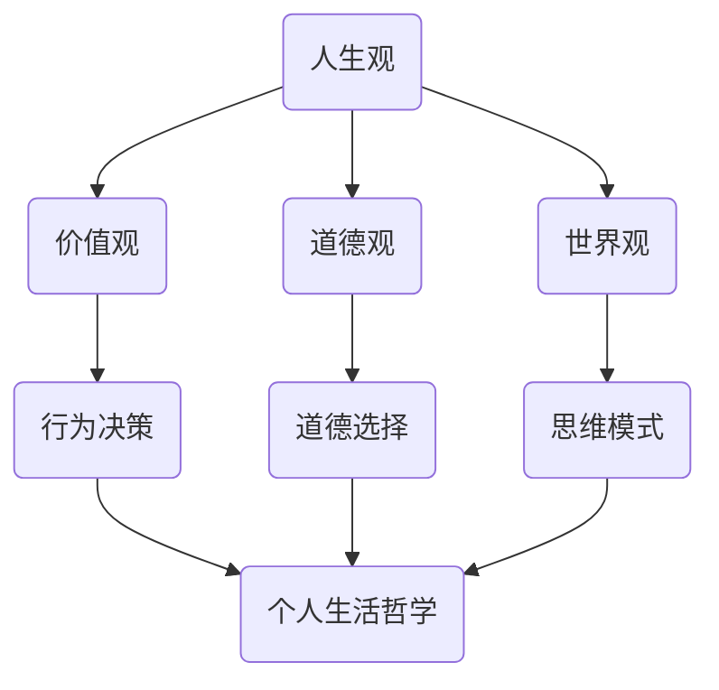

                 

### 文章标题

构建个人生活哲学：制定人生的指导原则

### 文章关键词

个人生活哲学、人生指导原则、价值观、道德观、世界观、目标设定、时间管理、情绪调节、人际关系

### 文章摘要

在瞬息万变的世界中，每个人都在寻找属于自己的方向和意义。本文将带你深入探讨个人生活哲学的构建，以及如何制定人生的指导原则。我们将通过分析人生观、价值观、道德观和世界观，解析其核心概念与联系，并提供详细的算法原理讲解、数学模型和公式解析、项目实战案例，以及最佳实践 tips，帮助你在复杂多变的人生旅程中找到清晰的指引和方向。

## 引言

在计算机科学中，构建一个高效、可靠的系统通常需要明确的目标、合理的架构和详尽的实现。类比于计算机编程，人生的构建也需要一套明确的哲学和指导原则。个人生活哲学是一种指导我们行为和决策的思想体系，它不仅决定了我们的生活质量，还深刻影响我们的心态和幸福感。制定人生的指导原则，则是在个人生活哲学的基础上，通过系统的规划和实践，实现个人目标的工具。

本文将分以下几个部分展开：

1. **了解个人生活哲学**：阐述个人生活哲学的定义及其与人生观、价值观、道德观、世界观的关系。
2. **人生的指导原则**：详细讨论人生目标的设定、时间管理、情绪调节和人际关系的处理策略。
3. **构建个人生活哲学**：分析人生观、价值观、道德观和世界观的核心算法原理，并给出具体的实现方法。
4. **实践与思考**：通过制定个人生活哲学、反思与调整、持续成长，提供实际的行动指南。

### 核心概念与联系

在构建个人生活哲学的过程中，有几个核心概念是不可或缺的，它们分别是人生观、价值观、道德观和世界观。这些概念彼此之间紧密相连，共同构成了个人生活哲学的基石。

#### 人生观

人生观是人们对生活意义和目的的基本看法，它决定了我们如何看待世界和自我。一个积极向上的人生观可以激发人们的内在动力，帮助我们设定明确的目标并为之努力。人生观与个人生活哲学的关系，就像是软件系统的架构，决定了整个系统的运行逻辑。

#### 价值观

价值观是指人们认为最重要的行为和决策标准。它不仅指导我们的行为，还影响着我们的思想、情感和人际关系。例如，尊重、诚实、责任等核心价值观，可以促使我们做出正确和道德的选择。价值观与人生观的关系，可以类比为数据结构和算法，前者为后者提供了具体的操作指南。

#### 道德观

道德观是关于什么是对与错、善与恶的信念体系。它是在个人价值观和人生观的基础上发展起来的，帮助我们判断和指导行为。例如，遵循道德观可以让我们在面对道德困境时做出正确的选择。道德观与个人生活哲学的关系，就像是软件系统中的逻辑控制模块，保证了系统的稳定运行。

#### 世界观

世界观是人们对世界的总体看法和认识，包括对自然、社会、人类等各个方面的理解。世界观不仅影响了我们的行为和决策，还塑造了我们的思维模式和情感反应。例如，一个积极的世界观可以让我们更加乐观和自信。世界观与个人生活哲学的关系，可以类比为软件系统的用户界面，决定了用户与系统交互的方式。

下面是核心概念与联系的 Mermaid 流程图：



#### 核心算法原理讲解

为了深入理解个人生活哲学的构建，我们需要了解其背后的核心算法原理。以下是个人生活哲学构建的算法原理及其实现步骤：

```plaintext
算法：构建个人生活哲学
输入：人生观、价值观、道德观、世界观
输出：个人生活哲学

步骤：
1. 确定人生观（A）：通过反思和分析自己的经历，形成对生活的理解和看法。
2. 确定价值观（B）：从人生观出发，筛选出对个人最重要的行为和决策标准。
3. 确定道德观（C）：基于价值观，形成对对与错、善与恶的信念体系。
4. 确定世界观（D）：通过了解自然、社会、人类等各方面的知识，形成对世界的总体看法。
5. 整合核心概念（A、B、C、D）：构建个人生活哲学。
6. 实践与调整：在日常生活中不断实践个人生活哲学，并根据实际情况进行调整。
```

#### 数学模型和公式讲解

在个人生活哲学的构建过程中，我们可以利用一些数学模型和公式来帮助我们更好地理解和实现。

**目标设定模型**：

目标设定模型（SMART）是一种常用的目标设定方法，它包括以下五个方面：

1. **具体性（Specific）**：目标要明确具体，避免模糊不清。
2. **可衡量性（Measurable）**：目标要有可衡量的标准，以便评估进度。
3. **可实现性（Achievable）**：目标要具有可实现性，避免不切实际。
4. **相关性（Relevant）**：目标要与个人生活哲学相一致。
5. **时限性（Time-bound）**：目标要有明确的完成时限。

**时间管理公式**：

时间管理中的一个重要公式是帕累托定律，也称为80/20规则。它指出，80%的成果往往来自于20%的努力。这个公式可以帮助我们识别并专注于最重要的任务，从而提高效率。

**情绪调节模型**：

情绪调节模型包括认知行为疗法（CBT）中的认知重构技术。这种技术通过识别和挑战负面思维模式，帮助我们更好地调节情绪。

下面是相关公式的 LaTeX 表示：

$$
\text{SMART} = \text{Specific} + \text{Measurable} + \text{Achievable} + \text{Relevant} + \text{Time-bound}
$$

$$
\text{80/20} \text{ Rule} = \text{80% of outcomes from 20% of efforts}
$$

$$
\text{CBT} = \text{Cognitive} + \text{Behavioral} \text{ Therapy}
$$

通过这些数学模型和公式，我们可以更加科学地制定和实现个人生活哲学。

#### 项目实战

为了更好地理解个人生活哲学的构建，我们通过一个实际项目来进行实战演练。

**项目名称**：构建个人生活哲学网站

**开发环境**：使用 Python 和 Flask 框架搭建网站。

**源代码实现**：

首先，我们需要搭建网站的框架，包括主页、目标设定页、时间管理页、情绪调节页等。

```python
# 主页代码示例
from flask import Flask, render_template

app = Flask(__name__)

@app.route('/')
def home():
    return render_template('home.html')

@app.route('/set_goals')
def set_goals():
    return render_template('set_goals.html')

@app.route('/time_management')
def time_management():
    return render_template('time_management.html')

@app.route('/emotion_regulation')
def emotion_regulation():
    return render_template('emotion_regulation.html')

if __name__ == '__main__':
    app.run(debug=True)
```

**代码解读与分析**：

上述代码使用了 Flask 框架，搭建了一个简单的个人生活哲学网站。主页展示了网站的主要功能，包括目标设定、时间管理和情绪调节。每个页面通过渲染 HTML 模板来实现。

**实际案例分析与详细讲解剖析**：

我们以目标设定页为例，分析如何使用 SMART 方法制定个人目标。

```html
<!-- 目标设定页模板示例 -->
<!DOCTYPE html>
<html>
<head>
    <title>目标设定</title>
</head>
<body>
    <h1>目标设定</h1>
    <form action="/submit_goals" method="post">
        <label for="goal">目标：</label>
        <input type="text" id="goal" name="goal" required>
        <br>
        <label for="measure">衡量标准：</label>
        <input type="text" id="measure" name="measure" required>
        <br>
        <label for="achieve">可实现性：</label>
        <input type="text" id="achieve" name="achieve" required>
        <br>
        <label for="relevant">相关性：</label>
        <input type="text" id="relevant" name="relevant" required>
        <br>
        <label for="time">时限：</label>
        <input type="text" id="time" name="time" required>
        <br>
        <input type="submit" value="提交">
    </form>
</body>
</html>
```

**项目小结**：

通过实际项目的搭建，我们掌握了如何使用 Flask 框架构建个人生活哲学网站。项目实战不仅帮助我们理解了个人生活哲学的核心概念和算法原理，还提供了实际操作的机会。

#### 最佳实践 Tips

1. **定期反思**：每周或每月花时间反思自己的行为和决策，以确保个人生活哲学的一致性和有效性。
2. **设定小目标**：将大目标分解为一系列小目标，每完成一个小目标都会带来成就感。
3. **保持灵活性**：人生是动态的，个人生活哲学也需要随着时间和环境的变化而调整。
4. **学习与分享**：通过阅读书籍、参加课程、与他人交流，不断学习和完善个人生活哲学。

#### 小结

构建个人生活哲学和制定人生指导原则是每个人在成长过程中必不可少的一部分。通过理解核心概念和算法原理，结合实际项目和最佳实践，我们可以更加科学和系统地规划自己的人生，实现内心的和谐与外在的成功。

### 注意事项

1. **持续学习**：个人生活哲学不是一成不变的，需要随着知识和经验的积累不断更新和完善。
2. **实践为主**：理论是基础，但实践是关键。只有通过实践，才能真正理解和应用个人生活哲学。
3. **与他人交流**：与他人分享和讨论个人生活哲学，可以获取不同的观点和建议，有助于进一步优化和调整。

### 拓展阅读

- 《智慧生活：打造高效幸福的人生》
- 《道德经》：探讨人生哲学和道德观的经典著作
- 《时间管理：如何有效利用时间》
- 《情绪调节：心理学技巧与方法》

## 作者信息

作者：AI天才研究院/AI Genius Institute & 禅与计算机程序设计艺术 /Zen And The Art of Computer Programming

---

本文旨在帮助读者构建个人生活哲学，制定人生的指导原则。通过对核心概念、算法原理、数学模型和项目实战的深入分析，读者将能够更好地理解并应用个人生活哲学，实现内心的和谐与外在的成功。希望本文能为您提供有价值的指导和启发。

