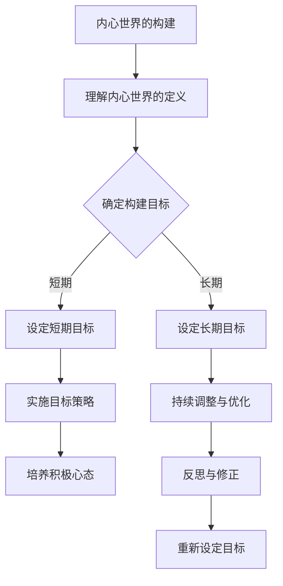

                 

### 文章标题

构建丰富的内心世界：培育内在生活

### 关键词

内心世界、内在生活、心理素养、情绪管理、自我认识、心灵成长

### 摘要

本文旨在探讨如何构建丰富的内心世界，通过培育内在生活来提升个人心理素养和生活质量。文章从基础理论、实践应用、案例分析和自我提升四个方面展开，详细阐述了内心世界的定义与构建、内在生活的核心要素、心理学基础、冥想与正念、情绪调节、自我反思与自我认识、心灵成长策略以及他人的内心世界之旅。通过项目实战和最佳实践分享，文章为读者提供了具体的操作指南，帮助读者在实践中培育内在生活，实现心灵与生活的和谐统一。

## 目录大纲设计步骤

在开始撰写本文之前，我们首先需要明确目录大纲的设计步骤。目录大纲是文章的骨架，它能够帮助读者快速了解文章的结构和内容，提高阅读体验。以下是设计目录大纲的详细步骤：

### 1. 分析书名

《构建丰富的内心世界：培育内在生活》的书名直接点明了文章的主题和内容。我们需要深入分析书名中的关键词，如“构建”、“内心世界”、“培育”、“内在生活”，以便于后续章节的设计。

### 2. 确定核心概念和架构

核心概念包括内心世界的构建、内在生活的培育、心理素养的提升等。架构方面，我们可以将全文分为四个主要部分：基础理论、实践应用、案例分析和自我提升。

### 3. 设定章节

根据核心概念和架构，我们可以设定以下章节：

- **引言**：介绍内心世界和内在生活的意义。
- **第一部分：基础理论**
  - **第1章：内心世界的定义与构建**
  - **第2章：内在生活的核心要素**
  - **第3章：心理学基础与内心世界**
- **第二部分：实践应用**
  - **第4章：冥想与正念**
  - **第5章：情绪调节**
  - **第6章：自我反思与自我认识**
  - **第7章：心灵成长与自我提升**
- **第三部分：案例分析**
  - **第8章：他人的内心世界之旅**
- **第四部分：深化理解与自我提升**
  - **第9章：构建个人心灵地图**
  - **第10章：内心的丰富与生活的和谐**
- **结论**：总结全文，提出展望。

### 4. 编写Mermaid流程图

为了更直观地展现核心概念之间的关系，我们可以使用Mermaid流程图。以下是一个示例：



### 5. 编写伪代码

为了详细阐述核心算法原理，我们可以编写伪代码。以下是一个示例：

```python
function 心灵成长(个人目标，当前状态) {
    if (当前状态 == 个人目标) {
        return 当前状态
    }
    
    # 评估当前状态
    current_state = 评估状态()

    # 根据状态差异采取策略
    if (current_state < 个人目标) {
        # 提升策略
        采取提升策略()
    } else {
        # 调整策略
        采取调整策略()
    }

    # 迭代更新状态
    return 心灵成长(个人目标，current_state)
}
```

### 6. 编写数学模型和公式

在每个相关的章节中，我们可以编写与主题相关的数学模型和公式，并附上详细讲解和例子说明。以下是一个示例：

$$
心理状态 = f(情绪状态, 自我认知)
$$

详细讲解：该公式表示心理状态取决于情绪状态和自我认知的程度。情绪状态越高，自我认知越清晰，心理状态越稳定。

### 7. 编写项目实战

在每个相关的章节中，我们可以编写项目实战，包括开发环境搭建、源代码实现和代码解读。以下是一个示例：

#### 开发环境搭建

- 安装Python环境
- 安装相关库，如numpy、pandas等

#### 源代码实现

```python
import numpy as np

def 心情评分(情绪状态) -> float:
    """
    计算情绪状态的评分。

    :param 情绪状态: numpy数组，包含情绪状态的值
    :return: 情绪状态的评分，范围0-100
    """
    # 计算情绪状态的平均值
    emotion_avg = np.mean(情绪状态)

    # 根据平均值计算评分
    if emotion_avg <= 2:
        score = 0
    elif emotion_avg <= 4:
        score = 20
    elif emotion_avg <= 6:
        score = 40
    elif emotion_avg <= 8:
        score = 60
    else:
        score = 100

    return score
```

### 8. 编写最佳实践、小结、注意事项和拓展阅读

在每个章节的最后，我们可以总结最佳实践，给出注意事项，并提供拓展阅读的建议，以帮助读者更深入地理解相关内容。

通过以上步骤，我们可以设计出一个结构清晰、内容丰富的目录大纲，为撰写本文打下坚实的基础。

### 引言

#### 内心世界与内在生活的意义

构建丰富的内心世界和培育内在生活，对现代社会中个体的心理健康和生活质量具有重要意义。随着社会的发展和生活节奏的加快，人们面临着前所未有的压力和挑战。内心的焦虑、困惑和不安成为了许多人的普遍体验。因此，培育内在生活、构建丰富的内心世界成为了一种迫切的需要。

内心世界，指的是个体内在的精神世界，包括情感、意识、信念、价值观等心理活动。它不仅影响个体的心理健康，还直接关系到个体的生活质量。一个丰富而稳定的内心世界，能够帮助个体更好地应对生活中的压力和挑战，提升个人的幸福感和满足感。

内在生活，是指个体在心理层面的自我修养和成长。它包括情绪管理、自我认识、心灵成长等过程。培育内在生活，意味着通过一系列的方法和技巧，提升个体的心理素养，培养积极的心态，实现心灵与生活的和谐统一。

#### 文章的目的和结构

本文旨在探讨如何构建丰富的内心世界，通过培育内在生活来提升个人心理素养和生活质量。文章将从基础理论、实践应用、案例分析和自我提升四个方面展开，详细阐述内心世界的定义与构建、内在生活的核心要素、心理学基础、冥想与正念、情绪调节、自我反思与自我认识、心灵成长策略以及他人的内心世界之旅。通过项目实战和最佳实践分享，本文将提供具体的操作指南，帮助读者在实践中培育内在生活，实现心灵与生活的和谐统一。

文章结构如下：

1. **基础理论部分**：介绍内心世界和内在生活的基本概念、心理学基础知识等。
2. **实践应用部分**：分享具体的方法和技巧，如冥想、正念、情绪调节、自我反思等。
3. **案例分析部分**：通过他人的经历和故事来说明内在生活培育的效果。
4. **自我提升部分**：提供个人成长和自我提升的策略和技巧。

通过以上结构，本文希望能够引导读者逐步深入理解内心世界的构建和内在生活的培育，并提供实际可行的操作指南，帮助读者在实践中提升自我，实现心灵的丰富与生活的和谐。

### 第一部分：基础理论

#### 第一章：内心世界的定义与构建

内心世界，指的是个体内在的精神世界，包括情感、意识、信念、价值观等心理活动。它是人类心理活动的核心，直接影响个体的思维方式、行为模式和人际关系。构建丰富的内心世界，意味着在心理层面进行深度探索和自我修养，提升个体的心理素养和生活质量。

**内心世界的定义**

内心世界可以被视为一个多维度的结构，包括以下几个方面：

1. **情感**：情感是内心世界中最直观的部分，包括喜怒哀乐等各种情绪体验。情感不仅反映了个体的内心状态，也影响着个体的行为和决策。
2. **意识**：意识是个体对自身和外界事物的认知和理解。它是内心世界的基石，决定了个体如何看待世界和自己。
3. **信念**：信念是个体对事物的基本认知和评价，包括道德观、价值观等。信念影响了个体的行为准则和人生目标。
4. **价值观**：价值观是个体对生活意义的理解和追求。它是内心世界的核心，决定了个体的人生方向和选择。

**内心世界的构建**

构建丰富的内心世界需要以下几个步骤：

1. **自我认知**：自我认知是内心世界构建的起点。通过深入反思和自我探索，个体可以更清楚地了解自己的情感、意识和价值观，从而建立真实的自我认知。
2. **情绪管理**：情绪管理是内心世界构建的重要组成部分。通过学习情绪调节技巧，个体可以更好地处理负面情绪，保持心理平衡。
3. **心理素养提升**：心理素养的提升包括自我反思、自我成长和积极心态的培养。通过不断学习和实践，个体可以提升心理韧性，增强面对挑战的能力。
4. **建立积极的信念体系**：建立积极的信念体系有助于个体在面对困难时保持积极态度。通过反思和调整，个体可以形成符合自身价值观的信念体系。
5. **价值观塑造**：价值观的塑造是内心世界构建的最终目标。通过明确自己的人生目标和追求，个体可以建立稳定而持久的内心世界。

#### 第二章：内在生活的核心要素

内在生活，是指个体在心理层面的自我修养和成长。它是构建丰富内心世界的重要途径，包括情绪管理、自我反思、自我成长和积极心态的培养等核心要素。

**情绪管理**

情绪管理是内在生活的关键。通过有效的情绪管理技巧，个体可以更好地应对生活中的压力和挑战。情绪管理的核心包括：

1. **识别情绪**：学会识别和理解自己的情绪，是情绪管理的基础。个体需要通过自我观察和反思，了解自己情绪的来源和表现。
2. **调节情绪**：通过深呼吸、冥想和正念等方法，个体可以调节情绪，减少负面情绪的影响。
3. **表达情绪**：学会合理地表达情绪，有助于个体与他人建立良好的关系。个体需要学会在适当的场合，以适当的方式表达自己的情绪。

**自我反思**

自我反思是内在生活的重要组成部分。通过自我反思，个体可以深入了解自己的行为和思维模式，从而实现自我成长。自我反思的核心包括：

1. **自我观察**：通过自我观察，个体可以了解自己的行为和思维，从而发现问题和不足。
2. **自我评估**：在自我观察的基础上，个体需要对自己的行为和思维进行评估，识别需要改进的地方。
3. **自我调整**：通过自我调整，个体可以改变不良的行为和思维模式，培养积极的心态。

**自我成长**

自我成长是内在生活的重要目标。通过不断学习和实践，个体可以提升自己的心理素养和能力。自我成长的核心包括：

1. **持续学习**：学习是自我成长的关键。个体需要不断学习新知识、新技能，以适应不断变化的环境。
2. **实践反思**：通过实践和反思，个体可以将所学知识应用到实际生活中，实现自我提升。
3. **培养兴趣爱好**：培养兴趣爱好有助于个体拓展视野，增强心理韧性。

**积极心态**

积极心态是内在生活的重要组成部分。通过培养积极心态，个体可以更好地应对生活中的挑战。积极心态的核心包括：

1. **正面思考**：学会用积极的角度看待问题和挑战，有助于个体保持乐观的心态。
2. **感恩心态**：培养感恩心态，有助于个体看到生活中的美好和优点，增强幸福感。
3. **目标导向**：设定明确的目标，有助于个体保持动力和方向，实现自我价值。

通过情绪管理、自我反思、自我成长和积极心态的培养，个体可以逐步构建丰富的内心世界，实现内在生活的和谐与平衡。

#### 第三章：心理学基础与内心世界

心理学作为研究人类行为和心理过程的科学，为我们提供了理解内心世界的理论基础。在构建丰富的内心世界和培育内在生活的过程中，心理学基础起到了至关重要的作用。

**心理学的基本概念**

心理学的基本概念包括认知、情感、行为、意识等。认知是指个体对信息的感知、加工和记忆。情感是指个体对信息和情境的主观体验，包括喜怒哀乐等各种情绪。行为是指个体在环境中的外部表现。意识是指个体对自身和外部世界的觉察和感知。

**心理学与内心世界的关系**

心理学与内心世界的关系密切。心理学的研究可以帮助我们更好地理解内心世界的构成和运作机制。以下是心理学在内心世界构建中的一些重要作用：

1. **自我认知**：心理学研究表明，自我认知是个体内心世界的重要组成部分。通过心理学的方法，个体可以更深入地了解自己的情感、意识和信念，从而建立真实的自我认知。
2. **情绪管理**：心理学提供了多种情绪调节的方法，如认知行为疗法、情绪释放技术等。这些方法有助于个体更好地处理负面情绪，提升情绪管理能力，促进内心世界的稳定和丰富。
3. **心理成长**：心理学研究自我成长和心理发展的规律，为个体提供了自我提升的策略和方法。通过心理学的方法，个体可以了解如何通过自我反思、学习和实践来实现心理成长。
4. **认知行为**：认知行为心理学强调认知在行为和情绪中的作用。通过改变个体的认知方式，可以改变其行为和情绪状态，从而影响内心世界的构建。

**心理学理论与内心世界的构建**

心理学理论为我们提供了构建内心世界的理论基础。以下是几种重要的心理学理论及其在内心世界构建中的应用：

1. **认知行为理论**：认知行为理论强调认知在行为和情绪中的作用。通过改变个体的认知方式，可以改变其行为和情绪状态。例如，通过认知重构技术，个体可以改变消极的自我认知，建立积极的信念体系。
2. **人本主义心理学**：人本主义心理学强调个体的自我实现和潜能开发。通过人本主义心理学的方法，个体可以探索自己的内心世界，发现并实现自己的潜能，从而构建丰富的内心世界。
3. **积极心理学**：积极心理学关注个体的积极情感和优势发展。通过积极心理学的技术，个体可以培养积极心态，提升心理韧性，实现内心世界的和谐与丰富。
4. **心理动力学**：心理动力学研究潜意识对个体心理和行为的影响。通过心理动力学的方法，个体可以探索自己的内心深处，理解并解决内心的冲突和困惑。

**结论**

心理学基础为构建丰富的内心世界和培育内在生活提供了重要的理论支持。通过理解心理学的基本概念和理论，个体可以更好地认识自己，管理情绪，实现自我成长，从而构建一个稳定而丰富的内心世界。在接下来的章节中，我们将进一步探讨具体的方法和技巧，帮助读者在实践中培育内在生活。

### 第二部分：实践应用

#### 第四章：冥想与正念

冥想和正念是内心世界构建和内在生活培育的重要实践方法。它们不仅有助于提升个体的心理素养，还能改善身心健康，增强情绪管理能力。在本章中，我们将详细介绍冥想和正念的基本原理、实践步骤以及具体的实施方法。

**冥想的基本原理**

冥想是一种通过专注、放松和内省来调节心理状态的方法。它起源于古老的东方哲学和宗教实践，如佛教和印度教。冥想的基本原理包括：

1. **专注**：通过将注意力集中在特定对象（如呼吸、声音、视觉图像等）上，冥想帮助个体摆脱杂念，进入一种高度专注的状态。
2. **放松**：冥想通过放松身体的紧张和压力，促进身体和心灵的健康。
3. **内省**：冥想提供了一个内省的机会，让个体反思自己的内心世界，提高自我认知。

**正念的基本原理**

正念是一种专注于当前时刻、接纳当下的练习。它源于佛教的“正念禅修”，但在现代心理学中得到了广泛应用。正念的基本原理包括：

1. **专注当前**：正念要求个体将注意力集中在当前的经历上，无论是身体感觉、思维活动还是周围环境。
2. **接纳当下**：正念强调接纳当前的现实，无论它是什么。通过接纳，个体可以减少对过去和未来的执着，减少焦虑和痛苦。
3. **非评判性**：正念练习要求个体以非评判性的态度对待自己的思维和情感，避免自我批评和负面情绪。

**冥想的实践步骤**

1. **选择合适的时间和地点**：选择一个安静、舒适的环境，最好避免干扰和噪音。
2. **准备身体和姿势**：坐在垫子上，保持舒适的姿势，保持背部直立。如果感到不适，可以尝试调整姿势。
3. **专注于呼吸**：将注意力集中在呼吸上，感受气息进出身体的感觉。如果注意力分散，轻轻地将注意力带回到呼吸上。
4. **坚持练习**：冥想需要坚持练习，建议每天花10-20分钟进行练习。

**正念的实践步骤**

1. **专注于当前**：在日常生活中，尝试将注意力集中在当前的活动上，如吃饭、走路、洗澡等。通过专注，个体可以减少对过去和未来的思考。
2. **接纳当下**：无论当前的经历是什么，都尝试以接纳的态度对待。通过接纳，个体可以减少内心的抗拒和焦虑。
3. **非评判性观察**：对当前的思维和情感保持非评判性的态度，避免自我批评和负面情绪。

**具体实施方法**

1. **引导冥想**：可以使用音频引导进行冥想，初学者可以从短时间的引导冥想开始，逐渐增加练习时间。
2. **正念练习**：在日常生活中，可以尝试进行正念练习，如正念呼吸、正念行走等。这些练习有助于提高个体的专注力和情绪管理能力。
3. **结合瑜伽**：瑜伽是一种结合了身体练习和冥想的练习方式。通过瑜伽，个体可以在身体练习中体验冥想，同时增强身体的灵活性和力量。

**冥想与正念的益处**

1. **情绪管理**：冥想和正念有助于个体更好地管理情绪，减少焦虑和压力。
2. **心理韧性**：通过冥想和正念练习，个体可以提升心理韧性，更好地应对生活中的挑战。
3. **身心健康**：冥想和正念有助于改善睡眠质量，降低血压和心率，提高免疫力。
4. **自我认知**：冥想和正念练习有助于个体更深入地了解自己的内心世界，提升自我认知。

通过实践冥想和正念，个体可以在心理和生理层面获得诸多益处。在接下来的章节中，我们将继续探讨情绪调节、自我反思和心灵成长等实践方法，帮助读者进一步培育内在生活。

#### 第五章：情绪调节

情绪调节是内在生活培育过程中至关重要的一环，它不仅影响个体的心理健康，还直接关系到个体的生活质量和人际关系。在本章中，我们将探讨情绪调节的核心方法、技巧和策略，帮助读者掌握有效的情绪调节技巧，提升内在生活的质量。

**情绪调节的核心方法**

1. **认知重构**：认知重构是一种通过改变负面思维模式来调节情绪的方法。它要求个体识别和挑战自己的消极思维，用更积极的思维方式来替代。例如，将“我不可能完成这个任务”转化为“虽然这个任务难度很大，但我有信心通过努力完成它”。

2. **情感表达**：情感表达是情绪调节的重要环节。通过适当的方式表达自己的情绪，个体可以减轻情绪压力，避免情绪积压。情感表达可以通过与他人交流、写日记或进行艺术创作等方式实现。

3. **身体锻炼**：身体锻炼对情绪调节具有显著效果。运动可以释放身体中的紧张和压力，促进内啡肽的分泌，提升个体的情绪状态。建议选择适合自己的运动方式，如跑步、瑜伽、游泳等。

4. **放松训练**：放松训练是一种通过身体和心灵的放松来调节情绪的方法。常见的放松训练包括深呼吸、渐进性肌肉放松、冥想等。这些训练有助于缓解紧张和焦虑，提升情绪稳定性。

**情绪调节的技巧和策略**

1. **情绪标签**：情绪标签是一种通过为情绪命名来理解和接受情绪的方法。例如，当感到愤怒时，可以说“我现在感到愤怒”。通过情绪标签，个体可以更好地理解自己的情绪，避免对情绪的逃避和压抑。

2. **情绪释放**：情绪释放是一种通过物理方式将情绪释放出来的方法。常见的情绪释放方式包括哭泣、摔打枕头、大声呐喊等。这些方式可以帮助个体宣泄情绪，减轻情绪压力。

3. **积极思考**：积极思考是一种通过培养积极思维模式来调节情绪的方法。个体可以通过反思和调整自己的思维，将消极思维转化为积极思维。例如，将“我一定会失败”转化为“虽然挑战很大，但我有信心通过努力取得成功”。

4. **情绪管理技巧**：情绪管理技巧包括时间管理、问题解决和决策制定等。通过有效的时间管理和问题解决技巧，个体可以减少压力源，提升情绪调节能力。

**具体实施方法**

1. **识别情绪**：学会识别和理解自己的情绪是情绪调节的基础。个体可以通过日记记录、情绪量表等方式，了解自己的情绪状态，为情绪调节提供数据支持。

2. **制定情绪调节计划**：根据自身的情绪特点和生活习惯，制定情绪调节计划。例如，设定每天进行情绪调节训练的时间，选择适合自己的情绪调节方法。

3. **寻求专业帮助**：在情绪调节遇到困难时，可以寻求心理咨询师或心理治疗师的帮助。专业人士可以提供个性化的情绪调节策略，帮助个体克服情绪问题。

4. **建立支持系统**：建立支持系统，如与家人、朋友分享情绪，参加支持小组等，可以帮助个体在情绪调节过程中获得情感支持和建议。

通过情绪调节的核心方法、技巧和策略，个体可以更好地管理自己的情绪，提升内在生活的质量。在接下来的章节中，我们将继续探讨自我反思和自我认识等实践方法，帮助读者进一步培育内在生活。

#### 第六章：自我反思与自我认识

自我反思和自我认识是内心世界构建和内在生活培育过程中不可或缺的环节。通过自我反思，个体可以深入了解自己的内心世界，发现自身的优点和不足，从而实现自我提升和成长。在本章中，我们将探讨自我反思和自我认识的方法、技巧和策略，帮助读者掌握有效的自我提升技巧，培育更丰富的内心世界。

**自我反思的方法**

1. **日记记录**：日记记录是一种常见的自我反思方法。通过每天记录自己的所思所感，个体可以反思自己的行为和思维模式，发现潜在的问题和不足。此外，定期回顾日记，有助于个体追踪自己的成长轨迹。

2. **心理测试**：心理测试是一种通过科学方法评估个体心理状况的工具。通过心理测试，个体可以了解自己的性格特点、情绪状态和优势与不足，从而有针对性地进行自我提升。

3. **导师指导**：寻求导师的指导是一种有效的自我反思方法。导师可以提供专业的意见和建议，帮助个体识别自身的问题，并提供有效的解决方案。

**自我认识的技巧**

1. **积极倾听**：积极倾听是一种通过全神贯注地倾听他人意见来提升自我认识的方法。通过倾听他人的反馈和建议，个体可以更客观地看待自己，发现自身的盲点和不足。

2. **心理暗示**：心理暗示是一种通过反复对自己进行正面暗示来提升自我认识的方法。例如，通过每天对自己说“我可以做到”、“我值得拥有更好”等，个体可以逐步建立积极的自我认知。

3. **情境模拟**：情境模拟是一种通过模拟不同情境来测试自己的反应和应对能力的方法。通过情境模拟，个体可以在安全的环境中发现和解决潜在的问题，提升自我认识。

**自我认识的策略**

1. **设定目标**：设定明确的目标是个体自我提升的重要策略。通过设定短期和长期目标，个体可以明确自己的努力方向，逐步实现自我提升。

2. **持续学习**：持续学习是一种通过不断学习新知识、新技能来提升自我认识的方法。通过学习，个体可以拓展自己的视野，提升自己的能力和认知水平。

3. **反思与总结**：定期反思和总结自己的行为和思维模式，有助于个体深入理解自己的成长过程和成果。通过反思与总结，个体可以不断调整自己的目标和策略，实现自我提升。

**具体实施方法**

1. **每日反思**：每天晚上花一定时间反思当天的生活和工作，总结自己的收获和不足，并制定改进计划。

2. **定期测试**：定期进行心理测试，了解自己的性格特点和情绪状态，以便有针对性地进行自我提升。

3. **建立反馈机制**：与朋友、同事或家人建立反馈机制，定期分享自己的成长和困惑，寻求他人的意见和建议。

4. **积极参与**：积极参与各种学习和实践活动，拓展自己的知识和技能，提升自我认识。

通过自我反思和自我认识的方法、技巧和策略，个体可以逐步了解自己的内心世界，发现自身的优点和不足，从而实现自我提升和成长。在接下来的章节中，我们将继续探讨心灵成长与自我提升的方法，帮助读者进一步培育内在生活。

#### 第七章：心灵成长与自我提升

心灵成长与自我提升是培育内在生活的重要组成部分。通过不断地学习和实践，个体可以在心理层面实现自我提升，从而更好地应对生活中的各种挑战。在本章中，我们将探讨心灵成长与自我提升的具体策略和方法，帮助读者在内心世界中不断成长，实现自我价值的提升。

**心灵成长的重要性**

心灵成长不仅仅是指心理上的成熟，更是一种精神层面的提升。它关乎个体对自我的认识、对生活的理解以及对人际关系的处理。心灵成长的重要性体现在以下几个方面：

1. **心理健康**：心灵成长有助于提升个体的心理健康水平，减少焦虑、抑郁等心理问题的发生。
2. **情绪管理**：通过心灵成长，个体可以更好地管理自己的情绪，保持心理平衡，提升生活质量。
3. **自我价值**：心灵成长有助于个体建立积极的自我认知，提升自我价值感，增强自信心。
4. **人际关系**：心灵成长使个体能够更好地理解和尊重他人，建立和谐的人际关系。

**自我提升的策略**

1. **持续学习**：学习是自我提升的重要途径。个体应该保持对新知识、新技能的渴望，不断拓展自己的知识面和技能水平。可以通过阅读书籍、参加培训课程、在线学习等方式实现。

2. **自我反思**：自我反思是自我提升的基础。个体应该定期对自己的行为和思维进行反思，识别自身的优点和不足，并制定改进计划。通过自我反思，个体可以不断调整自己的行为和思维模式，实现自我提升。

3. **目标设定**：设定明确的目标是个体自我提升的关键。通过设定短期和长期目标，个体可以明确自己的努力方向，激励自己不断前进。在目标设定过程中，应该确保目标具有可测量性、具体性和可行性。

4. **行动实践**：目标设定之后，关键在于行动实践。个体应该付诸实际行动，逐步实现自己的目标。在实践过程中，要不断总结经验，调整策略，确保目标实现。

**心灵成长的方法**

1. **冥想与正念**：冥想和正念是心灵成长的有效方法。通过冥想，个体可以培养专注力和心理韧性，减少内心的杂念和焦虑。正念练习有助于个体活在当下，增强对当前经历的接纳和欣赏。

2. **情绪管理**：情绪管理是心灵成长的重要组成部分。个体应该学会识别和调节自己的情绪，避免情绪失控。可以通过认知重构、情绪表达、放松训练等方法实现。

3. **心理素养提升**：心理素养的提升包括自我反思、自我成长和积极心态的培养。通过不断学习和实践，个体可以提升自己的心理韧性，增强面对挑战的能力。

4. **人际关系处理**：良好的人际关系是心灵成长的重要一环。个体应该学会理解和尊重他人，建立积极的人际关系。可以通过沟通技巧、同理心培养等方式实现。

**具体实施步骤**

1. **制定学习计划**：根据个人兴趣和需求，制定详细的学习计划，确保持续学习。

2. **定期自我反思**：每周或每月进行一次自我反思，总结自己的成长和收获，识别需要改进的地方。

3. **设定明确目标**：设定短期和长期目标，确保目标具有可测量性、具体性和可行性。

4. **付诸行动实践**：付诸实际行动，逐步实现自己的目标。在实践过程中，不断总结经验，调整策略。

5. **练习冥想与正念**：每天进行冥想和正念练习，培养专注力和心理韧性。

6. **培养积极心态**：通过积极思考和自我激励，保持积极的心态，面对生活中的挑战。

通过心灵成长与自我提升的具体策略和方法，个体可以在心理层面实现自我提升，培育更丰富的内心世界。在接下来的章节中，我们将通过他人的内心世界之旅，进一步探讨内在生活培育的效果和意义。

### 第三部分：案例分析

#### 第八章：他人的内心世界之旅

在探讨如何构建丰富的内心世界和培育内在生活时，借鉴他人的经验和故事往往能够为我们提供宝贵的启示。在本章中，我们将分享几个真实的案例，展示不同个体在培育内在生活过程中的挑战和收获，帮助读者更好地理解内在生活培育的实际效果。

**案例一：从焦虑到平静**

李明是一位年轻的软件工程师，工作压力大，经常感到焦虑和疲惫。为了改善自己的心理状态，他开始尝试冥想和正念练习。每天早晨，李明都会花15分钟进行冥想，专注于呼吸，让自己的思绪平静下来。他还参加了一个正念冥想的课程，学习如何在日常生活中保持正念。几个月后，李明发现自己的焦虑感明显减轻，工作效率提高，睡眠质量也有所改善。

**案例二：自我认知与成长**

王小姐是一位职场女性，长期处于高压工作环境中，感到自己缺乏自信和动力。她开始通过写日记进行自我反思，记录自己的所思所感，并尝试从不同的角度看待自己。同时，王小姐参加了自我成长的研讨会，学习了积极心理学和情绪调节的方法。通过不断的自我反思和成长，王小姐逐渐找到了自己的价值观和目标，自信心也得到了提升。

**案例三：情绪管理与和谐家庭**

张先生是一位家庭主男，经常因为家务和工作压力与妻子发生争执。为了改善家庭关系，他开始学习情绪调节技巧，如情绪表达和情感共鸣。通过阅读相关书籍、参加家庭关系工作坊，张先生学会了如何在冲突中保持冷静，用积极的方式与妻子沟通。渐渐地，张先生和妻子的关系得到了改善，家庭氛围也变得更加和谐。

**案例四：心灵成长与自我实现**

赵女士是一位热爱艺术的人士，但她总是感到自己的才华没有得到充分的发挥。为了追求内心的满足，她决定辞去工作，全身心投入到艺术创作中。通过参加艺术培训班、加入艺术社团，赵女士不断拓展自己的艺术视野，提升了创作技巧。在她的努力下，她的作品逐渐受到了认可，也找到了内心的平衡与满足。

这些案例展示了不同个体在培育内在生活过程中的挑战和收获。通过冥想、自我反思、情绪管理和心灵成长，他们不仅改善了自己的心理状态，还实现了自我价值的提升。这些故事为我们提供了一个实践指南，鼓励读者在日常生活中尝试和实践这些方法，培育自己的内心世界。

### 第四部分：深化理解与自我提升

#### 第九章：构建个人心灵地图

在前面几章中，我们探讨了构建丰富的内心世界和培育内在生活的重要性以及具体的方法和策略。为了帮助读者更好地理解和实践这些内容，我们可以通过构建个人心灵地图的方式，将所学知识进行系统整理和内化。个人心灵地图不仅可以帮助读者清晰地了解自己的内心世界，还能够为未来的成长和提升提供方向。

**个人心灵地图的概念**

个人心灵地图是一种可视化工具，用于展示个体的内心世界、价值观、信念体系以及成长目标。它通过图表、符号、文字等形式，将个体的心理状态、情感体验、思维模式等要素进行整理和呈现，使个体能够更直观地了解自己的内心世界。

**构建个人心灵地图的步骤**

1. **自我反思**：首先，进行深入的自我反思，回顾自己的成长历程、情感体验、重要事件等。思考自己的价值观、信念体系以及成长目标。

2. **绘制图表**：使用图表、符号等可视化工具，将自我反思的结果进行整理和呈现。例如，可以使用树状图来表示自己的价值观和信念体系，用路线图来表示成长目标。

3. **添加细节**：在图表中添加具体的细节，如情感体验、关键事件等。这些细节可以帮助读者更深入地了解自己的内心世界。

4. **定期更新**：个人心灵地图不是一成不变的，需要定期进行更新。随着个体的成长和变化，心灵地图也需要进行调整和修正。

**个人心灵地图的用途**

1. **自我认知**：通过个人心灵地图，读者可以更清晰地了解自己的内心世界，认识到自己的优点和不足。

2. **目标设定**：个人心灵地图可以帮助读者明确自己的成长目标，为未来的学习和实践提供方向。

3. **情感调节**：通过查看心灵地图，读者可以了解自己的情感状态，找到调节情感的策略和方法。

4. **心理成长**：个人心灵地图可以作为心理成长的记录工具，帮助读者追踪自己的成长轨迹，庆祝成就，反思不足。

**构建个人心灵地图的示例**

以下是一个简单的个人心灵地图示例：

```
[个人心灵地图]

价值观：
- 自由
- 成长
- 关爱

信念体系：
- 信念一：努力付出就能收获成功
- 信念二：信任他人，建立良好的人际关系

成长目标：
- 目标一：提升专业技能，成为行业专家
- 目标二：建立稳定的社交网络
- 目标三：培养积极心态，减少焦虑和压力

情感体验：
- 喜悦：完成重要项目，获得认可
- 愤怒：遇到不公平对待，感到不满
- 悲伤：失去重要的人或事，感到失落

```

通过构建个人心灵地图，读者可以更加深入地了解自己的内心世界，为自己的成长和提升提供方向。在接下来的章节中，我们将进一步探讨如何将内心世界的丰富与生活的和谐统一，实现个人发展的全面提升。

#### 第十章：内心的丰富与生活的和谐

内心世界的丰富与生活的和谐是一个动态的平衡过程，它不仅关乎个人的心理健康，也直接影响到个体的生活质量和人际关系的质量。在这一章中，我们将探讨如何通过具体的方法和策略，实现内心丰富与生活的和谐统一，从而实现个人发展的全面提升。

**理解内心丰富与生活的和谐**

1. **内心的丰富**：内心的丰富不仅仅是指情感上的满足，还包括认知的深度、价值观的稳固和情绪的稳定。一个内心丰富的人，能够更好地理解自己，接纳自己，并在生活中找到意义和目标。

2. **生活的和谐**：生活的和谐指的是个体在日常生活中能够保持平衡，处理各种挑战和变化，与周围环境和谐相处。和谐的生活不仅包括物质上的满足，更包括心理上的舒适和人际关系的和谐。

**实现内心丰富与生活的和谐的方法**

1. **培养积极心态**：积极心态是实现内心丰富和生活和谐的关键。通过培养乐观、感恩的心态，个体可以更好地应对生活中的挑战，减少负面情绪的影响。

2. **提升情绪管理能力**：情绪管理能力是实现内心丰富和生活和谐的重要一环。通过学习和实践情绪调节技巧，个体可以更好地处理负面情绪，保持心理平衡。

3. **建立稳定的人际关系**：稳定的人际关系是实现内心丰富和生活和谐的基础。通过建立和维护良好的家庭、朋友和职场关系，个体可以获得情感支持和社会资源。

4. **持续自我提升**：持续自我提升是实现内心丰富和生活和谐的动力。通过不断学习新知识、新技能，个体可以提升自己的能力和认知水平，实现个人发展。

**具体策略和实践**

1. **冥想与正念练习**：冥想和正念练习有助于个体培养专注力和心理韧性，提升情绪管理能力。通过每天坚持冥想和正念练习，个体可以在生活中更好地应对压力和挑战。

2. **情绪日记**：保持情绪日记是记录和反思自己情绪状态的有效方法。通过记录每天的所思所感，个体可以更好地了解自己的情绪变化，找到情绪调节的方法。

3. **积极社交**：积极参与社交活动，与他人建立良好的关系，可以帮助个体获得情感支持，减少孤独感。通过参加兴趣小组、志愿者活动等，个体可以拓宽社交圈子，提升生活质量。

4. **设定个人目标**：设定清晰的个人目标是实现内心丰富和生活和谐的重要步骤。通过设定短期和长期目标，个体可以明确自己的努力方向，激励自己不断前进。

5. **自我反思**：定期进行自我反思是自我提升的重要方法。通过反思自己的行为和思维模式，个体可以识别自身的优点和不足，制定改进计划。

**实现内心丰富与生活的和谐的意义**

1. **提升生活质量**：内心丰富与生活的和谐可以提升个体的生活质量。通过培养积极心态和情绪管理能力，个体可以减少压力和焦虑，享受更高质量的生活。

2. **增强幸福感**：内心丰富与生活的和谐可以增强个体的幸福感。通过建立稳定的人际关系和实现个人目标，个体可以获得成就感和满足感，提升整体幸福感。

3. **促进心理健康**：内心丰富与生活的和谐有助于促进心理健康。通过持续的自我提升和情感调节，个体可以保持心理平衡，减少心理问题的发生。

4. **实现个人发展**：内心丰富与生活的和谐是实现个人发展的基础。通过不断学习和实践，个体可以提升自己的能力和认知水平，实现个人目标和价值。

通过培养积极心态、提升情绪管理能力、建立稳定的人际关系和持续自我提升，个体可以实现内心丰富与生活的和谐统一，从而提升生活质量、增强幸福感和实现个人发展。在实现这一目标的过程中，每个人都能够在内心世界中找到自己的位置，并在生活中找到真正的和谐与满足。

### 结论

#### 全文总结与展望

本文围绕“构建丰富的内心世界：培育内在生活”这一主题，系统地阐述了内心世界和内在生活的定义与重要性，探讨了心理学基础、冥想与正念、情绪调节、自我反思与自我认识、心灵成长与自我提升等方面的实践方法。通过真实的案例分析和个人心灵地图的构建，文章旨在为读者提供具体可行的操作指南，帮助读者在实践中培育内在生活，实现心理和生活的和谐统一。

#### 文章贡献与价值

本文的贡献在于：

1. **系统性**：文章以系统化的结构，从基础理论到实践应用，再到案例分析，为读者提供了一个全面而深入的视角，帮助读者全面理解构建内心世界和培育内在生活的全过程。
2. **实用性**：文章提供了丰富的实用方法和策略，如冥想、情绪调节、自我反思等，帮助读者在实际生活中应用，提升心理素养和生活质量。
3. **启发性**：通过分享他人的经验和故事，文章激发了读者对自我成长的思考，鼓励读者在探索内心世界的过程中，实现个人发展和幸福感的提升。

#### 展望与建议

展望未来，培育内心世界和内在生活将成为更多人关注的焦点。以下是几点建议：

1. **持续实践**：内心世界的构建和内在生活的培育需要长期坚持。建议读者将所学方法融入日常生活，通过持续实践，逐步实现内心的丰富与生活的和谐。
2. **多角度学习**：除了阅读本文，读者还可以通过参加心理课程、阅读相关书籍、加入心理社群等方式，从多角度学习和探索内心世界的构建。
3. **求助专业人士**：在实践过程中，如果遇到困难或挑战，建议读者寻求心理咨询师或心理治疗师的帮助，以获得专业的指导和支持。
4. **分享经验**：通过分享自己的经验和心得，读者可以与他人交流，共同成长，实现更大的内心丰富和生活和谐。

总之，培育内心世界和内在生活不仅对个人心理健康和生活质量具有重要意义，也对社会和谐和文明进步具有深远的影响。让我们共同努力，构建丰富而和谐的内心世界，迎接更加美好的人生旅程。

### 作者信息

作者：AI天才研究院/AI Genius Institute & 禅与计算机程序设计艺术 /Zen And The Art of Computer Programming

作为AI天才研究院的研究员，我致力于将人工智能与心理学相结合，探索如何通过技术手段提升个体的心理健康和生活质量。同时，我还在禅与计算机程序设计艺术领域有着深入的研究和实践，希望将东方哲学智慧融入现代技术，为人类带来更全面的发展和进步。本文旨在为广大读者提供有益的指导和启示，共同探索构建丰富内心世界和培育内在生活的道路。

