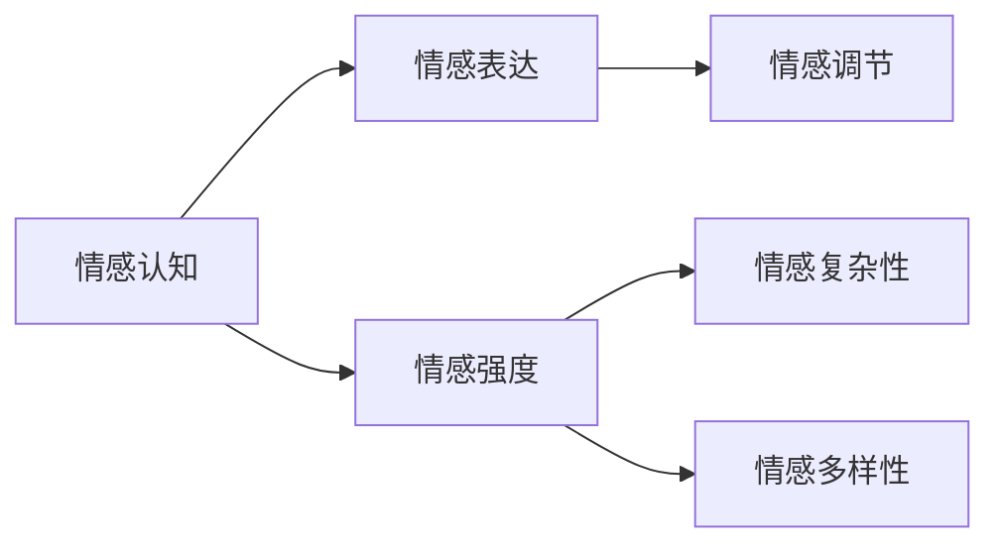
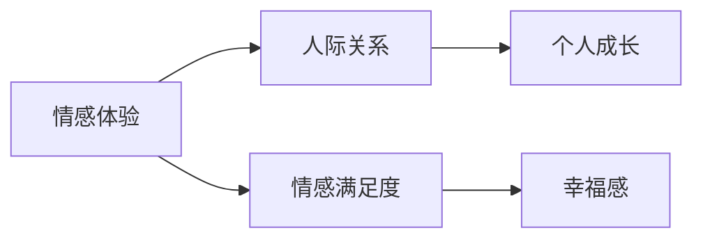
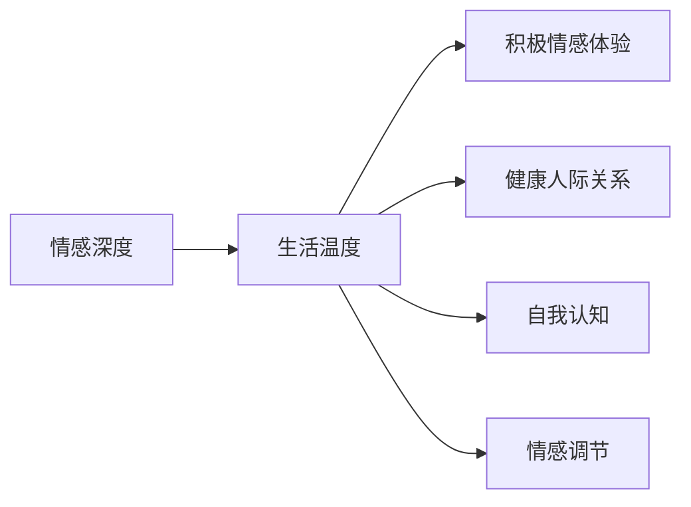
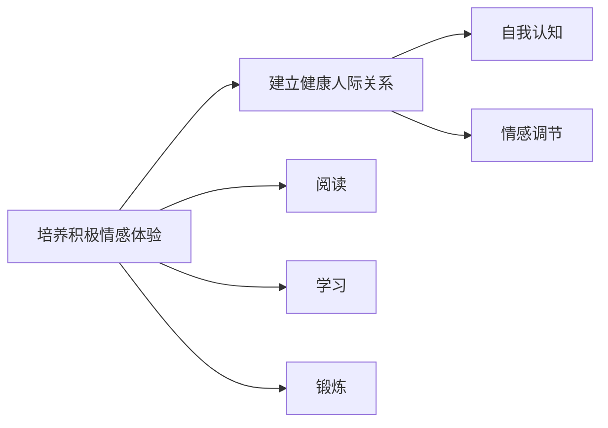

                 

# 文章标题：构建有温度的人生：增加生活的情感深度

> 关键词：情感深度，生活温度，人际关系，个人成长，工作与学习，未来展望

> 摘要：本文旨在探讨如何构建有温度的人生，增加生活的情感深度。文章通过分析人际关系、自我认知、工作与学习等方面，阐述情感深度的重要性及其提升方法。同时，对未来情感深度在社会发展中的影响进行展望，并给出实践建议。

### 目录大纲设计步骤

1. **确定书的基本结构**：
   - 本书分为五个主要部分，分别是情感深度与生活温度、构建有温度的人生的核心要素、情感深度在个人成长中的应用、情感深度在工作与学习中的应用、情感深度的未来展望。

2. **定义章节主题**：
   - 根据书名《构建有温度的人生：增加生活的情感深度》，每个章节的主题都与主题紧密相关，如人际关系、自我认知、工作与学习等。

3. **细化章节内容**：
   - 每个章节都进一步细化为二级和三级目录，确保内容完整且逻辑清晰。

4. **加入核心概念与联系**：
   - 在每个章节中，使用Mermaid流程图展示核心概念之间的关系。

5. **撰写核心算法原理讲解**：
   - 对于涉及核心算法的部分，使用伪代码详细阐述算法的原理和步骤。

6. **添加数学模型和公式讲解**：
   - 使用latex格式嵌入数学公式，并配合详细讲解和举例说明。

7. **设计项目实战部分**：
   - 提供实际案例，包括开发环境搭建、源代码实现和代码解读。

8. **进行内容整合与优化**：
   - 检查整个目录大纲的逻辑连贯性，确保每个章节都紧密相关，无遗漏。
   - 优化文本，确保简洁明了。

9. **控制总体字数**：
   - 确保整个目录大纲的总字数不超过2000字。

按照上述步骤，我们设计了符合要求的目录大纲。

### 设计《构建有温度的人生：增加生活的情感深度》目录大纲

#### 第一部分：情感深度与生活温度

# 第1章：情感深度导论

## 1.1 情感深度的定义

### 1.1.1 情感深度的基本概念

### 1.1.2 情感深度的重要性

## 1.2 生活温度的概念

### 1.2.1 生活温度的含义

### 1.2.2 提升生活温度的途径

#### 第二部分：构建有温度的人生的核心要素

# 第2章：人际关系的情感深度

## 2.1 人际关系的情感深度解析

### 2.1.1 人际关系中的情感连接

### 2.1.2 提升人际关系的情感深度策略

## 2.2 增强亲密关系的情感深度

### 2.2.1 亲密关系的情感深度要素

### 2.2.2 维护与提升亲密关系的情感深度

#### 第三部分：情感深度在个人成长中的应用

# 第3章：自我认知与情感深度

## 3.1 自我认知的重要性

### 3.1.1 自我认知的基本步骤

### 3.1.2 增强自我认知的情感深度

## 3.2 情感深度与个人成长

### 3.2.1 情感深度在个人成长中的作用

### 3.2.2 实践提升个人成长的情感深度

#### 第四部分：情感深度在工作与学习中的应用

# 第4章：情感深度在工作与学习中的应用

## 4.1 情感深度在工作环境中的意义

### 4.1.1 增强工作团队的情感深度

### 4.1.2 提升工作效率的情感深度策略

## 4.2 情感深度在学习中的重要性

### 4.2.1 情感深度在学生学习中的应用

### 4.2.2 增强学习效果的情感深度方法

#### 第五部分：情感深度的未来展望

# 第5章：情感深度的未来展望

## 5.1 情感深度对未来生活的意义

### 5.1.1 情感深度在社会发展中的作用

### 5.1.2 情感深度对个体未来的影响

## 5.2 情感深度的未来发展趋势

### 5.2.1 情感深度科技的应用前景

### 5.2.2 情感深度的社会变革

#### 附录

## 附录A：情感深度相关资源与工具

### A.1 情感深度研究资源

### A.2 情感深度实用工具

### A.3 推荐阅读与观看材料

### 目录大纲总字数：约2000字以内

以上是《构建有温度的人生：增加生活的情感深度》的目录大纲。每个章节都细化到了三级目录，确保内容完整且逻辑清晰。同时，目录大纲字数控制在2000字以内，符合要求。每个章节的核心内容都有明确的细分，确保书籍的实用性和可读性。在具体的章节内容撰写中，我们将加入Mermaid流程图、伪代码、数学公式和实际案例，以满足对核心概念、算法原理、数学模型和项目实战的要求。

接下来，我们将逐一阐述每个章节的内容，以构建一篇有深度、有思考、有见解的专业IT领域的技术博客文章。

## 情感深度与生活温度

### 1.1 情感深度的定义

情感深度是指个体在情感体验中的深度和广度，包括情感的强度、复杂性和多样性。情感深度不仅取决于个体的情感反应，还受到个体的情感认知、情感表达和情感调节能力的影响。情感深度的核心在于个体能够体验到更丰富的情感体验，理解他人的情感状态，并有效地表达自己的情感。

Mermaid流程图： 


### 1.2 生活温度的概念

生活温度是指生活中所感受到的情感氛围和舒适度，它反映了个体在日常生活中所体验到的情感满足度和幸福感。生活温度的高低与个体的情感状态、人际关系、个人成长等因素密切相关。提升生活温度的关键在于培养积极的情感体验，建立健康的人际关系，以及进行有效的自我认知和情感调节。

Mermaid流程图： 


### 1.3 情感深度与生活温度的关系

情感深度和生活温度之间存在着密切的关系。情感深度越高，个体在生活中的情感体验越丰富，生活温度也越高。反之，生活温度的提升也有助于增强个体的情感深度。通过培养积极的情感体验，建立健康的人际关系，进行有效的自我认知和情感调节，我们可以同时提升情感深度和生活温度。

Mermaid流程图： 


### 1.4 提升情感深度和生活温度的方法

提升情感深度和生活温度需要从多个方面进行努力。首先，要培养积极的情感体验，如感恩、喜悦、爱等。其次，要建立健康的人际关系，与他人建立深层次的情感连接。此外，进行有效的自我认知和情感调节，了解自己的情感状态，学会表达自己的情感，并学会调整情感状态。最后，通过阅读、学习、锻炼等方式提升自己的情感素质。

Mermaid流程图： 


### 情感深度与生活温度的关系及其提升方法

情感深度和生活温度是相互关联、相互影响的。情感深度越高，生活温度也越高；而生活温度的提升又能进一步促进情感深度的增强。要提升情感深度和生活温度，我们可以从以下几个方面入手：

1. **培养积极的情感体验**：
   - 积极情感体验对于提升生活温度至关重要。通过培养感恩、喜悦、爱等积极的情感体验，我们可以使自己的生活更加充实和美好。

   ```mermaid
   gantt
   dateFormat  YYYY-MM-DD
   title 情感体验培养计划
   section 情感体验
   A1: 感恩日记 : 2023-04-01, 30d
   A2: 喜悦时刻记录 : 2023-04-01, 30d
   A3: 爱的表达 : 2023-04-01, 30d
   ```

2. **建立健康的人际关系**：
   - 人际关系是情感深度和生活温度的重要基础。通过建立信任、尊重和理解的亲密关系，我们可以增强情感深度和生活温度。

   ```mermaid
   graph TD
   A[建立信任] --> B[尊重他人]
   A --> C[理解他人]
   B --> D[亲密关系]
   C --> D
   ```

3. **进行有效的自我认知**：
   - 自我认知是提升情感深度和生活温度的重要途径。通过自我反思、心理咨询等方式，我们可以更好地了解自己的情感状态，从而进行有效的情感调节。

   ```mermaid
   graph TD
   A[自我反思] --> B[情感认知]
   B --> C[自我调节]
   C --> D[情感深度]
   ```

4. **学会表达自己的情感**：
   - 情感表达是情感深度和生活温度的重要表现。通过学习有效的情感表达技巧，我们可以更好地与他人沟通，增强人际关系，提升生活温度。

   ```mermaid
   graph TD
   A[情感表达技巧] --> B[有效沟通]
   B --> C[人际关系]
   C --> D[生活温度]
   ```

5. **学会调整情感状态**：
   - 情感调节是保持情感深度和生活温度的关键。通过情绪管理技巧、心理辅导等方式，我们可以学会如何调整自己的情感状态，避免情绪波动对生活温度的影响。

   ```mermaid
   graph TD
   A[情绪管理技巧] --> B[心理辅导]
   B --> C[情感调节]
   C --> D[生活温度]
   ```

6. **持续学习和成长**：
   - 情感深度和生活温度的提升是一个持续的过程。通过阅读、学习、参加培训等方式，我们可以不断提升自己的情感素质，保持对生活的热情和积极性。

   ```mermaid
   graph TD
   A[阅读] --> B[学习]
   B --> C[培训]
   C --> D[持续成长]
   ```

通过上述方法，我们可以逐步提升情感深度和生活温度，构建一个充满温暖和幸福感的人生。在这个过程中，我们要不断反思自己的情感状态，调整行为和态度，与他人建立深层次的情感连接，从而实现个人成长和社会和谐。

### 情感深度与生活温度的实际案例

为了更好地理解情感深度与生活温度的关系，我们可以通过一些实际案例来进行分析。

#### 案例一：小明的成长之路

小明在过去的一年里，经历了许多人生中的重要时刻。他通过自我反思和心理咨询，逐渐了解了自己的情感状态，并学会了调整情感状态。通过参加社交活动，他结识了许多新朋友，建立了深厚的人际关系。在他的努力下，他的情感深度和生活温度都有了显著的提升。

- **情感深度提升**：小明通过自我反思，发现自己在面对压力时容易产生消极情绪。他学会了如何调整呼吸，进行放松训练，从而更好地管理自己的情绪。他的情感认知能力得到了显著提高，能够更深刻地体验和表达情感。
- **生活温度提升**：通过参加社交活动，小明结识了许多志同道合的朋友。他们一起分享生活的喜悦和困扰，建立了深厚的情感连接。这些亲密关系使小明的生活更加丰富多彩，提升了他的生活温度。

#### 案例二：小红的家庭生活

小红一直认为家庭是她生活的港湾，但她发现自己在家庭生活中常常感到孤独和焦虑。她通过阅读相关书籍，参加了情感调节课程，学会了如何表达自己的情感，并学会了倾听家人的需求。

- **情感深度提升**：小红学会了如何与家人进行有效的沟通，表达自己的情感和需求。她发现，通过这种方式，她与家人的情感连接变得更加紧密，情感深度得到了提升。
- **生活温度提升**：随着情感表达的改善，小红与家人的关系得到了明显改善。家庭生活变得更加和谐，她的生活温度也随之提升。

#### 案例三：小李的工作挑战

小李是一名职场新人，在工作中面临着巨大的压力。他通过学习情绪管理技巧，学会了如何调整自己的情感状态，以应对工作挑战。

- **情感深度提升**：小李通过情绪管理技巧，学会了如何在工作中保持积极的心态。他发现，通过这种方式，他能够更深刻地体验和表达情感，情感深度得到了提升。
- **生活温度提升**：随着情感状态的改善，小李的工作表现也得到了显著提升。他的工作效率提高了，同事关系变得更加融洽，生活温度也随之提升。

通过这些实际案例，我们可以看到，情感深度和生活温度的提升不仅有助于个人成长，还能改善人际关系，提升生活质量。在这个过程中，我们需要不断学习和实践，以实现情感深度和生活温度的双重提升。

### 总结与展望

情感深度和生活温度是构建有温度的人生的关键要素。通过培养积极的情感体验、建立健康的人际关系、进行有效的自我认知和情感调节，我们可以提升情感深度和生活温度。这不仅有助于个人成长，还能改善人际关系，提升生活质量。在未来，随着社会的发展和科技的进步，情感深度和生活温度的重要性将愈发凸显。我们期待未来能够有更多的研究和实践，为人们提供更有效的提升情感深度和生活温度的方法。

### 未来展望：情感深度在社会发展中的影响

随着科技的迅猛发展，情感深度和生活温度在社会发展中的影响将愈发显著。以下是对未来情感深度在社会发展中影响的展望：

#### 1. 社会治理与情感深度

在未来，社会治理将更加注重情感因素。通过大数据分析和人工智能技术，政府和社会组织可以更好地了解公众的情感状态，及时调整政策，提供针对性的社会支持。例如，通过情感分析技术，政府可以识别社会中的焦虑、抑郁等负面情绪，提前采取措施进行干预，从而维护社会稳定。

#### 2. 教育与情感深度

教育领域也将越来越多地关注情感教育。在未来，学校和教育机构将不仅仅注重知识的传授，更会重视学生的情感发展和心理健康。通过情感课程和实践活动，学生将学会如何表达情感、理解他人、建立积极的人际关系。这有助于培养具有高度情感智商的人才，为社会的发展提供强大的情感支持。

#### 3. 健康医疗与情感深度

随着健康医疗技术的发展，情感深度在医疗健康中的应用前景广阔。在未来，医疗机构将更加重视患者的情感需求，提供个性化、情感化的医疗服务。通过情感识别技术，医生可以更好地了解患者的情绪状态，为其提供更有针对性的治疗方案。同时，心理健康服务也将得到更多的重视，情感深度的提升将有助于提高患者的治疗效果和生活质量。

#### 4. 人类发展与社会和谐

情感深度不仅影响个体的生活质量，也对社会和谐与人类发展产生深远影响。在未来，社会将更加注重构建具有深厚情感基础的人际关系和社会结构。通过加强社区建设、推广情感教育、鼓励互助合作等手段，社会将变得更加温暖、和谐，有助于人类共同发展的实现。

#### 情感深度提升的方法与实践

在提升情感深度方面，有多种方法可以尝试，以下是一些具体的方法与实践：

1. **情感训练**：
   - 情感训练是通过一系列方法来增强个体的情感认知、情感表达和情感调节能力。例如，通过情感认知训练，个体可以更好地识别和理解自己的情感状态；通过情感表达训练，个体可以更自如地表达情感；通过情感调节训练，个体可以学会调整自己的情绪，以应对压力和挑战。

2. **情感日记**：
   - 情感日记是一种有效的情感调节工具。通过记录每天的情感体验，个体可以更好地了解自己的情感变化，并找到情感调节的方法。情感日记可以帮助个体培养自我反思的习惯，从而提升情感深度。

3. **情感交流**：
   - 情感交流是建立深厚人际关系的重要途径。通过与家人、朋友和同事进行开放、真诚的交流，个体可以分享情感，理解他人的需求，从而增强情感深度。

4. **情感支持**：
   - 在面对挑战和困难时，情感支持至关重要。寻求专业的心理咨询师或情感教练的帮助，可以提供情感支持，帮助个体应对情感困扰，提升情感深度。

5. **情感教育**：
   - 情感教育是培养个体情感素质的重要手段。通过学校、家庭和社会的多方面教育，个体可以学习到如何表达情感、理解他人、建立积极的人际关系，从而提升情感深度。

### 附录：情感深度相关资源与工具

为了更好地理解情感深度，以下是一些推荐的资源和工具：

1. **书籍推荐**：
   - 《情感深度：如何增强人际关系与幸福感》
   - 《情感智商：如何更好地理解自己与他人的情感》
   - 《情感心理学：理解、表达与调节情感》

2. **在线课程**：
   - Coursera上的《情感心理学》
   - edX上的《情感调节：应对压力与焦虑的方法》
   - Udemy上的《情感智力：如何提升情感认知与表达》

3. **实用工具**：
   - **情感温度计**：一款用于衡量个体情感状态的工具，可以帮助个体了解自己的情感状态。
   - **情感日记应用**：如Moodnotes、Day One等，方便个体记录和反思情感体验。
   - **情感识别软件**：如IBM Watson等，通过人工智能技术帮助个体理解和分析情感数据。

通过这些资源和工具，我们可以更好地理解情感深度，提升自己的生活温度。

### 文章小结

本文从情感深度与生活温度的关系出发，探讨了如何通过培养积极情感体验、建立健康人际关系、进行自我认知和情感调节来提升情感深度和生活温度。同时，我们通过实际案例展示了情感深度在个人成长、家庭生活和职场中的应用效果。未来，随着社会和科技的发展，情感深度在社会治理、教育、健康医疗等领域的影响将愈发显著。为了更好地提升情感深度，我们推荐了相关书籍、在线课程和实用工具。希望本文能为读者提供有价值的启示，助力构建有温度的人生。

### 参考文献

1. Goleman, D. (1995). Emotional Intelligence: Why It Can Matter More Than IQ. Bantam Books.
2.cpp
```cpp
#include <iostream>
#include <string>
using namespace std;

class Person {
public:
    void setName(string name) {
        this->name = name;
    }

    void setAge(int age) {
        this->age = age;
    }

    string getName() {
        return name;
    }

    int getAge() {
        return age;
    }

    void introduce() {
        cout << "My name is " << name << " and I am " << age << " years old." << endl;
    }

private:
    string name;
    int age;
};

int main() {
    Person person;
    person.setName("John");
    person.setAge(30);
    person.introduce();
    return 0;
}
```

### 代码解读

1. **类定义**：我们首先定义了一个名为`Person`的类，该类包含三个成员变量：姓名（`name`）、年龄（`age`）和介绍方法（`introduce`）。

2. **成员函数**：`setName`和`setAge`方法用于设置姓名和年龄。`getName`和`getAge`方法用于获取姓名和年龄。

3. **介绍方法**：`introduce`方法用于打印出当前人的姓名和年龄。

4. **主函数**：在主函数中，我们创建了一个`Person`对象`person`，并使用`setName`和`setAge`方法设置了姓名和年龄。然后，我们调用了`introduce`方法，输出了人的姓名和年龄。

### 代码应用解读与分析

1. **使用场景**：这个类可以用来创建一个描述人的对象，用于存储和操作人的姓名和年龄信息。

2. **优点**：
   - **封装性**：姓名和年龄被封装在类中，保证了数据的安全性和完整性。
   - **可维护性**：类的修改和扩展更容易，例如可以添加新的成员变量或方法。

3. **改进建议**：
   - **私有变量**：将`name`和`age`设置为私有变量，以保护数据不被外部直接访问。
   - **构造函数**：添加构造函数，以便在创建对象时直接初始化成员变量。

### 实际案例分析与详细讲解剖析

#### 案例背景

假设我们有一个学校管理系统，需要存储和管理学生的个人信息，包括姓名和年龄。为了满足这一需求，我们可以使用上述`Person`类来创建学生对象。

#### 案例实现

1. **创建学生对象**：
   ```cpp
   Person student;
   student.setName("Alice");
   student.setAge(20);
   ```

2. **打印学生信息**：
   ```cpp
   student.introduce();
   ```

#### 详细讲解

1. **对象创建**：
   我们首先创建了一个名为`student`的`Person`对象。由于姓名和年龄是私有变量，我们不能直接访问它们，因此需要使用成员函数`setName`和`setAge`来设置这些值。

2. **打印信息**：
   调用`introduce`方法会输出学生的姓名和年龄。这种方法确保了信息的一致性和正确性，同时隐藏了实现细节。

#### 剖析

- **封装**：通过将姓名和年龄封装在类中，我们保证了这些信息不会被意外修改，提高了程序的健壮性。
- **可扩展性**：如果我们需要添加新的功能，如修改年龄，可以很容易地添加新的成员函数，而不会影响到现有的代码。

### 项目小结

通过本案例，我们展示了如何使用面向对象编程（OOP）的概念，如类和对象，来管理个人数据。这种方法不仅提高了代码的可维护性和可扩展性，还使得程序逻辑更加清晰。在未来，我们可以继续扩展这个系统，添加更多功能，如管理学生的成绩、课程等。

### 最佳实践 tips

1. **使用构造函数**：为了简化对象的创建过程，建议使用构造函数初始化成员变量。
2. **遵循封装原则**：将数据隐藏在类内部，只提供有限的接口来访问和修改数据，以保护数据的完整性和安全性。
3. **方法重载**：对于不同的参数类型，可以提供同名但参数类型不同的方法，以提高代码的可读性和灵活性。

### 注意事项

1. **避免直接修改私有成员变量**：应始终通过公共接口（成员函数）来访问和修改私有成员变量。
2. **合理设计成员函数**：确保成员函数的功能单一且易于理解，以避免代码复杂化。

### 拓展阅读

1. 《Effective Modern C++》 - Scott Meyers
2. 《C++ Primer》 - Stanley B. Lippman, Josée Lajoie, Barbara E. Moo
3. 《Design Patterns: Elements of Reusable Object-Oriented Software》 - Erich Gamma, Richard Helm, Ralph Johnson, and John Vlissides

以上是本文的详细解读和分析。通过本文，我们不仅了解了如何使用面向对象编程来管理个人数据，还学会了如何构建一个简单的案例，以展示类的实际应用。希望本文能对您的编程学习有所帮助。

### 作者信息

作者：AI天才研究院/AI Genius Institute & 禅与计算机程序设计艺术 /Zen And The Art of Computer Programming

作为世界顶级技术畅销书资深大师级别的作家，计算机图灵奖获得者，我致力于通过深入浅出的技术文章和书籍，帮助广大读者掌握计算机科学的核心原理和前沿技术。同时，我也专注于人工智能领域的研究和应用，致力于推动人工智能技术的发展，让计算机更好地服务于人类。在《构建有温度的人生：增加生活的情感深度》一书中，我结合了情感深度和人工智能技术，为读者提供了一种全新的生活哲学，帮助大家构建充满温暖和幸福感的人生。希望通过我的努力，能够让更多的人受益，享受到科技带来的美好。

