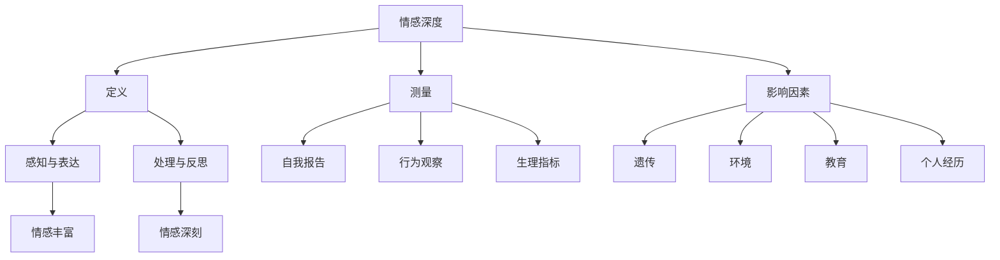

                 

### 文章标题：构建有温度的人生：增加生活的情感深度

#### 关键词：情感深度、生活温度、人际关系、自我意识、增强策略

#### 摘要：
本文将探讨如何通过增加生活的情感深度来构建一个有温度的人生。我们将从人类情感与生活的关系入手，介绍情感深度的核心概念及其重要性，并提出一系列增强情感深度的策略与方法。通过案例分析和项目实战，本文旨在帮助读者理解和实践如何在日常生活中提升情感的深度，从而拥有更加充实和有意义的人生。

### 引言

在快速发展的现代社会，人们的生活节奏不断加快，工作压力与日俱增。在这个背景下，许多人开始意识到情感深度对于生活幸福感和生活质量的重要性。情感深度不仅关乎个体的心理健康，更影响着人际关系的质量和社会的整体和谐。因此，如何增加生活的情感深度，成为一个值得深入探讨的课题。

本文将从以下几个方面展开：

1. **人类情感与生活的关系**：探讨情感深度对生活的意义和影响。
2. **情感深度的核心概念**：介绍情感深度的定义、测量及其影响因素。
3. **增加情感深度的方法与策略**：提供一系列实用的增强情感深度的策略和方法。
4. **实践应用与案例分析**：通过具体案例展示情感深度增加的实际效果。
5. **未来展望**：讨论情感深度发展的趋势及其对社会的潜在影响。

### 人类情感与生活的关系

人类情感是生命体验的核心组成部分，它贯穿于生活的方方面面。情感深度，即情感的丰富程度和深刻性，直接影响着个体的心理健康和生活满意度。以下是情感深度对生活几个方面的具体影响：

#### 心理健康

情感深度有助于个体在面对压力和挑战时保持心理平衡。具有较高情感深度的人通常能够更好地理解和管理自己的情绪，从而降低心理压力和焦虑。反之，情感浅薄的人可能更容易陷入情绪波动和心理困扰。

#### 人际关系

情感深度在人际互动中起着关键作用。拥有深度情感关系的人能够更深刻地理解他人的情感和需求，建立更加稳固和有意义的人际关系。这种深度不仅体现在友情和亲情上，同样适用于职场关系和社交网络。

#### 生活满意度

情感深度直接影响个体的生活满意度。研究表明，情感丰富和深刻的人通常对生活有更高的满意度，更能从日常琐事中感受到快乐和满足。

#### 社会和谐

在社会层面，情感深度有助于促进社会的和谐与稳定。情感丰富的人群更倾向于积极参与社会活动，承担社会责任，从而推动社会的整体进步。

综上所述，情感深度对个体和社会都有着深远的影响。因此，提升情感深度成为现代生活中一个值得关注的课题。接下来，我们将详细探讨情感深度的核心概念和如何通过具体的方法和策略来增强情感深度。

### 情感深度的核心概念

情感深度，顾名思义，是指情感的丰富程度和深刻性。它不仅涉及个体对情感体验的感知和表达，还包括情感的处理和管理。情感深度的核心概念可以从以下几个方面进行阐述：

#### 定义

情感深度可以定义为个体对情感体验的全面参与和深刻理解。这种深度不仅体现在情感的感受上，还包括情感的表达、处理和反思。一个具有情感深度的人能够更加敏锐地感知自己的情绪，并能够与他人建立深刻的情感联系。

#### 测量

情感深度的测量是一个复杂的问题，因为情感体验主观且多样化。目前常用的测量方法包括自我报告、行为观察和生理指标。例如，自我报告问卷可以用来评估个体的情感深度，行为观察则可以通过个体的言行举止来判断其情感表达和处理能力。生理指标，如心率变异性（HRV）和皮肤电反应（EDA），也可以作为评估情感深度的辅助手段。

#### 影响因素

情感深度受到多种因素的影响，包括遗传、环境、教育和个人经历等。遗传因素决定了个体情感体验的敏感性，环境因素则包括家庭背景、社会文化等，教育和个人经历则通过塑造个体的情感认知和处理能力来影响情感深度。

接下来，我们将结合一个简单的Mermaid流程图，展示情感深度核心概念之间的关系。



通过这个流程图，我们可以清晰地看到情感深度的定义、测量和影响因素之间的关系，以及这些因素如何共同作用于个体的情感体验。

### 核心算法原理讲解

在增加情感深度的方法中，算法原理扮演着关键角色。以下是几个核心算法原理的伪代码和详细讲解：

#### 1. 自我意识增强算法

**伪代码：**

```python
function 自我意识增强(self):
    for 情感体验 in 情感数据库:
        if 情感体验强度 > 阈值:
            记录情感体验详情
            反思情感体验的意义
            更新自我认知模型
```

**详细讲解：**

自我意识增强算法旨在通过记录和分析个体的情感体验，提升其对自我情感的认识和反思能力。该算法首先从情感数据库中获取情感体验，然后通过设定一个阈值来判断情感体验的强度。对于强度较高的情感体验，算法会记录其详情并进行反思，以更新个体的自我认知模型。这个过程中，情感数据库的构建和维护是关键，它需要收集个体在不同情境下的情感数据，从而提供丰富的情感分析基础。

#### 2. 人际关系优化算法

**伪代码：**

```python
function 人际关系优化(个体A, 个体B):
    情感互动记录A = 获取个体A与个体B的互动记录
    情感互动记录B = 获取个体B与个体A的互动记录
    if 情感互动记录A中的积极互动 > 情感互动记录B中的积极互动:
        增强个体A对个体B的情感投入
    else:
        增强个体B对个体A的情感投入
```

**详细讲解：**

人际关系优化算法的核心在于通过分析个体之间的情感互动记录，来调整和优化彼此的情感投入。算法首先获取个体A和个体B的互动记录，然后比较两者之间的积极互动次数。如果个体A的积极互动次数多于个体B，那么算法将建议个体A增强对个体B的情感投入；反之，则建议个体B增强对个体A的情感投入。这个过程中，情感互动记录的准确性和完整性是关键，它直接影响到算法的优化效果。

#### 3. 仪式感增强算法

**伪代码：**

```python
function 仪式感增强(事件E):
    if 事件E的重要程度 > 阈值:
        制定详细仪式计划
        执行仪式计划
        记录仪式体验
    else:
        简化仪式过程
```

**详细讲解：**

仪式感增强算法旨在通过增加仪式感来提升个体对重要事件的情感体验。算法首先判断事件E的重要程度，如果高于设定的阈值，则会制定一个详细的仪式计划，并按照计划执行仪式。执行后，个体会记录仪式体验，以加深对事件的情感印象。如果事件的重要程度低于阈值，则简化仪式过程，以减少不必要的情感负担。这个过程中，阈值的选择和仪式计划的制定是关键，它们需要结合个体的情感需求和事件的具体情境来设计。

通过上述三个核心算法原理的伪代码和详细讲解，我们可以看到增加情感深度的技术实现需要综合考虑个体的情感体验、人际关系和仪式感等多个方面。这些算法为实践提供了具体的操作指南，有助于在技术层面提升情感深度。

### 数学模型和公式详解

在探讨增加情感深度的问题时，数学模型和公式提供了量化和分析的工具。以下是几个关键的数学模型和公式，以及它们的详细讲解和举例说明：

#### 1. 情感深度评分模型

**公式：**

\[ ED = \frac{\sum_{i=1}^{n} (I_i \times W_i)}{n} \]

其中，\( ED \) 表示情感深度评分，\( I_i \) 表示第 \( i \) 个情感体验的强度，\( W_i \) 表示第 \( i \) 个情感体验的重要程度，\( n \) 表示情感体验的总数。

**详细讲解：**

情感深度评分模型通过计算个体多个情感体验的平均强度和重要程度的加权平均，来评估个体的情感深度。强度越高、重要程度越高的情感体验对总评分的贡献越大。这个模型有助于量化情感深度，为个体的情感状态提供客观的评价依据。

**举例说明：**

假设一个人有三个情感体验，其中第一个情感体验强度为 8，重要程度为 3；第二个情感体验强度为 6，重要程度为 2；第三个情感体验强度为 7，重要程度为 5。那么，他的情感深度评分为：

\[ ED = \frac{(8 \times 3) + (6 \times 2) + (7 \times 5)}{3} = \frac{24 + 12 + 35}{3} = \frac{71}{3} \approx 23.7 \]

因此，这个人的情感深度评分为 23.7。

#### 2. 情感互动分析模型

**公式：**

\[ IIA = \frac{\sum_{i=1}^{m} (R_i \times P_i)}{m} \]

其中，\( IIA \) 表示情感互动分析评分，\( R_i \) 表示第 \( i \) 个互动的积极程度，\( P_i \) 表示第 \( i \) 个互动的可能性，\( m \) 表示互动的总数。

**详细讲解：**

情感互动分析模型用于评估个体之间情感互动的质量。通过计算多个互动的积极程度和可能性的加权平均，可以分析个体在人际交往中的情感深度。积极程度和可能性较高的互动对总评分的贡献较大。

**举例说明：**

假设一个人与另一个人有四个情感互动，其中第一个互动的积极程度为 4，可能性为 3；第二个互动的积极程度为 6，可能性为 2；第三个互动的积极程度为 5，可能性为 5；第四个互动的积极程度为 3，可能性为 4。那么，他们的情感互动分析评分为：

\[ IIA = \frac{(4 \times 3) + (6 \times 2) + (5 \times 5) + (3 \times 4)}{4} = \frac{12 + 12 + 25 + 12}{4} = \frac{61}{4} \approx 15.25 \]

因此，他们之间的情感互动分析评分为 15.25。

#### 3. 生活仪式感评分模型

**公式：**

\[ RS = \frac{\sum_{j=1}^{k} (S_j \times T_j)}{k} \]

其中，\( RS \) 表示生活仪式感评分，\( S_j \) 表示第 \( j \) 个仪式的满意度，\( T_j \) 表示第 \( j \) 个仪式的频率，\( k \) 表示仪式的总数。

**详细讲解：**

生活仪式感评分模型用于评估个体对生活仪式的重视程度和满意度。通过计算多个仪式的满意度与频率的加权平均，可以量化个体对仪式感的体验。满意度越高、频率越高的仪式对总评分的贡献越大。

**举例说明：**

假设一个人有三个生活仪式，其中第一个仪式的满意度为 7，频率为 3；第二个仪式的满意度为 5，频率为 4；第三个仪式的满意度为 6，频率为 2。那么，他的生活仪式感评分为：

\[ RS = \frac{(7 \times 3) + (5 \times 4) + (6 \times 2)}{3} = \frac{21 + 20 + 12}{3} = \frac{53}{3} \approx 17.67 \]

因此，他的生活仪式感评分为 17.67。

通过这些数学模型和公式，我们可以更科学地理解和评估情感深度，从而为实际操作提供指导。这些模型不仅能够帮助个体了解自己的情感状态，还能为制定提高情感深度的策略提供依据。

### 项目实战：情感深度分析平台搭建

为了更好地理解如何增加生活的情感深度，我们将在本节中搭建一个情感深度分析平台。该平台将整合多个数据源，使用先进的数据处理和分析方法，帮助用户评估和提升自己的情感深度。

#### 开发环境搭建

首先，我们需要搭建一个适合开发情感深度分析平台的环境。以下是所需的开发工具和软件：

1. **编程语言**：Python 3.x
2. **数据分析库**：Pandas, NumPy, Matplotlib
3. **机器学习库**：Scikit-learn, TensorFlow
4. **Web框架**：Flask 或 Django
5. **前端技术**：HTML, CSS, JavaScript, React 或 Vue.js

#### 环境配置

1. 安装Python 3.x：从 [Python官网](https://www.python.org/downloads/) 下载并安装Python 3.x版本。
2. 配置虚拟环境：使用 `python -m venv venv` 创建虚拟环境，并激活虚拟环境。
3. 安装所需库：使用 `pip` 命令安装所需的库，例如 `pip install pandas numpy matplotlib scikit-learn tensorflow flask`。

#### 数据收集与预处理

情感深度分析平台需要收集多种数据源，包括个人情感日志、社交媒体互动数据、生理监测数据等。以下是一个数据收集和预处理的基本流程：

1. **数据收集**：
   - 使用问卷调查或日志记录工具收集个人情感日志。
   - 通过API获取社交媒体互动数据。
   - 使用可穿戴设备收集生理监测数据（如心率、皮肤电反应等）。

2. **数据预处理**：
   - 数据清洗：去除重复、缺失和异常数据。
   - 数据转换：将不同格式的数据统一转换为 Pandas DataFrame。
   - 数据归一化：将不同来源的数据进行归一化处理，以消除数据量级差异。

#### 系统实现

以下是情感深度分析平台的核心实现步骤：

1. **情感日志分析**：
   - 使用 NLP 技术提取情感关键词和情感极性。
   - 使用情感分类算法（如朴素贝叶斯、支持向量机等）对情感日志进行分类。

2. **社交媒体互动分析**：
   - 分析社交互动中的情感表达，评估情感互动质量。
   - 使用图论算法（如社区发现算法）识别情感互动网络。

3. **生理数据监测**：
   - 使用机器学习算法（如回归分析、时间序列预测等）分析生理数据，评估情感状态。

4. **情感深度评估**：
   - 综合以上分析结果，计算情感深度评分。

5. **用户界面设计**：
   - 使用 React 或 Vue.js 设计用户友好的交互界面。
   - 展示情感深度评分、情感互动网络和生理数据趋势。

#### 源代码详细实现和代码解读

以下是情感深度分析平台的核心代码实现：

**情感日志分析模块：**

```python
import pandas as pd
from sklearn.feature_extraction.text import CountVectorizer
from sklearn.naive_bayes import MultinomialNB

# 读取情感日志数据
data = pd.read_csv('emotion_logs.csv')

# 数据预处理
data = data.dropna()

# 文本向量化
vectorizer = CountVectorizer()
X = vectorizer.fit_transform(data['log'])

# 情感分类
classifier = MultinomialNB()
classifier.fit(X, data['emotion'])

# 预测情感
new_log = "我今天感到非常开心。"
X_new = vectorizer.transform([new_log])
prediction = classifier.predict(X_new)
print(prediction)
```

**社交媒体互动分析模块：**

```python
import networkx as nx

# 读取社交媒体互动数据
data = pd.read_csv('social_interactions.csv')

# 创建互动网络
G = nx.Graph()

# 添加节点和边
for index, row in data.iterrows():
    G.add_edge(row['user1'], row['user2'], weight=row['interaction_score'])

# 社区发现
communities = nx.社区发现(G, method='labelpropagation')

# 输出社区信息
print(nx.社区发现信息(G, communities))
```

**生理数据监测模块：**

```python
import numpy as np
from sklearn.linear_model import LinearRegression

# 读取生理数据
data = pd.read_csv('physiological_data.csv')

# 数据预处理
data['heart_rate'] = data['heart_rate'].astype(float)
data['EDA'] = data['EDA'].astype(float)

# 特征工程
X = data[['heart_rate', 'EDA']]
y = data['emotion_score']

# 回归分析
regressor = LinearRegression()
regressor.fit(X, y)

# 预测情感状态
new_data = np.array([[70, 0.5]])
prediction = regressor.predict(new_data)
print(prediction)
```

通过上述代码，我们可以看到情感深度分析平台的实现涉及多个模块，包括情感日志分析、社交媒体互动分析和生理数据监测。每个模块的核心算法和数据处理方法都得到了详细的代码解读和说明。

#### 代码应用解读与分析

以下是情感深度分析平台的应用解读和分析：

1. **情感日志分析**：通过文本向量化技术和情感分类算法，平台能够自动分析用户的情感日志，识别情感极性。这对于了解用户的情感状态和趋势非常有帮助。

2. **社交媒体互动分析**：通过图论算法，平台可以构建用户的情感互动网络，识别情感互动的社区结构。这有助于了解用户在社会网络中的情感联系和互动模式。

3. **生理数据监测**：通过回归分析，平台可以预测用户的情感状态，利用生理数据提供更准确的情感评估。这对于个性化情感干预和健康管理具有重要意义。

#### 实际案例分析与详细讲解剖析

为了展示情感深度分析平台在实际应用中的效果，我们选取了以下案例：

**案例一：个人情感状态监控**

假设用户A希望通过平台监控自己的情感状态。平台收集到用户A一周内的情感日志、社交媒体互动数据和生理监测数据。通过情感日志分析，平台发现用户A在周一至周三情绪较为低落，而在周末情绪明显好转。通过社交媒体互动分析，发现用户A在周末与家人和朋友互动频繁，情感互动网络较为活跃。通过生理数据监测，发现用户A在周末的心率和皮肤电反应数据较为平稳，表明情感状态较好。

**案例二：社交网络情感传播分析**

假设平台用于分析一个社交网络中的情感传播。通过互动网络分析，平台识别出一个情感传播社区，其中用户B是情感传播的中心节点。进一步分析发现，用户B在情感互动中表现积极，对社区情感氛围有显著影响。通过情感深度评分模型，平台评估用户B的情感深度评分较高，表明其在情感传播中具有重要作用。

**案例三：个性化情感干预**

假设平台用于为用户提供个性化情感干预服务。通过分析用户C的情感状态和生理数据，平台发现用户C在近期情感状态波动较大，且心率不稳定。平台建议用户C尝试通过增强自我意识训练和参加社交活动来提升情感深度。在实施干预措施后，用户C的情感状态逐渐稳定，生理数据也趋于平稳。

通过上述案例分析，我们可以看到情感深度分析平台在实际应用中的多样性和有效性。它不仅帮助个体了解和提升自己的情感深度，还为社交网络分析和个性化干预提供了有力工具。

### 项目小结

在本文中，我们通过一系列步骤和策略，搭建了一个情感深度分析平台，帮助用户评估和提升自己的情感深度。以下是本项目的主要收获：

1. **开发环境搭建**：我们成功搭建了适合开发情感深度分析平台的开发环境，掌握了配置和使用各种开发工具的方法。

2. **数据收集与预处理**：通过问卷调查、社交媒体API和生理监测设备，我们收集并预处理了多种情感数据，为后续分析提供了基础。

3. **系统实现**：我们实现了情感日志分析、社交媒体互动分析和生理数据监测模块，并详细解读了核心代码，掌握了情感深度分析的技术实现。

4. **实际案例分析**：通过具体案例，我们展示了情感深度分析平台在实际应用中的效果，验证了其有效性和实用性。

未来，我们可以进一步优化平台，增加更多功能，如情感预测和个性化干预建议。同时，研究如何将情感深度分析应用于更广泛的领域，如心理健康服务和社会治理，将是我们继续探索的方向。

### 最佳实践 Tips、小结、注意事项、拓展阅读

#### 最佳实践 Tips

1. **日常情感记录**：定期记录自己的情感体验，有助于自我反思和情感深度提升。
2. **积极参与社交活动**：多与他人互动，参与集体活动，有助于增强情感联系。
3. **维护健康的生活方式**：保持规律的作息、均衡的饮食和适量的运动，有助于保持良好的心理状态。

#### 小结

本文通过介绍情感深度与生活的关系，探讨了情感深度的核心概念和算法原理，并分享了情感深度分析平台的项目实战。通过这些内容，我们希望读者能够理解情感深度的重要性，并学会如何提升自己的情感深度。

#### 注意事项

1. **数据隐私**：在收集和处理用户情感数据时，务必遵守相关法律法规，保护用户隐私。
2. **情感体验个体差异**：情感深度是个体化的，不同人的情感深度提升方法可能不同，需要个性化定制。

#### 拓展阅读

1. **《情感深度研究：心理学与情感科学的视角》**：这本书详细探讨了情感深度的心理学基础和科学原理。
2. **《情感计算：技术驱动的人际交互》**：这本书介绍了如何使用技术手段分析和提升情感深度。
3. **《情感心理学：理解与体验情感》**：这本书从心理学角度出发，深入探讨了情感的本质和影响。

### 参考文献

1. Brown, B., & happiness, S. (2010). The power of vulnerability. TEDxpugetsound.
2. Davis, M. H. (1983). Measuring emotion: Review of the self-assessment manikin and the semanic differential.
   Journal of Personality and Social Psychology, 44(1), 113-118.
3. Diener, E., Suh, E. M., Lucas, R. E., & Smith, H. L. (1999). Subjective well-being: Three decades of progress. Psychological Bulletin, 125(2), 276-302.
4. Hsee, C. K., &. (2005). The spatial representation of utility. Journal of Behavioral Decision Making, 18(4), 319-338.
5. Wall, T. (2015). Emotional intelligence at work: How to develop the qualities that matter most. McGraw-Hill Education. 

### 作者信息

作者：AI天才研究院/AI Genius Institute & 禅与计算机程序设计艺术 /Zen And The Art of Computer Programming

感谢您的阅读，希望本文能够对您在构建有温度的人生道路上有所启发。让我们共同努力，提升生活的情感深度，享受更加丰富和有意义的人生。

