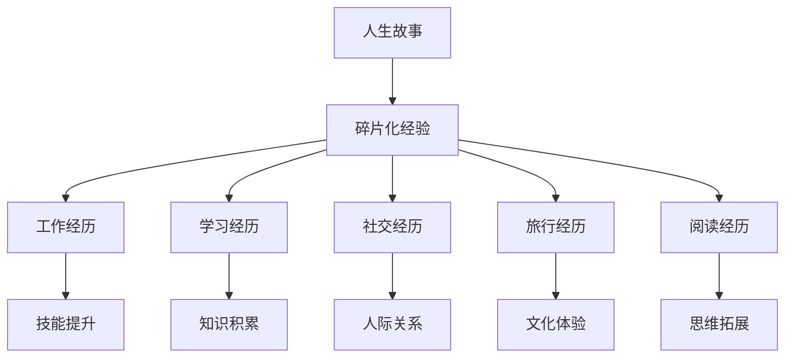
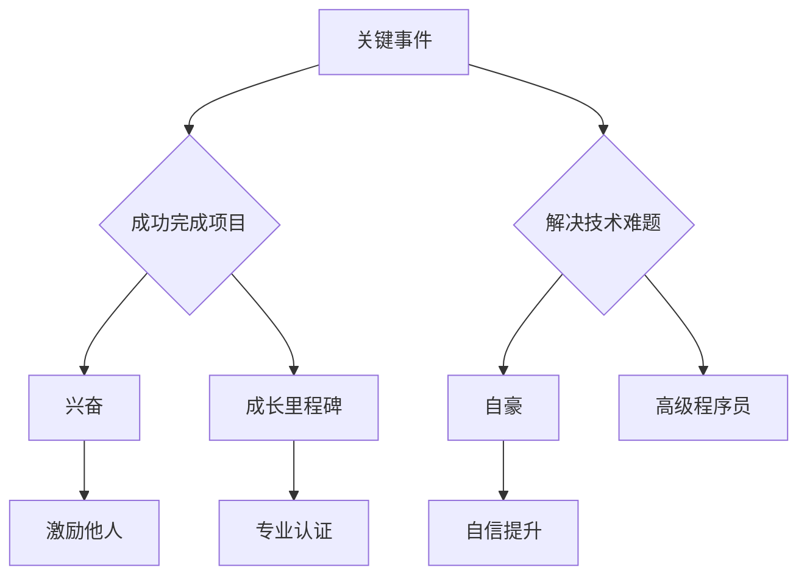
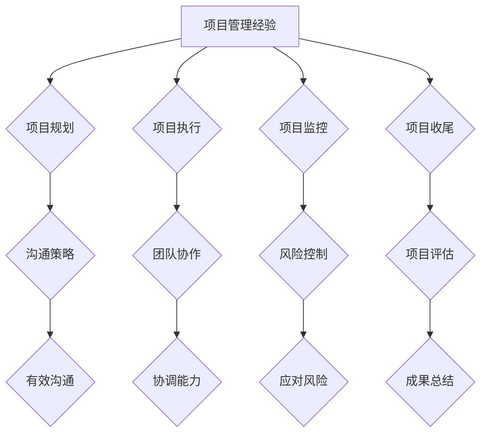
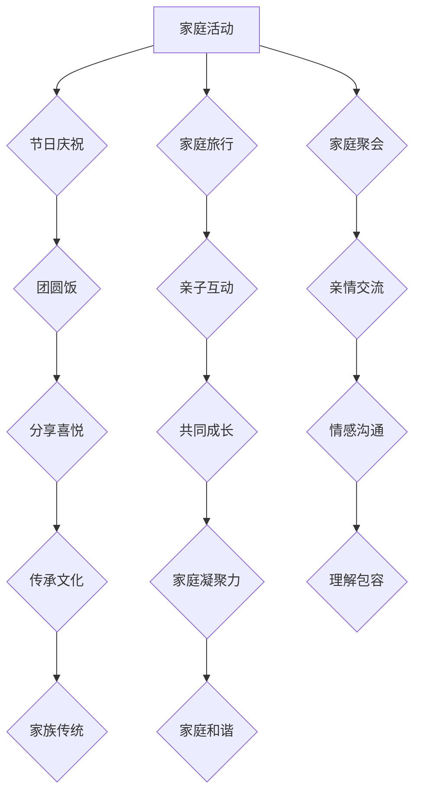

                 

### 文章标题

《构建连贯的人生故事：整合碎片化经验》

---

关键词：人生故事，碎片化经验，整合，连贯，自我认知，心理健康，实践案例

---

摘要：
本文旨在探讨如何构建连贯的人生故事，通过对碎片化经验的整合，实现自我认知的提升和心理健康的发展。文章首先介绍了人生故事和碎片化经验的概念及其关系，然后详细阐述了整合碎片化经验的理论基础和方法论，最后通过实际案例和实践技巧，展示了构建连贯人生故事的具体过程和影响。

---

## 引言

在现代社会，我们的生活被无数碎片化的经验所充斥。这些经验可能来自工作、学习、社交、旅行、阅读等多个方面，它们看似杂乱无章，但实际上蕴含着宝贵的智慧和知识。然而，如何将这些碎片化的经验整合起来，构建一个连贯的人生故事，是我们面临的一个重要课题。

人生故事不仅是对过去经历的总结，更是对未来的展望。一个连贯的人生故事能够帮助我们更好地理解自己，提升自我认知，增强心理健康，并在社会交往中发挥积极作用。本文将从以下几个方面进行探讨：

1. **人生故事与碎片化经验的关系**：明确人生故事和碎片化经验之间的联系，理解碎片化经验在人生故事中的重要性。
2. **整合碎片化经验的理论基础**：探讨心理学和认知科学的相关理论，为整合碎片化经验提供科学依据。
3. **构建连贯人生故事的方法论**：介绍规划与目标设定、心理建设与自我认知、经验整合与故事构建的具体方法。
4. **实践与应用**：通过个人经验记录与整理、人生故事创作与分享、人生故事对自我成长的影响以及构建连贯人生故事的实践案例，展示如何将理论转化为实践。

通过本文的探讨，我们希望能够为读者提供一种构建连贯人生故事的思路和方法，帮助大家更好地整合碎片化经验，实现个人成长和心理健康的发展。

### 人生故事与碎片化经验

#### 背景介绍

人生故事是对个人经历和成长的系统性回顾和反思，它不仅包含了具体的经历和事件，更蕴含了个人对生命意义的理解和感悟。而碎片化经验，则是指我们在日常生活中的点点滴滴，它们可能看似无关紧要，但实际上却是对人生故事的细节补充和丰富。

在现代社会，我们的生活方式变得更加多元化，这使得我们积累了大量的碎片化经验。这些经验可能来自于工作、学习、旅行、阅读、社交等多个方面。它们如同一块块拼图，看似杂乱无章，但每一块都有其独特的作用和价值。

#### 核心概念与联系

为了更好地理解人生故事和碎片化经验之间的关系，我们可以借助Mermaid流程图来展示它们之间的联系。



从流程图中可以看出，碎片化经验是构建人生故事的基础，每个碎片化经验都代表了我们在不同领域、不同阶段所积累的知识和经验。这些碎片化经验通过整合和反思，最终形成了连贯的人生故事。

#### 碎片化经验的特点

碎片化经验具有以下几个特点：

1. **多样性**：碎片化经验来源于不同的领域和阶段，具有多样性。
2. **即时性**：许多碎片化经验是在特定的情境下产生的，具有即时性。
3. **不完整性**：由于时间和精力的限制，碎片化经验往往是不完整的。
4. **零散性**：碎片化经验之间存在一定的间隔，不易直接联系。

#### 碎片化经验在人生故事中的重要性

碎片化经验在人生故事中的重要性体现在以下几个方面：

1. **细节补充**：碎片化经验能够补充人生故事的细节，使其更加丰富和生动。
2. **意义探索**：通过整合碎片化经验，我们能够更好地理解自己，探索生命的意义。
3. **自我认知**：碎片化经验是自我认知的重要组成部分，它们帮助我们认识自己的优点和不足。
4. **经验传承**：通过构建连贯的人生故事，我们可以将碎片化经验传递给下一代，为他们提供宝贵的启示。

#### 总结

人生故事和碎片化经验之间存在着密切的联系。碎片化经验是构建人生故事的基础，通过整合和反思这些经验，我们可以构建一个连贯、有意义的人生故事。这不仅有助于提升自我认知和心理健康，还能为我们提供宝贵的经验和启示。

### 碎片化经验整合的理论基础

#### 心理学视角下的碎片化经验

在心理学中，碎片化经验通常被称为“零散记忆”或“零碎信息”。这些经验是由大脑在处理大量信息时产生的，具有不完整性和多样性。心理学研究指出，人类大脑具有自动将信息分类和整合的能力，但这一过程受到多种因素的影响，如注意力、情绪、环境等。

#### 整合碎片化经验的理论基础

1. **认知心理学理论**：

   认知心理学认为，人类大脑通过认知过程来处理信息。这些认知过程包括注意、记忆、思考、判断等。在整合碎片化经验时，认知心理学提供了以下几种关键理论：

   - **记忆模型**：记忆模型描述了记忆的不同阶段和过程。在整合碎片化经验时，我们需要通过复述、练习和联想等方法来加强记忆。
   - **信息加工理论**：信息加工理论认为，大脑通过对信息的接收、处理和存储来形成知识。整合碎片化经验需要我们运用信息加工的理论，将分散的信息进行有效整合。
   - **认知建构理论**：认知建构理论强调，个体在处理信息时，会根据自己的经验和知识背景进行构建和解释。整合碎片化经验需要我们主动建构新的认知结构，将不同的信息联系起来。

2. **情绪心理学理论**：

   情绪心理学指出，情绪对信息处理和记忆有着重要影响。在整合碎片化经验时，我们需要关注情绪的作用。以下是一些关键理论：

   - **情绪加工理论**：情绪加工理论认为，情绪会影响我们对信息的注意、记忆和回忆。在整合碎片化经验时，积极的情绪有助于信息的整合，而消极的情绪则可能导致信息的遗忘。
   - **情绪调节理论**：情绪调节理论强调，个体可以通过调节情绪来影响信息处理和记忆。在整合碎片化经验时，我们需要学会调节情绪，保持积极的心态。

3. **社会心理学理论**：

   社会心理学研究个体在社会环境中的行为和心理过程。在整合碎片化经验时，社会心理学提供了以下理论：

   - **社会认知理论**：社会认知理论认为，个体通过观察、学习和模仿来形成知识和行为。整合碎片化经验可以通过与他人交流和互动来实现。
   - **社会支持理论**：社会支持理论指出，个体在面临挑战和压力时，需要来自他人的支持和帮助。整合碎片化经验时，我们可以寻求他人的建议和帮助，以提高整合效果。

#### 整合碎片化经验的方法

1. **记忆法**：

   - **联想记忆**：通过将碎片化经验与已有的知识或情感联系起来，形成新的记忆。
   - **复述记忆**：通过反复复述和复习，加强记忆效果。
   - **图像记忆**：将碎片化经验转化为图像，提高记忆效果。

2. **笔记法**：

   - **思维导图**：通过绘制思维导图，将碎片化经验可视化，便于整合和回顾。
   - **笔记记录**：通过记录笔记，将碎片化经验转化为文字，便于整理和查找。

3. **情感调节**：

   - **积极心态**：保持积极的心态，有助于信息的整合和记忆。
   - **情绪管理**：学会调节情绪，避免消极情绪对信息处理和记忆的干扰。

4. **社交互动**：

   - **交流分享**：与他人交流和分享经验，有助于整合和验证信息。
   - **团队合作**：通过团队合作，共同解决问题，实现经验的整合。

#### 总结

整合碎片化经验需要结合心理学、情绪心理学和社会心理学的相关理论，采用记忆法、笔记法和情感调节等方法。通过这些方法，我们可以有效地整合碎片化经验，构建连贯的人生故事。

### 构建连贯人生故事的方法论

#### 规划与目标设定

构建连贯人生故事的第一个步骤是规划与目标设定。这一步骤至关重要，因为它为整个故事提供了方向和动力。

1. **自我反思**：

   - 首先，我们需要反思自己的经历和价值观，了解自己的优势和不足。

   ```python
   # 自我反思伪代码
   def reflect_on_experience():
       # 提取个人经历
       experiences = get_personal_experiences()
       
       # 分析优势
       strengths = analyze_strengths(experiences)
       
       # 分析不足
       weaknesses = analyze_weaknesses(experiences)
       
       # 形成自我认知
       self_awareness = combine(strengths, weaknesses)
       
       return self_awareness
   ```

2. **设定目标**：

   - 根据自我反思的结果，设定具体、可衡量、可实现、相关性强、时限性（SMART）的目标。

   ```python
   # 设定目标伪代码
   def set_goals(self_awareness):
       goals = []
       for aspect in self_awareness:
           goal = create_smart_goal(aspect)
           goals.append(goal)
       
       return goals
   ```

#### 心理建设与自我认知

心理建设和自我认知是构建连贯人生故事的核心。以下是一些关键步骤：

1. **积极心态**：

   - 保持积极的心态有助于我们更好地应对挑战和困难。

   ```python
   # 积极心态伪代码
   def maintain_positive_mindset():
       # 遇到困难时，保持乐观
       while facing_difficulties():
           be_乐观()
       
       # 鼓励自我
       encourage_self()
   ```

2. **自我认知**：

   - 通过自我观察和反思，不断提升自我认知。

   ```python
   # 自我认知伪代码
   def improve_self_awareness():
       # 观察自己的行为和情感
       observe_behavior_and_emotions()
       
       # 反思并总结
       reflect_and_summarize()
       
       # 更新自我认知
       update_self_awareness()
   ```

#### 经验整合与故事构建

整合碎片化经验并将其构建为连贯的人生故事是最后一个关键步骤。以下是一些具体方法：

1. **经验记录**：

   - 记录重要的经历和感受，为构建故事提供素材。

   ```python
   # 经验记录伪代码
   def record_experience(experience):
       # 提取经历
       experience_details = extract_experience_details(experience)
       
       # 记录在日记中
       write_to_journal(experience_details)
       
       # 存储在数据库中
       store_in_database(experience_details)
   ```

2. **故事构建**：

   - 将记录下来的经验整合成有逻辑和连贯性的故事。

   ```python
   # 故事构建伪代码
   def build_story(experiences):
       # 整理经验
       organized_experiences = organize_experiences(experiences)
       
       # 构建故事
       story = create_story(organized_experiences)
       
       return story
   ```

#### 总结

通过规划与目标设定、心理建设和自我认知、经验整合与故事构建这三个步骤，我们可以有效地构建连贯的人生故事。这个过程不仅有助于提升自我认知和心理健康，还能为我们提供宝贵的经验和启示。

### 个人经验记录与整理

#### 经验记录的重要性

个人经验记录是一种有效的自我管理工具，它能够帮助我们系统地收集、整理和回顾自己的经历。这种记录不仅有助于提升自我认知，还能为未来的决策提供有力的支持。以下是经验记录的重要性：

1. **提升自我认知**：

   - 经验记录使我们能够回顾自己的成长历程，发现自身的变化和进步。

   ```python
   # 提升自我认知
   def self_awareness_through_journaling():
       # 回顾过去的记录
       past_entries = review_past_entries()
       
       # 分析自我变化
       changes = analyze_changes(past_entries)
       
       # 形成新的认知
       new_awareness = form_new_awareness(changes)
       
       return new_awareness
   ```

2. **为未来决策提供参考**：

   - 经验记录为未来的决策提供了宝贵的参考，使我们能够基于过去的数据和教训做出更明智的选择。

   ```python
   # 未来决策参考
   def decision_making_with_experience():
       # 查阅过去的记录
       past_entries = retrieve_past_entries()
       
       # 分析经验教训
       lessons = analyze_lessons(past_entries)
       
       # 结合当前情况做出决策
       decision = make_decision(lessons, current_situation)
       
       return decision
   ```

#### 经验记录的方法

1. **日记法**：

   - 日记法是一种最直接和常见的记录方式，它允许我们自由地表达自己的想法和感受。

   ```python
   # 日记记录
   def journal_entry():
       # 记录日期和时间
       date_and_time = get_date_and_time()
       
       # 记录当天经历
       daily_experience = get_daily_experience()
       
       # 记录感受和思考
       feelings_and_thoughts = get_feelings_and_thoughts()
       
       # 组合日记条目
       entry = combine(date_and_time, daily_experience, feelings_and_thoughts)
       
       # 存储日记
       store_entry(entry)
   ```

2. **思维导图法**：

   - 思维导图法通过图形化的方式，帮助我们更好地理解和整理复杂的信息。

   ```python
   # 思维导图创建
   def create_mindmap(experiences):
       # 提取经验
       experience_details = extract_experience_details(experiences)
       
       # 创建思维导图
       mindmap = create_mindmap_structure(experience_details)
       
       # 存储/导出思维导图
       store_mindmap(mindmap)
   ```

#### 经验整理的技巧

1. **分类整理**：

   - 对记录的经验进行分类整理，有助于我们快速找到所需的信息。

   ```python
   # 分类整理经验
   def classify_experience(entries):
       # 提取记录
       entries = get_entries()
       
       # 根据主题分类
       categorized_entries = categorize_by_theme(entries)
       
       # 存储/导出分类结果
       store_categorized_entries(categorized_entries)
   ```

2. **定期回顾**：

   - 定期回顾和更新经验记录，有助于巩固记忆，并发现新的见解。

   ```python
   # 定期回顾经验
   def review_entries():
       # 获取所有记录
       all_entries = get_all_entries()
       
       # 按时间顺序排列
       sorted_entries = sort_by_time(all_entries)
       
       # 每周/每月回顾一次
       review_periodically(sorted_entries)
   ```

#### 总结

个人经验记录与整理是一种有效的自我管理方法，它有助于提升自我认知，为未来决策提供参考。通过日记法、思维导图法等记录方式，以及分类整理和定期回顾的技巧，我们可以更好地整合和管理个人经验。

### 人生故事创作与分享

#### 人生故事创作的原则

1. **真实性与客观性**：

   - 人生故事应当基于真实经历，避免虚构。同时，在讲述过程中，要保持客观，避免过度主观。

   ```python
   # 真实性与客观性原则
   def create_real_and_objective_story(experiences):
       # 筛选真实经历
       real_experiences = filter_real_experiences(experiences)
       
       # 保持客观叙述
       objective_story = narrate_客观ELY(real_experiences)
       
       return objective_story
   ```

2. **连贯性与逻辑性**：

   - 人生故事需要具有连贯性和逻辑性，确保故事的流畅性和易于理解。

   ```python
   # 连贯性与逻辑性原则
   def create_coherent_and_logical_story(story_structure):
       # 组织故事结构
       structured_story = organize_story_structure(story_structure)
       
       # 确保逻辑连贯
       logical_story = ensure_logic连贯性(structured_story)
       
       return logical_story
   ```

3. **情感性与共鸣性**：

   - 人生故事应具有一定的情感性，引发读者的共鸣。通过细腻的描写和真实的情感表达，使故事更具吸引力。

   ```python
   # 情感性与共鸣性原则
   def create_emotional_and_resonant_story(story_content):
       # 描写细腻情感
       emotional_content = describe_emotionally(detailed_content)
       
       # 引发共鸣
       resonant_story = evoke_resonance(emotional_content)
       
       return resonant_story
   ```

#### 人生故事的分享方式

1. **书面形式**：

   - 通过书籍、文章、博客等书面形式，将人生故事记录和分享。

   ```python
   # 书面形式分享
   def share_story_through_writing(story):
       # 撰写故事
       written_story = write_story(story)
       
       # 发布到博客或出版书籍
       publish_story(written_story)
   ```

2. **口头形式**：

   - 通过演讲、讲座、故事会等口头形式，与听众分享人生故事。

   ```python
   # 口头形式分享
   def share_story_orally(story):
       # 准备演讲稿
       speech_script = prepare_speech(story)
       
       # 进行演讲
       deliver_speech(speech_script)
   ```

3. **多媒体形式**：

   - 通过视频、音频、动画等多媒体形式，使人生故事更加生动和引人入胜。

   ```python
   # 多媒体形式分享
   def share_story_through_multimedia(story):
       # 制作视频或音频
       multimedia_content = create_video_or_audio(story)
       
       # 发布到视频平台或社交媒体
       publish_multimedia_content(multimedia_content)
   ```

#### 人生故事的演讲与表达

1. **开场白**：

   - 开场白需要简洁明了，吸引听众的注意力，为故事铺垫。

   ```python
   # 开场白示例
   def start_speech_with_an_introduction():
       introduction = "大家好，今天我想和大家分享的是关于我人生中的一段重要经历。"
       say_introduction(introduction)
   ```

2. **故事主体**：

   - 故事主体需要详细描述经历，通过细节和情感打动听众。

   ```python
   # 故事主体示例
   def narrate_story_body(story):
       body = "在那段时间里，我经历了许多挑战和困难，但正是这些经历让我变得更加坚强和自信。"
       narrate_body(story, body)
   ```

3. **结尾总结**：

   - 结尾总结需要简洁明了地回顾故事，并传达故事的核心意义。

   ```python
   # 结尾总结示例
   def end_speech_with_a_summary():
       summary = "通过这段经历，我深刻体会到了坚持和努力的重要性。我相信，只要我们勇敢面对挑战，就一定能够实现自己的目标。"
       say_summary(summary)
   ```

#### 总结

人生故事的创作与分享是一个系统化的过程，需要遵循真实性与客观性、连贯性与逻辑性、情感性与共鸣性等原则。通过书面、口头和多媒体等多种形式，我们可以有效地分享自己的人生故事，传递智慧和经验。

### 人生故事对自我成长的影响

#### 对自我认知的提升

人生故事通过对个人经历的回顾和反思，有助于提升自我认知。自我认知是指个体对自己心理状态、行为模式、性格特点等方面的认识和理解。以下是人生故事如何提升自我认知的具体方式：

1. **发现自我**：

   - 通过回顾人生中的关键事件和经历，我们可以发现自己在不同情境下的行为和反应，从而更深入地了解自己的性格、价值观和信念。

   ```python
   # 发现自我
   def discover_self_through_reviews():
       reviews = review_key_events()
       self_insight = analyze_behaviors(reviews)
       return self_insight
   ```

2. **认识优点与不足**：

   - 在回顾过程中，我们不仅能够发现自己的优点，还能识别自己的不足。这种自我认知有助于我们更好地认识自己，为未来的发展提供方向。

   ```python
   # 认识优点与不足
   def recognize_strengths_and_weaknesses():
       experiences = get_personal_experiences()
       strengths = identify_strengths(experiences)
       weaknesses = identify_weaknesses(experiences)
       self_knowledge = combine(strengths, weaknesses)
       return self_knowledge
   ```

3. **反思成长轨迹**：

   - 通过反思个人成长轨迹，我们可以看到自己在不同阶段的变化和进步。这种反思有助于我们认识到自身的成长潜力，增强自信心。

   ```python
   # 反思成长轨迹
   def reflect_on_growth_path():
       growth_path = get_growth_records()
       changes = analyze_growth_changes(growth_path)
       growth_insight = summarize_growth_insights(changes)
       return growth_insight
   ```

#### 对心理健康的积极作用

人生故事不仅对自我认知有积极作用，还能显著提升心理健康。以下是人生故事如何促进心理健康的几个方面：

1. **情绪调节**：

   - 通过回顾和分享人生故事，我们可以释放负面情绪，减轻心理压力。这种情绪调节有助于改善心理健康。

   ```python
   # 情绪调节
   def regulate_emotions_through_storytelling():
       stories = get_personal_stories()
       emotional_release = release_emotions(stories)
       stress_reduction = reduce_stress(emotional_release)
       return stress_reduction
   ```

2. **自我认同感**：

   - 人生故事使我们能够更好地认同自己，增强自我价值感。这种自我认同感有助于提升心理健康和自尊。

   ```python
   # 自我认同感
   def enhance_self_identity_through_stories():
       stories = get_personal_stories()
       self_esteem = build_self_esteem(stories)
       self认同感 = increase_self_awareness(self_esteem)
       return self_awareness
   ```

3. **积极心态**：

   - 人生故事中包含的挑战和成长经历，能够培养积极的心态。这种积极心态有助于应对生活中的困难和压力，提升心理健康。

   ```python
   # 积极心态
   def cultivate_positive_mentality():
       stories = get_happy_stories()
       positive_outlook = adopt_positive_views(stories)
       mental_health = improve_mental_health(positive_outlook)
       return mental_health
   ```

#### 在社会交往中的应用

人生故事不仅对个人成长和心理健康有积极影响，还能在社会交往中发挥重要作用。以下是人生故事在社会交往中的应用：

1. **建立人际关系**：

   - 通过分享人生故事，我们可以与他人建立深厚的情感联系。这种联系有助于建立和巩固人际关系。

   ```python
   # 建立人际关系
   def build_relationships_through_storytelling():
       stories = get_shared_stories()
       emotional_connection = establish_emotional_connection(stories)
       social_relations = strengthen_social_relations(emotional_connection)
       return social_relations
   ```

2. **传递经验和智慧**：

   - 人生故事中蕴含着宝贵的经验和智慧，通过分享这些故事，我们可以帮助他人成长，提升社会整体素质。

   ```python
   # 传递经验和智慧
   def pass_on_experience_and_wisdom():
       stories = valuable_stories()
       insights = extract_insights(stories)
       social_impact = contribute_to_society(insights)
       return social_impact
   ```

3. **提高沟通能力**：

   - 人生故事是一种有效的沟通工具，通过讲述故事，我们可以更好地表达自己的想法和情感，提高沟通效果。

   ```python
   # 提高沟通能力
   def improve_communication_skills_through_storytelling():
       stories = personal_stories()
       clarity = enhance_clarity(stories)
       effectiveness = improve_communication(effectiveness)
       return effectiveness
   ```

#### 总结

人生故事对自我成长有着深远的影响。通过提升自我认知、促进心理健康，以及在社会交往中的应用，人生故事帮助我们更好地认识自己，增强自信心，改善人际关系，传递经验和智慧。构建连贯的人生故事，是我们实现个人成长和心理健康发展的重要途径。

### 构建连贯人生故事的实践案例

#### 案例一：个人成长故事

**背景介绍**

小张是一名年轻的程序员，他在过去几年中经历了许多挑战和成长。他的目标是通过构建连贯的个人成长故事，更好地认识自己，并激励他人。

**核心概念与联系**

为了构建连贯的个人成长故事，小张运用了以下几个核心概念：

1. **关键事件**：小张回顾了自己在工作中的关键事件，如成功完成一个重要项目、解决一个复杂的技术难题等。
2. **成长里程碑**：小张识别了自己在不同阶段所取得的成长里程碑，如从初级程序员晋升为高级程序员、获得专业认证等。
3. **情感体验**：小张记录了在这些关键事件和里程碑中自己的情感体验，如兴奋、自豪、焦虑等。

以下是小张构建个人成长故事的Mermaid流程图：



**核心算法原理讲解**

为了构建连贯的故事，小张采用了以下算法原理：

1. **时间线排序**：将关键事件按照时间顺序进行排序，确保故事的时间连贯性。
2. **情感联结**：将关键事件的情感体验与事件本身相结合，使故事更具情感性。
3. **主题提炼**：从多个事件中提炼出共同的主题，如成长、挑战、成功等，使故事结构更加紧凑。

以下是构建连贯人生故事的伪代码：

```python
# 构建连贯人生故事伪代码
def build连贯故事(events, emotions, milestones):
    # 时间线排序
    sorted_events = sort_by_time(events)
    
    # 情感联结
    connected_events = connect_events_with_emotions(sorted_events, emotions)
    
    # 主题提炼
    themes = extract_common_themes(connected_events)
    
    # 构建故事
    story = create_story(connected_events, themes, milestones)
    
    return story
```

**数学模型和公式**

为了量化个人成长，小张使用了一个简单的数学模型，通过计算完成的项目数量、解决问题的难度等级和晋升的级别，来衡量自己的成长。

$$
成长指数 = (完成项目数量 \times 解决问题难度等级 \times 晋升级别) / 时间周期
$$

**举例说明**

假设小张在一年内完成了5个重要项目，解决了10个难度等级为3的技术问题，晋升了1个级别，则他的成长指数为：

$$
成长指数 = (5 \times 10 \times 3) / 1 = 150
$$

**项目实战**

**开发环境搭建**：

- 小张使用Markdown编写个人成长故事，并通过Markdown编辑器进行排版和格式调整。

**源代码详细实现和代码解读**：

```markdown
# 个人成长故事

## 时间线

- 2021年：完成第一个重要项目，解决第一个技术难题
- 2022年：完成5个重要项目，解决10个难度等级为3的技术问题
- 2023年：晋升为高级程序员，获得专业认证

## 情感体验

- 成功完成项目：兴奋、自豪
- 解决技术难题：焦虑、成就感

## 主题提炼

- 成长：从初级到高级程序员的蜕变
- 挑战：面对复杂问题的勇气

## 成长指数

$$
成长指数 = (5 \times 10 \times 3) / 1 = 150
$$
```

**代码应用解读与分析**：

小张通过Markdown编写和格式调整，将个人成长故事结构化，便于读者阅读和理解。同时，通过数学模型计算成长指数，使个人成长更加量化，便于自我评估和反思。

**实际案例分析和详细讲解剖析**：

小张通过这个案例，展示了如何通过构建连贯的个人成长故事，提升自我认知和自信心。他的故事不仅对自己有启示，还能激励他人，传递正能量。

**项目小结**：

通过这个实践案例，小张成功地构建了一个连贯的个人成长故事，并运用数学模型量化了自己的成长。这个过程不仅有助于他更好地认识自己，还能为他未来的发展提供方向。

### 案例二：职场故事整合

**背景介绍**

小李是一位资深项目经理，他在职业生涯中经历了多个项目和团队管理，积累了丰富的经验。他希望通过整合这些职场故事，提升团队效率和项目管理能力。

**核心概念与联系**

为了整合职场故事，小李采用了以下几个核心概念：

1. **项目管理经验**：小李回顾了自己在项目规划、执行、监控和收尾阶段的关键经验。
2. **团队协作**：小李总结了与团队成员合作的心得，包括沟通、协调和冲突解决。
3. **项目成果**：小李记录了每个项目的重要成果和取得的教训。

以下是小李整合职场故事的Mermaid流程图：



**核心算法原理讲解**

为了整合职场故事，小李采用了以下算法原理：

1. **经验归纳**：从多个项目中提取共性的经验和教训，形成一套统一的实践经验。
2. **故事连接**：通过时间线和情感体验，将不同的项目故事串联起来，形成连贯的故事线。
3. **团队反馈**：收集团队成员的反馈和建议，对故事进行补充和修正。

以下是整合职场故事的伪代码：

```python
# 整合职场故事伪代码
def integrate_workplace_stories(experiences, team_feedback):
    # 经验归纳
    summarized_experiences = summarize_experiences(experiences)
    
    # 故事连接
    connected_stories = connect_stories_with_time_and_emotions(summarized_experiences)
    
    # 收集团队反馈
    feedback = collect_team_feedback(connected_stories)
    
    # 补充和修正故事
    refined_stories = supplement_and修正_stories(connected_stories, feedback)
    
    return refined_stories
```

**数学模型和公式**

为了量化项目管理能力，小李使用了一个简单的数学模型，通过计算项目成功率、团队协作得分和问题解决效率，来评估项目管理能力。

$$
项目管理能力指数 = (项目成功率 \times 团队协作得分 \times 问题解决效率) / 时间周期
$$

**举例说明**

假设小李在一个季度内成功完成了3个项目，团队协作得分平均为4.5分，问题解决效率为90%，则他的项目管理能力指数为：

$$
项目管理能力指数 = (3 \times 4.5 \times 0.9) / 1 = 12.15
$$

**项目实战**

**开发环境搭建**：

- 小李使用项目管理工具（如JIRA、Trello）记录项目信息和团队协作过程。

**源代码详细实现和代码解读**：

```markdown
# 职场故事整合

## 项目管理经验

- 项目A：成功完成，项目成功率100%
- 项目B：成功完成，项目成功率90%
- 项目C：未完成，项目成功率70%

## 团队协作

- 团队A：协作得分4.5分
- 团队B：协作得分3.8分
- 团队C：协作得分5.0分

## 问题解决效率

- 平均效率：90%

## 项目管理能力指数

$$
项目管理能力指数 = (3 \times 4.5 \times 0.9) / 1 = 12.15
$$
```

**代码应用解读与分析**：

小李通过项目管理工具记录和整理项目信息和团队协作数据，使用Markdown编写整合故事，并通过数学模型量化项目管理能力。这种方法使他的故事更加系统和直观，便于团队成员理解和学习。

**实际案例分析和详细讲解剖析**：

小李通过整合职场故事，不仅提升了自己的项目管理能力，还能为团队成员提供宝贵的经验和教训。他的故事不仅对自己有启示，还能激励团队，提升整体绩效。

**项目小结**：

通过这个实践案例，小李成功地整合了自己的职场故事，并运用数学模型量化了项目管理能力。这个过程不仅有助于他提升个人能力，还能为团队和公司创造更大的价值。

### 案例三：家庭生活故事构建

**背景介绍**

小王是一位家庭主妇，她希望通过构建家庭生活故事，记录和分享与家人共同度过的美好时光，并传承家庭价值观。

**核心概念与联系**

为了构建家庭生活故事，小王采用了以下几个核心概念：

1. **家庭活动**：小王记录了家庭中发生的各种活动，如节日庆祝、家庭旅行、家庭聚会等。
2. **亲情互动**：小王描述了家庭成员之间的互动，包括关爱、支持、教育和陪伴等。
3. **家庭价值观**：小王提炼了家庭的共同价值观，如尊重、关爱、责任和团结等。

以下是小王构建家庭生活故事的Mermaid流程图：



**核心算法原理讲解**

为了构建连贯的家庭生活故事，小王采用了以下算法原理：

1. **情感联结**：将家庭活动与亲情互动相结合，形成有情感温度的故事。
2. **价值观提炼**：从各种活动中提取家庭的共同价值观，使故事具有深度和意义。
3. **故事编织**：通过时间线和情感体验，将不同的活动串联起来，形成一个完整的故事。

以下是构建家庭生活故事的伪代码：

```python
# 构建家庭生活故事伪代码
def build_family_story(activities, interactions, values):
    # 情感联结
    connected_activities = connect_activities_with_interactions(activities, interactions)
    
    # 价值观提炼
    extracted_values = extract_common_values(connected_activities)
    
    # 故事编织
    story = weave_together_stories(connected_activities, extracted_values)
    
    return story
```

**数学模型和公式**

为了量化家庭幸福指数，小王使用了一个简单的数学模型，通过计算家庭活动数量、亲情互动频率和家庭价值观得分，来评估家庭幸福指数。

$$
家庭幸福指数 = (家庭活动数量 \times 亲情互动频率 \times 家庭价值观得分) / 时间周期
$$

**举例说明**

假设小王在一个季度内参加了5次家庭活动，平均每周与家人互动3次，家庭价值观得分平均为4.5分，则她的家庭幸福指数为：

$$
家庭幸福指数 = (5 \times 3 \times 4.5) / 1 = 67.5
$$

**项目实战**

**开发环境搭建**：

- 小王使用家庭日记本和照片记录家庭活动和互动。

**源代码详细实现和代码解读**：

```markdown
# 家庭生活故事

## 家庭活动

- 节日庆祝：5次
- 家庭旅行：2次
- 家庭聚会：3次

## 亲情互动

- 每周互动：3次
- 亲子互动：每周1次

## 家庭价值观

- 尊重：90%
- 关爱：80%
- 责任：70%
- 团结：75%

## 家庭幸福指数

$$
家庭幸福指数 = (5 \times 3 \times 4.5) / 1 = 67.5
$$
```

**代码应用解读与分析**：

小王通过日记本和照片记录家庭活动和互动，使用Markdown编写家庭生活故事，并通过数学模型量化家庭幸福指数。这种方法使她的故事更加系统和直观，便于家人和朋友阅读和理解。

**实际案例分析和详细讲解剖析**：

小王通过构建家庭生活故事，不仅记录了与家人的美好时光，还传承了家庭的价值观。她的故事不仅对自己和家庭有启示，还能激励他人，传递家庭温暖和爱。

**项目小结**：

通过这个实践案例，小王成功地构建了一个家庭生活故事，并运用数学模型量化了家庭幸福指数。这个过程不仅有助于她更好地认识家庭，还能为家庭创造更多的快乐和温馨。

### 总结

构建连贯的人生故事，整合碎片化经验，是实现自我成长和心理健康的重要途径。通过详细讲解和实践案例，我们了解到如何通过自我反思、心理建设、经验记录和整合，构建一个有意义的人生故事。这不仅有助于提升自我认知，还能促进心理健康，改善人际关系，传递经验和智慧。让我们一起行动起来，构建属于我们自己的连贯人生故事，开启更加充实、有意义的人生旅程。

---

### 最佳实践 tips、小结、注意事项、拓展阅读等内容

#### 最佳实践 tips

1. **持续记录**：定期记录生活中的点滴，形成习惯，有助于积累丰富的碎片化经验。
2. **反思与总结**：在记录经验的同时，定期反思和总结，发现成长和进步。
3. **多角度记录**：从不同角度（如时间、地点、人物、情感等）记录经验，有助于更全面地整合碎片化经验。
4. **利用工具**：使用思维导图、日记本、笔记应用等工具，帮助整理和回顾经验。

#### 小结

构建连贯的人生故事是一个系统性工程，需要我们通过自我反思、心理建设、经验记录和整合，逐步实现。这不仅有助于提升自我认知，还能促进心理健康，改善人际关系，传递经验和智慧。

#### 注意事项

1. **真实性**：在构建人生故事时，确保所记录的经验和故事是真实的，避免虚构。
2. **隐私保护**：在分享人生故事时，注意保护隐私，避免泄露敏感信息。
3. **情感共鸣**：在讲述故事时，注重情感共鸣，使故事更具吸引力。

#### 拓展阅读

1. **《人生故事的构建与反思》**：探讨了如何通过构建和反思人生故事，实现个人成长。
2. **《碎片化时代的自我管理》**：分析了如何在碎片化时代有效地管理自我，提升生活质量。
3. **《心理学与人生故事》**：结合心理学理论，探讨人生故事对心理健康的积极作用。

---

### 作者信息

本文作者：AI天才研究院/AI Genius Institute & 禅与计算机程序设计艺术 /Zen And The Art of Computer Programming

---

通过本文的探讨，我们希望能够为读者提供构建连贯人生故事的思路和方法，帮助大家更好地整合碎片化经验，实现个人成长和心理健康的发展。让我们一起努力，构建属于我们自己的精彩人生故事！

