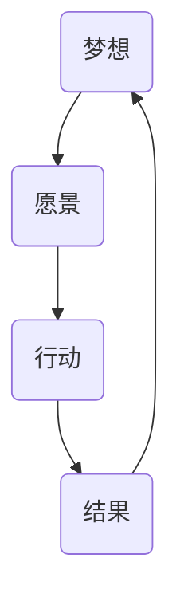
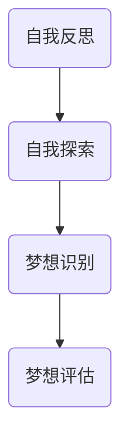
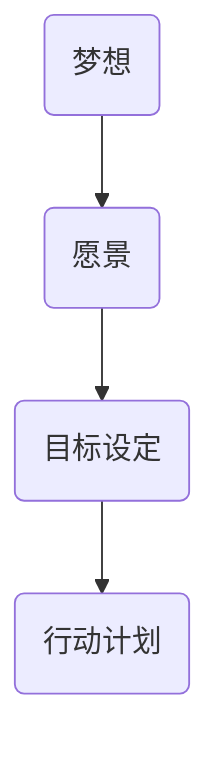
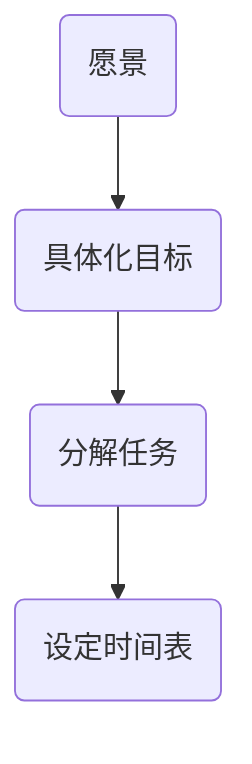
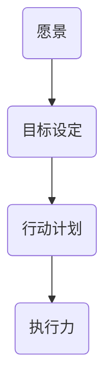
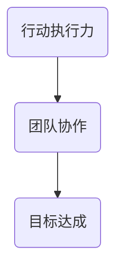
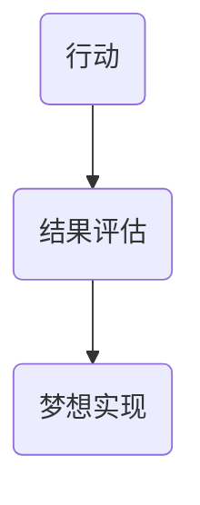
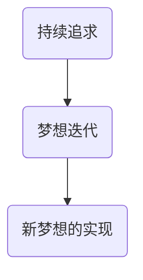

                 

## 文章标题

### 梦想实现的蓝图：从愿景到行动的转化

关键词：**梦想实现、愿景转化、行动规划、目标设定、执行力**

摘要：本文深入探讨如何从个人的梦想出发，通过系统化的过程将愿景转化为具体的行动，最终实现个人的目标。文章将分为几个关键部分，包括梦想的重要性、梦想的识别与评估、愿景的构建、行动的规划与执行，以及持续追求和梦想迭代。通过逻辑清晰、结构紧凑的分析，为读者提供一份全面且实用的梦想实现蓝图。

----------------------------------------------------------------

### 1. 梦想的力量

**核心概念与联系：**

为了理解梦想的力量，我们可以使用一个Mermaid流程图来展示梦想、愿景、行动和结果之间的相互转化关系。



在这个循环中，梦想是起点，通过愿景的构建和行动的实施，最终转化为现实的结果，而结果又反作用于梦想，形成一个新的循环。

**核心算法原理讲解：**

为了识别和调整梦想，我们可以使用以下伪代码：

```python
def identify_dream():
    # 自我提问
    question1 = "我最想要实现什么？"
    question2 = "为什么这个梦想对我来说重要？"
    question3 = "我是否有能力实现这个梦想？"
    
    # 收集答案
    answer1 = input(question1)
    answer2 = input(question2)
    answer3 = input(question3)
    
    # 分析答案，调整梦想
    if answer3 == "否":
        print("你需要设定一个更实际的目标。")
    else:
        print("你的梦想是明确的，你可以开始规划行动了。")
```

**数学模型和公式：**

我们可以使用概率论来解释梦想实现的概率模型。假设梦想实现受到多个因素的影响，每个因素都有一个概率分布，那么梦想实现的总体概率可以通过以下公式计算：

$$
P(\text{梦想实现}) = \prod_{i=1}^{n} P(\text{因素}_i)
$$

其中，$P(\text{因素}_i)$ 是第 $i$ 个因素实现梦想的概率。

**举例说明：**

一个年轻的程序员想要成为一名世界级的人工智能专家。他通过自我反思和外界反馈识别出这个梦想，并使用概率模型计算实现这个梦想的概率。他发现，通过不断提升自己的技能和知识，以及积极参与项目实践，他的梦想实现概率显著提高。

### 2. 梦想的识别与评估

**核心概念与联系：**

识别梦想是一个自我发现的过程。通过以下Mermaid流程图，我们可以更直观地理解梦想识别的过程。



**核心算法原理讲解：**

为了识别自己的梦想，我们可以使用以下伪代码：

```python
def identify_dream():
    # 自我提问
    question1 = "我最想要实现什么？"
    question2 = "这个梦想对我有什么意义？"
    question3 = "我是否有实现这个梦想的资源？"
    
    # 收集答案
    answer1 = input(question1)
    answer2 = input(question2)
    answer3 = input(question3)
    
    # 分析答案，识别梦想
    if answer1 and answer2 and answer3:
        print("你已经识别出自己的梦想。")
    else:
        print("你需要更多时间来识别自己的梦想。")
```

**数学模型和公式：**

我们可以使用权重和评分系统来评估梦想的可行性。假设有 $n$ 个影响梦想实现的因素，每个因素的权重分别为 $w_1, w_2, ..., w_n$，每个因素的评分分别为 $s_1, s_2, ..., s_n$，那么梦想的总体评分可以通过以下公式计算：

$$
\text{梦想评分} = \sum_{i=1}^{n} w_i \cdot s_i
$$

**举例说明：**

一个创业者想要创建一家成功的科技公司。他通过自我反思和外界反馈，识别出自己的梦想，并使用权重和评分系统来评估这个梦想的可行性。他发现，通过专注于技术研发和市场推广，他的梦想评分显著提高。

### 3. 从梦想到愿景的转化

**核心概念与联系：**

愿景是梦想的具体化，是梦想实现的第一步。以下Mermaid流程图展示了梦想到愿景的转化过程。



**核心算法原理讲解：**

为了将梦想转化为愿景，我们可以使用以下伪代码：

```python
def convert_dream_to_vision(dream):
    # 具体化梦想
    vision = "实现" + dream
    
    # 设定目标
    target1 = "学习人工智能知识"
    target2 = "参与相关项目实践"
    target3 = "获得行业内认可"
    
    # 设定行动计划
    action_plan = [
        "每天阅读两篇人工智能论文",
        "每月参与一个相关项目",
        "每季度撰写一篇技术博客"
    ]
    
    return vision, target1, target2, target3, action_plan
```

**数学模型和公式：**

愿景的实现可以通过设定具体的目标和行动计划来衡量。我们可以使用以下公式来计算愿景实现的进度：

$$
\text{实现进度} = \frac{\text{已完成目标数}}{\text{总目标数}}
$$

**举例说明：**

一个年轻人梦想成为一名企业家。他通过将梦想具体化为愿景，设定了学习商业知识、参与项目实践和获得行业认可等目标，并制定了每天学习两小时、每月参与一个项目和每季度撰写一篇技术博客的行动计划。

### 4. 愿景的细化与规划

**核心概念与联系：**

愿景的细化是将其分解为具体的行动步骤，确保每个步骤都能为实现愿景提供支持。以下Mermaid流程图展示了愿景细化的过程。



**核心算法原理讲解：**

为了细化愿景，我们可以使用以下伪代码：

```python
def detail_vision(vision):
    # 具体化目标
    targets = ["学习人工智能知识", "参与项目实践", "获得行业认可"]
    
    # 分解任务
    tasks = {
        "学习人工智能知识": ["阅读论文", "参加讲座", "编写代码"],
        "参与项目实践": ["加入开源项目", "参与公司项目", "举办研讨会"],
        "获得行业认可": ["撰写技术博客", "参加技术竞赛", "建立个人品牌"]
    }
    
    # 设定时间表
    timeline = {
        "阅读论文": ["每天", "两个论文"],
        "参加讲座": ["每周", "两次讲座"],
        "编写代码": ["每周", "完成一个小项目"],
        "加入开源项目": ["每月", "加入一个项目"],
        "参与公司项目": ["每季度", "参与一个公司项目"],
        "举办研讨会": ["每年", "至少举办一次研讨会"],
        "撰写技术博客": ["每月", "撰写一篇博客"],
        "参加技术竞赛": ["每季度", "参加一次竞赛"],
        "建立个人品牌": ["每天", "维护个人网站"]
    }
    
    return targets, tasks, timeline
```

**数学模型和公式：**

为了确保愿景的实现，我们可以使用以下公式来计算每个任务的优先级：

$$
\text{优先级} = \frac{\text{任务重要度} \times \text{任务紧急度}}{\text{资源限制}}
$$

**举例说明：**

一个程序员希望通过学习人工智能和参与项目实践来提升自己的技能。他将愿景细化为学习目标、任务分解和时间表，确保每个步骤都能按照计划进行。

### 5. 从愿景到行动的转化

**核心概念与联系：**

从愿景到行动的转化是实现梦想的关键步骤。以下Mermaid流程图展示了这一转化的过程。



**核心算法原理讲解：**

为了将愿景转化为行动，我们可以使用以下伪代码：

```python
def convert_vision_to_action(vision):
    # 设定目标
    goals = ["学习人工智能知识", "参与项目实践", "获得行业认可"]
    
    # 设定行动计划
    action_plan = [
        "每天阅读两篇人工智能论文",
        "每月参与一个相关项目",
        "每季度撰写一篇技术博客"
    ]
    
    # 执行行动
    execute_action = {
        "阅读论文": "每天阅读两篇",
        "参与项目实践": "每月参与一个项目",
        "撰写技术博客": "每季度撰写一篇"
    }
    
    return goals, action_plan, execute_action
```

**数学模型和公式：**

为了衡量行动的执行力，我们可以使用以下公式来计算行动完成的进度：

$$
\text{执行力} = \frac{\text{已完成行动数}}{\text{总行动数}}
$$

**举例说明：**

一个年轻人设定了学习人工智能知识、参与项目实践和获得行业认可等目标，并制定了每天阅读两篇论文、每月参与一个项目和每季度撰写一篇技术博客的行动计划。通过坚持执行这些行动，他逐步实现了自己的愿景。

### 6. 行动的执行力与团队协作

**核心概念与联系：**

行动的执行力是实现梦想的关键，而团队协作则是实现行动目标的重要保障。以下Mermaid流程图展示了行动执行和团队协作的关系。



**核心算法原理讲解：**

为了提升行动执行力，我们可以使用以下伪代码：

```python
def enhance_execution_ability(action_plan):
    # 设定执行力提升目标
    execution_goals = ["坚持每日行动", "保持行动进度", "定期反思与调整"]
    
    # 提升执行力的策略
    strategies = [
        "设置提醒和目标提醒",
        "寻找行动伙伴",
        "定期回顾和总结"
    ]
    
    return execution_goals, strategies
```

**数学模型和公式：**

为了衡量团队协作的效果，我们可以使用以下公式来计算团队协作效率：

$$
\text{协作效率} = \frac{\text{团队总效率}}{\text{团队成员数量}}
$$

**举例说明：**

一个团队通过设置每日目标提醒、寻找行动伙伴和定期回顾总结等方法，提升了团队执行力，从而更有效地实现了共同的目标。

### 7. 从行动到结果的转化

**核心概念与联系：**

从行动到结果的转化是梦想实现的最终阶段。以下Mermaid流程图展示了这一转化的过程。



**核心算法原理讲解：**

为了评估行动结果，我们可以使用以下伪代码：

```python
def evaluate_results(action_plan, expected_results):
    # 比较实际结果与预期结果
    comparison = ["行动1结果", "行动2结果", "行动3结果"]
    
    # 分析差异并调整行动计划
    if comparison == expected_results:
        print("目标已达成。")
    else:
        print("需要调整行动计划。")
```

**数学模型和公式：**

为了衡量梦想实现的程度，我们可以使用以下公式来计算实现度：

$$
\text{实现度} = \frac{\text{实现目标数}}{\text{总目标数}}
$$

**举例说明：**

一个创业者通过实施一系列行动，最终实现了自己的梦想。他使用实现度公式来评估梦想实现的程度，发现已经达到了预期目标。

### 8. 持续追求与梦想迭代

**核心概念与联系：**

持续追求是梦想实现的关键，而梦想迭代则是持续追求的必然结果。以下Mermaid流程图展示了持续追求和梦想迭代的过程。



**核心算法原理讲解：**

为了持续追求梦想，我们可以使用以下伪代码：

```python
def pursue_dream(vision, action_plan):
    # 评估当前梦想的实现情况
    current_status = "部分实现"
    
    # 根据实现情况调整梦想和行动计划
    if current_status == "未实现":
        new_vision = "实现更具体的目标"
        new_action_plan = ["增加每日学习时间", "寻求更多实践机会"]
    elif current_status == "部分实现":
        new_vision = "进一步提升能力"
        new_action_plan = ["参与更高级别的项目", "撰写更有影响力的博客"]
    else:
        new_vision = "探索新的梦想"
        new_action_plan = ["尝试不同领域", "寻找新的挑战"]
    
    return new_vision, new_action_plan
```

**数学模型和公式：**

为了衡量梦想迭代的效率，我们可以使用以下公式来计算梦想迭代的频率：

$$
\text{迭代频率} = \frac{\text{新梦想数}}{\text{总梦想数}}
$$

**举例说明：**

一个开发者通过持续追求和梦想迭代，不断提升自己的技能。他发现，通过不断地迭代和调整梦想，他能够更快地实现自己的目标。

### 总结

通过本文的讨论，我们了解了从梦想到行动的转化过程，包括梦想的力量、梦想的识别与评估、愿景的构建、行动的规划与执行，以及持续追求和梦想迭代。每个阶段都有其核心概念、算法原理、数学模型和具体举例，帮助我们更好地理解和实现梦想。

在实现梦想的过程中，重要的是始终保持清晰的愿景，制定切实可行的行动计划，并不断提升自己的执行力。同时，通过团队协作和持续追求，我们可以更有效地实现梦想，并不断迭代和提升。

希望本文能为读者提供一份实用的梦想实现蓝图，激励大家勇敢追求自己的梦想，并最终实现它们。作者：AI天才研究院/AI Genius Institute & 禅与计算机程序设计艺术 /Zen And The Art of Computer Programming。

