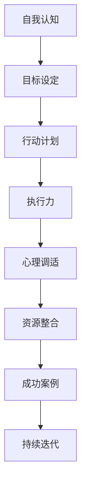
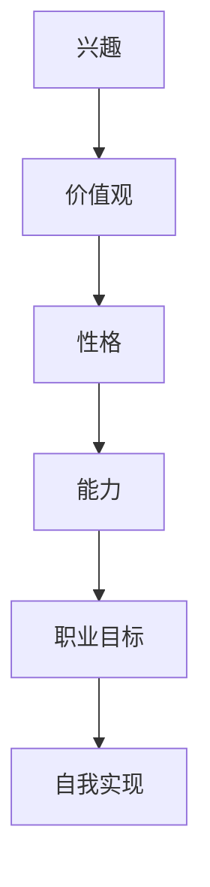

                 

### 文章标题

《梦想实现的蓝图：规划自我实现的路径》

关键词：自我实现，梦想，路径规划，目标设定，执行力，心理调适，资源整合，成功案例

摘要：本文旨在为读者提供一套完整的自我实现路径规划指南，从自我认知、目标设定、行动计划、心理调适、资源整合到成功案例，帮助读者逐步实现个人梦想。通过详细的案例分析、伪代码讲解和实用技巧，本文将引导读者走出迷茫，找到属于自己的梦想蓝图。

### 引言

在当今社会，面对竞争激烈的职场环境和日新月异的技术变革，越来越多的人意识到自我实现的重要性。然而，如何规划并实现个人梦想，却成为许多人面临的难题。本文将围绕这一主题，探讨如何通过系统的路径规划，实现自我价值的最大化。

#### 核心概念与联系

为了更好地理解本文的主题，我们可以使用Mermaid流程图来展示核心概念之间的联系：



Mermaid流程图展示了从自我认知到成功案例的完整路径，每一个环节都是实现自我实现的重要组成部分。

#### 核心算法原理讲解

在规划自我实现的路径中，目标设定是一个关键的环节。我们可以使用伪代码来详细阐述目标设定的算法原理：

```python
def set_goals(self, short_term_goals, long_term_goals):
    """
    设置目标的函数
    :param short_term_goals: 短期目标列表
    :param long_term_goals: 长期目标列表
    :return: 成功设置目标的标志
    """
    # 检查短期目标和长期目标的合理性
    if not self.is_reasonable_goals(short_term_goals, long_term_goals):
        return False
    
    # 将目标存储在系统中
    self.short_term_goals = short_term_goals
    self.long_term_goals = long_term_goals
    
    # 打印成功消息
    print("目标设置成功！")
    
    return True

def is_reasonable_goals(self, short_term_goals, long_term_goals):
    """
    检查目标是否合理的函数
    :param short_term_goals: 短期目标列表
    :param long_term_goals: 长期目标列表
    :return: 目标是否合理的标志
    """
    # 判断短期目标是否具体、可衡量、可实现
    for goal in short_term_goals:
        if not self.is_specific(goal) or not self.is_measurable(goal) or not self.is_achievable(goal):
            return False
    
    # 判断长期目标是否与个人价值观相符
    for goal in long_term_goals:
        if not self.is_aligned_with_values(goal):
            return False
    
    return True

def is_specific(self, goal):
    """
    检查目标是否具体的函数
    :param goal: 目标
    :return: 目标是否具体的标志
    """
    return goal is not None and len(goal) > 0

def is_measurable(self, goal):
    """
    检查目标是否可衡量的函数
    :param goal: 目标
    :return: 目标是否可衡量的标志
    """
    # 判断目标是否有具体的衡量标准
    return "measurable" in goal
    
def is_achievable(self, goal):
    """
    检查目标是否可实现的函数
    :param goal: 目标
    :return: 目标是否可实现的标志
    """
    # 判断目标是否在个人能力范围内
    return "achievable" in goal
    
def is_aligned_with_values(self, goal):
    """
    检查目标是否与个人价值观相符的函数
    :param goal: 目标
    :return: 目标是否与个人价值观相符的标志
    """
    # 判断目标是否与个人价值观相符
    return "aligned" in goal
```

上述伪代码展示了如何设定合理的目标。首先，我们需要检查短期目标和长期目标的合理性，包括具体性、可衡量性和可实现性。然后，将这些目标存储在系统中，并打印成功消息。

#### 数学模型和公式详解

在规划自我实现路径时，我们可以使用以下数学模型来评估目标的实现进度：

$$
\text{目标实现进度} = \frac{\text{已完成的任务数}}{\text{总任务数}}
$$

其中，已完成的任务数和总任务数可以通过时间跟踪和任务管理工具进行记录和计算。

此外，为了确保目标的实现，我们可以使用以下决策树模型来评估和调整目标：

```mermaid
graph TD
A[设定目标] --> B[评估目标]
B -->|实现进度> C{实现进度是否达到80%以上}
C -->|是> D[继续执行]
C -->|否> E[调整目标]
E -->|可行> F[重新设定目标]
F --> B
E -->|不可行> G[重新评估目标]
G --> B
```

通过这个决策树模型，我们可以根据目标实现的进度来决定是继续执行还是调整目标，从而确保目标的实现。

#### 举例说明

假设小明设定了一个短期目标：在三个月内学习一门新编程语言。为了实现这个目标，小明可以按照以下步骤进行：

1. **目标设定**：小明使用本文提供的目标设定算法，设定了具体、可衡量、可实现的学习目标。

2. **时间规划**：小明根据目标，制定了详细的学习计划，每天分配一定的时间进行学习。

3. **执行计划**：小明按照计划，每天按时学习，并记录已完成的任务数。

4. **进度评估**：一个月后，小明使用目标实现进度公式，计算出自己完成目标的进度。

5. **决策调整**：根据进度评估的结果，小明发现进度落后于预期，于是调整了学习计划，增加了每天的学习时间。

通过这个案例，我们可以看到，通过合理的目标设定和执行计划，小明能够逐步实现自己的学习目标。

#### 小结

在本文中，我们介绍了如何规划自我实现的路径，包括自我认知、目标设定、行动计划、执行力、心理调适、资源整合和成功案例。通过伪代码和数学模型，我们详细讲解了核心算法原理。举例说明部分展示了如何将理论应用到实际中。接下来的章节将深入探讨这些主题，提供更详细的指导和建议。

### 第1章：自我认知的旅程

自我认知是规划自我实现路径的第一步，也是最重要的一步。只有深刻理解自己的兴趣、价值观和职业目标，我们才能制定出真正符合自己需求的目标，并为之努力奋斗。

#### 背景介绍

自我认知，即自我认识或自我了解，是指一个人对自己的性格、能力、需求、价值观等方面的认知和了解。自我认知的深度和广度决定了一个人自我实现的水平和质量。

在职场和生活中，自我认知的重要性体现在以下几个方面：

1. **明确职业方向**：了解自己的兴趣和擅长领域，有助于找到适合自己的职业道路，避免盲目跟风或无效努力。
2. **提升工作效率**：明确自己的价值观和优先级，有助于在工作和生活中做出更加明智的决策，提高工作效率。
3. **建立人际关系**：理解自己的性格特点，有助于更好地与他人沟通和合作，建立和谐的人际关系。
4. **自我激励**：了解自己的需求和动机，有助于找到持续努力的动力源泉，保持积极的心态。

#### 核心概念与联系

为了更好地理解自我认知的重要性，我们可以使用Mermaid流程图展示核心概念之间的联系：



这个流程图展示了兴趣、价值观、性格、能力、职业目标和自我实现之间的内在联系。每一个环节都是自我实现的重要组成部分，相互影响、相互促进。

#### 内在动机的探索

内在动机是指个体内部产生的、驱使个体进行某种活动的动力。内在动机对自我实现具有重要作用，因为它能够激发个体的热情和兴趣，使个体更加积极主动地追求目标。

以下是几种常见的内在动机：

1. **兴趣**：兴趣是最好的老师。当我们对某项活动产生兴趣时，我们会主动去了解、学习和探索，从而提高自我实现的可能性。
2. **成就感**：成就感是一种内在动机，它来源于个体在实现某个目标或完成任务后所获得的满足感。成就感能够激励个体继续努力，追求更高的目标。
3. **好奇心**：好奇心驱动个体探索未知世界，寻求新的知识和技能。好奇心是推动个体成长和自我实现的重要动力。
4. **价值观**：个体的价值观决定了他们追求的目标和生活的意义。当个体的内在动机与价值观一致时，他们更有可能全力以赴地追求目标。

以下是探索内在动机的步骤：

1. **自我反思**：花时间思考自己在过去一段时间内，对哪些活动感到最有热情和兴趣。这些活动可能就是你的内在动机所在。
2. **记录和总结**：将思考结果记录下来，并进行分析和总结。通过总结，你可以更好地了解自己的内在动机，并找到激发这些动机的方法。
3. **尝试和探索**：根据总结出的内在动机，尝试参与相关活动，看看是否能激发你的热情和动力。通过实践，你可以进一步确认和强化内在动机。

#### 个人价值观的梳理

个人价值观是指个体对生活中各种事物和行为的评判标准。个人价值观决定了我们的行为模式、决策方式和人际关系。了解和梳理个人价值观对于自我实现至关重要。

以下是梳理个人价值观的步骤：

1. **自我反思**：花时间思考自己在面对各种情境时，优先考虑的因素是什么。这些因素可能反映了你的个人价值观。
2. **记录和分类**：将反思结果记录下来，并按照相似性进行分类。通过分类，你可以更好地了解自己的主要价值观。
3. **评估和调整**：评估你的个人价值观是否符合你的长远目标和生活意义。如果需要，可以进行调整和优化。

以下是几种常见的个人价值观：

1. **成就**：追求卓越，追求卓越和成功，对自己的表现有高标准和要求。
2. **家庭**：重视家庭，把家庭看作是生活的重心，愿意为家庭付出努力和时间。
3. **自由**：追求自由，愿意冒险和尝试新事物，不喜欢被束缚和限制。
4. **诚信**：重视诚信，认为诚实和正直是做人的基本原则，愿意为此付出代价。

#### 职业兴趣的识别

职业兴趣是指个体对特定职业或工作内容所产生的兴趣和热情。职业兴趣与内在动机密切相关，是我们在职业生涯中持续投入和成长的重要动力。

以下是识别职业兴趣的步骤：

1. **自我反思**：花时间思考自己在过去的工作和学习中，对哪些领域或任务感到最感兴趣和有成就感。这些领域可能就是你的职业兴趣所在。
2. **职业测评**：通过职业测评工具，如MBTI（Myers-Briggs Type Indicator）或Holland职业兴趣测试，了解自己的职业倾向。
3. **实践和探索**：根据自我反思和职业测评结果，尝试参与相关的工作或实习，看看是否能激发你的职业兴趣。通过实践，你可以进一步确认和强化职业兴趣。

以下是几种常见的职业兴趣：

1. **技术**：喜欢解决问题，对技术感兴趣，愿意学习新技能。
2. **管理**：喜欢组织和协调，对管理感兴趣，愿意承担责任。
3. **创意**：喜欢创造和表达，对创意和设计感兴趣。
4. **服务**：喜欢帮助他人，对社会服务感兴趣。

#### 小结

自我认知是规划自我实现路径的第一步，包括探索内在动机、梳理个人价值观和识别职业兴趣。通过自我反思、记录和总结，我们可以更好地了解自己，从而制定出符合自己需求的目标和计划。在接下来的章节中，我们将进一步探讨目标设定、行动计划和心理调适等方面的内容。

### 第2章：目标设定的艺术

在自我认知的基础上，设定明确的目标是实现自我实现的关键一步。一个明确、具体且可实现的目标可以引导我们的行动，激励我们不断前进。本章将探讨目标设定的艺术，包括目标的重要性、短期与长期目标的设定，以及SMART原则。

#### 目标的重要性

目标设定是规划自我实现路径的核心环节。一个明确的目标能够为我们提供方向和动力，使我们更加专注和高效地实现个人价值。

目标的重要性体现在以下几个方面：

1. **提供方向**：明确的目标为我们指明了前进的方向，避免了盲目行动和无效努力。
2. **激励动力**：目标能够激发我们的内在动机和积极性，让我们更有动力去实现目标。
3. **衡量进度**：通过目标设定，我们可以衡量自己实现目标的进度，及时进行调整和优化。
4. **增强自律**：设定目标需要我们制定计划并严格执行，这有助于提高自律能力，培养良好的生活习惯。

#### 短期与长期目标的设定

在目标设定过程中，我们需要区分短期目标和长期目标。短期目标通常是指在短时间内（如几个月或一年内）可以完成的目标，而长期目标则是指需要较长时间（如几年或几十年）才能实现的目标。

设定短期和长期目标的重要性体现在以下几个方面：

1. **逐步实现**：通过设定短期和长期目标，我们可以将大目标分解为多个小目标，逐步实现，避免因目标过于遥远而感到沮丧和无力。
2. **激励持续**：短期目标的实现可以为我们带来及时的成就感和动力，使我们更有信心和决心去实现长期目标。
3. **保持灵活**：在实现短期目标的过程中，我们可能会遇到一些意外情况，通过设定短期目标，我们可以根据实际情况进行调整，保持目标的灵活性。

以下是设定短期和长期目标的步骤：

1. **自我反思**：花时间思考自己的兴趣、价值观和职业目标，明确自己想要实现的目标。
2. **分解目标**：将大目标分解为短期和长期目标，确保每个目标都具体、可衡量、可实现。
3. **制定计划**：为每个目标制定详细的行动计划，包括具体的行动步骤、时间安排和资源需求。
4. **设定截止日期**：为每个目标设定明确的截止日期，以确保目标的实现。
5. **持续跟踪**：定期检查目标的进度，根据实际情况进行调整和优化。

#### SMART原则

SMART原则是一种常用的目标设定方法，它要求目标具有以下五个特点：具体（Specific）、可衡量（Measurable）、可实现（Achievable）、相关（Relevant）和有时限（Time-bound）。

1. **具体（Specific）**：目标需要明确、具体，避免模糊和抽象。例如，“提高销售业绩”不如“增加每月销售额10%”具体。
2. **可衡量（Measurable）**：目标需要具有可衡量的标准，以便我们能够了解目标的进展情况。例如，“增加每月销售额10%”可以通过销售数据来衡量。
3. **可实现（Achievable）**：目标需要是实际可行的，避免设定过高或过低的目标。例如，“在一个月内卖出1000台产品”可能过于困难，而“在一个月内卖出50台产品”则更加实际。
4. **相关（Relevant）**：目标需要与我们的长期目标和价值观相关，确保目标的实现有助于我们的自我实现。例如，“成为一名优秀的学生”与我们的职业目标相关，而“参加一场演唱会”则与我们的目标关系不大。
5. **有时限（Time-bound）**：目标需要设定明确的截止日期，以确保我们能够在规定的时间内实现目标。例如，“在2023年底前完成一项重要项目”。

以下是一个符合SMART原则的目标示例：

**目标**：在2023年底前，提高个人销售额10%。

**解释**：

- **具体（Specific）**：目标明确了提高销售额的具体数值和时间段。
- **可衡量（Measurable）**：目标的实现可以通过销售额数据来衡量。
- **可实现（Achievable）**：目标设定在合理的时间范围内，是实际可行的。
- **相关（Relevant）**：提高销售额与个人职业发展目标相关。
- **有时限（Time-bound）**：目标设定了明确的截止日期，确保在规定时间内实现。

#### 小结

目标设定是实现自我实现的重要步骤。通过明确、具体且可实现的目标，我们可以为自我实现提供方向和动力。SMART原则为我们提供了一种实用的目标设定方法，通过遵循这一原则，我们可以更好地实现个人目标。在接下来的章节中，我们将进一步探讨如何制定行动计划和提升执行力。

### 第3章：行动计划的制定

在设定了明确的目标之后，制定行动计划是实现这些目标的关键。一个良好的行动计划能够帮助我们将目标分解为具体的任务，并提供明确的执行步骤和时间表。本章将探讨如何制定有效的行动计划，包括任务分解、资源配置和优先级排序。

#### 任务分解

任务分解是将大目标分解为一系列具体、可操作的任务的过程。通过任务分解，我们可以将复杂的任务变得具体和可管理，从而更容易实现。

以下是任务分解的步骤：

1. **明确目标**：首先，我们需要明确我们要实现的目标。这个目标应该是具体、可衡量和有挑战性的。
2. **列出任务**：将目标分解为一系列具体任务。每个任务都应该明确、具体，并且能够单独完成。
3. **任务分类**：将任务按照性质和优先级进行分类。例如，可以将任务分为主要任务、次要任务和紧急任务。
4. **任务细分**：对于复杂任务，可以进一步分解为子任务。这样，每个子任务都更加具体和可操作。

以下是一个任务分解的示例：

**目标**：在三个月内完成一项软件开发项目。

**分解任务**：

- 研究需求和设计系统架构
- 编写需求文档
- 进行系统设计
- 完成前端开发
- 完成后端开发
- 进行系统测试和调试
- 部署上线

#### 资源配置

在制定行动计划时，我们需要考虑所需的资源，包括人力、物力和财力。有效的资源配置能够确保我们能够顺利完成任务。

以下是资源配置的步骤：

1. **资源评估**：首先，我们需要评估实现目标所需的资源。这些资源包括人员、设备、资金等。
2. **资源匹配**：将资源与任务匹配，确保每个任务都有足够的资源支持。
3. **资源优化**：在资源有限的情况下，我们需要优化资源配置，确保资源利用最大化。

以下是一个资源配置的示例：

**目标**：在三个月内完成一项软件开发项目。

**资源配置**：

- **人力资源**：两名前端开发人员，两名后端开发人员，一名测试工程师，一名项目经理。
- **物力资源**：开发设备（如电脑、服务器等），测试设备（如测试服务器、网络设备等）。
- **财力资源**：项目预算（如人员工资、设备采购等）。

#### 优先级排序

在制定行动计划时，我们需要对任务进行优先级排序，确保我们能够按照正确的顺序完成任务。优先级排序可以基于任务的紧急程度、重要性、资源需求等因素。

以下是优先级排序的步骤：

1. **确定关键任务**：首先，我们需要确定哪些任务对实现目标至关重要，这些任务应该优先完成。
2. **评估紧急程度**：对于多个关键任务，我们需要评估其紧急程度，确保紧急任务优先完成。
3. **调整优先级**：根据实际情况和资源情况，对任务优先级进行调整，确保任务能够按计划完成。

以下是一个优先级排序的示例：

**目标**：在三个月内完成一项软件开发项目。

**优先级排序**：

- 系统设计
- 前端开发
- 后端开发
- 系统测试和调试
- 需求文档编写

#### 制定具体可行的行动计划

在完成任务分解、资源配置和优先级排序后，我们可以开始制定具体的行动计划。行动计划应包括每个任务的执行步骤、责任人、时间表和资源需求。

以下是制定行动计划的具体步骤：

1. **制定任务清单**：列出所有任务，并确保每个任务都具体、可操作。
2. **分配责任人**：为每个任务分配责任人，确保任务有人负责。
3. **设定时间表**：为每个任务设定明确的时间表，确保任务能够按计划完成。
4. **配置资源**：为每个任务配置所需的资源，确保资源能够及时到位。
5. **监控和调整**：在执行过程中，定期检查任务的进度，根据实际情况进行调整。

以下是一个行动计划的具体示例：

**任务清单**：

- 系统设计（1周）
- 前端开发（2周）
- 后端开发（3周）
- 系统测试和调试（1周）
- 需求文档编写（1周）

**责任人**：

- 系统设计：项目经理
- 前端开发：前端开发人员
- 后端开发：后端开发人员
- 系统测试和调试：测试工程师
- 需求文档编写：项目经理

**时间表**：

- 第1周：系统设计
- 第2-3周：前端开发
- 第4-5周：后端开发
- 第6周：系统测试和调试
- 第7周：需求文档编写

**资源需求**：

- 人员：项目经理、前端开发人员、后端开发人员、测试工程师
- 设备：开发设备、测试设备
- 资金：项目预算

#### 小结

制定行动计划是实现目标的重要步骤。通过任务分解、资源配置和优先级排序，我们可以将目标具体化、可操作化，并为每个任务提供明确的执行步骤和时间表。一个良好的行动计划能够帮助我们更加高效地实现目标。在接下来的章节中，我们将进一步探讨如何提升执行力和应对挑战。

### 第4章：执行力的提升

执行力是衡量个人能力和成就的关键因素之一。一个具备强大执行力的人能够有效地将计划转化为实际成果，从而实现个人目标和梦想。本章将探讨如何提升执行力，包括培养良好习惯、克服拖延与自我怀疑以及持续反馈与调整。

#### 培养良好习惯

良好的习惯是提升执行力的重要基石。通过培养良好的习惯，我们可以建立稳定的日常行为模式，提高工作效率和自律性。

以下是培养良好习惯的步骤：

1. **明确目标**：首先，我们需要明确自己要培养的良好习惯。这些习惯应该是具体、可衡量和有意义的。
2. **制定计划**：为培养新习惯制定详细的计划，包括每天或每周需要完成的任务和时间表。
3. **逐步实施**：从简单任务开始，逐步增加难度和复杂度。通过逐步实施，我们可以更好地适应新习惯。
4. **坚持和持续**：坚持和持续是培养良好习惯的关键。我们需要持续努力，直到新习惯变成自然而然的行为。

以下是一个培养良好习惯的示例：

**目标**：每天早晨进行30分钟的有氧运动。

**计划**：

- **明确目标**：每天早晨进行30分钟的有氧运动。
- **制定计划**：每天早晨6:00起床，6:30开始进行有氧运动。
- **逐步实施**：从简单的快走开始，逐渐增加运动强度和时间。
- **坚持和持续**：每天早晨按时起床并进行运动，即使遇到困难也要坚持。

#### 克服拖延与自我怀疑

拖延和自我怀疑是提升执行力的主要障碍。通过克服这些障碍，我们可以更加自信和高效地完成任务。

以下是克服拖延和自我怀疑的步骤：

1. **分析原因**：首先，我们需要分析拖延和自我怀疑的原因。这些原因可能包括恐惧、压力、缺乏动力等。
2. **制定解决方案**：针对分析出的原因，制定具体的解决方案。例如，如果恐惧导致拖延，可以尝试逐步面对恐惧，提高自信心。
3. **实施解决方案**：将解决方案付诸实践，并持续跟踪效果。通过不断调整和优化，我们可以找到最有效的解决方案。
4. **积极心态**：保持积极的心态，相信自己能够克服拖延和自我怀疑。积极心态有助于我们更好地应对挑战和困难。

以下是一个克服拖延和自我怀疑的示例：

**目标**：克服拖延，按时完成项目任务。

**解决方案**：

- **分析原因**：拖延的原因是缺乏动力和目标不明确。
- **制定解决方案**：制定明确的目标和时间表，提高项目完成的动力。
- **实施解决方案**：每天制定具体的任务和时间表，按时完成并记录进展。
- **积极心态**：相信自己能够按时完成任务，即使遇到困难也要保持积极心态。

#### 持续反馈与调整

持续反馈与调整是实现目标的重要环节。通过定期反馈和调整，我们可以及时发现问题，并采取纠正措施，确保目标的实现。

以下是持续反馈与调整的步骤：

1. **设定反馈机制**：首先，我们需要设定一个反馈机制，包括反馈的频率和方式。例如，每周进行一次项目进度会议，及时了解任务进展情况。
2. **收集反馈信息**：通过多种方式收集反馈信息，包括自评、同事评价、客户反馈等。这些信息可以帮助我们了解任务的完成情况。
3. **分析反馈信息**：对收集到的反馈信息进行分析，识别问题和改进点。
4. **调整计划**：根据分析结果，调整行动计划和资源分配，确保任务能够按计划完成。
5. **持续跟踪**：在调整后，持续跟踪任务进展，确保改进措施的有效性。

以下是一个持续反馈与调整的示例：

**目标**：在一个月内完成一项软件开发项目。

**反馈机制**：

- **设定反馈机制**：每周进行一次项目进度会议，每次会议总结上周的工作进展，讨论存在的问题和改进措施。
- **收集反馈信息**：从项目经理、开发人员、测试工程师等各方收集反馈信息，了解任务完成情况和存在的问题。
- **分析反馈信息**：根据反馈信息，分析任务进展情况，识别存在的问题和改进点。
- **调整计划**：根据分析结果，调整任务分配和资源使用，确保任务能够按计划完成。
- **持续跟踪**：在调整后，每周进行项目进度会议，持续跟踪任务进展，确保改进措施的有效性。

#### 小结

提升执行力是实现自我实现的重要环节。通过培养良好习惯、克服拖延和自我怀疑，以及持续反馈与调整，我们可以有效地提高执行力，确保目标的实现。在接下来的章节中，我们将探讨如何保持积极的心态，应对实现梦想过程中的挑战。

### 第5章：心理调适的艺术

在实现自我实现的路径上，心理调适是至关重要的。面对各种挑战和压力，保持积极的心态和强大的心理韧性，能够帮助我们更好地应对困难，持续前进。本章将探讨如何进行心理调适，包括应对压力与挫折、增强心理韧性和保持积极心态的策略。

#### 应对压力与挫折

压力和挫折是每个人在实现梦想过程中不可避免的现象。适度的压力可以激发我们的潜能，但过度的压力和持续的挫折则可能导致焦虑、抑郁等心理问题。因此，学会应对压力和挫折是心理调适的重要一环。

以下是应对压力与挫折的步骤：

1. **认识压力来源**：首先，我们需要明确压力的来源。压力可能来自工作、人际关系、生活变化等各个方面。通过认识压力来源，我们可以有针对性地进行应对。
2. **情绪管理**：在面对压力时，我们需要学会管理自己的情绪。可以通过深呼吸、冥想、运动等方式，缓解紧张和焦虑情绪。
3. **积极思考**：改变对压力和挫折的看法，从积极的角度去看待挑战。例如，将挫折视为成长和学习的机会，而不是失败的标志。
4. **寻求支持**：与亲朋好友、同事或专业人士交流，分享自己的感受和困惑。寻求支持可以帮助我们减轻心理负担，获得新的视角和建议。

以下是一个应对压力与挫折的示例：

**目标**：在一个月内完成一项重要工作。

**情况**：由于工作繁忙，小明感到很大的压力，担心无法按时完成任务。

**应对策略**：

- **认识压力来源**：小明认识到压力主要来自工作任务的量和时间限制。
- **情绪管理**：小明通过每天进行30分钟的运动来缓解压力，通过深呼吸和冥想来放松心情。
- **积极思考**：小明告诉自己，虽然任务重要且紧张，但这是一个成长和提升的机会。
- **寻求支持**：小明与同事交流，讨论任务分工和进度安排，寻求他们的意见和建议。

#### 增强心理韧性

心理韧性是指个体在面对压力、挑战和逆境时的适应能力。具备强大心理韧性的人能够在困境中保持冷静和乐观，迅速恢复并继续前进。

以下是增强心理韧性的步骤：

1. **自我反思**：花时间反思自己的经历，特别是面对困难和挫折时的感受和反应。通过自我反思，我们可以了解自己的心理韧性水平，并找到提升的方法。
2. **积极心态**：培养积极的心态，相信自己的能力和潜力。积极心态有助于我们更好地应对挑战和逆境。
3. **应对策略**：学习应对压力和挫折的有效策略，如情绪管理、时间管理和应对技巧。这些策略可以帮助我们在面对困难时保持冷静和理性。
4. **培养兴趣爱好**：培养兴趣爱好和社交活动，增强生活的乐趣和意义。兴趣爱好和社交活动能够为我们提供额外的心理支持和动力。

以下是一个增强心理韧性的示例：

**目标**：在学业和职业压力下保持心理健康。

**情况**：小李在学业和职业上面临很大的压力，担心心理健康受到影响。

**增强心理韧性策略**：

- **自我反思**：小李通过写日记的方式记录自己的感受和想法，了解自己的心理状态。
- **积极心态**：小李告诉自己，压力是成长的机会，他有能力克服困难。
- **应对策略**：小李学会了时间管理和情绪管理技巧，如制定日程表、分解任务和进行冥想。
- **培养兴趣爱好**：小李开始定期练习瑜伽和参加读书会，增强生活的乐趣和意义。

#### 保持积极心态

保持积极心态是实现自我实现的重要动力。积极心态能够激发我们的内在动机，增强自信心和毅力，帮助我们克服各种困难和挑战。

以下是保持积极心态的策略：

1. **设定小目标**：通过设定小目标，我们可以不断获得成就感，增强自信心和积极性。小目标应该具体、可衡量和可实现。
2. **感恩与感激**：培养感恩和感激的心态，关注生活中的美好和收获。通过感恩，我们可以更加珍惜现有的一切，减少抱怨和负面情绪。
3. **正面思考**：学会从积极的角度看待问题，将挑战视为成长的机会。正面思考有助于我们保持乐观和自信。
4. **保持健康的生活方式**：保持健康的生活方式，如合理饮食、适量运动和充足睡眠，有助于改善心理健康和情绪状态。

以下是一个保持积极心态的示例：

**目标**：在职业晋升过程中保持积极心态。

**情况**：小王在申请晋升过程中面临很大的压力，担心无法实现目标。

**保持积极心态策略**：

- **设定小目标**：小王将晋升目标分解为一系列小目标，如完成关键项目、提升专业技能等。
- **感恩与感激**：小王感谢领导和同事的支持和帮助，将感恩的心态转化为行动。
- **正面思考**：小王告诉自己，晋升是职业发展的一个重要步骤，他将通过努力和准备实现目标。
- **保持健康的生活方式**：小王通过合理饮食、适量运动和充足睡眠，保持身体健康和精神状态良好。

#### 小结

心理调适是实现自我实现的重要环节。通过应对压力与挫折、增强心理韧性和保持积极心态，我们可以更好地应对实现梦想过程中的挑战。在接下来的章节中，我们将探讨如何利用外部资源（如教育、人脉、资金等）来实现个人目标。

### 第6章：人脉的建立与维护

在实现自我实现的过程中，人脉的建立与维护是至关重要的。一个强大的人脉网络能够为我们提供资源、机会和支持，帮助我们克服困难，实现个人目标。本章将探讨如何建立和维护有效的人脉，包括人脉的重要性、建立有效人脉的技巧和人脉关系的维护与深化。

#### 人脉的重要性

人脉，即人际关系网络，是我们与他人之间建立的联系和互动。一个强大的人脉网络可以带来以下几方面的好处：

1. **资源获取**：通过人脉网络，我们可以获取各种资源，如信息、知识、资金、技术等。这些资源有助于我们实现个人目标，提升自身能力。
2. **机会发现**：人脉网络能够为我们提供更多的机会，如工作机会、合作机会、项目机会等。通过人脉，我们可以了解到更多的信息和动态，抓住机会。
3. **支持系统**：人脉网络可以成为我们的支持系统，当我们遇到困难或挑战时，可以得到他人的帮助和支持，帮助我们度过难关。
4. **个人成长**：通过与不同的人建立联系和互动，我们可以学习到更多的知识和经验，提升自身的能力和素质。

#### 建立有效人脉的技巧

建立有效人脉需要技巧和策略。以下是一些建立有效人脉的技巧：

1. **主动拓展**：主动与他人建立联系，积极参加各类社交活动，如行业会议、研讨会、社交聚会等。通过主动拓展，我们可以结识更多的朋友和合作伙伴。
2. **倾听与交流**：在与人交往时，要学会倾听对方的意见和需求，并主动分享自己的经验和见解。倾听和交流能够建立信任和共鸣，加深人际关系。
3. **互惠互利**：建立人脉需要互惠互利的原则。在与人交往时，不仅要关注自己的利益，还要考虑对方的利益和需求。通过互惠互利，我们可以建立长期稳定的合作关系。
4. **保持联系**：建立人脉后，要保持联系和互动。可以通过电话、邮件、社交媒体等方式，定期与朋友和合作伙伴保持联系，维护关系的稳定性。

以下是一个建立有效人脉的示例：

**目标**：在两个月内建立10个有效人脉关系。

**策略**：

- **主动拓展**：参加一个行业会议，结识5个新朋友。
- **倾听与交流**：在会议期间，主动与朋友交流，了解他们的需求和兴趣。
- **互惠互利**：在交流中，发现彼此的需求和利益点，达成合作意向。
- **保持联系**：在会议结束后，通过电话和邮件与朋友保持联系，分享最新的动态和资源。

#### 人脉关系的维护与深化

建立人脉关系只是第一步，维护和深化关系同样重要。以下是一些维护和深化人脉关系的技巧：

1. **持续交流**：通过定期交流，保持与朋友的联系。可以是通过电话、邮件、社交媒体等方式，分享生活中的点滴和工作的进展。
2. **提供帮助**：在朋友需要帮助时，主动提供支持和帮助。通过实际行动，展现自己的价值和信任。
3. **参与活动**：参加朋友组织的活动，如聚会、旅行、项目合作等。通过参与活动，加深彼此的了解和信任。
4. **保持真实**：在维护人脉关系时，要保持真实和真诚。不要为了利益而伪装自己，真诚的交流能够建立更稳固的关系。

以下是一个维护和深化人脉关系的示例：

**目标**：在一年内与5个重要朋友保持紧密联系。

**策略**：

- **持续交流**：每月通过电话和邮件与朋友保持联系，分享自己的工作和生活动态。
- **提供帮助**：在朋友需要帮助时，主动提供支持和建议。
- **参与活动**：每年参加朋友组织的2次活动，加深彼此的了解和信任。
- **保持真实**：在交流中保持真实和真诚，展现自己的个性和价值观。

#### 小结

人脉的建立与维护是实现自我实现的重要资源。通过主动拓展、倾听与交流、互惠互利和保持联系，我们可以建立有效的人脉网络。在维护和深化人脉关系时，持续交流、提供帮助、参与活动和保持真实是关键。在接下来的章节中，我们将探讨如何利用外部资源（如教育、人脉、资金等）来实现个人目标。

### 第7章：外部资源的利用

在实现自我实现的过程中，外部资源的利用是至关重要的。外部资源包括教育、人脉和资金等，它们能够为我们的成长和发展提供支持和帮助。本章将探讨如何有效地利用外部资源，包括教育资源的优化、资金的筹集与管理，以及政策与法规的利用。

#### 教育资源的优化

教育资源是我们成长和发展的重要基础。通过优化教育资源，我们可以提高学习效率，增强自身能力。

以下是优化教育资源的步骤：

1. **明确学习目标**：首先，我们需要明确自己的学习目标。这个目标可以是提升专业技能、学习新知识或获得更高学历等。
2. **选择合适的学习方式**：根据学习目标和资源情况，选择合适的学习方式。例如，可以选择线上学习、线下课程或自学等。
3. **制定学习计划**：为学习制定详细的计划，包括学习内容、时间安排和学习资源。通过计划，我们可以更加系统地学习和掌握知识。
4. **利用在线资源**：利用互联网上的各种教育资源，如在线课程、学术论文、教育论坛等。这些资源可以为我们提供丰富的学习材料和交流平台。
5. **参与学术活动**：参加学术会议、研讨会、讲座等活动，与专家学者交流，了解最新的研究动态和前沿知识。

以下是一个优化教育资源的示例：

**目标**：提升数据科学技能。

**步骤**：

- **明确学习目标**：提升数据科学技能，包括数据分析、机器学习和数据可视化等方面。
- **选择合适的学习方式**：报名参加一个线上数据科学课程，同时自学相关教材和论文。
- **制定学习计划**：每周安排固定的学习时间，制定详细的学习内容和进度。
- **利用在线资源**：通过Coursera、edX等在线教育平台，学习相关课程和资源。
- **参与学术活动**：参加数据科学相关的学术会议和研讨会，与同行交流。

#### 资金的筹集与管理

资金是实现自我实现的重要保障。通过有效的资金筹集和管理，我们可以确保资源的充分利用。

以下是筹集和管理的步骤：

1. **确定资金需求**：首先，我们需要明确实现目标所需的资金。这包括学费、设备采购、项目启动资金等。
2. **制定筹资计划**：根据资金需求，制定详细的筹资计划。筹资方式可以包括个人储蓄、借款、投资人、众筹等。
3. **寻求资金支持**：通过多种渠道寻求资金支持，如银行贷款、政府补贴、投资人、公益组织等。
4. **资金管理**：在筹集到资金后，我们需要进行有效的管理，确保资金的安全和合理使用。可以通过设立专门的资金账户、制定资金使用计划、定期审计等方式进行管理。
5. **资金回报**：通过有效的资金管理和项目实施，争取获得良好的资金回报，为未来的发展提供支持。

以下是一个资金筹集和管理的示例：

**目标**：开展一项创新项目。

**步骤**：

- **确定资金需求**：项目启动资金为50万元，包括设备采购、人力成本和营销费用。
- **制定筹资计划**：通过个人储蓄筹集20万元，申请政府补贴10万元，寻找投资人投资10万元。
- **寻求资金支持**：与银行联系，申请贷款；与潜在投资人交流，争取投资。
- **资金管理**：设立项目资金账户，制定资金使用计划，定期进行审计。
- **资金回报**：通过项目成功实施，争取获得投资回报，为未来项目提供资金支持。

#### 政策与法规的利用

政策与法规为我们的成长和发展提供了良好的环境和保障。通过充分利用政策与法规，我们可以获得更多的支持和机会。

以下是利用政策与法规的步骤：

1. **了解政策法规**：首先，我们需要了解与自身发展相关的政策与法规。可以通过政府网站、专业机构、媒体报道等途径获取相关信息。
2. **政策匹配**：将自身的发展需求与政策法规进行匹配，找到适合自己的政策优惠和支持措施。
3. **申请优惠政策**：根据政策法规，申请相应的优惠和支持。例如，申请创业补贴、税收减免、资金支持等。
4. **遵守法规**：在利用政策与法规时，要严格遵守相关法规和规定，确保合法合规。
5. **政策反馈**：在利用政策与法规的过程中，及时反馈问题和建议，推动政策与法规的完善和改进。

以下是一个利用政策与法规的示例：

**目标**：获得政府创业补贴。

**步骤**：

- **了解政策法规**：了解当地政府关于创业补贴的政策和申请条件。
- **政策匹配**：评估自身的创业项目是否符合申请条件。
- **申请优惠政策**：按照政策要求，准备申请材料，提交创业补贴申请。
- **遵守法规**：确保项目运营合法合规，遵守相关法规和规定。
- **政策反馈**：在项目运营过程中，及时反馈问题和建议，推动政策与法规的完善和改进。

#### 小结

外部资源的利用是实现自我实现的重要环节。通过优化教育资源、筹集和管理资金，以及充分利用政策与法规，我们可以为自身的发展提供有力的支持和保障。在接下来的章节中，我们将通过成功案例的分享，为读者提供实现梦想的启示。

### 第8章：成功案例的探索

成功案例是我们在实现自我实现过程中重要的学习资源和启示。通过分析成功人士的经验，我们可以了解他们如何规划路径、克服困难，最终实现梦想。本章将分享一些成功案例，并分析他们的经验和教训，为读者提供实现梦想的启示。

#### 成功案例1：李华的创业之路

李华是一位年轻的企业家，他在大学期间创办了一家专注于环保技术的公司。以下是他创业过程中的一些关键步骤和经验：

1. **自我认知**：李华在大学期间明确了自己的兴趣和价值观，意识到自己对环保技术有浓厚的兴趣。他通过参加相关课程和实践活动，进一步加深了对环保技术的了解和热爱。

2. **目标设定**：李华设定了一个明确的创业目标：创建一家致力于解决环境污染问题的环保技术公司。他制定了详细的商业计划，包括市场调研、产品研发、市场营销等各个方面。

3. **行动计划**：李华制定了一个详细的行动计划，包括产品研发的时间表、市场推广策略和资金筹集计划。他积极寻找投资者和合作伙伴，争取到第一笔投资。

4. **执行力**：在执行过程中，李华遇到了很多挑战，如技术难题、市场竞争和资金压力。但他坚持不懈，通过不断调整和改进，最终成功推出了一款具有市场竞争力的高效环保设备。

5. **心理调适**：李华在创业过程中保持积极的心态，面对压力和挫折时能够及时调整自己，寻求支持和帮助。他通过与朋友、导师和合作伙伴交流，获得了很多宝贵的建议和鼓励。

6. **资源整合**：李华积极利用外部资源，如政府补贴、行业协会支持和技术合作。这些资源为他的创业项目提供了强大的支持和保障。

7. **成功启示**：李华的成功经验表明，自我认知、目标设定、行动计划、执行力、心理调适和资源整合是实现创业梦想的关键。通过明确自己的兴趣和价值观，设定具体的目标，制定详细的计划，坚持不懈地执行，积极调整心态，充分利用外部资源，我们可以实现自己的创业梦想。

#### 成功案例2：张丽的学术成就

张丽是一位知名的科学家，她在生物医学领域取得了显著成就。以下是她学术生涯中的一些关键步骤和经验：

1. **自我认知**：张丽在高中时期就表现出了对生物学的浓厚兴趣。她通过参加科学竞赛和课外活动，进一步确认了自己的学术方向。

2. **目标设定**：张丽设定了一个明确的学术目标：在生物医学领域做出重要贡献。她选择了生物医学作为自己的专业方向，并制定了详细的学术计划。

3. **行动计划**：张丽在大学期间积极参加实验室的研究项目，积累了丰富的实验经验。她制定了详细的学术研究计划，包括课题选择、实验设计和论文撰写。

4. **执行力**：在学术研究过程中，张丽遇到了很多困难，如实验失败、数据不准确等。但她坚持不懈，通过反复尝试和调整，最终取得了突破性的成果。

5. **心理调适**：张丽在学术研究中保持积极的心态，面对挫折和困难时能够及时调整自己，寻求导师和同学的帮助。她的坚韧和毅力帮助她克服了各种挑战。

6. **资源整合**：张丽积极利用外部资源，如实验室设备、学术会议和合作项目。这些资源为她的学术研究提供了重要的支持和保障。

7. **成功启示**：张丽的成功经验表明，自我认知、目标设定、行动计划、执行力、心理调适和资源整合是学术成就的关键。通过明确自己的兴趣和方向，设定具体的目标，制定详细的计划，坚持不懈地执行，积极调整心态，充分利用外部资源，我们可以实现自己的学术梦想。

#### 成功案例3：王刚的职业晋升

王刚是一位成功的职业人士，他在职业生涯中取得了显著的成就。以下是他职业晋升过程中的一些关键步骤和经验：

1. **自我认知**：王刚在大学时期意识到自己对管理和领导有浓厚的兴趣。他通过参加社团活动和实习，进一步加深了对职业发展的理解。

2. **目标设定**：王刚设定了一个明确的职业目标：在职场中取得高级管理职位。他制定了详细的职业规划，包括专业技能提升、职业资格认证和职场拓展。

3. **行动计划**：王刚在职业生涯的早期阶段，通过参加培训和实习，积累了丰富的管理经验和专业知识。他制定了详细的职业发展计划，包括职业晋升、项目管理和团队建设。

4. **执行力**：在职业晋升过程中，王刚遇到了很多挑战，如竞争压力、工作压力和领导压力。但他坚持不懈，通过不断学习和提升，最终实现了职业目标。

5. **心理调适**：王刚在职业生涯中保持积极的心态，面对压力和挑战时能够及时调整自己，寻求导师和同事的支持。他的自信和坚韧帮助他克服了各种困难。

6. **资源整合**：王刚积极利用外部资源，如培训机会、职业导师和行业网络。这些资源为他的职业发展提供了重要的支持和帮助。

7. **成功启示**：王刚的成功经验表明，自我认知、目标设定、行动计划、执行力、心理调适和资源整合是职业晋升的关键。通过明确自己的兴趣和方向，设定具体的目标，制定详细的计划，坚持不懈地执行，积极调整心态，充分利用外部资源，我们可以实现自己的职业梦想。

#### 小结

通过分析这些成功案例，我们可以看到，自我认知、目标设定、行动计划、执行力、心理调适和资源整合是实现自我实现的关键因素。无论是创业、学术研究还是职业晋升，这些因素都是不可或缺的。通过借鉴成功人士的经验和教训，我们可以更好地规划自己的路径，克服困难，实现梦想。

### 第9章：制定个人梦想蓝图

在了解了成功案例的经验和教训之后，是时候开始制定自己的梦想蓝图了。一个详细的个人梦想蓝图将帮助你明确目标、规划路径，并激励你在实现梦想的过程中坚持不懈。本章将引导你如何制定个人梦想蓝图，包括设定目标、分解任务和执行步骤。

#### 第一步：设定目标

制定个人梦想蓝图的第一步是设定清晰、具体的目标。这些目标应该与你的兴趣、价值观和职业愿景相一致。以下是如何设定目标的步骤：

1. **自我反思**：花时间思考你的兴趣、价值观和长期目标。考虑你在生活中真正想要实现的事情是什么。
2. **明确目标**：将你的想法转化为具体的目标。目标应该具有可衡量性，例如“在五年内成为一名高级软件工程师”或“在两年内完成一项创业项目”。
3. **设定时间限制**：为每个目标设定一个明确的时间限制，这有助于你保持动力和紧迫感。

以下是一个设定目标的示例：

**目标1**：在五年内成为一名高级软件工程师。

**目标2**：在两年内完成一项创业项目。

#### 第二步：分解任务

一旦设定了目标，下一步是将这些目标分解为具体的任务。通过分解任务，你可以更好地理解每个目标所需的步骤和资源。

以下是分解任务的步骤：

1. **列出任务**：根据目标，列出实现目标所需的任务。例如，如果你想在五年内成为一名高级软件工程师，你可能需要学习的技能包括编程语言、算法、数据库管理等。
2. **任务分类**：将任务按照性质和优先级进行分类。例如，将任务分为主要任务、次要任务和紧急任务。
3. **任务细分**：对于复杂任务，可以进一步分解为子任务。这样，每个子任务都更加具体和可操作。

以下是一个分解任务的示例：

**目标1**：在五年内成为一名高级软件工程师。

**分解任务**：

- **主要任务**：
  - 学习编程语言（如Python、Java）
  - 学习算法和数据结构
  - 学习数据库管理
  - 参与开源项目
- **次要任务**：
  - 阅读相关书籍和文章
  - 参加线上和线下的技术研讨会
  - 获取相关证书

#### 第三步：执行步骤

在分解任务后，你需要制定一个详细的执行步骤，确保每个任务都能按时完成。

以下是执行步骤的步骤：

1. **制定时间表**：为每个任务设定一个明确的时间表。例如，如果计划在两年内完成一项创业项目，你可以将时间表分解为每月、每季度和每年的任务。
2. **资源配置**：确保每个任务都有足够的资源支持。这包括人力资源、物力资源和财力资源。
3. **监控进度**：定期检查任务的进度，并根据实际情况进行调整。可以通过定期的进度会议或个人反思来监控进度。
4. **持续调整**：在执行过程中，可能会遇到一些意外情况或挑战。你需要持续调整计划，确保目标能够实现。

以下是一个执行步骤的示例：

**目标1**：在五年内成为一名高级软件工程师。

**执行步骤**：

- **第一年**：
  - 学习Python和Java
  - 参与开源项目
  - 阅读相关书籍
- **第二年**：
  - 学习算法和数据结构
  - 学习数据库管理
  - 参加技术研讨会
- **第三年**：
  - 完成相关证书
  - 寻找实习机会
  - 继续参与开源项目
- **第四年**：
  - 找到一份相关的工作
  - 持续学习和提升
  - 参与行业活动
- **第五年**：
  - 成功晋升为高级软件工程师

#### 小结

制定个人梦想蓝图是规划自我实现的重要步骤。通过设定清晰的目标、分解任务和执行步骤，你可以更好地规划自己的未来，并激励自己在实现梦想的过程中坚持不懈。记住，梦想的实现需要时间、努力和持续的努力。相信自己，坚持不懈，你一定能够实现自己的梦想。

### 第10章：持续改进与迭代

在实现个人梦想的过程中，持续改进和迭代是至关重要的。通过不断反思、调整和优化，我们可以更好地应对变化，抓住机会，实现更高的目标。本章将探讨如何通过持续改进和迭代，提升自我实现的效率和质量。

#### 反思与调整

1. **定期反思**：在实现梦想的过程中，我们需要定期反思自己的行为和决策。可以通过每周或每月的反思会议，回顾过去一段时间的工作和学习，评估取得的成果和遇到的挑战。

2. **识别不足**：在反思过程中，要勇于面对自己的不足和错误。通过识别不足，我们可以找到改进的方向。

3. **调整计划**：根据反思结果，及时调整计划和行动步骤。如果发现某个目标过于困难或无法实现，可以将其分解为更小的目标，或者重新设定一个更实际的目标。

4. **学习与成长**：反思不仅是为了识别不足，更是为了学习和成长。通过反思，我们可以从失败和挫折中汲取经验，提升自己的能力和素质。

#### 优化与迭代

1. **优化流程**：在执行过程中，我们需要不断优化工作流程和行动步骤。通过优化，我们可以提高效率，减少浪费，实现更高的目标。

2. **反馈与改进**：定期收集反馈信息，包括来自同事、朋友和客户的反馈。通过反馈，我们可以了解自己的优势和不足，及时进行调整和改进。

3. **迭代改进**：实现梦想是一个迭代的过程。通过不断的迭代，我们可以逐步实现目标，同时不断优化和完善。

4. **创新与尝试**：在实现梦想的过程中，要勇于尝试新的方法和思路。通过创新和尝试，我们可以找到更有效、更高效的方式来实现目标。

#### 实践与应用

1. **案例1**：小明的梦想是成为一名优秀的软件工程师。他在实现梦想的过程中，定期进行反思和调整。通过反思，他发现了自己在算法和数据结构方面的不足，于是决定报名参加相关课程进行深入学习。通过不断的迭代和改进，小明在一年内成功晋升为高级软件工程师。

2. **案例2**：李华的目标是创业成功。在创业过程中，她通过定期的反思和调整，不断优化公司的运营和管理流程。通过收集客户反馈，她发现产品在功能上存在一些问题，于是及时进行调整和改进。经过一年的努力，李华的公司成功获得了投资，实现了快速发展。

#### 小结

持续改进和迭代是实现自我实现的重要手段。通过反思与调整、优化与迭代，我们可以不断提升自己的能力和素质，实现更高的目标。在实现梦想的过程中，保持学习和创新的态度，勇于尝试和面对挑战，你将能够更加高效地实现自己的梦想。

### 结语

在《梦想实现的蓝图：规划自我实现的路径》中，我们探讨了从自我认知到目标设定、行动计划、执行力、心理调适、资源整合，再到成功案例和个人梦想蓝图的制定。这一系列步骤为我们实现个人梦想提供了系统、全面的指导。

本文通过详细的分析和实例，展示了如何通过自我反思、目标设定、执行力提升、心理调适和资源整合，逐步实现个人梦想。同时，通过成功案例的分享，我们获得了宝贵的经验和启示。

在实现梦想的过程中，我们需要坚持不懈、持续改进和迭代。面对挑战和困难，我们要保持积极的心态，勇于尝试和创新。通过不断地学习和成长，我们能够更好地应对变化，实现自我价值。

希望这本书能成为你实现梦想的蓝图，引领你走向成功之路。记住，梦想的实现需要时间、努力和坚持。相信自己，勇往直前，你一定能够实现自己的梦想。

### 作者信息

作者：AI天才研究院/AI Genius Institute & 禅与计算机程序设计艺术 /Zen And The Art of Computer Programming

AI天才研究院致力于推动人工智能技术的发展和应用，为全球企业和个人提供高质量的人工智能培训和咨询服务。禅与计算机程序设计艺术则通过深入探讨计算机程序设计中的哲学思想，为程序员提供独特的编程视角和方法论。两位作者共同编写了这本书，旨在为读者提供一套全面、实用的自我实现路径规划指南。希望这本书能够帮助你实现个人梦想，走向成功之路。祝你好运！

