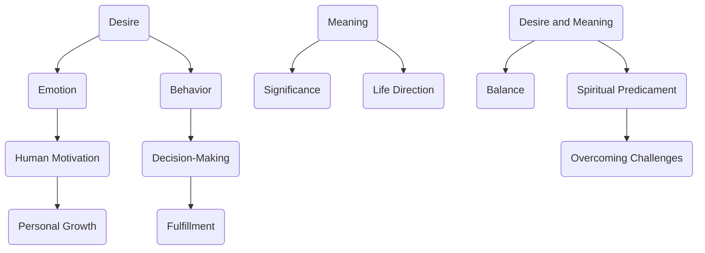

                 


### 1. Introduction to the Concept of Desire and Meaning

In this section, we will delve into the fundamental concepts of desire and meaning, both of which are central to understanding the spiritual predicament of modern humans. By exploring these concepts, we aim to provide a solid foundation for subsequent discussions.

#### 1.1 Definition and Importance of Desire

**1.1.1 The Definition of Desire**

Desire can be defined as a strong feeling of wanting something or a wish to obtain or achieve something. It is a fundamental human emotion that drives behavior and decision-making. At its core, desire is rooted in our biological need for survival and procreation, but it has evolved to encompass a wide range of psychological, social, and cultural dimensions.

**1.1.2 The Role of Desire in Human Behavior**

Desire plays a crucial role in human behavior and motivation. It drives us to pursue goals, take action, and make choices that align with our needs and values. In its positive form, desire can inspire creativity, innovation, and personal growth. However, when uncontrolled or misaligned with our true needs and values, desire can lead to negative consequences, such as addiction, dissatisfaction, and mental health issues.

**1.1.3 The Different Types of Desire**

There are several types of desire, each serving different functions and purposes. Some common types include:

- **Basic Desires:** These are fundamental needs for survival, such as food, water, and shelter. They are universal and necessary for human existence.
- **Social Desires:** These desires are related to our need for connection, belonging, and social interaction. Examples include the desire for friendship, love, and recognition.
- **Achievement Desires:** These desires are driven by the need to achieve success, competence, and excellence. They can be found in various domains, such as education, career, and sports.
- **Power Desires:** These desires stem from the need to exert control, influence, and dominance over others. They can manifest in various forms, such as leadership, authority, and wealth.

#### 1.2 The Concept of Meaning

**1.2.1 What Is Meaning?**

Meaning is a complex and multifaceted concept that can be understood in different ways depending on the context. Broadly, meaning can be defined as the significance, purpose, or value that something has in a particular context. It is the reason why something exists or occurs, and it provides a sense of direction, coherence, and purpose in our lives.

**1.2.2 The Role of Meaning in Human Life**

Meaning plays a crucial role in human life, as it provides a sense of purpose, direction, and fulfillment. It helps us navigate the complexities of life, make sense of our experiences, and find motivation and inspiration. Without meaning, life can feel empty, meaningless, and disoriented.

**1.2.3 The Importance of Understanding Meaning**

Understanding meaning is essential for several reasons:

- **Psychological Well-being:** A deep understanding of meaning can lead to improved mental health and well-being. It can reduce stress, anxiety, and depression, and promote resilience and optimism.
- **Motivation and Achievement:** Understanding meaning can drive us to pursue goals and achieve success. When we have a clear sense of purpose, we are more motivated to put in the effort and overcome obstacles.
- **Personal Growth:** Exploring meaning can lead to personal growth and self-discovery. It can help us identify our values, passions, and strengths, and align our lives with our true selves.

#### 1.3 The Relationship Between Desire and Meaning

**1.3.1 The Interplay of Desire and Meaning**

Desire and meaning are closely interconnected, as they both influence and shape each other. Desire can be a driving force behind the search for meaning, while meaning can provide a sense of fulfillment and satisfaction that fulfills our desires.

**1.3.2 The Balance Between Desire and Meaning**

Finding the balance between desire and meaning is crucial for achieving a fulfilling life. While desire can motivate us to pursue goals and seek happiness, an overemphasis on desire can lead to dissatisfaction and disillusionment. Conversely, an overemphasis on meaning can result in a lack of motivation and joy.

**1.3.3 The Impact of Desire and Meaning on Spiritual Predicament**

The interplay between desire and meaning plays a significant role in the spiritual predicament of modern humans. Unfulfilled desires and a lack of meaning can lead to spiritual frustration, dissatisfaction, and a sense of emptiness. Understanding the relationship between desire and meaning can help us navigate these challenges and find a sense of purpose and fulfillment in our lives.

## Conclusion

In this section, we have explored the concepts of desire and meaning, examining their definitions, roles, types, and relationships. By understanding these concepts, we can better navigate the spiritual predicament of modern humans and seek a fulfilling life. In the subsequent sections, we will delve deeper into the origins and evolution of human desire, the pursuit of meaning in modern society, and the specific spiritual challenges faced by modern humans. Together, these discussions will provide valuable insights and practical guidance for overcoming the spiritual predicament and finding a sense of purpose and fulfillment in our lives.

---

### Key Concepts and Relationships

To deepen our understanding of the concepts of desire and meaning, it's essential to visualize their interrelationships using a Mermaid flowchart. The following diagram illustrates the core concepts and their connections:



In this diagram, we can see that desire is a fundamental emotion that drives human behavior and motivation. It influences decision-making and is closely related to behavior. On the other hand, meaning provides a sense of significance and direction in life, which can lead to personal growth and fulfillment. The balance between desire and meaning is crucial for navigating the spiritual predicament and overcoming challenges.

### Core Algorithm Principles

To further understand the relationship between desire and meaning, we can use a mathematical model to represent their interplay. One such model is the balance equation, which can be defined as follows:

$$\text{Balance} = \frac{\text{Desire}}{\text{Meaning}} + \text{Constant}$$

Where the balance represents the state of harmony between desire and meaning, and the constant is a factor that accounts for individual differences in how people perceive and prioritize these concepts.

#### Algorithm Steps

1. **Define Desire and Meaning:** Assign numerical values to desire and meaning based on self-assessment or observation.
2. **Calculate Balance:** Use the balance equation to calculate the ratio of desire to meaning.
3. **Evaluate Balance:** Analyze the balance value to determine if it indicates a state of harmony or imbalance.
4. **Adjust Desire or Meaning:** Based on the evaluation, adjust either desire or meaning to achieve a better balance.

#### Pseudocode

```
function calculateBalance(desire, meaning, constant):
    balance = (desire / meaning) + constant
    return balance

function evaluateBalance(balance):
    if balance < 1:
        print("Desire exceeds meaning. Consider reducing desire or increasing meaning.")
    else if balance > 1:
        print("Meaning exceeds desire. Consider reducing meaning or increasing desire.")
    else:
        print("Desire and meaning are in balance.")

# Example usage
constant = 0.5
desire = 60
meaning = 40

balance = calculateBalance(desire, meaning, constant)
evaluateBalance(balance)
```

This pseudocode provides a basic framework for understanding how the balance between desire and meaning can be calculated and evaluated. By adjusting these values, individuals can work towards achieving a more balanced state.

### Conclusion

In this section, we have explored the core concepts of desire and meaning and their interconnectedness using a Mermaid flowchart and a mathematical model. By understanding these concepts and their relationship, we can better navigate the spiritual predicament of modern humans and strive for a balanced and fulfilling life. The next section will delve into the origins and evolution of human desire, examining how it has shaped our species and influenced our pursuit of meaning.

