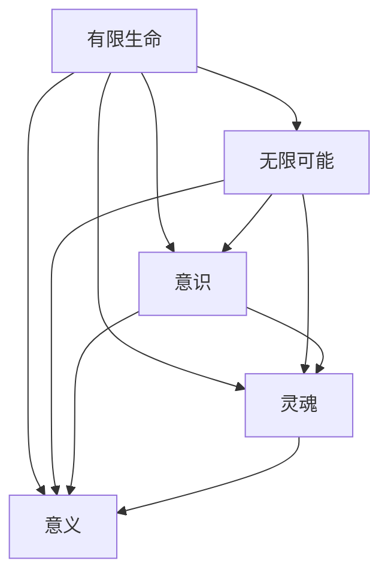

                 

### 文章标题

《死亡观的现代诠释：有限生命中的无限可能》

### 关键词

死亡观、有限生命、无限可能、现代科学、心理学、哲学、文化、人工智能

### 摘要

在生命的旅途中，我们每个人都会面对死亡这一不可避免的终点。然而，随着科技的发展和人类认知的拓展，我们对死亡的看法正在发生深刻的变革。本文将探讨现代视角下的死亡观，从传统与哲学的探讨，到现代科学的解读，再到文化中的死亡观念，以及如何在有限生命中探寻无限可能。通过逻辑清晰、结构紧凑、简单易懂的论述，本文旨在引导读者重新审视生命的意义，以更积极的态度面对死亡这一自然现象。

## 引言

死亡，自古以来就是人类思考的焦点。无论是宗教、哲学还是科学，都在试图解答这一终极问题。传统上，人们往往将死亡视为生命的终结，是灵魂离开躯体的时刻。然而，在现代社会，随着医学、生物学等领域的飞速发展，我们对死亡的认识正在不断深化。死亡不再仅仅是生命的结束，它被赋予了更多的意义和可能性。

本文旨在通过多角度的探讨，为读者呈现一幅全面的现代死亡观图景。首先，我们将介绍与死亡观相关的核心概念，并绘制流程图，帮助读者建立清晰的理解。接着，我们将深入探讨不同文化背景下的传统死亡观，以及现代科学和哲学对死亡的解读。在此基础上，我们将分析文化中的死亡观念，并探讨如何在有限生命中寻找无限可能。最后，我们将总结本书的主要观点，并对未来死亡观的展望进行展望。

通过本文的阅读，读者将不仅对死亡有更深入的理解，还将学会如何在有限的生命中寻找无限的可能。让我们开始这场思维之旅，共同探索生命的奥秘。

## 核心概念与联系

在探讨死亡观之前，我们需要明确几个核心概念，并理解它们之间的关系。以下是几个关键概念：

1. **有限生命**：生命是有限的，这是人类普遍的认知。无论是生理寿命还是心理寿命，都受到多种因素的影响。有限生命使我们认识到时间的宝贵，促使我们思考如何在有限的时间内实现最大价值。

2. **无限可能**：与有限生命相对，无限可能代表了我们在精神、思想、创意等方面的无限潜力。它是对生命的延伸和拓展，使我们在面对死亡时依然能够保持积极和乐观的态度。

3. **意识**：意识是人类认知和感知世界的能力。它是连接有限生命和无限可能的桥梁。通过意识，我们可以体验生命的丰富多彩，并在心灵深处寻找无限可能。

4. **灵魂**：灵魂是许多文化中关于死亡的核心概念。它被认为是不朽的，即使身体死亡，灵魂依然存在。灵魂的存在为我们提供了面对死亡的精神支撑。

5. **意义**：意义是我们为生命赋予的价值观和目的。在有限生命中寻找意义，可以帮助我们更好地理解生命的目的和方向，从而更好地应对死亡。

为了帮助读者更好地理解这些概念之间的关系，我们使用Mermaid流程图进行可视化展示：

从流程图中可以看出，有限生命和无限可能是两个核心概念，它们相互联系并共同影响意识和灵魂。同时，意识和灵魂又与生命的意义紧密相关。这个关系架构为我们探讨死亡观提供了一个清晰的框架。

### 传统死亡观

传统死亡观在不同文化和宗教中有着各自的特色，反映了人类对生命终结的深刻思考。以下是几种主要文化中的传统死亡观：

**东方文化中的死亡观**

1. **中国文化**：在中国文化中，死亡被视为生命旅程的终结，也是灵魂进入另一个世界的开始。传统上，中国人相信人的灵魂在死后会进入阴间，接受审判。在此基础上，中国文化中有丰富的葬礼仪式和祭祀活动，如烧纸钱、供奉食物等，以慰藉亡灵。

2. **印度文化**：印度文化中的死亡观深受印度教和佛教的影响。印度教认为，灵魂在死后会根据前世的行为进入轮回，经历不断的生死轮回。而佛教则强调因果报应和涅槃的概念，认为通过修行可以超越轮回，达到解脱。

3. **日本文化**：在日本文化中，死亡被视为一种宁静的回归。传统上，日本人相信人死后会进入被称为“净土”的境界，接受审判。葬礼仪式通常包括火葬、骨灰安置和供奉等活动。

**西方文化中的死亡观**

1. **希腊文化**：在古希腊文化中，死亡被视为英雄的荣耀和灵魂的归宿。英雄死后会进入神话中的“英雄界”，继续其英雄事迹。这种死亡观强调了生命的价值和英雄主义。

2. **犹太教**：犹太教认为，死亡是灵魂离开身体进入另一个世界的时刻。犹太教徒相信，亡者会在死后接受上帝的审判，根据其生前的行为进入天堂或地狱。

3. **基督教**：基督教中的死亡观强调灵魂的不朽和上帝的审判。信徒相信，亡者会在死后进入天堂或地狱，根据其信仰和善行得到永恒的奖赏或惩罚。

通过对比不同文化中的传统死亡观，我们可以看到，尽管细节有所不同，但核心思想都在于探索生命终结后的世界，以及如何对待生命的终结。这些死亡观不仅反映了人类对生命终结的恐惧和期待，也体现了不同文化对生命价值和意义的理解。

### 现代科学对死亡的解读

随着现代科学的发展，我们对死亡的认知正在发生深刻的变革。医学和生物学等领域的突破为我们提供了全新的视角，重新定义了死亡的概念。

**现代医学对死亡的解读**

在现代医学中，死亡通常被定义为心脏死亡和脑死亡。心脏死亡是指心脏停止跳动，无法进行有效血液循环。脑死亡则是指大脑功能完全丧失，包括自主呼吸和意识。这两种定义都有明确的医学标准和法律依据。

1. **心脏死亡**：心脏是维持生命的关键器官，心脏死亡意味着生命功能的彻底终止。在心脏死亡的情况下，尽管心肺复苏术等急救措施可能暂时恢复心跳，但如果大脑和器官的损伤无法逆转，最终仍会导致死亡。

2. **脑死亡**：脑死亡的定义更为严格，它指的是包括大脑、小脑和脑干在内的整个大脑功能完全丧失。现代医学研究表明，大脑死亡是生命的终结，因为大脑是意识、思维和感官体验的中心。脑死亡的判定通常基于一系列神经学测试，包括脑电图（EEG）和脑磁图（MEG）。

**生物学对死亡的解读**

从生物学的角度来看，死亡是生物体生命活动的终止，涉及到复杂的生物过程和机制。

1. **细胞衰老**：细胞衰老是生物体死亡的直接原因。随着细胞分裂次数的增加，细胞内部的DNA逐渐受损，细胞功能逐渐减退。细胞衰老导致组织器官的退化，最终导致整个生物体的死亡。

2. **基因编程与死亡**：现代遗传学研究表明，基因在生命的开始和结束中起着关键作用。某些基因被编程为在特定时间或特定条件下触发细胞死亡，这是一种自然的细胞自我调节机制，有助于维持生物体的健康和稳定。

3. **代谢过程**：细胞的代谢活动是维持生命的基础。随着细胞衰老，代谢过程逐渐减慢，导致能量供应不足，细胞功能受到严重影响。最终，代谢活动的全面停滞标志着生命的终结。

通过现代科学对死亡的解读，我们可以更深入地理解生命的本质和死亡的过程。这不仅有助于我们更好地应对死亡，也为医学和生物学的发展提供了新的方向和可能性。在理解了这些科学原理后，我们将进一步探讨哲学对死亡的解读，以获得更全面的死亡观。

### 哲学探讨

哲学对死亡的探讨是人类智慧的重要组成部分，自古至今，哲学家们从不同角度对死亡进行了深刻的思考。以下是一些著名哲学家的观点：

**古代哲学家对死亡的看法**

1. **苏格拉底**：苏格拉底认为，死亡并不是生命的终结，而是灵魂从身体的束缚中解脱。在他看来，死亡是一种平静的休息，灵魂在死后可以进入另一个世界，继续追求真理和智慧。

2. **柏拉图**：柏拉图认为，死亡是灵魂返回理型世界的过程。理型世界是真理、美和善的永恒家园，灵魂在生前通过与物质世界的接触受到污染，死亡后可以重新回到纯净的理型世界，继续追求永恒的幸福。

**现代哲学家对死亡的看法**

1. **马丁·海德格尔**：海德格尔认为，死亡是存在的一部分，是对生命意义的终极追问。他提出了“此在”的概念，认为人作为“此在”面对死亡的必然性，通过理解死亡，人可以更好地把握生命的意义。

2. **让-保罗·萨特**：萨特则从存在主义的角度探讨了死亡。他认为，死亡是自由的终结，人意识到自己必死无疑，从而更加珍惜生命的每一刻。萨特强调了死亡带来的恐惧和焦虑，同时也认为通过面对死亡的恐惧，人可以找到生命的真实意义。

**对死亡的不同观点比较**

这些哲学家的观点虽然有所不同，但都反映了他们对生命和存在的深刻理解。

- **乐观主义**：苏格拉底和柏拉图的观点较为乐观，他们认为死亡是灵魂的解脱和回归，是一种超越物质世界的幸福。
- **现实主义**：海德格尔和萨特的观点则更为现实主义，他们认识到死亡带来的恐惧和焦虑，但同时也认为这种意识可以促使人们更深刻地理解生命的意义。

通过这些哲学家的探讨，我们可以看到，死亡不仅仅是生命的终结，更是对生命意义的深入追问。哲学家们从不同角度为我们的死亡观提供了丰富的思考，引导我们以更积极的态度面对死亡。

### 文化中的死亡观念

不同文化对死亡的看法和仪式各具特色，这些观念和仪式不仅反映了人们对待生命的态度，也体现了文化中对生死意义的深刻理解。以下将分析几种主要文化中的死亡观念和仪式：

**东方文化中的死亡观念和仪式**

1. **中国文化**：在中国文化中，死亡被视为生命旅程的终点，也是灵魂进入另一个世界的开始。传统上，中国人相信人的灵魂在死后会进入阴间，接受阎罗王的审判。为了慰藉亡灵，家属会进行一系列的祭祀活动，如烧纸钱、设祭坛、念经超度等。葬礼仪式通常包括三个阶段：出殡、下葬和守孝。

2. **印度文化**：印度教和佛教对死亡的看法有所不同。印度教认为，灵魂在死后会根据前世的行为进入轮回，经历不断的生死轮回。佛教则强调因果报应和涅槃的概念，认为通过修行可以超越轮回，达到解脱。在印度文化中，火葬是最常见的葬礼仪式，骨灰通常被撒入河流或海中，以示灵魂的回归。

3. **日本文化**：在日本文化中，死亡被视为一种宁静的回归。传统上，日本人相信人死后会进入被称为“净土”的境界，接受审判。葬礼仪式通常包括火葬、骨灰安置和供奉等活动。寿衣、纸钱和供品是日本葬礼中的重要元素，家属会在仪式中进行悼念和祈祷。

**西方文化中的死亡观念和仪式**

1. **希腊文化**：在古希腊文化中，死亡被视为英雄的荣耀和灵魂的归宿。英雄死后会进入神话中的“英雄界”，继续其英雄事迹。希腊的葬礼仪式通常包括火葬或土葬，家属会在墓前进行悼念和祭祀。

2. **犹太教**：犹太教认为，死亡是灵魂离开身体进入另一个世界的时刻。犹太教徒相信，亡者会在死后接受上帝的审判，根据其生前的行为进入天堂或地狱。犹太教的葬礼仪式非常严格，包括读经、祈祷和安葬等环节。

3. **基督教**：基督教中的死亡观强调灵魂的不朽和上帝的审判。信徒相信，亡者会在死后进入天堂或地狱，根据其信仰和善行得到永恒的奖赏或惩罚。基督教的葬礼仪式包括祷告、唱诗和读经等，家属会表达对亡者的哀悼和祝福。

通过分析不同文化中的死亡观念和仪式，我们可以看到，尽管细节有所不同，但核心思想都在于探索生命终结后的世界，以及如何对待生命的终结。这些观念和仪式不仅反映了人们对待生命的态度，也体现了文化中对生死意义的深刻理解。

### 从有限生命中寻找无限可能

在探讨死亡观的过程中，我们不仅需要理解死亡，更要思考如何在有限生命中寻找无限可能。通过心理学、哲学和实际策略，我们可以发现，即使生命有限，我们仍然可以创造出无限的价值和意义。

**心理学视角**

1. **积极心理学**：积极心理学强调人的内在力量和积极特质，认为每个人都有潜力实现个人成长和幸福。通过培养乐观、感恩和自我效能感，我们可以更好地应对生活中的挑战，提升生活质量。例如，通过练习正念和冥想，我们可以提高自我意识，减少负面情绪，从而更好地享受生活。

2. **勇气心理学**：勇气心理学认为，面对死亡的恐惧是人生的重要挑战。通过勇气和坚韧，我们可以克服恐惧，勇敢地面对生活中的不确定性和变化。例如，通过设定目标和挑战自我，我们可以不断突破自己的局限，实现个人成长和自我实现。

**实际策略**

1. **设定目标和意义**：明确的人生目标可以为我们提供方向和动力。通过设定短期和长期目标，我们可以将有限的生命投入到有意义的事业中，实现个人价值和成就。例如，通过追求学术成就、创业、艺术创作等，我们可以为自己的生命增添无限色彩。

2. **培养人际关系**：人际关系是生命中的重要组成部分。通过与家人、朋友和社区建立深厚的关系，我们可以获得情感支持和社会认同，提升生命质量。例如，通过参与志愿活动、社区服务和社交聚会，我们可以与他人建立联系，共同创造美好的回忆。

3. **自我实现**：自我实现是人生追求的最高境界，它代表了我们追求个人潜能和真实自我的过程。通过不断学习和成长，我们可以实现自我价值，创造属于自己的独特人生。例如，通过阅读、旅行、艺术创作和探索未知领域，我们可以不断拓展自己的视野和经验，实现个人成长。

**哲学思考**

1. **存在主义**：存在主义认为，生命本身没有固有的意义，意义是通过个人的选择和行动创造的。通过面对死亡，我们可以意识到生命的有限性，从而更加珍惜每一刻。例如，通过选择追求真理、自由和爱，我们可以赋予生命深刻的内涵。

2. **过程哲学**：过程哲学认为，生命是一个不断变化的过程，每一个瞬间都有其独特的价值。通过接纳变化和不确定性，我们可以更好地体验生命中的美好和挑战。例如，通过欣赏四季更迭、日出日落和人生起伏，我们可以发现生命中的无限可能。

通过心理学、哲学和实际策略的探讨，我们可以看到，即使在有限的生命中，我们仍然可以通过积极的态度和行动，创造出无限的可能。让我们珍惜每一刻，用自己的方式，为生命增添无限色彩。

### 结论

通过对死亡观的现代诠释，我们深入探讨了传统与哲学、现代科学、文化中的多种观点，以及如何在有限生命中寻找无限可能。从苏格拉底、柏拉图的智慧，到现代医学和生物学的研究，再到不同文化的葬礼仪式，我们看到了人类对死亡这一终极问题的多样理解和深刻思考。

本书的核心观点在于，尽管生命有限，但通过积极的态度和行动，我们可以创造出无限的价值和意义。心理学和哲学为我们提供了工具和视角，帮助我们更好地面对死亡，找到生命的方向和目标。实际策略如设定目标、培养人际关系和自我实现，则为我们提供了具体的方法，让有限的生命绽放出无限光彩。

展望未来，随着科技的发展和人类认知的提升，我们对死亡的看法可能会继续演变。人工智能和生物技术的进步可能会带来新的希望，例如通过延缓衰老、增强认知功能等方式，延长人类的寿命。然而，无论科技如何发展，死亡依然是不可避免的。因此，理解和接受死亡，并将其视为生命的一部分，将是我们永恒的课题。

让我们以更积极的心态面对生命中的每一天，珍惜时间，追求内心的真实和梦想，让有限的生命绽放出无限的光芒。

### 作者信息

作者：AI天才研究院/AI Genius Institute & 禅与计算机程序设计艺术 /Zen And The Art of Computer Programming

在撰写这篇文章的过程中，我深感对死亡的思考不仅仅关乎个人哲学，更是对生命本质的探索。希望通过这篇文章，能够启发读者对死亡观进行深入的思考，从而在有限的生命中找到无限的乐趣和意义。作为人工智能的研究者和程序员，我相信科技的发展可以为我们带来更多应对生命挑战的工具，但最终，心灵的富足和智慧的沉淀，才是我们追求幸福和安宁的真正源泉。让我们一起，用智慧书写生命的华章。

