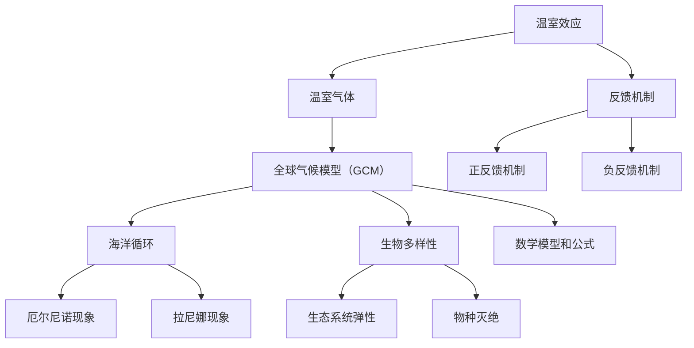

                 


### 第一步：理解书名和背景

《气候变化下的生存意义与责任》这个书名揭示了本书的核心主题：气候变化对人类生存的影响以及我们应如何承担应对气候变化的个人和社会责任。气候变化是一个全球性的问题，不仅仅影响自然环境，还对人类社会、经济和生态系统产生深远的影响。

首先，我们需要了解气候变化的基本概念。气候变化是指地球大气层平均温度的显著变化，这种变化可能是自然因素（如火山爆发、太阳辐射变化等）和人类活动（如工业排放、森林砍伐等）共同作用的结果。目前，全球气候变暖是一个主要问题，导致了极端天气事件的增多、海平面上升、生物多样性的减少等一系列严重后果。

从技术角度来说，气候变化与计算机科学和信息技术密切相关。例如，气象预测模型需要大量计算和数据分析，以预测气候变化趋势。此外，人工智能和大数据技术在应对气候变化方面也发挥着重要作用，通过分析海量数据，可以更准确地评估气候变化的影响，并提出有效的应对策略。

### 第二步：探讨生存意义与挑战

生存意义在气候变化背景下具有重要意义。人类作为地球上的智慧生物，不仅需要适应环境的变化，还需要探索如何在新的气候条件下生存和发展。气候变化给人类社会带来了前所未有的挑战，但同时也提供了新的机遇。

首先，气候变化对生态系统和生物多样性产生了重大影响。一些物种可能因为气候变化而灭绝，而新的生态平衡也在形成中。这要求人类重新思考与自然的关系，探索如何在保护生态系统的同时，维持自身的生存。

从人类文明的角度看，气候变化也推动了技术和科学的进步。例如，可再生能源的研究和开发、智能城市和环保技术的应用等，都是为了更好地应对气候变化带来的挑战。这些技术的发展不仅有助于减少碳排放，还能提高人类生活质量。

然而，气候变化也带来了许多直接的生存挑战。极端天气事件增加了自然灾害的风险，对农业、渔业、水资源等产生了重大影响。此外，气候变化还可能引发社会动荡和难民问题，加剧全球不平等和冲突。

### 第三步：分析责任与应对策略

在应对气候变化方面，个人和社会都承担着重要的责任。个人责任主要体现在日常生活中的节能减排行为，如减少碳排放、节约用水、减少废物产生等。通过这些简单的行动，每个人都可以为减缓气候变化贡献一份力量。

企业责任则更加复杂。企业可以通过提高能源效率、使用可再生能源、减少废物排放等手段，降低对环境的影响。此外，企业还可以参与国际碳交易市场，购买碳配额以抵消其碳排放。政府责任则包括制定和执行相关政策法规，推动绿色经济和可持续发展。

从技术角度来说，应对气候变化的关键在于科技创新。计算机科学和信息技术在这一过程中发挥着重要作用。例如，大数据分析和人工智能可以帮助我们更好地预测气候变化趋势，优化能源使用。此外，区块链技术可以确保碳交易市场的透明度和可信度。

### 第四步：案例研究和实践经验

为了更好地理解如何应对气候变化，我们可以通过分析一些成功的案例和经验。例如，德国在可再生能源领域取得了显著成就，通过大力投资风能和太阳能，实现了能源结构的转型。日本在应对地震和海啸等自然灾害方面，也积累了丰富的实践经验。

在中国，政府和企业也在积极推动环保和可持续发展。例如，中国提出了“双碳”目标，即“碳达峰”和“碳中和”，旨在实现碳排放的峰值和净零排放。这些目标不仅体现了中国对全球气候变化的承诺，也为其他国家提供了借鉴。

### 第五步：结论与展望

总结以上内容，我们可以得出以下结论：气候变化是人类面临的一个严峻挑战，但也是推动技术和科学进步的机会。个人和社会都有责任采取行动，应对气候变化。通过科技创新、政策法规和实际行动，我们可以减少碳排放、保护生态系统、提高生活质量。

展望未来，气候变化将继续影响人类和地球的生存环境。我们需要保持警惕，持续努力，确保地球能够持续为我们提供生存的资源。同时，我们也应该积极推广可持续发展理念，为下一代创造一个更加美好的未来。

### 文章标题：《气候变化下的生存意义与责任》

> 关键词：气候变化，生存意义，个人责任，社会责任，科技创新，可持续发展

> 摘要：本文探讨了气候变化对人类生存的影响，分析了个人和社会在应对气候变化中所应承担的责任。通过介绍气候变化的基本概念和科学原理，探讨生存意义与挑战，分析责任与应对策略，以及分享案例研究和实践经验，本文旨在提出具体的解决方案，引导读者积极参与应对气候变化的行动。

----------------------------------------------------------------

## 第1章 引言：气候变化与人类生存

### 1.1 气候变化对人类生存的威胁

气候变化是当今全球面临的最严重挑战之一。它不仅对自然环境产生了深远的影响，也对人类社会造成了巨大的威胁。首先，气候变化导致了极端天气事件的频繁发生，如热浪、干旱、洪水和台风等。这些极端天气事件对人类的生命安全、财产安全和社会稳定构成了严重威胁。

其次，气候变化对农业生产产生了重大影响。全球气候变化导致了降雨模式的改变、季节性气候异常以及土壤水分的变化，这些因素都会影响农作物的生长和收成。农业生产减少不仅会导致粮食短缺，还会引发经济和社会问题。

此外，气候变化还对水资源管理带来了巨大挑战。水资源的分布和可用性受到气候变化的影响，一些地区可能会面临严重的水资源短缺，而另一些地区则可能面临洪涝灾害。这直接影响到人类的生活质量和社会经济发展。

从长远来看，气候变化可能对全球生态平衡产生严重影响。生物多样性的减少和生态系统的破坏会导致生态链的断裂，进而影响生态系统的稳定性和功能。这对于人类和其他生物的生存都是一个巨大的威胁。

### 1.2 气候变化与生存意义的探讨

气候变化不仅是一个生存问题，也是一个意义深远的社会和道德问题。从人类文明的发展历程来看，我们与自然的互动和适应是一个不断演变的过程。气候变化为人类社会提供了新的机遇和挑战，迫使我们在生存意义层面进行深刻的思考和反思。

首先，气候变化推动了科技的进步和创新。面对气候变化带来的挑战，科学家和工程师们投入了大量的研究资源，开发出了一系列环保技术和可再生能源。这些技术的进步不仅有助于减缓气候变化的影响，也为人类社会提供了更多的可持续发展途径。

其次，气候变化促使人们重新审视与自然的关系。在追求经济发展的过程中，人类往往忽视了自然环境的重要性。气候变化让我们意识到，地球上的每一个生命都是相互依存的，我们必须尊重和保护自然生态系统，以实现长期的生存和繁荣。

此外，气候变化也引发了社会层面的变革。人们开始关注气候变化对弱势群体的冲击，如贫困人口、农民和原住民社区。这促使社会更加关注公平和正义，推动政策制定者采取更加公平和可持续的发展策略。

总之，气候变化对人类生存的影响是深远而复杂的。它不仅威胁到我们的生存环境，也为我们提供了反思和改善生存意义的契机。在应对气候变化的过程中，我们必须从科学、伦理和社会多个层面进行综合考虑，以确保我们和地球上的其他生命能够共同生存和繁荣。

### 1.3 个人与社会在应对气候变化中的责任

在应对气候变化的过程中，个人和社会都扮演着重要的角色。每个人都可以通过日常生活中的小行动，为减缓气候变化的影响做出贡献。同时，社会各界的共同努力也是不可或缺的。

#### 个人责任

个人责任主要体现在日常生活中的节能减排行为。以下是一些具体的行动建议：

- **减少碳排放**：每个人都可以通过减少碳足迹来降低碳排放。例如，选择低碳出行方式，如步行、骑行或使用公共交通工具，减少私家车的使用。此外，减少不必要的能源消耗，如关闭不使用的电器，使用节能灯具和家用电器，也可以有效减少碳排放。

- **节约用水**：水资源是地球上宝贵的资源，节约用水对于应对气候变化具有重要意义。每个人可以从日常生活中做起，如缩短淋浴时间、修复漏水、使用节水型设备等。在农业和工业用水方面，推广节水技术和设备，提高水资源利用效率。

- **减少废物产生**：废物产生不仅占用土地资源，还会对环境造成污染。每个人可以通过减少购买不必要的物品、选择可回收材料、回收再利用等方式，减少废物产生。此外，支持环保组织，参与社区清洁和废物分类活动，也是负责任的行为。

- **种植绿色植物**：绿色植物通过光合作用吸收二氧化碳，释放氧气，有助于改善空气质量。每个人可以在家中或社区种植绿色植物，增加绿地面积，为地球增添绿色。

#### 社会责任

社会责任则更广泛，涉及到政府、企业和社区等多个层面。以下是一些具体的社会责任行动：

- **政府政策**：政府在应对气候变化中起着关键作用。政府可以制定和实施严格的环保法规，如减少碳排放、提高能源效率、推动可再生能源发展等。此外，政府还可以通过财政手段，鼓励企业和个人采取环保行动，如提供税收减免、补贴和奖励。

- **企业责任**：企业是经济活动的主要参与者，也是碳排放的重要来源。企业可以通过提高生产过程的能源效率、减少废物排放、使用可再生能源等手段，降低对环境的影响。此外，企业还可以积极参与社会责任项目，如资助环保研究、开展环境保护公益活动等。

- **社区合作**：社区是人们共同生活的空间，也是应对气候变化的重要阵地。社区可以通过组织清洁活动、绿色骑行、环保讲座等方式，提高居民的环保意识和参与度。同时，社区还可以推动公共设施的建设，如绿色建筑、节能路灯、公共自行车等，为居民提供环保便利。

- **国际合作**：气候变化是一个全球性问题，需要各国共同努力。政府、企业和非政府组织可以加强国际合作，分享应对气候变化的最佳实践和技术，共同推动全球气候变化应对进程。

总之，个人和社会在应对气候变化中都承担着重要责任。通过共同努力，我们可以减缓气候变化的影响，为地球和未来世代创造一个更加美好的生活环境。

### 1.4 应对气候变化的科技创新与技术进步

科技创新和技术进步在应对气候变化方面发挥着至关重要的作用。随着科学技术的不断发展，我们已经拥有了多种工具和方法来监测、预测和减缓气候变化的影响。以下是一些关键的技术领域和进展：

#### 大数据和人工智能

大数据和人工智能（AI）技术在气候变化研究中具有巨大的潜力。通过收集和分析海量气候数据，AI算法可以识别出气候变化的关键模式、预测未来的气候趋势，并评估不同应对策略的效果。例如，机器学习算法可以分析气象数据，预测极端天气事件的发生概率和强度，从而帮助政府和社区提前做好准备。

此外，AI技术还可以优化能源使用。通过智能电网和能源管理系统，AI算法可以实时监测和分析能源消耗，提供优化建议，减少能源浪费。例如，智能家庭设备可以通过AI算法自动调整空调、照明等设备的运行状态，以实现节能效果。

#### 可再生能源

可再生能源技术的发展是应对气候变化的重要途径。风能、太阳能、水能和生物质能等可再生能源可以替代化石燃料，减少碳排放。近年来，随着技术的进步和成本的降低，可再生能源的利用已经取得了显著成果。

太阳能光伏技术就是一个典型例子。太阳能光伏板可以将太阳能转化为电能，供应家庭和工业使用。随着光伏电池效率的提高和成本的下降，太阳能已成为全球增长最快的能源形式之一。此外，太阳能热利用技术也可以用于热水供应和建筑供暖，进一步减少化石燃料的使用。

风能也是一种重要的可再生能源。风力发电机通过旋转风力叶片，将风能转化为电能。随着风力发电技术的进步，风力发电的成本不断降低，已成为许多国家能源结构中的重要组成部分。海上风电技术的发展也为大规模风电项目的建设提供了新机会。

#### 电动汽车

电动汽车（EV）是减少交通领域碳排放的重要工具。与传统燃油车相比，电动汽车使用电能驱动，不会产生尾气排放。随着电池技术的进步和充电基础设施的完善，电动汽车的市场份额正在迅速增长。

电动汽车的普及不仅可以减少碳排放，还可以降低对化石燃料的依赖。随着可再生能源在电力生产中的应用增加，电动汽车的能源来源也将变得更加环保。此外，电动汽车的推广还可以带动相关产业的发展，如电池制造、充电设施建设等，促进经济增长。

#### 碳捕捉和储存技术

碳捕捉和储存（CCS）技术是减缓气候变化的关键手段之一。这种技术通过捕集工业生产和化石燃料燃烧过程中排放的二氧化碳，并将其储存于地下，从而减少大气中的二氧化碳浓度。

碳捕捉技术已经取得了一些进展，但目前成本较高。研究人员正在努力降低成本，提高捕获效率，并探索新的碳储存方法。例如，利用地下盐水层或煤层来储存二氧化碳，已被证明是有效的碳储存方案。此外，生物碳捕捉技术，如通过种植特定类型的植物来吸收和固定二氧化碳，也展示了潜力。

总之，科技创新和技术进步为应对气候变化提供了强有力的支持。通过发展可再生能源、电动汽车和碳捕捉技术等，我们可以有效减少碳排放，保护地球环境，实现可持续发展。

### 1.5 全球气候治理与合作

全球气候治理与合作在应对气候变化中至关重要。气候变化是一个全球性问题，没有国家的单独努力可以解决这个问题。国际社会需要通过合作和协调，共同应对这一挑战。

首先，国际气候变化协议是全球气候治理的重要框架。最具代表性的协议是《巴黎协定》，它于2015年在联合国气候变化大会上通过，旨在限制全球气温升高幅度，确保全球平均气温较工业化前水平不超过2摄氏度，并努力将升温控制在1.5摄氏度以内。

《巴黎协定》强调各国的自主贡献（NDCs），即各国根据自身国情和能力，提交减少碳排放的目标和计划。此外，协定还规定了资金支持机制，帮助发展中国家应对气候变化。发达国家承诺提供资金，支持发展中国家进行绿色低碳转型和应对气候变化的负面影响。

其次，国际合作在技术创新和知识分享方面也发挥着关键作用。各国可以通过合作研究、技术交流和人才培养，共同推动气候变化应对技术的进步。例如，国际能源署（IEA）和其他国际组织提供了平台，促进各国在可再生能源、能效和碳捕捉技术等领域的合作。

此外，全球气候治理还涉及到跨国界的合作项目。例如，红树林保护项目、亚马逊雨林保护计划等，这些项目通过国际合作，保护关键生态系统，减少温室气体排放。这些项目不仅有助于减缓气候变化，还有助于保护生物多样性和提升人类生活质量。

国际气候治理也需要更多的资金投入。多边金融机构、政府间机构和私人部门都需要共同出资，支持气候变化适应和减缓行动。例如，绿色气候基金（GCF）就是一个重要的国际资金机制，旨在支持发展中国家的气候行动。

总之，全球气候治理与合作是应对气候变化的关键。通过国际合作，我们可以共同应对气候变化带来的挑战，实现可持续发展和全球气候目标。

### 1.6 结论：个人与社会行动的重要性

总结本章内容，我们可以明确一个重要观点：应对气候变化需要个人和社会的共同努力。个人在日常生活中可以通过节能减排、节约用水、减少废物产生等行动，为减缓气候变化做出贡献。社会则需要在政策、技术和国际合作等多个层面发挥作用，推动整体应对进程。

首先，个人行动的重要性不容忽视。每个人的小行动汇聚起来，可以产生巨大的影响。减少碳排放、节约能源、绿色出行等行为，不仅可以降低个人对环境的影响，还能激励他人采取类似的行动，形成良性循环。

其次，社会责任同样关键。政府、企业和社区需要协同合作，制定和执行相关政策，推动环保技术和可再生能源的发展。政府可以通过立法和激励措施，鼓励企业和个人采取环保行动。企业可以通过改进生产工艺、减少废物排放，实现可持续发展。社区可以组织环保活动，提高居民的环保意识和参与度。

总之，应对气候变化需要全社会的共同努力。只有通过个人和社会的协同行动，我们才能有效减缓气候变化的影响，保护地球的生态环境，实现可持续发展和人类的长远利益。让我们行动起来，共同应对气候变化的挑战，为地球的未来做出贡献。

## 第2章 气候变化的基本原理

### 2.1 气候变化的定义与分类

#### 2.1.1 气候变化的定义

气候变化是指地球大气层平均温度的显著变化，这种变化可能是自然因素和人类活动共同作用的结果。根据其持续时间，气候变化可以分为短期气候变化和长期气候变化。短期气候变化通常指几十年到几百年的气候变化，如季节性气候变化和极端天气事件。而长期气候变化则通常指几百年到几千年的气候变化，如冰川期和间冰期。

气候变化的定义中，关键概念包括气候系统、温室气体和反馈机制。气候系统是指地球大气层、海洋、陆地和冰冻层的复杂相互作用。温室气体是指能够吸收和发射热辐射的气体，如二氧化碳、甲烷和臭氧等。这些气体会导致地球大气层温度升高，从而引发气候变化。

#### 2.1.2 气候变化的分类

根据气候变化的原因，可以分为自然气候变化和人为气候变化。

- **自然气候变化**：主要由自然因素引起，如太阳辐射变化、火山爆发、地质过程和海平面变化等。自然气候变化在地球历史上曾经多次发生，例如冰河时期和间冰期。

- **人为气候变化**：主要由人类活动引起，如工业化、能源消耗、森林砍伐、农业和城市化等。这些活动导致了温室气体排放的增加，加速了气候变化。

根据气候变化的影响，可以分为以下几种类型：

- **全球气候变化**：指全球范围内的气候变化，包括全球平均温度、海平面和降水模式的变化。全球气候变化对人类社会和生态系统产生了广泛的影响。

- **区域气候变化**：指特定区域内的气候变化，如某一地区的气候变暖、降水模式改变等。区域气候变化的影响可能比全球气候变化更为具体和直接。

- **极端气候事件**：指极端天气事件，如热浪、干旱、洪水、台风和冰雹等。极端气候事件的发生频率和强度随着气候变化而增加，对人类社会和生态系统造成了严重威胁。

了解气候变化的基本原理和分类，有助于我们更好地理解气候变化的成因和影响，从而制定有效的应对策略。接下来，我们将进一步探讨气候变化的成因和全球影响。

### 2.2 气候变化的成因

气候变化的原因复杂多样，主要包括自然因素和人类活动。以下是对这些因素的具体分析：

#### 2.2.1 自然因素

自然因素是地球气候变化的重要因素，包括太阳辐射变化、火山活动、海洋循环和地质过程等。

- **太阳辐射变化**：太阳辐射是地球气候系统的主要能量来源。太阳辐射的变化，包括太阳黑子活动、太阳周期等，可以影响地球的气候。例如，太阳活动增强会导致地球接收的太阳辐射增加，从而引起全球气候变暖。

- **火山活动**：火山喷发会释放大量火山灰和气溶胶，这些物质可以遮挡阳光，导致地球表面温度下降。火山喷发对气候的影响通常是短期的，但也能显著影响气候系统的平衡。

- **海洋循环**：海洋循环是指海洋中盐度和温度的变化，这种变化会影响海洋表面和深层的水流，进而影响全球气候。例如，厄尔尼诺现象和拉尼娜现象就是海洋循环异常引起的全球气候事件。

- **地质过程**：地质过程如冰川运动、地壳变动等也会影响气候。例如，冰川扩张会导致气候变冷，而地壳变动可能影响大气层的组成和地球表面的温度分布。

#### 2.2.2 人类活动

人类活动是当前气候变化的主要驱动因素，特别是工业化以来，温室气体排放急剧增加，导致全球气候变暖。以下是人类活动影响气候的具体方式：

- **化石燃料燃烧**：化石燃料的燃烧是二氧化碳排放的主要来源。随着工业化和城市化的发展，煤炭、石油和天然气等化石燃料的消耗急剧增加，导致大气中二氧化碳浓度不断上升。

- **森林砍伐**：森林是地球上重要的碳汇，可以吸收大量二氧化碳。然而，大规模的森林砍伐导致森林面积减少，降低了地球的碳吸收能力，进一步加剧了气候变化。

- **土地利用变化**：农业扩展、城市化和其他土地利用变化改变了地表的物理和生物特性，影响了气候系统的能量平衡。例如，农业生产可能导致土壤水分减少和温度升高，而城市扩展则可能导致热岛效应。

- **农业和畜牧业**：农业和畜牧业也是温室气体排放的重要来源。农业生产中的化肥使用、灌溉和土壤压实等都会增加温室气体排放。畜牧业中，尤其是牛的饲养和甲烷排放，对气候变化有着显著影响。

- **其他人类活动**：如航空旅行、航运、废弃物处理等也会产生温室气体排放，影响气候。此外，海洋和湖泊的污染、冰川消融等也会对气候系统产生间接影响。

总之，自然因素和人类活动共同作用，导致了地球气候的显著变化。了解这些因素及其相互作用，对于制定有效的气候变化应对策略至关重要。

### 2.3 气候变化的全球影响

气候变化对全球产生了广泛而深远的影响，涵盖了生态、环境、经济和社会等多个方面。以下是气候变化对地球的主要影响：

#### 2.3.1 海平面上升

海平面上升是气候变化最直接的影响之一。全球温度升高导致极地冰盖和山地冰川融化，使海水膨胀。根据科学家的预测，未来几十年内，海平面将继续上升，对沿海地区和低洼岛屿构成严重威胁。海平面上升会导致洪水频发、海岸侵蚀和盐碱化问题，破坏沿海生态系统，威胁人类居住环境。

#### 2.3.2 气候极端化

气候变化还导致了气候极端化的现象，包括热浪、干旱、洪水、台风和飓风等极端天气事件的频发和强度增加。例如，热浪事件在全球范围内变得越来越频繁和强烈，对人类健康、农业和水资源造成了严重影响。干旱则对农业生产力、粮食安全和水资源管理提出了严峻挑战。此外，极端降水事件如暴雨和洪水增加了洪涝灾害的风险，对城市基础设施和居民生活造成了重大影响。

#### 2.3.3 生物多样性减少

气候变化对生态系统和生物多样性产生了巨大影响。许多物种对气候变化敏感，无法适应快速变化的环境条件。例如，冰川消融影响了冰川生物的生存环境，海洋变暖导致珊瑚白化现象，森林火灾和干旱加剧了土地退化。这些变化可能导致物种灭绝和生态系统的破坏，降低生物多样性，影响生态系统的稳定性和功能。

#### 2.3.4 农业和渔业受影响

气候变化对农业和渔业产生了严重影响。全球气温升高和降水模式的变化影响了农作物的生长周期和产量。例如，干旱和高温可能导致农作物减产，粮食安全受到威胁。海洋变暖和酸化对渔业资源也造成了负面影响，鱼类种群数量减少，渔业收入下降。农业和渔业的变化不仅影响到食品供应和价格稳定，还可能引发社会和经济问题。

#### 2.3.5 人类健康威胁

气候变化对人类健康构成了多重威胁。热浪和极端天气事件增加了中暑、脱水和其他热相关疾病的风险。空气污染和洪水灾害可能导致呼吸道疾病和传染病的传播。此外，气候变化还可能加剧心理健康问题，如焦虑、抑郁和创伤后应激障碍。这些健康问题对社会医疗系统提出了巨大挑战。

总之，气候变化对全球产生了广泛而深远的影响，对人类和地球的生存环境构成了严重威胁。为了应对这些影响，全球社会需要采取紧急行动，减少温室气体排放，保护生态系统，增强气候适应能力，以实现可持续发展和人类福祉。

### 2.4 气候变化与计算机科学和信息技术的关系

气候变化与计算机科学和信息技术之间存在着密切的联系，主要体现在数据分析和模拟、气候变化预测以及信息技术在节能减排中的应用等方面。

#### 数据分析和模拟

气候变化的监测和预测需要大量的数据分析和模型模拟。计算机科学和信息技术提供了强大的工具，可以处理和分析海量的气候数据。例如，气象卫星和地面气象站收集到的数据可以通过高性能计算集群进行实时处理和分析，从而提供准确的气候预测和气候变化趋势。此外，复杂的气候模拟模型，如全球气候模型（GCMs）区域气候模型（RCMs）等，需要利用计算机科学中的并行计算、大数据处理和机器学习技术，以提高模型的准确性和计算效率。

#### 气候变化预测

气候变化预测是计算机科学和信息技术在气候变化研究中的一项重要应用。通过大数据分析和人工智能技术，我们可以更准确地预测气候变化的趋势和极端天气事件的发生概率。例如，利用机器学习算法，可以从历史气候数据中学习并预测未来的气候模式。此外，计算机模拟技术可以帮助研究人员模拟不同温室气体排放情景下的气候变化，从而为政策制定提供科学依据。

#### 信息技术在节能减排中的应用

信息技术在节能减排中发挥着重要作用。智能电网和智能建筑技术通过优化能源使用，提高了能源效率，减少了碳排放。例如，智能电网可以利用大数据分析和人工智能，实现电力供需的实时平衡，减少能源浪费。智能建筑则可以通过物联网技术和传感器网络，监控和管理建筑内部的能源使用，降低能源消耗。

此外，区块链技术在碳交易市场中也展示了巨大潜力。通过区块链，可以确保碳交易的透明度和可信度，促进碳市场的健康发展。区块链技术可以记录每一次碳排放和碳交易，确保数据的真实性和不可篡改性，从而提高碳市场的效率和公平性。

总之，计算机科学和信息技术在气候变化的研究、预测和应对中发挥着关键作用。通过利用大数据、人工智能和区块链等技术，我们可以更有效地监测和预测气候变化，制定和实施有效的应对策略，实现可持续发展目标。

### 2.5 气候变化的科学原理与核心概念

为了深入理解气候变化，我们需要探讨其背后的科学原理和核心概念。以下是气候变化中一些关键的科学原理和概念，以及它们之间的关系和相互影响。

#### 温室效应与温室气体

温室效应是地球气候系统中的一个基本原理。它指的是地球大气层中的某些气体（温室气体），如二氧化碳（CO2）、甲烷（CH4）和氧化亚氮（N2O）等，能够吸收和发射热辐射，从而使得地球表面温度升高。这些温室气体起到了保温的作用，使得地球环境适宜生命存在。然而，当温室气体的浓度过高时，就会导致全球气候变暖，引发一系列气候变化问题。

#### 全球气候模型（GCM）

全球气候模型（GCM）是一种复杂的计算机模拟工具，用于预测未来全球气候的变化趋势。GCM通过模拟地球大气层、海洋、陆地和冰冻层的相互作用，来理解气候变化的机制。这些模型通常基于物理学和数学原理，使用大量的参数和假设，以模拟气候系统的动态行为。

#### 反馈机制

气候系统中的反馈机制是指系统内部某些变量对其他变量的影响，这些影响可能会放大或减缓气候变化。例如，正反馈机制如冰川消融会导致海平面上升，进一步加剧全球气候变暖；而负反馈机制如增加的云量可能反射更多的太阳辐射，从而部分抵消气候变暖的影响。

#### 海洋循环

海洋循环是地球气候系统中的一个关键过程。海洋中的盐度和温度变化会影响海水的流动，从而影响全球气候。例如，厄尔尼诺现象和拉尼娜现象就是海洋循环异常引起的全球气候事件，这些事件会导致全球气候模式的显著变化。

#### 生物多样性

生物多样性在气候变化中起着重要作用。不同的生态系统和物种对气候变化有不同的适应能力。高生物多样性可以增强生态系统的弹性和稳定性，使其更能够抵御气候变化的影响。然而，气候变化可能导致一些物种灭绝，减少生物多样性，从而削弱生态系统的功能。

#### 数学模型和公式

在气候变化研究中，数学模型和公式用于描述气候系统的物理和化学过程。例如，能量平衡方程描述了地球表面和大气层之间的能量交换；碳循环模型描述了碳在生物圈、大气圈和海洋中的循环过程。这些模型和公式帮助我们理解和预测气候变化的影响。

以下是一个核心概念关系的 Mermaid 流程图，展示了这些关键概念之间的相互关系：



通过理解这些科学原理和核心概念，我们可以更好地把握气候变化的本质，制定有效的应对策略，以实现可持续发展和人类福祉。

### 2.6 核心算法原理讲解

在气候变化研究中，算法的运用至关重要，特别是在数据分析和模型模拟方面。以下将介绍几个核心算法，并使用伪代码详细阐述其原理。

#### 2.6.1 数据分析算法：K-means聚类

K-means聚类是一种常用的无监督机器学习算法，用于将数据点分成若干个聚类。在气候变化研究中，K-means聚类可以用来分析气候数据，识别不同的气候模式。

**伪代码：**

```python
def KMeans(data, k):
    # 初始化k个聚类中心
    centroids = InitializeCentroids(data, k)
    while not_converged(data, centroids):
        # 为每个数据点分配最近的聚类中心
        clusters = AssignPointsToCentroids(data, centroids)
        # 更新聚类中心
        centroids = UpdateCentroids(data, clusters)
    return clusters, centroids

def InitializeCentroids(data, k):
    # 从数据中随机选择k个点作为初始聚类中心
    return [data[random.sample(range(len(data)), k)]]

def AssignPointsToCentroids(data, centroids):
    # 为每个数据点分配最近的聚类中心
    clusters = [[] for _ in range(k)]
    for point in data:
        closest_centroid = FindClosestCentroid(point, centroids)
        clusters[closest_centroid].append(point)
    return clusters

def UpdateCentroids(data, clusters):
    # 计算新的聚类中心
    centroids = []
    for i in range(k):
        centroid = CalculateNewCentroid(clusters[i])
        centroids.append(centroid)
    return centroids

def FindClosestCentroid(point, centroids):
    # 计算点与聚类中心的距离，并返回最近的中心
    min_distance = float('inf')
    min_index = -1
    for i in range(len(centroids)):
        distance = EuclideanDistance(point, centroids[i])
        if distance < min_distance:
            min_distance = distance
            min_index = i
    return min_index

def CalculateNewCentroid(points):
    # 计算新聚类中心的坐标
    sum_x = sum_y = 0
    for point in points:
        sum_x += point[0]
        sum_y += point[1]
    return (sum_x / len(points), sum_y / len(points))

def EuclideanDistance(point1, point2):
    # 计算两点之间的欧几里得距离
    return ((point1[0] - point2[0])**2 + (point1[1] - point2[1])**2)**0.5
```

#### 2.6.2 模拟算法：全球气候模型（GCM）

全球气候模型（GCM）是一种复杂的模拟工具，用于预测全球气候的变化。GCM基于物理和化学原理，通过模拟大气层、海洋、陆地和冰冻层之间的相互作用，来理解气候变化的机制。

**伪代码：**

```python
def GlobalClimateModel(initial_conditions, parameters):
    # 初始化模型变量
    atmosphere = InitializeAtmosphere(initial_conditions)
    ocean = InitializeOcean(initial_conditions)
    land = InitializeLand(initial_conditions)
    ice = InitializeIce(initial_conditions)
    
    while not_simulation_end(atmosphere, ocean, land, ice):
        # 更新大气层
        atmosphere = UpdateAtmosphere(atmosphere, ocean, land, ice, parameters)
        # 更新海洋
        ocean = UpdateOcean(ocean, atmosphere, land, ice, parameters)
        # 更新陆地
        land = UpdateLand(land, atmosphere, ocean, ice, parameters)
        # 更新冰冻层
        ice = UpdateIce(ice, atmosphere, ocean, land, parameters)
    
    return atmosphere, ocean, land, ice

def InitializeAtmosphere(initial_conditions):
    # 初始化大气层状态
    return initial_conditions

def InitializeOcean(initial_conditions):
    # 初始化海洋状态
    return initial_conditions

def InitializeLand(initial_conditions):
    # 初始化陆地状态
    return initial_conditions

def InitializeIce(initial_conditions):
    # 初始化冰冻层状态
    return initial_conditions

def UpdateAtmosphere(atmosphere, ocean, land, ice, parameters):
    # 更新大气层状态
    # 使用能量平衡方程和气体扩散方程
    return atmosphere

def UpdateOcean(ocean, atmosphere, land, ice, parameters):
    # 更新海洋状态
    # 使用海洋环流方程和热力学方程
    return ocean

def UpdateLand(land, atmosphere, ocean, ice, parameters):
    # 更新陆地状态
    # 使用陆地表面能量平衡方程和土壤水分传输方程
    return land

def UpdateIce(ice, atmosphere, ocean, land, parameters):
    # 更新冰冻层状态
    # 使用冰冻层能量平衡方程和物质守恒方程
    return ice

def not_simulation_end(atmosphere, ocean, land, ice):
    # 判断模拟是否结束
    # 通常根据模拟时间、收敛条件等
    return True  # 假设模拟未结束
```

这些算法和模型帮助我们理解和预测气候变化的趋势，为应对气候变化提供了科学依据。

### 2.7 数学模型和公式

在气候变化研究中，数学模型和公式是描述和预测气候系统动态的关键工具。以下列出了一些核心的数学模型和公式，并进行了详细讲解和举例说明。

#### 2.7.1 能量平衡方程

能量平衡方程描述了地球表面和大气层之间的能量交换。公式如下：

\[ Q = SW + LW + SH + LH \]

其中：
- \( Q \) 表示总能量通量；
- \( SW \) 表示太阳短波辐射（入射辐射）；
- \( LW \) 表示长波辐射（地球辐射）；
- \( SH \) 表示感热通量（大气向地表传递的热量）；
- \( LH \) 表示潜热通量（大气通过水蒸发传递的热量）。

举例说明：假设某一地区的地表温度为 \( T = 300K \)，太阳辐射强度为 \( SW = 1000W/m^2 \)，地球辐射为 \( LW = 400W/m^2 \)，感热通量为 \( SH = 50W/m^2 \)，潜热通量为 \( LH = 100W/m^2 \)。我们可以计算总能量通量：

\[ Q = 1000 + 400 + 50 + 100 = 1550W/m^2 \]

这意味着该地区的地表接收到的总能量为 1550W/m^2。

#### 2.7.2 碳循环方程

碳循环方程描述了碳在大气、海洋和陆地生态系统之间的循环过程。公式如下：

\[ C_{atm} + C_{ocean} + C_{land} = C_{total} \]

其中：
- \( C_{atm} \) 表示大气中的碳浓度；
- \( C_{ocean} \) 表示海洋中的碳浓度；
- \( C_{land} \) 表示陆地生态系统中的碳浓度；
- \( C_{total} \) 表示总碳浓度。

举例说明：假设大气中的碳浓度为 \( C_{atm} = 400ppm \)，海洋中的碳浓度为 \( C_{ocean} = 50ppm \)，陆地生态系统中的碳浓度为 \( C_{land} = 100ppm \)。我们可以计算总碳浓度：

\[ C_{total} = 400 + 50 + 100 = 550ppm \]

这意味着该地区的总碳浓度为 550ppm。

#### 2.7.3 海洋环流方程

海洋环流方程描述了海洋中水体的运动和能量交换。公式如下：

\[ \frac{\partial T}{\partial t} + \frac{\partial (T \cdot u)}{\partial x} + \frac{\partial (T \cdot v)}{\partial y} = \alpha \cdot \frac{\partial T}{\partial z} \]

其中：
- \( T \) 表示温度；
- \( u \) 和 \( v \) 分别表示水平风速；
- \( \alpha \) 表示垂直扩散系数；
- \( z \) 表示垂直方向。

举例说明：假设某一地区的海洋温度分布如下：
\[ T = \begin{cases} 
300K & (x=0, y=0) \\
295K & (x=1000, y=0) \\
298K & (x=0, y=1000) \\
292K & (x=1000, y=1000) 
\end{cases} \]
并且垂直扩散系数 \( \alpha = 0.01K/m \)。我们可以计算在 \( x=500m \)，\( y=500m \) 处的温度随时间的变化率：

\[ \frac{\partial T}{\partial t} \approx 0 \]

这意味着在该点，温度随时间的变化率几乎为零。

通过这些数学模型和公式，我们可以更深入地理解气候变化的机制，为应对气候变化提供科学依据。

### 2.8 案例研究：德国可再生能源转型

德国在可再生能源转型方面取得了显著成就，成为全球领先的绿色能源国家之一。以下是对德国可再生能源转型的详细分析和解读。

#### 2.8.1 背景介绍

德国的可再生能源转型（Energiewende）始于2010年，旨在通过逐步减少化石燃料的使用，实现能源结构的转型，到2050年实现温室气体排放的零增长。该计划的核心目标包括提高可再生能源在能源结构中的比例、减少对进口能源的依赖、提高能源效率以及保障能源安全。

#### 2.8.2 政策与法规

德国政府采取了一系列政策和法规来推动可再生能源的发展。首先，德国制定了可再生能源法（Erneuerbare-Energien-Gesetz，简称EEG），为可再生能源项目提供了长期的市场保障和补贴。根据EEG，可再生能源发电量的每千瓦时可以获得固定的补贴，以确保可再生能源项目的经济可行性。

此外，德国政府还实施了能源效率计划（National Energy Efficiency Action Plan，简称NEEAP），通过提高能源效率来减少能源消耗和碳排放。政府通过补贴和激励措施，鼓励家庭和企业采用节能技术和设备，提高能源利用效率。

#### 2.8.3 成果与挑战

德国可再生能源转型取得了显著成果。根据统计数据，到2020年，可再生能源在德国能源结构中的比例已达到约45%，远高于欧盟的平均水平。其中，风能、太阳能和水能在可再生能源中占据了主要份额。德国还成为全球最大的风电和太阳能市场之一。

然而，德国可再生能源转型也面临一些挑战。首先，可再生能源的高渗透率对电网稳定性提出了挑战。由于可再生能源发电具有间歇性和不稳定性，电网需要具备更高的调节能力来应对这种变化。此外，可再生能源项目的高成本和融资难题也是德国面临的重要挑战。

#### 2.8.4 经验与启示

德国可再生能源转型的经验对其他国家具有重要启示。首先，政策法规的支持是可再生能源成功的关键。通过提供长期的市场保障和补贴，德国确保了可再生能源项目的经济可行性。其次，提高能源效率是减少能源消耗和碳排放的重要途径。德国通过实施能源效率计划，显著降低了能源消耗和碳排放。此外，德国的经验还表明，公众参与和社区合作是推动可再生能源发展的重要动力。通过鼓励家庭和企业参与可再生能源项目，德国实现了广泛的公众参与和支持。

总之，德国的可再生能源转型为全球提供了宝贵的经验。通过政策法规的支持、能源效率的提高和公众参与，德国成功推动了可再生能源的发展，为实现零碳排放和可持续发展目标做出了重要贡献。

### 2.9 气候变化对农业的影响

气候变化对农业产生了深远的影响，对粮食生产、农作物分布和农业生产方式都带来了挑战。以下是对气候变化对农业影响的详细分析和解读。

#### 2.9.1 粮食生产减少

气候变化导致全球温度升高和降水模式变化，直接影响了粮食生产。高温和干旱等极端天气事件频繁发生，导致农作物生长周期缩短、产量下降。例如，一些热带和亚热带地区的高温干旱天气对水稻和小麦等主要粮食作物的生长产生了严重影响，导致粮食减产。

此外，气候变化还影响了土壤质量。长时间的高温和干旱可能导致土壤水分蒸发加剧，土壤变得贫瘠，从而降低农作物产量。气候变暖还可能引发土壤侵蚀和土壤退化，进一步减少土地的农业生产力。

#### 2.9.2 农作物分布改变

气候变化导致气候带北移，一些原本适宜生长的农作物逐渐迁移到更北的地区。例如，北欧和北美等温带地区逐渐成为新的农业生产区，而一些热带和亚热带地区则可能面临农业生产减少的问题。

气候变化还导致了降水分布的不均衡。一些地区可能面临严重的干旱，而另一些地区则可能遭遇洪涝灾害。这些变化不仅影响了农作物的生长环境，还导致农作物播种和收割时间的调整，增加了农业生产的不确定性和风险。

#### 2.9.3 农业生产方式转变

为了应对气候变化带来的挑战，农业生产方式正在发生转变。首先，农民和农业企业开始采用更先进的农业技术，如精准农业和智能农业。通过使用传感器、卫星图像和大数据分析，农民可以实时监测农作物生长状态，调整灌溉和施肥策略，提高资源利用效率，减少水资源消耗。

其次，农业生产逐渐向生态农业和可持续农业转型。生态农业强调保护土壤和水资源，减少化学农药和化肥的使用，推广有机农业和生物多样性保护。可持续农业则注重长期农业生产力，通过轮作、间作和生物多样性管理，提高农作物的抗逆性和适应性。

此外，气候变化还推动了农业科技的创新。例如，抗逆性作物品种的培育、温室大棚技术的发展以及干旱和洪涝灾害的防控技术，都在帮助农民适应和减缓气候变化的影响。

总之，气候变化对农业的影响是多方面的，包括粮食生产减少、农作物分布改变和农业生产方式转变。为了应对这些挑战，农业生产需要不断创新和调整，采用更加可持续和科技化的农业生产方式，以保障全球粮食安全和农业的可持续发展。

### 2.10 应对气候变化的最佳实践与技术创新

在全球气候变化的背景下，各国和地区通过实施最佳实践和采用技术创新，积极应对气候变化，取得了一系列显著成果。以下是对这些最佳实践和技术的详细分析和解读。

#### 2.10.1 碳捕捉和储存技术

碳捕捉和储存（CCS）技术是一种关键的创新手段，用于减少工业排放和减缓气候变化。CCS技术包括三个主要步骤：碳捕捉、碳运输和碳储存。

- **碳捕捉**：通过化学吸收、物理吸附和生物吸收等技术，将工业排放的二氧化碳捕捉下来，通常用于燃烧化石燃料的工厂、水泥厂和钢铁厂等高排放行业。
- **碳运输**：将捕捉到的二氧化碳通过管道或其他运输方式运送到储存地点。
- **碳储存**：将二氧化碳储存在地下地质结构中，如深地层、废弃油气田和盐水层等。这些储存地点可以有效隔离二氧化碳，减少其对大气的排放。

目前，CCS技术在一些国家和地区已经得到应用。例如，挪威的斯滕斯峡湾的Sleipner油田是一个成功的CCS项目，每年捕捉并储存约100万吨二氧化碳。此外，中国的CCS项目也在快速推进，例如华能集团的内蒙古托克托电厂和上海化工区的碳捕捉项目。

#### 2.10.2 可再生能源利用

可再生能源技术的快速发展为全球提供了清洁、可再生的能源替代方案，减少了对化石燃料的依赖和碳排放。以下是一些成功的可再生能源利用案例：

- **风能**：丹麦的风能发电比例在全球领先，通过大规模的风电项目，丹麦实现了电力供应的85%来自风能。中国也是全球最大的风能市场，通过大力投资风电项目，中国风电装机容量已超过200吉瓦。
- **太阳能**：澳大利亚的苏丹太阳能农场是世界上最大的太阳能项目之一，年发电量超过320亿千瓦时。此外，美国和中国的太阳能光伏发电也取得了显著进展，通过降低成本和提升技术，太阳能已成为一种经济可行的可再生能源。

#### 2.10.3 智能城市与可持续发展

智能城市建设是应对气候变化的重要途径，通过集成信息技术和城市管理，实现资源的高效利用和环境的可持续发展。以下是一些智能城市的成功案例：

- **新加坡**：新加坡通过实施智慧国家计划，利用大数据、物联网和人工智能技术，实现了城市交通管理、能源管理和环境监测的智能化。例如，新加坡的“智能灯柱”项目，通过传感器和数据分析，实现了照明、监控和充电功能的集成。
- **中国深圳**：深圳作为中国的科技创新中心，通过建设智慧城市，实现了能源的高效利用和碳足迹的减少。深圳的智慧交通系统、智能电网和绿色建筑项目，展示了智能城市建设在减少碳排放和提高生活质量方面的潜力。

#### 2.10.4 社区参与与公众教育

社区参与和公众教育是推动气候变化应对行动的重要手段。以下是一些成功的社区参与案例：

- **德国弗莱堡**：弗莱堡市通过社区参与和公众教育，推动了可再生能源项目的发展。例如，弗莱堡的太阳能屋顶计划，鼓励市民在自家屋顶安装太阳能板，实现自给自足的能源供应。
- **美国纽约**：纽约市通过推出“零排放纽约”计划，鼓励市民参与减少碳排放的行动。例如，纽约市开展了“绿色学校”项目，通过教育课程和实践活动，提高学生的环保意识和参与度。

总之，应对气候变化需要全球范围内的最佳实践和科技创新。通过碳捕捉和储存技术、可再生能源利用、智能城市建设、社区参与和公众教育等手段，我们可以实现低碳、可持续的发展目标，为地球和未来世代创造一个更加美好的生活环境。

### 2.11 未来展望与持续努力

在应对气候变化的过程中，未来展望和持续努力至关重要。尽管我们已经取得了一些进展，但气候变化带来的挑战仍然严峻，需要全球社会继续加强合作和投入。

首先，未来技术发展将在应对气候变化中发挥关键作用。随着科技的不断进步，可再生能源技术、碳捕捉和储存技术、智能城市和绿色建筑等领域将继续取得突破。通过加大研发投入，我们可以降低这些技术的成本，提高其效率和普及度，从而更好地应对气候变化。

其次，国际合作和政策措施仍然是应对气候变化的核心。各国需要共同努力，加强国际合作，制定和执行有力的政策措施，推动全球气候治理。例如，加强国际气候协议的实施，提高国家自主贡献（NDCs）的雄心，提供资金支持和技术转让，确保发展中国家能够积极参与全球气候行动。

此外，公众教育和社区参与也是持续努力的重要方面。通过提高公众的环保意识和参与度，我们可以形成更加广泛的社会共识，推动更多的个人和社区采取行动。教育和宣传活动可以帮助人们了解气候变化的影响，激发他们的责任感，从而积极参与到低碳生活中。

最后，持续努力还需要政策支持和法律法规的保障。政府需要制定和实施更加严格的环保法规，鼓励企业和个人采取环保行动。同时，加强法律法规的执行力度，确保环保措施的落实和效果。

总之，应对气候变化需要全球社会的共同努力，从科技创新、国际合作、公众教育到政策支持，每一个方面都至关重要。只有通过持续努力，我们才能有效地减缓气候变化的影响，保护地球的生态环境，实现可持续发展和人类的长远利益。

### 结论

《气候变化下的生存意义与责任》通过系统的分析和深刻的探讨，全面阐述了气候变化对人类生存的影响以及个人和社会在应对气候变化中所应承担的责任。从气候变化的基本原理、生存意义与挑战，到责任与应对策略，再到科技创新、国际合作和最佳实践，本书为我们提供了一幅清晰而全面的气候应对蓝图。

在个人层面，每个人都可以通过日常生活中的节能减排行为，如减少碳排放、节约用水、减少废物产生等，为减缓气候变化做出贡献。企业和社会则需要在政策、技术和国际合作等多个层面发挥作用，推动整体应对进程。科技创新，如可再生能源、碳捕捉和储存技术等，为应对气候变化提供了强有力的支持。

未来，随着科技的不断进步和国际合作的加强，我们有理由相信，人类将能够更好地应对气候变化带来的挑战。然而，持续的努力和公众的参与仍然是不可或缺的。通过公众教育和社区参与，我们可以形成更加广泛的社会共识，推动更多的人采取行动。

总之，应对气候变化需要全球社会的共同努力。只有通过个人、社会、企业和政府的协同行动，我们才能减缓气候变化的影响，保护地球的生态环境，实现可持续发展和人类的长远利益。让我们携手合作，共同迎接未来的挑战，为地球的未来和后代创造一个更加美好的生活环境。

### 作者信息

**作者：** AI天才研究院（AI Genius Institute）& 禅与计算机程序设计艺术（Zen And The Art of Computer Programming）

**机构简介：** AI天才研究院是一家专注于人工智能和计算机科学研究的国际性学术机构，致力于推动人工智能技术的创新和发展，为全球可持续发展提供智力支持。同时，禅与计算机程序设计艺术是作者多年研究计算机科学和哲学的结晶，旨在探索计算机程序设计中的思维艺术和哲学理念，为计算机科学教育和实践提供深刻的理论指导。

